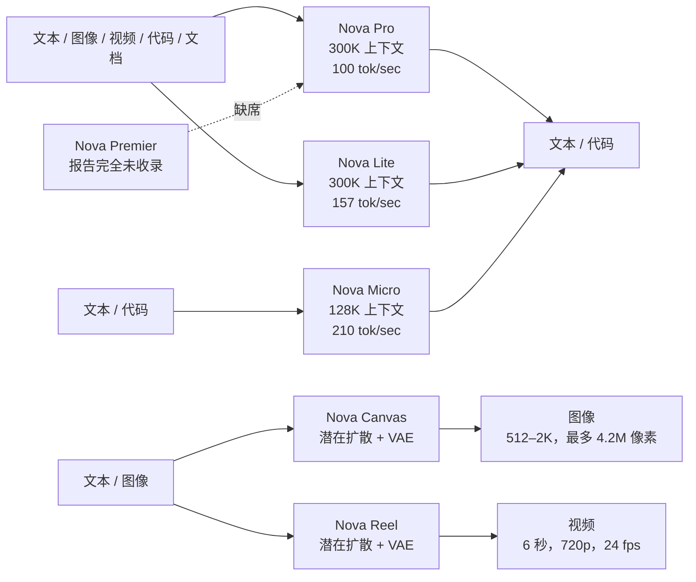
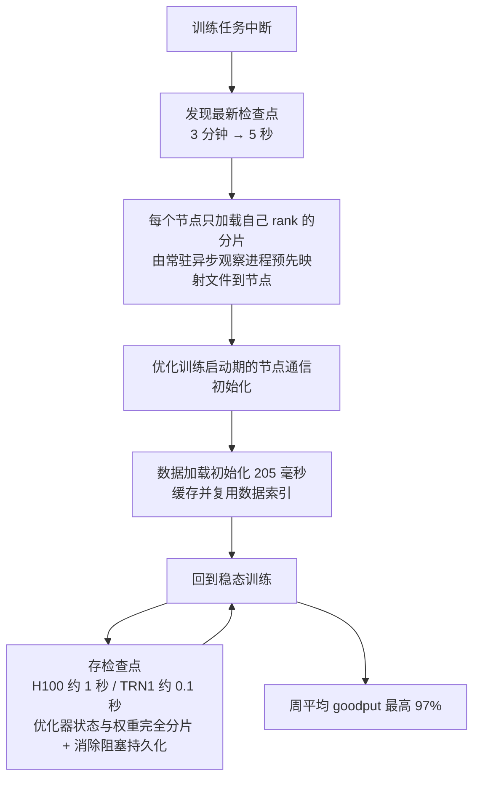

# Amazon Nova 家族报告：当一份技术报告不再讲架构，它到底在证明什么

<!-- release-date: 2024-12-03 -->

> 本文依据 Amazon Artificial General Intelligence 发布的 **The Amazon Nova Family of Models: Technical Report and Model Card**，即本地 `papers/Amazon/Nova.pdf`，arXiv:2506.12103v1，48 页、10 图，全文只有 v1 一个版本。页码均指这份 PDF 自身的页码。正文严格区分三层：**报告写了什么**、**我们如何解释或验算它**、**哪些是外部资料补充**。
>
> 读之前要先知道：**这份报告不描述架构，也不描述训练过程。** 关于模型本体它只给了 §1 的一段话——一个 Transformer，支持 200 多种语言（其中 15 种重点），后训练经过 SFT、奖励模型、DPO 与 PPO（PDF p.3）。参数量、层数、词表、训练 Token 总量、并行策略、算力与时长一项都没有给，文末「报告没写的清单」逐条列出了这些空白。篇幅实际花在评测（§2–§4）、Responsible AI（§5）与训练基础设施（§6）上。

## 阅读前的最小词汇表

后面反复出现的词，先用人话过一遍。

- **Token（词元）**：模型读写文本时的基本小块。
- **智能档位（intelligence tier）**：报告自己的组织单位。它不说「多少 B 参数」，而是说「在它所属的那个档位里第一或最快」。这是全文最重要的一个概念，后面单独讲。
- **TTFT / OTPS / Total Response Time**：首 Token 延迟、每秒输出 Token 数、从提交提示到生成结束的总时长。前两个是体验，最后一个是账单。
- **多模态理解 vs 多模态生成**：Pro、Lite、Micro 只**理解**图像与视频，输出永远是文本；Canvas、Reel 才**生成**图像与视频。它们不是一类模型，只是被放进同一个家族图。
- **潜在扩散模型（latent diffusion）与 VAE**：Canvas 与 Reel 的机制。先用 VAE 把图像或视频帧压成一小张「潜变量」，扩散模型只在这张潜变量上反复去噪，最后由 VAE 解码器还原成像素。
- **SFT / RM / RLHF / DPO / PPO**：监督微调、奖励模型、基于人类反馈的强化学习、直接偏好优化、近端策略优化。报告只列名字与引用编号。
- **BFCL 的 AST 与 Execution**：函数调用评测的两种判法。AST 比对函数名与参数签名是否写成人类给定的那棵树；Execution 不看签名，真的把调用打出去，比对返回值。
- **Goodput**：一段时间里真正推进训练的份额，扣掉崩溃、重启、存盘等不产出进展的时间。
- **MTTR（Mean Time to Restart）**：从上一次成功检查点到训练回到稳态的平均恢复时间。
- **激活检查点（activation checkpointing）与重算**：训练时不保存全部中间激活，反向需要时再算一遍，用算力换显存。
- **红队（red teaming）与 false refusal**：主动构造对抗提示去试模型会不会越界；false refusal 是「正常请求被模型误判为有害而拒答」。
- **C2PA 与不可见水印**：前者是内容溯源的元数据标准，后者嵌在像素里。报告两个都做了。
- **置信区间（CI）**：一次评测分数因样本有限而带的不确定宽度。报告给了公式，本文会用它反推样本量。

## 一句话先说清

Amazon Nova 这份报告不是「我们怎么训出一个模型」，而是「**你凭什么按档位和价格买它，以及我们替你扛了哪些风险**」。

它真正对外交付的是四件事：

- 用 **智能档位 × 生成速度** 取代参数量，作为整个家族的组织轴；每一张精度表里都塞进一列 tok/sec（PDF p.6、7、8、12）；
- 用 **方法学的透明** 去补机制的不透明：置信区间公式、每个基准的完整提示词、哪些分是亚马逊自己测的、测对手走的是哪条 API，全都写出来（PDF p.5、6、30–38）；
- 用 **过程清单** 而不是结果分数来交付安全：八个维度、双审核模型、307 种攻击技术、四家外部机构与它们各自的题量（PDF p.17–21）；
- 只在 **训练基础设施** 一节给出真正的工程数字，因为对一家自研芯片的公司来说，管线的可靠性与性价比本身就是产品卖点（PDF p.21–22）。

所以这份报告最值得记住的一句话是：

> **当架构成为商业秘密时，可被审计的就只剩方法学。谁把口径写得更细，谁的分数才更值钱。**

## 全景：家族地图，以及这张表里有多少空格

报告没有架构图，但它有一张家族总览——Figure 1（PDF p.1）。这张图承载了整份报告关于模型规格的全部信息，先照它重画一遍。它是**模态与档位的机制示意**，不含任何实测时长。

模态、上下文与生成速度分别读自 Figure 1（PDF p.1）、§2.3（PDF p.10）与 Table 1 的 tok/sec 列（PDF p.6）；Canvas 与 Reel 的机制与输出规格读自 §1.2（PDF p.3–4）。虚线那条是本文加的，用来标出一个**缺席**：新闻稿里的家族第四员，在这份报告里一个字都没有。

同一张图的信息，落成可搜索的表格：

| 模型 | 输入模态 | 输出模态 | 上下文 | 生成速度（tok/sec） | 参数量 | 架构与训练配方 |
|---|---|---|---|---:|---|---|
| Nova Pro | 文本、图像、视频、代码、文档 | 文本、代码 | 300K（PDF p.10） | 100（PDF p.6） | 报告未给 | 报告未给 |
| Nova Lite | 文本、图像、视频、代码、文档 | 文本、代码 | 300K（PDF p.10） | 157（PDF p.6） | 报告未给 | 报告未给 |
| Nova Micro | 文本、代码 | 文本、代码 | 128K（PDF p.10） | 210（PDF p.6） | 报告未给 | 报告未给 |
| Nova Canvas | 文本、图像（可选参考图与掩码） | 图像 | 不适用 | 不适用 | 报告未给 | 潜在扩散 + VAE（PDF p.4） |
| Nova Reel | 文本、图像 | 视频 | 不适用 | 不适用 | 报告未给 | 潜在扩散 + VAE（PDF p.4） |
| Nova Premier | **报告完全未收录** | — | — | — | — | — |

这张表和正文有一处对不上，值得指出。§1.1 写的是 Pro 与 Lite「接受文本、图像、文档与视频作为输入，**生成文本作为输出**」，并把 Micro 称作「text-only model」（以上均 PDF p.3）；而 Figure 1 给这三个模型都画了一条指向「Code」的输出箭头，还给 Micro 画了一条「Code」输入箭头（PDF p.1）。**图比正文多说了一个模态，报告没有澄清哪个为准。** 另外 Figure 1 在 Pro、Lite、Micro 三个框上各带一个「A 除以 x」形状的小图标，全文没有任何地方解释它表示什么（PDF p.1、3）。这两处都属于报告留下的空白，本文不替它补。

这张表里有三件事必须当场说出来。

**第一，Nova Premier 不在这份报告里。** 摘要只列 Pro、Lite、Micro、Canvas、Reel 五个（PDF p.1），正文没有给 Premier 的任何规格或分数。但 2024-12-03 的官方新闻稿把 Premier 列为家族第四员，并写明「Micro、Lite、Pro 今日正式可用，Premier 将在 2025 年第一季度提供」。**外部补充**：<https://press.aboutamazon.com/2024/12/introducing-amazon-nova-a-new-generation-of-foundation-models>。也就是说，报告覆盖的是「首发当天能买到的那三个理解模型 + 两个生成模型」，最贵的那一档留白。

**第二，「报告未给」不是遗漏，是选择。** 与 Pro、Lite、Micro 有关的机制性信息，全文合计就是一段话（PDF p.3）：基于 Transformer 架构、预训练用大规模多语与多模态混合数据、数据来自授权与专有与开源与公开可得四类、整理了 200 多种语言并对 15 种重点整理、预训练后迭代经过 SFT 与奖励模型训练、最后用 DPO 与 PPO 对齐。就这些。没有数字，没有阶段划分，没有配比。

**第三，价格档位也不在报告里。** 全文没有任何一个价格数字，只有「industry-leading price performance」这类定性句（PDF p.1、3）。**外部补充**：同日新闻稿给的是相对量——Micro、Lite、Pro 比各自档位里表现最好的模型「至少便宜 75%」；绝对单价在 AWS Bedrock 定价页，会随时间变动，本文不抄一个可能已经过期的数字进来。

把这三条并起来看，你会得到一个比任何单项都硬的判断：**这份文件能支撑「选哪一档」的决策，不能支撑「怎么复现」或「按什么成本训」的决策。**

## 核心设计一：把「档位 × 速度」做成坐标系，而不是把参数量做成坐标系

### 旧问题：技术报告默认用规模说话

常见的大模型报告开篇就是参数量、层数、专家数、Token 总量。这套语言对研究者有用，因为它对应可复现的变量。但对一个云上按 Token 计费的模型目录来说，客户真正问的是三件事：**我这类任务归哪一档、这一档里谁最快、每一千 Token 多少钱。**

### 新设计：删掉规模轴，换成档位与速度两轴

报告的做法很干净。它从不给规模，改用「in their respective intelligence tiers」这个短语来限定每一个「第一」的说法（PDF p.3）。更关键的是，它把速度塞进了精度表：**Table 1、Table 2、Table 3、Table 7 都在第一列放 tok/sec**，并且每张图片下方都注明这列数字「reproduced from Section 2.5」（PDF p.6、7、8、12）。

这个排版选择值得注意。通常速度放在最后一节，跟精度分开，读者要自己跨表对齐。Nova 报告把它提到与 MMLU 同一行，等于宣称：**速度是能力的一部分，不是部署附录。**

于是家族内部出现了报告里唯一一条干净的单调关系（数据读自 Table 1，PDF p.6）：

| 模型 | tok/sec | MMLU | GPQA | MATH | IFEval |
|---|---:|---:|---:|---:|---:|
| Nova Micro | 210 | 77.6 | 40.0 ±4.5 | 69.3 ±1.3 | 87.2 ±2.3 |
| Nova Lite | 157 | 80.5 | 42.0 ±4.6 | 73.3 ±1.2 | 89.7 ±2.1 |
| Nova Pro | 100 | 85.9 | 46.9 ±4.6 | 76.6 ±1.2 | 92.1 ±1.8 |

**每变慢一点，精度就高一截。** Micro 到 Pro 是 2.1 倍速度差换 8.3 个 MMLU 点（PDF p.6）。这就是「档位」的实际含义：不是参数量的档位，而是**延迟-精度曲线上的工作点**。

### 收益、代价与边界

收益是决策效率。一个工程师读完 §2 就能回答「我的分类任务该用哪个」，不需要先理解架构。

代价是**这份报告因此不可归因**。你无法知道 Pro 比 Micro 强是因为更大、数据更多、还是对齐更好——三个变量都没公开，被合并成了「档位」。

边界也很清楚：档位这个词在报告里没有定义。谁属于哪一档、按什么标准分档，全是作者的判断。**这是「作者观察」，不是「实验支持」。**

### 可迁移启发

> **如果你的交付物是服务而不是论文，那你的「规格表」应该是调用方能直接用来选型的轴。**

对自己的项目，这条可以立刻用：给内部模型目录写文档时，把「延迟 / 单价 / 该任务类型上的分数」三列并排放，比写「13B 激活」有用得多。参数量对选型的人几乎是无信息的。

## 核心设计二：用方法学透明，去补机制不透明

这是这份报告最被低估、也最值得工程师偷师的一节。

### 旧问题：自报分数不值钱

一家公司说自己的模型 MMLU 85.9，凭什么信？常见答案要么「我们的卡没写」，要么「我们的表不标提示词」。读者只能选择整体相信或整体不信。

### 新设计：把可审计性一条条补上

报告做了五件具体的事。

**1. 给出误差棒，并给出算误差棒的公式。** §2 开头（PDF p.5）写明：当结果是二元得分的简单平均时，假设样本服从高斯分布，把 95% 置信区间近似为——它要算的是「这次测出来的分数可能上下漂多少」：

$$
CI(S)=1.96\times\sqrt{\frac{S\times(1-S)}{N}}
$$

其中 $S$ 是该基准上测得的分数，$N$ 是样本量，$1.96$ 是 95% 置信度下标准正态的双侧分位数（PDF p.5，式 1）。

**2. 标出哪些分是自己测的。** Table 1 到 Table 7 用上标 $M$ 标「measured by us」，脚注 2 进一步说明测量通道：Claude 与 Meta 的模型走 Bedrock API，OpenAI 与 Gemini 的走各自 API，且都是 Nova 训练完成后测的（PDF p.5）。这一句很关键，因为它同时告诉你：**对照模型的分数不是从对手的报告抄的，而是亚马逊在对手的服务上重跑的。**

**3. 标出引用的是「最高公开分」。** §2.1.1 明说：可用的情况下，我们引用各模型官方技术报告与官网里的**最高**公开数字（PDF p.7）。

**4. 把每个基准的提示词全文放进附录。** 附录 B 占了整整九页（PDF p.30–38），MMLU、ARC-C、DROP、IFEval、BBH、Flores、MMMU、ChartQA、VATEX、EgoSchema、VisualWebBench、FinQA、CRAG 的模板逐条给出，连 DROP 的 6 个示例、BBH 每个子任务的收尾指令都写全。CRAG 的判分提示词也全文给出——它让一个 LLM 当阅卷人，用的模型是 `gpt-4-turbo-2024-04-09`（PDF p.12、38）。

**5. 把运行时性能交给第三方。** §2.5 的三张柱状图数据来自 Artificial Analysis，一个独立的模型与托管商基准机构，取数时点标到 2024-11-29（PDF p.13–14）。

### 我们如何验算它：用误差棒反推它没写的样本量

式 1 里 $N$ 是样本量，而报告只在文字描述里给出部分基准的 $N$。把式 1 反过来解出 $N$，就能检查它自洽不自洽。**以下是本文自己的算术，不是报告内容。**

| 基准 | 报告自述的 $N$ | Nova Pro 分数 | 式 1 算出的 CI | 表里印的 CI |
|---|---:|---:|---:|---:|
| GSM8K | 1,319（PDF p.5） | 94.8 | 1.20 | ±1.2 ✓ |
| CRAG | 2,706（PDF p.12） | 50.3 | 1.88 | ±1.9 ✓ |
| HumanEval | 164（PDF p.12） | 89.0 | 4.79 | ±4.8 ✓ |
| FinQA | 8,281（PDF p.12） | 77.2 | 0.90 | ±0.9 ✓ |
| ChartQA | 2,500（PDF p.7） | 89.2 | 1.22 | ±1.2 ✓ |
| LVBench | 1,549（PDF p.10） | 41.6 | 2.45 | ±2.5 ✓ |

六项全部对上，误差在四舍五入内。**这说明式 1 不是装饰，它真的被用来生成表里那些 ± 号。** 这条验算的价值在于：以后你读到任何带 CI 的表格，都能立刻反解出对方没写的 $N$，从而判断一个「提升 2 分」是不是噪声。

顺着这个办法，还能挖出两件报告没直说的事。

**第一，MATH 用的是 5,000 题全集，不是同行常用的 500 题子集。** Nova Pro 的 MATH 是 76.6 ±1.2，反解出 $N\approx 4782$，与报告自述的「MATH5k set」（PDF p.5）一致；若 $N=500$，同一个分数的 CI 应当是 ±3.7 而不是 ±1.2。**所以这个 MATH 分不能和别家报告的 MATH500 分数直接横比。** 这是本文从数字里读出来的，报告自己没有提醒。

**第二，IFEval 的统计单位是「指令」不是「提示」。** 报告自述 IFEval 有 541 条提示（PDF p.5），但 Nova Pro 的 92.1 ±1.8 反解出 $N\approx 863$，明显大于 541，与表头写的「instruction-level loose accuracy」（PDF p.6）吻合——分母是提示里那条可验证指令的条数。表头其实已经说了，只是要算一遍才会真的注意到。

也有对不上的地方，必须如实写下来：**ARC-C 的 ±1.3 反解出 $N\approx 1121$，DROP 的 ±0.7 反解出 $N\approx 9775$，EgoSchema 的 ±5.4 反解出 $N\approx 265$**，报告没有给这三个基准的样本量，无法核实；其中 DROP 报的是 F1 分数，按式 1 自己声明的适用条件（「二元得分的简单平均」）本就不该套这个 CI，但表里照印了。**这几处本文保留不确定性，不替它圆。**

### 代价与边界：可审计的是口径，不是结论

方法学透明解决的是「这个数字怎么来的」，不解决「这个数字对不对」。这份报告里仍有几处会咬到读者的地方，逐条列：

- **对照口径不齐。** Table 1 在每组模型下面单独印一行提示方式。Nova 三兄弟的 ARC-C 是 0-shot、DROP 是 6-shot CoT、GSM8K 是 0-shot CoT；而 Claude 组的 ARC-C 是 25-shot、Gemini 组的 GSM8K 是 11-shot、MATH 是 4-shot（PDF p.6）。**同一个格子里，Nova 和对手用的提示预算并不相同。** 表格诚实地把这件事印出来了，但只有逐行读表头的人才看得到。
- **一处自相矛盾。** §2.1.2 正文说 MMMU「我们使用 CoT 提示」（PDF p.7），而 Table 3 的备注 (C) 写的是「除 Amazon Nova 之外所有模型都用 CoT」（PDF p.8）。两处说法相反，报告没有澄清。这直接影响 Nova Pro 的 MMMU 61.7 与 Claude 3.5 Sonnet 70.4 能不能比。
- **另一处自相矛盾。** §2.1.1 正文说 DROP 用 0-shot CoT（PDF p.5），Table 1 的口径行与附录 B 的模板都说是 6 个示例（PDF p.6、30）。这里附录与表格一致，正文是错的。
- **「四个领域」只写了三个。** §2.4 开头说「我们选了四个领域」（PDF p.11），紧接着列出的是软件工程、金融分析、RAG 三个。
- **「新 SOTA」的范围要收窄。** §2.2 开头宣称 Pro 与 Lite 在这些 agentic 基准上「创下新的最先进水平」（PDF p.9）。但同页 Table 4 的 BFCL 总分上，Nova Pro 68.4 低于 GPT-4o（Aug）的 68.9，Live overall 一列 Nova Pro 71.5 低于 GPT-4o 的 75.4 与 Gemini 1.5 Pro 的 74.3，多轮一列 Nova Micro 只有 15.5 而 Nova Lite 是 50.3（PDF p.9）。**这句话只对 §2.2.2 的三个多模态 agent 基准成立**（那里 Nova Pro 在三项上都排第一，PDF p.10）；放在 §2.2 这个包含文本 BFCL 的标题下，就过头了。
- **对照模型的身份有捷径，但报告写明了。** Table 4 备注 (A)：Llama 3.2 11B 与 90B 的文本结果，直接借用排行榜上 Llama 3.1 8B 与 70B 的条目，理由是「共享同一个文本 LLM」（PDF p.9）。这解释了 Table 1 里 Llama 3.2 11B 与 Llama 3.1 8B 有五行数字完全相同（PDF p.6）——不是笔误，是同一个文本塔。**但同页 GPQA 那格两行分别是 32.8 与 30.4，说明这一列是另测的，两行并未完全同源。** 这类细节只能靠逐页看原表发现。

### 可迁移启发

> **公开不了机制的时候，把口径公开到底，是性价比最高的信任建设。**

具体可搬的四条：给每个自报分数配一个能反算的误差棒；把提示词全文放进附录；明确标出哪些外部数字是你重跑的、哪些是抄来的、重跑走的是哪条通道；把「引用最高公开分」这件事写进正文而不是留给读者猜。这四条几乎不泄露任何商业机密，却能显著降低别人质疑你的成本。

## 报告给出的六个评测面

前面讲的是「怎么测」。这里把「测出了什么」按报告的六张表转成原生表格，Nova 行与对照行分开，避免一张表宽到读不动。

### 1. 核心文本能力（Table 1，PDF p.6）

| 模型 | tok/sec | MMLU | ARC-C | DROP | GPQA | MATH | GSM8K | IFEval | BBH |
|---|---:|---:|---:|---:|---:|---:|---:|---:|---:|
| Nova Pro | 100 | 85.9 | 94.8 ±1.3 | 85.4 ±0.7 | 46.9 ±4.6 | 76.6 ±1.2 | 94.8 ±1.2 | 92.1 ±1.8 | 86.9 |
| Nova Lite | 157 | 80.5 | 92.4 ±1.5 | 80.2 ±0.8 | 42.0 ±4.6 | 73.3 ±1.2 | 94.5 ±1.2 | 89.7 ±2.1 | 82.4 |
| Nova Micro | 210 | 77.6 | 90.2 ±1.7 | 79.3 ±0.8 | 40.0 ±4.5 | 69.3 ±1.3 | 92.3 ±1.4 | 87.2 ±2.3 | 79.5 |

Nova 组的提示口径（PDF p.6 表内行）：MMLU 0-shot CoT、ARC-C 0-shot、DROP 6-shot CoT、GPQA 0-shot CoT、MATH 0-shot CoT、GSM8K 0-shot CoT、IFEval 0-shot、BBH 3-shot CoT。

对照组的代表数字（PDF p.6）：Claude 3.5 Sonnet (Oct) 57 tok/sec、MMLU 89.3、GPQA 58.0、MATH 78.3；GPT-4o 163、MMLU 88.7、GPQA 48.4、MATH 76.6；Gemini 1.5 Pro (002) 58、MMLU 85.9、GPQA 55.1、MATH 86.5；Llama 3.2 90B 40、MMLU 86.0、GPQA 46.7。

**读法**：Nova Pro 在 MMLU 上与 Gemini 1.5 Pro (002) 同为 85.9，但比 Claude 3.5 Sonnet 低 3.4；GPQA 上 Nova Pro 46.9 明显低于 Claude 的 58.0 与 Gemini 的 55.1；MATH 上 Nova Pro 76.6 与 GPT-4o 的 76.6 完全相同（PDF p.6）。报告的说法是 Nova Micro 与 Lite 在「其档位」内多项第一（PDF p.3）——按表看，Micro 的 210 tok/sec 在整张表里仅次于 Gemini 1.5 Flash 8B 的 283，而它 MMLU 77.6 高于后者的 68.1（PDF p.6）。**「档位内第一」这句在这个格子上是站得住的。**

### 2. 翻译（Table 2，PDF p.7）

| 模型 | tok/sec | en→Set1 spBleu | en→Set1 COMET22 | Set1→en spBleu | Set1→en COMET22 |
|---|---:|---:|---:|---:|---:|
| Nova Pro | 100 | 43.4 | 89.1 | 44.4 | 89.0 |
| Nova Lite | 157 | 41.5 | 88.8 | 43.1 | 88.8 |
| Nova Micro | 210 | 40.2 | 88.5 | 42.6 | 88.7 |
| Claude 3.5 Sonnet (Oct) | 57 | 42.5 $^{M}$ | 89.4 $^{M}$ | 43.5 $^{M}$ | 89.1 $^{M}$ |
| GPT-4o | 163 | 43.1 $^{M*}$ | 89.2 $^{M*}$ | 43.9 $^{M*}$ | 89.0 $^{M*}$ |
| Gemini 1.5 Pro (002) | 57 | 43.0 $^{M*}$ | 89.1 $^{M*}$ | 45.6 $^{M*}$ | 89.1 $^{M*}$ |

Set1 是 {de, es, fr, it, pt, ja, ar, hi, ru, nl, tr, he, ko, zh} 十四种语言，Flores200 每条句子平均 21 词，0-shot（PDF p.5、7）。带 $*$ 的行用的是另一套提示，模板在附录 B.1。

**读法**：这一项 Nova Pro 的 spBleu 43.4 是表里最高，但 COMET22 89.1 与 Claude 的 89.4、GPT-4o 的 89.2 的差距，远小于 GPQA 那种量级——**翻译是这份报告里 Nova 最接近「全面第一」的一项，也是最不依赖规模的一项。** 另外注意 Table 2 把 Gemini 1.5 Pro 的速度印成 57，而 Table 1 与 Figure 3 都是 58（PDF p.6、7、14），这类小不一致报告没有解释。

### 3. 多模态理解（Table 3，PDF p.8）

| 模型 | tok/sec | MMMU (CoT) | ChartQA 放宽准确率 | DocVQA ANLS | TextVQA | VATEX CIDEr | EgoSchema |
|---|---:|---:|---:|---:|---:|---:|---:|
| Nova Pro | 100 | 61.7 ±3.2 | 89.2 ±1.2 | 93.5 | 81.5 | 77.8 | 72.1 ±5.4 |
| Nova Lite | 157 | 56.2 ±3.2 | 86.8 ±1.3 | 92.4 | 80.2 | 77.8 | 71.4 ±5.4 |
| Claude 3.5 Sonnet (Oct) | 57 | 70.4 ±3.0 | 90.8 ±1.1 | 94.2 | 61.7 $^{M}$ | - | - |
| Gemini 1.5 Pro (001) | 58 | 65.9 ±3.1 $^{E}$ | 87.2 ±1.3 | 93.1 $^{B}$ | 78.7 | 64.6 $^{A}$ | 72.2 ±5.4 |
| GPT-4o (May) | - | 69.1 ±3.0 | 85.7 ±1.4 | 92.8 | 77.2 $^{D,M}$ | - | 72.2 ±5.4 |
| Llama 3.2 90B | 40 | 60.3 ±3.2 | 85.5 ±1.4 | 90.1 | 80.7 $^{M}$ | - | - |

备注（PDF p.8）：(A) 4-shot；(B) 用了外部 OCR；(C) 除 Nova 外所有模型都用 CoT；(D) 指 GPT-4o (Nov)；(E) 实为 Gemini 1.5 Flash/Pro (002)；(M) 由亚马逊自己测。

**读法**：报告说 ChartQA 与 VATEX 上 Nova「排第一或第二」（PDF p.8）。核对下来 ChartQA 上 Nova Pro 89.2 低于 Claude 的 90.8，是第二；VATEX 上 77.8 是表内最高（第二名是 Gemini 1.5 Pro 的 64.6，差 13 点）。**TextVQA 才是真正的大跨度**：Nova Pro 81.5 对 Claude 3.5 Sonnet 的 61.7，差近 20 点，而 Claude 那格是亚马逊自己测的（PDF p.8）。EgoSchema 上 Nova Pro 72.1 与 Gemini 1.5 Pro 与 GPT-4o 的 72.2 实质打平（PDF p.8）。

### 4. Agentic（Table 4 与 Table 5，PDF p.9、10）

文本函数调用 BFCL v3，取 2024-11-17 那次榜单快照（PDF p.9）：

| 模型 | 总分 | 延迟（秒） | 非实时 AST | 非实时 execution | 实时总分 | 多轮总分 | 相关性 | 不相关性 |
|---|---:|---:|---:|---:|---:|---:|---:|---:|
| Nova Pro | 68.4 | 1.0 | 90.1 | 89.8 | 71.5 | 45.1 | 95.1 | 65.1 |
| Nova Lite | 66.6 | 0.6 | 87.5 | 86.4 | 66.0 | 50.3 | 97.6 | 49.1 |
| Nova Micro | 56.2 | 0.5 | 87.2 | 89.7 | 67.4 | 15.5 | 87.8 | 57.6 |
| Claude Sonnet 3.5 (Jun) | 61.3 | 3.9 | 70.0 | 66.3 | 74.7 | 40.0 | 68.3 | 74.6 |
| Gemini 1.5 Pro (002) | 59.8 | 3.0 | 88.0 | 91.4 | 74.3 | 16.3 | 75.6 | 75.1 |
| GPT-4o (Aug) | 68.9 | 1.5 | 85.9 | 85.6 | 75.4 | 45.3 | 63.4 | 82.9 |

多模态 agent 三项（PDF p.10）：

| 模型 | VisualWebBench 综合 | MM-Mind2Web 步骤准确率 | GroundUI-1K |
|---|---:|---:|---:|
| Nova Pro | 79.7 | 63.7 | 81.4 |
| Nova Lite | 77.7 | 60.7 | 80.2 |
| Claude 3.5 Sonnet (Oct) | 76.7 $^{M}$ | 61.6 $^{M}$ | 16.3 |
| GPT-4o (Nov) | 77.5 $^{M}$ | 55.0 $^{M}$ | 13.4 $^{M}$ |
| Gemini 1.5 Flash (002) | 76.1 $^{M}$ | 46.2 $^{M}$ | 59.9 $^{M}$ |

**读法**：GroundUI-1K 是这份报告里最夸张的一个差——Nova Pro 81.4，Claude 3.5 Sonnet 16.3，GPT-4o 13.4（PDF p.10）。这不是「强一点」，是**任务形态不匹配**：GroundUI-1K 要求模型给一个网页截图输出目标 UI 元素的二维坐标框（PDF p.9）。**本文的推断是**这一代对照模型没有被训成会吐坐标的输出接口，报告本身没有解释这个差距的成因。**所以这个 5 倍差读成「Nova 的视觉定位能力强 5 倍」是错的，读成「屏幕操作类 agent 需要专门训 grounding 输出」才是对的。** 反过来，BFCL 的「不相关性」一列 Nova Lite 只有 49.1、Nova Pro 65.1，而 GPT-4o 82.9、Gemini 1.5 Flash 75.7（PDF p.9）——这一列测的是「手上没有合适工具时会不会老实不调用」，Nova 在这里明显偏弱。**一个模型可以同时是 grounding 第一和弃调倒数。** 这是全篇最值得记住的一个对照。

### 5. 长上下文（Figure 2 与 Table 6，PDF p.10–11）

上下文上限：Micro 128K、Lite 300K、Pro 300K（PDF p.10）。

Figure 2 是三张「文本大海捞针」热力图，横轴是上下文长度（Micro 32K/64K/128K；Lite 与 Pro 32K/64K/128K/200K/256K/300K），纵轴是针的位置（10%–100%，10 档），色标 0 到 100。**报告没有给这张图的任何数字**，只能读色：Nova Pro 的 30 格基本全部饱和在最深色；Nova Micro 在 128K、位置 90% 那一格明显偏浅；Nova Lite 在 200K/40% 与 256K/30–40% 几格偏浅。而正文写的是「一致地在任何深度上取得出色表现」（PDF p.11）。**读自图 2，无数字标注，本文只把它当作「图与文之间有可见张力」的证据，不当作实测结论。**

| 模型 | SQuALITY ROUGE-L | LVBench 准确率 |
|---|---:|---:|
| Nova Pro | 19.8 ±8.7 | 41.6 ±2.5 |
| Nova Lite | 19.2 ±8.6 | 40.4 ±2.4 |
| Nova Micro | 18.8 ±8.6 | - |
| Claude 3.5 Sonnet (Jun) | 13.4 ±7.5 | - |
| Gemini 1.5 Pro (001) | - | 33.1 ±2.3 |
| GPT-4o | 18.8 ±8.6 | 30.8 ±2.3 |

（PDF p.11）

**读法**：SQuALITY 的 ±8.7 是这份报告里最宽的误差棒——它提醒长文本摘要评测的样本量很小，**19.8 对 18.8 这种差完全是噪声**，Nova 与 GPT-4o 在这一项上无法区分。LVBench 上 Nova Pro 41.6 高于 Gemini 1.5 Pro 的 33.1 与 GPT-4o 的 30.8，且这两个对照分来自官方排行榜（PDF p.11）。

### 6. 功能专长与运行时（Table 7 与 Figure 3，PDF p.12、14）

| 模型 | tok/sec | HumanEval pass@1 | FinQA | CRAG |
|---|---:|---:|---:|---:|
| Nova Pro | 100 | 89.0 ±4.8 | 77.2 ±0.9 | 50.3 ±1.9 |
| Nova Lite | 157 | 85.4 ±5.4 | 73.6 ±0.9 | 43.8 ±1.9 |
| Nova Micro | 210 | 81.1 ±6.0 | 65.2 ±1.0 | 43.1 ±1.9 |
| Claude 3.5 Sonnet (Oct) | 57 | 93.7 ±3.7 | 77.3 ±0.9 $^{M}$ | 52.6 ±1.8 $^{M}$ |
| GPT-4o | 163 | 90.2 ±4.6 | 71.1 ±1.0 $^{M}$ | 52.0 ±1.9 $^{M}$ |

（PDF p.12）

CRAG 用的是官方仓库的检索配方：BeautifulSoup 清洗 HTML、切成不超过 1000 字符的句子块、用 `sentence-transformers/all-MiniLM-L6-v2` 编码、取最相似 20 块作上下文，判分由 LLM 完成（PDF p.12）。**注意这里的检索器是一个 6 层的小句向量模型**——CRAG 分数很大程度上被这个固定检索器封顶，Nova 与对手用的是同一个。这是报告写得比较实在的一处：它没有把 CRAG 说成「Nova 的 RAG 能力」，而是说成在这个固定管线下的准确率。

运行时三指标，全部读自 Figure 3 的柱顶数据标签（PDF p.14，1000 输入 / 100 输出，Artificial Analysis 2024-11-29）：

| 模型 | TTFT（秒，越低越好） | OTPS（越高越好） | 总响应时长（秒，越低越好） |
|---|---:|---:|---:|
| Nova Micro | 0.32 | 210 | 0.8 |
| Nova Lite | 0.37 | 157 | 1.0 |
| Nova Pro | 0.38 | 100 | 1.4 |
| Gemini 1.5 Flash 8B (001) | 0.35 | 283 | 0.7 |
| GPT-4o | 0.42 | 163 | 1.2 |
| Claude 3.5 Sonnet (Oct) | 0.87 | 57 | 2.7 |
| Llama 3.1 405B | 0.72 | 29 | 4.0 |
| Gemini 1.5 Pro (Sep) | 0.98 | 58 | 2.8 |

（PDF p.14；完整 17 个模型见原图）

**读法**：Nova Pro 的 TTFT 0.38 秒比 GPT-4o 的 0.42 略快，但 OTPS 只有 100 对 163，于是总时长 1.4 对 1.2 反而更慢（PDF p.14）。**首 Token 快不等于端到端快。** 这三个指标里只有 OTPS 直接进账单，而产品页最爱宣传的是 TTFT。这是运行时评测里非常常见的一个偷换，报告自己把三张图并排放，反而让读者看得清。

## Canvas 与 Reel：同一个家族里的另一套评测学

§3 与 §4 的方法学和 §2 完全不是一套，值得单独看，因为它展示了**当没有客观判分器时怎么办**。

**自动指标这一路**（PDF p.15）：Canvas 用 ImageReward（在 MSCOCO-2014 验证集随机抽 10k 条提示上算）与 TIFA（用 TIFA-v1.0 预选的 4k 条提示，通过 VQA 检查图文一致性）。

| 模型 | TIFA | ImageReward |
|---|---:|---:|
| Amazon Nova Canvas | 0.897 | 1.250 |
| DALL.E 3 | 0.863 | 1.052 |
| Stable Diffusion 3.5 Large | 0.891 | 1.082 |
| Stable Diffusion 3 Medium | 0.881 | 0.952 |
| Flux Pro 1.0 | 0.875 | 1.075 |
| Flux Schnell | 0.882 | 0.999 |

（PDF p.15）

**人评这一路**（PDF p.15–16）：约 1,000 条提示，混合 MSCOCO、Drawbench、OpenParti、DALL.E 3 Eval、DOCCI；单盲、图片顺序随机；两个维度（图文对齐、整体偏好）；外包给第三方标注商并先做标注指南培训；Nova 侧用随机种子、统一 1k×1k 分辨率；**任一侧被安全过滤器拦下而没出图的提示，直接丢掉不给标注员看**。

| Nova Canvas 对 | 维度 | 胜率 | 平率 | 负率 |
|---|---|---:|---:|---:|
| DALL.E 3 | 整体偏好 | 54.5 | 6.4 | 39.1 |
| DALL.E 3 | 指令跟随 | 39.4 | 22.5 | 38.1 |
| Imagen 3 | 整体偏好 | 48.2 | 5.3 | 46.5 |
| Imagen 3 | 指令跟随 | 38.4 | 28.1 | 33.5 |

（PDF p.16）

**这里有个诚实的细节值得单独夸**：换成指令跟随维度，Nova 对 DALL.E 3 的优势从 54.5/39.1 塌到 39.4/38.1，几乎打平，平局率从 6.4% 涨到 22.5%（PDF p.16）。报告没有把这一行藏起来。**「整体更好看」和「更听话」是两件事，而且后者的差距小得多。**

Reel 一路线上：约 700 条提示、6 大类，覆盖相机运动、动态属性变化、运动绑定三类难点；单盲成对比较，720p、不同随机种子；每对比较由 3 名标注员独立判、多数投票定结果；每批 5–10% 由专家抽检（PDF p.16–17）。

| Nova Reel 对 | 维度 | 胜率 | 平率 | 负率 |
|---|---|---:|---:|---:|
| Runway Gen3 Alpha | 视频质量 | 56.4 | 9.9 | 33.7 |
| Runway Gen3 Alpha | 视频一致性 | 67.0 | 9.1 | 23.9 |
| Luma 1.6 | 视频质量 | 51.1 | 3.4 | 45.5 |
| Luma 1.6 | 视频一致性 | 74.7 | 5.1 | 20.2 |

（PDF p.17）

**读法**：一致性上的优势（67.0、74.7）远大于质量上的优势（56.4、51.1），而对 Luma 1.6 的质量项 51.1/45.5 已经接近打平（PDF p.17）。**Nova Reel 真正的差异化在时序稳定，不在单帧好看。** 报告没有解释为什么，本文也不猜。

还有一处必须点出来：Canvas 与 Reel 的**人评对手和自动指标对手不是同一批**。自动指标比的是 DALL.E 3、SD3.5、Flux；人评比的是 DALL.E 3、Imagen 3（PDF p.15–16）。而 Imagen 3 没有出现在自动指标表里，SD3.5 Large 的 TIFA 0.891 与 Nova 的 0.897 只差 0.006（PDF p.15）。**两套口径各自选了各自最有利的那组对照，这是所有厂商自报生成模型评测的通病，这份报告并没有例外。**

## Responsible AI：这才是标题里那张「模型卡」

§5 占了 5 页（PDF p.17–21），是全文除评测外最厚的部分。它的结构是三段式：定义目标 → 保证达标的手段 → 评测与红队。

**八个维度**（Table 11，PDF p.17–18）：Fairness、Explainability、Privacy and security、Safety、Controllability、Veracity and robustness、Governance、Transparency，每个给一句定义。

**手段这一层有两条值得单独说**（PDF p.18–19）：

1. **对齐之外还有运行时防线。** 除了用 SFT 与 RLHF 把模型本身对齐（RLHF 用了一个 RAI 专用奖励模型），系统另外训练了**输入审核模型与输出审核模型**，分别作为第一道与最后一道防线，并把它们与模型解耦——理由是「这样能对新发现的威胁或对齐缺口反应得更快」（PDF p.18）。**这是一个很实用的分层：改模型要重训，改审核只需要上线。**
2. **鲁棒性是按风险类别组织的，不是按攻击字符串。** 报告把面向开发者与终端用户的风险归成四类：敏感数据外泄、执行未授权动作、运行时服务可用性被降级、恶意内容生成，然后针对这四类去建模型韧性（PDF p.19）。**这四类正好是今天 agent 系统最真实的失效面。**

**红队这一层给了全文最具体的一组数字。** 内部红队识别并开发了 300 多种攻击技术（PDF p.19），Figure 4（PDF p.20）是一张桑基图，把 307 种技术按三层展开。转成原生表格：

| 一级类别 | 数量 | 二级细分（数量） |
|---|---:|---|
| Prompt injections（直接与间接） | 40 | Obfuscation 8（其下 Cipher-based 3、Text based obfuscation 5）、Code injection 9、Recursive injection 1、Virtualization 9、Defined dictionary attack 1、Payload splitting 6、Token smuggling 6 |
| Jailbreak | 24 | one-shot 12、many-shot 12 |
| Multiple languages | 33 | Multilingual prompting 14、Translation requests 8、Mixed language requests 11 |
| Context-based | 32 | In-Context Learning 14、Context switching 18（其下 Syntactic separators 8、Semantic separators 10） |
| Persuasion | 119 | Instruction repetition 19、Completion Compliance 13、Affirmative Suffixes 13、One-sided arguments 12、Refusal suppression 10、Chain of utterances 10、Socratic Questioning Technique 15、Personification 10、Task constraints 17 |
| Obfuscations | 59 | Veiled Expressions 16、Output constraints 20、Euphemisms via Ciphers 11、Decoding Manipulation 11、Macaronic prompt 1 |
| **合计** | **307** | |

**这张表是本文从 Figure 4 逐条读出来的**（PDF p.20，图上没有数字表格）。核对方式是各级子项之和：六个一级类别 $40+24+33+32+119+59=307$ 与根节点标注的 307 完全相等；每个一级类别的子项也各自加回父项（例如 Persuasion 的九项 $19+13+13+12+10+10+15+10+17=119$）。**能配平，说明读法是对的。**

值得注意的是**Persuasion 一个类别就占了 119 种，接近四成**，是第二大类别 Obfuscations（59 种）的约两倍（本文按表内数字算）。它的子项全是社会工程学式的：指令重复、肯定式后缀、单边论证、压制拒答、苏格拉底式追问、拟人化、委婉表达、通过暗喻绕过输出约束。**这份图实际在说：越狱的主要面不是技术花招，而是话术。**

外部红队四家，报告给了各自的规模（PDF p.20–21）：

| 机构 | 负责域 | 报告给出的具体量 |
|---|---|---|
| ActiveFence | 内容安全与安全向红队 | 150 多名领域专家；产出 9,700 条对抗提示，覆盖 20 个类别 |
| Deloitte Consulting（原 Gryphon Scientific） | 生物风险 | 30 题专家组，评科学准确性与「对想作恶者的有用度」，再对最初回答可疑的题深挖 |
| Gomes Group（Carnegie Mellon） | 化学 | 两套数据集：39 种危险化学品（含 DEA 一类、二类与化学战剂）与 362 种常见化学品做 NFPA 菱形分级；NFPA 评测 1,810 条提示，单轮与多轮准确率一致 |
| Nemesys Insights | 放射性与核 | 两个场景（非国家行为体获取并使用钴-60；获取并跨国运输高浓缩铀）；8 名领域专家，2 队 × 2 场景设计，6 小时规划周期 |

自动红队用自家 FLIRT 框架：拿人工判定为可能违规的种子提示，用一个叫 red-LM 的专用语言模型通过上下文学习批量扩产生成，评响应、把真正触发违规的提示留到下一轮继续生成，迭代若干轮；同时用它测 **false refusal**，覆盖多轮、多语言、多模态（PDF p.21）。

透明度这一层做了两件事（PDF p.19）：图像与视频生成过程嵌入**不可见水印**，并对旋转、缩放、颜色反转、翻转做了鲁棒性加固；视频逐帧嵌水印且要求扛得住 H.264 压缩；Canvas 的所有产物加 **C2PA 元数据**；检测系统输出置信度分数而不是单一二值判定，覆盖图像与视频，并承诺「发布后很快提供检测 API」。

**但这一节有一个非常关键的空白：报告没有给出任何安全评测的结果数字。** 全文 §5 里没有一个拒答率、有害输出率、偏见率或毒性率。它给的是 BOLD、RealToxicityPrompts、MM-SafetyBench 这些公开基准的名字，加上「我们自建了持续更新的私有基准」（PDF p.19），以及红队的**工作量**。**过程披露，没有结果披露。**

**外部补充**：同一套模型的结果数字出现在 AWS 的 AI Service Card 里（该卡声明适用于截至 2025-04-30 的 Nova 家族，并覆盖 Micro、Lite、Pro、**Premier**）：在一个 2.4k 条尝试诱导有害内容的私有集上，Nova 平均对**超过 90%** 的提示给出安全回答；在 1.2k 条诱导偏见内容的私有集上 Nova Premier 为 95.3%；BOLD 偏见评测上四个模型都达到 99.9% 以上的公平补全；Premier 在 CBRN、攻击性网络、自动化 AI 研发三个高危域内被评在临界能力容忍阈内，独立复核方包括 METR。见 <https://docs.aws.amazon.com/ai/responsible-ai/nova-micro-lite-pro/overview.html>。**这些数字不属于本报告，本文不把它们当作报告结论。**

### 可迁移启发

> **把「我们做了多少测试」和「测试结果是多少」分开交付。** 前者是合规叙事，后者才是工程事实。读别人的安全章节时，第一件事就是找有没有一个可比较的分数；写自己的时候，别用工作量冒充结论。

另一条更可直接搬走：**审核模型与主模型解耦**，让新出现的攻击模式能在小时级被挡住，而不是等下一次对齐训练。以及：**按「数据外泄 / 未授权动作 / 可用性降级 / 恶意内容」四类组织 agent 风险**，比按关键词黑名单组织要稳得多。

## 训练基础设施：全文唯一有真数字的一节，而它只有 1.5 页

§6 从 PDF p.21 到 p.22。它短，但每一句都有数。这是这份报告里唯一泄露工程细节的地方，值得逐条拆。

### 矛盾：自研芯片要进训练主路，缺的不是算力而是信任

Amazon 要卖 Trainium，就必须让客户相信「在 TRN1 上训出来的模型，和在 NVIDIA 上训的是同一个东西」。这不是 PPT 能解决的。

### 做法：同一批训练在两套栈上并行跑

报告原话是：与 AWS SageMaker 一起同时搭起 NVIDIA GPU 与 TRN1 集群，**跑并行训练以确保模型性能一致（performance parity）**，同时分别优化各自的吞吐（PDF p.21）。

**这是本节最重要的一句。** 它说明 TRN1 不是「省钱的备胎路径」，而是被要求**在结果上等价**的路径。所有集群用 PB 级无阻塞 EFA 网络 fabric，报告称它比其他网络传输协议更不易丢包（PDF p.21，附引用）；训练跑在 SageMaker 托管的 EKS 上，数据与检查点 IO 用 FSx 与 S3——理由是 FSx 提供大任务的高性能便利存储，而 S3 让大规模多模态数据集与模型检查点能低成本扩展（PDF p.21）。**两个存储不是冗余，是按「性能 vs 成本弹性」分工。**

### 收益一：goodput 到 97%，而它靠的是把恢复时间拆到秒级

报告说预训练运行的周平均 goodput 最高达到 97%，靠三类优化：降低任务失败率、最小化检查点开销、整体压缩 MTTR（PDF p.21）。它甚至明确定义了 MTTR 的计法：**从上一次成功检查点算起，包含重启系统各组件、并从检查点恢复到稳态训练的全部时间**（PDF p.21）。这个定义很老实——很多「重启快」的说法是不含这段的。

拆出来的数字：

| 项 | 数值 | 报告给的原因 | 页 |
|---|---|---|---|
| 检查点开销 | H100 集群约 1 秒；TRN1 集群约 0.1 秒 | 优化器状态与权重完全分片，并消除检查点持久化中所有阻塞开销 | PDF p.21 |
| MTTR | 目标 9 分钟，实际平均 6.5 分钟（TRN1） | 优化训练启动期的节点通信初始化；用异步观察进程缩短检查点加载时间 | PDF p.21–22 |
| 检查点发现时间 | 3 分钟 → 5 秒 | 异步观察进程把每个最新检查点文件映射到对应节点；恢复时每个节点只加载自己 rank 的那部分 | PDF p.22 |
| 数据加载初始化 | 每次重启 205 毫秒 | 缓存并复用数据索引 | PDF p.22 |

**这里最可迁移的一条是那个 3 分钟到 5 秒。** 它的瓶颈根本不是磁盘带宽，而是「每个节点都要去搞清楚最新检查点在哪、哪份是我的」这个**协调与元数据**问题。做法是把这件事从关键路径上摘下来：一个常驻的异步进程提前把「文件 → 节点」映射算好，恢复时每个 rank 只读自己那一片。报告没有给 TRN1 与 H100 检查点开销差 10 倍的原因（PDF p.21），**这条本文不补。**

下面这张图是本文根据 §6 的叙述（PDF p.21–22）重画的**恢复路径机制示意**。报告没有画这张图，也没有给各段的实测占比，横向上不构成时间轴：

### 收益二：SSC，用 2% 的重算换一半显存

报告说为了提升训练效率，自研了一种激活检查点方案 **Super-Selective Activation Checkpointing（SSC）**：在显存受限环境下最小化激活重算，相比 NVIDIA 的 Selective Checkpointing，**显存占用降低约 50%，重算开销只增加约 2%**（PDF p.22）。

**这组比例值得单独记**：按 50% 与 2% 相除，本文算出这是一条 25:1 的「显存换算力」交换比（比值是本文的算术，报告只给了两个约数）。DeepSeek-V4 一篇里那种「张量级 checkpoint、只重算真正值得丢的张量」是同一个方向上的推进——把取舍粒度从模块级往下打，SSC 是这条路上的一步。

### 代价：两个「默认行为」造成的隐性停顿

报告点了两处非算法问题（PDF p.22）：

- 默认的梯度规约行为导致通信重叠不理想，于是调整了梯度规约的**顺序与频率**，从而把大部分数据并行通信藏起来；
- 默认 PyTorch 内存分配器的**同步性质**会在集合通信里造成掉队者（straggler），导致多个 worker 一起停等。

**第二条特别值得警惕**：分配器的同步性在单卡上完全看不出来，只有在「几千个 rank 必须在一个集合点会合」时才显形，而且显形方式是「所有人都慢」而不是「有人错」。这类问题 profile 单卡永远抓不到。

### 可迁移启发

> **重启时间的构成里，元数据与协调往往比 bulk IO 更贵。先量「谁在等」，再决定加带宽还是加缓存。**

以及：**当你引入一个新硬件栈时，把「结果等价」当成验收条件、并且真的并行跑一遍**，这比任何吞吐数字都更能建立内部信任。

## 报告没写的清单

下面每一项，报告都没有给出：

- 参数量、层数、隐藏维度、注意力头数、专家数、词表大小、分词器；
- 是否使用 MoE、是否使用某种注意力变体、位置编码方式、任何架构组件名（除「Transformer」与扩散模型的 VAE/文本编码器）；
- 预训练 Token 总量、数据配比、各来源占比、去重与过滤细节、污染检查、知识截止日期；
- 优化器、学习率、batch size、训练步数、并行拓扑（张量/流水线/专家/上下文并行度）、训练总时长、GPU/芯片数量、能耗与成本；
- 后训练的阶段划分与顺序、SFT 与偏好数据的规模、DPO 与 PPO 各自用在哪一段、奖励模型的训练细节；
- 任何价格数字（绝对价与相对价都没有）；
- 任何安全评测的**结果**分数（只有过程与工作量）；
- Nova Premier 的一切；
- 训练与推理框架的源代码、任何开源仓库链接；报告只给了一处外部材料入口 `https://huggingface.co/amazon-agi`（PDF p.30），那是**评测补充材料**，不是权重。

报告自己也没有解释的几处内部不一致，本文原样保留而不替它圆：MMMU 到底用没用 CoT（p.7 与 p.8 相反）、DROP 是 0-shot 还是 6-shot（p.5 与 p.6、30 相反）、§2.4 说四个领域却只列三个（p.11）、ARC-C 与 DROP 与 EgoSchema 三处 CI 反推出的样本量无法核实、Table 2 与 Table 1 对 Gemini 1.5 Pro 的速度分别印成 57 与 58、附录 D 的「Please direct all correspondences to:」后面是空的（p.43）。

## 判断：哪些有实验支持，哪些只是作者观察

**有实验支持（报告内部数据自洽，且口径可查）：**

- 式 1 真的被用来生成表里的 ± 号：六项基准用报告自述的 $N$ 反算，全部对上（本文验算，PDF p.5–12）。
- Nova 家族内部「越慢越准」的单调关系（PDF p.6）。
- Canvas 在自动指标上高于对照，但在指令跟随的人评维度上对 DALL.E 3 几乎打平（PDF p.15–16）。
- Reel 的一致性优势明显大于质量优势（PDF p.17）。
- BFCL 上 Nova 在 AST 与 execution 强、在「不相关性」弱（PDF p.9）。
- GroundUI-1K 上 Nova Pro 81.4 对 Claude 16.3 的巨大差（PDF p.10）——但**这只支持「输出接口适配度」，不支持「视觉能力差 5 倍」**。
- 训练管线的 goodput、检查点开销、MTTR、SSC 的具体数值（PDF p.21–22）。

**只是作者观察或定性主张，报告没给可核对证据：**

- 「在各智能档位中处于前沿」——「档位」从未被定义（PDF p.3）。
- 「这些模型是首批在 Amazon Bedrock 上提供视频理解能力的」（PDF p.3）——一个渠道内的排他性说法，无对照。
- 「一致地在任何深度上取得出色表现」（PDF p.11）——Figure 2 有几格肉眼可见偏浅，且无数字。
- 「在 agentic 基准上创下新的最先进水平」（PDF p.9）——只对 §2.2.2 三个多模态基准成立，对同节的 BFCL 不成立。
- TRN1 与 NVIDIA 双栈「确保性能一致」——声明了目标与做法，没给一致性验证的任何数字（PDF p.21）。

**没公开，因此无法判断：** 上面清单里的全部条目。尤其是「Pro 比 Lite 强多少来自规模还是数据」这类归因问题，在这份报告里是**结构性不可答**的。

## 对自己的项目有什么用

**能直接搬的：**

1. **规格表用调用方语言写。** 把「延迟 / 单价 / 该任务上的分」并排，参数量放最后。Nova 报告在每张精度表里塞 tok/sec 这一列，成本几乎为零，选型效率提升很明显。
2. **给每个自报分数配一个能反算的误差棒，并把提示词全文放进附录。** 这是不泄露机密前提下最有效的信任建设。附带好处：读者能从你的 CI 反推你的样本量，你的口径就自动变得难造假。
3. **明确标出对照数字的来源。** 哪些抄官方报告、哪些自己重跑、重跑走的哪条 API、取的是不是「对方最高分」。Nova 用一个上标加两条脚注就把这四件事说清了。
4. **别把「引用最高公开分」藏着。** 报告直说了（PDF p.7）。你不说，读者自己发现，损失更大。
5. **审核层与模型层解耦。** 新攻击模式能在小时级止血，不必等下一次对齐训练。
6. **agent 风险按后果分四类**（数据外泄 / 未授权动作 / 可用性降级 / 恶意内容），不要按关键词分。
7. **恢复时间要按「谁在等」分解。** 检查点发现从 3 分钟到 5 秒靠的不是更快的盘，而是把元数据协调挪出关键路径（PDF p.22）。任何有重启的长任务系统都适用。
8. **重算与显存的取舍，粒度越细越好。** SSC 用约 2% 重算换约 50% 显存（PDF p.22），值得作为自己框架里 checkpoint 粒度的一个参照点。
9. **引入新硬件栈时，把「结果等价」写成验收条件并真的并行跑。** 这是让内部接受自研路线的唯一硬办法。
10. **报告一个「第一」之前，先检查同节有没有一个更高的对照分。** Nova 那句 agentic SOTA 就是被自己同页的表 4 削掉的。

**绑在这个规模与这个角色上、不该照搬的：**

- 「完全不写架构」是**闭源商品**的选择。如果你的目标是社区信任或学术引用，这是反面做法——对照 DeepSeek-V4 一篇与 gpt-oss 一篇，公开配方换来的生态收益是另一套账。
- 用第三方（Artificial Analysis）的运行时数据，是因为它有现成的跨托管商口径；自建评测团队之前不要指望抄到同样的可比性。
- 人评外包 + 单盲 + 三人多数投票 + 专家抽检 5–10%，这套成本不低，但对生成类模型几乎是唯一可辩护的评法。

**不要从这份报告推出的结论：**

- 不要推出 Nova 的参数量级或架构。报告一个字都没写，任何推断都是猜。
- 不要把 GroundUI-1K 的巨大差读成通用视觉能力差。
- 不要把 CRAG 的分数读成「Nova 的 RAG 能力」，它被一个固定的 MiniLM 检索器封顶了。
- 不要把「MATH 76.6」和别家的 MATH500 分数横比（本文验算：这里是 5,000 题集）。
- 不要把 §5 的红队工作量读成安全结论——报告没有给结果分数。
- 不要把这份报告当成 Nova Premier 的任何证据，它压根没提。
- 不要把 2024-12-03 的「generally available」和这份 2025-03 提交、2025-06 挂出的报告当成同一件事：**先有可买的产品，五个多月后才有一篇讲它怎么被评的文件。**

## 关键词回看

- **智能档位（intelligence tier）**：报告用来取代参数量的组织单位，未定义。
- **TTFT / OTPS / 总响应时长**：三个运行时指标，只有第二个直接进账单。
- **式 1 的置信区间**：$CI(S)=1.96\sqrt{S(1-S)/N}$，适用条件是二元得分的简单平均。
- **上标 $M$ 与脚注 2**：哪些对照分是亚马逊自己在对手 API 上重跑的。
- **BFCL 的 AST / Execution / Relevance / Irrelevance**：函数调用的四种判法，最后一列测「该不该调用」。
- **GroundUI-1K**：给截图与指令，输出目标 UI 元素的二维坐标框。
- **SQuALITY / LVBench / NIAH**：长上下文摘要、长视频问答、大海捞针。
- **TIFA / ImageReward**：图像生成的两个自动指标，前者靠 VQA 查一致性。
- **八个 RAI 维度**：公平、可解释、隐私与安全、安全、可控、真实性与鲁棒、治理、透明。
- **双审核模型**：输入侧与输出侧各一个，与主模型解耦。
- **FLIRT**：自动红队框架，用 red-LM 从种子提示迭代扩产对抗提示，兼测 false refusal。
- **307 种攻击技术**：Figure 4 的三层展开，Persuasion 一类占 119。
- **不可见水印 + C2PA**：透明性层的两件事。
- **Goodput / MTTR**：推进训练的份额 / 从上次成功检查点回到稳态的时间。
- **SSC**：Super-Selective Activation Checkpointing，约 50% 显存换约 2% 重算。
- **EFA / FSx / S3 / EKS**：网络 fabric、便利存储、成本弹性存储、托管 Kubernetes。

## 最后的判断

这份文件的名字里同时写着 Technical Report 和 Model Card，但两半都不是常见形态：**技术报告部分不讲技术，模型卡部分却给出了完整的评测口径、置信区间公式、红队技术清单、外部机构的具体题量，以及一整节训练基础设施。**

它真正在回答的问题是采购与合规的问题：按档位我该选哪个、快不快、亚马逊替我扛了哪些风险、它自己的训练管线靠不靠得住。于是它把预算全给了这四问，把架构、数据、超参整段留白——**这不是写漏了，这是这份文档的体裁决定的。**

而它仍然有独立价值，价值在两处。一是**方法学**：把 CI 公式、提示词、测量通道、引用口径全部摊开，让一份自报评测第一次变得可以被外人反算——本文用它的 ± 号成功复原了六个基准的样本量，也顺手发现它把 MATH 用的是 5,000 题全集而非同行常用的 500 题子集。**一个报告愿意把口径写到能被反算的程度，它的数字就比另一个不肯写的报告贵一个量级。** 二是 **§6**：它是全文唯一泄露工程真相的地方，而它之所以泄露，是因为对 Amazon 来说自研芯片的性价比与管线的可靠性本身就是产品。那里给出的 MTTR 分解、检查点发现 3 分钟到 5 秒、SSC 的 25:1 交换比、以及「PyTorch 分配器的同步性表现为集合通信里的掉队者」，都是可以直接搬进自己系统的一手经验。

如果只记一句话：

> **读一份不写架构的报告，正确姿势不是骂它不透明，而是把它当成一份「选择函数」——看它选择把哪些数字变成可审计的，那些就是它真正想让你据此做决定的东西。**

## 资料与阅读边界

- **原始依据**：本地 `papers/Amazon/Nova.pdf`，正式标题 *The Amazon Nova Family of Models: Technical Report and Model Card*，署名 Amazon Artificial General Intelligence，48 页、10 图，arXiv:2506.12103**v1（唯一版本）**。PDF 元数据的 CreationDate 落在 2025-06-17，与投稿日不一致，见下条。**本文页码一律指这份 PDF。**
- **arXiv 日期矛盾的核实结果**：abs 页投稿历史只有 `[v1] Mon, 17 Mar 2025 15:18:49 UTC` 一行；arXiv 官方 API 返回 `published: 2025-03-17T15:18:49Z`；PDF 第 1 页水印为 `arXiv:2506.12103v1 [cs.AI] 17 Mar 2025`。三处一致：**v1 提交日是 2025-03-17，且只有 v1 一个版本**。`2506` 前缀与三月的投稿日并存，报告与 arXiv 都没有解释成因——本文按 abs 页记录日期，不推测为什么。作者列表为「Amazon AGI 加 779 位个人作者」，而报告附录 D 要求引用时以「Amazon AGI」为唯一作者（PDF p.43）。
- **`release-date` 取 2024-12-03**。本库口径是模型首次对外可用日，不是论文上传日。取证用了三个官方来源，且**按「官方发布日志优先于官方博客」的规则以日志为准**：① AWS「What's New」发布日志 *Announcing Amazon Nova foundation models available today in Amazon Bedrock*，页面明写 `Posted on: Dec 3, 2024`，正文逐一列出当天可用的是 Micro、Lite、Pro、Canvas、Reel，并给出区域（Bedrock 的 US East (N. Virginia)，Micro/Lite/Pro 另经跨区域推理到 US West (Oregon) 与 US East (Ohio)），见 <https://aws.amazon.com/about-aws/whats-new/2024/12/amazon-nova-foundation-models-bedrock/>；② 亚马逊官方新闻稿，日期 December 03, 2024，原句「Amazon Nova Micro, Amazon Nova Lite, and Amazon Nova Pro are generally available today; Amazon Nova Premier will be available in the Q1 2025 timeframe」，见 <https://press.aboutamazon.com/2024/12/introducing-amazon-nova-a-new-generation-of-foundation-models>；③ AWS News Blog，页面 `article:published_time` 为 `2024-12-03T09:56:47-08:00`，正文写当天即可在 Bedrock 控制台调用，见 <https://aws.amazon.com/blogs/aws/introducing-amazon-nova-frontier-intelligence-and-industry-leading-price-performance/>。三者同日且互相印证，家族首发日取该家族最早可调用的一天。
- **被排除的候选日及理由**：
  - **2024-12-05** —— 现在 AWS Bedrock 的 Nova Micro、Lite、Pro 三张文档卡都写 `Model launch date: Dec 05, 2024`。它与上面三个当日可调用的一手来源冲突，且晚两天；按「取最早的官方公开事件」不采用。这个差值报告本身没有解释，本文如实记为口径分歧。
  - **2025-03-17（arXiv v1）与 2025-06-17（PDF 生成与服务端时间）** —— 都是文档日期，晚于开放日三个到六个半月，按本库规则不得回写首发日。
  - **Nova Premier 的可用日** —— 新闻稿只承诺「Q1 2025 timeframe」，本文未找到一个同等权威的官方日志条目（当前 AWS 文档卡的 Premier 页写的是 `Oct 31, 2025`，与 Q1 2025 的承诺明显对不上，疑似该页已被后续版本覆盖），无法确证其首发日；而且按「一篇覆盖家族的文章取家族首发日」，本就不该用它。列为**未解决缺口**。
  - **Hugging Face 仓库时间** —— 不适用。Nova 权重从未开放，`huggingface.co/amazon-agi`（PDF p.30）只放评测补充材料。
- **外部补充（只用于补背景，不冒充报告内容）**：
  - AWS AI Service Card（Micro/Lite/Pro/Premier，声明适用于截至 2025-04-30 的版本）：安全评测的**结果**数字（>90% 安全回答、95.3%、BOLD 99.9%+、Premier 的 CBRN/网络/AI 研发三域评估与 METR 复核）、SFT 与 RLHF 的概括、语言 GA 清单。<https://docs.aws.amazon.com/ai/responsible-ai/nova-micro-lite-pro/overview.html>
  - 官方新闻稿：Premier 属于家族但延后到 Q1 2025；Micro/Lite/Pro 比同档最佳模型「至少便宜 75%」；「2025 年初支持超过 2M 输入 Token 上下文」。**这两条都不在报告里。**
  - AWS re:Invent 2024 汇总页（含 Nova 公告条目）：<https://aws.amazon.com/blogs/aws/top-announcements-of-aws-reinvent-2024/>
  - Amazon Science 出版物页（报告 bibtex 给出的正式 URL）：<https://www.amazon.science/publications/the-amazon-nova-family-of-models-technical-report-and-model-card>
  - 报告在 BFCL 与运行时两处依赖的外部口径：Berkeley Function Calling Leaderboard（快照 2024-11-17，PDF p.9）、Artificial Analysis 方法论（取数 2024-11-29，PDF p.13–14）。
- **图表**：文中所有 Mermaid 与表格均按对应 PDF 页重画或转写。Figure 1（p.1）与 Figure 3（p.14）与 Figure 4（p.20）原本是图，已转成原生表格以便检索与窄屏阅读；Figure 2（p.11）原件是热力图且**没有任何数字**，本文只描述肉眼可读的深浅，不当作实测值。arXiv 的实验性 HTML 版在附录图号与 Table 1 的 Llama 两行上与 PDF 不一致，本文一律以 PDF 为准。
- **与站内其他材料的对照**：本文与 Mistral-Large-3 一篇是同一种体裁的两个极端——后者也只有规格加部署配方，但它是开源权重；Nemotron-3-Ultra 一篇则是把配方、消融、基础设施全写的另一类报告；DeepSeek-V4 一篇是库里的验收标杆，本文学它的因果链讲法，不套它的章节顺序。以上均为纯文本篇名指称。
