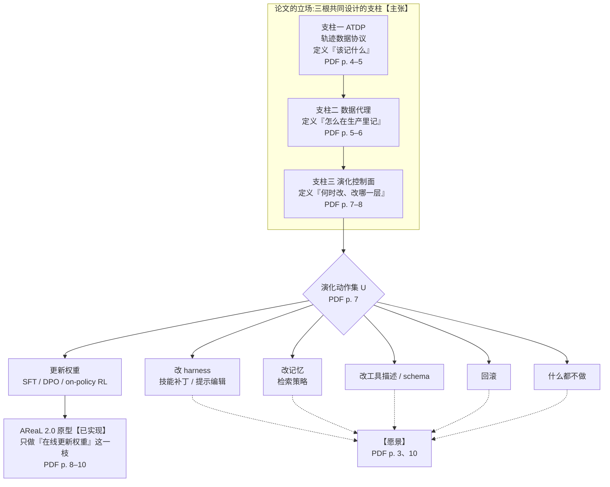
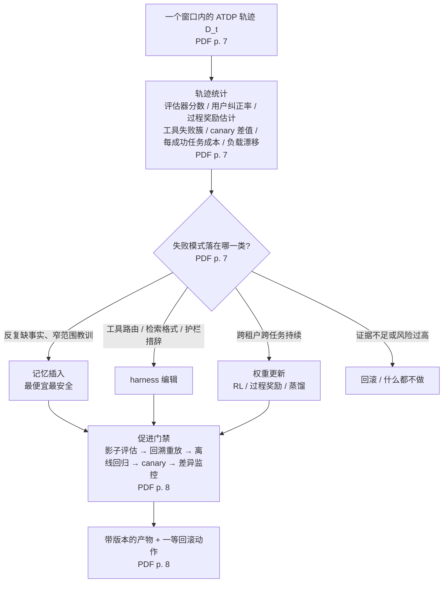
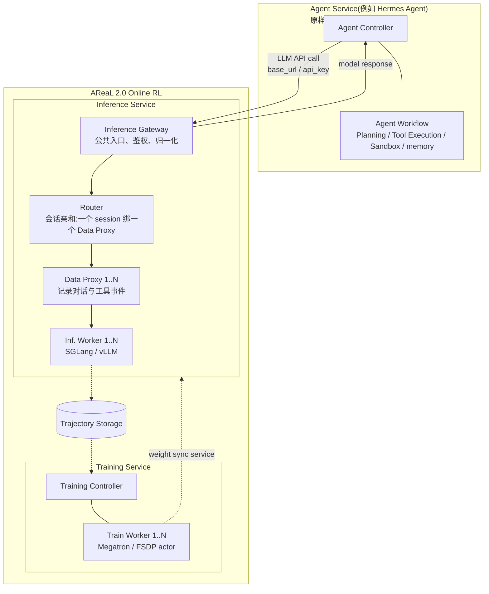
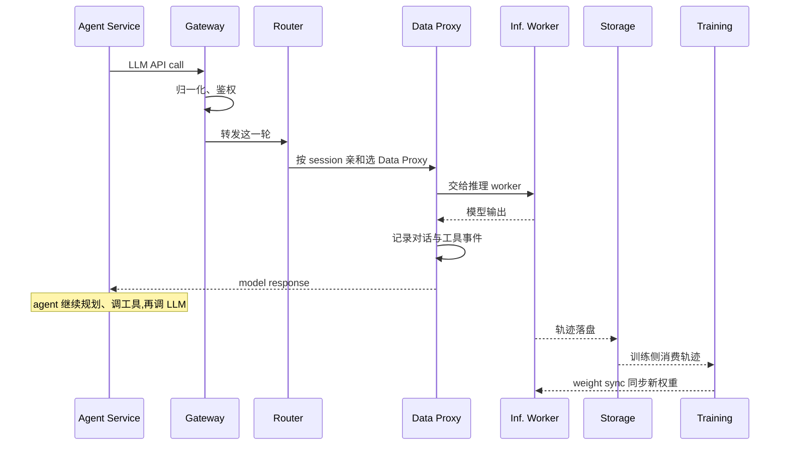

# AReaL 2.0：自进化 Agent 的瓶颈不在算法而在系统——三根支柱是立场，换掉推理端点是唯一落地的一截

<!-- release-date: 2026-07-01 -->

> 本文依据 **Next-Generation Agentic Reinforcement Learning Systems Enable Self-Evolving Agents**，即 arXiv:2607.01120v2（cs.DC），v1 提交于 2026-07-01、v2 提交于 2026-07-02，共 13 页（正文与结论 p. 1–11，参考文献 p. 11–13；无附录、无表格、无实验数据，全文只有一张图）。二十四位作者里，二十二人署名 Ant Group，四人署名香港科技大学（Ran Yan、Jiarui Zhang、Youhe Jiang、Binhang Yuan），五人署名清华大学（Wei Fu、Jiaxuan Gao、Jiarui Zhang、Huaijie Wang、Yi Wu）；只有 Youhe Jiang 与 Yi Wu 两人不署 Ant Group（PDF p. 1）。按主要归属方，本站把它放在 AntGroup 目录下，与前作 [AReaL](/reports/AntGroup/AReaL) 同目录。下文 `PDF p. N` 均指这份 13 页原件的文件页码。
>
> **版本说明**：截至 2026-09-08 核验，arXiv 上最新版本就是 v2，与本地原件一致，无需替换原件。已核对到的 v1 与 v2 差异只有一处：作者名单从 22 人增至 24 人，补入 Wentai Zhang 与 Honghua Dong；两版文件大小相同，章节标题、Figure 1 图注、参考文献条数与代码链接逐项一致。本文没有逐句比对两版正文。
>
> **这是一篇立场文（position paper），不是系统论文，也不是模型报告。** 它没有实验、没有数字、没有基线对比。所以本文最重要的工作不是复述数字，而是把三件事分开：**论文提出的设计主张**、**论文声称已经实现的部分**、**论文自己写明只是愿景或未来工作的部分**。文中用【主张】【已实现】【愿景】三个标记逐段标出，证据一律带页码。凡属本文的解释、推断或外部资料补充，都会明确写出。

## 读之前需要的最少背景

**先说它和前作的关系。** 本站已发布的 [AReaL](/reports/AntGroup/AReaL) 讲的是 2025 年那篇 NeurIPS 系统论文，主题是强化学习（Reinforcement Learning，RL）后训练的系统效率：生成与训练拆到两组 GPU、生成侧可中断、陈旧度限流、解耦的 PPO（Proximal Policy Optimization，近端策略优化）目标。那一篇回答的问题是「几百张卡怎样不空转」。它的整个循环由 RL 系统自己驱动：从数据集取题、发给 rollout worker、判分、攒批、更新。**本篇不重讲那些机制。** 本篇要回答的是另一个问题：一个已经上线、每天在给真实用户干活的 Agent，它产生的交互记录能不能直接变成训练数据，让它自己变强。

再认识几个贯穿全文的词：

- **Agent（智能体）**：让大语言模型（Large Language Model，LLM）不只输出文字，还能读文件、调工具、检索、请求人工批准，然后把结果读回来再想下一步。
- **harness（脚手架）**：包在模型外面、让它能真正干活的那层代码与提示：系统提示、工具描述、路由、子 agent 定义、技能库。同一个模型换一套 harness，能力差很多。本站 [AIDE2](/reports/Weco/AIDE2) 讲的就是让 agent 改自己的 harness。
- **trajectory（轨迹）**：一次任务从头到尾的记录，包含每一步看到什么、做了什么、结果如何。
- **on-policy RL（在策略强化学习）**：用**当前这份参数**自己生成的数据来更新它自己。要做到这一点，你必须拿得到它生成时的 token 与概率。这一条决定了本篇原型为什么长成那个样子，后面会回到它。
- **memory / skill（记忆 / 技能）**：agent 在模型权重之外能积累的东西。记忆是事实，技能是可复用的做法。

最后一个概念是本篇的骨架：**「干预表面」（intervention surface）**。论文把一个部署中的 agent 看成由五部分拼成的复合策略：基座 LLM、in-context harness、记忆、工具、护栏，「不同的失败需要不同的干预表面」（PDF p. 3）。**改哪一部分，就是一种干预表面。** 更新权重只是其中一种；论文把跨越多个表面的演化叫「多表面演化」（multi-surface evolution，PDF p. 3、10）。

## 一句话先说清

这篇论文的立场可以压成一句话：

> **企业级 Agent 之所以上线后就「冻住」，卡住它的不是 RL 算法，而是没有一套能把线上轨迹变成可治理、可归因、可重放的训练材料的系统。**（PDF p. 1、10）

论文说，这套系统要由三根支柱共同设计（PDF p. 2）：

1. **标准化的轨迹数据协议（Agent Trajectory Data Protocol，ATDP）**：把 agent 的经验从「可观测」升级成「可学习」；
2. **企业级数据代理（data proxy）**：在生产环境里把这些轨迹截获、脱敏、持久化、可重放；
3. **统一的演化控制面（evolution control plane）**：根据轨迹统计自动决定该改记忆、改技能、改 harness、改工具描述，还是更新权重，或者回滚、什么都不做。

然后论文说得很清楚：**它只把第三根支柱里的一根细枝做了出来**，叫 AReaL 2.0——把前作 AReaL 的 rollout 与训练 worker 包成微服务，让一个已经部署的 agent 只改一个推理地址，就把它的线上 LLM 调用接进在线 RL 循环（PDF p. 3、8）。记忆、技能、harness、工具 schema、重放治理、自动选择干预方式，全部写在「未来的议程」里（PDF p. 3、10）。

所以读这篇要带着一个刻度：**三根支柱是主张，原型是主张的一个角落，而且原型本身没有任何实测数据。** 它的价值不在于证明了什么，而在于把「自进化 Agent」这个词从算法问题重新框成系统问题，并且给了一份相当完整的需求清单。

## 全景：三根支柱、一截原型

这是本文按 PDF p. 2–3 的三支柱叙述、p. 7 的动作集与 p. 8、10 的原型范围整理的**结构示意图**，不是论文里的任何一张图。实线表示论文声称做了的部分，虚线表示论文明确写为未来工作的部分。

三根支柱之间的关系，论文用三个问题串起来，每一节开头各一句（PDF p. 4、5、7）：

| 支柱 | 论文开头的问题 | 回答的是什么 |
|---|---|---|
| ATDP | What should be the right data abstraction that will be captured for learning? | **记什么** |
| 数据代理 | How to capture such data for enterprise-level heterogeneous agentic workflows? | **怎么记** |
| 控制面 | When and how to trigger corresponding RL optimization for self-evolving? | **何时、改哪里** |

论文自己的一句话概括是：ATDP 规定「必须表示什么」，数据代理规定「这些表示怎样在异构企业环境里被生产出来」（PDF p. 2）。

## 先讲矛盾：部署的单位换了，改进的方式没换

论文的出发点是一个错位（PDF p. 1）。

**部署的东西变了。** 以前企业部署的是一个 LLM：输入一串 token，输出一串 token。现在部署的是一个长程 agent 策略：它读文件、调工具、检索文档、调 API、更新记忆、请求人工批准、完成分析任务，而且嵌在一个复杂的业务环境里。

**改进它的方式没变。** 一个部署中的企业 agent 可能完成了成千上万次工具交互，但它的行为要变，仍然要走一遍人工循环：运维看 trace → 定义新的评测集 → 改提示 → 加工具描述 → 用 RL 更新模型 → 实现新的 agent 循环 → 重新部署（PDF p. 1）。

论文把这个错位写成一句话：权重、系统提示、工具库、in-context harness 在部署时全部被冻结（PDF p. 1）。而与此同时，面向个人的自进化 agent（论文点名 OpenClaw 与 OpenClaw-RL，并引用 MetaClaw、SkillClaw）已经说明「从自己的经验里持续学习」不再是假设（PDF p. 2）。

**那为什么企业做不到？** 论文的回答是它的核心立场：缺的「不是更大的模型、更聪明的提示，甚至不是某个特定的 RL 算法；而是一个企业级的系统底座，能把 agent 交互轨迹平滑地转成在线自进化学习」（PDF p. 2，本文译述）。论文认为当前研究把注意力放在更好的模型、更好的提示、更好的工具集成上，而漏掉了大规模真实部署的系统挑战（PDF p. 2）。

它举了三个企业场景来说明「个人 agent 的做法搬不过来」（PDF p. 2）：

- **编码 agent**要从跨团队的 issue 解决记录里学，同时尊重仓库权限、许可证边界、专有代码限制和审计要求；
- **客服 agent**要从升级、退款、满意度信号和政策更新里学，同时不能泄漏客户数据；
- **科研 agent**要从失败的实验和文献检索轨迹里学，同时保住溯源、可复现性和实验室约束。

三个例子的共同点（本文的归纳）：**学习信号和治理约束是同一份数据的两面。** 个人 agent 只有一个用户、一个租户、几乎没有合规边界，所以可以「先学了再说」；企业 agent 的每一条轨迹都同时带着「能不能学」的问题。这就是为什么论文把「治理」写进了三根支柱的每一根，而不是当作事后补丁。

## 论文怎样定义「自进化」，以及它刻意不定义什么

这一段很短，但决定了全文的边界（PDF p. 2）。

论文对自进化 agent 的定义是：**一个部署中的 agent，它未来的行为能因为过去的情境经验而改进。** 紧接着它加了一道栅栏：「我们不是指无限制的递归自我修改；而是指一个有界的闭环」。在这个闭环里，每个用户与 agent 的交互轨迹能被**观测、脱敏、验证、归因**，然后转成以下几种**受治理的更新**之一：记忆插入、技能补丁、harness 编辑、工具 schema 修改、on-policy RL 更新（PDF p. 2）。

这个定义有三个值得记的地方（本文的解读）：

1. **它把「自进化」和「递归自我改进」明确切开。** 本站 [AIDE2](/reports/Weco/AIDE2) 那篇讲的 RSI（Recursive Self-Improvement，递归自我改进）阶梯，关心的是 agent 改进「改进者自己」能不能点火；本篇不碰那个问题，它只要一个能审计的闭环。
2. **权重更新只是五种更新里的一种，还排在最后。** 后面控制面一节的映射与此呼应：记忆插入「通常是最便宜、最安全的更新」，只有跨租户持续的同类失败才值得动权重（PDF p. 7）。「先试最便宜的表面」是本文对这个排序的概括，论文没有把它写成一条原则。
3. **「观测、脱敏、验证、归因」四个动词全是治理动作。** 论文对自进化的定义里，治理不是附加条件，而是定义本身的一部分。

## 支柱一：轨迹协议 ATDP——把「可观测」变成「可学习」【主张】

### 旧问题：日志够调试，不够学习

现有的 agent 日志通常记录 prompt、completion、工具调用、延迟、错误、token 用量。论文说这些对调试有用，对在线 agentic RL 不够（PDF p. 2）。不够在哪？一条「可学习」的轨迹必须在**每一步**保留决策过程：agent 当时看到了什么、内部或 harness 的相关状态是什么、选了什么动作、动作结果如何、后来才到的奖励或批评是什么，以及模型版本、工具 schema、租户、成本、治理状态这些元数据（PDF p. 2）。

论文把这个差距说成一句口号：ATDP 的目的是让部署中的 agent 经验「可学习而不只是可观测」（PDF p. 2）。

### 新设计：一条轨迹是一串带类型的事件

论文给了一个「原型表述」（PDF p. 4）。一条轨迹 $\tau$ 是一个带类型的事件序列：

$$\tau=(e_1,e_2,\dots,e_T)$$

每一步 $e_t$ 是一个六元组：

$$e_t=\langle o_t,\ h_t,\ a_t,\ y_t,\ r_t,\ m_t\rangle$$

六个分量分别是（PDF p. 4–5）：

| 分量 | 名字 | 论文举的例子 |
|---|---|---|
| $o_t$ | 可观测状态 | 工具输出、检索片段、用户消息、环境状态 |
| $h_t$ | 隐藏的内部状态 | 当前遵循的计划、草稿区、置信度、推理摘要 |
| $a_t$ | 选中的动作 | 带类型参数 schema 的工具调用、以 token 形式生成的消息、代码编辑、记忆更新 |
| $y_t$ | 动作的结果 | 工具返回值、用户接受/编辑/重试/删除、退出码 |
| $r_t$ | 奖励信号 | 二元结果、标量分数、自然语言批评、从 $y_t$ 提取的隐式信号 |
| $m_t$ | 元数据 | 延迟、token 数、成本、租户、会话、harness 指纹、模型 id |

论文补了一句很有用的定位：当 $h_t=\varnothing$ 且去掉 $m_t$ 时，这个 schema 退化成标准的部分可观测马尔可夫决策过程（Partially Observable Markov Decision Process，POMDP）（PDF p. 5）。也就是说，它不是发明一种新的 RL 形式化，而是在经典抽象上多挂了两个口袋：一个装 LLM 特有的内部状态（推理轨迹、检索片段、被拒绝的动作类别），一个装企业特有的元数据。

**这个六元组里最不寻常的是 $y_t$ 与 $r_t$ 分开**（本文的解读）。经典 RL 里，环境返回的就是下一个状态和奖励。这里把「动作直接引起的结果」（$y_t$，比如工具返回了什么、用户点了删除）和「对这一步的评价」（$r_t$）拆开，因为在 agent 场景里，前者立刻就有，后者可能几天后才来——下一轮对话里用户纠正了、测试后来挂了、人工标注后来到了。这一点在下面的「延迟绑定」原则里被正式写出来。

### 工作机制：六条设计原则

论文列了六条 ATDP 的设计原则（PDF p. 5）。按本文的归纳，它们不是并列的：前三条讲「记什么」，后三条讲「记下来的东西怎样才可信」。

**一、决策相关的有界披露（decision-relevant bounded revelation）。** 记录足够改进行为的信息，但**不要求**暴露每一个内部 token 或隐藏的推理轨迹。论文的理由是：agent 需要足够的结构做归因、因果诊断和重放，但通常不需要无限制地披露每一段思维链，因为那些片段「通常不能提供可审计的学习信号」（PDF p. 5）。

**二、跨框架跨任务的统一（unification across frameworks and tasks）。** 现有 agent 日志是框架特定的，RL 数据集是任务特定的，企业遥测是为调试、可靠性和合规优化的，都不是为在线 RL。论文把 ATDP 的「核心创新」写成一句话：**学习的单位既不是 prompt–response 对，也不是一段不透明的 trace，而是一条带类型、可审计、可归因的事件记录**（PDF p. 5）。

**三、可归因（credit assignability）。** 轨迹要能回答：是哪个观测、哪段提示、哪条检索结果、哪次工具调用、哪条记忆、哪个护栏决策导致了成功或失败？为此不能只存动作，还要存动作被选中时的关键上下文。论文用工具调用举例：要存工具版本、参数 schema、权限范围、延迟、错误类别、返回对象，以及**这个结果后来是被信任、被忽略、被纠正，还是被推翻**（PDF p. 5）。

**四、延迟绑定的学习信号（late-bound learning signals）。** 很多奖励在动作之后才到：下一轮的用户纠正、失败的测试、后来的人工标注、慢速的远程评估器。ATDP 要允许一个事件的奖励字段在初次记录之后被更新或追加，**同时保持原始因果记录不可变**（PDF p. 5）。这一条是前面 $y_t$/$r_t$ 拆分的正式理由。

**五、带版本的可重放（versioned replayability）。** 每个事件不只归属到一个模型标识，而要归属到产生它的**完整执行信封**：harness schema、工具版本、检索索引快照、护栏配置、策略 LLM 版本或 checkpoint。论文的判断很尖锐：没有这些字段，「agent 经验」在统计上有用，在操作上不可复现（PDF p. 5）。

**六、受治理的可观测（governed observability）。** 从一开始就带上隐私、安全、血缘字段：脱敏状态、数据分级标签、租户标识、保留策略、同意或法律依据、人工审核状态、训练资格。还要支持**分裂可见性**：生产调试员看到脱敏后的 trace，受控的训练作业才能访问封存的、经策略批准的字段（PDF p. 5）。

### 它和已有协议的区别在哪

论文在相关工作里把 ATDP 与三类东西分开（PDF p. 4）：

- **MCP（Model Context Protocol）、A2A（Agent2Agent）这类互操作协议**：标准化的是 agent 怎样发现工具、访问上下文、彼此通信，不是训练数据；
- **D4RL、RLDS 这类 RL 数据集基础设施**：证明了标准化轨迹对离线 RL、模仿学习、重放、标注和可复现基准的价值，但面向的是离线数据集；
- **Agent Data Protocol（ADP）**：最接近的一个，它提出一种轻量「中间语」来统一异构的 LLM agent 数据集，并证明标准化轨迹能改善可扩展的 SFT。

论文对三者的共同判断是：它们要么解决互操作，要么解决离线数据转换，都没有保留部署中自进化所需的东西——step 级因果上下文、延迟奖励、动作结果、harness 与工具版本、治理元数据、重放边界、企业约束下的学习资格（PDF p. 4）。

### 代价与边界

**论文没有给出 schema。** 六元组是「原型表述」，六条原则是需求，全文没有任何字段类型、序列化格式、示例事件或参考实现（PDF p. 4–5）。「协议」在这里是一份规格说明书的目录，不是规格说明书本身。这一点在论文结尾也被承认：完整的 ATDP 实现被列在原型之外的待办里（PDF p. 10）。

**第一条原则和第四条原则之间有张力**（本文的观察，论文没有讨论）。「有界披露」说不必存每一个隐藏 token；但要做 on-policy 的权重更新，你恰恰需要策略模型生成的每一个 token 及其概率。论文在数据代理一节的措辞是「token IDs where available, log probabilities where available」（PDF p. 6），也就是说 ATDP 本身对这些字段是「有则存」。这意味着从一个第三方模型 API 后面截获的轨迹，天然只够做监督微调（Supervised Fine-Tuning，SFT）、偏好优化或 harness/记忆更新，不够做 on-policy RL——而这恰好解释了原型为什么必须把推理引擎放进自己家里，后面会讲。

### 可迁移启发

即使你不做 RL，ATDP 的六条原则也是一份很好的**agent 日志设计检查表**：你的日志能不能回答「这次工具返回的结果后来被采纳了吗」？能不能在事后给一条记录追加奖励而不改动原始记录？能不能仅凭一条记录复原出当时的 harness 版本与工具 schema？三个「不能」里任何一个，都意味着这份日志只能用来看，不能用来学。

## 支柱二：数据代理——监控代理与学习代理的分界线是「能不能重放」【主张】

### 旧问题：企业不会只用一种 agent 框架

ATDP 规定了该记什么。可企业里有的团队用 LangChain 或 LangGraph，有的用 CrewAI，有的用 OpenAI Agents SDK 或 Claude Agent SDK，有的接 MCP 工具，还有的自己写编排代码（PDF p. 6）。逐个改造应用不现实。论文的原话是：数据代理的目的是把生产工作转成受治理的学习数据，「而不强迫每个 agent 团队重写它的应用」（PDF p. 6）。

### 新设计：站在四条边界上的代理

论文特意区分了它和三种常见东西：数据代理「不只是一个 API 网关、一个 tracing 导出器或一个日志服务」，而是「把生产负载转成受治理学习材料的关键机制」（PDF p. 5）。它的位置是四条边界（PDF p. 6）：

1. agent 与 LLM 之间（无论 LLM 部署在内部还是由外部提供商提供）；
2. agent 与工具之间；
3. agent 与短期/长期记忆系统之间；
4. agent 与人类反馈通道之间。

### 工作机制：六条设计原则

**一、对既有框架无侵入的拦截。** 在稳定边界上截获：模型 API 调用、工具调用、检索调用、记忆操作、文件系统或浏览器动作、人工批准事件、最终用户反馈（PDF p. 6）。

**二、无损的 ATDP 发射（lossless ATDP emission）。** 每次截获的调用都转成 ATDP 事件流并持久化。注意论文对「无损」的定义：对 LLM 调用，无损指**保留在策略下有资格且必要的全部字段**——提示模板指纹、系统提示版本、暴露的工具、解码参数、采样输出、token ID（有则存）、对数概率（有则存）、模型版本或 checkpoint；对工具调用，指存输入、输出、schema、版本、权限范围、错误类别和下游用途（PDF p. 6）。**「无损」是相对于「学习需要」和「治理允许」定义的，不是逐字节完整。**

**三、可重放。** 论文这一条写得最重：「一条不能被重放的轨迹不是可信的训练数据」（PDF p. 6）。重放需要工具输入输出、环境状态、LLM 版本（在许可范围内）、文件或数据库快照（在允许范围内）、以及外部副作用的边界。而且要区分三类：**确定性重放、近似重放、不可重放**。论文用一个对比说明监控与学习的差别：监控 trace 能说「agent 调用了工具 X 然后失败了」；训练代理必须能问「如果换一个提示、模型、记忆、检索策略或工具 schema，agent 会不会成功？」。论文的结论句：「重放是区分学习代理与监控代理的关键特征」（PDF p. 6）。

**四、跨租户聚合但隔离。** 企业可能希望一个编码 agent 从多个产品团队的轨迹里学，但各团队的仓库权限、数据分级、法律限制不同。所以要有隔离的租户存储、基于策略的聚合、必要时的联邦或 split-learning 式训练作业、以及租户感知的评估。论文补了一句常被忽略的话：这不只是隐私要求，也是**学习要求**——没有租户元数据和隔离，系统无从知道「从一个团队学到的更新该不该推广到另一个团队」（PDF p. 6）。

**五、奖励收割（reward harvesting）。** agent 负载里有大量弱的、延迟的奖励：用户回复、工单重开率、测试失败、编译错误、人工纠正、升级决定、退款撤销、审批延迟、下游编辑、放弃。论文沿用 OpenClaw-RL 的观察——每次交互都会产生一个「下一状态信号」（用户回复、工具输出、终端状态变化、GUI 状态变化）——并把它推广为：把运营状态变化都当作**候选**学习信号。然后是一句边界：「不是所有信号都是奖励，也不是所有奖励都能安全地直接优化，但数据代理必须先把它们捕获下来，控制面才能决定怎么用」（PDF p. 6）。

**六、先治理再学习（data integrity before learning）。** 脱敏、访问控制、保留、学习资格要在轨迹进入学习队列**之前**执行。论文说这是常见模式的反面：常见模式是日志先堆起来，治理以后再补。在自进化系统里，代理不只是可观测性收集器，「它是 RL 学习循环的第一道安全边界」（PDF p. 3、6）。

### 与本站已有报告的交叉对照

「重放」这个判据在别处已经有人真的做出来了。本站 [DeepSeek-V4](/reports/DeepSeek/DeepSeek-V4) 讲的 DSec 沙箱为每个 sandbox 维护全局有序的轨迹日志，用途正是三个：快进恢复、溯源、确定性重放。那是一个训练侧沙箱里的实现，而本篇要的是横跨整个企业 agent 栈的同一件事。两者不冲突，可以互相印证「重放需要什么」。

### 代价与边界

**全文没有任何一行代理的实现细节或性能数据**（PDF p. 5–6）。拦截怎么做到无侵入、脱敏用什么方法、近似重放的边界怎么判定、租户隔离下训练作业怎么组织，论文都只给了需求。

**这里还埋着一个命名上的坑**（本文的观察）：第 4 节的「数据代理」是一个横跨模型、工具、记忆、人类反馈四条边界的企业级组件，带六条原则；而第 6 节原型里也有一个叫 Data Proxy 的组件，它做的是会话状态与对话/工具事件记录（PDF p. 9–10）。**两者同名，范围相差很远。** 论文自己在结尾承认原型缺少「一个能捕获工具、检索、记忆、文件、浏览器、人类反馈和延迟奖励事件的完整数据代理」（PDF p. 10），也就是间接承认第 6 节那个 Data Proxy 不是第 4 节那个。读的时候要分开。

### 可迁移启发

把「能不能重放」当作数据是否可用于训练的硬门槛，这条原则比任何具体字段都值得带走。它的直接推论是：**存副作用的边界，而不只是存结果。** 一次「已发送邮件」的记录如果不标明它是不可重放的外部副作用，那么以它为起点的所有反事实评估都是错的。

## 支柱三：演化控制面——自进化不等于更新权重【主张】

### 旧问题：一把锤子对应所有故障

论文反对的是一种默认做法：agent 表现不好，就去更新模型权重。它的反驳建立在一个观察上：部署中的 agent 是一个**复合策略**，由基座 LLM、in-context harness、记忆、工具、护栏拼成，「不同的失败需要不同的干预表面」（PDF p. 3）。控制面的定位因此是：**自进化不是一个优化器，而是一个多表面的、受治理的决策问题**（PDF p. 7）。

### 新设计：一个形式化的决策问题

论文给了控制面的「原型表述」（PDF p. 7）。时刻 $t$ 的部署 agent 写成五元组：

$$\mathcal{A}_t=\langle \pi_{\theta_t},\ \mathcal{H}_{\psi_t},\ \mathcal{M}_t,\ \mathcal{T}_t,\ \mathcal{G}_t\rangle$$

依次是：参数为 $\theta$ 的策略 LLM、参数为 $\psi$ 的 in-context harness 策略、记忆、工具库与工具 schema、安全治理与护栏配置。控制面观察一个窗口内的 ATDP 轨迹 $\mathcal{D}_t=\{\tau_i\}_{i=t-W}^{t}$，选一个演化动作：

$$u^\star=\arg\max_{u\in\mathcal{U}}\ J_{\mathcal{A}}\!\left(u\mid\mathcal{A}_t,\mathcal{D}_t\right)$$

$J_{\mathcal{A}}$ 「一般地度量 agent 演化带来的改进」——**论文对它只有这一句，没有任何具体定义**（PDF p. 7）。动作集 $\mathcal{U}$ 有六类，全部受 $\mathcal{G}_t$ 约束（PDF p. 7）：

| 编号 | 动作 | 论文举的手段 |
|---|---|---|
| (i) | 更新策略 LLM $\pi_{\theta_t}$ | 监督微调（SFT）、直接偏好优化（Direct Preference Optimization，DPO）、on-policy RL |
| (ii) | 更新 in-context harness $\mathcal{H}_{\psi_t}$ | 技能补丁、提示编辑 |
| (iii) | 更新记忆 $\mathcal{M}_t$ | 检索策略更新 |
| (iv) | 更新工具库与 schema $\mathcal{T}_t$ | 工具描述编辑、工具 schema 变更 |
| (v) | 回滚 | — |
| (vi) | 什么都不做 | — |

论文还列了可演化对象的清单：系统提示、开发者指令、agent 提示模板、工具描述、路由器、记忆检索策略、记忆策略、规划模板、子 agent 定义、技能库（PDF p. 7）。

**这个公式的真正内容不在 argmax，而在 $\mathcal{U}$ 的构成**（本文的解读）。它把「回滚」和「什么都不做」写成与「更新权重」平级的动作。论文在后文把这一点说得很直白：回滚「不应该是手动的应急程序，它应该是动作集里的一等动作」（PDF p. 8）。

### 工作机制：故障类型到表面的映射

控制面第一条实现考虑，就是明确编码「哪类失败属于哪类干预」（PDF p. 7）。论文给的映射整理如下：

| 轨迹里观察到的模式 | 论文建议的表面 | 论文的理由 |
|---|---|---|
| 反复缺少某些事实、窄范围的可复用程序性教训 | 记忆插入 | 「通常是最便宜、最安全的更新」 |
| 失败聚集在工具路由、检索格式、护栏措辞、开发者消息结构 | harness 编辑 | 「通常更合适」 |
| 同一类失败跨越许多租户、任务、工具配置持续出现 | 用 RL、过程奖励学习或蒸馏更新策略 | 「问题大概率不局限于记忆或 harness」 |

这张表就是论文反对「一把锤子」的具体形式。用本文的话概括：**先试最便宜、最可逆的表面，只有失败的普遍性证明了问题在模型里，才动权重。** 论文只给了三个例子和「通常」「大概率」这样的定性措辞，没有把它写成一条排序规则。

这是本文按 PDF p. 7–8 的六条实现考虑重画的**机制示意图**。菱形的前三个分支来自「多表面适配」那一条的三个例子；第四个分支「回滚 / 什么都不做」只是动作集里的两项（PDF p. 7），论文没有写它们的触发条件，「证据不足或风险过高」是本文补的说明。论文没有给出任何判定阈值，分支上的文字是定性描述，不是可执行规则；门禁框里的箭头只是论文列举的顺序，论文没有规定先后。

### 工作机制：另外五条实现考虑

**自动触发，而不是靠人看 trace。** 控制面应该在显式统计量上运行：评估器分数、用户纠正率、过程奖励估计、工具特定的失败簇、canary（金丝雀发布，即小流量灰度）差值、每个成功任务的成本、负载构成漂移。论文引了三个已有工作说明这些信号可行：OpenClaw-RL 把下一状态信号转成标量过程奖励与方向性提示，AgentPRM 证明了逐轮奖励的价值，RLAnything 组合了逐步与结果信号。论文自己的定位是：「把这些统计量从监控产物提升为干预触发器」（PDF p. 7）。

**算法多元，但触发接口统一。** 不要把某一种学习范式写死。权重更新的后端可以是 on-policy 或近 on-policy RL、过程奖励学习、on-policy 蒸馏；harness 空间可以是提示优化、上下文演化、代码搜索、轨迹感知的口头编辑；记忆或技能可以是把轨迹蒸馏成可复用的工作流或推理对象。控制面「组织这些范式而不是抹平差异」——它决定调用哪个算法、用哪片数据、在什么约束下、走哪条部署路径（PDF p. 8）。

**安全、有审计的分阶段部署。** 自动触发不等于未经审查的热替换。每个干预都要带自己的促进路径：影子评估、回溯重放检查、离线回归测试、canary 发布、回滚语义、与现任版本的差异监控。论文的态度是「不是放弃自进化，而是保证演化是分阶段门控且可审计的」（PDF p. 8）。

**重放优先的评估。** 更新触达用户之前，先在重放的轨迹和反事实变体上评估：harness 编辑要在过去的失败和已知的成功上测；工具 schema 变更要在工具调用重放上测；策略更新要在留出轨迹、安全集、租户专属评测和分布漂移探针上测。论文自己指出：这一条正是数据代理必须支持重放的原因（PDF p. 8）。

**带版本的溯源与回滚。** 每个演化产物都要有版本：LLM checkpoint、提示、工具 schema、记忆项、检索策略、护栏、技能文件、路由器、数据集。论文用一句话收尾：「一个说不清自己改了什么的自进化 agent，在企业级别不叫自进化，叫漂移」（PDF p. 8，本文译述）。

### 代价与边界

**控制面是三根支柱里离实现最远的一根。** $J_{\mathcal{A}}$ 没有定义，触发阈值没有，选择策略的算法没有，任何一个跑过的案例也没有（PDF p. 7–8）。原型明确不覆盖它（PDF p. 8、10）。所以这一节要当作**需求规格**来读：它告诉你一个成熟的控制面必须有哪些能力，没有告诉你怎么做。

**它和本站其他自进化篇的关系**（本文的对照）：[AIDE2](/reports/Weco/AIDE2) 演化的是 harness 这一个表面，[Fugu](/reports/Sakana/Fugu) 训练的是一个决定「谁来做」的编排器。它们各自做深了一个表面。本篇控制面的独特之处是提出了一个**站在所有表面之上、决定「该改哪一个表面」的仲裁者**——而这恰恰是本篇没有做出来的部分。

### 可迁移启发

不需要等到有了自进化系统，「故障类型到表面的映射表」今天就能用：遇到 agent 出错，先问「这是记忆问题、harness 问题、工具描述问题，还是模型问题？」，按便宜到贵、可逆到不可逆的顺序试。把「回滚」和「不动」当成正式选项，而不是失败后的补救。

## AReaL 2.0 原型：把 RL 系统从「调用方」变成「被调用方」【已实现】

### 论文声称做了什么、没做什么

论文对原型的定位用了很克制的措辞（PDF p. 8）：它是一个「探索性原型」，聚焦「一条特定的演化路径：从部署 agent 的轨迹在线更新策略 LLM 的权重」。它明确**不**打算实现整个自进化底座，也**不**覆盖记忆插入、技能补丁、harness 编辑、工具 schema 演化（PDF p. 8）。结尾又说了一遍：原型「只覆盖了更广的控制面动作空间里的模型权重更新分支」（PDF p. 10）。

它做的事，论文用一个框写出来（PDF p. 8，本文译述）：

> **不要把 RL 基础设施当作一条与线上 agent 负载脱节的离线后训练流水线；AReaL 2.0 把 rollout 与策略训练所用的同一批计算单元（比如 GPU worker）暴露成微服务组件，能插进任何已有的在线 agent 部署。**

对 agent 应用来说，接入方式只有一步：把原来指向 SGLang 或 vLLM 服务器的推理端点，换成 AReaL 2.0 的网关，论文说这「就足以」把 LLM 调用导进在线 RL 运行时（PDF p. 9）。Figure 1 在那条 LLM API call 箭头上只标了两个字段——`base_url` 与 `api_key`（PDF p. 9，读自 Figure 1）。

### 四个组件

论文说原型由四个核心组件实现，它们分别解耦了「公共服务协议、会话放置、轨迹管理、模型推理或训练计算」四件事（PDF p. 9）。

这是本文根据 PDF p. 9 的 Figure 1 与 p. 9–10 的组件描述重画的**结构示意图**。原图用实线表示请求与响应、虚线表示轨迹落盘与权重同步，本图沿用这个约定；方框内的说明文字来自正文，不是原图标注。原图没有标出任何吞吐、延迟或规模数字。

四个组件各自的职责（PDF p. 9–10）：

- **Gateway（网关）**：整个 agent 服务栈在在线 RL 系统里的公共入口。它把 AReaL 2.0 暴露成「标准推理后端的替代品」；内部做外部 LLM 请求的归一化、鉴权，把 agent 的每一轮转发进在线 RL 服务网。论文说它的作用是「把集成成本降到最低」：agent 服务继续用普通的推理风格 API 通信，而 AReaL 2.0 获得了在线 RL 需要的交互流可见性。
- **Router（路由器）**：为**多个**在线 RL 训练作业提供轻量的会话亲和管理。agentic RL 的负载天然有状态——一个任务包含多轮、多次工具调用、中间观测和延迟奖励——所以路由器把每个会话分配给一个 data proxy，并在跨轮次时保持这个分配。它只管放置与亲和元数据，大流量交给 data proxy 和 worker 层。
- **Data Proxy（数据代理）**：实现「agentic 数据流量与存储的控制面管理」。它在外部服务请求与计算 worker 之间做中介，记录轨迹（对话历史、工具调用事件与响应），并为下游训练准备数据。论文说它是「把普通的部署 agent 流量转成在线 RL 可消费经验」的那个组件。
- **Agent-Compute Worker（agent 计算 worker）**：把 SGLang、vLLM 这类推理引擎与基于 Megatron 或 FSDP（Fully Sharded Data Parallel，全分片数据并行）的训练 actor 一起包在微服务接口后面，让计算资源能按轨迹流和训练需求动态分配与释放。

### 一次请求的生命周期

论文没有列步骤，以下是本文按 PDF p. 9–10 的组件描述与 Figure 1 的箭头整理的执行流程：

这是**机制示意图**，箭头只表示先后与归属，不表示实测耗时；论文没有描述训练侧攒批、更新频率或权重同步的触发条件。正文说记录轨迹的是 Data Proxy（PDF p. 10），而 Figure 1 把落盘的虚线画在 Inf. Worker 一侧（PDF p. 9），本图两处都照原样保留，不替论文裁决。

### 那个唯一的案例：Hermes agent

论文称之为「motivating example」（PDF p. 10）：为 Hermes agent 服务提供在线 RL 训练。常规部署里，Hermes 调用一个推理后端（例如 SGLang worker）取得模型响应；换成 AReaL 2.0 后，这个后端被网关后面的 agent 计算 worker 替代，「周边的 agent 服务基本不变」。论文认为这体现了设计的核心收益：**不是再搭一个模仿生产行为的 RL 环境，而是直接复用原始 agent 服务自己产生的数据**；agent 的原生工作流——多轮交互、工具使用——本身就成了 ATDP 轨迹的来源，从而「缩小离线后训练数据与部署 agent 行为之间的差距」（PDF p. 10）。

**论文关于这个案例的全部内容就是上面这一段。** 训练的是哪个模型、奖励从哪里来、跑了多久、有没有变好，一个字都没有（PDF p. 10）。

### 本文的解释：这是一次「控制反转」

以下是本文对原型设计的机制分析，论文没有这样表述。

把这张图和前作 [AReaL](/reports/AntGroup/AReaL) 的系统图放在一起看，最大的变化不是多了网关，而是**谁在驱动循环**：

| | 前作 AReaL | AReaL 2.0 原型 |
|---|---|---|
| 谁发起一次生成 | RL 系统的 Rollout Controller 从数据集取 prompt | 外部的 agent 服务发来一次 LLM 调用 |
| prompt 分布由谁决定 | 训练方（数据集） | 线上真实流量 |
| 一个 prompt 采几个回答 | 训练方配置（前作是每题 16 个） | 由 agent 服务决定，通常一次调用只要一个回答 |
| 环境是什么 | RL 系统自己搭的判分服务 | 原样保留的 agent 工作流：规划、工具、沙箱、记忆 |
| RL 系统的角色 | 调用方 | 被调用方（一个推理端点） |

这个反转带来的收益，论文说了：训练数据与部署行为之间没有「模仿环境」这一层缝隙。它带来的代价，论文没说，但从机制上可以推出至少三条：

1. **RL 系统失去了对批次构成的控制。** 前作里，陈旧度限流、优先取旧、按 token 装箱这些机制都建立在「Controller 知道自己发了多少条」之上。变成被调用方以后，来多少、来什么、什么时候来，都由线上流量决定。
2. **组内相对优势不再天然可得。** GRPO（Group Relative Policy Optimization，组相对策略优化）这类算法要对同一个 prompt 采多个回答来做基线，而线上一次调用只要一个答案。要么牺牲一部分线上请求做多采样，要么换一种不依赖组的优势估计。论文没有讨论。
3. **一个真实会话可能横跨多次权重更新。** 前作用 Proposition 1 和解耦 PPO 目标接住了「一条轨迹由多个版本拼成」这个问题；这里的问题更像那个的自然延伸——一个多轮会话的第一轮由旧权重生成，第五轮由新权重生成——但论文没有说原型是否沿用了那套算法，也没有说陈旧度怎样计。

第二条在官方仓库的示例说明里能找到印证（**外部信息**，见文末）：示例文档写明「在线模式目前每组只训练一条独立打分的轨迹」。这句话不是论文的内容，但它说明第二条代价在工程上是真实存在的。

### 本文的解释：为什么原型偏偏选了权重更新这一枝

论文没有解释为什么在六种动作里先做权重更新。本文的判断是：**因为只有这一枝逼着你把推理引擎放进自己家里，而这恰好是前作 AReaL 已经有的东西。**

要做 on-policy RL，你需要策略模型生成时的 token 与对数概率；这些东西从第三方模型 API 后面截获不到——数据代理一节对它们的措辞正是「有则存」（PDF p. 6）。记忆、技能、harness 的更新不需要这些，所以它们可以建在一个提供商无关的数据代理上；权重更新不行。于是原型必须让 Inf. Worker 自己就是推理引擎（PDF p. 10），而这一层加上训练 worker，正是前作已经写好的部分。原型的「轻量扩展」（PDF p. 8）之所以轻，是因为重的部分早就在。

这也划出了原型的一条硬边界：**它只能让「模型在自己手里」的 agent 自进化。** 一个跑在 Claude 或 GPT 之上的企业 agent，接进这个网关拿不到可用于 on-policy 更新的数据。论文没有讨论这条边界。

### 代价与边界

论文对原型自己的定性是「刻意限定范围的可行性证明」（PDF p. 10）。一份可行性证明至少应该有一次跑通的记录，而这篇连这个也没有。从读者角度，能确认的只有三件事：四个组件的职责划分、接入方式（换端点）、以及一个被点名的目标 agent。剩下的一切——软件版本、硬件、训练算法、奖励来源、任何曲线——都不在论文里（PDF p. 8–10）。

## 与前作 AReaL 怎么衔接

两篇同一团队、相隔约一年，处理的是完全不同层的问题。分工列清楚比各读一遍更有用：

| | [AReaL](/reports/AntGroup/AReaL)（2025-05） | AReaL 2.0（本篇，2026-07） |
|---|---|---|
| 文体 | 系统论文，带一处算法改动，有完整实验 | 立场文，一个原型描述，无实验 |
| 核心矛盾 | 一批里最慢的轨迹拖住整个集群 | 部署后的 agent 无法从自己的流量里学 |
| 循环由谁驱动 | RL 系统（从数据集取题） | 线上 agent 服务（发来 LLM 调用） |
| 主要贡献 | 可中断生成、陈旧度限流 $\eta$、解耦 PPO 目标 | 三支柱的需求规格；网关 / 路由器 / 数据代理 / 计算 worker 的微服务包装 |
| 前作的东西在这里怎样 | — | rollout 与训练 worker 被「包在微服务抽象后面」（PDF p. 8）；异步机制、陈旧度、解耦目标是否沿用，论文未写 |
| 报不报数字 | 报（2.77× 等，均带配置） | 不报 |

本篇在相关工作里对前作的定位只有一句：AReaL「通过完全异步执行把 rollout 生成与策略优化解耦，用陈旧度感知训练和解耦 RL 目标保持训练稳定」，然后是对整个 RL 系统类别的判决：「这些系统不足以通过在线强化学习支持自进化 agent」（PDF p. 4）。**这句话里的「不足」指的是缺少三根支柱，不是说前作的机制错了。** 本篇没有对前作的任何机制做修改或否定。

## 论文给了什么证据

答案很短：**没有实验证据。** 这是一篇立场文，论文自己在摘要里就这样定位（PDF p. 1）。它提供的是论证、需求清单和一个原型的组件描述。把全文的内容按三类分开：

| 内容 | 类别 | 证据形式 | 页码 |
|---|---|---|---|
| 部署单位变了、改进方式没变的错位 | 主张 | 论证 | p. 1 |
| 自进化的定义与五类受治理更新 | 主张 | 定义 | p. 2 |
| 瓶颈在系统底座而不在模型、提示、算法 | 主张 | 论证 | p. 2、10 |
| ATDP 六元组与六条原则 | 主张 | 形式化 + 需求 | p. 4–5 |
| 数据代理的四条边界与六条原则 | 主张 | 需求 | p. 5–6 |
| 控制面的五元组、动作集与六条实现考虑 | 主张 | 形式化 + 需求 | p. 7–8 |
| 故障类型到表面的映射 | 主张 | 定性规则，无阈值 | p. 7 |
| AReaL 2.0 四个组件及其职责 | 已实现（声称） | 组件描述 + Figure 1 | p. 8–10 |
| 换端点即可接入 | 已实现（声称） | 描述 | p. 9 |
| Hermes agent 在线 RL | 已实现（声称） | 一段文字，无结果 | p. 10 |
| 完整 ATDP 实现、完整数据代理、重放与反事实评估、租户感知资格、自动多表面选择 | 愿景 | 明确列为待办 | p. 3、10 |
| 记忆 / 技能 / harness / 工具 schema 的演化 | 愿景 | 明确列为不覆盖 | p. 8、10 |

「已实现（声称）」三行需要额外说明：论文没有给出任何可以核对这些声称的东西——没有版本号、没有代码路径、没有运行记录。**它们是「论文说做了」，不是「论文证明做了」。** 官方仓库确实在同一天发布了对应版本（外部信息，见文末），但那属于仓库的事实，本文不用它替论文补证据。

## 摘要承诺了什么、正文兑现了什么；原件小错

**摘要与正文有一处明显的不对应。** 摘要写「我们勾勒具体的架构承诺、案例研究和反方论证（counter-arguments）来支撑我们的立场」（PDF p. 1）。正文里，「案例研究」只有 Hermes 那一段（PDF p. 10）；「反方论证」则没有对应的章节或段落——全文没有列出任何反对意见并加以回应。最接近的是控制面一节里「自动触发不应意味着未经审查的热替换」那一句（PDF p. 8），但那是对自己主张的限定，不是对反对意见的回应。读者不必去找那一节，它不存在。

**原件的拼写错误不少，列出会影响理解的几处**：p. 5 的「ATEP should treat this as a first-class property」应为 ATDP；p. 8 的「on-police distillation」应为 on-policy distillation；此外还有 bussiness（p. 1）、landscope、self-evolvoing、desgin、replacable（p. 8）、compelete、lanscope、self-evoloving、originl（p. 10）。这些都不影响结论，但引用时要注意。

## 限制与未落地部分

逐项列出。以下判断的依据是论文全文，凡属推断都已标明。

1. **没有实验、没有数字。** 吞吐、延迟、准确率、训练曲线、规模，一个都没有（PDF p. 1–11）。
2. **ATDP 没有 schema。** 六元组和六原则之外，没有字段类型、格式、示例（PDF p. 4–5）。论文自己把「完整 ATDP 实现」列为待办（PDF p. 10）。
3. **数据代理没有实现。** 拦截、脱敏、重放分类、租户隔离全部停留在需求（PDF p. 5–6）。原型的 Data Proxy 是另一个范围小得多的组件（PDF p. 9–10）。
4. **控制面没有实现，连目标函数都没定义。** $J_{\mathcal{A}}$ 只有一句「一般地度量改进」（PDF p. 7）；触发阈值、选择算法、任何案例都没有。
5. **奖励从哪里来，论文没说。** 数据代理一节列了十几种候选信号并说「不是所有奖励都能安全地直接优化」（PDF p. 6），但原型的 Hermes 案例没有交代用的是什么奖励（PDF p. 10）。在线 RL 没有奖励就不成立，这是原型描述里最大的空洞。
6. **前作的算法机制是否沿用，没写。** 异步执行、陈旧度限流、解耦 PPO 目标在本篇正文里只以相关工作的一句话出现（PDF p. 4）；原型是否继承、怎样处理跨版本的多轮会话，均未提（本文的观察）。
7. **控制反转的代价没有讨论。** 批次构成、每 prompt 采样数、prompt 分布不再由训练方控制，论文没有分析这对 RL 算法意味着什么（本文的推断，见原型一节）。
8. **只适用于模型在自己手里的 agent。** on-policy 权重更新需要策略模型的 token 与对数概率，第三方 API 后面拿不到；论文没有说明这条边界（本文的推断）。
9. **安全论证只有一句。** 「关于个人 agent 的安全文献已经表明持久状态、能力和知识会造成可观的攻击面」（PDF p. 8）是全文唯一正面提到攻击面的句子，没有展开，句末也没有挂引用；其余提到「安全」的地方都是护栏、安全集、租户感知检查这类治理字段。
10. **摘要承诺的反方论证不存在。** 见上一节。

## 外部补充：论文之外

**以下全部是外部资料，不是论文内容。** 每条都给出来源；它们只用于交代论文之后发生了什么，不用于替论文补写任何实现细节。

- **官方仓库在 arXiv v1 提交的同一天发布了 v2.0.0。** [GitHub Release v2.0.0](https://github.com/areal-project/AReaL/releases/tag/v2.0.0) 的创建时间是 2026-07-01T16:16:30Z、发布时间 2026-07-01T16:23:26Z；arXiv v1 的提交时间是 2026-07-01T16:08:02Z，早了约十五分钟。发布说明把 2.0 描述为「微服务架构」，含训练、推理、agent、权重更新四个服务，并附带 Hermes Agent 示例。官方 README 的 News 一行是 `[2026/07/01] We release AReaL 2.0, a major architectural milestone`，并链接到本篇作为「technical report」。
- **原型的组件早于论文进入公开仓库。** 按 [GitHub Releases](https://api.github.com/repositories/937952934/releases) 的记录，v1.0.0（2026-03-02）的说明已写明「Online RL Training——配置 `base_url` 和 `api_key` 即可训练任何 agent，无需改代码」；v1.0.3（2026-04-16）的说明已包含「Agent Service microservice infrastructure」与「rollout gateway infrastructure with controller, router, and data proxy」。也就是说，论文第 6 节描述的四个组件，在论文发布前两到四个月就已经以某种形态存在于仓库里。本文没有阅读这些代码，不据此判断它们与论文描述的一致程度。
- **仓库示例对 Hermes 案例的补充。** [`examples/hermes` 的 README](https://github.com/areal-project/AReaL/tree/main/examples/hermes) 给出的调用链是 `Client → Gateway (HTTP) → Router → DataProxy (session state) → Worker (Hermes AIAgent)`；它写明 Worker「为每个 session 在进程内实例化一个 Hermes AIAgent」、「DataProxy 拥有对话历史并在每一轮回放进去」、「在线模式目前每组只训练一条独立打分的轨迹」、奖励由用户通过脚本手动赋值并建议保持在 $[-1,1]$ 区间、以及 Hermes 自带的 memory 工具在此模式下不可用。**注意两处与论文叙述的差异**：论文的 Figure 1 把 agent 服务画在 AReaL 2.0 之外、只改推理端点，而示例把 Hermes 跑在 AReaL 的 Worker 进程内；论文把记忆列为 agent 保留的模块之一，而示例里 Hermes 的记忆工具被禁用。这两处差异以各自原件为准，本文不为对齐而改动任何一边。
- **Hermes agent 是什么。** [NousResearch/hermes-agent](https://github.com/NousResearch/hermes-agent)，Nous Research 的开源 agent，README 自称「the agent that grows with you」，带有从经验创建与改进技能的学习循环，MIT 许可。论文引用它时的访问日期是 2026-06-30（PDF p. 13，参考文献 [38]）。
- **仓库归属的变化。** 论文首页的代码链接已经是 `areal-project/AReaL`（PDF p. 1）；前作论文里写的 `inclusionAI/AReaL` 现已重定向到这里（见 [AReaL 解读](/reports/AntGroup/AReaL) 文末）。PyTorch 官方博客的 [Ecosystem Landscape Q3 更新](https://pytorch.org/blog/pytorch-ecosystem-landscape-q3-update/)（页面标注更新于 2026-08-26）把 AReaL 列入了 PyTorch 生态版图，描述它「把 RL 分解为独立、可组合的服务」。第三方媒体称 AReaL 于 2026 年 5 月脱离蚂蚁 inclusionAI 孵化成为独立社区，本文未找到官方渠道的对应声明，不采信。

**再强调一次：上面这些都不是论文写的。**

## 可迁移启发

### 1. 先问「改哪一层」，再问「怎么改」

论文最值得带走的是那张映射表（PDF p. 7）：缺事实 → 记忆；工具路由与格式 → harness；跨租户持续的同类失败 → 权重。它把「更新模型」从默认动作降级为最后手段。任何在维护 agent 的团队都能今天就用这张表，不需要任何自进化系统。

### 2. 「能不能重放」是训练数据的门槛，不是加分项

论文把这句话写成了判据：不能重放的轨迹不是可信的训练数据（PDF p. 6）。它的工程推论是要把副作用边界和执行信封（harness 版本、工具 schema、检索快照）当作一等字段存下来。本站 [DeepSeek-V4](/reports/DeepSeek/DeepSeek-V4) 的 DSec 轨迹日志是这条原则在训练沙箱里的一个实例。

### 3. 治理放在学习队列之前，不放在之后

「先堆日志、以后再治理」是常态，论文把它反过来：脱敏、访问控制、保留、学习资格在数据进入学习队列之前执行（PDF p. 6）。理由不只是合规——没有租户元数据，你根本不知道一个更新该不该推广（PDF p. 6）。

### 4. 结果与奖励要分开存，奖励要允许晚到

ATDP 把 $y_t$ 与 $r_t$ 拆开、并允许奖励事后追加而不改原记录（PDF p. 4–5），是为了容纳「下一轮用户才纠正」「测试后来才挂」这类信号。任何以真实交互为数据源的学习系统都会遇到同样的事；不做这个拆分，延迟到达的信号要么丢掉，要么污染原始记录。

### 5. 回滚与不动是正式动作

把「回滚」和「什么都不做」写进动作集（PDF p. 7），意味着系统的默认输出可以是「证据不够，不改」。对任何自动化的改进循环，这都是最便宜的安全阀。

### 6. 「控制反转」要连着代价一起做

把 RL 系统做成一个推理端点（PDF p. 8–9）确实让接入变成改一行配置，但也把批次构成、采样数、prompt 分布的控制权交了出去（本文的推断）。如果你在自己的系统里做同样的反转，先决定这三件事由谁管。

### 7. 立场文要按「需求规格」读

这篇论文的三根支柱加起来是十八条原则、六种动作、四个组件。它们没有一条被验证，但作为一份「企业级自进化 agent 系统必须具备什么」的检查清单，它比大多数系统论文的相关工作一节完整得多。用它来对照自己的系统缺什么，比用它来判断 AReaL 2.0 强不强有用。

## 关键词回看

- **自进化 agent（self-evolving agent）**：部署中的 agent，其未来行为能因过去的情境经验而改进；本篇特指有界闭环，不是无限制的递归自我修改（PDF p. 2）。
- **干预表面（intervention surface）**：复合策略里可以被改的那一层——权重、harness、记忆、工具、护栏（PDF p. 3、7）。
- **ATDP（Agent Trajectory Data Protocol，轨迹数据协议）**：把轨迹定义为带类型事件序列 $\tau=(e_1,\dots,e_T)$、每步为六元组的协议；六条设计原则（PDF p. 4–5）。
- **决策相关的有界披露**：记录足够归因与重放的结构，不要求暴露每个隐藏 token（PDF p. 5）。
- **延迟绑定的学习信号**：奖励字段可在初次记录后更新或追加，原始因果记录不可变（PDF p. 5）。
- **执行信封（execution envelope）**：产生一个事件的完整配置：harness schema、工具版本、检索索引快照、护栏配置、策略 checkpoint（PDF p. 5）。
- **数据代理（data proxy，第 4 节）**：站在 agent 与模型、工具、记忆、人类反馈四条边界上的企业级组件；六条原则（PDF p. 5–6）。
- **Data Proxy（第 6 节）**：原型里记录会话与工具事件的组件，范围远小于第 4 节的同名概念（PDF p. 9–10）。
- **确定性重放 / 近似重放 / 不可重放**：数据代理必须区分的三类事件（PDF p. 6）。
- **奖励收割（reward harvesting）**：把运营状态变化都当作候选学习信号先捕获，由控制面决定怎么用（PDF p. 6）。
- **演化控制面（evolution control plane）**：观察一个窗口的轨迹，在六类动作里选一个：改权重、改 harness、改记忆、改工具、回滚、不动（PDF p. 7）。
- **重放优先评估（replay-first evaluation）**：任何更新触达用户前先在重放轨迹与反事实变体上评估（PDF p. 8）。
- **网关 / 路由器 / Data Proxy / agent 计算 worker**：AReaL 2.0 原型的四个组件，分别解耦公共协议、会话放置、轨迹管理、推理或训练计算（PDF p. 9）。
- **会话亲和（session affinity）**：路由器把一个会话固定绑定到一个 Data Proxy 并跨轮次保持（PDF p. 9）。

## 最后的判断

这篇论文真正的贡献，是一次**重新框定**：

> **「让 Agent 自己变强」在企业里首先不是一个 RL 算法问题，而是一个「线上轨迹怎样变成可治理、可归因、可重放的训练材料」的系统问题；而且「变强」不等于「更新权重」，它是在五种表面里选一种、或者选择不动。**（PDF p. 2–3、7、10）

它把这个框定拆成三根支柱，每根都给了一份相当完整的需求清单。三根支柱之间的逻辑是自洽的：协议规定记什么，代理规定怎么记，控制面规定何时改哪里；重放贯穿三者——协议要求带版本的可重放，代理要求区分三类重放，控制面要求重放优先评估。

它的边界同样清楚，而且比大多数论文更诚实地写在了自己的正文里：

- **三根支柱没有一根被完整实现**，论文结尾把「完整的 ATDP 实现」「完整的数据代理」「能自动选择的控制面」全部列进了待办（PDF p. 10）；
- **原型只做了六种动作里的一种**，而且没有任何运行记录（PDF p. 8–10）；
- **奖励从哪里来**——在线 RL 的生死问题——在原型描述里是空的；
- **摘要承诺的反方论证不存在**；
- **控制反转的代价、前作机制的去留、只适用于自有模型的边界**，论文都没有讨论。

哪些是被论文支持的：三支柱作为需求规格的完整性（它列出的每一条都能在正文找到理由）；「换端点接入」作为集成方式的可行性（有官方仓库同日发布的版本作外部佐证，但论文本身没有证据）。

哪些只是作者的判断：「瓶颈在系统而不在算法」这个核心立场本身——它是论证出来的，不是测出来的；「记忆通常最便宜最安全」这类定性排序；「不需要暴露每个隐藏 token」这条原则与 on-policy RL 的数据需求之间的张力，论文没有正面处理。

哪些没有公开：ATDP 的 schema、数据代理的实现、控制面的目标函数与触发规则、原型的软件版本与硬件、Hermes 案例的模型与奖励与结果。

如果只记一句话，可以记：

> **一个 agent 的上线流量本来就是它最贴近真实的训练集；卡住它的从来不是没有算法，而是没人把那些流量记成能学、能审、能回放的样子。这篇论文把「那个样子」写成了清单，然后只把清单最末一行的一半做了出来。**

## 资料与阅读边界

- **原始依据**：本地 `papers/AntGroup/AReaL-2.0.pdf`，**Next-Generation Agentic Reinforcement Learning Systems Enable Self-Evolving Agents**，arXiv:2607.01120v2，共 13 页（正文与结论 p. 1–11，参考文献 p. 11–13，38 条）。PDF 内嵌标记为 `arXiv:2607.01120v2 [cs.DC] 2 Jul 2026`。无附录、无表格、无实验；唯一一张图是 p. 9 的 Figure 1。本文所有页码指 PDF 页码。
- **版本核验**：[arXiv:2607.01120](https://arxiv.org/abs/2607.01120)。提交历史两版：v1 于 2026-07-01T16:08:02Z，v2 于 2026-07-02T14:02:28Z，两版均 969 KB（外部核对：[arXiv API](https://export.arxiv.org/api/query?id_list=2607.01120)）。**截至 2026-09-08 核验，arXiv 最新版本就是 v2，与本地原件一致，无需替换原件。** 已核对到的 v1 与 v2 差异：[v1 页面](https://arxiv.org/abs/2607.01120v1)的作者名单为 22 人，v2 为 24 人，补入 Wentai Zhang 与 Honghua Dong；两版的章节标题、Figure 1 图注、参考文献条数、代码链接与「Motivating example」段落标题逐项一致（通过 arXiv 的 [v1 HTML](https://arxiv.org/html/2607.01120v1) 与 [v2 HTML](https://arxiv.org/html/2607.01120v2) 版本比对）。本文没有逐句比对两版正文。
- **`release-date` 取 2026-07-01**。理由：本篇的对象是一套开源系统与一篇立场文，不是对外提供的模型，按流程取「该技术首次官方公开日」，即论文首次公开与代码首次发布中最早的官方事件。已核查的官方渠道里，arXiv v1 的提交（2026-07-01T16:08:02Z）与 GitHub Release [v2.0.0](https://github.com/areal-project/AReaL/releases/tag/v2.0.0)（published 2026-07-01T16:23:26Z）在同一天，前者早约十五分钟；官方 README 的 News 行同样写 `[2026/07/01]`。
  - **为什么不是更早的 2026-03-02 或 2026-04-16。** 仓库 v1.0.0（2026-03-02）的说明已有「配置 `base_url` 与 `api_key` 即可训练任何 agent」，v1.0.3（2026-04-16）已有网关、路由器、data proxy 基础设施，再往前的 v0.5.0（2025-12-10）已写「通过 OpenAI 兼容 API 提供 agentic RL 训练服务」（外部核对：[GitHub Releases API](https://api.github.com/repositories/937952934/releases)）。本文不采用这些日期，因为它们是 0.x / 1.x 系列的中间版本，既未以「2.0」命名，也未与本篇立场文关联；若按「组件首次出现」回溯，口径会无法收敛。这个取舍写在这里，供逐篇复核时推翻。
  - 中文媒体报道的「7 月 2 日发布」晚于上述事件，不构成更早的候选；本文推测那是北京时间口径（UTC 16:23 即北京时间次日 00:23）。arXiv v2 的修订是后续事件，按流程不回写。
- **官方代码仓库**：[areal-project/AReaL](https://github.com/areal-project/AReaL)（PDF p. 1）。**本文没有阅读该仓库源码，也没有把仓库里的实现细节当作论文结论。**
- **外部补充清单**（均已在正文标注，不与论文内容混用）：
  - arXiv 提交历史、v1 与 v2 作者差异：[arXiv 摘要页](https://arxiv.org/abs/2607.01120)、[v1](https://arxiv.org/abs/2607.01120v1)；
  - v2.0.0 发布时间与说明、v1.0.0 与 v1.0.3 的说明：[GitHub Releases API](https://api.github.com/repositories/937952934/releases)、[v2.0.0 Release 页](https://github.com/areal-project/AReaL/releases/tag/v2.0.0)；
  - README 的 News 行与项目起源（「originally developed by researchers and engineers from Tsinghua IIIS and the AReaL Team at Ant Group」）：[官方 README](https://github.com/areal-project/AReaL)；
  - Hermes 示例的调用链、进程内运行、每组一条轨迹、手动奖励、记忆工具不可用：[`examples/hermes`](https://github.com/areal-project/AReaL/tree/main/examples/hermes)；
  - Hermes agent 本身：[NousResearch/hermes-agent](https://github.com/NousResearch/hermes-agent)；
  - PyTorch 生态版图收录：[PyTorch 官方博客](https://pytorch.org/blog/pytorch-ecosystem-landscape-q3-update/)；
  - 论文引用的相关工作，本文核实过 arXiv 编号与标题的有：OpenClaw-RL（2603.10165）、Agent Data Protocol（2510.24702）、RLAnything（2602.02488）、MetaClaw（2603.17187）、SkillClaw（2604.08377）、Memento-Skills（2603.18743）、AsyncFlow（2507.01663）、StreamRL（2504.15930）。OpenClaw [1] 与 Hermes [38] 是项目而非论文，论文引用的是网页。
- **本文核对但未采信的外部说法**：第三方媒体称 AReaL 于 2026 年 5 月脱离蚂蚁 inclusionAI 孵化并加入 PyTorch 基金会。本文只找到 PyTorch 官方博客把它列入 Ecosystem Landscape 的记录（那是一个生态版图清单，不是基金会托管项目），没有找到关于「脱离孵化」的官方声明，因此不写进正文。
- **未公开 / 无法核实的缺口**：ATDP 的 schema 与序列化格式（论文没给）、数据代理的任何实现（没给）、控制面目标函数 $J_{\mathcal{A}}$ 的定义与触发阈值（没给）、原型使用的 SGLang / vLLM / Megatron / FSDP 版本与硬件（没给）、Hermes 案例的模型、奖励来源、训练配置与结果（没给）、前作的异步机制与解耦目标在原型中是否沿用（没写）、多轮会话跨权重版本时陈旧度怎样计（没写）、摘要承诺的反方论证（正文不存在）。
- **图表说明**：本文所有 Mermaid 图均为重画的**结构或机制示意图**，已在图下注明依据的页码与原图编号；论文没有任何实测数据，因此本文没有任何一张图表示时长、吞吐或规模。
- **跨篇参考**：前作的异步 RL 机制、陈旧度限流与解耦 PPO 目标，见 [AReaL](/reports/AntGroup/AReaL)；同步 RLHF 框架的编程模型，见 [HybridFlow](/reports/ByteDance/HybridFlow)；训练沙箱里的轨迹日志与确定性重放，见 [DeepSeek-V4](/reports/DeepSeek/DeepSeek-V4)；自进化方向的另外两篇——演化 harness 的 [AIDE2](/reports/Weco/AIDE2)、训练编排器的 [Fugu](/reports/Sakana/Fugu)——各自做深了本篇控制面里的一个表面。本篇论文自己没有展开与这几篇的对照。
