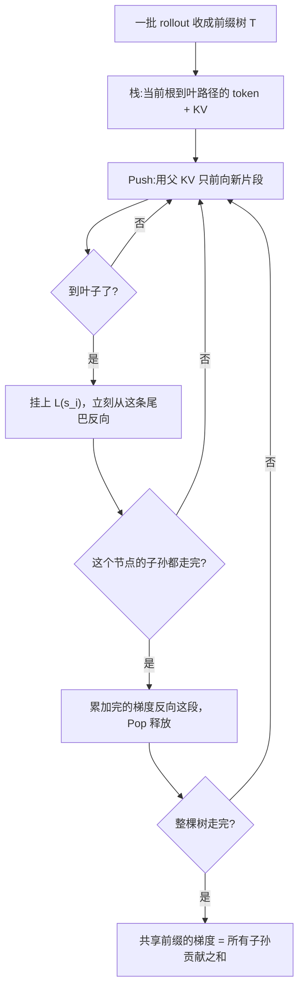

# AReaL-DTA：共享前缀已经长成树，训练算子却还在把每条轨迹单独算一遍

<!-- release-date: 2026-01-31 -->

> 本文依据 **AREAL-DTA: Dynamic Tree Attention for Efficient Reinforcement Learning of Large Language Models**，即 arXiv:2602.00482v2、页眉日期 2026-06-13、共 16 页的 ICML 2026 camera-ready。v1 首次公开于 2026-01-31。十一位作者里，三人共同一作：Jiarui Zhang（港科大 + 清华）、Yuchen Yang（清华）、Ran Yan（港科大 + 蚂蚁 AReaL Team）；通讯作者 Binhang Yuan（港科大）。其余作者来自港科大、清华与蚂蚁 AReaL Team（PDF p. 1）。按主要归属方，本站把它放在 AntGroup 目录下，与前作 [AReaL](/reports/AntGroup/AReaL) 同系列。下文括号中的 `PDF p. N` 均指这份 16 页原件的文件页码。
>
> **截至 2026-09-10 核验，arXiv 上的最新版本就是 v2，与本地原件一致，无需替换原件。** 提交历史为 v1（2026-01-31）与 v2（2026-06-13，camera-ready）。
>
> 这是一篇**训练算子 / 注意力执行**论文，不是异步调度系统文，也不是数据合成文。全文会把三件事分开写：**论文明确写了什么**（带页码）、**本文如何解释它**（凡属推算、换算或从图上读数都会写明）、**外部资料补充**（会给出链接并标注）。

## 先把三层钉死，免得和旁边两篇混起来

AReaL 这一系列在本站会落到三篇不同的材料上，讲的是三个不同的层：

| 层 | 材料 | 它改的是什么 |
|---|---|---|
| 调度 | [AReaL](/reports/AntGroup/AReaL) | 生成和训练拆到两组 GPU、生成可中断、陈旧度限流。回答的是「几百张卡怎样不空转」 |
| 数据 | AReaL-SEA（本站另文） | 多 agent 合成对话，再配每实例可执行的 checker。回答的是「训练数据从哪来、怎么验」 |
| **算子** | **本篇 AReaL-DTA** | **策略训练时注意力怎么执行**。回答的是「同一段共享前缀，前向和反向为什么还要各算十几遍」 |

本篇挂在 AReaL 上，只是因为它把动态树注意力接到了这个异步框架的训练 worker 上（PDF p. 2）。它**不重讲**生成/训练解耦，也**不讨论**数据怎么合成。读完如果只记住「AReaL 又快了一截」，那就是把三层焊回了一层。

## 读之前需要的最少背景

这篇论文假设你已经知道「用强化学习训语言模型」大概是什么样子。不熟的话，记住下面几件事就够。

**一轮 RL 后训练长这样。** 拿一批题目或环境状态，让当前策略模型自己写出若干条回答，这个动作叫 **rollout（轨迹生成）**。每条「上下文 + 回答」序列叫一条 **trajectory（轨迹）**。然后用奖励判断每条轨迹好不好，再用这些带奖励的轨迹去算策略梯度、更新参数。

本篇用的算法是 **GRPO（Group Relative Policy Optimization，组相对策略优化）**（PDF p. 6）。出处与公式见本站 [DeepSeekMath 解读](/reports/DeepSeek/DeepSeekMath)。这里只需要它的一个动作：对同一道题或同一个环境状态，采出一组回答，再拿组内相对表现当 advantage。**一组回答天然共享同一段前缀。** 这就是本篇要吃掉的结构。

还要认识四个词，它们贯穿全文：

- **前缀树（prefix tree）**：把一组序列按公共前缀压成一棵树。树根是大家都有的那段（系统提示、题目、上一轮对话），分叉之后才是各条自己的续写。每个节点是一段被若干条序列共享的 token，每一条根到叶的路径就是一条完整轨迹。
- **KV Cache（Key-Value Cache，键值缓存）**：Transformer 注意力里，已经算过的 Key 和 Value。生成下一个 token 时不必把历史重算一遍。训练里也可以把一段已经前向过的前缀的 KV 留下来，给后续分支接着用。
- **因果掩码（causal mask）**：标准自回归注意力：当前位置只能看见自己和自己左边。高度优化的稠密注意力 kernel 就是为这种规则掩码写的。
- **树掩码（tree attention mask）**：把整棵前缀树打包进一次前向/反向，再用一张不规则的掩码保证每个 token 只能看见自己那条合法前缀，看不见旁支。

最后一个区分：**生成侧的前缀共享，和训练侧的前缀共享，不是一回事。** 推理引擎（vLLM、SGLang 这类）在 rollout 时早就在复用共享前缀的 KV。本篇要动的是下一步：这些轨迹送进策略训练、要算 log-prob 和梯度的时候，默认实现仍把每条轨迹当成一条独立序列，把同一段前缀在前向和反向里各算一遍（PDF p. 1）。论文附录自己也点了这层不对称：rollout 引擎已经在吃前缀复用，DTA 是把对应的共享补到训练侧（PDF p. 15）。

## 一句话先说清

这篇论文要解决的浪费非常具体：

> **一组 rollout 明明共享很长的前缀，策略训练却仍按「一条序列一次完整前向 + 一次完整反向」来算。同一段系统提示、同一段对话历史，在一个训练步里被乘上组大小，反复算。**

它的回答不是「写一个更聪明的稀疏注意力 kernel 把整棵树一次算完」，而是反过来：

- 把 rollout 收成一棵前缀树；
- 用深度优先搜索（Depth-First Search，DFS）遍历这棵树；
- **任意时刻只物化一条根到叶的路径**，共享前缀的前向只做一次，子孙的梯度在反向里累加；
- 过期的后缀算完梯度立刻弹出、释放；
- 多卡时再按 DFS 顺序做负载均衡切分，避免把共享前缀拆到不同 GPU 上各算一遍。

名字里的 **DTA** 是 Dynamic Tree Attention（动态树注意力）：「动态」指遍历时才物化当前路径，而不是事先把整棵树打包进一张掩码（PDF p. 2）。

论文在 $\tau^2$-bench 上给出的数字是：相对稠密训练最高 $8.31\times$ 训练吞吐，相对稀疏训练最高 $1.70\times$（PDF p. 1、8）。这两个数字的分母、测的是单卡还是端到端，后面会拆开。先记住一句判断：

> **生成侧已经把前缀共享吃掉了；训练侧还把它当没见过。DTA 补的是这一刀，不是再做一次异步调度。**

这是本文对论文位置的归纳。论文自己把它写成「Dynamic Tree Attention over AReaL」（PDF p. 2），没有用「三层」这个词。

## 旧问题：每条轨迹独立算共享前缀

### 共享从哪来

RL 后训练几乎一定会造出共享前缀。论文举的几类（PDF p. 1）：

- 同一道题采多条续写（推理模型、GRPO 的组采样）；
- 多轮 agent：后面的轮次把前面的 prompt 和 response 留在历史里；
- 同一套系统提示、同一份环境状态，被许多条轨迹共用。

这些分叉轨迹「自然形成一棵前缀树：先共用一根茎，再岔开」（PDF p. 1）。

论文用两个量刻画这棵树能省多少（PDF p. 1–2，Figure 1）：

$$
C=\frac{\eta_{\text{tokens}}}{\eta_{\text{tree tokens}}},\qquad S=1-\frac{1}{C}
$$

- $\eta_{\text{tokens}}$：把每条序列的长度加起来，共享前缀被重复计数；
- $\eta_{\text{tree tokens}}$：前缀树里每个节点的 token 只计一次；
- $C$ 是压缩率，越大说明重复越多；$S$ 是前缀共享率。

在他们评测用的 $\tau^2$-bench rollout 上（PDF p. 2，Figure 1）：

| 口径 | $C$ | $S$ |
|---|---:|---:|
| 整棵树（中间轮次也算节点） | $9.43\times$ | $89.4\%$ |
| 只数叶子（把「本身是别人前缀」的轨迹塌掉） | $5.56\times$ | $82.0\%$ |

$S=1-1/9.43\approx 89.4\%$，与论文给出的数字一致。叶子口径仍然有 $5.56\times$，说明就算不把中间轮次当独立样本，叶子之间的公共茎也足够长。

Figure 1 还标了一条容易被跳过的细节：多轮继续时，后面的轮次会把之前的 prompt / response 留在历史里，**但会丢掉更早的 thinking token**（PDF p. 2，图注）。所以这棵树不是「把每条轨迹的全文都叠在一起」——被共享的是**留下来的历史**，每轮自己的思维链是旁支，走到这一轮就结束。agentic RL 的共享前缀，比「同一道数学题的 16 个回答」更不规则，也更长。

### 稠密训练在浪费什么

现有策略训练流水线通常把每条 rollout 当成独立序列，在策略梯度的前向和反向里反复重算同一段前缀（PDF p. 1）。论文把这叫做策略模型训练的吞吐瓶颈。

用一个小例子把量级摆出来。假设一个训练步里有 16 条轨迹，公共前缀 8,000 token，每条自己的续写 500 token：

- 稠密做法的工作量按序列计：大约 $16\times 8{,}500$ 个 token 位置都要走一遍前向和反向；
- 前缀树上的唯一 token 只有 $8{,}000+16\times 500=16{,}000$。

压缩率 $C=136{,}000/16{,}000=8.5$。前缀这 8,000 个 token 的注意力、MLP、激活值和反向中间量，被算了 16 遍。这个例子是本文构造的，用来说明数量级；论文自己的实测树是 $C=9.43\times$。

注意：rollout 生成时，这 8,000 个前缀 token 的 KV 往往已经在推理引擎里共享过了。浪费发生在**训练步**——为了得到每条轨迹的 log-prob、熵和梯度，实现又把它们当 16 条互不相干的序列喂进训练 kernel。

## 为什么 packed tree-mask 在 RL 里不行

一个很自然的想法是：既然已经是树，就把整棵树打包，用一张树注意力掩码做一次前向和一次反向。论文把这种做法叫做 **Sparse**（PDF p. 1）。推理侧的 SpecInfer、Medusa 走的就是这条路；训练侧最接近的是 Tree Training（Wang 等，2025a），同样把轨迹打进共享前缀树，再用梯度修正保住原来的分支持目标（PDF p. 3）。

论文说，这条路在 RL 后训练里扩展不好，理由有两条，而且两条都会把前缀复用的好处吃回去（PDF p. 2）。

### 理由一：显存跟着整棵树长，不是跟着一条路径长

Sparse 把打包后的树当成 **一份** 训练负载来执行。训练状态——激活、Key/Value、反向中间量——仍然随打包后的树 token 数增长（PDF p. 2）。树一大，就得开激活重计算，还得把大树切成小树才能塞进 GPU。一切就引入两个倒退：

- 有效前缀复用下降：切成子树之后，子树之间的公共前缀又被各算一遍；
- 实测里 Sparse 的有效压缩率从 $9.43\times$ 掉到 $7.47\times$，而 DTA 仍在整棵树上操作（PDF p. 8）。

也就是说，**打包省下的计算，被「为了塞进显存而切开」再吐回去一部分。**

### 理由二：不规则掩码跑不过高度优化的因果核

树掩码要靠专用的稀疏注意力 kernel。访问模式不规则， **模型浮点利用率（Model FLOPs Utilization，MFU）** 往往低于高度优化的稠密因果注意力 kernel（PDF p. 2）。论文的 Sparse 基线用 FlexAttention 实现，micro-batch token 预算 24K，block size 128（PDF p. 7）。

于是出现一个扎心的局面：你在算法上避免了重算前缀，却在 kernel 上把算力利用率打了折扣。论文的原话是：这些显存和执行开销「常常抵消前缀复用的收益」（PDF p. 2）。

### 所以 DTA 选了相反的方向

不把整棵树一次喂进去，而是**一次只走一条根到叶路径，注意力仍用稠密因果核**（PDF p. 8）。共享靠遍历顺序和 KV 复用实现，不靠一张不规则掩码。这是本篇和 Sparse / Tree Training 的分界。

Tree Training 需要「梯度修正」来保住原来的分支持目标（PDF p. 3），因为打包会改变注意力看到的内容。DTA 每次前向都是一条标准因果路径，注意力图案和「把这条轨迹单独训一遍」相同；目标函数又写成各条序列损失之和（PDF p. 4，式 1），子孙梯度往共享前缀上累加，在加法上就是对的。**论文没有做逐 token 的梯度对照实验**；上面这句等价性是本文按式 1 和「单路径因果核」推的，不是论文给出的形式化证明。

## DTA 机制：一次只物化一条根到叶路径

### 问题形式

设当前训练步有 $N$ 条 rollout $s_1,\ldots,s_N$，每条有一个损失 $L(s_i)$（负对数似然，或 RL 的策略梯度信号）。总目标是求和（PDF p. 4，式 1）：

$$
L=\sum_{i=1}^{N} L(s_i)
$$

把这些序列压成前缀树 $T$。每个节点是一段被若干序列共享的 token，每条根到叶路径对应一条完整的 $s_i$。关键约束是：复用前缀计算，同时 **不要** 让显存跟着整棵树长，也 **不要** 把梯度算错（PDF p. 4）。

### 栈上只留当前路径

DTA 的核心是维护一个栈，表示「从根走到当前节点」的那条前缀（PDF p. 4，Algorithm 2）。栈上随时只有两样东西：

1. 当前前缀的 token；
2. 这些 token 的 KV Cache。

然后用三个动作遍历整棵树。Figure 2 用四条短序列把过程画完了（PDF p. 4）：

```text
s1 = seg1 seg2 seg3
s2 = seg1 seg2 seg4
s3 = seg1 seg5
s4 = seg1 seg6
```

树根是 `seg1`，下面分出 `seg2 / seg5 / seg6`；`seg2` 再分出 `seg3` 和 `seg4`。

**Push（推进子节点）。** 从当前前缀走向一个孩子时，用父节点已经缓存的 KV，只对这段新 token 做一次前向，再把新 KV 追加进栈（PDF p. 4）。`seg1` 和 `seg2` 被 push 一次，之后 $s_1$ 和 $s_2$ 都接着用，不必重算。

**Visit leaf（碰到叶子就挂损失、立刻反向）。** 栈上此时是完整的 $s_i$ 加上前向结果（log-prob、熵等）。在这里算 $L(s_i)$，并把梯度从这条序列的输出端打进去，相当于立刻开始这条分支的反向（PDF p. 4）。不等所有序列都前向完——尾巴那段的计算图，梯度一算完就可以丢掉。

**Pop（子孙走完就弹出）。** 一个中间节点的所有后代都处理完，这段 token 不会再被用到。此时子孙梯度已经累加到这段的 KV 上，DTA 对这段做反向，再把它从栈里弹出、释放（PDF p. 4–5）。Figure 2 里 $s_1$ 走完后，`seg3` 被标成 Discarded，栈回到 `seg1 seg2`，再 push `seg4` 去走 $s_2$。

vanilla 执行就是这三步的递归：push 时 FWD，从孩子返回时 BWD + pop（PDF p. 5，Algorithm 2）。



这是机制示意图，不是实测时间轴，根据 PDF p. 4–5 的 Figure 2 与 Algorithm 2 重画。

### 前向只算一次，反向把子孙加起来

vanilla DFS 里，多条序列共用的前缀在前向里只处理一次；这些序列的梯度，在各自的反向步里累加到这段前缀上，而不是为每条序列把前缀再算一遍（PDF p. 4）。因为总损失是求和，累加就是对的。

可以把栈想成「当前正在写的那条草稿」：公共开头只写一次；写完一条答案，把这条答案特有的段落划掉，退回到分叉点，再写下一条。划掉的时候把这条答案对公共开头的修改意见留下——这就是反向累加。

## 内存为什么只跟最长路径走

vanilla DFS 只保留当前根到叶路径上的 KV 和激活，外加一点栈状态。它不必同时拿着整棵树的激活（PDF p. 5）。因此峰值显存正比于**最长那条序列的长度**（前缀树里最长路径上各段 token 数之和，PDF p. 5 脚注 1），而不是树上全部 token 数。

这是和 Sparse 的根本差别：

| | 稠密 | Sparse（打包树掩码） | DTA |
|---|---|---|---|
| 一次物化什么 | 一条完整序列 | 整棵打包树（或切出来的子树） | 一条根到叶路径 |
| 峰值显存随什么长 | 最长序列 | 树 token 总数 | 最长路径 |
| 注意力 kernel | 稠密因果 | 不规则树掩码 | 稠密因果 |
| 共享前缀算几次 | 每条序列各一次 | 子树内部一次，切子树处重复 | 整棵树上一次 |

论文把这一点写成贡献 1：共享前缀反向一次、被后代复用；过期后缀反向完就释放；活着的激活跟最长序列深度走，不跟树的总 token 走（PDF p. 2）。

**但「只跟最长路径走」不等于「一条路径一定塞得进」。** 一条后缀仍可能长达数万 token，对应的前向/反向图仍然会爆显存（PDF p. 5）。所以后面必须做分块反向。先把这句话记住，否则会以为 DFS 单独就能吃下任意长的 agent 轨迹。

在「一个训练步里同时处理几百条序列」的常见 RL 流程里，这个差别是决定性的：DTA 躲开了打包树注意力那种「显存随整棵树涨」的增长（PDF p. 5）。

## 系统优化：vanilla DFS 还不够快，也不够省

vanilla 的 push-pop 已经能复用前缀，但仍把每条边绑成「一次 FWD + 一次 BWD」。叶子数为 $N_{\text{leaf}}$ 的树上，叶到叶的切换大约要 $2N_{\text{leaf}}$ 轮 FWD/BWD，因为许多短片段被分开 push 和 pop（PDF p. 5）。短反向步容易变成显存带宽瓶颈。

优化版（PDF p. 5，Algorithm 3）改成按叶子顺序 $\pi$ 扫：

- 对每条叶子轨迹，从它和**上一条叶子**的最长公共前缀（Longest Common Prefix，LCP）往外做一次常规 FWD，挂上损失，再把过期后缀 pop 掉；
- 主计算变成 $N_{\text{leaf}}$ 轮常规 FWD/BWD，外加最多 $N_{\text{leaf}}$ 次额外的 **FWD-NoGrad**（只物化脱离计算图的 KV 锚点，供下一次分块 pop 重建计算图）；
- FWD-NoGrad 不是每条叶子的每段都跑，只在 $\ell_{\text{lcp}}<\ell_{\text{next anchor}}$ 时触发。

对 Figure 1 那种 $\tau^2$-bench 结构，优化后的 DFS 顺序让每个轨迹组通常只需要一次这种额外的 FWD-NoGrad（PDF p. 5）。他们 profile 过的运行里，这笔开销大约占总训练时间的 $7\%$，用来换显存可控（PDF p. 5）。$7\%$ 没有标明对应哪次运行、哪个模型，只是「profiled runs」。

优化落在三处。

### 一、贪心决定 DFS 顺序

遍历顺序会显著影响效率（PDF p. 5）。贪心启发式两条：

1. 尽量少做额外前向，也就是尽量复用共享前缀；
2. 让反向片段的长度比较均衡，避免频繁的短反向（短反向容易变成内存带宽瓶颈）。

Algorithm 1 在后序里给每个内部节点排孩子：叶子孩子优先；同类里尾部更短的优先；然后把得到的叶子序再反过来（PDF p. 12）。注释写得很具体：块大小视为无穷时，反转后的 DFS 会把短的、只属于叶子的分支放到后面，这样可以直接 pop，不必再为它们准备 FWD-NoGrad 锚点（PDF p. 12）。消融图里的「DFS」指的就是这个顺序（PDF p. 7）。

### 二、长后缀分块反向

灵感来自 ChunkFlow 的分块调度（Yuan 等，2025）（PDF p. 5）。给定最大块长，例如 2,048 token，把长后缀切成连续块，**从右往左**做分块反向：对每一块，用存好的前缀 KV 和输出做一次局部 FWD，只为这一块建计算图，立刻反向，释放激活，再处理前一块（PDF p. 5）。主实验默认块长 2,048；消融里的「LB」是把块长加到 4,096 的大块变体（PDF p. 7）。

这和「激活重计算」像，但范围更窄：只发生在正在 pop 的那条后缀上，共享前缀的 KV 已经在栈上，不必整树重算。

### 三、FWD-NoGrad 锚点

分块 pop 要重建某一段的计算图，需要这段左端的 KV 已经在。若下一条叶子的锚点比当前 LCP 更深，就先做一次不建梯度的前向，把锚点物化出来（PDF p. 13，Algorithm 3 第 30–31 行）。块越大，这类额外前向越少，显存越高——所以 $7\%$ 和块长是绑在一起的（PDF p. 5）。

**可迁移的部分：** 凡是「共享结构 + 必须出梯度」的场景，不要一上来就打包成一张不规则掩码。先问：能不能让执行顺序迁就共享结构，让每次 kernel 看到的仍是它最能跑满的规则形状？DTA 的选择是：共享交给 DFS 和栈，速度交给稠密因果核。

## 分布式：组树时别把共享前缀拆散

单卡 DFS 解决的是「这一棵树怎么走」。大规模异步 RL 还要把持续产生的 rollout 分到多张训练 GPU 上，每张卡自己建树、自己遍历（PDF p. 5）。AReaL 的生成侧不停产轨迹，训练侧按步消费——调度细节见 [AReaL 篇](/reports/AntGroup/AReaL)，本篇不重讲。DTA 在每一步训练上要回答的是：**这 $N$ 条新轨迹怎么切成 $K$ 组，使得各组的树计算量接近，并且少破坏前缀共享。**

### 切分目标

把 $N$ 条序列分成 $K$ 个不相交的组（$K$ 是训练 GPU 数），第 $j$ 组建树 $T_j$。代价 $C(T_j)$ 在实现里取这棵树的 token 总数（所有节点的片段长度之和）。目标是让最慢那组尽量快（PDF p. 6，式 2）：

$$
\min \max_{j=1,\ldots,K} C(T_j)
$$

这里的 $C(\cdot)$ 是组代价，和前面的压缩率 $C$ 不是同一个符号。论文两处都用了 $C$，阅读时要看上下文。

无约束的均衡划分是 NP-hard 的变体，所以他们不求任意分组，只求 **DFS 连续划分**：先按字典序排好——这是前缀树的一种合法 DFS 叶子序——再把这条有序序列切成 $K$ 段连续区间（PDF p. 6）。

### 为什么必须按 DFS 顺序切，而不能按 token 数贪心

切到不同 GPU 上会引入两种开销（PDF p. 6）：

1. 组之间负载不均；
2. 共享前缀被拆开，各卡各算一遍，整棵大树的复用下降。

按序列 token 数做结构无关的均衡，会把第 2 种开销放大：两条共享很长前缀的轨迹被分到两张卡，这截前缀就变成两份。按 DFS 序把有公共前缀的序列排在一起，再切连续段，复用大多还在。切成 $K$ 段，相对「所有序列建一棵大树」，最多多出 $(K-1)\times \max_i \mathrm{len}(s_i)$ 个 token（最长序列长度乘切点数），在他们的目标负载里相对总 token 数很小（PDF p. 6）。

### 算法：二分最大代价 + 贪心可行性

在固定顺序下，求一组切点使最大组代价最小。对最大允许代价 $\tau$ 做二分：从左到右扫，再加下一条会超过 $\tau$ 就新开一段；若段数 $\le K$，这个 $\tau$ 可行（PDF p. 6，Algorithm 4）。$\tau$ 的搜索范围从「最长单条序列」到「整棵树的 token 数」，时间 $O(N\log C(T))$。扫的时候代价可以增量维护：下一条只把它相对上一条 LCP 之外的后缀算作新的树 token（PDF p. 6）。

若最优 $\tau$ 对应的段数少于 $K$，再把非单点区间拆开，凑满 $K$ 组（PDF p. 14）。这是为了 GPU 不闲着，不是为了进一步降低最大代价。

对照基线在图例里写成 FFD：把下一条分给当前负载最轻的 worker，负载用序列 token 总数或 $C(T)$ 来量。论文正文没有展开 FFD 三个字母，只描述了这条贪心规则（PDF p. 8）。DTA 的方法是 DFS 序 + 按 $C(T)$ 做连续划分。关掉负载均衡划分，性能掉 $11.93\%$（PDF p. 9）。这个 $11.93\%$ 没有标明对应几张卡、哪个模型，只作为这一小节的总结数字。

**可迁移的部分：** 分布式里「负载均衡」和「保持共享结构」经常打架。按 token 数均分看起来公平，却可能把共享切碎。先按共享结构把数据排成一条能保持局部性的序，再在这条序上做带上限的连续切分——这比直接做集合划分便宜，也更不容易把公共前缀拆散。

## 实验：什么被证明了，什么没有

### 设置（PDF p. 6–7）

| 项目 | 取值 |
|---|---|
| 稠密基线 | AReaL，标准稠密因果注意力 |
| 稀疏基线 | FlexAttention 树掩码；24K micro-batch token 预算，block size 128 |
| 算法 | GRPO |
| 主负载 | $\tau^2$-bench 多轮轨迹（整树 $C=9.43\times$，叶子 $C=5.56\times$） |
| 模型 | 吞吐与显存消融：Qwen3-1.7B / 4B / 8B / 14B；端到端：1.7B 与 8B |
| 上下文 | 训练上下文 16K |
| 硬件 | 8 张 Nvidia H800 |
| DTA 默认块长 | 2,048；LB 变体 4,096 |
| 反向消融口径 | 只计量梯度计算步的时间和峰值显存，不含优化器状态更新 |

$\tau^2$-bench 论文引用的是 Yao 等 2024 的 $\tau$-bench（PDF p. 11）。**外部补充：** $\tau^2$-bench 是 Sierra 在 2025 年对 $\tau$-bench 的后续，强调 agent 与用户共享动作空间的双控制设定，仓库在 [sierra-research/tau2-bench](https://github.com/sierra-research/tau2-bench)。论文正文没有解释 $\tau$ 和 $\tau^2$ 的差别，只把它当「前缀共享很重的多轮 RL 负载」。本篇评的是训练吞吐和奖励曲线，不是 $\tau^2$-bench 的任务成功率。

需要激活重计算才能在 16K 上跑起来的稠密变体，图里写成 Dense+CKPT（PDF p. 7）。Dense+Leaf 是把「本身是别人前缀」的序列合并掉，只留叶子——论文说这一步单独就能带来 $1.67\times$ 加速（PDF p. 8）。它只去掉被包含的中间轨迹，**叶子之间的公共茎仍会被各算一遍**，所以 $1.67\times$ 远小于叶子压缩率 $5.56\times$。真正把茎只算一次的，是后面的 Tree / DTA。

### 端到端：训练变快之后，卡应该挪去生成（RQ1）

异步流水线里，生成 GPU 和训练 GPU 的配比会被训练吞吐改写。论文手工调出的最优并行策略（PDF p. 7，Table 1）：

| 模型 | 系统 | 生成 + 训练 |
|---|---|---|
| 1.7B | AReaL-DTA | dp5-pp1-tp1 + dp3-pp1-tp1（5 张生成 / 3 张训练） |
| 1.7B | AReaL | dp2-pp1-tp1 + dp6-pp1-tp1（2 / 6） |
| 8B | AReaL-DTA | 同样 5 / 3 |
| 8B | AReaL | 同样 2 / 6 |

DTA 把训练变快了，就可以把更多卡分给 rollout；AReaL 的训练 GPU 效率低，不得不把 6 张卡留在训练侧，生成反而变少，端到端被拖住（PDF p. 7）。附录把这件事写成理想流水线吞吐（PDF p. 15，式 3）：

$$
T_{\mathrm{e2e}}(N_{\mathrm{roll}})=\min\left(T_{\mathrm{train}}\frac{N_{\mathrm{train}}}{N},\; T_{\mathrm{roll}}\frac{N_{\mathrm{roll}}}{N}\right)
$$

训练侧的 $T_{\mathrm{train}}$ 变大，最优解会把 $N_{\mathrm{roll}}$ 加大。Table 2 是同一套 8 卡上的实测扫描，单位是 K tokens/s，每对里最好的配比加粗（PDF p. 15）：

| 模型 | 系统 | 1/7 | 2/6 | 3/5 | 4/4 | 5/3 | 6/2 | 7/1 |
|---|---|---:|---:|---:|---:|---:|---:|---:|
| 1.7B | AReaL | 40.8 | **52.1** | 43.8 | 42.2 | 34.9 | 26.1 | 13.5 |
| 1.7B | AReaL-DTA | 41.1 | 56.8 | 58.3 | 62.0 | **66.7** | 49.4 | 40.3 |
| 8B | AReaL | 14.5 | **22.6** | 20.5 | 17.2 | 13.8 | 9.0 | 5.1 |
| 8B | AReaL-DTA | 10.9 | 27.5 | 36.3 | 37.0 | **51.4** | 47.0 | 21.5 |

用各自最好配比相除：$66.7/52.1=1.28\times$，$51.4/22.6\approx 2.27\times$，对应正文写的端到端 $1.28\times$（1.7B）和 $2.28\times$（8B）（PDF p. 7）。$2.28\times$ 相对 2.27 有一点四舍五入。

有两处读表时容易漏：

1. **8B、1/7 时 DTA 反而更慢**（10.9 vs 14.5）。几乎所有卡都去训练、只留 1 张生成时，DTA 多出来的训练能力没有输入可吃，遍历开销还会露出来。论文没有单独讨论这一格，但这格说明 DTA 不是无条件的端到端加速，它依赖「训练不再是短板」之后把卡还给生成。
2. **贡献 3 还写了训练集群最高 $6.20\times$、单训练 worker 最高 $8.31\times$**（PDF p. 2）。$8.31\times$ 在单卡消融里复述过（PDF p. 8）；$6.20\times$ **没有出现在 Table 1/2/3 的任何一格**，也没有标明对应几张训练卡、哪个模型。正文只在贡献列表里出现一次。

奖励曲线：Figure 3 以训练步为横轴，两种系统在 1.7B / 8B 上形状相近但不完全重合——论文归因为异步 RL 固有的非确定性，并据此说 DTA 的设计没有损害训练稳定性（PDF p. 7）。Figure 4 换成累计墙钟时间，DTA 更快走到同一步的奖励（PDF p. 7）。横轴大约：1.7B 到约 12,000 秒，8B 的 AReaL 到约 20,000 秒（数值是本文按图读的近似值）。两条图都只画到约 40 个训练步，**没有报告 $\tau^2$-bench 任务成功率，也没有说训出来的 agent 一样强**。被支持的是「奖励曲线没走坏」和「同样奖励来得更快」。

### 单卡消融：8.31× 是怎么叠出来的（RQ2）

Figure 5 是 $\tau^2$-bench 上的单卡训练吞吐，缺柱表示 OOM（PDF p. 8）。论文给出的叠加是：相对 Dense+CKPT，Tree 方法最高 $7.53\times$；加上优化 DFS 顺序到 $7.74\times$；显存够用时把块长加大（LB）到 $8.31\times$（PDF p. 8）。图本身没有标柱高，**$8.31\times$ 以正文数字为准**。4B / 8B / 14B 上 Dense、Dense+CKPT、Dense+Leaf 多是 OOM，能站住的稠密变体只剩带重计算的叶子版。

和 Sparse / Sparse+CKPT 比：4B 以上单条长序列的激活已经很大，Sparse 必须开重计算；打包树的训练状态即使重计算仍可能爆，于是还得切子树，有效压缩率掉到 $7.47\times$（PDF p. 8）。Sparse 还要付不规则树掩码的 MFU 代价。DTA 一次只走一条路径，用稠密因果核，从缓存的前缀 KV 建块级计算图，相对 Sparse+CKPT 的吞吐是 $1.52\times$–$1.70\times$，摘要里取了上沿 $1.70\times$（PDF p. 1、8）。

Figure 6 只画了 Qwen3-1.7B 的峰值训练显存（PDF p. 8）。本文按图读的近似值：Dense 约 80 GB，Dense+CKPT 约 40 GB，Tree / Tree+DFS 约 22 GB，Tree+DFS+LB 约 32 GB。相对 Dense「降低超过 50%」（PDF p. 2、8）说得保守——约 80 GB 降到约 22 GB 是七成。LB 块更大，显存回升一截，换的是 Figure 5 里那截最高的吞吐。这张图也解释了「减少对激活重计算的依赖」（PDF p. 2）：Tree 自己已经压到 Dense+CKPT 以下，不必靠 CKPT 活下来。

### 多卡负载均衡

Figure 7 / 8 / 9 分别是 2 / 4 / 8 张卡上的反向吞吐（PDF p. 8–9）。对照是 Dense 或 Tree 配 FFD，FFD 的负载用 $\eta_{\text{tokens}}$ 或 $\eta_{\text{tree tokens}}$ 来量；DTA 是 Tree + DFS 连续划分。图上 Tree + DFS partitioning 在多数面板里是最高的那根深绿柱；Dense 在 8B / 14B 上大量 OOM。关掉负载均衡划分掉 $11.93\%$（PDF p. 9）。图没有印这个百分比，它是正文总结。

### 低压缩：这套算子会在什么负载上赔钱

主实验是前缀共享很重的 $\tau^2$-bench。附录 Table 3 补了三种低压缩负载，单卡 K tokens/s，括号里是相对 AReaL 的倍数（PDF p. 16）：

| 负载 | $L_{\mathrm{avg}}$ | $C$ | $C_{\mathrm{attn}}$ | 1.7B | 4B | 8B | 14B |
|---|---:|---:|---:|---:|---:|---:|---:|
| Modified Prefix（去掉 $\tau^2$-bench 的全局 prompt，只留叶子） | $\approx 1.6$K | 1.42 | 1.17 | $0.58\times$ | $0.77\times$ | $0.94\times$ | $1.31\times$ |
| GSM8K | $\approx 1.8$K | 1.09 | 1.01 | $0.62\times$ | $0.76\times$ | $0.86\times$ | $1.09\times$ |
| AIME | $\approx 16$K | 1.008 | 1.00 | $1.19\times$ | $1.11\times$ | $1.04\times$ | $0.95\times$ |

$C_{\mathrm{attn}}$ 是注意力计算里的有效复用，通常低于 $C$（PDF p. 15）。Qwen3-14B 在 Modified Prefix 和 GSM8K 上开了激活重计算，AIME 上所有模型都开了（PDF p. 16）。

读这张表比读 $8.31\times$ 更有用：

- **短序列、几乎不共享时，小模型会明显变慢。** 1.7B 在 Modified Prefix 上只剩 $0.58\times$，GSM8K 上 $0.62\times$。遍历、建图、FWD-NoGrad 这些固定开销，在短序列上占比很大。
- **长序列即使几乎不共享，也不一定赔。** AIME 的 $C\approx 1$，1.7B 仍有 $1.19\times$。论文没有单独解释这一格；一个和正文吻合的读法是：16K 长后缀上，分块反向本身就在省显存、减少 OOM / 重计算，这笔账和前缀复用不是同一笔。14B 的 AIME 是 $0.95\times$，说明这个好处也不是单调的。
- 论文自己的边界句写得很清楚：收益在「有可观前缀共享」时最大；$C$ 接近 1 时复用有限，还要付动态遍历的开销，尤其小模型（PDF p. 9、15）。

结论里那句「同样硬件预算下可以上更大的组大小、每步更多 rollout」（PDF p. 9），是由显存下降推出来的**含义**，不是他们真的扫过组大小之后测到的结果。文中没有「把 GRPO 的 $G$ 从 16 加到 32」这类实验。

## 限制、没写的和不要外推的

**论文写明的未来工作（PDF p. 9）：**

1. 在线估计前缀共享率和注意力压缩率，动态决定要不要走树执行，避免在低共享负载上付开销；
2. 把 rollout 生成、前缀树构建、训练卡分配放在一起调度，跟着异步 RL 的负载变化一起动；
3. 扩到更多 RL 算法、更长程的 agent 任务、更大的模型规模。

**论文没写、阅读时不要补上的：**

- 没有 $\tau^2$-bench 成功率、pass@k 或人工评测。稳定性证据是约 40 步的训练奖励曲线「相似但不相同」。
- 没有逐 token 的梯度数值对照，没有证明和「每条序列独立训」位级一致。
- 没有和 Tree Training 的实现做头对头比较，只在相关工作里把它归到与 Sparse 相近的打包路线（PDF p. 3）。
- 没有点名 FlashAttention 或给出 kernel 源码级的接入方式；只说用高度优化的稠密因果核。
- $6.20\times$ 训练集群加速没有表、没有图注。
- 没有报告墙钟成本之外的电费、MFU 曲线、通信量。
- 没有在 14B 以上、MoE、或多机多卡超过 8 张 H800 上做端到端。
- 思考 token 从后续历史里丢掉，只出现在 Figure 1 图注，没有当成一项方法来分析。

**适用前提，缺一不可：**

1. 一个训练步里的轨迹确实共享长前缀（多轮 agent、组采样、共用系统提示）；
2. 你改得动策略训练的注意力执行，而不只是改 rollout 引擎；
3. 损失可以按序列求和（或等价地，共享前缀的梯度是各分支贡献的线性叠加）；
4. 你愿意为低共享、短序列负载保留一条退回稠密执行的路。

换到「每条轨迹前缀几乎都不同」的数学短答、或训练框架不允许自定义遍历顺序的场景，DTA 会从加速器变成减速器。Table 3 已经把这件事量出来了。

## 关键词回看

- **前缀树 / 压缩率 $C$ / 共享率 $S$**：用唯一树 token 去除全部序列 token；$\tau^2$-bench 整树 $C=9.43\times$、$S=89.4\%$。
- **稠密训练（Dense）**：每条轨迹独立前向、独立反向，共享前缀按组大小重复计算。
- **Sparse / 树掩码**：把整棵树打包，用不规则掩码保证只看见合法前缀；RL 里显存随树长，还要切子树，MFU 往往低于因果核。
- **DTA（Dynamic Tree Attention，动态树注意力）**：DFS 遍历前缀树，任意时刻只物化一条根到叶路径，注意力仍走稠密因果核。
- **Push / Visit leaf / Pop**：用父 KV 前向新片段；到叶子挂损失并立刻反向；子孙走完就反向这段并释放。
- **最长路径显存**：峰值正比于最长序列的 token 数，而不是树的总 token 数。
- **FWD-NoGrad**：为下一次分块 pop 物化脱离计算图的 KV 锚点；$\tau^2$-bench 上每个轨迹组通常一次，profile 约占训练时间 $7\%$。
- **分块反向**：长后缀按块从右往左 FWD+BWD+释放，默认 2,048，LB 为 4,096。
- **DFS 连续划分**：字典序（合法 DFS 叶序）上二分最大树代价，把共享前缀尽量留在同一张卡上。
- **Dense+Leaf**：只合并「本身是别人前缀」的序列，叶子之间的公共茎仍重复计算；$1.67\times$。
- **流水线配比移动**：训练变快之后，最优从 2 张生成 / 6 张训练换成 5 / 3。

## 最后的判断

AReaL-DTA 的贡献不是又发明了一种注意力，而是指出 RL 后训练里一个错位：**生成侧已经把前缀共享当成默认优化，训练侧的注意力执行还停留在「一条轨迹一份完整计算图」。**

Sparse / 树掩码是面对这棵树时最容易想到的答案，也是推理侧已经走通的答案。论文用两条很硬的系统事实把它挡回去：打包后的训练状态仍随整棵树涨；不规则核的 MFU 吃掉复用。DTA 的反直觉之处在于，它接受「一次只走一条路径」这种看起来更串行的执行，换来三样同时成立的东西——前缀只算一次、显存跟最长路径走、kernel 仍是稠密因果。多卡时再加一条：切分必须迁就树的拓扑，不能只迁就 token 计数。

实验支持的是吞吐和显存，而且支持得很窄：一种高共享的多轮负载、Qwen3 到 14B、8 张 H800、GRPO。低压缩表同样支持它的反面：共享不够时，小模型会赔到 $0.58\times$。端到端的 $2.28\times$ 有一半来自「训练不再是短板之后，把卡还给生成」，不是 DFS 自己变出来的魔法——Table 2 的 5/3 对 2/6 把这层写死了。

如果只记一句话，可以记：

> **共享前缀是训练数据的结构，不是推理引擎的专利。先让执行顺序迁就这棵树，再让每次 kernel 看到它最能跑满的那条因果路径；显存就会跟着最长的那条走，而不是跟着整棵树走。**

## 资料与阅读边界

- 原始依据：本地 `papers/AntGroup/AReaL-DTA.pdf`，即 arXiv:2602.00482v2，页眉 2026-06-13，16 页，ICML 2026 camera-ready。
- arXiv 页面：<https://arxiv.org/abs/2602.00482>。提交历史为 v1（2026-01-31 03:05:34 UTC）与 v2（2026-06-13 05:02:53 UTC）。截至 2026-09-10 核验没有更新版本。`release-date` 取 v1 首次公开日 2026-01-31，因为本篇对象是这项技术，不是某个对外可调用的模型权重。
- 论文给出的代码：<https://github.com/areal-project/AReaL/tree/feat/dta>。这是外部补充，不是论文正文。该分支 README 在标题下标注 Actor / critic 使用 `tree_training_mode: dta` 与 `packing_algorithm: dta`，示例目录 `examples/tau2/dta`，并链到幻灯片 `docs/slides/AReaL-DTA-slides.pdf`。2026-05-01 的仓库 News 还提到开发分支 `feat/zero1-dta-archon-dp`「打算合进 main」。以上只说明代码落点，不把源码里未写入论文的实现细节当成论文结论。
- 调度层对照：本站 [AReaL 解读](/reports/AntGroup/AReaL)，arXiv:2505.24298。本篇不重讲异步打断与陈旧度。
- 数据层对照：索引中的 AReaL-SEA（多 agent 合成对话 + 每实例可执行 checker）。那是另一份材料，本篇不引用它的数字。
- 相关工作中的打包树训练：Tree Training，arXiv:2511.00413（PDF p. 3、11）。论文只把它归为与 Sparse 相近的路线，没有做实现对比。
- FlexAttention：Dong 等，arXiv:2412.05496，是 Sparse 基线的实现引用，不是本篇提出的算子。
- 分块反向的灵感：ChunkFlow，Yuan 等，ICML 2025（PDF p. 5、11）。
- GRPO 出处：DeepSeekMath，见本站 [DeepSeekMath 解读](/reports/DeepSeek/DeepSeekMath)。
- 外部补充：$\tau^2$-bench 相对 2024 年 $\tau$-bench 的双控制设定，见 Sierra 博客与 [tau2-bench 仓库](https://github.com/sierra-research/tau2-bench)。论文引用的是 Yao 等 2024，没有写这个后续关系。
- 图中未标出的柱高、曲线点值，凡本文给出的都是按 PDF 原图读出的近似值，并在出现处标明；精确倍数以正文和表格为准。
