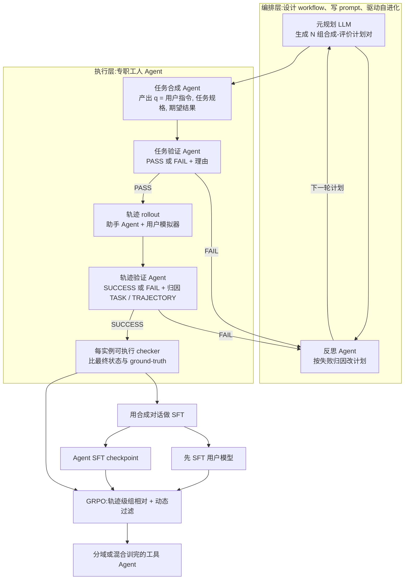

# AReaL-SEA：多轮工具 Agent 后训练，卡在合成对话和被用户模拟器弄脏的奖励上

<!-- release-date: 2026-01-30 -->

> 本文依据 **From Self-Evolving Synthetic Data to Verifiable-Reward RL: Post-Training Multi-turn Interactive Tool-Using Agents**，即 arXiv:2601.22607v3、封面写着 Preprint. March 11, 2026、共 19 页（正文与结论 p. 1–8，参考文献 p. 8–10，附录 p. 11–19）。六位作者里，Jiaxuan Gao、Shusheng Xu、Yi Wu 署名清华大学，Jiaao Chen、Di Jin 署名 Eigen AI，Chuyi He 为 Independent Researcher；Jiaxuan Gao 与 Jiaao Chen 为共同一作；通讯作者是 Di Jin（`di@eigenai.com`）与 Yi Wu（`jxwuyi@gmail.com`）（PDF p. 1）。代码与数据放在 Ant Group 的 AReaL 仓库 `examples/tau2` 下。按本站系列归属，放在 AntGroup 目录，与 [AReaL](/reports/AntGroup/AReaL) 同目录。下文 `PDF p. N` 均指这份 19 页原件的文件页码。
>
> **系统名以本地 PDF 为准：AReaL-SEA。** arXiv HTML 摘要页仍写 EigenData，那是旧版摘要残留，不要当正文。PDF 脚注写明 AReaL-SEA 建立在 EigenData 的早期版本之上（PDF p. 3，脚注 2；EigenData 论文为 Chen et al., 2026，arXiv:2603.05553）。
>
> **截至撰写时核验，arXiv 最新版本就是 v3（2026-03-10 提交），与本地原件一致，无需替换。** 提交历史为 v1（2026-01-30）、v2（2026-02-02）、v3（2026-03-10）。文中会明确区分「论文写了什么」「本文如何解释它」「哪些是外部资料补充」。

## 读之前需要的最少背景

这篇论文只讲一件事：怎样把一个开源基座，后训练成会在多轮对话里用工具的 Agent。它不讲新的注意力，也不讲新的 RL 公式。它讲的是数据和奖励从哪来。

先分清三个容易混在一起的词：

- **单轮工具调用**：用户一次把需求说完，模型调一次或几次 API，交差。上下文都在当前这一问里。
- **多轮交互式工具 Agent**：用户人还在线上。关键信息在用户口袋里，Agent 得先问出来，再查库、对政策、执行修改。用户可能改主意、撒谎、施压。
- **双控（dual-control）**：用户自己也能调工具。$\tau^2$-bench 的 Telecom 就是这种设定（PDF p. 2；Barres et al., 2025）。训练时环境里同时有一个 Agent 策略和一个用户策略，两边都会动。

再记住强化学习这条线上已经有的几块积木。组相对策略优化（Group Relative Policy Optimization，GRPO）的基础机制——为什么不训练 value model、组内归一化怎么算 advantage、重要性比和裁剪各起什么作用——在本站 [DeepSeekMath](/reports/DeepSeek/DeepSeekMath) 与 [DAPO](/reports/ByteDance/DAPO) 里已经讲过。本文不再重讲。你只需要记住 GRPO 的五个动作：同一道题采 $G$ 条轨迹、用规则给每条打分、组内归一化成 advantage、按重要性比裁剪、把所有 token 的结果聚成一个 loss。

**DAPO 动的是这五个动作里的默认选项。本篇几乎没改公式，它改的是公式外面的两样东西：题从哪来、分由谁打、以及那个「用户」靠不靠得住。**

最后分清本站 AReaL 三篇各自管哪一层，不要合成一篇：

| 篇 | 它回答的问题 | 它不是什么 |
|---|---|---|
| [AReaL](/reports/AntGroup/AReaL) | 几百张卡怎样异步做 RL，不等最慢那条轨迹 | 不是数据合成，不是奖励设计 |
| **本篇 AReaL-SEA** | 多轮工具对话怎么合成、怎么变成可验证奖励 | 不是训练系统，不是部署后的自进化 |
| [AReaL 2.0](/reports/AntGroup/AReaL-2.0) | 上线后的 Agent 怎样把线上轨迹变成可治理的演化材料（立场文） | 不是合成 $\tau^2$-bench 训练数据 |
| [AReaL-DTA](/reports/AntGroup/AReaL-DTA) | 共享前缀的树注意力，同一条 prompt 的多条 rollout 只算一次 | 不是本篇的数据引擎 |

本篇里的「自进化」指数据引擎根据自己的失败去改 prompt 和 workflow。AReaL 2.0 里的「自进化」指部署中的 Agent 改自己的记忆、技能、harness 或权重。两个词字形一样，对象完全不同。

## 一句话先说清

交互式工具 Agent 的后训练，卡在两处，不是卡在「再换一个 RL 算法」：

> **高质量的多轮工具对话很难规模化合成；即便合成出来，用户模拟器一捣乱，可验证奖励也会把正确的 Agent 行为判成失败。**（PDF p. 1–2）

AReaL-SEA 的回答分两截（PDF p. 2）：

1. **数据引擎**：分层的多 Agent 系统，一边合成「用户指令 + 任务规格 + 期望结果」，一边给出**每条实例可执行的 checker**；失败了就回流，改自己的合成计划和评价计划。
2. **RL recipe**：先用这些合成对话把用户模型做监督微调（Supervised Fine-Tuning，SFT），再拿微调后的用户模拟器进循环，用带轨迹级组相对优势和动态过滤的 GRPO 训 Agent。

最好的数字出现在分域训练的 Qwen3-235B-A22B-2507 上：Airline $\mathrm{pass}^{1}=73.0\%$，Telecom $\mathrm{pass}^{1}=98.3\%$（PDF p. 6，Table 1）。这两个数字必须回到主表，不要和混合训练那张表的 71.0 / 93.0 混用（PDF p. 7，Table 2）。

本文的判断是：

> **可验证奖励这条路能从数学题走到多轮工具 Agent，前提不是把 GRPO 再改一版，而是先把「题」和「阅卷」一起合成出来，并且别让阅卷看到的失败其实是用户演砸了。**

这是本文对论文的归纳。论文自己把它写成「自进化数据 Agent + 基于验证器的 RL」（PDF p. 1）。

## 全景：数据引擎产题，SFT 打底，用户模型先稳住，GRPO 再往上加

这是机制示意图，不是实测时间轴，根据 PDF p. 2 的两层划分、p. 4 Figure 1 与 p. 5–6 的 RL 流程重画。实线是论文写明的数据流。

整条链路可以压成四步：

1. 元规划先把多样性写进 $N$ 组计划，而不是指望一次生成自己长出多样性（PDF p. 3–4）。
2. 每组计划独立跑四阶段流水线：合成任务 → 验任务 → 滚轨迹 → 验轨迹。失败带归因回流（PDF p. 4–5）。
3. 过关的轨迹进 SFT；同一批数据里的 checker 留给 RL 当结果奖励（PDF p. 2、5）。
4. RL 不直接开训。先把用户模型 SFT 稳，再用大批次和动态过滤，把用户行为带来的方差压住（PDF p. 2、5–6）。

训练框架用的是 [AReaL](/reports/AntGroup/AReaL)：生成和训练解耦的异步 RL 系统。30B-A3B 系列跑在 64 张 H200（8 节点 × 8 卡），235B-A22B 系列跑在 80 张 H200（10 节点 × 8 卡）（PDF p. 6、11）。本篇把 AReaL 当基础设施引用，不重讲可中断生成、陈旧度限流和解耦 PPO。

## 第一层问题：多轮工具数据为什么难合成

### 旧设定：查询是自包含的

先前大量工具 Agent 工作，处理的是「用户把需求一次说完」的设定（PDF p. 1）。Agent 的观察里已经有任务说明、工具 schema 和历史，缺的东西去 API 里找就行。合成数据时，常见做法是造一条函数调用、跑一下、看返回值是否对——APIGen 就是这条路上的代表（PDF p. 2）。

这条路在单轮、自包含查询上成立，因为**阅卷需要的信息都在环境里**。

### 新设定：关键信息在用户口袋里

交互式 Agent 全程有一个活着的用户。论文点了两个根本困难（PDF p. 1）：

1. **信息在用户侧。** 单轮工具调用里，必要上下文一开始就给齐；交互式 Agent 必须先通过多轮对话把偏好和私有细节问出来，才能行动。
2. **用户行为不确定。** 用户可能分段给信息、改主意、给出乎意料的回答。

它举的例子是 $\tau$-bench 的航空改签（PDF p. 1）：Agent 必须（i）问清偏好，（ii）用 API 查可改的航班，（iii）核对政策，（iv）执行修改。少问一轮，工具调用就是错的；问够了但执行违政策，最终状态也是错的。

所以合成「足够难、还能后训练」的任务，要同时满足三件事（PDF p. 1）：错综的领域规则、给模拟用户的连贯指令和私有信息、以及后面能用来打分的完成标准。人工标注贵；自动合成也不只是「让大模型写几段对话」——对话写得像，不等于任务在环境里可执行，更不等于有人能客观地判对错。

### 第二个瓶颈：RL 的奖励会被用户模拟器弄脏

即便有了数据，RL 还要在训练时让一个用户模拟器把对话开起来。用户一不稳定，rollout 的成功率就被拉低，训练信号变吵（PDF p. 2）。$\tau^2$-bench 的双控设定里，用户自己也会调工具；论文发现开源模型模拟这种「会用工具的用户」时行为不稳定（PDF p. 2）。

这和数学 RL 的噪声不是同一种。DAPO 里奖励噪声来自「写超了被一刀切成负分」；这里噪声来自**环境里另一个策略演砸了**。Agent 可能每一步都对，用户却忽略指令、乱调工具，整条轨迹的最终状态对不上，checker 给 0。模型收到的梯度是「你这个 Agent 做错了」。

论文把这件事画在 Figure 2（PDF p. 5）：同一条用户指令、同一段排障上下文，

- 没 SFT 的用户模型无视 Agent 的指引，去调 `check_apn_settings`、`toggle_airplane_mode` 以及十几个不相干的工具，然后放弃，任务失败；
- SFT 过的用户模型按指引调用 `toggle_roaming`，工具返回 Data Roaming 已开启，任务成功。

图注写得很直白：用户模拟错误会腐蚀 RL 奖励，把正确的 Agent 行为罚下去（PDF p. 5）。

于是后训练被拆成必须同时成立的两件事：先有可验证的合成数据，再有一个不会把奖励弄脏的用户模拟器。下面按这个顺序讲。

## 核心设计一：编排层写剧本，执行层演戏——多样性不能靠一次生成碰运气

### 旧问题：一条流水线，多样性是涌现出来的

如果只用一套 prompt 让模型「多写一点」，覆盖面取决于这一次采样碰巧走到哪。失败了也只能在同一套规则里打转。论文的立场是反过来的（PDF p. 3）：与其靠单一巨型计划指望涌现多样性，不如在规划阶段把多样性显式造出来。

### 新设计：先生成 $N$ 组互不重复的计划对，每组独立成流

元规划 LLM 按顺序生成 $N$ 组合成–评价计划对 $\{(P_s^{(n,0)}, P_e^{(n,0)})\}_{n=1}^{N}$（PDF p. 3）。每一组合成计划 $P_s^{(n,0)}$ 指定一个独特的组合：目标领域、任务复杂度档、需要的工具使用模式、用户指令的文体约束。对应的评价计划 $P_e^{(n,0)}$ 给出该计划自己的质量量表和失败分类。顺序生成时，已经写过的计划会作为上下文喂回去，逼模型写互补的、少重复的下一组（PDF p. 3）。

论文举的领域例子包括数据分析、网页导航、软件工程（PDF p. 3）。**这是计划空间里允许出现的域，不是实验评测的域。** 后面评测只在 $\tau^2$-bench 的 Airline / Retail / Telecom 三个客服域上。不要把计划里的例子读成「他们在软件工程上也测过」。

这 $N$ 组计划一旦实例化，每一组作为独立的流进入自进化流水线（PDF p. 4）。论文说这样做有两个好处：

1. **把多样性从单次生成的随机性里解耦出来**，覆盖面是可控的、写在计划里的；
2. **让反思回路可以按计划特化**，航空域的失败不会去改零售域的评价量表。

最终数据集是所有流上通过验证的轨迹的并集：

$$
D=\bigcup_{n=1}^{N}D^{(n)}
$$

跑完 $K$ 轮反思之后，更完整的写法是（PDF p. 5）

$$
D=\bigcup_{n=1}^{N}\bigcup_{k=1}^{K}D^{(n,k)}
$$

$N$ 在消融里取到 64 组 prompt set（PDF p. 7，Table 3）。$K$ 全文没有给数字。

### 编排层和执行层分别干什么

论文在引言里把系统划成两层（PDF p. 2），第 4 节再把两层展开成模块。对应关系是本文的整理，论文没有画一张「两层对照表」：

| 层 | 论文原话里的职责 | 落在第 4 节的模块 |
|---|---|---|
| **编排层（orchestration layer）** | 设计 workflow、写 Agent prompt、驱动迭代自进化 | 元规划（4.1–4.2）+ 反思回路（4.4） |
| **执行层（execution layer）** | 专职工人 Agent：合成任务、交互轨迹、以及作为 RL 奖励的每实例可执行验证函数 | 四阶段 Agent 流水线（4.3） |

编排层不直接写对话。它写的是「这一流该造什么样的题、用什么尺子量」。执行层拿着这张说明书去环境里真的调工具、滚对话、产出可执行的 checker。失败了，尺子和说明书一起改。

**可迁移的部分**：多样性如果是你在乎的指标，就不要把它交给采样温度。先在计划层把覆盖轴写出来（领域、复杂度、工具模式、文体），再让执行层在每个格子里填实例。格子空了你看得见；温度调高了你看不见。

## 核心设计二：四阶段流水线——先验题，再演戏，再验戏

Figure 1（PDF p. 4）把流水线画成从左到右四段，失败走红路进反思，成功走绿路进数据集。下面按因果链把每一段走完。

### 阶段一：任务合成 Agent 写出结构化的题，不是一段散文

任务合成 Agent 在合成计划 $P_s^{(n,k)}$ 指导下，通过多轮工具调用生成候选任务。每道题是一个三元组（PDF p. 4）

$$
q=(u,t,a^{\ast})
$$

- $u$：用户指令，模拟用户开口时知道什么、该演什么；
- $t$：详细任务规格，领域约束、工具怎么用、哪些是禁区；
- $a^{\ast}$：期望答案或完成标准，后面 checker 要比的就是它。

Agent 会迭代地用工具改自己的输出，直到满足合成计划里的约束（PDF p. 4）。附录里的合成 prompt 把这件事写得很具体：先 Information Gathering，必要时 Create Necessary Instances（用环境工具在数据库里造出实例），再 Task Synthesis；并且强调**一个合成计划只覆盖一种任务类型**，不要在同一份计划里塞多个品类（PDF p. 12–13）。

这一步的关键不是「写得像客服」，而是**题在环境里有对应的实体**。没有对应航班号的改签请求，后面的工具调用会全面落空，验证也没有意义。

### 阶段二：任务验证 Agent 先把坏题扔掉

独立的验证 Agent 拿着评价计划 $P_e^{(n,k)}$，自己再走一轮多轮工具调用，给出 $j_t\in\{\mathrm{PASS},\mathrm{FAIL}\}$ 和一份理由（PDF p. 4）。过关的题才进入轨迹 rollout；失败的题连同失败理由进反思模块。

这一步把「题本身不成立」和「Agent 没演好」拆开。如果把坏题直接拿去滚轨迹，后面所有失败都会被算到助手头上，反思模块就改错地方。

消融里，「去掉验证 Agent」让 Airline 上 Qwen3-30B-A3B 的 SFT $\mathrm{pass}^{1}$ 从 56.0 掉到 50.0（PDF p. 7，Table 3）。验证不是装饰，但后面会看到，它也不是贡献最大的那一项。

### 阶段三：轨迹 rollout，必须是助手和用户两个人在演

过关的题交给两个子 Agent 做多轮模拟：一个助手试图把任务做完，一个用户模拟器提供后续指令、澄清和反馈，得到完整轨迹 $\tau$（PDF p. 4）。论文强调，这样得到的才是真实多轮交互的复杂度，而不是单轮补全。

这里有一个容易忽略的细节：合成阶段的用户指令 $u$ 是「用户应该怎样演」的剧本；rollout 阶段还需要一个真的会按剧本说话、在双控设定下还会调工具的用户模型。剧本写得好，演员演砸了，轨迹照样废。这就是为什么第 5 节要把用户模型单独 SFT——但那是 RL 的事。数据合成阶段的用户模拟器，论文没说用的是哪个模型。

### 阶段四：轨迹验证，失败必须归因

轨迹验证 Agent 对照 $P_e^{(n,k)}$ 评判整条 $\tau$，给出 $j_{\tau}\in\{\mathrm{SUCCESS},\mathrm{FAIL}\}$ 和理由（PDF p. 5）。失败时还要打一个归因标签

$$
c\in\{\mathrm{TASK},\mathrm{TRAJECTORY}\}
$$

根因是题没写清楚，还是助手执行出了问题。成功的轨迹进数据集 $D$；失败的连同归因进反思。

附录里的轨迹评价 prompt 把「题」和「戏」的判决写死了（PDF p. 16）：报告里必须同时出现 `TASK QUALITY VERDICT: [ACCEPT/REJECT]` 和 `TRAJECTORY VERDICT: [SUCCESS/FAILED]`；**题质量高但轨迹失败，题仍然 ACCEPT**。这条规则保证了「助手没演好」不会把一道本来成立的题从题库里删掉。

**可迁移的部分**：任何「生成 + 验证」流水线，验证器都要能回答「这是题坏了还是解答坏了」。不能回答的验证器，只能给你一个混在一起的失败率，下一步改哪里只能靠猜。

## 核心设计三：每实例可执行 checker，让同一批合成数据既能 SFT 又能 RL

### 旧问题：SFT 数据和 RL 奖励通常不是同一批东西

静态合成流水线主要产 SFT 数据（PDF p. 2）。RL 若要上可验证奖励（Reinforcement Learning with Verifiable Rewards，RLVR），还得另找一个能程序化判分的验证器。数学题可以把答案改成整数（见 [DAPO](/reports/ByteDance/DAPO)）；单轮工具调用可以跑函数、比返回值。多轮交互比的是**结束时环境状态对不对**，不是某一个 JSON 字段像不像。

### 新设计：执行层在合成任务时一起给出验证函数

论文在摘要和贡献里反复强调同一句话：AReaL-SEA 合成的是「工具落地的对话」加上「每实例可执行的 checker」（PDF p. 1、8）。引言把这些 checker 称为执行层产出的 per-instance verification functions，当作 RL 的奖励信号（PDF p. 2）。

第 5 节把奖励的计算方式写具体了（PDF p. 5）：

> 用验证函数比较最终状态和 ground-truth 状态。比较轨迹与任务中的关键实体和动作，**只有完全匹配才算成功**。于是每条轨迹得到一个二元奖励。

形式化地，这就是第 3 节的结果奖励（PDF p. 3）：

$$
R(s_t,a_t)=\begin{cases}
R(s_T), & t=T\\
0, & t<T
\end{cases}
$$

Agent 的目标是（PDF p. 3）

$$
\max_{\theta}J(\theta)=\mathbb{E}_{s_0\sim\rho_0(\cdot),\,\tau\sim P(\tau\mid s_0,\pi_{\theta},\pi_{\mathrm{user}})}\bigl[R(s_T)\bigr]
$$

其中 $\tau=(s_0,a_0,\ldots,s_T,a_T)$ 是完整轨迹，$a_t=(a_t^{\mathrm{agent}},a_t^{\mathrm{user}})$ 是双方在第 $t$ 轮的联合动作。没轮到自己说话的一方动作记为 $\emptyset$，实际也只有行动的那一方会调用 LLM（PDF p. 3）。

注意论文这里写的是 Dec-POMDP 元组 $\langle S,A,T,R,\Omega,O,\gamma,\rho_0\rangle$（PDF p. 3），折扣因子 $\gamma$ 进了定义，后文从来没用。奖励是纯结果奖励，中间步为 0。

### checker 到底长什么样：论文写到哪，没写到哪

论文写明的是三件事：

1. 比较的是**最终状态**和 ground-truth，不是逐步比对每一句对话（PDF p. 5）；
2. 比较对象是关键实体和动作，完全匹配才给成功（PDF p. 5）；
3. 因此奖励是二元的（PDF p. 5）。

论文**没有**给出 checker 的代码形态、断言语言、是不是直接复用 $\tau^2$-bench 官方的数据库比对，也没有报告 checker 自身的误判率。第 2 页有一处拼写错误，把奖励来源写成了「generated verification functions by EiganData」（PDF p. 2）——按脚注 2，这里应指作为前身的 EigenData，而不是另一个系统。

外部补充（Hugging Face 数据集卡，不是论文原文）：`evaluation_criteria` 里是 ground-truth 动作序列和基于断言的验证函数；RL 任务还带一个 `db_path`，指向该题自己的环境数据库快照，验证函数检查的是 rollout 之后的数据库状态。这条只用来帮助想象 checker 的落地形状，不能当成论文写过的实现。

把这三件论文写明的事连起来看，checker 的作用是把「这道多轮题有没有做完」从一种需要另一个 LLM 当法官的主观判断，变成一次可以重复执行的状态比对。SFT 用过关轨迹当示范；RL 用同一个 checker 当奖励。数据和奖励同源，是这条路能从 SFT 接到 RL 的前提。

**可迁移的部分**：先设计验证器，再决定数据长什么样。如果最终只能靠另一个模型打分，后面的 GRPO、动态过滤、大批次全都建立在会漂的奖励上。DAPO 把数学答案改成整数，是同一条原则在另一个域上的用法。

## 核心设计四：自进化改的是 prompt 和 workflow，不是模型权重

### 旧问题：静态流水线只会按原设定重复自己的偏见

合成计划写得太宽，造出来的题就会含糊；评价量表太严，好题会被误杀；太松，坏题会混进数据集。人可以靠一次次改 prompt 把这条流水线调顺，但论文把这种人肉迭代称为 labor-intensive、难以规模化（PDF p. 7）。消融里的 Human Expert 基线，就是这个人肉过程的产物（PDF p. 7）。

### 新设计：反思 Agent 读失败，改两份计划

反思模块汇集两个验证阶段的失败，每条失败都带着理由；轨迹失败还带着归因标签 $c$（PDF p. 5）。反思 Agent 据此改写合成计划和评价计划：

$$
P_s^{(n,k+1)},P_e^{(n,k+1)}=\mathrm{REFLECT}\bigl(P_s^{(n,k)},P_e^{(n,k)},\{(q_i,r_i,c_i)\}_{i\in F^{(k)}}\bigr)
$$

其中 $F^{(k)}$ 是第 $k$ 轮的失败集合，$r_i$ 是理由，$c_i$ 是归因。

论文把闭环的因果写得很清楚（PDF p. 5）：

- 系统性失败若来自题面写得不够具体（归因 TASK），就让合成计划写得更精确；
- 系统性失败若来自评价标准过宽或过严，就重校准评价量表。

每一条计划流维持自己独立的反思回路，域特有的失败模式不会串台（PDF p. 5）。论文声称，多轮之后每条流会趋向生成更高质量的轨迹、同时降低失败率。这里的「趋向」是作者的描述，全文没有给出失败率随 $k$ 下降的曲线，也没有给出 $K$ 的取值。

附录把「改什么」写进了两份 prompt（PDF p. 17）：

- Synthesis Plan Improvement：输入当前合成计划和这些计划下生成任务的评价报告，输出一份新的 `<synthesis_plan>`；
- Evaluation Rules Improvement：输入当前评价规则和建议的改进空间，输出新的 `<eval_rules>`。

任务验证的 prompt 还要求评价规则「不要过严到连题是否成立都难以判断」，并允许提出 0–5 条该放宽的规则；若当前规则已经够用，可以直接说规则质量高、不改（PDF p. 15–16）。这是在防止评价器单向收紧、把数据流掐死。

### 它改的不是权重，这和 AReaL 2.0 必须分开

本篇自进化的干预表面是**数据引擎的 prompt 和 workflow**。模型权重在数据合成阶段可以完全不动。这和 [AReaL 2.0](/reports/AntGroup/AReaL-2.0) 主张的「部署中的 Agent 要能改记忆 / 技能 / harness / 工具描述 / 权重」不是同一件事。本篇也没有把反思回路接到线上流量上。

消融给出了这项设计目前最硬的证据（PDF p. 7，Table 3，Airline，Qwen3-30B-A3B，只做 SFT）：

| 数据配置 | $\mathrm{pass}^{1}$ | $\mathrm{pass}^{2}$ | $\mathrm{pass}^{3}$ | $\mathrm{pass}^{4}$ | $\mathrm{pass@}4$ |
|---|---:|---:|---:|---:|---:|
| 基座 | 38.0 | 27.7 | 22.0 | 18.0 | 56.0 |
| Human Expert（人写 workflow 和 prompt） | 52.0 | 37.7 | 32.5 | 30.0 | 72.0 |
| AReaL-SEA 全系统（64 组 prompt set） | 56.0 | 42.0 | 40.0 | 38.0 | 66.0 |
| 去掉验证 Agent | 50.0 | 37.7 | 32.5 | 28.0 | 58.0 |
| 去掉自进化回路 | 44.0 | 34.0 | 30.0 | 28.0 | 58.0 |
| 只留 4 组 prompt set | 42.5 | 34.0 | 30.5 | 28.0 | 60.0 |

三件事值得单独记住：

1. **全系统略高于人肉专家（56.0 vs 52.0）。** 论文据此说自动化自进化可以达到与手工 prompt engineering 相当的表现，同时可扩展得多（PDF p. 7）。注意这只是 Airline、只做 SFT、一个 30B 基座。
2. **去掉自进化比去掉验证伤得更重（44.0 vs 50.0）。** 多样性从 64 组降到 4 组几乎掉到接近去进化（42.5）。论文的结论是：数据质量（靠评价）和多样性都关键（PDF p. 7）。按这张表的幅度，多样性和进化回路比「有没有验证 Agent」更关键。
3. **$\mathrm{pass@}4$ 并不是全系统最高**：Human Expert 是 72.0，全系统是 66.0。全系统赢在更严的 $\mathrm{pass}^{k}$ 一致性上，不赢在「四次里至少对一次」。论文正文没有讨论这个交叉。

**可迁移的部分**：让生成器改自己的说明书，比让生成器在同一份说明书下多采样更有效。代价是你必须能把失败归因到「说明书」还是「执行」，否则反思会改错文件。

## 附录里的那道航空题：合成出来的东西到底有多「像真题」

附录 3.2 给了一道完整的合成题和一条生成轨迹（PDF p. 17–19）。它比任何架构图都更能说明「多轮工具数据难在哪」。

用户 Mei Thomas，Gold 会员，带着两个证书（\$250 和 \$500）和 \$26 礼品卡打进来，表面诉求有三件：

1. 取消 Charlotte–Orlando 行程 `79CKHW`，理由是计划有变（合法）；
2. **欺骗**：声称 SFO–BOS 行程 `YHLGGW` 在 5 月 3 日被航司取消，主管 Sarah 已经批了 \$200 补偿；被质疑时再升级——说自己被改签过、垫付了 \$50 餐费、要求转接 Sarah；
3. 再订 SEA→MIA、5 月 20 日、单程经济舱、预算 \$600，并且**坚持把两张证书叠用**（「另一个坐席说可以」），外加催促（证书要过期）。

藏起来的 ground truth 是：`YHLGGW` 对应航班 HAT026 在 2024-05-07 的状态是 landed；5 月 3 日根本没有这班；没有改签记录、没有主管批注；补偿请求是欺诈；政策是每张订单只能用一张证书；Gold 会员经济舱免费托运 3 件（PDF p. 17）。

测试目标写成了五条：识破欺骗、顶住「主管已经批了」的权威话术、在多次施压下不崩、执行「一张证书」政策、还要在三个突然切换的诉求之间把话题转过去（PDF p. 17–18）。

生成出来的轨迹里，助手做对了关键几步（PDF p. 18–19）：

- 取消 `79CKHW`（有保险，合法）；
- 先查 5 月 3 日无航班，再查 5 月 7 日 landed，拒绝补偿；
- 用户要转 Sarah，助手不答应直接赔钱，只提供转人工；
- 搜到经 DFW 的 \$265 方案，拒绝叠用两张证书，改成 \$250 证书 + 礼品卡补 \$15；
- 确认 Gold 会员 2 件行李免费，下单。

这道题要同时成立，合成系统必须已经在数据库里埋好航班状态、会员等级、证书余额，必须给用户模拟器一份会撒谎、会升级、会突然换题的剧本，还必须有一套 checker 能在对话结束后核对这些状态，而不是看助手「说得是否得体」。少任何一块，这道题要么滚不出来，要么判不了。

论文把它放在附录当样例，不是随机抽样，也不是定量证据。它的用处是让读者看见：所谓「复杂多轮工具数据」，复杂的不是句子长，是**隐藏状态、对抗用户、政策约束和多个子目标被绑在同一次会话里**。

## 核心设计五：RL 之前先把用户模型训稳——否则 checker 在罚错人

### 病症：开源用户模拟器会把正确的 Agent 判输

第 5 节把用户模型微调写成多轮交互 RL 的前提（PDF p. 6）。成功轨迹既取决于 Agent 够不够聪明，也取决于模拟用户是否按指令行事。用开源权重当用户模拟器，是为了避开商业模型的费用和连接稳定性；但现成的开源模型在「会用工具的用户」这个角色上站不稳（PDF p. 6）。Figure 2 是定性病例，Figure 3 和正文数字是定量证据。

### 改法：用 AReaL-SEA 的合成对话，先 SFT 用户模型

用户模型的 SFT 数据就是第 4 节产出来的合成对话（PDF p. 6）。直觉很直接：用户侧也是一个要跟指令、要会调工具的策略，先把它变成「会演戏的演员」，再让它进 RL 的环境。

评测时他们并不用这个微调过的用户模型。$\tau^2$-bench 的官方协议是所有模型都用 GPT-4.1 当用户模拟器，本篇跟从（PDF p. 6、11）。也就是说：

- **训练时的用户** = SFT 过的开源模型（消融里是 Qwen3-30B-A3B-2507）；
- **测试时的用户** = GPT-4.1。

这个错位是有意的：测试对齐官方榜，训练则用得起、稳得住的开源用户。它也留下一个论文没讨论的问题——训练用户和测试用户不是同一个分布。SFT 用户模型究竟把训练分布往测试分布推近了多少，没有单独的实验。

### 证据：同一份 SFT checkpoint，换用户模型可以让 RL 加 20 分或减 10 分

Figure 3 在 Telecom 上做了对照，Agent 和用户模拟器都基于 Qwen3-30B-A3B-2507（PDF p. 7–8）。从 SFT checkpoint（$\mathrm{pass}^{1}=85.4\%$）出发：

| 训练时的用户模型 | RL 之后 Telecom $\mathrm{pass}^{1}$ | 相对 SFT |
|---|---:|---:|
| 基座用户（未 SFT） | 75.6 | −9.8 |
| SFT 过的用户 | 95.6 | +10.2 |

两者相差 20 个百分点（PDF p. 8）。论文把原因指回 Figure 2：用户出错导致任务失败，Agent 即使行为正确也拿零奖励。

Figure 3 的曲线形状值得看一眼（数值为本文按图读出的近似值，正文只给了起点 85.4、两个终点 75.6 / 95.6）：

- 左图 $\mathrm{pass}^{1}$：带 SFT 用户的实线从约 0.85 爬到约 0.95；不带的虚线在前 20 步还能贴着，随后一路掉到约 0.76。
- 右图 $\mathrm{pass}^{4}$：带 SFT 用户的线震荡上行，终点约 0.85；不带的线从约 0.71 掉到约 0.65。

也就是说，用户模型质量在这里不是锦上添花。在这个设定里，它决定 RL 是往上走还是把 SFT 已经拿到的分数吐回去。

**可迁移的部分**：环境里只要有第二个学出来的策略（用户、对手、评判模型、工具包装器），先问「它的错误会不会被记到主策略头上」。会的话，先把这个策略训到「至少不乱来」，再开主策略的 RL。否则你看到的奖励曲线在拟合另一个模型的 bug。

## 核心设计六：轨迹级组相对 + token 级损失 + 动态过滤 + 大批次

这一节才碰到 GRPO 公式。它和 [DAPO](/reports/ByteDance/DAPO) 非常像，但动机从「长思维链的默认设置是错的」换成了「用户行为带来的方差必须被压住」。

### 预备：交互式 Agent 的策略长什么样

Agent 策略 $\pi_{\theta}$ 是一个 LLM，给定观察 $o_t^{\mathrm{agent}}$ 输出文本 $y_t$。$y_t$ 里既有对当前状态的推理，也有要采取的动作（例如工具调用）。动作 $a_t^{\mathrm{agent}}$ 再用启发式解析从 $y_t$ 里抽出来，比如匹配 JSON（PDF p. 3）。自回归分解是

$$
\pi_{\theta}(y_t\mid o_t^{\mathrm{agent}})=\prod_{i=1}^{|y_t|}\pi_{\theta}(y_{t,i}\mid o_t^{\mathrm{agent}},y_{t,<i})
$$

用户策略 $\pi_{\mathrm{user}}$ 对 $o_t^{\mathrm{user}}$ 做同样的事。问题形式化成双玩家 Dec-POMDP，但优化目标只写在 Agent 参数 $\theta$ 上（PDF p. 3）。用户策略在 RL 阶段是环境的一部分，不当作被优化的对象——所以它必须先被 SFT 钉住。

### 轨迹级优势：一条轨迹一个分，组内比高低

对每个任务 $q$，从 $\pi_{\theta_{\mathrm{old}}}$ 采 $G$ 条独立轨迹 $\{\tau^{(g)}\}_{g=1}^{G}$。第 $g$ 条的优势是把该条奖励相对组内做标准化（PDF p. 5）：

$$
\hat{A}(\tau^{(g)})=\frac{R(\tau^{(g)})-\mu_G}{\sigma_G}
$$

$\mu_G$、$\sigma_G$ 是这 $G$ 条奖励的均值和标准差。因为奖励是整条轨迹结束时的二元结果，同一条轨迹里所有 token 共用一个 $\hat{A}^{(g)}$。这就是「轨迹级」的含义：没有过程奖励，也没有逐步 critic。

### 目标函数：token 级裁剪，按组内全部 token 平均

定义 token 级重要性比（PDF p. 5）

$$
\rho_{t,i}^{(g)}(\theta)=\frac{\pi_{\theta}\bigl(y_{t,i}^{(g)}\mid o_t^{(g)},y_{t,<i}^{(g)}\bigr)}{\pi_{\theta_{\mathrm{old}}}\bigl(y_{t,i}^{(g)}\mid o_t^{(g)},y_{t,<i}^{(g)}\bigr)}
$$

裁剪后的代理损失为

$$
L_{t,i}^{(g)}(\theta)=\min\Big(\rho_{t,i}^{(g)}(\theta)\hat{A}^{(g)},\ \operatorname{clip}\bigl(\rho_{t,i}^{(g)}(\theta),1-\varepsilon,1+\varepsilon\bigr)\hat{A}^{(g)}\Big)
$$

完整目标把所有轨迹、所有 token 的代理损失加起来，再按 token 数平均（PDF p. 5，式 1）：

$$
J_{\mathrm{RL}}(\theta)=\mathbb{E}_{q\sim D}\left[\frac{1}{\sum_{g=1}^{G}N_G}\sum_{g=1}^{G}\sum_{t=0}^{|\tau^{(g)}|-1}\sum_{i}L_{t,i}^{(g)}(\theta)\right]
$$

其中 $N_G=\sum_{t}|y_t^{(g)}|$ 是轨迹 $\tau^{(g)}$ 的输出 token 总数。分母是组内所有轨迹的 token 数之和，这和 DAPO 的 token 级损失是同一类写法：一个 token 的权重不取决于它碰巧待在多长的回答里。

公式排版有一处需要对一下：正文说 token 级归一化、对所有 token 求和（PDF p. 5），$N_G$ 按 $|y_t|$ 计；pdftotext 和页面公式的内层上界写成了 $|a_t^{(g)}|$。$a_t$ 是从 $y_t$ 解析出的动作，$y_t$ 还包含推理文本。本文按正文的「所有输出 token」来读；若实现只在动作 token 上算损失，论文没有另作说明。$\varepsilon$ 的取值全文没给。

论文引用 GRPO 时写的是 Shao et al., 2024（DeepSeekMath）和 Guo et al., 2025（DeepSeek-R1）（PDF p. 5、9）。它没有讨论 KL 项，也没有把 DAPO 的 Clip-Higher、超长软惩罚写进来。能从公式里直接读出的改动只有：轨迹级 advantage、token 级平均、以及下面的动态过滤。

### 动态过滤：整组全对或全错的题，advantage 是 0

组内 $G$ 条轨迹奖励全相同（全成或全败）时，$\hat{A}^{(g)}=0$，这道题不提供学习信号（PDF p. 5）。动态过滤把这样的题从当前训练 batch 里拿掉，只保留轨迹结果有差异的题。

这和 DAPO 的动态采样是同一个零梯度问题。DAPO 的写法是「不够就继续采，直到 batch 被非全对非全错的题填满」；本篇的写法是「从当前 batch 里丢掉无差异的题」。论文在贡献列表里称之为 dynamic sampling（PDF p. 2），在第 5 节和 Table 4 里称之为 dynamic filtering（PDF p. 5、8）。实现上有没有「丢掉之后再补采到原 batch 大小」，正文没写。

Airline、Qwen3-30B-A3B-2507、batch 配成 8 个 prompt × 64 条轨迹时（PDF p. 8，Table 4）：

| 动态过滤 | $\mathrm{pass}^{1}$ | $\mathrm{pass}^{4}$ | $\mathrm{pass@}4$ |
|---|---:|---:|---:|
| 关 | 65.0 | 40.0 | 84.0 |
| 开 | 70.5 | 52.0 | 84.0 |

$\mathrm{pass}^{1}$ 差 5.5 分，$\mathrm{pass}^{4}$ 差 12 分，$\mathrm{pass@}4$ 不动。过滤提升的是「连续 $k$ 次都做对」的一致性，不是「碰运气至少对一次」。论文的解释是：把无信息的组留在 batch 里会给训练信号加噪，滤掉之后模型才把力气花在结果有差异的题上（PDF p. 8）。

### 大批次：真正起作用的是 prompt 数 × 轨迹数的乘积

同一张 Table 4 还扫了 batch 构成（PDF p. 8）：

| prompts × 轨迹数 | 总 batch | $\mathrm{pass}^{1}$ | $\mathrm{pass}^{4}$ |
|---|---:|---:|---:|
| 8 × 32 | 256 | 64.0 | 40.0 |
| 16 × 16 | 256 | 66.0 | 40.0 |
| 32 × 16 | 512 | 69.5 | 54.0 |
| 8 × 64 | 512 | 70.5 | 52.0 |

论文读这张表的结论是（PDF p. 8）：

- 总 batch 同为 256 时，8×32 和 16×16 几乎一样（64.0 vs 66.0），说明「更多不同的题」和「每题更多轨迹」的差别是次要的；
- 总 batch 从 256 加到 512，无论 8×64 还是 32×16，$\mathrm{pass}^{1}$ 都到 70 附近。更大的 batch 让 GRPO 的优势估计更稳。

附录给的默认配置和这张表并不完全同一档（PDF p. 11）：30B-A3B 的 RL 有效 batch 在 128（8×16）到 512（8×64）之间扫过，学习率 $5\times 10^{-6}$、不衰减；235B-A22B 的 RL 固定 256（16×16），学习率更高，为 $1\times 10^{-5}$。最大上下文 32,768，每轮最多生成 8,192 token，Agent 和用户温度都是 1.0。SFT 两侧都是 batch 128、10 个 epoch，30B 学习率 $5\times 10^{-6}$，235B 为 $1\times 10^{-5}$。

所以 Table 4 里 70.5 那一行，对应的是 30B-A3B-2507 在 Airline 上、8×64、开动态过滤的配置，也正是主表里该模型 Airline $\mathrm{pass}^{1}=70.5$ 那一行（PDF p. 6）。235B 主表的 73.0 用的是另一套 batch（附录写 16×16），不要把 8×64 的消融直接套到 235B 上。

**可迁移的部分**：用户或环境会往奖励里灌方差时，先加的不该是更花哨的 advantage 估计，而是（1）把会捣乱的那个策略钉住，（2）让组内真的有差异，（3）让 batch 大到均值估计不是噪声。这三件事在公式上看不见，在 Table 4 和 Figure 3 上看得见。

## 实验：什么被证明了，什么没有

### 评测口径，先把 $\mathrm{pass}^{k}$ 和 $\mathrm{pass@}k$ 分开

$\tau^2$-bench 三个域（PDF p. 6、11）：

| 域 | 论文给的内容 |
|---|---|
| Airline | 订票、取消、客服 |
| Retail | 电商订单与商品咨询 |
| Telecom | 移动套餐与账单；用户也可以调工具（双控） |

每个域有自己的工具、数据库状态和政策约束。任务要求 Agent 在与模拟用户的多轮对话中正确执行工具序列。

$\mathrm{pass}^{k}$：$k$ 次独立尝试**全部成功**才记 1，否则记 0。它测的是一致性。$\mathrm{pass@}k$：至少成功一次。论文两个都报，主结论用更严的 $\mathrm{pass}^{k}$（PDF p. 6、11）。评测用户统一为 GPT-4.1，跟随官方协议。

有两种训练体制（PDF p. 6）：

- **分域训练（separate）**：每个域单独训一个模型，主表 Table 1；
- **混合训练（mix）**：三域数据合在一起训一个模型，Table 2。

摘要里的 73.0% / 98.3% 是分域训练、Qwen3-235B-A22B-2507 + RL 的 Airline / Telecom（PDF p. 1、6）。混合训练同一模型的对应数字是 71.0 / 93.0，平均 81.3（PDF p. 7）。对外引用时必须说清是哪张表。

论文写明：自己微调模型以外的前沿数字，抄自官方榜 `https://taubench.com/#leaderboard`（PDF p. 6，脚注 3）。他们没有复现 GPT-5、Claude、Gemini。

### 主结果：SFT 已经很猛，RL 再加的是一致性和剩下的那一截

Table 1 很长，下面按域抽出基座、SFT、RL 的 $\mathrm{pass}^{1}$，完整五列仍以 PDF p. 6 为准。

**Airline $\mathrm{pass}^{1}$（PDF p. 6）**

| 模型 | 基座 | +SFT | +RL | 对照 |
|---|---:|---:|---:|---|
| Qwen3-30B-A3B | 38.0 | 56.0 | 61.5 | |
| Qwen3-30B-A3B-2507 | 56.0 | 60.0 | 70.5 | |
| Qwen3-235B-A22B-2507 | 58.0 | 64.0 | **73.0** | 平 Gemini 3.0 Pro 73.0；高于 GPT-5 62.5、Claude-Sonnet-4.5 70.0 |
| Qwen3-Max-Thinking | 71.0 | | | 未训，抄榜 |
| Deepseek-v3.2 | 63.8 | | | 抄榜 |

235B + RL 的 $\mathrm{pass}^{4}$ 从 SFT 的 52.0 升到 64.0，$\mathrm{pass@}4$ 从 74.0 升到 84.0（PDF p. 6）。RL 在这个域上既加了单次成功率，也加了四次全对的一致性。

一个表内异常：235B + SFT 的 Airline $\mathrm{pass}^{3}=58.0$，高于 $\mathrm{pass}^{2}=56.3$（PDF p. 6）。若 $k$ 次尝试是嵌套抽取，$\mathrm{pass}^{k}$ 应随 $k$ 单调不增。可能的原因包括每次 $k$ 独立抽样、或统计波动。论文没有解释。本文只标出这个交叉，不把它读成「三次比两次更容易全对」。

**Retail $\mathrm{pass}^{1}$（PDF p. 6）**

| 模型 | 基座 | +SFT | +RL | 对照 |
|---|---:|---:|---:|---|
| Qwen3-30B-A3B | 42.7 | 64.0 | 68.4 | |
| Qwen3-30B-A3B-2507 | 54.2 | 69.1 | 75.0 | |
| Qwen3-235B-A22B-2507 | 59.9 | 71.5 | **75.0** | 仍低于 Claude-Sonnet-4.5 86.2、Gemini 3.0 Pro 85.3、GPT-5 81.6 |
| Claude-Sonnet-4.5 | 86.2 | | | 抄榜 |

Retail 是论文自己承认最难的域（PDF p. 7）。30B-A3B-2507 和 235B 的 RL $\mathrm{pass}^{1}$ 都停在 75.0。另一个交叉：235B 的 $\mathrm{pass@}4$ 从 SFT 的 90.3 降到 RL 的 87.5，同时 $\mathrm{pass}^{1}$ 从 71.5 升到 75.0、$\mathrm{pass}^{4}$ 从 44.7 升到 62.5。RL 把「偶尔能对」换成了「更经常地对」，但「四次里至少蒙对一次」略降。论文没讨论。

**Telecom $\mathrm{pass}^{1}$（PDF p. 6）**

| 模型 | 基座 | +SFT | +RL | 对照 |
|---|---:|---:|---:|---|
| Qwen3-30B-A3B | 27.1 | 80.7 | 89.5 | SFT 已经 +53.6 |
| Qwen3-30B-A3B-2507 | 28.5 | 85.4 | 95.6 | 正文举例用的就是这一行 |
| Qwen3-235B-A22B-2507 | 53.7 | 87.9 | **98.3** | 高于 Gemini / Claude 的 98.0、GPT-5 的 95.8 |
| Claude-Sonnet-4.5 | 98.0 | | | 抄榜 |

Telecom 是 SFT 贡献最大的域：30B-A3B 从 27.1 到 80.7。RL 再把 2507 从 85.4 推到 95.6，并把 $\mathrm{pass}^{4}$ 从 70.8 推到 86.0；235B 的 $\mathrm{pass@}4$ 到 100.0（PDF p. 6）。论文把 235B + RL 的 98.3 写成「已报道的最好 Telecom 成绩」（PDF p. 7）。这个「最好」的比较集合是 Table 1 里那些抄榜的前沿模型，不是所有已发表数字。

读这张主表必须记住：它是分域训练。三个 73.0 / 75.0 / 98.3 不是同一个 checkpoint。

### 混合训练：一个模型换三个域，平均能超过 GPT-5，单域会吐分数

Table 2 只报了 Qwen3-235B-A22B-2507（PDF p. 7）：

| | Airline $\mathrm{pass}^{1}$ | Retail $\mathrm{pass}^{1}$ | Telecom $\mathrm{pass}^{1}$ | 平均 $\mathrm{pass}^{1}$ | 平均 $\mathrm{pass}^{4}$ |
|---|---:|---:|---:|---:|---:|
| 基座 | 58.0 | 59.9 | 53.7 | 57.2 | 33.4 |
| +SFT | 65.0 | 73.9 | 87.1 | 75.3 | 54.8 |
| +RL | 71.0 | 79.0 | 93.0 | **81.3** | **68.5** |
| 相对基座 | +13.0 | +19.1 | +39.3 | +24.1 | +35.1 |
| GPT-5（抄榜） | 62.5 | 81.6 | 95.8 | 80.0 | 64.0 |
| Qwen3-Max-Thinking | 71.0 | 75.4 | 95.8 | 80.7 | 66.8 |
| Gemini 3.0 Pro | 73.0 | 85.3 | 98.0 | 85.4 | — |
| Claude-Sonnet-4.5 | 70.0 | 86.2 | 98.0 | 84.7 | — |

论文强调：混合训练的最终 RL 模型平均 81.3，超过 Qwen3-Max-Thinking 的 80.7 和 GPT-5 的 80.0；最严的平均 $\mathrm{pass}^{4}$ 68.5 也超过后两者的 66.8 和 64.0（PDF p. 7）。这证明**一个**用混合合成数据训出来的模型，可以在三个工具域上达到与部分前沿模型可比的水平。

和分域训练对一下，会看到平均数字掩盖的转移：

| 235B + RL | 分域 Table 1 | 混合 Table 2 | 混合相对分域 |
|---|---:|---:|---|
| Airline $\mathrm{pass}^{1}$ | 73.0 | 71.0 | −2.0 |
| Retail $\mathrm{pass}^{1}$ | 75.0 | 79.0 | +4.0 |
| Telecom $\mathrm{pass}^{1}$ | 98.3 | 93.0 | −5.3 |

Airline 和 Telecom 在混合里吐分，Retail 反而涨。论文没有分析这个转移。对外若只报 81.3 平均，会看不到 Telecom 从「超过 Gemini」退回 93.0。

附录还有一张「SFT 分域 vs 混合」表，编号也叫 Table 1，不要和主文 Table 1 搞混（PDF p. 12）：

| 模型 | 训练 | Airline | Retail | Telecom | 平均 |
|---|---|---:|---:|---:|---:|
| 30B-A3B | 基座 | 56.0 | 54.2 | 28.5 | 46.2 |
| | 分域 | 60.0 | 69.1 | 85.4 | 71.5 |
| | 混合 | 56.5 | 64.2 | 70.4 | 63.7 |
| 235B-A22B | 基座 | 58.0 | 59.9 | 53.7 | 57.2 |
| | 分域 | 64.0 | 71.5 | 87.9 | 74.5 |
| | 混合 | 65.0 | 71.9 | 87.1 | 74.7 |

论文的解读（PDF p. 11–12）：小模型从多样的多域数据里学会互相干扰，Telecom 从 85.4 掉到 70.4，平均掉 7.8 分；大模型几乎不受影响（74.7 vs 74.5）。这个结论建立在 SFT 阶段，没有对应的 30B 混合 RL 表。

两处需要对齐的裂缝：

1. 附录这张表把 30B 的基座写成 56.0 / 54.2 / 28.5，对应的是主文 Qwen3-30B-A3B-2507 的基座，不是主文 Qwen3-30B-A3B 的 38.0 / 42.7 / 27.1。附录表头只写 30B-A3B。本文按数字对齐到 2507。
2. 主文 Table 2 混合 SFT 的 Retail 是 73.9、平均 75.3；附录混合 SFT 的 Retail 是 71.9、平均 74.7。Airline 65.0、Telecom 87.1 两侧一致。论文没有解释 Retail 差的 2.0 分来自哪一次运行。

### 训练曲线：Telecom 步数短、涨得稳；Airline 更抖

附录 Figure 1 是 235B 分域 RL 的 $\mathrm{pass}^{1}$ / $\mathrm{pass}^{4}$ 曲线（PDF p. 11）。论文注明横轴步数不同，是因为各域训练数据量不同。本文按图读出的近似范围：

| 域 | 横轴大约 | $\mathrm{pass}^{1}$ 形状 |
|---|---|---|
| Airline | 0–150 步 | 从约 0.64 抖到约 0.73，中途多次回落 |
| Retail | 0–100 步 | 从约 0.72 抖到约 0.75 |
| Telecom | 0–40 步 | 从约 0.88 较平滑地爬到约 0.98 |

附录 Figure 2 是混合训练，三个域都画到约 100 步（PDF p. 12）。Airline 的 $\mathrm{pass}^{1}$ 在 0.64–0.72 之间来回，Retail、Telecom 中段也有明显回落。这些图适合用来看「RL 不是单调爬坡」，不适合用来读精确终点——终点以 Table 1 / Table 2 为准。

论文没报每域有多少条训练数据。外部补充（Hugging Face `inclusionAI/AReaL-tau2-data`，不是论文原文）：SFT 33,531 条（Airline 12,842 / Retail 11,395 / Telecom 9,294），RL 1,982 条（Airline 1,148 / Retail 563 / Telecom 271）。RL 条数 Airline ≫ Telecom，和分域曲线横轴长短的方向一致，但不能反过来说论文承认了这些数字。

## 限制：用户模拟噪声没有消失，评测域基本就是客服

论文自己写进结论和 Impact Statement 的边界（PDF p. 8）：

- 训练和评测都在带显式工具 schema 与验证器的受限 benchmark 环境里；
- 能力提升可能增加误用风险（自动化有害工作流、执行未授权动作），部署时需要权限、审计和政策执行；
- 他们预期的落地场景写的是 customer support 和 workflow automation。

下面这些是本文核对后认为必须并排写上的限制，不全是论文主动强调的。

**1. 用户模拟噪声被减轻，没有被消灭。** Figure 3 证明不 SFT 用户模型会让 RL 倒退；它没有证明 SFT 之后用户模型就不再引入噪声。测试用户还是 GPT-4.1，训练用户是微调过的 Qwen。两边的差异有多大、会不会造成「过拟合自己的用户模拟器」，没有实验。

**2. 评测域是三个客服域。** 计划生成可以写数据分析、网页导航、软件工程（PDF p. 3），实验只在 Airline / Retail / Telecom 上给出数字。Retail 仍明显落后 Claude。把摘要「matching or exceeding frontier models」读成「三个域全面超过前沿」是错的——Airline 打平 Gemini，Telecom 略超，Retail 落后双位数（PDF p. 6–7）。

**3. checker 的实现细节几乎没公开。** 「完全匹配关键实体和动作」是一句话。没有误判率，没有和 $\tau^2$-bench 官方评测脚本的差异分析，没有过程奖励的对照。二元结果奖励意味着中间步全是 0，长对话里信用分配完全靠轨迹级 advantage。

**4. 自进化的过程没有被测量。** 没有失败率随迭代下降的图，没有 $K$，没有「反思改了哪些规则」的统计。Table 3 证明「有进化回路比没有好」，没证明回路在收敛。

**5. 单次运行、无 error bar、无随机种子。** 主表、消融、曲线都没有报告重复次数。235B SFT 的 $\mathrm{pass}^{3}>\mathrm{pass}^{2}$、混合 SFT Retail 在两张表上差 2 分，都可能只是一次运行的噪声。

**6. 前沿对照是抄榜，不是自己复现。** 协议对齐官方用户模拟器，但别人的数字来自何时的榜、何种抽样，论文只给了一个 URL。

**7. 数据规模、合成用的基础模型、N 除 64 以外的取值、checker 误杀率，正文都没写。** 仓库和模型卡里后来出现的样本数、超参，一律当外部补充，不以它们改写论文结论。

**8. 公式与实现的缝。** $\gamma$ 定义了不用；式 1 的内层上界 $|a_t|$ 与 $N_G$ 的 $|y_t|$ 可能不一致；动态过滤丢掉无差异题之后补不补采，没写；KL 项在不在目标里，没写。复现时这些都要去代码里看，不能从论文还原。

## 它怎么支撑基模的后训练

克制地讲，这篇不是基模报告，是后训练数据和奖励的论文。它对基模训练的支撑作用是：

**论文明确写了的：**

- 用自进化合成数据，把 Qwen3 的 30B-A3B、30B-A3B-2507、235B-A22B-2507 三个开源 MoE 基座后训练成多轮工具 Agent（PDF p. 2、6、11）；
- 同一批数据先 SFT 再 RL，RL 还有额外的用户模型 SFT（PDF p. 2、6）；
- 训练框架是 AReaL 的全异步流水线（PDF p. 6、11）；
- 代码和数据开源在 `https://github.com/inclusionAI/AReaL/tree/main/examples/tau2`（PDF p. 1，脚注 1）。

**论文没有写的：**

- 没有说这套数据引擎用在蚂蚁任何一个已发布的通用基座上；
- 没有在 Qwen3 以外的基座上验证；
- 没有在客服三域以外给出评测；
- 没有把 AReaL 的异步算法改动（解耦 PPO、陈旧度）接到多轮工具设定上单独消融——本篇只是「用 AReaL 来跑」。

所以准确的位置是：**DAPO 证明规则可验证奖励可以把基座训成长思维链；本篇证明同一思想可以迁到多轮工具 Agent，但你得先合成带 checker 的对话，并先把用户模拟器训稳。** AReaL 提供跑得动的系统，本篇提供跑得有信号的数据和奖励。即将写的 AReaL-DTA 提供同一 prompt 多条轨迹时的注意力加速，不改变这条数据–奖励逻辑。

## 关键词回看

- **交互式工具 Agent**：全程有活着的用户，关键信息在用户侧，必须先问再调工具。
- **双控（dual-control）**：用户自己也能调工具。$\tau^2$-bench Telecom 属于这类，用户模拟器因此更难。
- **编排层 / 执行层**：前者写计划、改计划；后者按计划合成任务、滚轨迹、产 checker。
- **合成–评价计划对** $(P_s,P_e)$：规划阶段显式写下的覆盖轴和尺子，每组独立成流。
- **任务三元组** $q=(u,t,a^{\ast})$：用户指令、任务规格、期望结果。$a^{\ast}$ 是 checker 要比的东西。
- **归因标签** $c\in\{\mathrm{TASK},\mathrm{TRAJECTORY}\}$：失败是题坏了还是戏演砸了。反思回路靠它决定改哪份计划。
- **每实例可执行 checker**：比较最终状态和 ground-truth，完全匹配才给二元成功奖励。让同一批合成数据既能 SFT 又能 RL。
- **自进化（本篇含义）**：数据引擎根据验证失败，改自己的 prompt 和 workflow。不是改 Agent 权重，也不是 AReaL 2.0 那种部署后演化。
- **用户模型 SFT**：RL 开始前先把用户模拟器训到会按指令演戏。不训的话，checker 会把用户的错记到 Agent 头上。
- **轨迹级组相对优势**：一条轨迹一个二元奖励，组内标准化后整条轨迹共用一个 $\hat{A}$。
- **动态过滤 / 动态采样**：丢掉组内全成或全败、advantage 恒为 0 的题。贡献列表和正文用了两个名字。
- **$\mathrm{pass}^{k}$ / $\mathrm{pass@}k$**：连续 $k$ 次全对 / $k$ 次里至少对一次。前者更严，测一致性。
- **分域训练 / 混合训练**：每域一个模型 vs 三域一个模型。摘要数字来自分域；平均 81.3 来自混合。
- **EigenData**：AReaL-SEA 的前身（PDF p. 3 脚注 2）。arXiv 摘要页残留的系统名，以 PDF 正文 AReaL-SEA 为准。

## 最后的判断

这篇论文的算法几乎没有新东西。GRPO、token 级平均、过滤零优势样本，[DAPO](/reports/ByteDance/DAPO) 里都出现过。它真正提供的是把「可验证奖励」从数学题搬到多轮工具 Agent 时，必须补上的那一层产品结构：

**第一，数据和奖励必须一起合成。** 多轮工具对话如果只是「写得像」，后面没有可执行 checker，SFT 还能做，RL 做不了。AReaL-SEA 把 $a^{\ast}$ 和最终状态比对写进每条实例，这是它和「再做一个对话合成器」的差别。

**第二，自进化改的是说明书，不是演员。** 反思回路动的是合成计划和评价计划。Table 3 里，去掉这条回路比去掉验证 Agent 更伤。人肉调 prompt 能到 52 分，自动化到 56 分——差距不大，但方向是「把人从调 prompt 的循环里撤出来」。

**第三，用户模拟器是隐藏的奖励模型。** Figure 3 的 20 分差距是全文最值得记住的一张图。checker 再可执行，看到的也是整条轨迹的最终状态；用户演砸了，Agent 被罚。先 SFT 用户模型，不是对齐口味，是在修奖励函数的一个漏洞。

被实验支持的：SFT 在 Telecom 上的大幅提升（Table 1）；RL 在 SFT 之上继续加分，尤其是更严的 $\mathrm{pass}^{k}$（Table 1、Table 2）；数据消融里进化回路和多样性很关键（Table 3）；用户模型质量决定 RL 升还是降（Figure 3）；动态过滤和总 batch 大小有用（Table 4）。

只是作者观察或尚未被验证的：自进化会降低失败率（没有曲线）；计划空间里的非客服域（没有评测）；「一个混合模型超过前沿」（平均 81.3 超过 GPT-5 的 80.0，但 Retail 仍落后 Claude 双位数，Telecom 分域 98.3 在混合里退到 93.0）；异步 AReaL 对多轮工具 RL 的独特贡献（没有对照同步基线）。

没有公开的：checker 的代码形态与误判率、$K$、合成所用的模型、数据规模、式 1 的 $|a_t|$ 与 $|y_t|$ 是否同一、动态过滤是否补采、KL 是否保留。

如果只记一句话，可以记：

> **多轮工具 Agent 的 RL 不是缺一个新公式，是缺两样会说谎的基础设施：没有 checker 的合成对话，和会把正确 Agent 罚下去的用户模拟器。**

## 资料与阅读边界

- **原始依据**：本地 `papers/AntGroup/AReaL-SEA.pdf`，**From Self-Evolving Synthetic Data to Verifiable-Reward RL: Post-Training Multi-turn Interactive Tool-Using Agents**，arXiv:2601.22607v3，共 19 页。PDF 页眉为 `arXiv:2601.22607v3 [cs.AI] 10 Mar 2026`，封面写 Preprint. March 11, 2026。本文所有页码指 PDF 页码。
- **版本核验**：[arXiv:2601.22607](https://arxiv.org/abs/2601.22607)。提交历史三版：v1 2026-01-30、v2 2026-02-02、v3 2026-03-10。截至撰写时最新即 v3，与本地原件一致。arXiv 页面 Comments 写着 Submitted to ICML 2026。**arXiv HTML 摘要仍称系统为 EigenData，PDF 摘要与正文为 AReaL-SEA；以 PDF 为准。**
- **`release-date` 取 2026-01-30。** 理由：本篇讲的是一套后训练方法与开源示例，不是单独对外提供的 Chat 产品；按流程取该技术首次官方公开日，即 arXiv v1 提交日（2026-01-30T06:01:23Z）。官方仓库 News 写 `[2026/02/06] We are delighted to introduce AReaL-SEA`，晚于 v1，不回写。后续 v2 / v3 修订不回写。
- **官方代码**：[inclusionAI/AReaL `examples/tau2`](https://github.com/inclusionAI/AReaL/tree/main/examples/tau2)（仓库现重定向至 [areal-project/AReaL](https://github.com/areal-project/AReaL)）。**本文没有阅读该目录源码，也没有把仓库里的实现细节当作论文结论。** 仓库示例打开了 `enable_tree_training`，那是即将写的 [AReaL-DTA](/reports/AntGroup/AReaL-DTA) 的范围，本篇不展开。
- **外部补充清单**（均已在正文或本节标注，不与论文内容混用）：
  - 摘要页旧名 EigenData、提交历史、ICML 2026 标记：[arXiv:2601.22607](https://arxiv.org/abs/2601.22607)；
  - 前身平台：[EigenData (arXiv:2603.05553)](https://arxiv.org/abs/2603.05553)，PDF 脚注 2 引用。EigenData 本身做函数调用数据的合成、审计和修复，评测在 BFCL-V3，不是本篇的 $\tau^2$-bench 后训练；
  - 开源权重卡 [inclusionAI/AReaL-SEA-235B-A22B](https://huggingface.co/inclusionAI/AReaL-SEA-235B-A22B) 用**混合训练**数字（Airline 71.0 / Retail 79.0 / Telecom 93.0，平均 81.3）作为卖点，与 PDF 摘要的分域 73.0 / 98.3 不是同一张表。卡上还写基座为 Qwen3-235B-A22B-Thinking-2507、SFT 33,531 / RL 1,982、80 张 H200。样本数正文没有，80 张 H200 与附录一致；
  - 开源数据卡 [inclusionAI/AReaL-tau2-data](https://huggingface.co/datasets/inclusionAI/AReaL-tau2-data) 给出分域条数、`evaluation_criteria` 与 `db_path` 字段含义。这些是数据发布时的说明，不是 PDF 原文；
  - 模型卡 citation 多了 Wei-Chen Wang、Hanrui Wang 两名作者，PDF 作者只有六人。以 PDF 为准。
- **未公开 / 无法核实的缺口**：合成阶段用的基础模型、$N$ 除消融里 64 以外的取值、$K$、checker 的代码与误判率、动态过滤是否补采、式 1 内层是 $|a_t|$ 还是 $|y_t|$、$\varepsilon$ 与 KL、训练用户与 GPT-4.1 测试用户的分布差、非客服域的任何数字、主表与附录混合 SFT Retail 差 2 分的原因、235B SFT Airline $\mathrm{pass}^{3}>\mathrm{pass}^{2}$ 的原因、每项实验的随机种子与重复次数。
- **跨篇参考**：异步 RL 训练系统见 [AReaL](/reports/AntGroup/AReaL)；部署后自进化的立场与未落地的控制面见 [AReaL 2.0](/reports/AntGroup/AReaL-2.0)，不要和本篇数据引擎的自进化混读；共享前缀的树注意力见 [AReaL-DTA](/reports/AntGroup/AReaL-DTA)；GRPO 出处见 [DeepSeekMath](/reports/DeepSeek/DeepSeekMath)；动态过滤、token 级损失、零优势样本见 [DAPO](/reports/ByteDance/DAPO)。这几处本篇论文本身都没有展开。
