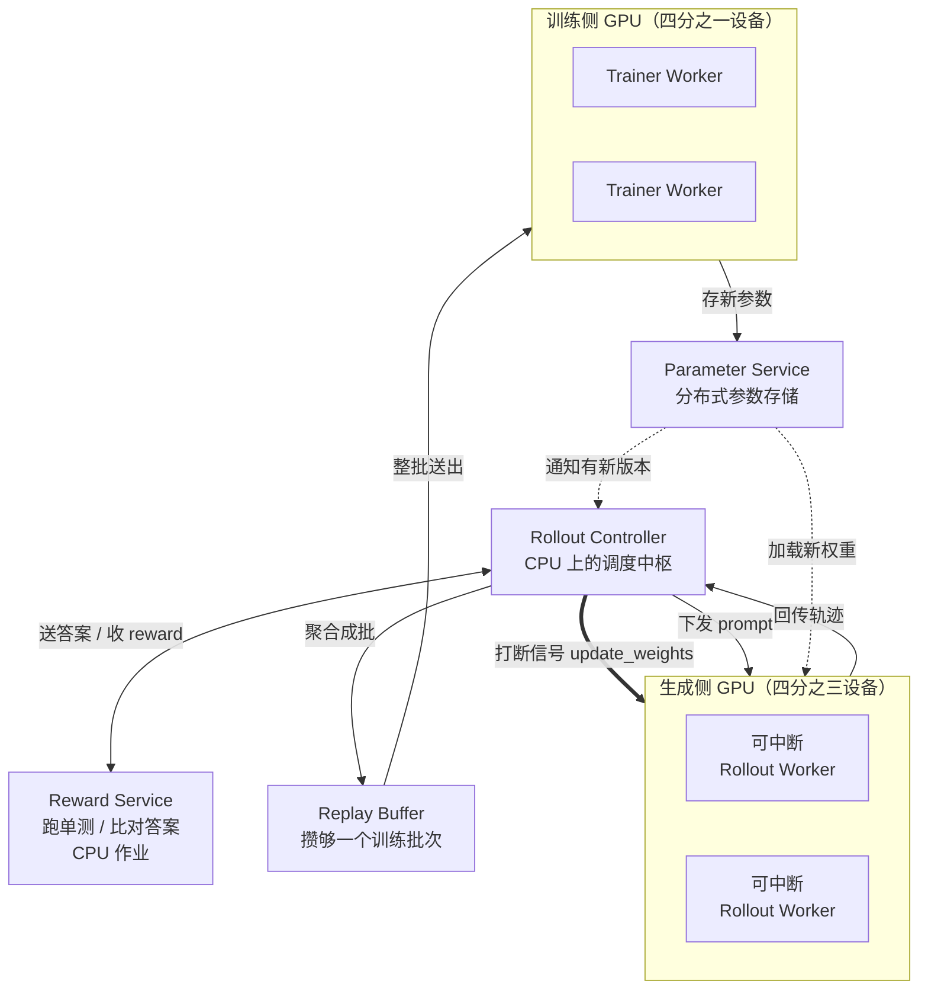
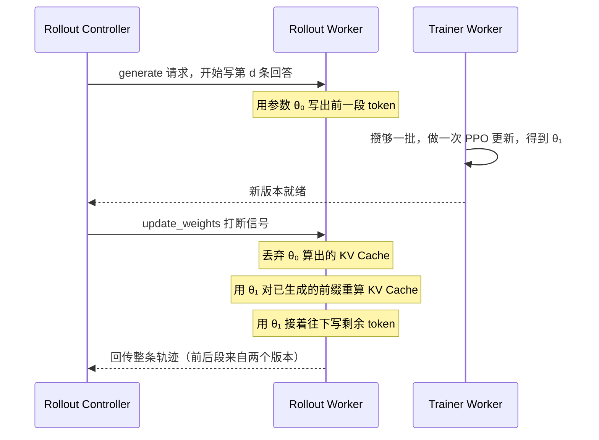
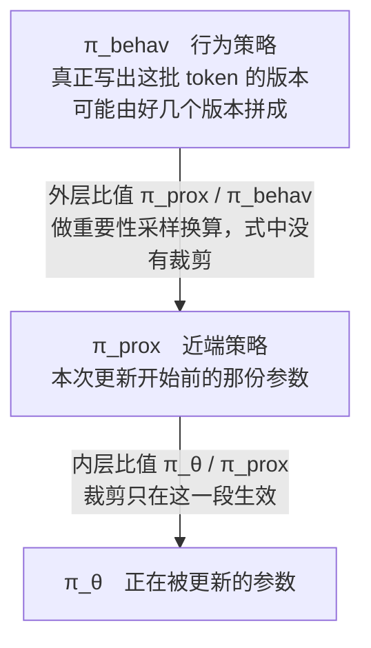
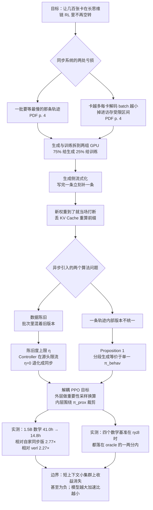

# AReaL：一批里最慢的那条轨迹，不该决定几百张卡什么时候开工

<!-- release-date: 2025-05-30 -->

> 本文依据 **AReaL: A Large-Scale Asynchronous Reinforcement Learning System for Language Reasoning**，即 arXiv:2505.24298v5、封面页眉日期 2026-03-02、共 27 页的 NeurIPS 2025 版式稿（正文与结论 1–10 页、参考文献 10–16 页、NeurIPS Paper Checklist 17–23 页、附录 A–E 24–27 页）。十三位作者里，九人署名 Ant Group、五人署名清华 IIIS、两人署名香港科技大学，其中 Wei Fu、Zhiyu Mei、Shusheng Xu 三人同时署名清华与 Ant Group；首页脚注写明本工作由 Ant Group Research Intern Program 支持，官方仓库 README 写明它出自 Ant Research 的 RL Lab（PDF p. 1）。按主要归属方，本站把它放在 AntGroup 目录下。下文括号中的 `PDF p. N` 均指这份 27 页原件的文件页码。
>
> **截至 2026-09-06 核验，arXiv 上的最新版本就是 v5，与本地原件一致，无需替换原件。**
>
> 这是一篇系统论文，同时带一处算法改动，所以没有模型架构和预训练 recipe 可讲。全文会把三件事分开写：**论文明确写了什么**（带页码）、**本文如何解释它**（凡属推算、换算或从图上读数都会写明）、**外部资料补充**（会给出链接并标注）。

## 读之前需要的最少背景

这篇论文假设你已经知道「用强化学习训练推理模型」大概是什么样子。如果不熟，记住下面几件事就够读完全文。

**RL 后训练的一轮循环长这样。** 拿一批题目（prompt），让当前模型自己写出答案，这个「让模型自己生成一批答案」的动作叫 **rollout（轨迹生成）**，生成出来的每条「题目 + 答案」序列叫一条 **trajectory（轨迹）**。然后用一个 **reward（奖励）** 判断每条答案对不对——数学题就比对最终答案，代码题就跑单元测试。最后用这批带奖励的轨迹去更新模型参数。更新完，再拿新参数生成下一批。

还要认识四个词，它们贯穿全文：

- **on-policy（在策略）**：训练用的数据，是**当前这份参数**自己生成的。
- **off-policy（离策略）**：训练用的数据，是**别的参数**（通常是旧版本）生成的。
- **staleness（数据陈旧度）**：一条轨迹是由多少个版本之前的参数生成的。生成它的时候模型是第 100 版，训练它的时候模型已经是第 108 版，那它的陈旧度就是 8。
- **importance ratio（重要性比）**：用旧策略采到的样本去估计新策略下的期望时，要给每个样本乘一个修正系数，通常写成新旧两个策略给同一个 token 的概率之比。本站 [GSPO 解读](/reports/Alibaba/GSPO) 讲的就是这个比该按 token 算还是按整条回答算。

**PPO 在这里是什么。** Proximal Policy Optimization（近端策略优化）的核心是一个带裁剪的目标函数：既想朝着高奖励的方向更新，又不允许新策略离采样时的那个策略太远。「太远」用重要性比是否跑出 $[1-\epsilon,1+\epsilon]$ 来判定，跑出去就把梯度截掉。GRPO 是 PPO 在这条线上的变体，出处见本站 [DeepSeekMath 解读](/reports/DeepSeek/DeepSeekMath)。

**再认识两个计数单位，后面每一节都会用到。**

- **训练步（training step）**：训练侧凑够一个训练批次、做完一次参数更新，就算一步。论文用 $i$ 表示当前是第几步，也就是**策略版本号**。
- **训练批次（training batch）**：一次更新要用的全部轨迹。本篇的配置是 512 条 prompt、每条采 16 个回答，所以一个批次有 8192 条轨迹（PDF p. 24，条数是本文的换算）。

论文还有一个容易被跳过的脚注：一个训练步内部会把全局批次切成若干 minibatch **依次做多次参数更新**，并且明确说明「这与梯度累积不同——梯度累积是在多个 minibatch 上只做一次更新」（PDF p. 3，脚注 2）。本篇的配置是 4 个 minibatch（PDF p. 24），也就是**一个训练步里参数其实动了 4 次**。记住这一点，后面讲陈旧度时才不会把「一步」和「一次更新」搞混：$\eta$ 数的是**训练步**，不是参数更新次数（PDF p. 9）。

**最后一个词：生成/训练解耦。** 传统做法是同一批 GPU 先跑生成、再跑训练，两个阶段轮流独占整个集群。「解耦」指的是把生成和训练拆到两组不同的 GPU 上，各自持续运转，互不等待。这篇论文的全部内容，都建立在把这件事推到极致之后暴露出来的问题上。

## 一句话先说清

这篇论文要解决的是一个非常具体、而且非常贵的浪费：

> **在同步 RL 系统里，一批轨迹必须等最慢的那一条写完，整个集群才能进入下一步。**

推理模型的输出长度差异极大——同一批题目里，有的答案几百个 token 就收尾，有的要写两万多个 token。同步系统必须等最长的那条。于是短答案所占的 GPU 位置早早空出来，却只能干等（PDF p. 4，Figure 1 左）。

AReaL 的回答是：**不等了。**

- 生成侧的 worker 连续不断地生成，一条写完立刻接下一条，中间不留空档；
- 训练侧的 worker 只要凑够一个训练批次就更新一次参数，不管生成侧当下在做什么；
- 参数更新完，**直接打断**正在进行中的生成，换上新权重继续往下写。

代价立刻就来了，而且是两层：

1. **数据变陈**。训练批次里混着好几个版本之前生成的轨迹，PPO 的假设被破坏。
2. **一条轨迹内部的版本都不统一**。因为生成被中途打断过，同一条回答的前半段是第 100 版写的，后半段是第 101 版写的。标准 PPO 的公式里根本没有位置放这种东西（PDF p. 5）。

所以这篇论文真正的形状是「系统 + 算法的联合设计」：系统敢异步，是因为算法能接住陈旧数据；算法敢用陈旧数据，是因为系统给它设了一个可调的陈旧度上限。论文自己把这一点写成了它与同期纯系统工作的区别（PDF p. 2）。

论文声称 **up to 2.77× training speedup**（PDF p. 1、7）。这个数字的分母是什么、在哪一组配置下测的，后面会逐条拆开——**先记住一点：2.77× 的分母是作者自己写的同步版 AReaL，不是他们对比的那个外部最快基线**（PDF p. 8，Table 1）。

### 它和 HybridFlow 是什么关系

本站已发布的 [HybridFlow 解读](/reports/ByteDance/HybridFlow) 讲的是 verl 的论文：**同步** RLHF 框架里「谁指挥谁」的分层，以及 actor 在训练与生成之间怎么零冗余地换并行策略。那一篇结尾把「异步执行」列成了它明确没做的事。

**这一篇正好长在那个边界之外。** 而且 verl 在本篇里是被对比的基线（PDF p. 7、25）。两者不是同一层的替代关系，需要对照时本文只用一句话带过，不替 HybridFlow 重讲它的内容。

## 全景：三种排法，同一段墙钟时间

论文用两张图把「问题」和「答案」讲完了。先看它们在同一段时间里各自让 GPU 做了什么。

| 时间片 → | 1 | 2 | 3 | 4 | 5 | 6 | 7 |
|---|---|---|---|---|---|---|---|
| **同步**：全部 GPU 共用 | 批 1 生成 | 批 1 生成 | 批 1 生成，短的已写完，**位置空着** | 批 1 训练 | 换权重 | 批 2 生成 | 批 2 生成 |
| **一步重叠**：生成 GPU | 批 2 生成 | 批 2 生成 | 批 2 生成，仍要等本批最慢那条 | **等新权重** | 批 3 生成 | 批 3 生成 | 批 3 生成 |
| **一步重叠**：训练 GPU | 批 1 训练 | 批 1 训练 | **空转** | **空转** | 批 2 训练 | 批 2 训练 | **空转** |
| **AReaL**：生成 GPU | 连续生成 | 连续生成 | 连续生成 | 打断，重算 KV | 连续生成 | 连续生成 | 连续生成 |
| **AReaL**：训练 GPU | 攒批中 | 批 1 训练 | 批 1 训练 | 批 2 训练 | 批 2 训练 | 批 3 训练 | 批 3 训练 |

这张表是根据 PDF p. 4 的 Figure 1 与 Figure 3 整理的**机制示意**，时间片只表示先后与重叠关系，不是实测时长；论文原图用时间轴上的色块表达同样的事。三行的区别是：

- **同步**（PDF p. 4，Figure 1 左）：生成和训练共用同一批 GPU，严格轮流。生成阶段里，先写完的那些序列所占的位置就空着，一直空到本批最长的那条收尾。
- **一步重叠**（PDF p. 4，Figure 1 右）：生成和训练分到两组 GPU 上，生成第 $k+1$ 批的同时训练第 $k$ 批。论文点名 DeepCoder 与 INTELLECT-2 属于这一类（PDF p. 2）。但它有一条没被打破的规矩：**一个训练批次里的所有样本仍然来自同一个模型版本**。所以生成侧还是要凑齐整批才能换权重，等待没有消失，只是换了个位置（PDF p. 2、4）。
- **AReaL**（PDF p. 4，Figure 3）：生成侧完全不成批。一条轨迹写完就立刻补进下一条；新权重到了就当场打断，换权重继续写。

论文对第二类的判断很直接：**它们「仍然遵循成批生成的设定，因此生成阶段的系统低效问题仍未被解决」**（PDF p. 2，本文译述）。这一句是全篇的立论点。

### 顺带说清它在谱系里的位置

论文第 2 节把自己和四类前人工作分开（PDF p. 2–3）。这一段值得读，因为它同时也是「异步 RL 这个想法从哪来」的简史。

**一、异步 RL 本身不是新东西，它来自游戏。** 解耦式的异步 RL 架构（RLlib、SEED RL、SRL）加上配套的算法创新（IMPALA 的 V-trace、R2D2 的分布式经验回放），在 Dota 2 和 StarCraft II 上已经证明过（PDF p. 2）。**所以 AReaL 的新意不在「异步」这两个字**，而在于把它搬到长思维链语言模型上时新出现的那些约束——一条轨迹可能写两万多个 token、一个训练批次要几千条回答、而且轨迹长度是重尾分布。

**二、之前把异步用在 LLM 上的工作，要么上下文很短，要么只重叠一两步。** 论文点名 Asynchronous RLHF、TBA、TOPR 属于前者（RLHF 场景，回答短），DeepCoder 与 INTELLECT-2 属于后者（PDF p. 2、3）。论文说自己的贡献是**在陈旧度与训练速度之间提供了更灵活的权衡**，并且**能承受更高的陈旧度、还能兼容可中断生成**（PDF p. 3）。

**三、和同期的纯系统工作分开。** 论文提到一篇并行工作 StreamRL，说它「最大化系统层面的效率」，而 AReaL 采取的是**算法—系统联合设计**，目标是同时给出一个有表达力的系统和一份可用的算法实现（PDF p. 2）。这是一句自我定位，不是实验对比——**论文没有和 StreamRL 做任何实测比较。**

**四、和同步系统里那些「换并行策略」的技术分开。** 论文把 PUZZLE 的 context switching、HybridFlow 与 ReaLHF 的 weight resharding 归为一类：它们都是在承认「生成和训练共用同一批卡」的前提下，尽量把切换做便宜（PDF p. 3）。AReaL 的说法是，解耦之后**重分片开销被完全移出训练的关键路径**（PDF p. 3）。

这四条连起来读，能看出它的定位：**它不发明异步，也不发明 PPO 的变体；它发明的是「让这两件已有的东西在长思维链场景下同时成立」所需要的那几个约束。**

### 系统由四个部分组成

这是根据 PDF p. 4 的 Figure 2 与正文重画的**机制示意图**，箭头表示控制流与数据流向，不表示实测的通信量或时长。原图用四种颜色区分 prompt、trajectory、interrupt signal 和 parameter save/load 四类边，这里用文字标签替代。

四个组件各自的职责（PDF p. 4）：

- **Interruptible Rollout Worker（可中断的轨迹生成 worker）**：只处理两种请求。`generate` 是「给你 prompt，生成答案」；`update_weights` 是「立刻停手，换权重」。收到后者时，它会**丢掉用旧权重算出来的 KV Cache，用新权重重算一遍**，然后接着把没写完的序列往下写，直到下一次被打断或者写完。
- **Reward Service（奖励服务）**：判分。代码任务就是把代码抽出来跑单元测试。
- **Trainer Workers（训练 worker）**：不停地从 replay buffer 里取数据，攒够配置好的训练批次就做一次 PPO 更新，把新参数写进分布式存储。**buffer 里的数据只用一次**，用完就丢。
- **Rollout Controller（生成控制器）**：CPU 上的中枢。读数据集 → 调 `generate` → 把答案送去 Reward Service → 把「轨迹 + 奖励」塞进 replay buffer → 训练侧更新完参数后，由它去调各个 rollout worker 的 `update_weight`。

注意一个容易忽略的分工：**Controller 是一个 CPU 作业，它不碰权重也不搬 KV Cache**（PDF p. 4，Figure 2 的图例明确区分 CPU Job 与 GPU Job）。它只负责发号施令和转手元数据。这和 [HybridFlow](/reports/ByteDance/HybridFlow) 里「单控制器只收 future、真数据 GPU 直传」的取舍是同一种：**中枢必须轻，否则它自己会变成瓶颈。**

### 一次完整的循环，从头到尾走一遍

把上面四个组件串起来，AReaL 稳定运转时同时在发生这些事（以下是本文按 PDF p. 4 的正文与 Figure 2、Figure 3 整理的执行流程，论文没有列成步骤）：

1. Controller 从数据集里取 prompt，向某个空闲的 rollout worker 发 `generate`。发之前先检查陈旧度约束（下面第 7 节的式 3），超了就不发。
2. Rollout worker 用当前手上的那份权重开始解码。**它不成批**——写完一条就立刻回传、立刻接下一条，位置从不空着。
3. 一条回答写完，Controller 把它送去 Reward Service。数学题比对答案、代码题跑单元测试。这一步在 CPU 上，与 GPU 的解码并行。
4. 拿到 reward 后，「轨迹 + 逐 token 概率 + reward」被塞进 Replay Buffer。
5. Buffer 里攒够一个训练批次（8192 条轨迹），整批送往训练侧。**组批时优先取更旧的轨迹。**
6. Trainer worker 先用当前参数把这批 token 的概率重算一遍，得到 $\pi_{\text{prox}}$，然后按解耦目标做 4 次 minibatch 更新，把新参数写进 Parameter Service。这批数据用完即弃。
7. Controller 得知有了新版本，向所有 rollout worker 发 `update_weights`。正在写的序列**当场被打断**：旧 KV Cache 作废、加载新权重、用新权重把已写出的前缀重算一遍 KV，然后接着往下写。
8. 版本号 $i$ 加一，回到第 1 步。

关键在于**第 2 步与第 6 步是并行的**，而且没有任何一处等待「本批最慢那条」。整条流水线上唯一的全局同步点，是第 7 步那次打断——而它的代价是一段 KV 重算，不是一段空转。

### 两处叫法容易骗人的地方

**一、Replay Buffer 不是强化学习教科书里的那个 replay buffer。** 经典的经验回放会把同一条数据反复采样多次，用来提高样本效率。而这里论文写得很清楚：**「为了保证数据新鲜，回放缓冲区里的数据只用一次」**（PDF p. 4）。加上组批时优先取旧的（PDF p. 5），它实际上是一个**带优先级的暂存队列**——负责把「生成侧不定时吐出来的单条轨迹」重新排成「训练侧要的整齐批次」，顺便把陈旧度压住。

这个区分不是抠字眼。它意味着 AReaL 的样本效率和同步 RL 是一样的：每条轨迹训练一次就丢。**异步在这里买到的是墙钟时间，不是样本效率。** 论文摘要里的 sample efficiency 一词（PDF p. 10）指的是「同样步数下达到同样甚至更好的分数」，不是「同一条数据用了更多次」。

**二、「生成引擎」这一层是拼装出来的，而且当时并不稳。** 生成用 SGLang v0.4.6，训练用 Megatron-Core v0.11.0（PDF p. 6）。基线那边用的是 verl 2025-05-07 的 main 分支，生成同样是 SGLang v0.4.6、训练是 PyTorch FSDP——但论文诚实地补了一句：**在 32B 模型或 64 节点的实验里 SGLang 会报错，只好换成 vLLM v0.8.4**（PDF p. 25）。

这条细节有两个含义。第一，**基线在最大的那几档配置上换过推理后端**，严格说不是完全同构的对比。第二，它侧面说明这些数字是 2025 年年中那个时间点的快照——那时候把 SGLang 推到 32B 模型或 64 节点（512 卡）还会翻车。这类系统论文的绝对数字都有很强的时效性，机制才是长期有效的部分（vLLM 那套 KV Cache 分页管理的来龙去脉见本站 [PagedAttention 解读](/reports/Berkeley/PagedAttention)）。

## 第一层矛盾：同步系统到底亏在哪两处

### 先把问题设定钉死

论文 3.1 节的设定有几处很具体，它们决定了后面所有结论的适用范围（PDF p. 3）：

- **奖励是稀疏的、规则给的。** 论文把问题写成马尔可夫决策过程：状态是「题目 + 已生成的前缀」，动作是词表里的一个 token，状态转移是确定的拼接。奖励函数**只在最后一个动作上给非零反馈**，表示答案对不对；折扣因子 $\gamma$ 固定为 1（PDF p. 3）。换句话说，整条几万 token 的轨迹只有终点那一个 $\pm 5$ 的分数。
- **对象是 SFT 之后的推理模型，不是基座模型。** 论文明确把自己和「在预训练基座上直接激发推理能力」的路线区分开（PDF p. 3）。它训练的起点是 DeepSeek-R1 蒸馏出来的模型（PDF p. 7），本站 [DeepSeek-R1 解读](/reports/DeepSeek/DeepSeek-R1) 讲的就是这些蒸馏模型的来源。
- **序列很长、批次很大，两者都是硬约束。** SFT 之后的推理模型会产生很长的推理序列（论文举的例子是 32K token），而稳定的 RL 训练又需要很大的全局批次（论文举的例子是 128 条 prompt × 每条 16 个回答）（PDF p. 3）。

**这三条合起来，才是同步系统的真正困境**：批次必须大（所以一批里一定有长尾），序列必须长（所以长尾特别长），奖励只在终点（所以没法提前结束一条轨迹）。任何一条放松，同步的代价都会小很多。

在这个设定下，论文 3.2 节点名了两处亏损。它们只有两条，但性质完全不同，值得分开看（PDF p. 4）。

### 亏损一：推理设备在等最长的那条

这是显而易见的那条。生成必须等本批最长的序列写完，训练才能开始；不同 GPU 上的解码长度不一致，短的那些就闲着。

这条浪费有多大？**论文没有直接给出同步系统的 GPU 空转比例。** 我们能拿到的最接近的量化，是它自己的消融：关掉可中断生成之后，控制器必须等最长的回答，1.5B 与 7B 模型在 4 个节点上的生成吞吐分别掉到原来的约 90% 与 85%（PDF p. 10，Figure 6b：231k → 207k、130k → 111k tokens/s，论文表述为 12% 与 17% 的提升，倒数是本文的换算）。这只是「不打断」相对「打断」的差距，不等于「同步」相对「异步」的全部差距。

本站 [DAPO 解读](/reports/ByteDance/DAPO) 里有一句同源的观察：同步系统里一轮生成的耗时基本由长尾样本决定。两篇从不同方向指向同一个事实。

### 亏损二：越加卡越不划算

这一条更隐蔽，也更重要。

同步系统把生成摊到**全部**设备上。卡越多，每张卡分到的解码 batch 就越小。而自回归解码在小 batch 下是**访存受限**的：权重和 KV Cache 从显存搬进来一次，只做了很少的乘加，算力空转。论文的原话是，这会把解码推进 memory-IO-bound 的区间，**再加设备也提不了吞吐**（PDF p. 4）。

这句话解释了 Figure 4 里 verl 那条橙线为什么会越来越平（PDF p. 8）。**它不是实现得不好，是同步这个前提本身在大集群上会撞墙。**

那 AReaL 为什么不撞？因为它把设备**切成两组**：生成侧固定拿走四分之三的设备，训练侧拿四分之一（PDF p. 7）。集群翻倍时，生成侧的设备数翻倍，但每张卡上的解码 batch 不必被摊薄——因为生成侧是流式的，随时可以把新请求填进空出来的位置，而不是被一个固定大小的批次卡住。这是本文对该机制的解释，论文只陈述了「异步 + 可中断生成让长回答的生成被完全藏进关键路径之外」这个结论（PDF p. 7）。

**这个 75:25 的比例是拍出来的，不是搜出来的。** 论文写得很老实：它是在早期实验里比 50:50 更快，被当作启发式固定下来的；最优比例会随场景变化，甚至可能需要训练过程中动态调整（PDF p. 7、27）。这是全文最明显的一个「留给下一篇」的口子。

**为什么生成侧要拿走更多卡**（以下是本文的推理，论文只给了结论）：这两侧要处理的 token 数是一样的——生成侧吐出多少 token，训练侧就要吃掉多少。但**处理同一个 token 的成本天差地别**。生成是逐 token 自回归的访存受限过程，权重和 KV Cache 搬进来一次只做很少的乘加；训练是把整批 token 一次性喂进去的算力密集过程，前向反向都能把 GPU 打满。要让两边的**吞吐**匹配，慢的那一侧自然需要更多设备。至于为什么恰好是 3 : 1 而不是 2 : 1 或 4 : 1，那就取决于模型大小、序列长度和具体的推理实现——所以论文说它「随设置变化」是对的，而它没做扫描实验也就格外可惜。

## 可中断的生成：把「等待」换成「重算」

这是 AReaL 最有辨识度的一个动作，值得走完一条完整的因果链。

**旧问题**：新权重就绪时，正在写的那些长序列怎么办？同步系统的答案是「等它们写完」；一步重叠系统的答案也是「等本批写完」。等待时间由长尾决定。

**新设计**：直接打断。收到 `update_weights` 后，rollout worker 立即停止解码、加载新权重（PDF p. 4）。

**工作机制**：被打断的序列已经写出去的 token 全部保留，但**用旧权重算出来的 KV Cache 全部作废，用新权重重新算一遍**，然后从断点继续解码（PDF p. 4）。

这是根据 PDF p. 4 的 Figure 3 与正文重画的**机制示意图**，箭头表示控制与数据的先后顺序，不表示实测时长。Figure 3 里用蓝色叉号标出被打断的请求，用绿色方块标出 KV Cache 重算，本图用文字备注替代。

**收益**：生成侧的时间轴上不再有「等换权重」的空档。Figure 3 里 GPU1 与 GPU2 的蓝条是连续铺满的，唯一的缝隙是那一小段 KV Cache 重算（PDF p. 4）。实测收益见前面引过的 Figure 6b：4 个节点上 1.5B 提升 12%、7B 提升 17%（PDF p. 10）。

**代价**：
1. **重算 KV Cache 不是免费的**。已经写出去的前缀有多长，就要重新 prefill 多长。论文没有单独量化这部分开销；Figure 6b 给的是打断带来的**净收益**，重算成本已经被吸收在里面。
2. **它把一条轨迹撕成了多个版本的拼接**——这就是下面整个算法部分要处理的事。

**这笔重算账为什么算得过来**（以下是本文的机制分析，论文没有展开）：两个因素同时对它有利。其一，**prefill 比 decode 便宜得多**——重算 $L$ 个 token 的 KV 是一次算力密集的批量矩阵乘，而当初把这 $L$ 个 token 一个一个解码出来是访存受限的，两者的单 token 成本不在一个量级。其二，**打断的频率极低**。后面会算出来，1.5B 上平均每 213 秒才更新一次参数、32B 上要 1866 秒（本文由 PDF p. 8 换算）。也就是说，几分钟连续满负荷的生成，只需要付一次前缀重算。**在「频率 × 单次成本」这个乘积里，两项都很小。** 换成另一种参数同步方式——比如每几秒就推一次权重——这个结论立刻会反过来。

顺带说一句被这个设计绕开的东西：因为生成和训练在不同的卡上，权重从来不需要在两种并行策略之间来回重分片。论文在相关工作里点了这一句：解耦**把重分片开销完全移出了训练的关键路径**（PDF p. 3）。而这正是 [HybridFlow](/reports/ByteDance/HybridFlow) 那一篇花了整整一节去优化的东西——**它把那个问题解得很漂亮，AReaL 则是让那个问题不再存在。** 代价是四分之三的卡不参与训练。

**它和 partial rollout 的区别**。论文自己做了对照：可中断生成在概念上类似同步系统里的 partial rollout（分段采样），出处是 Kimi k1.5（PDF p. 3，引其参考文献 [17]，本站解读见 [Kimi-k1.5](/reports/Moonshot/Kimi-k1.5)）。区别在于，partial rollout 是**给每条轨迹设一个固定的 token 预算**，超出就存起来下一轮续写；AReaL 则是**按时机动态打断**，同时靠 buffer 保证训练批次大小不变（PDF p. 3）。

**可迁移的部分**：当某个长任务被外部事件打断时，你有两个选择——等它做完，或者丢掉可以重建的中间状态、保留不可重建的结果。AReaL 选了后者：token 序列不可重建（保留），KV Cache 可以由前缀重算（丢弃）。**先分清「哪些状态是导出的、哪些是原始的」，抢占的成本往往比想象中低得多。**

## 异步之后，算法这边坏了两样东西

论文 4.2 节把它们分开写（PDF p. 5）。

**一、数据陈旧（Data Staleness）**。训练批次里混着多个旧版本生成的数据，训练数据和最新模型之间出现分布差。论文引先前工作说明这会掉性能，既在 RLHF 场景（Asynchronous RLHF），也在游戏场景（OpenAI 的 Dota 2 工作）。它还补了一句只在推理模型上成立的加重因素：**轨迹越长，解码耗时越久，陈旧度天然越高**（PDF p. 5）。

**二、策略版本不一致（Inconsistent Policy Versions）**。这一条是可中断生成独有的。标准 PPO 的式 (2) 里写着 $a_t\sim\pi_{\text{old}}$——整条轨迹由**单一**策略采出。而 AReaL 的一条轨迹前半段来自 $\pi_{\theta}$、后半段来自 $\pi_{\theta+1}$。论文的用词是「从根本上违反了式 (2) 的形式化设定」（PDF p. 5）。

两个问题的应对是两个独立的机制：陈旧度用**系统侧的限流**来控，版本不一致用**算法侧的目标函数**来接。下面分开讲。

## 解法一：给陈旧度设一个可调的上限

引入一个超参数 $\eta$，表示**每个训练批次里允许的最大陈旧度**（PDF p. 5）。

设当前策略版本号为 $i$，系统累计已经生成的轨迹条数为 $N_r$，每个训练步的批大小为 $B$（单位是轨迹条数）。每当要提交新的生成请求时，系统检查：

$$\left\lfloor \frac{N_r-1}{B} \right\rfloor \le i+\eta$$

（PDF p. 5，式 3）

**这个式子在说什么。** 左边 $\lfloor (N_r-1)/B\rfloor$ 是「第 $N_r$ 条轨迹会落进第几个训练批次」的编号，从 0 开始数。右边是「当前版本号再加上允许超前的批数」。所以整条约束就是一句话：**生成侧最多可以比训练侧超前 $\eta$ 个批次，超了就不再接新请求。**

拿一组小数字走一遍（本文的推算）。设 $B=4$、当前版本 $i=3$（已经训练完 3 个批次，消耗了 12 条轨迹）：

| $\eta$ | 约束 | 允许累计生成的轨迹数上限 | 生成侧最多能领先几批 |
|---:|---|---:|---|
| 0 | $\lfloor (N_r-1)/4\rfloor\le 3$ | 16 | 只能做训练侧马上要用的那一批 |
| 2 | $\lfloor (N_r-1)/4\rfloor\le 5$ | 24 | 3 批 |
| 8 | $\lfloor (N_r-1)/4\rfloor\le 11$ | 48 | 9 批 |

$\eta=0$ 时，生成侧只被允许做「训练侧马上要用的那一批」，做完就必须停下来等参数更新。**这时系统精确退化成同步 RL**——论文明确写了这一点（PDF p. 5）。这个设计很值得记：**异步系统里最有价值的旋钮，往往是那个能把自己拧回同步的旋钮。** 有了它，同步就不再是另一套代码，而是同一套代码的一个取值。

**$\eta$ 数的是训练步，不是参数更新次数。** 论文在消融那一节特意强调了这一点：「$\eta$ 约束的是训练批次相对**训练步**的陈旧度」（PDF p. 9）。而前面提过，一个训练步里会做 4 次 minibatch 更新（PDF p. 24）。所以 $\eta=8$ 意味着最旧的那条轨迹，是在**约 32 次参数更新之前**生成的（本文的换算）。**这个换算很容易被忽略，但它决定了你在读「$\eta=8$ 也没掉点」时该有多惊讶**——参数已经动了三十多次，那批数据居然还能用。

实现上是 Rollout Controller 做的：它从 parameter server 那里读到当前版本 $i$，自己记着已生成条数 $N_r$，**拒绝**任何会违反约束的新生成请求。组批时还会优先取 buffer 里更旧的轨迹（PDF p. 5）。

**优先取旧的这一步很关键**，论文只写了一句，值得展开（以下是本文的解释）：如果组批时随机取，最旧的那些轨迹会一直留在 buffer 里越放越旧，最终要么被丢弃、要么以极高的陈旧度进入训练。先进先出把陈旧度的**分布**压住了，而不只是压住了上界。

**这个限流有代价，而且论文自己点破了**：$\eta$ 太小时，只要有几条极长的轨迹正在生成，整个生成侧的吞吐就会被拖慢——因为它不被允许往前多做。所以论文的经验建议是**为了系统吞吐应该取较大的 $\eta$**，而这反过来又逼出了下一节的算法改动（PDF p. 5）。

这条因果链本身就是全文的骨架：**系统想要大 $\eta$ → 算法必须能吃下高陈旧度的数据 → 于是有了解耦的 PPO 目标。**

**这一节的可迁移价值**：注意这个限流器控制的是**提交**而不是**丢弃**——超出上限时它拒收新请求，而不是把生成好的轨迹扔掉。两种做法都能把陈旧度压在上界内，但前者省下了算力，后者把算力烧掉了。**任何带 buffer 的生产—消费系统在设计背压时都该先问一句：我是在源头节流，还是在下游丢包？** 前者几乎总是更划算，代价是源头必须能感知下游的进度——这里就是 Controller 要能读到 parameter server 的版本号（PDF p. 5）。

## 解法二：把「谁采的样」和「围着谁划信任域」拆开

这是本篇唯一的算法改动，也是全文最需要讲透的一段。

### 先看标准 PPO 卡在哪

标准 PPO 的目标（PDF p. 3，式 2）：

$$J_{\text{PPO}}(\theta)=\mathbb{E}_{a_t\sim\pi_{\text{old}}}\left[\sum_{t=1}^{H}\min\left(u_t(\theta)\hat A_t,\ \operatorname{clip}\left(u_t(\theta),1-\epsilon,1+\epsilon\right)\hat A_t\right)\right]$$

其中 $u_t(\theta)=\dfrac{\pi_\theta(a_t\mid s_t)}{\pi_{\text{old}}(a_t\mid s_t)}$ 是重要性比，$\hat A_t$ 是优势估计。

注意 $\pi_{\text{old}}$ 在这里**同时干了两件事**：

1. 它是**采样这批数据的那个策略**（重要性比的分母）；
2. 它是**信任域的圆心**（裁剪围着它划）。

同步 RL 里这两件事天然重合，所以没人需要区分。异步之后就分家了：采样的是 $\eta$ 步之前那个较差的旧策略，而你想约束的显然是「别离最新的这份参数太远」。

论文把后果说得很清楚：**在异步 PPO 里，如果拿行为策略当近端策略，会把最新的 $\pi_\theta$ 往旧版本、低质量的策略上拽，从而拖慢模型改进**（PDF p. 6）。

### 解耦之后的目标

论文引入两个名字（PDF p. 6）：

- **behavior policy $\pi_{\text{behav}}$（行为策略）**：真正把这批轨迹写出来的那个（那些）策略；
- **proximal policy $\pi_{\text{prox}}$（近端策略）**：一个较新的目标，用来给 $\pi_\theta$ 的更新划信任域。

对采到的轨迹做一次重要性采样换算，得到（PDF p. 6，式 5）：

$$J(\theta)=\mathbb{E}_{q\sim\mathcal D,\ a_t\sim\pi_{\text{behav}}}\left[\sum_{t=1}^{H}\frac{\pi_{\text{prox}}}{\pi_{\text{behav}}}\min\left(u_t^{\text{prox}}(\theta)\hat A_t,\ \operatorname{clip}\left(u_t^{\text{prox}}(\theta),1-\epsilon,1+\epsilon\right)\hat A_t\right)\right]$$

其中

$$u_t^{\text{prox}}(\theta)=\frac{\pi_\theta(a_t\mid s_t)}{\pi_{\text{prox}}(a_t\mid s_t)}$$

（为简洁起见，式中的 $\pi_{\text{prox}}$ 与 $\pi_{\text{behav}}$ 都省略了状态—动作下标，这是论文自己的写法。）

**把它拆成两步读，就不难了：**

1. **外面那个 $\dfrac{\pi_{\text{prox}}}{\pi_{\text{behav}}}$ 是换算**。它把「用旧策略采到的样本」折算成「近端策略下应有的权重」。这就是普通的重要性采样修正，与裁剪无关。
2. **里面那个 $\min(\cdot,\operatorname{clip}(\cdot))$ 是约束**。它和标准 PPO 长得一模一样，唯一的区别是分母从 $\pi_{\text{behav}}$ 换成了 $\pi_{\text{prox}}$——**信任域的圆心搬家了**。

用一句话概括这个改动：

> **标准 PPO 把「采样者」和「圆心」合并成同一个分母。异步之后两者必须分开，因为采样的是谁，和你想围着谁划圈，已经不是同一个策略了。**

这是根据 PDF p. 6 式 (4)(5) 与正文重画的**机制示意图**，箭头表示两个比值各自连接哪两个策略，不表示数据流或时间顺序。

### $\pi_{\text{prox}}$ 具体取谁

原始的解耦 PPO 出自 Hilton 等人的 batch size-invariance 工作，那里的 $\pi_{\text{prox}}$ 是参数的指数滑动平均。论文说这对推理模型**代价高得不可接受**——因为要额外存一整份大模型参数并持续更新——所以直接**用每次模型更新之前的那份参数当 $\pi_{\text{prox}}$**（PDF p. 6）。

实现方式是：**训练批次凑齐、送到训练侧之后，用当前参数把这批 token 的概率重新算一遍**（PDF p. 6）。

这里有一处论文没有算的账（以下是本文的判断）：这意味着**每个训练步都要在整个全局批次上多跑一次前向**。对 512 条 prompt × 16 个回答、单条最长 27648 个 token 的批次（PDF p. 24）来说，这不是可以忽略的开销。论文的吞吐数字里当然已经含着它——因为端到端时间是实测的——但**它没有被单独拆出来量化**，所以我们无法回答「解耦目标函数本身花掉了多少吞吐」。

另有一处论文没写清的：$\pi_{\text{behav}}$ 那一份逐 token 概率是**由 rollout worker 在生成时顺手记下来的**，还是训练侧也要重算一遍？论文只说了 $\pi_{\text{prox}}$ 要 recompute（PDF p. 6），没有交代 $\pi_{\text{behav}}$ 的来源。从工程常识看前者更合理，但这属于推测，本文不把它写成论文结论。

### 外层那个比值是这套设计真正的风险点

内层的 $u_t^{\text{prox}}$ 有裁剪保护，跑到 $[1-\epsilon,1+\epsilon]$ 之外就被截断。**但外层那个 $\pi_{\text{prox}}/\pi_{\text{behav}}$ 在式 (5) 里没有任何保护**（PDF p. 6）。

这为什么危险？重要性比是**逐 token 相乘**的量级敏感对象。设某个 token 上 $\pi_{\text{prox}}$ 给 0.6、$\pi_{\text{behav}}$ 给 0.02，这一项就是 30；一条几万 token 的轨迹里只要出现少数几个这样的位置，这条样本的梯度权重就会压过整批其余样本。而 $\eta$ 越大，$\pi_{\text{prox}}$ 与 $\pi_{\text{behav}}$ 之间隔的更新次数越多，出现这种位置的概率就越高。（以上是本文的机制分析，论文没有对这个比值做任何数值报告。）

**这大概率就是 Table 2 里 $\eta=\infty$ 即使用了解耦目标也仍然掉点的原因**（36.9 对 42.0，PDF p. 9）——本文的推测，论文没有做这个归因。

值得一提的是，官方仓库在 arXiv v1 提交当天就加入了 behavior importance weight capping（**外部信息，不是论文内容**，提交链接见文末）。这不改变论文写了什么，但它说明「这个比值需要被约束」在工程上被单独处理过。**读系统论文时，公式里没有出现的保护措施，往往就藏在实现里。**

### Proposition 1：一条被撕成几段的轨迹，凭什么还能写成「某个策略采的」

这是全文唯一一条命题，论文正文给结论、附录 D 给证明（PDF p. 6、27）。

命题说的是：对任意一条由 $(\pi_\theta,\ldots,\pi_{\theta+k})$ 分段生成的序列，**存在**一个行为策略 $\pi_{\text{behav}}$，使得这次被打断的生成等价于完全从 $\pi_{\text{behav}}$ 采样。

证明只有三行。记 $\mathcal S_t(q)$ 为在第 $t$ 步遇到的状态集合。因为不同步的状态集合互不相交（$\mathcal S_{t_i}(q)\cap \mathcal S_{t_j}(q)=\varnothing$，$i\ne j$），可以直接构造：

$$\pi_{\text{behav}}(\cdot\mid s)=\begin{cases}\pi_{\theta+j}(\cdot\mid s) & t_j\le t\le t_{j+1},\ s\in\mathcal S_t(q)\\ \text{arbitrary} & \text{otherwise}\end{cases}$$

（PDF p. 27）

**这条命题为什么成立，说白了很简单**（以下是本文的解释）：这里的「状态」是**题目加上已经写出来的全部前缀**，所以状态本身就编码了步数。第 500 个 token 处的状态，不可能同时也是第 300 个 token 处的状态。既然每个状态只会被恰好一个版本处理，把它们拼成一个分段定义的策略就不会有冲突。

**这条命题真正的作用，是让式 (5) 里的 $\pi_{\text{behav}}$ 是一个良定义的对象，而不是一句含混的话。** 有了它，「用第 100 版的概率算前半段、用第 101 版的概率算后半段」就不是权宜之计，而是在同一个 $\pi_{\text{behav}}$ 下取值。

**但它也就到此为止了，这一点必须说清楚**（本文的判断）：

- 它**不证明**混版本采样不掉性能。它只保证公式写得下去。
- $\pi_{\text{behav}}$ 是被构造出来的、依赖具体轨迹的对象，**没有一份参数能表示它**。实际计算时你仍然必须逐段拿到当时那个版本给出的 token 概率。
- 它对「陈旧度多大才安全」这个问题一句都没说——那个问题只有实验答案，就是下一节的 Table 2。

**解耦目标这一节的可迁移价值**：它的动作可以抽象成一句话——**当一个量因为「恰好相等」而被两处共用时，前提一变就必须给它们各起一个名字。** 这里是 $\pi_{\text{old}}$ 被拆成 $\pi_{\text{behav}}$ 与 $\pi_{\text{prox}}$。同类场景很多：缓存的分片键与路由键、请求的重试 ID 与幂等 ID、日志里的逻辑时钟与物理时钟。**这些量在单机同步时天然一致，在分布式异步下几乎必然分叉**，而分叉的那一天，代码里通常只有一个变量名。

## 系统侧还做了三件事

论文的实现一节很短，但每条都对应一个具体瓶颈（PDF p. 6）。

**底座**：Python + PyTorch，建在 ReaLHF 框架之上（该框架来自同一批作者的先前工作），生成用 **SGLang v0.4.6**，训练后端用 **Megatron-Core v0.11.0**，资源调度用 SLURM（PDF p. 6）。

**一、把 CPU 活儿从 GPU 的关键路径上挪开。** 基于规则的奖励计算（数学题的字符串匹配、代码题的单元测试执行）和基于 TCP 的数据传输都是 CPU 作业。AReaL 把它们放到独立线程里，与后续的生成请求流水线重叠；rollout worker 内部用 asyncio 协程并发处理多个请求，避免互相阻塞（PDF p. 6）。

这一条看着朴素，但在 RL 系统里格外要紧：**跑一遍单元测试可能要几秒，而一次解码步只要几十毫秒。** 如果判分是同步阻塞的，几百张 GPU 会为一个 sandbox 里的 `pytest` 停下来。

**二、padding-free 的序列打包 + 动态微批分配。** 训练侧要处理长度差异极大的序列。常规做法是把批次固定切成若干个微批，而**微批数必须按最坏情况设定**——万一某个微批里恰好挤进好几条超长序列就会 OOM，所以只能把微批数设得很大，代价是每个微批都吃不满显存，前向反向的次数也变多（PDF p. 10）。

AReaL 改成按 token 预算装箱（PDF p. 6、25，Algorithm 1）：

1. 把序列按长度**降序**排序；
2. 逐条放进微批：如果当前微批数还不足下限 $k_{\min}$、或者没有任何已有微批装得下它，就新开一个；
3. 否则在所有装得下它的微批里，选**序列条数最少**的那个放进去。

这是经典的「降序 + 首次适应」装箱的一个变体，第 3 步选「条数最少」而不是「剩余空间最小」，目的是让各微批的序列条数也尽量均衡。

举个小例子（本文构造，用于说明算法，不是论文的数据）：预算 $C=100$，序列长度为 $\{60,45,40,30,25\}$，$k_{\min}=2$。降序处理：60 开第一个微批；45 装不进第一个（60+45>100），开第二个；40 两个都装得下（60+40=100、45+40=85），两个微批当前都只有 1 条，选第一个，得到 $\{60,40\}$；30 只有第二个装得下，得到 $\{45,30\}$；25 只有第二个装得下，得到 $\{45,30,25\}$。最终两个微批分别装 100 和 100 个 token，**两次前向反向就够了**。若按常规做法固定切 3 个微批，就要跑三次，而且每次都装不满。

实验里，常规做法固定用 32 个微批，动态做法用每微批 32768 token 的预算（PDF p. 10）。

**三、可中断生成**，前面已经讲过。

**这一节的可迁移价值**：三条优化各自对应一类通用瓶颈——把慢的 CPU 工作从快的 GPU 关键路径上摘出去、把「按个数切」换成「按容量装」、把「等待」换成「可重建状态的重算」。它们和 RL 没有必然关系，任何长度重尾的批处理系统都能照搬。

## 实验：先把分母摆清楚

这是一篇系统论文，所有加速比都必须连着配置一起读。先把配置列全（PDF p. 7、24、25）。

| 项目 | 取值 |
|---|---|
| 集群 | 64 个节点、每节点 8 张 **H800**，共 512 张 GPU |
| 网络 | 节点内 NVLink，节点间 RoCE 3.2 Tbps |
| 基座模型 | DeepSeek-R1 蒸馏出的 R1-Distilled-Qwen 系列，1.5B / 7B / 14B / 32B |
| 设备划分 | AReaL 固定把**四分之三**设备给生成、四分之一给训练 |
| 端到端实验节点数 | 1.5B 用 16 节点、7B 用 24、14B 用 32、32B 用 48；三个系统用**相同**节点数 |
| 训练批大小 | 512 条 prompt，每条采 16 个回答 |
| 最大 prompt / 生成长度 | 1024 / 27648 token（训练时） |
| PPO 设置 | **critic 与 reference model 都关闭**；$\epsilon=0.2$；4 个 minibatch；GAE $\lambda=1$、$\gamma=1$；答对 reward $=+5$、答错 $=-5$；优势在全局批次上做归一化 |
| 优化器 | Adam，学习率 $2.0\times10^{-5}$，weight decay 0.05，$\beta=(0.9,0.95)$，梯度裁剪 1.0，常数学习率 |
| 精度 | 参数与 KV Cache fp16，梯度与优化器状态 fp32 |
| 默认陈旧度 | 代码任务 $\eta=4$，数学任务 $\eta=8$ |
| 基线 | verl **main 分支、2025-05-07** 版本；生成 SGLang v0.4.6 + 训练 PyTorch FSDP；32B 或 64 节点场景下 SGLang 报错，改用 vLLM v0.8.4 |
| 数据 | 数学用 DeepScaleR 的开源数据，代码用 DeepCoder 发布的数据集；所有对比方法用**同一份**数据 |
| 随机性 | 全部实验固定随机种子 1，**没有 error bar，每种设置只跑一次** |

有几条要单独拎出来。

**第一，这里的「PPO」不是教科书里的 actor-critic PPO。** 附录写明 critic 和 reference model 都被关掉了（PDF p. 24）。critic 一关，GAE 在 $\lambda=1,\gamma=1$ 下退化为「整条轨迹的回报」，而回报又只有终点那个 $\pm 5$；再在全局批次上做归一化。所以实际跑的是**带 PPO 裁剪的 REINFORCE，配一个全局批次基线**（以上是本文对 PDF p. 24 的推导，论文没有这样表述）。

这一点有两个直接后果：

- 它和 GRPO 很近但不相同。GRPO 的基线是**同一道题的一组回答内部**算出来的；这里的基线是**整个全局批次**。见本站 [DeepSeekMath 解读](/reports/DeepSeek/DeepSeekMath)。
- 它顺带解释了为什么 AReaL 的系统图上只有 actor 一个模型。[HybridFlow](/reports/ByteDance/HybridFlow) 那篇要同时伺候 actor、critic、reference、reward 四个模型并为它们搜放置方案；到了规则奖励的推理任务上，GPU 上只剩 actor 一个，放置问题从「四选一怎么摆」缩成了「生成和训练怎么分」。**这是两篇论文之间最实质的一处背景差异，不是谁做得更好。**

**第二，`# Nodes` 三个系统是相同的。** Table 1 里 verl、Sync.AReaL、AReaL 用的节点数逐行一致（16/16/16、24/24/24、32/32/32、48/48/48）（PDF p. 8）。AReaL 的 75:25 划分发生在这些节点**内部**。所以「同样多的卡」这个说法成立。

**第三，「effective throughput」是训练侧口径。** 论文定义它为「PPO 更新过程中消耗生成 token 的速率」，并且是在充分 warmup 之后测的（PDF p. 7）。这个定义很重要：**它统计的是被训练真正吃掉的 token，不是生成侧吐出来的 token。** 否则一个异步系统完全可以靠疯狂生成、大量丢弃来把数字做高。

**第四，verl 的那一列是拼起来的。** 论文说得很直白：因为拿到旧 SOTA 模型的代码可能已经过时，所以它用最新的 verl 代码**测吞吐并估算训练小时数**（PDF p. 7）。而 Table 1 里 verl 那两个带星号的准确率（1.5B 的 43.1、14B 的 57.9），是**从 DeepScaleR 与 DeepCoder 的公开结果里引来的**（PDF p. 8，表注）。也就是说，**verl 那一行的「准确率」和「训练小时数」不来自同一次运行**。这不是造假，论文标注得很清楚，但读加速比时必须知道。

### Table 1：2.77× 的分母是谁

先把原表抄下来（PDF p. 8）：

| 模型 | 指标 | 基座 | verl | Sync.AReaL | AReaL |
|---|---|---:|---:|---:|---:|
| 1.5B（16 节点、250 步） | AIME24 | 29.3 | 43.1* | 42.0 | 42.2 |
| | 训练小时 | — | 33.6 | 41.0 | **14.8** |
| 7B（24 节点、250 步） | AIME24 | 54.3 | — | 63.0 | 63.1 |
| | 训练小时 | — | 52.1 | 57.7 | **25.4** |
| 14B（32 节点、80 步） | LiveCodeBench | 53.4 | 57.9* | 56.7 | 58.1 |
| | 训练小时 | — | 44.4 | 48.8 | **21.9** |
| 32B（48 节点、60 步） | LiveCodeBench | 57.4 | — | 61.2 | 61.0 |
| | 训练小时 | — | 46.4 | 51.1 | **31.1** |

评测口径：AIME24 与 LiveCodeBench（8/1/24–2/1/25），最大生成长度 32K，每题采 32 个回答，报平均 pass@1（PDF p. 8，表注）。注意这个 32K 是**评测时**的上限，训练时的上限是 27648（PDF p. 24），两者不是一回事。

把加速比一格一格算出来（本文的推算）：

| 模型 | 相对 verl | 相对 Sync.AReaL |
|---|---:|---:|
| 1.5B | 2.27× | **2.77×** |
| 7B | 2.05× | 2.27× |
| 14B | 2.03× | 2.23× |
| 32B | 1.49× | 1.64× |

**摘要里那个 2.77×，是 1.5B 数学任务、相对 Sync.AReaL 的一格。**（$41.0/14.8=2.770$。）相对 verl 的同一格是 2.27×。

而 Sync.AReaL 在四行里**每一行都比 verl 慢**：41.0 对 33.6、57.7 对 52.1、48.8 对 44.4、51.1 对 46.4，也就是慢 10%–22%（本文的推算）。所以：

> **同一张表里，最大加速比用的是较慢的那个同步参照，而不是较快的那个。** 相对外部最快的同步系统 verl，四档模型的加速比是 1.49×–2.27×，平均约 1.96×。

这两个数字都真实，但支持的结论不一样。用 Sync.AReaL 做分母有它的道理——它把「异步」这一个变量隔离出来，其余实现完全相同，是干净的消融；但它不适合被当作「相对业界最好水平快多少」来读。论文正文的表述其实是准确的（「compared with synchronous systems」），只是摘要里的单个数字容易被截取。

**还有一条趋势值得记：模型越大，加速比越小。** 32B 只有 1.49×（相对 verl）。论文没有解释这个下降。本文的推测是训练侧的占比随模型增大而上升，生成侧能藏起来的空转就相对变少——但这是推测，论文没有给出任何按阶段拆分的时间构成。

### 把「训练小时」换算成「一步多少秒」

Table 1 同时给了训练小时数和 PPO 步数，两者一除就得到每步耗时。这个换算很值得做，因为「秒/步」比「总小时」直观得多（以下全部是本文的换算）：

| 模型（节点数） | verl | Sync.AReaL | AReaL |
|---|---:|---:|---:|
| 1.5B（16） | 484 s | 590 s | **213 s** |
| 7B（24） | 750 s | 831 s | **366 s** |
| 14B（32） | 1998 s | 2196 s | **986 s** |
| 32B（48） | 2784 s | 3066 s | **1866 s** |

两个立刻能读出来的事实：

1. **参数更新的频率其实很低。** 32B 上每 31 分钟才更新一次；1.5B 上也要三分半。这意味着 AReaL 那个「打断所有生成、重算 KV Cache」的动作，**平均每几分钟才发生一次**。重算成本被摊到几分钟的连续生成上，占比自然很小——这解释了为什么可中断生成能是净收益（PDF p. 10，Figure 6b 实测 +12%/+17%）。
2. **代码任务的每步耗时明显更高**（14B 的 986 s 对 7B 的 366 s，接近三倍）。这个对比同时混着模型更大、节点更多和任务不同三件事，不能单独归因；但代码任务要跑单元测试是其中一项。论文把判分放在 CPU 上与生成重叠（PDF p. 6），却**全文没有报告判分本身的延迟或它占一步的比例**。

### 把两组数字乘起来对一次账

Table 1 与 Figure 5c 是两组不同的实验，但都用 1.5B 数学、都跟随 DeepScaleR 的设置（PDF p. 7、9）。把它们乘起来可以互相验算（以下全部是本文的推算）：

- Sync.AReaL 一步 590.4 秒，Figure 5c 里 $\eta=0$ 的有效吞吐是 128.7k tokens/s → 每步约 **75.98M** token；
- AReaL 一步 213.1 秒，Figure 5c 里 $\eta=2$ 与 $\eta=4$ 的有效吞吐都是 356.6k tokens/s → 每步约 **75.99M** token。

**两个数字对上了。** 再除以每批 8192 条轨迹，得到平均每条轨迹约 **9.3k** token——对一个生成上限 27648 token 的 1.5B 推理模型来说，这是一个非常合理的平均长度。**两组独立公布的数字能互相推出第三个合理的数字，这说明它们内部是自洽的**，读者可以放心用。

不过这次验算也顺手翻出一处论文没说清的地方：**算下来对上的是 Figure 5c 里 $\eta=2$ 或 $\eta=4$ 那一格，而不是 $\eta=8$。** 而 7.1 节写的是「除非另有说明，数学任务用 $\eta=8$」（PDF p. 7）——$\eta=8$ 对应 371.7k，乘出来是 79.2M，比另外两处高约 4%。差距不大，可能来自图上读数的精度、也可能来自两组实验的细微差别，但**论文从未写明 Table 1 那一行到底跑的是哪个 $\eta$**。这是本文核对后留下的观察，不是论文的结论。

### 准确率那一栏，不要过度解读

- AReaL 相对自己的同步版：42.2 对 42.0、63.1 对 63.0、58.1 对 56.7、61.0 对 61.2。四格里三胜一负。
- AReaL 相对引来的外部 SOTA：1.5B 数学 42.2 **低于** DeepScaleR 的 43.1；14B 代码 58.1 **高于** DeepCoder 的 57.9。
- 7B 与 32B 的 verl 准确率是空的（PDF p. 8），这两档只有 AReaL 与 Sync.AReaL 的自比。

AIME24 只有 30 道题，每题采 32 个回答，所以分数的最小刻度是 $1/(30\times 32)\approx 0.104$ 个百分点（本文的推算）。42.0 与 42.2 之间只差 **2 个样本**。再叠加论文自己承认的「没有 error bar，每种设置只跑一次，固定种子 1」（PDF p. 19、24），这些小数点后一位的胜负**不构成证据**。

论文摘要的措辞是 matched or even improved（PDF p. 1）。**能被这些数据支持的说法是「没有观察到明显下降」，不是「异步比同步更准」。**

附录 C.1 把评测摊开到更多基准上，结论同样是互有胜负（PDF p. 25–26）：

| 数学（Table 4） | AIME24 | AIME25 | AMC23 | MATH500 |
|---|---:|---:|---:|---:|
| 1.5B 基座 | 29.3 | 24.4 | 71.0 | 84.3 |
| Sync.AReaL | 42.0 | **32.9** | 84.4 | 89.2 |
| AReaL | **42.2** | 32.0 | **85.1** | **89.5** |
| 7B 基座 | 54.3 | 41.7 | 89.5 | 92.8 |
| Sync.AReaL | 63.0 | **50.0** | 93.2 | 94.2 |
| AReaL | **63.1** | 47.3 | **93.6** | **94.3** |

| 代码（Table 5） | LiveCodeBench v5 | Codeforces | CodeContests |
|---|---:|---|---:|
| 14B 基座 | 53.4 | 1801 / 95.8% | 32.0 |
| Sync.AReaL 14B | 56.7 | **1845 / 96.4%** | **37.0** |
| AReaL 14B | **58.1** | 1840 / 96.3% | 35.9 |
| 32B 基座 | 57.4 | 1839 / 96.3% | 34.3 |
| Sync.AReaL 32B | **61.2** | **1911 / 96.9%** | 36.3 |
| AReaL 32B | 61.0 | 1889 / 96.7% | **36.5** |

两张表加起来是 14 组对比（数学 2 个模型 × 4 个基准，代码 2 个模型 × 3 个指标）。AReaL 相对 Sync.AReaL **赢 8 组、输 6 组**（本文的统计）。而且分布不均匀：**数学那 8 组赢 6，代码那 6 组只赢 2**，输掉的几项差距还不小（7B 的 AIME25 差 2.7 分、14B 的 CodeContests 差 1.1 分、32B 的 Codeforces 差 22 点 Elo）。

**这组数据支持「异步没有系统性地掉点」，不支持任何方向的强结论**；至于「代码任务上是否更吃亏」，14 组单次运行的样本量也远不够下判断。全部实验都只跑了一次（PDF p. 19）。

### Figure 4：扩展性，以及那个 AReaL 输掉的点

Figure 4 用六个子图扫了三档模型 × 两种上下文长度（16k / 32k），横轴是 GPU 数，纵轴是 effective throughput，对数刻度（PDF p. 8）。GPU 数的选法是：**先找到 verl 在 7B、32k 上不 OOM 的最小卡数，再按模型大小等比例调整**（PDF p. 7）。

论文的结论是：AReaL 近似线性扩展，同步系统通常扩不动，最高约 **2.5×** 加速（PDF p. 7）。以下是本文从对数坐标图上读出的近似值，仅用于说明趋势，论文没有把 Figure 4 列成表格：

| 配置 | AReaL | verl | 比值 |
|---|---:|---:|---:|
| 1.5B、32k、256 卡 | 约 150k | 约 58k | 约 2.6× |
| 7B、32k、512 卡 | 约 88k | 约 38k | 约 2.3× |
| 1.5B、16k、256 卡 | 约 145k | 约 78k | 约 1.9× |
| 7B、16k、512 卡 | 约 90k | 约 63k | 约 1.4× |
| **7B、16k、64 卡** | 约 19.5k | 约 23k | **约 0.85×，AReaL 更慢** |

最后一行不是笔误。**在 7B、16k 上下文、64 卡这个最小规模的点上，AReaL 的吞吐低于 verl。** 论文自己解释了原因：上下文较短时 AReaL 的优势会变小，因为**生成吞吐跟不上训练吞吐的节奏——生成了很多序列，训练侧却没能有效消耗掉**（PDF p. 7）。反过来说，AReaL 在长生成长度下更稳，因为长回答的生成可以被完全藏进关键路径之外（PDF p. 7）。

这条边界很有用：**异步的收益来自「有东西可以藏」。** 当生成不是瓶颈时，把四分之三的卡划给生成侧反而是浪费——那四分之三的卡在同步系统里本来还能参与训练。

32B 的两张子图里 verl 只有一个点或没有点，因为**verl 在 32k 上下文 + 32B 模型上一律 OOM**（PDF p. 8，Figure 4 图注）。所以 32B、32k 那一格没有对比数据，只有 AReaL 自己的两点连线。

**「OOM」这件事本身也是一条结果，值得单独说。** 论文在相关工作里提过一个机制：解耦生成与训练之后，重分片开销被移出训练的关键路径（PDF p. 3）。官方博客把它讲得更直白，说解耦还带来「更少的显存碎片」——**但那是仓库 README 的说法，不是论文正文的内容**（外部补充，链接见文末）。论文正文只报告了 verl 在这两格上 OOM 这个事实，没有解释原因，也没有量化两个系统的显存占用。所以「AReaL 能跑 verl 跑不了的配置」这个结论是被数据支持的，「因为解耦所以省显存」这个解释在论文里没有证据。

**至于「linear scaling efficiency up to 512 GPUs」这句话**（PDF p. 2），论文只给了「AReaL 的实线贴着理想线、verl 的虚线越来越平」这个视觉对比，**全文没有报出任何一个扩展效率的百分比**。32B、16k 那一格上 AReaL 的两个点几乎正好落在理想线上（PDF p. 8），是六格里最接近线性的一格；但只有 256 与 512 两个点，两点连线本来就很难说明扩展趋势。**能被支持的说法是「在 512 卡以内没有观察到明显的扩展衰减」，不是「扩展效率是线性的」。**

**另外，论文摘要与引言之间有一处不一致。** 引言写的是「up to 2.57× higher training throughput」（PDF p. 2），摘要写的是「up to 2.77× training speedup」（PDF p. 1），7.3 节又写「at most 2.5× speedup」（PDF p. 7）。查 arXiv 提交历史可知，**v1 的摘要里写的就是 2.57×**（外部核对，链接见文末），到后续版本改成了 2.77×，而引言里那句没有跟着改。所以 2.57× 大概率是一处未同步的旧数字，读者不必去为它找配置。

### Figure 5 与 Table 2：陈旧度到底能放到多大

这是全文最有信息量的一组实验：1.5B 模型、数学任务、训练 250 步，扫 $\eta\in\{0,1,2,4,8,16,\infty\}$，每个 $\eta$ 各跑「用解耦目标」与「不用解耦目标」两次（PDF p. 9）。

**先看吞吐这一侧**（PDF p. 9，Figure 5c，单位 k tokens/s）：

| $\eta$ | 0 | 1 | 2 | 4 | 8 | 16 | $\infty$ |
|---|---:|---:|---:|---:|---:|---:|---:|
| 有效训练吞吐 | 128.7 | 269.3 | 356.6 | 356.6 | 371.7 | 382.4 | 396.8 |
| 相对 $\eta=0$ | 1.00× | 2.09× | 2.77× | 2.77× | 2.89× | 2.97× | 3.08× |

（第二行是本文的换算。）

**这张表的形状比它的最大值更重要**：从 $\eta=0$ 到 $\eta=1$ 就吃掉了一半以上的收益（2.09×），从 $\eta=1$ 一路放到 $\eta=\infty$ 只再多 47%。也就是说，**只要允许生成侧领先一步，绝大部分空转就已经被填上了；再往后放宽陈旧度，买到的东西越来越少，而算法风险一直在涨。**

顺便一提，$356.6/128.7=2.77$——这个比值和 Table 1 那个 2.77× 数值上撞车了，但**它们是两组完全不同的实验**（一个是 1.5B 消融的吞吐比，一个是 1.5B 端到端的训练小时比）。论文没有把这两处联系起来，本文也不臆测它们是同一个来源。

**再看效果这一侧**（PDF p. 9，Table 2）。原表把「不用解耦目标」与「用解耦目标」并排放在一起，这里拆成两张以便对照。$\eta=0$ 那一行是同步 oracle，两种设置下是同一次运行。

**不用解耦目标（原表的 W/o 列）**：

| $\eta$ | AIME24 | AIME25 | AMC23 | MATH500 |
|---|---:|---:|---:|---:|
| 0（oracle） | 42.0 | 32.9 | 84.4 | 89.2 |
| 1 | 41.8 | 30.7 | 83.3 | 89.9 |
| 2 | 40.0 | 32.1 | 82.3 | 89.6 |
| 4 | **23.3** | **23.1** | **58.5** | **66.9** |
| 8 | 35.7 | 27.8 | 81.2 | 87.8 |
| 16 | 35.8 | 26.2 | 78.4 | 87.4 |
| $\infty$ | 34.0 | 26.9 | 79.4 | 87.1 |

**用解耦目标（原表的 With 列）**：

| $\eta$ | AIME24 | AIME25 | AMC23 | MATH500 |
|---|---:|---:|---:|---:|
| 0（oracle） | 42.0 | 32.9 | 84.4 | 89.2 |
| 1 | 42.1 | 31.9 | 85.2 | 89.8 |
| 2 | 41.8 | 32.5 | 84.3 | 89.6 |
| 4 | 42.2 | 32.0 | 85.1 | 89.5 |
| 8 | 41.0 | 31.1 | 82.9 | 89.2 |
| 16 | 38.7 | 32.5 | 83.2 | 89.1 |
| $\infty$ | 36.9 | 29.9 | 81.0 | 88.1 |

三个可以直接读出来的结论：

1. **解耦目标是必需品，不是锦上添花。** 去掉 oracle 那一行，剩下 6 个 $\eta$ × 4 个基准共 24 格对比：「用」高于「不用」的有 22 格，1 格打平（$\eta=2$ 的 MATH500），只有 1 格略低（$\eta=1$ 的 MATH500，89.8 对 89.9，差 0.1）（本文的统计）。$\eta=4$ 那一行的差距最夸张：AMC23 从 58.5 拉回 85.1，MATH500 从 66.9 拉回 89.5。
2. **陈旧度不能无限放。** 即使有解耦目标，$\eta=\infty$ 在四个基准上都明显低于 oracle（36.9 对 42.0、29.9 对 32.9、81.0 对 84.4、88.1 对 89.2）。论文的结论是「$\eta\le 8$ 时对最终效果影响很小」（PDF p. 9），从表上看这个判断成立。
3. **配合前面的吞吐表，最佳工作点很清楚**：$\eta$ 在 2 到 8 之间，能拿到 2.77×–2.89× 的吞吐，同时四个基准都在 oracle 的一两分以内。这也正是论文默认配置（数学 $\eta=8$、代码 $\eta=4$）的来源（PDF p. 7）。

**但这张表里有一处论文没有处理的异常，值得记一笔（本文核对后的观察）**：「W/o」那一列**不是单调的**。$\eta=4$（23.3 / 23.1 / 58.5 / 66.9）比 $\eta=8$、$\eta=16$ 甚至 $\eta=\infty$ 都差得多。而正文却写着「增加数据陈旧度会持续降低学习性能」（PDF p. 9）。这句话在 Figure 5a 的**训练奖励曲线**上是成立的（曲线按 $\eta$ 从上到下整齐排开），但在 Table 2 的**最终评测分数**上不成立。论文没有解释这个 $\eta=4$ 的塌陷。考虑到全部实验都只跑一次、固定种子 1（PDF p. 19），最合理的解读是这一格撞上了一次训练崩溃——但这只是推测，**论文既没有复跑，也没有说明**。

**顺便解释一下 Figure 5a/5b 纵轴那个负数。** 纵轴是训练奖励，范围大约在 $-2.2$ 到 $-0.6$（PDF p. 9）。因为奖励是答对 $+5$、答错 $-5$（PDF p. 24），所以平均奖励 $\bar r$ 和训练集正确率 $p$ 的关系是（本文的换算）：

$$\bar r = 5p - 5(1-p) = 10p - 5 \quad\Longrightarrow\quad p = \frac{\bar r + 5}{10}$$

代进去：起点 $\bar r\approx-2.0$ 对应约 30% 正确率，正好和 1.5B 基座在 AIME24 上的 29.3 对得上（PDF p. 8）；终点 $\bar r\approx-0.78$ 对应约 42%，也和 Table 1 里 AReaL 的 42.2 对得上。**这条换算能让那两张图从「一堆好看的曲线」变成「正确率从 30% 涨到 42%」，值得自己动手算一遍。**

两张图的对照本身也很清楚（PDF p. 9）：5a 里七条曲线按 $\eta$ 明显分层，最好与最差差了约 0.7 个奖励单位（约 7 个百分点的正确率）；5b 里七条曲线几乎叠在一起，只有 $\eta=16$ 和 $\eta=\infty$ 略微掉队。

### Figure 6：两项系统优化各值多少

**动态微批分配**（PDF p. 10，Figure 6a，纵轴是每 GPU 的训练吞吐，单位 TFLOP/s）：

| 模型（节点数） | 动态 | 常规 | 提升 |
|---|---:|---:|---:|
| 1B（1 节点） | 427.4 | 404.4 | 5.7% |
| 7B（2 节点） | 454.7 | 303.1 | 50.0% |
| 32B（8 节点） | 387.7 | 283.0 | 37.0% |

（提升那一列是本文的换算，三者平均 30.9%，与论文所说的「平均 30%」一致。）

**注意这个平均值掩盖了很大的离散度**：小模型上只有 5.7%，7B 上有 50%。收益集中在模型大到必须切很多微批的时候。另外图里最左边一档标的是「1B」，正文其他地方都是 1.5B（PDF p. 10 对 p. 7），这大概率是标注笔误。

**可中断生成**（PDF p. 10，Figure 6b，4 个节点上的平均生成吞吐）：1.5B 从 207k 提到 231k（+12%），7B 从 111k 提到 130k（+17%）。

这两项都是在**很小的规模**上测的（1 到 8 个节点），与端到端实验的 16–48 节点不是同一个量级。它们能证明这两个设计各自有效，不能证明它们在 512 卡上贡献了多少。

### 附录里两组值得看的补充实验

**换个模型家族还成立吗**（PDF p. 25–26，Table 6）：换成 DeepSeek-Distilled-Llama-8B（基于 Llama 3.1 8B），配置对齐 Table 1 的 7B 数学实验。AIME24 从 50.4 提到 58.4（$\eta=4$）/ 57.2（$\eta=8$），AMC23 从 84.2 提到 92.3 / 91.5，MATH500 从 89.1 提到 92.2 / 91.9，AIME25 从 23.3 提到 42.6 / 41.6。**这组只有 AReaL 自己的前后对比，没有同步基线。**

**小规模能不能复现结论**（PDF p. 26，Table 7）：1.5B、8k 上下文、批大小 $64\times 16$、**只用 8 张 GPU**。吞吐从 $\eta=0$ 的 27.1k 涨到 $\eta=16$ 的 52.0k，只有 **1.92×**——远小于大规模设置里的 3.08×。这条对照很有价值：**异步的吞吐收益随集群规模和上下文长度增长，在学术级的小机器上会明显缩水。**

Table 8 又换了 RLOO 的优势估计重跑一遍，结论是 RLOO 对异步的容忍度比原始 PPO 略好（PDF p. 26）。有一处需要说明：**Table 7 与 Table 8 的吞吐列逐格相同**（27.1k / 47.8k / 47.8k / 49.0k / 51.5k / 52.0k）。换优势估计几乎不改变系统吞吐，所以这在物理上是合理的；但两张表六格全部逐位一致，也可能是直接复用了同一批测量。论文没有说明，本文不猜。

## 三处最容易被误读的地方

这篇论文写得相当克制，但它的几个数字被转述时特别容易走样。把它们钉在这里。

**误读一：「AReaL 比 verl 快 2.77 倍」。** 不是。2.77× 的分母是作者自己的同步实现 Sync.AReaL；相对 verl 的同一格是 2.27×，四档模型相对 verl 是 1.49×–2.27×（PDF p. 8，本文换算）。论文正文写的是 compared with synchronous systems，措辞没问题，被截取时才失真。

**误读二：「异步训练比同步训练效果更好」。** 数据不支持。八行附加基准里 AReaL 赢五输三（PDF p. 25–26），端到端表里赢三输一，而差距普遍在 0.1–2.7 分之间；全部实验只跑一次、固定种子 1、没有 error bar（PDF p. 19）。**唯一站得住的说法是「在这些设置下没有观察到明显下降」。**

**误读三：「陈旧度可以随便放，反正有解耦目标兜着」。** 恰恰相反。Table 2 里 $\eta=\infty$ 即使用了解耦目标，四个基准仍然全线低于 oracle（PDF p. 9）。论文自己的表述是「适度陈旧（例如 $\eta\le 8$）对最终性能影响很小」，是一个**有上界的**结论。而吞吐那一侧的收益早在 $\eta=1$ 就吃掉了一半以上（PDF p. 9，本文换算）。**这两条合起来说明：把 $\eta$ 拧到很大，是在用明确的效果损失换很小的速度收益。**

## 论文没有回答的问题

逐项列出来（以下判断的依据是论文全文，凡属推断都已标明）：

1. **没有把时间构成拆开。** 全文没有任何一张图说明一次迭代里生成、判分、参数同步、KV 重算、训练各占多少。因此「加速比从哪来」只能靠机制推理，不能从数据里读出来。
2. **解耦目标的重算开销没有单独计量。** 每个训练步都要在全局批次上多做一次前向（PDF p. 6），这笔账没有出现在任何一张图里。
3. **参数同步的开销没有量化。** trainer 把参数写进分布式存储、rollout worker 再加载（PDF p. 4），这条链路的耗时和带宽占用全文未提。
4. **75:25 的划分没有做扫描实验。** 论文只说 50:50 更慢（PDF p. 7），没有给曲线，也没有中间点。这与它自己把「比例可优化、甚至应动态调整」列为局限是一致的（PDF p. 27）。
5. **外层重要性比 $\pi_{\text{prox}}/\pi_{\text{behav}}$ 没有做数值分析。** $\eta$ 越大这个比值的方差越大，论文没有报告它的分布，也没有在正文中给它任何截断或上限。（官方仓库在 arXiv v1 之后加入了 behavior importance weight capping，属于外部信息，见文末。）
6. **陈旧度只有上界，没有实测分布。** $\eta$ 限制的是上限，实际训练批次里各版本的占比是多少、随训练怎么变化，论文没有给。
7. **只有单次运行，没有 error bar。** 论文自己在 NeurIPS Checklist 里承认：大规模端到端实验太贵，所以只跑一次、固定种子 1（PDF p. 19）。Table 2 里那个 $\eta=4$ 的塌陷因此无法判断是机制还是意外。
8. **没有容错。** 全文未提 rollout worker 或 trainer 崩溃后怎么恢复。异步流水线里这件事比同步系统更麻烦——replay buffer 里的在途数据、被打断到一半的序列、版本号计数器都需要一致的恢复语义。
9. **没有多轮与 Agent 场景。** 论文自己把它列为局限：评测只覆盖单步的数学与代码任务，多轮交互和 agentic 场景留给未来工作（PDF p. 27）。
10. **参考文献 [48] 与 [49] 是同一篇论文**（INTELLECT-2，arXiv:2505.07291）重复收录（PDF p. 14–15）。这是排版疏漏，不影响结论，但引用时要注意。

## 这一篇和 HybridFlow 那一篇怎么串起来读

两篇都是 RL 训练系统论文，但处理的是不同层的矛盾，**把分工说清楚比各读一遍更有用**。

| | [HybridFlow](/reports/ByteDance/HybridFlow) | AReaL（本篇） |
|---|---|---|
| 核心矛盾 | 改一行算法要动四个模型的分布式代码 | 一批里最慢的那条轨迹拖住整个集群 |
| 主要手段 | 两级控制权、传输协议、3D-HybridEngine、自动放置搜索 | 生成/训练解耦、可中断生成、陈旧度限流、解耦 PPO 目标 |
| 执行模型 | **同步**，一个严格有序的 `for` 循环 | **全异步**，两侧各自持续运转 |
| GPU 上有几个模型 | actor / critic / reference / reward 四个 | 只有 actor，奖励是 CPU 上的规则服务 |
| 算法有没有被改 | 没有，它是一个框架 | 改了，PPO 的裁剪中心换成近端策略 |
| 报不报模型质量 | **不报** | 报（AIME24 / LiveCodeBench 等，但只跑一次） |
| 报不报墙钟时间 | 不报 | **报**（Table 1 的训练小时数） |

两条接续关系值得记住：

1. **AReaL 的实验里，verl 是被对比的那个同步基线**（PDF p. 7、25，用的是 2025-05-07 的 main 分支）。所以这两篇不是并列关系，是一篇把另一篇当成了「要超过的那条线」。
2. **HybridFlow 明确把异步执行列在自己的边界之外**，理由是它的编程模型是一个阶段严格有序的循环。AReaL 正好就长在那个边界外面。**这不是谁对谁错**——那一篇解决的是「表达力与效率能不能兼得」，这一篇解决的是「等待能不能被消掉」。

两篇之间没有事实冲突。唯一需要留神的是**同一个系统在两边的角色不同**：HybridFlow 篇里 verl 是主角，这一篇里它是基线，而且是特定版本、特定配置下的基线。看到「AReaL 比 verl 快 2 倍」时，要连着「2025-05-07 的 main 分支、SGLang v0.4.6 生成 + PyTorch FSDP 训练、R1 蒸馏模型、规则奖励、最长 32k 上下文」一起读（PDF p. 7、25）。

至于「今天的 AReaL 长什么样」，那是本站「开源解读」模块的事，与本篇的时间轴不同。**本篇只负责回答 2025 年 5 月那份论文写了什么。**

## 可迁移启发

### 1. 异步系统里最值钱的旋钮，是能把自己拧回同步的那个

$\eta=0$ 精确退化成同步 RL（PDF p. 5）。这意味着「同步」不再是另一套代码，而是同一套代码的一个取值——消融、排障、复现基线全都变成改一个数字。**任何引入了乱序、缓冲或推测执行的系统，都值得留一个能退回严格顺序的开关**，哪怕生产上永远不用它。

### 2. 收益曲线通常在第一步就吃掉一大半

$\eta$ 从 0 到 1，吞吐涨 2.09×；从 1 一路放到 $\infty$，只再涨 47%（PDF p. 9，本文换算）。而算法风险是一路单调上升的。**遇到「放宽某个约束能提速」的设计，先扫一遍最小的那几档**，很多时候第一档就够了，后面全是风险换零头。

### 3. 分片、缓冲、乱序都可能悄悄改掉训练目标

可中断生成把一条轨迹撕成了多个版本的拼接，PPO 的形式化假设当场失效（PDF p. 5）。论文补了一条命题让公式重新良定义（PDF p. 27）。**在训练系统里改调度之前，先问一句：我改的是执行顺序，还是数据分布？** 如果是后者，损失函数也得跟着改。本站 [DeepSeek-V4 解读](/reports/DeepSeek/DeepSeek-V4) 里那个「rollout 从头重生成会引入长度偏置」的例子，是同一类问题的另一个版本。

### 4. 一个符号同时承担两个语义，就是拆开它的时候

标准 PPO 的 $\pi_{\text{old}}$ 同时是「采样者」和「信任域圆心」。同步时两者重合，没人察觉；异步一来就必须分家（PDF p. 6）。**在自己的系统里找找这种「因为恰好相等所以被合并」的量**——缓存键与分片键、重试 ID 与幂等 ID、逻辑时钟与物理时钟。前提一变，合并就是 bug。

### 5. 加速比一定要连着分母和规模读

同一张表里，2.77× 的分母是作者自己的同步实现，2.27× 的分母是外部最快的同步系统（PDF p. 8，本文换算）。同一个设计，在 256 卡、32k 上下文上约 2.6×（PDF p. 8，本文按图读数），在 8 卡、8k 上下文上只有 1.92×（PDF p. 26），在 7B、16k、64 卡这一个点上甚至是**负收益**（PDF p. 8，Figure 4）。**看到区间型或「up to」型的加速比，第一件事是问区间两端各是什么配置。** 这条在本站 [HybridFlow 解读](/reports/ByteDance/HybridFlow) 里也出现过，两篇独立踩到同一个坑。

### 6. 如果真要照着搭一套，这篇给出的默认值清单

论文的超参数表是完整的（PDF p. 24），加上正文的几处配置，可以直接当起点。**注意这些值是在 R1 蒸馏模型 + 规则奖励 + 单步数学/代码任务上验证的，换任务不能照抄。**

| 决定什么 | 论文取值 | 出处 |
|---|---|---|
| 生成 : 训练 设备比 | 3 : 1 | PDF p. 7（启发式，未做扫描） |
| 最大陈旧度 $\eta$ | 数学 8、代码 4 | PDF p. 7 |
| 训练批次 | 512 条 prompt × 16 个回答 | PDF p. 24 |
| 一个训练步的 minibatch 数 | 4 | PDF p. 24 |
| PPO 裁剪 $\epsilon$ | 0.2 | PDF p. 24 |
| critic / reference | **都关掉** | PDF p. 24 |
| 奖励 | 答对 $+5$、答错 $-5$，只给最后一个 token | PDF p. 3、24 |
| 优势 | GAE $\lambda=1$、$\gamma=1$，在全局批次上归一化 | PDF p. 24 |
| 优化器 | Adam，$2.0\times10^{-5}$ 常数学习率，weight decay 0.05，梯度裁剪 1.0 | PDF p. 24 |
| 精度 | 参数与 KV Cache fp16，梯度与优化器状态 fp32 | PDF p. 24 |
| 采样 | temperature 1.0、top-p 1.0、top-k 关闭 | PDF p. 24 |
| 长度 | prompt ≤ 1024，生成 ≤ 27648 | PDF p. 24 |
| 动态微批预算 | 每微批 32768 token | PDF p. 10 |

有两条特别值得注意：**采样是完全不加约束的**（temperature 1.0、top-p 1.0、top-k 关闭），这在 RL 里是刻意的——任何采样截断都会让实际的行为策略与你记录下来的那个概率对不上，而解耦目标恰恰要拿这个概率做分母。**关掉 critic 和 reference 也不是省事**，它把 GPU 上的模型数从四个减到一个，是异步流水线能这么简单的前提之一。

### 7. 中枢要轻

Rollout Controller 是 CPU 作业，只转发元数据和指令，不碰权重也不碰 KV Cache（PDF p. 4，Figure 2）。判分和 TCP 传输被挪到独立线程里流水线化（PDF p. 6）。**任何「一个中心 + 很多 worker」的结构，都要先确认中心不在数据的关键路径上**，否则并发度越高它越致命。

## 用一张图重新串起全文

这是本文按全文论证顺序整理的**结构图**，不是论文里的任何一张图；每个方框对应的证据页码已在正文中给出。

## 关键词回看

- **rollout（轨迹生成）**：让当前模型对一批 prompt 自己生成答案的过程；生成出来的一条「题目 + 答案」序列叫一条轨迹。
- **staleness（陈旧度）**：一条轨迹的生成版本与训练版本之间差了几个版本。本篇用 $\eta$ 限制它的上界。
- **可中断 rollout（interruptible rollout）**：新权重就绪时直接打断正在进行的生成，丢弃旧权重算出的 KV Cache、用新权重重算前缀，然后接着往下写。
- **partial rollout（分段采样）**：Kimi k1.5 的做法，给每条轨迹设固定 token 预算，超出部分下一轮续写。与可中断 rollout 的区别在于「按预算切」还是「按时机切」。
- **behavior policy（行为策略）$\pi_{\text{behav}}$**：真正把这批 token 写出来的策略，可能是多个版本的拼接。
- **proximal policy（近端策略）$\pi_{\text{prox}}$**：给 $\pi_\theta$ 划信任域的那个较新目标。本篇取每次更新之前的那份参数。
- **解耦 PPO 目标（decoupled PPO objective）**：外层用 $\pi_{\text{prox}}/\pi_{\text{behav}}$ 做重要性采样换算，内层围绕 $\pi_{\text{prox}}$ 做裁剪。式 (5)，PDF p. 6。
- **Proposition 1**：一条由多个版本分段生成的轨迹，等价于从某个构造出来的单一行为策略采样。让式 (5) 良定义，不证明混版本无害。
- **effective throughput（有效训练吞吐）**：PPO 更新过程中消耗生成 token 的速率，统计的是被训练吃掉的 token，不是生成侧吐出来的。
- **动态微批分配**：按 token 预算把变长序列装箱成微批，替代固定微批数。
- **Sync.AReaL**：作者自己写的同步版对照组，用于隔离「异步」这一个变量；摘要里 2.77× 的分母就是它。

## 最后的判断

这篇论文最值得记住的，不是 2.77× 这个数字，而是它把一件事**做成了可调的**：

> **「训练数据必须是最新的」从来不是一条二选一的规则，它是一根连续的旋钮。旋钮上写着 $\eta$，一头是同步，一头是完全不管；系统负责让旋钮存在，算法负责让中间那一段可用。**

三个部件互相咬合，缺一个都不成立：

- **可中断生成**消掉了生成侧的空转，代价是把轨迹撕成多版本拼接；
- **Proposition 1 与解耦 PPO 目标**接住了这个代价，把信任域的圆心从旧的行为策略换成新的近端策略；
- **陈旧度限流**给这一切设了上界，并且把上界做成了一个能拧回同步的参数。

哪些结论是被实验支持的：解耦目标在 $\eta\ge 2$ 时是必需品（Table 2 的对照非常干净）；陈旧度收益递减而风险递增（Figure 5c 加 Table 2）；异步在长上下文、大集群上有明确的吞吐优势（Figure 4）。

哪些只是作者的观察或尚未被验证：75:25 的设备划分（只有一句「50:50 更慢」）；「异步不损害甚至提升效果」（单次运行、无 error bar、差距在噪声量级内）；模型越大加速比越小的原因（论文未解释）；Table 2 里 $\eta=4$ 那一格的塌陷（论文未处理）。

哪些实现细节没有公开：时间构成拆分、参数同步开销、解耦目标的重算成本、容错语义、外层重要性比的数值行为。

如果只记一句话，可以记：

> **在流水线系统里，「等」和「错」经常是同一笔预算的两种花法。同步系统把它全花在等上，异步系统把它挪到错上——真正的工作是给这个挪动装一个能读数、也能拧回去的刻度。**

## 资料与阅读边界

- **原始依据**：本地 `papers/AntGroup/AReaL.pdf`，**AReaL: A Large-Scale Asynchronous Reinforcement Learning System for Language Reasoning**，arXiv:2505.24298v5，共 27 页。PDF 内嵌的 arXiv 标记为 `arXiv:2505.24298v5 [cs.LG] 2 Mar 2026`，首页脚注写着「39th Conference on Neural Information Processing Systems (NeurIPS 2025)」，并附有完整的 NeurIPS Paper Checklist，因此这份就是会议版式稿。本文所有页码指 PDF 页码。
- **版本核验**：[arXiv:2505.24298](https://arxiv.org/abs/2505.24298)。提交历史共五版：v1 2025-05-30、v2 2025-06-04、v3 2025-09-12、v4 2025-11-25、v5 2026-03-02。**截至 2026-09-06 核验，最新版本就是 v5，与本地原件一致，无需替换原件。** 已核对到的跨版本差异只有一处：**v1 摘要写的是「up to 2.57× training speedup」，v5 摘要改成了 2.77×，而 v5 引言里那句「up to 2.57×」没有跟着改**（外部核对：[arXiv v1 摘要页](https://arxiv.org/abs/2505.24298v1)）。本文没有逐页比对全部五个版本。
- **正式发表**：NeurIPS 2025（第 39 届），poster，官方条目见 [NeurIPS 2025 Poster 117538](https://neurips.cc/virtual/2025/poster/117538)。本文**没有**比对 NeurIPS 正式论文集版本与 arXiv v5 的差异。
- **`release-date` 取 2025-05-30。** 理由：AReaL 是一套开源系统而非对外提供的模型，按流程取「该技术首次官方公开日」，也就是**论文首次公开与代码首次开源发布中最早的官方事件**。已核查的官方渠道里，最早的**发布事件**是 arXiv v1 的提交（2025-05-30T07:18:25Z，见上面的 arXiv 提交历史）。
  - **为什么不是 2025-06-03 或 2025-06-10。** 论文所讲的这套全异步系统，对应官方仓库的 v0.3（AReaL-boba²）：官方 README 的 News 写的是 `[2025/06/03] (v0.3, boba²)`，而 GitHub Release `v0.3.0` 的发布时间是 2025-06-10T08:05:10Z。两者都晚于 arXiv v1。该 release 的说明写明它「Support asynchronous RL training with decoupled PPO loss, rollout interuption, and staleness control」，正是本文讲的三件事（外部核对：[GitHub Releases API](https://api.github.com/repositories/937952934/releases)）。
  - **为什么不是 2025-02-24。** 仓库的第一个公开提交（[`2963a673`，`Initial commit.`，2025-02-24T10:58:19Z](https://api.github.com/repositories/937952934/commits)）以及仓库 `created_at`（2025-02-24T07:23:43Z）对应的是官方 News 里的 `[2025/02/24] (v0.1)`，那一版是**同步** RL 系统，恰恰是本篇论文要推翻的对象；何况按流程，仓库 `created_at` 本来就不作为首发日采信。
  - **一处需要主维护者知情的边界**：按文件提交时间看，异步相关代码进入公开 main 分支的时间**早于** arXiv v1——`realhf/experiments/async_exp/` 与 `realhf/system/partial_rollout.py` 首次出现在 [`ffc52a15`（2025-04-27T03:09:25Z）](https://api.github.com/repositories/937952934/commits)，解耦 PPO 目标随 [`c60d128b`（2025-05-26T01:45:13Z，PR #47，说明里写明「Support decoupled PPO objective for asynchronous training」）](https://api.github.com/repositories/937952934/commits) 合入。本文**没有**采用这两个日期，因为它们是未打标签、未公告的中间提交，不构成「官方发布事件」；若照此口径回溯，仓库公开日（2025-02-24）会成为更早的候选，逻辑上无法收敛。这个取舍写在这里，供逐篇复核时推翻。
  - 后续的 arXiv 修订（v2–v5）与 NeurIPS 会期都是后续事件，按流程不回写。
- **官方代码仓库**：[areal-project/AReaL](https://github.com/areal-project/AReaL)。论文首页写的 `https://github.com/inclusionAI/AReaL/`（PDF p. 1、24）现已重定向至此（仓库 id 937952934 未变）。**本文没有阅读该仓库源码，也没有把仓库里的实现细节当作论文结论。**
- **外部补充清单**（均已在正文或本节标注，不与论文内容混用）：
  - arXiv 提交历史、v1 与 v5 的摘要差异：[arXiv:2505.24298](https://arxiv.org/abs/2505.24298)、[v1](https://arxiv.org/abs/2505.24298v1)；
  - NeurIPS 2025 收录事实：[NeurIPS Poster 117538](https://neurips.cc/virtual/2025/poster/117538)；
  - 仓库的版本时间线（v0.1 / v0.2 / v0.3 各自的日期与内容）、release 说明、以及「解耦带来更少显存碎片」这一说法：[官方 README](https://github.com/areal-project/AReaL) 与 [GitHub Releases API](https://api.github.com/repositories/937952934/releases)。**「更少显存碎片」是 README 的表述，论文正文没有这句话，也没有任何显存占用的实测数据**，本文只用它标出 verl OOM 那一格背后可能的机制，不据此改写论文结论；
  - 首次公开提交、异步代码与解耦目标的合入时间：[GitHub Commits API](https://api.github.com/repositories/937952934/commits)；
  - **论文式 (5) 的外层重要性比没有截断，而官方仓库在 arXiv v1 提交当天加入了 behavior importance weight capping**（提交 `c0200f10d04b35fab2376d2a8cf6f8ead313a9e6`，2025-05-30T02:29:21Z，标题 `[Feature] Support behavior importance weight capping and update evaluation scripts (#59)`）。**这是仓库的事实，不是论文的内容**，本文只用它来说明「论文里那个比值确实需要被约束」这件事在工程上被单独处理过，不据此改写论文的公式。
- **未公开 / 无法核实的缺口**：一次迭代的时间构成拆分（论文没做）、参数同步与 KV Cache 重算的单独开销（没测）、解耦目标额外那次前向的成本（没测）、$\pi_{\text{behav}}$ 逐 token 概率的来源（没写）、外层重要性比的方差与分布（没报）、训练批次里陈旧度的实际分布（没报）、75:25 设备划分的扫描曲线（没做）、容错与恢复语义（全文未提）、Table 2 中 $\eta=4$ 且不用解耦目标那一格的塌陷原因（没解释）、Table 7 与 Table 8 吞吐列逐格相同的原因（没说明）。
- **跨篇参考**：同步 RLHF 框架的编程模型与 verl 的论文，见 [HybridFlow](/reports/ByteDance/HybridFlow)；长思维链 RL 的算法侧改动与「同步系统里长尾样本决定一轮耗时」的讨论，见 [DAPO](/reports/ByteDance/DAPO)；GRPO 的出处见 [DeepSeekMath](/reports/DeepSeek/DeepSeekMath)；重要性比该按 token 还是按整条回答算，见 [GSPO](/reports/Alibaba/GSPO)；partial rollout 的出处见 [Kimi-k1.5](/reports/Moonshot/Kimi-k1.5)；本篇作为基座使用的 R1 蒸馏模型来自 [DeepSeek-R1](/reports/DeepSeek/DeepSeek-R1)；rollout 中断与数据分布偏置的另一个例子见 [DeepSeek-V4](/reports/DeepSeek/DeepSeek-V4)。这几处 AReaL 论文本身都没有展开。
