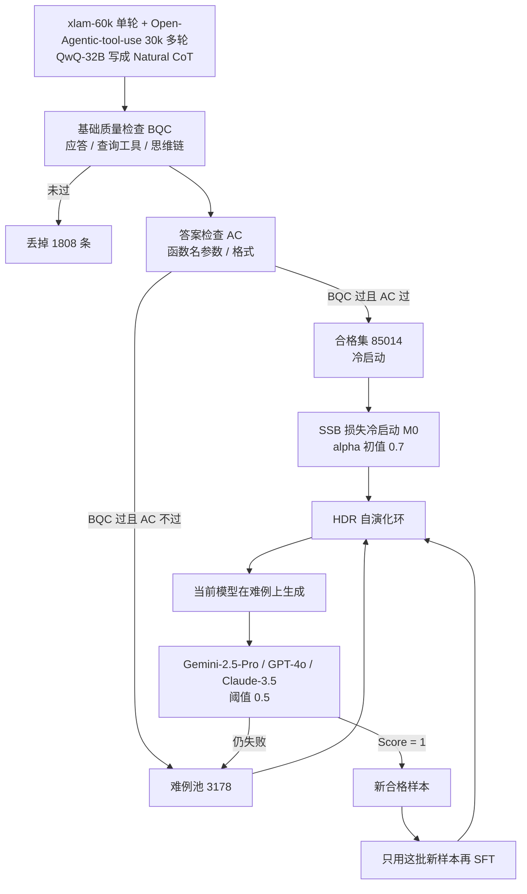

# BalanceSFT：长思维链把调用 token 淹死，简单题又占满训练集，用可学习权重和错题循环把这两头拧回来

<!-- release-date: 2025-05-26 -->

> 本文依据 **BalanceSFT: Improving LLM Function Calling with Balanced Training Signals and Data Hardness**，即 arXiv:2505.20192v3、水印 `arXiv:2505.20192v3 [cs.LG] 25 Nov 2025`、共 18 页的 A4 稿。页码均指这份 PDF 本身。封面标题是 BalanceSFT；pdfinfo 的 Title 仍是 v1 的 FunReason 全名，arXiv 摘要页标题也仍是 FunReason。这是同一篇论文的改名，不是两篇：v1（2025-05-26）叫 FunReason，方法名是 Self-Refinement Multiscale Loss（SRML）和 Automated Data Refinement；v2（2025-11-24）改名为 BalanceSFT，方法名改为 Self-adjusted Signal Balancing（SSB）损失和 Hard Data Re-sampling（HDR）；v3（2025-11-25）是目前这份原件。`release-date` 取该编号首次公开日 2025-05-26，不因改名或 v3 回写。
>
> 十二位作者里，AWorld Team, Inclusion AI 署了九人（Bingguang Hao、ZengZhuang Xu、Yuntao Wen、Yicheng Chen、Cunyin Peng、Long Chen、Dong Wang、Jinjie Gu、Chenyi Zhuang），City University of Hong Kong 署 Maolin Wang 与 Xiangyu Zhao，西南交通大学署 Ji Zhang。Hao、Xu、Wang、Wen 为共同一作；Hao、Wang、Wen、Chen 脚注为 Work done at Ant Group；通讯作者是 Chenyi Zhuang（邮箱落在 antgroup.com）与 Ji Zhang。按主要归属与索引登记，本站放在 `reports/AntGroup/`。Inclusion AI / AWorld 是蚂蚁的开源智能体团队，合作关系写在正文里，不另建目录。
>
> 这是一篇**工具调用监督微调的方法论文**，不是基模 Technical Report。它没有新架构，也没有预训练配方。它讲的是：给语言模型灌「先想再调工具」的示范时，长思维链和短函数调用、简单题和难例，怎样把梯度分歪，以及怎样用一段可学习权重和一套错题循环把这两头拧回来。全文把三件事分开写：**论文明确写了什么**（带页码）、**本文如何解释它**（凡属推算、换算或从图上读数都会写明）、**外部资料补充**（给出链接并标注）。截至 2026-09-11 核验，arXiv 最新版本就是 v3，与本地原件一致。

## 读之前需要的最少背景

这篇论文默认你已经见过「让语言模型调外部 API」。不熟的话，先记住下面几件事。

**函数调用（function calling / tool use）** 是让模型不要只生成自然语言，而是按约定格式写出函数名和参数，交给外部工具去执行。评测里常见的对错标准是：函数名对不对、参数键对不对、参数值能不能从用户话里推出来。本篇主榜是 **Berkeley Function Calling Leaderboard（BFCL）** 的 v3，分单轮（Non-Live / Live）和多轮（Base / Miss Function / Miss Parameter / Long Context）；附录另测了 BFCLv4 的 Web Search 与 Memory（PDF p. 5、12）。

**思维链（Chain-of-Thought，CoT）** 是模型在给出函数调用之前，先用自然语言把「该调哪个、参数从哪来」写出来。本篇的样本形态是：`<think>…</think>` 后面紧跟一条短调用，例如 `[matchschedules(day=28, month=2, year=2024)]`（PDF p. 18，Figure 12）。

**监督微调（Supervised Fine-Tuning，SFT）** 是拿这些「思维链 + 调用」当标准答案，用下一个 token 的交叉熵去更新模型。常规 SFT 对序列里每一个答案 token 一视同仁：一个词元一份损失。本站对「结果奖励、不看过程」的强化学习路线，见 [DeepSeek-R1](/reports/DeepSeek/DeepSeek-R1)；对把代码执行嵌进思考过程的工具 RL，见 [ReTool](/reports/ByteDance/ReTool)。**本篇走的是另一条路：不换 PPO / GRPO，先把 SFT 的损失和数据分布拧平。**

还要分清三个词，后面每一节都会用到：

- **训练信号不均衡（Imbalanced Training Signals）**：同一条样本里，思维链有几百个 token，函数调用只有几十个。按 token 平均之后，梯度几乎都在「把推理写得像样」，真正要执行的那一行被稀释。
- **数据难度不均衡（Imbalanced Data Hardness）**：现成工具调用数据里，简单题占绝大多数，能逼出边界错误的难例很少。
- **冷启动（Cold Start）与自演化环（Self-evolving Loop）**：先用过滤后的合格数据、配上新损失把模型启动；再专门对着答错的题让模型自己重生、评委过门、再微调。

实验主基座是 **Qwen2.5-Coder-7B-Instruct**，另外试了 Llama-3.2-3B-Instruct 和 Qwen3-4B-Instruct-2507。SFT 跑在 LLaMA Factory 上；对照用的 GRPO 跑在 Verl 上，也就是本站 [HybridFlow](/reports/ByteDance/HybridFlow) 那套框架（PDF p. 5、11）。

## 一句话先说清

给语言模型教工具调用，最省事的做法是：找一批「先想再调」的示范，整段拿去 SFT。

这条路有两个互相咬合的漏洞。第一，思维链比函数调用长一个数量级，标准 SFT 按 token 平均，等于允许模型把力气花在「推理读起来像那么回事」，而把短、但必须一字不差的调用写飘。第二，现成数据里简单题是主体，答错的边界样本既少、又常常格式脏到解析器直接失败；模型在评测里栽的那些多轮、缺参、长上下文错误，训练集里几乎见不到。

BalanceSFT 的回答是两层，都还停在监督微调里：

> **损失不再按序列长度摊，改成思维链一段、调用一段，中间用一个可学习的 $\alpha$ 调比重；数据不再把答错的题丢掉，改成过不了答案检查的题进难例池，让模型自己重生、三个大模型评委过门，再只拿新生成的合格样本继续微调。**

主结果必须连着榜和基座读。BFCL 快照日期是 2025-08-26，官方脚本（PDF p. 6，Table 2）：

| 模型 | 多轮 Overall | 单轮 Overall |
|---|---:|---:|
| Qwen2.5-Coder-7B-Inst（未做本方法） | 3.88 | 76.82 |
| GPT-4o-2024-11-20 | 42.50 | 77.21 |
| DeepSeek-R1-0528 | 44.50 | 78.22 |
| **BalanceSFT-7B** | **47.00** | **84.00** |

摘要里「7B 与 GPT-4o 打平」，指的是这一张 BFCL 主表上的 Overall，以及 ACEBench 单轮 80.50 / 多轮 74.00 对 GPT-4o 的 78.00 / 68.00（PDF p. 1、6–7）。它不是每一个分项都赢：多轮 Long Context 仍是 GPT-4o 的 51.00 最高，BalanceSFT 46.50 第二；ACEBench 的 Atom / Similar API / Preference 也是 GPT-4o 更高（PDF p. 6、13）。这些数字后面会拆开分母，先不要读成「任意工具任务、任意 7B 都打平 GPT-4o」。

## 全景：过滤一次，冷启动一次，再对着错题转圈

先把整条流水线画出来。上半是「数据怎么分家」，下半是「模型怎么更新」。

这是根据 PDF p. 4 的 Figure 2、p. 3–4 的式 3–10、p. 11 附录 A.1 重画的**机制示意图**，不是实测时间轴。箭头表示数据与控制方向。

论文把它拆成两块贡献，外加一条数据观察（PDF p. 2）：

| 缺口 | BalanceSFT 的设计 | 它接在哪 |
|---|---|---|
| 长 CoT 按 token 数压过短调用 | SSB：$\alpha L_{\mathrm{think}}+(1-\alpha)L_{\mathrm{result}}$，$\alpha$ 可学习 | 损失 |
| 难例稀缺，简单题占满 | 先分出合格集和难例池，再对难例做生成—评委—微调环 | 数据 |
| 规定好的推理模板不如模型自己的推理口吻 | 冷启动用 QwQ-32B 的 Natural CoT，不用 GPT-4o 按策略写的 Strategy CoT | 冷启动语料 |

后面三节按这条因果链拆开。先讲旧 SFT 卡在哪，再讲 SSB，再讲 HDR。

## 旧方法卡在哪

### 第一层：按 token 平均，等于把梯度送给更长的那一段

标准 SFT 把整段「思维链 + 函数调用」当成一条序列，损失是位置平均（PDF p. 2–3）。思维链可以写几百个词，调用往往是一行 JSON 或一行 `[func(k=v)]`。平均之后，模型只要把长推理写得通顺，损失就已经很好看；最后那几个必须精确的函数名、参数名、参数值，摊下来只占很小一份。

Table 1 把这件事写成了数字（PDF p. 3）。用 QwQ-32B 给函数调用数据写成 CoT 之后：

| | 均值 | 中位数 |
|---|---:|---:|
| 思维链 token 数 | 350.74 | 248.00 |
| 函数调用 token 数 | 31.07 | 27.00 |

均值比大约是 $350.74/31.07\approx 11.3$，中位数比大约是 $248/27\approx 9.2$。论文说「大约 10 倍」（PDF p. 3）。附录 A.1 用 Qwen2.5-Coder-7B-Instruct 的 tokenizer 复算，得到同一对均值，并注明含拒绝样本（PDF p. 11）。

可以把它想成改作文：老师按字数打分，学生写了三百字分析、三十字段程序调用。三百字分析稍微通顺一点，分数就上去了；程序调用写错一个参数名，几乎看不出来。

相关工作把同一矛盾说得更直白：传统 SFT 对推理过程和最终调用一视同仁，模型会被激励去写「精致、看起来合理、但不指向正确可执行调用」的链条（PDF p. 2–3）。这不是「CoT 无用」，是 **CoT 和调用在损失里的单位不一致**。

### 第二层：简单题太多，难例既少又脏

Figure 1 右边用两个天气查询当例子（PDF p. 1）：「芝加哥和多伦多未来 7 天天气」是简单题；「多伦多飞东京的航班会不会受这 7 天天气影响」要把天气和航班串起来，才是难例。现成训练集天然偏向前者（PDF p. 2）。

附录把「脏」写具体了。xlam 里有一条天气查询，参考答案的函数名前面多了一个空格：`[ forecast_weather_api(...)]`，抽象语法树解析直接失败（PDF p. 11、14，Figure 6）。这种样本如果混进训练集，模型学到的是解析器不认的格式；如果直接丢掉，又少了一批本来可以变成难例的查询。

所以第二层不是抽象的「数据要多样」，而是一个很具体的过滤决策：**过不了格式检查的，不该和过不了答案检查的走同一扇门。** 前者该丢或该修；后者才是「模型以后会栽的那种题」。

### 这两层会叠加

本文的解释，不是论文原句：信号不均衡让模型在简单题上也能靠「把推理写长」把损失做低；难度不均衡又让它很少见到必须把调用写对才能过关的题。多轮 BFCL 对基座尤其残忍——Qwen2.5-Coder-7B-Inst 多轮 Overall 只有 3.88（PDF p. 6）。单轮它已经有 76.82，说明「会写一次调用」和「在对话状态机里不漏函数、不漏参数」不是同一个能力。只堆简单单轮 SFT，多轮仍然起不来。

## 核心设计一：SSB，把一段序列拆成两条平均损失再混合

### 旧问题

记一条答案由思维链 $t$ 和函数调用 $f$ 拼接而成，长度分别是 $N_t$、$N_f$，总长 $N_{\mathrm{all}}=N_t+N_f$。标准 SFT 是对全部位置做平均。论文把它拆开写（PDF p. 3，式 2）：

$$
L_{\mathrm{SFT}} = w_t\, L_{\mathrm{think}} + w_f\, L_{\mathrm{result}},
\qquad
w_t=\frac{N_t}{N_{\mathrm{all}}},\ 
w_f=\frac{N_f}{N_{\mathrm{all}}}
$$

$L_{\mathrm{think}}$、$L_{\mathrm{result}}$ 分别是两段上的平均损失。$N_t\gg N_f$ 时 $w_t\gg w_f$，优化方向被推理段主导。

式 1 的记号写成 $\sum_i\sum_j -p_{ij}\log p_{ij}$。按常规监督微调，这应读成「第 $i$ 个位置对真实下一个词的交叉熵」，而不是模型分布自己的熵。本文按 token 级交叉熵来理解；不把式 1 当成最大化熵。式 2 里损失符号印成了 $L_{\mathrm{STF}}$，与式 1 的 $L_{\mathrm{SFT}}$ 不一致，当作排印笔误。

### 新设计

SSB 把长度权重换成一个标量 $\alpha\in[0,1]$（PDF p. 3，式 3）：

$$
L_{\mathrm{SSB}} = \alpha\, L_{\mathrm{think}} + (1-\alpha)\, L_{\mathrm{result}}
$$

$\alpha$ 被设成可训练参数，初值 0.7，目的是少做网格搜索（PDF p. 3、5）。直觉上：两段各自先对自己的 token 取平均，再按 $\alpha$ 混合。调用段再短，它的平均损失也有一个不被长度稀释的座位。

### 工作机制

用 Table 1 的均值做一次换算（本文推算，不是论文原表）。$N_t=350.74$，$N_f=31.07$，$N_{\mathrm{all}}\approx 381.81$。

- 标准 SFT：每个 token 权重都是 $1/N_{\mathrm{all}}\approx 0.00262$。调用段整体只占约 8.1% 的损失。
- SSB，$\alpha=0.7$：思维链段整体占 70%，调用段整体占 30%。摊到每个调用 token 上大约是 $0.3/31.07\approx 0.0097$，相对标准 SFT 放大约 3.7 倍；每个思维链 token 则略降。

所以 SSB 不是「不要思维链」，是让「写对那一行调用」在损失里的地位，不再由它有多短来决定。$\alpha=0.7$ 仍把更大份额给推理，只是从约 92% 降到 70%。

论文把 $\alpha$ 说成可以「根据性能需要动态调整推理深度和执行精度」（PDF p. 3）。实现段落只写了：它是可学习参数，初值 0.7（PDF p. 5）。没有曲线，没有最终值，没有写它是否对 $L_{\mathrm{SSB}}$ 反传、有没有投影回 $[0,1]$。

本文的疑问：若真对式 3 做梯度下降，$\partial L/\partial\alpha = L_{\mathrm{think}}-L_{\mathrm{result}}$。哪一段当前损失更高，$\alpha$ 就会滑向降低那一段的权重，也就是滑向**当前更容易的那一段**。这和「把力气分给更关键的调用」不一定同向。实验能涨分，说明初值 0.7 加上整套数据流程是可用的；**不能从现有材料证明「可学习」本身学到了正确的平衡。** 更老实的读法是：$\alpha$ 是把两段平均损失从长度权重里解放出来的旋钮，作者把它写成参数以免手调。

### 收益与代价

消融里，只开 SSB、不开 HDR 时，Qwen2.5-Coder 单轮从 81.73 到 82.20，多轮从 38.25 到 41.62（PDF p. 7，Table 5）。多轮的绝对提升比单轮大。Llama-3.2-3B 上单轮从 73.67 到 76.82，多轮从 33.25 到 34.62，方向相同、多轮幅度更小。

代价在 Limitations：SSB 依赖 CoT 数据本身的质量和结构，推理标注稀缺的领域不一定搬得动（PDF p. 9）。另一条没写进 Limitations、但从图里能读出来的代价是：它改变的是**已经切好的两段**之间的比重。思维链和调用的边界必须能切开。Figure 12 的样本用 `<think>…</think>` 做边界（PDF p. 18）；换一套没有稳定分隔符的数据，式 3 就没有操作对象。

**可迁移启发：** 只要示范里同时有「长过程」和「短而必须精确的结果」（工具调用、JSON、代码的最终补丁、数学的 `\boxed{}`），先按段取平均再混合，比直接加长过程更老实。$\alpha$ 可以先当超参扫，不必一上来就做成可学习参数。

## 核心设计二：HDR，过不了答案检查的题不准混进合格集，但也不许丢掉

### 旧问题

只靠合格示范做 SFT，模型会的还是合格示范里的那种题。难例少，而且往往和脏格式混在一起。论文的目标是用模型自己的错误当生成信号，补一批高质量复杂样本（PDF p. 4）。

### 新设计

每条样本写成 $(q_i,c_i,f_i)$：用户查询、思维链、函数调用。两道布尔门（PDF p. 4，式 4）：

- **基础质量检查（Base Quality Check，BQC）**：应答识别、查询与工具识别、思维链识别。
- **答案检查（Answer Check，AC）**：函数与参数识别、格式识别。

合格集 $D_{\mathrm{qualified}}$ 是两道门都过的样本，拿去冷启动 $M_0$。难例池 $D_{\mathrm{hard}}$ 是 BQC 过、AC 不过的样本，留给循环。BQC 不过的直接丢。附录 A.1：合格 85014、难例 3178、丢掉 1808，三者相加正好是 60k + 30k = 90000（PDF p. 11）。难例大约只占 3.5%。

附录 D 把五道门的提示词全文印出来了，执行模型是 QwQ-32B（PDF p. 12、15–17，Figure 7–11）：

| 检查 | 它在问什么 | 输出 |
|---|---|---|
| Response Identification | 参考答案是函数调用还是一句普通回复 | `<judge>True/False</judge>` |
| Query and Tool Identification | 参数值能否从用户话里分析出来、函数名能否从候选工具里分析出来 | 同上 |
| CoT Identification | 思维链是否从合适位置起笔、逐步可跟、最后指向参考调用 | 同上 |
| Function and Parameter Identification | 函数名和参数对不对；不对就改写成新的调用 | 判断 + `<NewFC>` |
| Format Identification | 是否是 `[func(k=v), …]`；字符串值要加引号，参数名不要加引号 | 判断 + 只改格式的 `<NewFC>` |

前三道属于 BQC，后两道属于 AC。格式那一关写得很死：`data="paramvalue1"` 和 `data='paramvalue1'` 都不算过，必须是 `data=paramvalue1` 这种「参数名裸写、字符串值再加引号」的样子（PDF p. 17，Figure 11）。这和 BFCL 一类 AST 评测的口味一致：格式差一个空格，分数就是零。Figure 6 那条 xlam 脏样本，正好死在这种解析上。

### 工作机制

冷启动之后进入自演化环。第 $t$ 轮（PDF p. 4，式 5–10）：

1. 当前模型 $M_t$ 在难例池的查询上生成候选 $R^{t+1}$。
2. 三个评委 $J=\{\text{Gemini-2.5-Pro},\ \text{GPT-4o},\ \text{Claude-3.5 Sonnet}\}$，温度 0.7，分数区间 $[0,1]$，阈值 $\tau=0.5$（PDF p. 5）。
3. 一条回复的分数是评委「过线」比例：

$$
\mathrm{Score}(r_j)=\frac{1}{k}\sum_{m=1}^{k}\mathbf{1}\bigl(J_m(r_j)\ge\tau\bigr)
$$

4. $\mathrm{Score}(r_j)=1$ 的进入 $D_{\mathrm{new}}^{t}$，再用这批数据做 SFT 得到 $M_{t+1}$。
5. 仍失败的查询留在难例池。直到难例池空，或达到 $T_{\max}=10$。

正文把第 3 步写成 majority voting（多数票，PDF p. 4），式 7 却要求 $\mathrm{Score}=1$，三个评委都过线才收。**按公式，这是全票，不是多数票。** 本文按式 7 读。

还有一处原文内部不完全对齐。式 5 对每个查询只写了一个 $M_t(q_i)$；Figure 2 画的是 Infer\*N，示例里三条回复分数是 0.1 / 0.8 / 0.3（PDF p. 4）。实现段又说推理时采样 3 次、温度 0.7（PDF p. 5）。HDR 每一轮每个难例究竟生成几条、留下几条，不能从公式唯一确定。能确定的是：过门的新样本会拿去微调，没过的查询继续留在池子里。

式 8 写的是 $M_{t+1}=\mathrm{SFT}(M_t, D_{\mathrm{new}}^{t})$。按字面，每一轮**只拿新生成的合格难例继续微调**，没有写要把原来的 85014 条合格集重放进去。论文没有讨论这会不会冲掉简单题上的能力。代码遗忘实验被归因给 SSB（PDF p. 8），没有给「HDR 轮是否重放合格集」的消融。

### 收益与代价

Figure 4c 把多轮准确率画在自演化环的横轴上（PDF p. 8，数字读自该图）：

| 环的轮次 | 0 | 1 | 2 | 3 | 4 | 5 |
|---|---:|---:|---:|---:|---:|---:|
| 多轮准确率 | 38.60 | 39.00 | 43.00 | 44.40 | 46.90 | 47.00 |

第 0 轮 38.60，和 Table 5 里普通 SFT 的 38.25 几乎同一水平，对应冷启动刚结束。真正拉开的是第 1→2 轮和第 3→4 轮。$T_{\max}=10$，图只画到第 5 轮并趋于 47.00，和主表 BalanceSFT-7B 多轮 47.00 对上。论文把它读成：HDR 能持续补到复杂边界样本，把多轮准确率推向高位（PDF p. 8）。

只开 HDR、不开 SSB 时，Qwen 单轮 83.85、多轮 43.12，已经比只开 SSB 更强；两件都开才到 84.00 / 47.00（PDF p. 7）。**多轮上 HDR 是大头，SSB 是在难例补齐之后把调用 token 再按下去的那一截。** 两段提升相加约 8.24 个点，组合是 8.75 个点，有一点超可加，但主因仍是数据，不是损失。

代价写在 Limitations 第二条：HDR 依赖大模型评委，有算力成本和评委偏差（PDF p. 9）。评委名单里有 GPT-4o，主表对照也是 GPT-4o。论文没有做「换一套评委、主榜会不会动」的实验。另一个边界是：难例池的定义是「格式和工具对得上、参考答案过不了 AC」。它补的是**已有查询上的更好示范**，不是新 API、新领域、新的多轮状态机。BFCLv4 的 Web Search / Memory 几乎没有被这 3178 条难例覆盖，后面的表会看到这一点。

**可迁移启发：** 过滤不要只有一扇门。脏格式和答错是两类失败，混在一起丢，会把最有训练价值的查询一并删掉。第二，用当前模型的错误当生成种子，比从零合成「看起来很难」的题更对准评测失败模式。第三，若循环微调只吃新难例、不重放旧合格集，必须另有机制（本篇把希望寄在 SSB 上）防止简单能力和通用能力被冲掉。

## 数据与训练配方

### 两份源数据，两种 CoT

训练数据由两块拼成（PDF p. 5–6，Table 4；类别分布见 p. 12，Figure 5）：

| 数据集 | 条数 | API 数 | 类别数 | 论文给的定位 |
|---|---:|---:|---:|---|
| xlam-function-calling-60k | 60000 | 3673 | 21 | 单轮，打底 |
| Open-Agentic-tool-use | 30000 | 129 | 8 | 多轮，复杂场景 |

xlam 的类别被切得很碎：Finance 11.7%、Data 11.1%、Sports 9.0%、Travel 8.1%、Technology 7.9% 等（读自 Figure 5a）。Open-Agentic-tool-use 更集中：Vehicle 17.1%、Trading 17.1%、Travel 13.2%、File system 13.9%、Math 13.1%、Posting 10.8%（读自 Figure 5b）。**多样性主要来自 xlam 的 API 面；多轮结构主要来自那 30k。** 论文说覆盖「数千 API、多类别」，有助于跨域匹配（PDF p. 5）。它没有给出两块数据分别对 BFCL 多轮的消融，所以不能把 47.00 记成「只靠 xlam」或「只靠 30k 多轮」。

CoT 有两条生成路线，都拿同一套超参在 Qwen2.5-Coder-7B-Inst 上做普通 SFT，只比单轮（PDF p. 5–6，Table 3）：

| 数据 | Non-Live | Live | Overall |
|---|---:|---:|---:|
| 基座，未 SFT | 83.88 | 69.75 | 76.82 |
| Strategy CoT（GPT-4o 按既定策略写） | 87.00 | 66.81 | 76.91 |
| Natural CoT（QwQ-32B 按自己的推理写，vLLM，温度 0.1） | 85.67 | 71.73 | 78.70 |

Strategy 把 Non-Live 抬得更高，但 Live 掉到基座以下。Natural 在 Live 上更好，Overall 也更高。作者因此冷启动用 Natural CoT，HDR 阶段用模型自己生成，以保持推理口吻一致（PDF p. 5）。规定好的推理模板在这个任务上并不优于教师模型自己的推理。Live 模拟真实交互，掉分说明：把 GPT-4o 的策略腔强行灌给 7B，单轮模板题可以更像教师，换分布就伤。

### SFT 超参

所有 SFT 对比共用（PDF p. 5）：LLaMA Factory；batch size 512；学习率 $4\times 10^{-5}$；warm-up rate 0.05；$\alpha$ 初值 0.7 且可学习；8 张 NVIDIA H20。推理：采样 3 次，温度 0.7。HDR 评委温度同样 0.7，$T_{\max}=10$。

论文没写：SFT 轮数、序列最大长度、是否 packing、$\alpha$ 的学习率是否与模型参数相同、3 次采样如何聚成 BFCL 官方脚本要的那一条输出。主表标题写「all metrics calculated using the official script」（PDF p. 6），但官方脚本通常对应一条确定性输出。3 次温度 0.7 若取最好，口径会比贪心解码松。原文没有闭合这件事。

### GRPO 对照的配方

附录 B 用 Verl 跑 GRPO，基座同样是 Qwen2.5-Coder-7B-Instruct 和 Llama-3.2-3B-Instruct（PDF p. 11）。Table 6（PDF p. 12）：

| 超参 | 值 | 超参 | 值 |
|---|---|---|---|
| Batch Size | 1024 | Max Prompt Length | 8192 |
| Learning Rate | $1\times 10^{-6}$ | Max Response Length | 20480 |
| Temperature | 0.7 | Epoch Number | 5 |
| KL Coefficient | $1\times 10^{-3}$ | Entropy Coefficient | $1\times 10^{-3}$ |
| Rollout Number | 8 | | |

正文说奖励设计来自「official GRPO baseline described in Appendix B」（PDF p. 7）。附录 B 实际只剩这张超参表，**没有奖励公式**。函数调用的 GRPO 奖励常见拆法是「格式分 + AST 对错 + 可选的参数分」，本篇全部没写。和 SSB 的对比因此只能读成「这一套 Verl 默认 GRPO，对这一套数据」，不能读成「GRPO 作为算法输给了 SSB」。

## 实验怎么证明

### 主榜：BFCL，快照 2025-08-26

Table 2 是全文最重要的一张表（PDF p. 6）。下面按论文的 Closed / Open / Ours 分组抄主列；分项完整值以原表为准。

**多轮。** BalanceSFT-7B Overall 47.00，是整张表最高，高于 DeepSeek-R1-0528 的 44.50 和 GPT-4o 的 42.50。Miss Function 47.00、Miss Parameter 41.00 也是表内最高。Long Context 46.50，第二，最高是 GPT-4o 的 51.00。Base 53.50，低于 ToolACE-MT 的 57.50 和 GPT-4o 的 55.50。

基座 Qwen2.5-Coder-7B-Inst 多轮只有 3.88。所以 47.00 不是「7B 编码模型天生会多轮工具」，是后训练把一个几乎不会多轮的基座拉起来的。Table 5 显示普通 SFT 已经能到 38.25，BalanceSFT 再把剩下约 9 个点拿掉（PDF p. 7）。**摘要若只对比基座 3.88 和 47.00，会把普通 SFT 已经完成的那一大截算进方法里。**

**单轮。** BalanceSFT-7B Overall 84.00，同样是表内最高。Non-Live 88.29，低于 Qwen3-235B-A22B-Instruct-2507 的 90.12；Live 79.70，正文写 DeepSeek-R1-0528 以 80.90 第一、自己第二（PDF p. 6）。GPT-4o 单轮 Overall 77.21，Non-Live 83.88，Live 70.54，三条都低于 BalanceSFT-7B。

闭源模型里，Amazon-Nova-Pro 单轮 Overall 81.78 高于 GPT-4o；GPT-5-2025-08-07 多轮只有 28.50、单轮 65.59，在这张 BFCL 快照上很差。本文不把「7B 超过 GPT-5」写成能力结论——更像是该 GPT-5 检查点没按 BFCL 的调用格式对齐。o3-2025-04-16 的 Non-Live Parallel / Parallel Multiple 在附录 Table 7 里是 0.00（PDF p. 13），同一类信号。

附录 Table 7 把单轮拆到 Simple / Multiple / Parallel / Parallel Multiple（PDF p. 13）。BalanceSFT-7B：Non-Live 88.29 / 78.17 / 94.00 / 91.50 / 89.50，Live 79.70 / 82.56 / 77.87 / 87.50 / 83.33。相对基座，Live 五个数全涨。正文 C.1 说「live 所有类别都有很大提升」（PDF p. 11），对基座成立；对「表内第一」不成立，Live Simple 仍低于 Kimi-K2 的 86.05。

**必须单独标出的表间打架。** Table 2 里 DeepSeek-R1-0528 的 Non-Live 是 75.73、Live 是 80.90，二者平均约 78.32，和它的单轮 Overall 78.22 对得上。附录 Table 7 把同一模型写成 Non-Live 86.52、Live 77.65。GPT-4o、Gemini-2.5-Pro、Qwen3-235B、Kimi、BalanceSFT-7B 在两张表上是对得上的，只有 DeepSeek 这一行不一致。正文「Live 第一是 DeepSeek 80.90、我们 79.70 第二」完全依赖 Table 2；若信 Table 7，Live Overall 第一就变成 BalanceSFT 自己。**比较 Live 名次时只用 Table 2，并记住附录没对上。**

### ACEBench 和 APIBank：主文柱状图不是完整故事

Figure 3 与正文（PDF p. 6–7；柱上数字读自该图）：

ACEBench：

| | BalanceSFT-7B | GPT-4o | GPT-4o-mini | Llama-3.1-8B-Inst |
|---|---:|---:|---:|---:|
| 单轮 | 80.50 | 78.00 | 76.00 | 39.80 |
| 多轮 | 74.00 | 68.00 | 66.50 | 28.00 |

APIBank：

| | BalanceSFT-7B | GPT-4o | GPT-4o-mini | Llama-3.1-8B-Inst |
|---|---:|---:|---:|---:|
| Level-1（Call） | 72.18 | 66.67 | 68.42 | 46.62 |
| Level-2（Retrieve+Call） | 45.93 | 40.74 | 48.15 | 40.74 |

正文写 APIBank 上「Level-1 第一、Level-2 第二」（PDF p. 6），对得上：Level-2 最高是 GPT-4o-mini 的 48.15。

附录 Table 9 把 ACEBench normal 的另外三列补出来了（PDF p. 13）：

| 模型 | Atom | 单轮 | 多轮 | Similar API | Preference |
|---|---:|---:|---:|---:|---:|
| GPT-4o-2024-11-20 | 90.0 | 78.0 | 68.0 | 80.0 | 78.0 |
| Llama3.1-70B-Instruct | 83.7 | 71.5 | 61.0 | 74.0 | 66.0 |
| ToolACE-MT-8B | 83.0 | 64.0 | 51.0 | 68.0 | 68.0 |
| Qwen2.5-Coder-7B-Instruct | 78.7 | 66.5 | 51.0 | 66.0 | 40.0 |
| BalanceSFT-7B | 86.0 | 80.5 | 74.0 | 70.0 | 56.0 |
| BalanceSFT-3B | 64.3 | 42.0 | 44.0 | 60.0 | 34.0 |

单轮、多轮确实是表内最高，而且多轮 74.0 对 GPT-4o 的 68.0，正好是正文说的高 6 个百分点（PDF p. 6）。Atom、Similar API、Preference 仍是 GPT-4o 更高。「ACEBench 打过 GPT-4o」只对 Figure 3 画出来的两根柱成立。3B 在 ACEBench 上明显没跟上，单轮 42.0、多轮 44.0，方法不是「任意小模型套一套就有 7B 那种相对 GPT-4o 的优势」。

### 消融：两个模块都要，HDR 扛多轮

Table 5（PDF p. 7）：

| 基座 | SSB | HDR | 单轮 | 多轮 |
|---|---|---|---:|---:|
| Qwen2.5-Coder-Inst + SFT | × | × | 81.73 | 38.25 |
| | ✓ | × | 82.20 | 41.62 |
| | × | ✓ | 83.85 | 43.12 |
| | ✓ | ✓ | 84.00 | 47.00 |
| Llama-3.2-3B-Inst + SFT | × | × | 73.67 | 33.25 |
| | ✓ | × | 76.82 | 34.62 |
| | × | ✓ | 78.28 | 35.75 |
| | ✓ | ✓ | 78.99 | 36.12 |

Qwen 上，HDR 单独贡献的多轮提升（+4.87）大于 SSB 单独（+3.37）；组合到 47.00。Llama 上两条都涨，但多轮从 33.25 到 36.12 只有约 3 个点。论文写「相似趋势、跨架构有效」（PDF p. 7）。方向成立；幅度不成立为「3B 和 7B 同等受益」。7B 编码模型在多轮上的空间更大，也更吃难例。

Table 5 的 Qwen 单轮 81.73（普通 SFT）和 Table 3 的 Natural CoT 78.70 不是同一行：Table 3 只比了单轮、而且是「两种 CoT 生成方式」的冷启动对照；Table 5 的 SFT 基线已经用了最终数据流程里的合格集口径。不要把 81.73 和 78.70 当成两次失败的重复实验。

### 和 GRPO 比：单轮互有胜负，多轮是 BalanceSFT

Figure 4a（PDF p. 8；柱上数字与正文一致）：

| | BalanceSFT | GRPO |
|---|---:|---:|
| 7B 单轮 | 84.00 | 84.60 |
| 7B 多轮 | 47.00 | 40.75 |
| 3B 单轮 | 78.99 | 77.78 |
| 3B 多轮 | 36.12 | 34.00 |

7B 单轮 GRPO 略高（84.60 vs 84.00），多轮差一截（40.75 vs 47.00）。3B 则是 BalanceSFT 两项都高。论文的判断是：GRPO 在更简单的单轮上仍有优势，BalanceSFT 更增强复杂多轮（PDF p. 7–8）。

这个判断要连着前面的配方读。GRPO 的奖励没公开；SFT 侧却显式用 30k 多轮数据 + 3178 难例循环。**多轮赢，可能是数据对准了多轮，而不只是 SSB 比 GRPO 更适合多轮。** 论文没有「同一批 HDR 数据上再跑 GRPO」的格子，所以不能把 47.00 vs 40.75 读成算法对决的终局。

它仍然有一条硬信息：在工具调用这种稀疏、格式敏感的任务上，**把 SFT 的信号和难度拧平，可以在多轮上超过这一份 GRPO 基线。** 相关工作自己也说，工具调用 RL 仍受稀疏奖励和有效数据不足困扰（PDF p. 2）。本篇选择把预算花在造难例和改 SFT 损失，而不是先上 RL。

### 代码能力：普通 SFT 会忘，BalanceSFT 忘得少

基座是编码模型，所以他们用 HumanEval / HumanEval+ / MBPP / MBPP+ 看灾难性遗忘（PDF p. 8，Figure 4b）。正文给的精确小数（PDF p. 8）：

| 基准 | 基座 | BalanceSFT | 普通 SFT |
|---|---:|---:|---:|
| HumanEval pass@1 | 0.866 | 0.841 | 0.470 |
| HumanEval+ | 0.823 | 图上约 0.81 | 0.445 |
| MBPP | 0.812 | 0.794 | 图上约 0.69 |
| MBPP+ | 图上约 0.69 | 图上约 0.65 | 图上约 0.59 |

未给正文小数的，上表写明读自 Figure 4b。BalanceSFT 相对基座掉幅正文说在 4% 以内（PDF p. 8）：HumanEval 0.866−0.841=0.025，MBPP 0.812−0.794=0.018，对得上。普通 SFT 在 HumanEval 上从 0.866 掉到 0.470。

作者把原因归给 SSB：更新集中在短而关键的调用 token，避免过拟合长推理，从而保住原有编码能力（PDF p. 8）。这是因果叙述，不是消融结论。Table 5 没有代码列，「只开 HDR / 只开 SSB」各自忘多少，原文没有。另一种同样说得通的解释（本文，不是论文）：HDR 每轮只吃几千量级的新难例，总更新量比在 8.5 万条长 CoT 上做常规 SFT 小，遗忘本来就会轻。两种解释不互相消灭，但「遗忘被 SSB 动态重平衡治好了」目前只有结果对比，没有模块消融。

### 换基座：Qwen3-4B 上多轮同样拉开，但 Miss Function 不是单调变好

Table 10（PDF p. 13）：

| | 多轮 Overall | Base | Miss Func | Miss Param | Long Context | 单轮 Overall | Non-Live | Live |
|---|---:|---:|---:|---:|---:|---:|---:|---:|
| Qwen3-4B-Inst-2507 | 15.75 | 19.00 | 15.50 | 12.50 | 16.00 | 78.19 | 86.35 | 70.02 |
| + SFT | 41.88 | 47.00 | 50.50 | 36.00 | 34.00 | 82.20 | 85.15 | 79.25 |
| + BalanceSFT | 47.12 | 53.00 | 46.00 | 41.50 | 48.00 | 83.88 | 87.48 | 80.28 |

普通 SFT 已经把多轮从 15.75 拉到 41.88；BalanceSFT 再拉到 47.12。Long Context 从 34.00 到 48.00，是这一行里最刺眼的增益。**Miss Function 却从 SFT 的 50.50 降到 46.00。** 方法不是所有失败模式一起变好。4B 的多轮 Overall 47.12 和 7B 的 47.00 几乎相同，不能直接横比绝对能力——基座、数据切分和训练步都不是同一个实验；只能说：在 Qwen3-4B 上，相对普通 SFT 的方向与 7B 一致。

### BFCLv4 的智能体子集：有提升，绝对值仍低

Table 8（PDF p. 13）。训练数据不含 Web Search、Memory（PDF p. 12）：

| | Web Search Overall | Base | No Snippet | Memory Overall | KV | Vector | Recursive Sum |
|---|---:|---:|---:|---:|---:|---:|---:|
| Qwen2.5-Coder-7B-Instruct | 4.50 | 4.00 | 5.00 | 2.37 | 0.00 | 0.00 | 7.10 |
| BalanceSFT-7B | 7.00 | 9.00 | 5.00 | 8.17 | 0.00 | 0.00 | 24.52 |

Memory 的 KV / Vector 仍是 0。Recursive Sum 从 7.10 到 24.52，是这一行唯一像样的跳变。论文说这说明训练和数据选择对智能体能力有益（PDF p. 12）。更窄的读法是：**在没见过的智能体任务上，工具调用 SFT 有一点正迁移，远谈不上会做 Web Search 或记忆。** 不要把 Table 8 和 Table 2 的 47.00 放在同一句「智能体能力」里。

## 限制、笔误和没写的东西

论文自己划了两条（PDF p. 9）：

1. SSB 依赖高质量、可切分的 CoT 标注。
2. HDR 依赖大模型评委，有成本和偏差。

下面这些是本文核对全文后认为**没有公开、或原文互相打架**的，不是论文当缺陷写出来的：

- $\alpha$ 的训练曲线、最终值、是否对损失反传、有没有区间投影。
- HDR 每轮生成条数：式 5 一条，Figure 2 与实现段像 3 条。
- 正文 majority voting 与式 7 要求 $\mathrm{Score}=1$（全票）不一致。
- 式 8 只在 $D_{\mathrm{new}}$ 上 SFT，有没有重放合格集。
- 推理 3 次、温度 0.7，如何接到 BFCL 官方脚本的单条输出。
- GRPO 的奖励函数。Table 6 没有奖励。
- Table 2 与 Table 7 的 DeepSeek-R1 Non-Live / Live 对不上。
- 式 2 损失符号 $L_{\mathrm{STF}}$ 与式 1 的 $L_{\mathrm{SFT}}$ 不一致。
- 代码遗忘只对比了「完整 BalanceSFT vs 普通 SFT」，没有 SSB / HDR 拆开。
- 没有报告墙钟、H20 小时、HDR 评委调用次数。
- 没有把 xlam 与 Open-Agentic-tool-use 拆开消融。
- BFCLv4 智能体子集没有对照 GPT-4o 或其他闭源模型。
- 3B 在 ACEBench 上远弱于 7B，泛化声明不能从 7B 主表单独推出。

结论段只重复了「两个不均衡、SSB + HDR、7B 与 GPT-4o 在 BFCL 等榜上可竞争」（PDF p. 8）。没有第三块未在实验里出现的贡献。

## 外部补充：论文之后公开了什么

**以下全部不是 v3 PDF 里的内容**，不能拿来改写上面任何一条论文结论。

- 官方仓库：[https://github.com/BingguangHao/BalanceSFT](https://github.com/BingguangHao/BalanceSFT)。2026-09-11 访问时，README 使用 v3 标题，并写「论文被 ACL 2026 Findings 录用」，给出 `hao-etal-2026-balancesft`、页码 18094–18112 的 inproceedings 引用。v3 PDF 自己没有会议信息。OpenReview 上能看到 ACL ARR 2026 January 的投稿页（[forum id=efB6pS08MV](https://openreview.net/forum?id=efB6pS08MV)）；该页摘要把对照模型写成了 GPT-5.2 与 DeepSeek-V3.2，**与 v3 PDF 摘要里的 GPT-4o 不是同一句话**。本文只跟 v3 PDF。
- 权重仍挂在 Hugging Face [`Bingguang/FunReason`](https://huggingface.co/Bingguang/FunReason)，卡片标题和摘要还是 v1 的 FunReason / SRML 表述，基座链是 Qwen2.5-Coder-7B-Instruct。卡片仍写等待蚂蚁保密审查后开源代码、数据与权重；仓库 BalanceSFT 目前能看到的主要是 README 与图片，不是可复现训练脚本。PDF 摘要写「code, models, and dataset are open-sourced」（PDF p. 1），与目前仓库内容不完全同义。
- README 把数据集链到 ModelScope 的 [`hbg400/Open-Agentic-tool-use`](https://modelscope.cn/models/hbg400/Open-Agentic-tool-use)。这是模型页路径，不是论文参考文献里那个仅有名字的条目的独立核验。xlam-function-calling-60k 本身是公开的 Salesforce xLAM 函数调用数据，论文引用 Zhang et al., 2024（PDF p. 11）。
- 同一作者线稍后另有 FunReason-MT（多轮工具数据合成，arXiv:2510.24645），Hugging Face 上的 FunReason-MT-4B 多轮数字与本篇 Table 10 的 Qwen3-4B + BalanceSFT 不是同一次实验。不要把那边的 57.75 写进本篇 47.12。
- Inclusion AI / AWorld 是蚂蚁开源智能体方向的公开品牌，本站已有 [Ling 与 Ring 2.6](/reports/AntGroup/Ling-Ring-2.6)、[AReaL](/reports/AntGroup/AReaL) 等同一目录下的报告。那些是基模或 RL 系统；本篇是 AWorld 团队的工具调用 SFT 方法，不要把 Ling / AReaL 的训练配方借过来补这里的空缺。

## 可迁移启发

### 1. 先数 token，再决定损失要不要分段

Table 1 这种「过程段均值 / 结果段均值」的表，做工具 SFT、带 CoT 的 JSON SFT、带长分析的补丁 SFT 之前都可以先打一张。若比值已经到 10 倍，还用标准 token 平均，等于预先接受「过程通顺、结果偶尔错」。分段平均比上 RL 便宜，也比「把 CoT 截短」更可控。

### 2. $\alpha$ 先当超参，可学习要另给证据

把两段平均损失用 $\alpha$ 混合，这件事本身可复用。把 $\alpha$ 做成对同一损失反传的参数，则要画出 $\alpha$ 的轨迹，并说明它不会滑向更易的那一段。没有曲线时，扫 $\{0.3,0.5,0.7,0.9\}$ 比「可学习」更可审计。

### 3. 过滤分两扇门：脏格式丢掉，答错留下

1808 条 BQC 失败和 3178 条 AC 失败被分开处理，是本篇数据侧最值得抄的一步。工具数据里多一个空格就能让 AST 评分为零。把这两类失败混成「低质量」一起删，会删掉最该被重生的查询。

### 4. 难例循环吃的是当前模型的错，不是「看起来很难」的合成题

HDR 的种子是冷启动之后仍然过不了答案检查的查询。Figure 4c 从 38.60 走到 47.00，跳变发生在环的中段，而不是第 0 轮。迁移时：先用合格集把格式站稳，再对着真实失败模式生成，比一开始就用教师模型海造难题更对准榜。

### 5. 多轮工具调用，普通 SFT 就能走完大半；方法要报告「SFT 之后还剩多少」

Qwen2.5-Coder 多轮 3.88 → 普通 SFT 38.25 → BalanceSFT 47.00。Qwen3-4B 是 15.75 → 41.88 → 47.12。真正属于 SSB+HDR 的，是第二段。写方法论文或写自己的训练日志时，基座、普通 SFT、新方法三行都要在。缺中间那行，7B 打平 GPT-4o 会被读成奇迹。

### 6. 编码模型做工具 SFT，先看它还会不会写代码

HumanEval 从 0.866 掉到 0.470，说明「会调 API」的普通 SFT 可以以忘掉主业为代价。BalanceSFT 把掉幅压到约 0.025，无论真正起作用的是 SSB 还是更少的更新量，检查遗忘这一步本身应该成为工具 SFT 的默认验收，而不是附录点缀。

### 7. 和工具 RL 不在同一层，不要混用数字

ReTool 把代码执行嵌进 rollout，奖励只看最终答案；本篇不执行工具，只在文本示范上改 SFT。GRPO 对照在本篇是一条基线，不是「SFT 已经取代工具 RL」。多轮 47.00 vs 40.75 只对这一份未公开奖励的 Verl GRPO 成立。本站 [ReTool](/reports/ByteDance/ReTool)、[DeepSeek-R1](/reports/DeepSeek/DeepSeek-R1) 的数字不要写进这张 BFCL 表。

## 关键词回看

- **BalanceSFT / FunReason**：同一篇论文的 v2–v3 名 / v1 名。不要当成两篇工作。
- **训练信号不均衡**：CoT token 比调用 token 大约多 10 倍，标准 SFT 按长度加权。
- **数据难度不均衡**：合格简单题约 8.5 万，难例约 3.2 千。
- **SSB（Self-adjusted Signal Balancing）**：$L=\alpha L_{\mathrm{think}}+(1-\alpha)L_{\mathrm{result}}$，$\alpha$ 初值 0.7。
- **HDR（Hard Data Re-sampling）**：BQC/AC 分仓，难例上生成—评委—再 SFT。
- **BQC / AC**：基础质量检查 / 答案检查。脏格式走丢弃，答错走难例池。
- **Natural CoT / Strategy CoT**：QwQ-32B 自然推理 vs GPT-4o 按策略写；本篇冷启动用前者。
- **冷启动 $M_0$**：在合格集上用 SSB 做第一次 SFT。
- **自演化环**：难例池为空或 $t=T_{\max}$ 停止；主实验图画到第 5 轮。
- **BFCL v3 / v4**：主表用 v3 单轮+多轮；附录 Table 8 用 v4 的 Web Search 与 Memory。
- **灾难性遗忘**：编码基准 pass@1；BalanceSFT 掉幅正文称在 4% 内，普通 SFT 在 HumanEval 上腰斩。
- **xlam-function-calling-60k / Open-Agentic-tool-use**：60k 单轮 + 30k 多轮。
- **Verl / LLaMA Factory**：GRPO 框架 / SFT 框架。

## 最后的判断

BalanceSFT 证明的是一件很具体的事：在 Qwen2.5-Coder-7B-Instruct 上，把 SFT 损失按思维链和调用两段重加权，再把 3178 条过不了答案检查的查询拿去循环重生，BFCL（2025-08-26 快照）多轮 Overall 可以到 47.00、单轮到 84.00，超过表里的 GPT-4o-2024-11-20（42.50 / 77.21），并在 ACEBench 的单轮、多轮上各高 2.5 和 6 个点。普通 SFT 已经把多轮从 3.88 拉到 38.25；方法真正多拿的，大约是再 9 个点，而且主要来自 HDR，SSB 是较小的一段。同一套流程在 Llama-3.2-3B 和 Qwen3-4B 上方向相同，3B 的 ACEBench 绝对值带不起来。

它没有证明的同样清楚。$\alpha$ 可学习只是一个初值 0.7 的参数，没有轨迹；评委全票与正文「多数票」打架；GRPO 奖励没写；DeepSeek 在主表和附录单轮分项上自相矛盾；「打平 GPT-4o」不含 Long Context，也不含 ACEBench 的 Atom / Similar API / Preference。代码遗忘被说成 SSB 的功劳，但没有把 HDR 拆开。BFCLv4 的 Web Search 仍在 7 分。

如果只记一句话，可以记：

> **工具调用 SFT 的梯度，会顺着更长的思维链和更多的简单题流走。先按段给调用留一个不被长度稀释的损失座位，再把答错的题单独做成循环，比一上来上强化学习更便宜，也足以在多轮 BFCL 上超过一份未写明奖励的 GRPO。**

## 资料与阅读边界

- 原始依据：本地 `papers/AntGroup/BalanceSFT.pdf`，即 arXiv:2505.20192v3，水印 `arXiv:2505.20192v3 [cs.LG] 25 Nov 2025`，18 页，A4。pdfinfo Title 仍为 v1 的 FunReason 全名，封面标题以 PDF 正文第一页为准。
- arXiv 页面：<https://arxiv.org/abs/2505.20192>。提交历史为 v1 FunReason（Mon, 26 May 2025 16:38:06 UTC）、v2 BalanceSFT（Mon, 24 Nov 2025 12:52:02 UTC）、v3（Tue, 25 Nov 2025 07:50:07 UTC）。本文 `release-date` 取最早官方公开日 2025-05-26；改名与 v3 修订不回写该日期。
- 官方仓库：<https://github.com/BingguangHao/BalanceSFT>。旧名仓库仍指向 <https://github.com/BingguangHao/FunReason>。
- 权重卡片：<https://huggingface.co/Bingguang/FunReason>，基座 Qwen2.5-Coder-7B-Instruct。
- 训练框架：SFT 为 LLaMA Factory（PDF p. 5）；GRPO 为 Verl（PDF p. 11），系统机制见 [HybridFlow](/reports/ByteDance/HybridFlow)。
- 外部补充：GitHub README 自述 ACL 2026 Findings 录用；OpenReview ARR 摘要的对照模型与 v3 PDF 不一致。上述不进入论文主张层。
- 跨篇参考：GRPO 出处见 [DeepSeekMath](/reports/DeepSeek/DeepSeekMath)；结果奖励的长思维链 RL 见 [DeepSeek-R1](/reports/DeepSeek/DeepSeek-R1)；工具执行嵌进思考过程见 [ReTool](/reports/ByteDance/ReTool)；Qwen2.5 家族见 [Qwen2.5](/reports/Alibaba/Qwen2.5)。
