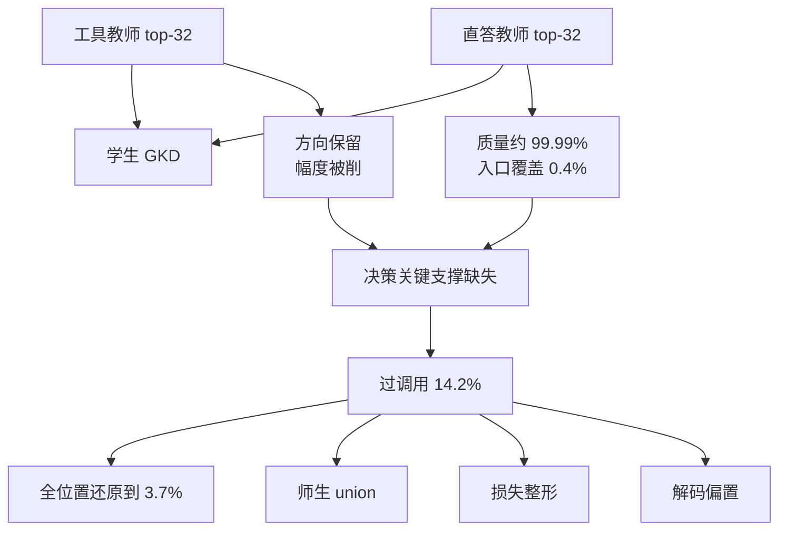

# When Top-K Misses the Decision：教师留下 99.99% 质量，仍可能丢掉学生该不该调工具的那个坐标

<!-- release-date: 2026-07-08 -->

> 本文依据 Jiabin Shen、Guang Chen、Chengjun Mao 的 **When Top-K Misses the Decision: Tool-Call Drift in Multi-Teacher On-Policy Distillation**，即 arXiv:2607.07050v6、2026-09-05 修订、本地 36 页（正文与结论 1–17 页，参考文献 17–20 页，附录 A–H 21–36 页）。页码均指这份 PDF 本身的页码。封面只给邮箱：Shen 为 `tjusjb@gmail.com`，Chen 与 Mao 为 `@antgroup.com`；按主要归属与索引登记放在 `reports/AntGroup/`。全文把三件事分开标注：**论文写了什么**、**我们如何解释它**、**哪些是外部资料补充**。
>
> **为何解读 v6、不用 v1。** `release-date` 仍取该 arXiv 编号首次公开日 2026-07-08（v1）。本地原件已换成 v6：标题、失败模式、因果链和主数字都改了。v1 把主病根写成行为杠杆失衡、把 Soft Clamp 当主修补；v6 把主病根改成 **decision-critical support omission（决策关键支撑缺失）**，Soft Clamp 只是损失层对照之一。本篇按 v6 写，不把 v1 已删的主张当论文结果。
>
> 这是一篇后训练诊断论文，不是基模报告。本仓库已发布的 [MOPD 解读](/reports/Xiaomi/MOPD) 讲多域能力怎么合进一个模型；本篇讲的是路由已经按 tool / response 给定之后，教师 top-K 会不会把纠正「该不该调工具」所需的那个坐标丢掉。两篇不要混数字。

## 一句话先说清

在线策略蒸馏要把教师下一词分布搬到学生自己采样的前缀上。完整词表的 logit 又大又贵，工程上几乎总会改成只回教师 top-K。质量一看就安心：top-32 常常留下教师 99.99% 的概率质量，被丢掉的尾巴好像无所谓。（PDF p.1）

论文说，质量看的是 **教师自己觉得重要的词**；蒸馏误差却是 **教师相对学生** 的。一个词在教师那边概率可以小到接近零，只要学生把它估高了、而这个词又负责切换生成模式，丢掉它的负向纠正就会改写整段后续。这种故障叫 **decision-critical support omission（决策关键支撑缺失）**：压缩后的教师监督保住了概率质量，却拿掉了纠正学生行为决策所需的那个坐标。（PDF p.1）

两教师工具使用把不对称放大了。工具教师专管结构化调用，直答教师专管自然语言，样本按标签路由。教师-only top-K 下，工具路会露出并强化入口坐标，直答路却常常把它省掉。路由对了，学生收到的监督仍然方向残缺。（PDF p.1–2）

主设定是 Qwen3.5-9B。vanilla GKD 的该调召回 91.5%，过调用却有 14.2%；一份单独训的混合 SFT 对照是 75.5% 和 4.9%。过调用会在多轮里变成更多调用和工具循环。（PDF p.2）

全文围着两个问题转。第一，被省掉的支撑是否因果地贡献了这种漂移？第二，不同干预层能改什么、代价是什么？（PDF p.2）

对第一个问题，冻结全词表审计给出最硬的一张表：500 条直答 prompt 上，教师 top-32 留下 99.99% 质量，却只在 0.4% 的 prompt 里包含 `<tool_call>`；500 条工具 prompt 上，工具教师每次都把它排第一，1,500 对师生样本里入口下降全是正的，但幅度远小于全词表。把精确的教师 logit 补回去，几乎就恢复了全词表在该坐标上的下降。（PDF p.2、p.5，Table 1）

只修第一个位置不够：入口误差会降，调用却往后挪，整段过调用几乎不动。每个受监督的直答位置都补上 `<tool_call>`，过调用才从 $14.2\pm 2.1\%$ 降到 $3.7\pm 0.5\%$（三个种子），该调召回同时掉 12.4 个点。按教师概率匹配的非工具安慰剂只改 0.95 个点；把选中的输出 logit 梯度改接到另一个非工具坐标，也复现不了精确还原。（PDF p.2、p.6–7）

对第二个问题，论文比较三层：师生 union 改蒸馏用哪些坐标；Hard Clip / Global Reweight / Soft Clamp 改已经留下的训练信号；验证集调出来的入口偏置改解码、不用再训。Llama-3.1-8B 在原生 JSON 下重复了支撑不对称的方向。（PDF p.2–3）

全文最值得带走的不是「把 K 加大一点」，而是：

> **保住教师概率质量，不能证明保住了学生相对的梯度，更不能证明保住了行为决策。**（PDF p.1、p.17，§7）

## 读前需要的最少背景

- **On-policy distillation（在线策略蒸馏，OPD）**：学生自己采样续写，教师在这些前缀上给分布。本 PDF 的基础损失是 GKD（Generalized Knowledge Distillation，广义知识蒸馏）：逐 token 用师生下一词分布的散度当监督，散度取 JSD。（PDF p.1、p.3；出处 [1]，[arXiv:2306.13649](https://arxiv.org/abs/2306.13649)）
- **Teacher top-K：** 教师 API 不回完整词表，只回概率最高的 $K$ 个 logit。本实验 $K=32$。（PDF p.1、p.3）
- **Support（支撑）：** 真正进入损失、因而真正有直接梯度的那一组 token。不在支撑里的学生 logit，对该位置的 JSD **偏导为零**。（PDF p.3，式 1 后）
- **Entry coordinate（入口坐标）：** 切换「调工具 / 直接答」的那个 token。Qwen 是特殊符号 `<tool_call>`；Llama 原生 JSON 的行为开关是第一个 token `{"`。（PDF p.4）
- **Over-calling（过调用）：** 该直接答的样本上，解析器却检出了工具调用。本篇的主故障指标。它和「第一个 token 是不是入口」不是同一件事：调用可以出现在后面。（PDF p.4、p.11）

**和本仓库 MOPD 篇的边界。** [MOPD](/reports/Xiaomi/MOPD) 的多教师是数学 / 指令跟随 / 软件工程各自先做强化学习再整合。本 PDF 把它列为相关框架（参考文献 [16]），自己做的是另一件事：路由已经按数据类型给定，截断支撑仍可能方向残缺。本篇不借用那篇的归一化分数或 Mix-RL 数字。

## 用一张图看诊断链

这是根据 PDF p.1–7 与 Figure 1 重画的机制示意，不含实测时间。左边两条教师路不对称：直答路丢掉入口坐标，工具路保住符号、削掉幅度。过调用是共享学生收到残缺监督之后的行为。全位置还原是诊断干预，不是推荐配方；union、损失整形、解码偏置才是部署层对照。

## 问题设定：截断 JSD 有一条精确的局部后果

### 2.1 多教师在线策略蒸馏

记 $x$ 为对话上下文，$y=(y_1,\ldots,y_T)$ 为学生续写。标签 $m\in\{\mathrm{tool},\mathrm{response}\}$ 把样本交给对应教师。标签只用于路由， **不进学生输入**；评测也不给路线神谕。（PDF p.3）

令 $p_t$、$p_s$ 为师生下一词分布，$S_i^{(K)}$ 为教师 top-K 集合，$R_S[p]$ 表示把 $p$ 限制到 $S$ 再归一化。教师 API 回 $K=32$ 个 token，token 损失是（PDF p.3，式 1）

$$
d_i^{(K)}
=
\mathrm{JSD}\bigl(
R_{S_i^{(K)}}[p_t]
\,\Vert\,
R_{S_i^{(K)}}[p_s]
\bigr)
$$

除非另说，$p_t$、$p_s$ 在截断和归一化前先用 $\tau=0.9$ 做温度缩放。学生采样用同一温度，top-$p=1$，不开 top-$k$ 截断。报出来的保留质量用的是温度缩放 **之前** 的原始教师分布；JSD 和下降量用 $\tau=0.9$。（PDF p.3）

这条目标有一条精确的局部后果：若学生 logit $z_{i,v}$ 对应的词 $v\notin S_i^{(K)}$，则

$$
\frac{\partial d_i^{(K)}}{\partial z_{i,v}}=0
$$

（PDF p.3）人话是：教师没把这个词放进 top-K，这个位置的蒸馏损失对它的 logit **连推一下都不会**。学生再怎么高估它，这一项也教不到。

序列损失对受监督目标位置取平均。以 $\lambda=0.8$ 的概率用当前学生续写，否则用数据集轨迹。数据集来源的轨迹再加格式锚：（PDF p.3，式 2）

$$
L=L_{\mathrm{distill}}+\alpha\,\mathbf{1}[z=\mathrm{dataset}]\,L_{\mathrm{SFT}}
$$

$\alpha=0.3$，在所有训练时策略之间固定，用来保住结构化调用协议。（PDF p.3）

### 2.2–2.3 工具监督、直答监督、主实验外壳

两个教师从同一基座出发，一个看结构化工具目标，一个看自然语言直答。只监督最后一轮 assistant，更早轮次当上下文。后端把最终目标当文本消费，所以必须预渲染成 chat template 的工具调用文本；附录 A.2 给了 XML 示例。（PDF p.4、p.21）

主设定：Qwen3.5-9B 学生 + 两个特化的 9B 教师，数据从 APIGen-MT 派生。评测把「该调 / 该答」拆开；本地第一 token 协议 E1 探入口，BFCL、When2Call 和固定 harness 的 BFCL 多轮测迁移与交互。E1 只在第一个 token 是入口 token 时记一次调用，AUC 用学生入口概率当分数、该调样本当正类；完整生成指标则在整段输出里找调用。（PDF p.4）

跨家族复制用 Llama-3.1-8B-Instruct 和同族教师对。Qwen 用单个特殊 token `<tool_call>` 进工具模式；Llama 发原生 JSON，审计的行为开关是第一个 token `{"`。两边都是教师 top-32、同一套 tool / response 路由。（PDF p.4）

教师和 Mixed SFT 都是从 Qwen3.5-9B 做满参数微调，各两 epoch，lr $5\times 10^{-6}$；GKD 学生再从同一 Instruct / 基座 checkpoint 训 1 epoch。附录 Table 7：ms-swift Megatron GKD 后端，global batch 96，最大输入 14,000、续写 512，TP=8，$\beta=0.5$。（PDF p.21）

训练数据：5,000 条 APIGen-MT 对话按对话级、seed 42 切成 3,500 / 500 / 1,000。过滤后 GKD 训练是 15,419 条工具 + 15,245 条直答。验证大约 2,188 / 2,172。决策测试只从 held-out 对话抽，四个均衡桶各 1,000，共 4,000 个决策点。（PDF p.21）

**我们的解释：** 式 1 把「教师觉得前 32 名够了」写进了梯度。质量高只说明教师自己的分布几乎都在这 32 个词里；学生高估的那个入口词，教师概率可以是 $6.14\times 10^{-8}$（PDF p.5），进不了 top-32，梯度就是零。这和「平均 JSD 谁更大」不是一层问题。

### 2.4 决策关键支撑和轨迹杠杆

论文把一个被省掉的 token 叫做决策关键，当三件事同时成立：教师给它的概率很小，学生给它的概率已经足够改变离散行为，全词表目标本来会直接纠正它的 logit。概率质量覆盖不必保住这个性质：$S_i^{(K)}$ 可以留下几乎全部 $p_t$，同时对一个被省掉的学生误差给出恰好为零的直接梯度。（PDF p.4）

**Trajectory leverage（轨迹杠杆）** 描述这个 token 能把后续约束到什么程度。`<tool_call>`、函数名、结构标记可以选定整条工具轨迹；普通直答词往往只改局部措辞。本路由设定里，工具教师在每条被审计的工具 prompt 上都露出 `<tool_call>` 并给出正向入口更新；直答教师通常省掉同一个词，也就丢掉对应的负向更新。（PDF p.4）

可检验的链是：截断支撑拿走边界纠正 → 模式入口选定轨迹 → 错配把散度摊到后面的位置。§3.1–3.3 测两条路由、全词表幅度和轨迹联系，再用匹配训练测整体效应。（PDF p.4）

**我们的解释：** v6 仍保留「入口 token 杠杆高」这句直觉，但主名已经换成支撑缺失。杠杆解释的是 **为什么丢这一个坐标会改整段行为**；支撑缺失解释的是 **训练目标为什么根本推不到这个坐标**。后文实验要证明的是第二句，不是第一句单独成立。

## 诊断：质量、覆盖、梯度是三件事

### 3.1 路由后的 top-K 支撑方向不对称

在第一个受监督位置，用本地全词表教师 logit 和配对学生 logit 重算两条 Qwen 路由。每条路由 500 条固定验证 prompt，学生相关量再配 vanilla 学生种子 42、44、60，每条路由 1,500 对。（PDF p.5）

直答 prompt 上，教师给 `<tool_call>` 的平均概率只有 $6.14\times 10^{-8}$。top-32 留下 0.999900 的原始教师质量，却只在 0.4% 的 prompt 里包含该坐标；就算 $K=256$，覆盖也只有 52.2%。工具 prompt 上，工具教师每次都把它排第一，放进 top-32，并在全部 1,500 对里给出正向入口下降。入口 logit 下降定义为 $-\partial d/\partial z_{\mathrm{tool}}$：负值压低入口 logit，正值抬高。（PDF p.5，Table 1）

| 支撑 | 入口覆盖 | 原始教师质量 | 入口 logit 下降 |
|---|---:|---:|---:|
| 直答 $K=32$ | 0.4% | 0.999900 | $-0.000002$ |
| 直答 $K=64$ | 4.6% | 0.999959 | $-0.001726$ |
| 直答 $K=128$ | 22.6% | 0.999978 | $-0.009159$ |
| 直答 $K=256$ | 52.2% | 0.999987 | $-0.021794$ |
| 直答 $T\cup S$ top-32 | 100.0% | 0.999911 | $-0.040748$ |
| 直答 $K=32+$ `<tool_call>` | 100.0% | — | $-0.040756$ |
| 直答全词表 | 100.0% | 1.000000 | $-0.040708$ |
| 工具 $K=32$ | 100.0% | 1.000000 | $+0.001167$ |
| 工具 $K=256$ | 100.0% | 1.000000 | $+0.008982$ |
| 工具 $T\cup S$ top-32 | 100.0% | 1.000000 | $+0.020065$ |
| 工具全词表 | 100.0% | 1.000000 | $+0.020174$ |

（PDF p.5，Table 1。覆盖和质量用每条路由 500 条唯一 prompt；下降和 union 用 1,500 对，温度 $\tau=0.9$。）

直答教师的严格竞争秩（比它更大的 logit 个数加一）把 `<tool_call>` 放在中位数 236.5，第 90 / 99 百分位是 614.1 和 1086.0。把教师-only 的 $K$ 加大，覆盖会升，排序逻辑不变：$K=128$ 只收回全词表平均下降的 22.6%，$K=256$ 仍在 47.8% 的直答 prompt 上省掉它。师生 top-32 union 则在每对直答样本里都包含该坐标，平均 38.46 个支撑 token，下降几乎等于全词表，而且不必把这个坐标写死。（PDF p.5）

工具路把方向和幅度拆开。top-32 保住强化方向，但幅度从全词表的 $+0.020174$ 削到 $+0.001167$，尽管显示的教师质量是 1.000000。师生 union 在这条路上平均 58.16 个坐标，降到 $+0.020065$。（PDF p.5）

**我们的解释：** Table 1 要同时读三列。质量列会让人以为 $K=32$ 已经无损；覆盖列揭穿直答路其实没看见入口词；下降列揭穿工具路看见了、但推得太轻。union 和「手工把 `<tool_call>` 塞回去」在直答路上的下降几乎一样（$-0.040748$ 对 $-0.040756$），说明缺的就是这一个坐标的直接梯度，不是整张词表。

### 3.2 进错模式之后，散度会沿着轨迹放大

整段聚合看不出稳定的教师主导。31 个成对诊断步上，工具/直答的点估计是：token 暴露 0.81–0.93，原始逐 token JSD 0.95–1.03，平方散度代理 1.19–1.34；每个成对 95% bootstrap 区间都包含 1。可是 vanilla GKD 里，最大的 1% 受监督 token 扛走了诊断样本 JSD 的 $41.2\pm 0.4\%$。这些平均数能说明「信号很集中」，既暴露不了路由符号不对称，也指不出行为杠杆。（PDF p.6；完整审计在附录 B.3–B.4，Table 8–9）

他们拿 vanilla GKD 的 checkpoint-319，在 500 条工具标签 + 500 条直答标签的 APIGen-MT 验证 prompt 上、三个学生种子各回放一遍。工具标签里只有 5.3% 的 rollout 直接作答，但这些错配的逐 token JSD 是对齐工具 rollout 的 55.45 倍（95% CI $[41.74, 76.44]$）。80 个例子贡献了全部 3,000 次回放平方散度代理的 55.5%。反向的直答→工具错配更常见（11.6%），却只有对齐基线的 2.03 倍 $[1.71, 2.39]$。（PDF p.6，Table 10）

自然错配可能只是选到了更难的题。于是在同一 200 条 prompt、同一 seed-42 学生上，强制从工具入口或直答入口起步再让它写完。错配/对齐的 JSD 比，工具教师下仍是 26.73 $[14.87, 67.91]$，直答教师下是 2.67 $[2.29, 3.14]$。两条分支在进门前分布相同，散度在模式选择之后才打开，并持续到后面的 token。入口是扳机，不是唯一的高损失位置。（PDF p.6，Table 11）

**我们的解释：** 强制入口实验把「选错道岔」从「这道题本来就难」里拆出来了。前缀相同，只改第一个 token，后面整段 JSD 就爆。这解释了为什么只看平均 T/R 比会误判：爆炸集中在少数错配轨迹上，对整段平均几乎稀释干净。

### 3.3 支撑作用范围管入口、管延后调用、管最终行为

把冻结审计变成两种匹配训练。只要 top-32 省掉了 `<tool_call>`，就把它连同精确的直答教师 logit 补回去；工具标签样本不动。**First-position support** 只作用在第一个有效的受监督直答位置。**All-position support** 作用在每个受监督直答位置。三种子 42 / 44 / 60，同一初始化、数据顺序、教师、319 步预算和带锚的 GKD 配方。（PDF p.6）

只修第一位：直答入口误差从 $14.47\pm 1.53\%$ 降到 $3.40\pm 0.26\%$，工具入口该调召回也从 $91.72\pm 1.22\%$ 降到 $80.57\pm 0.68\%$。边界 AUC 只从 0.9692 到 0.9712。完整生成里，该答样本上的 **第一位置调用** 从 13.42% 降到 3.07%，**延后调用** 却从 0.78% 升到 10.42%；过调用因此只从 $14.20\pm 2.08\%$ 变到 $13.48\pm 1.27\%$。（PDF p.6）

全位置支撑几乎不改这个第一 token 工作点：入口误差 $3.63\pm 0.24\%$，该调入口 $81.30\pm 0.51\%$，AUC $0.9725\pm 0.0010$。它关掉的是时间上的逃逸。该答样本上的延后调用降到 0.65%，无调用输出升到 96.27%。整段过调用到 $3.73\pm 0.51\%$，相对第一位置支撑，三个匹配种子分别再降 10.10、8.35、10.80 个点。（PDF p.6）

论文立刻把资格降下来：更强的干预是诊断用的，不是推荐配方。相对第一位置，全位置把该调召回再降 12.40 个点，BFCL 工具调用质量降 2.31 个点。多轮 harness 里，空 ground-truth 的不调用准确率从 47.41% 升到 61.49%，观察到的该调轮次覆盖从 83.15% 降到 73.24%。harness 完整实现的三类上，轮级协议成功从 32.49% 降到 28.60%。还原被省掉的坐标能管最终过调用，但共享参数不会把更新关在该答样本里。（PDF p.6）

Figure 1 把冻结审计、时间范围和最终工作点串成三块：质量升、覆盖仍低；第一位置把调用往后推；全位置才同时移动过调用和该调召回。（PDF p.6）

### 3.4 另一种解释，以及因果结论的范围

精确还原既改了支撑集合，也改了入口坐标上的更新。Table 2 把它和两个非工具对照放在一起。第一个匹配支撑大小和教师概率尺度；第二个在冻结比较里再匹配选中的输出 logit 梯度幅度。（PDF p.7，Table 2）

| 处理 | E1 直答误差 | E1 该调召回 | 整段过调用 | 整段该调召回 | 多轮对话 exact |
|---|---:|---:|---:|---:|---:|
| Vanilla GKD | $14.47\pm 1.53$ | $91.72\pm 1.22$ | $14.20\pm 2.08$ | $91.45\pm 1.68$ | $7.04\pm 0.31$ |
| 第一位置支撑 | $3.40\pm 0.26$ | $80.57\pm 0.68$ | $13.48\pm 1.27$ | $91.47\pm 0.50$ | $5.83\pm 1.01$ |
| 全位置支撑 | $3.63\pm 0.24$ | $81.30\pm 0.51$ | $3.73\pm 0.51$ | $79.07\pm 1.73$ | $3.38\pm 0.50$ |
| 概率安慰剂 | $13.37\pm 1.10$ | $91.30\pm 1.00$ | $13.25\pm 1.96$ | $90.37\pm 2.31$ | $4.92\pm 0.40$ |
| 梯度改接 | $9.25\pm 3.43$ | $85.83\pm 2.92$ | $11.65\pm 2.88$ | $86.93\pm 3.31$ | $5.21\pm 0.44$ |

（PDF p.7。百分数；三个种子的均值±样本标准差。E1 与整段生成是两套测量。对话 exact 是 §5 定义的本地多轮执行/状态端点。）

**安慰剂。** 每个受监督直答位置，补一个教师概率最接近 `<tool_call>` 的非工具尾巴词，匹配范围和概率尺度，但不还原决策坐标。过调用 $13.25\pm 1.96\%$，只比 vanilla 低 0.95 个点；E1 直答误差只低 1.10 个点。精确全位置还原把这两项各降 10.47 和 10.83 个点。安慰剂不是行为上完全惰性——对话 exact 掉到 $4.92\pm 0.40\%$——但复现不了目标 token 效应。它排除的是「多塞一个词、教师概率尺度相同就够了」；它 **没有** 匹配学生概率或有效梯度强度。（PDF p.7）

**输出 logit 梯度改接。** 用安慰剂那个合法非工具候选，但保住精确还原的冻结前向损失和选中输出 logit 梯度系数与范数，再把这个系数接到候选输出行上。尽管如此，E1 直答误差和整段过调用仍是 $9.25\pm 3.43\%$ 和 $11.65\pm 2.88\%$，对上精确还原的 $3.63\pm 0.24\%$ 和 $3.73\pm 0.51\%$。三个种子的过调用缺口是 $+8.25$、$+4.90$、$+10.60$ 个点。它不匹配输出行或完整参数梯度：系数 $g$ 在精确还原下贡献 $gW_{\mathrm{tool}}$ 到隐状态梯度，改接下贡献 $gW_{\mathrm{candidate}}$。它的 When2Call 还从 vanilla 的 $65.57\pm 1.07\%$ 掉到 $26.70\pm 22.32\%$。（PDF p.7–8）

**直接压制。** 另一次三种子实验在每个受监督直答位置给学生工具入口概率加直接惩罚，蒸馏支撑仍是原来的 top-32。固定权重 0.15 时，整段过调用从 $14.20\pm 2.08\%$ 到 $12.93\pm 1.14\%$，该调召回 $91.45\pm 1.68\%$ 到 $90.40\pm 2.05\%$，对话 exact 从 $7.04\pm 0.31\%$ 到 $4.96\pm 0.07\%$。这只说明「另用一种方式压同一个 token」的效应，不是调过的惩罚，也不匹配精确还原的梯度。（PDF p.8）

论文自己写死证据范围：冻结坐标恢复、强制入口回放、时间范围还原、非工具对照，共同把决策关键支撑缺失指成主 Qwen 设定里的 **一个因果贡献者**。训练效应既取决于纠正了哪个坐标，也取决于在哪些位置监督；第一 token 边界单独预测不了完整生成。这些实验 **不** 证明等价于全词表 OPD，也 **不** 证明该坐标完全中介了漂移。该调召回一起掉，所以「找到原因」和「选一个有用的干预」不是同一件事。（PDF p.8）

### 3.5 跨家族：Llama 原生 JSON 也有方向不对称

Llama-3.1-8B 的直答教师、原生 JSON 入口 token `{"`，500 条唯一直答 prompt：top-32 留下 0.999770 教师质量，却 **从不** 包含入口 token；覆盖直到 $K=256$ 仍是 0，质量已经 0.999968。入口秩中位数 105,952.5。配三个 vanilla 学生得 1,500 对：师生 top-32 union 在 97.93% 的对里包含入口 token，平均 40.49 个坐标，入口下降 $-0.04923$，几乎等于全词表 $-0.04918$。（PDF p.8，Table 26）

互补的 500 条工具 prompt：工具教师每次都把 JSON 入口 token 排第一，平均概率 0.999999，放进 top-32，1,500 对的平均入口下降 $+0.00517$，全词表是 $+0.00903$。教师-top-32 在工具路明确强化入口，在直答路不提供直接纠正。匹配还原实验仍只在 Qwen 上做；这个冻结审计加上 §5.8 的匹配 union 训练，说明支撑盲区和学生感知纠正能活过不同分词器和工具序列化。（PDF p.8）

## 三层干预：改坐标、改留下的信号、改解码阈值

还原找出了缺失的纠正，最强行为效应却把该调的也压掉了。下一问改成：不同层能改什么、各付什么代价。支撑构造改蒸馏坐标；损失整形改留下的训练信号强度；解码偏置改部署时的入口阈值。（PDF p.8–9）

Table 3 把角色写死。精确还原和它的匹配对照是诊断干预。被评估的优化层里，只有支撑级构造会把学生选中的、被省掉的坐标放进训练支撑；损失整形作用在留下的信号上；入口偏置作用在解码时。（PDF p.9）

### 4.2 支撑级：师生 top-K union

支撑级代表把实际支撑写成教师 top-K 与学生 top-K 的并：（PDF p.9，式 3）

$$
U_i^{(K)}=\mathrm{TopK}(p_t)_i\cup\mathrm{TopK}(p_s)_i
$$

对教师 top-K 里没有、学生选中的 token，再去查教师 logit，然后在 $U_i^{(K)}$ 上算同一套截断 JSD。这是已有的学生感知构造（参考文献 [27]），这里当支撑层代表，不是新算法。它可以收回对学生有关的坐标，而不把 `<tool_call>` 或其位置写死。（PDF p.2、p.9）

Table 1 已经在冻结状态下证明两条 Qwen 路由上的坐标恢复。训练成本是另一件事：319 个匹配步上，实现支撑平均 $38.88\pm 0.08$ 个 token，比教师 top-32 多 21.5% 的返回坐标。稳态步时从 106.4 秒升到 123.5 秒（16.0%）。对照固定 epoch 和步数预算，允许额外的教师查询和计算。（PDF p.9–10）

### 4.3 损失级：Hard Clip、Global Reweight、Soft Clamp

损失整形问的是：改留下的训练信号浓度，能不能缓和行为偏移。三个代表是（PDF p.10，式 4）

$$
\begin{aligned}
\text{Hard Clip: }& d'_i=\min(d_i,c),\\
\text{Global Reweight: }& d'_i=d_i\,\mathrm{sg}(w_i),\\
\text{Soft Clamp: }& d'_i=d_i\min\bigl(1,C/\mathrm{sg}(d_i)\bigr)\quad(d_i>0).
\end{aligned}
$$

Hard Clip 用 $c=0.5$，阈值以上边际梯度被拿掉。Global Reweight 用批标准化散度的归一化、截断指数权重，所以非极端 token 也会被改权。Soft Clamp 设 $C=\mathrm{sg}(3\,\mathrm{mean}_i d_i)$，超过门槛时保留按 $C/d_i$ 缩放的非零梯度。主实验超参在多种子测试前固定：$k=3$，$c=0.5$，Global Reweight 的 $\alpha=0.3$、$z_{\max}=3.0$、$w_{\min}=0.25$、$w_{\max}=2.0$。（PDF p.10、p.21、p.34–35）

三者都复用原来的教师 top-K 接口，都要重训。它们 **不能直接还原** 被省掉的坐标；行为效应来自留下的信号和共享参数。（PDF p.10）

**我们的解释：** 在 v6 里 Soft Clamp 不再是「提出的方法」。它是损失层的一个代表：不改支撑，只压极端 $d_i$。若病根真是坐标根本不在支撑里，损失整形最多间接晃共享参数，不能补上 $\partial d/\partial z_v=0$ 那个洞。后文 Table 4 里它把过调用从 14.2% 降到 9.0%，但到不了全位置还原的 3.7%，也到不了 union 的 7.4%——和这个机制预期一致。

### 4.4 解码级：入口偏置

入口偏置不重训，只在每步生成的第一个 assistant token 上，把工具入口 logit $\ell_{\mathrm{tool}}$ 换成 $\ell_{\mathrm{tool}}+b$，$b\le 0$。在 APIGen-MT 验证集上对每个 vanilla 种子扫 $b\in[-5,0]$，步长 0.05。两个工作点分别匹配 Soft Clamp 的验证直答入口误差或该调召回；并列时取最小 $|b|$。选中的偏置冻结到测试和严格多轮。代价敏感分析再为每个误差代价比单独选 $b$。（PDF p.10，§5.5）

它需要可控解码器和验证时调参。直接改的只有第一 token 的 logit，入口选择仍会改后续。三层交换的资源不同：支撑构造要更宽的教师查询，损失整形保留原接口但要重训，入口偏置免训练但要解码器控制。（PDF p.10）

## 实验：工作点、分离度、交互，三套尺子一起看

过调用降了，还要看该调召回和任务成功留了多少。相关选择取决于改了哪种行为、丢了什么、以及策略需要系统的哪一部分权限。（PDF p.10）

除非另标，GKD 变体报三个种子的均值±标准差；Base 和 Mixed SFT 是单次参照。多轮 Hard Clip 行和明确标出的诊断消融用代表 run。（PDF p.11）

### 5.2 数据与指标

APIGen-MT 派生的决策集：对话级 held-out。去掉 thinking 块后，用家族特定解析器，把检出的调用归一到一种规范表示。Qwen 用 XML `<tool_call>` 块，Llama 用带 `name` / `parameters` 的原生 JSON。解析器检出调用就算工具决策；这些 APIGen 决策指标 **不要求** schema 合法，schema 由 BFCL 另测。均衡测试报决策准确率、过调用、该调召回、该答召回。因为测试是均衡的，决策准确率等于两种召回的平均，过调用等于一减该答召回。（PDF p.11、p.22）

主单轮推理走 vLLM，thinking 关、贪心（温度 0），APIGen 512、BFCL 256、When2Call 选择题 16 个新 token。（PDF p.22）

BFCL 用本地 v4 风格的七个单轮子集（simple-python、multiple、parallel、live-simple、live-multiple、irrelevance、live-irrelevance），规模 400 / 200 / 200 / 258 / 1,053 / 240 / 884。项目内 scorer 做 AST 式匹配；无关样本在解析不到工具调用时算对。这是本地分数，不是官方榜。（PDF p.22）

When2Call 从公开 3,652 条 MCQ 里用 seed 42 抽 1,000 条：329 调工具、289 追问、382 无法回答。（PDF p.22）

多轮诊断：800 个 BFCL v4 多轮任务、3,136 个用户轮次。模型一调工具，harness 返回固定模拟观察，直到非工具终答或步数上限。每轮最多五步工具调用，所以 Loop@5 和触达上限数值相同。对话 exact：执行/状态检查器接受完整轨迹，且空 ground-truth 的轮次不能发出可执行调用。它不管最终自然语言质量，也不是官方榜分。本地 harness 没有做 BFCL 的空消息补函数步骤，缺函数类标成未实现，不把结构零当模型证据。（PDF p.11–12、p.35–36）

### 5.3 APIGen 工作点：union 和损失整形走的不是同一点

Table 4 问：干预能不能留住 vanilla GKD 的该调召回收益，同时减小过调用副作用。（PDF p.11）

| 方法 | 决策准确率 | 过调用 | 该调召回 | 该答召回 |
|---|---:|---:|---:|---:|
| Base | 80.7 | 7.2 | 68.5 | 92.8 |
| Mixed SFT | 85.3 | 4.9 | 75.5 | 95.1 |
| Vanilla GKD | $88.6\pm 0.3$ | $14.2\pm 2.1$ | $91.5\pm 1.7$ | $85.8\pm 2.1$ |
| Hard Clip | $88.7\pm 1.0$ | $11.9\pm 0.9$ | $89.2\pm 3.0$ | $88.2\pm 0.9$ |
| Global Reweight | $88.6\pm 1.3$ | $9.7\pm 0.8$ | $86.9\pm 3.3$ | $90.3\pm 0.8$ |
| Soft Clamp | $88.7\pm 0.7$ | $9.0\pm 0.2$ | $86.5\pm 1.4$ | $91.0\pm 0.2$ |
| Support union | $89.8\pm 0.8$ | $7.4\pm 0.6$ | $87.0\pm 2.0$ | $92.6\pm 0.6$ |

（PDF p.11，Table 4。GKD 三种子；Base / Mixed SFT 单次。）

Mixed SFT 偏向直答。vanilla GKD 把该调召回推到 91.5%，过调用 14.2%。相对这两数，Soft Clamp 走到 9.0% 和 86.5%，union 走到 7.4% 和 87.0%。诊断用的全位置还原是 3.7% 和 79.1%，那是更猛的克制–能力交换，不是优化目标。Hard Clip / Global Reweight 填在损失整形区间：过调用 9.7–11.9%，该调召回 86.9–89.2%。（PDF p.12）

附录 Table 18 给了三条该答定性例子：加行李、改地址、已完成航班退款。vanilla 直接进工具轨迹；Soft Clamp 留在解释政策或先确认的一侧。（PDF p.30）

**必须同时看清的几件事。**

第一，v6 主因果数字是全位置还原的 $14.2\pm 2.1\%\to 3.7\pm 0.5\%$，不是 Soft Clamp 的 9.0%。9.0% 是损失层对照，页码在 Table 4（p.11）。

第二，union 的决策准确率 $89.8\pm 0.8$ 是训练时策略里最高的一档，过调用 7.4% 仍高于 Mixed SFT 的 4.9%。校准器赢的是 GKD 家族，不是所有基线。

第三，该调召回从 91.5% 降到 86.5–87.0%，决策准确率几乎不动，是因为该答召回在涨。只报准确率会把工作点移动藏起来。

### 5.4 阈值移动和决策分离

E1 用本地 Transformers scorer、4,000 条 APIGen-MT 测试、thinking 关。入口概率当 AUC 分数，该调当正类，入口决策看第一 token 的 top-1。完整生成 APIGen 走 vLLM，绝对率只在同一协议内比。（PDF p.12）

损失层：Soft Clamp 把 AUC 只从 $0.9692\pm 0.0023$ 改到 $0.9710\pm 0.0011$，主要是工作点移动。解码层：验证集选的非正偏置几乎对齐 Soft Clamp 的直答入口误差（$11.2\pm 0.6\%$ 对 $11.1\pm 0.3\%$），该调入口召回更低（$89.2\pm 1.2\%$ 对 $90.4\pm 0.2\%$）。这些测试值用的是匹配验证直答入口误差的偏置，不是在测试集上调的。支撑层工作点：AUC $0.9760\pm 0.0006$，直答入口误差 $8.72\pm 0.74\%$，该调入口召回 $90.55\pm 1.00\%$，既有阈值移动，也有不大的分离变化。union 相对 vanilla 的 AUC 升 0.68 个百分点，描述性三种子成对 95% $t$ 区间 $[0.20, 1.15]$。（PDF p.12，Table 19）

Figure 2：左下更好。蓝线是 vanilla 加偏置扫描，绿星 Soft Clamp，橙十字 union，菱形是验证选的解码偏置。（PDF p.12）

三个种子上匹配 Soft Clamp 直答入口误差的 $b$ 是 $-0.40$、$-0.65$、$-0.25$；匹配该调召回的是 $-0.50$、$-0.40$、$-0.25$。（PDF p.31，Table 20）

### 5.5 误差代价会改偏好排序

令 $\rho=C_{\mathrm{over}}/C_{\mathrm{miss}}$ 为「一次多余调用」相对「一次漏掉该调」的代价。类均衡归一化风险是（PDF p.13，式 5）

$$
R_\rho=\frac{\rho e_{\mathrm{over}}+e_{\mathrm{miss}}}{\rho+1}
$$

两类错误先同等加权再乘代价比；真实部署若类别比例不同，要自己改权。每个种子、每个 $\rho$，E1 的代价感知偏置在验证集上最小化风险，再冻到测试。（PDF p.13）

Figure 3：APIGen 完整生成上，vanilla 在 $\rho\in\{0.25,0.5\}$（漏调更贵）均值风险最低，union 在 $\rho\in\{1,2,4\}$ 最低。E1 上 union 直到 $\rho=2$ 都是评估点里最低；$\rho=4$ 时代价感知偏置最低，均值风险 7.06% 对 union 的 8.86%。三种子描述性比较。排序同时取决于误差代价和系统权限。（PDF p.13）

### 5.6 BFCL 与 When2Call：列与列的排名会换

三个损失整形方法的 BFCL 单轮 overall 在 79.8–80.8%，When2Call MCQ 在 64.3–67.1%；union 到 $81.53\pm 0.93\%$ 和 $68.27\pm 1.11\%$。列与列排名不同。Mixed SFT 在 BFCL 上仍更强；所有 GKD 变体在 When2Call 总分上都低于 Base / Mixed SFT。（PDF p.14，Table 22–23）

| 方法 | BFCL Overall | 工具质量 | 无关拒绝 | When2Call MCQ |
|---|---:|---:|---:|---:|
| Base | 82.2 | 83.5 | 79.8 | 72.8 |
| Mixed SFT | 82.9 | 82.0 | 84.4 | 71.6 |
| Vanilla GKD | $79.0\pm 1.7$ | $79.4\pm 1.5$ | $78.2\pm 2.9$ | $65.6\pm 1.1$ |
| Soft Clamp | $80.8\pm 0.1$ | $79.7\pm 1.3$ | $82.7\pm 2.4$ | $65.9\pm 2.5$ |
| Support union | $81.5\pm 0.9$ | $78.9\pm 0.6$ | $86.5\pm 1.5$ | $68.3\pm 1.1$ |

无关拒绝上 union 最高（86.5）；工具质量上它并不最高。When2Call 的 cannot-answer 上 union 相对 GKD 变体更好（$58.0\pm 4.6$ 对 vanilla 的 $51.2\pm 4.1$），仍低于 Base 的 68.1。（PDF p.32）

### 5.7 多轮：少循环不等于任务成功

Table 5 把调用、循环和该调覆盖、对话 exact 放在一起。Soft Clamp 和 union 以不同幅度减少调用和循环，该调轮次覆盖和对话 exact 也一起降。只看 Loop@3 会把策略效用讲残。（PDF p.14）

| 方法 | 每轮调用 | Loop@3 | 该调覆盖 | 对话 exact |
|---|---:|---:|---:|---:|
| Mixed SFT | 0.974 | 5.1 | 79.77 | 5.12 |
| Vanilla GKD | $1.515\pm 0.122$ | $15.1\pm 3.0$ | $92.90\pm 0.33$ | $7.04\pm 0.31$ |
| Hard Clip | 1.348 | 11.5 | 88.88 | 6.00 |
| Global Reweight | $1.297\pm 0.088$ | $10.8\pm 1.4$ | $87.78\pm 4.62$ | $5.33\pm 0.92$ |
| Soft Clamp | $1.289\pm 0.023$ | $10.3\pm 0.4$ | $88.50\pm 2.01$ | $6.17\pm 0.38$ |
| Support union | $1.118\pm 0.057$ | $8.0\pm 0.9$ | $81.22\pm 2.38$ | $4.12\pm 0.33$ |

（PDF p.14。Hard Clip 和 Mixed SFT 单次；其余三种子。附录 Table 27–28 还有 Loop@5、重复调用、空 GT 不调用等。）

另一套严格本地解码器协议上，验证调的入口偏置把每轮调用从 1.734 降到 1.492，Loop@3 从 20.5% 到 15.7%，不用重训。这些数只在该解码器内比，不和 Table 5 的 vLLM 结果混池。（PDF p.14，Table 21）

**我们的解释：** vanilla 的对话 exact 7.04 反而高于 Mixed SFT 的 5.12——更爱调工具，在「必须调才过 checker」的任务上更容易过。union 把循环压下去，exact 也掉到 4.12。少调不是免费午餐。论文把对话 exact 的绝对水平写得很低，并说明本地 harness 排除了未实现的缺函数类；排除后 vanilla 从 7.04% 升到 9.39%，仍谈不上能用。（PDF p.36）

### 5.8 Llama：方向重复，完整因果链仍只在 Qwen

Llama vanilla 工作点更偏调用：相对单独训的 Mixed SFT，该调召回高 5.37 个点，过调用高 18.55 个点，决策准确率低 6.59 个点。这份参照不隔离训练效应，因为目标和日程不同。匹配的 GKD 对照里，Soft Clamp 把过调用降 $6.45\pm 0.64$ 个点、该调召回降 $2.22\pm 1.05$ 个点；union 分别改 $17.72\pm 1.32$ 和 $6.03\pm 1.07$ 个点。两层训练复现了不同的克制–能力移动。（PDF p.15，Table 6）

| 方法 | 决策准确率 | 过调用 | 该调召回 | 该答召回 |
|---|---:|---:|---:|---:|
| Mixed SFT | 90.83 | 10.25 | 91.90 | 89.75 |
| Vanilla GKD | $84.24\pm 0.27$ | $28.80\pm 0.80$ | $97.27\pm 0.33$ | $71.20\pm 0.80$ |
| Soft Clamp | $86.35\pm 0.71$ | $22.35\pm 1.39$ | $95.05\pm 0.85$ | $77.65\pm 1.39$ |
| Support union | $90.08\pm 0.13$ | $11.08\pm 1.16$ | $91.23\pm 0.94$ | $88.92\pm 1.16$ |

支撑层 run 在 When2Call 上仍低于 Mixed SFT，BFCL 均值种子间波动很大（vanilla $52.27\pm 8.24$，union $53.59\pm 8.02$）。单边 SFT 教师验证了路由极端：直答 SFT 过调用 0、该调召回 0；工具 SFT 过调用 100%、该答召回 0。（PDF p.15、p.33，Table 25）

Figure 4c：Qwen 的 `<tool_call>` 覆盖随 $K$ 缓慢升；Llama 的 `{"` 直到 $K=256$ 仍是 0。两边 top-32 教师质量分别是 99.990% 和 99.977%。（PDF p.15）

附录 D 的 Qwen3.5-4B 学生、9B 教师，只测损失整形：vanilla 过调用 $12.8\pm 0.7\%$，Soft Clamp $9.2\pm 1.2\%$。它早于支撑级干预， **不是** 支撑感知纠正的机制复制。（PDF p.32–33，Table 24）

## 相关工作：截断 logit 文献管尾巴，本篇管「哪一个坐标改行为」

**在线策略与选择性蒸馏。** GKD 用逐 token 教师散度监督学生 rollout。TIP 用学生熵和师生分歧给位置加权。Teachability-Aware OPD 也做师生 top-K union，用来打「这个位置适不适合学」的分。本篇把受监督位置和路由按住，把 union 当成截断散度的 **实际支撑**。（PDF p.16）

**稀疏、截断的 logit 支撑。** Sparse Logit Sampling 指出只缓存教师 top-K 会给偏的分布估计，用重要性采样的尾巴 logit 在期望上保住全梯度。Tail-Aware Distillation 把教师众数和全词表尾巴拆开，放大后者的合计贡献。通信感知蒸馏用自适应 $K$ 减高维 logit 传输。这些工作证明稀疏 logit 和低质量尾巴需要小心。本篇互补：哪个被省掉的坐标纠正学生的离散行为，路由教师怎样让缺失变成单向，以及还原该坐标会不会改完整生成。（PDF p.16）

**多教师路由与冲突。** 多教师 OPD 研究路由、专业化和能力整合（含本仓库已发布的 MOPD）。本篇把路由按住，证明路由后的损失本身可以方向残缺：两个教师不必在截断支撑里露出同一个决策 token。（PDF p.16）论文还点名了 Counteraction-Aware MOPD 等路由/冲突工作；那些文章在本仓库里未解读或后作，这里不引用它们的实验细节。

**工具行为漂移。** 过用、坍缩、重复调用常见于 RL 或 agentic search。本篇在有监督多教师 OPD 里指出另一条路：一个低概率结构 token 从一位教师的支撑里被拿掉，单向更新移动共享的调用/直答边界。（PDF p.16）

## 它怎么支撑基模的后训练

**第一，压缩蒸馏的验收不能停在教师质量。** 质量 99.99% 和入口覆盖 0.4% 可以同时为真。流水线日志至少要记：决策 token 进没进教师 top-K、进没进师生 union、该坐标上的下降和全词表差多少。

**第二，找到原因不等于得到配方。** 全位置还原把过调用打到 3.7%，该调召回也打到 79.1%。诊断干预可以很猛；上线要在 union、损失整形、解码偏置里按误差代价和系统权限选。

**第三，第一 token 协议和完整生成必须分开。** 只修第一位，调用会逃到后面。E1 的入口误差降了，过调用可以几乎不动。

适用前提：

1. 教师 API 真的只回 top-K，损失在截断支撑上归一化；
2. 行为开关集中在少数入口 token，且教师在「不该出现」的那一侧给它的概率极低；
3. 路由按数据类型给定，问题不是选错教师；
4. 完整因果链目前只在 Qwen3.5 + 实现了的教师-top-32 目标上闭合。

## 边界与未公开信息

论文自己列的限制：（PDF p.16–17）

- 匹配因果链（强制回放、精确还原、时间范围训练）范围是 Qwen3.5 和实现了的教师-top-32 目标。
- 双边冻结审计给出 Qwen 路由入口更新的符号，是端点 logit 空间测量，不是全词表训练实验，也不证明一个坐标完全中介学到的行为。工具 top-32 保住强化方向，同时大幅削掉全词表幅度。
- Llama-3.1 独立复现偏调用的 vanilla 工作点、直答侧支撑缺失、匹配的支撑感知纠正；它的冻结审计 **不是** 第二次匹配还原研究。两个家族用同一套 tool / response 任务构造。
- 精确全位置还原故意很宽，该调和不该调一起压。
- 安慰剂匹配范围、支撑个数和教师概率，不匹配学生概率或有效梯度强度。
- 梯度改接匹配前向损失和选中输出 logit 梯度幅度，不匹配输出行、隐状态贡献或完整参数梯度；相对 vanilla 还伤 BFCL 单轮和 When2Call。
- 优化层权限不同：支撑要用教师探测，损失整形还原不了被省掉的坐标，入口偏置要解码器控制。
- BFCL 多轮是受控 harness，exact 指标不判最终答案语义，支持的端点摘要排除了本地未实现的一类。

另外对照原文能看到、但没有当成头条的缺口：

- 没有真正跑全词表 OPD 训练当上限。
- Hard Clip 多轮是单次 run；4B 实验不含支撑构造。
- Llama 的 BFCL 种子标准差到 8 个点，跨家族迁移数字很吵。
- 教师 top-K 以外的截断方式（稀疏采样、自适应 $K$）没有对照。
- PDF 正文只写「公开仓库」，没有把 URL 印在页上。

**外部补充：** arXiv 摘要页给出代码与聚合产物仓库 [github.com/shen-jiabin/decision-support-opd](https://github.com/shen-jiabin/decision-support-opd)。这不是 PDF 页内印出的地址。

## 可迁移启发

1. **验收压缩蒸馏时，同时报质量、覆盖、决策坐标上的下降。** 三列可以对得很开。
2. **学生相对误差和教师众数不是同一张地图。** 教师概率 $10^{-8}$ 的词，仍可能是学生行为开关。
3. **只修第一位会把调用往后推。** 诊断要看完整生成里的延后调用，不要只看 E1。
4. **安慰剂要匹配「多塞一个词」，不要只匹配「撑大支撑」。** 换一个教师概率相近的非工具坐标，过调用几乎不动。
5. **损失整形和补坐标是两层旋钮。** Soft Clamp 能把过调用降到 9.0%，补不上 $\partial d/\partial z_v=0$。真缺坐标，优先 union 或显式还原。
6. **解码偏置能近似损失层的入口工作点，补不齐非法调用和终答。** Table 21：循环率接近 Soft Clamp，invalid call 和 non-tool final 仍差一截。
7. **选策略先写 $\rho$。** 漏调更贵时 vanilla 可能更好；多余调用更贵时 union 更好。没有唯一冠军。
8. **少循环必须和该调覆盖、对话成功一起报。** Table 5 里 union 的 Loop@3 最低，对话 exact 也最低。

## 关键词回看

- **Decision-critical support omission（决策关键支撑缺失）：** 压缩教师监督保住概率质量，丢掉纠正学生离散行为所需的坐标。
- **Teacher top-K：** 教师 API 只回前 $K$ 个 logit。本实验 $K=32$。不在集合里的学生 logit，对该位置 JSD 偏导为零。
- **Entry coordinate：** Qwen 的 `<tool_call>`，Llama 的 `{"`。
- **Entry-logit descent：** $-\partial d/\partial z_{\mathrm{entry}}$。直答路应为负（压入口），工具路应为正（抬入口）。
- **First-position / all-position restoration：** 只在第一位、或在每个受监督直答位置，把精确教师 logit 补进支撑。前者调用后移；后者过调用 $14.2\%\to 3.7\%$。
- **Support union：** $U=\mathrm{TopK}(p_t)\cup\mathrm{TopK}(p_s)$。学生感知支撑，不必写死入口词。
- **Loss shaping：** Hard Clip / Global Reweight / Soft Clamp。不改支撑，改留下的 $d_i$。
- **Entry bias：** 推理时给入口 logit 加 $b\le 0$，验证集调、测试集冻。
- **E1：** 第一 token 协议。和完整生成过调用必须分开报。
- **GKD：** Agarwal 等人的广义知识蒸馏，本 PDF 用截断支撑上的 JSD，$\lambda=0.8$，$\beta=0.5$，$\tau=0.9$。

## 最后的判断

v6 的公式核心其实就一句：截断之后，不在教师 top-K 里的坐标梯度是零。贡献是把这句接到「该不该调工具」上，并用冻结审计、强制入口、时间范围还原和非工具对照，在 Qwen 上把因果链走完。

被实验支持的：

- 直答教师 top-32 质量 0.999900，入口覆盖 0.4%；补上精确 logit 后下降从 $-0.000002$ 到 $-0.040756$，对齐全词表 $-0.040708$（PDF p.5，Table 1）；
- 工具 top-32 方向为正，幅度 $+0.001167$ 对全词表 $+0.020174$（PDF p.5）；
- 强制错配把工具教师下的 JSD 放大到 26.73 倍（PDF p.6）；
- 第一位置还原：入口误差 $14.47\%\to 3.40\%$，延后调用 $0.78\%\to 10.42\%$，过调用几乎不动（PDF p.6）；
- 全位置还原：过调用 $14.2\pm 2.1\%\to 3.7\pm 0.5\%$，该调召回掉 12.4 个点（PDF p.2、p.6–7）；
- 安慰剂过调用只低 0.95 个点；梯度改接到不了 3.7%（PDF p.7）；
- Llama 直答 top-32 质量 99.977%，$K=256$ 覆盖仍为 0；union 恢复下降（PDF p.8、p.33）。

是作者观察或机制限定的：

- 支撑缺失是「一个」因果贡献者，不是全部中介；
- union 是已有构造的支撑层代表，不是新算法；
- 损失整形的行为效应来自共享参数，不是补上了坐标。

明确没做到的：

- 没有全词表 OPD 训练上限；
- Llama 没有走完还原–对照因果链；
- 全位置还原压过调用时把该调和多轮成功一起压掉；
- GKD 变体在 When2Call 总分上全体弱于 Base。

如果只记一句话：

> **教师 top-K 留下了质量，不表示留下了学生相对的那个决策坐标。要看覆盖和下降，不要只看 99.99%。**

## 资料与阅读边界

- 原始依据：本地 `papers/AntGroup/Behavior-Leverage-Imbalance.pdf`，即 [arXiv:2607.07050v6](https://arxiv.org/abs/2607.07050v6)，2026-09-05，36 页。`release-date` 取同一编号首次公开日 2026-07-08（v1）。这是后训练方法，不存在单独对外开放使用的模型对象。
- **相对 v1 的实质差异（不把 v1 数字当 v6 结果）。** v1 标题是 *Behavior Leverage Imbalance…*，主修补是 Soft Clamp，头条过调用 13.7%→9.0%。v6 标题、失败模式和因果链都改了：主结果是决策关键支撑缺失，以及全位置还原的 $14.2\pm 2.1\%\to 3.7\pm 0.5\%$；Soft Clamp 的 $9.0\pm 0.2\%$ 仍在 Table 4，只作为损失层对照。
- 同设定但不是这篇：已发布 [MOPD](/reports/Xiaomi/MOPD)（[arXiv:2606.30406](https://arxiv.org/abs/2606.30406)）。数字不得互改。
- GKD：[arXiv:2306.13649](https://arxiv.org/abs/2306.13649)。APIGen-MT：[arXiv:2504.03601](https://arxiv.org/abs/2504.03601)。When2Call：[arXiv:2504.18851](https://arxiv.org/abs/2504.18851)。BFCL：Patil 等 ICML 2025。Teachability-Aware OPD 的 union 用法：参考文献 [27]，[arXiv:2605.26844](https://arxiv.org/abs/2605.26844)。
- 索引中相邻、本篇不引用细节的条目：`Counteraction-Aware-OPD`、`Open-MOPD`。
- **外部补充：** [github.com/shen-jiabin/decision-support-opd](https://github.com/shen-jiabin/decision-support-opd) 来自 arXiv 摘要页，PDF 正文只写 public repository。
