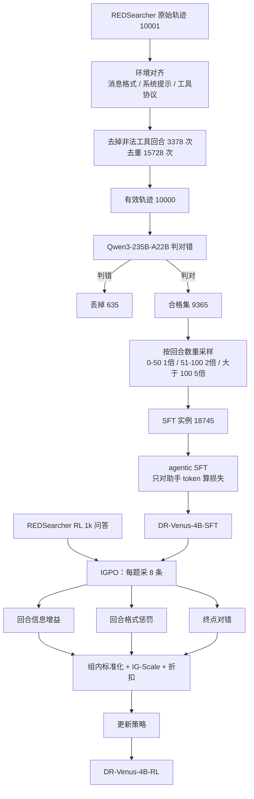

# DR-Venus：4B 深研 agent 卡在 200 轮奖励饿死，先把 1 万条开放长轨迹洗干净再加权，再用信息增益给每一回合打分

<!-- release-date: 2026-04-21 -->

> 本文依据 Venus Team, Ant Group 发布的 **DR-Venus: Towards Frontier Edge-Scale Deep Research Agents with Only 10K Open Data**，即 arXiv:2604.19859v1、水印 `arXiv:2604.19859v1 [cs.LG] 21 Apr 2026`、共 16 页的 letter 稿。页码均指这份 PDF 本身。封面署 Venus Team, Ant Group；arXiv 作者栏把 Venus Team 写在最前，随后是 Sunhao Dai、Yong Deng、Jinzhen Lin、Yusheng Song、Guoqing Wang、Xiaofeng Wu、Yuqi Zhou、Shuo Yang、Zhenzhe Ying、Zhanwei Zhang、Changhua Meng、Weiqiang Wang。正文第 5 节按姓氏字母序重列：核心贡献者七人（Dai 为通讯）、贡献者三人、导师 Meng（通讯）与 Wang（PDF p. 13）。按主要归属与索引登记，本站放在 `reports/AntGroup/`。
>
> 这是一篇**边缘规模深研 agent 的后训练方法论文**，不是新基座 Technical Report。它没有改注意力，也没有预训练配方。基座是现成的 Qwen3-4B-Thinking-2507。它讲的是：只有大约 1 万条开放轨迹时，怎样靠清洗和长轨迹重采样把监督微调用够，再靠 IGPO 的回合级信息增益奖励，让 4B 模型在 200 轮工具交互里不把强化学习饿死。全文把三件事分开写：**论文明确写了什么**（带页码）、**本文如何解释它**（凡属推算、换算或从图上读数都会写明）、**外部资料补充**（给出链接并标注）。截至 2026-09-11 核验，arXiv 最新版本就是 v1，与本地原件一致。

## 读之前需要的最少背景

这篇论文默认你已经见过「让语言模型一边想、一边上网找证据」。不熟的话，先记住下面几件事。

**深研 agent（deep research agent）** 不是一次性问答。用户给一个很难直接搜到的问题，模型要多轮搜索、打开网页、收集证据，最后才交答案。论文把它写成一个长视野的「推理—行动」问题：每一回合输出思维 $\tau_t$ 和动作 $a_t$，动作可以是搜索、浏览或交卷（PDF p. 3）。

**搜索（search）和浏览（browse / visit）** 是本篇唯一暴露给模型的两件工具。搜索走 Serper 接 Google，返回前 10 条；浏览走 Jina 读网页，再用 **Qwen3-30B-A3B-Instruct-2507** 做摘要（PDF p. 9）。方法正文写 browse，附录系统提示词里函数名是 `visit`（PDF p. 16）。下文按论文方法节称浏览，提示词原文保留 `visit`。

**监督微调（Supervised Fine-Tuning，SFT）** 是拿别人已经走通的轨迹当标准答案，用下一个 token 的交叉熵更新模型。本篇的 SFT 只对助手自己生成的思维、工具调用和最终答案算损失，环境返回的观察全部掩掉（PDF p. 5，式 1）。

**组相对策略优化（Group Relative Policy Optimization，GRPO）** 是同一道题采一组轨迹，用组内相对好坏当优势。出处见本站 [DeepSeekMath](/reports/DeepSeek/DeepSeekMath)。本篇的强化学习骨架仍是 GRPO 式采样和裁剪，但优势不再是整条轨迹一个标量（PDF p. 5、8，式 10）。

**基于信息增益的策略优化（Information Gain-based Policy Optimization，IGPO）** 是 Venus Team 自己在 ICLR 2026 的前作（Wang et al., 2026；参考文献写 OpenReview `qkWP6phrvZ`，PDF p. 14）。它不问「这一步像不像标准答案」，而问「看完这一步之后，模型对标准答案的把握有没有上升」。本篇在这条算法上加了浏览感知分配、回合级格式惩罚和 IG-Scale。IGPO 论文本身不在本 PDF 里，文末标成外部补充。

**Pass@K** 是同一道题采样 $K$ 次，至少一次对就算过。Pass@1 看的是「一次就做对」的可靠性；Pass@16 看的是「多采几次能不能摸到能力天花板」。本站正文可以写 Pass@K；Mermaid 节点里不要写 `@`。

基座是 **Qwen3-4B-Thinking-2507**，一种自带长思维的 4B 推理模型（PDF p. 9）。训练框架是 verl 的 FSDP 训练器，强化学习阶段再用 vLLM 做 rollout（PDF p. 9）。verl 的系统设计见本站 [HybridFlow](/reports/ByteDance/HybridFlow)。SFT 数据来自公开的 REDSearcher 轨迹，RL 数据来自同一来源的 1k 问答对（PDF p. 4、8）。

还要分清两个词，后面每一节都会用到：

- **数据质量（data quality）**：小模型更吃不了脏格式、重复调用、答错的轨迹。同一条开放数据，不洗就训，梯度会学到不该学的东西。
- **数据利用（data utilization）**：1 万条里真正像深研的长轨迹并不多。平均抽样等于把预算花在短轨迹上；强化学习如果只在终点给 0/1，200 轮里大多数组会全军覆没，优势直接塌成零。

## 一句话先说清

给 4B 模型教深研，最省事的做法是：找一批现成的搜索轨迹，整段拿去 SFT，再上一条只看最终对错的 GRPO。

这条路有两个互相咬合的漏洞。第一，开放轨迹里有不允许用的工具、大量重复浏览，以及少数答错的样本；小模型比大模型更敏感，脏监督会直接写进策略。第二，深研任务可以走 200 轮，小模型的 rollout 组经常一条都做不对。整条轨迹一个奖励时，组内优势全是零，强化学习没有梯度可走。

DR-Venus 的回答是两段，都不换基座：

> **SFT 先把轨迹洗成和线上一致的格式，丢掉非法工具和重复调用，只留判对的样本，再按回合数给长轨迹 2 倍、5 倍权重；RL 不再只在终点打分，而用「这一步有没有提高模型对标准答案的把握」当回合奖励，格式错了只罚那一回合，再按折扣把后面的分传回来。**

主结果必须连着规模和对照读。Table 1（PDF p. 10）：

| 模型 | BrowseComp | BrowseComp-ZH | GAIA（纯文本） | xBench-DS-2505 | xBench-DS-2510 | DeepSearchQA |
|---|---:|---:|---:|---:|---:|---:|
| WebExplorer-8B-RL | 15.7 | 32.0 | 50.0 | 53.7 | 23.0 | 17.8 |
| AgentCPM-Explore-4B | 24.1 | 29.1 | 63.9 | 70.0 | 34.0 | 32.8 |
| DR-Venus-4B-SFT | 26.8 | 35.7 | 65.4 | 69.0 | 35.3 | 37.7 |
| **DR-Venus-4B-RL** | **29.1** | **37.7** | 64.4 | **74.7** | **40.7** | **39.6** |
| Tongyi-DR-30B | 43.4 | 46.7 | 70.9 | 75.0 | 55.0 | – |
| OpenResearcher-30B-A3B | 26.3 | – | 64.1 | 65.0 | – | – |

摘要里「显著超过 9B 以下先前 agent，并缩小与 30B 级系统的差距」，指的是这一张表上的 Overall 口径，以及后文对 OpenResearcher-30B-A3B、Tongyi-DR-30B 的逐项比较（PDF p. 1、9–10）。它不是每一个格子都赢：SFT 在 xBench-DS-2505 上是 69.0，低于 AgentCPM-Explore-4B 的 70.0；RL 在 GAIA 上从 65.4 掉到 64.4。BrowseComp 的 29.1 仍明显低于 Tongyi-DR-30B 的 43.4 和 SMTL-30B-300 的 48.6。这些数字后面会拆开分母，先不要读成「任意 4B、任意深研任务都打平 30B」。

## 全景：先洗轨迹，再给长视野加权，最后用信息增益做强化学习

先把整条流水线画出来。上半是 SFT 数据怎么从 10001 条变成 18745 条实例，下半是 RL 怎么给每一回合打分。

这是根据 PDF p. 4 的四步数据流程、p. 5 的式 1、p. 6–8 的式 3–10 重画的**机制示意图**，不是实测时间轴。箭头表示数据与控制方向。

论文把它拆成两块贡献，外加三条分析（PDF p. 2–3）：

| 缺口 | DR-Venus 的设计 | 它接在哪 |
|---|---|---|
| 开放轨迹脏、和线上协议不一致 | 先对齐格式，再按回合删非法工具和重复调用，最后用大模型判对错 | SFT 数据 |
| 长视野样本太少，1 万条平均用会被短轨迹稀释 | 超过 50 回合 2 倍、超过 100 回合 5 倍 | SFT 采样 |
| 200 轮只在终点给 0/1，小模型组内全错、优势塌零 | IGPO：每一步看对标准答案的把握升了多少，格式错了只罚那一步 | RL 奖励 |

后面按这条因果链拆开。先讲旧方法卡在哪，再讲清洗和重采样，再讲 IGPO。

## 旧方法卡在哪

### 第一层：小模型吃不了脏轨迹，开放数据不能整包灌进去

深研系统大多建在更大的模型上，并且常常依赖闭源数据或更复杂的流水线（PDF p. 2）。把同样的开放轨迹直接交给 4B，论文认为会遇到三类具体噪声：和环境协议对不上的格式、运行时并不提供的工具、以及重复的搜索和浏览（PDF p. 4）。

这不是抽象的「数据要干净」。本篇运行时只暴露搜索和浏览。REDSearcher 原始轨迹里还有 Python 解释器一类调用。若整段留下，4B 会学会发出线上根本没有的工具；若整条丢掉，又会少一批本来可以修好的查询。重复浏览更常见：6821 条轨迹里出现过重复调用，一共删掉 15728 次，而且多数是重复浏览，不是重复搜索（PDF p. 4）。也就是说，脏主要出在「打开网页」这一步，不在「发出查询」这一步。

### 第二层：200 轮只看终点，小模型的强化学习没有梯度

即使 SFT 已经会走流程，论文仍观察到格式错误、冗余推理、工具用得没有效率（PDF p. 5）。按常理下一步是强化学习。可是高质量的开放 agentic RL 数据极少、也贵。更麻烦的是小模型自己的能力上限：同一道题采一组 rollout，经常一条都做不对（PDF p. 2）。

GRPO 靠组内相对好坏估优势。一组全是 0，相对好坏也是 0，更新直接停。论文把这件事叫 advantage collapse（优势塌缩）。200 轮深研把这个问题放大：终点监督极稀，组内奖励还可能被零主导（PDF p. 7）。只把奖励做稠，不管分配到哪一步，仍然会把格式正确的回合和格式错误的回合绑在一起罚（PDF p. 6）。

### 这两层会叠加

本文的解释，不是论文原句：脏 SFT 让 4B 先学会一套不稳的工具格式；不稳的格式再让 RL 的长轨迹更容易全军覆没。于是「数据少」和「模型小」不是两个独立困难，而是同一条链上的两环。DR-Venus 的选择是：SFT 侧提高每条监督的含金量，RL 侧提高每个回合的监督密度。它没有再去造 10 万条新轨迹。

## 核心设计一：四步把 10001 条洗成 18745 条，而且故意让长轨迹变多

### 旧问题

REDSearcher 公开了 10001 条 SFT 轨迹（PDF p. 4，脚注链到 Hugging Face `Zchu/REDSearcher_SFT_10K`）。直接拿去微调，训练协议和推理协议会对不上，非法工具和重复浏览会占掉损失，答错的轨迹还会教模型把错误走完。对大模型，这些噪声也许能被容量吞掉；对 4B，论文认为必须先处理（PDF p. 2、5）。

### 新设计

四步，全部发生在 SFT 之前（PDF p. 4）：

1. **环境对齐。** 把轨迹改写成和线上推理相同的消息格式、系统提示、工具参数和工具返回。10001 条全部转成功。
2. **非法工具剪枝和去重。** 运行时只有搜索和浏览，所以其他工具调用连同配对的返回，按**回合**删，不整条丢。这一步动到 1064 条轨迹，去掉 3378 次非法调用，主要是 Python 解释器。然后再删重复的搜索和浏览及其返回：6821 条里出现过重复，共 15728 次，多数是重复浏览。洗完还剩 10000 条有效轨迹。也就是说，对齐之后只有 1 条在剪枝和去重里变得不可用。
3. **正确性过滤。** 用 Qwen3-235B-A22B-Instruct-2507 当评委，评委实现改自 Tongyi-DeepResearch。只留最终答案被判对的轨迹：9365 条，占有效集的 93.65%。
4. **按回合数重采样。** 0–50 回合权重 1 倍，51–100 回合 2 倍，超过 100 回合 5 倍。训练集从 9365 变成 18745 条实例。超过 50 回合的比例从 60.28% 升到 80.15%，超过 100 回合的从 13.29% 升到 33.21%。

第三步的通过率很高。本文的读法：这份 `SFT_10K` 本身已经偏「能做对的轨迹」，评委丢掉的只有约 6.35%。DR-Venus 的数据工作，重点不在「从垃圾里淘金」，而在「协议对齐 + 去重 + 把长轨迹的座位加大」。

### 工作机制：5 倍权重在做什么

用论文给的两个比例反推三档人数（本文推算，不是论文原表）。合格 9365 条里：

- 超过 100 回合：$9365\times 13.29\%\approx 1245$
- 51–100 回合：$9365\times 60.28\%-1245\approx 4400$
- 0–50 回合：$9365-5645=3720$

加权之后：$3720\times 1+4400\times 2+1245\times 5=18745$，和论文的最终实例数对得上。超过 50 回合的实例变成 $8800+6225=15025$，占 $15025/18745\approx 80.15\%$；超过 100 回合的实例 $6225/18745\approx 33.21\%$。两个百分比都不是约数，是这组整数权重的精确结果。

所以重采样不是另造数据。同一条超过 100 回合的轨迹在一个 epoch 里会被看到五次，短轨迹只看一次。SFT 只训一个 epoch（PDF p. 9），这个权重就是这一轮梯度里长视野真正占到的份额。

### 收益与代价

Table 2 把「洗完但不重采样」和「洗完且重采样」直接对比（PDF p. 11）：

| 配置 | BrowseComp | BrowseComp-ZH |
|---|---:|---:|
| DR-Venus-4B-SFT，不重采样 | 22.8 | 33.9 |
| DR-Venus-4B-SFT，重采样 | 26.8（+4.0） | 35.7（+1.8） |

同一批合格轨迹，只改抽样权重，英文榜涨 4.0、中文榜涨 1.8。这是全文最干净的一格：变量只有「长轨迹看几次」。

代价有三层，论文没有全部写进 Limitations——它甚至没有 Limitations 小节。

第一，正确性过滤依赖 235B 评委。4B 学生吃到的「对」，是另一台大模型的判断。评委偏了，9365 条会一起偏。

第二，5 倍权重会放大长轨迹里仍然残留的坏习惯，比如冗长推理。论文后来说 SFT 之后仍有冗余推理和低效工具使用，要靠 RL 再收（PDF p. 5）。

第三，重采样改变的是**已经判对的轨迹**的长度分布，不补「从来没做对过」的题。难例如果根本不在这 9365 条里，SFT 看不见。

**可迁移启发：** 开放 agent 轨迹不要整包进 SFT。先按运行时工具集做回合级剪枝，而不是整条丢；再单独去重，因为重复往往集中在浏览。长度加权用三个整数档就够，不必上复杂课程。先算清「长于 $N$ 回合占多少」，再决定 2 倍还是 5 倍。

## 核心设计二：SFT 只监督助手，观察进上下文、不进损失

### 旧问题

深研轨迹是「思维、动作、网页返回」交错的。若对整段序列做下一个 token 预测，模型会把搜索引擎摘要和网页摘要也当成自己该会写的文本。那不是策略，是在背环境。

### 新设计

一条轨迹串成一段自回归序列，损失只落在助手生成的位置：各回合的 $\tau_t$、$a_t$ 和最终答案。环境观察 $o_t$ 掩掉（PDF p. 5，式 1）：

$$
\mathcal{L}_{\mathrm{SFT}}(\theta)=-\sum_{H\in\mathcal{D}_{\mathrm{SFT}}}\sum_{i\in\mathcal{M}(H)}\log\pi_\theta(x_i\mid x_{<i})
$$

$\mathcal{M}(H)$ 是序列里助手 token 的下标集合。观察仍留在前缀里，模型生成下一动作时看得到，只是不要求它复述观察。

这和本站 [ReTool](/reports/ByteDance/ReTool) 把解释器输出掩出损失是同一类决定，对象从代码执行结果换成了网页观察。论文没有写最大轨迹条数、packing 方式、是否全参微调。能确定的是：一个 epoch、最大训练长度 200K token、全局 batch 32、学习率 $1\times 10^{-5}$、序列并行 8，跑在 8 张 A100 上（PDF p. 9）。

**可迁移启发：** 带环境的 SFT，先分清「模型自己说的」和「环境塞回来的」。后者当条件，不当目标。这一步不提高上限，但能避免小模型把检索摘要背进参数。

## 核心设计三：IGPO，把「这一步有没有更接近标准答案」写成回合奖励

### 旧问题

SFT 之后，模型已经会走搜索—浏览—交卷的流程，但格式、冗余和工具效率仍不稳（PDF p. 5）。若此时上普通 GRPO，奖励要等 200 轮才出现一次。小模型一组 8 条经常全错，优势塌零；即便有一条做对，也说不清是第 3 步搜对了，还是第 180 步看对了页面。

论文的对策不是再造 RL 数据，而是把同一条 1k 问答用得更密：「用更稠的奖励补偿数据量不足」（PDF p. 5）。

### 新设计：信息增益奖励

IGPO 把深研看成「逐步收集与标准答案有关的信息」。每一步的价值，是它让策略对标准答案 $g=(g_1,\ldots,g_L)$ 的把握上升了多少（PDF p. 5–6）。先把当前历史下、模型给 $g$ 的平均对数概率写出来：

$$
\log\pi_\theta(g\mid h_{i,\le t})=\frac{1}{L}\sum_{j=1}^{L}\log\pi_\theta(g_j\mid h_{i,\le t},g_{<j})
$$

再把相邻两回合的差当成信息增益（IG）奖励（PDF p. 6，式 3）：

$$
r_{i,t}^{\mathrm{IG}}=\log\pi_\theta(g\mid h_{i,\le t})-\log\pi_\theta(g\mid h_{i,\le t-1}),\qquad 1\le t<T
$$

人话：这一步看完之后，模型觉得标准答案更像自己会写的东西了，就加分；更不像了，就减分。它不要求这一步本身可执行、也不要求最终一定对。中间某次浏览让模型更接近金子，即使后来答错，这一步仍可以是正奖励。

实现上，会把 $g$ 包成和模型回答相同的结构，例如 `<think>Now there's enough information to answer</think><answer>Ground Truth g</answer>`（PDF p. 6）。IG **不算在交卷那一回合**。交卷回合单独用结果奖励 $r_i^{\mathrm{O}}$，论文写「基于规则或大模型评委」，实验段落没有写死用哪一种。

脚注还写了一句：IG 来自对数概率，优化时对它做 stop-gradient（PDF p. 6）。也就是把 $r^{\mathrm{IG}}$ 当标量奖励，不让梯度穿过「评价 $g$ 的那次前向」。否则模型可以靠把评价网络自己改歪来刷分。

### 浏览感知：只在浏览回合算 IG，再回填给前面的搜索

搜索返回的是短摘要，噪声大；浏览才把具体证据摊开（PDF p. 6）。论文因此可选地采用 browse-aware IG assignment（浏览感知的信息增益分配）： **只在浏览回合计算 IG** ，再把这个值赋给该浏览回合，以及「上一次浏览以来」的全部搜索回合。

直觉是：搜索值不值，要等后面那次打开网页才能知道。打开网页后把握上升了，前面那几次搜索也算有功；打开之后把握没变，前面的搜索也不该领功。

论文没写两种边界：全程没有浏览、只有搜索就交卷的轨迹，IG 怎么填；最后一次浏览之后、交卷之前的搜索，算不算「上一次浏览以来」。实验说启用了这一项（PDF p. 9），但没有单独消融。

### 回合级格式惩罚：200 轮不能整条连坐

轨迹级格式惩罚会因为某一回合括号没闭合，把前面 199 个格式正确的回合一起打负分（PDF p. 6）。本篇改成：格式对，保留原来的 IG 或结果奖励；格式错，整步换成 $-\lambda_{\mathrm{fmt}}$（PDF p. 6，式 4）。实验取 $\lambda_{\mathrm{fmt}}=1.0$（PDF p. 9）。

这和「格式奖励加在终点」不同。它让错误局部化：第 17 回合 XML 烂了，只烂第 17 回合。对可能超过 200 回合的深研，这是信用分配能工作的前提，不是锦上添花。

### 组内标准化、IG-Scale、折扣

同一题采 $G$ 条轨迹。IG 奖励和终点奖励量纲不同，论文在组内分别做标准化（PDF p. 6–7，式 5）：

$$
\tilde{r}_{i,t}=\begin{cases}
\dfrac{\hat{r}_{i,t}^{\mathrm{IG}}-\mu^{\mathrm{IG}}}{\sigma^{\mathrm{IG}}}, & 1\le t<T_i,\\[0.6em]
\dfrac{\hat{r}_i^{\mathrm{O}}-\mu^{\mathrm{O}}}{\sigma^{\mathrm{O}}}, & t=T_i.
\end{cases}
$$

$\mu^{\mathrm{IG}},\sigma^{\mathrm{IG}}$ 来自组内所有非终点的格式调整后 IG；$\mu^{\mathrm{O}},\sigma^{\mathrm{O}}$ 来自组内 $G$ 个终点奖励。样本数差一个数量级：前者大约是 $G\times$ 平均回合数，后者只有 $G$ 个。

200 轮时终点经常全是 0。这时优化会被 IG 牵着走，容易进局部最优（PDF p. 7）。IG-Scale 用一个标量 $s$ 去压 IG 的幅度。先在 batch 上算两类奖励的平均绝对大小（PDF p. 7，式 6；绝对值以 HTML 公式为准，`pdftotext` 丢过这两道竖线）：

$$
M^{\mathrm{O}}=\frac{1}{B}\sum_{i=1}^{B}\lvert\tilde{r}_i^{\mathrm{O}}\rvert,\qquad
M^{\mathrm{IG}}=\frac{1}{\sum_{i=1}^{B}(T_i-1)}\sum_{i=1}^{B}\sum_{t=1}^{T_i-1}\lvert\tilde{r}_{i,t}^{\mathrm{IG}}\rvert
$$

再取（PDF p. 7，式 7）

$$
s=\min\left(\frac{\max(M^{\mathrm{O}},\eta)}{M^{\mathrm{IG}}+\delta},s_{\max}\right),\quad \eta=0.3,\;\delta=10^{-8},\;s_{\max}=10
$$

非终点奖励乘 $s$，终点不乘（式 8）。论文的说法是：终点监督弱时，压低 IG，更新更保守。按公式读：终点几乎全零时分子变成 0.3，若 $M^{\mathrm{IG}}$ 大约是 1，$s\approx 0.3$，IG 被缩到三成；若 IG 自己也接近 0，$s$ 会被 10 封顶，反而放大残差。实验启用了 IG-Scale（PDF p. 9），同样没有「关掉它会怎样」的格子。

标准化之后仍只是「这一步当下的后果」。要把未来考虑进来，再做回合级折扣和（PDF p. 7，式 9）：

$$
\tilde{R}_{i,t}=\sum_{k=t}^{T_i}\gamma^{k-t}\bar{r}_{i,k}
$$

实验 $\gamma=0.95$（PDF p. 9）。这个值有一个论文没写、但公式直接给出的后果： **终点奖励传不回早期回合。** $\gamma=0.95$ 的半衰期大约是 14 回合；$200$ 步之前的 $\gamma^{199}$ 已经是 $10^{-5}$ 量级。早期搜索几乎全靠 IG，不靠最后对不对。这正是 200 轮任务必须把奖励做稠的原因：折扣把终点变成了「只管最后一小段」的信号。

$\tilde{R}_{i,t}$ 赋给该回合每一个助手 token。观察 token 仍在前缀 $c_{i,k}$ 里，但不进目标（PDF p. 8）。

### 目标函数：GRPO 的壳，回合奖励当优势

IGPO 目标就是带裁剪的组相对目标，把原来的序列优势换成 $\tilde{R}_{i,k}$（PDF p. 8，式 10）：

$$
\begin{aligned}
\mathcal{J}_{\mathrm{IGPO}}(\theta)
=\mathbb{E}\Bigg[\frac{1}{G}\sum_{i=1}^{G}\frac{1}{\lvert u_i\rvert}\sum_{k=1}^{\lvert u_i\rvert}
\min\Big(
\rho_{i,k}\,\tilde{R}_{i,k},\;
\operatorname{clip}(\rho_{i,k},1-\epsilon,1+\epsilon)\,\tilde{R}_{i,k}
\Big)
-\beta\,\mathrm{D}_{\mathrm{KL}}(\pi_\theta\parallel\pi_{\mathrm{ref}})\Bigg]
\end{aligned}
$$

其中 $\rho_{i,k}=\pi_\theta(u_{i,k}\mid c_{i,k})/\pi_{\theta_{\mathrm{old}}}(u_{i,k}\mid c_{i,k})$。$\epsilon$ 是裁剪阈值，$\beta$ 是 KL 系数。 **两个数实验都没给。**

和标准 GRPO 的差别不在裁剪公式，而在 $\tilde{R}$ 从哪来：先在组内分别标准化 IG 和终点，再折扣回每一回合，再赋给该回合所有 token。组间相对性已经做在式 5 里，后面没有再对折扣和做一次组标准化。

### 收益与代价

Table 2 把「同一份 SFT，上 GRPO」和「同一份 SFT，上 IGPO」放在一起（PDF p. 11）：

| 配置 | 训练 | BrowseComp | BrowseComp-ZH |
|---|---|---:|---:|
| SFT，带重采样 | SFT | 26.8 | 35.7 |
| + GRPO | SFT+RL | 25.3（−1.5） | 35.6（−0.1） |
| + IGPO | SFT+RL | 29.1（+2.3） | 37.7（+2.0） |

GRPO 在英文榜掉 1.5，中文榜几乎不动；IGPO 两边都涨。论文的判断是：在大约 200 轮的深研上，能不能从 RL 拿到稳定增益，取决于奖励够不够密、够不够对齐；稀疏的轨迹级优化在这里不合适（PDF p. 11）。

这个判断对这张表成立。它不能直接推广成「GRPO 做不了深研」：本篇没公开 GRPO 的奖励、裁剪系数、KL 系数，也没写两组 RL 是否同步数、同 batch。能写进结论的是： **在这份 4B、1k 问答、200 轮设置里，换 IGPO 的回合奖励，比他们那份 GRPO 基线更管用。**

代价同样具体。IG 需要标准答案 $g$，所以 RL 阶段不是无监督探索，而是 1k 条带答案的问答（PDF p. 8）。没有金子，这个奖励算不出来。它测的是「对已知答案的把握」，不是「找到了尚未写进 $g$ 的新事实」。若评测分布和这 1k 条差得远，IG 可能把模型推向「更像训练集答案的说话方式」。BrowseComp-ZH 的大 $K$ 上 RL 反而不如 SFT，论文自己把原因写成 RL 数据全是英文（PDF p. 12）。

**可迁移启发：** 长视野工具 RL，不要一上来设计过程奖励模型。若任务有标准答案，先量「每一步之后模型对金子的对数概率变了多少」。这比另训一台过程奖励模型便宜，也比 Monte Carlo 展开中间步更直接。第二，格式惩罚必须下到回合，不能下到整条轨迹。第三，$\gamma=0.95$ 几乎等于承认：200 轮任务的早期行为，只能靠稠密中间信号来教。

## 数据与训练配方

### 两份开放数据，不是「只有 SFT 那 1 万条」

摘要和标题写 only 10K open data。正文把两段写清楚了（PDF p. 8）：

| 阶段 | 来源 | 用多少 |
|---|---|---|
| SFT | `Zchu/REDSearcher_SFT_10K`，清洗后 9365，重采样到 18745 | 轨迹模仿 |
| RL | `Zchu/REDSearcher_RL_1K`，1k 问答对 | 带答案的策略优化 |

「1 万条」指的是 SFT 原始轨迹量级，不是训练实例总数，也不含 RL 的 1k。重采样之后 SFT 要看 18745 次。说「完全开放数据」对这两份 Hugging Face 数据集成立；说「只看了 1 万条、每条看一次」不成立。

### 工具栈：4B 策略，30B 摘要

论文把系统写成边缘规模，因为策略模型是 4B。推理时它并不是一个人在手机上读完整网页（PDF p. 9）：

| 组件 | 谁在跑 | 作用 |
|---|---|---|
| 策略 | Qwen3-4B-Thinking-2507 → DR-Venus-4B | 想、搜、决定打开哪一页、交卷 |
| 搜索 | Serper → Google Search API | 每查询返回 top-10 |
| 读页 | Jina | 抓网页正文 |
| 摘要 | Qwen3-30B-A3B-Instruct-2507 | 浏览工具内部的内容压缩 |
| 评委（SFT 数据） | Qwen3-235B-A22B-Instruct-2507 | 只在造 SFT 数据时用 |

本文的判断，不是论文原句： **边缘规模指的是策略权重，不是整条深研链路都能放到端侧。** 搜索和读页是云端服务；浏览结果还要经过 30B 摘要。论文没有报告 4B 在手机或消费级 GPU 上的延迟、显存、断网表现。附录系统提示词把当前日期写死为 `2026-03-01`（PDF p. 16），评测时网页世界已经比这个日期新。

提示词改自 REDSearcher 和 Tongyi DeepResearch（PDF p. 16）。工具签名里 `search` 接受查询数组，`visit` 接受 URL 数组和 `goal`。最终答案必须包在 `<answer></answer>` 里。

### 超参

SFT（PDF p. 9）：

| 项 | 值 |
|---|---|
| GPU | 8 × A100 |
| 最大训练长度 | 200K token |
| 全局 batch | 32（每卡 micro-batch 1） |
| 学习率 | $1\times 10^{-5}$ |
| epoch | 1 |
| 其他 | 多轮监督、右截断、梯度检查点、序列并行 8 |

RL（PDF p. 9）：

| 项 | 值 |
|---|---|
| GPU | 16 × A100 |
| 训练 batch | 16 |
| rollout 上下文 | 最长 256K |
| 每回合生成 | 最长 8192 token |
| 组大小 $G$ | 8 |
| 温度 | 1.0 |
| IGPO | 启用浏览感知分配和 IG-Scale，$\lambda_{\mathrm{fmt}}=1.0$，$\gamma=0.95$ |

评测（PDF p. 9）：每题最多 200 步；温度 1.0、top-p 0.95、top-k 20、presence penalty 1.1；token 预算 256K。少于 300 条的数据集报三次独立评测的均值，其余报一次。论文没写哪几个基准少于 300 条。

没写的：RL 步数或 epoch、墙钟、A100 小时、$\epsilon$、$\beta$、结果奖励是规则还是评委、SFT 是否 LoRA、截断发生在多少条轨迹上。

## 实验怎么证明

### 主榜 Table 1：小模型新前沿，对 30B 是选着比

Table 1 分三块：带工具的基础模型、≥30B 训练过的 agent、≤9B 训练过的 agent（PDF p. 10）。DR-Venus 只和后两块、以及同表基础模型比，不和带额外上下文管理或测试时扩展的方法比，点名排除了 RE-TRAC-4B、Marco-DR-8B、MiroThinker-v1.0（PDF p. 8）。

**对 ≤9B。** 论文写 SFT 就已经在多数榜上超过先前 4B–9B，并列出相对 AgentCPM-Explore-4B 的五项增益：BrowseComp +2.7、BrowseComp-ZH +6.6、GAIA +1.5、xBench-DS-2510 +1.3、DeepSearchQA +4.9（PDF p. 9）。五条都和 Table 1 对得上。它没写的第六项：xBench-DS-2505 上 SFT 是 69.0，AgentCPM 是 70.0，SFT 低 1.0。所以「most benchmarks」成立，「六项全胜 AgentCPM」不成立。

RL 相对 SFT 五项再涨：BrowseComp +2.3、BrowseComp-ZH +2.0、xBench-DS-2505 +5.7、xBench-DS-2510 +5.4、DeepSearchQA +1.9（PDF p. 9）。第六项是 GAIA：65.4 → 64.4，掉 1.0。论文承认「六项里的五项」（PDF p. 9），没有把 GAIA 掉分藏起来。

相对 WebExplorer-8B-RL，RL 检查点六项全高，BrowseComp 从 15.7 到 29.1，DeepSearchQA 从 17.8 到 39.6。这是「4B 超过约 2 倍大小的先前开源 agent」里最硬的一块。

**对 ≥30B。** 论文举了两个例子（PDF p. 9–10）：SFT 已经在所有 OpenResearcher-30B-A3B 报出来的格子上更高（26.8>26.3、65.4>64.1、69.0>65.0）；RL 在 xBench-DS-2505 上到 74.7，接近 Tongyi-DR-30B 的 75.0。两个例子都对。

不要把「接近 30B」读成整张表。BrowseComp 上 SMTL-30B-300 是 48.6、Tongyi 43.4、REDSearcher-30B-A3B 42.1，DR-Venus-4B-RL 只有 29.1。GAIA 上 REDSearcher-30B-A3B 是 80.1、SMTL 75.7、WebSailor-V2-30B 74.1、Tongyi 70.9，DR-Venus 64.4。xBench-DS-2510 上 Tongyi 55.0，DR-Venus 40.7。缩小差距在部分榜成立，在 BrowseComp / GAIA 上仍是明显的规模缺口。

**对基础模型。** 同表 GPT-5 High 的 BrowseComp 54.9、GAIA 76.4、xBench-DS-2510 75.0、DeepSearchQA 79.0；Kimi-K2.5 的 BrowseComp 74.9；Claude-4.5-Opus 的 DeepSearchQA 80.0。4B 检查点没有靠近这些格子。摘要比较的是「先前 agentic 模型」，不是「带工具的前沿基础模型」。

Figure 1 的柱高与 Table 1 对得上，但混了 ≤9B 和 DeepDive-32B（PDF p. 1）。读图时不要把它当成「只比小模型」。

### 必须单独标出的表间打架：REDSearcher-30B 有两套数

Table 1 的 REDSearcher-30B-A3B：BrowseComp 42.1、BrowseComp-ZH 49.8、GAIA 80.1（PDF p. 10）。

Table 2 的 REDSearcher-30B-A3B（SFT）：BrowseComp 34.7、BrowseComp-ZH 26.8（PDF p. 11）。

两行差了 7.4 和 23.0。论文 3.3 节写「4B-SFT 已经在 BrowseComp-ZH 上超过 REDSearcher-30B-A3B」，用的是 Table 2 的 26.8 对 35.7（PDF p. 11）。若信 Table 1 的 49.8，这句话反了。Table 2 标题写 All SFT models are trained based on REDSearcher trajectories，这一行带了 `(SFT)`；Table 1 没写 SFT。一种说得通的读法是：Table 1 引的是 REDSearcher 论文发布的系统分数，Table 2 是作者自己复现的 SFT 基线。原文没有这样声明，也没有解释 49.8 和 26.8 哪一个该用来证明「数据怎么用比规模更重要」。

即便只用 Table 2，4B-SFT 也只在中文榜超过 30B-SFT（35.7>26.8），英文榜仍是 26.8<34.7。论文写「surpasses … on BrowseComp-ZH」，没有说两榜都超过。比较规模叙事时，必须把这张表的英文格一起读。

### 消融：重采样是 SFT 的大头，IGPO 是 RL 的大头

Table 2 相对带重采样的 SFT 报增减（PDF p. 11）。结构可以收成三句话：

1. 不重采样的 4B 已经能到 BrowseComp 22.8 / BrowseComp-ZH 33.9，说明清洗后的开放轨迹本身够用做冷启动。
2. 重采样再涨 4.0 / 1.8，是「同一批数据怎么用」的纯效应。
3. 之后换 RL 算法：GRPO 把英文榜吃掉 1.5，IGPO 再吐回并多拿 2.3 / 2.0。

因此，若只做 SFT，长轨迹加权是本篇最可迁移的一刀；若要再涨，换奖励密度比换「再上一次 GRPO」更关键。论文没有把浏览感知、IG-Scale、格式惩罚拆开，不能从 Table 2 判断这三件各自值几分。

### Pass@K：天花板已经很高，但横比用的是别人的 Pass@1

Figure 2 在 BrowseComp 和 BrowseComp-ZH 上画了 SFT 与 RL 的 Pass@K，并把 Tongyi-DR-30B、Gemini-3-Pro、GPT-5 High 画成水平虚线（PDF p. 12）。虚线数值与 Table 1 的单次分数一致，不是那三家的 Pass@K 曲线。

正文给出的精确点（PDF p. 11–12）：

| | BrowseComp Pass@1 | BrowseComp Pass@16 | BrowseComp-ZH Pass@1 | BrowseComp-ZH Pass@2 | BrowseComp-ZH Pass@8 | BrowseComp-ZH Pass@16 |
|---|---:|---:|---:|---:|---:|---:|
| SFT | 26.8 | 61.7 | 35.7 | 52.9 | 74.0 | 78.5 |
| RL | 29.1 | 63.7 | 37.7 | 53.3 | 73.0 | 76.5 |

英文榜上 RL 在所有 $K$ 都更高，Pass@16 从 61.7 到 63.7，论文据此说 RL 不只提高低预算成功率，也把天花板略往上推。中文榜相反：低 $K$ RL 更好，Pass@8 / Pass@16 反而是 SFT 更高。论文把大 $K$ 变差归因于 RL 数据全是英文（PDF p. 12）。

图上还能读到正文没写的点（读自 Figure 2 标注）：BrowseComp 上 SFT 的 Pass@2 / 4 / 8 约为 37.7 / 47.3 / 55.3，RL 约为 39.3 / 49.3 / 58.7；BrowseComp-ZH 上 SFT 的 Pass@4 约为 65.7，RL 约为 64.4。也就是中文榜从 $K=4$ 起 SFT 已经反超，不是等到 $K=8$ 才发生。

正文最容易被转发的一句是：BrowseComp-ZH 上 4B-SFT 的 Pass@16 达到 78.5，「显著超过」Tongyi-DR-30B 的 46.7，甚至超过 Gemini-3-Pro 的 66.8 和 GPT-5 High 的 65.0（PDF p. 12）。 **分母不同。** 78.5 是 16 次采样至少一次对；46.7 / 66.8 / 65.0 是 Table 1 的单次分数，图里也只画成水平线。它证明的是：给 4B 16 次机会，中文浏览的命中率可以很高。它不证明 4B 一次推理强过 GPT-5 High。论文自己在 Table 1 的主比较里排除了测试时扩展，Figure 2 又用测试时扩展去谈天花板。两段都要留着，不要互相替代。

### 浏览比例：做对的轨迹更爱打开网页，RL 把这个关系拧正

Figure 3 按六个基准画出正确 / 错误 / 总体轨迹的浏览比例，SFT 和 RL 各一套（PDF p. 12）。柱上一位小数如下（读自该图）：

| 基准 | 正确 SFT | 正确 RL | 错误 SFT | 错误 RL | 总体 SFT | 总体 RL |
|---|---:|---:|---:|---:|---:|---:|
| BrowseComp | 17.3 | 21.1 | 12.1 | 14.7 | 13.0 | 15.9 |
| BrowseComp-ZH | 10.1 | 13.8 | 6.5 | 10.6 | 7.3 | 11.4 |
| GAIA（纯文本） | 32.7 | 38.6 | 29.8 | 35.1 | 31.6 | 36.9 |
| xBench-DS-2505 | 29.0 | 31.6 | 16.8 | 23.8 | 22.6 | 26.8 |
| xBench-DS-2510 | 14.5 | 23.0 | 15.6 | 17.5 | 15.3 | 18.8 |
| DeepSearchQA | 38.8 | 44.5 | 34.2 | 39.3 | 35.6 | 40.8 |

正文另给了跨基准合计（PDF p. 13）：总体浏览比例 SFT 17.49% → RL 22.46%，正确轨迹 23.71% → 28.96%。这两个合计不是上表六行简单平均——按总体列等权平均会得到约 20.9 和 25.1——应当读成按轨迹或按调用次数加权的总比例。xBench-DS-2510 正文给了更细的小数：SFT 错误 15.57% 高于正确 14.51%；RL 反过来，正确 22.99% 高于错误 17.50%（PDF p. 13）。与图上 15.6 / 14.5 / 23.0 / 17.5 一致。

论文的机制解释是：搜索只给短摘要，浏览才读到能落地的证据；做对的轨迹更愿意往深处看。RL 不是笼统地多搜或少搜，而是把工具使用拧向「对的时候更该看网页」（PDF p. 12–13）。浏览感知的 IG 分配和这个观察同向：奖励算在浏览上，再回填给搜索。论文没有做「关掉浏览感知、Figure 3 会不会翻回去」的实验，所以这是一条对齐的叙事，不是模块消融。

## 限制、笔误和没写的东西

论文没有独立的 Limitations。结论只重复两段配方、小模型新前沿、以及「数据质量和利用足以解锁能力、RL 负责稳住格式和工具」（PDF p. 13）。下面这些是本文核对全文后认为**没有公开、或原文互相打架**的，不是论文当缺陷写出来的。

- Table 1 与 Table 2 的 REDSearcher-30B-A3B：BrowseComp 42.1 vs 34.7，BrowseComp-ZH 49.8 vs 26.8。3.3 节「4B 超过 30B」只用了 Table 2 的中文格。
- SFT 在 xBench-DS-2505 上低于 AgentCPM-Explore-4B（69.0 vs 70.0）；RL 在 GAIA 上低于自己的 SFT（64.4 vs 65.4）。
- Figure 2 用 4B 的 Pass@16 去比别人的 Pass@1。
- 结果奖励 $r^{\mathrm{O}}$ 写了「规则或评委」两种，实验没钉死。
- IGPO 的 $\epsilon$、$\beta$、RL 步数、墙钟、是否全参，全部没有。
- 浏览感知分配、IG-Scale、格式惩罚没有单独消融。
- 少于 300 条才三次评测，但没说哪些基准属于这一档。
- 全程无浏览、或最后一次浏览之后的搜索，IG 怎么填，原文没有。
- 组内终点全零时 $\sigma^{\mathrm{O}}=0$，式 5 除零怎么处理，原文没有。
- 方法节称 browse，附录函数名是 `visit`。
- 「边缘规模」没有端侧延迟、显存或离线数字；推理链路依赖 Serper、Jina 和 30B 摘要模型。
- 没有报告 4B 在非深研任务上会不会忘事，也没有和 Qwen3-4B-Thinking 基座的零样本对照。Table 1 没有基座行。

## 外部补充：论文之后公开了什么

**以下全部不是 v1 PDF 里的内容**，不能拿来改写上面任何一条论文结论。

- 官方仓库：[https://github.com/inclusionAI/DR-Venus](https://github.com/inclusionAI/DR-Venus)。2026-09-11 访问时，README News 写：`2026-04-22` 开源训练与推理代码并放出 `DR-Venus-4B-SFT` / `DR-Venus-4B-RL`；`2026-04-23` 技术报告出现在 arXiv 与 Hugging Face Daily Paper；`2026-04-24` 另放 GGUF。GitHub 把论文上 arXiv 写成 4 月 23 日，晚于 arXiv 实际提交日 2026-04-21。本篇 `release-date` 取 arXiv v1，不取仓库 News。
- 权重集合：[https://huggingface.co/collections/inclusionAI/dr-venus](https://huggingface.co/collections/inclusionAI/dr-venus)。SFT / RL 检查点与两份 GGUF 都在。Hugging Face 仓库 `createdAt` 按本模块约定不作为首发日。
- IGPO 前作：arXiv:2510.14967，ICLR 2026；代码 [https://github.com/GuoqingWang1/IGPO](https://github.com/GuoqingWang1/IGPO)。作者与本篇高度重叠（Wang、Dai、Deng、Wu、Ying 同属 Venus Team）。IGPO 仓库 News 在 2026-04-21 写了「已把 IGPO 扩到 200+ 轮深研并训练 DR-Venus」，与本 PDF 同日。IGPO 论文里的 F1 数字、3B 实验和本篇 Table 1 不是同一次实验，不要横搬。
- REDSearcher：arXiv:2602.14234。本篇用它的 10K SFT 轨迹和 1K RL 问答，不解读 REDSearcher 自己的 30B 系统。Table 1 里 42.1 / 49.8 / 80.1 若来自那边，应以 REDSearcher 原文为准；本 PDF 没有把来源表格附上。
- 同目录的 Inclusion AI / AWorld 线，本站已有 [BalanceSFT](/reports/AntGroup/BalanceSFT)、[AReaL](/reports/AntGroup/AReaL)、[Ling 与 Ring 2.6](/reports/AntGroup/Ling-Ring-2.6)。那些是工具调用 SFT、RL 系统或基模；本篇是 4B 深研 agent 的数据利用与回合奖励，不要把 AReaL 的异步 rollout 或 Ling 的训练配方借过来补这里的空缺。

## 可迁移启发

### 1. 开放轨迹先按运行时工具集剪，再按长度加权

3378 次非法调用按回合删、15728 次重复按对删，比「低质量就整条丢」更准。然后用 1 / 2 / 5 三档把超过 100 回合的比例从 13% 拉到 33%。Table 2 证明：同样 9365 条，只改看见长轨迹的次数，BrowseComp 就能涨 4 分。迁移时先画「回合数直方图」，再决定权重，不必先上 RL。

### 2. 小模型的 SFT 要先做对，再谈利用

正确性过滤留下 93.65%。这份开放集本身已经偏成功轨迹。若换一份通过率只有 50% 的数据，先滤对错仍然比先加权更重要——5 倍放大一条答错的 200 轮轨迹，会把错误流程写成模板。

### 3. 200 轮不要把希望寄托在终点 0/1 上

$\gamma=0.95$ 意味着早期回合几乎收不到终点信号。组内再全错，GRPO 的优势就是 0。Table 2 里 GRPO 掉分、IGPO 涨分，和这个算术一致。有标准答案的长视野任务，优先用「对金子的对数概率差」当中间奖励，而不是先训过程奖励模型。

### 4. 格式惩罚下到回合，过程奖励算在「真正看到证据」的那一步

200 轮里一个 XML 错误不该连坐整条。浏览感知则承认：搜索的价值要等网页打开才结算。做搜索 agent 时，把稠密奖励放在 visit/browse，再回填给它前面的 search，比给每一次 search 单独打分更接近证据链。

### 5. Pass@K 用来看天花板，Pass@1 才拿去和别人比

4B 在 BrowseComp-ZH 上 Pass@16 到 78.5，说明小模型不是不会，是一次采样不够稳。主表排除测试时扩展是对的；用 Pass@16 去减 GPT-5 的 Pass@1 则不是同一场比赛。自己做系统时可以两者都报，但排名必须写明 $K$。

### 6. 「边缘规模」先问策略有多大，再问工具栈还依赖谁

4B 策略可以进 GGUF，但本 PDF 的浏览工具内部是 30B 摘要，搜索是 Google API。复现或部署时把这两项写成依赖，不要把 Table 1 读成「一台 4B 端侧模型独立完成深研」。

### 7. 和邻居方法不在同一层，不要混表

本站 [WebSailor](/reports/Alibaba/WebSailor) 的 7B 在 BrowseComp 上是 6.7，本篇 Table 1 引用了同一行。WebSailor 解决的是「从没练过难降的不确定性」；本篇解决的是「只有 1 万条开放轨迹时，4B 怎样把长视野用够」。本站 [ReTool](/reports/ByteDance/ReTool) 是数学里嵌代码执行、奖励只看最终对错；本篇是搜索里嵌浏览、奖励看每一步对金子的把握。本站 [BalanceSFT](/reports/AntGroup/BalanceSFT) 停在工具调用 SFT，不上深研 RL。三篇的 BrowseComp / BFCL / AIME 数字不要写进对方的主表。

## 关键词回看

- **DR-Venus**：蚂蚁 Venus Team 的 4B 深研 agent；检查点分 SFT 与 RL。
- **边缘规模（edge-scale）**：论文用来指 4B 级策略，强调成本、延迟和隐私；不是端侧完整评测。
- **REDSearcher**：开放深研轨迹来源；SFT 用 10K 轨迹，RL 用 1K 问答。
- **环境对齐 / 非法工具剪枝 / 去重 / 正确性过滤**：SFT 数据四步里的前三步清洗。
- **按回合数重采样（turn-aware resampling）**：0–50 / 51–100 / >100 回合权重 1 / 2 / 5。
- **agentic SFT**：只对助手 token 做下一词预测，掩掉观察。
- **IGPO**：用信息增益当回合奖励的 GRPO 式算法；ICLR 2026 前作，本篇把它接到 200 轮深研。
- **信息增益奖励 $r^{\mathrm{IG}}$**：$\log\pi(g\mid h_t)-\log\pi(g\mid h_{t-1})$，对评价网络 stop-gradient。
- **浏览感知分配**：IG 只在浏览回合计算，再回填给两次浏览之间的搜索。
- **回合级格式惩罚**：格式错则该回合奖励换成 $-\lambda_{\mathrm{fmt}}$，$\lambda_{\mathrm{fmt}}=1.0$。
- **IG-Scale**：按 batch 上终点奖励与 IG 的平均绝对大小，把 IG 缩放到不超过终点量级。
- **折扣和 $\tilde{R}_{i,t}$**：$\gamma=0.95$，赋给该回合所有助手 token。
- **BrowseComp / BrowseComp-ZH / GAIA 纯文本 / xBench-DS / DeepSearchQA**：六份主榜。
- **Pass@K**：看能力上限；主表排名用的是单次，不是 Pass@16。

## 最后的判断

DR-Venus 证明的是一件很具体的事：在 Qwen3-4B-Thinking-2507 上，把 REDSearcher 的 10001 条开放轨迹洗成 9365 条判对样本、再重采样到 18745 次，SFT 就能在六个深研榜上把先前 ≤9B 的开源 agent 大部分压过去，BrowseComp 26.8、BrowseComp-ZH 35.7。再在 1k 开放问答上用 IGPO 做回合级强化学习，英文和中文浏览再涨 2.3 和 2.0，xBench-DS-2505 从 69.0 拉到 74.7，碰到 Tongyi-DR-30B 的 75.0。Table 2 显示：长轨迹加权是 SFT 的关键一刀；普通 GRPO 在这套 200 轮设置里加不了分，换信息增益才能加分。

它没有证明的同样清楚。4B 没有在 BrowseComp 或 GAIA 上追上最好的 30B agent；「超过 REDSearcher-30B」只对 Table 2 的中文 SFT 格成立，和 Table 1 的 49.8 打架；Pass@16 的 78.5 不能拿去减 GPT-5 的 Pass@1；GAIA 在 RL 之后掉了 1 分；推理时还要 30B 摘要模型和搜索 API。奖励公式里的 $\epsilon$、$\beta$、结果奖励类型和 RL 步数，PDF 是空的。

如果只记一句话，可以记：

> **1 万条开放轨迹对 4B 已经够用，前提是先洗成和线上一致的工具协议，并把梯度座位让给 100 轮以上的轨迹；200 轮的强化学习则必须把「有没有更接近标准答案」写成每一步的分，否则组奖励会先变成零。**

## 资料与阅读边界

- 原始依据：本地 `papers/AntGroup/DR-Venus.pdf`，即 [arXiv:2604.19859v1](https://arxiv.org/abs/2604.19859)，水印 `arXiv:2604.19859v1 [cs.LG] 21 Apr 2026`，16 页，letter。pdfinfo Title 与封面一致。文件约 651KB，与当前官方 PDF 一致。
- arXiv 页面：<https://arxiv.org/abs/2604.19859>。提交历史只有 v1（Tue, 21 Apr 2026 17:59:02 UTC）。Comments 写 Technical Report of DR-Venus。本文 `release-date` 取该编号首次公开日 2026-04-21。官方仓库 News 把权重与代码写成 2026-04-22、把论文上 arXiv 写成 2026-04-23，都更晚，不回写。Hugging Face `createdAt` 不用。
- 官方仓库：<https://github.com/inclusionAI/DR-Venus>。
- 权重集合：<https://huggingface.co/collections/inclusionAI/dr-venus>。
- SFT 数据：<https://huggingface.co/datasets/Zchu/REDSearcher_SFT_10K>；RL 数据：<https://huggingface.co/datasets/Zchu/REDSearcher_RL_1K>（PDF p. 4、8 脚注）。
- 训练框架：<https://github.com/verl-project/verl>，论文脚注（PDF p. 9）。系统设计见 [HybridFlow](/reports/ByteDance/HybridFlow)。
- 基座：<https://huggingface.co/Qwen/Qwen3-4B-Thinking-2507>（PDF p. 9）。
- IGPO 前作：<https://arxiv.org/abs/2510.14967>，OpenReview <https://openreview.net/forum?id=qkWP6phrvZ>。算法机制以本 PDF 式 2–10 为准，不拿前作实验数字回写 Table 1。
- 跨篇参考：GRPO 出处见 [DeepSeekMath](/reports/DeepSeek/DeepSeekMath)；结果奖励的长思维链 RL 见 [DeepSeek-R1](/reports/DeepSeek/DeepSeek-R1)；工具执行嵌进思考过程见 [ReTool](/reports/ByteDance/ReTool)；高不确定性 web agent 见 [WebSailor](/reports/Alibaba/WebSailor)；同目录工具调用 SFT 见 [BalanceSFT](/reports/AntGroup/BalanceSFT)。
