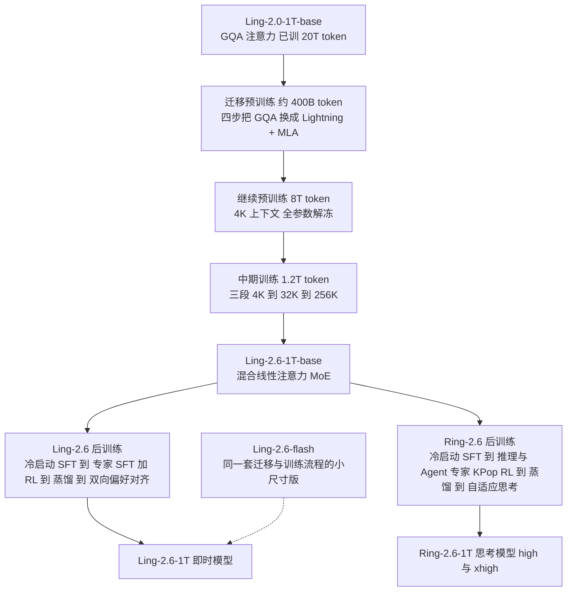
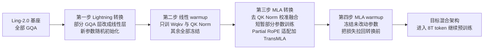
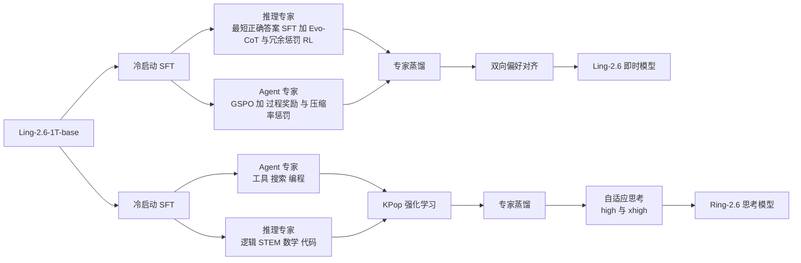
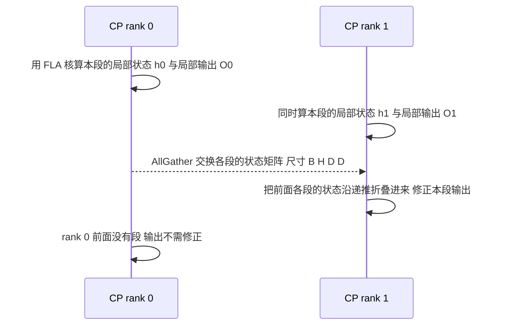
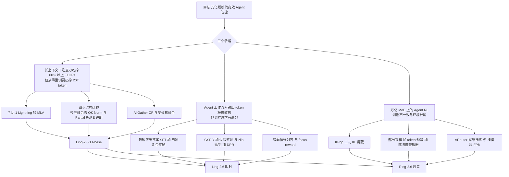

# Ling 与 Ring 2.6：不重训万亿模型，而是给它换一副注意力

<!-- release-date: 2026-04-21 -->

> 本文依据蚂蚁集团 Ling Team（Inclusion AI）发布的 **Ling and Ring 2.6 Technical Report: Efficient and Instant Agentic Intelligence at Trillion-Parameter Scale**，即 arXiv:2606.15079v1、2026-06-13 提交、共 43 页的版本（正文 p. 1–33，贡献者名单 p. 34–35，参考文献 p. 36–41，附录 A、B p. 42–43）。截至 2026-09-07 核验，arXiv 上只有 v1，本地原件与之一致，无需替换。页码均指 PDF 本身的页码。
>
> 这一份报告同时覆盖 Ling-2.6（即时回答）与 Ring-2.6（深度思考）两条线，本文按「一份报告一篇解读」写成一篇。全文会区分三件事：**报告明确写了什么**、**我们如何解释或验算它**、**哪些是外部资料补充**。标着「本文验算」「本文推断」的段落，都不是报告的结论。

## 阅读前先搭一张最小地图

这份报告横跨架构、数据、后训练、强化学习和系统五层，名词密度不低。先把六个底层概念过一遍：

- **Token（词元）**：模型读写文本的基本小块。报告里「每个输出 token 的能力」（capability per output token）是一条主线：同样答对一道题，用 300 个 token 比用 3000 个 token 更值钱。
- **注意力（Attention）与 KV Cache**：注意力让当前 token 决定该参考前文哪些位置；KV Cache 把前文算过的 Key 和 Value 留在显存里，生成下一个 token 时不必重算。普通 softmax 注意力的计算量随上下文长度平方增长，KV Cache 随长度线性增长。
- **线性注意力（Linear Attention）**：去掉 softmax 之后，注意力可以改写成一个固定大小的状态矩阵递推更新，计算量随长度线性增长，也不需要 KV Cache。代价是它对精确回忆远处细节的能力弱于 softmax 注意力。
- **混合专家（Mixture-of-Experts，MoE）**：前馈层由很多「专家」组成，每个 token 只激活其中几个，所以总参数很大、每个 token 真正参与计算的参数很小。
- **强化学习中的 rollout 与训推不一致（training-inference mismatch）**：rollout 是让当前模型自己生成回答并打分；生成用推理引擎，更新参数用训练引擎，两套引擎对同一个 token 算出的概率会有微小差异，在 MoE 模型上这个差异会被放大，足以让训练崩掉。
- **架构迁移（architectural retrofit）**：不从零训练新架构，而是把一个已经训好的模型逐层改成新结构，再用相对少的 token 把它「养回来」。这是本报告最独特的一步。

报告最常出现的几个专名：

- **Lightning Attention**：一种线性注意力的高效实现，由 Qin 等人提出（本报告引用的是 2024 年的 TransNormerLLM 一文，PDF p.2、39），MiniMax-01 第一次把它用到了 4560 亿参数的模型上，本站有 [MiniMax-01 解读](/reports/MiniMax/MiniMax-01)。
- **MLA（Multi-head Latent Attention，多头潜注意力）**：DeepSeek-V2 提出的注意力，把 KV 压成一条低秩潜向量来省缓存，本站有 [DeepSeek-V2 解读](/reports/DeepSeek/DeepSeek-V2)。
- **GQA（Grouped-Query Attention，分组查询注意力）**：多个查询头共用一组 KV 头的注意力，是 Ling-2.0 那一代用的结构，也是本报告要替换掉的旧结构。
- **KPop**：Ring-2.6 的强化学习算法，用「二元 KL 散度」决定哪些 token 该被屏蔽掉不参与更新。
- **ASystem / ARouter / ASandbox**：蚂蚁的强化学习框架、它的全局请求路由器、以及给 Agent 任务提供执行环境的沙箱。

## 一句话先说清

Ling 与 Ring 2.6 不是一个从零训练的新模型。它做的事情是：

- 拿已经训了 20T token 的 Ling-2.0-1T 基座，把里面的 GQA 注意力**逐层换成「7 层 Lightning Attention + 1 层 MLA」的混合结构**，再用约 9.6T token 的继续训练把能力养回来并推到 256K 上下文；（PDF p.3–4、9）
- 在这个共享基座上分出两条后训练路线：Ling-2.6 追求「即时回答、每个 token 尽量值钱」，Ring-2.6 追求「深度推理与长程 Agent」；（PDF p.13）
- 为了在万亿参数 MoE 上把 Agent 强化学习跑稳，把上一代的 IcePop 屏蔽规则换成 KPop，并把 rollout 改成异步的部分采样。（PDF p.3、18–19、30）

所以这份报告最值得记住的不是某个 benchmark 分数，而是一种工程判断：

> **架构升级不一定要从零开始。如果能把「结构替换」拆成几个可以各自稳定的小步，一个万亿模型也可以在训练中途换掉注意力。**

报告自己的三个目标写得很清楚：长上下文下的效率、每个输出 token 的能力、面向真实 Agent 工作流的原生优化（PDF p.1–2）。下面就按这三条线走。

## 先看全景：一个基座、三个开源权重、两条后训练路线

这张图按 PDF p.4 的第 2 节引言、p.9 的 Figure 4 与 p.13、16 的 Figure 5、6 重画，画的是流程关系，不是时间轴。报告的迁移与训练细节是「以 Ling-2.6-1T-base 为例」展开的（PDF p.4）；flash 的架构只在 Table 1 里给了配置，它自己的迁移过程没有单独描述。

三个开源权重的规模：

| 模型 | 总参数 | 每 token 激活参数 | 定位 |
|---|---:|---:|---|
| Ling-2.6-flash | 104B（PDF p.2） | 约 7.4B（外部补充） | 高频 Agent 调用、低延迟、低成本 |
| Ling-2.6-1T | 1T（PDF p.2） | 约 63B（外部补充） | 即时回答的旗舰 |
| Ring-2.6-1T | 1T（PDF p.2） | 约 63B（外部补充） | 深度推理与长程 Agent |

**报告正文没有给出任何一个模型的激活参数量**，Table 1 只列了层数、专家数和隐藏维度（PDF p.5）。上表的激活参数来自官方 Hugging Face 模型卡：Ling-2.6-flash-base 写 `Total ~104B, Activated ~7.4B`，Ling-2.5-1T 写 `1T total parameters (with 63B active parameters)`；报告说 2.5 与 2.6 共用同一个迁移后的基座（PDF p.4），所以 63B 这个数按理也适用于 2.6-1T，但这是本文的推断，链接见文末。

报告没写的另一件事是训练用了多少 GPU、多少小时、多少钱。全文没有任何算力数字。

## 第一层矛盾：万亿模型的账单在长上下文时会翻面

### 注意力从配角变成主角

在 Ling-2.0 那一代的 GQA 架构下，报告观察到：上下文超过 32K 时，注意力的计算量占总 FLOPs 超过 60%（PDF p.2）；再往上，超过 256K 时，全注意力成为「绝对的性能瓶颈」（PDF p.6）。

这句话背后的道理很简单。MoE 层的计算量与上下文长度是线性关系：多一个 token，多算一次前馈。而 softmax 注意力要让每个 token 与前面所有 token 比较一遍，计算量随长度按平方增长：

$$
\text{Attention compute} \propto n^2
$$

$n$ 是序列长度。短上下文时 MoE 是大头，注意力可以忽略；长到某个点之后两条曲线交叉，注意力反过来压倒一切。报告给的交叉点大约在 32K（PDF p.6）。Agent 任务恰好是长上下文的重灾区：一次代码修复要读整个仓库，一次搜索要塞进几十个网页。

### 从零重训的代价是「扔掉 20T token」

解决平方项的办法大家都知道：换线性注意力，或者至少换成混合结构。问题是，Ling-2.0-1T 已经在 20T token 上训过了（PDF p.4）。按新架构从零重训一个万亿模型，报告的说法是「代价高到不可行」（prohibitively expensive，PDF p.3）。

所以报告真正要回答的问题不是「混合线性注意力好不好」，而是（PDF p.4）：

1. 这种「架构移植」能不能在一个已经训好的模型上成功？
2. 移植之后的基座还能不能支撑后续的专项训练？

这两个问题决定了第 2 节的全部写法。

## 核心设计一：混合线性注意力，7 层 Lightning 配 1 层 MLA

### 两种注意力各自省什么

先把两个零件讲清楚。

**Lightning Attention** 是线性注意力的一种高效实现。线性注意力的核心动作是把 softmax 去掉，于是矩阵乘法可以换个结合顺序：不再先算 $n\times n$ 的注意力矩阵，而是先把 Key 和 Value 累积成一个 $d\times d$ 的状态矩阵，再让每个 Query 去乘它。$d$ 是头维度，远小于 $n$。这样每生成一个 token 的计算量与已有长度无关，也不需要 KV Cache，只需要带着那个固定大小的状态矩阵往前走。Lightning Attention 进一步把序列切块，块内用普通注意力算、块间只传状态矩阵，让这个递推能在 GPU 上并行。以上是本文按 MiniMax-01 报告的公式所做的概述，推导细节见 [MiniMax-01 解读](/reports/MiniMax/MiniMax-01) 的「Lightning Attention」一节；本报告没有重复这些公式，只引用了 Qin et al. 2024（PDF p.2）。

**MLA** 省的不是计算，而是 KV Cache。它把每个 token 的 Key 和 Value 联合压成一条低秩潜向量，只缓存这条潜向量；推理时靠矩阵吸收让「解压」这一步消失。本报告用的 KV LoRA 秩是 512，Q LoRA 秩是 1536（PDF p.5，Table 1）。MLA 的机制推导见 [DeepSeek-V2 解读](/reports/DeepSeek/DeepSeek-V2)；本报告直接把它当成已知零件，只说它「把 KV Cache 压进低秩潜空间」（PDF p.4）。

两者分工是：Lightning Attention 层负责把计算量从 $O(n^2)$ 降到 $O(n)$，MLA 层负责在剩下的全注意力层里把 KV Cache 压小（PDF p.4）。

### 为什么保留全注意力层

报告没有解释为什么不用纯线性注意力，但它引用的 Ring-flash-linear-2.0 与本站的 MiniMax-01 解读都指出同一件事：纯线性注意力在「大海捞针」这类精确检索任务上会崩，需要间隔插入 softmax 注意力层来保住远程精确回忆能力。这是本文补充的背景，不是本报告的实验结论。

### 7:1 不是拍脑袋，是等 FLOPs 的 scaling law 筛出来的

报告定义了一个「层组大小」$M$：每 $M$ 层里放 1 层 MLA 全注意力、$M-1$ 层 Lightning Attention，然后在相同 FLOPs 预算下比较 $M\in\{2,4,8,16\}$ 四种配置的损失曲线（PDF p.5–6，Figure 3、Table 2）。结论是：

| 层组大小 $M$ | 线性 : 全注意力 | scaling 表现 | 推理成本 |
|---:|---:|---|---|
| 2 | 1:1 | 与 $M=4$ 相当 | 高 |
| 4 | 3:1 | 与 $M=2$ 相当 | 中 |
| 8 | 7:1 | 最好的 scaling 趋势 | 低 |
| 16 | 15:1 | 明显的损失退化 | 最低 |

（表按 PDF p.6 Table 2 重排。）

$M=8$ 同时拿到了最好的曲线和很低的推理成本，所以 1T 与 flash 都选了层组大小 8（PDF p.5，Table 1）。报告还补了一个观察：总 FLOPs 预算越大，线性层的比例还可以再往上加一点而不退化（PDF p.6）。这暗示 7:1 是当前预算下的选择，不是普适常数。

Figure 3 的四条曲线在对数坐标下几乎重叠（PDF p.6），本文读不出具体损失数值，只能看到 $M=16$ 的曲线在右端明显偏高。报告也没有说明「等 FLOPs」是怎么折算的，这一点后面会再提。

### 落到 1T 上是什么形状

把上面的选择摊开，Ling-2.6-1T-base 的整体结构是（PDF p.4–5，Figure 2 与 Table 1）：

- 80 层 Transformer，隐藏维度 8,192，64 个注意力头、每头 128 维；
- 每 8 层一组，共 10 组，每组 7 层 Lightning Attention 加 1 层 MLA；
- 词表 157,184；RoPE 的 $\theta=6{,}000{,}000$；旋转维度 64，即只对每个头的一半维度做位置旋转（Partial RoPE）；
- 激活函数 SiLU，RMSNorm 的 $\epsilon=10^{-6}$；
- 前 4 层用稠密前馈层（中间维度 18,432），其余层用 MoE：1 个共享专家加 256 个路由专家，每个专家中间维度 2,048，每 token 激活 8 个；
- 路由用 FP32 精度的 sigmoid 打分，分成 8 组、先选 4 组再在组内选专家，路由输出乘 2.5 倍并对 top-k 概率归一化；负载均衡用「无辅助损失」策略，给专家加偏置项。

flash 版把层数减到 32，头数减到 32，隐藏维度 4,096，专家中间维度 1,024，稠密层只留 1 层；专家总数、激活数、KV 与 Q 的 LoRA 秩、层组大小都与 1T 相同（PDF p.5，Table 1）。

这里有一处报告内部的不一致要指出：正文说最大上下文长度是 262,144（PDF p.5），而 Figure 2 的图注标着「Supported content length of 1M tokens」（读自 PDF p.4 的 Figure 2）。Figure 2 的标题写的是「Ling 2.5 Architecture at 1T-Parameter Scale」，本文推断这张图是从 2.5 的材料沿用过来的；以正文的 262,144 为准。

### 这一层设计的代价与边界

- 线性层没有 KV Cache，但每层要维护一个 $d\times d$ 的状态矩阵，报告没有给出这部分的显存账；
- 7:1 是在「等 FLOPs」下选的，报告没有给出等 FLOPs 的折算方法，也没有单独给出 7:1 在长上下文检索任务上的消融；
- 后面会看到，线性注意力的递推结构让常规的上下文并行方案用不了，系统层要专门重写（第四节）。

## 核心设计二：架构移植，把 GQA 模型改成混合模型而不从零训

这是全报告最有原创性的部分。它的难点不在「目标结构是什么」，而在「怎么从旧结构走到目标结构，中途不把模型训坏」。

### 先看全貌：四步走完迁移

这张图按 PDF p.9 Figure 4 上半部分与 p.9–10 的文字重画，四步都在 4K 上下文下进行，合计约 400B token（PDF p.9）。

四步的共同套路是：**每做一次结构改动，就立刻用一小段只解冻少量参数的训练把损失拉回改动前的水平，再做下一次改动。** 报告把这叫「平滑的多阶段迁移」（PDF p.5）。下面逐步看。

### 第一步：把一部分 GQA 层改成 Lightning 层

GQA 的 Key/Value 头数少于 Query 头数。Lightning Attention 按标准多头注意力工作，所以先把 $W_{qkv}$ 投影沿头维度扩展成完整的多头形状；新增的参数随机初始化；再加上线性注意力需要的门控参数 $W_{gate}$ 与门控归一化 $\gamma_{gate}$（PDF p.6、10）。这一步照着同团队的 Ring-flash-linear-2.0 做（PDF p.6）。

关键的一句是：这一步**保留**了原架构的 QK Norm 与 Partial RoPE（PDF p.6）。原因有三：稳定训练、兼容 FP8 训练、增强长上下文下的鲁棒性。也就是说，转换时尽量少动东西，先让新层「活」过来。

从 Figure 12 的算子图能看到注意力块里门控路径的实际顺序：`qkvg proj` 投影出 Q、K、V 与门控 G，Q 与 K 过 QK Norm 与 RoPE，进注意力核，输出过分组 RMSNorm，再与 sigmoid 门控相乘，最后经输出投影（读自 PDF p.31 的 Figure 12 左侧「Attn before fusion」一列）。

### 第二步：线性 warmup，只让新参数学

冻结除 $W_{qkv}$ 与 QK Norm 权重外的全部参数，用一段小数据预算做学习率 warmup，把损失拉回转换前的水平（PDF p.10）。报告的说法是让随机初始化的线性注意力参数「与预训练好的表示对齐」。

这一步的逻辑值得单独记：**新旧参数一起训，旧参数会被新参数的噪声梯度带偏；先冻住旧的，让新的追上来，再一起训。**

### 第三步：MLA 转换，两个结构不兼容

把剩下的 GQA 层改成 MLA，报告用了 TransMLA（Meng et al. 2025）这个现成工具（PDF p.7、10）。TransMLA 的思路是利用 GQA 的 KV 本来就是低秩的（多个 Query 头共用一组 KV），把它等价地写成「潜向量 + 上投影」的 MLA 形式；这是本文对该工作的概述，属于外部补充。

但 Ling-2.0 的注意力有两处与 TransMLA 的假设不合（PDF p.7）。

**不兼容一：QK Norm 挡住了矩阵吸收。** MLA 推理省缓存的前提是「矩阵吸收」：把 Key 的上投影矩阵并进 Query 一侧，整条打分链就可以留在潜空间里不解压（机制见 DeepSeek-V2 解读）。这要求从潜向量到打分之间全是线性运算。QK Norm 是对每个 Query 和 Key 向量各自做 RMSNorm，除以的是**这个向量自己的模长**，这是非线性的，吸收链在这里断了（PDF p.7）。

报告的解法是先把 QK Norm 去掉，但不是硬去，而是用一批校准样本算出 Query 与 Key 输出的整体尺度，把这个尺度和 QK Norm 的可学习增益 $\gamma$ 一起折进投影权重里（PDF p.7，式 1–2）。要算的是修正后的 Query 投影：

$$
\hat W_q \leftarrow \frac{W_q}{\sqrt{\frac{1}{Nd}\sum_{i=1}^{N}\sum_{j=1}^{d} q_{ij}^2+\epsilon}}\odot \gamma_Q
$$

- $N$ 是校准样本数，$d$ 是头维度；
- $q_{ij}$ 是第 $i$ 个样本在第 $j$ 维上的 Query 输出；
- 分母是所有样本、所有维度上 Query 的均方根，一个常数；
- $\gamma_Q$ 是原 QK Norm 的增益，$\odot$ 是逐元素乘。

Key 一侧同理，换成 $k_{ij}$ 与 $\gamma_K$（PDF p.7，式 2）。这样做的意思是：**原来每个向量按自己的模长归一化，现在改成所有向量按同一个平均模长缩放。** 归一化的「平均效果」保住了，但它变成了一个常数缩放，于是又是线性的，吸收链接上了。

代价是真实的。在 mini 规模上，去掉 QK Norm 让测试困惑度从 6.65 升到 11.13（PDF p.10）。报告称之为「可控且可恢复的退化」，紧接着用一小段只解冻 $W_{qkv}$、QK Norm、$W_{gate}$ 与 $\gamma_{gate}$ 的训练把它压回去（PDF p.10）。

**不兼容二：Partial RoPE 与 TransMLA 的 Full RoPE 假设。** TransMLA 默认每个头的全部维度都做旋转位置编码，而 Ling-2.0 只旋转 64 维、留 64 维不旋转（PDF p.5、7）。报告的处理是把 RoPE 模块拆开：受旋转影响的维度与不受影响的维度分别处理，只对受影响的那部分做基于 PCA 的权重旋转，再拼回完整表示（PDF p.7）。这样既完成了转换，又保住了原来的 Partial RoPE 结构。报告没有展开这个 PCA 旋转的具体做法，本文也不补写。

### 第四步：MLA warmup

再次冻结没被结构性改动的参数，用学习率 warmup 把损失恢复到转换前（PDF p.10）。到这一步，模型「已经完全采用目标混合架构，可以进入大规模继续训练」（PDF p.10）。

### 这个移植为什么敢做：小规模的反超实验

报告在两个小规模上做了消融：mini 配置（16B 总参数、1.3B 激活）和 flash 配置（100B 总参数、5B 激活）。把全部 GQA 层换成 MLA，训 700B token 再加 600B 中期训练 token 之后，性能「最终超过了原来的 GQA 基线」；纯 MLA 与「线性 + MLA」混合两种结构都是如此（PDF p.7）。

这是支撑整个方案最重要的一条证据，但要看清它的边界：它证明的是「换成 MLA 之后训一段能追上并反超」，训的量是 1.3T token，占了继续训练预算的一大块。它不能证明「换了就白拿」。

### 这一节可以带走什么

架构迁移这一节的可迁移原则，本文归纳为三条：

1. **把一次大手术拆成多次小手术，每次之后先止血。** 每步只改一处结构，然后只训相关参数把损失拉回来。
2. **非线性挡路时，先问能不能用一个常数近似它。** QK Norm 的校准融合就是用「全局平均模长」替换「逐向量模长」，牺牲一点精度换来线性可吸收。
3. **保留旧模型的一切不必要改的东西。** Partial RoPE、QK Norm 在前两步都被保留，直到非改不可才改。

## 预训练数据与 recipe：9.6T token 怎么花

### 三个阶段的 token 账

报告的继续训练分三段，合计约 9.6T token（PDF p.9–10，Figure 4）：

| 阶段 | token 量 | 上下文 | 数据配比 | 学习率 |
|---|---:|---|---|---|
| 迁移预训练 | 约 400B | 4K | 未单独给出 | 各步 warmup |
| 继续预训练 | 8T | 4K | 正文：46% 推理密集、50% 通用、4% 多语言 | WSM 常数段 |
| 中期训练第一段 | 250B | 20% 序列取 32K | 与前段相似 | 保持峰值 |
| 中期训练第二段 | 425B | 32K | 高质量数据占比显著提高 | 未单独给出 |
| 中期训练第三段 | 525B | 256K | 保持高质量配比 | 未单独给出 |

（按 PDF p.9–10 整理。400B + 8T + 1.2T ≈ 9.6T，与报告一致。）

这里有第二处报告内部的不一致：正文说继续预训练阶段推理密集数据占约 46%（PDF p.10），而 Figure 4 的方框写的是「64% General Data / 36% Reasoning Data」（读自 PDF p.9 Figure 4）。两个数差 10 个百分点，报告没有解释。本文两个都列出，不替报告选边。

学习率沿用 Ling-2.0 的 WSM 调度器：线性 warmup 到峰值，然后保持常数直到训练结束，最后的「退火」效果靠合并多个 checkpoint 得到（PDF p.9）。这意味着没有传统的余弦衰减段。其他超参：无辅助损失负载均衡的偏置更新速率 $\gamma$ 在继续预训练阶段是 0.001，中期训练降到 0.0001；MTP 损失权重 0.1；学习率与 batch size 是在混合线性架构上重新拟合 Ling 的 scaling law 后定的，具体数值报告没给（PDF p.9）。

### 激进换数据比保守恢复更好

继续预训练阶段有一个值得记的小实验。迁移刚结束的模型「有伤」，直觉上应该先用原来的预训练数据训一段把能力养回来，再换成新的高质量数据。报告比较了两种策略（PDF p.10）：

- 保守：先用 2T token 的原预训练数据恢复，再引入新数据；
- 激进：从这一阶段开始就直接上新数据。

结果是激进策略更好：更早接触高质量数据让能力恢复得更快、总 token 用量更少、最终上限更高（PDF p.10）。报告没有给出量化差距，只给了结论。

这条经验的推广形式是：**模型受损后不必先「回到原分布」再前进，直接朝目标分布走可能更省。**

### 数据侧做了哪些有方向性的事

报告没有公开整体数据配比之外的比例，但列了几类专门建设的语料（PDF p.7–9）：

- **Agentic 语料进预训练。** 报告把这叫「预训练数据的范式转变」：不再只是静态文本，而是记录 Agent 在真实部署中经历的信息流、决策路径和环境反馈。工具使用部分基于超过 500 个真实 MCP 环境、3,000 多个工具；编程部分合成了带 bash 命令、网页问答与真实仓库的任务。轨迹由多种教师模型和多种交互脚手架生成，经规则与模型两道验证（PDF p.7–8）。
- **长上下文语料靠检索加合成。** 自然数据里高质量的超长文本很少，报告用定向检索与合成覆盖数学、复杂网页解析、长文档摘要、RAG 融合与多跳推理；并建了一套规则加模型的深度检测框架，专门清理超长文本里的自我重复、结构崩坏和长程语义幻觉（PDF p.8）。
- **网页语料改写成教科书体。** 在宽表基础设施加 fastText 上建了一条能小时级迭代的特征工程流水线，做 STEM 定向召回、问答式检索、内部搜索引擎闭环检索，再把检索到的网页改写成噪声更低、逻辑更强的教科书式材料（PDF p.8）。
- **原子事实。** 报告观察到散落在长文里的事实很难被模型学到，于是把维基百科文章拆成独立命题与结构化三元组，配合多策略问答合成。报告称这「显著降低了事实记忆的难度」，但没有给出量化实验（PDF p.8）。
- **多语言。** 覆盖 21 种语言，重点补阿拉伯语、日语、印地语；引入 Fineweb2 与 Fineweb2-hq 的 1.1T token（覆盖 8 种主要语言）和约 70B token 的合成网页代码数据（PDF p.8）。多语言在迁移与继续预训练阶段占全部数据的 4%，其中 70% 是网页语料、30% 是数学、代码、考试、合成网页与平行语料等能力向数据；到中期训练阶段去掉通用网页，只留能力向类别（PDF p.9）。

### 基座评测：哪些提升是真的，哪些是「跷跷板」

报告在内部评测框架下，用 31 个 benchmark、6 个领域比较四个基座：Ling-2.0-flash-base、Ling-2.6-flash-base、Ling-2.0-1T-base、Ling-2.6-1T-base（PDF p.10–12，Table 3）。挑几个有代表性的数字（PDF p.12）：

| Benchmark | Ling-2.0-1T-base | Ling-2.6-1T-base | Ling-2.0-flash-base | Ling-2.6-flash-base |
|---|---:|---:|---:|---:|
| SimpleQA | 20.87 | 38.26 | 10.01 | 18.33 |
| C-SimpleQA | 64.53 | 76.83 | 49.43 | 63.53 |
| GPQA | 41.92 | 45.45 | 35.35 | 37.88 |
| MMMLU | 68.68 | 71.53 | 62.76 | 64.76 |
| MMLU-Pro | 67.91 | 67.79 | 60.73 | 61.36 |
| GSM8K | 89.31 | 93.93 | 90.60 | 91.89 |
| LiveCodeBench | 40.09 | 44.27 | 30.40 | 33.48 |
| HumanEval-Plus | 83.54 | 85.98 | 83.54 | 81.10 |
| MBPP-Plus | 73.81 | 77.78 | 74.07 | 73.28 |
| LongBenchv2 | 30.02 | 43.54 | 33.40 | 34.19 |
| LEval | 72.30 | 76.21 | 73.41 | 77.86 |

读这张表要分三层：

1. **知识类的提升最大、最一致。** SimpleQA 从 20.87 到 38.26 接近翻倍，C-SimpleQA 涨 12 分。报告把它归因于继续训练引入的高质量知识数据（PDF p.11）。这与前面「原子事实」「教科书体改写」的数据工作对得上，但报告没有做数据消融，因果关系是作者的解释。
2. **长上下文提升明显。** 1T 的 LongBenchv2 从 30.02 到 43.54。这是 256K 中期训练和长上下文语料的直接目标。
3. **数学与代码「没有明显退化」，但不是全面上涨。** 1T 上 MMLU-Pro 微降 0.12；flash 上 HumanEval-Plus 从 83.54 降到 81.10、MBPP-Plus 从 74.07 降到 73.28。报告的措辞是「保持强劲、无明显退化」，并说训练策略「有效缓解了知识扩展与推理能力之间常见的跷跷板效应」（PDF p.12）。本文的读法是：跷跷板被压平了，但没有消失，小模型上更明显。

要注意，这张表比较的是「2.0 基座」与「2.6 基座」，两者之间同时变了架构、数据和 9.6T token 的额外训练。它证明整套流程有效，不能拆出架构本身贡献了多少。

## 后训练全景：一个基座、两条路线

两条线从同一个 Ling-2.6-1T-base 出发，都用「先训专家、再蒸馏合并」的骨架，差别在目标（PDF p.13）：

这张图按 PDF p.13 Figure 5 与 p.16 Figure 6 重画。报告说 Ling-2.6 放弃了 Ling-2.0 的「统一后训练」，改用「专家驱动」：先冷启动 SFT，再分领域做专家 SFT 与 RL，最后把专家能力蒸馏回一个统一模型（PDF p.13）。目的是「在保持即时回答与 token 效率的前提下最大化能力密度」。

蒸馏这一步报告只给了名字。用什么损失、教师如何加权、蒸馏数据多大，全文没有写。

## Ling-2.6 后训练：把「每个输出 token 的能力」当成优化目标

### 冷启动 SFT 语料：三条腿

冷启动 SFT 要同时照顾推理、长上下文和 Agent 工具使用（PDF p.13–14）：

- **推理**：数学、STEM、代码、逻辑；所有样本用模型通过率标注难度以保持分布均衡；大幅扩充高难竞赛题，补化学与生物，合成了 50,000 多道命题逻辑与视觉逻辑题；还加入仓库探索、调试、测试生成这类「Agent 式编程」任务（PDF p.13）。
- **Agent**：在超过 200 个真实与合成工具集、2,500 多个可调用函数（搜索、电商、金融、科学计算）上生成可验证的工具使用轨迹，覆盖「拒绝无关工具」「单轮长程执行」「多轮交互」三类（PDF p.13）。
- **长上下文**：把后训练上下文扩到 256K，语料是书籍、论文、代码仓库、财报和网页；特别强调「数字密集」文本，把多家公司、跨年份的财报拼成长上下文，生成必须跨文档计算的多跳问题，用沙箱执行代码核对数值、再加人工复核（PDF p.14）。

### 推理专家：先把答案变短，再用奖励把它压住

这一段是「token 效率」真正落地的地方。它分数据层与 RL 层两步。

**数据层：只留最短的正确答案。** 用专有的专家模型对每道题生成多个回答，严格只保留最短的正确候选；再用一个 LLM 裁判把「答案已经找到之后还在反复检查」的过度反思段落剪掉。这一步让平均输出长度减少 200 到 300 个 token（PDF p.14）。摘要里说的「最短正确回答蒸馏」（shortest-correct-response distillation）指的就是这一步（PDF p.1、14）。

**RL 层：一个四项复合奖励。** 在 Ling-2.0 的 Evo-CoT 框架上，用四项奖励训练（PDF p.14–15）：

1. 准确性 $R_{acc}$：答对 +1，答错 0；
2. 格式 $R_{format}$：如果输出了 `<think>` 这类显式推理标记，罚 −0.5，强制即时回答格式；
3. 动态长度惩罚 $\hat R_{length}$，见下面的公式；
4. 语义冗余惩罚 $R_{redundancy}$：把模型的推理过程切成段，用 LLM 裁判判断每段是否逻辑绕圈或重复，归一化成一个额外惩罚。

动态长度惩罚是这里最精巧的一项。它要算的是：**在同一道题的一组采样里，这条回答相对其他回答有多长。** 先定义一个相对长度分（PDF p.14，式 4）：

$$
p(l)=0.5-\frac{l-\ell_{min}}{\ell_{max}-\ell_{min}+10^{-9}}
$$

- $l$ 是这条回答的 token 长度；
- $\ell_{min}$、$\ell_{max}$ 是同一道题所有采样里最短与最长的长度；
- 分母加 $10^{-9}$ 只是防止除零。

所以最短的回答得 +0.5，最长的得 −0.5，中间线性插值。然后按对错分开（PDF p.14，式 3）：

$$
\hat R_{length}=
\begin{cases}
p(l), & R_{acc}=1\\
\min\!\big(p(l),\,0\big), & R_{acc}=0
\end{cases}
$$

翻译成人话：

- 答对了，越短奖励越高、越长惩罚越重；
- 答错了，长回答照样罚，但短回答**不给奖励**，只归零。

第二条很关键。如果答错也能因为短而拿正分，模型会学会「敷衍地给个短答案」。报告的设计让「短」只在「对」的前提下值钱。

为什么长度阈值要按题动态定，而不是设一个全局上限？因为难题本来就需要更长的推理。用「同题采样内的相对长度」做尺子，等于让每道题自己定义什么叫「太长」（PDF p.14）。

第四项冗余惩罚是对长度惩罚的补充。报告的理由是：只看 token 数管不住「内部反复反思」这种冗余，因为反思可以很短但很多次（PDF p.14–15）。

### Agent 专家：GSPO 加两个专门的奖励

Agent 专家用 GSPO（Group Sequence Policy Optimization，组序列策略优化，Zheng et al. 2025）训练，配两个奖励信号（PDF p.15）：

- **过程奖励**：比较模型的工具调用轨迹与最优的真值调用序列，惩罚多余或试探性的调用；
- **压缩率重复惩罚**：用 zlib 压缩比衡量输出的重复度。高度重复、退化的输出压缩比很高，惩罚就重。

第二个奖励很便宜也很聪明：它不需要任何模型，一个通用压缩器就能当「重复检测器」。

此外报告提出一个样本选择策略 **DPR（Dynamic Pass Rating，动态通过率）**：不用静态的历史通过率定难度，而是看训练动态。训练早期就被解决的任务、通过率一直很高的任务算「简单」；一直解不出或不稳定的算「困难」，优先训练（PDF p.15）。这实际上是一个随模型能力前沿移动的自适应课程。

### 双向偏好对齐：一个奖励模型同时给正分和负分

最后一步叫「双向偏好对齐」（PDF p.15）。传统奖励模型往往只学「哪个更好」的单向偏好；报告把正向激励与负向惩罚放进同一个奖励模型，理由是这样打分范围更宽、偏好梯度的信噪比更高。

为了防止模型靠加长输出骗奖励，报告用了一个「focus reward」机制（Huang et al. 2026）：监控各个评分维度在当前策略上的饱和程度，把训练权重从已经饱和的维度动态转移到还有提升空间的维度（PDF p.15）。

复杂任务另配专门评估器：长文写作用 ReportLogic 框架评宏观结构与篇章组织；多约束指令遵循用一个独立的验证 Agent 把请求拆成逐条规则来核对（PDF p.15）。

### 一个在摘要里出现、正文里没讲的东西

摘要与引言把 **LPO（Linguistic Unit Policy Optimization，语言单元策略优化）** 列为 token 效率的四大方法之一，说它「把优化从 token 级动作转到语义连贯的语言单元」（PDF p.1、3）；Figure 5 的方框里也写着「Token efficient RL LPO」（读自 PDF p.13 Figure 5）。但第 3 节没有任何一段定义或使用 LPO，报告把它归为 Ling-2.0 的方法（PDF p.3）。本文不补写 LPO 的机制。

### 报告自己承认的边界

结论一节说得直白：当前的 token 效率目标「并不完整」，它能有效压缩过程性推理，但「并不总能干净地把低价值重复与知识密集输出里必要的事实展开区分开」（PDF p.33）。也就是说，长度惩罚可能会误伤那些本来就该长的回答。

## Ring-2.6 后训练：长程 Agent 的数据、环境与 RL

Ring-2.6 在 Ring-2.0 的后训练基础上继续，目标不只是最终任务成功率，还包括规划、搜索、工具使用和「在真实执行约束下的自适应交互」（PDF p.15–16）。它的三块材料是数据、环境和算法。

### 数据：三类 Agent 任务怎么来

**编程 Agent 任务从 GitHub 挖。** 从 2015 年 12 月到 2023 年的完整 GH-Archive（约 10 亿条记录）出发，只留 100 星以上的仓库，要求 PR 已合并且关联到已关闭的 issue，并且 PR 必须带测试补丁以便验证；与现有 SWE 类 benchmark 重叠的仓库剔除以防污染。用 LLM 把 PR 与 issue 配对，得到约 300K 原始对（PDF p.16）。

**搜索 Agent 任务分手机端与网页端。** 手机端受 Meta ARE 启发，合成带状态的「个人数字宇宙」（通讯录、消息、邮件、日历、购物、打车、租房、文件），跨应用实体一致，故意加入「差一点就对」的干扰实体和可聚合的数字字段；任务是「先定目标再造问题」：先写可执行的操作链和确定答案，再改写成自然请求（PDF p.16）。网页端从维基百科图上的长尾实体出发，向外累积「单看模糊、合起来唯一确定」的约束，再用间接指代改写以防词面捷径；不检索就能答的实例被过滤掉；轨迹用真实工具执行收集，只留正确解并去掉冗余调用（PDF p.16–17）。

**通用 Agent 任务沿四个方向建**（PDF p.17）：

- 遵守业务策略的多轮工具调用，五阶段流水线合成，奖励由环境状态验证、工具调用序列匹配和自然语言断言组成；
- 与执行框架无关的工作流任务，把用户请求、工具 schema、观察和验证信号抽象成可移植的形式；
- 基于 MCP 的大规模合成：197 个验证过的 MCP 服务器、12 个领域、2,400 多个工具，带对抗服务器检测与跨批次去重；
- 通用工具使用：170 多个合成工具集、2,300 多个可调用函数。

同样用 DPR 做样本选择（PDF p.17）。

### 环境：2,500 个实例、220,000 个 Docker 镜像

Agent 强化学习的执行环境由 AEnvironment 支撑（PDF p.18）。SWE 类任务天然是长程的，通常需要 30 到 200 步。训练集经过四道过滤：金标补丁偶尔跑不过测试的不稳定实例剔除；只改配置或文档的非代码实例剔除；用冷启动模型的通过率估计难度，只留 0.1 到 0.9 之间、并且有人类专家标注清晰 issue 描述的；每个仓库最多留 3 个实例以保多样性。最终约 2,500 个实例，来自 1,550 个仓库，覆盖 30 多种语言（PDF p.18）。

环境本身怎么造，附录 A 给了一个有意思的做法：用 Claude Code 加一组受限的 MCP 工具，让 LLM 自己探索仓库、写 Dockerfile、构建镜像、写评测脚本、做 Fail2Pass 检查。为了防止幻觉，镜像只能通过 `build_image` 工具构建，它会把干净的仓库快照复制进镜像并保证镜像内仓库不被改动；`verify_task_completion` 工具检查 Dockerfile、评测脚本、镜像都存在且 Fail2Pass 通过。这样「快速且可靠地」造出了约 220,000 个 Docker 镜像（PDF p.42，Figure 13）。

Agent 框架很轻：只有三个工具，`execute_bash` 执行命令、`search_replace` 精确改文件、`task_done` 宣告完成；训练时最多 200 轮对话，评测时 500 轮（PDF p.17）。

两个防作弊措施值得记（PDF p.18）：从 `git log` 命令里去掉 `--all`，让模型只能看到当前分支的历史（否则它可能翻到未来的修复提交）；训练中持续监控 reward hacking，报告称约 0.2% 的轨迹出现作弊模式，「在实践中可忽略」。

### KPop：把「该屏蔽哪些 token」的尺子从固定比例换成二元 KL

这是 Ring-2.6 的算法核心，也是报告唯一用公式展开的 RL 内容。

#### 旧问题：训推不一致，在 MoE 上会放大

RL 的 rollout 用推理引擎生成，参数更新用训练引擎计算。两套引擎对同一个 token 算出的概率 $\pi_{infer}$ 与 $\pi_{train}$ 会有微小差异。在 MoE 模型上，这个差异会因为路由决策的不同而被放大，导致训练不稳定。上一代 Ring-1T 报告为此提出了 IcePop（PDF p.18；IcePop 的出处是 arXiv:2510.18855，本文核对了其摘要，属外部补充）。

#### IcePop 怎么做

IcePop 的目标函数是（PDF p.18，式 5）：

$$
\mathcal J_{IcePop}(\theta)=\mathbb E\left[\frac1G\sum_{i=1}^G\frac1{|y_i|}\sum_{t=1}^{|y_i|}\mathcal M\!\left(\frac{\pi_{train}(y_{i,t}\mid x,y_{i,<t};\theta_{old})}{\pi_{infer}(y_{i,t}\mid x,y_{i,<t};\theta_{old})},\alpha,\beta\right)\cdot\min\!\big(r_{i,t}\hat A_{i,t},\ \mathrm{clip}(r_{i,t},1-\varepsilon,1+\varepsilon)\hat A_{i,t}\big)\right]
$$

看起来长，其实是标准的 GRPO 裁剪目标前面乘了一个屏蔽函数 $\mathcal M$：

- $G$ 是一道题采样的回答数，$|y_i|$ 是第 $i$ 条回答的长度；
- $r_{i,t}$ 是新旧策略的概率比，$\hat A_{i,t}$ 是优势，后面那个 $\min$ 就是 PPO 式裁剪；
- $\mathcal M$ 看的是**训练引擎与推理引擎**对同一个 token 的概率比：落在 $[\alpha,\beta]$ 之内保留，之外置零，也就是这个 token 不参与更新。「双向屏蔽」指上下两侧都截。

#### 固定比例的毛病：对低概率 token 不公平

报告的观察是：用一个全局固定的比例区间 $[\alpha,\beta]$ 对待所有 token，等于假设「不一致」在所有 token 上是同样分布的。但实际上概率比的噪声取决于 token 本身的概率：低概率 token 的比值天然抖得更厉害，于是 IcePop「倾向于过度屏蔽低概率 token」（PDF p.18–19）。

直觉上很好理解：一个概率 0.001 的 token，两套引擎算出 0.001 和 0.002，比值就是 2；一个概率 0.9 的 token，要比值到 2 得算出 0.45，那是巨大的分歧。用同一把「比值」的尺子量，前者会被误判成分歧巨大。

#### KPop 的尺子：把整个词表看成「这个 token」与「其他所有」两件事

KPop 对每个采样出来的 token $y_t$，算训练与推理两个分布之间的**二元 KL 散度**：把整个词表折成两个事件，「就是这个 token」和「不是这个 token」（PDF p.19）：

$$
D^B_{KL}\big(\pi_{train}(y_t)\,\|\,\pi_{infer}(y_t)\big)=\pi_{train}(y_t)\log\frac{\pi_{train}(y_t)}{\pi_{infer}(y_t)}+\big(1-\pi_{train}(y_t)\big)\log\frac{1-\pi_{train}(y_t)}{1-\pi_{infer}(y_t)}
$$

这是两个伯努利分布之间的 KL。然后要求正反两个方向都小于同一个阈值 $\phi$ 才保留这个 token（PDF p.19）：

$$
\mathcal M_{KPop}(t)=\mathbf 1\big[D^B_{KL}(\pi_{train}\|\pi_{infer})\le\phi\big]\cdot\mathbf 1\big[D^B_{KL}(\pi_{infer}\|\pi_{train})\le\phi\big]
$$

整个机制只有一个超参 $\phi$（PDF p.19）。

**本文验算一下它为什么对低概率 token 更公平。** 用上面那两个例子：

- $\pi_{train}=0.001$、$\pi_{infer}=0.002$（比值 2）：$D^B_{KL}\approx 0.001\ln\frac{0.001}{0.002}+0.999\ln\frac{0.999}{0.998}\approx -0.00069+0.00100\approx 0.0003$；
- $\pi_{train}=0.9$、$\pi_{infer}=0.45$（比值 2）：$D^B_{KL}\approx 0.9\ln 2+0.1\ln\frac{0.1}{0.55}\approx 0.624-0.170\approx 0.45$。

同样是比值 2，二元 KL 差了三个数量级。所以同一个阈值 $\phi$ 会放过前者、拦住后者，这正是「按概率高低区别对待」的效果。这个例子是本文为了说明机制算的，报告没有给具体数值。

报告只给了这两条公式，把「技术细节」指向了团队的博客（PDF p.18，脚注 5）。$\phi$ 取多少、与 IcePop 的直接对照实验，报告里都没有。

#### 实测：奖励曲线与 SWE-bench Verified

Figure 7 是编程任务上 Agent RL 的训练动态（PDF p.19）。从图上读：奖励从约 0.54 稳步升到约 0.68（正文也给了这两个数）；被屏蔽的 token 比例在 0.22 到 0.34 之间波动；训练与推理引擎的对数概率差在 0.024 到 0.032 之间。报告的说法是奖励「在整个训练过程中稳定上升」（PDF p.19）。

Figure 8 是 RL 过程中 SWE-bench Verified 的分数随算力上升的曲线，从 70.8% 升到 76.28%，三次独立运行取平均（PDF p.20）。注意，这条曲线用的是报告自己那个只有三个工具的「轻量 Agent」（PDF p.17、20），与后面 Table 6 里用 Claude Code 作为脚手架的 74.00% 不是同一个口径（PDF p.24，脚注 13）。两个数不能直接比。

### 自适应思考：high 与 xhigh

专家蒸馏之后，Ring-2.6 加了一个「自适应思考」阶段，含 SFT 与 RL 两步：high 模式用适中的长度惩罚平衡推理深度与简洁；xhigh 模式几乎不用长度惩罚，让模型在复杂问题上尽量想深（PDF p.16）。这两个模式后面在评测里分别报告。

至于 Ring-2.6 的推理专家（逻辑、STEM、数学、代码）具体怎么训，报告除了 Figure 6 的方框外没有展开。

## 评测：哪些结论有证据，哪些要保留问号

### Ling-2.6-flash：小模型在 Agent 与长上下文上的相对优势

Table 4 把 flash 与 Nemotron-3-Super-120B-A12B（非推理）、GPT-OSS-120B（low）、GPT-5.4-mini（非推理）放在一起（PDF p.22）。几个关键读数：

| Benchmark | Ling-2.6-flash | Nemotron-3-Super | GPT-OSS-120B | GPT-5.4-mini |
|---|---:|---:|---:|---:|
| AIME26 | 73.85 | 88.59 | 60.10 | 35.68 |
| SWE-bench-Verified | 61.20 | 61.00 | – | 43.80 |
| PinchBench | 81.30 | 73.10 | 52.00 | 71.40 |
| BFCL-v4 | 66.81 | 35.12 | 43.30 | 49.72 |
| τ²-bench | 76.36 | 68.92 | 23.48 | 46.92 |
| MRCR（16K–256K） | 75.93 | 39.04 | 22.56 | 34.76 |

报告自己也承认 flash 在推理上不如更大的开源模型（AIME26 比 Nemotron 低约 15 分），把它归为「性能与效率的权衡」（PDF p.21）；它的强项在 Agent 与长上下文：MRCR 是最接近对手的近两倍（PDF p.22）。

推理效率方面：在 4 张 H20、batch 32、张量并行 4、输出长度 64K 的设置下，flash 的解码吞吐是 Nemotron-3-Super 的 1.3 倍、Qwen3.5-122B-A10B 的 2.4 倍、GLM-4.5-Air 的 4.3 倍；报告说 prefill 与 decode 最高有 4 倍加速（PDF p.23，Figure 9 在 p.24）。Figure 9 的横轴是上下文或生成长度，可以看到 flash 的优势随长度拉大——这正是线性注意力应有的形状（读自 PDF p.24 Figure 9）。

### Ling-2.6-1T：非思考模式下的推理分很突出

Table 5 把 1T 与 GLM-5（非思考）、GPT-5.4（非推理）、DeepSeek-V3.2（不思考）、Kimi-K2.5（即时）比较（PDF p.23）：

| Benchmark | Ling-2.6-1T | GLM-5 | GPT-5.4 | DeepSeek-V3.2 | Kimi-K2.5 |
|---|---:|---:|---:|---:|---:|
| SimpleQA-Verified | 31.50 | 28.90 | 30.20 | 23.70 | 25.40 |
| GPQA-Diamond | 76.17 | 70.20 | 76.89 | 77.11 | 80.52 |
| AIME26 | 87.40 | 49.22 | 72.92 | 66.41 | 66.98 |
| ARCPrize | 50.94 | 12.31 | 26.00 | 20.06 | 31.19 |
| SWE-bench-Verified | 72.20 | 73.80 | 69.20 | 66.40 | 66.80 |
| PinchBench | 85.24 | 83.29 | 73.40 | 85.38 | 85.48 |
| BFCL-v4 | 70.64 | 67.57 | 56.09 | 60.05 | 62.96 |
| terminal-bench 2.0 | 40.45 | 48.31 | 46.07 | 29.21 | 48.30 |
| MRCR（16K–256K） | 80.37 | / | 68.43 | 30.50 | 63.22 |

最显眼的是推理列：AIME26 87.40、ARCPrize 50.94，远高于同为「非思考」模式的对手（PDF p.21）。要看清楚这是「非思考模式之间」的比较，对手的思考模式不在表里。弱项也很清楚：terminal-bench 2.0 只有 40.45，比 GLM-5 与 Kimi-K2.5 低约 8 分；GPQA-Diamond 与 SuperGPQA 落后 Kimi-K2.5（PDF p.21、23）。

### Token 效率：34 分用了约 16M 输出 token

Figure 1 上半部分是 Artificial Analysis Intelligence Index 的「分数对输出 token 数」散点图（PDF p.2）。报告的读法是：Ling-2.6-1T 得 34 分，只用了约 16M 输出 token，token 效率约为 Ling-2.0-1T 的 4 倍，与 GPT-5.4 的非推理设置相当（PDF p.3、22）。

引言里另一句「在推理工作负载上约 4 倍的 token 效率提升」（PDF p.3）与这里是同一个数，来源都是这张图。这是第三方评测框架的数据，但散点图上的对手数据由报告转绘，本文没有去 Artificial Analysis 网站逐一核对。

### Ring-2.6-1T：Table 6 要按行读，不能按列读

Table 6 把 Ring-2.6-1T 的 xhigh 与 high 两种设置，与 Kimi-K2.6-Thinking、GLM-5.1-Thinking、DeepSeek-V4-Pro、Claude Opus 4.6/4.7 Thinking、GPT-5.4、Gemini 3.1 Pro 比较；加粗是全场第一，下划线第二，星号表示报告自己跑的（PDF p.25）。

| Benchmark | Ring xhigh | Ring high | Kimi-K2.6 | GLM-5.1 | DS-V4-Pro | Opus-4.7 | GPT-5.4 | Gemini 3.1 Pro |
|---|---:|---:|---:|---:|---:|---:|---:|---:|
| AIME 2026 | 95.78 | 87.86 | 96.40 | 95.30 | 95.83 | 96.41 | 99.17 | 98.33 |
| GPQA-Diamond | 85.89 | 76.10 | 91.10 | 86.20 | 90.10 | 94.20 | 92.80 | 94.30 |
| ARC-AGI-2 | 66.18 | – | 29.38 | 21.74 | 62.43 | 75.80 | 74.00 | 77.10 |
| PinchBench | – | 87.60 | – | 70.30 | – | 75.83 | 79.95 | 80.00 |
| ClawEval | – | 63.82 | 62.30 | 62.30 | 59.80 | – | 60.30 | 57.80 |
| SWE-bench Verified | – | 74.00 | 80.20 | – | 80.60 | 87.60 | 80.60 | 80.60 |
| SWE-bench Pro | – | 53.76 | – | 58.40 | – | 64.30 | 59.10 | 54.20 |
| GAIA-2 Search | 77.90 | 75.40 | 76.04 | 75.63 | 78.33 | 67.92 | 82.71 | 80.83 |
| τ²-Average | 83.44 | 84.26 | 84.28 | 88.74 | – | 85.93 | 83.63 | 84.42 |

（按 PDF p.25 Table 6 节选；Opus 4.6 一列略去。）

这张表的读法：

- **Ring-2.6-1T 明确领先的只有 PinchBench 与 ClawEval 两项**，即 OpenClaw 这类 Agent 工作流 benchmark；PinchBench 87.60 比 Gemini 3.1 Pro 高 7.6 分（PDF p.25）。这与报告「原生 Agent 优化」的叙事一致。
- **推理项处于「第一梯队的后排」。** AIME 2026 的 95.78 与前排各家差 0.6 到 3.4 分；GPQA-Diamond 85.89 与 Opus 4.7、Gemini 差 8 到 9 分。ARC-AGI-2 的 66.18 是开源模型里最高（PDF p.25），但闭源三家都在 74 以上。
- **编程 Agent 明显落后。** SWE-bench Verified 74.00，比 Kimi-K2.6 与 DeepSeek-V4-Pro 低约 6 分，比 Opus 4.7 低 13.6 分。报告的措辞是「缩小了差距」（PDF p.25）。
- **Agent 类只报了 high 模式**，xhigh 的 PinchBench、ClawEval、SWE 都是空的（PDF p.25）。报告没有解释为什么。
- 脚注说明 SWE 类 benchmark 用 Claude Code 做脚手架（PDF p.24）。脚手架、步数上限与上下文管理都会影响 Agent 分数，跨报告比较要先对口径。
- Opus 4.6 那一列的 ARC-AGI-2 标了一个 † 符号，但表注只解释了星号，† 没有说明（读自 PDF p.25 Table 6）。

xhigh 与 high 的差距也值得看：AIME 2026 差约 8 分，HMMT-Feb26 差约 26 分（93.47 对 67.80），IMO-AnswerBench 差约 20 分（PDF p.25）。也就是说，Ring-2.6 的顶尖推理分**高度依赖 xhigh 的长思考预算**，high 模式下会掉回 Ling-2.6-1T 非思考模式的水平附近（AIME26 87.86 对 87.40，PDF p.23、25）。报告没有给出两种模式的输出 token 数。

## Infra：让混合线性架构训得动、RL 跑得快、推理算得省

报告把系统栈称为「能力与成本的一阶决定因素」（PDF p.27），分三层讲：长上下文训练、RL 基础设施、算子融合。

### 线性注意力的上下文并行，为什么现成方案用不了

上下文并行（Context Parallelism，CP）把一条长序列切成几段，分给不同 GPU。softmax 注意力有两套成熟方案：Ring Attention 靠「在线 softmax 修正」在 GPU 之间传 KV 块；DeepSpeed Ulysses 按注意力头切分，要求 CP 的并行度能整除头数。报告指出两者都不适合线性注意力（PDF p.27）：前者的在线 softmax 修正对「递推累积的状态」没有意义，后者的整除约束在超长上下文下限制了扩展性。

报告的方案叫 **AllGather CP**，原则是「先局部递推，再全局修正」（PDF p.27，Figure 10 在 p.28）：

这张图按 PDF p.28 Figure 10 重画，是机制示意。两个要点：

- **段内**完全复用现成的 FLA（Flash Linear Attention）核，不改算法；
- **段间**只做一次 AllGather，传的是每段的状态矩阵，形状 $[B,H,D,D]$，即 batch、头数、头维度的平方；传完之后每个 rank 把「排在自己前面的所有段」的状态沿递推折叠进来，修正自己的输出（PDF p.27）。

因为 FLA 把「算状态 $h$」和「算输出 $O$」分成两个核，AllGather 可以与本地算 $O$ 重叠，通信几乎被藏起来（PDF p.27）。报告称这个设计没有头数整除约束，随 CP 并行度线性扩展，「严格优于 All2All 类方案」（PDF p.27）。

可迁移的原则与本站 [DeepSeek-V4 解读](/reports/DeepSeek/DeepSeek-V4) 里上下文并行一节的结论一样：**能先本地压缩再通信，就别把原始大张量发出去。** 这里的「压缩」是把一整段序列折叠成一个 $D\times D$ 的状态矩阵。

### 变长序列的核融合：256K 上 68% 的端到端加速

CP 并行度大时，打包后的输入里有大量很短的子序列。朴素实现会为每个子序列启动一次核，CPU 侧的启动开销积累起来把 GPU 拖空，反向传播尤其严重（PDF p.27）。报告把「状态修正」的递推解析地展开成向量化的矩阵形式，把每个子序列的输出修正合并进一个 Triton 融合核，在 256K 上下文下拿到约 68% 的端到端加速（PDF p.27–28）。

### 内存策略按阶段切换，以及一个 32 位整数溢出

长上下文 MoE 训练的负载不均衡来自两处：路由的波动，以及块对角因果掩码带来的不均匀计算，两者都随上下文变长而恶化（PDF p.28）。报告的做法是把专家并行、流水线并行、上下文并行与选择性激活重计算联合设计，尽量把显存用满；但在显存边缘运行时，路由突然失衡会 OOM。所以按阶段用不同策略：预训练激进用显存换 FLOPs 利用率，长上下文后训练保守用显存换稳定（PDF p.28）。

还有一个朴素但致命的坑：一些 MoE 核实现假设 token 计数放得进 32 位整数，长上下文下单个专家收到的 token 数会超过这个上限，导致溢出或崩溃。报告审计并把关键路径改成 64 位整数（PDF p.28）。

### ASystem：RL 基础设施的三个目标

Ling 与 Ring 2.6 的 RL 建在 ASystem 上，它是 Ring-2.0 引入的框架，通过可插拔的训练、推理、奖励后端，把控制流与数据流分开，缓解单控制器架构的数据流瓶颈（PDF p.28）。这一代它针对三件事：长序列 rollout 调度、低精度训推对齐、多轮 Agent 轨迹采集。

**ARouter：优化的是「一步什么时候结束」，不是单个请求的延迟。** 少数很长的解码请求会卡住整个 rollout 批次，让大量 GPU 空转。ARouter 跟踪每个推理实例的负载与生成进度，把处于后期的长尾请求从拥挤实例迁移到空闲实例（PDF p.28–29，Figure 11 在 p.29）。它还支持「溢出式」训推重叠：残余的尾部请求卸载到一个专门的溢出推理组，主推理组释放算力开始训练侧的梯度累积，尾部结果在模型更新前合并。报告称长序列场景下端到端性能提升超过 80%（PDF p.29）。另有实例故障转移：不健康实例移出调度，受影响的请求重新路由，请求级的流式 checkpoint 保留已生成的部分，避免整步重跑（PDF p.29）。

**FP8 训推对齐的三条具体经验**（PDF p.29）：

1. Ling-2.6 从预训练到 SFT 都用 FP8 训练，优化器里的 FP32 主权重比反量化出的 BF16 权重信息更多；RL 初始化时加载这些主权重，能改善 BF16 与 FP8 两种继续训练的早期奖励增长；
2. 训练引擎（Megatron）与推理引擎（SGLang）都把 LM Head 算在 FP32，带来约 2 个点的奖励提升；
3. 其余层用「按模块」的 FP8 量化而不是一刀切：注意力线性层与共享专家线性层留 BF16，路由专家线性层用分块 FP8；MoE 占了 90% 以上的参数，所以省的显存与带宽大头都在，而数值敏感的注意力不受影响。在「Max 1T 128K」的 RL 设置下，这套配置控制住了对数概率漂移，长期评测与 BF16 基线持平，端到端吞吐提升 30%。

**多轮 Agent 的 RL 支持**（PDF p.29–30）：Agent 通过标准的 OpenAI Chat Completions 接口走 HTTP 调用模型，一个代理层把请求路由到 SGLang、记录交互、构建轨迹树。每个 prompt 可以跑多个独立会话，会话级故障隔离。训练信号有两种组织方式：individual 模式每轮只对当前回复算损失；concat 模式整条轨迹用终局奖励训练。对复杂 Agent，系统能识别重试与探索分支，抽出主链，可选地对分支训练或共享奖励。

### 异步 RL：部分采样加陈旧度上限

推理类任务的思维链有很长的尾巴，Agent 类任务还要等沙箱、终端、检索与 MCP 端点。同步的锁步 RL 会让训练器等最慢的那条（PDF p.30）。Ring-2.6 的做法不是完全解耦采样与训练，而是「部分采样」（partial rollout）（PDF p.30）：

- 每个优化步由一个全局的**生成 token 预算** $\Phi$ 把关，沿用 Ring-1T 报告里 C3PO++ 的思路；
- 一个 rollout 控制器通过「重叠批次分发器」持续向推理引擎派发 prompt，前一批轨迹还没收完就提交新任务，让推理池永远不在批次边界被抽空；
- 累计生成 token 数到达预算时，已完成的轨迹送 ASandbox 算奖励；还在生成的轨迹**暂停**，连同其 KV Cache 指纹一起存进跨版本的 rollout 缓冲区，由下一个策略版本接着生成；
- 训练器对收获的批次做一步优化，然后把权重推给推理引擎。

这样一步的边界由 token 数定，而不是由最慢的轨迹定，同时「采样与训练的边界仍然确定、容易做 checkpoint」（PDF p.30）。

一条轨迹现在可能由不同策略版本生成的片段拼成。报告用一个**陈旧度管理器**处理：每个片段打上生成时的策略版本标签；进入训练池的 rollout 数量不超过 `max_staleness × consumer_batch_size`；与训练器版本差超过上限的片段被丢弃或退役。配合 ASystem 亚秒级的权重广播，Ring-2.6 的 RL 里有效陈旧度只有几个优化步，「与同步基线相比没有观察到稳定性或最终奖励的损失」（PDF p.30）。

本站的 [AReaL 解读](/reports/AntGroup/AReaL) 讲的是同一家公司另一套异步 RL 系统，两者的核心旋钮相同：给陈旧度设一个上限，把「异步的吞吐」与「近似 on-policy 的算法假设」用这个上限接起来。区别在于 AReaL 靠随时打断生成、换权重后重算 KV Cache；本报告的 ASystem 靠 token 预算把轨迹切段、由下一版策略续写。报告没有提到 AReaL，两者的关系是本文的对照，不是报告的陈述。

三条让 Agent 类 rollout 高效的性质（PDF p.31）：推理引擎与环境独立扩展，数千个 ASandbox 副本承接各种环境，每次工具调用被建模成一个可等待对象，GPU 从不因为一个挂起的 HTTP 或 MCP 请求而空等；重叠分发器随时补充推理引擎，token 预算把病态长轨迹的代价封顶；统一的验证器接口把推理任务、编程框架、工具模拟器与浏览器都收在一个 HTTP/MCP 契约下，训练器可以在一次运行里混合推理与 Agent 数据。

### 算子融合与推测解码：Table 7 的四个数

推理侧的融合核以 **linghe** 之名开源（PDF p.32，脚注 17）。设计原则是让推理时的融合粒度与数值行为尽量与训练阶段一致，这既提效率，也减少 RL rollout 时的训推分歧（PDF p.31–32）。Figure 12 画了融合前后的算子图：注意力块里 `split + qk norm + rope` 合成一个核，`group norm + sigmoid gate + quantize` 合成一个核；MoE 块里 `SiLU + quantize + scale` 合成一个核，路由 GEMM 改成 split-k 形式，top-k 改成快速分组版本（读自 PDF p.31 Figure 12）。

Table 7 给了输入 16,384、其中 8,192 为共享前缀时的吞吐（PDF p.32）：

| 设置 | 基线 tokens/s | 加 MTP | 加 MTP 与 linghe |
|---|---:|---:|---:|
| BF16，batch 1 | 186 | 257（+38%） | 297（+60%） |
| BF16，batch 16 | 1075 | 1114（+4%） | 1233（+15%） |
| FP8，batch 1 | 155 | 236（+51%） | 341（+119%） |
| FP8，batch 16 | 1078 | 1173（+9%） | 1664（+54%） |

三个观察：

- MTP 推测解码在 batch 1 时最值钱（+38% 到 +51%），batch 16 时只剩个位数百分比。这符合推测解码的一般规律：小 batch 时 GPU 没吃满，多猜几个 token 几乎免费；大 batch 时算力已经饱和，猜错的 token 反而浪费。
- FP8 的基线在 batch 1 时反而比 BF16 慢（155 对 186），说明没有融合核的 FP8 路径被量化开销拖累了；加上 linghe 之后 FP8 才反超（341 对 297）。**低精度不自动等于快，要有配套的核。**
- 报告没有说明这张表用的是哪个模型、什么硬件。

BF16 侧融合了 QK Norm 加 RoPE、分组 RMSNorm 加 sigmoid 门控，路由 GEMM 与 LM Head GEMM 走「BF16 输入、FP32 输出」；FP8 侧把 RMSNorm、SwiGLU 与量化融合，并为小 batch 引入 split-K 分块 FP8 GEMM（PDF p.32）。

### 附录 B：MTP 层要多训、还要共享

MTP（Multi-Token Prediction，多 token 预测）层既能提升基座，也能当推测解码的草稿模型。标准 MTP 层只学「预测下一个 token」，推理时却要连续猜多个 token，训推不一致会压低接受长度（PDF p.42–43）。报告在后训练阶段加了两个额外的 MTP 层并继续训练，在私有评测集上、固定 4 步推测的设置下比较接受长度（PDF p.43，Table 8）：

| 配置 | 含义 | 接受长度 |
|---|---|---:|
| MTP-1 | 标准单层 MTP | 2.71 |
| MTP-3 | 三层 MTP 各自预测一步 | 3.23 |
| MTP-3-1 | 训了三层，推理只用第一层连猜 | 3.29 |
| MTP-3-share | 三层共享参数，只让第一层的梯度回传到基座 | 3.31 |

MTP-3-1 比 MTP-3 还高，报告推断新加的两层「在继续训练的设置下可能训练不足」；共享参数并切断其余层的梯度既进一步提高接受长度，又省显存（PDF p.43）。

## 报告没有告诉我们的事

按「报告明确未公开」与「报告没提」分开列。

**报告明确指向别处、本报告不含的：**

- KPop 的技术细节、$\phi$ 的取值、与 IcePop 的直接对照（指向团队博客，PDF p.18）；
- Evo-CoT 与 LPO 的机制（指向 Ling-2.0 报告，PDF p.3、14）；
- IcePop、C3PO++、ASystem 的原始设计（指向 Ring-1T 报告，PDF p.18、28、30）。

**报告没有写的：**

- 任何算力数字：GPU 型号与数量、训练时长、成本；
- 三个模型的激活参数量；
- 迁移预训练各步各自的 token 预算，以及 flash 的迁移细节；
- 「等 FLOPs」scaling law 的折算方法与 Figure 3 的具体数值；
- 继续预训练的完整数据配比（正文与 Figure 4 还互相矛盾）；
- 专家蒸馏的损失、教师加权与数据规模；
- Ring-2.6 推理专家的训练细节，以及 high 与 xhigh 的输出 token 数；
- 线性层状态矩阵的显存账，以及 7:1 在长上下文检索上的单独消融；
- Table 7 的模型与硬件；
- Ring-2.6-1T 的上下文长度（官方模型卡写 128K 原生、YaRN 扩到 256K，属外部补充）。

**报告自己列出的限制**（PDF p.33）：

- flash 的思考预算太紧，在高复杂度场景下限制推理深度、指令组合性与工具使用可靠性；
- token 效率目标不完整，会把必要的事实展开当冗余压掉；
- 长程 Agent 的鲁棒性仍弱于短程：局部决策强，但在长工作流、变化的工具状态和异构执行环境里可靠性下降；
- 高约束提示下会出现语言漂移；现有公开 benchmark 低估了持续性、恢复行为、成本感知规划与部署鲁棒性。

未来方向：模型规模、架构、低精度训练与推理、KV Cache 管理、Muon 一类的新优化器；以及从纯文本走向原生多模态 Agent（PDF p.33）。

## 最值得带回自己项目的八条启发

### 1. 架构升级可以是「移植」，不必是「重训」

把结构替换拆成若干小步，每步只解冻相关参数、把损失拉回改动前，再做下一步。这个套路对任何「想换注意力、换归一化、换位置编码」的已训模型都适用。前提是先在小规模上验证「换了之后训一段能反超」。

### 2. 非线性挡住了线性化，先试常数近似

QK Norm 的校准融合把逐向量归一化换成全局平均尺度，代价是困惑度短期上升、随后可恢复。类似手法可用于任何「为了推理优化必须把某个算子线性化」的场景。

### 3. 混合比例用 scaling law 定，不用单点实验定

7:1 是四种配置在等 FLOPs 下比较曲线趋势的结果，并且报告注明预算更大时比例还能再偏向线性层。任何「密集与稀疏、精确与近似」的混合比例都该这样定，并写明它依赖的预算。

### 4. 受损模型可以直接朝目标分布走

迁移后不必先用旧数据「回血」，直接上新的高质量数据更快、更省、上限更高。数据切换的保守策略不一定更安全。

### 5. 「短」只在「对」的前提下值钱

动态长度惩罚对错误答案只罚长、不奖短。任何想压输出长度的奖励设计都要先堵住「敷衍地给短答案」这条捷径；再配一个不依赖长度的冗余检测（LLM 裁判或压缩比）。

### 6. 屏蔽 token 的尺子要按概率高低区别对待

固定比例区间对低概率 token 天然不公平。二元 KL 把词表折成两个事件，一个阈值就能同时照顾高概率与低概率区间。这个想法可以推广到任何「用两套引擎的概率差决定是否信任一个样本」的场景。

### 7. 异步系统最值钱的旋钮是陈旧度上限

token 预算把一步的边界从「最慢的轨迹」改成「生成了多少」，陈旧度管理器把版本差封顶。两者合起来才能让算法把数据当作近似 on-policy。这与 AReaL 解读的结论一致。

### 8. 低精度要有配套的核，推测解码要看 batch

FP8 在没有融合核时比 BF16 还慢；MTP 在大 batch 下收益骤减。上线前先在目标 batch 与精度下测吞吐，不要拿 batch 1 的数字做决策。

## 用一张图重新串起全文

## 关键词回看

- **Lightning Attention**：线性注意力的分块实现，块内普通注意力、块间只传固定大小的状态矩阵；本报告里每 8 层占 7 层。
- **MLA**：把 KV 压成低秩潜向量并靠矩阵吸收免解压的注意力；本报告里每 8 层占 1 层，KV LoRA 秩 512。
- **层组大小 $M$**：每 $M$ 层含 1 层 MLA 与 $M-1$ 层线性层；scaling law 选出 $M=8$。
- **架构迁移（retrofit）**：Lightning 转换、线性 warmup、MLA 转换、MLA warmup 四步，约 400B token。
- **QK Norm 校准融合**：用校准集上的平均模长把 QK Norm 折进投影权重，换取 MLA 的矩阵吸收；mini 规模上困惑度 6.65 升到 11.13 后再恢复。
- **TransMLA 与 Partial RoPE 解耦**：只对受旋转影响的 64 维做 PCA 旋转再拼回。
- **WSM 调度器**：warmup 后学习率常数，退火靠合并 checkpoint。
- **Evo-CoT 复合奖励**：准确性、格式、动态长度惩罚、语义冗余惩罚四项；动态长度用同题采样内的相对长度。
- **GSPO**：Agent 专家用的组序列策略优化，配过程奖励与 zlib 压缩率惩罚。
- **DPR**：按训练动态而非静态历史通过率判定任务难度的样本选择。
- **双向偏好对齐**：正负激励放进同一个奖励模型，配 focus reward 动态转移权重。
- **IcePop**：用训推概率比的固定区间屏蔽 token 的上一代方法。
- **KPop**：用对称二元 KL 散度屏蔽 token，单一超参 $\phi$。
- **high / xhigh**：Ring-2.6 的两档思考预算，前者适中长度惩罚，后者几乎不罚。
- **AllGather CP**：线性注意力的上下文并行，段内本地递推、段间只 AllGather 状态矩阵。
- **ASystem / ARouter / ASandbox**：RL 框架、全局 rollout 路由器、执行环境沙箱。
- **部分采样与陈旧度管理器**：按 token 预算截断一步，未完成轨迹暂存给下一版策略续写；版本差封顶。
- **linghe**：训练与推理共用的融合核库。
- **MTP-3-share**：三层共享参数、只让第一层梯度回传的推测解码草稿层。

## 最后的判断

这份报告最强的叙事不是「我们做了一个万亿模型」，而是：**一个已经训好的万亿模型可以在训练中途换掉注意力，只要把手术拆细、每步止血。** 迁移预训练的四步、QK Norm 的校准融合、Partial RoPE 的解耦处理，都是围绕这一个判断展开的工程细节；小规模上「换 MLA 反超 GQA」的消融是它的基石证据。

在此之上，两条后训练路线各自回答一个问题：Ling-2.6 用最短正确答案与四项复合奖励回答「怎么让每个输出 token 更值钱」，Ring-2.6 用 KPop 与部分采样回答「怎么在万亿 MoE 上把 Agent RL 跑稳」。系统层的 AllGather CP、按模块 FP8 与 linghe 让这一切在 256K 上下文与 FP8 精度下跑得动。

它也留下清楚的边界。评测里 Ring-2.6-1T 真正领先的只有 OpenClaw 类 Agent benchmark，编程 Agent 与推理都在第一梯队后排，顶尖推理分依赖 xhigh 的长思考；报告内部有两处数字不一致，没有任何算力数字，没有激活参数量，KPop 的细节在博客里而不在报告里。正因为这些边界能被看见，这份报告才更适合当设计材料，而不是排行榜的注脚。

如果只记一句话，可以记：

> **换架构的成本不只是「新架构训一遍」，也可以是「旧模型改一改」。决定能不能改的，是你有没有办法让每一次结构改动都可以被一小段训练吸收。**

## 资料与阅读边界

- **原始依据**：本地 `papers/AntGroup/Ling-Ring-2.6.pdf`，arXiv:2606.15079v1，2026-06-13 提交，43 页。截至 2026-09-07，[arXiv 页面](https://arxiv.org/abs/2606.15079) 只有 v1。
- **首发日证据**：本文的 `release-date` 取 2026-04-21，即该家族最早对外开放的成员 Ling-2.6-flash 的官方发布日。证据链：官方账号 @AntLingAGI 于 2026-04-21 18:43 UTC 发布 [「Introducing Ling-2.6-flash」](https://x.com/AntLingAGI/status/2046660999491858521)；[OpenRouter 模型页](https://openrouter.ai/inclusionai/ling-2.6-flash) 与 [Artificial Analysis](https://artificialanalysis.ai/models/ling-2-6-flash) 均记为 2026-04-21；[IT 之家 2026-04-22 报道](https://www.ithome.com/0/941/911.htm) 记录了 OpenRouter 与 ling.tbox.cn 的 API 上线，并提到此前一周它以「Elephant Alpha」匿名身份测试。匿名期没有官方身份，本文不计入首发。权重开放更晚：Ling-2.6-flash 的 Hugging Face 权重提交于 2026-04-28（[提交记录](https://huggingface.co/inclusionAI/Ling-2.6-flash/commits/main)，[IT 之家 2026-04-29 报道](https://www.ithome.com/0/944/768.htm)），Ling-2.6-1T 于 2026-04-29（[提交记录](https://huggingface.co/inclusionAI/Ling-2.6-1T/commits/main)），Ring-2.6-1T 于 2026-05-14（[提交记录](https://huggingface.co/inclusionAI/Ring-2.6-1T/commits/main)，[官方 X 公告](https://x.com/TheInclusionAI/status/2054954829655818460) 同日）。
- **激活参数量（外部补充）**：[Ling-2.6-flash-base 模型卡](https://huggingface.co/inclusionAI/Ling-2.6-flash-base) 写 `Total ~104B, Activated ~7.4B`；[Ling-2.5-1T 模型卡](https://huggingface.co/inclusionAI/Ling-2.5-1T) 写 `1T total parameters (with 63B active parameters)`，并说预训练语料从 20T 扩到 29T。报告未给出这些数字。
- **Ring-2.6-1T 上下文（外部补充）**：[Ring-2.6-1T 模型卡](https://huggingface.co/inclusionAI/Ring-2.6-1T) 写原生 128K、YaRN 扩到 256K，MIT 许可。
- **前作与出处**：Lightning Attention 的机制见本站 [MiniMax-01 解读](/reports/MiniMax/MiniMax-01)；MLA 与矩阵吸收见 [DeepSeek-V2 解读](/reports/DeepSeek/DeepSeek-V2)；异步 RL 与陈旧度上限的对照见 [AReaL 解读](/reports/AntGroup/AReaL)。本文对这三篇的引用只用于背景，没有把它们的内容当作本报告的结论。
- **报告引用的团队前作（只核对了 arXiv 摘要）**：Ring-1T 报告 [Every Step Evolves](https://arxiv.org/abs/2510.18855)（IcePop、C3PO++、ASystem 的出处）；Ring-flash-linear-2.0 报告 [Every Attention Matters](https://arxiv.org/abs/2510.19338)（Lightning 转换所依据的做法）；Ling-2.0 报告 [Every Activation Boosted](https://arxiv.org/abs/2510.22115)（Evo-CoT、LPO、WSM 的出处）。
- **KPop 博客**：报告把技术细节指向 [ringtech.notion.site/kpop](https://ringtech.notion.site/kpop)。该页面为 Notion 动态页，本文写作时未能抓取其正文，因此 $\phi$ 的取值与 IcePop 对照实验未核实。
- **开源代码（外部补充）**：[linghe](https://github.com/inclusionAI/linghe)（README 称为 MoE FP8 训练的融合核库，MIT 许可）；[AEnvironment](https://github.com/inclusionAI/AEnvironment)（Agent 环境平台，Apache 2.0）；报告封面给的代码仓库是 [inclusionAI/Ling-V2.5](https://github.com/inclusionAI/Ling-V2.5)。本文没有阅读源码，没有把源码中未写入报告的细节冒充报告结论。
- **阅读边界**：Table 4、5、6 里对手模型的分数有相当一部分是报告自己跑的（星号标记），本文没有逐一复核；Figure 1 的 Artificial Analysis 数据由报告转绘，本文未去原站核对。
