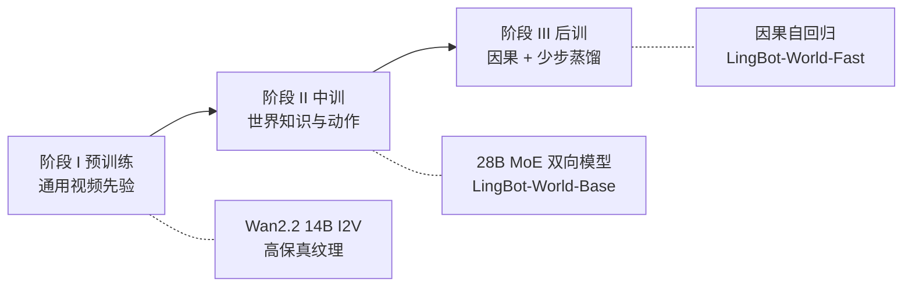
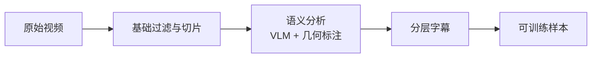

# LingBot-World：视频模型会做梦，世界模拟器必须能被按键打断

<!-- release-date: 2026-01-28 -->

> 本文依据 Robbyant Team 的 **Advancing Open-source World Models**，即 arXiv:2601.20540v1（2026-01-28 提交），本地原件共 31 页。封面同时印着 Ant Group 与 Robbyant 标识；团队对外称蚂蚁灵波。页码一律指这份本地 PDF 自身的页码。截至 2026-09-10 核验，arXiv 提交历史只有 v1，因此未换件。
>
> 文中会明确区分三层：**报告写了什么**、**我们如何解释或推算**、**哪些是外部资料补充**。外部补充一律标出来源并给链接。
>
> 关于 `release-date`：取 2026-01-28，即 GitHub 推理代码公开、arXiv v1 上线、Hugging Face 上 `LingBot-World-Base (Cam)` 已可下载的那一天。官方 README 的 News 把「报告、代码和模型」写成 2026-01-29；按本模块约定，取更早的官方公开使用日。证据链见文末。
>
> 这篇只讲 v1 报告里的 LingBot-World。2026-07 之后另有 LingBot-World-Infinity（也称 2.0），那是论文之后的新工作，不混进下面的结论。

## 先把问题问对：视频生成器为什么还不是世界

先不谈任何新名词。你手里有一个很强的视频生成模型。给它一张图、一句「沿着这条路往前骑」，它吐出十几秒画面，纹理漂亮，运动也大体说得通。

现在你按一下 `A`。

什么都不会发生。

这就是报告开篇说的那道墙：当代视频模型已经能画出「短而好看的片段」，但它们本质上仍是「做梦的人」（dreamers），不是「模拟器」（simulators）（PDF p.2）。它们按统计相关补像素，并不保证因果、物体恒存、以及「你动手之后世界会怎样」。

站内已经有两篇把这道墙拆开讲的解读。[Genie](/reports/Google/Genie) 问的是：没有动作标签，能不能从纯视频里学出一套「按键」。[Cosmos](/reports/NVIDIA/Cosmos) 问的是：机器人不能靠摔跤学习，能不能先从视频里学一个通用世界底座。LingBot-World 问的是第三件事：

> **闭源世界模型已经能玩了。开源这边缺的不是再把画面画得更像，而是同时做到：动作跟得上、记性能撑到分钟级、并且快到可以实时按。**

报告把这三件事写成三条产品主张（PDF p.1）：

1. 在写实、科学可视化、卡通等很宽的环境里，保持高保真和稳健动力学；
2. 做到分钟级时域，并且上下文不漂，也就是他们说的「长期记忆」；
3. 实时可交互：生成 16 帧每秒时，延迟低于 1 秒。

代码和权重公开。目标应用写得很具体：内容创作、游戏、机器人学习（PDF p.1）。

## 读之前：八个词先各用一句话说清

这一篇的行话大多不是 LingBot-World 发明的，属于读材料的前置背景。

- **世界模型（World Model）**：给定已经看到的画面和这一步的动作，预测接下来世界长什么样。它和普通视频生成模型的差别只有一条：中途能不能接控制。
- **双向注意力与因果注意力**：双向是整段视频里每个位置都能看见前后；因果是当前位置只能看已经生成的过去。双向适合把一段视频一次画完，因果才能边走边画。
- **扩散 Transformer（Diffusion Transformer，DiT）**：先把画面加噪声，再让 transformer 一步步去噪。LingBot-World 的主干就是这种去噪网络。
- **混合专家（Mixture-of-Experts，MoE）**：同一层里放多个专家，每次只叫醒其中一个。这里两个专家按噪声高低分工，不是按文本主题分工。
- **自适应层归一化（Adaptive Layer Normalization，AdaLN）**：用外部条件去调每一层的缩放和偏移，等于告诉网络「这一步该往哪边走」。本篇用它把动作灌进 DiT。
- **普吕克嵌入（Plücker embeddings）**：用一组坐标描写三维空间里一条射线的方向和位置。本篇拿它表示连续的相机旋转。
- **分布匹配蒸馏（Distribution Matching Distillation，DMD）**：不让学生去模仿教师的每一步去噪，而是让学生的输出分布去贴教师的输出分布，从而把几十步采样压成很少几步。
- **自强制（self-forcing）**：训练时让模型吃自己刚生成的历史，而不是永远吃标准答案。目的是把「训练看真帧、推理看假帧」的落差补上。

本篇自己反复使用、但没有当成新理论名词提出来的，是 **LingBot-World-Base** 和 **LingBot-World-Fast**：前者是中训得到的双向高保真世界模型，后者是后训得到的因果实时版。

## 一句话先说清

LingBot-World 不是从零发明一种新的视频生成范式。它做的事情是：把已经会画视频的底座，用三条流水线熬成一个能玩的开源模拟器。

- 用混合数据引擎补上「按键和画面成对出现」的数据；
- 用中训把 Wan2.2 的图像到视频模型，改成带动作、能看一分钟的双向世界模型；
- 用因果注意力改造加少步蒸馏，把这个双向模型压成可自回归、可 KV 缓存的实时系统。

所以最值得记住的不是某一个分数，而是这条工程判断：

> **视频生成器的先验可以复用，但交互、记忆和实时是三笔必须分开还的账。同一套权重既要双向看全局，又要因果跑实时，做不到；所以他们把模型进化拆成三个阶段。**

## 和站内已有的世界模型解读怎么分工

| | [Genie](/reports/Google/Genie)（初代） | [Cosmos](/reports/NVIDIA/Cosmos) | 本篇 LingBot-World |
|---|---|---|---|
| 想解决的缺口 | 动作标注太贵 | 手写仿真器写不出来 | 开源世界模型又慢、又短、动态又弱 |
| 控制信号从哪来 | 从无标签视频里**学**出 8 个潜动作 | 预训练用文字当扰动，后训练再接真动作 | 游戏和虚幻引擎里**录**到的按键与相机 |
| 交付形态 | 一篇方法，未发权重 | 开源平台，权重开放 | 开源模拟器，Base 与 Fast 两档 |
| 这篇报告怎么提它们 | 本篇 Table 1 对照的是 **Genie 3**，不是初代 Genie | 本篇参考文献里没有 Cosmos 这份平台报告 | — |

对照要看清代际：本篇 Table 1 拿 **Genie 3** 当闭源上限（PDF p.3）；站内那篇是初代 Genie。两者不是同一篇工作。

LingBot-World 不需要解决 Genie 那个「没有动作标签」的问题。它的动作来自游戏采集和虚幻引擎渲染，是有标签的。**它要还的账是另一头：有了动作之后，开源模型能不能在通用域、分钟级、高动态、720p 和实时这几项上同时站住，而不是只占其中两三项。**

## 它相对闭源世界模型补什么缺口

报告用一张表把同期交互世界模型摊开（PDF p.3，Table 1）。下面按原文栏目转写；勾叉以 PDF 为准，不按官网演示补。

| | Matrix-Game 2.0 | Yume-1.5 | HY-World 1.5 | Mirage 2 | Genie 3 | Ours |
|---|---|---|---|---|---|---|
| Domain | Game | General | General | General | General | General |
| Generation Horizon | Short | Short | Medium | Long | Long | Long |
| Dynamic Degree | Low | Low | Low | Medium | Medium | High |
| Resolution | 480p | 480p | 720p | 480p | 720p | 720p |
| Real-time | 是 | 否 | 是 | 是 | 是 | 是 |
| Open-source | 是 | 是 | 是 | 否 | 否 | 是 |

读这张表时有一个容易滑过去的细节：**开源的并不少，同时占「通用域 + 长时域 + 高动态 + 720p + 实时」的开源模型，报告认为没有。** 所以「fully open-sourced」不是在说别人都没放权重，而是在说高能力组合目前被闭源拿走了（PDF p.2–3）。Genie 3 与 Mirage 2 被点名为闭源；开源对照则是 Matrix-Game 2.0、Yume-1.5、HY-World 1.5。

这张表是作者的定性归类，不是评测分数。动态高低、时域长短没有给出可复现的阈值。定量对照被放到后面的 VBench 表里，而且那里只比了两个开源世界模型，没有 Genie 3。

## 先看全景：一个视频底座，三次变形

报告把世界模型写成一个条件生成过程（PDF p.7，式 1）。用白话说：给定已经发生的历史 $x_{<t}$，以及从现在起到未来一段的动作 $a_{t:t+L}$，去最大化未来 $L$ 帧 $x_{t:t+L}$ 的似然。

$$
\max_{\theta}\ \mathbb{E}\bigl[\log p_{\theta}(x_{t:t+L}\mid x_{<t},\ a_{t:t+L})\bigr]
$$

$L \ge 1$ 是预测地平线。写成「一段未来」而不是「只预测下一帧」，是为后面两件事留位置：中训阶段可以 $t=0$、整段双向生成；后训阶段再改成 $t \ge 0$、只看过去的因果滚动（PDF p.8）。

三次变形对应三个训练阶段（PDF p.8，Figure 4）：

这张图根据 Figure 4（PDF p.8）重画，表达的是阶段目标，不是训练时长或 GPU 配比。报告没有给出任何算力、步数或数据小时数。

三个阶段各自还一笔账：

| 阶段 | 旧问题 | 新状态 | 报告里的名字 |
|---|---|---|---|
| I 预训练 | 没有高保真画布 | 通用视频先验 | General Video Foundation（PDF p.8） |
| II 中训 | 短、不可控 | 动作可控、分钟级一致 | Physical World Model / Base（PDF p.8、p.13） |
| III 后训 | 双向太慢，不能直播 | 因果、少步、可缓存 | Real-time World Model / Fast（PDF p.8、p.19） |

## 第一笔账：按键和画面必须成对出现

### 旧问题

互联网视频极多，但它们只记录「发生了什么」，不记录「当时按了什么」。报告把这件事说成世界模拟的第一道瓶颈：高质量交互数据稀缺，智能体决策和环境反应之间的配对很难放大（PDF p.2）。

### 新设计

数据引擎被拆成三截：采集、画像、字幕（PDF p.3）。采集本身又是三条源：

1. **通用视频**：第一人称和第三人称，人、动物、载具，强调「在世界里走动」而不是影视剪辑（PDF p.3）。
2. **游戏数据**：RGB 帧与用户控制（例如 W、A、S、D）以及相机参数严格对齐（PDF p.3–4）。
3. **虚幻引擎合成**：用授权资产和自制场景，自动生成无碰撞、随机但合理的相机轨迹，并导出内参外参真值（PDF p.3–5）。

Figure 2 画的就是游戏和合成这条线：算力与虚幻引擎在左，动作、相机、视频流在中，存储在右（PDF p.4）。它是采集系统的示意图，不是一张数据配比图——报告从头到尾没有给出三类数据各占多少小时。

游戏采集被刻意写成四种行为，而不是「在游戏里随便录」（PDF p.4）：

| 类别 | 它补的分布 |
|---|---|
| Navigation | 自由逛、闭环绕、进出建筑这类场景跳变 |
| Sightseeing | 盯着细节看、围着地标转，为了多视图一致 |
| Long-tail | 原地 360°、定机看动态、倒着走 |
| World interaction | 拾取、开门，以及战斗、破坏这类状态跳变 |

合成轨迹还有两个专门模式：程序化路径（矩形绕圈、多圈 360°、多点插值并回头看）和把真实设备轨迹映射进虚幻引擎（PDF p.5）。回头看、再观察，是后面「空间记忆」的数据来源。报告自己说，真实世界轨迹常常被「一直往前走」主导，合成数据就是用来打破这个偏置的（PDF p.4）。

### 画像：把三种源收成能训练的东西

通用视频没有相机。报告先用位姿估计模型打伪标签，再用分辨率和时长做硬过滤，用 Koala 与 TransNet v2 切镜头，最后用内部视觉语言模型打质量、运动幅度、场景类型和人称（PDF p.5）。缺几何的视频，再用 MegaSAM 补相机（PDF p.5）。

Figure 3 把这一段画成三列漏斗：原始视频 → 切好的片段 + 元数据 → 带字幕的最终数据（PDF p.6）。能改写成流程的，不必对着原图读：

根据 Figure 3（PDF p.6）重画，表达的是处理顺序，不是各阶段通过率。报告没有给出过滤前后的样本量。

### 分层字幕：把「场景长什么样」和「相机在干什么」拆开

这是数据引擎里最值得迁移的一步。报告说，原始数据缺细粒度控制，所以他们给每段视频写三层字幕（PDF p.2、p.6–7）：

1. **综合叙事字幕**：环境和相机运动织成一个全局故事，当总提示。
2. **场景静态字幕**：只写环境，故意不写相机和角色动作。用来把运动控制从场景生成里解耦。
3. **稠密时间字幕**：按时间片写事件，例如 0–5 秒「走向雕花木屏风」，5–10 秒「左摇揭示室内」。

报告在 PDF p.6–7 给了一整段东亚庭院的例子。叙事层会写「镜头前移、左摇、再沿柱廊走向红门」；静态层只剩「石墙、彩绘木屏、带金钉的红门、基座上的雕像」；时间层则是带 `start_time` / `end_time` 的 JSON。

可迁移的点很具体：**控制信号和场景描述如果写在同一句里，模型分不清「往左看」和「左边有一扇门」。** 把后者单独写出来，动作才有地方可接。这不依赖他们的模型结构，任何动作条件生成都可以用。

报告没写的：字幕用的是哪个 VLM、每层多长、训练时三层如何采样或丢弃。

## 第二笔账：先有画布，再听得懂按键

### 阶段 I：不从头训视频模型

中训和后训都建立在一个已有的视频先验上。报告明确采用 **14B 参数的 Wan2.2 图像到视频扩散模型** 作为预训练底座，理由是近期世界模型（包括 Genie 3）已经证明：从强视频基础模型初始化，能把视觉真实感、物体恒存和时间动态这些内部先验直接带过来（PDF p.9）。

所以阶段 I 在这篇报告里几乎没有自己的训练 recipe。它做的决策是：**复用开源视频生成器当画布，而不是再训一个。**

### 阶段 II 的主干：两个专家，不是一个更大的密集模型

中训要把这个短视频生成器抬成双向世界模型。结构上继承 Wan2.2 的 MoE（PDF p.10）：

- **高噪声专家**：去噪早期叫醒，管全局结构和粗布局；
- **低噪声专家**：去噪后期叫醒，管空间和时间上的细部。

每个专家大约 14B 参数，合计 28B；每个去噪时刻只激活一个专家，所以推理时的计算和显存仍接近密集 14B（PDF p.10）。报告把整个中训模型称为「28B-parameter fundamental world model」（PDF p.11）。

Figure 5 把前向画成左右两半（PDF p.9）。左边是生成管线：图像或视频条件、带噪声的潜变量、用户动作，一起进入「DiT Block × N（MoE：高噪声与低噪声）」，输出视频潜变量。右边是一块 DiT 内部顺序：

1. **自注意力**：视频潜变量先自己看自己，学时空连贯，报告认为空间记忆也从这里涌现；
2. **动作的缩放与偏移**：动作经普吕克编码器变成嵌入，再变成 AdaLN 的 scale / shift，去调制潜变量；
3. **交叉注意力**：再看文本嵌入；
4. **前馈层**。

输入动作在图里画成键盘 W/A/S/D 加方向键，和文本是两条分开的条件通道。这很重要：文本管「这是什么世界」，动作管「这一步往哪走」。

### 课程：5 秒先站稳，再拉到 60 秒

只改结构不够。预训练模型被报告说成「受窄分布约束」，直接在长视频上训会漂。中训用课程（PDF p.10）：

1. 先用 5 秒序列把基础世界模型训开，拓宽生成域；
2. 再把时长从 5 秒逐步拉到 60 秒，让长期一致和空间记忆有机会出现；
3. 同时逐步加大 **flow shift**（流匹配里把时间轴往高噪声一侧拉开的偏移）。报告给的理由是：长视频更依赖高噪声时刻来稳住全局结构，提高高噪声比例有助于减少漂移。

这里的 60 秒，就是后文「分钟级」在训练侧的具体落点。它不是推理时 10 分钟那条展示，而是中训看过的最长监督地平线（PDF p.10、p.21）。

同一阶段还做多任务：图像到视频，和视频到视频（视频续写）。前者对应「只有一张静图当初始状态」，后者对应「已经看过一段历史再往前推」（PDF p.10）。报告把它说成在学一个统一的世界转移函数，不依赖初始状态恰好是一张图还是一段视频。

### 动作怎么接进去，以及为什么只训适配器

基础世界模型会画之后，再单独做动作微调（PDF p.10）。表示是混合的：

- 连续相机旋转 → 普吕克嵌入；
- 离散交互（W/A/S/D）→ 多热向量；
- 两条在通道维拼接。

注入方式是 AdaLN：把融合后的动作嵌入投影进 DiT，调制归一化后的特征，从而在去噪时把帧「扳」到与动作一致的方向（PDF p.10）。

微调策略是冻主干、只训新加的动作适配器（动作嵌入投影和 AdaLN 参数）。报告给了两条原因（PDF p.10）：

1. 把「会画」和「听动作」拆开，避免互相污染；
2. 带动作标注的数据往往稀缺或合成，全量微调容易把基础画质忘掉。

这是可直接复用的工程判断：**动作数据比无动作视频脏、也少，所以不要让它改画布。** 代价是动作空间被适配器容量绑住。后文限制里写的「主要是导航和基本移动」，和这个选择是同一件事的两面（PDF p.25）。

### 一分钟 28B，显存怎么撑住

报告承认：28B、一分钟序列、还要梯度、优化器状态和激活检查点，单卡放不下（PDF p.11）。并行就两件：

- **FSDP2**：参数、梯度、优化器状态切到多卡，通信与计算重叠（PDF p.11）。
- **上下文并行（Context Parallel，CP）**：用 Ulysses 沿时间维切序列；注意力时用 all-to-all 把各卡需要的激活重排回去，从而把激活和注意力中间结果的单卡占用打下来（PDF p.11）。

报告没有写用了多少卡、切成几路、吞吐是多少。能确定的只有：长序列训练的内存瓶颈被他们认为主要在序列维，所以除了 FSDP 还要切时间。

## 第三笔账：双向模型为什么玩不了

### 旧问题

阶段 II 的模型已经能按动作生成高保真未来，但注意力是双向的，推理必须看到整段未来，采样还是多步迭代扩散。报告说这两件事合在一起，计算上禁止实时 rollout（PDF p.8、p.11）。

用更日常的话说：双向模型像一次性剪完一部短片；实时交互需要的是边拍边播，而且你随时可能改剧本。

### 新设计之一：块因果注意力

后训先改结构。学生不从两个专家里随便挑，而是**只用高噪声专家初始化**。报告给的理由是：高噪声专家更擅长动力学；实验上，从它适配比从低噪声专家适配，动作条件动力学更好（PDF p.11）。低噪声专家负责细部，这一步被丢掉了——后面 GAN 蒸馏就是来补这笔账的。

注意力从全双向换成 **块因果注意力（block causal attention）**（PDF p.11–12，Figure 6a）：

- **块内双向**：一个时间块里的 token 互相能看见，保住相邻几帧的局部一致；
- **块间因果**：当前块只能看本块和更早的块，不能看未来。

推理时就可以把已经算过的键和值留下来，也就是 **KV 缓存（Key-Value Cache）**：旧块的表示留下，新块只算新 token（PDF p.12）。Figure 6a 把生成画成 Chunk $i$、$i+1$、$i+2$……每一块上面是动作（W、前进、再加 D 和右转），下面是该块的噪声潜变量；生成器标注为「从高噪声专家初始化的 DiTBlock × N，带块因果注意力」。

训练协议跟的是 **扩散强迫（diffusion forcing）**：不是整段视频共用一个噪声时刻，而是一段 $N$ 帧噪声视频切成 $L$ 块，每块自己的噪声时刻；并且只在一小撮目标时刻 $\{t_1,\ldots,t_m\}$ 上训，这些时刻后面还要当蒸馏目标（PDF p.12）。因为初始化来自只见过高噪声的专家，他们额外加入时刻 0 的干净帧监督，让学生学会编码干净潜变量，补上高低噪声专家之间的专长缺口。重建损失是（PDF p.12，式 2）：

$$
\mathcal{L}=\mathbb{E}_{x^{i}\in p(x),\ t\in\{t_{1},\ldots,t_{m}\}}\bigl\|G_{\theta}(x^{i}_{t},t,a)-x^{i}_{0}\bigr\|^{2}
$$

$G_{\theta}$ 是学生，$a$ 是动作，$x^{i}_{0}$ 是干净帧。符号 $N$、$L$、$m$、块里有多少帧，报告都没有给出具体数字。

### 新设计之二：少步蒸馏，还要跟自己的错误相处

只改成因果，仍会在训练地平线之外漂。报告把原因写成训练和推理条件不匹配：训练时历史是真的，推理时历史是自己生成的（PDF p.12）。后训后半段因此做三件事。

**自滚动延展地平线。** 按 self-forcing，学生的输入改成自己刚生成的帧，历史放在滚动 KV 缓存里，逼它从自己的伪影和累积误差里恢复（PDF p.12）。长程回传太贵，就随机截断梯度：只对最近 $K$ 步反传，前向仍看全部上下文（PDF p.12）。$K$ 是多少，没写。

**DMD。** 中训好的 MoE 教师当「真分数」网络，再复制一份当「假分数」网络。学生生成干净样本，加上噪声，让两个分数网络在噪声潜变量上打分；学生沿着「真分数 − 假分数」的方向更新，从而让自己的分布去贴数据分布（PDF p.13，式 3–4）。假分数网络用学生视频上的标准扩散损失更新，真分数网络冻结。更新节奏是双时间尺度：假分数多更几次，再更一次学生，让假分数跟上学生正在变的分布（PDF p.13）。

这一段的公式下标很密，第一次读不必盯符号。它要算的就是一件事：**学生不要去学教师的每一步去噪轨迹，只要最后看起来像教师会生成的视频。** 动作 $a$ 全程作为条件，所以蒸馏的不是「会画」这么简单，而是「会按这个键画」。

**对抗补实数据。** DMD 之后学生仍明显弱于教师。报告列了三条原因（PDF p.13）：

1. 学生从高噪声专家初始化，没继承低噪声专家的高频细节；
2. 注意力改成因果，推理步数又少；
3. DMD 里生成器和教师都不受真实视频直接监督，学生会把教师的偏差一起学走。

补丁是在假分数网络上接一个分类头 $D(\cdot)$，结构跟 **扩散对抗后训练（Adversarial Post-Training，APT）** 走（PDF p.13，Figure 6b）。生成器要骗过判别器，判别器要分开真视频和合成视频。对抗损失用 softplus，不加 R1/R2；而且 **对抗损失只更新这个分类头，假分数网络本身仍只吃 DMD**（PDF p.13，式 5–6）。Figure 6b 显示判别器对视频潜变量做多层交叉注意力，Query 来自分类头，Key/Value 来自带动作注入的 DiT 特征。

收益是报告自己的观察：视觉质量明显上去，同时保住动作跟随和长程时间一致（PDF p.13）。没有单独的消融表来拆开 DMD、self-forcing 和 GAN 各自贡献多少。

### 实时数字怎么读

摘要写：生成 16 帧每秒时，延迟低于 1 秒（PDF p.1）。评测节写：LingBot-World-Fast 在「一个 GPU 节点」上处理 480p 视频，吞吐达到 16 fps（PDF p.19）。

这两句不要并成一句。前者是延迟，后者是吞吐；GPU 是什么卡、节点里几张卡、块有多长、蒸馏成几步，全部没写。能确定的只有：实时版本是后训出来的 Fast，不是中训的 Base；加速被承认会牺牲理论上界质量，但作者认为观感损失有限，Fast 没有明显伪影或模式崩塌（PDF p.19，Figures 10–11）。

## 长期记忆：不是一个模块，是窗口里涌出来的

报告把「长期记忆」写成中训的目标之一（PDF p.2、p.8），评测时又把它说成涌现能力：不靠高斯溅射这类显式三维表示，也能在物体离开视野很久之后把它认回来（PDF p.19）。

Figure 12 是必须对着看的一张图，否则「记忆」会被听成口号（PDF p.19）：

- 第 1–3 行：雕像、巨石阵、沙漠里的角色，镜头转走，大约 60 秒后再转回来，结构还在，红圈标出的目标没有换成别的东西。
- 第 4 行：先看见远处大桥和一辆花车，镜头沿桥面前进，再回到正视时，桥明显更近——模型没有把「没看见的那段路」冻住。
- 第 5 行：夜间一辆车驶出画面，随后从另一个位置再出现，而不是消失或停在原地。

报告把后两行称为对**未观察状态**的推理：世界在镜头背后仍按自己的逻辑走（PDF p.19、p.21）。这和「把上一帧像素背下来」不是一回事。作者还强调，视频式记忆比静态三维重建更适合流水、行人这类非刚体（PDF p.19）。

更长的展示是 Figure 13：同一片古希腊式柱廊和庭院，关键帧铺了满页，图注写能撑到 10 分钟且没有明显画质或叙事崩坏（PDF p.20–21）。这是定性展示，不是可复现的长程指标。限制节随后自己打了折扣：连贯生成长度仍不够支撑长时间游戏，拉长之后场景会漂，逐渐丢掉原来的结构（PDF p.26）。

所以记忆这条线要记成两句，不要只记 10 分钟：

1. **训练上看过 60 秒，推理上能展示 10 分钟，物体离开视野 60 秒仍能回来**（PDF p.10、p.19–21）；
2. **记忆来自上下文窗口，不是外挂存储；作者把它列为不稳定的涌现能力**（PDF p.25）。

## 实验数字：比开源同行的动态，不比闭源上限的可玩性

### 定性：Base 负责世界有多宽，Fast 负责还能不能玩

Figures 7–9 是 Base，每行一组随时间抽样的关键帧，角落叠着 W/A/S/D（PDF p.14–16）。Figure 7 这一页就能看出他们说的「宽谱环境」不是空话：故宫红墙、高原草地、黑暗奇幻、水面倒影的宫殿、公路摩托、科幻光环、赛博城市、航拍建筑、水墨、雪夜木屋。镜头在动，场景类型跨写实、游戏、艺术。

Figures 10–11 是 Fast（PDF p.17–18）。Figure 10 里有乡间公路、秋山、骑飞龙、日落、湖泊、小鸭、雪镇、荒原城堡，同样带按键图标。作者的判断是：结构完整性和物理逻辑从教师那边保住了，观感损失有限（PDF p.19）。没有 Base 对 Fast 的并排定量。

### 定量：VBench，100 条超过 30 秒的视频

报告承认世界模型评测还很幼，因此退回到视频生成套件 VBench，在 100 条、每条超过 30 秒的自产视频上比两个开源世界模型：Yume-1.5 与 HY-World 1.5（PDF p.21，Table 2）。

| 模型 | Imaging Quality | Aesthetic Quality | Dynamic Degree | Motion Smooth | Temporal Flickering | Overall Consistency |
|---|---:|---:|---:|---:|---:|---:|
| Yume-1.5 | 0.5838 | 0.5185 | 0.7612 | 0.9709 | 0.9545 | 0.1994 |
| HY-World 1.5 | 0.6512 | 0.5487 | 0.7217 | 0.9897 | 0.9773 | 0.2016 |
| Ours | 0.6683 | 0.5660 | 0.8857 | 0.9895 | 0.9648 | 0.2178 |

作者自己强调的是动态：0.8857 对 0.7612 和 0.7217，差距明显大于成像和质量（PDF p.21）。运动平滑与 HY-World 1.5 几乎持平（0.9895 对 0.9897），闪烁略差（0.9648 对 0.9773），总体一致性最高。

读这张表时有三条边界，报告没有帮你划，但数字本身要求你划：

1. **对照里没有 Genie 3、没有 Mirage 2。** Table 1 的闭源上限没有进入 Table 2。
2. **测试集是自己生成的 100 条视频**，不是公开世界模型交互基准。提示怎么写、动作怎么采样、Yume 与 HY-World 是否用同一套控制，没写。
3. **Overall Consistency 三个模型都在 0.20 上下**，这是 VBench 该指标的量纲，不能按「20 分满分」来读。

「高动态」因此是被这张表支撑的；「达到闭源可玩上限」没有被这张表支撑。

## 三个下游：证明它不只是一段更长的视频

### 可提示世界事件：同一张开场，分出不同未来

Figure 14 左列两张开场图，右列按文本分叉（PDF p.22）。上半是第一人称骑飞龙冲向丛林神殿：同一段历史，分别接到烟花、闪电、护盾、夜晚、冰世界。下半是罗马特莱维喷泉：鸟、鱼、花、蒸汽朋克、像素风。全局事件改天气、光照和风格（冬天、夜晚、像素、蒸汽朋克）；局部事件往场景里塞烟花、鸟、鱼（PDF p.23）。

实现上，报告说是利用底座的文本条件，再加上 Ditto 的一个变体，在推理时改提示（PDF p.23）。Ditto 不是这篇的方法贡献，是同一团队的指令式视频编辑工作；本篇只把它当推理旋钮用。

这和「按 WASD 走路」是两种控制。键盘改的是局部动力学，文本改的是世界走向。报告把后者称为从一条确定路径变成一棵可能的树（PDF p.23）。

### 动作智能体：让另一个模型来按键

他们还拿同一批数据微调 Qwen3-VL-2B：输入一张图，输出未来 10 秒的动作块，含 W/A/S/D 位移和 I/J/K/L 离散化鼠标方向；这些动作再转成相机轨迹，交给世界模型滚视频（PDF p.25，Figure 15）。Figure 15 里能看到猫在客厅转、宇航员在火星走、草原、爬树、黑暗城堡，按键图标跟着变（PDF p.23）。

这不是世界模型本身变成了智能体，而是：**世界模型提供环境，一个小 VLM 当策略。** 报告没有给这个智能体任何成功率、覆盖率或与人类轨迹的对比。

### 三维重建：几何有没有自洽

Figure 16 用现成的大规模三维重建基础模型，把生成视频收成点云，展示了客厅、科幻廊道、山间建筑三组（PDF p.24–25）。室内能看出沙发、电视、落地窗的相对位置在两视角之间对得上；廊道的透视没有在中途折断。报告把这写成涌现的三维一致，用来缓解普通视频模型常见的跨视图打架，并说这些点云可以当具身训练的数据源（PDF p.25）。重建用的是别人的模型，本篇贡献是「生成的视频够稳，重建才收得拢」。

## 开源了什么，当时没开什么

报告正文写：开源模型权重和推理代码（PDF p.2）。封面给出三个链接：项目页、GitHub、Hugging Face checkpoints（PDF p.1）。训练代码、训练数据、数据引擎实现，报告都没有说要放。

下面这些是**外部补充**，不是 PDF 原文：

- GitHub 仓库 [Robbyant/lingbot-world](https://github.com/robbyant/lingbot-world) 声明基于 Wan2.2，许可证 Apache 2.0。论文里没有写许可证。
- 2026-01-28 / 01-29 实际放出的是 **LingBot-World-Base (Cam)**，相机位姿控制，480p 与 720p，权重在 [robbyant/lingbot-world-base-cam](https://huggingface.co/robbyant/lingbot-world-base-cam)。本稿核验时仓库未 gated，配置文件可解析下载。
- **Base (Act)** 权重官方 News 记为 2026-03-02；**Fast** 权重官方 News 记为 2026-04-02。论文在评测里已经展示 Fast，但首发当天按官方仓库状态，Fast 与 Act 仍是待发布。
- 2026-07-09 另发 LingBot-World-Infinity（v2），原仓库 README 改为不再积极维护。v2 的 60 fps 等数字属于后作，不能写进本篇的模型能力。

所以：论文描述的是 Base + Fast 两档系统；公众在论文当天能下载使用的，主要是 Base 的相机版。不要把后来解禁的权重，倒写成 2026-01-28 已经齐套。

## 限制：作者自己列的六条，加上报告没写的

限制节写得很直（PDF p.25–26）：

1. **记忆不稳定。** 记忆是上下文窗口里的涌现，没有显式存储，长程会不一致。
2. **推理贵。** 需要企业级 GPU，消费级硬件用不上。
3. **动作空间窄。** 主要是导航和基本移动，复杂交互很少。
4. **交互精度不够。** 在杂乱桌面上拿起指定的那只杯子，做不到，因为缺少物体级接地。
5. **长度与漂移。** 连贯生成还撑不起长时间游戏，拉长后环境逐渐丢掉原结构。
6. **单智能体。** 只有单视角，不考虑多智能体。

下一步写的是：扩大动作空间并加强物理、做显式记忆模块、解决漂移以走向无限时长（PDF p.26）。这些是路线，不是已经做完的方法。

报告没写、因此本文也不补的实现包括：

- 任何数据规模（小时、片段数、token 数）和三类数据配比；
- GPU 型号、卡数、训练时长、钱；
- DiT 层数、块长度、课程里 flow shift 的具体值、蒸馏步数、梯度截断的 $K$；
- Fast 的「一个 GPU 节点」里有几张什么卡；
- 延迟如何测量（首块、平均块、还是端到端）；
- 训练代码是否开源、数据是否开源。

## 可迁移启发

1. **交互数据不要指望爬。** 游戏录制加仿真器合成，专门覆盖回头看、倒走、进出建筑这些长尾，比把互联网视频再滤一遍更接近「世界」。Cosmos 用 curator 洗互联网视频；本篇把赌注更多押在成对的动作轨迹上。两条路并不互斥，但本篇证明：开源世界模型至少需要一条能产出 `(帧, 按键, 相机)` 的流水线。
2. **字幕要分层，才能把控制和场景拆开。** 静态层故意不写相机，时间层按秒对齐事件。做动作条件生成时，这比再加一个更大的文本编码器更便宜。
3. **会画的权重值得冻。** 动作数据少且合成，全量微调会毁画布。冻 DiT、只训 AdaLN 适配器，是「用脏数据接控制」时的默认姿势。
4. **双向和实时不要塞进同一次训练。** 先双向把全局动力学学对，再改块因果、再蒸馏。报告把 $t=0$ 和 $t \ge 0$ 写成同一公式的两种特例，工程上却是两次独立的适配。
5. **蒸馏学生如果只继承高噪声专家，必须另开一条看真数据的通路。** DMD 对分布、GAN 头对真实视频，两条监督不互相替换。报告甚至把对抗梯度限制在分类头上，以免把假分数网络带跑。
6. **长程记忆如果只靠窗口，展示可以很漂亮，产品承诺不能跟着走。** 60 秒物体恒存和 10 分钟庭院都是真图；作者同时把「涌现记忆」和「漂移」写进限制。做系统的人应该按限制做容量规划，按展示做演示。

## 关键词回看

- **Dreamers vs simulators**：短视频生成器按相关补像素；模拟器要因果、恒存、以及动作的后果。
- **分层字幕**：叙事 / 静态 / 时间三层，用来解耦场景和运动。
- **Wan2.2 14B I2V**：被复用的视频画布，不是本篇训出来的。
- **高/低噪声 MoE**：两个 14B 专家按扩散时刻分工，合计 28B，同时只活一个。
- **AdaLN 动作适配器**：冻主干，只让动作改缩放和偏移。
- **块因果注意力**：块内双向、块间因果，为的是 KV 缓存和无限滚动。
- **KV 缓存**：把旧块已经算过的键和值留下来，新块不必重算历史。
- **DMD + self-forcing + GAN 头**：少步蒸馏的三件套，分别管分布、训练推理落差、真数据观感。
- **LingBot-World-Base / Fast**：中训双向高保真，后训因果实时。
- **涌现记忆**：窗口里的物体恒存和未观察状态，不是外挂记忆模块。

## 最后的判断

LingBot-World 最强的叙事不是「我们画出了更好看的世界」，而是：**开源世界模型缺的组合能力，可以用三阶段进化从现成视频生成器里长出来。** 数据引擎负责让按键和画面成对；中训负责让 28B MoE 在一分钟里既记得住又听得懂；后训负责承认双向模型玩不成直播，于是改因果、蒸馏、再拿真视频打一针。

被实验撑住的，是开源对照上的动态和观感，以及一批很难用「会做视频」解释的定性现象：离开视野 60 秒的巨石阵还在，没看见的桥会变近，生成视频能收成自洽点云。没有被撑住的，是对 Genie 3 这类闭源系统的全面追平——Table 1 是作者归类，Table 2 里没有它们。

它也把边界写清楚了：记忆会漂，动作很粗，消费级 GPU 跑不动，多智能体不在范围里。正因为这些限制和「我们从 Wan2.2 改过来」被写在明处，这份报告更适合当设计材料，而不是当一份已经结束的对标战报。

如果只记一句话，可以记：

> **视频生成器可以一次把整段话说完；世界模拟器必须允许你在第 37 帧插话，并且还记得第 1 帧的那座桥。**

## 资料与阅读边界

- 原始依据：本地 `papers/AntGroup/LingBot-World.pdf`，arXiv:2601.20540v1，2026-01-28 提交，31 页。官方页：[arXiv abs/2601.20540](https://arxiv.org/abs/2601.20540)。提交历史只有 v1，HTML 实验页与 PDF 同版。
- 项目页：[LingBot-World](https://technology.robbyant.com/lingbot-world)（蚂蚁灵波 / Robbyant）。封面与页眉同时使用 Ant Group 标识；归属按主要机构放在 `AntGroup`，不另建 Robbyant 目录。
- 推理代码：[Robbyant/lingbot-world](https://github.com/robbyant/lingbot-world)。仓库 `created_at` 为 2026-01-28T04:52:50Z，初始提交 `6cb2e93` 时间为 2026-01-28T15:42:52Z。许可证 Apache 2.0 来自该仓库，不是 PDF 原文。
- 首发权重：[robbyant/lingbot-world-base-cam](https://huggingface.co/robbyant/lingbot-world-base-cam)。Hugging Face `createdAt` 为 2026-01-26T10:37:35Z，权重文件在 2026-01-26T13:07:50Z 的 `e2fcc0a` 提交中上传；按本模块约定，**仓库创建日不是首发日**。该仓库在 2026-01-28 已持续更新 README 并给出论文与推理命令；本稿核验时 `gated=false`，`high_noise_model/config.json` 可重定向下载。
- 官方 README News 将「技术报告、代码和模型」写成 2026-01-29。与 GitHub 公开日、arXiv v1 相比更晚，故 `release-date` 取 2026-01-28。
- 论文之后、不计入本篇模型能力的官方事件：Base (Act) 权重 2026-03-02；Fast 权重 2026-04-02（Hugging Face `lingbot-world-fast` 的大文件提交在 2026-04-02T03:33:17Z）；LingBot-World-Infinity / v2 与新仓库 [lingbot-world-v2](https://github.com/Robbyant/lingbot-world-v2) 于 2026-07-09 发布。阅读源码或后作时应以当时 commit 为准，不能拿后作数字改写这篇报告。
- 底座来源（报告点名、实现细节以对方仓库为准）：[Wan-Video/Wan2.2](https://github.com/Wan-Video/Wan2.2)。
- 可提示事件用到的编辑前作：[Ditto / Scaling instruction-based video editing](https://arxiv.org/abs/2510.15742)，即参考文献 [3]。这是外部方法，不是本篇新提出的模块。
