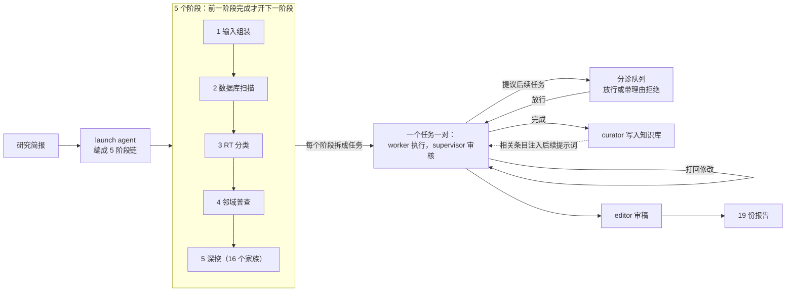

# 让 agent 亲眼读 DNA：Claude 自主普查逆转录酶，撞见 ART 家族

<!-- release-date: 2026-09-23 -->

> 本文依据本地 `papers/Anthropic/ART-Discovery.pdf`，即 Anthropic 的论文 **Autonomous AI agents discover reverse transcriptases with tandem repeat arrays**（Yoon、Athukoralage、Ameisen、Kauderer-Abrams、Perry、Durrant），alphaXiv 自有编号 2609.ai-agents-discover-reverse-transcriptases（不是 arXiv 编号），v1，共 40 页。正文 14 页，其后是补充图、参考文献与方法。页码均指 PDF 自身的页码。文中区分三件事：**论文明确写了什么**、**我们怎么解释它**、**哪些是外部资料**。

## 读前先把几个词说成人话

这篇论文一半是 agent 工程，一半是分子生物学。做 LLM 的读者只需要先抓住下面这些词，后面的生物细节都可以当成「被发现的那个东西长什么样」来读。

- **逆转录酶（reverse transcriptase，RT）**：一种酶，把 RNA 抄回 DNA。平时的方向是 DNA 抄成 RNA，它反着来，所以叫「逆」。cDNA 合成、先导编辑（prime editing）这类生物技术都靠它（PDF p. 2）。
- **细菌里的 RT 系统**：细菌的 RT 常常不单干，而是和同一段 DNA 上编码的一个「伙伴蛋白」和一段非编码 RNA（ncRNA，不翻译成蛋白的 RNA）一起工作（PDF p. 2）。**这篇论文的普查目标就是找新的伙伴基因。**
- **retron（反转录子）**：最典型的细菌 RT 系统。RT 把一段专用 ncRNA 抄成单链 DNA（msDNA），再和效应蛋白一起抵御噬菌体（PDF p. 2）。后文 ART 处处拿它对照。
- **噬菌体（phage）/ 巨型噬菌体（jumbo phage）**：专门感染细菌的病毒；基因组特别大的那一类叫 jumbo phage。ART 主要长在这类基因组里（PDF p. 3）。
- **宏基因组（metagenome）**：不先分离培养，直接把环境样本（土壤、海水、肠道）里所有生物的 DNA 一起测。数据库因此暴涨，论文说这类库大约每 4 年翻一倍（PDF p. 2）。
- **蛋白簇（protein cluster）**：把序列相似的蛋白归成一组、只留一个代表。论文的搜索空间是 1,939,242,578 个 50% 相似度的代表序列，正文取整写成 19 亿（PDF p. 1、p. 29）。
- **位点（locus）/ 邻域（neighborhood）**：一个基因在染色体上的位置，以及它左右几千个碱基里的其他基因。「伙伴基因」就是在邻域里反复陪着 RT 出现的那个基因。
- **profile HMM（序列谱隐马尔可夫模型）**：用一个蛋白家族的多序列比对训出的概率模型，拿来在大库里捞同源序列。可以理解成「一个家族的模糊正则表达式」。
- **串联重复阵列（tandem repeat array）**：一小段 DNA 重复很多次，中间隔着各不相同的间隔序列（spacer）。CRISPR 阵列就是这种长相，ART 的阵列也是，但细节不同。
- **nt / bp / kb**：核苷酸个数、碱基对个数、千碱基。读成「DNA 的字符数」即可。
- **harness**：论文原话是「协调 LLM agent 的软件」（PDF p. 3）。本文沿用这个词。

## 一句话先说清

Anthropic 用一套全自动的多 agent harness（每个 agent 都是跑 Claude Mythos 5 的 Claude Code 实例），让它按一份研究简报在 19 亿个宏基因组蛋白簇里普查逆转录酶。整个活动 119 个任务、949 个 agent 会话、约 77 个 agent 小时、2.156 亿 token、21.5 小时墙钟时间，中途没有人工介入（PDF p. 3）。

真正的收获不在普查预设的目标里。一个 worker 在否决一条伪关联时，把旁边那个噬菌体 RT 标成值得跟进；supervisor 据此开出后续任务，下一个 worker 把这个 RT 的近亲上游的原始 DNA 读进了上下文，肉眼认出了一串没被注释过的串联重复。人接手后把它定义成一个新 RT 家族：**阵列相关逆转录酶**（array-associated RT，ART）（PDF p. 5–6）。

之后论文做了 3 件事，把「agent 发现了东西」拆成可检验的主张：

1. **生物学上**：ART 在 95 个 RT 簇里成立，28 个带可检测的上游阵列；阵列在噬菌体感染时大量转录（PDF p. 6、p. 8）。它具体干什么，论文明说未知（PDF p. 13）。
2. **可复现性上**：同一 harness、同一简报再跑 10 次，阵列一次都没被发现（PDF p. 8–10）。
3. **能力归因上**：固定输入基准显示，最强的 4 个模型把位点 DNA 直接放进上下文时，至少 90% 的尝试能认出阵列；给了文件和工具，反而常常不读原始序列，识别率随之下滑（PDF p. 10）。再往下，Mythos 5 内部有两个对「重复」起反应的信号，在读到阵列时亮起（PDF p. 13）。

对做 agent 的工程师，这篇最值钱的不是 ART 本身，而是一条反直觉的结论：**工具越多，agent 越可能只看工具输出、不看原始数据，而这次发现恰恰来自看原始数据。**

### 一条阅读路线

只有半小时的话，建议按这个顺序读原文：

1. **p. 3–4，Figure 1**：harness 的角色、普查流水线、任务树、发现瞬间的转录片段。
2. **p. 28–31，方法前半**：harness 的实现细节、token 账单、锦标赛排序、转录分析。这些正文里只一笔带过。
3. **p. 16，补充图 2**：agent 走到 ART 的 4 步，以及它自己跑的 4 项「证伪新颖性」检验。
4. **p. 8–11，Figure 4**：重跑失败与固定输入基准。
5. **p. 10–13，Figure 5**：可解释性一节，注意 p. 39–40 的信号选择细节。

Figure 2、Figure 3 与补充图 3–7 是 ART 家族的生物学表征，不做生物的读者可以只看 Figure 3 的 I 格（功能假说）。

## 主要矛盾：流水线只找得到它预先定义的「新」

序列数据库挖掘的标准做法是计算流水线：先用已知系统的组分捞同源序列，再按一组预定义特征把结果分类（PDF p. 2）。论文点出这条路的硬伤：**新颖性是事先规定好的**。落在预定义特征之外的异常，流水线看不见（PDF p. 2）。

所以即使是系统化的普查，最后也要靠专家人工审阅。专家能注意到特征表之外的东西。但人工审阅不随数据量扩展，成了瓶颈（PDF p. 2）。

LLM agent 已经能写代码、调工具、跑长任务。论文要问的是两层：

> 第一层，基因组挖掘这种「收集—分类—深挖」的迭代过程，能不能像软件工程一样交给 agent 自动跑完？第二层，一个会对数据推理的 LLM，能不能像专家一样注意到流水线规定之外的异常？

第一层是工程问题，靠 harness 回答。第二层才是这篇论文的重心，靠 ART 这个案例、重跑、基准和内部信号层层回答。

一个值得先记住的细节：研究简报要找的是**新的伙伴蛋白编码基因**，不是非编码 DNA 特征（PDF p. 3）。ART 的定义特征恰恰在非编码区。也就是说，这次发现落在任务定义之外。

## 全景：一份研究简报如何长成 119 个任务

原文 Figure 1A 画的是 harness 的骨架，1B 是 6 步普查流水线（PDF p. 4）。前者在「控制流」一节重画成流程图，后者转成「6 步漏斗」一表。下面按「角色—控制流—记忆—工具—账单」逐项拆开，细节主要来自方法一节（PDF p. 28–30）。

### 角色：5 种 Claude，分工明确

所有 agent 都是配置了 Claude Mythos 5 的 Claude Code 实例（PDF p. 28）。它们扮演 5 种角色：

| 角色 | 做什么 | 会话数 |
|---|---|---:|
| launch agent | 把研究简报的 5 个阶段编成一条链，每个阶段以脚本化的完成检查收尾 | 1 |
| worker | 接一个任务简报，写计划、执行，交回书面总结、代码与数据文件 | 414 |
| supervisor | 审 worker 的计划、总结与改过的文件，接受或打回；可以开新的后续任务 | 375 |
| curator | 每个任务完成后读任务简报与 worker 总结，把结论写进共享知识库 | 107 |
| editor | 报告归档前审稿 | 52 |

会话数合计 949（PDF p. 30）；各角色职责见 PDF p. 28。

**我们如何解释它。** 这不是「一群平等 agent 自由讨论」，而是一种很像代码评审的结构：一个任务固定一对 worker 与 supervisor（Figure 1A 标注「one pair per task」，PDF p. 4），外加两个只做沉淀的角色。curator 与 editor 不参与执行，只负责把结果转成可复用的记忆与可读的交付物。

### 控制流：阶段门 + 可自我扩张的任务队列

控制流有两层（PDF p. 28）：

1. **阶段门**。5 个阶段依次是输入组装、数据库扫描、RT 分类、邻域普查、深挖。前一阶段没完成，后一阶段的任务一个都不开。
2. **后续任务**。agent 在工作中提议的后续任务进入一个分诊队列（triage queue），由 harness 放行或带书面理由拒绝。队列里再没有可派发的任务，活动就结束。

这张图根据 PDF p. 3、p. 28 的文字与 Figure 1A 重画，是流程示意，不是原图。阶段之间的门由脚本化的完成检查把关；后续任务挂在它所出自的普查步骤或深挖之下，可以一层层往下长（PDF p. 28、p. 30）。

控制流的实际形态见原文 Figure 1C：

图引自原文 Figure 1 的 C、D 两格（PDF p. 4）。任务树越往右越浅，说明大部分深挖一两步就收尾了；少数几棵树长到 6–8 层。3 个新 RT 谱系的第一份报告分别出自左起前 3 棵树，都在第 2 层后续任务上（粗线），其中 RT–DEDDh 那棵只有 3 层。

任务账单写得很细（PDF p. 30）：

| 统计口径 | 数量 |
|---|---:|
| 任务总数 | 119 |
| 由简报阶段播种 / 由候选家族播种的深挖 / agent 开出的后续任务 | 5 / 16 / 98 |
| 完成 / 分诊拒绝 / 卡死 | 107 / 10 / 2 |
| 其中：组装输入 / 做分析 / 写或改报告 | 1 / 96 / 22 |
| 至少被打回一次的任务 | 49 |

数字见 PDF p. 28（打回数）与 PDF p. 30（其余）。2 个卡死的任务，一个是改了 10 轮，一个是 10 次完成检查都没通过（PDF p. 30）。**所以 harness 有硬上限，不会无限打回。**

98 / 119 这个比例是全文最能说明「活动在自我扩张」的数字：超过八成的任务不是人规定的，是 agent 在工作中提出来的（PDF p. 3、p. 30）。判断每个后续任务出自 worker 还是 supervisor，作者又让一个 Claude 实例分类，跑两遍，6 处不一致的人工读记录裁定（PDF p. 30）。

### 记忆：共享知识库 + 版本控制的记录

有两种共享状态（PDF p. 28）：

- **共享知识库**：curator 写入，相关条目会被放进后续 worker 与 supervisor 的提示词里。
- **版本控制的记录**：计划、结果、评审与脚本都提交进去，每个 agent 都能读。

正文把这叫做「带共同记忆的多 agent 系统」（PDF p. 3）。知识库如何检索、「相关条目」怎么选，论文没有写。

### 工具与技能

agent 通过 Claude Code 自带的 shell、文件访问和网页搜索行动；harness 另加了几个连接器：宏基因组蛋白数据库、文献检索与全文获取、共享知识库、GPU 作业队列（PDF p. 28）。

- 沙盒：最多 58 个并发会话，60 个 CPU 核、192 GiB 内存，没有 GPU（PDF p. 28）。结构预测通过队列派到 A100 与 L4，一共 19 个 GPU 作业（PDF p. 28）。
- agent 自己会装软件；方法里列出了 HMMER、MMseqs2、BLAST+、MAFFT、FastTree、Infernal、ViennaRNA 等一整套生信工具的版本（PDF p. 28）。
- 留存日志里一共发出 7,578 条 shell 命令、696 次数据库查询、131 次文献检索、61 次网页请求（PDF p. 28）。
- 沙盒里有约 140 个技能（写好的方法指南），worker 实际查阅了 15 个。其中 7 个专为宏基因组普查而写：统计基因家族的独立出现次数、对照窗口背景给操纵子排布打分、裁定候选家族、**检验新颖性声明**、注释未表征蛋白家族、**提出机制时同时给出反事实证据**、画基因邻域图（PDF p. 28）。

**我们如何解释它。** 这 7 个技能等于把「一个资深生信研究员的审慎习惯」写成了可加载的方法说明。后文会看到，发现 ART 的那个 worker 确实做了「新颖性证伪」，这与技能库里的第 4 条对得上；但论文没有说那次会话具体查阅了哪些技能。

### 账单：token 主要花在写缓存上

图引自原文补充图 1A（PDF p. 15），柱高是读图估计，精确值原文没给。

2.156 亿 token 的口径是：未命中缓存的输入 1,130 万 + 输出 1,490 万 + 写入提示缓存 1.895 亿；**从缓存读出的 token 不计**（PDF p. 30）。agent 小时 76.9，其中 worker 会话占 63.7（PDF p. 30）。

写缓存占了近九成，这和长上下文、多轮工具调用的会话形态一致。读缓存被排除，说明 215.6M 并不代表模型实际处理过的全部上下文长度。论文没有给美元成本。

## 普查流水线：从 19 亿个蛋白簇到 17 个候选

这一段是 agent 按简报「规定动作」完成的部分。它本身不产生 ART，但它是后面一切的漏斗，也展示了 agent 怎样在大规模序列数据上做可审计的筛选。

### 数据库

数据库收了约 1,100 万个生物样本的公开宏基因组与基因组组装，主要来自 Logan、ENA、JGI 与 NCBI（PDF p. 28）。去重、剔除不完整或低复杂度序列后剩约 158 亿个蛋白，用 DIAMOND 分三级聚类，得到 1,939,242,578 个 50% 相似度的簇（PDF p. 29）。agent 通过一个程序化接口访问：取簇成员、蛋白与核酸序列、基因邻域、样本记录、预先算好的 Pfam 注释，还能跑 MMseqs2 搜索（PDF p. 29）。

数据库是人建好的，不是 agent 建的。agent 面对的是一个设计好的查询接口，而不是一堆原始 FASTA 文件。

### 6 步漏斗

| 步骤 | agent 做了什么 | 产出 |
|---|---|---|
| 1 Profiles | 从 6 个 Pfam、45 个 myRT 分类专用 profile、1 个 Toro 比对拼出 profile HMM | 52 个 HMM |
| 2 Search | 对全部代表序列跑 hmmsearch | 3,391,714 条候选 |
| 3 Curate | 丢掉 2,016,377 条片段、1,171,334 条弱命中；保留 203,381 条，再聚类 | 198,290 个 RT 簇 |
| 4 Classify | 三级分类：38 个谱系 HMM → MMseqs2 比对已标注 RT → 系统发育树上最近 5 个已标注叶子投票 | 9 类 |
| 5 Neighbor census | 每类定采样上限，抽 7,308 个锚点，取两侧各 10 kb | 10,983 个位点、3,564 个反复出现的家族 |
| 6 Deep dives | 3 道晋级过滤 + 注释复核 | 16 个家族晋级，后来又补进 1 个 |

数字见 PDF p. 29–30 与 Figure 1B（PDF p. 4）。

有几处设计值得单独拎出来。

**阈值先定、再看结果。** 第 3 步的保留阈值是在简报点名的 5 个参考 RT 和 2,339 条已标注 myRT 序列上事先定好的，能保留 99.0% 的全长已标注 RT（PDF p. 29）。第 4 步第一级分类的 5 折交叉验证精度是 0.997（PDF p. 29）。第 6 步的 3 道晋级过滤，也是负责普查的 worker 在普查运行**之前**就定好的（PDF p. 30）。这是防止 agent 事后调阈值、把结果调成想要样子的纪律。

**「新」也要有个桶。** 9 类里只有 7 类是已知类，共 35,168 簇；另有 25,737 簇在树上自成一团、远离任何已标注成员，被当成第 8 类「novel」；还有 137,385 个零散簇放不进去，成为第 9 类「unplaced」（PDF p. 29）。放不进已知类的东西占了大头。

**采样要算检出力。** worker 给每类定了采样上限，并估计在这组上限下，一个伙伴家族要在某类 0.3%–0.6% 的位点里出现，才能凑够 3 次独立出现（PDF p. 30）。另外 85.9% 的 10 kb 窗口被 contig 末端截断（PDF p. 30）。宏基因组组装片段短，邻域常常不完整。

**晋级过滤。** 3 道过滤分别是：在至少一个 RT 分支内保守；出现是独立的（至少 3 个 90% 相似度簇、3 个样本、2 类 RT）；在位置上比同一位点的随机基因更靠近 RT（置换检验 $P \le 0.05$），并且与 RT 同链、或与相邻基因相距不超过 100 bp（PDF p. 30）。已知伙伴与移动元件的常客被事先标成对照。46 个家族过了全部 3 道，其中 13 个是对照（如 Avd、Cas1、Cas2），剩下 33 个里 worker 复核注释后晋级 16 个（PDF p. 30）。**对照混在里面一起过筛，是检验过滤有效性最直接的办法。**

### 深挖的结局：17 个候选只留下 3 个

补充图 1B 把 17 个候选家族按最终结论分组，这里转成表（PDF p. 15）。3 个分数列分别对应 3 道晋级过滤：保守性是「最佳 RT 分支里占多少比例的位点」（及格线 10% 或 3 个位点），独立性是「涉及几个 RT 谱系」（及格线 2），操纵子信号是置换检验的 $P$ 值（及格线 0.05）。

| 家族 | Pfam | 保守性（% · 最佳分支） | 独立性 | 操纵子 $P$ | 结论 |
|---|---|---|---:|---:|---|
| **伪迹或旁观者** | | | | | |
| Peptidase M50 | PF02163 | 66.7 · UPL-00062 | 9 | 0.003 | 挨着被误判成 RT 的基因 |
| Unannotated #164 | 无 | 100.0 · UPL-47401 | 2 | 0.016 | 其实是 RT 基因的片段 |
| PPK2 | PF03976 | 5.3 · UG8 | 4 | 0.003 | 重复测序的菌株 |
| Unannotated #506 | 无 | 0.4 · Retrons | 2 | 0.021 | 巨型噬菌体 RNA 聚合酶亚基 |
| **已描述系统的一部分** | | | | | |
| DnaG-type primase | PF01807 | 48.0 · UG6 | 7 | 0.034 | UG6 RT 的已知引物酶 |
| DUF6088 | PF19570 | 2.4 · UG21 | 5 | 0.002 | 已知抗毒素（AbiEi） |
| Unannotated #79 | 无 | 0.3 · CRISPR | 2 | 0.020 | 已知 CRISPR 核酸酶（Csx3） |
| **邻域常客** | | | | | |
| YhcG nuclease | PF06250 | 11.1 · UG15 | 7 | 0.006 | 通用防御核酸酶 |
| MUG113 GIY-YIG | PF13455 | 7.5 · UG3 | 6 | 0.004 | 另一个防御系统 |
| DUF2971 | PF11185 | 7.1 · UG24 | 6 | 0.014 | 防御岛邻居 |
| BRCT | PF00533 | 7.4 · AbiK | 3 | 0.002 | 其他防御基因（类 GAPS2） |
| MscS channel | PF00924 | 1.2 · UG12 | 5 | 0.001 | 通用膜通道 |
| DUF2726 | PF10881 | 1.0 · AbiP2 | 4 | 0.010 | 普通邻居 |
| MoxR ATPase | PF07728 | 未打分 | 9 | 0.003 | 通用 ATP 酶 |
| **保留：新的 RT 关联** | | | | | |
| DEDDh exonuclease | PF00929 | 16.0 · UG6 | 11 | 0.046 | 伴随 UG6 RT |
| ThiF adenylase | PF00899 | 9.1 · UG1 | 9 | 0.001 | 伴随 retron 与 CRISPR RT |
| vWA (DUF2201) | PF09967 | 1.2 · Retrons | 3 | 0.006 | 伴随 retron RT |

**我们如何解释它。** 这张表是整篇论文最朴素、也最该被 agent 工程师看的一张：17 个都过了预先定好的统计过滤，14 个最后被 agent 自己在深挖里否决或搁置（PDF p. 3）。统计显著不等于生物学上成立，深挖的主要价值是**否决**。注意第 4 行 Unannotated #506：它就是那个「巨型噬菌体 RNA 聚合酶亚基」，被否决之后，ART 的故事才开始。

除了普查打分的伙伴关联，worker 还会把个别 RT 或其侧翼 DNA 的异常特征标出来交给新 worker 跟进；这样找到 3 个新 RT 谱系（PDF p. 3）。最终 19 份报告 = 17 个候选家族的 16 份（其中 2 个家族合写一份）+ 3 个新谱系各 1 份（PDF p. 3）。

## 发现是怎么发生的：一个被否决的候选，一个追问，一段读进上下文的 DNA

作者注意到，排名靠前的一份报告描述的是一个新 RT 谱系，定义特征在 RT 上游的非编码 DNA 里（PDF p. 3）。简报要的是伙伴蛋白基因，不是非编码特征，于是他们回头翻会话转录，看 agent 是怎么走到这里的（PDF p. 3、p. 5）。

图引自原文补充图 2A（PDF p. 16）。

### 第 1–2 步：否决，但不丢掉

普查最初选中这个候选，是因为它挨着一个噬菌体基因：巨型噬菌体非病毒粒子 RNA 聚合酶的 β 样亚基（PDF p. 5）。worker 在深挖中判定这是伪关联：相邻只是谱系特有的基因顺序，这个「伙伴」其实是噬菌体的核心转录机器。但它没有就此结束，而是把 RT 本身标成值得跟进的次要发现（PDF p. 5）：

> So the adjacency is lineage-specific gene order, and the family's identity = phage core transcription machinery. The "retron accessory" interpretation dies. […] But ALSO a genuinely reportable secondary finding: AR9-like jumbo phages carry a free-standing retron-like RT […]
>
> —— worker，任务 t0010（PDF p. 5）

它觉得值得跟进的理由是背景知识：retron 通常用于细菌抵御噬菌体，出现在噬菌体自己的基因组里就不寻常（PDF p. 5）。

### 第 3 步：supervisor 的追问带着具体假设

retron 的 RT 要配一段编码在上游的 ncRNA。所以 supervisor 让下一个 worker 去查这些 RT 的 5′ 侧翼有没有这样一段 RNA（PDF p. 5）。结果：挨着聚合酶的那些 RT 上游非编码区很短，中位数 27 bp，装不下一段 RNA；它们最近的亲戚却很长，中位数 940 bp（PDF p. 5）。

方法一节补了一句关键事实：这个任务简报由上一个任务的 supervisor 撰写，要求的是检查 retron 型 ncRNA；**任务简报和研究简报都没有提到重复或阵列**（PDF p. 31）。

### 第 4 步：把原始 DNA 读进上下文

图引自原文 Figure 1 的 E、F 两格（PDF p. 4）。

worker 调用 `contig_get` 取回一段 contig 的原始序列，下一条事件就是这段推理，中间没有任何工具调用（PDF p. 4、p. 31）：

> The L0050 (228,907 bp logan contig) flank is spectacular: I can see by eye a **tandem repeat array**: […] repeating many times with ~100-180 bp spacers — that's a CRISPR-like or msDNA-like repeat array?! […] Same architecture, different repeat sequence!
>
> —— worker，任务 t0062（PDF p. 5）

作者为了确认这是「看出来的」而不是「算出来的」，把 t0062 的日志逐条解析（PDF p. 31）：

- 认出重复之前的两次检索都只返回了**无注释的原始序列**，二者和「认出」之间没有其他工具调用；
- 更早的工具调用里没有任何重复分析，整次会话也没跑现成的重复查找工具；
- worker 点名的每个重复都被作者在取回的序列里重新数过：它写下的第一个重复模式在那段 2,900 nt 序列的两条链上重新计数，最多允许 1 个错配。

worker 随后自己写了一个重复计数脚本，在该区域找到 16 nt 重复的 14 个拷贝，中间是 100–200 nt 的各不相同的间隔序列（PDF p. 5）。

### 第 5 步：怀疑自己，跑「新颖性证伪」

认出重复后，worker 没有直接宣布发现，而是先怀疑这是不是已知系统：

> Actually wait — reconsider. Repeat+spacer arrays immediately 5' of an RT in phages... This is EXACTLY the architecture of "retron-like tandem arrays" in the recently described 'DRT9'? […] The honest path: characterize quantitatively, then run the novelty kill-test literature search with precise descriptors […].
>
> —— worker，任务 t0062（PDF p. 5，原文的加粗标记此处略去）

它这里联想到的几个已知系统，后来都没对上（阵列最终不符合任何已报道特征，PDF p. 5–6）；但它给出的动作是对的：先定量描述，再用精确描述词去做文献检索来「证伪」新颖性。补充图 2C 列出了 agent 做的 4 项检验（PDF p. 16）：

| 检验 | 结果 | 支持什么 |
|---|---|---|
| RT 是否独立于聚合酶存在 | 39 个带聚合酶的噬菌体里 36 个没有这个 RT | 聚合酶只是邻居，不是伙伴 |
| 是否有专用伙伴基因 | 76 个位点里 52 个带伙伴 | 有真伙伴 |
| 间隔序列是否从基因捕获而来 | 42 个间隔序列里 0 个能匹配到蛋白 | 不像 CRISPR 的间隔序列 |
| 间隔序列是否是有结构的 RNA | 40 个里 29 个比打乱序列更稳定 | 可能折叠成 RNA 结构 |

后两项（间隔序列无蛋白匹配、比打乱序列更稳定）的比例取自 agent 的报告，作者声明**没有重新计算**（PDF p. 31）。文献检索进一步确认，这种阵列不符合任何已报道的特征，agent 随即提交报告交人审阅（PDF p. 5–6）。

**我们如何解释它。** 回看这 5 步，关键节点有 3 个，而且分属不同角色：worker 否决伪关联时保留了「异常」；supervisor 基于领域知识提出一个具体可检验的追问；下一个 worker 选择把原始序列读进上下文，而不是只看工具汇总。三个节点缺一个，ART 就不会出现。这正是后文重跑一次都没复现的原因之一。

## 报告怎么排序：成对比较的锦标赛

19 份报告要交给人，先得排个序。论文用的是成对比较锦标赛（PDF p. 30–31）：

- 每一对有序报告比一次，共 342 局；
- 裁判是 Mythos 5，拿固定评分表，看两份匿名文件名的报告，分别给影响、新颖、可靠、可操作 4 项打 1–5 分，权重 0.35、0.30、0.25、0.10；
- 加权分高者胜；可靠性 2 分及以下直接判负；
- 所有对局用 Bradley–Terry 模型拟合评分。

ART 的报告排第 3，36 局赢 32 局（PDF p. 31）。

**我们如何解释它。** 342 = 19 × 18，即每对报告正反各比一次，用来抵消位置偏差。「可靠性不及格直接判负」是一条硬约束：再新颖、再有影响的报告，只要证据站不住就出局。对任何需要 LLM 给候选排序的系统，这两招都能直接搬。ART 排第 3 而不是第 1，也说明锦标赛只负责把好东西送到人眼前，不负责判断哪一个最终会成为真发现。

## 人接手之后：ART 是不是一个真家族

从这里开始，分析改由作者在交互式的 Claude Science 会话里主导：作者定方向，Claude 写代码并运行（PDF p. 6、p. 31）。这是本文要特别标出的边界：**agent 自主完成的是「注意到并初步证实异常」，家族定义与实验是人主导的。**

图引自原文 Figure 2 的 A、B 两格（PDF p. 7）。

家族层面的结论（PDF p. 6）：

- 在自家宏基因组库和公开基因组里用 profile HMM 搜索，找到 95 个不同的 RT 簇（90% 相似度），来自已培养的巨型噬菌体和预测的病毒 contig；其中 28 个在 RT 上游带可检测的重复阵列。
- 系统发育树把它们放在 retron 旁边的一个分支，与 agent 最初的分类一致。
- 阵列在 RT 上游、专用伙伴基因紧贴 RT 下游，这两点 agent 的报告里都已写到。

**RT 本身的两个标志。** 一是 N 端特别长：聚合酶结构域之前约有 180 个氨基酸，其他 RT 一般不超过约 50 个（PDF p. 6）。二是聚合酶结构域保留了催化基序 YxDD：在 93 个序列覆盖到该处的成员里全部保留（另外 2 个在此之前截断），结构上能叠合到已解析的 retron 和 DGR RT 上（PDF p. 6）。N 端延伸则和任何已知序列家族或折叠都至多弱相似，是成员间变化最大的区域（PDF p. 6）。

**姐妹分支 NART。** 最早把 agent 引向 ART 的那批挨着聚合酶的 RT，构成 ART 的姐妹分支。它们 N 端也长，但 17 个可评估位点里没有一个带重复阵列，也没有一个编码 ART 伙伴，所以被命名为非阵列相关 RT（NART）（PDF p. 6）。

**阵列长什么样，和 CRISPR 有何不同**（PDF p. 6）：

| 特征 | ART 阵列 | CRISPR 阵列（论文给的对照） |
|---|---|---|
| 跨度 / 拷贝数 | 0.3–4.1 kb，3–21 个拷贝 | — |
| 重复单元 | 15–49 nt，核心约 15 nt 且回文，边缘保守性较低；同一分支内共享、跨分支不共享 | 几乎完全相同、边界清晰 |
| 间隔序列 | 120–220 nt，同一阵列内彼此无关 | 只有约 30 nt |
| 近缘株之间 | MarsHill 与 SA1 两个噬菌体间按顺序保留，分化速度与 RT 基因相当 | 在近缘株之间不断获得和丢失 |
| cas 基因 | 所有 ART 位点附近都没有 | 有 |

论文据此认为这些阵列代表一种新型非编码重复元件（PDF p. 6）。摘要里「约 200 nt 单元」指的就是重复加间隔的长度量级（PDF p. 1）。

## 阵列会被转录吗：表达数据、质粒实验与功能假说

图引自原文 Figure 3 的 A 到 E 格（PDF p. 9）。

有意思的是，找数据这一步也是 Claude 做的：作者让一个 Claude Science 会话去搜 ART 位点的更多信息，它自主找到并取回了一个已发表的葡萄球菌噬菌体 SA1 感染时间序列研究的 RNA 读段，而 SA1 恰好带一个 ART 系统（PDF p. 6）。

结果（PDF p. 6、p. 8）：

- 阵列在感染早、中、晚期都高表达。感染 15 分钟时，阵列来源的 RNA 最多占噬菌体 RNA 的 8%，是最丰富的噬菌体转录本之一。
- 阵列内部的转录本会分解成更短的片段，边界在重复样本间可重复。
- 作者把 SA1 的 ART 系统放到质粒上在大肠杆菌里表达并做小 RNA 测序；天然位点和换了异源启动子的构建都产生了与感染时相似的离散短 RNA。这是全文唯一的湿实验，只证明了「会转录并切成短 RNA」。
- 对阵列单元做折叠预测，无论怎么切，重复都落在碱基配对的茎上，这与重复本身含短反向重复（回文）一致。

**伙伴基因分 3 型**（PDF p. 8）：

| 类型 | 分布 | 蛋白 | 特征 |
|---|---|---|---|
| I 型 | 95 个位点里的 59 个，李斯特菌噬菌体与环境谱系 | 约 600 个氨基酸 | 两个串联的 GNAT 样折叠 |
| II 型 | 仅限葡萄球菌噬菌体分支 | 约 270 个氨基酸，全 α 螺旋 | 在蛋白结构域或结构库里没有明确同源物 |
| III 型 | 一个环境亚谱系 | 约 170 个氨基酸，螺旋 | 同上 |

3 种伙伴在序列和预测结构上都互不相似，说明 ART 的 RT 不止一次和不相关的伙伴配过对（PDF p. 8）。I 型、II 型的 RT–伙伴复合物结构预测以中等置信度（ipTM 约 0.6）收敛到同一个界面：RT 的 N 端延伸贴着伙伴（PDF p. 8）。N 端延伸在两个谱系里预测折叠不同，作者推测它是随伙伴共同演化的结合模块（PDF p. 8）。

| 环节 | retron（已知） | ART（假说） |
|---|---|---|
| 编码者 | 细菌 | 巨型噬菌体 |
| RNA | 一段专用 ncRNA，RT 把它抄成 msDNA | 阵列产出多种不同的单元 RNA，感染时大量存在 |
| 复合物 | RT 与 RNA/msDNA 把伙伴扣在无活性复合物里 | 每种单元 RNA 各自与 RT、伙伴组成复合物 ? |
| 触发 | 入侵的噬菌体（直接扰动 msDNA） | 与这个巨型噬菌体竞争的其他噬菌体 ? |
| 结局 | 伙伴被释放，细胞死亡 | 伙伴被释放，细胞死亡 ? |

表根据原文 Figure 3 的 I 格（PDF p. 9）与 p. 8 正文整理；带「?」的是原图用虚线箭头和问号标出的假设步骤。

论文把 ART 的组成总结成：它有 retron 的 3 个部件（一段非编码 RNA、一个 RT、一个专用伙伴），但 retron 只有一段 RNA，ART 有一整排各不相同的 RNA（PDF p. 8）。由此提出假说：每个单元 RNA 与 RT 和伙伴各自组一个复合物，于是同一对酶和效应蛋白能产出多个只在 RNA 上不同的复合物，可能因此响应不同的触发信号（PDF p. 8）。

**这是假说，不是结论。** 论文在讨论里写得很直白：还没有证明这个 RT 有活性，也没有证明单元 RNA 是它的底物；RT 与伙伴是否真的相互作用、这套系统对噬菌体有什么用，目前都不知道（PDF p. 13）。

## 再跑 10 次：一次都没复现

作者用同一套 harness、同一份简报又跑了 10 次（PDF p. 8）。结果：

- 几乎每一次完成普查的活动都采样到了 ART 位点；
- 有两次活动的 worker 把这个谱系当作后续任务去研究；
- **但没有一次去读 RT 上游的 DNA，阵列每一次都被漏掉**（PDF p. 8–10）。

作者把原因归给 RT 巨大的蛋白搜索空间和 harness 的非确定性行为（PDF p. 10）。检索口径写在方法里：10 次重跑共 3,084 条任务记录、5,632 份会话转录，用原活动认定属于该家族的 130 个 RT 与 171 个 contig 标识符去搜；命中这些 contig 的 11 个会话被逐事件解析，找长度至少 200 nt 的连续 DNA 串和关于重复的评论。作者同时声明：如果某个 ART 位点在这套标识符之外的 contig 上，这种检索就找不到（PDF p. 38）。

**我们如何解释它。** 这一节是全文最诚实的部分，也最该被工程师记住。发现不是 harness 的稳定产出，而是一次低概率事件。对同类系统的直接含义是：**如果一条关键行为（这里是「把原始数据读进上下文」）不是被强制的，它出现与否就是随机的**；想提高命中率，要么在 harness 里把这个动作变成必做项，要么多跑几次并接受失败率。

## 固定输入基准：能力差距在哪，以及工具为什么帮倒忙

既然自主活动里复现不了，作者把问题缩小成一道可控的题：直接把 ART 的序列给模型，看它能不能描述出来（PDF p. 10）。

图引自原文 Figure 4（PDF p. 11）。

**基准怎么造的**（PDF p. 10、p. 38–39）：

| 层 | 模型拿到什么 | 有无工具 |
|---|---|---|
| 1 | 提示词里 2 条 RT 蛋白序列 | 无 |
| 2 | 提示词里对应的 2 个位点（文本形式） | 无 |
| 3 | 提示词里没有序列，96 个位点作为文件；离线环境带基因预测、HMMER、BLAST+、MMseqs2、MAFFT、FastTree、ViennaRNA 与 Python | 有 |
| 4 | 第 3 层再加每个开放阅读框的预测结构、Foldseek 与本地结构库、PyMOL、US-align | 有 |
| 5 | 第 4 层再加文献检索、网页访问、安装软件的能力 | 有 |

任务陈述要求模型描述这个 RT 并预测其功能，「报告你认为重要的每个特征、证据、你的置信度，以及什么实验能检验你的主要预测」（PDF p. 38）。7 个 Claude 模型 × 5 层 × 100 次 = 3,500 次尝试，每次在 Claude Code 里独立运行，输出预算 100 万 token（PDF p. 39）。评分由 Mythos 5 裁判按 10 条二元主张打（3 条关于 5′ 非编码区、2 条关于 RT、5 条关于伙伴）；**只有当提交把某条当作结论断言、而不是列为若干可能之一时才计分**，评分表里指定的过度声称不给分（PDF p. 39）。

**结果一：能力分成两档。** 7 个模型里，Opus 5.5、Mythos 5.1、Mythos 5、Opus 5 这 4 个明显高于 Opus 4.6、Opus 4.8、Sonnet 5（PDF p. 10）。作者据此认为，原始活动跑在 Mythos 5 上是受益于这些改进的（PDF p. 10）。

**结果二：工具帮了伙伴基因，害了阵列。** 拆成 3 个部件看（PDF p. 10）：

- RT 本身，最强的几个模型只给 2 条蛋白序列就能描述准确；
- 伙伴基因，工具和信息越多描述得越好；
- **阵列反过来**：只把位点放进上下文时，最强模型至少 90% 的尝试能准确描述阵列；给了工具之后，最低掉到 32%（Opus 5，第 4 层）。

**结果三：原因是没把序列读进上下文。** 作者去查每次尝试读进了多少 DNA（PDF p. 10）：

- 给文件的那几层里，39% 的尝试**从未读过一段连续 200 nt 以上的序列**，也就是从来没见过超过一个重复单元；
- 读到至少 200 nt 时，这几个模型的识别率高出 16 到 32 个百分点；
- 随着读进上下文的 DNA 变长，4 个最强模型合并的识别率从 29% 升到最高 76%，Mythos 5 单独最高到 96%。

结论一句话：**直接观察 DNA 是识别阵列的关键**，正如原始活动里那样（PDF p. 10）。

**我们如何解释它。** 200 nt 这个门槛有物理含义：重复加间隔的周期大约就是这个量级，读不到一个完整周期，重复在上下文里根本不成其为「重复」。更一般地说，这是**表征粒度**问题：给了工具的 agent 倾向于让工具替它看数据，自己只读工具的汇总；汇总天然会丢掉「没有人预先定义的规律」。这和第一节说的流水线困境是同一个毛病，只是搬到了 agent 内部。

## 内部信号：模型读到重复时，里面确实亮了

最后一节回答「为什么模型会注意到」。已有工作显示基因组语言模型会学到重复 DNA 的表征，Evo 2 里已经分离出对 CRISPR 阵列间隔序列起反应的信号（PDF p. 10）。作者想知道 Claude 是不是也学到了类似的东西。

图引自原文 Figure 5（PDF p. 12）。

**做法**（PDF p. 10、p. 39）：

1. 把发现会话（任务 t0062）的转录重建到「模型首次报告阵列」的那个推理块为止，再原样过一遍同一个 Mythos 5 检查点的独立副本。worker 的系统提示词与工具定义不在日志里：系统提示词直接略去，工具定义用占位定义代替。
2. 记录模型在**某一层**的活动，用稀疏字典（sparse dictionary）分解成一组可解释的信号，每个信号带一条自动生成的描述。论文只引了两篇 Transformer Circuits 文章，没展开方法；我们理解它属于稀疏自编码器一路（背景见 Towards-Monosemanticity 一篇）。每个 token 只记录最强的 128 个信号，所以 0 表示「没有强响应」。
3. 沿着 DNA 追踪每个信号。

**对照组是两个基因组语言模型。** Evo 2 只看前文预测下一个碱基，gLM2 看两侧预测被遮住的碱基（PDF p. 10、p. 39）。两者都以高置信度识别出重复，把每个拷贝就地打乱后信号消失；gLM2 连第一个拷贝都能预测，Evo 2 对前两个拷贝预测很差，沿阵列越往后越准（PDF p. 10、p. 13）。**这个差别来自能不能看到后文**，正好也解释了为什么「读进足够长的序列」是必要条件。

**Claude 这边**（PDF p. 13）：

- 12 个候选信号是**在看这段真实序列之前**就用合成重复（在计算机生成的随机序列里种重复）选好的（PDF p. 39–40）。展示的两个是看过序列之后从这 12 个里挑的，自动标注分别是「逐字重复先前模式的 token」（repeat-signal 1）和「重复的 DNA 或蛋白序列基序中的字母，以及乱码文本」（repeat-signal 2）。
- 两个信号在阵列之前都是静默的；repeat-signal 1 在第 3 个拷贝达到峰值后逐渐减弱，repeat-signal 2 从第 3 个拷贝起走强并保持稳定，活动主要集中在重复本身和紧随其后的那个碱基上。
- 把每个拷贝就地打乱，repeat-signal 1 在 14 个拷贝中的 12 个上被熄灭，repeat-signal 2 在全部 14 个上被熄灭。
- **两个信号都不是 DNA 专用的**：在由字母和数字组成的随机串里种重复，它们同样会响应（PDF p. 12 图注、p. 40）。

论文的结论：重复在模型读取序列时触发了内部信号，紧接着就是那段把它命名为「tandem repeat array」的自然语言推理，这使得 ART 被首次识别（PDF p. 13）。

**我们如何解释它。** 这是相关性证据，不是因果实验：论文没有做「抑制这个信号，看模型还认不认得出」的干预。而且这两个信号响应的是**一般意义上的重复**，不是生物学意义上的阵列——讨论里作者自己用了「genomic vision」这个说法，但支撑它的证据其实是「模型对重复文本敏感，而 DNA 恰好是文本」（PDF p. 13）。对工程读者，这反而是个好消息：这种敏感性不依赖领域预训练，任何以文本形式进入上下文的结构化数据都可能受益。

## 论文自己划定的边界

- **功能未知。** 没有证明 RT 有活性，没有证明单元 RNA 是它的底物，RT 与伙伴是否相互作用、系统对噬菌体有什么用，都不知道（PDF p. 13）。唯一的湿实验只证明阵列会被转录成离散的短 RNA。
- **发现不可复现。** 10 次重跑全部漏掉阵列（PDF p. 8–10）。
- **agent 的自主边界。** 自主的是普查、异常识别与初步证伪；家族定义、表达分析、质粒实验、系统发育与结构分析都在人主导的交互式会话里完成（PDF p. 6、p. 31）。
- **部分数字未经作者复算。** 证伪检验里关于间隔序列的两项比例直接取自 agent 的报告，作者明说没有重算（PDF p. 31）。
- **同类结构并非首例。** 讨论里提到，最近有人用专门的基因组语言模型在不相关的 UG27 RT 旁边发现了 ncRNA 阵列，说明这种结构在自然界不止出现过一次；ART 的不同之处在于它是被通用模型直接读 DNA 认出来的（PDF p. 13）。
- **人看漏过同一个位点。** MarsHill 这个 ART 位点的原始基因组报告认出了 RT、也提出了 5′ ncRNA，却既没描述重复，也没描述伙伴基因（PDF p. 14）。

## 论文没有公开的实现

- **研究简报全文**：正文与方法都指向补充说明 1（Supplementary Note 1），但这份 PDF 里没有这一节，简报原文因此无从核对（PDF p. 3、p. 28）。
- **harness 的代码与提示词**：角色分工、阶段门、分诊队列都有文字描述，没有实现；没有开源仓库链接。
- **共享知识库的检索机制**：怎么判断「相关条目」、条目以什么格式进提示词，都没写。
- **140 个技能的内容**：只给了 7 个普查技能的主题词，没有正文。
- **成本**：给了 token 与 agent 小时，没有给美元。
- **裁判评分表**：锦标赛用的评分表与基准用的 10 条主张有分组图示（Figure 4B，PDF p. 11），但完整措辞没有给出。
- **重跑的其他细节**：10 次重跑除了「有没有发现阵列」之外的产出差异，没有报告。

## 可迁移启发

1. **让 agent 看原始数据，而不只是工具的汇总。** 这是全篇最硬的一条，而且有量化支撑：给了工具后 39% 的尝试从没读过 200 nt 以上的连续序列，识别率随之崩掉（PDF p. 10）。放到自己的系统里就是：日志、trace、数据表，别只让 agent 读聚合指标；在提示词或工具返回里强制塞一段原始切片。
2. **「一次能看到一个完整周期」是个可计算的阈值。** 重复加间隔约 200 nt，读不到 200 nt 就看不见重复。任何要找结构的任务都可以反问一句：我给的窗口，够不够看到一个完整的模式单元？
3. **阈值先定，结果再看。** 采样上限、保留阈值、晋级过滤都在跑之前定好，对照家族混在候选里一起过筛（PDF p. 29–30）。这让「agent 自己选的标准」也可审计。
4. **把「否决」当成一等产出。** 17 个统计上过关的候选有 14 个被 agent 自己在深挖里否决或搁置（PDF p. 3）。深挖阶段的价值不在确认，而在证伪；技能库里专门写了「检验新颖性声明」和「提出机制时同时给出反事实证据」两条（PDF p. 28）。
5. **让 supervisor 有权开任务，但给它一个分诊队列。** 98/119 的任务由 agent 提出（PDF p. 30），这是活动能走到 ART 的原因；分诊队列与「带书面理由拒绝」则是防止无限发散的闸门。两个卡死任务各自撞上了 10 次上限（PDF p. 30），说明重试也要有硬上限。
6. **成对比较 + 硬否决线，是把一堆 LLM 产出排序的好办法。** 每对正反各比一次消位置偏差，可靠性不及格直接判负（PDF p. 30–31）。
7. **低概率行为要在 harness 里固化。** 10 次重跑全灭，说明关键动作如果只靠模型自发，就是抽奖。要么写成必做步骤，要么多跑几次。
8. **agent 的功劳要能追溯到日志。** 作者把「认出重复」定位到日志里的第一个推理块，核对了它前面没有任何重复分析工具、每个它点名的重复都能在取回的序列里重新数出来（PDF p. 31）。任何声称「AI 自主发现了 X」的系统，都应该拿得出这种级别的取证。
9. **能力档次会直接决定研究结果。** 论文自己的话是「agent harness 的配置与模型能力会极大影响研究结果与发现能否成功」（PDF p. 14）。基准里 4 强与 3 弱的差距就是证据。

## 关键词回看

- **harness**：协调 agent 的软件。这里是 5 种角色、5 个阶段门、一个分诊队列、一个共享知识库。
- **worker / supervisor 配对**：一个任务一对，worker 做、supervisor 审并可开后续任务；119 个任务里 49 个至少被打回一次。
- **后续任务（follow-up task）**：119 个任务里 98 个由 agent 提出，是活动自我扩张的机制，也是 ART 出现的路径。
- **晋级过滤**：保守性、独立性、操纵子信号 3 道，事先定阈值，对照家族一起过筛。
- **锦标赛排序**：342 局成对比较，4 项加权打分，可靠性 2 分以下直接判负，Bradley–Terry 拟合。ART 报告排第 3。
- **ART**：阵列相关逆转录酶。RT 上游是重复阵列，下游是专用伙伴基因，N 端异常长。95 个成员，28 个带可检测阵列。
- **NART**：姐妹分支，N 端也长，但没有阵列、没有 ART 伙伴。
- **固定输入基准的 5 层**：从「序列在上下文」到「文件加工具加结构加网页」。工具越多，阵列识别越差。
- **200 nt 门槛**：读不到一个完整的重复加间隔周期，就看不见重复。
- **repeat-signal 1 / 2**：Mythos 5 内部两个对重复起反应的信号，先用合成重复选定，打乱拷贝后熄灭，且都不是 DNA 专用。
- **215.6M token / 77 agent 小时 / 21.5 小时墙钟**：一次完整活动的账单，token 里近九成是写入提示缓存的部分。

## 资料与阅读边界

### 本文依据的版本

- 本地原件：`papers/Anthropic/ART-Discovery.pdf`，40 页，PDF 内嵌标题为 **Autonomous AI agents discover reverse transcriptases with tandem repeat arrays**，作者 Yoon、Athukoralage、Ameisen、Kauderer-Abrams、Perry、Durrant，均属 Anthropic；文档创建时间 2026-09-23。
- 这份材料不在 arXiv 上。alphaXiv 给它的是自有编号 <https://www.alphaxiv.org/abs/2609.ai-agents-discover-reverse-transcriptases>，版本 v1，首次公开日期记为 2026-09-23。
- Anthropic 官方发布页 <https://www.anthropic.com/news/claude-discovers-novel-enzyme-system> 标注日期同为 2026-09-23，并在文中给出预印本的 PDF 下载链接。
- `release-date` 取 **2026-09-23**：这篇讲的是一套研究方法与一次发现，对象从未作为产品对外可用，因此按「该技术首次官方公开日」取值。官方发布页与 alphaXiv 的首次公开日期一致，PDF 自身的创建时间也落在同一天。
- 截至本文写作，未见 bioRxiv 版本；论文也没有给出代码或数据的公开仓库链接。

### 报告明确写了、本文覆盖了的部分

摘要与引言的问题设定；结果第 1 节的 harness 与普查流水线（Figure 1A–1D）；第 2 节 agent 走到 ART 的全过程与转录引文（Figure 1E–1F、补充图 2）；第 3 节 ART 家族的定义、系统发育、RT 与阵列特征（Figure 2）；第 4 节阵列的表达、质粒实验、伙伴分型与功能假说（Figure 3）；第 5 节 10 次重跑与固定输入基准（Figure 4）；第 6 节基因组语言模型与 Mythos 5 内部信号（Figure 5）；讨论的全部边界声明；方法中的 harness 实现、工具与技能、数据库、普查与打分、活动账单、报告排序、转录分析、重跑检索、基准与评分、内部信号读取；补充图 1（token 账单与 17 个候选家族的结局）与补充图 2（agent 路径与证伪检验）。

Figure 2 的结构比较细节（补充图 3 至 5、补充图 7）与 Figure 3 的实验方法（RNA 提取、建库、比对参数）按叙事需要只取结论，没有逐项复述。

### 外部资料补充（不是 PDF 原文）

- 发布日与官方口径来自 Anthropic 官方发布页（2026-09-23）与 alphaXiv 的论文页，两者都不是 PDF 内容。
- 稀疏字典分解的方法背景见本站 Towards-Monosemanticity 一篇；本篇 PDF 只在方法里引用了那两篇 Transformer Circuits 文章，没有复述方法。

### 原文没有公开、无法核实的缺口

- 补充说明 1（研究简报全文）不在这份 PDF 里，简报的实际措辞无法核对；
- harness 的源码、提示词、知识库检索实现与 140 个技能的正文都未公开；
- 锦标赛评分表与基准 10 条主张的完整措辞未公开；
- 美元成本、10 次重跑的其他产出差异未报告；
- ART 的生物学功能未知，论文本身就把它列为待实验验证。
