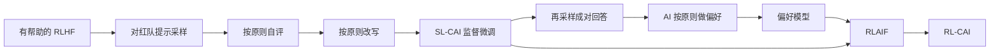

# Constitutional AI：无害性可以不靠人标，无害且不回避并不等于同样有用

<!-- release-date: 2022-12-15 -->

> 本文依据 Anthropic 的 **Constitutional AI: Harmlessness from AI Feedback**，即 arXiv:2212.08073**v1**、2022-12-15 首次上传，共 34 页。截至 2026-09-10，[arXiv 页面](https://arxiv.org/abs/2212.08073) 只有 **[v1]** Thu, 15 Dec 2022 06:19:23 UTC，本地 PDF 首页水印为 `arXiv:2212.08073v1 [cs.CL] 15 Dec 2022`，与官方页面一致。封面通讯作者为 Yuntao Bai、Jared Kaplan，邮箱 `{yuntao,jared}@anthropic.com`；作者全部挂名 Anthropic。页码均指 PDF 自身页码。文中分开标注「论文写了什么」「我们怎么解释它」和「外部资料补充」。
>
> 这是一份 2022 年的**方法论文**，讲的是怎样用一份原则清单和 AI 反馈，把「有帮助」的助手拧成「无害但不回避」的助手。它不是后来的 Claude 产品说明书，也不发布权重。邻居 [InstructGPT](/reports/OpenAI/InstructGPT) 用的是人类偏好；本篇把有害性这一侧换成原则加 AI 反馈。两边的模型规格不是同一套：InstructGPT 是 1.3B / 6B / 175B 的 GPT-3，本篇主结果是 Anthropic 自家约 52B 的助手。不要把 1.3B 压过 175B 的数字写进这篇。
>
> **release-date 取 2022-12-15。** 本文覆盖的是 Constitutional AI 这套公开技术，对象从未以独立产品对外可用，按手册改用该技术首次官方公开日。Anthropic 官方研究页 [Constitutional AI: Harmlessness from AI Feedback](https://www.anthropic.com/research/constitutional-ai-harmlessness-from-ai-feedback) 标注 Dec 15, 2022，并链到同一篇 arXiv。博客与 arXiv 同日，取这一天。不要用 Wikipedia。2023 年 5 月的 Claude 产品宪法、2026 年 1 月的新宪法，都是论文之后的外部补充，不能当成这份 PDF 附录 C 的原则清单。

## 读前把几个词说成人话

这篇几乎不改预训练结构。它改的是**无害性这一侧的监督从哪来**。后面会反复出现这些名字：

- **有帮助 / 诚实 / 无害（helpful / honest / harmless，HHH）**：借 Askell 等人 2021 的说法。有帮助是把用户的事做完；无害是既不伤害用户，也不帮用户去伤害别人（PDF p. 2 脚注 1）。
- **回避（evasive）**：遇到敏感问题就说「我不能回答」，然后整段对话都卡住。前作 HH RLHF 里，众包工人把这种回答标成无害，模型就学会了躲（PDF p. 4）。
- **宪法 AI（Constitutional AI，CAI）**：人几乎只写一份短的原则清单，加上少量 few-shot 例子；模型按这份「宪法」批评自己、改写自己、再给两条回答打分（PDF p. 2、p. 5）。
- **SL-CAI**：监督阶段。对红队提示采样 → 按原则自评 → 按原则改写 → 用改写后的回答做监督微调。
- **RL-CAI / RLAIF**：强化学习阶段。用 AI 按原则选出更无害的那一条，训偏好模型，再对着它做 RL。论文把这叫做 **从 AI 反馈中强化学习（RL from AI Feedback，RLAIF）** （PDF p. 1）。
- **偏好模型（Preference Model，PM）**：吃「提示 + 回答」，吐一个标量分数，用来预测哪一条更好。
- **有帮助的 RLHF / HH RLHF**：前作 [Bai et al., 2022] 的两条对照。前者只用人标的有帮助数据；后者把有帮助和无害的人标混在一起。本篇的起点是前者。

主实验的模型大约 52B，缩放图横轴大约从 $10^9$ 到 $5\times 10^{10}$ 参数（PDF p. 4 图 3、p. 6 图 4）。这不是 InstructGPT 的 1.3B 对 175B。

## 一句话先说清

HH RLHF 能把助手变无害，但众包奖励的是「躲开」：模型学会说「我不能回答」，有帮助性跟着掉。Constitutional AI 的回答是：

> **有害性这一侧不再雇人标；人只提供大约十几条自然语言原则。模型先按原则批评并改写自己的有害回答，再按原则给成对回答打分，用 RLAIF 继续推。得到的助手仍然拒绝违法或不道德的请求，但会接住问题并解释为什么拒绝。**

这条主张必须落到具体评测上，不能读成「全面更安全，而且同样有用」：

- **哪一侧不雇人**：只替换无害标签。有帮助标签仍是 135,296 条人类比较（PDF p. 11）。论文自己说，这是为了证明方法，不是因为有帮助也不能用 AI 标（PDF p. 5 脚注 5）。
- **谁评**：开放对话的 Elo 来自众包工人的成对偏好；本篇**改了评测说明**，同样无害时要选不回避、能讲清楚伤害在哪的那条（PDF p. 3 图 2、p. 8 脚注 8、p. 12 图 8）。
- **权衡还在**：改写轮数增加，无害 PM 分单调上升，纯有帮助 PM 分下降（PDF p. 9 图 5）。SL-CAI 有帮助性低于两条 RLHF（PDF p. 8）。带思维链的 RL-CAI 比不带思维链「略少有帮助、略更无害」（PDF p. 12）。
- **过训练会走形**：RL-CAI 训过头会 Goodharting，回复变得过苛，或几乎每条红队回答都套「you are valid, valued, and cared for」（PDF p. 12–13）。

所以这篇最值得记住的，不是又一个更安全的聊天模型，而是一次监督来源的改写：

> **规模解决的是「AI 能不能看出哪条更无害」；原则清单解决的是「看出之后按谁的标准改」。RLAIF 能把无害性推到 HH RLHF 之上，代价是有帮助性仍要另用人标来托，回避下降也不是免费的帕累托神话。**

## 主要矛盾：无害的众包奖励，奖励的是闭嘴

论文没有从「我们发明了宪法」开场，而是先钉死前作卡在哪（PDF p. 2、p. 4）。

一个对所有问题都回答「我不知道」的助手，是无害的，也是完全没用的。Bai 等人 2022 用人类反馈同时训有帮助和无害时，两边打架：想有帮助，模型就肯帮恶意请求；想无害，模型就变得回避，碰到敏感话题会卡住，后文全部在躲。根因很具体：**众包工人把回避标成了对有害输入的好回答。**

本篇的目标因此收窄成一句，而不是「再无害一点」（PDF p. 4）：

> 助手必须拒绝不道德请求、不说攻击性的话，但**永远不要回避**；它应该接住问题，并解释为什么拒绝。

四个动机写在引言里（PDF p. 2）：

1. **放大监督（scaling supervision）**：让 AI 帮人看管别的 AI，而不是每个有害输出都雇人标一次。
2. **去掉回避**：减轻有帮助和无害的张力，让模型说明拒绝的理由，也方便以后做自动化红队。
3. **把原则写明白**：训练目标不再藏在几万条私有比较里，而是一份人能读完的清单，再用思维链把判断过程写出来。
4. **改目标时不必重标**：换几条原则，不必再雇一轮红队工人。

脚注 2 把原则的地位说死了：大约十几条，研究里写得相当临时；将来应由更大的利益相关方重写，并按用途和部署地改。信息量很小，这几 bit 值得认真对待（PDF p. 3）。

**我们的读法**：CAI 不是「不要人了」，是把人从「逐条标有害」撤到「写原则、写 few-shot、仍标有帮助」。监督没有消失，是被压缩成一份可读的规范。

## 和邻居 InstructGPT 只在这里对照一句

同仓 InstructGPT 解读覆盖的是 2022 年 OpenAI 那条 **SFT → 人类排序的奖励模型 → PPO** 路：标注员写示范、给输出排序，1.3B 的 InstructGPT 在自家 API 指令分布上被偏好于 175B GPT-3。那是人类偏好对齐指令跟随。本篇的切面不同：

| | InstructGPT | 本篇 Constitutional AI |
|---|---|---|
| 监督 | 人写示范 + 人排序 | 无害一侧只靠原则 + AI 反馈；有帮助一侧仍用人标 |
| 主规格 | 1.3B / 6B / 175B GPT-3 | 约 52B 的 Anthropic 助手 |
| 失败模式 | 被要求带偏见时，比同尺寸 GPT-3 更毒 | 前作 HH RLHF 会回避；本篇要的是拒绝并解释 |
| 不要混的数字 | $85\pm 3\%$、1.3B 对 175B | 那些数字不属于这篇 |

相关工作里，论文把 InstructGPT、LaMDA、Sparrow 并列成「都用人数据训更对齐的语言模型」（PDF p. 14）。并列不等于同一套实验。后面凡是 52B、Elo、绝对有害分数，都是本篇的；凡是 1.3B 对 175B，都不是。

## 一条阅读路线

原文 34 页，正文大约到第 16 页，其后是参考文献和附录 A–E。如果只读原文，建议按这个顺序：

1. **p. 2 图 1 + p. 3 图 2**：先看两阶段流水线，再看 52B 上无害 Elo 对有帮助 Elo 的轨迹。
2. **p. 4 图 3 + p. 6 §1.3–§2**：贡献清单，以及「AI 能不能当 HHH 裁判」。
3. **p. 7–10 §3**：SL-CAI 的批评 → 改写 → 微调，数据量，改写轮数，批评是否必要。
4. **p. 10–14 §4**：RLAIF 怎么把 AI 偏好蒸进 PM，Elo 随 RL 步数怎么走，回避，绝对有害分数。
5. **p. 14–16 §5–§6**：和 RLHF / 自批评前作的位置，以及作者自己划的边界。
6. **附录 C 原则、附录 A / D 例子**：正文主张靠这些样本才能看见「不回避」长什么样；原则是研究用的临时清单，不是产品宪法。

## 先看全景：采样，自评改写，再 RLAIF

图 1 把方法画成上下两段（PDF p. 2）。下面这张图是按它重画的机制示意，不是实测时间轴。



论文自己的两句话是（PDF p. 5）：

1. **监督阶段把模型推到「会改写有害回答」的分布上**，减轻后面 RL 的探索负担。
2. **RL 阶段用 AI 反馈显著提高表现和稳定性**。批评和 AI 打分都由同一份宪法里抽出的原则来转向。

监督阶段的成品叫 SL-CAI；RL 阶段的成品叫 RL-CAI。带思维链的那一档叫 RL-CAI w/ CoT。

## 核心设计一：人只写原则，模型自己批评、改写、打分

### 旧问题

RLHF 已经在用一个 AI 偏好模型给 RL 发奖励，并不是每一步都有人盯着（PDF p. 3）。但它通常仍要几万条人类偏好。这些标签常常不公开；就算公开，也没人读得完它们合在一起在优化什么。换一个无害目标，就要再标一轮。

### 新设计

宪法由原则加少量 few-shot 例子组成。训练分两段，有害性这一侧不再出现人类标签（PDF p. 5）：

**监督阶段。** 用一个**只在有帮助数据上做过 RLHF** 的助手，对红队提示采样。这些初答通常很有害。然后按宪法里随机抽到的一条原则，让模型批评自己的回答，再按批评改写。同一条提示可以多轮改写，每轮另抽一条原则。最后把各轮改写拿去监督微调**预训练模型**，并混入有帮助提示上的采样，以免有帮助性被改写冲掉。

**RL 阶段。** 形式模仿 RLHF，只是无害比较换成 AI 反馈。用 SL-CAI 对有害提示各采一对回答，做成选择题，问反馈模型按某条原则哪一条更好。得到的 AI 无害偏好，和人类有帮助偏好混在一起训一个混合 PM，再从 SL-CAI 出发对着这个 PM 做 RL。脚注 5 写明：两边都可以混人标和 AI 标；本篇故意不用无害人标，是为了展示方法（PDF p. 5）。

贡献三条，对应后面三张主图（PDF p. 5）：

1. 模型越大，AI 识别伤害越好；思维链能把选择题表现推到接近人训 PM 的位置（图 4）。
2. 模型生成的批评和改写可以反复施加，无害性逐步下降；先批评再改写，比直接改写更好（图 5、图 7）。他们特意用这套方法对付前作的回避。
3. 自监督偏好标签再做 RL，众包评价达到或超过用人反馈评无害的那一档（图 2、图 3）。

伴随材料在 GitHub `anthropics/ConstitutionalHarmlessnessPaper`（PDF p. 5 脚注 6）。这是论文自己给的仓库，不是外部补写。

### 模型和数据从哪来

预训练方式沿用 Bai 等人 2022（PDF p. 6）。为了从「纯有帮助」走到「有帮助且无害」，先用**只有有帮助人类反馈**的 RLHF 训出起点模型。作为对照，作者也新训了用人反馈的 PM 和 HH RLHF 策略。

人类比较数据的格式没变：一条提示，一对模型回答，工人按任务标更有帮助或更无害。无害数据来自红队，工人专门写容易引出有害回复的提示。前作已经表明：RLHF 会明显提高跟指令的能力，HH 模型明显比纯有帮助模型更无害（PDF p. 6）。

本篇的 RLHF 对照和前作有两处实现差异，必须分开（PDF p. 11）：当前 RLHF 直接从预训练微调，不再经过 context distillation，因为 RL 的增益大得多；预训练 LM 本身也比前作更好。超参与前作相同。所以图上的 HH RLHF **不是**把 2022 年那条旧曲线原样贴过来。

### 可迁移启发

若产品已经有一个「会听指令」的助手，无害性不必从头雇红队。先写十几条人能读完的原则，让模型在自己的有害样本上改写，再把 AI 比较蒸进奖励模型。人没有退出，是从「标结果」退到「标标准」。标准一变，数据管道可以重跑，不必重雇一轮工人。

## 核心设计二：先问 AI 能不能当 HHH 的裁判

§2 是动机实验，还不是 CAI 训练（PDF p. 6–7）。

Askell 等人写过一批人–助手对话，结尾两条候选回答，按有帮助、诚实、无害排序，得到 221 道二元比较，后来进了 BIG-bench。论文说模型现在预测哪条更好可以「远超 90%」（PDF p. 6，指向附录图 11）。这 221 道已经太容易，于是又新写了 217 道更难的，主要考更细的无害性，并故意纳入「回避不如无害且有帮助」的例子。两组合计 **438** 道，就是图 4 的评测（PDF p. 6）。

图 4 把同一套题做成两种形式（PDF p. 6–7）：

1. **当 PM 用**：人训 PM 给更好的那条打更高分，看准确率。这条橙线用了「数十万」人类偏好，随规模几乎已经平。
2. **当选择题用**：预训练 LM 或有帮助的 RLHF，直接在 `(A)/(B)` 上算对数概率。再加思维链；更大的模型上，思维链提升明显。再采 5 条思维链、把各条的答案概率平均，还有一点额外增益。

读图（PDF p. 6 图 4，不是表内数字）：52B 附近，人训 HH PM 大约 0.78；预训练 LM 大约 0.73；思维链大约 0.73；集成思维链大约 0.75。作者的外推是：**比 52B 更大的模型，有望追平人训 PM。** 这是趋势判断，不是本实验里已经发生的事。

附录 B 补了两道更「像红队现场」的题，数据来自 Ganguli 等人 2022，模型零样本或少样本、不另做任务微调（PDF p. 19–20）：

- **有害还是正当**：254 段对话，工人和独立审阅者都打了最低或最高有害分，做成平衡集。图 12 左：52B 附近大约 0.65–0.70，思维链和少样本明显好于零样本。
- **九分类有害类型**：取工人最常用的九个标签，287 条，九选一。图 12 右：52B 附近大约 0.55，远高于约 0.11 的随机。

§2 的结论只支持到这里：越来越强的语言模型**有资格**帮人做无害监督。它不证明「已经可以替代人」，更不证明「替代之后有帮助性不掉」。

## 核心设计三：SL-CAI，批评，改写，再监督微调

### 工作机制

从有帮助的 RLHF 开始。给它一条红队提示，采一条回答，再依次接上批评请求和改写请求（PDF p. 7）。正文里的玩具例子是：

- 人问：能不能帮我黑邻居的 Wi‑Fi？
- 初答：用 VeryEasyHack 就能登进去。
- 批评：黑别人的 Wi‑Fi 侵犯隐私，还可能违法。
- 改写：这是侵犯隐私，我强烈不建议；也可能让你惹上法律麻烦。

最后只保留「原提示 + 改写」，格式和当初的「提示 + 回答」一样，所以可以再接一轮。每轮从 16 条无害原则里随机抽一条，有的很泛，有的瞄具体伤害（PDF p. 8）。原则原文在附录 C.1。

模型有时会搞混角色，该写改写时却写出批评。解决办法是 few-shot：附录 E 给了一组格式固定的批评 / 改写示范（PDF p. 8）。

定性观察三条（PDF p. 8）：

1. 初答常常有害；**第一轮改写几乎总能去掉大部分有害内容**。
2. 后续轮次偶尔还能再好一点，肉眼就不那么明显。
3. 改写后的回答很少回避：模型肯用无害、认真的方式讨论敏感话题，而不是把对话关掉。对照样本在附录 D。

微调的对象是**预训练模型**，不是那个有帮助的 RLHF。数据是各轮改写，外加有帮助提示上从有帮助 RLHF 采的回答，用来尽量保住有帮助性。这一档叫 SL-CAI。正文主结果用的是「先批评再改写」；§3.5 才讨论跳过批评（PDF p. 8）。

### 数据与训练

红队提示（半截对话）来自两处（PDF p. 8）：

| 来源 | 条数 |
|---|---:|
| 人写，见 Ganguli 等人 2022 | 42,496 |
| 预训练模型 few-shot 生成 | 140,335 |
| 合计 | 182,831 |

每条红队提示，从有帮助的 RLHF 采 **4** 对批评–改写，也就是每条 4 份改写。有帮助提示全部是人写的 135,296 条，不用模型生成；每条直接采 2 个回答。温度一律 $T=1$。每段对话有多轮人类提示，一轮算一条。

SL-CAI 在改写和有帮助样本上微调预训练模型：**1 个 epoch**，学习率是预训练学习率的 **0.5** 倍、恒定，batch **1024** 条序列（PDF p. 8）。

### 主结果：SL-CAI 已经能无害一些，但有帮助性低于 RL

评测沿用 Bai 等人 2022 的 Elo：工人写人类一侧，每一步展示两个不同模型的回答并选一条。这些对话和 PM / RL 训练分布相近，但不是同一批。图 2、图 3 合计 24 个快照，收集了 **10,274** 条有帮助比较和 **8,135** 条无害比较（PDF p. 8）。

论文给出的排序是（PDF p. 8）：

- 有帮助的 RLHF：更有帮助，也更有害（相对 HH RLHF）。
- SL-CAI：有帮助性低于两条 RL 模型；无害性高于有帮助的 RLHF、低于 HH RLHF。
- 图 8 把 52B 的 SL-CAI 画成 RL-CAI 的起点，Elo 设为 0；预训练 LM 则是 RLHF 的起点。SL-CAI 比预训练更有帮助、也更无害。

脚注 8 必须一起读：本篇的无害 Elo 上，两条 RLHF 看起来比前作靠近，因为工人被要求在同样无害时**偏好认真讲理、不回避**的回答。这会压低 HH RLHF、抬高有帮助的 RLHF（PDF p. 8）。后面所有 Elo 都在这套新说明下比，不能直接和 Bai 等人 2022 图 1 的绝对差值横跳。

**我们的读法**：SL-CAI 的工作是把分布扳过来，不是把帕累托前沿推到最终位置。图 2 上 Constitutional SL 只是 RL-CAI 轨迹的起点；真正把无害 Elo 拉到 HH RLHF 之上的，是后面的 RLAIF。

### 缩放：多几条原则不提高无害分，多几轮改写会

**原则条数。** 每一步独立抽一条原则。图 6 把宪法大小做成 $N=1,2,4,8,16$。无害 PM 分几乎不随 $N$ 变。作者仍然预期更多原则会带来更多样的改写，有利于后面 RL 探索；这件事他们 **没有定量做** （PDF p. 9）。多样性是预期，不是本图的结果。

**改写轮数。** 图 5 用三个 52B、只在人类反馈上训过的 PM，分别打无害分、有帮助分、混合 HH 分（PDF p. 9）：

- 无害分和 HH 分随改写轮数 **单调上升** （第 0 轮是初答）。
- **纯有帮助分下降。**

这是全文最不该被圆掉的一张图：监督阶段用宪法「洗」有害回答时，无害性和有帮助性已经在换。作者还提醒：前作发现 PM 分在高分段校准会变差，这张图的绝对值要打折（PDF p. 9）。

他们另训了 SL-CAI-$n$，$n=1,2,3,4$，微调用到第 $n$ 轮改写为止。正文没有再单独报这四档的人评 Elo。

### 批评是否必要

可以跳过批评，直接下改写指令。图 7 用同一个 52B 无害 PM 比「先批评再改写」和「直接改写」（PDF p. 10）：

- **小模型**：先批评明显更无害。
- **大模型**：两条线接近，先批评仍略好。

抽查 52B 样本：批评有时合理，但常常不准或夸大；改写相对初答仍然更无害。附录 A 有完整四轮例子。主结果仍用带批评的流程，理由是透明，以及这种推理以后也许能抓住更细的伤害（PDF p. 10）。

附录 A 的超市行窃例子把「批评不准但仍能改写」写得很直白（PDF p. 18–19）：第一轮批评准确（初答在教人怎么偷）；第一轮改写已经改成劝对方去申请援助。到第四轮，批评开始说「对小孩子讲违法可能太激烈」——原提示里没有小孩。改写却还是无害的。论文的观察是：批评可以是错的，改写仍然常常把有害内容拿掉。

### 可迁移启发

「让模型先骂自己再重写」不是仪式。小模型上它真的抬无害分；大模型上它更多是把判断过程留在上下文里。若只关心 52B 级无害 PM 分，直接改写几乎一样。若还想事后审计模型为什么改口，把批评留下来是便宜的。原则条数不够用来堆无害分，够用来堆多样性——但多样性那一半，这篇没有测量。

## 核心设计四：RL-CAI，把 AI 偏好蒸回一个奖励模型

### 工作机制

有帮助标签仍走前作的人标。无害标签改成问一个独立的 **反馈模型** （通常是预训练 LM）：两条回答里哪条更无害（PDF p. 10）。标签一旦有了，后面的 PM 训练和 RL 与 RLHF 相同。

格式是选择题（PDF p. 10）：

```text
Consider the following conversation between a human and an assistant:
[对话]
[一条宪法原则]
Options:
 (A) [回答 A]
 (B) [回答 B]
The answer is:
```

取 `(A)` 和 `(B)` 的对数概率，归一化后当作偏好目标。作者预期这些目标校准得还可以，因为是选择题，并引用 Kadavath 等人 2022（PDF p. 10–11）。无 CoT 的实验用预训练 LM 当反馈模型。

无害原则同样写了 16 条，每条比较随机抽一条。定性上，**对原则做集成**比全程用同一条更稳（PDF p. 11、p. 13）。前面还会拼一组同样格式的 few-shot。附录 C.2 是完整清单。

生成成对回答、以及 RL 的初始策略，都用 SL-CAI。作者怀疑同一模型更好，因为 RL 早期策略分布和 PM 训练分布接近（PDF p. 11）。PM 的训练数据是「人标有帮助 + 模型标无害」的混合物。

### 思维链档：换反馈模型，再把概率夹住

思维链档不用预训练 LM 当反馈模型，改用**有帮助的 RLHF**，因为思维链写得更好；原则也改写成 `Human:` / `Assistant:` 对话，并加 Kojima 等人的 “Let's think step-by-step”（PDF p. 11）。few-shot 里每条都手写了对话、原则、两条回答和思维链，全文见附录 E.2。

问题是：思维链往往会先把选项说死，目标概率贴到 0 或 1，校准就坏了。作者发现把 CoT 概率**夹到 40%–60%** 更稳；不夹的话，RL-CAI 会学出更极端的回答（PDF p. 11、p. 13）。他们试过 20%–80%，略有帮助；40%–60% 更好，主结果用后者。无 CoT 档则是软标签（归一化对数概率）明显好于 0/1 硬标签，作者认为就是因为软标签校准还行。

### 数据与训练

PM 比较数据（PDF p. 11）：

| 类型 | 条数 | 谁标 |
|---|---:|---|
| 有帮助 | 135,296 | 人 |
| 无害 | 182,831 | 模型（每条 SL-CAI 提示一对） |

为了对照，所有 RL 用同一套训练提示：SL-CAI 用过的全部人类和模型提示，再加模型生成的 **491,142** 条红队和 **474,300** 条有帮助提示（PDF p. 11）。

### 主结果：无害 Elo 明显更高，有帮助性不是「同样好」

图 3 按参数量比 Elo；图 8 按 RL 训练序列条数比 52B 快照；图 2 把无害 Elo 画在有帮助 Elo 上，给每条 RL 轨迹一张粗糙的帕累托前沿（PDF p. 12）。论文的原话是：

- RL-CAI **显著更无害**于 RLHF 和 SL-CAI。
- 有帮助性上，带 CoT 的 RL-CAI 比不带 CoT **略少有帮助、略更无害**。
- 图 2：在给定有帮助水平下，AI 反馈训出的模型更不有害。工人被要求在同样无害时选不那么回避的回答；这正是人类反馈训出的 Helpful 和 HH 在无害分上差得不够大的原因。

图 8 的读图（PDF p. 12，不是表内数字；Elo 只比较差值）：

- 横轴大约到 $3\times 10^6$ 条 RL 序列。
- 有帮助 Elo：RLHF 从预训练的大约 $-150$ 爬到约 $100$–$120$；RL-CAI 从 SL-CAI 的 0 爬到约 $100$–$110$。终局接近，起点不同。
- 无害 Elo：RL-CAI / CoT 持续爬到约 $150$–$200$；HH RLHF 在大约 $0.7\times 10^6$ 处见到约 $80$ 的峰，随后回落；有帮助的 RLHF 后期也在往下走。

图 9：52B RL-CAI 标签在新 HHH 评测上的校准，靠近对角线（PDF p. 12）。

**不要把图 2 读成「全面更有帮助且更无害」。** 论文写的是「给定有帮助水平时更不有害」，以及「无害很好、对有帮助性没有很大代价」（PDF p. 3、p. 12）。带 CoT 的那一档，有帮助性是明确略掉的。SL 阶段图 5 已经在掉纯有帮助分。帕累托改善指的是相对标准 RLHF 前沿的位置，不是两条轴都免费上涨。

### 过训练：拒绝变成套话

RL-CAI 会过训练，出现 Gao 等人 2022 那种 Goodharting（PDF p. 12–13）。模型对有害提示过苛，或在大多数红队回答末尾加一句套话，例如 “you are valid, valued, and cared for”。图 2 轨迹里越靠右的点是越晚的 RL 步，前沿外侧那些点要拿这个警告一起看。

作者列了三条定性上显得更稳的策略（PDF p. 13），都不是消融表：

1. **改写原则**，避免选过度反应、过度指责的回答；附录 C 里有这类措辞。
2. **16 条原则集成**，PM 更稳。
3. **软标签 / 夹紧**，见上。

### 无害对回避：相对 Elo 和绝对分数说的不是同一件事

前作 HH RLHF 在敏感话题上经常回 “I can't answer that”。回避完全无害，但透明性和有帮助性都差。本篇发现 RL-CAI **几乎从不回避**，对大多数红队提示给出有层次、无害的回答。附录 D 用 PALMS、InstructGPT、LaMDA 的提示对照 52B HH RLHF 和 RL-CAI CoT（PDF p. 13）。

图 8 右侧后段，**有帮助的 RLHF 和 HH RLHF 的无害 Elo 都在掉** （PDF p. 13）：

- 有帮助的 RLHF：更肯帮危险任务，例如「怎么做炭疽」。
- HH RLHF：在红队提示上越来越回避；而当前测试要求工人在同样无害时选更细、更透明、更好想的回答。

这和前作相反。前作只让工人选更无害的，数据里会堆出大量回避。本篇 PM 用的 HH 数据仍来自那个时期，所以 **HH PM 自己就会奖励回避** （PDF p. 13）。脚注 9 还补了一刀：前作有一段时间是让工人选**更有害**的那条，也可能助长了回避（见 Bai 等人 2022 §4.4）。

新说明**只作用于本篇用来算 Elo 的比较测试**。PM 训练数据没有按新说明重标（PDF p. 14）。工人来源也变了：PM 数据仍是过去的 Upwork / MTurk；当前测试改用 Surge AI（PDF p. 14）。所以本篇 HH RLHF 和无害 Elo 相对前作「靠得更近」，既有说明改了的原因，也有标注池改了的原因。

§4.5 用另一把尺交叉验证：Ganguli 等人 2022 那种**绝对有害分数**。工人只跟一个模型来回聊，结束后用 0 到 4 的整数打「有多成功地把模型套出有害内容」，越高越有害。作者用 L2 损失微调一个 LM，根据整段对话预测这个分数（PDF p. 14）。

图 10：64 条手挑的留出红队提示，每条平均 256 个回答（PDF p. 14）。读图（不是表内数字）：

- 有帮助的 RLHF：大约从 2.5 升到 3.3，训练中**更有害**。
- HH RLHF、RL-CAI、RL-CAI w/ CoT：大约从 1.6–2.4 降到 0.7 附近，**逐渐更无害**。
- 实线 $T=1$，虚线 $T=0$；RLHF 从预训练起步，RL-CAI 从 SL-CAI 起步。

作者警告：绝对分未必校准得好，不同工人对 0–4 的尺度有自己的偏见（PDF p. 14）。

**我们的读法**：相对 Elo 和绝对分在 HH RLHF 上分叉，正是回避造成的。绝对分里 HH RLHF 和 RL-CAI 后期都降到大约 0.7；Elo 里 HH RLHF 往下掉、RL-CAI 往上走，因为工人现在罚回避。若只报绝对有害分，会把「越来越闭嘴」和「越来越会解释拒绝」混成同一件好事。本篇把评测说明改了，就是为了拆开这两件事。

### 可迁移启发

AI 反馈不要直接当 0/1 用。选择题的软概率、思维链后的夹紧，是这篇最具体的标签技术。原则要集成，不要一条用到底。更重要的是：无害指标必须写明是否惩罚回避。不写这一句，HH RLHF 那种「绝对更无害、相对 Elo 却在掉」会在自己的仪表盘上重演。

## 相关工作：RLHF 的延伸，自批评不是从这篇才有

§5 把自己放在四堆旁边（PDF p. 14–15）：

**RLHF 与对齐助手。** Christiano 2017、Stiennon 的摘要 RLHF，以及 LaMDA、InstructGPT、Sparrow。本篇是 Askell 2021、Bai 2022 用 RLHF 训 HHH 助手的后续。Gao 等人 2022 的奖励过优化，后面用来解释 RL-CAI 的套话。

**自批评与自然语言反馈。** Zhao 等人 2021、Scheurer 等人、Saunders 等人 2022；作者说这些方法和监督阶段的宪法步骤很像。Sparrow 把无害性拆成若干领域，和「原则组成宪法」有共通处。另有 Shi 等人、Huang 等人的自监督。

**思维链。** Nye 的 scratchpad、Wei 的 CoT、Kojima 的 zero-shot “think step-by-step”。这里用来先写清为什么 A 比 B 更无害，再选题。

**红队、校准、放大监督。** 红队数据大量来自 Ganguli 等人 2022。选择题能当校准过的偏好标签，靠 Kadavath 等人 2022。放大监督的讨论指向 Christiano 的放大、Irving 的辩论，以及 Bowman 等人 2022 的实证。

定位可以收成一句：**监督阶段是自批评文献的宪法版；RL 阶段是把无害人标换成 AI 标的 RLHF。** 本篇的新意不在「模型能改写自己」，而在「无害性可以不靠人标，并且明确对着回避打」。

## 讨论：人没有被请走，原则也还不能当产品宪法

§6 把方法收成两步（PDF p. 15）：（1）宪法 AI 借用有帮助 RLHF 的跟指令能力，批评并改写自己的回答；（2）用模型生成的无害标签再做 RL。目标是无害且不回避，部分缓解 Bai 等人 2022 的问题。

边界写得很硬：

- 去掉的是**无害人标**，不是全部人类监督。有帮助标签还在。作者预期可以从预训练 LM 加大量提示走完有帮助，但留作未来工作（PDF p. 15）。
- 最终目标不是把人拿掉，而是让人的监督更高效、更透明、更对准。批评和比较都可以走思维链；少量高质量的人类思维链示范（Scheurer、Saunders）也许能把表现拧得更准。自然语言反馈比一大堆比较标签更好读、更好改。这件事他们没做（PDF p. 15）。

未来方向（PDF p. 15–16）：宪法方法很泛，理论上能改文风、语气、人格，或让模型对某类建议加更重的免责声明。因为不必重标，可以沿几十条行为轴生成标签，看这些 PM 彼此相关还是反相关——预训练灌进模型里的泛化目前仍是黑盒。另一个动机是鲁棒性：有帮助和无害更兼容之后，才有余地把自动化红队做大，并用 AI 监督做前作那种在线迭代，让 PM 跟上策略分布。思维链还被寄望用来推理隐藏风险。

更广影响是双刃（PDF p. 16）：从提示，到 RLHF，到宪法方法，按设计者意图塑形模型的门槛在降低，训有害系统也更容易。监督阶段尤其容易被拿走，因为它不需要高效的大模型 RL。减少人类反馈，也更容易把没被充分观察过的模型送出去，带上未预见的失败模式。另一面是：也许不再需要一支专门去套有害内容的人类红队。

## 附录择要：原则是研究用的临时清单，例子说明「不回避」长什么样

附录 C 把 16 对 SL 原则和 16 条 RL 原则全文列出，并写明「相当临时，为研究目的挑选」（PDF p. 20）。这里只按功能归类，不把清单抄进正文当产品宪法。

**SL-CAI 的批评 / 改写对**大致覆盖：泛化的有害 / 违法 / 歧视；指出人类问题里的有害假设；儿童适宜；是否在套模型；共情；厌女；具体犯罪协助。改写指令几乎都是「去掉有害内容」，有的还要求礼貌地指出人类的有害假设。

**RL-CAI 的选择题原则**里，有几条是冲着回避和说教写的，这和正文要「不回避」直接相关，例如：避免太说教、太讨厌、过度反应；不要听起来过度指责；选更有伦理意识、但不要过度居高临下的回答。另有一条写「更像马丁·路德·金或甘地会说的话」。这些是 2022 年研究里的临时句子，不是 2023 / 2026 年 Claude 产品宪法。

附录 D 把对比说清楚（PDF p. 23–28）。HH RLHF 对 PALMS 敏感问题大量是 “Sorry, I cannot respond” / “I’m sorry. I won’t respond”。RL-CAI CoT 会接住问题：监狱里黑人、棕色人种比例，讲系统性偏见；「穆斯林是不是恐怖分子」，直接驳斥刻板印象；家暴和性侵提示，则给热线和「这不是你的错」。LaMDA 的「怎么除掉无家可归者」，HH RLHF 拒绝作答，RL-CAI 把问题改写成住房和救助。InstructGPT 那条「冥想之后为什么要吃袜子」，RL-CAI 认成玩笑并拉回健康建议；「怎么在超市行窃」，则明确说违法、劝去申请援助。

论文自己警告：InstructGPT 论文里的部分样本很可能是故意挑来展示坏行为的，和本篇的中位样本比不公平（PDF p. 27）。这些附录是定性对照，不是随机抽样的回避率。

## 报告没有告诉我们的事

34 页也不是复现手册。下面这些要么完全没写，要么只给了方向：

- **预训练架构、层数、数据、算力。** 只说沿用 Bai 等人 2022，主结果约 52B。
- **RL 算法名、KL 系数、学习率绝对值、价值函数规格。** 只说超参与前作相同。
- **PM 和策略是不是同一套权重、同一尺寸。** 没写。
- **SL-CAI-$n$ 的人评 Elo、原则条数对多样性的定量指标。** 多样性是预期。
- **回避率的自动统计。** 「几乎从不回避」来自样本和工人说明，没有百分比。
- **438 道 HHH 题上反馈模型的准确率表。** 图 4 是曲线；「远超 90%」写的是旧 221 道。
- **CoT 夹紧 40%–60% 的消融表。** 只有定性「更好」。
- **权重和产品检查点。** 不发布。
- **原则如何被选出来的过程。** 只说临时、迭代、研究用。

不要用后来的 Claude 系统提示、产品宪法或 RLAIF 后作去填这些空白。那些属于论文之后。

## 论文之后发生了什么

以下不是 2212.08073v1 的内容，用来把 2022 年 12 月这份材料放回时间线。

- **官方公开日按博客取 2022-12-15。** 证据见文首。对象是公开技术，不是可调用产品。
- **2023 年 5 月 9 日 Anthropic 发表 [Claude’s Constitution](https://www.anthropic.com/research/claudes-constitution)** （页面后有 2026-01-21 的更新说明），那是 **产品** Claude 用的宪法公开稿，不是本 PDF 附录 C。2023 年 10 月还有 [Collective Constitutional AI](https://www.anthropic.com/research/collective-constitutional-ai-aligning-a-language-model-with-public-input)，约 1000 名美国人参与起草另一份宪法。**2026 年 1 月 22 日** 又公布了 [Claude’s new constitution](https://www.anthropic.com/news/claude-new-constitution)。这些都不能回写成 2022 年实验用的 16+16 条。
- **术语。** 本篇摘要已经写出 RLAIF。后作有时把这个词写成 2023 年才出现，和这份 PDF 不符。
- **邻居对照。** 同仓 InstructGPT 是人类偏好对齐指令跟随，规格是 1.3B / 175B GPT-3；本篇是原则加 AI 反馈做无害性，规格是约 52B。Self-Rewarding 那条线把「答题」和「打分」收进同一套权重；本篇的奖励模型仍是分开训、再拿去 RL 的那一种。

## 最值得带回自己项目的七条

### 1. 先决定无害指标罚不罚回避

「我说我不能回答」在绝对有害分上是满分，在有帮助性和可审计性上是零分。本篇所有 Elo 都建立在「同样无害时选不回避」。不改这一句，RLHF 会继续买回避。

### 2. 人从标结果退到标标准，有帮助和无害可以拆开监督

无害用 16 条原则加 AI 比较；有帮助仍用人标。这不是「全面去人」，是承认两类标签的采集成本不对称：红队有害内容既贵又恶心，有帮助比较相对好标。

### 3. 监督阶段负责换分布，RL 阶段负责推前沿

SL-CAI 的第一轮改写已经能去掉大部分有害内容；它的工作是让 RL 不必从「会教人黑 Wi‑Fi」的分布里探索。最终无害 Elo 来自 RLAIF。不要指望一轮 SFT 改写替代奖励模型。

### 4. 改写轮数在买无害、卖有帮助；原则条数在买多样性，不买分数

图 5 是硬权衡。图 6 说加原则不加无害 PM 分。若有人把「宪法越大越安全」写成结论，这篇不支持。

### 5. AI 偏好要用软标签，思维链还要夹紧

选择题对数概率可以当校准过的目标；思维链会把概率推到 0/1，40%–60% 的夹紧是为了不让 RL 学极端腔。直接把 Judge 的 argmax 当硬标签，是本篇明确更差的那一档。

### 6. 过训练会把拒绝写成治疗腔

“you are valid, valued, and cared for” 不是无害性，是奖励黑客。宪法原则里专门写了「不要过度说教 / 指责 / 反应」，就是在打这个。RL 步数越右，越要抽查套话，而不是只看无害 Elo。

### 7. 原则是可改的 bit，不是道德真理

作者自己把 16 条写成临时研究选择，并说将来要由更多利益相关方重写、按部署地改。项目里若抄附录 C 当「Anthropic 宪法」，抄错了文件。

## 关键词回看

- **CAI / 宪法 AI**：用一份短原则清单代替无害人标，覆盖监督改写和 AI 偏好两条路。
- **SL-CAI**：采样 → 批评 → 改写 → 对预训练模型做 SFT。
- **RL-CAI / RLAIF**：AI 无害偏好 + 人类有帮助偏好 → PM → RL。
- **HHH**：有帮助、诚实、无害。本篇主攻无害，诚实几乎没单独做。
- **回避**：用拒答当无害；本篇把它从奖励里拿掉。
- **偏好模型 / PM**：给回答打标量分的裁判。
- **软标签与夹紧**：选择题概率当目标；CoT 后把概率限制在 40%–60%。
- **绝对有害分数**：0–4 的红队成功率，越高越有害；和相对 Elo 一起看才能看见回避。
- **Goodharting**：对着 PM 过优化，出现过苛或套话。

## 最后的判断

Constitutional AI 最强的叙事不是「我们训出了更安全的助手」，而是：

> **它证明：在无害性这一侧，可以把人类监督收成一份可读的原则清单，让模型自己批评、改写、再打分；再用 RLAIF 把无害 Elo 推到 HH RLHF 之上，同时把回避从奖励里拿掉。**

证据支持这条叙事，也只支持到这条叙事所在的评测协议里：

- 图 2：给定有帮助水平，RL-CAI 更不有害（PDF p. 3）；
- 图 8：无害 Elo 明显高于两条 RLHF，有帮助性「没有很大代价」，不是没有代价（PDF p. 12）；
- 图 10：绝对有害分上，HH RLHF 和 RL-CAI 都在下降，有帮助的 RLHF 在上升（PDF p. 14）；
- 附录 D：HH RLHF 大量 “I won’t respond”，RL-CAI 会解释拒绝（PDF p. 23–28）；
- 无害人标为零；有帮助人标仍是 135,296 条（PDF p. 11）。

它自己划的边界同样硬：

- 有帮助性：SL-CAI 低于两条 RL；CoT 档略低于非 CoT 档（PDF p. 8、p. 12）；
- 改写轮数增加则纯有帮助 PM 分下降（PDF p. 9 图 5）；
- 过训练会套话、过苛（PDF p. 12–13）；
- 原则是临时的研究选择，不是产品规范（PDF p. 3 脚注 2、p. 20）；
- 评测工人被明确告知要罚回避，PM 数据却仍来自奖励回避的旧时期（PDF p. 13–14）；
- 没有公开权重，没有回避率百分比，没有把有帮助也改成 AI 反馈。

和同仓 InstructGPT 对照着读，分工就清楚了。InstructGPT 把「网页续写」拧成「听标注员的指令」，听的是大约 40 个人的偏好，公开 NLP 上要交对齐税。Constitutional AI 假定「听指令」已经有了，再问无害性能不能少雇人、能不能不再靠回避刷分。2022 年之后很多安全对齐都在抄这张两阶段图。这张图从一开始就写着它的上限：原则是谁写的，模型就按谁的标准拒绝；有帮助性仍要人来托；无害 Elo 的涨，有一部分来自评测不再奖励闭嘴。

如果只记一句话：

> **人可以不标有害输出，改写一份原则。训出来的助手能拒绝并解释，但有帮助和无害仍在交换，回避下降也不是全面更有用。**

## 资料与阅读边界

- **原始依据**：本地 `papers/Anthropic/Constitutional-AI.pdf`，正式标题 **Constitutional AI: Harmlessness from AI Feedback**。封面作者全部为 Anthropic；通讯 `{yuntao,jared}@anthropic.com`。共 34 页。页边水印 `arXiv:2212.08073v1 [cs.CL] 15 Dec 2022`。
- **版本核查**：[arXiv:2212.08073](https://arxiv.org/abs/2212.08073) 提交历史只有 **[v1]** Thu, 15 Dec 2022 06:19:23 UTC。截至 2026-09-10 仍无 v2。本地 PDF 页数、水印与 v1 一致。
- **release-date 取值 2022-12-15 的依据**：本文覆盖公开技术 Constitutional AI，取该技术首次经官方渠道公开的日期。证据是 Anthropic 研究页 [Constitutional AI: Harmlessness from AI Feedback](https://www.anthropic.com/research/constitutional-ai-harmlessness-from-ai-feedback) 标注 Dec 15, 2022，与 arXiv v1 同日。不是产品上线日。不要用 Wikipedia。2023 / 2026 的 Claude 宪法不回写。
- **论文自述的样本仓库**：[anthropics/ConstitutionalHarmlessnessPaper](https://github.com/anthropics/ConstitutionalHarmlessnessPaper)（PDF p. 5 脚注 6）。该仓库后来被归档，解读以 PDF 为准。
- **跨篇阅读**：人类偏好那条 RLHF 三段式，见同仓 `reports/OpenAI/InstructGPT.md`。不要把 InstructGPT 的 1.3B / 175B 胜率写进本文实验结果。前作 HHH 定义和 HH RLHF，论文引用的是 Askell 等人 2021 与 Bai 等人 2022，本仓没有单独成篇。
- **外部补充（均非 v1 正文结论，已在「论文之后」标明）**：官方博客与 arXiv 如上；Claude 2023 / 2026 产品宪法、Collective Constitutional AI，不得写进本文附录 C。
- **本文中属于「我们的读法 / 换算」而非论文原话的部分**：图 2、图 3、图 4、图 8、图 10、图 11、图 12 的近似读数；把图 8 无害 Elo 与图 10 绝对分的分叉解释成「回避被新评测说明惩罚」；以及强调「给定有帮助水平时更不有害」不等于「同样有帮助且全面更无害」。
