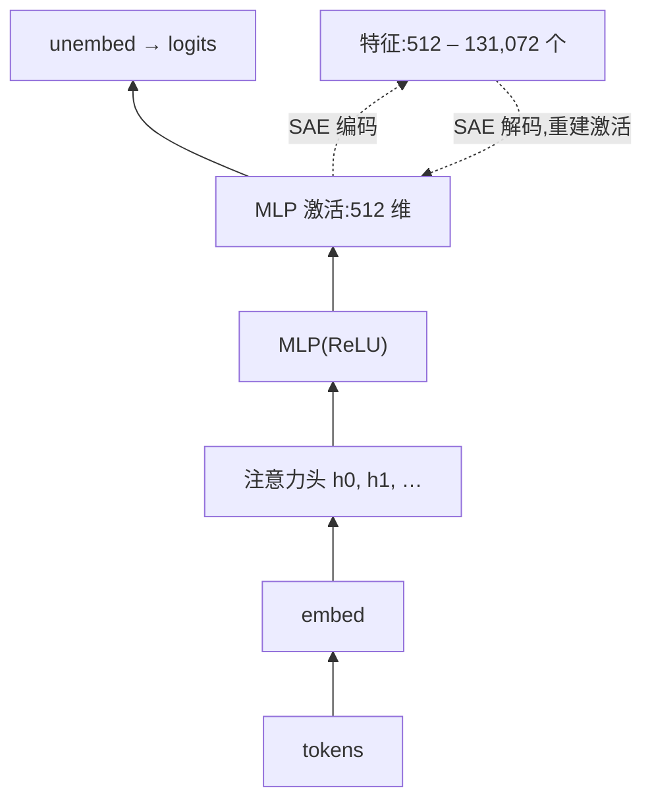
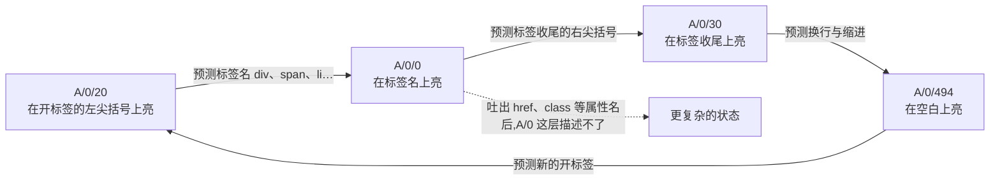

# Towards Monosemanticity：用稀疏自编码器把 512 个神经元拆成上万个单义特征

<!-- release-date: 2023-10-04 -->

> 本文依据 Anthropic 发在 Transformer Circuits Thread 上的研究长文 **Towards Monosemanticity: Decomposing Language Models With Dictionary Learning**（<https://transformer-circuits.pub/2023/monosemantic-features/index.html>），署名 Trenton Bricken、Adly Templeton、Joshua Batson、Brian Chen、Adam Jermyn 等 24 人，页面标注发布日 2023-10-04，访问日期 2026-09-24。原件是网页，没有 PDF，也没有小节编号，下文的出处一律写原文小节名（如「原文 Global Analysis 节」）。全文把三件事分开标注：**原文明确写了什么**、**我们如何解释它**、**哪些是跟进链接后的外部补充**。

## 先说矛盾：最自然的单位偏偏读不懂

机制可解释性（mechanistic interpretability）想做的事很朴素：把神经网络拆成比整体更好懂的零件，弄清每个零件干什么、零件之间怎么配合，再据此推断整个网络的行为。第一步是找对零件。

最顺手的零件是神经元。可神经元常常是**多义的（polysemantic）**：它对一堆彼此无关的输入都有反应。原文举了两个例子：视觉模型 InceptionV1 里有个神经元同时响应猫脸和汽车车头；本文研究的小语言模型里，有个神经元同时响应学术引用、英文对话、HTTP 请求和韩文（原文开篇）。只盯着单个神经元，你没法说「它在干什么」。

多义从哪来？一个候选解释是**叠加（superposition）**：模型要表示的独立「特征」比它的神经元多，于是给每个特征分配一个神经元的线性组合，也就是激活空间里的一个方向。把所有特征方向摆在一起，它们构成一组**过完备（overcomplete）** 的基：方向数多于维数。这之所以可行，是因为特征大多是**稀疏的**，同一时刻只有少数几个在场，彼此干扰有限。

图引自原文 Problem Setup 节下的 Superposition Hypothesis 小节。原文的说法是：小网络利用特征稀疏和高维空间的性质，**近似地模拟**一个更大、更稀疏的网络（原文 Superposition Hypothesis 小节）。这是假说，不是本文要证明的东西；本文要做的是反过来：既然模型把特征叠在了少数神经元上，能不能事后把它们拆出来？

> **跟进伴随篇的背景（外部补充）**：叠加的系统论证在同一作者群 2022-09-14 发表的 Toy Models of Superposition（<https://transformer-circuits.pub/2022/toy_model/index.html>）。它把「特征是激活空间中的方向」拆成两条性质：**可分解**（表示能拆成可以独立理解的特征）和**线性**（特征用方向表示）；再指出两股相反的力：**特权基（privileged basis）** 让特征倾向于对齐神经元，**叠加**把特征推离神经元。它的「Strategic Picture」一节列出三条出路：① 训练出没有叠加的模型；② 在有叠加的模型上找一组过完备基来描述特征；③ 混合路线，先改模型、再让第二阶段更容易找到那组基。Towards Monosemanticity 就是在这张地图上押了第 ② 条。

## 一句话结论

在一个只有一层、MLP 只有 512 个神经元的 Transformer 上，作者用**稀疏自编码器（sparse autoencoder，SAE）** 把 MLP 激活拆成 512 到 131,072 个特征，重点分析其中 4,096 个特征的那一次（叫 A/1）。四条证据线都指向同一个结论：**拆出来的特征比神经元单义得多**。具体是四个特征的逐项检验，外加人工打分、按激活的自动可解释性评分、按 logit 的自动可解释性评分三项全局评估。特征还能因果地驱动输出（把阿拉伯文特征钉高，模型就开始吐阿拉伯文），在另一个随机种子训练的模型里能找回几乎同一个特征，而且会随字典变大「分裂」成更细的家族（原文 Summary of Results）。

它没有解决的，作者也写得很清楚：没有可信的指标判断字典学得好不好；只找回了 MLP 损失贡献的 79%（A/1）到 94.5%（最大那次）；一层模型的结论能不能搬到前沿模型，是下一步的工程问题（原文 How much of the model does our interpretation explain 与 Future Work 两节）。

### 一条阅读路线

原文很长，还配了大量交互图。只有半小时的话，建议按这个顺序读：

1. **Problem Setup 节**：看 SAE 接在哪、为什么不走「改架构」那条路。
2. **Detailed Investigations of Individual Features 节的阿拉伯文特征**：一个特征要过哪五关，这一套论证是全文的骨架；DNA、base64、希伯来文三个特征是同一套路的重复。
3. **Global Analysis 节**：人工打分与两种自动评分，回答「挑出来的好例子之外，典型特征怎么样」。
4. **Phenomenology 节**：特征分裂、普遍性、「有限状态自动机」。这是作者从特征里读出的关于模型本身的东西。
5. **Discussion 节**：对叠加理论的修正，以及 token-in-context 特征到底是不是真的。

附录里的 SAE 训练建议（重采样、预编码偏置、不绑权重）是想自己复现的人必读的，第一遍可以跳过。

## 一、为什么不直接训一个没有叠加的模型

最干净的办法似乎是：训练时就逼模型不要叠加，让每个神经元只管一件事。作者说他们花了大量时间试这条路，结论是它**根本上行不通**（原文 Why not use architectural approaches 小节）。

他们一路把激活稀疏性推到每次只有一个神经元激活（1-hot 激活），叠加确实没了，但神经元**仍然是多义的**。原因不在叠加，而在交叉熵损失本身。原文用一个一神经元的玩具例子讲清了这一点：

设数据里有四个互斥的特征 A、B、C、D，出现概率各 1/4，每个特征对应一个正确的下一个 token。唯一的神经元只能「亮」或「不亮」，亮时输出一个下一 token 的概率分布。

| 方案 | 神经元在什么时候亮 | 平均交叉熵 |
|---|---|---|
| 单义 | 只在 A 时亮，亮时准确预测 A；不亮时在 B/C/D 上均匀猜 | $\frac{3}{4}\ln 3 \approx 0.8$ |
| 多义 | A 或 B 时都亮，亮时在 A/B 上均匀猜；不亮时在 C/D 上均匀猜 | $\ln 2 \approx 0.7$ |

多义方案损失更低，所以模型会选它，**哪怕没有任何叠加**。把稀疏推到极限只剩一个神经元在亮，这一个神经元照样有动机多义（原文同小节）。作者据此判断：用交叉熵训练的语言模型，一般宁可多义地表示更多特征，也不愿单义地表示更少的「真特征」，所以靠改架构造不出完全单义的语言模型。

这里有个巧妙的对照：同一篇文章里，事后拆解用的 SAE 恰恰是用**均方误差（MSE）** 训练的，而 MSE 对单义和多义表示可以给出同样的损失，不会像交叉熵那样奖励多义（原文同小节）。所以稀疏约束能在学出来的字典里压住叠加，不至于「叠加一路叠到底」。

**对自己的项目有什么用**：想让表示可解释时，先看训练目标会不会奖励「一个单元兼任多件事」。交叉熵会，这一点靠架构正则化扭不过来；把可解释性放到事后分解那一步，换一个不奖励多义的目标，路反而通。

## 二、SAE 怎么拆：一个比 MLP 大 8 倍的「反向 MLP」

### 2.1 接在哪、拆什么

被研究的模型是一层 Transformer：残差流 128 维，MLP 中间层 512 维，激活函数 ReLU，在 The Pile 上训练 1000 亿 token（原文附录 Transformer Training and Preprocessing）。用 The Pile 而不是内部数据，是为了让实验可复现。作者用同样的超参数、不同的随机种子训了两个这样的模型，主角叫 A，另一个叫 B，B 专门用来检验「特征是不是普遍的」（原文 The (one-layer) model we're studying 小节）。

SAE 拆的就是那 512 维 MLP 激活（ReLU 之后）：

图为机制示意，根据原文 Problem Setup 节开头的结构图重画。为什么选一层模型，原文给了三条理由：一层模型的「真特征」可能更少，小字典就可能覆盖全；一层模型很便宜，可以大幅过训练，作者猜想训练 token 越多，叠加里的表示越干净；特征对 logits 的作用近似线性，下游效应好分析。第三条同时也是软肋：线性结构让「特征是线性的」这一假设在这里更容易成立，结论推广到多层模型的把握也就更小。作者引用了其他人在多层 Transformer 上用 SAE 同样找到可解释线性特征的工作，作为旁证（原文同小节）。

### 2.2 编码器、解码器与损失

把一个数据点的 MLP 激活记作 $\mathbf{x}$（512 维）。SAE 先减掉一个偏置，再过一层带 ReLU 的宽线性层得到特征激活，最后用一层线性层加回偏置重建（原文附录 Autoencoder Architecture）：

$$\begin{aligned} \bar{\mathbf{x}} &= \mathbf{x} - \mathbf{b}_d \\ \mathbf{f} &= \mathrm{ReLU}(W_e \bar{\mathbf{x}} + \mathbf{b}_e) \\ \hat{\mathbf{x}} &= W_d \mathbf{f} + \mathbf{b}_d \end{aligned}$$

- $\mathbf{f}$ 就是学到的特征激活，维数 $m$ 远大于输入维数 $n = 512$。
- 解码器 $W_d$ 的每一列是一个特征的**方向**，被约束成单位长度；原文把解码器叫作「字典」。
- 编码器 $W_e$ 可以看成「更强的稀疏编码算法」的一个线性、摊销（amortized）近似：不用对每个数据点单独求解，一次矩阵乘就出结果。

损失是重建误差加特征激活的 $L_1$ 惩罚：

$$\mathcal{L} = \frac{1}{|X|}\sum_{\mathbf{x}\in X} \lVert \mathbf{x} - \hat{\mathbf{x}} \rVert_2^2 + \lambda \lVert \mathbf{f} \rVert_1$$

均方误差负责「拆完还能拼回去」，$L_1$ 负责「每次只让少数特征亮」，$\lambda$ 是两者的权衡系数（原文附录同处）。换句话说，每个激活向量都被写成「一小撮特征方向的加权和再加一个偏置」，这正是经典的稀疏字典学习（sparse dictionary learning）。

### 2.3 为什么用「弱」算法

过完备字典学习本来是个很难的问题：给定特征方向，要从 512 维的投影里反推出几千维的稀疏系数，等于求一个很「扁」的矩阵的逆。能做成的唯一原因是目标向量稀疏，这就是压缩感知（compressed sensing），其精确形式是 NP 难的（原文 Using Sparse Autoencoders To Find Good Decompositions 小节）。

作者试过一些经典字典学习方法，最后选了更简单的 SAE，理由有两条（原文同小节）：

1. **能扩到大数据**。刻画一个在海量语料上训练的模型，需要海量激活；这里 SAE 训练用了 80 亿个数据点。
2. **不要太强**。迭代式字典学习可能「太强」，能从激活里恢复出**模型自己都用不到**的特征；神经网络显然不会去解 NP 难问题。SAE 的结构和语言模型的 MLP 层很像，恢复能力也就和模型相当。

**我们如何解释**：第 2 条是整篇方法论里最值得记住的一句。可解释性工具的目标不是「从激活里榨出最多信息」，而是「找到模型自己在用的那组变量」。工具太强，会把数据里的相关性当成模型的计算。

### 2.4 训练细节：数据量、死神经元和几处改动

附录的「训练建议」写得很实在（原文附录 Advice for Training Sparse Autoencoders 三小节）：

- **数据**：在 The Pile 的 4000 万个上下文上跑模型，每个上下文采 250 个 token 的 MLP 激活，打乱后组成约 100 亿条的数据集；批大小 8192，**不放回**采样（不重复看数据很重要），训 100 万步，用掉 80 多亿条。作者说数据越多，特征主观上越「锐」。
- **预编码偏置**：输入先减 $\mathbf{b}_d$、输出再加回，两者绑定，初始化为数据集的几何中位数；玩具实验里没有它 SAE 就学不对。
- **编码器与解码器不绑权重**：相近特征的字典向量很像，编码器向量却会被刻意「错开」一点，用来区分彼此、减少串扰。
- **重采样死神经元**：在第 25,000、50,000、75,000、100,000 步，找出前 12,500 步里从没亮过的 SAE 神经元；按当前重建损失的平方给输入加权抽样，把抽中的输入归一化后作为死神经元的新字典向量，编码器向量缩到存活神经元平均范数的 0.2 倍，偏置清零，并重置 Adam 状态。目的是在 SAE 最拟合不好的地方播下新特征，同时让新特征一开始只弱弱地亮，少干扰别人。作者承认它仍会引起损失尖峰，重采样太频繁还会发散。
- **学习率**：低学习率配足够多步，损失更低、「真」特征更多；退火没有额外收益。
- **Adam 与单位范数的冲突**：每步之后把字典向量硬拉回单位长度，会让 Adam 用的梯度和真实梯度对不上。改为更新前去掉与字典向量平行的梯度分量，总损失有小而确定的下降。

### 2.5 没有好指标，只能几样一起看

最让人不安的一点，作者放在了正文而不是附录：**他们找不到一个可信的指标来判断 SAE 学得好不好**（原文 How can we tell if the autoencoder is working 小节）。

他们先试了「总信息量」这类基于信息论的指标，结果它和主观可解释性、激活稀疏度都不相关：平均 $L^0$（每个 token 上非零特征数）上百但重建误差低的一次，总信息量反而可能更低。最后只能组合着看：

| 信号 | 看什么 |
|---|---|
| 人工检查 | 特征看上去可不可解释 |
| 特征密度 | 活着的特征有多少、各自在多大比例的 token 上亮 |
| 重建损失 | SAE 重建的 MLP 激活准不准 |
| 玩具模型 | 已知真值的玩具模型上 SAE 能不能找回特征 |

附录的超参数选择也是一堆代理指标：$L^0$ 一般压在 10 或 20 以下，$L^0$ 占到激活维数的可观比例时特别不信任；密度超过 1% 的特征多了，通常说明 $L_1$ 系数太小（原文附录 Hyperparameter Selection）。

**对自己的项目有什么用**：一个方法没有好的总指标时，老实地用几个互相牵制的代理指标一起盯，比硬造一个单一分数更可靠；这篇连「我们在摸黑走路」都写进了 Future Work。

## 三、一个特征要过五关：以阿拉伯文特征为例

全文最重要的主张是「字典学习能找到比神经元单义得多的特征」。作者先在四个激活场景非常明确的特征上逐项论证：阿拉伯文、DNA 序列、base64 字符串、希伯来文（原文 Detailed Investigations of Individual Features 节）。每个特征都要回答五个问题：

1. **特异性**：特征亮的时候，那个场景通常在吗？
2. **敏感性**：场景在的时候，特征通常亮吗？
3. **下游效应**：特征会不会引起合乎解释的输出变化？
4. **不是某个神经元**：它是不是恰好就是一个本来就单义的神经元？
5. **普遍性**：在另一个模型上做字典学习，能不能找到相似的特征？

前三条需要一个「标准答案」。作者给每个场景造了一个**计算代理（computational proxy）**：一个字符串在该场景假设下的概率与在全体数据分布下的概率之比，取对数，即 $\log\big(P(s\mid\text{场景}) / P(s)\big)$。$P(s)$ 用 token 的一元分布连乘估计；DNA 当作 [ATCG] 各 1/4 的随机串，base64 当作 64 个字符各 1/64 的随机串；阿拉伯文和希伯来文按字符所属的 Unicode 区段判断（原文附录 Feature Proxies）。之所以用对数似然比，是因为特征对 logits 线性起作用，作者认为它天然有动机去追踪对数似然。

图引自原文 Detailed Investigations of Individual Features 节开头。作者特别强调**特异性比敏感性更重要**：多义的典型形态是「在不相干的概念上都亮」，证明特征只在一个稀有而具体的场景里亮，就排除了这种形态。他们也坦白这四个特征是**挑出来的**，因为好造代理；「奇幻游戏」这类特征没法写代理，只能留给下一节的全局评估（原文同节）。

### 3.1 特异性：阿拉伯文只占全部 token 的 0.13%，却占它亮起时的 81%

主角是 A/1/3450，它对阿拉伯文、波斯文、乌尔都文这些使用阿拉伯字母的文本有反应（原文 Arabic Script Feature 小节）。命名规则顺便说一下：「A/1/3450」读作「模型 A、字典学习第 1 次运行、第 3450 号特征」；神经元写作「A/neurons/489」（原文 Notation for Features 小节）。

图引自原文 Activation Specificity 小节。数字：阿拉伯文只占训练 token 的 0.13%，却占这个特征亮起时 token 的 81%；这一比例从刚亮时的 25%，升到激活超过 5 时的 98%（原文同小节）。

弱激活段为什么混了蓝色？作者给了三种可能，没有下定论：① 代理不完美，空白、标点这些共享字符不在阿拉伯文 Unicode 区段里，被代理判成非阿拉伯文，图里就有一个换行符被特征激活却被代理打低分；② 模型不完美但校准得好，弱激活本就代表「不太确定」；③ SAE 不完美，字典宽度小于模型的真特征数时，没学到的特征会以弱激活的形式散落在许多已学到的特征上（原文同小节）。不管哪种，强激活对预测的影响更大，所以强激活段解释对了最要紧。原文又画了一张按激活值加权的分布图（「期望值图」），显示这个特征贡献的激活总量绝大部分来自阿拉伯文样本。

一个与分词有关的细节：很多阿拉伯字符会被 BPE 拆成两个 token（ث 被拆成 `\xd8` 和 `\xab`），A/1/3450 通常只在字符的**最后一个** token 上亮（原文同小节）。

### 3.2 敏感性：缺口由兄弟特征补上

A/1/3450 并不对所有阿拉伯文 token 都亮。例如相当于英语「the」的前缀「ال」（al-），它就不亮，恰好在这些位置亮的是另一个阿拉伯文特征 A/1/3134；拆开的字符里，A/1/3450 亮在最后一个 token，A/1/3399 亮在第一个 token（原文 Activation Sensitivity 小节）。所以敏感性的缺口，常常是被更窄的兄弟特征分走了，这正是上图右边那种情况。

综合特异性与敏感性，在 4000 万个 token 上，特征激活与代理（在 0 处截断）的 Pearson 相关是 0.74（原文同小节）。

### 3.3 下游效应：关掉它伤阿拉伯文，钉高它就吐阿拉伯文

SAE 只看过 MLP 激活，从没看过激活之后发生了什么。所以如果特征的下游效应也合乎解释，就说明它连着模型的功能，而不只是数据里的一种相关性（原文 Feature Downstream Effects 小节）。作者用了三种办法：

- **logit 权重**：把特征方向依次乘以 MLP 输出矩阵、LayerNorm 的线性近似、反嵌入矩阵，得到它对每个输出 token 的线性影响（$d_i W_{down} \pi L W_{unembed}$），并平移到中位数为 0。分布有一个在 0 附近的大主峰，远右侧另有一个小峰，里面正是阿拉伯字符，以及 `\xd8`、`\xd9` 这些阿拉伯字符 UTF-8 编码的前半截。
- **消融**：在整段上下文里把这个特征的激活减掉（设为 0），再跑完前向。结果是阿拉伯文 token 的预测都变差了，唯一变好的是句号这类与其他文字共享的标点；特征越亮，影响越大。
- **钉住采样（pinned sampling）**：给模型前缀 `1,2,3,4,5,6,7,8,9,10`。正常情况下它续写数字和逗号；把 A/1/3450 钉在观测到的最大值后，续写变成了一串阿拉伯文。

三种证据指向同一个方向：这个特征不只是「对阿拉伯文亮」，它还**让模型输出阿拉伯文**。

### 3.4 它不是某个神经元

找神经元时，只有一个神经元的前 20 个最强激活样本里带阿拉伯文，而且只有 1 条，其余 18 条是英文、1 条是西里尔文。把特征方向在神经元基上展开：绝对值最大的三个系数**全是负的**，绝对值不小于 0.1 的系数多达 27 个（原文 The feature is not a neuron 小节）。

与特征激活最相关的神经元是 A/neurons/489。它对多种非英语语言都有反应，阿拉伯文只占其中薄薄一片。作者认为这很合理：不同语言基本互斥，天然适合叠在同一个神经元上。这个神经元的 logit 权重里也混着俄文和韩文 token（原文同小节）。结论是：**只看神经元，这个阿拉伯文特征实际上是隐形的**。

### 3.5 普遍性：换一个种子训练的模型里也有它

在模型 B 的字典（B/1）里，找与 A/1/3450 激活相关最高的特征（在 4096 万个 token 上算 Pearson），得到 B/1/1334，相关 0.91；它同样只对阿拉伯文亮，在 0–1 的低激活段甚至更干净（原文 Universality 小节）。两者 logit 权重的相关只有 0.23：阿拉伯文 token 在两边都被上调，但大量其他 token 的权重像各向同性的噪声。作者的解释是，这团噪声是**权重干扰（weight interference）**：模型本想让这些权重为 0，但叠加让别的特征的权重漏了进来；共享的离群峰才是要紧的观察。

### 3.6 另外三个特征：同一套路，各有细节

| 特征 | 场景 | 与代理的相关 | 与最相似神经元 | 模型 B 里的对应特征 | 值得注意的细节 |
|---|---|---|---|---|---|
| A/1/2937 | DNA 序列 | 0.8（二值化代理） | A/neurons/67 的激活样本里 DNA 只占一小片 | B/1/3680，相关 0.92 | 它是唯一专管 DNA 的特征；代理比特征更窄，带空格的三联体、`5'-` 这种前缀会漏掉，特征却照亮；长 DNA 串到末尾时，它是唯一还亮着的特征 |
| A/1/2357 | base64 字符串 | 0.38 | A/neurons/470，相关 0.18，还对代码、HTML、URL 片段亮 | B/1/2165，相关 0.85 | 相关低主要怪代理太宽：十六进制串也会让代理亮，但它们归另一个特征 A/1/3817 管；logit 峰比阿拉伯文更连续，因为 `fr` 这类 token 既是法语缩写也是 base64 片段 |
| A/1/416 | 希伯来文 | 0.55 | A/neurons/489，相关 0.1；没有任何神经元的前列样本里有希伯来文 | B/1/1901，相关 0.92 | 部分敏感性缺口由 A/1/1016 分走，它亮在 `\xd7` 上，预测补全希伯来字符的后续字节 |

数字均引自原文 DNA Feature、Base64 Feature、Hebrew Feature 三个小节。

**对自己的项目有什么用**：要主张「这个内部单元代表 X」，至少要同时拿出特异性、因果效应、与现有基底的区分、跨种子可复现这几条，只看最强激活的样本不够。「造一个可计算的代理，再按激活强度分档对照」这个套路，可以直接搬到探针、路由器、专家分工这类分析上。

## 四、挑出来的好例子之外：典型特征怎么样

上一节的四个特征是挑过的。全局分析要回答的是随手抽一个特征，它可不可解释（原文 Global Analysis 节）。先说明样本口径：A/1 的 4,096 个特征里，168 个是**死特征**（在 1 亿个样本上从未亮过），292 个是**超低密度特征**（亮的频率不到百万分之一，且有其他异常性质），这两组都被排除在后续分析之外。

### 4.1 三种评估，结论一致

作者特意避开了以往工作的一个弱点：只看最强激活的样本。很多多义神经元只看顶端样本像是单义的，往下看才露馅。所以人工和自动评估都**在整个激活谱上均匀抽样**：把 0 到最大激活均分成 11 个区间，每个区间分别抽样、分别打分（原文 Manual Human Analysis 小节）。

图引自原文 Manual Human Analysis 小节。人工打分由作者之一 Adam Jermyn 盲评，满分 14 分：解释的把握 0–3 分、强激活 token 与解释的一致性 0–5 分、正向 logit 与解释的一致性 0–3 分、一致与不一致的 logit 之间有没有明显的效应差 0–1 分、解释的具体程度 0–3 分（原文附录 Feature Interpretability Rubric）。作者主观上认为 8 分以上就相当可解释。共打了 162 个特征和神经元的 412 个激活区间，样本不大，因为人工太费时。

三种评估的结果放在一起：

| 评估方式 | 做法 | 特征 | 神经元 |
|---|---|---|---|
| 人工打分（区间级） | 盲评者按 14 分量表给每个激活区间打分 | 中位 12，均值 11.2 | 中位 0，均值 3.2 |
| 自动可解释性：激活 | Claude 看样本写解释，再只凭解释预测没见过的 token 的激活；算预测与真值的 Spearman 相关 | 中位 0.58，均值 0.53（3,676 个特征） | 中位 0.2，均值 0.2（512 个神经元） |
| 自动可解释性：logit | 用同一条解释判断一个没见过的 token 是不是该特征会上调的下一个 token；一半取自正向 logit 前列，一半随机，瞎猜为 50% | 平均 74% | 平均 58% |

人工一行引自原文 Manual Human Analysis 小节的图；激活一行的数字读自原文 Automated Interpretability – Activations 小节的直方图；logit 一行引自原文 Automated Interpretability – Logit Weights 小节。附录另给了 logit 评估的中位数：特征 0.74，神经元 0.53，随机权重模型 0.5（原文附录 Automated Interpretability）。

自动评估的流程沿用 OpenAI 的 Bills 等人（外部补充：*Language models can explain neurons in language models*，2023-05-09）的「解释、模拟、打分」三步，但有两处改动（原文同小节与附录）：

- **抽样口径**：Bills 等人在「最强样本加随机样本」的混合上算相关。对稀疏特征来说，随机样本里它几乎不亮，这等于只考「能不能把强激活和 0 区分开」。这里改成在整个激活谱上取样。
- **防泄漏**：写解释用 49 个样本（最强区间 10 个、其余 12 个区间各 2 个、完全随机 5 个、最强 token 放到别的上下文里 10 个），预测用另外 60 个样本、每个 9 个 token，共 540 次预测；预测时看不到任何真实激活，只能看到解释。激活按 Bills 等人的做法量化到 0–9。

附录还交代了一个反例：用「重要性加权」把抽样偏差严格纠正回来后，由于特征密度通常只有 $10^{-3}$ 到 $10^{-6}$，权重几乎全压在特征不亮的随机样本上，于是「总是猜 0」的过窄解释反而得高分。平均而言，特征在随机样本上 88% 的真实激活为 0，神经元是 54%（原文附录 Importance Scoring）。**所以这里的相关数字是「谱上均匀抽样」口径，不是「真实分布」口径**，二者不能混比。

### 4.2 越弱的激活越难解释

按区间看，强激活区间几乎都与总体解释一致；不少特征在整条谱上都一致，也有一些只在上面约 60% 的激活范围内一致，再往下就迅速变得难解释（原文 Activation Interval Analysis 小节）。作者提出一个值得警惕的解释：学到的特征可能与「真」特征有一个小夹角，这种偏差首先在弱激活区露馅。

两条自我设限的注意事项（原文 Caveats 小节）：大多数激活落在较弱、较难解释的区间，但特征对输出的作用主要来自强激活，而强激活是可解释的；评估的特征是均匀抽的，重要性可能与可解释性相关，作者的感觉是最重要的特征只会更可解释。

### 4.3 拆出来的特征能解释多少模型

这是作者自认「最答不好」的问题（原文 How much of the model does our interpretation explain 小节）。一种部分回答：用 SAE 的重建替换 MLP 激活，看损失上升多少，再除以「直接把 MLP 置零」带来的损失上升。A/1 恢复了 MLP 所带来的对数似然损失下降的 **79%**；最大的 A/5（131,072 个特征，$L_1$ 系数 0.004）恢复 **94.5%**。

作者给这两个数加了三层保留：

- 「损失的百分比」这个问法本身可能误导：特征大概是长尾分布，解释得越多，剩下的残差需要越来越多的特征才能覆盖。
- 特征并非完全单义，弱激活里可能藏着多义，也不是每个都干净可解释。
- 附录补充说「MLP 置零」可能是个特别差的基线，所以这个百分比偏高；临时实验显示，从头训一个带小 MLP 的 Transformer 也能达到相近的百分比（原文附录 Hyperparameter Selection）。

附录还有一张图，把 $L^0$ 与解释比例画成一条权衡曲线：同一 $L_1$ 系数下，字典越大，两者一起上升；$L_1$ 系数越小，曲线越往高 $L^0$、高解释比例的方向走。

更好的办法是用自动可解释性直接「模拟」一层：用解释预测出的激活去替换真实激活。但作者估算过，按当时价格，模拟 10 万个特征在一段 4096 token 上下文上就要 12,500–25,000 美元，还得评估许多上下文（原文同小节）。

### 4.4 特征反映的是模型，还是数据

激活同时反映数据分布和模型对它的变换。模型前半截（到 MLP 为止）可能只是把数据里的相关性投影了一下，SAE 学到的也许就是这种投影（原文 Do features tell us about the model or the data 小节）。作者做了一个对照：把训练好的模型 A 的每个权重矩阵的元素**随机打乱**，保持权重分布不变、只破坏结构，再在它上面做同样的字典学习。结果是大量「单 token 特征」（span、file、句号、nature）加上一些在 LaTeX、代码这类宽泛场景里乱亮的特征，除了单 token 特征之外，作者都没法给出说得通的解释。附录补充：在自动评估里，随机模型的中位分反而更高，但那是因为它的单 token 特征特别多、特别好猜；剔除单 token 那一簇后，随机模型的特征分布与多义神经元相近（原文附录 Randomized Transformer）。

下游效应则是另一道保险：logit 权重、消融、钉住采样都不是 SAE 的训练输入，它们合乎解释，只能说明特征被模型用上了。

**对自己的项目有什么用**：任何「从激活里读出结构」的方法，都该配一个随机权重对照，否则分不清读到的是模型还是数据。另外，自动评估的抽样口径决定了分数的含义，报数时要把口径写在数字旁边。

## 五、特征告诉了我们模型的什么

分解只是手段。Phenomenology 节转向用特征读模型本身（原文 Phenomenology 节）。作者说最好的办法是直接去翻他们发布的交互界面：90 次字典学习运行的全部特征，都有激活样本、logit 效应和消融结果。正文则只讲抽象的规律。

### 5.1 常见形态：上下文特征与「token-in-context」特征

最常见的是**上下文特征**（如 DNA、base64）和 **token-in-context 特征**（如数学文本里的「the」、HTML 里的「<」）。作者的理论解释是：注意力头大致实现「三点函数」（两个输入一个输出），MLP 则适合实现多个 token 的合取，上下文特征和 token-in-context 特征是它的极端形态（原文 Feature Motifs 小节）。让他们意外的是数量：在 A/4 里，主要响应不同上下文中「the」的特征就超过 100 个。

还有类似三元组（trigram）的特征，比如预测 COVID-19 里「19」的 A/2/12310：这本可以只靠注意力实现，模型实际上也动用了 MLP。

一层模型的每个特征都可以同时读成**输入特征**和**动作特征**：base64 特征既「在 base64 上亮」，也「提高 base64 的概率」。动作视角能解释一些怪现象：A/0/341 预测数学文本里的名词短语（上调 denominator、latter 这类词），所以它最强地亮在「the」上，但在 special、this 这些后面同样接名词短语的词上也会亮（原文同小节）。

### 5.2 特征分裂：同一片领地，字典越大切得越细

字典从 A/0 的 512 个特征，到 A/1 的 4,096 个，再到 A/2 的 16,384 个，专管 base64 的特征从 1 个变成 3 个，再变成很多个，作者称之为**特征分裂（feature splitting）**（原文 Feature Splitting 小节）。把三次运行的特征方向（解码器列，512 维）一起用 UMAP 投到平面上：

图引自原文 Feature Splitting 小节。概念上相近的特征，字典向量的夹角也小，定性的「家族」在几何上真的聚在一起。

base64 那次分裂最有意思。A/0 里只有一个 A/0/45，在所有 base64 token 上都亮；到了 A/1，它分成三个，激活合起来大致覆盖原来那一个（原文 Features which seemed like Bugs 小节）：

| A/1 特征 | 偏好 | 为什么要分出来 |
|---|---|---|
| A/1/2357 | base64 里的字母 | 常规的 base64 续写 |
| A/1/2364 | base64 里的数字 | 它预测数字的 logit 权重低得多。因为 BPE 会把连续数字合成一个 token，`[Bq][8][9][mp]` 永远不会出现，只会是 `[Bq][89][mp]`；当前 token 是单个数字，就说明下一个 token 不是数字 |
| A/1/1544 | 编码了 ASCII 文本的 base64 | 线索是它特别偏爱 `ICAgICAg`，这正是 6 个空格的 base64 编码；它的顶端样本里能解码出 ASCII 子串，另两个特征的顶端样本里没有 |

表格根据原文同小节的图与正文改写。作者的感慨是：谁能想到模型不只有 base64 特征，还会区分不同种类的 base64？自顶向下地「找我们预期的东西」，是找不到这种特征的。

数学与物理那组例子展示了分裂不只是一棵树。A/0 里两个技术写作特征，到 A/2 细分成「机器学习里的 the」「拓扑与抽象代数里的 the」「场论里的介词」等；分裂过程中既有拆分也有合并，结构比树复杂（原文 Example: Mathematics and Physics Features 小节）。更细的特征连预测也更细：泛数学的 A/0/341 上调 denominator、remainder、theorem；机器学习版的 A/2/15021 上调 dataset、classifier；抽象代数与拓扑版的 A/2/4878 上调 quotient、subgroup；场论版的 A/2/2609 上调 gauge、Lagrangian、spacetime。作者用来画这张图的相似度，是两个特征在其中一方亮着的 token 上的激活余弦相似度（取两个方向的较大值），阈值约 0.4。

作者据此提出一个猜想（原文 Feature Splitting 小节）：存在一组理想的「真特征」，字典无限大时就能全部拿到；真特征往往成簇，被模型紧紧地叠在一起；字典有限时，学到的特征用更粗的粒度去覆盖同一片领地，代价是没那么专一。按这个图景：

- 「字典该有几个特征」这个问题没有看上去那么要紧，不同大小的字典只是同一对象的不同**分辨率**；
- 小字典可以当大模型特征的「摘要」，先看粗粒度的行为类别，再用细字典钻细节；
- 小字典里那些像 bug 的特征也有了解释。例如只在某个 token 上亮、而且在它每次出现时都亮的**单 token 特征**：模型本可以用二元统计实现同样效果，没理由为它占用 MLP 容量；实际上它是许多「不同上下文里的 P」被压成了一个，字典一变大就会分裂成一整群 P 特征。

### 5.3 普遍性：特征比神经元更普遍

A/1 里的每个特征，在 B/1 里找激活最相关的那个，中位相关 **0.72**；同样的做法用在两个模型的神经元之间，中位相关只有 **0.46**（原文 Comparing features between two one-layer transformers 小节）。

图引自原文 Comparing features between two one-layer transformers 小节。

激活相似和 logit 相似并不总是一致。最极端的一对是 A/1/3949 与 B/1/3321：激活相关 0.98，logit 权重相关却是负的。它们都在引文里 PLOS 期刊的缩写 `pone`（偶尔是 `pgen`、`pcbi`）上亮，预测后面的「.」，而且在 0.02% 的 token 上亮，也就是说 The Pile 里至少万分之一的 token 是 PLOS 期刊的引文缩写。只有「.」在两边都有高 logit 权重，其余 token 都在干扰区里（原文同小节）。作者于是换了一个指标：**归因相似度（attribution similarity）**，用特征激活乘以「实际出现的下一个 token」的 logit 权重，这近似于经典的「梯度乘激活」归因。归因相似度与激活相似度高度相关，所以全文用激活相关当普遍性的代理是站得住的。

更强的普遍性来自文献：他们在 SoLU 模型里见过的 base64、十六进制、全大写神经元，在这里都有对应特征（A/0/45、A/0/119、A/0/317）；Smith 在残差流上见过的德语检测器、标题大小写检测器，Gurnee 等人见过的「质因数」特征与法语特征，这里也都有；Goh 等人在多模态模型里见过的「地区神经元」，这里有澳大利亚、加拿大、非洲、以色列-巴勒斯坦特征对应。但也有对不上的：Goh 等人那种宽泛的人物检测神经元，这里只找到非常窄的版本；情绪神经元则没有找到（原文 Comparing features with the literature 小节）。

### 5.4 「有限状态自动机」：特征经由 token 流接力

一层模型里最惊人的现象，是一群特征通过**生成的 token** 接力：一个特征提高某些 token 的概率，这些 token 出现后又让下一个特征在下一步亮起，如此循环（原文 "Finite State Automata" 小节）。作者强调这不是常规意义上的电路：模型并没有学着让它们配合，只是自回归地建模文本时，各自学到的特征恰好通过数据里的模式接上了。反过来，用强化学习训练的模型可能出现在训练中**协同演化**、通过生成 token 交互的电路。

最简单的是单节点自环：base64 特征提高 `Qg`、`zA` 这些 token 的概率，它们出现后又会让同一个特征继续亮。两节点的例子有全大写蛇形变量名（如 `ARRAY_MAX_VALUE`）：A/0/207 管大写片段，A/0/358 管下划线。泰米尔文这类字符被拆成两个 token 的文字，也是一个前缀特征、一个后缀特征交替。中文更复杂一点：完整字符与拆开字符的后缀，后面都可以接一个新的完整字符或新的前缀，所以一个特征同时管「完整字符或后缀」，另一个只管前缀并预测后缀。

四节点的 HTML 自动机是原文画得最完整的一个：

图为机制示意，根据原文 "Finite State Automata" 小节的 HTML 图与正文改写；原图每个节点还附有激活样本，箭头上标着具体 token。这条主路径生成的典型片段是 `
\n\t\t`。作者提醒：这是 A/0（字典大小等于神经元数、不是过完备的）里的简化版，到了 A/1 会复杂得多；A/0 描述不了标签名之后吐出 href 进入的状态。同类系统很依赖上下文，比如 IRC 聊天记录有一整套完全不同的自动机，典型输出是 `<nickonia_> lol ubuntu ;)`，想必 The Pile 里关于 Linux 的 IRC 记录很多。

最后是**记忆**：在特征更多的 A/4 里，一串特征似乎把开源许可证头部里那句 MERCHANTABILITY or FITNESS FOR A PARTICULAR PURPOSE 功能性地「背」了下来。作者把它和他们对记忆的机制理论联系起来：记忆表现为相对二值、只对非常具体的情形响应的特征。512 个神经元里能埋下这么窄的东西，本身就说明叠加能在很少的神经元里塞进很多东西；也因为埋得深，这些机制大概很嘈杂（原文同小节）。

**对自己的项目有什么用**：分析生成式系统时，别只找「一次前向里的电路」，也要找「经由输出 token 串起来的回路」。Agent 与 RL 训练出来的模型里，这类回路可能是有意协同演化出来的，而不只是数据模式的巧合。

## 六、作者对叠加理论的修正

### 6.1 从「各向同性」到「成团」和「流形」

进入这项工作前，作者的叠加图景来自 Toy Models：特征是离散的一维对象，彼此因干扰而互斥，在空间里大致均匀散开，可以叫**各向同性叠加（isotropic superposition）**。这次的结果让他们认为旧模型漏了关键的东西（原文 Theories of Superposition 小节）。

图引自原文 Theories of Superposition 小节。成团的原因有两种候选：Toy Models 简单讨论过的**激活相关**（特征常一起亮），以及作者更看重的**动作相似**（特征对输出做的事相近）。base64 数字特征和字母特征预测的 token 集合几乎一样，只差「数字」那一块；相近的下游效应，表现为几何上相近的特征方向。Toy Models 研究过的相关特征只是「是否同时亮」相关，没有这种「输出动作相似」的维度，所以真实模型里的叠加比玩具模型更密、更有结构（原文 Feature Splitting 与 Theories of Superposition 小节）。

特征也不一定是一维的。可能存在更高维的「特征流形」；几个相关特征张成的凸包也可以看成一个流形；而有些流形无法被有限个一维特征唯一描述，这或许能解释为什么字典越大、特征分裂越停不下来（原文同小节）。在某些扩展理论里，「正确的特征数」根本不是良定义的问题；在另一些理论里它存在，但算不准也没关系，因为字典会「优雅地失败」，只是用不同的分辨率看到同一批真特征。

尽管如此，作者说这些实验让他们**更相信**某个版本的叠加假说和线性表示假说是对的：可解释特征的数量、激活强度对应「强度」或「把握」、logit 权重大多说得通、干扰权重的存在，都是叠加会预言的现象。

### 6.2 「token-in-context」特征是真的吗

数百个不同的「the」特征（物理里的 the、数学里的 the……）让作者自己也很意外。它们在技术上是一种**局部编码（local code）**：每个「token × 上下文」组合单独占一个特征。更直观的是**组合编码（compositional code）**：「the」一个特征、「物理」一个特征，两者叠加（原文 Are "Token in Context" Features Real 小节）。两种假说：

1. 模型用的是组合编码，是 SAE 的 $L_1$ 把解推向了更稀疏的局部编码；那么更好的字典学习方法应该能找回组合编码。
2. 模型确实在用（至少部分）局部编码，字典学习如实反映了这一点。

作者倾向于认为第二种在一定程度上成立。理由是：如果「the」和「物理」分开表示，logits 就只能是「上调 the 之后常见的词」加「上调物理里常见的词」这两项之和；而模型可能想要比这更「尖锐」的预测，只有局部编码做得到。

**我们如何解释**：这两种假说目前没有被实验裁决。它牵出一个实际问题：SAE 的 $L_1$ 目标本身带有偏向更稀疏编码的归纳偏置，读特征时要记得这层滤镜。

## 七、作者列出的未竟之事

原文 Future Work 节列了七件事，这里按对后续工作的影响排：

| 方向 | 原文的判断 |
|---|---|
| 把 SAE 扩到前沿模型 | 最重要的问题。对宽 10,000 的 MLP 层做 100 倍扩张，SAE 就有约 200 亿参数；很多特征极稀有，可能要用原模型训练语料的相当一部分来训 SAE，成本可能超过训练原模型本身。好消息是，可解释性议程的一大块变成了前沿实验室擅长的工程与扩展问题 |
| 字典学习的缩放律 | 被研究的模型变大时，理想扩张倍数怎么变？需要多少数据？这些答案决定方法能否扩到前沿模型 |
| 怎么认出好特征 | 仍在「摸黑走路」；自动可解释性是强候选；纯抽象定义（如信息量指标）在真实数据上还没见起色；也需要比现有指标更好的特征集合比较方法 |
| 分析的可扩展性 | 即便 SAE 完全解决了叠加，还要把微观发现拼成宏观理解；可以交给自动可解释性，但「把理解 AI 交给 AI」未必令人满意 |
| SAE 算法改进 | 变分自编码器、$L_1$ 之外的稀疏先验、鼓励不同层特征之间的交互稀疏、噪声注入 |
| 注意力里的叠加 | MLP 叠加的动机同样适用于注意力层，但还没有清晰实例；若存在，可能成为下一个瓶颈 |
| 叠加与特征的理论 | 成团的相似效应特征、连续特征族，都需要扩展理论，也许仍借助玩具模型 |

## 八、外部复现：Neel Nanda 的一层 GELU 模型

原文 Comments & Replications 节收录了外部研究者 Neel Nanda 的复现摘要（外部补充：他的博客文章 <https://www.alignmentforum.org/posts/fKuugaxt2XLTkASkk/open-source-replication-and-commentary-on-anthropic-s>，训练代码 <https://github.com/neelnanda-io/1L-Sparse-Autoencoder>）。他在一个开源的一层 GELU 语言模型的 MLP 层上训练 SAE，核心结论复现了：相当一部分特征可解释。另有几条新观察：

- 特征的解码器向量在神经元基上很分散：4% 能被单个神经元很好解释，4% 能被 2–10 个解释，其余 92% 是稠密的；但峰度（kurtosis）显示神经元基仍是「特权基」。
- 他没有遇到死特征，但超过一半的特征落在频率低于 $10^{-4}$ 的超低频簇里，而且这一簇在编码器权重上几乎是同一个方向；换随机种子也会形成同一个方向，他没能解释它是什么。
- 每个特征的编码器与解码器向量余弦相似度中位只有 0.5，经验上支持「不绑权重」；概念上，编码器负责「检测」（找最佳投影方向、压低相近特征的干扰），解码器负责「表示」（逼近真特征方向）。

这与原文附录的两处记述相互印证：一是超低密度簇多半是 SAE 训练的产物，不是模型的真实性质；二是不绑权重是「相近特征靠编码器错开」的结果（原文附录 Feature Density Histograms 与 Decoder Weights Not Tied）。

## 九、读完该留下的判断

**被实验支持的**：

- 在一层 Transformer 的 MLP 上，SAE 学到的特征比神经元明显更单义。这一点有逐个特征的五关检验，也有三种相互独立的全局评估，结论方向一致。
- 至少对挑出来的几个特征，解释与因果效应对得上：消融伤到对应 token，钉住就生成对应文本。
- 特征跨随机种子可复现，而且比神经元更普遍（中位相关 0.72 对 0.46）。
- 特征会随字典变大而分裂，相近特征在几何上成簇。

**只是作者的观察或猜想**：

- 存在一组理想的「真特征」，不同字典大小只是不同分辨率。
- 叠加的几何是「成团」甚至「流形」，成团主要源于动作相似。
- token-in-context 特征反映了模型真在用局部编码。
- 学到的特征可能与真特征有小夹角，所以弱激活难解释。

**没有做到或没有公开的**：

- 没有可信的单一指标判断字典质量；「恢复 79% 损失」偏高，且回避了长尾问题。
- 研究对象只有一层、512 个神经元的模型；多层与前沿模型只有旁证和展望。
- 只拆了 MLP，注意力层里的叠加没有触及。
- 超低密度簇的成因不明。

## 原文之后发生了什么（外部补充）

作者在 Future Work 里押注的「扩到前沿模型」，同一团队在约 7 个月后兑现：2024 年 5 月的 Scaling Monosemanticity 把 SAE 训到 Claude 3 Sonnet 中间层的残差流上，字典规模到约 3400 万特征，并用缩放律分配特征数与训练步数（官方页面 <https://transformer-circuits.pub/2024/scaling-monosemanticity/index.html>），见 Scaling Monosemanticity 一篇。Towards Monosemanticity 在那里被引用为前作；这里讲的五关检验、钉住采样、特征分裂，在那篇里都能找到放大后的版本。

同期还有 Cunningham 等人独立发表的 *Sparse Autoencoders Find Highly Interpretable Features in Language Models*（arXiv 2309.08600，2023-09-15）。原文在相关工作里说，与这条线的一系列中期报告有许多相互印证的发现；并明确把「聚焦字典学习、尤其是 SAE」的首功归给 Sharkey 等人的中期报告，而作者自己当时只是把它当作并行探索的几条路之一（原文 Dictionary Learning and Features 小节）。

## 可迁移启发

- **可解释性放在事后，而不是训练时**：交叉熵会奖励多义，靠架构和正则造单义模型走不通；事后用一个不奖励多义的目标（MSE 加稀疏）去分解，路是通的。
- **工具强度要匹配被研究对象**：选一个与模型 MLP 同构的「弱」分解器，避免读出模型自己都用不到的结构。这个原则同样适用于探针：探针太强，会把数据里的信息当成模型在用的信息。
- **单元级主张要过五关**：特异性、敏感性、下游因果、与现有基底的区分、跨种子复现。只看最强激活样本是不够的。
- **报分数时把抽样口径写在旁边**：谱上均匀抽样和真实分布抽样给出的是两种不同的分数；重要性加权纠偏后，「总猜 0」反而得高分。
- **没有好的总指标时，用互相牵制的代理指标组合**：重建误差、$L^0$、特征密度直方图、人工抽查、玩具模型真值，一起看。
- **随机权重对照**：任何「从激活里读结构」的分析都应该配一个打乱权重的模型，才能分清读到的是模型还是数据。
- **分辨率思维**：先用小字典看粗粒度的行为类别，再用大字典钻细节，比纠结「正确的特征数」更实用。
- **注意经由输出 token 的回路**：生成式系统的行为有一部分是特征通过 token 流接力实现的，分析 Agent 与 RL 模型时要把这条路径算进去。

## 关键词回看

多义神经元让单个神经元读不懂；叠加假说解释了多义的一个来源：稀疏特征以近正交方向塞进更少的神经元。交叉熵本身也奖励多义，所以不能靠改架构消除，只能事后用稀疏自编码器做过完备的字典学习。SAE 用 MSE 加 $L_1$ 训练，解码器列就是特征方向；预编码偏置、不绑权重、死神经元重采样是让它学好的关键。特征的检验靠计算代理（对数似然比）量特异性与敏感性，靠 logit 权重、消融、钉住采样验下游因果，靠与神经元对比排除「只是个好神经元」，靠跨种子相关验普遍性。全局评估用人工打分和自动可解释性，在整个激活谱上抽样。特征会随字典变大而分裂，相近特征在 UMAP 上成簇；token-in-context 特征、有限状态自动机式的特征接力、记忆特征，都是从特征里读出的模型行为。作者据此把叠加理论从「各向同性」修正为「成团」乃至「特征流形」。

## 资料与阅读边界

- 原件：<https://transformer-circuits.pub/2023/monosemantic-features/index.html>，页面标注 2023-10-04 发布，访问日期 2026-09-24。页面没有版本号，本文依据访问当日的正文与附录。
- 交互可视化（90 次字典学习运行的全部特征、按样本看特征、UMAP）在 <https://transformer-circuits.pub/2023/monosemantic-features/vis/index.html>，正文里的特征编号都能在那里查到；本文只引用正文与附录明写的内容，没有从交互界面补充数字。
- 首发日取页面标注的发布日。对象是一项研究方法而非对外可用的模型，所以按该技术首次官方公开日记。
- 跟进的链接：伴随篇 Toy Models of Superposition（<https://transformer-circuits.pub/2022/toy_model/index.html>，取可分解与线性、特权基与叠加的定义和三条出路）；Bills 等人 *Language models can explain neurons in language models*（<https://openaipublic.blob.core.windows.net/neuron-explainer/paper/index.html>，只核实了标题、机构与日期，方法细节以本文附录的描述为准）；Cunningham 等人的 arXiv 2309.08600（核实了标题与日期）；Neel Nanda 的复现（内容以原文收录的摘要为准）。
- 原文参考文献条目里，Cunningham 等人那篇的标题写作 *Sparse Autoencoders Find Highly Interpretable Model Directions*，与 arXiv 上现行标题 *Sparse Autoencoders Find Highly Interpretable Features in Language Models* 不一致，本文采用 arXiv 标题。
