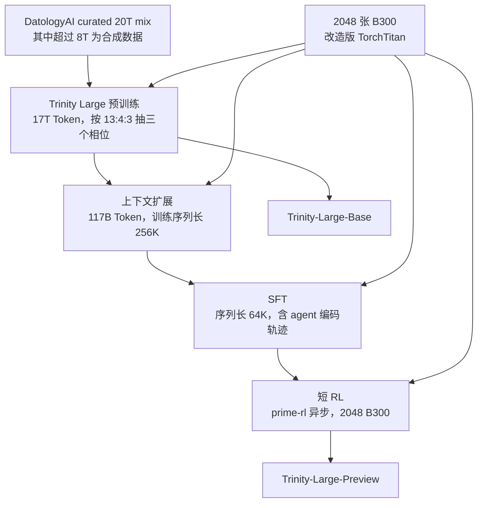
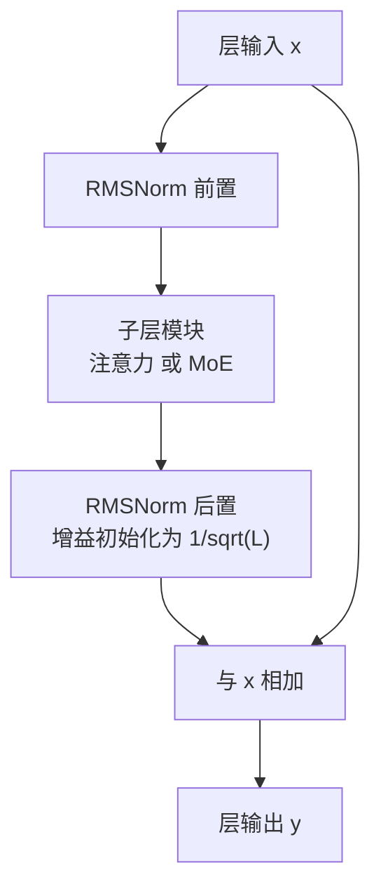
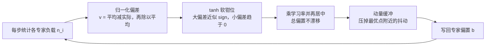
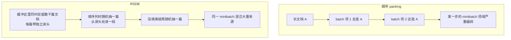

# Arcee Trinity Large：算力和时间都不够时，怎样让一次 400B 训练跑完

<!-- release-date: 2026-01-27 -->

> 本文依据 Arcee AI、Prime Intellect 与 DatologyAI 联合发布的 **Arcee Trinity Large Technical Report**，即 arXiv:2602.17004v1、2026-02-19 提交的版本，共 29 页（正文到第 17 页，之后是贡献者名单与参考文献）。文中页码均指 PDF 本身的页码，与 PDF 每页页脚印的页号一致。凡是报告没有写的，本文会明说没写，不替它补。

## 先说清楚这篇报告的性质

大部分基模报告在讲「我们发明了什么」。这一篇主要在讲另一件事：

> **在时间和算力都很紧的前提下，怎样让一次 400B 规模的训练一次性跑完，中途不崩。**

报告在引言里就把这个约束写在明面上：架构设计中「训练稳定性是关键考量，原因是项目的时间与算力可用性有限」（PDF p.2）。后训练那一章也承认，绝大部分集群时间被预训练吃掉了，所以后训练做得「相对轻」，发布的 Trinity-Large-Preview「更应被看作初步发布，而不是一个完整后训练过的模型」（PDF p.14）。

Arcee 不是大厂。它是新兴实验室，报告的公开尺度和取舍与大厂不同：算法细节写得很实，但成本、算力、时长、许可、安全评估这些大厂常写的东西一概没有。读这篇时最重要的动作，是把「有对照实验支持的结论」「作者的观察与假设」「完全没公开的部分」三层分开。本文会逐处标出来。

## 读前需要的最小背景

如果这几个词是第一次见，先花一分钟：

- **Token（词元）**：模型读写文本的最小单位。一个英文单词、一个汉字、一个标点，都可能是一个或多个 Token。
- **注意力（Attention）**：模型决定「当前这个位置要参考前文哪些位置」的机制。参考的范围越大，算得越慢、显存占得越多。
- **滑动窗口注意力（Sliding Window Attention，SWA）**：只让当前位置看最近固定长度的一段，比如最近 4096 个 Token，看不到更远的地方。省算力，但看不远。
- **混合专家（Mixture-of-Experts，MoE）**：把前馈网络拆成很多份「专家」，每个 Token 只激活其中几份。总参数可以很大，单个 Token 的实际计算量却很小。
- **路由器（Router）**：MoE 里决定「这个 Token 交给哪几个专家」的小模块。
- **专家坍缩（expert collapse）**：路由长期偏心，少数专家拿走绝大多数 Token，其余专家几乎不被使用，等于白白浪费了参数。这是 MoE 训练最典型的失败模式，也是这篇报告的主角。
- **Muon**：一种优化器。它在更新二维权重矩阵前，先把带动量的更新方向做近似正交化，让各个方向的步长更均匀。

后面还会出现三个这篇报告自己造的名字：**SMEBU**、**RSDB**、**BatchHet**。它们分别对应「怎么稳住路由」「怎么稳住数据批次」「怎么量化批次是否稳」，到相应章节再展开。

## 一句话结论与阅读路线

一句话：**Trinity Large 是一台把「稳定」排在「新颖」前面的 400B 稀疏 MoE。它的架构全部由已被别人验证过的组件拼成，真正的新东西只有两个小而具体的贡献——一个稳住 MoE 路由（SMEBU），一个稳住训练批次的数据构成（RSDB）——外加一份写得相当诚实的失败复盘。**

建议这样读：

1. 先看全景与配置表，知道这是个什么形状的模型；
2. 再看架构逐项，重点是「为什么选这个，而不是更新潮的那个」；
3. 然后看 SMEBU 与 RSDB 两节，这是报告的原创部分；
4. 接着看数据、基建、上下文扩展；
5. 最后一定要看讨论章的失败复盘，以及本文整理的「报告没写的」和「原件内部不一致」两节。报告的价值大半在那里。

## 全景：一家三口，和它们的形状

Trinity 家族有三个模型。小的两个不只是产品线，报告明说它们是**扩展阶梯**——用来在小规模上验证数据流水线、架构、训练配方和基建，然后才敢上 Trinity Large（PDF p.2）。

| | Trinity Nano | Trinity Mini | Trinity Large |
|---|---:|---:|---:|
| 总参数 / 每 Token 激活 | 6B / 1B | 26B / 3B | 400B / 13B |
| 预训练 Token 数 | 10T | 10T | 17T |
| Transformer 层数 | 56 | 32 | 60 |
| 开头的 dense 层数 | 2 | 2 | 6 |
| 模型维度 $d_{\text{model}}$ | 1024 | 2048 | 3072 |
| FFN 中间维度 | 3072 | 6144 | 12288 |
| 注意力头数 $h_q$ | 8 | 32 | 48 |
| 每头维度 $d_h$ | 128 | 128 | 128 |
| KV 头数 $h_{kv}$ | 2 | 4 | 8 |
| 局部窗口 | 2048 | 2048 | 4096 |
| 预训练序列长度 | 4096 | 4096 | 8192 |
| MoE 共享专家 / 路由专家 | 1 / 128 | 1 / 128 | 1 / 256 |
| 每 Token 激活路由专家 | 8 | 8 | 4 |
| 路由缩放 | 2.826 | 2.826 | 2.448 |
| 专家中间维度 | 256 | 1024 | 3072 |
| 初始化标准差 | 0.016 | 0.011 | 0.009 |

（PDF p.1 摘要给出参数量，Table 2 在 p.12 给出完整配置。）

训练用的机器：Nano 与 Mini 各在 512 张 H200 上训练；**Trinity Large 在 2048 张 B300 上训练**，集群由 Prime Intellect 提供，报告称这是这批新硬件上最早的大规模训练之一（PDF p.11）。

整条流水线长这样：

这张图按报告的第 3、4 节重画（PDF p.9–14），只表示阶段顺序，不代表各阶段耗时比例——**报告没有公开任何阶段的时长、算力或成本**。

## 架构：几乎每一块都是别人验证过的

报告在架构上非常克制。整章的逻辑可以概括成一句：既然只有一次机会，就不要在架构上赌新东西。

先看一层长什么样：

这是按 PDF p.3 的 Figure 2 与 p.8 的式 33 重画的机制示意图，不含实测数据。要点是：归一化夹在子层的**前后两侧**，残差加法在最外层。下面逐项讲每个选择的原因。

### 注意力：3 份局部 + 1 份全局，而且全局层不带位置编码

**旧问题。** 全注意力的代价随序列长度平方增长，KV 缓存随长度线性增长。想要长上下文，就必须有某种形式的削减。

**新设计。** Trinity 采用 **3:1 的局部/全局层交错**：三层滑动窗口注意力（局部层），接一层完整注意力（全局层），如此重复到模型顶端（PDF p.4）。两类层还有一个关键差别：

- **局部层用 RoPE**（旋转位置编码，Rotary Positional Embedding）；
- **全局层不用任何位置编码**，即 NoPE（No Positional Embedding）。

这个组合不是 Trinity 首创，报告引的是 Yang et al. 2025，即 arXiv:2501.18795《RoPE to NoPE and Back Again》。

**工作机制。** 式 6–8（PDF p.5）把这件事写得很直白：局部层的查询与键先过 RoPE，可见位置集合被截断成 $\{s \mid \max(1, t-w+1) \le s \le t\}$，其中 $w$ 是窗口大小；全局层的查询与键原样不动，可见位置集合是 $\{s \mid 1 \le s \le t\}$，也就是全部历史。

**为什么全局层不给位置编码？** RoPE 通过旋转角度编码相对距离，但角度是按训练时见过的长度范围校准的。序列一旦长过训练长度，角度就外推到了没见过的区域，注意力容易失准。局部层永远只看最近 $w$ 个 Token，距离范围固定，RoPE 在这里非常安全；全局层要看很远，干脆不给它位置信号，让它只靠内容匹配。**位置信息由局部层负责，长距离检索由全局层负责，两类层分工不同。**

**收益。** 报告给出的实测证据在上下文扩展一节：Trinity Large 在 256K 上训练，MK-NIAH（Multi-Key Needle-in-a-Haystack，多键大海捞针）@256K 得分 0.994；**在完全没有训练过的 512K 长度上仍拿到 0.976**（PDF p.13）。这是 NoPE 全局层带来长度外推能力的直接证据，不是纯推测。

**代价与边界。** 局部层的窗口被固定在全局上下文的一半（Large 是 4096 对 8192，PDF p.12–13），这意味着任何跨越 4096 的细粒度依赖都必须经由那 1/4 的全局层传递。信息通路变窄了，只是报告没有做实验去量化这一点损失了什么。

**可迁移启发。** 当一个模块同时被要求「精确编码位置」和「跨越很远距离」时，先问问这两件事能不能分给不同的层做。混合往往比折中好。

### GQA 与 QK-Norm：一个省显存，一个是给 Muon 擦屁股

**GQA**（Grouped-Query Attention，分组查询注意力）让多个查询头共享同一组键值头。Trinity Large 是 48 个查询头对 8 个 KV 头（PDF p.12），KV 缓存直接降到 MHA 的六分之一。这是标准做法，报告没有改动。

**QK-Norm** 更值得说。它在算注意力分数前，先对查询和键各做一次 RMSNorm（式 4–5，PDF p.5）：

$$
q_{t,i} = \operatorname{RMSNorm}(W_i^Q x_t),
\qquad
k_{t,j} = \operatorname{RMSNorm}(W_j^K x_t)
$$

报告采用它的理由写得很具体，而且是一条因果链：**注意力 logit 的最大值在训练中会持续增长，而已有工作发现，用 Muon 时这个问题比用 AdamW 时更严重**（PDF p.5，报告引 Liu et al. 2025b 与 Kimi Team 2025a）。logit 变大意味着 softmax 越来越接近 one-hot，梯度消失、数值溢出的风险同时上升。

这里的因果值得记住：**换优化器不是一个孤立决定，它会改变模型内部数值的分布，从而连带要求归一化策略跟着改。** Trinity 选 Muon，就得同时上 QK-Norm。

### 门控注意力：给注意力输出加一道闸门

**旧问题。** 注意力有个熟知的怪癖叫 **attention sink（注意力汇聚）**：softmax 强制所有位置的权重之和为 1，即使当前 Token 谁都不想看，也必须把注意力倒到某处，通常是第一个 Token。这会在激活值里造成异常大的尖峰。

**新设计。** 门控注意力（gated attention）在注意力输出送进输出投影之前，逐元素乘上一个由输入算出的 sigmoid 门（式 11–14，PDF p.6）：

$$
g_t = \sigma(W^G x_t),
\qquad
\tilde o_{t,i} = o^{\text{sdpa}}_{t,i} \odot g_{t,i}
$$

其中 $\sigma$ 是 sigmoid，$\odot$ 是逐维相乘，$g_t$ 被切成与查询头数量相同的若干段，每个头分到自己那段。

**工作机制。** 因为门的取值范围是 $(0,1)$，模型可以把整个头的输出压到接近 0。换句话说，softmax 内部仍然必须分配满 1 的权重，但门可以在事后把这一头的贡献整体关掉。「必须看点什么」和「必须把看到的用上」被解耦了。

**收益。** 报告引用原始工作（Qiu et al. 2025，arXiv:2505.06708）列出的效果：减少注意力汇聚、减少过大激活、提升评测分数、改善长序列泛化。报告自己补的动机是：**门控似乎能稳定训练、减少 loss 尖峰**（PDF p.6）。注意这句的用词是「appears to」，属于作者观察，报告没有为它做消融。

### MoE：注意，Trinity Large 是往「更粗」走的

这是全篇最容易被误读的一处，值得单独强调。

报告说 MoE 层「遵循 DeepSeekMoE 设计，采用**细粒度**路由专家加一个常驻共享专家」，紧接着下一句就是：「**对 Trinity Large，为了获得更好的吞吐，我们选择使用更粗粒度的专家**」（PDF p.6）。配置那一节说得更直接：「我们选择只激活 4 个路由专家、把每个专家做大，**降低粒度**，原因是吞吐要求」（PDF p.12）。

对照 Table 2 就很清楚：

| | Nano | Mini | Large |
|---|---:|---:|---:|
| 专家中间维度 / 模型维度 | 256 / 1024 = 0.25 | 1024 / 2048 = 0.5 | 3072 / 3072 = 1.0 |
| 每 Token 激活路由专家 | 8 | 8 | 4 |
| 路由专家总数 | 128 | 128 | 256 |

**Nano 和 Mini 走的是细粒度路线；Trinity Large 反过来，专家更大、激活更少。** 所以把 Trinity Large 一句话概括成「细粒度 MoE」是不准确的。它的关键词应该是「极高稀疏度 + 粗粒度专家」。

**为什么细粒度会拖慢吞吐？** 细粒度 MoE 的一个 Token 要跑过很多个小矩阵乘。矩阵一小，GPU 就吃不饱，还额外增加分发与合并的通信次数。把 4 个大专家换成 16 个小专家，理论上表达能力更灵活，但每次 GEMM 的规模掉到四分之一，硬件效率显著下降。Trinity Large 明确用表达灵活性换了吞吐。

**极高稀疏度的另一面。** 400B 里只激活 13B，稀疏度约 30 倍。报告在结论里把「更高稀疏度」列为未来最重要的方向之一，同时也点破了它的代价：**稀疏度越高，负载均衡与路由就越难稳定**（PDF p.17）。这正好接上下一节。

MoE 的公式部分很常规（式 15，PDF p.6）：

$$
h'_t = u_t + \sum_{i=1}^{N_s}\text{FFN}^{(s)}_i(u_t) + \sum_{i=1}^{N_r} g_{i,t}\,\text{FFN}^{(r)}_i(u_t)
$$

第一项是残差，第二项是**永远都跑**的共享专家，第三项是被路由选中的专家按门控权重加权求和。共享专家的作用是承载所有 Token 都需要的通用能力，免得每个路由专家都重复学一遍。

路由用的是 **sigmoid 而不是 softmax**（式 16–18，PDF p.6）：

$$
s_{i,t} = \sigma(u_t^\top e_i)
$$

softmax 会让所有专家的分数互相竞争、加起来等于 1；sigmoid 让每个专家独立打分。报告的理由是这样「路由 logit 更稳定」。选完 Top-K 之后再把选中的分数归一化成门控权重。

这里还有一个细节容易漏：**选专家时用「分数 + 偏置」，算门控权重时只用「分数」**（式 17–18）。因为偏置是负载均衡机制单独维护的，它只该影响「派给谁」，不该影响「派过去之后乘多大权重」。这个解耦来自 DeepSeek 的无辅助损失负载均衡工作（报告引 Wang et al. 2024a，arXiv:2408.15664）。

## 原创贡献一：SMEBU，让专家偏置能真正停下来

这是报告在架构上唯一的新东西，也是它给 Trinity Large 专门加的。

### 旧问题：sign 更新永远停不下来

先看标准的无辅助损失负载均衡长什么样（式 19–22，PDF p.6–7）。系统维护一个偏置向量 $b$，每步统计每个专家收到多少 Token：

$$
\bar n = \frac{1}{N_r}\sum_{i=1}^{N_r} n_i,
\qquad
\Delta b_i = \gamma \cdot \operatorname{sign}(\bar n - n_i),
\qquad
b_i \leftarrow b_i + \Delta b_i
$$

意思是：某个专家收到的 Token 比平均少，就把它的偏置调高一点，让它下一步更容易被选中；反之调低。Trinity 在此之上还加了一步**再居中**，把所有偏置减去它们的均值（式 22），防止整体漂移。

问题出在 $\operatorname{sign}(\cdot)$ 上。报告的推理很清楚（PDF p.7）：

> 假设理想的偏置值是某个固定值，标准做法**永远无法精确收敛到它**，因为 $\operatorname{sign}$ 算子下每次更新的幅度恒为 $\pm\gamma$。

打个比方：你在调水龙头，但手上的旋钮只能「往左拧一格」或「往右拧一格」，格子大小固定。水温再接近目标，你也只能来回过冲，永远在目标两侧跳。

报告进一步指出，**专家总数越多，每层偏置步长的范数就越大**——因为 $N_r$ 个专家各自贡献一个固定幅度的更新。Trinity Large 有 256 个路由专家，这个问题被放大了。作者由此提出假设：接近最优点时更新偏向振荡、无法安定，**这是 MoE 训练不稳定的一个原因**。

请注意这是**假设**（报告原词是「We hypothesize」），不是被隔离实验证明的结论。

### 新设计：把 sign 换成 tanh，再加动量

SMEBU（Soft-clamped Momentum Expert Bias Updates，软钳位动量专家偏置更新）分四步（式 23–28，PDF p.7）。

第一步，把偏差**归一化**，让更新幅度与序列长度、batch 大小无关：

$$
v_i = \frac{\bar n - n_i}{\bar n}
$$

第二步，用 tanh 做**软钳位**，$\kappa$ 控制饱和速度：

$$
\tilde v_i = \tanh(\kappa\, v_i)
$$

tanh 是 sign 的连续版本。偏差大时它接近 $\pm 1$，行为和 sign 差不多；偏差小时它接近 0，更新自然变小。**这样它就能真正停在目标上，而不是在目标两侧振荡。**

第三步，缩放并再居中：

$$
\Delta b_i = \lambda\,\tilde v_i,
\qquad
\Delta b_i \leftarrow \Delta b_i - \frac{1}{N_r}\sum_{j=1}^{N_r}\Delta b_j
$$

第四步，过一个**动量缓冲**再写回：

$$
m_i \leftarrow \beta m_i + (1-\beta)\Delta b_i,
\qquad
b_i \leftarrow b_i + m_i
$$

Trinity Large 的实际取值是 $\lambda = 5\times 10^{-4}$、$\beta = 0.5$、$\kappa = 2$（PDF p.7）。

### 为什么两个部件缺一不可

**为什么必须有界？** 报告试过更朴素的做法：直接用线性的、不钳位的更新（也就是 $\Delta b_i \propto v_i$，不经过 tanh 这一步）。结果是 **MaxVio 在训练早期迅速下降，但训练后期出现不稳定**（PDF p.7）。所以「能收敛到 0」和「幅度有上界」是两个独立的需求，tanh 恰好同时满足。

MaxVio（maximum violation，最大违背度）是衡量负载失衡的指标（式 42，PDF p.16）：

$$
\text{MaxVio} = \frac{\max_i \text{Load}_i - \overline{\text{Load}}}{\overline{\text{Load}}}
$$

也就是「最忙的那个专家比平均忙多少」，越接近 0 越均衡。

**为什么要动量？** 报告的论证是：如果不稳定确实来自最优点附近的振荡，而那里的噪声在时间上大致不相关，那么做时间平均就能把它压掉。作者明确把它类比成动量 SGD 降低梯度噪声方差（PDF p.7）。

这张图按 PDF p.7 的式 23–28 重画，是机制示意，不含实测数据。

### 证据强度：这里必须说清楚

报告没有为 SMEBU 单独做消融。它是**六个同时上马的稳定性修改之一**，报告自己在讨论章里承认「因为这些修复是一起引入以解封训练的，我们没有时间做受控消融来把稳定性归因到任何单一改动」（PDF p.16）。更要命的是，SMEBU 在正式用到 400B 之前**只在很小的规模上简单测试过**（PDF p.15）。

所以能确定的是：加了这一整套之后，MaxVio 不再发散、专家利用率全程均衡、loss 平滑收敛（PDF p.16）。不能确定的是：这里面 SMEBU 到底贡献了多少。

**可迁移启发。** 抛开归因问题，SMEBU 的设计思路本身是干净的：如果一个控制器长期停不下来，先检查它的更新是不是离散的定幅步长；把 $\operatorname{sign}$ 换成 tanh，只需一行代码，就同时拿到「有界」与「可收敛」。这对任何 PID 式的在线调节器都成立，不限于 MoE。

### 配套：序列级辅助损失

无辅助损失均衡是跨 batch 统计的，一个序列内部仍可能极端扎堆。所以报告额外挂了一个**序列级**负载均衡损失（式 29–32，PDF p.8），沿用 DeepSeek-V3 的形式：

$$
\mathcal L_{\text{Bal}} = \alpha\sum_{i=1}^{N_r} f_i P_i
$$

$f_i$ 是这条序列里被路由到专家 $i$ 的 Token 比例，$P_i$ 是归一化路由分数在这条序列上的均值。两者相乘再求和，鼓励两个分布都平摊开。式子里的 $\alpha$ 在第 2 章只写作「一个很小的系数」，**具体值 $1\times 10^{-4}$ 要翻到讨论章才给**（PDF p.16）。

## 归一化与初始化：两处小但讲了原因的选择

### 深度缩放的三明治归一化

Trinity 的每层是这样（式 33，PDF p.8）：

$$
y_\ell = x_\ell + \operatorname{RMSNorm}^{(2)}_\ell\Bigl(M_\ell\bigl(\operatorname{RMSNorm}^{(1)}_\ell(x_\ell)\bigr)\Bigr)
$$

$M_\ell$ 是子层模块（注意力、FFN 或 MoE）。子层的输入和输出**都**被归一化，这叫三明治归一化（sandwich norm）。

只做 pre-norm 的话，子层输出可以任意大地加到残差流上，深层网络里这些幅度会一路累积。后置的那一个 RMSNorm 相当于给每条支路装了限流阀。

「深度缩放」指的是后置归一化的增益初始化（式 34–35）：

$$
\gamma\bigl(\operatorname{RMSNorm}^{(1)}_\ell\bigr) = 1,
\qquad
\gamma\bigl(\operatorname{RMSNorm}^{(2)}_\ell\bigr) = \frac{1}{\sqrt L}
$$

$L$ 是总层数。直觉是：如果 $L$ 条独立支路各自贡献方差为 1 的增量，加起来残差流的方差就是 $L$；把每条支路先乘 $1/\sqrt L$，总方差回到 1 附近。Trinity Large 有 60 层，$1/\sqrt{60} \approx 0.129$。另外语言模型头之前还有一次 RMSNorm（式 36）。

### 初始化：宽度缩放，外加嵌入乘 $\sqrt d$

所有可训练参数取自截断正态分布（式 37–38，PDF p.8）：

$$
\theta \sim \operatorname{TruncNormal}\bigl(0, \sigma^2; [-3\sigma, 3\sigma]\bigr),
\qquad
\sigma = \frac{0.5}{\sqrt d}
$$

报告说这大致对应 Takase et al. 2025（*Spike no more*，arXiv:2312.16903）建议的 $\sigma = \sqrt{2/(5d)}$，并且顺手做了个交叉验证：$0.5/\sqrt{7168} = 0.006$，正好等于 DeepSeek-V3 的初始化尺度（PDF p.8）。

前向时嵌入层的激活再乘 $\sqrt d$（式 39）。报告为这个做法举了两条外部佐证：Grok-1 与 Grok-2 在 HuggingFace 上的 checkpoint 都把 `embedding_multiplier_scale` 设成 $\sqrt d$；前两代 Gemma 的建模代码把这个乘子叫作 normalizer（PDF p.8）。

**这一段的意思是**：因为初始化 $\sigma$ 随 $1/\sqrt d$ 缩小，嵌入向量本身也会变小；乘回 $\sqrt d$ 是把嵌入的尺度重新拉回 $O(1)$，让它与后续层的期望输入范围对上。

## 分词器：一个很值得读的工程小故事

分词器一节篇幅不长，但信息密度很高。

**规格**：自训练的 20 万词表 BPE，训练语料约 48GB（约 10B Token），主要抽自 Nano/Mini 的预训练语料，再补上 C4 的非英语部分和一批指令、推理轨迹、代码数据（PDF p.2）。

**一个诚实的自曝**：Trinity Large 那份更大的多语语料在训分词器时**还没定稿**，所以非英语语言在词表里的占比低于它们在最终预训练数据里的占比（PDF p.2–3）。Table 1 的中日韩压缩率落后 DeepSeek V3 和 Qwen 3，作者把原因直接归到这里（PDF p.4）。

**数字的位对齐切分**。连续数字先与周边文本分开，再从右往左按三位一组切，开头留 1–2 位，例如 `1234567 → 1|234|567`（PDF p.3）。这样每个三位 Token 稳定代表一个固定的位值（个十百、千位组等），依据是 Singh & Strouse 2024（arXiv:2402.14903）关于位对齐切分显著改善算术能力的发现。

**正则回溯灾难**。这段特别值得记：他们一开始用了 SuperBPE 论文里的零宽前瞻正则 `(?=(\d{3})+(?!\d))`，早期训练时发现**遇到超长连续数字串会触发灾难性回溯，单个样本的分词时间飙到几分钟**（PDF p.3）。修法是把一个正则换成三段式流水线：先把数字串截到 510 字符，再剥掉开头 1–2 位，最后按三位切完。报告说明两种做法在 510 位以内的输入上切分结果**完全一致**，所以这个修改是事后直接改配置，**没有重训分词器**（PDF p.3）。

这是一条很实用的经验：数据预处理里的正则表达式也是性能面。一个只在长尾输入上爆炸的模式，可能几百步都遇不到，一旦遇到就把整个 dataloader 卡住。

**SuperBPE 的空结果**。报告还评估了 SuperBPE（允许跨空格的多词 Token）。压缩率提升很显著：英文少约 29% 的 Token，推理轨迹少约 27%。但是——**在他们的实验规模上无法复现出对应的下游性能提升**，于是放弃，回到标准 BPE（PDF p.4）。

报告愿意写出一个负面结果，这一点很值得肯定。同时也要读出它的边界：这是「在我们的实验规模上没看到收益」，不是「SuperBPE 无效」。

**词表大小的选择也有个巧思**：因为 BPE 的合并是确定且贪心的，**按合并顺序截断一个大词表，等价于直接训练小词表**。所以他们只训了完整的 200k，再截出 131k 等变体做消融，省掉重复训练（PDF p.4）。

Table 1 的实测压缩率（PDF p.4，B/T 是字节每 Token，C/T 是字符每 Token，越大越好）：

| 数据集 | Trinity (200k) | DeepSeek R1 (128k) | Qwen 3 (152k) | Llama 3 (128k) | GPT-OSS (200k) |
|---|---:|---:|---:|---:|---:|
| C4 (en) B/T | 4.84 | 4.70 | 4.64 | 4.73 | 4.79 |
| C4 (zh) C/T | 1.38 | 1.54 | 1.45 | 1.29 | 1.47 |
| C4 (ja) C/T | 1.39 | 1.60 | 1.59 | 1.60 | 1.54 |
| C4 (ko) C/T | 1.26 | 1.47 | 1.47 | 1.68 | 1.72 |
| C4 (fr) B/T | 3.98 | 3.53 | 3.34 | 3.49 | 3.97 |
| Reasoning B/T | 3.67 | 3.61 | 3.51 | 3.59 | 3.61 |

英语与法语上 Trinity 最好，中日韩落后。

## 数据：八万亿 Token 的合成数据

**全部预训练数据由 DatologyAI 策划**（PDF p.9）。把散在各处的线索拼起来，这份报告背后是一个三方分工：Arcee AI 负责模型与训练，Prime Intellect 提供集群（PDF p.11）与 RL 框架 prime-rl（PDF p.14），DatologyAI 负责数据（PDF p.9）。封面的三个机构标记也对得上（PDF p.1）。

两份配方：

- Nano 与 Mini 共用同一份 10T 混合数据，分三个相位，分别是 7T / 1.8T / 1.2T；
- Trinity Large 用一份独立的 20T 混合数据，三相位为 13T / 4T / 3T，实际训练的 17T **按 13:4:3 的比例从中抽样**。

10T 那份复用了 AFM-4.5B 的数据集，并大幅增加数学与代码。20T 那份覆盖 14 种语言：阿拉伯语、汉语、日语、西班牙语、德语、法语、意大利语、葡萄牙语、印尼语、俄语、越南语、印地语、韩语、孟加拉语（PDF p.9）。

**最引人注意的数字：DatologyAI 生成了超过 8 万亿 Token 的合成数据**（PDF p.9），拆开是：

- 约 6.5T 合成网页数据，基于 BeyondWeb（arXiv:2508.10975）的改写方法。具体手法包括格式转换（把网页内容改写成问答对）、风格调整（增强教学语气）、内容重组（提升信息密度与可读性）；
- 约 1T 合成多语数据；
- 约 800B 高质量合成代码数据。

生成基建是 Kubernetes 上的 Ray + vLLM（PDF p.9）。

三个相位不是简单换数据，而是所谓 **midtraining**：随相位推进，把配比从通用网页往代码、数学、科学偏移，并且在每个类别**内部**也换成更高质量、更相关的数据（PDF p.9）。

**必须说清楚的边界**：报告只给了三相位的总量和方向，**没有公开任何一相的领域配比、过滤器细节、去重阈值、质量模型、污染检查，也没有公开真实数据与合成数据的比例**。「超过 8T 合成」这个数字告诉我们规模，不能反推质量。报告自称这是「已公开记录中最大规模的预训练合成数据生成工作之一」（PDF p.9），这句是宣称，本文无法核验。

## 原创贡献二：RSDB，让每个 minibatch 长得像整个数据集

这是全篇我认为最有迁移价值的一节，而且是很多训练系统都会踩、但很少被写出来的坑。

### 旧问题：顺序 packing 会让每一步优化不同的目标

大模型训练要把长短不一的文档拼进固定长度的序列，这叫 packing。TorchTitan 这类框架的标准做法是**顺序 packing**：文档按流的顺序读，长文档会连续占据后续多个 batch 项。

报告指出的问题是（PDF p.9–10）：文档长度大致服从对数正态分布，也就是说存在少量极长的文档。一篇 50 万 Token 的法律文书顺序铺开，会连续霸占好几个 minibatch。于是：

> 每个不均衡的 minibatch，都相当于从**它自己的**那个数据分布里采出的理想样本。我们等于每一步在优化一个不同的目标分布。

后果有两层：一是网络每一步都要「忘掉」上一步学到的小领域偏置，纯属开销；二是长尾的序列长度分布带来长尾噪声，而交叉熵这类非对称损失会把小偏差放大成大的 loss 波动。

**关键洞察：这个问题无法靠打乱文档顺序解决。** 因为它不是文档顺序的问题，而是「一个长文档会跨越多个 batch 项」这个机制本身造成的。

作者还给出两个易受影响的场景假设：**batch 规模受限时**，以及**模型每步的数据效率更高时**。后者引 Kaplan et al. 2020——模型越大，单步数据效率越高，因而对每步数据分布的抖动**越敏感**。作者由此提出：这可能是模型变大后训练不稳定的一个成因（PDF p.10）。同样是假设，不是被证明的定理。

### 新设计：随机顺序文档缓冲区

RSDB（Random Sequential Document Buffer，随机顺序文档缓冲区）的算法很简单（PDF p.10）：

1. 分词后的每篇文档整体作为一条记录放进缓冲区，各带一个读头，初始指向第 0 位；
2. 持续插入直到缓冲区填满；
3. 要填 minibatch 里的一条序列时，**随机挑一篇文档**，从它的读头位置往下读 Token，读完后推进读头；
4. 序列没填满就再随机挑一篇继续读，直到填满；
5. 缓冲区消耗到用户设定值时，批量清掉旧文档、批量补新文档。

实现上有个性能技巧：内部缓冲区开成用户设定值的**两倍**，掉到用户设定值就补满，而且成批清理与载入。报告说这一步显著改善了 dataloader 性能（PDF p.10）。

Trinity Large 第三相位的实际参数：**每张 GPU 的 RSDB 缓冲区 8192 篇（用户设定 4096），每张 GPU 4 个 worker**，缓冲区在各 worker 间均分，使总规模与 worker 数无关（PDF p.10）。

这张图按 PDF p.9–10 的文字描述重画，是机制对照示意，不含实测数据。

三个好处（PDF p.10）：**碎片更少**（不预切分文档，运行时动态拼）、**采样更接近独立同分布**（真正的跨文档随机选择）、**读写高效**（不会成为训练瓶颈）。而且报告强调：**整个过程不丢弃任何 Token**。

### BatchHet：先造一把尺，再证明自己有用

要说清 RSDB 有没有用，得先能测量「批次有多不均衡」。报告定义了 **BatchHet（Batch Heterogeneity，批次异质度）**（式 40，PDF p.10）：

$$
\text{BatchHet}_t = \max_i L^{(t)}_i - \frac{1}{M}\sum_{i=1}^{M} L^{(t)}_i
$$

$L^{(t)}_i$ 是第 $t$ 步第 $i$ 个 microbatch 的 loss，$M$ 是 microbatch 总数。翻译过来：**这一步里最难的那个 microbatch，比平均难多少。**

这把尺造得很聪明：它不需要任何领域标签，也不需要额外前向，用训练本来就要算的 loss 就能得到。报告说在小规模内部实验中，这个指标与梯度范数的不稳定性强相关（PDF p.10）。

### 证据：分两层，强度不同

**第一层，小规模内部对照实验**（PDF p.10）。这一层有明确的基线对照：

| 指标 | 顺序 packing 基线 | 开启 RSDB |
|---|---:|---:|
| BatchHet | 基准 | 降低 46% |
| 梯度范数的峰度 | 187 | 14.6 |

峰度（kurtosis）衡量分布尾部有多重。从 187 掉到 14.6，意思是梯度范数的极端离群值大幅减少。

报告还做了两个「要多大 batch 才能追平」的换算：基线要把 batch 放大约 **2 倍**，才能让每步 loss 的方差追平开了 RSDB 的网络；要把 BatchHet 追平，则需要 **7 倍** 的 batch（PDF p.10）。而且即使在 loss 方差已经对齐的那个 batch 上，基线的平均 loss 仍有明显更多的逐步离群值。

这一层有对照、有基线，是这篇报告里证据最扎实的一段。

**第二层，真实的 Trinity Large 训练**（PDF p.11）。他们在开发中就觉得收益够大，于是**没等下一次训练，直接在 Trinity Large 的第三相位中途接了进去**。观察到的结果是 BatchHet 降低 **4.23 倍**、逐步方差降低 **2.4 倍**。

但报告自己立刻加了限定：**第二相位与第三相位的数据分布本来就不同，所以直接比较是困难的**（PDF p.11）。这句限定非常重要，本文原样保留——第二层是观察，不是受控实验。

Figure 1（PDF p.1）能看到这个变化：第三相位那段曲线明显比第二相位那段窄。同时也要小心不要过度解读——相位切换本身就换了数据，loss 的绝对水平在切换点直接跳了一档。

**可迁移启发。** 这一节可以抽象成三步方法论：

1. 先怀疑「数据管线的机制」，而不是只怀疑模型和超参；
2. 为你怀疑的东西**造一个便宜的指标**，最好能从已有信号里免费算出来；
3. 用「要多大 batch 才能追平」这种换算，把工程改动折算成算力等价物。第三点尤其漂亮：说「BatchHet 降了 46%」很难让人有体感，说「基线要 7 倍 batch 才能追平」立刻就有了。

## 基建：细节里全是新硬件的味道

**框架**：改造过的 TorchTitan；融合交叉熵与 z-loss 用 Liger Kernels；上下文扩展与 SFT 阶段为了省显存用 Cut Cross-Entropy（PDF p.11）。

**并行**：Nano 与 Mini 用 HSDP（Hybrid Sharded Data Parallel，混合分片数据并行）——多个模型副本，副本组**内部**用 FSDP 分片。Trinity Large 在此之上加**节点内专家并行（EP）**。具体度数：所有模型的 FSDP 组大小 128；Trinity Large 的 EP 组大小 8（正好一个节点 8 张卡）；上下文扩展阶段的上下文并行度为 4（PDF p.11）。

**分布式 Muon**。Muon 需要看到完整的梯度矩阵才能做正交化，这与按元素切分的分片天然冲突。Trinity 的做法改自 Dion 仓库（Ahn et al. 2025，arXiv:2504.05295）：**对专家的梯度做批量正交化，而且不在正交化之前把梯度张量展平**（PDF p.11）。报告点出这么做的一个副产品——**因为不需要展平，梯度也就不必跨专家并行组做聚合**，专家并行的实现被大大简化。

这是个很好的设计对偶：保留张量的原有形状（每个专家一个矩阵，批量处理），并行边界就自然对齐到了算法的数学单元上。

**新硬件的真实成本**。这一段很有现场感（PDF p.11）：

- 测 PyTorch 2.10 nightly 时发现，**早期版本对 B300 支持不全，晚期版本又在 B200 和 B300 上出现性能回退**。他们对 nightly 版本做了**二分搜索**，才找到一个可用的包；
- 后来升到 2.11 nightly，拿到约 **5%** 的提速；
- B300 是全新系统，他们预期早期部署故障率更高。实际观察到间歇性 GPU 故障，包括**反复出现的 XID 错误**，靠固件包更新逐步缓解；
- 系统侧：故障转移节点、dataloader 优化与高性能 NFS 换取快速重启、**心跳监控在三分钟内没有完成任何训练步就报警**。

这些不是可有可无的花絮。它解释了为什么整篇报告如此偏执于稳定性：硬件本身就在制造随机故障，架构上再叠加不确定性，项目会做不完。

## 训练超参：两处与主流不同的选择

**优化器分工**：隐藏层用 Muon，嵌入层与输出层用 AdamW（PDF p.12）。这是 Muon 的标准用法。

**分歧点在学习率的处理**。Moonlight 那篇（报告引 Liu et al. 2025b，arXiv:2502.16982）的做法是把 Muon 更新的 RMS 重新缩放到与 AdamW 更新的 RMS 对齐，以便直接复用 AdamW 的学习率。**Trinity 明确不这么做**，改用另一条规则（式 41，PDF p.12）：

$$
\text{lr}_{\text{adjusted}} = \text{lr}\sqrt{\max\left(1, \frac{\text{fan}_{\text{out}}}{\text{fan}_{\text{in}}}\right)}
$$

$\text{fan}_{\text{in}}$、$\text{fan}_{\text{out}}$ 是这个权重矩阵的输入维度与输出维度。理由是实测：**这个调整能在模型宽度扩展时实现最优学习率迁移**（PDF p.12）。也就是说小模型上调好的学习率，放大宽度后仍然接近最优，省下昂贵的重新搜索。

这里可以看到一个立场差异：Moonlight 把 Muon 的更新尺度往 AdamW 靠；Trinity 承认 Muon 的更新尺度就是不一样，转而按矩阵形状显式补偿。报告只给了「我们经验上观察到」，**没有给出学习率迁移的实验曲线**。

**Trinity Large 的具体配方**（PDF p.13）：

- 线性 warmup 2000 步；峰值学习率 Muon $8.0\times10^{-4}$、AdamW $2.0\times10^{-4}$；
- 全局 batch 12288 条、序列长 8192；**跨过 4.9T Token 后 batch 提到 16384**，为了提升吞吐，大致跟随 MiniMax 的做法。16384 × 8192 = 134,217,728，正是 Figure 1 上标的 128M Token（PDF p.1）；
- 衰减阶段用 **cosine 衰减到峰值的 1/10**，即 Muon $8.0\times10^{-5}$、AdamW $2.0\times10^{-5}$。**特意不衰减到 0，是为了能直接进入上下文扩展而不必重新 warmup**；
- 上下文扩展阶段继续 cosine，从峰值的 1/10 衰到 1/20，即 Muon $8.0\times10^{-5}\to4.0\times10^{-5}$、AdamW $2.0\times10^{-5}\to1.0\times10^{-5}$。

「不衰到 0」这一手很实用：学习率归零后再重新升起来，模型要经历一次不必要的扰动。把预训练的终点直接定成下一阶段的起点，两段就接得上了。

Figure 1 的训练曲线（PDF p.1，无子采样、无平滑）值得单独读一下。我从图上读出的关键位置是：`bs=128M` 的虚线在约 4.9T 处，与正文一致；`phase 2` 虚线在约 10.1T，`phase 3` 虚线在约 14.05T。loss 从 2.0 以上一路降到 17T 处的约 1.12。两次相位切换都出现**向下的阶跃**：约 1.46 掉到约 1.36，再从约 1.36 掉到约 1.27。

**这个阶跃必须正确解读**：它不是模型突然变强，而是数据换了。后面的相位数据质量更高、更集中在代码与数学，本身就更好预测，交叉熵自然更低。**跨相位的 loss 数值不可直接比较。** 第二相位那段几乎是平的（约 10T 到 14T 基本横盘），第三相位则一路下行到 1.12——因为学习率衰减主要发生在最后。

## 上下文扩展：只调全局层

**做法**（PDF p.13）。局部层的窗口预训练时就设成全局上下文窗口的一半。做上下文扩展时，他们对比了两条路线：

- 路线 A：局部层（换不同的 RoPE 基频 $\theta$）和全局层一起调；
- 路线 B：**只调全局层**。

结果是路线 B 的 loss 恢复快得多。报告给出两点解读：与 Yang et al. 2025 的结论一致；并且**进一步说明局部层与全局层学到的是互补的角色**。另外还有一个纯工程理由——不扩大局部层窗口，推理更省。报告说因此「上下文扩展过程极其顺利」。

**评测代理指标**用的是 RULER 里的 MK-NIAH（Multi-Key Needle-in-a-Haystack，多键大海捞针），在目标长度上直接测，好处是能快速评估 checkpoint 并决定下一轮改什么（PDF p.13）。

**一条有实测支撑的规律：训练序列长度要长于目标上下文长度。** 证据链很清楚（PDF p.13）：

| 模型 | 训练序列长度 | 评测长度 | MK-NIAH |
|---|---|---|---:|
| Trinity Nano | 128K | 128K | 0.38 |
| Trinity Nano | 256K | 128K | 0.548 |
| Trinity Nano | 256K（迭代数据与超参后） | 128K | 0.864 |
| Trinity Mini | 128K | 128K | 0.888 |
| Trinity Large | 256K | 256K | 0.994 |
| Trinity Large | 256K | 512K | 0.976 |
| Trinity Large | 256K | 1M | 0.42 |

同为 128K 训练，Nano 只有 0.38 而 Mini 有 0.888，报告把这个差距归因于**模型规模越大，上下文扩展越容易**。Trinity Large 更是印证了这一点：在从未训练过的 512K 上仍有 0.976，在 1M 上还有 0.42，报告据此说「有可能把后续版本推到 1M 上下文窗口」——这是展望，不是已经做到。

**还有一个反直觉的负面结果**：他们**没有发现渐进式扩大上下文窗口比直接在最长长度上训练更好**（起点都是最终预训练 checkpoint，PDF p.13）。很多团队默认要搞 4K → 32K → 128K 的课程，这里的经验是至少在他们的设置下没必要。

**长上下文数据配方**（PDF p.13）：约 **117B Token、3560 万篇文档**。构成方式是：

- 从原预训练三个相位里按**长度加权抽样**：抽中概率随文档长度上升，**从 1% 的下限一直到 128K 长文档的 90%**。这样抽出来的子集仍大致代表原分布，同时长序列比例被大幅提高；
- 借鉴 OLMo 3 的 Dolma 3 Longmino 配方，引入大量 OCR 得到的 PDF 数据，包括 olmOCR 数据集与 HuggingFace 的 FinePDF-edu，理由是它们天然又长又干净；
- 重新生成 ProLong 数据集，**用完整序列长度而不是已发布的 512K/64K 截断版**。报告点名说其中的**整仓库代码拼接**对长上下文泛化和跨文件代码理解特别有价值；
- 再补上 FLAN、数学与代码等指令风格数据（来自他们原本的 AFM 上下文扩展配方），以及 AutoMathText 与 ProLong 里精选的 arXiv 与教科书。

「按长度加权抽样，而不是只挑长文档」这一招很值得借：既拉长了序列分布，又没有把原本的领域分布毁掉。

## 后训练：报告自己说这是「预览」

这一章只有一页，而且开头就自我限定（PDF p.14）：因为绝大部分集群时间给了预训练，后训练「相对轻」，**Trinity-Large-Preview 最好被看作初步发布而非完整后训练的模型**，下一版才会在此基础上做更充分的后训练。

**SFT 数据**：公开指令数据 + 自制数据。自制部分是人写的提示加上更强的教师模型生成的合成指令，再按质量、格式、长度过滤。**重头在 agentic 编码监督**：编码子集里很大一部分来自 agent 框架里跑出来的轨迹。他们用 **OpenCode** 作为 harness 跑多步编码任务，**完整记录交互轨迹（编辑、工具调用、测试结果）**，目的是让模型学会「改—跑—测」这个循环，而不只是学会写出最终答案（PDF p.14）。

这个动机说得很到位：只喂最终补丁，模型学到的是「正确答案长什么样」；喂完整轨迹，模型才有机会学到「测试失败之后该怎么办」。

**SFT 训练**：同样用改造版 TorchTitan，并行方式与上下文扩展阶段类似但**不需要上下文并行**；Cut Cross-Entropy 省显存；样本离线预分词，训练时贪心 packing；**序列长度 64K**；超长样本直接截断，packing 后补齐到完整长度；学习率线性 warmup 到**预训练峰值的 1/10**，再线性衰减到 0（PDF p.14）。

**RL**：在同一个 2048 张 B300 的集群上跑了一段**短 RL**，框架是 prime-rl（Prime Intellect 出品）。用它的异步架构——vLLM 驱动的 worker 生成 rollout，另有独立的分布式 trainer 用 FSDP2 施加更新。环境遵循 verifiers 的 API。奖励策略是：**任务有客观检查时优先用可验证奖励**（例如严格的答案格式校验），**没有干净标准答案时回退到一个学习出来的奖励模型**（PDF p.14）。

**这一章没写的东西非常多**：SFT 与 RL 各用了多少数据、多少步、什么 RL 算法、奖励模型怎么训、有没有做偏好对齐、有没有安全对齐。全部空白。读者能知道流水线的形状，无法据此复现。

## 评测：能证明什么，不能证明什么

### Base 模型：数字扎实，归因不足

Table 3（PDF p.15）给出 Trinity Large Base 的成绩，Figure 3（PDF p.14）把它与另外两个开放权重基座并排。我把两者合成一张表（Figure 3 的柱形标签与 Table 3 完全一致，交叉核对通过）：

| 评测 | Llama 4 Maverick (Base) | GLM-4.5 (Base) | Trinity Large (Base) |
|---|---:|---:|---:|
| MBPP+ | 88.36 | 87.30 | **88.62** |
| Minerva MATH500 | 59.20 | 50.00 | **65.20** |
| HellaSwag (5-shot) | 85.63 | 89.74 | **90.11** |
| WinoGrande (5-shot) | 77.35 | **84.37** | 80.82 |
| MMLU (5-shot) | 84.92 | **86.38** | 82.58 |
| MMLU-Pro (5-shot) | 63.46 | 64.38 | **66.02** |
| TriviaQA (5-shot) | 79.78 | 83.28 | **83.30** |
| ARC Challenge (0-shot) | 63.40 | 63.48 | **65.44** |
| BBH (few-shot) | 64.60 | **68.16** | 65.70 |
| GPQA Diamond (5-shot) | **47.47** | 44.95 | 43.94 |

**读法**：Trinity Large Base 在 10 项里赢 6 项，其中 Minerva MATH500 领先幅度很大（65.20 对 59.20 与 50.00）；但 MMLU、WinoGrande、BBH、GPQA Diamond 四项落后。**「知识密集」和「常识推理」是它相对的弱项，数学与代码是强项**——这与它的数据配方（后期相位大幅上调代码、数学、STEM）方向一致。

报告的原话是「与 GLM-4.5 Base 取得有竞争力的分数，尽管稀疏度高 4 倍、激活参数量低约 2.5 倍」（PDF p.15）。这句需要拆开看：

- **激活参数约 2.5 倍**这部分可以核对。外部补充：GLM-4.5 的官方规格是 355B 总参、32B 激活（[官方模型卡](https://huggingface.co/zai-org/GLM-4.5)）。$32/13 \approx 2.46$，对得上。
- **「稀疏度高 4 倍」这句无法从报告核验。** 报告既没有定义「稀疏度」，也没有给出对照模型的配置。按最自然的两种定义算：总参除激活参数是 $400/13 \approx 30.8$ 对 $355/32 \approx 11.1$，约 2.8 倍；按路由专家的激活比例是 $4/256$ 对 $8/160$，约 3.2 倍。**都不是 4 倍。**（GLM-4.5 的专家配置来自其官方 `config.json`，属外部补充，不是本报告内容。）

**这张表能证明的**：以 13B 激活参数达到了与 32B 激活参数量级模型可比的基座质量，参数效率确实好。
**这张表不能证明的**：任何单个设计的贡献。架构、数据、优化器、Token 数同时不同，无法归因。报告也没有声称做了归因。

### Instruct 模型：数字偏低，而报告并不掩饰

Table 4（PDF p.15）只有五项：

| 评测 | Trinity Large Preview |
|---|---:|
| MMLU | 87.21 |
| MMLU-Pro | 75.25 |
| GPQA Diamond | 63.32 |
| SimpleQA | 23.92 |
| AIME25 | 24.36 |

有意思的是 GPQA Diamond：Base 只有 43.94，Preview 到 63.32，说明后训练确实带来了大幅提升。但 **AIME25 只有 24.36**，对一个 400B 模型来说明显偏低，而这与「后训练很轻、没有做长思维链推理训练」的自我定位完全吻合。

**这一节的两个重要缺口**：一是**没有任何对照模型**，Table 4 是孤立的一列；二是**完全没有 agent 或编码类评测**（没有 SWE-bench、没有 LiveCodeBench、没有终端类基准），尽管 SFT 明确围绕 agentic 编码轨迹设计。这两个缺口都很显眼。

### 推理吞吐：图很好看，但没有数字

§5.2（PDF p.15）只有一段话：用 vLLM、所有模型量化到 FP8、在一个 8×H200 节点上测，结果见 Figure 4。图注补充了版本是 vLLM 0.14.0（PDF p.16）。

Figure 4 有六个子图（输出吞吐、总吞吐、首 Token 时延、每输出 Token 时延、端到端时延、总时长），三种输入/输出长度配置（1024/512、4096/2048、8192/4096），对照模型是 **DeepSeek-V3 与 GLM-4.7**。

**报告没有给这张图配任何数值表格**，柱子上也没有数字标签。我从坐标轴上读出的近似值如下，**仅供量级参考**：

| 输出吞吐（约 Token/秒） | DeepSeek-V3 | GLM-4.7 | Trinity-Large |
|---|---:|---:|---:|
| 1024/512 | 约 3600 | 约 4550 | 约 8750 |
| 4096/2048 | 约 2080 | 约 3050 | 约 7350 |
| 8192/4096 | 约 1280 | 约 2050 | 约 5900 |

粗略换算，Trinity Large 的输出吞吐约为 DeepSeek-V3 的 2.4–4.6 倍、GLM-4.7 的 1.9–2.9 倍，而且**输入越长、优势越大**。这符合架构预期：3/4 的层是滑动窗口，长输入下省掉的注意力计算与 KV 缓存最多；同时每 Token 只激活 13B。

**几处必须提醒的边界**：

1. 这是**吞吐**测试，不是相同质量下的成本比较。速度快一部分来自激活参数少，而激活参数少本身也可能意味着能力上限更低；
2. 三个模型的激活参数量差异很大，图里没写；
3. 图上纵轴量级偏大（例如 8192/4096 配置下首 Token 时延到了 $10^6$ 毫秒量级），说明测的是**高并发饱和负载下的平均值**而非单请求延迟，但**报告没有说明并发数、请求数或采样配置**，所以这张图无法被独立复现；
4. **质量对照用的是 GLM-4.5 Base，速度对照换成了 GLM-4.7**，报告没有解释为什么换，读者也不该把两张图的结论直接叠加。

## 讨论章：全篇最有价值的一页

第 6 节（PDF p.15–16）是我最推荐反复读的一段，因为大多数技术报告不会这样写。

**失败是怎么发生的。** 前几次训练一切正常：loss 按预期下降，早期专家利用率大致均衡。**然后路由行为开始漂移**，专家负载越来越不均，最终出现专家坍缩。MaxVio 先是保持稳定，接着突然攀升。同时 loss 走平、评测提升也走平，离预期很远。

这是一条典型的**正反馈崩溃链**：某些专家稍微更常被选中 → 它们得到更多梯度、变得更强 → 路由更愿意选它们 → 差距进一步拉大 → 剩下的专家因为收不到 Token 而永远学不好。等 MaxVio 的曲线肉眼可见地翘起来，模型的一部分容量其实已经死了。

**先试了三个不奏效的办法**（PDF p.15）：

1. 降低学习率（通用的稳定手段）；
2. 把归一化参数的权重衰减去掉；
3. 调大后置归一化的 $\epsilon$，降低数值敏感度。

**每一个都能让情况好转一阵子，但都没有阻止同一个失败模式复发。** MaxVio 继续发散，loss 也回不到稳定的下行轨迹。

这段本身就是一条经验：**症状被压住不等于病因被解决。** 当同一个失败反复以同样形态回来，说明你调的是表征，不是机制。

**然后一次性上了六个改动**，理由直白得可爱——「我们时间非常有限」（PDF p.15）：

1. 采用 SMEBU（此前只在很小规模上简单测过）；
2. **关掉线性层与分组 GEMM 的 MXFP8 kernel，退回 BF16**；
3. 加一个小权重的 z-loss；
4. 从纯无辅助损失均衡改为**加上一个小权重（$1\times10^{-4}$）的序列级辅助损失**；
5. **把 dense 层从 3 层增加到 6 层**，进一步稳定早期表示；
6. **采用文档内掩码**，禁止不同文档的位置互相注意，降低学习目标里的噪声。

**第 3 条里藏着一个很有价值的意外**（PDF p.15–16）。原计划 z-loss 权重是 $1\times10^{-4}$，但**训练代码里有 bug，权重被错误地应用，实际退化成了 0**。也就是说，这六项里有一项其实根本没生效。后来因为最大 logit 持续增长让人担心，他们在**训练中途**才把 z-loss 真正引入，而且**必须把权重降到 $1\times10^{-6}$，因为更大的值会让网络失稳**。这一手确实稳住了最大 logit 与平均 logit 的趋势。

从 $10^{-4}$ 到 $10^{-6}$ 差了 100 倍。这说明中途插入一个正则项和从头带着它训练，完全是两回事：模型已经落在某个数值状态里，突然施加强约束反而是一次冲击。

**结果与作者自己的限定**（PDF p.16）：

> 施加这些修复后，MaxVio 停止发散，专家利用率全程保持均衡，loss 继续平滑收敛到更低的值。**因为这些修复是为了解封训练而一起引入的，我们没有时间做受控消融，来把稳定性归因到任何单一改动。**

这句限定必须原样保留。它意味着：

- **SMEBU 有效**是**没有被证明**的。它与另外五项（其中一项还没生效）捆绑在一起；
- 有一个纯粹的可能性没被排除：真正起作用的可能是「关掉 MXFP8 退回 BF16」这类与算法无关的数值改动，或者「dense 层 3 变 6」这种最朴素的结构调整。

我认为这不是报告的缺点，反倒是它的优点——**它把归因的不确定性明明白白写了出来，而不是事后编一个干净的因果故事。**

**可迁移启发。** 当你被迫一次性合并多个修复时，至少要做两件事：把这个事实记录下来（Trinity 做到了），以及事后补做消融（Trinity 没有做，也说明了原因）。合并修复本身在工程上完全合理，把合并当成证据才是问题。

## 结论与未来方向

第 7 节（PDF p.17）很短，两个方向：

1. **更高的稀疏度是高效扩展的关键**。具体到 MoE，需要更好的负载均衡与路由，才能在把稀疏度推得更高的同时保持训练稳定；
2. **大 batch 训练是另一个关键**。能把临界 batch size（critical batch size，超过它再加大 batch 就换不来等比收益的那个规模）推得更高、同时保住样本效率与稳定性的算法改进，会直接转化成更快的训练与更好的硬件利用率——尤其在 GPU 数量继续增长、又不需要模型并行的场景下。

这两条正好对应报告的两个原创贡献：SMEBU 服务于第一条，RSDB 与 BatchHet 服务于第二条。文章的自洽性是好的。

## 报告没有写的东西

这一节请当作阅读边界来用。以下内容在 29 页原件里**完全没有**：

- **训练时长、算力预算、总 FLOPs、MFU、任何成本数字**。只知道用了 2048 张 B300，不知道跑了多久；
- **模型许可证**。摘要只说「模型 checkpoint 可在 huggingface.co/arcee-ai 获取」（PDF p.1），正文没有任何许可条款；
- **安全评估、红队测试、负责任发布相关的任何内容**。全篇没有 safety 一节；
- **数据配比细节**：各相位的领域比例、过滤器、去重阈值、质量分类器、污染检查、真实数据与合成数据的确切比例；
- **稳定性归因的消融**（报告明确承认没做）；
- **Muon 学习率迁移规则的实验曲线**（只说「经验上观察到」）；
- **后训练的数据量、步数、RL 算法细节、奖励模型细节、超参数**；
- **Figure 4 的数值表格与测试负载配置**（并发数、请求数、采样参数一概没有）；
- **Trinity Nano 与 Trinity Mini 的评测结果**。第 5 节的标题就是「Trinity Large Evaluation Results」，两个小模型只在架构与上下文扩展章节出现；
- **Preview 的 agent 与编码类评测**，尽管 SFT 明确围绕 agentic 编码轨迹展开；
- **Table 2 里的「路由缩放」（route scale）与「专家中间维度」（expert size）从未被定义**。前者在式 15–18 的 MoE 公式里根本没有对应项，正文也没解释它作用在哪里；后者虽能从上下文推断是专家 FFN 的中间维度，但报告没说。

## 原件内部的不一致

逐页核对时发现几处，按重要性排列：

**一、512K 到底是目标还是意外**（都在 PDF p.13）。

- §3.4.2 训练超参一节的原话是：「We train to 256k context for inference at 512k.」——把 512K 说成推理目标；
- §3.5 上下文扩展一节的原话是：「我们在 256K 序列长度上训练 Trinity Large，**目标是 256K 的最终上下文窗口**……进而在 512K 上评测时，**我们甚至发现**它达到了 0.976，尽管并未在该长度上训练。」——把 512K 说成意外之喜。

同一页的两节，一处说 512K 是计划，一处说是惊喜。这不是致命错误，但会让读者判断不了「Trinity Large 官方支持多长上下文」。

**二、三个相位的切分点对不上**（PDF p.9 对 PDF p.1）。

正文说 20T 混合数据分为 13T / 4T / 3T，而 Trinity Large 的 17T **按 13:4:3 的比例抽样**。按这个比例算，三个相位应该是 11.05T / 3.4T / 2.55T，切换点落在 11.05T 和 14.45T。

但 Figure 1 上标出的切换点，我从图上读到的是约 **10.1T** 和约 **14.05T**，也就是接近 10T / 4T / 3T。两种读法都合计 17T，但第一相位差了将近 1T Token。这可能是绘图取整，也可能是正文的比例描述与实际执行不符——**报告没有给出足以判断的信息**。

**三、「零 loss 尖峰」与讨论章的关系需要读者自己拼**（PDF p.1 对 PDF p.15–16）。

摘要说「三个模型都在零 loss 尖峰的情况下完成训练」。讨论章却详细描述了前几次训练的专家坍缩、loss 走平、以及中途插入 z-loss。严格说这两者不冲突——摘要指的是**最终那次训练**，坍缩发生在被放弃的早期尝试里，而且专家坍缩表现为 loss 走平而非尖峰。但摘要把这句放在最显眼的位置、正文的复盘藏在第 15 页，读者容易把它当成「这次训练顺风顺水」。

顺带一提，Figure 1 上在约 11.7T 和约 12.9T 处能看到两个很小的向上毛刺。它们幅度很小，是否算「尖峰」取决于定义，报告没有给出判定标准。

**四、六项修复里有一项没生效**（PDF p.15–16）。

第 6 节列出「我们一次性施加了六个改动」，但第 3 项 z-loss 因为 bug 实际权重是 0。所以当时真正生效的是五项，z-loss 是后来以小 100 倍的权重、在训练中途单独加入的。报告如实写了这个过程，只是「六个改动一起施加」这句陈述与后面的说明存在张力。

**五、质量对照与速度对照换了模型**（PDF p.14–16）。Figure 3 用 GLM-4.5 Base 比质量，Figure 4 用 GLM-4.7 比速度，报告没有解释这个切换。

**六、「细粒度」的措辞前后打架**（PDF p.6 对 p.12）。§2.3 开头说 MoE 遵循 DeepSeekMoE 的**细粒度**路由专家设计，下一句就说 Trinity Large 改用**更粗粒度**的专家。技术上没有矛盾（Nano/Mini 细、Large 粗），但同一段里连着出现，很容易让人把 Trinity Large 也记成细粒度 MoE。

## 报告之外的时间线（外部补充）

以下**不是报告内容**，只是帮助定位这份材料在时间线上的位置，均给出链接：

- 扩展阶梯确实是先走完的：Trinity Mini 的权重仓库最早的提交在 2025-12-01，比 Trinity Large 早了近两个月（见 [huggingface.co/arcee-ai/Trinity-Mini](https://huggingface.co/arcee-ai/Trinity-Mini) 的提交历史）。报告里「先用小模型验证流水线、架构、配方和基建」不是事后美化，是真实的发布顺序；
- Trinity Large 首次公开是 2026-01-27，见 Arcee 官方博客 [Trinity Large: An Open 400B Sparse MoE Model](https://www.arcee.ai/blog/trinity-large)；同日在 [huggingface.co/arcee-ai](https://huggingface.co/arcee-ai) 上线 Trinity-Large-Preview、Trinity-Large-Base 与 Trinity-Large-TrueBase 三个权重仓库；
- **报告本身晚于模型发布**：arXiv:2602.17004v1 提交于 2026-02-19，比首发晚了三周多。这解释了为什么报告的多条参考文献标注的访问日期是 2026-01-25 到 2026-01-27——它是围绕发布日写成的；
- 2026-04-01 Arcee 发布了 Trinity Large Thinking，一个推理变体。**这份报告不涉及它**，报告里的 Trinity-Large-Preview 是那个「后训练很轻」的版本；
- 权重仓库在 2026-05-28 有一次「Adopt OpenMDW-1.1 license」的提交。许可证在报告里从未提及，这属于报告之后的变化。

## 可迁移启发

### 1. 稳定性是可以被当成第一约束来设计的

Trinity Large 的每一处架构选择——QK-Norm、门控注意力、三明治归一化、深度缩放增益、前 6 层 dense、文档内掩码——都能追到同一个动机。当你只有一次机会时，「哪个更好」这个问题应该让位于「哪个更不容易崩」。

### 2. 换优化器会连带改变别的东西

选 Muon 就得配 QK-Norm，因为 Muon 让注意力 logit 增长更成问题（PDF p.5）；选 Muon 就得改分片策略，因为它需要完整的梯度矩阵（PDF p.11）。优化器不是一个可以独立替换的插件。

### 3. 离散的定幅控制器永远停不下来

SMEBU 的核心只有一句：把 $\operatorname{sign}$ 换成 $\tanh$。任何「每步固定加减一格」的在线调节器都有同样的毛病，无论它调的是专家偏置、限流阈值还是采样温度。要收敛，更新必须能趋于 0；要安全，更新必须有界。tanh 一次给全。

### 4. 数据管线的机制问题，靠 shuffle 治不好

顺序 packing 造成的批次偏斜来自「长文档跨多个 batch 项」这个机制，打乱文档顺序无效（PDF p.10）。遇到问题先分清「是采样顺序错了」还是「是拼装方式错了」，两者的解法完全不同。

### 5. 为你怀疑的东西造一把便宜的尺

BatchHet 只用训练本身已经算出来的 microbatch loss，不需要标注、不需要额外前向。**能免费测量的东西才会被持续监控。**

### 6. 把工程收益折算成算力等价物

「基线需要 7 倍 batch 才能追平 RSDB 的 BatchHet」比「BatchHet 降低了 46%」有力得多（PDF p.10）。给改进定价时，翻译成同行熟悉的资源单位。

### 7. 让阶段之间自然衔接

预训练的学习率 cosine 衰减到峰值的 1/10 而不是 0，为的是直接进入上下文扩展而不必重新 warmup（PDF p.13）。设计多阶段流程时，把上一段的终点状态设计成下一段的合法起点。

### 8. 长上下文数据要「加权」，不要「筛选」

按文档长度加权抽样（1% 下限到 128K 文档的 90%），既拉长了序列分布又保住了领域分布（PDF p.13）。直接只保留长文档，会连带把领域分布也改掉。

### 9. 一次合并多个修复没问题，把它当成证据才有问题

Trinity 一次上了六个改动，这在时间压力下完全合理。真正关键的是他们**写出来了**（PDF p.16）。你的复盘文档也应该这样写。

### 10. 新硬件的隐性成本要计入排期

对 PyTorch nightly 做二分搜索、追 XID 错误、等固件包（PDF p.11），这些都不出现在任何 scaling law 里，但会实实在在吃掉工期。

## 关键词回看

- **SMEBU（Soft-clamped Momentum Expert Bias Updates，软钳位动量专家偏置更新）**：把无辅助损失负载均衡里的 sign 更新换成 tanh 软钳位，再加动量缓冲，使专家偏置能收敛而不是永远振荡。
- **MaxVio（maximum violation）**：最忙的专家比平均负载高出的相对比例，衡量 MoE 负载失衡程度。
- **RSDB（Random Sequential Document Buffer，随机顺序文档缓冲区）**：让数千篇文档同时驻留缓冲区、各带读头，填序列时随机抽取，打破长文档霸占连续 batch 项的问题。
- **BatchHet（Batch Heterogeneity，批次异质度）**：一步之内最难 microbatch 的 loss 减去平均 loss，用来量化批次内部有多不均衡。
- **NoPE（No Positional Embedding）**：全局注意力层不加任何位置编码，改由局部层承担位置信息，换取长度外推能力。
- **门控注意力（gated attention）**：在注意力输出上乘一个 sigmoid 门，让模型能整体关掉某个头的贡献，缓解注意力汇聚与超大激活。
- **三明治归一化 + 深度缩放**：子层前后各一次 RMSNorm，后置那次的增益初始化为 $1/\sqrt L$，控制残差流随深度累积。
- **无辅助损失负载均衡**：靠一个单独维护的专家偏置来影响 Top-K 选择，而不在主损失里加均衡项；偏置只参与「选谁」，不参与「乘多大权重」。
- **临界 batch size**：再加大 batch 也换不到等比收益的那个规模；把它推高就能更好地利用更多 GPU。
- **MK-NIAH**：RULER 里的多键大海捞针任务，这篇报告用它作为上下文扩展的快速代理指标。

## 最后的判断

把三层分开来说。

**有对照实验支持的：**

- RSDB 相对顺序 packing 的收益（小规模内部实验，有基线：BatchHet 降 46%、梯度范数峰度 187 → 14.6、追平需 2 倍与 7 倍 batch，PDF p.10）；
- 上下文扩展只调全局层优于同时调局部层（有 A/B 对比，PDF p.13）；
- 训练序列长于目标长度更好（Nano 上 0.38 对 0.548 的直接对照，PDF p.13）；
- 分词器词表 200k 优于更小词表（fertility 与小规模 loss 曲线，PDF p.4）；
- SuperBPE 在他们的规模上是空结果（负面结果，PDF p.4）；
- 线性、无钳位的偏置更新会在训练后期失稳（报告称是 preliminary tests，规模未说明，PDF p.7）。

**只是作者观察或假设的：**

- SMEBU 稳住了训练（与另外五项捆绑，报告明确承认无法归因，PDF p.16）；
- 定幅 sign 更新导致的振荡是 MoE 不稳定的成因（原文用 hypothesize，PDF p.7）；
- 批次异质度是模型变大后训练不稳定的成因之一（同上，PDF p.10）；
- 门控注意力能稳定训练、减少 loss 尖峰（原文用 appears to，PDF p.6）；
- Muon 学习率调整规则实现了最优宽度迁移（只有「经验上观察到」，无曲线，PDF p.12）；
- Trinity Large 真实训练中 RSDB 的 4.23 倍与 2.4 倍改善（跨相位，报告自己说难以直接比较，PDF p.11）。

**完全没公开的：** 时长、算力、成本、许可、安全评估、数据配比细节、后训练数据量与超参、Figure 4 的数值与负载配置、两个小模型的评测。

**那么这篇报告值不值得读？** 值得，但要读对地方。

它不会告诉你怎么造一个更强的模型。Trinity-Large-Preview 的 AIME25 只有 24.36，报告自己也说这只是预览。它真正给出的，是一份**在受限条件下把大规模训练跑完的现场记录**：什么先崩了，试过哪些没用的办法，最后一次性上了什么，哪一项其实根本没生效，以及为什么没时间做消融。

对新兴实验室的报告，最容易犯的错是把「他们写了」当成「他们证明了」。这篇报告的可贵之处恰恰在于，它自己就把这条线划出来了——写「我们假设」的地方就是假设，写「没有时间做受控消融」的地方就真的没做。

如果只带走一句话：

> **稀疏度、批次构成和数值稳定不是三个独立的旋钮。把稀疏度推高，路由就更容易坍缩；把批次做大，数据构成的抖动就更致命。真正的工作是在这三者之间找到一次能跑完的组合。**

## 资料与阅读边界

- 原始依据：本地 `papers/Arcee/Trinity-Large.pdf`，Arcee Trinity Large Technical Report，[arXiv:2602.17004v1](https://arxiv.org/abs/2602.17004)，2026-02-19 提交，29 页。**核验时 arXiv 上只有 v1，本地件与官方版一致。**
- 官方发布页（外部补充）：[Trinity Large: An Open 400B Sparse MoE Model](https://www.arcee.ai/blog/trinity-large)，2026-01-27。
- 官方权重（外部补充）：[huggingface.co/arcee-ai](https://huggingface.co/arcee-ai)，报告在摘要中给出的地址。
- 报告依赖的关键外部工作，供延伸阅读（这些是报告引用的，不是报告的贡献）：
  - 局部/全局 + NoPE 的来源：[RoPE to NoPE and Back Again](https://arxiv.org/abs/2501.18795)；
  - 门控注意力：[Gated Attention for Large Language Models](https://arxiv.org/abs/2505.06708)；
  - 无辅助损失负载均衡：[Auxiliary-Loss-Free Load Balancing Strategy for Mixture-of-Experts](https://arxiv.org/abs/2408.15664)；
  - 分布式 Muon 的实现基础：[Dion: Distributed Orthonormalized Updates](https://arxiv.org/abs/2504.05295)；
  - 初始化依据：[Spike No More](https://arxiv.org/abs/2312.16903)；
  - 合成数据方法：[BeyondWeb](https://arxiv.org/abs/2508.10975)；
  - 长上下文代理指标：[RULER](https://arxiv.org/abs/2404.06654)。
- 用于交叉核对「稀疏度高 4 倍」一句的外部资料：[GLM-4.5 官方模型卡与配置](https://huggingface.co/zai-org/GLM-4.5)。**这只是本文做的核验，报告本身没有给出对照模型的配置。**
- 本文中所有标注「我从图上读出」的数值（Figure 1 的相位切换点、Figure 4 的吞吐量级）都是从渲染后的 PDF 页面目测读数，**报告没有提供对应的数值表格**，请当作量级参考而非精确值。
