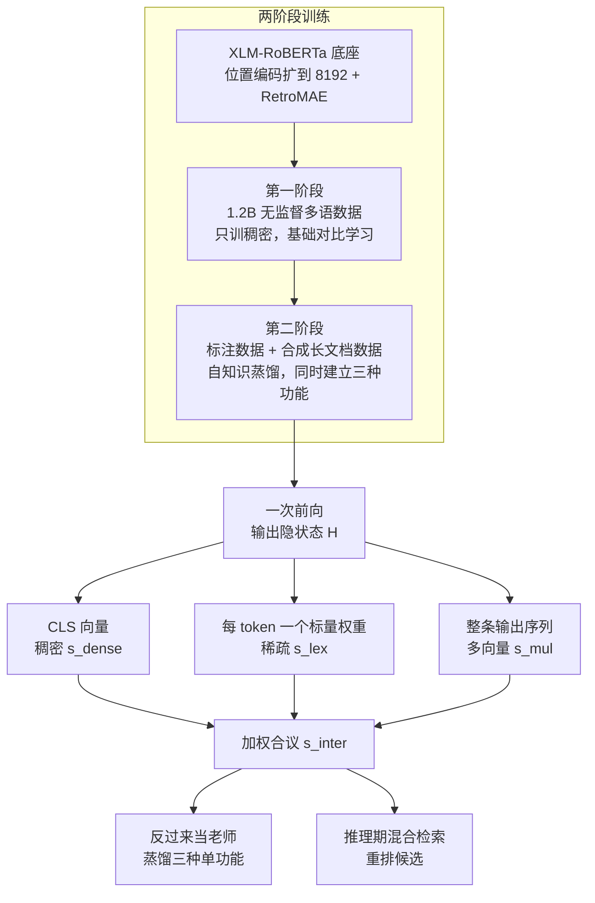
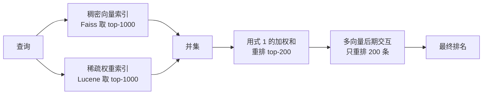

# BGE-M3：一次前向同时长出稠密、稀疏、多向量三种表示，混合检索比任何单一表示都强

<!-- release-date: 2024-01-27 -->

> 本文依据本地 `papers/BAAI/BGE-M3.pdf`，即 arXiv:2402.03216v5（页脚水印日期 2025-12-12），共 18 页。页码均指 PDF 物理页。
>
> **材料名与论文标题的对应关系**：论文标题与正文里的模型名都是 **M3-Embedding**（PDF p. 1），而对外发布的权重仓库叫 `BAAI/bge-m3`；本站把这份材料收在 **BGE-M3** 名下。下文讲论文里的方法与实验时写 M3-Embedding，讲可下载的那个模型时写 `bge-m3`，两者指同一套东西。
>
> 全文严格分三层：**报告明确写了什么**（带 PDF 页码）、**我的理解**（用「我的理解是」「这说明」起头）、**外部补充**（带链接与访问日期）。

## 读前先把这几个词说成人话

这篇论文的门槛不在数学，在于它同时把**检索的三种流派**塞进了一个模型。先把这三种流派讲清楚，后面的公式就只是把话写紧凑一点。

**它要解决的三种检索功能：**

- **稠密检索（dense retrieval）**：把一句话压成**一个**向量，存进向量库，查询时算两个向量的内积或余弦相似度。好处是「汽车」和「轿车」离得近，坏处是模型想不起你问的是哪个字。
- **稀疏检索 / 词法检索（sparse / lexical retrieval）**：不压成一个向量，而是给文本里**每个词**算一个权重，查询和文档共有的词按权重相乘累加。传统做法是 BM25——权重由词频和逆文档频率**统计**出来，模型不参与。它的好处是精确命中专有名词和型号编号，坏处是没见过的同义词完全帮不上。
- **多向量检索 / 后期交互（multi-vector retrieval / late interaction）**：ColBERT 那条路线。一句话不压成一个向量，而是保留**每个 token 一个向量**；打分时，查询侧每个向量去文档侧找最相似的那个，再平均。精度最高，代价是存储和计算都翻几十倍。

**它怎么让三种功能同时学：**

- **集成分数（ensemble score）**：把上面三种分数加权求和，得到一个总分。M3-Embedding 把**这个总分**当成监督信号——这是全文最核心的一招。
- **知识蒸馏（knowledge distillation）**：让一个「学生」去模仿「老师」给出的软标签分布，而不只是模仿硬的对错标签。先前嵌入模型的老师通常是**另一个更强的排序模型**。
- **自知识蒸馏（self-knowledge distillation）**：老师是学生自己——同一模型、同一次前向算出来的三种分数互相当老师。不需要外部模型，不需要额外推理。
- **InfoNCE 损失**：对比学习的标准损失。把正样本的相似度和一批负样本的相似度放在一起做 softmax，让正样本排第一。式 (2) 就是它。
- **批内负例（in-batch negatives）**：同一批里别人的正样本来当我的负例，不用额外标注。批越大，负例越多，嵌入区分度越好——这是后面「高效批处理」那一节存在的全部理由。

**读表要知道的口径：**

- **nDCG@10**：前 10 条结果的质量分，考虑排名顺序，越靠前的对越值钱。
- **Recall@100**：前 100 条里有没有正确答案，不看顺序，只看有没有捞到。
- **MIRACL**：多语**同语**检索基准，18 种语言，查询和文档同一种语言（PDF p. 6）。
- **MKQA**：**跨语**检索基准，25 种语言的查询去英文维基百科语料里找答案（PDF p. 7）。
- **MLDR**：多语**长文档**检索基准，文档来自维基百科、Wudao、mC4（PDF p. 8）。
- **NarrativeQA**：英文长文理解问答，整本小说或电影的全文当文档（PDF p. 8）。
- **XLM-RoBERTa / RetroMAE**：底座是一个多语预训练编码器 XLM-RoBERTa；RetroMAE 是一种给这个底座「再预训练」的方法，让它更适合做句子嵌入（PDF p. 5、p. 14）。

**一个必须先说清的口径问题**：这份 PDF 的评测是 MIRACL、MKQA、MLDR、NarrativeQA 四个基准，**没有 MTEB 榜单的数字，也没有 MLQA**。`bge-m3` 在 MTEB 上的成绩属于第三方榜单口径，本文不补那些数字。

## 一句话先说清

嵌入模型长期有三个割裂（PDF p. 1）：绝大多数只为英文设计；一个模型只会一种检索功能，而真实的检索系统要稠密、稀疏、多向量**混着用**，就得训三个模型、建三套索引；长文档检索训练成本高，多数模型只能处理短输入。

M3-Embedding 的回答是：一个 XLM-RoBERTa 编码器，一次前向**同时**产出三种表示——`[CLS]` 那一个向量给稠密，每个 token 的一个标量权重给稀疏，整条输出序列给多向量。三种相似度按 $w_1, w_2, w_3$ 加权成一个总分。

难点随之而来：三个训练目标会互相打架，朴素地一起训，谁也都学不好。论文的解法很干净——**把模型自己算出来的加权总分当老师**，用式 (5) 让每个单功能的分数分布去拟合这个总分分布（PDF p. 5）。这就是「自知识蒸馏」：老师不是外部的 GPT，也不是另一个排序模型，而是同一个模型三种视角的合议。

结果（全部 nDCG@10 或 Recall@100，数字回表核对见后文）：MIRACL 平均 71.5、MKQA 平均 75.5、MLDR 平均 65.0、NarrativeQA 61.7，四张表的平均分行都是该表最高（PDF p. 6、p. 7、p. 8）。去掉自蒸馏，稀疏那一路从 53.9 掉到 36.7（PDF p. 9 Table 5）——**它是三种功能里唯一「不靠蒸馏就学不出来」的**。

所以本文的判断是：

> **M3-Embedding 证明的不是「一个模型能干三种活」，而是：当同一个模型的多种输出天然可以合议成一个更好的分数时，这个合议分就是免费的、免外部推理的老师——多目标嵌入的互相拆台，可以在模型内部被自己解决掉。**

它也留下清楚的例外：跨语场景下稀疏基本没用（MKQA 上 Sparse 只有 45.3，PDF p. 7）；长文档上稠密单功能甚至输给 BM25（MLDR 上 52.5 对 53.6，PDF p. 8）；在几个高资源欧洲语言上，MKQA 的每一项配置都追不上 E5mistral-7b。后文会把这些格子逐个指出来。

## 先看全景：一个编码器，三种读法

这是按 PDF p. 4 Figure 2、p. 5 Figure 3 与正文 3.2、3.3 节重画的**机制示意，不是实测数据**。两处简化要说明：第一阶段只训稠密、第二阶段才引入三种功能（PDF p. 5）；合议分数在训练期是老师、在推理期是重排分数，是同一个式子的两次使用。

和同期方案对照，它省掉的东西比多出来的东西更重要：

| | 传统做法 | M3-Embedding |
|---|---|---|
| 三种功能 | 三个模型、三套索引 | 一个编码器，一次前向（PDF p. 4） |
| 多目标怎么合 | 各训各的，或朴素加权求和（式 4） | 加权和当老师，再蒸馏回单功能（式 5、6） |
| 老师从哪来 | 另一个排序模型给软标签（PDF p. 5） | 自己，不额外推理 |
| 输入长度 | 多数 512（PDF p. 8 Table 3） | 8192（PDF p. 1） |
| 语言 | 多为英文 | 声称 100 多种工作语言（PDF p. 1） |

## 核心设计一：三种功能共存——同一次前向的三种读法

### 稠密：只用 `[CLS]` 那一个向量

设查询 $q$ 过编码器得到隐状态矩阵 $\mathbf{H}_q$。取特殊 token `[CLS]` 位置的隐状态并归一化，就是查询向量；文档同理（PDF p. 4）：

$$
e_q = norm(\mathbf{H}_q[0]),\qquad e_p = norm(\mathbf{H}_p[0]),\qquad s_{dense} \leftarrow \langle e_p, e_q\rangle
$$

符号解释：下标 $[0]$ 是 `[CLS]` 在序列里的位置，$norm(\cdot)$ 是归一化，所以内积 $\langle e_p, e_q\rangle$ 实际就是余弦相似度。这一段没有任何新东西，它就是标准的双塔稠密检索。

我的理解是：论文特意把最普通的这条放在第一个讲，是为了让后面两条有对照——**同一个 $\mathbf{H}_q$，只是取法不同，就变成三种不同的检索功能**。三种功能不是三个模型，是同一份隐状态的三种读法。

### 稀疏-词法：让模型自己给每个词打权重

传统 BM25 的权重是统计量，模型不参与。M3-Embedding 改成：**用一个可学习的线性映射，把每个 token 的隐状态打成一个标量**（PDF p. 4）：

$$
w_{qi} \leftarrow \mathrm{ReLU}(\mathbf{W}_{lex}^{\top}\mathbf{H}_q[i]),\qquad \mathbf{W}_{lex}\in\mathbb{R}^{d\times 1}
$$

其中 $i$ 是词在查询里的位置，$\mathbf{W}_{lex}$ 是把 $d$ 维隐状态映射到一个浮点数的那个可学习矩阵。同一个词在查询里出现多次时**只保留最大权重**。文档侧用完全一样的算法算 $w_{pt}$。相似度只在查询和文档**共有**的词上累加（PDF p. 4）：

$$
s_{lex} \leftarrow \sum_{t\in q\cap p}(w_{qt}\cdot w_{pt})
$$

$q\cap p$ 是两边共有的词集合。这说明它仍然是**词法**检索：没同时出现的词，贡献为零，语义再近也不算分。它和 BM25 的区别只在一处——权重从「统计出来」变成「模型算出来」。这条差异在后面 MKQA 和 BM25 对照那一节会变成关键证据。

### 多向量：整条输出序列参与打分

稠密把整句压成一个向量，多向量反过来：**每个 token 留一个向量**（PDF p. 4）：

$$
E_q = norm(\mathbf{W}_{mul}^{\top}\mathbf{H}_q),\qquad \mathbf{W}_{mul}\in\mathbb{R}^{d\times d}
$$

$\mathbf{W}_{mul}$ 是一个可学习的投影矩阵（$\mathbb{R}^{d\times d}$，注意它和 $\mathbf{W}_{lex}$ 的 $d\times 1$ 只差在输出维度）。打分沿用 ColBERT 的后期交互（late interaction）：查询侧第 $i$ 个向量去文档侧 $M$ 个向量里找最相似的那个，取最大值，再对查询侧 $N$ 个位置求平均（PDF p. 4）：

$$
s_{mul} \leftarrow \frac{1}{N}\sum_{i=1}^{N}\max_{j=1}^{M} E_q[i]\cdot E_p^{\top}[j]
$$

我的理解是：把这三条并排看，设计上的经济感就出来了——$\mathbf{W}_{lex}$ 是 $d\times 1$、$\mathbf{W}_{mul}$ 是 $d\times d$、稠密干脆不加矩阵只取一行。**三种功能在参数上的增量只有这两个小矩阵**，主干完全共享。这也解释了为什么作者敢说「一个模型同时具备三种功能」而不必付三份推理成本。

### 合并：一个加权求和，权重按场景给

三种分数怎么合成一个可排序的分数？式 (1)（PDF p. 4）：

$$
s_{runk} \leftarrow w_1\cdot s_{dense} + w_2\cdot s_{lex} + w_3\cdot s_{mul}
$$

原文左端写作 $s_{runk}$，从上下文看是 ranking score 的笔误；论文自己说 $w_1, w_2, w_3$ 的取值「取决于下游场景」（PDF p. 4）。这个「取决于」在实验一节被具体化成了四组不同的数（PDF p. 6、p. 8）：

| 场景 | 用的功能 | $w_1$ | $w_2$ | $w_3$ | 重排谁 |
|---|---|---|---|---|---|
| MIRACL / MKQA 的 All | 三种全用 | 1 | 0.3 | 1 | 稠密召回的 top-200（PDF p. 6） |
| MIRACL / MKQA 的 Dense+Sparse | 稠密 + 稀疏 | 1 | 0.3 | 0 | 稠密 top-1000 与稀疏 top-1000 的并集，取 top-200（PDF p. 6） |
| MLDR 的 Dense+Sparse | 稠密 + 稀疏 | 0.2 | 0.8 | 0 | 同上（PDF p. 8） |
| MLDR 的 All | 三种全用 | 0.15 | 0.5 | 0.35 | 同上（PDF p. 8） |

**这张表里最值得读的是权重方向的反转。** MIRACL 上稠密权重最高（$w_1=1$），到了长文档的 MLDR，稀疏权重反而最大（$w_2=0.8$、$w_1=0.2$）。这说明长文档里「词有没有出现」比「整体语义像不像」更能定位答案段落——后文 MLDR 那一节会看到稀疏单项（62.2）反超稠密单项（52.5）将近 10 分。

实际检索是**级联**的，不是一上来就算三种分（PDF p. 6）：

这是按 PDF p. 6 第 4.1 节的实验设置重画的**机制示意，不是实测数据**。论文对多向量的处理很务实：「考虑到它的代价很高（heavy cost），多向量方法不参与初召回，只用它重排稠密召回的 top-200 候选」（PDF p. 6）。

我的理解是：这一句其实交代了全文没有量化的那部分成本。多向量要为每个 token 存一个 $d$ 维向量，语料级索引会膨胀几十倍，所以作者把它降级成 200 条的**重排器**。整份报告没有给三套索引的体积、也没有给检索延迟的实测数字，只在 PDF p. 16 给过一个相关的间接证据（XLM-R 分词器每篇文档平均 1056 个不同词，Lucene 分析器 1451 个，多 37% 以上，「会增加检索延迟」）。

## 核心设计二：自知识蒸馏——三种功能互为师生，且不需要外部老师

### 旧问题：三个目标一起训，会互相拆台

先说它要解决的矛盾。嵌入模型的训练目标是把正样本和负样本区分开，标准做法是最小化 InfoNCE（论文式 2，PDF p. 4）：

$$
\mathcal{L}_{s(\cdot)} = -\log\frac{\exp(s(q,p^*)/\tau)}{\sum_{p\in\{p^*,P'\}}\exp(s(q,p)/\tau)}
$$

符号逐个说：$s(\cdot)$ 是三种相似度中的**任意一种**，即 $\{s_{dense}, s_{lex}, s_{mul}\}$ 之一；$p^*$ 是这条查询的正样本，$P'$ 是负样本集合；$\tau$ 是温度。分母就是「正样本加上一批负样本」的 softmax。

问题来了：三种功能的优化方向不一致。稠密希望把语义相近但用词不同的样本拉近，稀疏的分数只在**共有词**上产生，语义改写对它毫无帮助；多向量希望每个局部 token 都对得上，稠密却要求把它们平均掉。论文的原话是「不同检索功能的训练目标可能互相冲突（can be mutually conflicting），因此朴素的多目标训练对嵌入质量可能不利」（PDF p. 4）。

我的理解是：这才是这篇论文真正的对手，不是「训三个模型太麻烦」，而是「合在一起训会互相拖累」。如果只是工程上麻烦，把三个模型蒸馏进一个学生就够了，不需要自蒸馏这个设计。

### 新设计：把合议分当老师，老师的分数不要钱

最朴素的联合训练是式 (4)（PDF p. 5）：

$$
\mathcal{L} \leftarrow \big(\lambda_1\cdot\mathcal{L}_{dense} + \lambda_2\cdot\mathcal{L}_{lex} + \lambda_3\cdot\mathcal{L}_{mul} + \mathcal{L}_{inter}\big)/4
$$

这里 $\mathcal{L}_{inter}$ 就是**用合议分数 $s_{inter}$ 代入式 (2) 得到的那条损失**——即三种分加权后，再拿它去做一次 InfoNCE。$\lambda_1,\lambda_2,\lambda_3$ 是三个单功能损失的权重。

自知识蒸馏加的是另一条通路。对每种功能 $s$，损失改成式 (5)（PDF p. 5）：

$$
\mathcal{L}'_{s} \leftarrow -\,p(s_{inter}) * \log p(s_{s})
$$

论文紧接着定义：$p(\cdot)$ 是 softmax 激活，$s_s$ 是 $\{s_{dense}, s_{lex}, s_{mul}\}$ 里的任意一个（PDF p. 5）。**我的理解是**：这条式的形状就是交叉熵——把同一批候选上合议分数过 softmax 得到老师分布，把单功能分数过 softmax 得到学生分布，让后者去拟合前者；式中的 $*$ 按交叉熵的写法理解为逐位相乘再求和。原文没有把它展开成求和式，所以这里是对符号的解释，不是论文写下的定义。

再把三条蒸馏损失按同样的 $\lambda$ 加权平均，得到式 (6)，最后和式 (4) 取均值（PDF p. 5）：

$$
\mathcal{L}' \leftarrow \big(\lambda_1\cdot\mathcal{L}'_{dense} + \lambda_2\cdot\mathcal{L}'_{lex} + \lambda_3\cdot\mathcal{L}'_{mul}\big)/3,\qquad
\mathcal{L}_{final} \leftarrow (\mathcal{L} + \mathcal{L}')/2
$$

**老师是谁，这是本节最该记住的一句。** 先前工作用知识蒸馏提升嵌入质量时，软标签来自「另一个排序模型」（Hofstätter 等人 2021 那条线，PDF p. 5）。M3-Embedding 明确写了：「在本工作中，我们直接采用集成分数 $s_{inter}$ 作为老师」（PDF p. 5）。老师就是同一个模型在同一次前向里算出的另一个数。这说明这件事的边际成本是零：不额外推理、不额外标注、不依赖外部模型，也不需要把候选集喂给一个 cross-encoder 重打分。

### 为什么非它不可：稀疏天然学不动

论文给了一个非常具体的训练观察（PDF p. 5）：$\mathbf{W}_{lex}$ 是随机初始化的，导致训练初期 $s_{lex}$ 很差、$\mathcal{L}_{lex}$ 很大。为了不被这条「还在地上爬」的损失带偏，作者把它的权重压到很小（PDF p. 5）：

$$
w_1=1,\quad w_2=0.3,\quad w_3=1,\qquad \lambda_1=1,\quad \lambda_2=0.1,\quad \lambda_3=1
$$

也就是说，稀疏在朴素联合损失里只占 $0.1$ 的权重。即便如此，消融仍然显示：**没有自蒸馏时，稀疏只有 36.7，有自蒸馏是 53.9**（PDF p. 9 Table 5，MIRACL nDCG@10）。这条 17.2 分的差距，是整篇论文最硬的因果证据，后文消融一节还会回到它。

我的理解是：这组数字解释了「为什么需要自蒸馏」。$\mathcal{L}_{lex}$ 的硬标签只告诉模型「这条正样本该排第一」，而 $s_{inter}$ 告诉它「在这批候选里，综合考虑语义和词面之后，谁比谁更好、好多少」。对随机初始化、几乎从零学会打词权重的 $\mathbf{W}_{lex}$ 来说，这种候选间的相对结构正是它自己从硬标签里学不到的东西。稠密和多向量本来就有不错的初始表征（主干是预训练好的），所以它们从蒸馏里只拿到 0.5 和 1.2 分（PDF p. 9 Table 5）。

### 训练配方：两阶段，外加一个 warm-up

论文的 multi-stage workflow（PDF p. 5；Figure 2 见 PDF p. 4）：

1. **底座**：XLM-RoBERTa，把最大位置编码扩到 8192，用 RetroMAE 方法更新模型；数据是 Pile、Wudao、mC4，共采样 1.84 亿条文本样本，覆盖 105 种语言；最大长度 8192，学习率 $7\times10^{-5}$，批大小 32 累积 16 步，在 32 张 A100（40GB）上预训练 20,000 步（PDF p. 14 附录 B.1）。
2. **第一阶段**：在 1.2B 无监督多语数据上预训练，**只训稠密**，用基础对比学习（PDF p. 5）。查询最大长度 512、文档 8192，学习率 $5\times10^{-5}$，warmup 比例 0.1，权重衰减 0.01，共 25,000 步，在 96 张 A800（80GB）上进行（PDF p. 14）。
3. **第二阶段**：自知识蒸馏，建立三种功能。每条查询配 7 个负例；先用大约 6,000 步**只预热**稠密、稀疏、多向量三种输出，之后才做统一的自蒸馏训练；在 24 张 A800（80GB）上完成（PDF p. 14）。标注样本和合成样本都用，且按 ANCE 的做法为每条查询引入难负例与无监督样本（PDF p. 5）。

我的理解是：「先单独预热 6,000 步、再统一蒸馏」这个顺序和上面 $\lambda_2=0.1$ 的动机是同一件事的两种写法——稀疏这一路起步太弱，直接混进多目标会污染整体。这是配方里容易被跳过、但对复现最要紧的一步。

## 核心设计三：多粒度与高效批处理——8192 是怎么来的

### 多粒度：8192 在同期模型里处在什么位置

论文声称支持从句子到 8192 token 长文档的输入（PDF p. 1、p. 2）。同期模型的天花板写在 Table 3 的 Max Length 一列（PDF p. 8）：

| 模型 | 最大输入长度 |
|---|---|
| BM25 | 8192 |
| mDPR / mContriever / mE5large | 512 |
| E5mistral-7b | 8192 |
| text-embedding-ada-002 | 8191 |
| text-embedding-3-large | 8191 |
| jina-embeddings-v2-base-en | 8192 |
| M3-Embedding | 8192 |

这说明 8192 在 2024 年初**不是最长的那个**，OpenAI 与 Jina 的模型同量级。M3-Embedding 的位置优势在于：它是这批里唯一「8192 + 多语 + 三种功能」同时成立的——mDPR/mContriever/mE5large 这三个多语基线全部卡在 512，而能读长文的 E5mistral-7b 只用英文数据训练（PDF p. 6 对它的描述）。

### 长文档不是靠新架构，是靠批处理工程

论文没有改注意力结构，8192 的可行性完全来自 3.4 节的高效批处理（PDF p. 5，Figure 3）：

- **按长度分桶**：训练数据先按序列长度分组，同一个 mini-batch 从同一组里采样，大幅减少 padding（Figure 3 里标红的部分）。
- **固定随机种子**：不同 GPU 采样时用同一个随机种子，保证负载均衡、减少每步等待。
- **split-batch + 梯度检查点**：长序列的 batch 再切成若干子批，逐个前向、只收集嵌入、最后拼接；附录 B.3 的 Algorithm 1 就是这个（PDF p. 14）。论文强调梯度检查点是**必须**开的，否则子批的中间激活照样累积，显存和传统方法没区别（PDF p. 14、p. 15）。
- **跨 GPU 广播嵌入**：每张卡算出的嵌入广播给其他卡，等效于把批内负例的规模扩大。

收益被量化得很清楚（PDF p. 5）：处理 8192 长度的文本时，批大小可以提升 20 倍以上。附录 Table 10 给了单卡最大批大小的对照（PDF p. 16）：

| 是否用 split-batch | 1024 | 4096 | 8192 |
|---|---|---|---|
| 不用 | 262 | 25 | 6 |
| 用 | 855 | 258 | 130 |

**8192 那一列是重点**：不用 split-batch 时单卡只能塞 6 条，等于没有批内负例；用上以后是 130 条，约 21.7 倍，和正文「20 倍以上」一致。Table 9（PDF p. 15）进一步给出各长度区间实际用的总批大小，无监督阶段从 0–500 的 67,200 一路降到 7000–8192 的 9,984，微调阶段从 1,152 降到 192——**长度每翻一档，负例数量就缩水一截**，这就是长文档检索难训的定量原因。

### MCLS：不训练也能救一部分长文档能力

论文另外提了一个「更简单的办法」MCLS（Multi-CLS）（PDF p. 8、附录 B.2 p. 14）：推理时在长文档里**每固定 256 个 token 插一个 `[CLS]`**，最终文档嵌入取所有 `[CLS]` 位置最后隐藏状态的均值。它不需要任何长文档训练数据或额外 GPU。

效果（MLDR 平均 nDCG@10，PDF p. 8 Table 3）：稠密模型如果微调阶段不喂长文档数据（Dense-w.o.long）只有 41.2，加上 MCLS 到 45.0，提升 3.8 分；而完整训练的 Dense 是 52.5。这说明 MCLS 只能补回一部分——**长文档能力主要还是靠数据**（后文消融一节给这条差距的完整数字）。

## 数据：1.2B 无监督对、17 个标注数据集、GPT-3.5 合成的长文档问答

论文的数据主张有三条来源，而且明确说三条**互补、用在不同阶段**（PDF p. 2、p. 3）。

### 无监督：1.2B 文本对，194 种语言

从多语语料里抽取「富语义结构」配对：正文—标题、正文—摘要、指令—输出等。语料包括 Wikipedia、S2ORC、xP3、mC4、CC-News 以及 MTP 的数据；原始数据经过过滤去掉坏样本和低相关样本。跨语配对（平行句）不是自己翻译的，而是**直接引入两个翻译基准**：NLLB 与 CCMatrix。总量：**1.2 billion 文本对，覆盖 194 种语言、2655 组跨语对应关系**（PDF p. 3）。

Table 8（PDF p. 15）按来源拆得更细：

| 数据来源 | 语言 | 规模 |
|---|---|---|
| MTP | EN、ZH | 291.1M |
| S2ORC, Wikipedia | EN | 48.3M |
| xP3、mC4、CC-News | 多语 | 488.4M |
| NLLB、CCMatrix | 跨语 | 391.3M |
| CodeSearchNet | 文本—代码 | 344.1K |
| **合计** | | **1.2B** |

Figure 4（PDF p. 16，读自图）显示这批数据的两个不均衡：语言上英文 43.9%、中文 20.5%、印地语 10.4%，其余 183 种语言合计只有约 1.8%（图中已标注的 11 类相加为 98.2%，剩下的就是这一项，读自 Figure 4 左图）；长度上 0–1000 token 占 63.9%，1000–2000 占 25.7%，超过 5000 的只有 1.6%。**这说明「支持 8192」和「训练数据里有 8192」是两件事**——长文档能力主要不是从这 1.2B 里学到的，而是靠下面那批合成数据补的。

附录 A.1（PDF p. 14）还藏了一个防止捷径的细节：像 cc-news 这类长文，开头几句往往就是摘要，模型只读开头就能配对成功。为了不让模型只盯着句首，作者把正文切成三段、随机打乱顺序再拼回去，**训练时以 0.2% 的概率**做这个操作。

我的理解是：0.2% 这个数低得可疑，但它是诚实的——段序打乱会破坏长文的连贯性，比例高了反而伤模型。这类「比例很小但专门写进附录」的技巧，通常是作者试过更大比例后发现有害的证据。报告没有给这个策略的消融，所以它到底贡献多少分，无从判断。

### 有监督：英文 8 个 + 中文 7 个 + 多语 2 个

英文用 8 个数据集：HotpotQA、TriviaQA、NQ、MS MARCO、COL-IEEE、PubMedQA、SQuAD、以及来自 SimCSE 的 NLI 数据。中文用 7 个：DuReader、mMARCO-ZH、T2-Ranking、LawGPT、CMedQAv2、NLI-zh、LeCaRDv2。其他语言直接复用 Mr.TyDi 与 MIRACL 的训练集（PDF p. 3）。Table 8（PDF p. 15）给出规模：英文 1.1M、中文 386.6K、多语 88.9K。

**这就是「多语数据怎么造的」的答案：不是翻译。** 论文没有把英文标注数据机翻成 100 多种语言，而是三条腿一起走：无监督阶段吃现成的多语语料与平行句对（NLLB/CCMatrix），有监督阶段英文中文用本地数据集、其他语言借用 Mr.TyDi 和 MIRACL 这些**本来就多语的基准**，长文档阶段用 GPT-3.5 直接在多语文档上生成问题。我的理解是：这解释了 MKQA 上「低资源语言不崩」的现象——模型见过这些语言自己的语料，而不是它们的译文。

### 合成：MultiLongDoc，也是 MLDR 这个基准本身

针对长文档训练数据稀缺，作者自己造了一个数据集 MultiLongDoc（PDF p. 3、附录 A.2 p. 14）：从 Wikipedia、Wudao、mC4 采样长文，随机挑段落，用 **GPT-3.5** 就该段落生成一个问题；生成的问题与被采样的文章组成新的文本对，并入微调数据。论文给了完整的提示词原文（PDF p. 14）：

> You are a curious AI assistant, please generate one specific and valuable question based on the following text. The generated question should revolve around the core content of this text, and avoid using pronouns (e.g., "this"). Note that you should generate only one question, without including additional content:

Table 7（PDF p. 15）是这批数据的规格：13 种语言，train 41,434 / dev 2,600 / test 3,800，语料 493,709 篇，平均文档长度 4,737；单语平均长度最长的是俄语 9,723、法语 9,659、阿拉伯语 9,428，最短的是英文 3,308。

**这里有一个读者必须知道的耦合**：正文第 4.3 节说 MLDR 这个「多语长文档检索」基准，就是由 Table 7 的这批文章整理出来的（PDF p. 8）。也就是说，**MLDR 不是完全独立的外部评测，它和训练数据同源同管线**（GPT-3.5 出题、同样的语料来源）。Table 7 的 train/dev/test 是分开的，所以这不构成答案泄漏；但它意味着 MLDR 上 65.0 那个分数衡量的是「在这套自己造的长文档分布上表现如何」。我的理解是：这是读 Table 3 时最该带着的一句保留，论文自己没有讨论这一点。

### 规模对比：标注只有无监督的千分之一

1.2B 无监督对，对上约 1.6M 有监督对（1.1M + 386.6K + 88.9K + 41.4K，PDF p. 15 Table 8）。**这说明这个模型的多语能力主要来自无监督预训练，标注阶段的作用是把三种检索功能「对齐」出来**——这也和 Table 6 的消融方向一致：直接微调只有 60.5，加上 RetroMAE 预训练 66.1，再加上无监督预训练 69.2（PDF p. 9）。

## 实验：四张表怎么读

论文的评测设计是一句话对应一张表：**同语多语（MIRACL）、跨语（MKQA）、长文档（MLDR 与 NarrativeQA）**，外加消融（PDF p. 6–p. 9）。下面先给每张表的平均分行，再讲读表时容易漏掉的例外。所有数字都取自主表的 Avg 列，逐语言数字在 Table 1、2、3 与附录（PDF p. 17）的 Table 12、13 里。

### MIRACL：光靠稠密就已经是第一名

18 种语言、查询与文档同语，nDCG@10（PDF p. 6 Table 1）：

| 方法 | 平均 nDCG@10 |
|---|---|
| BM25（与 M3 同分词器） | 31.9 |
| mDPR | 41.8 |
| mContriever | 43.1 |
| mE5large | 66.6 |
| E5mistral-7b | 63.4 |
| OpenAI text-embedding-3 | 54.9 |
| **M3 Dense** | **69.2** |
| M3 Sparse | 53.9 |
| M3 Multi-vec | 70.5 |
| M3 Dense+Sparse | 70.4 |
| **M3 All** | **71.5** |

三件事值得单独说：

1. **稠密单项 69.2 已经超过所有基线**（最强的 mE5large 66.6），也就是说混合检索的增益是建立在「单项已经第一」之上的。论文自己的表述是：只用稠密功能就取得更好成绩，不仅平均分更高，在多数单语上也都保持优势（PDF p. 6）。
2. **混合的增益不大但方向一致**：All 71.5 比 Dense 69.2 高 2.3，比最强的单项 Multi-vec 70.5 高 1.0。逐语言看，**All 在 18 种语言里没有任何一种输给表中的基线**（本文按 Table 1 逐格比对，PDF p. 6）。
3. **稀疏单项 53.9 比 BM25 的 31.9 高 22.0**，而且这还是在两者用同一个 XLM-R 分词器、检索延迟对齐的前提下（PDF p. 6）。换成 Lucene 分析器的 BM25 会强一些（38.5，PDF p. 16 Table 11），M3 的稀疏仍然高出 15.4 分。这说明「模型学出来的词权重」确实比统计量好，不是同义反复。

换成 Recall@100 口径（PDF p. 17 Table 12）：基线里 mE5large 94.1、E5mistral-7b 92.7，M3 的 Dense 95.5、Multi-vec 96.3、Dense+Sparse 96.2、All 96.4。**注意 Dense+Sparse 96.2 低于 Multi-vec 单项 96.3**——混合不是单调加分，这一点在 MLDR 上还会再出现一次。

### MKQA：跨语场景下稀疏几乎不可用

25 种语言的查询去英文维基百科里找答案，Recall@100（PDF p. 7 Table 2）：

| 方法 | 平均 Recall@100 |
|---|---|
| BM25 | 39.9 |
| mDPR / mContriever | 60.6 / 67.9 |
| mE5large | 70.9 |
| E5mistral-7b | 70.1 |
| OpenAI text-embedding-3 | 69.5 |
| **M3 Dense** | 75.1 |
| M3 Sparse | **45.3** |
| M3 Multi-vec / Dense+Sparse | 75.3 / 75.3 |
| **M3 All** | **75.5** |

M3 的稀疏单项在这里只有 45.3，相对 BM25（39.9）的优势缩到只剩 5.4 分——而在 MIRACL 上它高出 BM25 达 22.0 分（两个基准口径不同，前者 Recall@100、后者 nDCG@10，PDF p. 6、p. 7）。论文给出的原因非常干净：**跨语时查询和文档根本没有共同词**，$s_{lex}=\sum_{t\in q\cap p}$ 里的交集接近空集，这个功能在数学上就无从发力（PDF p. 7）。我的理解是：这是全文最能说明「三种功能不是等价的」的一格——稀疏不是「稍弱」，而是在这类任务上结构性失效。

Recall@20 口径同样成立（PDF p. 17 Table 13）：BM25 28.1、Sparse 36.3、Dense 67.8、All 68.8、mE5large 63.5。

另一个论文点明的现象：M3 在语言之间的表现**很平**。低资源语言上基线崩得厉害——高棉语 km 上 BM25 27.8、mContriever 26.8、E5mistral-7b 34.3，而 M3 All 69.2；希伯来语 he 上 E5mistral-7b 只有 47.2，M3 All 73.0（PDF p. 7 Table 2）。论文把这种稳定归因于大规模无监督多语预训练（PDF p. 7）。

### 长文档 MLDR 与 NarrativeQA：稀疏反超稠密

MLDR，13 种语言，nDCG@10（PDF p. 8 Table 3）：

| 方法 | 最大长度 | 平均 |
|---|---|---|
| BM25 | 8192 | 53.6 |
| mDPR / mContriever / mE5large | 512 | 23.5 / 31.0 / 34.2 |
| E5mistral-7b | 8192 | 42.6 |
| text-embedding-ada-002 | 8191 | 32.5 |
| **M3 Dense** | 8192 | 52.5 |
| **M3 Sparse** | 8192 | **62.2** |
| M3 Multi-vec | 8192 | 57.6 |
| M3 Dense+Sparse | 8192 | 64.8 |
| **M3 All** | 8192 | **65.0** |
| Dense-w.o.long（微调不喂长文档） | 8192 | 41.2 |
| Dense-w.o.long + MCLS | 8192 | 45.0 |

这张表是全文最有信息量的一张，四个结论都在里面：

- **稀疏比稠密高 9.7 分**（62.2 对 52.5），和 MIRACL 的方向完全相反。论文写的是「约 10 分的提升」（PDF p. 8）。我的理解是：长文档里答案往往就在某个含关键词的段落，整体语义向量被 8000 个 token 平均稀释了，而词面命中不会被稀释。
- **多向量比稠密高 5.1 分**（57.6 对 52.5，PDF p. 8）。局部对齐在长文里更值钱，因为它不需要把全文压成一个点。
- **稠密单项 52.5 输给 BM25 的 53.6**，而且逐语言看 BM25 在 13 种里有 9 种高于 Dense（de、en、es、fr、hi、it、pt、ru、zh，PDF p. 8 Table 3）。这是全文最反直觉的一格：**在长文档上，一个纯统计的词法基线打败了这篇论文的稠密检索**。混合（All 65.0）才重新拿回第一。
- **长文档能力来自数据，不来自结构**：把微调阶段的长文档数据去掉，Dense 从 52.5 崩到 41.2（−11.3）；推理期加 MCLS 只救回 3.8 分（45.0）。

英文 NarrativeQA（PDF p. 8 Table 4）复现了同一形状：Dense 48.7、Sparse 57.5、Multi-vec 55.4、Dense+Sparse 60.1、**All 61.7**，而 text-embedding-3-large 51.6、E5mistral-7b 49.9、jina-embeddings-v2-base-en 39.4。**M3 的稠密单项在这里也输给了两个基线**（48.7 对 51.6 与 49.9）。

Figure 5（PDF p. 16，读自图）把长度轴单独画出来：NarrativeQA 上 M3（Dense）对 jina-embeddings-v2-base-en，在 128 / 512 / 4096 / 8192 四个长度上分别是 19.3 对 19.6、22.8 对 21.3、37.2 对 22.2、48.7 对 39.4。**短输入上两者持平甚至略输，长度一上来差距就拉开**——论文据此说「随序列长度增长，本方法相对基线的优势逐步扩大」（PDF p. 8）。

### 它输给了谁

平均分行都赢了，但逐语言、逐口径拆开，M3-Embedding 有四处明确的失手：

1. **MIRACL 稠密单项**：印地语输给 mE5large（59.5 对 62.0），英语输给 E5mistral-7b（56.9 对 57.3）（PDF p. 6 Table 1）。混合以后两格都翻回来了（All：hi 63.3、en 59.6）。
2. **MKQA 的高资源欧洲语言**：E5mistral-7b 在丹麦语、德语、西班牙语、法语、意大利语、荷兰语、波兰语、葡萄牙语、瑞典语这 9 种语言上**高于 M3 的 All**（例如荷兰语 79.1 对 77.6、瑞典语 78.3 对 77.4，PDF p. 7 Table 2）。本文按 Table 2 逐格比对得出，论文正文的说法是「基线在部分测试语言上能给出相近甚至更好的结果」（PDF p. 7）。
3. **MLDR 上输给真正的词法基线**：换上 Lucene 分析器的 BM25 拿到 64.1，高于 M3 的稀疏单项 62.2（PDF p. 16 Table 11）。论文的结论写得很克制：「BM25 仍然是竞争力很强的基线，为稀疏检索找更好的分词器是值得做的未来研究」（PDF p. 16）。M3 的 All（65.0）只是勉强超过它。
4. **混合不是单调加分**：MLDR 上 Dense+Sparse 64.8 在 13 种语言里有 6 种高于 All（es、fr、hi、it、pt、ru）；MKQA 上 Dense+Sparse 也在德语、荷兰语、挪威语、葡萄牙语四种语言上高于 All（PDF p. 7、p. 8）。**多向量加进来在这些格子里是负贡献。**

我的理解是：第 4 条比前三条更有工程价值。$w_3$ 从 1（MIRACL）调到 0.35（MLDR）这件事本身，就说明「三种功能怎么合」没有一组通用权重；论文的权重是**每个基准各调一次**得到的，而它没有给调参的搜索过程，也没说换个领域该用什么值。

## 消融：去掉自蒸馏，稀疏掉 17 分；去掉长文档数据，稠密掉 11 分

三组消融，每组只动一个因素。

**自知识蒸馏（MIRACL nDCG@10，PDF p. 9 Table 5，逐语言在 PDF p. 18 Table 14）：**

| 功能 | 有自蒸馏 | 无自蒸馏 | 差 |
|---|---|---|---|
| Dense | 69.2 | 68.7 | +0.5 |
| Sparse | 53.9 | **36.7** | **+17.2** |
| Multi-vec | 70.5 | 69.3 | +1.2 |

这是全文最干净的一条因果：**蒸馏带来的收益几乎全部落在稀疏上**。论文自己的解读是「稠密与稀疏检索方法之间存在不相容性，有了自蒸馏这种不相容可以被大幅克服」（PDF p. 9）。我的理解是：这个说法比「互相冲突」更具体——冲突最严重的地方，正是那个从零学起、又没有预训练先验可借的 $\mathbf{W}_{lex}$ 分支。

**多阶段训练（MIRACL nDCG@10，PDF p. 9 Table 6，逐语言在 PDF p. 18 Table 15）：**

| 配方 | 平均 |
|---|---|
| 直接从 XLM-RoBERTa 微调 | 60.5 |
| RetroMAE + 微调 | 66.1 |
| RetroMAE + 无监督预训练 + 微调 | 69.2 |

RetroMAE 给 5.6 分，1.2B 无监督多语预训练再给 3.1 分。**这说明两阶段的预训练总共值 8.7 分**，比自蒸馏对稠密单项的贡献大得多。

**长文档数据（MLDR，PDF p. 8 Table 3）**：Dense 52.5 对 Dense-w.o.long 41.2，值 11.3 分；MCLS 只能补 3.8 分。

**split-batch（PDF p. 16 Table 10）**：8192 长度下单卡最大批 6 → 130。这一项没有对应的分数消融，论文只把它作为吞吐证据给出。

## 效率与代价：三种表示各自要存什么、算什么

效率证据分两半：**训练侧给得很足，检索侧几乎没给**。

### 检索侧：只有定性判断和一个间接证据

| 表示 | 每条文档要存的东西 | 报告写了什么 | 报告没写什么 |
|---|---|---|---|
| 稠密 | 一个向量 | 用 Faiss 建索引、召回 top-1000（PDF p. 6） | 向量维度、索引体积、查询延迟 |
| 稀疏 | 词到权重的倒排表 | 用 Lucene 建稀疏索引、召回 top-1000（PDF p. 6） | 索引体积、每文档平均条目数 |
| 多向量 | 每个 token 一个向量 | 「考虑到它的代价很高」，不参与召回，只重排 top-200（PDF p. 4、p. 6） | 膨胀倍数、重排耗时 |

唯一接近「成本」的量化数字在附录 C.2（PDF p. 16）：编码 MLDR 的文档时，XLM-RoBERTa 分词器平均每篇产出 1056 个不同的词，而 Lucene 的分析器产出 1451 个，**多出 37% 以上，会增加检索延迟**。这句话的用处不在比较两者快慢，而在于暴露了 M3 稀疏检索的一个结构性约束：**它能加权的词表被多语分词器限死了**。同一个模型为了对齐 100 多种语言，用了共享的 sentencepiece 词表，每篇文档能命中的不同词更少；单语系统用 Lucene 那类分析器（带词干化、停用词）能展开更多词项。论文据此承认 BM25 仍是强基线，并把「为稀疏检索找更好的分词器」列为未来研究（PDF p. 16）。

我的理解是：这其实是三种功能共存的一个隐藏代价，而报告没有把它写成代价——稀疏这一路的表达力上限，被多语这一路的需求压低了。想同时要「100 多种语言」和「最强的词法召回」，在这套设计里是互相牵制的。

### 训练侧：算力、步数、批大小都给了

| 阶段 | 硬件 | 步数 | 关键设置 |
|---|---|---|---|
| 底座改造（位置扩到 8192 + RetroMAE） | 32 × A100（40GB） | 20,000 | 1.84 亿条文本、105 种语言、学习率 $7\times10^{-5}$、批 32 累积 16 步（PDF p. 14） |
| 第一阶段无监督预训练（只稠密） | 96 × A800（80GB） | 25,000 | 查询 512 / 文档 8192、学习率 $5\times10^{-5}$、warmup 0.1、权重衰减 0.01（PDF p. 14） |
| 第二阶段（三种功能 + 自蒸馏） | 24 × A800（80GB） | 先约 6,000 步预热再统一训练 | 每查询 7 个负例、按长度分桶的批大小见 Table 9（PDF p. 14、p. 15） |

Table 9（PDF p. 15）把「长度换负例」这件事量化成一张表：无监督阶段的总批大小从 0–500 区间的 67,200 递减到 7000–8192 区间的 9,984，微调阶段从 1,152 递减到 192。**这说明长文档训练的真实瓶颈是负例数量**，而不是注意力能不能算。Table 10（PDF p. 16）给出 split-batch 把 8192 的单卡最大批从 6 提到 130。

### 报告完全没给的东西

参数量、隐藏维度、向量维度、三种索引各自的体积、端到端检索延迟与吞吐、混合权重的搜索过程、以及多向量重排在生产环境下的成本，全部没有数字。Figure 3 里出现的 128/1024/4096/8192 是长度分桶，不是维度（PDF p. 5）。**读者要评估「三种功能值不值这个成本」，只能靠自己的系统测。**

外部补充：模型仓库的文件清单显示，`BAAI/bge-m3` 的权重文件 `pytorch_model.bin` 为 2,271,145,830 字节，另有 `colbert_linear.pt`（2,100,674 字节）与 `sparse_linear.pt`（3,516 字节）两个小头文件，来自主干之外的两块可学习参数（来源 <https://hf-mirror.com/api/models/BAAI/bge-m3/tree/main?recursive=true>，2026-09-19 访问）。**我的理解是**：这个体积与 XLM-RoBERTa-large 量级的底座相符，两个头的体积差也印证了「$d\times 1$ 与 $d\times d$ 两个小矩阵」这个说法——但报告本身没有写参数量与维度，以上只是外部旁证，不能当论文结论。

## 限制与报告没写的东西

### 论文自己写明的三条（PDF p. 9）

1. 在 MIRACL、MKQA 这类流行基准上是当时最好，但**对更多样的数据集与真实场景的泛化性还需要进一步验证**。
2. 虽然设计上支持到 8192 token，但**处理极长文档会在算力与模型效率上带来挑战**；超过该长度限制的表现需要进一步研究。
3. 声称支持 100 多种工作语言，但**不同语言之间性能差异没有充分讨论**，需要在更广的语言和语系上做评测才能了解稳健性。

第 3 条不是客套。本文按 Table 2 逐格比对可以看到：M3 All 在荷兰语上是 77.6，而 E5mistral-7b 是 79.1；在高棉语上却是 69.2 对 34.3（PDF p. 7）。**同一个模型在不同语言上相对基线的领先幅度，从负数到正 35 分都有。**

### 报告没写、本文也不补的

- 参数量、隐藏维度、向量维度、索引体积、检索延迟与吞吐（见上一节）。
- MTEB 榜单成绩与 MLQA 结果：**这份 PDF 里没有这两项**，评测只有 MIRACL、MKQA、MLDR、NarrativeQA 四个基准。`bge-m3` 在 MTEB 上的具体分数与名次属于第三方榜单口径，本文未能核实，也不参与任何结论。
- 混合权重 $w_1,w_2,w_3$ 怎么调出来的。论文只说「取决于下游场景」，并给了四个基准上各自用的值（PDF p. 4、p. 6、p. 8）。
- 所有主表都没有误差棒，也没有报告随机种子数量，每个格子默认按单次运行读。
- 没有给「三个独立模型 vs 一个 M3」的质量—成本对照实验，也没有和自家 bge 系列其他模型（如 bge-large）的比较。
- OpenAI text-embedding-3 在 Table 1 里只有平均分 54.9、没有逐语言数字；jina-embeddings-v2-base-en 在 Table 3 里只有英语一格 37.0（PDF p. 6、p. 8）。跨模型比较只能读平均分行。
- 语言口径有三套：摘要与引言说「100 多种工作语言」（PDF p. 1）、无监督数据是「194 种语言、2655 组跨语对应」（PDF p. 3）、底座改造阶段采样「105 种语言」（PDF p. 14）。三者不是同一个统计口径，论文没有解释它们的关系。
- MLDR 与训练数据同源这件事，论文没有作为限制讨论（本文的观察，见数据一节）。

## 最值得带回自己项目的几条

### 1. 多路召回的融合分数，是一个不要钱的老师

这是全文最可迁移的一条。只要你的系统已经在融合多路结果（稠密 + 稀疏 + 重排），你就已经有一个「比任何单路更好的分数」了。把它 softmax 成分布，回头蒸馏每一路，不需要外部标注、不需要 cross-encoder 推理。M3-Embedding 在 MIRACL 上把稀疏这一路从 36.7 抬到 53.9（PDF p. 9 Table 5），用的就是这个。

### 2. 先量出「哪一路被拖累」，再决定损失权重

M3 的做法是：发现 $\mathbf{W}_{lex}$ 随机初始化导致初期 $\mathcal{L}_{lex}$ 巨大，就把它的权重压到 $\lambda_2=0.1$，再用蒸馏把它带起来（PDF p. 5）。多目标训练里最危险的不是梯度冲突，而是**一个还没学会的目标把共享主干带偏**。先看各分支损失的曲线，再调权重，比一上来就网格搜索权重有效。

### 3. 表示形态要按「查询和文档共享什么」来选，不是按新旧

三种功能在同一份数据上的排序完全变了：同语短文本上稠密 69.2 > 稀疏 53.9；跨语上稠密 75.1 ≫ 稀疏 45.3；长文档上稀疏 62.2 > 稠密 52.5（PDF p. 6、p. 7、p. 8）。我的理解是：判据只有一条——**$q\cap p$ 这个交集里有没有东西**。跨语言时交集为空，词法必然失效；长文档时交集很大而语义被平均稀释，词法反而占优。选路之前先算一下你的语料里交集长什么样。

### 4. 共享主干 + 极小的任务头，是低成本多功能的正确形状

三种功能之间只多了 $d\times 1$ 和 $d\times d$ 两个矩阵（PDF p. 4）。相比之下，「一个功能一个模型」的方案要付三份训练、三份索引、三份运维。**要支持多种检索行为，先问能不能只是换一种读法。**

### 5. 长上下文训练的瓶颈常常是负例数量，不是注意力

Table 9 与 Table 10 合起来说的是同一件事：长度上去了，能塞进批的样本数就崩了，而对比学习的质量直接依赖批内负例（PDF p. 15、p. 16）。按长度分桶、split-batch + 梯度检查点、跨卡广播嵌入这三招，都是把「长度」和「负例数」解耦。任何做多语/长文档嵌入训练的团队都会先撞上这堵墙，而它是个工程问题。

### 6. 推理期技巧只能补一部分，能力主体在数据

MCLS 不需要训练、不需要额外 GPU，把 41.2 抬到 45.0；而喂长文档数据能到 52.5（PDF p. 8）。**这说明「免费技巧」的天花板很低，但它仍然值得做**——3.8 分对于没有资源做长文档微调的团队是全部可得的空间。

### 7. 混合要检查单调性，多一路可能是负的

MLDR 上 Dense+Sparse 64.8 在 6 种语言上高于 All 65.0；MKQA 上也在 4 种语言上更高（PDF p. 7、p. 8）。**平均分赢了不代表每一路、每一语言都赢**。上线混合检索时，至少要把「关掉某一路」当成一个常驻的对照配置。

### 8. 多语和强词法是互相牵制的

共享 sentencepiece 词表让模型能覆盖 100 多种语言，代价是每篇文档可加权的词项比 Lucene 分析器少 37%（PDF p. 16），而论文承认这正是 BM25 在长文档上仍有竞争力的原因。**做产品时如果目标语言只有中英，用单语分析器的词法链路可能比多语模型的稀疏输出更强。**

## 关键词回看

- **自知识蒸馏**：老师是同一模型三种分数的加权和 $s_{inter}$，学生是三种单分数；损失是式 (5) 的交叉熵形状，最后与式 (4) 取均值。
- **$s_{lex}$**：模型算出的词权重在 $q\cap p$ 上的乘积和；它是词法检索，不是语义检索。
- **$\mathbf{W}_{lex}$ / $\mathbf{W}_{mul}$**：$d\times 1$ 与 $d\times d$ 两个可学习头，是三种功能在参数上的全部增量。
- **$\lambda_2=0.1$**：稀疏在朴素联合损失里被降权，因为它的头是随机初始化的。
- **MultiLongDoc / MLDR**：GPT-3.5 在多语长文上生成的问答对，既是训练数据也是评测基准，两者同源。
- **MCLS**：每 256 token 插一个 `[CLS]` 再取均值，免训练的长文档补救。
- **split-batch**：大 batch 切子批前向、只收集嵌入再拼接，必须配梯度检查点；8192 下单卡批 6 → 130。
- **Dense-w.o.long**：微调阶段去掉长文档数据的稠密模型，MLDR 上 41.2，用来证明长文档能力来自数据。
- **表格里的空格子**：OpenAI-3 在 MIRACL 上只有平均分、jina-embeddings-v2-base-en 在 MLDR 上只有英语一格，跨模型比较只能读平均分行。

## 最后的判断

M3-Embedding 最硬的贡献不是「一个模型会三种检索」，而是把一件本来要花钱的事变成了免费的：**多路召回融合出来的那个分数，本身就是每一路最好的老师**。先前用知识蒸馏提升嵌入质量，软标签来自另一个排序模型；这里老师就是自己，代价是同一次前向里已经算好的加权和（PDF p. 5）。

这个设计换来的东西可以核对。MIRACL 上 All 71.5、MKQA 上 75.5、MLDR 上 65.0、NarrativeQA 上 61.7，四张表的平均分行都是第一（PDF p. 6、p. 7、p. 8）。消融把因果钉在了一处：去掉自蒸馏，稀疏从 53.9 掉到 36.7，而稠密和多向量只掉 0.5 和 1.2（PDF p. 9 Table 5）。**这说明自蒸馏不是普遍有效的装饰，它是专门用来救那个从零学起、没有预训练先验可借的词法分支的。**

它也留下了不含糊的边界。跨语言时稀疏几乎不可用（45.3，PDF p. 7），因为 $q\cap p$ 是空的；长文档时稠密输给 BM25（52.5 对 53.6，PDF p. 8），因为整篇文档被平均成了一个向量；换上 Lucene 分析器的 BM25 拿到 64.1，高于 M3 的稀疏单项 62.2（PDF p. 16）；MKQA 上 9 种高资源欧洲语言里 M3 的每一项配置都追不上 E5mistral-7b（PDF p. 7）；Dense+Sparse 在若干语言上甚至高于 All（PDF p. 7、p. 8）。混合权重要一个基准调一次，而报告没给调参方法。检索侧的成本、维度、索引体积、延迟，一个数字都没有。

如果只记一句话，可以记：

> **你的系统里那个融合分数，已经在给每一路打分了——只是你一直没拿它当老师。**

按本库的读法，这份报告和 Qwen3-Embedding 一篇、jina-embeddings-v4 一篇可以对照：三篇都在解决「一个嵌入模型要同时服务多少种用法」，但取舍点不同。M3-Embedding 把答案放在**表示层**（同一份隐状态三种读法 + 自蒸馏对齐），后两篇更多放在**数据与训练配方层**。要理解「多功能如何共存」这一类问题，M3-Embedding 是这一支里最早把机制说清的一份。

## 资料与阅读边界

- **原始依据**：本地 `papers/BAAI/BGE-M3.pdf`，即 arXiv:2402.03216v5，18 页，页脚水印日期 2025-12-12。正文页码均指该 PDF 的物理页。截至 2026-09-19 核验，arXiv 上当前最新版本仍是 v5（提交于 2024-02-05T17:26:49Z，最后修订于 2025-12-12T11:26:32Z），与本地原件一致，见 <https://arxiv.org/abs/2402.03216>。
- **材料名与论文标题**：论文的正式标题与正文模型名都是 M3-Embedding（PDF p. 1），对外发布的权重仓库名是 `BAAI/bge-m3`；本站把这份材料收在 BGE-M3 名下。两者指同一套东西，文中不混用。
- **首发日 `release-date: 2024-01-27`**：取模型权重首次对外可下载的日期，不取论文日。依据是 Hugging Face 上 `BAAI/bge-m3` 仓库的最早一次提交 `41cc50fc831ed29ad4124d153dc3a132abf26101`（标题 initial commit，时间 2024-01-27T17:07:29Z，作者 Shitao），**该修订的文件树里已经有完整权重** `pytorch_model.bin`（2,271,145,830 字节）以及 `colbert_linear.pt`、`sparse_linear.pt`、`tokenizer.json` 等配套文件，说明这一刻模型已可下载，而不是仓库先建、权重后解禁。仓库自身的创建时间与这次提交相同，不单独作为证据。这一日期比 arXiv v1 的 2024-02-05 **早约 9 天**，所以本文的卡片日期取权重可下载那天，两个日期在此一并交代。
- **会议归属**：这份 PDF 里**没有**任何录用横幅或版本水印标明会议，arXiv 记录也没有 comment 字段；唯一的文档内线索是 PDF p. 9 的致谢「感谢匿名评审人的建设性意见，以及 ACL 2024 与 ACL Rolling Review 组织者的工作」，并声明遵循 ACL 伦理政策。这只能说明它经过 ACL 2024 的评审流程，**不足以从原件确定 Findings**。外部补充：ACL Anthology 把它登记为 Findings of the Association for Computational Linguistics: ACL 2024，2024 年 8 月，第 2318–2335 页，DOI `10.18653/v1/2024.findings-acl.137`，见 <https://aclanthology.org/2024.findings-acl.137/>（2026-09-19 访问）。「ACL 2024 Findings」这个归属据此成立，但它是外部结论，不是原件内容。同一页上第一作者的拼写是 Jianlyu Chen，PDF 首页写的是 Jianlv Chen。
- **论文脚注给出的官方仓库**：<https://github.com/FlagOpen/FlagEmbedding>（PDF p. 1 脚注 1）。本次未能访问该地址核实，文中不引用其中内容。
- **未能核实的项目**：`bge-m3` 在 MTEB 多语榜单上的分数与名次、MLQA 的结果、模型的参数量与向量维度、三套索引的体积与检索延迟。这些都不在这份 PDF 里，本文一律不给数字。
- **重画的图**：全景图与级联检索图是按 PDF p. 4 Figure 2、p. 5 Figure 3 与 p. 6 第 4.1 节实验设置做的**机制示意，不含实测时间与数据**。Figure 4（语言与长度分布）、Figure 5（NarrativeQA 随长度的变化）的读数是逐张对着 PDF 页面读的，正文里已注明「读自图」。Table 1、2、3 的逐语言结论是本文按原文表格逐格比对得到的，论文正文没有这样列过。
- **本文标为「我的理解 / 这说明」的地方**：式 (5) 中 $*$ 按交叉熵理解的符号解释；0.2% 段序打乱比例的动机推测；MLDR 与训练数据同源这一保留；多语词表与稀疏表达力之间的牵制关系；自蒸馏的收益集中于稀疏分支的归因。这些都不是论文原文的结论。
- **跨篇**：与 Qwen3-Embedding 一篇、jina-embeddings-v4 一篇的对照只在最后一节给了一句定位，不作为任何数字的来源。
