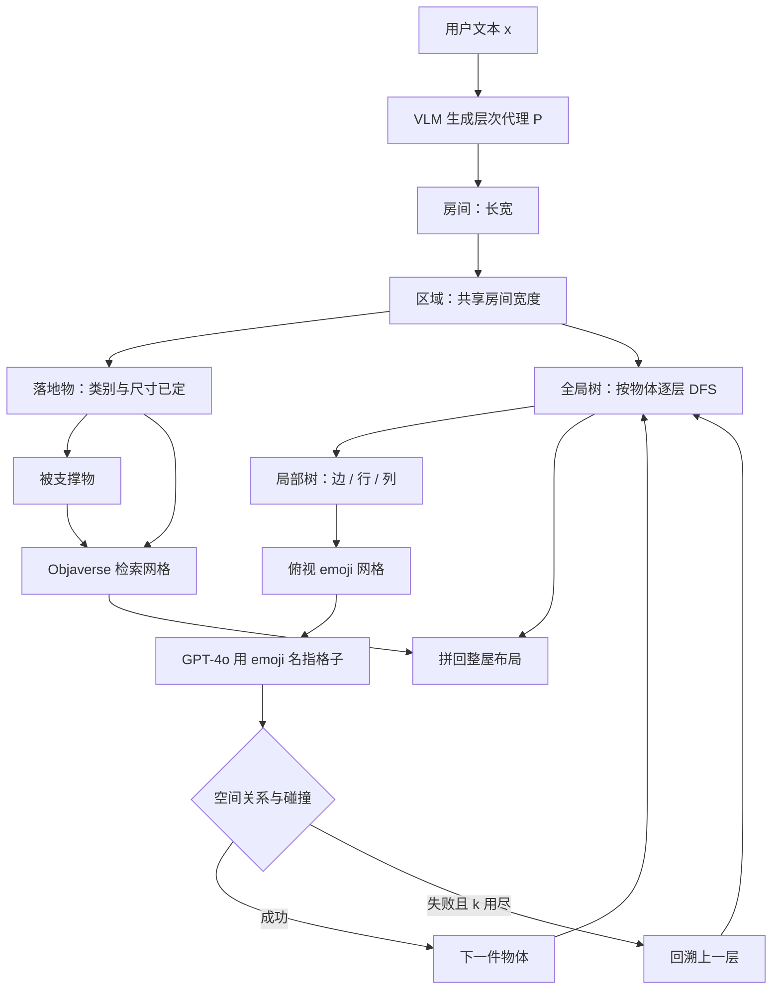

# 全局-局部树搜索：VLM 摆房间，先摆错的家具必须能改

<!-- release-date: 2025-03-24 -->

> 本文依据北京邮电大学 State Key Laboratory of Networking and Switching Technology 的 **Global-Local Tree Search in VLMs for 3D Indoor Scene Generation**，即 [arXiv:2503.18476v2](https://arxiv.org/abs/2503.18476)（2025-03-25 修订，10 页），CVPR 2025。动笔前核过 arXiv 官方提交历史：v1 于 2025-03-24 09:21:13 UTC 首次公开，v2 于 2025-03-25 02:21:09 UTC。本地件封面水印为 `arXiv:2503.18476v2 [cs.CV] 25 Mar 2025`，10 页，与官方最新预印一致，**未做替换**。CVPR Open Access 条目是 [Deng, Qi, Ma；会议录 8975–8984](https://openaccess.thecvf.com/content/CVPR2025/html/Deng_Global-Local_Tree_Search_in_VLMs_for_3D_Indoor_Scene_Generation_CVPR_2025_paper.html)。本文数字一律回这份 10 页 PDF，不用会议录页码。
>
> 全文 `(PDF p. N)` 指打开这份 PDF 时的第 N 页。页脚印着 `1` 到 `10`，与 PDF 页码一致。第 9–10 页是致谢与参考文献，**没有附录**。
>
> `release-date` 取 **2025-03-24**。这是一篇方法论文：没有向公众开放的模型、API 或官方权重。按「技术首次官方公开日」，arXiv v1 是目前能核到时间戳的最早官方公开事件。PDF 写了代码仓 [https://github.com/dw-dengwei/TreeSearchGen](https://github.com/dw-dengwei/TreeSearchGen)。仓库 `created_at` 为 2025-03-21T09:41:55Z，早于 arXiv 三天，但按本模块规则**不能当首发日**。截至撰写，GitHub API 能看到的提交只有 4 条，全部在 2026-06-04 至 2026-06-05；最早一条 `253322f`（2026-06-04T11:21:41Z，message 为 `init`）没有父提交，内容已经带上 2026 扩展（Paint3D、MCTS、PRM）。2025 年的占位 README 已被覆写，无法证明当时有可克隆的实质代码。Hugging Face Papers 页的日期只是 arXiv 日期，**不用仓库 `createdAt`**。
>
> 单位：Wei Deng、Mengshi Qi*（通讯）、Huadong Ma，全部挂北京邮电大学。目录按高校主导放在 `BUPT`。
>
> 文中始终区分三件事：**报告写了什么**、**本文如何解释**、**哪些是外部补充**。凡是从图里读出来的、从 GitHub 现状补进来的，都会当场说明。
>
> 边界说明：仓库 description 写着「arxiv 2026 extension」。那是后续工作 [arXiv:2606.06002](https://arxiv.org/abs/2606.06002)（Global-Local Monte Carlo Tree Search，PRM 引导的 MCTS、重贴图、3DTindo-Bench），**禁止把 2026 扩展的数字或方法并进本文**。只写这份 10 页 CVPR 论文。同方向已发布的 CAST、HunyuanWorld 1.0、TRELLIS 解决的是重建或单物体生成，不要把那些篇的人评或秒数读成本报告的实验。

## 先讲矛盾：VLM 摆房间走的是链条，人摆房间走的是树

先把场景摊开，再上名词。

给模型一句「中等大小、带阅读角的舒适卧室」，它要产出一间能看、能走、家具不穿墙也不叠在一起的 3D 室内。报告开篇把难处写得很具体：高质量场景的第一件事，不是把每件家具单独生成得更像，而是把物件之间说得通的空间关系建出来，也就是 3D 布局（PDF p. 1）。

旧路有两条，报告都认为不够（PDF p. 1–2）：

**在 3D 场景数据上训生成模型。** GAN、VAE、扩散、自回归都可以。问题是室内场景标注贵、规模小。报告拿两组数对照：3D-FRONT 大约 18k+，Objaverse 大约 800k+，Objaverse-XL 大约 10M+。场景数据比单物体数据小一到两个数量级，训出来的模型不稳（PDF p. 2）。

**把布局交给已经见过海量常识的视觉语言模型（Vision-Language Model，VLM）。** LayoutGPT 从文本直接吐每件东西的尺寸、位置、朝向，格式还做成 CSS（PDF p. 2）。HoloDeck、AnyHome 先让语言模型出场景图，再用规则把图变成房间。报告的批评是：预训练语言模型并不能真正感知空间，物件会相交；规则本身又不完备，多样性低、结果不实用（PDF p. 2）。

真正卡住 VLM 的，不是它不懂「床头柜该在床旁边」，而是它的推理形态不对。报告把这件事画在 Figure 1 里（PDF p. 1）：

现行 VLM 在推理时是 **token 级、从左到右** 的决策（PDF p. 2，引用 Tree-of-Thoughts）。先写下的家具改不了。床如果已经超出房间，后面的床头柜、台灯只能接着这个错误往下排。错误会累积，最后得到超房间、穿模、不真实的布局。

人摆房间不是这样。报告用一段很短的生活过程来对照（PDF p. 2）：

1. 一件一件放；
2. 每件东西本来就有多个候选位置，先挑一个，再放下一件；
3. 发现这件挡住了后面的，就回去改前面那次选择。

所以问题空间是一棵树，不是一条链。树的每一层是一件物体，同一层的各个节点是这件物体的候选摆法。从根走到最后一层的一条链，才是一个布局解。搜索时要满足：不超出空间、符合摆放常识、不重叠、不悬空（PDF p. 2）。

本文要讲的方法，就是把室内生成改写成带这些约束的规划，并让 VLM 在树上搜，而不是一次把房间写完。

## 读之前只需要这几个词

下面这些词正文都会用到。这一节是读前背景，不全是论文自己定义的。

**VLM（视觉语言模型）。** 能看图、能读字、能按指令往下写的模型。本报告实验用的是 OpenAI GPT-4o API（PDF p. 6）。摘要里写的是 GPT-4（PDF p. 1），不要把两个名字当成两个实验设置。

**IO / CoT / ToT。** 标准输入输出（Input-Output，IO）是一问一答，直接吐最终布局。思维链（Chain-of-Thought，CoT）让模型先写中间步骤，但仍是一条链，错了不能回头。思维树（Tree-of-Thoughts，ToT）在每一步保留多个候选，再用经典搜索找解。本报告明确说自己受 ToT 启发（PDF p. 3）。

**布局参数。** 每件物体写成四元组 $o_i=(c_i,s_i,p_i,r_i)$：类别、尺寸、位置、朝向（PDF p. 3）。层次结构先把 $c_i$ 和 $s_i$ 定下来，树搜索要解的是 $p_i$ 和 $r_i$。

**锚点物体（anchor）。** 一个功能区里代表主功能的那一件。客厅里是沙发，卧室休息区里是床。其它落地物相对锚点来摆，关系边记成 $e_{i,a}$（PDF p. 3）。

**落地物 / 被支撑物（floor object / supported object）。** 落在地板上的叫落地物；放在桌子、床头柜上的叫被支撑物。衣柜、落地灯不能当支撑面，书桌、床头柜可以（PDF p. 4）。

**俯视图网格 + emoji。** 把房间从上往下切成格子。墙上是砖块 emoji，区域边界是白色棋子（go）emoji，空格子填互不相同的 emoji。VLM 不报 xyz 数字，而报 emoji 的名字，例如汉堡和大象（PDF p. 4–5，Figure 4）。

**倒排名次（reciprocal rank）。** 人把同一句提示下的几种结果排序。排第一记 $1/1=1$，排第二记 $1/2=0.5$。越接近 1，说明越常被标成最好。它依赖「这一次跟谁比」，不能跨表直接比大小。

**CLIP score。** 这里不是生成质量的万能分。报告按 HoloDeck 的做法：用 OpenCLIP 的 ViT-L/14（LAION-2B 预训练），算俯视渲染图和模板句 `a top-down view of [scene type]` 的余弦相似度，再乘 100（PDF p. 6）。

**Objaverse-1.0。** 3D 物体库。本方法不生成家具网格，而是按 HoloDeck 的流程检索：CLIP 看外观、Sentence-BERT 看文本、再加尺寸偏差（PDF p. 4）。

## 一句话先说清

报告的主张可以压成一句（PDF p. 1–2）：

> **室内 3D 生成是带空间与布局常识约束的规划。先用层次结构（房间 / 区域 / 落地物 / 被支撑物）把问题树砍浅，再在每个区域里做全局物体级树搜索；每件物体的位置再拆成局部参数级树搜索。VLM 看的是填了 emoji 的俯视格子，用 emoji 名字指位置。**

它不是「再训一个更大的场景生成器」，也不是 LayoutGPT 那种一次写出全部 CSS 参数。流水线按论文 §4–§5 是（PDF p. 3–5）：

- 用户文本 → VLM 生成层次场景表示，作为文本和 3D 之间的代理 $P$；
- 各区域独立生成，再拼回整屋；
- 每个区域里：先放锚点，再按尺寸从大到小放其余落地物；
- 全局树负责「下一件放哪」，局部树负责「这一件的边、行、列」；
- 走不下去就回溯；
- 网格上的物体从 Objaverse 检索，不是当场生成几何。

实验骨干是 GPT-4o API。树的宽度 $k$ 很小：全局锚点 $k=3$、其它物体 $k=1$；局部选边 $k=2$、其它步 $k=1$（PDF p. 6）。这些数字论文写了才写，不要自行补成「充分展开的束搜索」。

## 报告地图：10 页里各写了什么

这份论文很短。方法集中在第 3–5 页，表和图集中在第 5–8 页，没有附录。先摊开，后面才不会把「报告写了」和「我们以为它写了」混在一起。

| 报告章节 | PDF 页 | 讲了什么 | 密度 |
|---|---|---|---|
| 标题、摘要、Figure 1 | p. 1 | 规划问题；链条 vs 树；代码链接 | 高 |
| §1 引言收束 | p. 2 | 自回归改不了旧决策；层次砍树深；三条贡献 | 高 |
| §2 相关工作 + ToT | p. 2–3 | 数据驱动 vs VLM；LayoutGPT / HoloDeck / AnyHome；CoT 与 ToT | 中 |
| §3 问题形式化 | p. 3 | IO / CoT / 代理 $P$；全局是物体级、局部是参数级 | 高 |
| §4 层次表示 + Figure 2 | p. 3–4 | 房间 / 区域 / 落地物 / 被支撑物；锚点与边；Objaverse 检索 | 高 |
| §5 起 + emoji 网格 | p. 4 | 俯视离散化；朝向规则；全局 DFS | 高 |
| Figure 3–4 + §5.1–5.2 | p. 5 | 全局树与局部树；边 / 行 / 列三步；Table 1 示例提示 | 高 |
| §6.1–6.3 + Table 2 + Figure 5 | p. 6–7 | GPT-4o、$k$、CLIP、15 人排序；对 HoloDeck / AnyHome | 高 |
| Figure 6–8 + §6.4–6.5 + Table 3 | p. 7–8 | 定性、回溯中间态、复杂提示；IO / CoT 消融 | 高 |
| §7 结论 + §8 致谢 | p. 8–9 | 未来要做室外和 AR/VR；基金号 | 低 |
| 参考文献 | p. 9–10 | 无附录、无补充实验 | — |

读正文前先记住这几件缺口，数字才不会被补全：

- **没有附录。** 提示词全文、网格分辨率（每格多少米）、API 调用次数、费用、时延，一个都没给。
- **树很窄。** 非锚点全局 $k=1$，局部除选边外也是 $k=1$。作者自己把 CLIP 相对 CoT 几乎打平，归因到这里（PDF p. 8）。
- **人评有两张表，比较集合不同。** Table 2 是和 HoloDeck、AnyHome 三人排序；Table 3 是和 IO、CoT 三人排序。倒排名次不能跨表当同一指标。
- **AnyHome 只拿到粗结果。** 官方代码没有 refinement 阶段，脚注写明了（PDF p. 6）。
- **没有碰撞率、出界率、悬空率的单独表。** 这些约束写在问题定义里，评测走 CLIP 和人排。
- **物体几何来自检索，不是生成。** 层次对了、位置对了，模型本身仍可能难看。

阅读路线：先看矛盾和全景，再按四个核心设计走（层次 → emoji 网格 → 全局树 → 局部树），然后是实验拆解和缺口。**如果只有十五分钟，读「先讲矛盾」「核心一」「核心二」「实验」和「最后的判断」就够了。**

## 全景：文本 → 层次代理 → 每个区域一棵树 → 检索网格

按 Figure 2、Figure 3（PDF p. 4–5）和 §3 的公式重画。这张图只表示模块怎么连，不含耗时、调用次数或精度。

报告把从文本到场景的映射拆成两段（PDF p. 3）：

$$
p^{x \to S} = p^{P \to S}(S \mid P)\, p^{x \to P}(P \mid x)
$$

第一段 $p^{x \to P}$ 只负责层次结构：房间多大、切成哪几个功能区、每区有哪些物体、谁是锚点、边是什么。此时位置 $p_i$ 和朝向 $r_i$ 还没定。第二段 $p^{P \to S}$ 才是全局-局部树搜索，专门解摆放。

这样拆的原因，报告写得很直：文本和 3D 场景之间语义鸿沟大，IO 和 CoT 都很难直接从 $x$ 映射到 $S$；而且两者都是从左到右，不能改前面的决策（PDF p. 3）。

## 核心一：层次表示——用常识桥把一棵深树切成几棵浅树

复杂房间物体一多，树就会很深。报告的关键洞察是：室内结构本身是分层的，可以先按层次生成代理，再分区独立摆（PDF p. 2）。

Figure 2 从左到右四层（PDF p. 4）：

**房间。** 根节点。VLM 给出长和宽 $\mathrm{dim}=(l,w)$。

**区域。** 按功能切，例如卧室切成休息区和办公区。每个区域有自己的 $\mathrm{dim}_i=(l_i,w_i)$。报告强制各区域**共享房间的宽度**，只沿长度切开，好算区域原点和区域内的绝对坐标（PDF p. 3）。

这一条是简化，不是一般的二维空间划分。**本文的解释：** 房间被切成并排的长条，而不是任意多边形功能区。后面所有「区域内摆放」都发生在这种长条里。论文把这写成「为了便于计算」，没有另做消融。

**落地物。** 每件落地物只属于一个区域。VLM 先出类别和尺寸，再选出锚点，再给其它物体相对锚点的边。边只能从三个选项里选：`place_front`、`place_beside`、`place_around`（PDF p. 4）。

锚点自己还有落位规则：`place_along_wall`、`place_in_center`、`place_at_corner`。锚点始终朝向区域内的空地。锚点的位置和朝向之所以重要，是因为其它物体都靠 $e_{i,a}$ 来推（PDF p. 4）。

**被支撑物。** 在能当支撑面的落地物上再长一层，流程与落地物类似。

物体网格不在这一步生成。检索按 HoloDeck：CLIP 视觉相似、Sentence-BERT 文本相似、尺寸偏差，库是 Objaverse-1.0（PDF p. 4）。

层次的直接收益，报告在定性节说得很清楚：浴室里不允许出现休息区，厨房里不允许出现用餐区，因此 HoloDeck 把扶手椅放进浴室、AnyHome 把餐桌放进厨房这类语义错误，会被结构挡住一层（PDF p. 7，Figure 6 D、E）。

**代价 / 边界。** 区域共享宽度、边和锚点规则都是闭集。VLM 再有常识，也只能在这张菜单里选。厨房这种「家具基本靠墙、物体之间没有明显相对关系」的房间，层次帮不上太多忙——后面 CLIP 表会打到这一点。

**可迁移启发。** 规划问题不要把全部物体塞进同一条决策链。先用领域结构把搜索空间切成可独立求解的子树。这里的领域结构是室内功能分区；换成代码生成或 UI 布局，对应的是模块边界，而不是「再写长一点的 CoT」。

## 核心二：emoji 网格——不要让 VLM 直接回归 xyz

树搜索要问 VLM「下一件放哪」。如果问的是连续坐标，模型得吐一串数字，还得自己保证不穿墙、不叠床。报告选择另一条路：把俯视布局离散成稠密格子，已有物体画成矩形，锚点标红，空着的候选格填上互不相同的 emoji，然后问模型这些格子的名字（PDF p. 4–5，Figure 4）。

Figure 4 的例子很具体。床在左侧，书桌在右上。现在要在锚点右侧放一张占两列的床头柜。右侧格子里是汉堡、大象之类互不相同的图案。VLM 的回答是「Hamburger」和「Elephant」，不是 $(x,y,z)$（PDF p. 5）。

墙上是砖块 emoji，区域边界是白色棋子 emoji，用来把「不能放」和「能放」从视觉上分开（PDF p. 5）。

**报告写了什么：** 格子要彼此可区分，所以填 diverse emojis；VLM 用 emoji 的名字描述位置（PDF p. 1、p. 4）。

**本文如何解释，不是报告原句：** 连续数字对 VLM 不友好。相邻格子的坐标长得很像，`1.37` 和 `1.73` 差一个字符，空间上可能已经穿模。emoji 把「哪一格」变成离散、可指称、视觉上能分开的标记。这更接近给模型一套它本来就会的指代语言，而不是逼它当回归器。

局部搜索里，行、列两步都要求选出的 emoji 数量等于物体尺寸所占的格数（PDF p. 5）。物体有多大，就占多少个连续名字。这把尺寸约束写进了提问格式，而不是事后用数字比较。

**代价 / 边界。** 论文只说 dense grid，**没写每格多少米、房间被切成多少行多少列**。分辨率一旦太粗，床头柜只能对齐到格子；太细，候选 emoji 变多，VLM 也更容易指错。这个权衡实验里没有。朝向也不走网格：非锚点的朝向是四条规则（朝向锚点、背对锚点、与锚点同向、与锚点反向），由锚点位姿推出来（PDF p. 4）。所以这套接口本质是 **2D 俯视离散位置 + 离散朝向规则**，不是完整的 6D 连续位姿。

**可迁移启发。** 凡是要模型输出几何参数，先问：有没有一种离散、可指称、能画在图上的标记，能代替裸坐标？表格单元格、棋盘编号、Set-of-Mark 的数字标签，和这里的 emoji 是同一类接口。标记必须互不相同，否则「左边那两格」又会指糊。

## 核心三：全局树——物体级 DFS，走不下去就改前面那件

层次把整屋切成区域之后，每个区域内的摆放被当成一棵树（PDF p. 4–5，Figure 3）。

全局树是物体级求解器。根是区域。每一层是一件物体。先在空区域里放锚点，其余物体按尺寸降序放——大的先放，小的后放（PDF p. 5）。

给定已经放好的状态 $s_i=\{o_1,\ldots,o_i\}$、下一件与锚点的关系 $e_{i+1,a}$，思想生成器最多提出 $k$ 个候选：

$$
o_{i+1}^{(j)} \sim p_\theta(o_{i+1} \mid s_i, e_{i+1,a}), \quad j=1,\ldots,k
$$

$p_\theta$ 就是下一节的局部树（PDF p. 5）。

搜索用深度优先（DFS），不是广度优先。本篇 CVPR 没有用蒙特卡洛树搜索；那是 2026 扩展里的事，本文不写。算法从区域根往下走：局部树若能在第 $i+1$ 层给出一个满足空间关系、且放得下的思想，就进下一层；否则同一层最多试 $k$ 次。$k$ 次都失败，说明 $o_1,\ldots,o_i$ 很可能已经摆坏，回溯到第 $i$ 层重试（PDF p. 5）。全部物体都成功落地，搜索结束。

Figure 7 把回溯画成可见过程（PDF p. 8）：房间先切成 rest / work 两区；rest 区里第 2 件物体因为空间不够放不进去；回溯到第 1 件，把它转一下，第 2 件就有空位；然后再生成另一区的落地物和被支撑物。

**收益。** 链条方法里，床一旦贴错墙，后面整条链都在错误上推理。全局树把「发现不对就改」写成算法，而不是指望模型自己在同一条 CoT 里反省。

**代价 / 边界，而且数字不大。** 实验里全局锚点 $k=3$，其它物体 $k=1$（PDF p. 6）。也就是说，**非锚点在全局这一层几乎没有分支**，真正的多候选主要发生在锚点，以及局部树的「选哪一侧」。作者把 $k$ 写成效果和 API 费用的折中：太小找不到好解，太大搜索空间和费用都会爆（PDF p. 6）。消融节承认，过小的 $k$ 让方法没有充分探索问题空间；算法又会为了全局可行而剪掉子树，丢掉局部更优的解（PDF p. 8）。

**可迁移启发。** 「能回溯」和「真的展开了树」不是一回事。如果除根以外 $k=1$，名义上的树搜索会退化成「失败才回头的 CoT」。自己做规划循环时，要把宽度预算花在真正会锁死后续步骤的那些决策上——这里是锚点，而不是每一个杯子。

## 核心四：局部树——一件家具的摆放，再拆成边、行、列

局部树是全局树的思想生成器。输入是关系 $e_{i+1,a}$ 和当前布局 $s_i$，输出是下一件的位置 $p_{i+1}$（PDF p. 5）。朝向不在这棵树上搜，前面已经用规则定好了。

位置被拆成三步，每步仍然有多个候选，所以又是一棵树（PDF p. 5，Figure 3）：

1. **选边。** 在俯视里相对锚点的左、右、上、下。
2. **选主轴。** 若选了上或下，就定行；若选了左或右，就定列。
3. **选另一轴。** 上一步定了行就在这里定列，反之亦然。

每一步都把俯视 emoji 网格和文本指令一起喂给 VLM，并要求它按布局常识来想（PDF p. 5）。选边时选一个方向；选行、列时，选出的 emoji 个数必须等于物体尺寸。

评估也分步。选边之后，先问这一侧有没有合适位置；最后一步检查新物体的包围盒会不会和已有物体相交。评估器只回答当前步成不成功（PDF p. 5）。

局部搜索同样 DFS。如果三层思想在最大 $k$ 次尝试下仍然拿不齐，就宣告全局树没法放当前这件物体，把失败交回上一层（PDF p. 5）。实验里局部选边 $k=2$，其余步 $k=1$（PDF p. 6）。

把三步连起来，一件床头柜的决策不再是「给我一个 xyz」，而是：

> 靠床的哪一侧？这一侧哪几行（或列）够长？另一方向从哪一格起跳？会不会撞上书桌？

每一步都小到预训练 VLM「可以给出可靠回答」——这是定量节作者自己的解释（PDF p. 6）。

**代价 / 边界。** 相交检查写的是包围盒，不是网格级精确碰撞，更不是物理仿真。浮动（非悬空约束）写在问题定义里（PDF p. 2），局部三步并没有单独的「离地高度」搜索；被支撑物的高度由支撑面决定。论文没说局部树要调多少次 VLM，也没说评估失败时是模型自己看图，还是程序算包围盒。最后一步「检查 bounding box 是否相交」的表述更像程序规则，选边那一步则明确是在 prompt VLM（PDF p. 5）。两者不要混成同一种评估器。

**可迁移启发。** 子任务要拆到模型的可靠区以内。连续位姿是不可靠区；「左还是右」「占哪两个名字」是可靠区。能用确定性规则收尾的（包围盒相交），就不要再问一次模型。

## 实验证明了什么，又没证明什么

设置在 §6.1（PDF p. 6）。ChatGPT 生成 120 条提示，四类场景各 30 条：浴室、卧室、厨房、客厅。每条包含尺寸档（small / medium / large）和一句布置描述。Table 1 只是示例，不是全部 120 条。实验用 OpenAI GPT-4o API。CLIP 按上面写的 OpenCLIP ViT-L/14。人评：Blender 俯视渲染，同一输入的不同方法配对并打乱，15 名标注者排序，问的是哪张更真实、更符合常识，位置和朝向一起看（PDF p. 6）。论文**没写这 15 人看了 120 条里的多少条**。

对照方法是 HoloDeck 和 AnyHome，不是把 LayoutGPT 官方数字搬过来。IO 消融被写成类似于 LayoutGPT，是作者自己的输入输出基线（PDF p. 6、p. 8）。AnyHome 因为官方代码缺少 refinement 阶段，只评了粗布局（PDF p. 6 脚注）。

### CLIP：多数场景赢，厨房例外，对 CoT 几乎打平

Figure 5 是柱状图，数字从该图读取（PDF p. 7）。五组从左到右是本文、HoloDeck、AnyHome、CoT、IO。

| 场景 | 本文 | HoloDeck | AnyHome | CoT | IO |
|---:|---:|---:|---:|---:|---:|
| 浴室 | 28.68 | 27.65 | 21.44 | 29.14 | 24.35 |
| 卧室 | 29.93 | 29.59 | 29.58 | 30.05 | 24.58 |
| 厨房 | 27.13 | 27.37 | 25.08 | 26.47 | 24.96 |
| 客厅 | 30.18 | 28.95 | 26.10 | 29.42 | 24.92 |
| 平均 | 28.98 | 28.39 | 25.55 | 28.77 | 24.70 |

正文与图一致的几句（PDF p. 6、p. 8）：

- 卧室 29.93、客厅 30.18，高于其它方法。作者解释：这两类有明显空间关系，例如电视柜在沙发前、床头柜在床边。
- 厨房比 HoloDeck **低 0.24**。作者解释：厨房常把物体靠墙放，物体之间没有明显相对关系。
- 相对 CoT，平均只高 **0.21**；浴室低 0.46，卧室低 0.12。作者把原因写给过小的 $k$，以及「失败就剪子树、丢掉局部最优」；CoT 会忽略放失败的物体，反而可能停在局部好看的布局上。

所以 CLIP 支撑的是「整体略优于两条规则系统和 IO」，**不支撑「树搜索在分数上明显超过同配方的 CoT」**。

### 人评 Table 2：和 HoloDeck、AnyHome 比，倒排名次 0.793

Table 2（PDF p. 6）：

| 方法 | 浴室 | 卧室 | 厨房 | 客厅 | 平均 |
|---|---:|---:|---:|---:|---:|
| AnyHome | 0.421 ±0.16 | 0.422 ±0.19 | 0.528 ±0.26 | 0.401 ±0.15 | 0.443 ±0.20 |
| HoloDeck | 0.660 ±0.27 | 0.577 ±0.24 | 0.585 ±0.27 | 0.563 ±0.23 | 0.596 ±0.25 |
| 本文 | 0.751 ±0.29 | 0.834 ±0.25 | 0.719 ±0.29 | 0.868 ±0.23 | 0.793 ±0.27 |

正文换算：平均 0.793 相当于在标注者中排到 $1/0.793=1.26$ 名；相对 AnyHome +0.360、相对 HoloDeck +0.197（PDF p. 8）。用表内四位小数重算，相对 AnyHome 是 $0.793-0.443=0.350$，与正文 +0.360 差 0.010；相对 HoloDeck $0.793-0.596=0.197$，一致。**表是数字来源，正文那句 +0.360 与表不完全对齐，按表。**

另有一处正文笔误式出入：§6.4 写卧室倒排名次 0.846（PDF p. 8），Table 2 卧室是 0.834。客厅 0.868 两边一致。下面引用卧室时用表。

定性 Figure 6 与层次解释是对齐的（PDF p. 7）：本文客厅里椅子在书桌前、沙发 / 茶几 / 电视柜中心对齐；HoloDeck 倾向靠墙，房间中央空一大块，浴室里还出现不该出现的扶手椅；AnyHome 把餐桌椅放进厨房。这些是看图结论，没有另附「语义不一致率」。

### 人评 Table 3：和 IO、CoT 比，平均 0.750

消融把 IO、CoT 写成自己方法的特例（PDF p. 8）：IO 没有多步中间思想；CoT 逐步放，但每步不展开多候选，失败也不改前面。实现上是把全局和局部的最大尝试次数都改成 $k=1$。

Table 3（PDF p. 8）：

| 方法 | 浴室 | 卧室 | 厨房 | 客厅 | 平均 |
|---|---:|---:|---:|---:|---:|
| IO | 0.437 ±0.23 | 0.350 ±0.09 | 0.441 ±0.22 | 0.356 ±0.11 | 0.396 ±0.18 |
| CoT | 0.681 ±0.26 | 0.702 ±0.25 | 0.676 ±0.27 | 0.685 ±0.25 | 0.686 ±0.26 |
| 本文 | 0.714 ±0.27 | 0.780 ±0.25 | 0.714 ±0.27 | 0.790 ±0.25 | 0.750 ±0.26 |

正文写：平均 0.75，相对 IO +0.381、相对 CoT +0.064（PDF p. 8）。用表内平均重算：相对 CoT $0.750-0.686=0.064$，一致；相对 IO $0.750-0.396=0.354$，与正文 +0.381 不一致。**仍按表。抽取文本里的 0.75 / +0.381 / +0.064 必须回到这张表，不能只信散文。**

两张人评表的「本文」平均分别是 0.793 和 0.750，差的不是模型变了，是排序集合变了。三人里总有一个倒数，倒排名次会被对手强弱拉动。

IO 差，作者给的原因是 LLM 训练集里 3D 布局样本不多；层次代理加上把任务拆小，才把 IO 拉开（PDF p. 8）。CoT 已经继承层次和任务分解，所以人评仍领先、但领先幅度小，CLIP 几乎持平。这和「$k$ 很小」是同一条因果链，不是另做了一次更宽的搜索。

Figure 8 是场景可控性的演示：L 型沙发 2.5 m × 0.8 m、圆桌在沙发前、0.8 m × 0.8 m 的扶手椅在沙发旁、桌上两只杯子一本书。作者把它归因于 VLM 能读细指令（PDF p. 8）。这是单例，没有可控性准确率。

## 限制、没写的，以及还不该当成已经解决的事

论文没有独立的 Limitations 小节。结论只说未来要扩展到室外和 AR/VR（PDF p. 8）。下面把「报告自己承认的」「报告没写的」「还不该当成已经解决的」分开。

**报告自己承认的**

- $k$ 是效果和 API 费用的折中；过小搜不透，过大费用极高（PDF p. 6）。
- 完整方法相对 CoT 的 CLIP 提升很小，浴室和卧室还略差；原因包括 $k$ 小，以及失败即剪枝会丢掉局部最优（PDF p. 8）。
- 厨房 CLIP 低于 HoloDeck 0.24，因为靠墙摆放、物体间缺少明显关系（PDF p. 6）。
- AnyHome 对照不是完整官方管线（PDF p. 6 脚注）。

**报告没写、因此不能当成已经公开的**

- GPT-4o 的具体快照名、温度、是否多采样。
- 一次场景多少次 API 调用、多少钱、多少秒。
- 俯视格子的物理分辨率、房间被切成多少行多少列。
- 人评看了多少条场景、如何从 120 条里抽样。
- 碰撞、出界、悬空的单独定量。
- 开源 VLM 能否替换 GPT-4o。全文实验只有这一个闭源 API。
- 区域共享房间宽度这一简化有没有消融。
- 包围盒相交是程序检查还是再问一次 VLM，没有接口级描述。

**还不该当成已经解决的事**

- 「比 SOTA 更真实」成立的范围，是 HoloDeck / AnyHome / 自制 IO-CoT，在 GPT-4o 和 120 条 ChatGPT 提示上。不是任意室内生成器，也不是 LayoutGPT 原论文的主表。
- 「树搜索」在非锚点上宽度为 1，不能理解成充分展开的 ToT。
- 输出是检索来的物件加布局，不是生成式几何，也不能保证材质和光照。
- 2D 俯视离散化不处理堆叠以外的三维姿态，斜靠、悬挂不在这套规则菜单里。
- 2026 仓库里的 MCTS、PRM、Paint3D、3DTindo-Bench **不是这篇 CVPR 的系统**。当前 GitHub README 把两篇写在同一页，读代码时要按论文年份切开。

## 可迁移启发汇总

| 启发 | 出处 |
|---|---|
| 布局是规划，不是一次写完的回归；自回归改不了已写下的家具 | Figure 1，§1（PDF p. 1–2） |
| 用领域层次把深树切成可独立求解的浅树，比把 CoT 写得更长更有效 | §4（PDF p. 3–4） |
| 先定类别和尺寸，再搜位置和朝向；代理 $P$ 负责语义，搜索负责几何 | §3 式（PDF p. 3） |
| 问 VLM 空间问题时，用离散可指称的标记代替裸坐标 | emoji 网格（PDF p. 4–5） |
| 标记必须彼此不同，并画在模型能看见的图上 | Figure 4（PDF p. 5） |
| 能用闭集规则的（朝向、锚点落位、包围盒相交）就不要让模型自由发挥 | §5.1–5.2（PDF p. 4–5） |
| 宽度预算花在会锁死后续步骤的决策上，这里是锚点 | $k$ 设置（PDF p. 6） |
| 名义上的树在 $k=1$ 时会退化；要用消融把 IO / CoT / 真树分开报 | Table 3，Figure 5（PDF p. 7–8） |
| 规则系统在「靠墙、关系弱」的场景可能更稳；常识关系强的场景才轮到 VLM 搜 | 厨房 vs 卧室 / 客厅（PDF p. 6） |
| CLIP 和人排会打架；规划任务至少同时看自动指标和排序 | Figure 5 vs Table 2–3 |

如果只留一条：

> **不要逼模型一次把规划写完。先用层次结构砍树深，再把每一步问成它能指认的离散标记；只有走不通时才回溯。连续坐标、一次性 CSS、以及宽度为 1 的假树，解决的都不是同一个问题。**

## 关键词回看

按它们在流水线里出现的位置串一遍：

- **规划约束**：空间范围、摆放常识、不重叠、不悬空。
- **IO / CoT / 树**：一次写完、逐步写完但不能改、逐步写且能改前面。
- **代理 $P$**：房间 / 区域 / 落地物 / 被支撑物的层次结构，先定类别与尺寸。
- **锚点与边 $e_{i,a}$**：功能区主物体，以及 `place_front` / `place_beside` / `place_around`。
- **全局树**：物体级 DFS，锚点先放，其余按尺寸降序。
- **局部树**：边 → 行或列 → 另一轴。
- **emoji 网格**：俯视离散化，VLM 用名字指格子。
- **$k$**：最大尝试次数；实验里全局 3/1，局部 2/1。
- **Objaverse 检索**：布局之后的网格从哪来。
- **CLIP score / 倒排名次**：自动图文相似 vs 15 人排序；两张人评表不可混用。

## 最后的判断

这篇 CVPR 被实验撑住的核心，不是「VLM 突然会摆房间了」，也不是又一个场景生成网络。物体还是从 Objaverse 检索的。它真正做的是**改推理形态**：把 LayoutGPT 式的一次性参数回归，改成带常识菜单的树搜索，并用层次和 emoji 把每一步问到 GPT-4o 答得比较稳的区域里。

有数字或图支撑的结论：

- 在 120 条提示、GPT-4o 上，人评相对 HoloDeck、AnyHome 平均倒排名次 0.793 vs 0.596 vs 0.443（Table 2，PDF p. 6）。
- 相对自制 IO 的人评优势大（0.750 vs 0.396），相对同配方 CoT 的人评优势小（0.750 vs 0.686）（Table 3，PDF p. 8）。
- CLIP 平均 28.98，高于 HoloDeck 28.39、AnyHome 25.55、IO 24.70；相对 CoT 只高 0.21，浴室和卧室还略低（Figure 5，PDF p. 7）。
- 厨房 CLIP 低于 HoloDeck 0.24，与「靠墙、关系弱」的文字解释一致（PDF p. 6）。
- Figure 7 展示了回溯改锚点朝向之后能放下下一件（PDF p. 8）。这是机制演示，不是成功率。

只被演示、或被作者观察解释的：

- 层次能减少浴室里的扶手椅、厨房里的餐桌这类语义错误（Figure 6）。没有不一致率表。
- Figure 8 的复杂提示可控性。
- 「预训练 VLM 只适合解小步」是对局部树的解释，没有逐步准确率。

实现上仍是黑盒的：格子分辨率、调用次数、费用、开源模型替换、人评抽样。官方仓在论文发表一年多之后才出现可克隆的实质代码，而且第一次实质提交已经混入 2026 扩展，不能用来复述这篇 DFS 系统。

和同方向已发布报告放在一起，位置其实很清楚。CAST 问的是照片里的物件如何长全、对齐、站住；HunyuanWorld 问的是没有 3D 场景数据时怎样生成可走进去的世界；TRELLIS 问的是单物体用什么潜空间。这篇问的是：**文本已经描述了房间，VLM 有常识，但一次性写坐标会把先错的家具写死——怎样把布局当成可以回溯的规划。** 它不生成几何，不估光，不处理室外。它处理的是决策顺序和提问接口。

如果只记一句话：

> **VLM 做室内布局，失败往往不是常识不够，而是链条不能改错。层次把树砍浅，emoji 把坐标换成可指称的格子，全局-局部 DFS 把「发现不对就改」写成搜索；宽度很窄、依赖闭源 API、厨房这种弱关系场景仍可能输给规则。**

## 资料与阅读边界

**原件与版本核验**

- 本地 PDF：`papers/BUPT/Global-Local-Tree-Search.pdf`，即 [arXiv:2503.18476v2](https://arxiv.org/abs/2503.18476)，2025-03-25 修订，10 页。
- 版本核对：arXiv 官方提交历史只有两版——v1（2025-03-24 09:21:13 UTC，10,052 KB）与 v2（2025-03-25 02:21:09 UTC，10,052 KB）。本地件 10 页，左侧水印 `arXiv:2503.18476v2 [cs.CV] 25 Mar 2025`，与官方最新预印一致，**未做替换**。
- 会议：CVPR 2025。Open Access：[Deng, Qi, Ma](https://openaccess.thecvf.com/content/CVPR2025/html/Deng_Global-Local_Tree_Search_in_VLMs_for_3D_Indoor_Scene_Generation_CVPR_2025_paper.html)，会议录 8975–8984，DOI Bookmark 10.1109/CVPR52734.2025.00839。本文页码不使用 8975 这种会议录页码。
- 署名：Wei Deng、Mengshi Qi*、Huadong Ma；通讯 `qms@bupt.edu.cn`。单位 State Key Laboratory of Networking and Switching Technology，北京邮电大学。

**首发日证据**

- 方法论文，无官方模型 / API / 权重向公众开放，故取技术首次官方公开日。
- arXiv v1：2025-03-24 09:21:13 UTC，提交者 Wei Deng。
- GitHub [`dw-dengwei/TreeSearchGen`](https://github.com/dw-dengwei/TreeSearchGen)：`created_at` 2025-03-21T09:41:55Z，不能当首发日。当前历史从 `253322f`（2026-06-04T11:21:41Z，`init`，无父提交）起，已含 2026 扩展；2025 年未见可核的实质代码提交。占位 README 不算公开实现。
- Hugging Face Papers 页日期是 arXiv 日期，不用 `createdAt`。

**报告直接引用、正文用到的方法**

- LayoutGPT，Feng 等，NeurIPS 2023（一次性 CSS 布局；本 PDF 的 IO 对照写成类似于 LayoutGPT，没有搬 LayoutGPT 原表数字）。
- HoloDeck，Yang 等，CVPR 2024（场景图 + 规则；检索流程与 CLIP 指标来源）。
- AnyHome，Fu 等，ECCV 2025（本 PDF 引用；对照为其粗布局）。
- Tree-of-Thoughts，Yao 等，NeurIPS 2023（树搜索启发）。
- Chain-of-Thought，Wei 等，NeurIPS 2022。
- CLIP / OpenCLIP，Radford 等 2021、Schuhmann 等 2022；Sentence-BERT，Reimers 与 Gurevych，EMNLP 2019。
- Objaverse / Objaverse-XL，Deitke 等；3D-FRONT，Fu 等，ICCV 2021。

**外部补充，不是本 PDF 内容**

- GitHub 仓库现状、2026-06 的 `init` 提交、README 里的 arXiv:2606.06002、MCTS / Paint3D / PRM / 3DTindo-Bench，全部是论文之后的事。
- 当前 README 上的 arXiv 徽章曾指向 2503.16113，与本篇 2503.18476 不一致。以本 PDF 与 arXiv 摘要页为准，不把徽章编号写进方法。
- 同方向已发布解读只对照问题粒度，不借用实验数字：`reports/ShanghaiTech/CAST.md`、`reports/Tencent/HunyuanWorld-1.0.md`、`reports/Microsoft/TRELLIS.md`。
