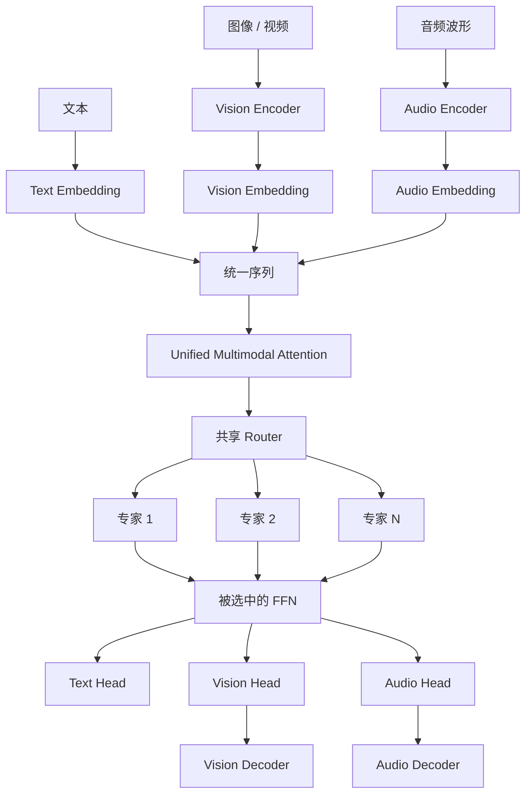
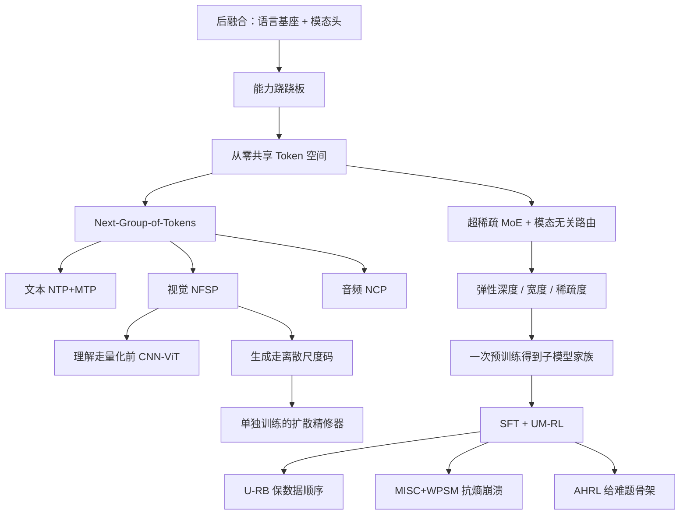

# ERNIE 5.0：不要先训好语言，再把视觉和音频挂上去

<!-- release-date: 2025-11-13 -->

> 本文依据 ERNIE Team, Baidu 发布的 **ERNIE 5.0 Technical Report**，即 arXiv:2602.04705v1，2026-02-04 提交，共 36 页。封面水印为 `arXiv:2602.04705v1 [cs.CL] 4 Feb 2026`。动笔前核过 [arXiv 摘要页](https://arxiv.org/abs/2602.04705)，目前只有这一版，本地 PDF 就是这份。页码均指 PDF 自身页码。文中会明确区分三件事：报告写了什么、我们如何解释、哪些是外部资料补充。
>
> `release-date` 取 **2025-11-13**。这是对外产品，取百度官方新闻稿写明 Preview 经 ERNIE Bot / 千帆向公众开放的日期，不是 arXiv 上传日。索引里的「2.4T」是产品口径，**本 PDF 没有写总参数 2.4 万亿**。ERNIE 5.1 是后续纯文本产品、无独立报告，数字不进本文实验。完整证据见文末。

## 读前先认几个词

后面会反复出现这些名字。第一次读时只要记住括号前那句人话。

- **后融合（late fusion）**：先训好一个语言模型，再在外面接视觉编码器、图像生成器或语音头。理解走一套，生成走另一套。
- **能力跷跷板（ability seesaw）**：后融合常见的副作用。跨模态变好时，原来的语言能力往下掉；保语言时，跨模态又上不去。报告用这个词来形容旧路线（PDF p.3）。
- **统一 Token 空间**：文本、图像、视频、音频先各自编码成一串符号，再排进同一条序列，让主干只看见「下一个该预测哪一组符号」。
- **下一组 Token 预测（Next-Group-of-Tokens Prediction）**：文本仍一次预测下一个词；视觉一次预测同一尺度上的一组图像块；音频一次沿深度预测一组残差码。报告把这三件事收成同一个训练目标（PDF p.4–5）。
- **超稀疏混合专家（ultra-sparse MoE）**：模型里有很多专家，每个 Token 只叫醒其中极小一部分。报告写激活率低于 3%（PDF p.5）。
- **模态无关路由（modality-agnostic expert routing）**：路由器只看 Token 的向量，不看它来自文字、图像还是音频。没有「视觉专家池 / 音频专家池」这种事先划分。
- **弹性训练（elastic training）**：一次预训练里同时练深度、专家池宽度和路由稀疏度不同的子网络，部署时再按显存和延迟裁一份出来。

摘要里 `designed` 被拼成了 `desinged`。不影响内容，后面不再提。

## 一句话先说清

ERNIE 5.0 不是「一个很强的语言模型，再挂视觉头和语音头」。

它主张的路线是：

> **所有模态从零一起训；理解和生成走同一套自回归主干；专家池也不按模态事先切开。**

报告把自己放在一个很具体的位置上：在已经公开披露的模型里，它是第一个生产级万亿参数、同时做多模态理解与生成的统一自回归模型（PDF p.1、27）。这句话是作者声称。后文会拿实验检查它实际证明了什么，以及「同一套权重」到底统一到哪一层。

总参数 2.4 万亿这个数字**不在本 PDF 里**。PDF 只写万亿级、激活率低于 3%，没有给出绝对激活量。2.4 万亿来自百度世界 2025 和后续产品公告，后文会单独标成外部补充。

## 先看矛盾：后融合为什么会变成跷跷板

当代很多系统其实是这样搭的：

1. 先用海量文本训一个自回归语言模型；
2. 视觉理解靠一个冻结或后接的编码器，把图变成语言主干能读的向量；
3. 图像生成、视频生成、语音合成再另接扩散模型、编解码器或 Talker。

报告点名这条路的两个后果（PDF p.3）：

- 生成被从理解里拆出去，优化目标也不再是自回归；
- 跨模态整合变深时，核心语言能力往往被拖下来。

这就是能力跷跷板。可以想成同一块电路板既要跑服务器操作系统、又要实时画图：后加的板卡越强，主板上原来的走线越容易被抢走电源。

报告给的旧方案画像很清楚：自回归主要服务「理解」，输出仍以文本为中心；要生成图像或声音，就给预训练语言模型加模态专用解码器，用非自回归目标去训这些头（PDF p.3）。它点名的后融合例子包括 Seedream 这类生成系统。

ERNIE 5.0 的回答不是「把后融合做得更小心」，而是换前提：

- 文本、图像、视频、音频从预训练第一步就同时出现；
- 异构输入映射进共享 Token 空间；
- 所有模态用同一个 Next-Group-of-Tokens 目标；
- 专家路由不看模态标签。

它认为这样可以让各模态一起长，而不是互相抢参数（PDF p.3）。**这是设计主张，不是已经完成的消融证明。** 报告没有给出「同一份数据、同一规模下，后融合 vs 从零统一」的直接对照。后文读实验时会回到这一点。

## 先看全景：一条序列，三个头，一池专家

根据 Figure 1 重画机制示意，不是实测延迟图（PDF p.4）：

读这张图时有三件容易误读的事：

1. **编码和解码并没有消失。** 视觉和音频仍有专用 Encoder / Decoder，以及各自的 Head。统一的是中间那条 Transformer 主干和共享专家池，不是「整个系统只有一套参数」。
2. **图像理解并不走量化后的视觉词表。** 看图时用的是量化前的 CNN–ViT 特征；画图时才用离散多尺度 Token。后文会把这条分叉讲清楚。
3. **高分辨率精修不在主干里。** 自回归主干先出低分辨率结构和语义，再由单独训练的扩散精修器补细节（PDF p.7）。

所以「统一自回归」在这篇报告里的精确含义是：中间那条序列模型和专家池是一份的；入口、出口和精修器仍然按模态分工。

## 报告地图

按原报告章节把主张、数字和图表钉在页码上。后面每个设计都从这里长出来，不跟摘要跑。

| 报告位置 | PDF 页 | 要记住的东西 |
|---|---|---|
| 摘要 | p.1 | 从零统一自回归；Next-Group-of-Tokens；超稀疏 MoE；弹性训练；作者声称「公开披露里第一个生产级万亿统一理解+生成」 |
| §1 引言 | p.3–4 | 能力跷跷板；模态无关路由；弹性一次跑出子模型家族；UM-RL 三件套 |
| Figure 1 | p.4 | 共享主干 + 三套嵌入 / 三个头 |
| §2.1 主干 | p.4–5 | NTP+MTP（文本）、NFSP（视觉）、NCP（音频）；激活率低于 3%；无辅助损失的负载均衡 |
| §2.2 视觉 | p.5–7 | 图像当单帧视频；CNN–ViT 双路径理解；NFSP 生成；Uni-RoPE；单独训练的扩散精修器 |
| Figure 2 | p.6 | 理解走量化前特征，生成走 Next-Scale / Next-Frame-and-Scale |
| §2.3 音频 | p.7–9 | 12.5 Hz 编解码；RVQ；Whisper 蒸馏第一层语义码；深度向 NCP |
| Figure 3 | p.8 | 理解把多层码相加；生成把残差码沿层深度逐级预测 |
| §3.1 数据 | p.9 | 文本 + 图文 / 视频文本 / 音频文本 / 交错序列；「数万亿文本 Token 与多模态实例」，无配比 |
| §3.2 recipe | p.10 | 8K → 32K/128K；WSD 再余弦；batch 14M→56M；RoPE base 1,000,000 |
| Figure 4 / §3.3 | p.10–11 | 弹性深度 / 宽度 / 稀疏度 |
| §4 后训练 | p.11–15 | 沿用 ERNIE 4.5 的 SFT + UM-RL；U-RB、MISC、WPSM、AHRL |
| Figure 5–7 | p.12–14 | 无偏回放、熵崩溃曲线、提示骨架 |
| §5 基建 | p.15–17 | PaddlePaddle；TP4 / PP12 / EP64；分置 tokenizer；FlashMask；拆分式 RL |
| §6.1–6.3 | p.17–23 | 语言、视觉、音频主表 |
| §6.4.1 路由可视化 | p.23–25 | Figure 8–10：专家会自发分工；理解与生成重叠偏低 |
| §6.4.2 弹性消融 | p.25–27 | 小模型损失表；生产实验模型 53.7% 激活参数 / 35.8% 总参数 |
| §7 结论 | p.27 | 再次重复「第一个万亿级统一框架」 |
| §8 作者 | p.27–28 | ERNIE Team 长名单 |

报告没写、后面也不会补的东西，先记在这里：生产模型的层数、隐层宽度、专家总数、默认 top-$k$、词表大小、各模态数据配比、训练 Token 精确总量、训练卡时、绝对激活参数。

## 核心设计一：先把所有模态变成同一条序列

### 旧问题

模态之间差的不只是「图和字长得不一样」。报告列了三件事：Token 语义、时间结构、优化动态（PDF p.4）。如果只是把视觉向量拼到语言模型后面，优化轨迹会裂开：语言继续做 next-token，图像可能在做扩散去噪，音频可能在做独立的编解码。

### 新设计

所有输入先投影进共享 Token 空间，再串成一条序列，用同一个 Next-Group-of-Tokens 目标训练（PDF p.4–5）。具体落地时，三种模态的「一组」并不一样：

| 模态 | 一组是什么 | 报告里的名字 |
|---|---|---|
| 文本 | 仍然是下一个词，外加一次多词预测 | NTP + MTP |
| 视觉 | 当前尺度上互相可见的一组图像 Token；视频再沿时间加下一帧 | NFSP |
| 音频 | 同一时间步上、从粗到细的一组残差码 | NCP |

文本侧的 MTP 引的是 Gloeckle 等人的多 Token 预测，以及 DeepSeek-V3 那条线上的用法（PDF p.5）。视觉 NFSP 指向 Ji 等人 2026 的工作；音频 NCP 是本报告给出的深度向预测。

人话版：语言模型一次猜一个字；画画时同一分辨率上的许多块可以一起猜；语音则在同一个 80 ms 格子里先猜语义、再猜音色细节。报告把这三件事都叫「预测下一组」，是为了让梯度走同一条自回归轨道，而不是为了让三种输出的物理形状变一样。

### 工作机制

统一之后，主干不再需要「现在是视觉模式还是文本模式」这种开关。注意力看到的是一条混合序列，位置编码再用 Uni-RoPE 区分谁是时间、谁是空间（PDF p.7）：

$$
\text{Uni-RoPE}_i = (t_i, h_i, w_i)
$$

- 文本和音频：$t_i = h_i = w_i$，三个分量都等于序列下标；
- 视觉：$t_i$ 是帧号，$(h_i, w_i)$ 是帧内坐标；多尺度之间按几何中心对齐。

这是在告诉模型：字和声音主要沿一条时间轴走；图像还有高和宽。

### 收益与边界

收益是：从零联合训练成为可能，模态之间可以在 Token 级交互（PDF p.5）。代价也很明确：

- 「一组」的大小、掩码和并行度仍然按模态特制，并不是真的只有一个预测头；
- 视觉理解甚至不用这套离散词表，见下一节；
- 报告没有公开词表大小、各组 Token 的典型长度，也没有公开三种损失的原始量级，只说用了基于后验的损失重加权，把各模态自回归损失拉到同一区间（PDF p.10）。

### 可迁移启发

如果你要做统一多模态，先问的不该是「要不要共用主干」，而是：**每一种模态的「一步」到底对应多长的物理时间或多大的空间块。** 文本一步一个词，音频一步 80 ms（12.5 Hz），图像一步一个尺度。把「一步」对齐了，共享主干才有意义。

## 核心设计二：看图和画图共用主干，但不共用同一双眼睛

这一节对应 Janus-Pro 那篇里的老问题：理解和生成要的视觉表示互相冲突。ERNIE 5.0 没有走 Janus 的「两套编码器、一份主干」那么干净的解耦，而是做了更混的折中。

### 图像被当成单帧视频

报告把图像定义为视频的特例（PDF p.5）。后面专家重叠图会证明，这个定义不是修辞：图像理解与视频理解的专家 IoU 在第一层高达 0.98（PDF p.24，Figure 9）。

### 视觉 Tokenizer：先 2D，再胀成 3D

生成侧需要离散 Token。做法是（PDF p.5–6）：

1. 先训一个因果 2D 多尺度图像 tokenizer，靠大规模图像预训练把空间结构稳住；
2. 再把它胀成因果 3D 卷积 tokenizer，让图像和视频共用一个量化器；
3. 训练时加 GAN 对抗损失，以及来自大规模视觉基座的语义正则，保住场景文字和人脸这类高语义元素。

量化走 bit-wise：比特数直接对应离散词表大小。他们预训了一系列比特数递增的 tokenizer，主干训练时从低比特（小词表、粗粒度）切到高比特（大词表、细粒度），减轻早期不稳定（PDF p.6）。具体比特数和词表大小没有写。

### 理解为什么不肯用量化后的码

量化前要把特征压到和比特宽度对齐的低维。报告认为这会丢掉细粒度语义，而细粒度丢失会伤害理解（PDF p.6）。于是理解支路**绕过量化**，直接用量化前的双路径特征：

- CNN 提供感知细节；
- ViT 提供语义；
- 两者空间对不齐，用 MLP 硬融会互相干扰。

于是有了 Attention-based Patch Merger（PDF p.6–7）。

记 $N$ 为理解 Token 数，$K$ 为每个 Token 聚合的局部 patch 数。图像 $K=4$（空间相邻 4 块），视频 $K=16$（跨相邻 4 帧）。CNN 特征先投影到 ViT 空间，再在 patch 维拼起来：

$$
F_{\mathrm{mrg}} \in \mathbb{R}^{N \times 2K \times D_{\mathrm{vit}}}
$$

对这 $2K$ 个局部向量做多头自注意力，再沿 patch 维平均，得到 $F_{\mathrm{out}} \in \mathbb{R}^{N \times D_{\mathrm{vit}}}$，最后投影到主干嵌入维。

人话：每个理解 Token 先看一小团邻居，让 CNN 的边和 ViT 的语义在这团里互相找对齐，再压成一个向量送给主干。报告称这比 CNN-only、ViT-only 和朴素 MLP 融合都强，文档和图表理解上增益更明显，且没有引入明显算力开销（PDF p.7）。这些对比是作者经验观察，主实验表里没有单独列出 Patch Merger 的消融数字。

### 生成：同一尺度里双向，尺度之间因果

NFSP 把图像生成写成 Next-Scale Prediction，视频再沿时间做 Next-Frame（PDF p.7）：

- 预测某个尺度时，更粗的尺度和更早的帧可见；
- 当前尺度内部互相可见，并行预测；
- 空间从低分辨率走到高分辨率，时间由下一帧建模。

长序列会累积错误，所以训练时随机翻转历史 Token 的比特，强迫模型在当前尺度自我纠正。同时对早期尺度加损失重加权，缓解多尺度 Token 数量不平衡。视频还加了窗口时间注意力和随机历史帧掩码（PDF p.7）。

### 扩散精修器：统一叙事里明确拆出去的一块

自回归在固定模态 Token 预算下很难直接训高分辨率：分辨率一升，序列变长，有效 batch 变小，优化失稳（PDF p.7）。解决办法是级联扩散精修器：

- 主干只出低分辨率、语义和布局正确的样本；
- 精修器负责更高分辨率的细节；
- **精修器与主干分开训练**，用成对的低分辨率退化样本和高分辨率原图 / 原视频。

报告自己写了拆开的理由：避免在同一条主干里同时优化自回归损失和扩散损失（PDF p.7）。

这一点必须说清楚。作者声称理解和生成都在统一自回归框架里；高分辨率观感并不完全由那条自回归主干产生。评 GenEval、VBench 时，读者无法从报告判断分数里有多少来自精修器。

### 可迁移启发

统一不等于消灭分叉。ERNIE 5.0 真正共用的是序列主干；看图需要连续、未量化的细节，画图需要离散、可并行的尺度码，高分辨率还要扩散。**表示冲突没有消失，只是被推到入口和出口。** 若你的项目既要 OCR 又要文生图，先假设这两条路需要不同的视觉前端，再决定哪些层可以共享。

## 核心设计三：音频用深度，而不是把码本拍扁

### 旧问题

神经音频编解码器会把一段波形变成多层残差码。如果把所有码本在时间上拍扁，序列会爆掉：本来 1 秒 12.5 个时间步，4 层码本就会变成 50 个 Token。

### Tokenization

波形先变成 12.5 Hz 的离散码，也就是每秒 12.5 个时间步，一步约 80 ms（PDF p.8）。量化是残差矢量量化（RVQ）：

- 第一层被明确指定为高层语义（语言、语音学线索）；
- 后面各层编码音色、韵律等残差声学细节。

为了让第一层真的像语义，他们用预训练 Whisper 的编码器输出做蒸馏，并对 Whisper 特征做平均池化，对齐到 12.5 Hz（PDF p.8）。

### 理解：多层嵌入相加

理解时，每个时间步的各层码走各自的嵌入矩阵，然后加起来，作为一个音频 Token 放进序列，和文本一起被主干处理（PDF p.8）。这反映 RVQ 的残差结构：每一层补一块更细的信息。

### 生成：Next-Codec Prediction

生成不把多层码拉成一条长序列，而是把残差预测摊到 Transformer 深度上（PDF p.8–9，Figure 3）：

1. 在顶部若干层插入多个音频头；
2. 先预测第一层语义码；
3. 把预测码（训练时用真值，推理时用预测）映回嵌入，加到隐状态上；
4. 再预测下一层，直到所有层完成；
5. 解码器把完整层级码变成波形。

语音合成时，说话人嵌入作为条件插进上下文，控制音色，但不改深度向预测结构（PDF p.9）。

根据 Figure 3 的机制示意（PDF p.8）：理解在输入侧把 $A_{x1}+A_{x2}+\cdots$ 合成一个位置；生成在输出侧沿层 $N-1 \to N$ 逐级吐码。

### 收益与边界

这样音频序列长度由时间步决定，不随码本层数线性膨胀。代价是：顶部层被音频头占用，理解和生成在音频上的计算图并不对称。报告没有公开码本层数、码本大小、说话人嵌入的维度，也没有公开音频损失如何与文本 / 视觉损失加权。

12.5 Hz 比许多实时语音系统更粗。本报告几乎不谈首包延迟，也没有流式语音协议。不要把它读成 Thinker–Talker 式的实时对话系统。

### 可迁移启发

多层码本有两种展开方式：沿时间拍扁，或沿网络深度摊开。前者简单但序列爆炸；后者省长度，却让「某一层 Transformer」承担「某一层声学残差」的职责。选哪种，取决于你更缺上下文窗口，还是更缺层间语义一致性。

## 核心设计四：超稀疏 MoE，路由器不看模态身份证

### 旧问题

统一范式减少了目标函数的裂缝，但消不掉模态之间的本质差异，所以需要很大容量（PDF p.5）。容量一大，如果按模态手工切专家池，超过两个模态时怎么切会非常难做。报告对照了他们前作 ERNIE 4.5 的模态隔离路由（PDF p.5）。

### 新设计

路由器只看统一 Token 表示，不看模态 ID。不同模态的 Token 被派进**同一池**专家（PDF p.5）。再叠加：

- 超稀疏、细粒度 MoE，激活率低于 3%（PDF p.5）；
- 无辅助损失的负载均衡（Wang et al., 2024c），在万亿参数尺度上稳住专家利用率。

PDF **没有**给出专家总数、每 Token 默认 top-$k$、隐层宽度或层数。低于 3% 是相对激活率，不是绝对激活参数。

### 图里实际长什么样

§6.4.1 是本报告最有信息量的分析，也是检查「统一」是否空话的地方。

**Figure 8（PDF p.24）**：第一层、中间层、最后一层的专家激活直方图。纵轴是激活频率。能直接读到的模式：

- 文本激活最分散，很多专家都沾一点；
- 图像 / 视频 / 音频明显更尖，少数专家吃掉大部分流量；
- 视觉生成和音频任务比文本、视觉理解更集中；
- 仍有一小撮专家在四种输入上反复出现，其余专家带有模态偏好。

报告的解释是：路由规则虽然模态无关，专家仍会自发分工；分工主要由任务需求塑造，而不是由模态边界事先规定（PDF p.4、23）。

**Figure 9（PDF p.24）**：各任务 top 25% 高频专家的 IoU。几个必须记住的数：

| 对比 | 第一层 | 中间层 | 最后一层 |
|---|---:|---:|---:|
| 图像理解 × 视频理解 | 0.98 | 0.52 | 0.64 |
| 图像生成 × 视频生成 | 0.64 | 0.83 | 0.78 |
| 图像理解 × 图像生成 | 0.22 | 0.22 | 0.25 |
| 文本 × 音频 | 0.12 | 0.32 | 0.40 |
| 图像理解 × 音频 | 0.31 | 0.25 | 0.63 |

读法：

- 图像和视频在理解内部高度重叠，在生成内部也高度重叠，符合「图像是单帧视频」；
- **理解和生成之间的重叠一直偏低**，到最后一层也只有约 0.25。报告自己写「没有明显偏向哪一侧」（PDF p.24–25）；
- 文本与视觉、音频的重叠随深度上升，报告把它读成：浅层偏模态特征，深层偏统一语义（PDF p.24）。

这张图是全文最重要的反例之一：**共享专家池不等于理解和生成在用同一批专家。** 统一发生在路由规则和参数池，不发生在「看图的那些专家也就是画图的那些专家」。

**Figure 10（PDF p.25）**：按层、按模态的归一化熵

$$
\mathrm{NE} = \frac{-\sum_{i=1}^{N} p_i \log p_i}{\log N}
$$

$N$ 是专家数，$p_i$ 是落到第 $i$ 个专家的 Token 比例。NE 越接近 1，用得越均匀。图上能读到：

- 文本几乎全程贴近 0.95 以上，只在最后一层略降；
- 视觉理解在两端更不均衡，中间层较均匀；
- 视觉生成和音频从浅层就开始往 0.6–0.8 掉，深层波动更大。

报告特别指出：第一层并没有严重失衡，这和「MoE 浅层必须做稠密才能稳住路由」的常见假设相反（PDF p.25）。这是作者观察，证据就是这张熵曲线，没有再做浅层稠密对照实验。

### 收益、代价、可迁移启发

收益：不必手工给三个以上模态切专家配额；容量可以靠稀疏度撑起来。代价：生成和音频会自发走更尖的专家分布，负载均衡曲线按模态分叉；实现上仍要处理超稀疏通信和早期路由不均导致的 OOM（PDF p.16）。

可迁移的不是「不要模态 ID」这句口号，而是测量方法：画出 top 25% 专家的 IoU。如果理解和生成的 IoU 长期低于 0.3，你所谓的统一主干，功能上已经接近两套专家了。

## 核心设计五：一次预训练，裁出一家族子模型

### 旧问题

万亿模型训得起，未必部署得起。传统路径是先训再压：剪枝、蒸馏、再为每个尺寸重做一遍。报告认为这样既贵又死：压完架构就冻住，换一个尺寸还得再压（PDF p.10–11）。

### 新设计

把 Once-For-All 的思路前移到预训练（PDF p.11）。每个训练实例按预定日程抽样一个子网络，子网络和全模型在同一次反传里、用同一个自回归目标更新。弹性沿三个正交方向（PDF p.10 Figure 4、p.11）：

| 方向 | 改什么 | 抽样概率（§3.3） | 部署时换来什么 |
|---|---|---|---|
| 弹性深度 | 激活多少层 Transformer | 全深度 75%，浅网络 25% | 更小的层数 |
| 弹性宽度 | 每层专家池里有多少专家参与路由 | 全专家 80%，随机子集 20% | 更小的常驻参数 |
| 弹性稀疏度 | 每个 Token 的 top-$k$ | 默认配置 80%，更小的 $k$ 20% | 同样体积、更少计算 |

注意：§6.4.2 写弹性深度时改口成「与 ERNIE 5.0 配置一致，80% 全深度、20% 浅网络」（PDF p.26）。与 §3.3 的 75% / 25% 冲突。报告没有解释哪一处是笔误。写 recipe 时两处都保留。

宽度弹性是「专家池变窄」，稀疏度弹性是「池子还在、每次少叫几个」。前者省显存，后者省算力。表示维度（hidden size）的弹性被明确标成正交、留待将来（PDF p.11）。

### 小模型消融说了什么

受控实验用 64 专家、4.54 亿激活参数、32 亿总参数的小 MoE，在 2500 亿 Token 上训练，默认 top-$k=8$，报验证损失（PDF p.26）。

**深度（Table 9，PDF p.25）**

| 训练 | 推理 | 验证损失 |
|---|---|---:|
| 基线 16 层 | 16 层 | 1.945 |
| 弹性深度，层数 $\in [1,16]$ | 16 层 | 1.941 |
| 同上 | 12 层 | 2.137 |

全深度略好于基线，报告称之为层丢弃的正则效应。砍到 12 层，损失从 1.94 升到 2.14，降级平滑，但并不免费。

**宽度（Table 10，PDF p.26）**

| 训练 | 推理 | 验证损失 |
|---|---|---:|
| 基线 64 专家 | 64 | 1.957 |
| 弹性宽度 $\{64,32\}$ | 64 | 1.964 |
| 同上 | 32 | 2.218 |

全宽度几乎不掉；半宽度明显掉。报告仍说「可在严格显存约束下使用」（PDF p.26）。

**稀疏度（Table 11，PDF p.26）**

| 训练 | 推理 top-$k$ | 验证损失 |
|---|---:|---:|
| 基线 $k=8$ | 8 | 1.945 |
| 弹性 $k \in [1,8]$ | 8 | 1.969 |
| 同上 | 4 | 1.971 |
| 同上 | 2 | 2.003 |
| 同上 | 1 | 2.175 |

$k=8$ 到 $k=2$ 还算温和；$k=1$ 明显恶化。弹性训练让你在推理时把 $k$ 拧小，但拧到 1 就不是「近乎无损」了。

这些损失数字来自 32 亿参数小模型，不能直接当成生产模型的精度表。

### 放大到 ERNIE 5.0-Exp

生产级弹性实验用的是 **ERNIE 5.0-Exp-Base / ERNIE 5.0-Exp**，不是主表里的 ERNIE 5.0（PDF p.26–27）。Table 12：

| 模型 | AVG. | ZebraLogic | LiveCodeBench v6 | TAU2 | MMMU | MathVista | VisualPuzzle | SimpleVQA |
|---|---:|---:|---:|---:|---:|---:|---:|---:|
| ERNIE 5.0-Exp | 75.55 | 95.00 | 73.35 | 79.35 | 74.11 | 83.70 | 59.93 | 63.40 |
| Exp-ES 25.0% | 74.43 | 94.10 | 70.70 | 77.34 | 73.78 | 84.90 | 57.98 | 62.19 |
| Exp-EA 35.8% | 75.17 | 95.20 | 70.93 | 77.23 | 75.11 | 84.50 | 60.39 | 62.86 |

两个变体的含义（PDF p.26–27）：

- **ES 25.0%**：推理时把 routing top-$k$ 降到原来的 25%。平均分从 75.55 到 74.43，解码速度提升超过 15%。
- **EA 35.8%**：深度、宽度、稀疏度一起动，只用 53.7% 激活参数、35.8% 总参数；用同一套 mid-training 和后训练数据，平均分 75.17。

「近乎满血、只用 35.8% 总参数」这句话成立，但成立对象是 Exp 这套实验模型，且平均分只覆盖表里那 7 个任务。它没有证明主模型 ERNIE 5.0 也可以同样裁。

引言里那句「把 top-$k$ 降到 25%，解码加速超过 15%，精度只小幅下降」（PDF p.4）指的就是 ES 25.0% 这一行。

### 可迁移启发

Once-For-All 能省的是「每个尺寸重训一遍」的工程，不是「裁了还不掉点」的物理。深度弹性最便宜，宽度弹性伤容量，稀疏度弹性适合已经把专家都加载进显存、只想少算的情况。迁移时先定你缺的是显存还是 FLOPs，再决定动哪一维。

## 数据与预训练 recipe

### 数据：从第一步就四模态一起喂

后融合通常是「语言先吃饱，别的模态后加」。ERNIE 5.0 从预训练第一步就同时看文本、图像、视频、音频（PDF p.9）。数据按输入输出模态分成两类：

- **文本**：多语言网页、精选语料、书、科学文献、代码、结构化知识。文本 tokenizer 重训：用 UTF-16BE 做稳定的字节回退，方便非拉丁符号；BPE dropout 降低对高频词的过拟合。对中文这类没有空格分词的语言，滤掉能被标准分词器拆开的超长无空格短语，减轻词表稀疏（PDF p.9）。
- **多模态**：图文对、视频–文本、音频–文本，以及图、视频、音频与文本交错的序列，带元数据和 caption。

质控写了启发式 + 模型过滤、大规模去重、benchmark 去污染（PDF p.9）。最终语料规模只给了一句：数万亿文本 Token 与多模态实例。没有各模态比例、没有视觉分辨率日程、没有音频时长分布、没有代码占比。

### 两阶段上下文扩展

**Stage 1：8K 预训练（PDF p.10）**

- 最大学习率 $1 \times 10^{-4}$，2,000 步线性 warmup，之后在 8K 阶段保持恒定（WSD 的稳定段）；
- 全局 batch 从 1400 万 Token 升到 5600 万 Token；
- RoPE base 从 8K 阶段就设成 1,000,000，后面扩上下文不再做插值。

**Stage 2：32K 与 128K mid-training（PDF p.10）**

- 上下文先 32K 再 128K，全局 batch 不变；
- 学习率改余弦，从 $1 \times 10^{-4}$ 降到 $1 \times 10^{-5}$；
- 无辅助损失负载均衡的 bias 更新速度：8K 阶段 $1 \times 10^{-4}$，mid-training $1 \times 10^{-5}$，用来压 MoE 的迭代振荡；
- MTP 损失权重从 0.3 降到 0.1；
- 各模态自回归损失被拉到同一数值区间。

128K 是报告写明的预训练上下文上限。产品侧有时会说更长窗口，那是外部口径，本 PDF 没有写 200 万汉字或其它更长数字。

### 这一节缺什么

没有优化器名字，没有权重衰减，没有梯度裁剪，没有各模态采样比，没有视觉 tokenizer 切换的步数日程，也没有弹性抽样与 8K / 128K 阶段如何交织。recipe 能复述，不能复现。

## 后训练：超稀疏 MoE 上把强化学习稳住

预训练之后，后训练管道明确写成与 ERNIE 4.5 相同：SFT + 统一多模态强化学习（UM-RL / UMRL）（PDF p.11）。SFT 解决指令遵循和长思维链；UM-RL 把推理、Agent、指令遵循并进多阶段 RL，并用扩展后的统一 verifier 给多模态回复打奖励。

报告列了三道坎（PDF p.11–12）：

1. RL 本身贵，万亿模型更贵；rollout 占训练时间 90% 以上（PDF p.12）；
2. 超稀疏 MoE 放大训练引擎和推理引擎的数值差；
3. 多场景、多模态比单一数学 / 代码 RLVR 更复杂，奖励更稀疏。

对应三套工具。

### U-RB：排队不插队的回放缓冲

同步 RL 里，一条特别长的回复会卡住整个 batch，GPU 空转。APRIL 的做法是多丢一些请求出去，凑够目标条数就停，没写完的下一轮续跑。报告认为这会让短、容易的题先进训练，难度分布随时间漂（PDF p.12，Figure 5）。

U-RB 加了一条顺序约束：只有开局就分给当前 iteration 的那一组数据，才允许进入本轮训练。其它 GPU 空出来的时间，用来提前生成**下一组**的 rollout，但不能插队进当前梯度（PDF p.12）。

Figure 5 的示意（PDF p.12）：Sync RL 被 11 号样本堵住；APRIL 在凑满 16 条后把 11 号砍掉，训练批里出现本不属于这一轮的 16 号；U-RB 继续等 11 号写完，同时在缓冲里准备 16、17，但训练批仍是 0–15。

### MISC：不要在序列级一刀切掉低熵回复

训练和推理用两套引擎，MoE 路由再放大数值差。IcePop 用双边掩码校准重要性比率。报告先把它套到 GSPO 上，结果 Figure 6 浅蓝色曲线显示：早期熵直接崩掉（PDF p.13）。作者归因于**序列级**截断：训练–推理不一致时，整条低熵回复被剪掉。

MISC 改成对序列里每个 Token 位置做掩码，再保留 GSPO 的序列级重要性比率 $s_i(\theta)$（PDF p.14 式 3）。人话版：

- 先算这条回复在训练引擎和推理引擎下的似然比；
- 似然比落在 $[\alpha,\beta]$ 之外的位置，对梯度的贡献被关掉；
- 没被关掉的部分，仍用 GSPO 那套 clip。

Figure 6（PDF p.13）深蓝色是 Mixed IcePop：准确率从约 0.56 爬到约 0.73；熵稳定在 0.28–0.32。浅蓝色 GSPO IcePop：准确率后段抖动，熵在约 120 步后冲到 0.44 以上。这是报告给出的「稳住了」的主要图证据。横轴步数、纵轴精确度量名称印在图上，但报告没有把最终熵写成表。

### WPSM：已经会的题少更新

每个 query 记成功率。若该题在第 $t$ 轮平均正确率超过 $\tau$，且某条回复的策略熵低于 $\eta$，就把它标成「已经学会」。训练时用掩码压低这些回复的梯度，把预算推给更难、奖励更稀疏的题（PDF p.14 式 4）。$\alpha \in [0,1]$ 控制还留多少「补课」。

$\tau$、$\eta$、$\alpha$ 的具体数值没有给。

### AHRL：难题先塞一段思维骨架

当一组 rollout 全是零奖励，GRPO 类方法没有可用梯度（PDF p.15）。AHRL 不改奖励函数，而是把该题 SFT 思维轨迹的前一段贴回题目里，降低难度（PDF p.14 Figure 7、p.15）。揭示比例按退火走：

$$
p_{\mathrm{hint}}(x_t) = p_{\mathrm{initial}} \cdot \exp(-\gamma \cdot t \cdot \mathrm{pass}^{\mathrm{initial}}_x)
$$

$t$ 是训练步，$\gamma$ 是衰减，${\mathrm{pass}}^{\mathrm{initial}}_x$ 是 SFT 模型在这道题上的 pass at $k$。越容易的题，提示消失得越快。Figure 7 的例子只是把「请逐步思考，并把答案放进 `\boxed{}`」加上一段 `<think>` 开头，并不是改写原题。

$p_{\mathrm{initial}}$、$\gamma$、$k$ 同样没有给。报告也没有单独的 AHRL 消融表。

### 这一节实际证明了什么

证明了：在他们的超稀疏 MoE 上，序列级 IcePop+GSPO 会熵崩溃，改成 Mixed 之后 Figure 6 的熵不再炸。没有证明：UM-RL 比只做 SFT 在某个基准上高多少；也没有证明这三件套各自的贡献。主表里的 ERNIE 5.0 是整条后训练管道的终点，不是某一项 RL 技巧的终点。

## 基建：万亿稀疏 MoE 和多模态 tokenizer 必须拆开

训练基于飞桨，并声明站在 ERNIE 4.5 基建之上（PDF p.15）。四个问题对应四节。

### 混合并行

最终配置（PDF p.16）：4 路张量并行、12 路流水线并行（带虚拟阶段）、64 路专家并行、ZeRO-1 数据并行，长上下文再加上下文并行。专家通信用 DeepEP。全程 no-token-dropping；早期路由不均仍会 OOM。

显存侧：

- FP8 混合精度，激活以 FP8 存放；
- 前向时跟踪所有反传激活，OOM 才自适应卸载，显存够就不卸；
- 大分配拆成 sub-batch，减少碎片；
- 基于 CUDA VMM 的自动碎片整理。

### Tokenizer 与主干分置

文本、视觉、音频 tokenizer 的计算形态和 MoE 主干差很远，样本间长度也差很远。把它们和主干绑在同质 GPU 上会负载失衡（PDF p.16）。于是 tokenizer 做成独立、可横向扩展的数据并行服务，主干远程取编码结果。

这解释了 Figure 1 为什么 Encoder 画在主干外面：工程上它们本来就不在同一组节点上。

### FlashMask

文本、音频用因果注意力；视觉是全局因果、局部双向（PDF p.16）。同一 batch 里掩码还按样本不同。报告用自研 FlashMask：算子级相对 FlexAttention 最高 200% 加速，端到端训练加速超过 20%；与上下文并行在 kernel 级融合后，相对 Megatron-LM 方案提升 80%（PDF p.16）。这些是作者测得的加速，硬件与实现细节未给。

### 拆分式 RL 基建

四件套（PDF p.17）：

- 中心 RL 控制器，训练、推理、环境、奖励异步解耦；
- 统一 FP8 栈，训练和 rollout 用同一套算子，并加 Rollout Router Replay，减小 MoE 路由在两边的数值差；
- 无偏回放缓冲，对应 §4.1 的顺序约束；
- 弹性 CPU 池，把集群里闲置 CPU 拿来跑环境交互和 verifier。

可迁移的是问题分解：万亿 MoE 的 RL 同时有吞吐、数值一致、长度偏差、CPU 浪费四件事，不能只优化 rollout 速度。

## 实验：主表证明了「均衡」，没有证明「第一」

评测框架叫 ERNIE-Eval；代码题用 LiveCodeBench 和 SandboxFusion 做执行式评测（PDF p.17）。下面只摘报告自己的数字。对比列里出现的其它公司模型，是 ERNIE 表内的基线，不是把那些报告的主表搬过来。

### 语言：Base 很强，后训练偏知识与指令，不偏竞赛

**Table 1（PDF p.18）**，预训练模型，三列是 DeepSeek V3.2-Exp-Base、Kimi K2-Base、ERNIE 5.0-Base。ERNIE 5.0-Base 在知识、综合、STEM、代码、多语言的大多数行上最高，例如：

| 基准 | DS V3.2-Exp-Base | Kimi K2-Base | ERNIE 5.0-Base |
|---|---:|---:|---:|
| PreciseWikiQA | 52.60 | 61.66 | 74.48 |
| ChineseSimpleQA | 74.19 | 78.29 | 90.09 |
| MMLU-Pro | 68.27 | 67.19 | 75.58 |
| MATH (CoT) | 65.70 | 65.90 | 73.89 |
| LiveCodeBench v6 | 24.90 | 26.30 | 31.94 |
| HumanEval+ | 53.99 | 70.73 | 80.86 |
| MMMLU | 70.99 | 61.50 | 78.94 |

不是全赢：C-Eval 上 Kimi 92.49 vs ERNIE 91.98，CMMLU 上 Kimi 90.61 vs ERNIE 89.69，MBPP+ 上 Kimi 79.36 vs ERNIE 79.10（PDF p.18）。

**Table 2（PDF p.19）** 是后训练主模型，对比 DeepSeek-V3.2-Thinking、Gemini 2.5-Pro、GPT-5 (High)、Gemini 3-Pro。报告自己的叙事是：知识、指令、Agent 强；最难的竞赛推理落后于 Gemini 3-Pro（PDF p.19–20）。把这句话用数字钉住：

| 类型 | 基准 | ERNIE 5.0 | 表内最高者 |
|---|---|---:|---|
| 知识，ERNIE 领先 | SimpleQA | 74.01 | 下一是 Gemini 3-Pro 69.33 |
| 知识，ERNIE 领先 | ChineseSimpleQA | 86.03 | 下一是 Gemini 3-Pro 84.08 |
| 指令，ERNIE 领先 | MultiChallenge | 65.98 | 下一是 Gemini 3-Pro 62.50 |
| 指令，ERNIE 领先 | Multi-IF | 85.56 | 下一是 Gemini 3-Pro 81.15 |
| Agent，ERNIE 领先 | ACEBench-en / zh | 87.70 / 89.60 | 表内其它模型更低 |
| 竞赛，ERNIE 落后 | AIME 2025 | 89.06 | Gemini 3-Pro 95.00 |
| 竞赛，ERNIE 落后 | HMMT 2025 | 79.58 | GPT-5 High 93.30 / Gemini 3-Pro 93.33 |
| 竞赛，ERNIE 落后 | HLE | 25.81 | Gemini 3-Pro 37.50 |
| 代码，ERNIE 落后 | LiveCodeBench v6 | 76.21 | Gemini 3-Pro 86.34 |
| 综合，ERNIE 落后 | MMLU-Pro | 83.80 | GPT-5 High 87.10 |

MMLU-Pro 从 Base 的 75.58（5-shot）到后训练 83.80，看起来是涨了，但后训练表的口径和 5-shot Base 表并不自动可比。更值得盯的是：后训练之后，ERNIE 在知识问答和多指令上继续拉开，在 AIME / HMMT / HLE / LiveCodeBench 上没有变成表内第一。报告把这写成「稳健均衡，而不是朝极端推理或竞赛任务激进优化」，并承认与 Gemini 3-Pro 在最难推理上仍有中等差距（PDF p.19–20）。这是作者自己划的能力边界，不是我们外加的贬低。

### 视觉理解：Base 已经能看，后训练主要修推理

**Table 4（PDF p.21）** 只报 ERNIE 5.0-Base，因为公开可对比的视觉 base 很少。Base 已经有 MathVista 84.40、ChartQA 87.68、OCRBench 875、AI2D 96.02。报告据此说：核心感知和跨模态推理大多在预训练里就学会了，不像后融合要等任务微调才出现（PDF p.21）。这是解释，不是对照实验。

**Table 3（PDF p.20）** 后训练视觉理解。ERNIE 5.0 的突出点是 VLMAreBlind 91.38（表内最高，Gemini 3-Pro 为 80.83）、DocVQA val 95.45、CountBench 96.54。弱项同样清楚：MMMU-Pro 68.63 vs Gemini 3-Pro 81.00，ChartXiv-RQ 67.10 vs 81.40，VideoMME（带字幕）81.35 vs 88.40，MMVU 72.24 vs GPT-5 High 87.34。

视觉理解的形状和语言类似：文档、计数、某些「模型是否真的在看」的探针很强；最难的多学科推理和长视频仍落后表内最强闭源模型。

### 视觉生成：语义接近专精模型，画质不是表内第一

**Table 5 GenEval（PDF p.21）**

| Nano Banana Pro | Seedream 4.0 | GPT-Image | Qwen-Image | ERNIE 5.0-Base | ERNIE 5.0 |
|---:|---:|---:|---:|---:|---:|
| 89.0 | 85.4 | 84.0 | 91.0 | 88.4 | 90.1 |

后训练把 88.4 推到 90.1，接近 Qwen-Image 的 91.0。GenEval 主要测「有没有按提示画出指定对象」，不是美学竞技。

**Table 6 VBench（PDF p.21）**

| 指标 | HunyuanVideo-1 | Wan2.1-14B | Veo3 | ERNIE 5.0-Base | ERNIE 5.0 |
|---|---:|---:|---:|---:|---:|
| Quality | 85.07 | 85.59 | 85.70 | 84.14 | 84.40 |
| Semantic | 76.88 | 76.11 | 82.49 | 82.31 | **83.40** |
| Overall | 83.43 | 83.69 | 85.06 | 83.78 | 84.20 |

Semantic 是表内最高，Quality 和 Overall 仍低于 Veo3。报告把 Semantic 领先归因于统一多模态把高层语义迁到了生成（PDF p.21–22）。这与 Figure 9 并不矛盾：语义可以沿深层文本–视觉重叠走，同时理解和生成仍用不同专家。

再次提醒：高分辨率精修器单独训练，这些生成分数不能自动等同于「自回归主干单独的生成能力」。

### 音频：中文识别很强，TTS 不是专精模型

Table 7 把 ERNIE 和若干音频 / Omni 系统放在同一张表里（PDF p.22）。这里只摘 ERNIE 自己的数，以及报告文字里承认的相对位置，不把其它 Omni 报告的延迟表或主表搬进来。

**识别（越低越好）**，ERNIE 5.0：

| 基准 | Base | ERNIE 5.0 |
|---|---:|---:|
| AISHELL-1 | 0.75 | 0.31 |
| AISHELL-2 | 2.90 | 2.64 |
| WenetSpeech net \| meeting | 11.57 \| 22.85 | 7.27 \| 7.36 |
| LibriSpeech clean \| other | 1.47 \| 3.73 | 1.16 \| 2.61 |
| Fleurs-zh | 1.58 | 0.83 |
| Fleurs-en | 4.39 | 3.14 |

报告写：中英 ASR 都低；WenetSpeech 上有的模型更强，ERNIE 的优势是跨集合稳定（PDF p.22–23）。AISHELL-1 0.31 和 Fleurs-zh 0.83 是这张表里的亮点。

VoiceBench 上，ERNIE 5.0 在 MMSU 84.68、OpenBookQA 92.97，但 CommonEval 3.74、SD-QA 77.58 不是表内最高（PDF p.22）。音频理解上 TUT2017 68.09、CochlScene 82.77 较强。

**Table 8 SEED-TTS（PDF p.23）**，内容一致性 WER，越低越好：

| 模型 | test-zh \| test-en |
|---|---|
| CosyVoice 3 | 0.71 \| 1.45 |
| ERNIE 5.0-Base | 3.41 \| 2.44 |
| ERNIE 5.0 | 1.35 \| 1.54 |

后训练把中文 WER 从 3.41 打到 1.35。报告承认专精 TTS（如 CosyVoice 3）仍然更强，并把自己定位为「没有做任务专用 TTS 优化的统一模型」（PDF p.23）。这是作者自己划的生成边界。

## 理解与生成，真的在同一套权重上吗

把架构和 Figure 9 叠在一起，答案分成三层。

**第一层，报告明确写了的统一：**

- 同一条自回归主干、同一池专家、同一个路由网络；
- 从零同时训四种模态；
- 文本、视觉、音频的目标都被写成 Next-Group-of-Tokens。

**第二层，同一份权重里仍然分叉的部分：**

- 视觉理解走量化前 CNN–ViT + Patch Merger；视觉生成走离散 NFSP Token；
- 音频理解把 RVQ 各层嵌入相加；音频生成用顶部多层头做 NCP；
- 高分辨率图像 / 视频由**单独训练**的扩散精修器补；
- Figure 9 里视觉理解与视觉生成的专家 IoU 长期约 0.22–0.25。

**第三层，我们的判断：**

「同一套权重」对主干和专家池成立，对入口、出口、精修器、甚至专家的实际使用都不成立。更准确的说法是：**一份超稀疏主干，两套视觉前端，一套单独的扩散精修器，音频生成还在顶层加了专用头。** 这比后融合更统一，也不是「看和画共用同一双眼睛」。

和 Janus-Pro 对照（这是解释，不是 ERNIE 原文）：Janus 把冲突公开解耦成两套视觉编码；ERNIE 把冲突藏进量化前 / 量化后两条支路，再用共享 MoE 假装问题已经消失。Figure 9 说明 MoE 自己把问题又揭开了。

## 作者声称 vs 实验实际证明了什么

回到摘要那句「公开披露里第一个生产级万亿参数、同时做多模态理解与生成的统一自回归模型」（PDF p.1、27）。

**实验支持的：**

- 同一个后训练模型可以在语言、视觉理解、图像生成、视频生成、ASR、TTS 上同时给出可发表的分数，而不必为每个模态换一座模型；
- Base 的语言知识明显强于同表的 DeepSeek V3.2-Exp-Base 和 Kimi K2-Base；
- 图像生成 GenEval、视频生成 VBench-Semantic 进入专精模型附近；
- 中文 ASR 很强；
- 模态无关路由会自发分工，弹性训练能从同一 checkpoint 裁出接近满血的子模型（在 Exp 上）。

**实验没有支持、或只支持到一半的：**

- 「第一个」是作者对公开披露范围的判断，报告没有列出它排除了哪些模型、以什么定义为准；
- 「能力跷跷板被缓解」没有同规模后融合对照；
- 「理解和生成互相加强」是设计哲学（PDF p.5），主表没有「去掉生成任务后理解掉多少」的消融；
- 最难文本推理、最难视觉学科推理、TTS 内容一致性，都还落后表内最强专精或最强闭源系统；
- 万亿、低于 3% 激活被反复写，但生产模型的绝对总参数、绝对激活参数都不在 PDF 里。

把这句声称当成宣传口号或当成已证定理，都不对。它是作者给自己的坐标；坐标下面的地形，是一张「均衡的全能选手，不是每一科的第一名」的成绩单。

## 限制、未公开、以及不要读进去的东西

报告几乎不写 Limitations 节。下面这些是正文里缺席、或只露出一角的事实。

**规格空白。** 层数、隐层、专家数、默认 top-$k$、词表、视觉比特数、音频码本层数、精修器结构，全部没有。激活率低于 3% 无法换成「每 Token 激活多少 B」。

**数据空白。** 「数万亿 Token 与多模态实例」不能还原配比。无法判断语言不掉点，是因为统一架构，还是因为文本数据仍然占绝对多数。

**生成链路并不纯自回归。** 扩散精修器单独训练。任何把 GenEval / VBench 直接记成「自回归生成打败扩散」的读法，都超出了报告。

**没有开源权重。** 这篇是产品模型的技术报告。外部补充：百度世界 2025 起以 ERNIE Bot 和千帆 API 提供 Preview，2026-01-22 上线正式版；与开源的 ERNIE 4.5 系列不是同一件事。

**实时性不是这条报告的主题。** 没有首包延迟、没有流式音视频协议、没有 Thinker–Talker。12.5 Hz 音频 Token 率服务的是统一序列建模，不是「说完几百毫秒内开口」。

**内部评测。** 所有主表走 ERNIE-Eval。代码有 SandboxFusion，其它基准的提示词、解码参数、是否允许工具，公开程度有限。

**弹性深度概率自相矛盾。** §3.3 写 75% / 25%，§6.4.2 写 80% / 20%。

**ERNIE 5.1。** 本 PDF 完全没有 5.1。它是后续纯文本产品，没有独立报告。本文实验表不写入任何 5.1 数字。

## 对自己的项目有什么用

1. **先画跷跷板，再决定是否统一。** 如果你已经有很强的语言模型，后接视觉头，先测语言掉了多少。掉得厉害，再考虑从零联合训；没掉，不必为了「原生」重训万亿。
2. **统一目标，不等于统一前端。** Next-Group-of-Tokens 是训练轨道。视觉理解和生成仍然可以、而且很可能必须，使用不同的 Token 定义。
3. **路由器可以不看模态 ID，但你必须事后看它的行为。** Figure 8–10 比「我们用了共享专家」这句话有用。IoU 和 NE 是便宜的诊断。
4. **弹性训练是部署策略，不是免费压缩。** 深度最便宜，宽度伤容量，$k=1$ 会明显掉点。先分清缺显存还是缺 FLOPs。
5. **超稀疏 MoE 的 RL，第一敌人是训练–推理不一致。** 序列级重要性截断可能直接剪掉低熵回复。能复用的是「按 Token 做掩码 + 统一低精度算子 + 路由回放」，不是某一个公式符号。
6. **Tokenizer 与主干分置。** 多模态训练里，编码器的长度抖动会拖垮 MoE 并行。把它们做成服务，比在同一组 GPU 上硬绑更现实。
7. **不要把「全能」写成「每科第一」。** ERNIE 5.0 自己的表已经示范了怎么写这种成绩单：知识、指令、Agent、中文 ASR 很亮；竞赛数学、长视频、专精 TTS 承认落后。

## 用一张图把因果链接回去

读完应留下的结构不是「又一个 Omni 模型」，而是：

> **后融合把生成和理解拆开，还可能把语言拉下来；ERNIE 5.0 选择从零共用主干和专家池。真正共用的是序列模型和路由规则。眼睛、嘴巴和精修器，仍然是分开的。**

## 关键词回看

- **能力跷跷板**：跨模态变好、语言变差的后融合副作用。
- **Next-Group-of-Tokens**：文本、视觉、音频共用的自回归目标，组的定义按模态不同。
- **NFSP**：图像 Next-Scale，视频再加 Next-Frame；当前尺度双向，历史因果。
- **Patch Merger**：量化前把 CNN 和 ViT 的局部 patch 做注意力聚合，专供理解。
- **NCP**：音频残差码沿 Transformer 深度逐级预测。
- **模态无关路由**：路由不看模态 ID；事后仍出现模态和任务分工。
- **弹性训练**：一次预训练同时优化深度、专家宽度、top-$k$。
- **U-RB**：rollout 回放时保持题目顺序，避免短样本插队。
- **MISC**：把 IcePop 的截断从整句改到 Token，缓解 MoE 上的熵崩溃。
- **AHRL**：把部分思维轨迹当作提示，退火后撤掉。
- **FlashMask**：同一 batch 里按样本处理因果 / 局部双向掩码。

## 最后的判断

ERNIE 5.0 最值得记住的，不是把 2.4 万亿写进笔记，而是它把一个工程判断写得很硬：

**多模态不要做成语言基座的插件商店。若你真的要理解和生成互相借力，就从第一步把它们放进同一条自回归轨道。**

它为此付出的结构成本也很硬：视觉前后端分叉、音频深度头、扩散精修器、超稀疏 MoE 的 RL 数值差。实验证明这条路能训出一台各科都不至于塌的生产模型；没有证明它在每一科都打败专精模型，也没有证明「同一套权重」已经细到专家使用层。

如果只记一句话：

> **统一发生在目标函数和专家池；分叉发生在眼睛、嘴巴和精修器。先承认这两层，再决定自己的模型要统一到哪一层。**

## 资料与阅读边界

- 原始依据：本地 `papers/Baidu/ERNIE-5.0.pdf`，ERNIE 5.0 Technical Report，arXiv:2602.04705，36 页。目前官方只有这一版。
- 官方论文页：[arXiv:2602.04705](https://arxiv.org/abs/2602.04705)。

**release-date 证据（外部，不是 PDF 内容）。** 本篇覆盖的是对外产品 / 模型 ERNIE 5.0，取官方 Web / App / API 中最早开放日，不用 arXiv 上传日。

- 2025-11-07，官方博客宣布 ERNIE-5.0-Preview-1022 登上 LMArena，并写明「计划于近期正式发布」，当时还不是面向公众的产品开放：[欢迎在 LMArena 上测试 ERNIE-5.0-Preview-1022](https://ernie.baidu.com/blog/zh/posts/ernie-5.0-preview-1022-release-on-lmarena/)。
- 2025-11-13，百度世界 2025。百度官方英文新闻稿写明 Preview **即日起**经 ERNIE Bot 向公众开放、经千帆向企业开放：[Baidu Unveils ERNIE 5.0 …](https://www.prnewswire.com/news-releases/baidu-unveils-ernie-5-0-and-a-series-of-ai-applications-at-baidu-world-2025--ramps-up-global-push-302614531.html)。千帆模型更新记录同日上新 `ERNIE-5.0-Thinking-Preview`：[模型更新记录](https://cloud.baidu.com/doc/qianfan/s/Kmh4stnjp)。这是最早的官方公开使用日，故 `release-date` 取 2025-11-13。
- 2026-01-22，文心 5.0 正式版上线文心 App / 官网 / 千帆。这是正式版，不是家族首发，不回写日期。百度智能云报道：[正式发布！文心 5.0 上线百度千帆](https://cloud.baidu.com/news/news_eacd5e1a-b6ad-4874-b920-15390d26e656)。

**2.4 万亿（外部口径）。** PDF 只写 trillion-parameter / trillion-level，以及激活率低于 3%，**没有写 2.4，也没有写绝对激活量**。产品侧官方说法是总参数 2.4 万亿，例如 2026-01-22 正式版报道。若把外部 2.4 万亿与 PDF 的「低于 3%」相乘，会得到低于约 720 亿的激活量；这是读者自己的乘法，不是报告数字，本文不把它写进实验。

**不要读成的相邻路线。** 同方向已发布的 Omni / VL 报告走的是另一条边界：Thinker–Talker、流式首包、独立语音头。ERNIE 5.0 主张从零统一自回归理解+生成。那些报告的延迟表和主表不进入本文。

权重未开源。本文没有用 Hugging Face `createdAt`，也没有把后续纯文本产品的数字写进 5.0 实验。
