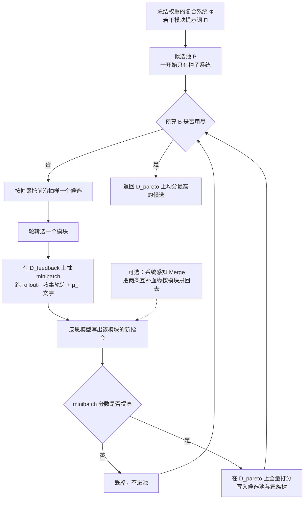
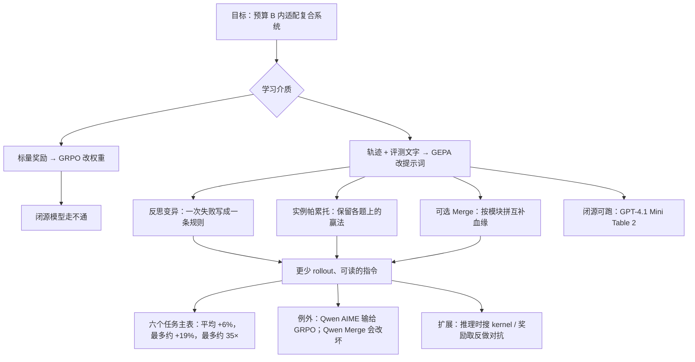

# GEPA：复合 AI 系统不必先改权重——把失败轨迹写成话，提示词进化就能用更少 rollout 超过 GRPO

<!-- release-date: 2025-07-25 -->

> 本文依据 Lakshya A Agrawal、Shangyin Tan 等人的 **GEPA: Reflective Prompt Evolution Can Outperform Reinforcement Learning**，即 arXiv:2507.19457v2、2026-02-14 的 96 页版本。封面标注 Accepted at ICLR 2026 (Oral)。页码均指 PDF 本身的页码。v1 于 2025-07-25 首次公开。截至 2026-09-10 核验，arXiv 当前最新版本仍是 v2，与本地 `papers/Berkeley/GEPA.pdf` 一致。
>
> 作者单位以 UC Berkeley 为主，另有 Stanford、Notre Dame、Databricks、BespokeLabs.ai 与 MIT。本站按主要归属放在 Berkeley 目录。
>
> 全文严格分三层：**论文明确写了什么**（带 PDF 页码）、**我们如何理解它**（推理与类比，会写明是推理）、**外部资料补充**（带链接，并标成补充）。仓库后来的产品页把 GEPA 写成「优化任何文本参数、最多便宜 90 倍」；那些数字不在这篇 PDF 里，一律标成外部补充，不以产品页覆盖论文。

## 读前先把这几个词说成人话

这篇论文的门槛不在公式，在于它同时用了强化学习、提示词优化和进化算法三套词。先花几分钟把它们讲清楚，后面就不用反复解释。

**它在优化什么：**

- **复合 AI 系统（compound AI system）**：不是单次「问一句、答一句」，而是若干个语言模型模块加上检索、代码执行等工具，按一段控制流串起来。多跳问答、先答题再按格式改写、把隐私问题改写成可外发请求，都算。论文把它形式化成 $\Phi=(M,C,\mathcal{X},\mathcal{Y})$（PDF p.4）。
- **提示词（prompt / $\pi$）**：每个模块的系统指令，可以带少样本示范。GEPA 改的就是这一层。
- **权重（$\theta$）**：模块背后那份模型参数。GEPA **冻结**它。GRPO 改的才是它。

**它怎么学：**

- **Rollout**：让整套系统 $\Phi$ 在一道题上跑一遍，再用度量 $\mu$ 打分。论文把「一次系统调用 + 一次评测」算一次 rollout（PDF p.4）。复合系统里一次 rollout 可能含多次模型调用和工具调用，所以它通常比「生成一段话」贵。
- **轨迹（trajectory / trace）**：一次 rollout 留下的自然语言记录——各模块的指令、推理链、工具调用、工具输出，以及评测函数在给出标量分之前产生的文字（编译报错、未召回的金标文档、未满足的格式约束）。
- **标量奖励**：把上述轨迹压成 $[0,1]$ 里的一个数。GRPO 只用这个数估梯度。
- **反馈函数 $\mu_f$**：论文给 $\mu$ 配的扩展。它除了返回分数，还返回一段 `feedback_text`。GEPA 的反思吃的是这段文字，不是那个数。

**三个算法名词：**

- **GEPA（Genetic-Pareto）**：遗传式的提示词进化，加上按「每道题上谁最好」维护的帕累托前沿。Genetic 说的是候选会沿家族树继承教训；Pareto 说的是下一步不总挑总分最高的那个去改。
- **反思式变异（reflective mutation）**：拿当前提示词、小批量轨迹和文字反馈，让一个反思模型写出一条新指令。
- **系统感知合并（system-aware merge）**：在两条已经分别改过不同模块的血缘上，按模块把更好的那一版拼回去。这是交叉（crossover），不是再写一条新指令。

**它要比的两个对手：**

- **GRPO（Group Relative Policy Optimization，组相对策略优化）**：用同一道题的一组回答做组内归一化，估 advantage，再更新权重。本站 [DeepSeek-R1](../DeepSeek/DeepSeek-R1.md) 与 [DAPO](../ByteDance/DAPO.md) 讲的就是这条线。GEPA 的主张是：同一套复合系统，改提示词可以比改权重更省样本。
- **MIPROv2**：当时 DSPy 生态里的主流提示词优化器，用贝叶斯优化同时搜指令和少样本示范（PDF p.25）。GEPA 只进化指令，不堆示范。

这篇改的是 **prompt**，不是权重，也不是题库。跨篇对照可以先记在这里：[AIDE2](/reports/Weco/AIDE2) 改的是包在模型外面的 harness 代码；[Darwin Gödel Machine](/reports/Sakana/Darwin-Godel-Machine) 改的是系统自己的代码；[Alita](/reports/Princeton/Alita) 会自造 MCP 工具；更早的 PromptBreeder 也是提示词进化，但没有这篇的轨迹反思和按实例维护的帕累托前沿。这些都不是本篇原文，后文只用它们帮你定位，不拿它们给 GEPA 加分。

## 一句话先说清

复合 AI 系统要适配新任务，主流做法是把成功度量当成 rollout 结束时的一个标量，丢给 GRPO 去估策略梯度。这条路有效，但实践里常常要成千上万次 rollout；而一次 rollout 在带工具的系统里又特别贵（PDF p.2）。

GEPA 的反驳是：这些 rollout 本来就是自然语言。模块指令、推理链、工具调用、编译报错，在被压成 $0$ 或 $1$ 之前都还在。现代语言模型读得懂这些话。与其把信息量最大的那一层丢掉、再从标量里反推「哪个 token 该被鼓励」，不如让模型用自然语言诊断失败、提出新指令、在自己的帕累托前沿上保留多种赢法。

六个任务上，相对 24,000 次 rollout 的 GRPO，GEPA 平均高约 6 个百分点、最高高约 20 个百分点，用的 rollout 最多少 35 倍；相对当时最强的提示词优化器 MIPROv2，总增益超过 10 个百分点，AIME-2025 上相对 MIPROv2 高 12 个百分点（PDF p.1 摘要；数字回页核对见下文「主结果」）。

所以本文的判断是：

> **GEPA 证明的不是「提示词优化已经替代强化学习」，而是：当轨迹本身就是可读的语言、评测函数在打分前还愿意吐出文字时，把学习介质留在语言空间里，单位 rollout 买到的改进可以远大于从标量估梯度。**

它也留下清楚的例外：在 Qwen3 8B 的 AIME-2025 上，GEPA **输给**了 GRPO（32.00 对 38.00，PDF p.8 Table 1）。平均 +6% 把这次失败算进去了。后文会把这张表拆开读。

## 先看全景：一次循环里它到底改了哪一层

这是按 PDF p.5 Figure 3 与 p.6 Algorithm 1 重画的**机制示意**，不含实测时间。Merge 不是每步都做，论文把它写成第二条提案策略，实验里最多调用 5 次（PDF p.26）。

和 GRPO 对照，动作完全不在同一层：

| | GRPO / DAPO 那条线 | GEPA |
|---|---|---|
| 改什么 | 模型权重 $\theta$ | 模块提示词 $\pi$ |
| 学习信号 | 标量奖励 → advantage → 梯度 | 轨迹 + 文字反馈 → 一条新指令 |
| 一次更新的粒度 | 每个 token 的概率 | 整段系统指令 |
| 候选怎么留 | 一份正在训练的权重 | 一棵家族树 + 按实例的帕累托前沿 |
| 闭源模型 | 不能做（没有权重） | 能做（Table 2 就是 GPT-4.1 Mini） |

论文自己把问题写成「允许同时更新提示词和权重」，只是为了让两种优化器能在同一套 $\Phi$ 上比；GEPA 实际只动 $\Pi$，权重保持冻结（PDF p.4）。

## 第一层问题：复合系统用 GRPO，贵在哪

### 旧问题：有效，但 rollout 太贵

论文开头的观察很具体。语言模型已经能把模糊的自然语言规格和检索、代码执行拼成 agent；接下来的问题是，下游任务上怎么把这套系统调好（PDF p.2）。

一条流行路线是 **RLVR（Reinforcement Learning with Verifiable Rewards，带可验证奖励的强化学习）**，例如 GRPO：把成功度量当成 rollout 结束时的标量，用来估策略梯度（PDF p.2）。这条路在数学推理上已经被 R1 / DAPO 走通，但论文指出一个工程事实：

> 近期用 GRPO 的工作，训练时往往用到成千上万、甚至几十万次 rollout（PDF p.2）。

对复合系统，这个数字会很快变成瓶颈，原因有三（PDF p.2）：

1. 下游应用经常要调昂贵的工具（检索、编译、执行）；
2. 从模型本身采样也有推理预算；
3. 最强的模型常常根本不给你权重——闭源 API 上，GRPO 这条路直接不存在。

Table 2 整张表没有 GRPO，不是作者忘了，是 GPT-4.1 Mini 没法微调。提示词优化在这里不是「更便宜的 RL」，而是**唯一能在闭源模型上跑的适配手段**。

### 新观察：轨迹在被压成标量之前，本来就是话

论文的关键观察不是「语言模型会反思」，而是更硬的一句（PDF p.2）：

即便是很复杂的 LLM 系统，它的 rollout 也可以序列化成自然语言痕迹。里面几乎只有：各模块的指令、模型自己的推理链、工具调用，以及奖励函数内部在给出标量之前产生的文字——例如编译器报错，在被塌缩成奖励 $0$ 之前，报错文本还在。

因为这些序列化轨迹能被现代 LLM 读懂，论文主张：故意在自然语言里学习、对着这些轨迹做反思的算法，能比标准 RL 更有效地用上模型已经有的语言先验（PDF p.2）。

**这一步的信息论含义是本文的理解，论文没有写成公式。** 一次编译失败，标量奖励只告诉你「这次是 $0$」；报错文本告诉你「未声明的标识符在第 17 行、向量化 intrinsic 用错了类型」。对一个已经会读手册的模型，后者接近一份可执行的修改说明书，前者只是一次对错。GEPA 后面所有设计，都是在保护并使用这层更厚的信号。

### 代价与边界

把学习介质留在语言空间，换来的是：更新不再对权重可微，也不再有 advantage 的无偏估计。它依赖两件事同时成立——

1. 反思模型真的能从轨迹里做 implicit credit assignment（隐式功劳分配），把系统级的成败归因到某个模块的指令（PDF p.5）；
2. 评测函数愿意在打分前留下文字。若 $\mu_f$ 退化成和 $\mu$ 一样只吐一个数，GEPA 就退回「看分数改提示词」，优势会窄很多。

AIME-2025 后来成为 GEPA 相对 GRPO 的唯一败场，本文倾向于把这两条边界和那场失败放在一起看。这是后文的判断，不是论文自己的归因。

## 问题陈述：在预算 $B$ 下，改 $\Pi$ 还是改 $\Theta$

第 2 节把复合系统写成 $\Phi=(M,C,\mathcal{X},\mathcal{Y})$（PDF p.4）：

- $M=\langle M_1,\ldots,M_{|M|}\rangle$ 是语言模型模块；
- $C$ 是控制流，可以按任意顺序、多次调用模块，也可以调外部 API；
- 每个模块 $M_i=(\pi_i,\theta_i,X_i,Y_i)$，$\pi_i$ 是系统提示词（指令 + 少样本），$\theta_i$ 是权重。

可学习参数是全部提示词 $\Pi_\Phi$ 和全部权重 $\Theta_\Phi$。对一道题 $(x,m)$——$x$ 是输入，$m$ 是评测元数据（金标答案、rubric、单测）——系统给出 $y=\Phi(x;\langle\Pi,\Theta\rangle_\Phi)$，度量 $\mu:\mathcal{Y}\times\mathcal{M}\to[0,1]$ 打分。无预算时的目标是（PDF p.4，式 1）：

$$
\langle\Pi^*,\Theta^*\rangle_\Phi=\arg\max_{\langle\Pi,\Theta\rangle_\Phi}\ \mathbb{E}_{(x,m)\sim\mathcal{T}}\ \mu\big(\Phi(x;\langle\Pi,\Theta\rangle_\Phi),m\big)
$$

真实约束是 rollout 贵。优化器最多能在训练集 $D_{\mathrm{train}}$ 上花 $B$ 次 rollout，并且可以完整使用 $\mu$。目标改成（PDF p.4，式 2）：

$$
\langle\Pi^*,\Theta^*\rangle_\Phi=\arg\max\ \mathbb{E}\ \mu(\cdots)\quad\text{s.t.}\quad \#\text{rollouts}\le B
$$

论文把核心挑战写成一句话（PDF p.4）：**如何从每一次昂贵的 rollout 里抽出最大的学习信号，让复杂、模块化的 AI 系统在低数据或紧预算下仍能适配。**

GEPA 的回答是只优化 $\Pi_\Phi$，把 $\Theta_\Phi$ 冻住。这样它才能和 GRPO（改 $\Theta$）在同一套 $\Phi$ 上比样本效率。

## 核心设计一：遗传循环——先小批量试，过了再付验证账单

### 旧问题：提示词搜索没有「一步梯度」

权重空间里，GRPO 每步都能用 advantage 推一次参数。提示词空间里没有这个方向。常见的贪心做法是：永远改当前最好的那条指令。论文后面会用图说明，这会在第一次成功之后把预算耗在同一棵已经不再长的树上（PDF p.7、p.10 Figure 6）。

### 新设计：候选池 + 小批量验收 + 验证集记账

Algorithm 1（PDF p.6 Figure 4 左）是整篇的主循环。输入是：系统 $\Phi$、训练集 $D_{\mathrm{train}}$、度量 $\mu$、反馈函数 $\mu_f$、预算 $B$；超参是 minibatch 大小 $b$ 和帕累托集大小 $n_{\mathrm{pareto}}$。

循环按人话翻译如下：

1. 把 $D_{\mathrm{train}}$ 切成 $D_{\mathrm{feedback}}$ 和 $D_{\mathrm{pareto}}$，后者大小为 $n_{\mathrm{pareto}}$。实验里训练折当作 $D_{\mathrm{feedback}}$，验证折当作 $D_{\mathrm{pareto}}$（PDF p.26）。
2. 候选池 $P$ 一开始只有种子系统；家族数组 $A$ 记录每个候选的父节点。
3. 先在 $D_{\mathrm{pareto}}$ 上给种子打一遍分。
4. 预算没用尽时：
   - 用 `SelectCandidate` 从池里挑一个父候选（默认是帕累托抽样，见下一节）；
   - 用 `SelectModule` 挑要改的那个模块（正文写的是轮转，PDF p.5）；
   - 从 $D_{\mathrm{feedback}}$ 抽大小为 $b$ 的 minibatch（实验里 $b=3$，PDF p.26）；
   - 跑 rollout，用 $\mu_f$ 收集该模块的轨迹、分数和文字反馈；
   - 反思模型写出新指令 $\pi'_j$，拷贝出新系统 $\Phi'$；
   - **只在 minibatch 上**比较改前改后均分；没提高就丢掉；
   - 提高了，才把 $\Phi'$ 加进池，并在**整个** $D_{\mathrm{pareto}}$ 上打分。
5. 预算用尽后，返回 $D_{\mathrm{pareto}}$ 上平均分最高的那个候选。

### 机制：两道闸门在控制探索成本

第一道闸门是 minibatch。一次反思提案先用 3 道题验收，过不了就不上验证集。第二道闸门是 $D_{\mathrm{pareto}}$：只有活下来的孩子才配得到一次全量验证，而这次验证的分数**只用于选谁留下、下一步改谁，不产生新的学习信号**（PDF p.9）。

论文自己强调：GEPA 的 rollout 预算大部分花在验证上，不是花在产生学习信号上。若只数训练集 rollout，达到最优性能只需要 79 到 737 次；要追上 GRPO 的最佳验证分，四个任务上分别只需 102、32、6、179 次训练 rollout（PDF p.9）。

**这是理解「35×」时必须先读的一句。** 后面主表里的 3,593 或 6,871，是「训练信号 + 验证记账」的总和；678 是 IFBench 上找到最优提示词时已经花掉的数，不是总预算。

### 收益、代价、可迁移启发

收益是样本效率：失败的提案几乎只付 minibatch 的钱。代价是：验证集大小直接决定账单。论文把「换更小的验证集、或动态抽验证子集」列为未来工作（PDF p.9），等于承认当前实现把多样性记账做成了最贵的一步。

可迁移的部分：任何「提案很贵、验收相对便宜」的搜索，都可以做成两级——先用小样本决定是否值得认真评，再把认真评的结果只用于选择、不用于再训练。这和训练无关，和怎么花评测预算有关。

## 核心设计二：反思式变异——把功劳分配交给读轨迹的模型

### 旧问题：标量奖励做不了模块级归因

复合系统有多个模块。一次多跳问答失败，可能是第一跳检索偏了，也可能是第二跳查询没有对准缺失实体，也可能是最后的答题模块不会用摘要。GRPO 拿到的是整条轨迹结束时的一个数，要把这个数归到某个模块的某几个 token 上，只能靠策略梯度自己「挤」。

论文认为，自然语言轨迹本身已经把各模块的职责摊开了：每个模块的输入、输出、推理都在痕迹里。把痕迹和最终成败放在一起，实践者本来就能把错误追到某一跳；语言模型也可以做同样的隐式功劳分配，然后只改被归到责的那个模块（PDF p.5）。

### 新设计：$\mu_f$ 留下评测痕迹，反思模型重写指令

一次变异的具体动作（PDF p.5–6）：

1. 从帕累托前沿抽一个父候选；
2. 在训练集上抽 minibatch，跑完整程序并留下执行痕迹；
3. 调用 $\mu_f$，得到分数和文字反馈（编译报错、未满足的 rubric、还没检索到的金标文档等）；
4. 按轮转选出要更新的模块；
5. 把「当前指令、程序轨迹、分数、反馈」交给反思模型，任务是：归因成败，提出修订后的指令；
6. 新模块装回原程序，再在同一 minibatch 上评一次；提高才入池。

$\mu_f$ 是对 $\mu$ 的扩展，不是另一个无关的模型。论文特意把评测过程里、标量出来之前的文字叫做 **evaluation trace（评测痕迹）**，与模型自己产生的 execution trace（执行痕迹）并列（PDF p.6）。代码评测会经历编译、执行、profiling，这些步骤本来就会打出自然语言；GEPA 要求评测器把它们返回来，而不是只返回 pass/fail。

反馈还可以是模块级的。多跳系统里，评测器可以在每一跳之后告诉该跳「还缺哪些文档」（PDF p.7）。HotpotQA 和 HoVer 的实验用的就是这种反馈（PDF p.23–25）。

论文还留了一扇门：若有人类打分时写下的文字理由，可以把这些解释当作辅助 `feedback_text`，即使 rollout 本身几乎没有自然语言反馈（PDF p.7）。主实验没有用人类解释。

### 反思用的元提示词写了什么

附录 C 给出完整元提示（PDF p.22–23）。结构很短，真正起作用的是中间两句要求，这里按原文意思译出：

- 仔细读输入，识别输入格式，并**推断**出我希望助手解决的任务的详细描述；
- 读所有助手回复和对应反馈，**找出关于该任务的所有小众、领域特定的事实信息，写进新指令**——因为这些信息将来可能不会再提供给助手；若助手用过可泛化的策略，也写进去。

新指令必须放在 markdown 代码块里。

**这是本文认为最值得单独记住的实现细节。** 元提示没有说「写得更像思维链」或「加几个例子」。它明确要求：把这次轨迹里暴露出来、但下次不会再出现的领域事实，固化进指令。Figure 2 里第二跳检索提示从一行种子长成带「Madeira 群岛人口」这种例子的操作手册，走的就是这条路（PDF p.3）。

Figure 5 把同一过程画成 PUPA 上的一棵子树（PDF p.7；完整指令在附录 K.1）。从种子候选 0（验证分 82.26）到最佳候选 11（97.61），红箭头标出的路径依次是：

| 节点（读自 Figure 5） | 验证分 | 这一步往指令里加了什么 |
|---|---:|---|
| 0 种子 | 82.26 | 「把私有查询改写成可外发请求，外部模型不许看到隐私」 |
| 2 | 90.99 | 识别并泛化 PII、分析查询意图、为改写提供推理说明 |
| 4 | 94.44 | 把输出拆成 Reasoning / Request，明确禁止姓名与代码，要求隐私论证与任务质量并重 |
| 5 | 94.67 | 强制透明的隐私推理，细写地点/姓名/职业场景/虚构角色的处理 |
| 11 | 97.61 | 逐步、穷尽的 PII 与专有信息抽象，禁止部分打码，零泄漏 |

分数是验证集上的，不是测试集。它要说明的是：一次反思往往就加进一类可复用的任务细则，而不是改几个形容词。论文把这叫做「系统性地纳入任务特定的 nuances」（PDF p.7）。

### 收益、代价、可迁移启发

收益有两层。第一层是样本效率：一次失败可以贡献一条规则，而不是贡献一个 advantage 为负的 token。第二层是可读性：优化过程留下的是人能读的指令演化，而不是一份无法解释的 LoRA。

代价也很具体：

- 反思本身要另一次模型调用。附录 N Table 4 显示，六个任务上反思调用次数并不多：GPT-4.1 Mini 为 21–92 次，Qwen3 8B 为 17–90 次（PDF p.96）。相对几千次系统 rollout，这不是主账单。
- 论文**没有写明**实验里反思模型是否就是任务模型，也没有写是否用了更强的教师。产品页示例把 `reflection_lm` 设成 GPT-5、任务模型设成 GPT-4.1 Mini——那是外部补充，见文末。
- 元提示会把领域事实写进指令，有过拟合风险。论文用验证/测试差来回应这件事（Figure 16，PDF p.30），但 IFBench 的验证分和测试分仍然差出一截，后文会单独说。

可迁移的部分：只要你的评测器在打分前已经产生了文字（单测输出、linter、profiler、检索未命中列表），不要把它丢在日志里。把它当成优化信号，比再训一个过程奖励模型便宜。反过来，若你的任务天然只有一个对错标量、也写不出过程文字，GEPA 相对 GRPO 的理由会弱一号——AIME 就是这个结构。

## 核心设计三：按实例的帕累托选择——不要总改「现在最好的那条」

### 旧问题：贪心会把搜索树做成一条死胡同

论文把候选选择写成探索–利用权衡（PDF p.7）。最朴素的策略是每步都选当前验证均分最高的候选，类似 TextGrad 的做法。Figure 6a 画的就是这个后果（PDF p.10）：找到第一个有用的子节点之后，搜索反复试图再打磨它，打磨失败，预算耗尽。树在第一层之后几乎不再分叉。

用一个类比：班级里有人数学满分、有人语文满分。若你每学期只培养总分第一，语文第一的那套方法就再也不会被尝试，即使它在语文题上是目前唯一的赢法。

### 新设计：实例级帕累托前沿 + 按「赢了几道题」加权抽样

Algorithm 2（PDF p.6 Figure 4 右）做的是论文所称的 Pareto-based “illumination” 策略，引用 Mouret & Clune 2015（PDF p.7）。步骤按人话是：

1. 对验证集里每一道题 $i$，记下目前所有候选在这道题上的最高分 $s^*[i]$，以及达到这个最高分的候选集合 $P^*[i]$；
2. 把所有「至少在一道题上并列最好」的候选收进集合 $C$；
3. 反复删掉被支配者：若某个候选在所有题上都不比另一个更好、并且至少在一题上更差，就删；
4. 对剩下的每个候选，令 $f[\Phi]$ 为它仍出现在多少道题的帕累托集合里；
5. 按 $f[\Phi]$ 成比例抽样，作为下一步要变异的父节点。

被保留的不是「总分前几名」，而是「至少在某类题上还没人超过它」的策略。抽样权重让赢面更广的候选更容易被抽到，但不会把只赢一题的策略从池子里赶出去。

Figure 3 用一张分数矩阵示意（PDF p.5）：Task 1 上只有 $P_3$ 对，Task 2 上 $P_1$ 和 $P_2$ 对，Task 3 上只有 $P_2$ 对。按题取最佳之后，过滤得到的前沿包含这些「各赢各的」候选，而不是只留下均分最高的那一个。

Figure 6b 是同一预算下帕累托抽样长出来的树（PDF p.10）：分叉更均衡，最终找到的程序也更好。图中节点上的括号分数是该候选的验证分；青色/橙色标出较优节点。左图在第一次改进后变成一条扁担，右图能同时保留多条血缘。

### 消融数字：这件事不是装饰

Table 3 把进化脚手架固定，只换选谁当父节点，Qwen3 8B、四个复合任务（PDF p.10）：

| 策略 | HotpotQA | IFBench | HoVer | PUPA | 四任务合计 | 相对基线 |
|---|---:|---:|---:|---:|---:|---:|
| Baseline | 42.33 | 36.90 | 35.33 | 80.82 | 48.84 | — |
| SelectBestCandidate | 58.33 | 30.44 | 45.33 | 85.45 | 54.89 | +6.05 |
| BeamSearch（N=4） | 57.33 | 36.39 | 41.00 | 81.08 | 53.95 | +5.11 |
| GEPA（帕累托） | 62.33 | 38.61 | 52.33 | 91.85 | 61.28 | +12.44 |

论文据此写：帕累托抽样相对 BeamSearch 最多高 11.33 个百分点，相对 SelectBestCandidate 最多高 8.17 个百分点；四个任务合计分别高 7.33 和 6.4 个百分点（PDF p.10）。

有一行必须单独读：SelectBestCandidate 在 IFBench 上是 30.44，**低于**基线 36.90。贪心不只是「涨得少」，它能把已经会的事改坏。IFBench 测的是未见过的输出约束，正好是「一种赢法难以覆盖全部实例」的任务，也是帕累托该发挥作用的地方。

BeamSearch 来自 APO（Pryzant et al., 2023），维护前 N 个总分最高的候选；SelectBest 类似 TextGrad。论文认为它们仍然容易陷入局部最优（PDF p.10）。

### 收益、代价、可迁移启发

收益是用同一笔预算换到更宽的搜索树，而不是换到更多候选。代价是：你必须为每个候选在验证集的**每一道题**上留分，不能只留一个总分。这正是「预算大部分花在验证上」的结构原因。

可迁移的部分：优化复合系统时，不要把「平均分最高」当成唯一的亲本选择标准。先问：有没有一类题，目前只有某个看起来一般的候选能做对？那一类题上的赢法，可能是下一跳泛化的来源。MAP-Elites / quality-diversity 在提示词搜索里的用法，被这篇论文做成了可复现的默认策略。

## 核心设计四：系统感知 Merge——按模块拼互补血缘

### 旧问题：两条血缘各自改对了不同模块，贪心只能留一条

复合系统的模块是可拆的。一条血缘可能把「查询改写」改好了、还没动「回答改写」；另一条相反。若只在完整系统层面做变异，这两套改进很难进同一个候选。普通的提示词交叉（把两段文字拼在一起）也不尊重模块边界。

### 新设计：只在满足血缘条件时，按模块取「离开祖先的那一版」

附录 D.1 的 Algorithm 3 和 4（PDF p.24 Figure 9）把 Merge 写成一次很挑食的交叉：

1. 随机抽两个不同候选 $i,j$；
2. 若一个是另一个的祖先，跳过；
3. 找共同祖先 $a$；这对 $(i,j,a)$ 已经试过，跳过；
4. 若祖先的均分比两个孩子中较弱的那个还高，跳过——两个孩子都必须相对祖先有提升；
5. `DESIRABLE`：至少存在一个模块，一边相对祖先改过、另一边没改（互补，而不是改了同一处）；
6. 对每个模块：
   - 若只有 $j$ 改过，就用 $j$ 的提示词；
   - 若只有 $i$ 改过，就用 $i$ 的；
   - 若两边都改了且都不同于祖先，取均分更高的那个孩子的版本（平手随机）；
   - 否则默认用 $i$。

论文写：这些血缘条件很严，所以 Merge 实际发生得很稀疏（PDF p.23）。实验里 Merge 最多调用 5 次（PDF p.26）。

### 收益与那次明显的失败

Observation 5（PDF p.11）：GEPA+Merge 相对 GEPA 最多再高 5 个百分点，合计再高约 2 个百分点，数字在 Table 1 / Table 2。论文把收益归因于：识别出学到互补策略（改了不同模块）的独立血缘，按模块各取最好的一版。

拆开看，Merge 不是免费午餐：

**GPT-4.1 Mini 上它基本是赚的**（PDF p.8 Table 2）：四任务合计从 GEPA 的 65.22 到 66.36；IFBench 52.72→55.95，HoVer 51.67→56.67，PUPA 94.47→96.46。HotpotQA 反而从 69.00 掉到 65.67，说明拼模块也会把一条已经很好的血缘稀释。

**Qwen3 8B 上它整体是亏的**（PDF p.8 Table 1）：合计 54.85→52.40。IFBench 从 38.61 掉到 28.23，不仅低于 GEPA，还低于基线 36.90。PUPA 91.85→86.26。HotpotQA 是少数赚的任务（62.33→64.33）。论文自己写：Qwen3 8B 四个任务里只有一个从 Merge 受益（PDF p.11）。

论文给的解释是：变异和交叉之间的预算分配、以及何时调用 Merge，两组模型用了同一套超参，对 Qwen 不是最优。直觉上，Merge 该在树上已经长出足够不同的血缘之后再调用（PDF p.11）。他们把自适应调度列为未来工作。

Figure 16 的泛化间隙从另一侧印证了这次失败（PDF p.30）：PUPA、Qwen3 8B 上，GEPA+Merge 的测试分相对最佳验证分低了一大截（图中标注约 $-7.72\%$，读自 Figure 16）。也就是说，这次 Merge 很可能在验证集上拼出了一个好看的组合，测试集上没站住。这是读图得到的观察，论文正文没有用这张图专门解释 IFBench / PUPA 的 Merge 回撤。

### 可迁移启发

模块化系统的交叉，应该交叉**模块**，而不是交叉字符串。但交叉的时机是超参，不是免费增益。没有独立血缘时硬做 Merge，等于把两个还没学成的半成品焊在一起。Qwen 上那次 IFBench 28.23，是整篇最清楚的反例。

## 六个任务是什么，系统长什么样

主实验不是「在基座模型上做零样本答题」。每个 benchmark 都配了一套现成的复合系统，以及对应的 $\mu_f$。除数学两个任务外，大多来自 Tan et al. 2025 的程序（PDF p.23）。

### 任务、切分、系统、反馈

| 任务 | 它在测什么 | 切分 | 被优化的系统 | $\mu_f$ 给反思模型看什么 |
|---|---|---|---|---|
| **HotpotQA** | 多跳问答，需要跨多个维基文档 | 150 / 300 / 300 | 改自 HoVer 多跳程序：最后一跳改为答题，其余不变 | 每一跳还缺哪些相关文档（PDF p.23） |
| **IFBench** | 精确遵守输出约束（只答 yes/no、某词至少出现三次等），测试集是 58 条新的、分布外约束 | 训练+验证来自 IF-RLVR Train（150 / 300），测试 294 条来自 IFBench 本身 | 两段式：先答题，再按约束改写 | 哪些约束已满足、哪些未满足（PDF p.23–24） |
| **HoVer** | 多跳事实核查：写出多跳查询，召回判定该声称所需的全部金标文档 | 150 / 300 / 300 | 最多 3 跳，2 个查询模块 + 2 个摘要模块 | 已召回的正确文档、仍缺的文档（PDF p.25） |
| **PUPA** | 隐私意识委托：用可信模型改写用户问题，发给不可信大模型，再改写回来，既要质量又要少漏 PII | 111 / 111 / 221 | PAPILLON：查询改写 + 不可信模型 + 回答改写 | 把总分拆成回答质量分和 PII 泄漏分（PDF p.25） |
| **AIME-2025** | 美国数学邀请赛 2025，30 题 | 训练+验证用 2022–2024 共 90 题对半切；测试为 2025 的 30 题，每题重复 5 次 | 单步 ChainOfThought | 正文未单独描述比对错更细的文字反馈（PDF p.24–25） |
| **LiveBench-Math** | LiveBench 的数学子集，2025-07-30 取回，共 368 题 | 按 Python `random seed 0` 打乱后三等分 | 同样是单步 ChainOfThought | 同上（PDF p.25） |

IFBench 的切分意图写得很明确：优化器在训练时**看不到**测试集上那些新约束（PDF p.24）。所以 IFBench 的验证分可以到 80、测试分只有 38，并不自动等于过拟合作弊——测试集故意是另一套约束。后文读曲线时要带着这一点。

AIME 测试分的口径：30 题 × 5 次。Table 1 里 27.33、32.00、38.00 这类带两位小数的数，和 $41/150=27.33\%$、$48/150=32\%$、$57/150=38\%$ 对得上。这是本文按切分推的，论文没把分母写成 150。

### 两个基座，两套推理设置

所有模块共用同一个模型（PDF p.25）：

| | Qwen3 8B | GPT-4.1 Mini |
|---|---|---|
| 角色 | 开源对照，也是唯一能跑 GRPO 的基座 | 闭源对照，用来比提示词优化器 |
| 版本 | Yang et al. 2025；Team 2025 推荐设置 | `gpt-4.1-mini-2025-04-14` |
| 采样 | temperature 0.6，top-p 0.95，top-k 20 | temperature 1.0 |
| 上下文 | 最多 16,384 token | 同左 |

GRPO 用 LoRA 做复合系统训练：rank 16，$\alpha=64$，dropout 0.05，bf16，目标模块 $[q,k,v,o,\mathrm{up},\mathrm{down},\mathrm{gate}]$，学习率 $1\times10^{-5}$，$\beta=0.01$，梯度裁剪 0.1，每步 4 道题、组大小 12（batch 48），累积 20 步，500 个训练步 = 固定 24,000 次 rollout，每 20 步做一次验证用于早停。跑在 1×H100/A100（80GB）上，推理 rollout 用别的 GPU（PDF p.26）。

单模块的全参 GRPO 只出现在 Figure 11 的 2 跳 HoVer 上：组大小 16，全局 batch 32，8 卡 FSDP2，学习率 $1\times10^{-6}$，训练采样温度 1.0（PDF p.26）。主表 Table 1 不是全参。

GEPA 与 MIPROv2 的预算按任务对齐：先记下 MIPROv2 在该任务上花的 rollout，再把 GEPA 的上限设成同样的数，实际偏差不超过 10.15%（PDF p.26）。MIPROv2 使用 `auto=heavy`，即 18 组指令候选和 18 组引导出的少样本；其 rollout 最少 2,270（PUPA）、最多 6,926（HoVer）（PDF p.25–26）。Trace 与 TextGrad 在 Trace 框架里实现，架构、数据、初始提示词与 DSPy 版对齐，未优化的 Trace 基线与 DSPy 基线相差在 0.5% 以内，预算与 MIPROv2 / GEPA 相同，并尽量提供同样的度量和反馈；Trace 不支持模块级反馈，作者按 Trace 官方 BigBench-Hard 教程的格式来写（PDF p.26）。

GPT-4.1 Mini 上跑完 Table 2 全部实验的费用不到 500 美元：GEPA 86、GEPA-Merge 67、MIPROv2 76、Trace 与 TextGrad 合计 172（PDF p.25）。论文没解释为什么 Merge 比 GEPA 还便宜。

## 主结果：摘要里的 +6%、+20%、35×、AIME +12%，各自对应哪一格

先把摘要四句话和表格对上。这是本篇最容易被产品页放大的地方，必须回到 PDF。

### Table 1：Qwen3 8B，唯一一张有 GRPO 的主表

数字全部来自 PDF p.8 Table 1，测试集分数：

| | HotpotQA | IFBench | HoVer | PUPA | AIME-2025 | LiveBench-Math | 六任务合计 | 相对基线 |
|---|---:|---:|---:|---:|---:|---:|---:|---:|
| Baseline | 42.33 | 36.90 | 35.33 | 80.82 | 27.33 | 48.70 | 45.23 | — |
| GRPO（24k rollout） | 43.33 | 35.88 | 38.67 | 86.66 | **38.00** | 51.26 | 48.91 | +3.68 |
| MIPROv2 | 55.33 | 36.22 | 47.33 | 81.55 | 20.00 | 46.60 | 47.84 | +2.61 |
| **GEPA** | **62.33** | **38.61** | **52.33** | **91.85** | 32.00 | **51.95** | **54.85** | **+9.62** |
| GEPA+Merge | 64.33 | 28.23 | 51.67 | 86.26 | 32.00 | 51.95 | 52.40 | +7.17 |

对应的优化预算：

| | HotpotQA | IFBench | HoVer | PUPA | AIME | LiveBench | 平均 |
|---|---:|---:|---:|---:|---:|---:|---:|
| GEPA（+Merge） | 6,871 | 3,593 | 7,051 | 2,426 | 1,839 | 1,839 | 3,936 |
| GRPO | 24,000 | 24,000 | 24,000 | 24,000 | 24,000 | 24,000 | 24,000 |

把摘要四句话逐条代回去：

**「平均 +6%」**：GEPA 54.85 − GRPO 48.91 = **+5.94** 个百分点。六任务平均，AIME 那场失败已经算进去。引言里写的也是 on Qwen3 8B、相对 24k GRPO、平均 +6%（PDF p.2）。

**「最高 +20%」**：HotpotQA 62.33 − 43.33 = **+19.00**。正文 Observation 1 写的是「最多 19%」（PDF p.9），摘要写成 20%。同一件事，摘要取整。

**「最多 35× 更少 rollout」**：不是用总预算 3,593 去除 24,000（那只有 6.7 倍）。Table 1 表注写：IFBench 上 GEPA **只花 678 次 rollout 就找到了最优提示词**，测试集 38.61，超过 GRPO 用 24,000 次得到的 35.88（PDF p.8）。$24000/678\approx 35.4$。Observation 1 把「达到最优测试性能」的倍数写成 4–35×（PDF p.9）：HotpotQA 6,871 对 24,000 大约是 3.5 倍，取整为 4；IFBench 的 678 是另一端。

**「AIME-2025 +12%」**：不是相对 GRPO，是相对 MIPROv2。Qwen3 8B 上 GEPA 32.00 − MIPROv2 20.00 = **+12.00**。摘要原文是 “outperforms … MIPROv2, by over 10% (e.g., +12% accuracy on AIME-2025)”（PDF p.1）。同一格里 GEPA 相对 GRPO 是 **−6.00**（32 对 38）。把 +12% 说成「数学上也赢了强化学习」，与表格不符。

Observation 1 把相对 GRPO 的五场胜利写成 19.0%、2.73%、13.66%、5.19%、0.7%（PDF p.9），与上表逐列相减一致：

- HotpotQA 62.33−43.33=19.00
- IFBench 38.61−35.88=2.73
- HoVer 52.33−38.67=13.66
- PUPA 91.85−86.66=5.19
- LiveBench-Math 51.95−51.26=0.69≈0.7
- AIME-2025 32.00−38.00=−6.00（唯一失败）

GEPA+Merge 相对 GRPO 的「21%」也只出现在 HotpotQA：64.33−43.33=21.00（PDF p.9）。不能把它读成六任务平均。

另两件读表时容易漏的事：

1. **MIPROv2 在 Qwen 的两个数学任务上低于基线**（AIME 20.00 vs 27.33，LiveBench 46.60 vs 48.70）。少样本示范在这些任务上不但没帮上忙，还拖了后腿。GEPA 的 AIME 32.00 相对 MIPROv2 的 +12，有一半是「对手掉下去了」。
2. **Figure 10 的 Aggregate 不是 Table 1 的六任务合计。** Figure 10b 的合计柱大约是 48.8 / 55.1 / 51.1 / 61.3 / 57.6（读自 PDF p.28 Figure 10），对应 HotpotQA、IFBench、HoVer、PUPA 四个复合任务的平均；Table 3 的 61.28 就是这个四任务 GEPA。六任务合计被两个数学任务拉低了。读「合计」时要看清分母是 4 还是 6。

### Table 2：GPT-4.1 Mini，闭源上的提示词优化器对决

数字来自 PDF p.8 Table 2。没有 GRPO。

| | HotpotQA | IFBench | HoVer | PUPA | AIME-2025 | LiveBench-Math | 六任务合计 | 相对基线 |
|---|---:|---:|---:|---:|---:|---:|---:|---:|
| Baseline | 38.00 | 47.79 | 46.33 | 78.57 | 49.33 | 58.20 | 53.03 | — |
| Trace (OptoPrime) | 60.33 | 51.19 | 46.00 | 74.18 | 45.33 | 60.74 | 56.30 | +3.27 |
| MIPROv2-No-Demos | 38.00 | 52.04 | 51.33 | 91.85 | 48.67 | 60.97 | 57.14 | +4.11 |
| MIPROv2 | 58.00 | 49.15 | 48.33 | 83.37 | 51.33 | 61.84 | 58.67 | +5.64 |
| TextGrad | 62.33 | 48.64 | 47.67 | 85.68 | 46.67 | 63.84 | 59.14 | +6.11 |
| **GEPA** | **69.00** | 52.72 | 51.67 | 94.47 | **59.33** | 64.13 | 65.22 | +12.19 |
| GEPA+Merge | 65.67 | **55.95** | **56.67** | **96.46** | 59.33 | 64.13 | **66.36** | **+13.33** |
| GEPA-Qwen-Opt（在 Qwen 上优化，原样拿到 GPT 上评） | 65.67 | 49.83 | 54.67 | 90.05 | 52.67 | 59.31 | 62.03 | +9.00 |

引言把「相对 MIPROv2 的合计增益」写成 +13%，超过 MIPROv2 自己相对基线的 +5.6% 的两倍（PDF p.2）。对应的是 GEPA+Merge 的 +13.33 对 MIPROv2 的 +5.64。GEPA 本体已经是 +12.19。

Observation 2 写相对 MIPROv2 的单任务最大优势：GPT-4.1 Mini 上 11.1 个百分点、Qwen3 8B 上 10.3 个百分点（PDF p.9）。后一个对得上 PUPA 的 91.85−81.55=10.30；前一个接近 HotpotQA 的 69.00−58.00=11.00，论文写 11.1，可能用了未四舍五入的中间值。

AIME-2025 在这张表上：GEPA 59.33，相对基线 +10.00，相对 MIPROv2 +8.00。摘要那句 +12% **不是这张表**。

### 跨模型迁移：弱模型上优化的指令，拿到强模型上仍能打

GEPA-Qwen-Opt 整行是 Observation 6 的证据（PDF p.11）：提示词完全在 Qwen3 8B 上优化，一条不改地拿到 GPT-4.1 Mini 上评，六任务合计 +9.00，HotpotQA 单任务 +27.67（65.67−38.00）。这个迁移结果超过了**直接在 GPT-4.1 Mini 上优化**的 MIPROv2（+5.64）、TextGrad（+6.11）和 Trace（+3.27）。

本文的读法：GEPA 写进指令里的是任务规则（第二跳该找什么实体、PII 该怎么抽象），不是某个模型的解码癖好，所以跨家族还能用。它没有证明「任意弱模型优化的提示词都能打赢在强模型上现场优化的基线」——这只是一条迁移配置，没有报告方差。

## 样本效率：曲线比终点分数更说明问题

Figure 1、11、12–15 的横轴都是 rollout 次数，纵轴是分数。点是验证分，星是测试分。下面的读数凡未在正文出现的，都注明读自哪张图。

### Figure 1：和 GRPO 画在同一张预算轴上

PDF p.1 Figure 1 是全文的门面，两张子图都是 Qwen3 8B：

**HotpotQA（Figure 1a）**：GEPA（蓝）在大约 1,000 次 rollout 内就把验证分抬到约 59，之后几乎平台；测试星在约 62.5。MIPROv2（绿）测试星约 55。GRPO（橙）爬到约 10,000 次才到 52 附近的平台，测试星只有约 43。也就是说，GRPO 的验证分也没追上 GEPA，测试集上的缺口更大。

**IFBench（Figure 1b）**：这张图有双纵轴。左轴是验证分，右轴是测试分。GEPA 的验证分几乎立刻跳到约 80，测试星在右轴约 38.6；GRPO 的验证分缓慢爬到约 63，测试星约 36。验证 80、测试 38，缺口看起来吓人，但 IFBench 的测试集是训练时没见过的新约束（PDF p.24）。更公允的读法是：两边在 OOD 约束上都很难，GEPA 仍然略高，而且它的验证曲线不是慢慢拟合训练约束——它很快就学会了「训练折里那些约束」，再把学到的指令拿去撞新约束。

Figure 13b、13c 把 IFBench 的 MIPROv2 预算轴（约 3,500）和 GRPO 预算轴（24,000）分开画，形状与 Figure 1b 一致（PDF p.29）。

### 其余复合任务的曲线

Figure 14c HoVer、Qwen3 8B vs GRPO（PDF p.29）：GEPA 大约 1,000 次到 45、3,000 次到 52 附近；GRPO 大部分时间贴在 35–38。测试星 GEPA 明显高于 GRPO，与 Table 1 的 52.33 对 38.67 一致。

Figure 15c PUPA、Qwen3 8B vs GRPO（PDF p.29）：GEPA 约 500 次到 86、1,500 次到 91；GRPO 大约 8,000 次才到 86 的平台。测试星 GEPA 约 92，GRPO 约 87，对应 91.85 对 86.66。

Figure 12–15 的左列是 GPT-4.1 Mini 对 MIPROv2，中列是 Qwen 对 MIPROv2，右列才是对 GRPO。GEPA 的蓝线几乎都是「早期陡升、然后平台」；GRPO 的橙线是「缓慢爬升、平台更低」。这是 Observation 1 所谓 sample-efficient 的图证据，不是只靠终点一张表。

Observation 1 还写：GEPA 追上 GRPO 最佳验证分，分别只需要 243、402、330、1,143、1,179、306 次 rollout，最多相当于 78× 的样本效率（PDF p.9）。$24000/306\approx 78.4$，对得上「最多 78×」那端。这些点没有在图上单独标出，正文也没说六个数字分别对应哪个任务。

### Figure 11：全参 GRPO 也没有翻盘

主表 GRPO 用的是 LoRA。脚注 1 说他们也试了全参，Figure 11 给出 2 跳 HoVer、Qwen3 8B 上的对照（PDF p.9、p.28）。注意：这是简化后的 2 跳程序，不是主表那个最多 3 跳的系统（PDF p.25），所以终点分数不能和 Table 1 的 52.33 直接比。

读自 Figure 11：GEPA 验证分大约 2,000 次 rollout 就到 44–45，测试星约 46（右轴）；全参 GRPO 缓慢爬到约 24,000 次时验证分约 36，测试星约 41。论文的结论是：相对全参和相对 LoRA，缺口形态类似（PDF p.28）。

**它证明的是「主表那 19 个点的优势，不是因为 GRPO 只做了 LoRA」。它没有证明全参 GRPO 在六个任务上都赢不了。** 全参对照只有这一张 2 跳 HoVer。

### 预算口径上必须留的一个问号

GRPO 的 24,000 是 4 题 × 组大小 12 × 500 步，论文把它写成训练 rollout；验证每 20 步做一次，**额外**（PDF p.26）。GEPA 的计数把 $D_{\mathrm{pareto}}$ 上的验证包含在预算里（PDF p.9）。

因此：

- 用「GEPA 总 rollout vs GRPO 24k」比，对 GEPA 偏严——它的分母含验证，GRPO 的 24k 不含；
- 用「只产生学习信号的 rollout」比，GEPA 会更夸张（79–737，或追上 GRPO 验证分时的 6–179 次训练 rollout）。

论文对外宣传用的是第一种里最显眼的 35×（找到最优时的 678 vs 24k）。两种口径都不算错，但不能混成一个数。

## 只优化指令，为什么能打赢「指令 + 少样本」

Observation 2 和 4 要放在一起读。

先前 MIPROv2 和 Wan et al. 2024 的证据是：联合优化少样本示范，往往强过只改指令（PDF p.9）。GEPA 在两个模型、六个任务上全部超过 MIPROv2，而且 **GEPA 的提示词更短**。论文把趋势反转主要归因于：模型的指令遵循和自我反思变强了，以及 GEPA 的设计吃到了这些能力（PDF p.9）。

Figure 16 重复了 Wan et al. 的泛化间隙研究：测试分减最佳验证分（PDF p.30）。论文的定性结论是，反思进化出的指令现在也能给出更低的泛化间隙。图上并非每一根柱子都对 GEPA 更有利——前面已经提到 Qwen PUPA 上 Merge 的大约 $-7.72\%$。更稳妥的说法是：在多数设定里，GEPA 的测试分没有相对验证分崩掉，不像「把示范背进提示词」那样典型地过拟合。

长度是另一条证据。Figure 18（PDF p.31）按任务给出优化后程序的 token 数，相对 MIPROv2 的倍数读自柱上标注：

| | GPT-4.1 Mini：MIPROv2 token → GEPA / Merge 缩短倍数 | Qwen3 8B：MIPROv2 token → GEPA / Merge |
|---|---|---|
| 合计 | 7,511.8 → 4.3× / 4.8× | 6,259 → 4.9× / 4.5× |
| HotpotQA | 15,454 → 7.2× / 7.5× | 10,071 → 4.7× / 3.8× |
| IFBench | 2,637 → 2.1× / 2.1× | 2,438 → 6.4× / 8.0× |
| HoVer | 5,567 → 2.4× / 3.3× | 5,252 → 3.7× / 2.8× |
| PUPA | 6,389 → 5.3× / 5.1× | 7,275 → 6.0× / **9.2×** |

Observation 4 的「最多短 9.2 倍」就是 Qwen PUPA 上 Merge 那根柱（PDF p.11、Figure 18b）。Figure 17 的散点把合计分数对合计 prompt token 画在一起：GEPA 落在左上（更短、更高），MIPROv2 落在右下；图注写 GEPA 的提示词大约不到 MIPROv2 的 33% 大小（PDF p.30）。附录 I 另有一句 “around 33% shorter”（PDF p.27），按字面是「短了 33%」，和 Figure 17/18 的「只剩三分之一以下」不是同一个意思。**以带刻度的图为准。**

论文还观察到：合计表现更好的优化器，往往给出更短的提示词（PDF p.11）。MIPROv2 的长度主要来自同时使用多组示范；复杂任务上，一条示范本身就可能非常长（PDF p.11）。GEPA 的指令虽然比种子长很多（Figure 2 是典型），但仍然短过「示范优化」。

对服务系统，这不只是省钱：API 按输入 token 计费，更短的前缀也降低延迟（PDF p.11）。这是优化阶段之后、部署阶段仍然在生效的收益。

附录 L 把各任务上 GEPA 与 MIPROv2 的完整提示词并列（PDF p.3 指向该附录）。论文强调：GEPA 的指令经常是完成任务的陈述性细则，而不是 Wan et al. 所说的那种「伪装成指令的准示范」（PDF p.9）。Figure 2 的第二跳查询手册是这方面最干净的例子。

## 扩展一：推理时搜索——让 GEPA 在测试任务上「过拟合」

第 5.1 节明确写这是初步结果，不是主表（PDF p.12）。做法和主实验相反：把待解任务集合同时当作 $D_{\mathrm{train}}$ 和 $D_{\mathrm{pareto}}$，允许 GEPA 在这批任务上过拟合，并把一道题上学到的教训用到另一道题。模型采样的随机性被缓存关掉，改进来自提示词更新和多样探索，而不是温度（PDF p.12）。

$\mu_f$ 在这里被用来按失败动态注入领域知识：根据编译报错去手册里检索相关章节，再写进提示词。NPUEval 上最终那条提示词见 Figure 27（附录 M）。

### NPUEval：AMD XDNA2 上的 kernel

基线是 Sequential10：根据编译报错和 profiling，最多迭代生成 10 次，再取 Best-of-N。GPT-4o 上的均向量利用率（读自 PDF p.13 Figure 7 与正文）：

| 方法 | 均向量利用率 |
|---|---:|
| Sequential10 | 4.25% |
| Sequential10 + RAG（技术手册） | 16.33% |
| Sequential10 + RAG + MIPROv2 | 19.03% |
| GEPA 产生的**单条**提示词，再跑 Sequential10（无运行时 RAG） | 26.85% |
| GEPA 帕累托前沿上的多个候选 | **30.52%**（个别 kernel 到 70%） |

右图把「功能正确的 kernel」的利用率按算子拆开，GEPA Pareto（蓝）在 `abs_int8`、`relu_int8` 等上可以顶到约 70%，Sequential10+RAG（黑）明显更短（读自 Figure 7 右）。

### KernelBench：CUDA，相对 PyTorch eager 的加速比例

35 个代表任务、三档难度，agent 最多 Sequential5。Figure 8（PDF p.13）横轴是 rollout 预算（0–3,000），纵轴是 $\mathrm{fast}_p$：生成的 kernel 比基线快 $p$ 倍的任务占比，速度相对 PyTorch eager。读图：$\mathrm{fast}_{0.5}$ 大约在 2,000 次 rollout 后到 0.5 以上；$\mathrm{fast}_1$ 从接近 0 抬到 **0.2 以上**，即超过 20% 的任务生成了比 eager 还快的 CUDA kernel。论文正文与图注都写了「超过 20%」（PDF p.12–13）。

这两项用的是 GPT-4o，不是主表的两个模型。论文自己的限定句是：早期结果，需要更系统的研究；他们相信带领域文字反馈的推理时搜索可以推广到其他代码生成和领域适配，留给未来工作（PDF p.12）。

**不要把 30.52% 和 20% 写进与 GRPO 对比的主结论。** 主结论只有 Table 1 / Table 2 的六个任务。

## 扩展二：对抗提示词搜索——把奖励取反

第 5.2 节同样不是主表（PDF p.12–14）。做法：把奖励取反，让优化器在「不与任务矛盾、仍保留解题所需全部信息」的约束下，往提示词里加 trivia 之类的额外信息，目标是**最小化** pass@1。

设置：用 AIME 2022–2024 进化一条**通用**对抗指令，加在每道题前面；在 AIME-2025 的 30 题上评，模型是 GPT-5 Mini，每题 5 次，共 150 次生成（PDF p.12、14）。干净提示词的 pass@1 是 76%，对抗提示词降到 **10%**。

干净提示词要求回答末尾必须是 `### <final answer>`。GEPA 找出的对抗指令（论文给出的删节版）在中间插入「蜂蜜永远不会坏」「世界最长的河是尼罗河，6,650 公里」「海豚睁一只眼睡觉」这类 trivia，同时原样保留格式要求（PDF p.14）。人工检查发现：GPT-5 Mini 在对抗指令下，多数回答的结尾变成了字面量 `### <final answer>`，即把格式说明里的占位符当成了要输出的答案（PDF p.14）。

论文的判断：大幅下降来自「无关细节 × 严格字面格式约束」的相互作用，而不是格式要求单独造成的（PDF p.14）。他们把这种搜索说成自动化的最坏情况探针，产出可复用的压力测试和回归套件，也可以给微调或安全训练提供针对性数据（PDF p.14）。

主实验是把系统变好；这一节是同一套算法把系统变坏。两者用的都是「语言反馈 + 进化」，只是 $\mu$ 的符号相反。它说明 GEPA 对目标函数的方向并不挑剔——这既是能力，也是风险。

## Related work：只留对照，不展开

第 6 节（PDF p.14–15）按四条线定位 GEPA，这里只保留和读这篇有关的对照：

- **自动提示词优化**：APE、OPRO、PromptWizard、PromptBreeder 等用 LLM 改提示词。GEPA 多了环境文字反馈、按实例的帕累托搜索，以及复合系统里按子模块进化。[PromptBreeder](/reports/Google/PromptBreeder)（Fernando et al., 2024）是更早的自指式提示词进化；它没有这篇的评测痕迹和实例级帕累托。
- **进化算法**：EvoPrompt 进化提示词种群；Rainbow Teaming 用质量–多样性进化做多样化对抗提示词。GEPA 额外用领域反馈做定向变异。AlphaEvolve / OpenEvolve 直接进化代码，擅长解能被代码化的难题；GEPA 把进化用在跨领域的提示词上，并强调从相关问题上迁移策略。第 5.1 节的 kernel 实验，是它往「进化代码」靠近的一步，但主实验仍是提示词。
- **语言空间里的学习**：Reflexion、Self-Refine、TextGrad、Trace、workflow memory、Dynamic Cheatsheet 等。GEPA 的用法是：用例子去**提出新指令**，得到任务级规则，而不是在测试时记住一组策略。
- **复合系统优化**：DSPy 搜索/引导少样本；TextGrad 反传文字反馈；MIPROv2 用贝叶斯优化对齐指令和示范——这些大多依赖全局奖励。Optimas 引入与全局对齐的模块局部奖励。GEPA 把全局奖励、模块级环境文字、以及按数据实例维护的帕累托前沿合在一起。

和本站已有报告的关系，用一句话就够：[DAPO](../ByteDance/DAPO.md) / R1 证明标量奖励 + 改权重可以训出长推理；GEPA 证明同一套可验证任务上，若你愿意把评测痕迹留成话，改提示词可以更省样本。两者不是互相取消。

## 它怎么支撑基模训练与推理

论文对此着墨不多，需要克制。

**写了的：**

- 适配下游任务不一定要微调权重；在复合系统和闭源模型上，提示词进化是可运行的替代（Table 2）。
- 样本效率针对的就是「工具贵、推理贵、不能微调」这三种训练/推理约束（PDF p.2）。
- 推理时搜索把同一套算法当成 test-time scaling：预算换成更多提示词版本，而不是更多采样温度（PDF p.12）。
- 更短的指令降低部署时的输入 token 和延迟（PDF p.11）。

**没写的：**

- 没有说 GEPA 被用进任何一个已发布基座的预训练或后训练配方；
- 没有把 GEPA 优化过的提示词再接到 GRPO 上做第二段（产品页后来引用的 BetterTogether / mmGRPO 是后话，见文末）；
- 没有在 8B 之上的开源模型上做主表。

所以它对基模训练的支撑，准确讲是：**在「用可验证奖励适配下游」这条路上，标出了一条不改权重的旁路，并量出了它和 24k-rollout GRPO 的样本效率差。** 旁路的前提是轨迹可读、评测函数愿意吐文字。缺这两条，它就变回普通的提示词搜索。

## 限制、失败与论文没公开的东西

### 论文写在明处的失败

1. **Qwen3 8B 的 AIME-2025：GEPA 32.00，GRPO 38.00**（PDF p.8）。Table 1 表注也写了「除 AIME 外」。这是主表里强化学习仍然赢的那一格。AIME 是单步 CoT、反馈最接近纯标量的任务——本文把这两件事并列，不声称论文做了因果证明。
2. **Merge 在 Qwen 上整体为负**，IFBench 掉到 28.23，低于基线（PDF p.8、11）。自适应调度没有做。
3. **MIPROv2 在 Qwen 数学上低于基线**，说明「强提示词优化器」本身也会改坏。GEPA 相对 MIPROv2 的 +12 不能全部记成 GEPA 的数学能力。
4. **推理时搜索和对抗搜索都是初步的**（PDF p.12–14）。NPUEval / KernelBench 换了模型（GPT-4o），对抗实验换了 GPT-5 Mini，都不能并进主表平均。
5. **验证账单是当前实现的主成本**，缩小验证集只是未来工作（PDF p.9）。

### 读图才能看到、正文没有当结论写的

- IFBench 验证约 80、测试约 38（Figure 1b）。切分解释了「不是同一分布」，但论文没有讨论：针对训练约束进化出的细则，迁移到新约束时还剩多少。38.61 对 35.88 的优势只有 2.73 个百分点，是五场胜利里较小的一场。
- Figure 16 上 Qwen PUPA 的 Merge 泛化间隙大约 $-7.72\%$（读自该图），和 Table 1 Merge 回撤同方向。
- 附录 I 写 prompt「短 33%」，Figure 17/18 写「不到 33% 大小 / 最多 9.2 倍」。以图为准。
- 主表没有误差棒，也没有报告随机种子数。每个格子默认按单次运行读。

### 没公开、本文也不补的

- 实验里反思模型是否等于任务模型、是否用了更强教师；
- GRPO 在六个任务上的全参结果（只有 2 跳 HoVer 一张图）；
- GRPO 的墙钟时间、GPU 小时、钱（只给了 GPT-4.1 Mini 提示词优化器那一侧不到 500 美元）；
- AIME / LiveBench 是否使用了比「对错」更厚的 $\mu_f$；
- Merge 何时被触发的具体调度，除了「最多 5 次」；
- 曲线上 243、402、330、1,143、1,179、306 各自对应哪个任务；
- 产品页上的 90× cheaper、ARC-AGI 32→89、optimize_anything 能改代码和架构——**这些都不在这篇 PDF 里**。

结论第 7 节（PDF p.15）很短：GEPA 在样本效率上优于 GRPO，在提示词优化上优于 MIPROv2；语言反思是资源受限场景下优化复杂工作流的一条可扩展策略；推理时搜索「有希望」。它没有单独开一节 Limitations。上面列出的边界，一部分来自表格里的例外，一部分来自「没写」。

## 最值得带回自己项目的九条

### 1. 先问评测器在打分前扔掉了什么

编译报错、未召回文档、未满足约束、质量分和泄漏分的分解——这些文字已经存在。GEPA 的第一项工作不是新模型，是禁止把它们塌缩成 $0/1$。任何 RL 或提示词优化项目都可以先做这一步，再决定要不要上进化。

### 2. 学习介质选语言还是选梯度，取决于轨迹是否可读

工具日志、多模块中间结果、人类评语，都是语言。token 级偏好、无法解释的黑盒打分，才更像标量。不要在第二种场景里期待这篇的 35×。

### 3. 提案用小批量验收，验证分只用于选择

Algorithm 1 的两道闸门可以直接搬到别的搜索：架构搜索、harness 搜索、工具描述搜索。贵的全量评测不要浪费在明显更差的孩子上。

### 4. 亲本不要总选总分第一

实例级帕累托 + 按赢题数加权，是质量–多样性在提示词上的最小实现。SelectBest 在 IFBench 上掉到基线以下，说明这件事有实验后果，不是审美。

### 5. 复合系统的交叉按模块，不按字符串

Merge 的 `DESIRABLE` 条件（互补模块、共同祖先、双方都改进）值得当作默认过滤器。没有独立血缘就不要焊。

### 6. 指令里固化的应是下次不会再出现的领域事实

附录 C 元提示的那句话，比「写得更详细」更可操作。过拟合风险用验证/测试差盯着；IFBench 说明细则迁到新约束时会打折。

### 7. 闭源模型和开源模型用同一套优化器，本身就是一种能力

Table 2 没有 GRPO 不是缺陷，是场景。能在 API 上跑的适配手段，和能在 8×GPU 上跑的适配手段，覆盖的产品不同。

### 8. 「更短的提示词」可以是准确率的副产品，不必单独当目标

Figure 17 的左上角说明：在这套设定里，更好的优化器产出更短的指令。少样本示范的长度是隐藏税。部署侧按输入 token 计费时，这条会变成真金白银。

### 9. 同一套进化器把奖励取反，就是红队

对抗实验用 trivia + 字面格式约束，把 76% 打到 10%。说明格式说明里的占位符、以及提示词中途插入的无关事实，都是真实的脆点。做 agent 产品时，可以用同一循环生成回归用的对抗指令，不必另找攻击算法。

## 用一张图把全文收束

## 关键词回看

- **复合 AI 系统 $\Phi$**：多模块 LLM + 控制流 + 工具，参数是提示词 $\Pi$ 与权重 $\Theta$。
- **Rollout**：一次 $\Phi$ 调用加一次 $\mu$ 评测。GEPA 的预算单位。
- **执行痕迹 / 评测痕迹**：模型自己产生的话，以及评测器在标量出来之前产生的话。
- **$\mu_f$**：返回分数和 `feedback_text` 的反馈函数。
- **反思式变异**：用元提示让反思模型把轨迹写成新指令；实验里一次改一个模块，minibatch 大小为 3。
- **实例级帕累托前沿**：每道验证题上的非支配候选；按赢题数加权抽样作为下一步亲本。
- **SelectBestCandidate / BeamSearch**：两种会更快陷入局部最优的亲本策略；IFBench 上贪心低于基线。
- **系统感知 Merge**：在共同祖先、互补模块、双方都改进的条件下按模块拼接。Qwen 上不是默认就赚。
- **MIPROv2**：联合优化指令和少样本的贝叶斯提示词优化器；GEPA 用更短的纯指令超过它。
- **GEPA-Qwen-Opt**：在 Qwen3 8B 上优化、原样放到 GPT-4.1 Mini 上评的迁移配置。
- **$\mathrm{fast}_p$**：KernelBench 上，生成 kernel 比基线快 $p$ 倍的任务占比。只出现在扩展实验。
- **35×**：IFBench 上找到最优提示词的 678 次 rollout 对 GRPO 的 24,000，不是六任务平均预算比。

## 最后的判断

GEPA 最硬的贡献，不是又一个提示词优化器名字，而是把一个被 RL 默认扔掉的中间量重新变成了学习信号：**评测函数在输出标量之前已经写在那里的那些话。**

在轨迹可读、模块可拆、评测器愿意返回文字的复合系统上，这个选择带来了可以核对的后果：相对 24k-rollout 的 GRPO，六任务平均约 +6 个百分点，HotpotQA 约 +19，IFBench 用 678 次 rollout 超过 24k 的 GRPO；相对 MIPROv2，纯指令、更短前缀、闭源可跑，合计增益翻倍。帕累托抽样的消融说明「总改最好的那个」会把树做成死胡同；PUPA 上那条从 82.26 长到 97.61 的指令路径，说明一次反思加进的是可复用的任务细则，不是形容词。

它没有推翻强化学习。Qwen3 8B 的 AIME 上 GRPO 仍然更高；反馈最瘦的任务，也是语言介质最不占优的任务。Merge 在弱模型上会把已经学到的东西拼坏。主表没有误差棒，全参 GRPO 只有一张简化图，推理时搜索和对抗搜索都换了模型。产品页后来写的 90× cheaper、改代码、改架构，是这篇论文之后的故事。

如果只记一句话，可以记：

> **轨迹在变成 0 和 1 之前是话。能读这些话的模型，不必每次都从标量里重新猜自己错在哪。**

## 资料与阅读边界

- 原始依据：本地 `papers/Berkeley/GEPA.pdf`，即 arXiv:2507.19457v2，2026-02-14，96 页，封面 Accepted at ICLR 2026 (Oral)。
- arXiv 页面：<https://arxiv.org/abs/2507.19457>。提交历史为 v1（2025-07-25）与 v2（2026-02-14）。`release-date` 取 v1 首次公开日 2025-07-25；对象是这项公开技术，不是某个已发布的基座权重。
- 官方代码：<https://github.com/gepa-ai/gepa>。论文摘要给出的就是这个地址。复现工件另见 <https://github.com/gepa-ai/gepa-artifact>。
- 官方项目页：<https://gepa-ai.github.io/gepa/>（2026-09-10 访问）。页面把 GEPA 写成「优化任何文本参数」，并写 **Frontier Performance, up to 90x cheaper | 35x faster than RL**。其中 35× 能回到本篇 PDF 的 IFBench 678 vs 24,000；**90× cheaper 不在本篇 PDF 中**，来自 Databricks 博客 [Building State-of-the-Art Enterprise Agents 90x Cheaper](https://www.databricks.com/blog/building-state-art-enterprise-agents-90x-cheaper-automated-prompt-optimization) 及项目页转述的 Ivan Zhou 评论（gpt-oss-120b + GEPA vs Claude Opus 4.1）。ARC-AGI 32→89、云调度 40.2% 成本节省、`optimize_anything` API，同样是论文之后的产品与博客，不能与 Table 1 / Table 2 混用。
- DSPy 集成（外部补充）：`dspy.GEPA`，教程见 <https://dspy.ai/tutorials/gepa_ai_program/>。论文写 MIPROv2 已进入 DSPy 与 llama-prompt-ops（PDF p.25）；GEPA 进入 DSPy 是论文之后的工程集成。
- 项目页示例把 `task_lm` 设为 GPT-4.1 Mini、`reflection_lm` 设为 GPT-5，并声称 AIME 2025 上 46.6%→56.6%。这与 Table 2 的 49.33→59.33 不是同一组数，不能互相替代。论文没有写实验是否使用更强的反思模型。
- 跨篇：GRPO 与长推理后训练见 [DeepSeek-R1](/reports/DeepSeek/DeepSeek-R1)、[DAPO](/reports/ByteDance/DAPO)；改 harness 代码而不是改提示词，见 [AIDE2](/reports/Weco/AIDE2)；改自身代码见 [Darwin Gödel Machine](/reports/Sakana/Darwin-Godel-Machine)；自造 MCP 见 [Alita](/reports/Princeton/Alita)。正文用来标明「这篇改的是 prompt」这条边界。
- 重画的图：「一次循环」与文末收束图是按 Figure 3 / Algorithm 1 做的机制示意，不含实测数字。Figure 1、5、6、7、8、10、11、12–18 的读数是维护者对着 PDF 页面逐张读的，未在正文出现的都写了「读自哪张图」。
- 本文标为「我们的理解 / 判断」的地方：AIME 败场与「反馈偏瘦」的并列；35× 的两种口径；Figure 10 Aggregate 是四任务不是六任务；附录 I「33% shorter」与 Figure 17/18 的不一致；产品页 90× 不得覆盖 PDF。这些都不是论文原文的结论。
