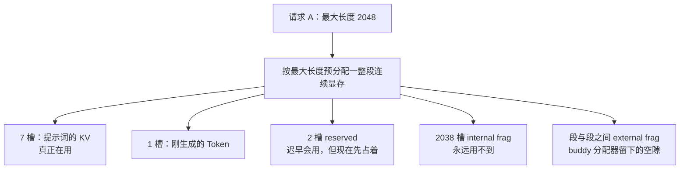
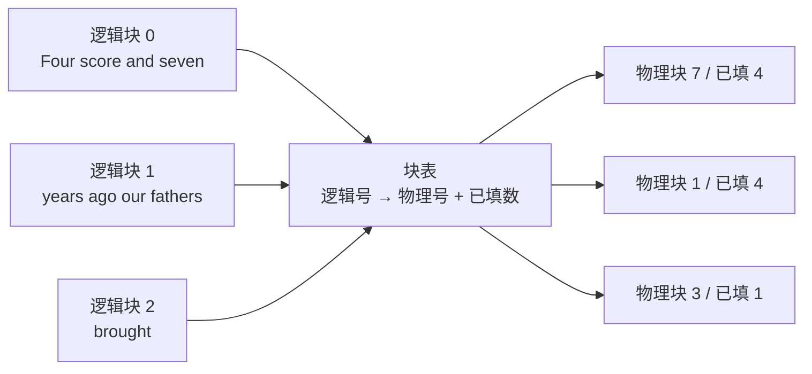
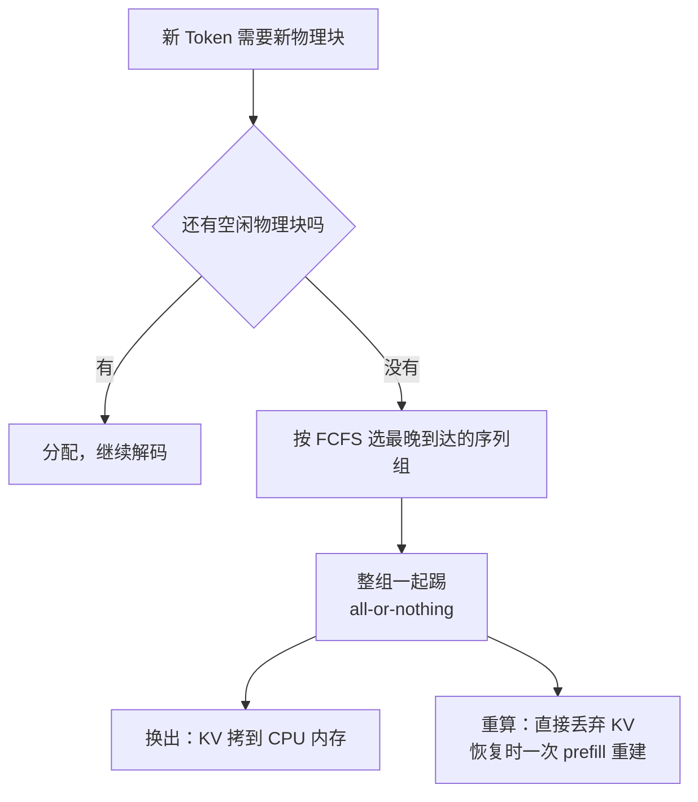
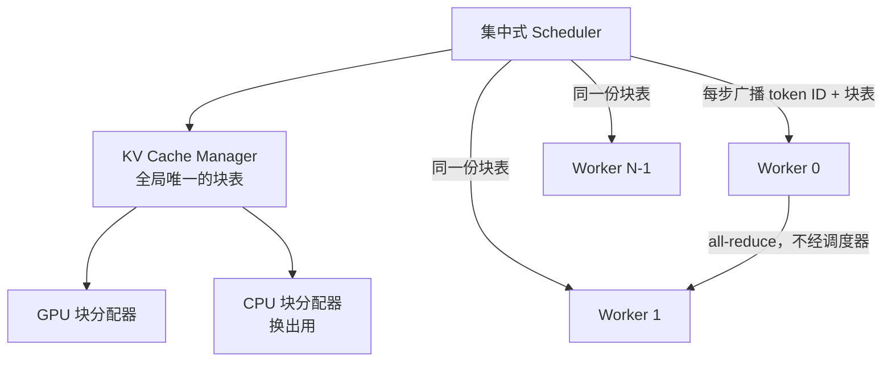

# PagedAttention：LLM 服务的吞吐瓶颈不在算力，在被浪费掉的 KV Cache

<!-- release-date: 2023-06-19 -->

> 本文依据 Woosuk Kwon 等人的 **Efficient Memory Management for Large Language Model Serving with PagedAttention**，即 arXiv:2309.06180v1（2023-09-12 提交，全文 16 页），正式发表于 SOSP '23（Koblenz，2023-10-23 至 10-26，ACM 版页码 611–626，DOI 10.1145/3600006.3613165）。arXiv 至今只有 v1 一版，本地 PDF 就是这一版。**页码均指 PDF 本身的页码**（1–16），不是 ACM 版的 611–626。
>
> 全文严格分三层：**论文明确写了什么**（带 PDF 页码）、**我们如何理解它**（推理与类比，会写明是推理）、**外部资料补充**（带链接，并标成补充）。这是一篇 2023 年的论文，今天的 vLLM 与它差距很大；凡是"vLLM 现在如何"的断言都来自官方文档或官方仓库，且一律标为外部补充。本文不引用本仓库里的 vLLM 源码快照。

## 阅读前的四个词

这篇论文的门槛不在数学，在于它同时用了机器学习和操作系统两套词汇。先把四个最关键的说清楚：

- **Token（词元）**：模型处理文本的最小单位。一个英文单词、一个汉字、一个标点，都可能是一个 Token。
- **KV Cache（键值缓存）**：模型每读进一个 Token，就会为它算出一对向量（Key 和 Value）。生成下一个 Token 时要回看全部历史，所以这些向量被留在显存里，不必每步重算。它是本文的主角。
- **吞吐与延迟**：吞吐是单位时间能服务多少请求，延迟是单个请求要等多久。服务系统通常靠**批处理**提高吞吐——多个请求共用一次权重加载。
- **分页**（paging）：操作系统的经典手法。把内存切成固定大小的页，让程序看到的"连续地址"映射到物理上分散的页。本文整篇都在做这个类比。

如果你只想记一句话：

> **在 LLM 服务里，批不大不是因为算力不够，而是因为显存被 KV Cache 的坏排布吃光了。把 KV Cache 从"一整块连续数组"改成"一堆小块 + 一张页表"，批就能变大，吞吐就跟着上来。**

## 先看矛盾：一张 A100 上，显存到底怎么被花掉的

论文开篇给了一张很有说服力的图。在一张 40GB 的 NVIDIA A100 上服务一个 13B 参数的模型（PDF p.1、图 1 左）：

- **模型权重**占 26GB，约 65%，服务期间一直不动；
- **KV Cache**占 30% 以上，随每个请求动态分配和释放；
- 剩下一小块是激活值，用完就丢。

权重是固定成本，激活很小。所以**能不能多批几个请求，几乎完全取决于 KV Cache 管得好不好**（PDF p.2）。

为什么必须多批？因为解码阶段是**访存受限**的。论文把生成过程拆成两段（PDF p.3）：

- **提示词阶段**（prompt phase）：整段输入一次算完，是矩阵乘矩阵，GPU 吃得饱；
- **自回归生成阶段**：一次只进一个 Token，是矩阵乘向量，算术强度极低，"严重欠用 GPU 算力，并且占掉单个请求的大部分延迟"（PDF p.3）。

一次只算一个 Token，GPU 的算力基本闲着，搬权重的时间却省不掉。唯一的解法是同时算很多个请求，把搬权重的开销摊薄。而能同时算多少个请求，回到上面那句话：取决于显存里塞得下多少份 KV Cache。

### 插一段必要背景：批处理这件事已经被前人解决了一半

论文在第 2.3 节交代了一个很重要的前提：**批处理的调度问题，前人已经解决过一轮了**（PDF p.3）。

朴素批处理有两个硬伤：请求到达时间不同，要么让早到的等晚到的，要么让晚到的排长队；请求长度差异巨大，为了凑成一个矩形张量就得 padding，白白浪费算力和显存。

前人的解法是**迭代级调度**（iteration-level scheduling，Orca 的做法）与 cellular batching：不再以"一个请求"为调度单位，而是以"一次前向迭代"为单位。**每算完一步，完成的请求立刻从批里移走，新请求立刻补进来**；配合专用内核，输入输出也不用再 padding（PDF p.3）。这就是后来大家常说的连续批处理（continuous batching）。

这段背景之所以关键，是因为它划定了本文的战场：**排队和 padding 的浪费已经被 Orca 解决了，剩下的瓶颈才是显存。** 论文在第 3 节开头就把这句话挑明了——细粒度批处理让请求能更灵活地组批，但能组多大仍然受 GPU 显存卡着，特别是 KV Cache 那部分；服务系统的吞吐是**访存受限**的（PDF p.4）。

换句话说，PagedAttention 不是在和 Orca 抢同一个位置。它是在 Orca 解决完调度之后，去解决剩下的那个问题。论文在相关工作里把这层关系概括为**互补**：Orca 通过调度和交错让更多请求并行处理，vLLM 通过提高显存利用率让更多请求的工作集装进显存（PDF p.13）。

论文还补了一句很值得记住的话（PDF p.13）：**正因为 Orca 那样细粒度地调度和交错请求，显存管理反而变得更困难，所以 vLLM 提出的技术更加必要。** 一个优化解决了旧瓶颈，往往会把下一个瓶颈推得更尖锐——这不是巧合，是系统演进的常态。

于是问题变成：**KV Cache 到底大到什么程度？**

论文算了一笔账（PDF p.4）。对 OPT-13B，单个 Token 的 KV Cache 占

$$
2 \times 5120 \times 40 \times 2\ \text{Bytes} = 800\ \text{KB}
$$

其中 2 是 Key 和 Value 两份，5120 是隐藏维度，40 是层数，最后的 2 是 FP16 每个数占的字节。OPT 最长能生成 2048 个 Token，所以**单个请求的 KV Cache 最多要 1.6 GB**（PDF p.4）。当代 GPU 显存只有几十 GB，就算全给 KV Cache，也只装得下几十个请求。

更糟的是趋势：论文指出从 A100 到 H100，算力翻了两倍多，显存上限却还是 80GB（PDF p.4）。所以作者的判断是，显存会越来越成为瓶颈。

## 第二层矛盾：装得下的显存，还有一大半在空转

真正让人吃惊的不是 KV Cache 大，而是**它有一大半根本没在存数据**。

原因很直接：深度学习框架里的算子大多要求张量存在连续内存上（PDF p.2、p.4）。所以此前的服务系统把一个请求的 KV Cache 当成一整个连续张量。可是输出多长事先不知道，于是只能按**最大可能长度**预先划一整块。

论文用图 3 画了两个请求（PDF p.4）。请求 A 的最大长度是 2048，实际提示词只有 7 个 Token；请求 B 的最大长度是 512，提示词 3 个 Token。这一块预留的显存于是被切成几段：

这是根据论文图 3 重画的**机制示意**（PDF p.4），槽位数按论文标注写死，不是实测分布。

三种浪费的性质完全不同，论文把这一点讲得很细（PDF p.4）：

| 浪费类型 | 它是什么 | 什么时候能知道它被浪费了 |
|---|---|---|
| **reserved**（预留） | 迟早真的会被写入，但在此之前一直占着位置 | 从分配那一刻就知道会长期占着 |
| **internal fragmentation**（内部碎片） | 预分配长度远大于实际长度，多出来的槽位永远不会被用 | 只有等这个请求生成完了才知道浪费了多少 |
| **external fragmentation**（外部碎片） | 每个请求预分配的大小不一样，分配器（如 buddy）在块之间留下的空隙 | 服务开始前就知道，永远不会被用于存 Token |

前两种是"这个请求自己占着"，第三种是"分配器的账本对不齐"。reserved 有点特殊：它最终会被用上，所以不算纯浪费，但**在被用上之前，它挡住了别的请求进不来**（PDF p.4）。

浪费有多严重？论文在自己的实验里做了 profiling（PDF p.2、图 2）：

| 系统 | 真正存 Token 的比例 | reserved | 内部碎片 | 外部碎片与其他 |
|---|---:|---:|---:|---:|
| Orca (Max) | 20.4% | 13.3% | 57.3% | 8.9% |
| Orca (Pow2) | 26.8% | 17.9% | 13.6% | 41.6% |
| Orca (Oracle) | 38.2% | 25.2% | — | 36.6% |
| vLLM | 96.3% | — | — | — |

注意 Orca (Oracle) 那一行：它假设系统**事先知道每个请求会生成多长**，因此没有内部碎片。可即便如此，也只有 38.2% 的 KV Cache 显存在存真东西（PDF p.2）。这行数字很关键——它说明问题不只是"预测输出长度不准"，而是"按请求整块连续分配"这个模式本身就有结构性浪费。

### 还有第三层：想共享也共享不了

LLM 服务里有大量天然可共享的 KV。比如同一个提示词采样多个候选答案，提示词那段的 KV 完全一样；论文实验里这部分占总 KV Cache 的 12%（PDF p.4）。束搜索（beam search）里不同候选分支共享的部分更多，论文说最高能省 55% 的显存（PDF p.4）。

但在"每个序列一个独立连续张量"的模型下，这些共享**做不到**——两份 KV 在不同的连续空间里，谁也没法指向谁（PDF p.2）。

三层矛盾叠在一起，答案已经呼之欲出了：问题出在"连续"这个假设上。

## 类比登场：把 KV Cache 当成虚拟内存来管

操作系统在几十年前就遇到过一模一样的问题：程序要的地址空间是连续的，物理内存是碎的、要动态分配的、还想在进程之间共享。它的答案是**虚拟内存与分页**。

论文把这个映射写得非常干净（PDF p.2）：

> 块（block）对应页（page），Token 对应字节（byte），请求对应进程（process）。

一旦接受这个映射，三层矛盾就一起被解掉了：

- **内部碎片**：块相对较小（vLLM 最终把默认值定为 16 个 Token，PDF p.12），而且按需分配，浪费最多只有最后一个块里的空位；
- **外部碎片**：所有块一样大，分配器不会留下大小对不上的空隙；
- **共享**：不同请求、不同序列的逻辑块可以映射到同一个物理块。

但要真正做到这些，光有内存管理还不够——**注意力算子必须能读非连续的 KV**。这就是 PagedAttention 这个名字的由来：它是为分页布局改造的注意力算法。

## PagedAttention：把注意力改成"按块算"

标准注意力是这样的（PDF p.3、式 3）：

$$
a_{ij} = \frac{\exp\left(q_i^\top k_j/\sqrt{d}\right)}{\sum_{t=1}^{i}\exp\left(q_i^\top k_t/\sqrt{d}\right)},
\qquad
o_i = \sum_{j=1}^{i} a_{ij} v_j
$$

意思是：当前位置 $i$ 的 Query 向量 $q_i$ 与前面每一个位置的 Key 向量 $k_j$ 做点积，除以 $\sqrt{d}$ 防止随维度变大而失控，softmax 归一化后再对 Value 向量加权求和。这里下标 $j$ 要跑遍 $1$ 到 $i$，**并且实现上默认这些 $k_j$ 是一段连续内存**。

PagedAttention 把序列按固定的**块大小** $B$ 切开（PDF p.5）：

$$
K_j = (k_{(j-1)B+1},\ \dots,\ k_{jB}),
\qquad
V_j = (v_{(j-1)B+1},\ \dots,\ v_{jB})
$$

于是注意力变成按块计算（PDF p.5、式 4）：

$$
A_{ij} = \frac{\exp\left(q_i^\top K_j/\sqrt{d}\right)}{\sum_{t=1}^{\lceil i/B\rceil}\exp\left(q_i^\top K_t \mathbf{1}/\sqrt{d}\right)},
\qquad
o_i = \sum_{j=1}^{\lceil i/B\rceil} V_j A_{ij}^\top
$$

拆开看只有三件事：

1. $q_i^\top K_j$ 一次算出当前 Query 与**第 $j$ 块里全部 $B$ 个 Key** 的相关度，$A_{ij}$ 是一个长度为 $B$ 的行向量；
2. 分母里的 $\mathbf 1$ 是一个全 1 向量，作用是把第 $t$ 块内部的 $B$ 个指数值加起来，再对所有块求和——所以归一化的分母仍然是全序列的，softmax 语义没有变；
3. 上限从 $i$ 变成 $\lceil i/B\rceil$：循环的单位从"一个 Token"变成"一个块"。

**这里必须说清楚一件事：这个变换是恒等的，不是近似。** 分块只改变了求和的组织方式和数据的存放位置，没有丢掉任何一项。所以 PagedAttention 与稀疏注意力、线性注意力是完全不同的东西——后者改变了模型算什么，PagedAttention 只改变了显存怎么放。论文摘要里"不影响模型精度"（PDF p.1）靠的就是这一点。不过论文并没有给出精度对照表，这个结论是结构性论证，不是实验结论。

内核在运行时**逐块取、逐块算**：取第 0 块，算出它的 $A_{i0}$，与该块的 $V_0$ 相乘；再取第 1 块……三个块在物理显存上完全不必相邻（PDF p.5、图 5）。

### 一个容易被跳过的脚注

论文第 5 页的脚注 1 说了一件影响实现的事：一个 Token 在每一层、每个注意力头上都有自己的 K/V。可以把它们全部塞进同一个 KV 块，也可以让每个头、每一层各有独立的块和独立的块表。论文写道，两种设计**没有性能差别**，vLLM 选了后者，因为实现更简单（PDF p.5）。

这个脚注解释了后来很多阅读代码的人会遇到的困惑：为什么 vLLM 的 KV 缓存张量形状是"块数 × 块大小 × 头数 × 头维度"这种按层分开的排布。答案在论文里，只是藏在脚注。

## KV Cache Manager：逻辑块、物理块、块表

有了能读非连续块的算子，剩下的是管理层。论文的设计几乎是照抄操作系统（PDF p.5–6）：

- 每个请求拥有一串**逻辑 KV 块**，从左到右依次填满；最后一个块没填满的位置留给后续生成；
- GPU 上有一个 block engine，一次性申请一大段连续显存，切成等大的**物理 KV 块**；CPU 内存上也切一份，用于换出；
- **块表**（block table）记录逻辑块到物理块的映射，每条记录还带一个"已填多少个位置"的计数。

这是根据论文图 6 重画的**机制示意**（PDF p.6），块号与已填数取自图中的示例，不是性能数据。

论文用一个七 Token 的提示词走了一遍完整流程（PDF p.6）：

1. **提示词阶段**：7 个 Token 需要 2 个逻辑块，映射到物理块 7 和 1。前 4 个 Token 进逻辑块 0，后 3 个进逻辑块 1，第 4 个位置空着留给下一步。注意这一步用的是**常规注意力算子**（论文举例 FlashAttention），不是 PagedAttention——提示词的 KV 是一次性算出来的，直接写进块里。
2. **第一次解码**：新 Token 的 KV 正好填进逻辑块 1 的空位，块表的"已填数"从 3 变成 4，不用新分配。
3. **第二次解码**：逻辑块 1 满了，开一个新逻辑块，分配物理块 3，把映射写进块表。

这个流程里有一条很重要的性质：**块从左往右填，只有前面全满才会分配新块**。所以任何时刻，一个请求的浪费都被限制在**最后一个块之内**（PDF p.6）。块大小 16 时，最坏浪费 15 个槽位——对比之前动辄 2038 个槽位，这就是图 2 里 96.3% 的来源。

### 可迁移的那一点

这里值得单独拎出来：**把"逻辑视图"和"物理布局"分开，是解决动态、不可预测资源分配的通用套路。** 它不只是省显存，还顺手买到了两个能力——共享（多个逻辑块指同一个物理块）和迁移（换个物理块而逻辑视图不变）。如果你的系统里有"必须连续、大小又事先不知道"的资源，这个模式基本都能套。

## 共享与写时复制：论文最被低估的一节

分页真正的红利不在省碎片，在共享。论文用三个场景展开（PDF p.7–8）。

### 场景一：并行采样

同一个提示词采样多个答案。两个序列的逻辑块 0、1 都映射到物理块 7 和 1，**物理块的引用计数为 2**（PDF p.7、图 8）。

问题在于生成阶段两个序列会岔开。论文的做法是**写时复制**（copy-on-write，COW），粒度是块：

- 样本 A1 要写共享的物理块 1，系统发现引用计数大于 1，于是新分配物理块 3，把物理块 1 的内容拷过去，再把物理块 1 的引用计数减到 1；
- 随后样本 A2 再写物理块 1 时，计数已经是 1，直接原地写，不用再拷。

结果是：**除了最后一个逻辑块，提示词的 KV 全部共享**（PDF p.7）。提示词越长，省得越多。

### 场景二：束搜索

束搜索的共享模式比并行采样复杂得多，而且**随解码推进不断变化**——论文把它类比成操作系统里"复合 fork 出来的进程树"（PDF p.7）。

论文的图 9 给了一个 $k=4$ 的例子（PDF p.7）：虚线之前，四个候选各用了 4 个满块；所有候选共享块 0（提示词），候选 3 从第二块起就分岔，候选 0–2 共享前 3 块。下一轮 top-4 全部来自原候选 1 和 2，于是原候选 0 和 3 的逻辑块被释放，对应物理块引用计数减少；引用计数归零的物理块（2、4、5、8）被回收，再分配新的物理块 9–12。

对比之下，旧系统在束搜索里要**频繁地整段拷贝 KV Cache**：候选 3 要继续，就得把候选 2 的一大段 KV 复制一份。vLLM 里绝大多数块是共享的，写时复制只在"新生成的 Token 恰好落在一个还被共享的旧块里"时触发，而且**只拷一个块**（PDF p.7）。

### 场景三：共享前缀

系统提示词、few-shot 例子这类长前缀会出现在大量请求里。论文的方案是：**服务商预先指定一组共享前缀，为它们预留一批物理块**，就像操作系统管理共享库那样；用户请求把自己的逻辑块直接映射过去（最后一块标成写时复制），提示词阶段只需要算用户自己那段输入（PDF p.8、图 10）。

**这一点非常重要，是本文最容易被误读的地方。** 论文里的共享前缀是**服务商手工预定义的**，不是按内容哈希自动命中的缓存。今天 vLLM 里那个"自动前缀缓存"，论文里没有——它是后来才有的功能。后面"论文之后"一节会展开。

### 场景四：混合解码

不同请求可以用不同解码方式，同时批在一起。论文给的理由很干净：块表这一层**把复杂的共享关系全部藏起来了**，模型和内核只看到一串物理块号，根本不需要知道谁和谁共享（PDF p.8）。

> 这是一条很好的抽象设计经验：**当你想让上层支持任意组合时，找一个足够窄的中间表示，让下层只看见它。** vLLM 的窄接口就是"一串物理块号"。

## 调度与抢占：显存不够时先牺牲谁

分页让显存用得更满，但填不满的时候总会到来。论文的策略是先到先服务（FCFS），最早到达的先服务，最晚到达的先被抢占（PDF p.8）。

抢占要回答两个经典问题：**踢掉哪些块？被踢掉的怎么恢复？**

这是根据论文 4.5 节重画的**机制示意**（PDF p.8），不含实测时间。

### 为什么是 all-or-nothing

操作系统的页面置换要靠启发式猜"哪一页最久才会被再访问"。论文指出，LLM 服务里**根本不用猜**：一个序列的所有块每一步都会被一起访问。所以策略直接简化成"要么全踢，要么一个都不踢"（PDF p.8）。

再进一步，同一个请求内部的多个序列（比如束搜索的多个候选）因为可能互相共享块，被打包成一个**序列组**，整组一起被抢占或一起被恢复（PDF p.8）。

这是"应用语义压倒通用启发式"的典型例子——**你知道访问模式，就不该再去预测它**。

### 换出 vs 重算

论文给了两条恢复路径（PDF p.8）：

**换出**（swapping）就是操作系统的老办法，只不过换出目标是 CPU 内存而不是磁盘。论文特别指出一个自带的上界：被换到 CPU 的块数**永远不会超过 GPU 上物理块的总数**，所以 CPU 侧的交换空间是有界的（PDF p.8）。

**重算**（recomputation）更简单粗暴：直接丢掉 KV，等重新调度时再算一遍。论文点出一个关键优势——重算的延迟**可以显著低于原始延迟**，因为已经生成的 Token 可以和原始提示词拼成一个新提示词，**一次提示词阶段就能把所有位置的 KV 全部重建**（PDF p.8）。这一步是并行的矩阵乘矩阵，而不是逐 Token 的自回归。

论文在消融里量化了两者（PDF p.13、图 19）：

- 块小时换出很差，因为会变成大量小块 CPU↔GPU 传输，吃不满 PCIe 带宽；
- 重算的开销**与块大小无关**，因为它压根不碰 KV 块；
- 结论：块小时重算更好，块大时换出更好；**重算的开销从来没超过换出延迟的 20%**；块大小在 16 到 64 之间时两者端到端表现相当（PDF p.13）。

还有一个被论文一笔带过、但实际影响很大的策略：**一旦发生抢占，vLLM 就停止接受新请求，直到所有被抢占的序列跑完**（PDF p.8）。这是为了防止抢占和新请求互相饿死，代价是过载时吞吐会出现明显的台阶。论文没有量化这个代价。

## 分布式执行：一份块表，多个 worker

模型放不进一张卡就要切。vLLM 用 Megatron-LM 式的张量并行，注意力按头维度切，每个进程负责一部分头（PDF p.8–9）。

关键观察是（PDF p.9）：即使模型被切了，**每个分片处理的输入 Token 集合是一样的，因此需要的是同样位置的 KV**。所以 vLLM 只在集中式调度器里保留**一份** KV Cache Manager 和一份块表，所有 worker 共享；每个 worker 只存自己那几个头的 KV，但物理块号是相同的。

这是根据论文图 4 与 4.6 节重画的**机制示意**（PDF p.5、p.9）。

每一步的流程是：调度器准备好这一批的输入 Token ID 和块表，广播给所有 worker；worker 按块表读 KV、跑模型、用 all-reduce 同步中间结果（**这一步不需要调度器参与**）；最后把采样出的 Token 送回调度器（PDF p.9）。

论文的总结句值得记住：**worker 之间不需要就内存管理做任何同步，因为它们在每步开始时就一次性拿到了全部内存管理信息**（PDF p.9）。

> 可迁移的原则：**把控制面决策集中，把数据面执行分散。** 只要控制信息能在一次广播里说完，分布式的一致性问题就基本消失了。

## 内核优化：分页不是免费的

分页引入了间接寻址，硬件不会自动帮你摊平。论文写了三个自定义 CUDA 内核（PDF p.9）：

1. **融合 reshape 与写块**：每层新算出的 KV 要切成块、重排成利于块读取的布局、再按块表写到指定位置。三步融成一个内核，省下多次启动开销。
2. **融合读块与注意力**：改造 FasterTransformer 的注意力内核，让它按块表边读边算。为了保证内存访问合并，**一个 GPU warp 负责读一个块**；同时支持同一批里不同的序列长度。
3. **融合块拷贝**：写时复制触发的块拷贝往往落在不连续的块上，用 `cudaMemcpyAsync` 会退化成大量小拷贝。论文把不同块的拷贝批进一个内核启动。

代价被消融实验量化了（PDF p.12、图 18a）：因为要访问块表、多走分支、还要处理变长序列，**PagedAttention 的注意力内核比高度优化的 FasterTransformer 实现慢 20%–26%**。

论文的辩护是：这只影响注意力算子，不影响 Linear 等其他算子；而端到端上 vLLM 依然大幅领先（PDF p.12）。这个辩护是合理的，但它也点出了这个设计的本质：**用单算子的一点效率，换整个系统能批更多请求。** 只有在访存受限、批大小是瓶颈的场景里，这笔交易才划算。

### 三个动词撑起全部解码算法

论文在 5.2 节交代了一个很干净的抽象：vLLM 用三个方法实现所有解码算法（PDF p.9）：

- `fork`：从一个已有序列派生出一个新序列；
- `append`：给序列追加一个新 Token；
- `free`：删除一个序列。

并行采样就是从输入序列 `fork` 出多个输出序列，每轮 `append`，命中停止条件就 `free`；束搜索和前缀共享用的是同一套（PDF p.9）。作者由此推断，未来的解码算法也能靠这三个动词组合出来。

这是很好的接口设计示范：**先找到最小的动作集合，再让复杂策略在它上面拼装。** 后来束搜索被从核心搬走（见后文外部补充），恰恰说明了这个抽象的边界——`fork` 之后各分支还会互相淘汰、互相继承，这已经超出三个动词能优雅表达的范围了。

### 这套系统当时有多大

论文报告的实现规模也值得一提，因为它说明这不是一个庞大工程（PDF p.9）：

- 前端是 FastAPI，接口沿用 OpenAI API 的形式，用户可以按请求指定采样参数、最大长度和束宽 $k$；
- 引擎 **8.5K 行 Python + 2K 行 C++/CUDA**；
- 调度器和块管理器用 Python，只有 PagedAttention 这类关键算子写成自定义 CUDA 内核；
- 模型执行基于 PyTorch 与 Transformers，多卡通信用 NCCL。

一万行出头、控制面在 Python、只有热点下沉到 CUDA——**这个分工本身就是可迁移的经验：先确定哪些代码在每步都跑几千次，只有那部分才值得写内核。**

### 块大小怎么选

块大小是这套设计里唯一的核心旋钮，两边都有代价（PDF p.6、p.12）：

- 太小：一次能并行处理的位置少，GPU 并行度用不满；换出时退化成小块传输；
- 太大：内部碎片变多，而且共享的概率下降（因为共享是按块判定的）。

实验结论（PDF p.12、图 18b）：ShareGPT 上 16 到 128 都不错；Alpaca 上 16 和 32 表现好，更大就明显退化，因为那个数据集的序列本身就比块还短。**vLLM 因此把默认块大小定为 16**（PDF p.12）。

这条经验很有代表性：**默认值往往不是最优值，而是在"最差情况下也不会太糟"的那个值。**

## 类比讲到这里，该说它在哪里断了

论文自己在讨论一节里承认了这个类比不是全等的（PDF p.13）。把对得上和对不上的地方列清楚，比记住"它像虚拟内存"有用得多。

**对得上的部分：**

| 操作系统 | vLLM | 说明 |
|---|---|---|
| 页 | KV 块 | 固定大小，消除外部碎片 |
| 字节 | Token | 块内的最小单位 |
| 进程 | 请求 | 拥有独立逻辑地址空间的实体 |
| 页表 | 块表 | 逻辑到物理的映射 |
| 按需分页 | 按需分配物理块 | 不预留全部空间 |
| fork + 写时复制 | 引用计数 + 块级 COW | 共享到分岔的过渡 |
| 共享库 | 预定义共享前缀 | 多个"进程"映射同一段只读内容 |

**对不上的部分（这一段是本文的推理，依据是论文 4.5 与第 8 节，PDF p.8、p.13）：**

1. **没有换页到磁盘。** vLLM 的换出目标是 CPU 内存，而且换出量的上界等于 GPU 上 KV Cache 的大小（PDF p.8）。操作系统的交换空间可以远大于物理内存，vLLM 不行——它不是为了扩展地址空间，只是为了缓一口气。
2. **访问模式是已知且顺序的。** 操作系统必须猜哪一页最久不会被用，vLLM 知道一个序列的块每步都一起访问，所以直接 all-or-nothing（PDF p.8）。这是"应用语义"打败"通用启发式"。
3. **重算是操作系统没有的选项。** 内存里的页丢了就是丢了，KV Cache 可以从 Token 重新算出来。论文明确说"重算方法在操作系统里是不可行的"（PDF p.13）。这其实是这个类比里最有价值的一处**不对称**——KV Cache 是可再生的派生数据，不是原始数据。
4. **没有 MMU 和 TLB。** 操作系统的地址翻译有专门硬件，几乎零成本。vLLM 的间接寻址是软件的，只能靠"把内存访问内核和注意力内核融在一起"来摊掉（PDF p.13），而且还是留下了 20%–26% 的内核开销（PDF p.12）。
5. **写时复制的粒度和触发条件都更粗。** 操作系统按页 COW，vLLM 按 KV 块 COW，而且**只在新 Token 恰好落进一个仍被共享的旧块时才触发，且只拷一个块**（PDF p.7）。块变大，COW 的浪费也跟着变大——这就是块大小会影响共享概率的原因（PDF p.12）。
6. **块大小的绝对量级完全不同。** 操作系统的页通常是 4KB，vLLM 的块是 16 个 Token。对 OPT-13B，16 个 Token 的 KV 约 12.5 MB（按论文给的单 Token 800 KB 推算，PDF p.4），**大约是一个内存页的三千倍**。这带来两个方向相反的后果：一方面块表极小（2048 个 Token 只需要 128 条记录），"页表开销可以忽略"这个操作系统直觉在这里更成立；另一方面**每个请求最后那个没填满的块，浪费的是以 MB 计的显存**，所以块大小绝不能像操作系统调页大小那样随手往上调。论文的块大小消融和最终选择 16（PDF p.12），本质上就是在给这个绝对量级买单。

论文自己还提醒了一句适用边界（PDF p.13）：这套方法之所以有效，是因为 LLM 服务同时满足"输出长度事先不知道，必须动态分配"和"性能受显存容量约束"两个条件。深度学习**训练**里张量形状是静态的，可以提前规划；非 LLM 的模型服务通常是算力受限的，提高显存效率不会带来性能提升——在那些场景里引入这套机制**反而会因为间接寻址和非连续访问而变慢**。

## 评测：先把每个倍数的分母写清楚

论文摘要里的"2–4×"被引用了无数次，但它有非常具体的前提。先把实验设置摆出来（PDF p.9–10）。

**模型与硬件**（PDF p.9、表 1）：

| 模型规模 | GPU | 总显存 | 权重 | 留给 KV Cache | 最大 KV 槽位数 |
|---|---|---:|---:|---:|---:|
| 13B | 1×A100 | 40 GB | 26 GB | 12 GB | 15.7K |
| 66B | 4×A100 | 160 GB | 132 GB | 21 GB | 9.7K |
| 175B | 8×A100-80GB | 640 GB | 346 GB | 264 GB | 60.1K |

模型用 OPT 的 13B/66B/175B，另加 LLaMA-13B 用于共享前缀实验；机器是 GCP 上带 A100 的 A2 实例（PDF p.10）。

**负载**（PDF p.9–10）：用 ShareGPT 和 Alpaca 两个数据集**合成**请求。ShareGPT 是用户分享的 ChatGPT 对话，Alpaca 是 GPT-3.5 用 self-instruct 生成的指令数据。两者差距很大（PDF p.9、图 11）：ShareGPT 输入均长 161.31、输出均长 337.99；Alpaca 输入均长 19.31、输出均长 58.45。论文自己的说法是 ShareGPT 的输入长 8.4 倍、输出长 5.8 倍，方差也更大（PDF p.10）。因为数据集**没有时间戳**，请求到达时间用泊松分布合成（PDF p.10）。

**对照**（PDF p.10）：

- **FasterTransformer**：本身没有调度器，作者自己配了一个类似 Triton 的动态批处理调度器，批大小按显存尽可能设大；
- **Orca**：论文发表时 Orca 不开源，**作者自己实现了一个版本**，并假定它用 buddy 分配器。分三档——`Oracle` 预知真实输出长度（不可实现的上界）、`Pow2` 最多超额预留 2 倍、`Max` 一律按 2048 预留。

**指标**（PDF p.10）：归一化延迟，即每个请求的端到端延迟除以它的输出长度，再取平均。大多数实验跑 1 小时的 trace；175B 因为成本只跑 15 分钟。

有了这些，下面这张表才有意义：

| 倍数 | 它到底在比什么 | 模型 / 硬件 | 负载 | 对照 | 页码 |
|---|---|---|---|---|---|
| 2–4× | 端到端吞吐（摘要口径） | OPT 13B/66B/175B | ShareGPT + Alpaca | FasterTransformer 与 Orca | PDF p.1、p.13 |
| 1.7×–2.7× | 同等归一化延迟下能扛的请求率 | OPT 三档 | ShareGPT | Orca (Oracle) | PDF p.11 |
| 2.7×–8× | 同上 | OPT 三档 | ShareGPT | Orca (Max) | PDF p.11 |
| 最高 22× | 同上（论文只给了上限，未说明落在哪个模型规模） | OPT 三档 | ShareGPT | FasterTransformer | PDF p.11 |
| 2.2× / 4.3× | 同一时刻批内的请求数 | OPT-13B，1×A100 | ShareGPT，2 req/s | Orca (Oracle) / Orca (Max) | PDF p.11、图 13a |
| 1.3× → 2.3× | 请求率，从基础采样到束搜索宽度 6 | OPT-13B | Alpaca | Orca (Oracle) | PDF p.11 |
| 1.67× / 3.58× | 吞吐，前缀 80 / 341 Token | LLaMA-13B | WMT16 英译德 | Orca (Oracle) | PDF p.12 |
| 2× | 请求率 | OPT-13B | 合成聊天，提示词截到 1024 | 三档 Orca | PDF p.12 |

图 13 给的批大小数字最直观（PDF p.10、图 13）：

| 负载 | Orca (Max) | Orca (Pow2) | Orca (Oracle) | vLLM |
|---|---:|---:|---:|---:|
| ShareGPT，2 req/s | 7.00 | 9.81 | 13.62 | **30.42** |
| Alpaca，30 req/s | 7.00 | 43.24 | 72.75 | **132.44** |

吞吐提升的因果链在这里闭合了：省显存 → 批更大 → 摊薄权重搬运 → 吞吐上去。

### 共享带来的收益单独量化过

论文把"省显存"直接测了出来（PDF p.11、图 15）。在 OPT-13B + Alpaca 上：

| 场景 | 参数 = 2 | 参数 = 4 | 参数 = 6 |
|---|---:|---:|---:|
| 并行采样（输出序列数） | 6.09% | 8.53% | 9.79% |
| 束搜索（束宽） | 37.56% | 53.13% | 55.16% |

同样的实验换到 ShareGPT 上，并行采样省 16.2%–30.5%，束搜索省 44.3%–66.3%（PDF p.11）。

差距为什么这么大？因为省的是**共享的那部分块**。Alpaca 的提示词均长只有 19 个 Token，共享的绝对量本来就小；ShareGPT 提示词均长 161，共享收益立刻放大。**这是理解这套设计的关键直觉：分页省的是碎片，共享省的是重复；后者的收益完全取决于你的负载里有多少重复。**

### 两个更贴近产品的场景

**共享前缀**（PDF p.12、图 16）：模型换成多语言的 LLaMA-13B，负载是 WMT16 英译德，前缀里放指令加几个翻译示例。一个示例、80 个 Token 的前缀，吞吐比 Orca (Oracle) 高 1.67 倍；换成五个示例、341 个 Token 的前缀，高 3.58 倍。**前缀越长，共享省下的 prefill 越多**，这条趋势非常干净。

**聊天机器人**（PDF p.12、图 17）：把对话历史和当前问题拼成提示词喂给 OPT-13B。因为模型上下文有限，提示词被截到最后 1024 个 Token，最多再生成 1024 个。结果是 vLLM 比三档 Orca 都高 2 倍请求率，而且三档 Orca 表现几乎一样——因为提示词几乎总是 1024 个 Token，buddy 分配器无论怎么预测输出长度，都会为输出预留 1024 个位置（PDF p.12）。

这个实验里有一句设定必须单独拎出来（PDF p.12）：

> **论文明确说，它不在对话轮次之间保存 KV Cache，因为那样会在轮次间占住别的请求要用的空间。**

放在 2023 年，这是个合理的取舍：当时没有自动前缀缓存，没有分层存储，留着 KV 就是纯占位。而今天多轮对话的 KV 复用几乎是所有推理服务的标配。**同一个判断在两代基础设施下的结论完全相反**——这句话是本文最好的"时效性标本"，也提醒我们别把论文的实验设定当成永恒结论。

### 论文自己给出的反例

最诚实的一段在 6.2 节（PDF p.11）。图 12(f)——OPT-175B + Alpaca——vLLM 相对 Orca (Oracle) 和 Orca (Pow2) 的优势明显变小。论文解释：175B 的配置留了 264 GB 给 KV Cache，而 Alpaca 的序列又特别短，所以 Orca 也能批很多请求，**系统从访存受限变成了算力受限**。

一旦瓶颈不在显存，省显存就不再产生收益。作者把这个反例写进正文而不是藏起来，是这篇论文可信度的一部分。

### 引用这些数字时最容易出的四个错

1. **"2–4×"的对照是 FasterTransformer 和 2023 年的 Orca，不是"任何服务系统"。** 更不是与"没有 KV Cache"或"HuggingFace `generate`"比。
2. **Orca 是论文作者自己实现的**（PDF p.10），因为当时 Orca 不公开。Orca (Oracle) 更是一个不可实现的上界——真实的 Orca 会落在 Oracle 和 Max 之间。
3. **归一化延迟不是 TTFT，也不是 TPOT。** 它是"端到端延迟 ÷ 输出长度"的均值（PDF p.10）。曲线在请求率超过系统容量时会突然爆炸，因为队列开始无限增长（PDF p.11）——所以"在延迟不变的前提下扛更高请求率"这句话，指的是曲线爆炸点右移。
4. **到达过程是合成的。** 数据集只提供长度分布，时间戳是泊松分布造的（PDF p.10）。真实流量的突发性与之不同。

## 它和 FlashAttention、FlexGen 不是一回事

这三个名字经常被放在一起念，但解决的问题完全不同。论文自己在相关工作里做了区分（PDF p.13–14）：

| 工作 | 它优化的对象 | 与本文的关系 |
|---|---|---|
| **FlashAttention** | 注意力**计算过程**中的峰值内存与 IO：分块 + 内核优化，避免把完整的 $L\times L$ 注意力矩阵写回显存 | 正交。论文自己在 prefill 阶段就调用了它（PDF p.6）。它管一次算子内部，PagedAttention 管跨请求的显存生命周期 |
| **FlexGen** | 显存受限时把权重和 Token 状态换出到 CPU / 磁盘 | 论文明说它**不面向在线服务**（PDF p.14）。目标是"跑得起来"，不是"吞吐高" |
| **OLLA** | 优化张量的生命周期与放置以减少碎片 | 论文说它**不做细粒度的块级管理，也不面向在线服务**（PDF p.14） |
| **Orca** | 迭代级调度，让更多请求并行 | **互补**。见前文（PDF p.13） |

一句话记法：**FlashAttention 让一次注意力算得更省，PagedAttention 让很多次注意力的历史存得更省。** 前者在算子内部，后者在系统层。所以它们不但不冲突，实际部署里几乎总是一起用。

论文也承认，换出、重算及两者结合早就被用于降低**训练**峰值内存（PDF p.13）。它的新东西是：**把块级内存管理带进在线服务场景**（PDF p.14）。

## 论文说了什么、没说什么

### 论文自己承认的限制

- 注意力内核比 FasterTransformer 慢 20%–26%（PDF p.12）；
- 抢占后会停止接受新请求，直到被抢占的序列全部完成（PDF p.8）——代价没有量化；
- 在算力受限的负载上收益会消失，甚至可能因为间接寻址而变慢（PDF p.13）；
- 块大小是要按负载调的，没有普适最优（PDF p.12）。

### 论文根本没有涉及的东西

下面这些**在这篇 2023 年论文里不存在**，不要从今天的 vLLM 倒推回去：

- **自动前缀缓存**。论文的共享前缀要服务商**预先指定**并预留物理块（PDF p.8）。没有内容哈希，没有跨请求自动命中，没有块哈希链。
- **KV Cache 卸载到磁盘或远端**。换出的唯一目标是 CPU 内存，而且总量有界（PDF p.8）。
- **P/D 分离**（prefill 与 decode 分开部署）。论文里 prefill 与 decode 在同一个引擎、同一批里跑。
- **chunked prefill**。长提示词如何切分与解码混批，论文没有讨论。
- **量化**。全文按 FP16 算显存（PDF p.4），没有 FP8/INT8/FP4。
- **MQA / GQA / MLA 等减小 KV Cache 的架构手段**。论文只做显存管理，不碰模型结构。
- **流水线并行、专家并行、跨节点部署**。分布式一节只讲了单机 Megatron 式张量并行（PDF p.8–9）。
- **优先级、公平性、SLO 调度**。只有 FCFS（PDF p.8）。
- **精度验证的实验数据**。摘要说"完全不影响模型精度"（PDF p.1），但论文没有给精度对照表。前面说过，这个结论靠的是式 4 与式 3 的数学等价性，属于结构性论证。严格说，分块改变了浮点求和顺序，逐位结果未必相同，论文没有讨论这一点。

顺带一个阅读提示：论文第 3 页写"除了式 4 中的计算"、第 5 页写"式 4 中的注意力计算可以变换成下面的分块计算"，两处引用的都应该是式 3。这是排版编号的小笔误，不影响内容，但会让第一次读的人卡住。

## 论文之后：今天的 vLLM 已经不是这篇论文了

**以下全部是外部资料补充，来自 vLLM 官方文档、官方博客与官方仓库的 RFC，不是论文内容。** 时间跨度是 2023 年 9 月到本文写作时。

### 束搜索已经从核心调度器里搬走

论文用整整一节和图 9 论证了束搜索的共享收益（37.6%–55.2% 省显存，PDF p.11），这是它最漂亮的结果之一。但 vLLM 官方 RFC [#8306 Reimplement and separate beam search on top of vLLM core](https://github.com/vllm-project/vllm/issues/8306)（2024-09-09 提出，已关闭）决定**把束搜索逻辑从调度器里移除**，改成建在引擎之上的一层包装。理由是维护成本与 bug 风险，以及束搜索在 LLM 时代的使用率下降。更早的 RFC [#6226 Drop beam search support](https://github.com/vllm-project/vllm/issues/6226) 还提到，束搜索会让 PagedAttention 的块表**每一步动态变化**，迫使 model runner 与 scheduler 同步。

也就是说，论文里最能体现"块级共享"威力的那个场景，恰恰因为它对调度器的耦合太深，被后来的架构演进请了出去。

### 自动前缀缓存成了默认开启

论文的共享前缀要人工预定义。vLLM 后来加了自动前缀缓存，并在 [vLLM V1 alpha 发布博客](https://vllm.ai/blog/2025-01-27-v1-alpha-release)（2025-01-27）里写明：V1 把它优化到"即使命中率为 0% 也几乎没有性能损失"，因此**在 V1 里默认开启**；而在 V0 中它是默认关闭的，因为命中率低时 CPU 开销明显。

这一条对读本站开源解读的人特别重要：`opensource/推理服务/LMCache/` 里讲的前缀哈希链、块哈希、跨实例共享，对接的是**这个后来的机制**，不是论文里那套"服务商预留物理块"的方案。两者名字都叫"前缀共享"，实现思路完全不同。

### GPU↔CPU 换出被整个删掉了

论文花了 4.5 节和 7.3 节讨论换出与重算的取舍。vLLM [V1 用户指南](https://docs.vllm.ai/en/latest/usage/v1_guide/)明确把 `GPU <> CPU KV Cache Swapping` 列为已移除的功能，理由是新的简化核心架构**不再需要用 KV Cache 换出来处理抢占**。今天的抢占路径只剩重算。

有意思的是，这个结果与论文自己的消融是一致的：块大小 16 时重算就已经更划算，而 16 正是默认值（PDF p.12–13）。论文测出了正确的取舍，工程上最终选择了把另一条路直接删掉。

### 该怎么用这篇论文

结论是：**把它当作"为什么要这样管 KV Cache"的原典，而不是"vLLM 现在怎么实现"的说明书。** 分页、块表、逻辑/物理分离、引用计数、块级 COW、集中式块表配分散 worker——这些骨架都还在。而共享前缀怎么命中、抢占怎么恢复、束搜索放在哪一层，全都换过了。

## 和本站其他文章接起来

- 分页管理的是"KV Cache 怎么放"，另一条完全不同的路是"让 KV Cache 本身变小"。MLA 走的是压缩 KV 的路，见 [DeepSeek-V2](/reports/DeepSeek/DeepSeek-V2)；稀疏注意力走的是"少算也少存"的路，见 [NSA](/reports/DeepSeek/NSA) 与 [DeepSeek-V3.2](/reports/DeepSeek/DeepSeek-V3.2)。两类方法是正交的，可以叠加。
- 这套分页假设也会被新架构打破。[DeepSeek-V4](/reports/DeepSeek/DeepSeek-V4) 里同时存在压缩 KV、索引器 KV、滑窗 KV 与未压缩的尾部状态，它们的大小与更新频率都不同，论文明说这已经不再满足"每层缓存结构相似、每块固定 Token 数"这个假设，因而把缓存拆成 State Cache 与 Block KV Cache 两部分。**读完 PagedAttention 再读那一节，会清楚地看到一个 2023 年的抽象在 2026 年被撑破的位置。**
- 把 KV Cache 搬出单机显存、做成分层存储与跨实例复用，是另一个模块的题目：开源解读 `opensource/推理服务/LMCache/`。它建在 vLLM 今天的 KV Cache 之上，前缀哈希链与本文的"预定义共享前缀"是两代方案，不要互相套用。

## 能带走的六条

### 1. 先确认瓶颈在哪一维

这篇论文最值得学的不是分页，是**它先证明了瓶颈在显存**。图 1 的显存分布、图 2 的浪费占比、"解码是访存受限"的分析（PDF p.1–4）都摆在方案之前。如果没有这一步，"给注意力换个内存布局"看起来会像一个奇怪的优化方向。

反过来，论文自己给的反例同样重要：175B + 短序列时系统变成算力受限，收益立刻缩水（PDF p.11）。**同一个优化在不同瓶颈下价值完全不同。**

### 2. 把"必须连续"的假设单独拎出来质疑

旧系统的一切浪费都来自一条不起眼的技术约束：框架里的算子要求张量连续（PDF p.2）。这类"因为工具这样所以只能这样"的约束，往往是收益最大的攻击点。代价是你得自己写内核——论文写了三个（PDF p.9）。

### 3. 逻辑与物理分离，一次买到三个能力

块表这一层同时解决了碎片、共享和迁移。**当资源大小不可预测又需要共享时，先加一层间接，几乎总是对的。** 前提是间接寻址的开销你能摊掉。

### 4. 应用语义可以替掉通用启发式

操作系统猜哪一页最久不被访问，vLLM 知道整个序列的块一起访问，于是直接 all-or-nothing（PDF p.8）。**在自己的系统里找一找：哪些地方你其实知道答案，却还在用通用策略去猜？**

### 5. 可再生的数据不必存

重算之所以能打赢换出，是因为 KV Cache 是从 Token 派生出来的，**丢了可以重造，而且重造是并行的**（PDF p.8）。设计缓存时先问一句：这份数据是原始数据还是派生数据？派生数据的恢复成本，往往比你以为的低得多。

### 6. 局部变慢换全局变快，要说清交换条件

注意力内核慢了 20%–26%，端到端却快了几倍（PDF p.12）。这不是矛盾，是**因为批大小是瓶颈**。把这个交换条件写清楚，比只报告端到端加速比诚实得多——也让读者知道换个负载它会不会失效。

## 关键词回看

- **KV Cache**：已读 Token 的 Key/Value 向量缓存。大小随上下文线性增长，是 LLM 服务的显存主要变量之一。
- **PagedAttention**：把 KV Cache 按固定块切开、允许块在物理显存上不连续的注意力算法。与标准注意力**数学等价**，不是近似。
- **KV 块**：固定容纳 $B$ 个 Token 的 KV 的最小分配单位。vLLM 默认 $B=16$（PDF p.12）。
- **逻辑块 / 物理块 / 块表**：请求看到的连续视图、显存里的真实位置、以及两者之间的映射加已填计数。
- **内部碎片 / 外部碎片 / reserved**：三种浪费，分别对应"预留过长"、"块大小对不齐"、"迟早会用但先占着"（PDF p.4）。
- **写时复制**：共享物理块被写入时才复制。vLLM 按块做，且只在新 Token 落进仍被共享的旧块时触发（PDF p.7）。
- **all-or-nothing 淘汰**：一个序列的块要么全踢要么全留，因为它们每步一起被访问（PDF p.8）。
- **序列组**：同一请求内可能互相共享块的多个序列，被打包一起调度与抢占（PDF p.8）。
- **归一化延迟**：端到端延迟除以输出长度，论文的主指标（PDF p.10）。
- **Orca (Oracle/Pow2/Max)**：作者自己实现的三档对照，分别代表"预知输出长度的上界"、"超额 2 倍"、"一律按最大长度"（PDF p.10）。

## 最后的判断

这篇论文的价值不在于"发明了分页"——分页是 1960 年代的技术。它的价值在于**看清了一个被所有人当成常识的假设（KV Cache 必须连续），并且把打破它的完整代价算清楚了**：要重写注意力内核，要接受 20%–26% 的算子回退，要自己实现块表、引用计数和写时复制，要重新设计抢占策略。

它同时是一个关于**类比的正确用法**的好例子。作者没有停在"KV Cache 像虚拟内存"，而是逐条说明哪里对得上（页、字节、进程、fork）、哪里必须改造（all-or-nothing 淘汰、重算、内核融合）。类比在这里是脚手架，不是结论。

它留下的边界也很清楚：收益完全依赖"访存受限 + 批大小是瓶颈"这个前提；共享收益完全依赖负载里有多少重复；块大小要按负载调；许多今天被当成"vLLM 常识"的东西（自动前缀缓存、P/D 分离、卸载、量化）论文里一个都没有。

如果只带走一句：

> **当你发现资源"明明够用却总是不够"时，先去量它有多少被浪费在排布上，而不是先去买更大的资源。**

## 参考资料与边界

- 原始依据：本地 `papers/Berkeley/PagedAttention.pdf`，即 [arXiv:2309.06180v1](https://arxiv.org/abs/2309.06180)，2023-09-12 提交，16 页。arXiv 至今只有 v1 一版。
- 正式发表：SOSP '23，Koblenz，2023-10-23 至 10-26，ACM 版页码 611–626，[DOI 10.1145/3600006.3613165](https://doi.org/10.1145/3600006.3613165)，条目见 [dblp](https://dblp.org/rec/conf/sosp/KwonLZ0ZY0ZS23.html)。本地 PDF 是 arXiv 版：版式已是 ACM 会议模板（页脚有 SOSP '23、ACM ISBN 与同一个 DOI），但页码从 1 编到 16，不是 611–626。**本文没有发现官方有比本地 PDF 更新的版本，因此按本地 PDF 撰写。**
- `release-date` 取 **2023-06-19**：本文覆盖的对象包含 vLLM 这个对外可用的开源系统，因此按首次公开可用取值。能查到的最早官方公开事件是 PyPI 上 `vllm` 0.0.1 的上传，时间戳 [2023-06-19T08:21:42Z](https://pypi.org/pypi/vllm/0.0.1/json)（82 KB 源码包，作者标注为 vLLM Team，主页指向官方仓库）。官方博客 [vLLM: Easy, Fast, and Cheap LLM Serving with PagedAttention](https://vllm.ai/blog/2023-06-20-vllm) 发布于次日 2023-06-20，同日上传 `vllm` 0.1.0。论文的 2023-09-12 上传日与 2023-10-23 会议日都是后续事件，不用于回写。
- 外部补充（束搜索移出核心）：vLLM 官方 RFC [#8306](https://github.com/vllm-project/vllm/issues/8306) 与 [#6226](https://github.com/vllm-project/vllm/issues/6226)。这是仓库里的官方 RFC，不是论文内容。
- 外部补充（自动前缀缓存默认开启）：[vLLM V1 alpha 发布博客](https://vllm.ai/blog/2025-01-27-v1-alpha-release)，2025-01-27。
- 外部补充（换出功能移除）：[vLLM V1 用户指南](https://docs.vllm.ai/en/latest/usage/v1_guide/)。
- 本文没有引用任何 vLLM 源码。仓库里的源码快照属于开源解读模块，与本模块的"公开材料里写明的设计"是两回事，不混写。
