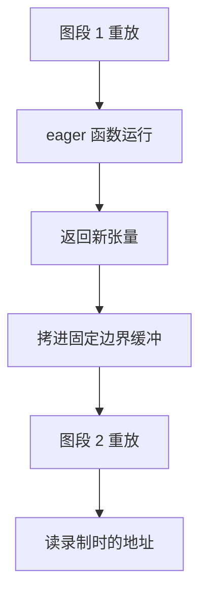

# SGLang 的 CUDA Graph 进阶：录到一半停下来，让 prefill 也能上图

<!-- release-date: 2026-08-17 -->

> 本文依据 SGLang 团队于 2026 年 8 月 17 日发布在 LMSYS 官方博客的 **Advanced CUDA Graph Techniques in SGLang**，访问日期 2026-09-24。
>
> 原文地址：<https://www.lmsys.org/blog/2026-08-17-advanced-cuda-graph>
>
> 原文小节标题不带编号，下文的事实锚一律写「原文某某一节」，用英文原标题，便于在页面上搜到。署名是 SGLang Team，文末致谢写明这是 SGLang 团队与 Meta 团队的合作。全文把三件事分开标注：**原文明确写了什么**、**我们如何解释它**、**哪些是外部资料补充**。

## 读前先把几个词说成人话

这篇博客默认读者天天和推理引擎打交道，下面这些词会反复出现：

- **kernel 下发（launch）**：CPU 每让 GPU 跑一个算子，都要走一遍「校验参数、打包、写进队列」，每次几微秒。模型一步前向有成百上千个 kernel，这笔账就不小了。
- **CUDA Graph（CUDA 图）**：先把一整串 kernel **录（capture）** 下来，之后每步只 **重放（replay）** 这一个对象，CPU 不再逐个下发。代价是录下来的东西被冻结：形状不能变，地址不能变，中间不能有 CPU 参与的判断。
- **eager（逐个下发）**：不录图，PyTorch 默认的执行方式。灵活，但每个 kernel 都付一次下发的钱。
- **prefill 与 decode**：prefill 一次性处理整段输入，decode 每步只生成 1 个 token。
- **分块预填充（chunked prefill）**：把长输入切成固定大小的块分几步做完。块大小 `chunked_prefill_size` 因此是单次 prefill 前向的上限。
- **分段 CUDA 图（piecewise CUDA Graph）**：录不进图的那几个算子留在图外 eager 跑，前向被切成「图段、eager、图段……」交替的一串。
- **torch.compile**：PyTorch 的编译器。其中 **Torch Dynamo** 负责把 Python 前向追踪成一张计算图（FX graph），每次调用前还要做 **guard 检查**，确认输入仍满足编译时的假设。
- **注意力元数据（attention metadata）**：注意力 kernel 需要的每条序列长度、偏移、页表等。很多注意力后端要在 CPU 上根据实时长度提前规划，这是它难以进图的主要原因。
- **TTFT（Time To First Token，首 token 延迟）**：请求发出到拿到第一个输出 token 的时间，prefill 的快慢主要体现在这里。

## 一句话先说清

decode 早就整步上图了，prefill 一直上不去：它有两个维度同时在变，注意力还要 CPU 现场规划。SGLang 给出三层回答。第一层是把 CUDA Graph 的代码拆成 **runner（管形状与缓冲）** 和 **backend（管怎么录）** 两层，各种录法可以换着用。第二层是 **可断图（Breakable CUDA Graph，BCG）**：录到不能录的算子就停下来，让它 eager 跑，跑完接着录新的一段，全程不经过编译器。它现在是 SGLang prefill 的默认做法，代码量约为编译器路线的四分之一，建图快 3.8–5.2 倍。第三层是 **prefill 全图**：token 数补齐到固定档位，请求数用零长度哨兵补满固定槽位，整个前向录成一张图，目前还是实验功能。只测 prefill 时，可断图比 eager 快 1.70 倍，全图快 1.93 倍（原文 TL;DR 一节）。

上图引自原文 CUDA Graph in SGLang 一节的设计图。三种 backend 的差别全在下半部分：它们最后得到的执行结构可以一样，差在切口是 **什么时候、由谁** 定下来的。

### 一条阅读路线

1. 先看主要矛盾：为什么 prefill 迟迟上不了图。
2. 再看全景：runner 与 backend 两层各管什么。
3. 核心设计一：可断图怎么在录制现场切，比编译器路线好在哪、代价在哪。
4. 核心设计二：prefill 全图怎么把两个会变的维度都钉死，补齐的账怎么算。
5. 实验：prefill 单独测时四条路各快多少，为什么曲线是平的。
6. 图显存：分段为什么不会让显存翻倍，为什么录图上限要到分块大小。
7. 最后：独立库、原创性声明的范围、限制与可迁移启发。

## 主要矛盾：decode 早就上图了，prefill 为什么一直上不去

CUDA Graph 用在 decode 上很自然。每条请求每步只贡献 1 个 token，会变的维度只剩 batch 大小。按 batch 录一组档位，真实 batch 向上补齐到最近的档位，事情就解决了（原文 Full CUDA Graph 一节）。

prefill 卡在两处。

**第一处，两个维度同时在变。** 一个 prefill batch 的 token 总数在变，这些 token 分属几条请求也在变。录好的图要求两者都固定（原文 Full CUDA Graph for Prefill 一节）。

**第二处，一个录不进去的算子会拖累整张图。** prefill 注意力是典型：有些注意力后端要根据实时序列长度在 CPU 上做准备。原文 Breakable CUDA Graph: Eager Breaks without a Compiler 一节说得很直接：只要有一个算子录不进去，一大段本来能录的前向就跟着上不了图。

在 SGLang 之前，对第二处的标准回答是编译器路线的分段图：让 torch.compile 以 `fullgraph=True` 追踪整个前向，在注册好的切点把 FX 图切开，每一段各自编译、各自录图（原文 TC piecewise CUDA Graph 一节）。这条路能用，SGLang 最早也是这么做的，今天在还没验证可断图的平台上仍保留着它。但它把「上图」变成了「接入编译器」，下面几节的代价都从这里来。

**我们的解释**：这篇博客的主线是把「能不能上图」和「编译器能不能读懂这段代码」拆开。decode 从来不需要编译器也能上图，prefill 之所以被绑在编译器上，只是因为当时切图这件事只有编译器会做。

## 先看全景：runner 管形状，backend 管怎么录

重构之前，decode、prefill、推测解码各有一套 CUDA Graph runner，捕获形状、静态缓冲、重放、配置这几块逻辑相互重叠。执行模式和录法越加越多，基础设施没法复用，和 CUDA Graph 有关的启动参数也越来越含糊（原文 CUDA Graph in SGLang 一节）。

重构 [#23906](https://github.com/sgl-project/sglang/pull/23906) 把职责切成两层：

| 层 | 管什么 | 例子 |
|---|---|---|
| runner | 这条执行路径录图与重放所需的状态 | 录了哪些形状、静态输入缓冲、注意力元数据、把实时 batch 补齐到已录形状 |
| backend | 这段前向怎样变成可重放的图 | 整个前向一张图 / 录制中切段 / 先追踪再切段 |

runner 只依赖一个公共的 backend 接口，所以每条执行路径可以独立选录法。prefill 与 decode 各有自己的 runner。推测解码加得更多：EAGLE 草稿、draft-extend、冻结 KV 的 MTP 草稿步各自有一个建在 decode runner 之上的 runner；目标模型的验证步就是 decode runner 本身，只是每条请求录不止一个 token（原文同一节）。

三种 backend 在原文里是这样分工的：

| backend | 怎么录 | 重放时的下发 | 原文定位 |
|---|---|---|---|
| 全图（full） | 每个选定形状录一个 `torch.cuda.CUDAGraph`，没有 eager 区 | 三者最少 | decode 的自然选择；prefill 见后文 |
| 可断图（breakable） | 录制中遇到标记的函数就停，跑完再开新段 | 图段之间有 eager 区 | prefill 默认 |
| TC 分段（tc_piecewise） | Dynamo 追踪整个前向，按切点切开，每段编译后录 | 每次都要回到编译产物的调用入口 | SGLang 最早的分段方案，保留给未验证可断图的平台 |

**可迁移启发**：「形状与缓冲管理」和「录图策略」是两件正交的事。把它们拆开以后，新增一种录法不必再复制一套 runner，新增一条执行路径也不必重新发明录法。自己的推理或训练栈里有多套几乎一样的 graph runner 时，这是最先值得做的重构。

## 核心设计一：可断图——录到一半停下，跑完再接着录

### 旧问题：编译器要先读懂整张前向

TC 分段图的顺序是 **先追踪整张图，再切**。编译器必须先理解整个前向，才能在注册好的切点把它切开（原文 Design and Mechanism 一节）。这个前提带来三笔账：启动要编译，自定义 kernel 要为编译器专门包装，切口只能落在编译器表达得了的地方。

### 新设计：在录制现场切

可断图把顺序倒过来：**不追踪，边录边切**。开发者把录不进去的函数用 `@eager_on_graph` 标出来。录制走到这个函数时，当前图段收尾；函数照常 eager 跑一次；随后在新的一段里继续录。整个前向就变成「图段、eager、图段……」的一串（原文 Breakable CUDA Graph 一节与 Design and Mechanism 一节）。

从结果看，可断图和 TC 分段得到的是同一种可重放结构。区别只在这个结构是怎么搭起来的：TC 分段先让编译器看懂全局再切，可断图在录制进行时就地放下切口（原文 Design and Mechanism 一节）。

### 工作机制：断点处那块「边界缓冲」

真正的难点在断点两侧怎么接上。下一段图录下的是 **某个张量的地址**，而 eager 函数每次运行都会返回一个新张量。原文给出的做法是：

1. **录制时**，被标记的函数在两段图之间运行一次，它返回的张量被留作一块 **持久的边界缓冲**，地址从此固定；下一段图就对着这个地址录。
2. **重放时**，按录制时的顺序依次跑图段和 eager 函数。eager 函数正常运行、返回新张量，可断图把它 **拷进那块边界缓冲**；下一段图从它录制时的地址读到的就是新值。
3. 可断图 **从不检查、也不追踪** eager 区里面的算子，只要求它们能正确执行。

以上三条都出自原文 Design and Mechanism 一节。

这张图是根据原文 Design and Mechanism 一节的文字重画的机制示意，不是实测时间线。

**我们的解释**：CUDA Graph 最基本的纪律是「地址冻结、内容可变」。可断图并没有绕开这条纪律，只是在每个断点手动守住它：边界张量的地址在录制时冻结，重放时靠一次拷贝更新内容。代价是每个断点每次重放多一次设备内拷贝，换来的是 eager 区可以是任何东西。

### 收益一：启动快，因为根本没有编译阶段

编译器路线的启动时间几乎全花在编译上，而且随模型复杂度增长。原文 Benefits 一节给出的对比如下，条件是 TP4、4×GB300，每种配置录 42 个形状，不含权重加载与 kernel JIT：

| 模型 | 结构 | 可断图 | TC 分段（编译 + 录图） | TC 慢多少 |
|---|---|---|---|---|
| Qwen3-235B-A22B | 94 层 MoE | 27.7 s | 90.4 + 16.2 = 106.6 s | 3.8 倍 |
| GLM-5.2 | 78 层 MoE + DSA 稀疏注意力 | 35.2 s | 158.2 + 24.9 = 183.1 s | 5.2 倍 |

表中数字读自原文 Benefits 一节的建图时间图。原文正文说编译占准备 prefill 图总时间的 78%–86%；按上表算，两个模型分别是 85% 和 86%。

同一张图的脚注还写了一句容易被忽略的话：**单看录图这一步，可断图比 TC 分段略慢**。按表里的数，27.7 s 对 16.2 s，35.2 s 对 24.9 s，差距并不小。原文没有解释原因。**我们的推测**：可断图录制时要真的 eager 执行每个断点函数、维护边界缓冲；TC 分段在编译阶段已经把这些准备做完了。可断图赢的是总账，不是录图本身。

启动时间也影响日常开发。原文提到，当时的 CI 里编译经常在多次测试之间重复，CUDA Graph 相关测试明显变慢。更好的缓存能缓解，但把编译器从录图路径上拿掉，这一层复杂度就直接没了。

### 收益二：切口跟着服务逻辑走，不跟着编译器走

这是原文篇幅最长的一条收益，也是从工程角度看最重要的一条（原文 Benefits 一节 Broader compatibility 段）。

SGLang 大量使用自定义 CUDA、Triton 和 JIT 编译的 kernel，它们不是 PyTorch 原生算子。要让 torch.compile 看得见它们，往往得通过 `torch.library` 包装，再写一份供追踪用的 fake 实现。于是整条 kernel 栈里到处都是只为编译器存在的脚手架。

更麻烦的是编译器还限制了切口的位置。跨过注册算子边界的输入输出必须是编译器能表示的类型。如果自然的边界处带着更特殊的运行时状态或返回类型，就只能另找切点，或者把 eager 区扩大，只为了露出一个编译器吃得下的接口。

CUDA Graph 要和 DP attention、MoE all-to-all 后端、LoRA、PD 分离、分层缓存、确定性推理等不断演进的功能共存。原文的原话是：让 CUDA Graph 工作，越来越像一个 torch.compile 集成项目。新 kernel 意味着注册自定义算子、写 fake 实现；新功能可能逼着把图边界挪个位置，只为让编译器满意。可断图下，录不进去的区域就保持为普通 eager 执行，这部分专为编译器付出的工程开销大幅减少。

### 收益三：断点天生能调试

录好的 CUDA Graph 重放时是一个不透明的整体，里面不执行 Python，print、断言、单步调试都用不了。可断图天然留下了每次重放都会跑 Python 的 eager 区。

SGLang 顺着这个思路加了 `--debug-cuda-graph`（最早就在 [#19102](https://github.com/sgl-project/sglang/pull/19102) 里）：相当于把整个前向包进一个 eager 断点。模型 eager 执行，但仍然经过 CUDA Graph runner、静态缓冲、重放路径和元数据准备。这给出一条清楚的排障分界：问题还在，多半出在模型或 runner；问题消失，录图本身就是头号嫌疑（原文 Benefits 一节 Debuggable by construction 段）。

### 代价与适用边界

- **eager 区仍然付下发的钱**。断点越多，省下的下发越少；这也是全图在 prefill 上还能比可断图再快一截的原因（见后文实验）。
- **每个断点每次重放多一次边界拷贝**（上文机制第 2 步）。
- **单看录图比 TC 分段慢**（上文表格脚注）。
- **只省下发，不省计算**。原文在扩散一节把这句话单独点了出来：可断图不减少模型 FLOPs，也不会让算力受限的 kernel 变便宜。

### 可迁移启发

- 想让一段「大部分能进图、少数算子不能」的代码上图，不必先引入编译器。在录制过程中切段，只要求断点处的输出放进地址固定的缓冲，就能拿到分段图的大部分收益。
- 被迫为了某个优化手段改动与它无关的代码边界时，说明耦合放错了地方。可断图的价值不在性能数字，而在于把「图边界」还给业务逻辑决定。
- 调试开关最好复用生产路径：`--debug-cuda-graph` 仍然走 runner 和静态缓冲，只把录图本身换掉，因此能一刀切出「是录图的问题还是别处的问题」。

## 同一招搬到扩散模型

SGLang 的扩散模型栈也用上了可断图（[#27436](https://github.com/sgl-project/sglang/pull/27436)）。去噪过程反复执行同一个 DiT 前向；这个前向里小而受下发限制的 kernel 很多时，CUDA Graph 格外有用。原文 BCG in Diffusion 一节列了三点做法：

1. **按真实服务的形状录**。分辨率、视频帧数、提示词条件长度、CFG 模式、选用的 transformer 都会影响录图签名。只预热真正在服务的形状，没见过的签名回退 eager。
2. **在动态算子两侧断开**。动态注意力、依赖运行时的元数据准备留在 eager，其余稳定部分录图，不需要 torch.compile 看懂整个 DiT。
3. **利用去噪的重复结构**。稳定区域录一次，在整个去噪循环里反复重放。

预热后的端到端延迟（读自原文 BCG in Diffusion 一节的图；各行的工作负载、步数、分辨率、硬件都不同，只能行内比较）：

| 模型 | 设置 | 硬件 | eager → 可断图 | 加速 |
|---|---|---|---|---|
| Qwen-Image | 512×512 | B200 单卡 | 6.480 → 2.450 s | 2.64 倍 |
| Z-Image | 256×256 | B200 单卡 | 1.231 → 0.662 s | 1.86 倍 |
| Ideogram 4 | 512×512 | B200 单卡 | 1.625 → 0.991 s | 1.64 倍 |
| SANA1.5-1.6B | 1024×1024，20 步 | H200 单卡 | 0.821 → 0.608 s | 1.35 倍 |
| LTX-2 两阶段 | 768×512×121 帧 | H200 双卡，CFG 并行 | 8.538 → 6.893 s | 1.24 倍 |

图的脚注写着：可断图针对的是暴露出来的下发间隙，不减少模型 FLOPs、文本编码和 VAE 的工作量。**我们的解释**：表里加速从 2.64 倍一路降到 1.24 倍，大体对得上这条规律。小分辨率的图像模型每个 kernel 都短，下发占比高；高分辨率、长视频的 kernel 本身就长，图能省的比例自然小。

## 核心设计二：prefill 全图——把两个会变的维度都钉死

可断图解决了「有算子录不进去」，但断点处仍然 eager。要把 prefill 的下发开销压到最低，得回到全图：整个前向一张图。原文说，正是 prefill 的两维变化加上依赖运行时元数据的注意力，让全图难以用在 prefill 上，这也是当初 prefill 选可断图的主要原因之一（原文 Full CUDA Graph for Prefill 一节）。后来的 [#27988](https://github.com/sgl-project/sglang/pull/27988) 重构了请求槽位与注意力元数据的表示方式，受支持的注意力后端不再必须留在图外，prefill 于是也能整图录下。

### 两个维度，两种补法

上图引自原文 Making prefill static 一节。

- **token 维：分桶补齐**。实时 batch 的 token 数补齐到最近的已录档位，和 decode 把 batch 大小补齐到档位是同一个思路。
- **请求维：固定槽位 + 零长度哨兵**。每张录好的图预留固定数量的请求槽位。真实请求占前几个，没用上的槽位改写成零长度哨兵：序列长度和 extend 长度都是 0，偏移停在真实 token 之后。请求数超过槽位数，就回退 eager。

每次重放前，还有两件事要在图外重做。一是 **哨兵元数据每次都要重写**，因为录好的图仍然会读整张请求表。二是 **注意力元数据按补齐后的 batch 在图外重建**。所以全图 prefill 需要注意力后端支持这种元数据准备方式，目前主要是 FlashAttention 和 FlashInfer（原文 Making prefill static 一节）。

### 补齐的账不对称

两种补齐的代价差得很远（原文 What does the padding cost? 一节）：

| 补的是什么 | 代价 | 原因 |
|---|---|---|
| 补齐 token | **真实的计算** | 它们是录进 batch 的真实行，跟着同一个 GEMM 走完每一个稠密投影。SGLang 单独携带真实 token 数，让 MoE 路由、注意力、线性注意力 kernel 跳过大部分补齐区，但稠密计算照样要付 |
| 空请求槽位 | **几乎免费** | FlashAttention 的变长调度按每条序列的实际长度分配工作，不按槽位分配。零长度请求几乎不产生注意力计算，只多一点元数据和调度开销 |

原文的结论是：**token 补齐才是贵的那一维，请求槽位补齐相对便宜**。

**我们的解释**：这决定了两个维度的档位该怎么定。token 档位要密，因为每多补一个 token 就多一行 GEMM；请求槽位可以给得宽裕，因为多几个空槽位几乎不花钱，却能少触发回退 eager。原文没有给出具体的档位与槽位选法，只说调优还在后面。

### 现状：还是实验功能

prefill 全图必须显式开启，引擎会警告 full 是实验性的，并建议生产环境用 breakable 或 tc_piecewise。目前主要在 FlashAttention（fa4）和 FlashInfer 后端上可用，因为只有它们按录图路径需要的方式构建 extend 模式的元数据。扩大后端支持、调优档位和槽位，原文都列为下一步（原文 What does the padding cost? 一节末段）。

### 可迁移启发

- 一个维度有界、每一格的空跑又便宜时，用「固定槽位 + 零长度哨兵」把它从形状里拿出去，比为它单独分档划算。这个想法不限于 prefill：凡是变长 batch、按实际长度调度的 kernel，都可以这样处理。
- 补齐之前先分清补的是哪一维、那一维的空位会不会进 GEMM。能让下游 kernel 按真实长度跳过的，补齐几乎不花钱；进了稠密矩阵乘的，补多少付多少。

## 实验怎么证明：只测 prefill 时，四条路各快多少

原文 Prefill benchmark 一节只测 prefill：固定输入长度，只输出 1 个 token，一次一个请求，所有配置都关掉 decode 图。模型是 gpt-oss-120b（TP4，4×GB300），四条路都能在上面跑。

| 输入长度（token） | 64 | 128 | 256 | 512 | 1024 | 2048 | 相对 eager |
|---|---|---|---|---|---|---|---|
| 不录图 | 140 | 146 | 143 | 148 | 142 | 146 | 1 倍 |
| TC 分段 | 99 | 107 | 102 | 89 | 96 | 104 | 1.45 倍 |
| 可断图 | 83 | 87 | 86 | 83 | 86 | 86 | 1.70 倍 |
| 全图 | 75 | 74 | 74 | 70 | 80 | 76 | 1.93 倍 |

单位是毫秒，取 TTFT 中位数。各格读自原文的折线图，是约数；最后一列加速比是原文正文给的数。

读这张表要知道三件事：

1. **每条曲线在 32 倍的输入长度范围内都是平的**。原文的判断是：这是下发开销的特征，不是计算的特征。长度翻了 32 倍、时间几乎不动，说明这个区间里 GPU 算得很快，时间都花在 CPU 喂 kernel 上。
2. **可断图重放也比 TC 分段快 17%**，不只是建图快。原因在每次前向做的事不同：可断图直接重放录好的段；TC 分段每次都要回到编译产物的调用入口，先付 Torch Dynamo 的 guard 检查和分派，才轮到它自己录好的那几段。
3. **全图比可断图再快一截**，差的就是断点处那几段 eager 的下发。

另一个模型 GLM-5.2 上，只有可断图能录：TC 分段追踪不了它的前向，全图对它的稀疏注意力没有路径。可断图在那里比 eager 快 1.60 倍。

**我们的解释**：GLM-5.2 这一行比 gpt-oss-120b 上的排名更能说明问题。可断图的卖点不只是「比 TC 快一点」，而是在另外两条路都走不通的新模型上，它是唯一还能上图的办法。原文实验只覆盖一次一个请求的单独 prefill；混合负载下的端到端吞吐与 TTFT 分布，原文没有给。

## 图显存：分段不能让显存翻倍，上限要录到分块大小

原文 Memory Footprint of CUDA Graphs 一节把显存问题拆成两个：分段录图不能让常驻显存成倍增长；录图要录得够远，常驻的图显存才能真正替掉最坏的 eager 激活峰值。

### 分段内的三种复用

分段 backend 很容易让显存翻倍：每个录好的形状有好几段图，每段都有必须在重放期间保持有效的中间张量。可断图靠三种复用避免这件事（原文 Reuse inside a segmented capture 一节）：

| 复用 | 做法 | 避免了什么 |
|---|---|---|
| 各段共用一个显存池 | 一个形状的所有图段用同一个 CUDA Graph 显存池 | 每段各占一份中间存储 |
| 断点处用弱引用 | 传进断点的张量，存储已归图池管时只持有弱引用 | 多余的 Python 引用拉长张量寿命 |
| 各形状共用一个输出缓冲 | 只分配一块最大尺寸的输出缓冲，每个形状切出自己需要的行 | 每个形状各分配一块输出缓冲 |

弱引用的技巧来自 vLLM 的 [#9724](https://github.com/vllm-project/vllm/pull/9724)。**外部补充**：那个 PR 于 2024-10-27 合并，标题是 cudagraph output with tensor weak reference；它的描述用一个多档位输出缓冲的例子说明，多张图如果各自持有输出张量的强引用，每张图都会钉住一份输出显存；改成弱引用后，各张图可以共享输出缓冲。

有一个值不能这样处理：**跨断点传递数据的那个张量**。下一段图是对着它的地址录的，它必须一直活着，每次重放原地更新。这正是核心设计一里那块边界缓冲。

有了这些复用，录图表再大，显存也不多：GLM-5.2 上 78 层 MoE、42 个形状，图显存总共多出 2.4 GB（原文同一节）。

### 录图上限为什么比档位数更重要

原文 Capture through the chunked-prefill size 一节讲的是一个反直觉的结论：**录图录得更远，显存反而更少**。

两类显存性质不同。图显存是 **常驻** 的：录图时分配，服务活多久它就占多久。eager 激活是 **临时** 的：每次 prefill 分配工作内存，峰值由支持的最大 prefill 决定。

录下一个 prefill 形状，相当于把这个形状的临时工作集搬进图的常驻显存池。但这只对真正走图的形状有效。录图档位如果停在最大 prefill 以下，最大的那次 prefill 仍然回退 eager，原来的激活峰值一点没少，服务器还要为下面那些常驻图多付一份钱。因为 `chunked_prefill_size` 限定了单次 prefill 前向的上限，录到这个大小，最坏的 eager 激活峰值就没了。

原文的测量是：在恰好等于分块大小（8192 token）的一次 prefill 之后，高出「不录图时常驻基线」的显存。

| 录图上限 | 不录图 | 1024 | 2048 | 4096 | 8192（= 分块大小） |
|---|---|---|---|---|---|
| gpt-oss-120b，TP2 | 0.560 GB | 0.575 GB | 0.580 GB | 0.591 GB | **0.055 GB** |
| GLM-5.2-FP8，TP4 | 1.552 GB | 1.572 GB | 1.584 GB | 1.607 GB | **0.456 GB** |

数字读自原文的柱状图，每一格是「常驻图显存 + 单次激活峰值」之和。上限低于分块大小时，只是在原来的峰值上多叠了一小截常驻图显存；上限到了分块大小，最大那次 prefill 也开始走图，峰值塌下去。原文给出的峰值变化是：gpt-oss-120b 从 0.56 GB 到 0.001 GB，基本归零；GLM-5.2 从 1.55 GB 到 0.35 GB，剩下的那部分来自仍在断点处 eager 运行的稀疏注意力索引器。

录到分块大小换来两样东西：

- **总显存更低**：激活峰值不再按请求付，总量落到不录图基线之下。gpt-oss-120b 低 0.51 GB，GLM-5.2 低 1.10 GB。放在几百 GB 的总占用里不算多，但这是节省，不是开销。
- **显存可预测**：一个随负载变化的激活尖峰，变成录图时就确定下来的固定分配。引擎可以提前把这块算进账，不必为只在大 prefill 时出现的临时峰值预留余量。

### 可迁移启发

- 评估 CUDA Graph 的显存开销时，不要只数档位个数，先看 **最高档是否覆盖了会出现的最大前向**。没覆盖，就是两头付钱：常驻图显存照付，最坏峰值也没省掉。
- 分段录图的显存纪律可以归成一句：**段内张量归图池管、只持弱引用；只有跨断点的那一个张量必须强持有、原地更新**。

## 抽成独立库：breakable-cuda-graphs

录图机制本身不绑定 SGLang。SGLang 团队与 Meta PyTorch 团队合作，把它抽成了独立库 [meta-pytorch/breakable-cuda-graphs](https://github.com/meta-pytorch/breakable-cuda-graphs)。它用一套 PyTorch 风格的小 API 暴露同样的录图模型（原文 BCG as a Standalone Library 一节）：

| API | 对应什么 |
|---|---|
| `breakable_graph(...)` 上下文管理器 | 对应 `torch.cuda.graph` |
| `@no_graph` 装饰器 | 标记在图段之间 eager 运行的函数，对应 SGLang 内的 `@eager_on_graph` |
| `CUDAGraphSequence` | 按顺序重放录好的图段与 eager 区 |

上下文里一次断点都没发生时，整块就录成一段图，标准 CUDA Graph 用法是它的特例。原文说这个库可以直接用于其他推理引擎、训练循环或研究原型，不必接入 SGLang 的 runner 体系，并预期独立库和 SGLang 内的实现会逐渐收敛。

**外部补充**（来自该库 README，不是博客原文）：库的约束比博客描述的 SGLang 内实现更严格。`@no_graph` 函数 **不能返回 CUDA 张量**，要把输出写进作为参数传入的预分配缓冲；进入 `@no_graph` 函数或离开 `breakable_graph` 上下文之前，侧流必须汇合回录图流。库里还有 `force_no_graph()`，插入一个不带任何 eager 工作的断点，用于调试或隔离录图区域；一个序列里的所有图段共用一个显存池，也可以通过 `pool()` 让多个序列共用。

**我们的解释**：博客里 SGLang 的做法是「eager 函数返回新张量，由框架拷进边界缓冲」；独立库改成「调用方自己写进固定缓冲」。前者对模型代码更友好，后者把边界缓冲的责任交给使用者，省掉框架内那次拷贝，也让约束更容易检查。两者会怎样收敛，原文没有说。

## 原创性声明怎么读

原文用了一整节（Origin and Open-Source Lineage）讲来历，并把主张范围收得很窄：

- SGLang 在 2026-02-21 发布了第一个实现：[#19102](https://github.com/sgl-project/sglang/pull/19102) 的首个提交里已经有 `BreakableCUDAGraph`、eager 断点装饰器，以及结束、恢复录图的运行时机制，该 PR 于 4 月 11 日合并。
- 2026 年 4 月扩展到 prefill：[#22218](https://github.com/sgl-project/sglang/pull/22218) 明确基于 #19102，把可断图做成不需要编译器的 prefill 分段 backend，4 月 24 日合并，之后成为 SGLang 默认的 prefill 录图策略。
- 原文强调，原创性主张只针对 **开源 LLM 服务里这种运行时可断的录制与重放机制**：SGLang 最先提出、命名、实现并开源了它。**不主张** 图分段或 eager 回退这类更宽泛的概念此前没有先例。

**外部补充**：把博客引用的几个 PR 与独立库按时间排开如下，日期取自 GitHub 页面。

| 日期 | 事件 |
|---|---|
| 2024-10-27 | vLLM #9724 合并：图输出改用张量弱引用 |
| 2026-02-21 | SGLang #19102 创建，标题是 Introduce CUDA graph debug mode with breakable CUDA graph；04-11 合并 |
| 2026-04-24 | SGLang #22218 合并，标题带 [Experimental] Breakable Piecewise Cuda Graph |
| 2026-06-10 | SGLang #23906 合并：runner/backend 重构 |
| 2026-06-26 | meta-pytorch/breakable-cuda-graphs 仓库创建 |
| 2026-07-07 | SGLang #27988 合并，标题带 [Experimental] Full Cuda Graph Support for Prefill |
| 2026-07-08 | SGLang #27436 合并：扩散 DiT 启用可断图 |
| 2026-08-17 | 本篇博客发布 |

**我们的解释**：#19102 的标题值得注意。可断图第一次进主干时，是以「CUDA graph 调试模式」的名义进来的，prefill 分段是一个多月后的第二步。这和收益三的叙述对得上：先有「把整段前向包成一个断点」的调试需求，再发现同一套机制能用来替代编译器切图。

## 限制与没有公开的东西

- **实验面窄**：prefill 基准是一次一个请求、固定输入长度的单独 prefill，模型只有 gpt-oss-120b 和 GLM-5.2。混合 prefill/decode 负载、高并发下的端到端吞吐与 TTFT 分布，原文没有给。
- **全图 prefill 仍是实验功能**：只在 fa4 和 FlashInfer 后端上可用，档位与槽位怎么选，原文说还没调优。
- **两个显存数字的口径没有对齐**：Reuse inside a segmented capture 一节说 GLM-5.2 上 42 个形状的图显存是 2.4 GB；显存柱状图里录到 8192 时，常驻图显存那一截只有约 0.1 GB。这张图量的是「高出不录图常驻基线的部分」，两个数怎么对应，原文没有交代。
- **单看录图可断图更慢**：原文只在图注里提了一句，没有解释原因，也没有给优化方向。
- **gpt-oss-120b 的并行配置在两张图里不同**：prefill 延迟图是 TP4，显存图是 TP2，原文没有说明为什么换配置。
- **原创性主张**：原文自己把范围限定在开源 LLM 服务里的运行时可断录制机制，没有和其他系统的做法逐一对比。

## 可迁移启发

把全文串回一条线：CUDA Graph 在推理引擎里真正的难点不是「怎么录」，而是 **怎样录下尽可能多的工作，又不牺牲兼容性、启动时间和显存**（原文 TL;DR 首句）。这篇博客给出的回答可以拆成几条原则：

1. **把形状管理和录法拆开**。runner 管形状、缓冲和补齐，backend 管怎么录，各执行路径可以自由组合录法。
2. **切图不一定要编译器**。录到不能录的地方就停，eager 跑完再接着录；只要守住断点处边界缓冲的地址，就能拿到分段图的收益，代码量、启动时间和耦合都小得多。
3. **补齐先分维度算账**。进稠密 GEMM 的维度要细分档位；能按真实长度跳过的维度可以用零长度哨兵补满，几乎不花钱。
4. **录图上限要覆盖最大前向**。否则常驻图显存和最坏激活峰值两头付钱；录到分块大小，总显存反而下降，而且可以提前算清楚。
5. **调试路径复用生产路径**。把整个前向包成一个断点，就能把「录图的问题」和「模型或 runner 的问题」一刀分开。

这些原则大多与 SGLang 无关，训练循环、扩散推理、自研引擎都能直接用；独立库就是为此准备的。依赖特定条件的是全图 prefill：它要求注意力后端能在图外按补齐后的 batch 重建元数据，并按实际长度调度。

## 关键词回看

- **runner / backend**：前者管某条执行路径的形状、静态缓冲与补齐，后者决定前向怎么变成可重放的图。
- **全图（full）**：整个前向一张图，重放时下发最少；decode 的自然选择，prefill 上还是实验功能。
- **可断图（Breakable CUDA Graph，BCG）**：录制中遇到 `@eager_on_graph` 标记的函数就停段，eager 跑完再开新段，不经过编译器。
- **TC 分段（tc_piecewise）**：torch.compile 追踪整个前向，按注册切点切开，每段编译后录图。
- **边界缓冲**：跨断点传数据的那个张量，地址在录制时固定，每次重放把 eager 函数的新输出拷进来。
- **零长度哨兵**：全图 prefill 里没用上的请求槽位，长度写成 0，几乎不产生注意力计算。
- **录图上限**：录图档位的最高值；录到分块大小，最坏的 eager 激活峰值才会消失。
- **`--debug-cuda-graph`**：把整个前向包成一个 eager 断点，仍走 runner 与重放路径，用来区分是不是录图本身的问题。

## 资料与阅读边界

- **原始依据**：LMSYS 官方博客 [Advanced CUDA Graph Techniques in SGLang](https://www.lmsys.org/blog/2026-08-17-advanced-cuda-graph)，页面标注 SGLang Team、August 17, 2026，访问日期 2026-09-24。文末致谢列出 SGLang 方 7 人（Yuwei An 为共同一作）与 Meta 方 2 人（Shiyang Chen 为共同一作），另感谢 NVIDIA、AMD、Thinking Machines Lab 与 Meta PyTorch 团队。正文共 6 张图，本文把设计图与 prefill 全图示意原样引用，其余 4 张图表改写成了表格。
- **`release-date` 的口径**：这篇讲的是几项技术合在一起的成果，其中可断图最早在 2026-02-21 以 PR 形式公开。本站以博客发布日 2026-08-17 作为首发日。
- **目录归属**：SGLang 论文一篇放在 Berkeley 目录，本篇与它同系列，放在一起便于对照。署名是 SGLang 团队与 Meta 团队，不是 UC Berkeley。
- **跟进的链接**：SGLang 的 #19102、#22218、#23906、#27436、#27988 五个 PR，取了标题与创建、合并日期；vLLM #9724，取了标题、合并日期与动机描述；meta-pytorch/breakable-cuda-graphs 仓库 README，取了 API 与约束。这些都标成了外部补充。
- **读图说明**：建图时间、扩散延迟、prefill 延迟、显存四张图表的数字都读自原图。prefill 延迟各格是折线图上的约数，加速比以原文正文为准。
- **与其他篇的分工**：SGLang 论文本身（RadixAttention 等）见 SGLang 一篇。SGLang 当前代码里 CUDA Graph 的实现与调参，见开源解读「SGLang 07｜执行与 CUDA graph」，那边讲的是某个 commit 下代码现在的样子，和这篇博客在时间轴上不同，两边说法有出入属于正常。CUDA Graph 本身的原理（录制、重放、分档、图显存池）见知识库 CudaGraph 一篇。
