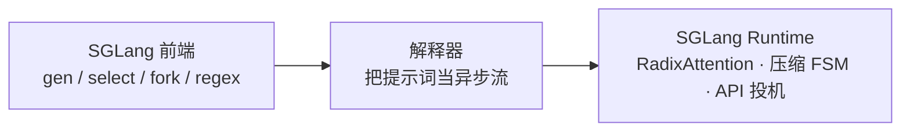
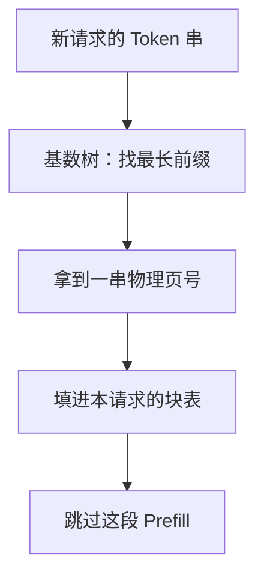

# SGLang：多轮对话和 JSON 约束把同一段前缀算了无数遍

<!-- release-date: 2023-12-12 -->

> 本文依据 LMSYS / UC Berkeley 的 **SGLang: Efficient Execution of Structured Language Model Programs**，即 arXiv:2312.07104v2（2024-06-06），共 20 页。截至核验 arXiv 最新是 v2。页码均指这份 PDF。全文把三件事分开标注：**报告明确写了什么**、**我们如何解释或验算它**、**哪些是外部资料补充**。
>
> 封面作者以 Lianmin Zheng（UC Berkeley）与 Ying Sheng（Stanford）为共同一作，单位还有上海交大、Texas A&M 与独立研究者。正式发表于 NeurIPS 2024。本站按任务指定放在 Berkeley 目录。开源仓库后来由 LMSYS 托管，那是论文之后的事，下文会单独标出来。
>
> v1 于 2023-12-12 公开，当时标题是 **Efficiently Programming Large Language Models using SGLang**，摘要写的加速上限是 5×。v2 把标题改成现在这句，加速上限改成 6.4×，并补上压缩有限状态机、多模态与生产部署。本文只依据 v2，不用 v1 的数字覆盖 v2，也不用 v2 的日期回写首发日。

## 读前先把六个词说成人话

这篇论文同时用了编程语言、缓存系统和约束解码三套词。先把六个最关键的说清楚，后面就不用反复解释。

- **语言模型程序（Language Model Program，LM Program）**：不是「问一句、答一句」，而是一段带控制流的程序，里面会多次调用模型，中间夹着分支、循环、工具和格式约束。少样本评测、ReAct 智能体、思维树、JSON 抽取都算。
- **KV Cache（键值缓存）**：模型每读进一个 Token，就为它留下一对 Key/Value 向量。生成下一个 Token 时要回看全部历史，所以这些向量被留在显存里，不必每步重算。
- **Prefill 与 Decode**：Prefill 是一次性吃完整段提示词，Decode 是之后逐 Token 往外吐。前缀缓存省的是 Prefill 的计算，Decode 仍要把历史 KV 读一遍。
- **前缀共享**：两段请求如果开头完全一样，那一段 KV 只需算一次。关键限制是「只认前缀」：中间相同、开头不同，一个 Token 都复用不了。
- **约束解码（constrained decoding）**：生成时把不合法的 Token 概率打成零，强迫输出遵守正则或 JSON 模式。论文把它做成有限状态机。
- **基数树（radix tree）**：压缩过的前缀树。一条边上可以挂一整串 Token，只有真正分叉的地方才裂一个节点。RadixAttention 用它当 KV 的索引。

如果你只想记一句话：

> **多轮对话、少样本模板、分支搜索和 JSON 模式，会让同一段前缀被朴素服务算无数遍。SGLang 把「哪些前缀已经算过」交给一棵基数树自动管起来，再把 JSON 里那些唯一合法的固定字符串一次跳过去。**

## 一句话先说清

2023 年底的推理引擎已经把「一个请求怎么跑得快」做得很认真：连续批处理管调度，分页注意力管显存碎片。它们默认把一次生成调用当成独立请求。请求结束，KV 就丢掉。

可是真实工作已经不是一次调用了。一个「判一篇配图作文」的程序，会先问这篇文章和图片有没有关系，再并行打三个维度的分，再汇总，最后按 JSON 模式吐结果。系统提示、图片 Token、上一轮对话、少样本例子，在这些调用之间是同一段前缀。朴素服务看不到程序结构，就把它们当新请求，从头 Prefill。

SGLang 的主张是：把这种多调用工作写成一种嵌入 Python 的语言，让运行时看见程序结构，然后做三件事（PDF p.1–2）：

1. **RadixAttention**：请求跑完也不扔 KV，把提示词和生成结果一起挂进一棵基数树，自动找最长可复用前缀。
2. **压缩有限状态机**：JSON / 正则约束里那些「下一步只有一种写法」的固定字符串，一次前向跳过多 Token。
3. **API 投机执行**：对只能打黑盒 API 的模型，让第一次调用多吐几个 Token，抵掉后面几次的输入费。

实验里，相对当时的 Guidance、vLLM v0.2.5 和 LMQL，吞吐最高高 6.4 倍，延迟最多降 3.7 倍（PDF p.1、p.7）。这些数字绑在 2024 年那一组负载和那一版对照系统上，不是今天的 SGLang 对今天的 vLLM。

## 先看矛盾：程序已经是树，服务还在把每条路当新请求

### 从聊天变成程序之后，重复长在哪里

论文把交互的变化说得很干脆：不再是简单聊天，而是用程序来调度和控制生成过程（PDF p.1）。这类程序有两条共性（PDF p.1）：

1. 多次模型调用夹着控制流，用来完成复杂任务、提高质量。
2. 吃结构化输入、吐结构化输出，才能嵌进现有软件。

一旦接受这两条，重复就不是偶然现象，而是结构本身。附录图 9 画了四种典型共享（PDF p.14，读自图 9）：

| 模式 | 蓝色那一段（可共享） | 绿色 / 黄色（不能共享） | 朴素服务会重算什么 |
|---|---|---|---|
| 少样本学习 | 固定的那几条示例 | 每道题自己的题面和答案 | 每道题都把示例 Prefill 一遍 |
| Self-consistency | 同一道题 | 各次采样的不同答案 | 每次采样都重算题目 |
| 多轮对话 | 到上一轮为止的完整历史 | 本轮新问题和新回答 | 第 $N$ 轮把前 $N-1$ 轮再算一遍 |
| 思维树 | 到分支点为止的搜索历史 | 各条探索分支 | 每个子节点都重算整条祖先路径 |

蓝色框是提示词里能共享的部分，绿色框是不能共享的提示词，黄色框是模型输出——输出本身通常不拿去给别人当前缀，但**多轮对话里上一轮的输出，到了下一轮就变成提示词**。这是 RadixAttention 必须把生成结果也留下来的原因，论文原话就是：与「请求跑完就丢掉 KV」的系统不同，它把 prompt 和 generation results 一起留在基数树里（PDF p.4）。

我们的理解是：这四种模式看起来不像同一种缓存问题，其实都是「公共前缀客观存在，但没人负责发现它，也没人负责把它留住」。少样本是跨题目共享；多轮是跨时间共享；思维树是跨分支共享；Self-consistency 是跨采样共享。数据结构必须同时覆盖这四种，不能只给「系统提示词」开一个特例。

### 当时的引擎为什么看不见这些前缀

论文点名的对照是 vLLM、TGI、TensorRT-LLM（PDF p.2）。它们被优化成降低延迟、提高吞吐，但**没有工作负载的直接知识**。通用、稳健，换来的是对任一给定负载都有明显浪费。

两个被展开的例子（PDF p.2）：

- **KV 复用**：批里许多次调用共享前缀，现有系统缺少有效机制，结果是多余计算和浪费的显存。
- **结构化输出**：JSON 模式下，约束常常让下一步只有一个合法 Token，现有系统仍一次只解一个，速度次优。

相关工作里说得更具体：vLLM 和 ChunkedAttention 探索过一些简单复用（例如系统提示共享），但**覆盖不到多层树形共享，也没有 LRU 缓存**（PDF p.9）。PromptCache 想复用「不一定是前缀」的模块，精度最多掉 43%（PDF p.9）。HydraGen、FlashInfer、ChunkedAttention 做的是 CUDA 内核，没有 LRU 缓存这个概念（PDF p.9）。

这里必须把和 [PagedAttention](/reports/Berkeley/PagedAttention) 的关系一次说清，后面不再展开分页本身。

PagedAttention 解决的是：**一份 KV 在显存里怎么切块、怎么避免按最大长度预留、怎么在同一请求内部做写时复制。** 它的前缀共享，在那篇论文里是服务商手工预定义的；它还明确说，不在对话轮次之间保存 KV，因为会占住别人的空间。SGLang 解决的是下一层：**跨请求、跨调用、跨程序实例，自动发现最长公共前缀，并且把上一轮的生成结果留到下一轮去用。** 树是索引，分页块池仍是数据。论文自己写了兼容关系：RadixAttention 与连续批处理、paged attention、张量并行兼容（PDF p.4）。页大小被设成 **1 个 Token**（PDF p.4），所以匹配粒度是 Token 级，不是 16 Token 一块对齐后再取整。

一句话对照：

| | PagedAttention 论文 | 本篇的 RadixAttention |
|---|---|---|
| 回答什么 | 这块 KV 放在哪个物理页 | 这串 Token 以前算过没有 |
| 共享怎么发生 | 调用方声明，或同一请求内 fork | 运行时按内容自动匹配 |
| 请求结束后 | KV 释放 | 提示词和生成结果都留下，等 LRU 淘汰 |
| 分配粒度 | 默认 16 Token 一块 | 论文实现里一页 = 1 Token |

不要把「分页让共享几乎免费」理解成「分页已经会自动找前缀」。共享便宜，和发现谁该共享，是两件事。

### 还有第二层浪费：约束明明已经把路走死，解码仍在一步一问

JSON 模式的典型样子是：`{"summary": "` 这段字符在模式里完全固定，合法下一步常常只有一种写法。现有系统把正则变成有限状态机，每步查「下一个允许哪些 Token」，把其余概率打零，然后仍只解一个 Token（PDF p.2、p.6）。论文的批评是：约束已经把多 Token 路径压成了单步路径，解码器却还在按「一步一个」走。

所以这篇论文有两条并行的主线。RadixAttention 处理「相同前缀被算无数遍」；压缩 FSM 处理「已经没有选择的字符串仍被逐 Token 解」。前端语言的作用，是让这两条优化看得到程序结构，而不是让用户把它们手写进每次 API 调用。

## 全景：前端看见程序，运行时才能偷懒

这是根据论文图 1 重画的**机制示意**（PDF p.2），不是实测时间。前端和运行时可以一起用，也可以分开用（PDF p.2）。

### 一个能把三件事串起来的例子

图 2 用 branch-solve-merge 写了一个「配图作文多维评审」（PDF p.3）。程序做的事按人话是：

1. 把图片和作文放进提示词，用聊天模板包好。
2. `select` 在「相关 / 不相关」里挑概率最高的那个；不相关就直接返回。这是 Python 控制流，不是提示词技巧。
3. `fork` 出三份状态，并行打 Clarity、Originality、Evidence 三个维度。
4. 把三份评价拼回去，再生成摘要和字母等级。
5. 最后用正则把输出锁成 `{"summary": "...", "grade": "A+"}` 这种 JSON。

论文说，等价的 OpenAI API 风格实现，因为要手写字符串拼接和并行控制，代码行数是这份的 2.1 倍（PDF p.3）。

图 2 右侧把三条运行时优化标在对应代码上（PDF p.3，读自图 2）：

- `fork` 那一段：KV 复用（第 3 节）。三份分叉共享 fork 点之前的全部历史。
- 摘要和等级两次 `gen`：API 投机执行（第 5 节）。对黑盒 API，第一次多吐一点，可能省掉第二次的输入费。
- 最后的 `regex=`：快速约束解码（第 4 节）。

我们的理解是：这个例子不是「展示 DSL 有多好看」，而是在说**程序结构本身就是缓存键和调度提示**。fork 告诉运行时「这三份前缀相同」；regex 告诉运行时「从这里开始路已经走死」；解释器按流提交，不必等每次生成结束再写下一行。没有这层语言，运行时只能看到一串互相无关的 HTTP 请求。

### 原语、执行方式和它在生态里的位置

原语不多，论文列全了（PDF p.3）：

| 原语 | 人话 |
|---|---|
| `gen` | 调用模型生成，结果存进命名变量；可带 `regex` 约束 |
| `select` | 从选项里挑概率最高的那个 |
| `+=` / `extend` | 往提示词后面追加字符串 |
| `[变量名]` | 取生成结果；没好就阻塞 |
| `fork` / `join` | 并行复制 / 合并提示词状态 |
| `image` / `video` | 多模态输入 |

执行有两种。默认是解释器：提示词被当成异步流，`extend` / `gen` / `select` 丢进流里非阻塞执行，像异步启动 CUDA kernel；每个提示词背后有一个流执行器线程，所以程序内部可以并行；取结果时才同步（PDF p.3）。另一种是编译成计算图，附录 D 讨论，正文实验默认走解释器（PDF p.4）。

后端两条：开源权重走自己的 SGLang Runtime（SRT）；OpenAI / Anthropic 这类 API 模型也能跑（PDF p.4）。

表 1 把它和 LMQL、Guidance 放在「低层语言」这一格，和 LangChain、DSPy 那种高层框架分开（PDF p.4）：

| 系统 | 语法 | 原语 | 运行时 |
|---|---|---|---|
| LMQL | 自定义 | extend, gen, select | HF Transformers, llama.cpp, OpenAI |
| Guidance | Python | 上者 + image | 同上 |
| SGLang | Python | 再加 video, fork, join | **自己的 SRT** + OpenAI |

论文强调的差别不是语法更漂亮，是**有一个共设计的运行时**，后面那些优化才写得进去（PDF p.4）。高层语言可以编到低层：第 6 节把 SGLang 接进 DSPy 当后端（PDF p.4、p.8）。

可迁移的那一点：如果你的系统已经有「多调用工作流」，先问运行时能不能看见调用之间的前缀关系和格式约束。看不见，优化只能做在单次请求内部；看得见，缓存和约束解码才能跨调用生效。

## RadixAttention：请求结束以后，KV 不要扔

### 旧问题：每次调用都从零 Prefill

SGLang 程序会把多次生成串起来，还会用 `fork` 复制出并行副本；不同程序实例又常共享系统提示（PDF p.4）。于是执行时出现大量共享前缀。KV 的计算只依赖于前缀 Token，同一前缀按理说可以复用（PDF p.4、p.14）。

关键挑战是跨调用、跨实例地复用。论文的判断是：已有系统要么要手工配置，要么处理不了动态树形这类复用，结果大多数 SOTA 引擎仍为每个请求重算 KV（PDF p.4）。

新设计的第一句话就和当时的引擎反过来：**生成请求结束后不丢 KV，把提示词和生成结果的缓存留在一棵基数树里**，用来做前缀搜索、复用、插入和淘汰（PDF p.4）。配上 LRU 淘汰和缓存感知调度，提高命中率。没有命中时，内存和时间开销可忽略（PDF p.4）。

### 为什么是基数树，不是一张哈希表或一棵朴素前缀树

基数树是省空间的前缀树：边的标签可以是变长序列，不必一个 Token 一个节点（PDF p.4）。系统用它维护「Token 序列 → KV 张量」的映射。KV 张量存在非连续的分页布局里，**每一页的大小等于一个 Token**（PDF p.4）。树结构存在 CPU 上，维护开销可忽略（PDF p.5）。

我们的理解是：选它有两层原因，论文写了第一层，第二层要从后文的淘汰和调度反推。

第一层是空间。一段 2000 Token 的系统提示，朴素 trie 要 2000 个节点；基数树在没有分叉时就是一条边。第二层是结构。从根往下走、逐 Token 比过去，走到对不上的地方，手里拿的就是最长公共前缀；祖先关系还在树上。后面「先淘汰叶子」和「按最长匹配前缀排序」都靠这层结构。哈希表可以 $O(1)$ 查一个块在不在，但不会告诉你「谁是谁的祖先」。

树的唯一结构性操作是**分裂**。图 3 的第 (4) 步就是一次标准分裂（PDF p.5）：第一个会话已经把「系统提示 + Hello + Hi」挂成一条边；第二个会话只共享系统提示，于是原边在系统提示末尾切开，下面再分出两条会话。新请求带来的分歧点在哪，树就在哪裂一刀。

### 用九步看树怎么长、怎么被淘汰

图 3 用九个时间点把机制走完（PDF p.5，读自图 3）。节点颜色：绿是新插入，蓝是这一步被访问到的缓存，红是被淘汰。下面按人话压缩，不改论文标注的节点字母。

| 步 | 发生了什么 | 树上的结构变化 |
|---|---|---|
| (1) | 空树 | 只有根 |
| (2) | 第一条消息 `Hello`，模型回 `Hi` | 系统提示 + 用户 + 回复压成**一条边**，接到新节点 a |
| (3) | 同一会话的第二轮 | 命中第一轮整段前缀，新轮接到 a 下面变成节点 b |
| (4) | 第二条会话开始，问题不同 | 节点 b 分裂：系统提示留下，两条会话分叉；新会话是节点 d，原会话继续往下走到 c |
| (5) | 第二条会话继续，显存不够 | **先淘汰叶子 c**（原会话的第二轮），新轮接在 d 后面 |
| (6) | 来了一个少样本请求，和聊天前缀完全不同 | 根节点分裂，少样本整段成为另一棵子树（节点 e） |
| (7) | 又来一批共享同一组示例的少样本 | 节点 e 分裂，示例段共享，题面各自成叶 |
| (8) | 第一条会话又来一轮 | 第二条会话的 g、h 最久没用，整枝淘汰；少样本第三题还裂出 What / When / How 三个答案叶 |
| (9) | 对节点 j 再采几个答案（Self-consistency） | 为了腾地方，淘汰 i、k、l；j 下面长出多条采样 |

有三条机制值得单独拎出来，它们不是图注里的故事，是后文所有调度的前提。

**第一，淘汰必须从叶子开始。** 论文写：先淘汰最近最少使用的叶子；叶子没了，共同祖先还能被继续复用，直到祖先自己变成叶子再被淘汰（PDF p.4）。第 (5) 步扔的是 c 不是系统提示，第 (8) 步扔的是第二条会话的尾巴不是根附近。原因很硬：祖先是所有后代的公共前缀，先砍祖先，整棵子树的 KV 一起断链。

**第二，正在跑的请求不能被扔掉。** 连续批处理下，每个节点有引用计数，记录多少个正在跑的请求在用它；计数为零才可淘汰（PDF p.4）。这不是加速，是正确性。

**第三，缓存和运行中的请求抢同一块显存。** 论文特别写：不预分配一块固定大小的缓存池，缓存 Token 和正在跑的请求共享同一个内存池；等的请求足够多时，系统会把缓存 Token **全部淘汰**，给更大的批让路（PDF p.4）。前缀缓存不是白拿的，它是拿「能同时跑多少请求」去换「每个请求少算多少」。命中率低时，正确动作是把缓存吐干净，而不是死占着。

### 前端提示：fork 时先把前缀塞进树

解释器默认把完整提示词发给运行时，由运行时做前缀匹配和复用（PDF p.5）。`fork` 时多走一步：前端先把前缀当作 hint 发过去，确保这段前缀已经被正确插入，再发剩余提示词。论文把这叫 Frontend Hint，当作前后端共设计的例子（PDF p.5）。

消融里关掉它，性能就不是最优（PDF p.9）。我们的理解是：fork 出来的几份请求如果各自带着完整前缀去排队，调度器可能把它们拆开和其他请求交错，树还来不及分裂，命中就丢了。先插入前缀，是把「这几份一定共享」这个事实，从语言层推到调度层。

### 缓存感知调度：命中率能被顺序调出来

命中率的定义写在正文里（PDF p.5）：

$$
\text{缓存命中率} \;=\; \frac{\text{被缓存命中的提示词 Token 数}}{\text{提示词 Token 总数}}
$$

等待队列里请求很多时，执行顺序会显著影响命中率。调度器如果在无关请求之间频繁切换，就会把缓存打爆（PDF p.5）。论文的做法：批处理场景下，按匹配到的前缀长度排序，**匹配更长的优先**，而不是先到先服务（PDF p.6）。附录算法 1 把它嵌进连续批处理：先对等待队列做前缀匹配，按匹配长度排序，再按可淘汰缓存加上空闲显存去装填下一批；跑完的请求把引用计数减掉，再插回树（PDF p.15）。

离线情形有一条定理（PDF p.6，定理 3.1）：

> 对一批请求，只要缓存容量不小于最长那条请求，按深度优先顺序遍历这批请求构成的基数树，能达到最优命中率。最长共享前缀优先等价于 DFS 顺序。

证明在附录 A.3（PDF p.14–16）。直觉是：每条边的 KV 至少要算一次；DFS 会在一条边算完后立刻把它的整棵子树走完，期间这条边一直被命中，不会被淘汰，所以每条边只算一次，达到下界。在线时 DFS 会被打乱，但最长前缀优先仍会在「新请求接到当前树之后」的那部分子树上近似 DFS（PDF p.6、p.16）。

脚注 2 很诚实：实践里计算并不等于定理证明里写的那样，因为输出 Token 数不可预测，可能造成 KV 重算（PDF p.6）。定理给的是前缀命中的上界，不是端到端 FLOPs 的上界。

论文自己把代价写出来了：**贪心的缓存感知调度吞吐高，但会导致饥饿**；和一个公平调度机制结合被列为未来工作（PDF p.6）。冷门前缀、匹配长度为 0 的请求，可能被源源不断的高命中请求一直插队。

各基准上命中率落在 50%–99%，缓存感知调度平均达到理论最优命中率的 96%（PDF p.8）。图 13 把「实际命中」和「最优命中」并排画出，两条柱非常接近（PDF p.19，读自图 13）。JSON 解码和长输出多轮聊天明显低于少样本、ReAct 那几组——这和「没有多少跨请求前缀」是一致的。

### 分布式：张量并行几乎免费，数据并行要一棵元树

张量并行下，每张 GPU 维持一份切好的 KV，树操作相同，**不需要额外同步**（PDF p.6）。数据并行在附录 A.4：每个 worker 有自己的子树，路由器拿一棵元树当 trie，记下子树和设备的对应；新请求在元树上做前缀匹配，按与各 worker 的共享前缀长度做分发；worker 淘汰后把事件丢进队列，路由器空闲时再更新元树。四个 worker 加 MMLU 上，论文观察到线性扩展和最优命中率，弱一致带来的开销很小（PDF p.16）。局部性和并行效率之间有权衡，高级调度留给未来；并发工作 Preble 基于 SGLang 早期版本研究过数据并行调度（PDF p.16）。

### 和分页的边界再钉一句

到这里可以把「树管索引，块池管数据」说死。一次命中的链路是：

这是根据第 3 节重画的**机制示意**（PDF p.4–5），不是内核时间线。命中之后引擎做的事，和分页里的前缀共享是同一个动作：别人的物理页号抄进自己的块表，引用计数加一。差别只在于，页号是树找出来的，不是调用方告诉你的。

论文把页大小取成 1 个 Token（PDF p.4），所以「按页对齐」约等于「按 Token 对齐」。这是一种实现选择，不是分页理论的必然。页变大，匹配长度就要向下取整到页边界，命中粒度变粗，树节点变少。知识库里那条权衡，出处就是这里的实现选择，不要读成论文证明了「页必须是 1」。

## 压缩有限状态机：路已经走死，就不要再一步一问

### 旧做法：每步 mask 一次，永远只解一个 Token

用户希望输出遵守 JSON 这类格式。SGLang 给 `gen` 一个 `regex` 参数，用正则表达这些约束（PDF p.6）。已有系统把正则转成有限状态机：解码时维持当前状态，取出下一步允许的 Token，把非法 Token 概率打零，然后逐 Token 解（PDF p.6）。

图 4 用 `{"summary": "` 这段常量把问题画死（PDF p.6，读自图 4）：

- 普通 FSM 把 `{`、`"`、`s`、`u`、`m`……拆成十几个状态，每步一个字符。
- 对应的解码过程是：LLM 解一个 Token，FSM 走一步，再 LLM，再 FSM。
- 可是这段常量在约束下**每一步都只有一条合法边**。整段其实可以一次前向写完。

现有系统做不到，因为 FSM 和模型 runner 没有集成到能一次处理多 Token 的程度（PDF p.6）。

### 新做法：把「单后继、单字符」的边压成一条，一次跳过去

压缩 FSM 的规则写在附录 B.1（PDF p.17）：

- **单转移边（singular transition edge）**：源节点只有一个后继，边上只有一个可接受的字符 / 字符串。
- **压缩边**：若干条相邻边 $(e_0, e_1, \dots, e_k)$ 压成一条，当且仅当 $e_1, \dots, e_k$ 都是单转移边；压缩边的文本是这些边文本的拼接。

从基于字符的 FSM 出发，递归把单转移边并进前一条，直到不能再压。图 4(b) 里，原来十几步的 `{"summary": "` 变成一条压缩边；图 4(d) 里一次 LLM 前向就能走完（PDF p.6）。论文说它对所有正则都适用（PDF p.6）。

附录把它叫 **Jump Forward（向前跳）**（PDF p.17）：压缩边很长时，不但能写出当前这一步，还能预见到后面几轮本该解出来的字符串，于是直接跳到下一个真正有分支的状态。

图 11 用「填写哈利·波特信息」把两种解码并排画出（PDF p.18，读自图 11）。上半是压缩 FSM：提示词之后，`{ "name": "` 整段一次跳过，模型只在 `Harry Potter`、`11`、`Gryffindor` 这些真正有选择的地方解码。下半是普通 FSM：同样的花括号、空格、字段名、冒号，全部变成一步一步的 Decode。右边两份 JSON 长得一样，左边花掉的前向次数差出一截。

### 跳完之后必须重新分词

约束写在字符 / 字符串上，模型却以 Token 为步进单位，两者不是一一对应（PDF p.17）。压缩边 `{"summary": "` 按该分词器只能被切成 `{`、`summary`、`":`、` _"`，不能随便切成 `summa` + `ry`（PDF p.18）。论文的处理是：用原来的分词器，把「到目前为止的全部文本 + 压缩边文本」重新分词一遍，保证和下一次前向的输入格式一致，开销很小（PDF p.18）。

外部补充，不要读回论文数字：LMSYS 在 2024-02-05 的博客里把同一机制讲得更工程化，并额外写了大约 4% 的重分词开销、以及「LLM 想输出 `",` 但正则只允许 `"` 就会解到死循环」这类边界。那篇博客相对 outlines+vLLM、guidance+llama.cpp 报的是延迟最多 2 倍、吞吐最多 2.5 倍，和正文消融里「相对未压缩 FSM 高 1.6 倍」不是同一个分母。链接见文末。

### 它改的是速度，也可能改概率

附录 B.3 讨论「扭曲的概率」（PDF p.18）。正则 `[ABCD][+-]?` 表示 A+ 到 D-。如果改成 `Excellent|Above Average|Fair|Below Average` 这种长短不一的词，运行时可能因为 `Above Average` 落在压缩边上，把本该是 A 的选择错误地映射过去。根因是模型并没有在「选项集合」上做归一化；要精确，就得对每个选项把所有能拼出它的 Token 序列概率加起来，又慢又复杂。权宜之计是把选项或正则写进 Prefill 提示词，让模型先看见自己有哪些路。论文明说这**没有解决**底层的概率扭曲，需要后续研究（PDF p.18）。

这条限制很重要：压缩 FSM 保证的是「输出合法」，不是「在合法字符串上的概率和原模型一致」。面试里如果有人把 constrained decoding 说成「只是更快、语义不变」，这篇附录就是反例。

JSON 解码消融：压缩 FSM 让吞吐提高 1.6 倍，因为它能一次解多 Token；状态机要预处理并在一批请求之间复用，否则每个请求重做预处理会让吞吐低 2.4 倍（PDF p.9）。

## API 投机执行：黑盒模型上的那一刀

前两节都要改模型推理过程。对只能打 API 的模型，SGLang 另做了一件事（PDF p.6–7）。

典型的多调用模式：`context + "name:" + gen("name") + "job:" + gen("job")`。朴素做法是两次 API 调用，上下文的输入费付两遍。投机执行让第一次调用忽略停止条件，多生成几个 Token；解释器把多出来的输出留下来，和后面的原语做匹配复用。提示词写得巧时，模型能对上模板，于是省掉一次 API 的延迟和输入费（PDF p.7）。

评测用 GPT-3.5 从维基百科页抽三个字段。少样本提示下投机执行准确率高，输入 Token 费用大约降到三分之一——因为抽三个字段（PDF p.9）。

这一节在全文里最轻，也最依赖「模型会按模板继续写」这个不保证。它不是 RadixAttention 的一部分，不要混进前缀缓存的账。

## 实验：先把每个倍数的分母写清楚

### 设置

实现是 PyTorch，自定义 CUDA kernel 来自 FlashInfer 和 Triton（PDF p.7）。

| 项 | 论文写了什么 |
|---|---|
| 模型 | Llama-2 7B/70B、Mixtral-8x7B、LLaVA-v1.5-7B（图）、LLaVA-NeXT-34B（视频）、GPT-3.5；开源权重 7B 到 70B，float16（PDF p.7） |
| 硬件 | 多数在 AWS EC2 G5、NVIDIA A10G 24GB；7B 单卡，更大模型多卡张量并行；部分实验 A100 80GB（PDF p.7） |
| 对照 | Guidance v0.1.8 + llama.cpp；vLLM v0.2.5 默认 API 服务；LMQL v0.7.3 + HF Transformers（PDF p.7） |
| 指标 | 吞吐：足够大的批，程序实例 / 秒（p/s）。延迟：一次跑一个程序、不组批（PDF p.7） |

脚注 3 必须一起读：RadixAttention 当时已经被部分合进最新版 vLLM 作为可选实验特性，所以对照用了更早的 v0.2.5（PDF p.7）。**6.4× 不是对「带前缀缓存的 vLLM」**，是对 2023 年底那一版默认服务器。

负载（PDF p.7）：

- 5-shot MMLU，只解 1 个 Token。
- 20-shot HellaSwag，用 `select` 挑概率最高的选项。
- ReAct 与 generative agents：从原论文抽轨迹回放。
- 思维树解 GSM-8K；Skeleton-of-thought 做 tip 生成；LLM Judge 用 branch-solve-merge。
- JSON 解码，模式由正则指定。
- 四轮多轮聊天，每轮输入随机 256–512 Token；短输出 4–8 Token，长输出 256–512 Token。
- DSPy 官方示例里的 RAG 流水线。

除非另说，不打开会改变计算结果的优化，让各系统算同一份结果（PDF p.7）。Llama-7B 的图 5、图 6 跑在单卡 A10G；Mixtral-8x7B 的图 7 跑在 8 卡 A10G 张量并行；Llama-70B 的图 12 跑在 4 卡 A100 张量并行（PDF p.18）。

### 端到端：6.4× 吞吐、3.7× 延迟从哪来

Llama-7B 上，SGLang 吞吐最高高 6.4 倍，延迟最多降 3.7 倍（PDF p.7）。图 5、图 6 把所有柱归一化到 SGLang = 1（PDF p.7–8，读自两图）。我们从图上能读到的形状，不把未标注的柱高写成精确数字：

- JSON 解码、短多轮聊天、HellaSwag、MMLU 上，vLLM / Guidance / LMQL 相对矮得最多。这和「固定前缀很长」或「约束让路走死」一致。
- 长输出多轮聊天上，SGLang 和 vLLM 几乎一样高。论文原话：会话之间没多少共享，解码时间占主导，几乎没有加速（PDF p.8）。
- Guidance 和 LMQL 在后五个基准上缺席，原因是太慢或缺功能：LMQL 卡在慢的 Token 级处理，Guidance 没有批处理和并行（PDF p.8）。

每个基准为什么快，论文逐条写了（PDF p.8）：

| 负载 | 快在哪 |
|---|---|
| MMLU | 复用 5-shot 示例的 KV。共享降低显存 → 批更大 → 吞吐；Prefill 减少 → 首 Token 延迟下降 |
| HellaSwag | 少样本示例和「同一题的多个选项」两级共享 |
| ReAct / generative agents | 复用智能体模板和先前调用 |
| 思维树 / Skeleton-of-thought | 程序内并行 + 尽量复用 KV |
| JSON 解码 | 压缩 FSM 一次解多 Token |
| 多轮聊天 | 复用对话历史；短输出更明显，因为省的是前缀时间 |
| DSPy RAG | 复用共同的上下文示例 |

Mixtral-8x7B 和 Llama-70B 的加速趋势与小模型相似，论文据此说优化能泛化到更大模型（PDF p.8）。这两张图只比 SGLang 和 vLLM，因为 Guidance / LMQL 没有高效张量并行（PDF p.8）。

### 多模态：同一张图的多个问题，哈希进树

RadixAttention 对输入图像算哈希，当作基数树的键，同一张图的图像 Token 可以复用（PDF p.8）。基线是作者自己的 Hugging Face Transformers 实现，因为其他对照系统当时不好支持这些模型（PDF p.8）。表 2（PDF p.9）：

| 模型 | 作者原实现 | SGLang | 约几倍 |
|---|---:|---:|---:|
| LLaVA-v1.5-7B，llava-bench-in-the-wild | 0.18 image/s | 1.15 image/s | 约 6.4× |
| LLaVA-NeXT-34B，ActivityNet | 0.02 frame/s | 0.10 frame/s | 5× |

正文说这些基准上吞吐最高高 6 倍；llava-bench-in-the-wild 里同一张图有多个问题，运行时复用了图像 KV（PDF p.8）。LLaVA-v1.5-7B 跑单卡 A10G，LLaVA-NeXT-34B 跑单卡 A100（PDF p.18）。

### 生产：Chatbot Arena 上真的有人在命中

SGLang 被部署到 Chatbot Arena 服务开源权重模型。部分模型流量低，每个模型只有一个 worker。一个月后（PDF p.8）：

- LLaVA-Next-34B：RadixAttention 命中率 52.4%。
- Vicuna-33B：74.1%；首 Token 延迟平均降到 1.7 倍。

命中来自共同系统消息、反复用的示例图像、多轮聊天历史（PDF p.8）。这是论文里唯一一段生产数据。它说明：即便不是「一批少样本一起跑」这种实验室友好负载，真实聊天也有一半以上的提示词 Token 是重复前缀。

### 消融：命中率、树、调度、前端，缺一个都不行

图 8(a)(b) 在思维树基准上，用运行时部分关掉已匹配 Token 的办法，画出命中率与批大小、吞吐、总延迟、首 Token 延迟的关系（PDF p.9）。论文的结论只有一句：命中率更高 → 批更大、吞吐更高、延迟更低。图上能读到的趋势是：命中率从 0 走到 100% 时，批大小大约从 20 升到 40，吞吐从大约 400 Token/s 升到大约 1.2k，总延迟从大约 400 秒降到大约 150 秒，首 Token 延迟从大约 20 秒降到接近 0（PDF p.9，读自图 8，柱上无打印数字，以上为刻度近似）。

图 8(c) 拆组件（PDF p.9，读自图）：

| 关掉什么 | 它在验证什么 |
|---|---|
| No Cache | 前缀缓存本身 |
| No Tree Structure | 树，而不是一张简单表 |
| FCFS Schedule | 缓存感知调度相对先到先服务 |
| Random Schedule | 顺序不是随便排排也行 |
| No Frontend Parallelism | 解释器内部并行 |
| No Frontend Hint | fork 时把前缀先插入 |
| Full Optimization | 全部打开，归一化成 1 |

论文的结论：每一项都需要，才能到最好；关掉前端并行和 hint，运行时也到不了最优，说明语言和运行时必须共设计（PDF p.9）。从图上看，思维树对「关掉前端并行」最敏感，MMLU 对「关掉缓存」更敏感——这和「思维树的收益来自程序内 fork，MMLU 的收益来自跨题共享示例」一致。这是我们读图的解释，不是论文逐柱报的数字。

无复用负载上的开销：ShareGPT 跑 100 个请求 74.3 秒，其中管理 RadixAttention 数据结构只用 0.2 秒，不到 0.3%（PDF p.9）。树操作复杂度是线性且很小，所以可以默认打开（PDF p.9）。

## 编译器模式：正文没用，但方向写清楚了

附录 D 是另一条执行路：把程序描成计算图，用图执行器跑（PDF p.18–19）。IR 节点包括 ConstantText、Argument、Gen、Select、Variable、Fork、GetForkItem、Join；依赖分两类：同一条流里 `+=` 必须按序，跨流取变量要同步（PDF p.19）。构图靠 tracing，用抽象参数跑一遍，**不能处理数据相关控制流**，这是已知限制（PDF p.19）。图 14 用 Skeleton-of-thought 的 tip 生成，画出三条流：主流程先写两条短 tip，再 fork 出两段并行扩写（PDF p.20，读自图 14）。

一个激进优化案例：为了让常量前缀更长，调换图节点顺序。例如把「Here is a question + {question}. Please act as a math expert...」改成先放角色设定再放题目（PDF p.19）。传统程序分析做不到，因为中间夹着自然语言；作者用带几个例子的提示词让 GPT-4 去重排。20 个网上收集的模板，5 个作 few-shot，15 个作测试；12 个重排后语义不变（人工检查），可共享前缀平均加长 60 个 Token（PDF p.20）。失败来自 GPT-4 把所有常量都堆到最前，改了原意。论文把这当成「用 GPT-4 做编译优化」的探索，要可靠还需要更多工作（PDF p.20）。

正文实验默认不用编译器。不要把 60 Token 和 12/15 写进 RadixAttention 的主结果。

## 限制、没写的，和当时就摆明的未来工作

第 8 节自己列了方向（PDF p.10）：

- 更多输出模态。
- RadixAttention 做到 DRAM / Disk 多层存储。
- 模糊语义匹配（现在只认逐 Token 完全相同的前缀）。
- 在 SGLang 之上提供更高层原语。
- 修缓存感知调度的饥饿。
- 增强编译器，做调度和内存规划这类静态优化。

另外几件正文没写、也不该补的：

- 没有把 6.4× 拆成「每一个基准相对 vLLM 的精确倍数」；图 5–7、12 是归一化柱状图，柱上没有打印数字。
- 没有精度对照表。前缀复用按构造是精确的（相同前缀、相同位置），压缩 FSM 的概率扭曲写在附录，没有量化。
- 没有给出基数树节点的内存开销公式，只说 CPU 上维护、可忽略。
- 生产数据只有 Chatbot Arena 两个模型各一个 worker 的一个月命中率，没有 SLA、尾延迟分布、多 replica 的数字。
- 页大小取 1 是实现选择，没有页大小消融。
- 引言把 Mixtral 写成了 Mistral-8x7B（PDF p.2），实验部分用 Mixtral-8x7B（PDF p.7）。按实验和引用 [17] 理解成 Mixtral。

## 论文之后：今天的 SGLang 已经不是这篇论文了

**以下全部是外部资料补充，来自 LMSYS 官方博客、官方仓库与文档，不是 v2 PDF 的内容。** 时间从 2024-01 到本文写作时。读这篇论文是为了看 2024 年那套共设计，不是为了对齐今天的生产引擎。

2024-01-08 GitHub 仓库 `sgl-project/sglang` 创建；2024-01-17 LMSYS 发博客 [Fast and Expressive LLM Inference with RadixAttention and SGLang](https://lmsys.org/blog/2024-01-17-sglang)，当时图表上的上限还是 5 倍，对应 v1 摘要。2024-01-18 打出可见的早期 tag `v0.1.5`。2024-02-05 同一团队发 [压缩 FSM 博客](https://lmsys.org/blog/2024-02-05-compressed-fsm/)，JSON 任务上相对 outlines+vLLM 等报延迟最多 2 倍、吞吐最多 2.5 倍。

之后的版本博客把重心从「结构化生成语言」挪到了「生产推理引擎」：

- [v0.2](https://lmsys.org/blog/2024-07-25-sglang-llama3/)（2024-07-25）：Llama 3 服务，对照 TensorRT-LLM 与 vLLM。
- [v0.3](https://lmsys.org/blog/2024-09-04-sglang-v0-3/)（2024-09）：DeepSeek MLA、torch.compile、多图 / 视频。
- [v0.4](https://lmsys.org/blog/2024-12-04-sglang-v0-4/)（2024-12-04）：零开销批调度、缓存感知负载均衡、DeepSeek 的 DP attention；结构化输出换上 xgrammar，官方写「最多再快 10 倍」。压缩 FSM 没有被否定，但生产路径已经不是附录 B 那一套自制状态机。

官方文档今天把 SGLang 写成面向生产的服务框架：RadixAttention、前缀缓存、PD 分离、投机解码、量化、多 LoRA，以及「超过 40 万 GPU」的部署口径（[docs.sglang.io](https://docs.sglang.io/)）。这些数字和特性都不在 20 页 PDF 里。前端 DSL 还在，但社区讨论和默认用法已经是 OpenAI 兼容的 HTTP 服务——也就是论文里那个「也可以独立工作」的运行时，把语言层留成了可选项。

和本站其他文章的接法：分页的原理看 [PagedAttention](/reports/Berkeley/PagedAttention)；前缀缓存作为可迁移概念看知识库 `RadixAttention` 篇。本篇只负责「2024 年 6 月这份 PDF 写了什么」。开源解读模块如果以后写 SGLang 源码，对的是仓库当前 HEAD，两边数字不一致是设计如此。

## 能带走的几条

### 1. 先问工作负载是不是「程序」，再问引擎该不该看见程序

这篇论文最值得学的不是基数树，是它先证明了：**一旦调用次数大于 1，前缀重复就是结构，不是运气。** 图 9 的四种模式（PDF p.14）比任何加速比都重要。如果你的线上流量是互不相关的短问题，RadixAttention 是纯开销；如果是同一系统提示下的多轮、同一模板下的批量抽取、同一道题的多采样，它就是在收本该被扔掉的钱。

### 2. 索引和数据分开，才能同时做「自动发现」和「分页存放」

树回答「算过没有」，块池回答「放在哪」。论文把页大小取成 1（PDF p.4），让两层在粒度上暂时重合，但不等于树替代了分页。自己做前缀缓存时，先决定索引结构（树还是哈希链），再决定页有多大。页大，匹配粗、节点少；页小，匹配细、管理成本高。

### 3. 缓存必须能给批大小让路

不预留独立缓存池、和运行请求抢同一块显存、必要时把缓存全部淘汰（PDF p.4），这条比 LRU 细节更重要。前缀缓存的主代价是占并发，不是树的 CPU 时间（0.3% 已经小到可以忽略，PDF p.9）。命中率低时正确行为是关缓存，不是继续占着。

### 4. 调度能把命中率「调」出来，代价是公平

同一批请求，DFS 走树是离线最优（PDF p.6）。在线用最长匹配前缀近似，平均到最优的 96%（PDF p.8）。任何按局部性排序的调度都有饥饿。生产里要么给等待时间加权，要么设强制放行上限。论文把结合公平调度列为未来工作，不是疏忽，是这条权衡当时没有收口。

### 5. 约束解码的加速，来自「唯一合法路径」，不是来自更快的采样

压缩 FSM 能一次跳过多 Token，是因为正则把那些边变成了单后继（PDF p.6、p.17）。换一个分支很多的语法，收益就没了；换一组长短不一的选项，还可能扭曲概率（PDF p.18）。把它当「JSON 模式免费加速」会误判适用边界。

### 6. 语言层哪怕很薄，也值得为运行时留两个钩子

Frontend Hint 和程序内并行在消融里都不是零（PDF p.9）。你不一定要做一门新语言，但如果你的编排层已经知道「这三路共享前缀」或「这段输出必须是这个 JSON」，把这个事实传给引擎，比让引擎从原始字节里再猜一遍便宜。

## 关键词回看

- **LM Program**：带控制流的多调用语言模型程序。少样本、智能体、思维树、JSON 抽取都算（PDF p.1）。
- **RadixAttention**：用基数树当 KV 的 LRU 缓存，自动做跨调用前缀复用；树在 CPU，KV 在分页显存（PDF p.4）。
- **基数树**：边可挂变长 Token 序列的压缩前缀树。分裂发生在公共前缀的分歧点（PDF p.4–5）。
- **叶子优先 LRU**：只淘汰引用计数为 0 的叶子，保护公共祖先（PDF p.4）。
- **缓存感知调度**：等待队列按最长匹配前缀排序；离线最优是 DFS（PDF p.6）。
- **Frontend Hint**：fork 时前端先把共享前缀插入树，再发剩余提示词（PDF p.5）。
- **压缩有限状态机**：把单后继边压成一条，约束解码时一次前向跳过多 Token（PDF p.6）。
- **Jump Forward**：沿着压缩边预写下一段唯一合法字符串，再重新分词（PDF p.17–18）。
- **API 投机执行**：黑盒 API 上让第一次调用多吐 Token，抵掉后续调用的输入费（PDF p.7）。
- **命中率**：命中的提示词 Token / 全部提示词 Token；本文基准 50%–99%（PDF p.5、p.8）。

## 最后的判断

这篇论文的价值，不在于「发明了前缀缓存」——共享前缀的 KV 谁都知道能省 Prefill。它的价值在于**把前缀缓存从手工声明做成运行时的常驻能力**，并且证明：要自动覆盖多轮、少样本、多采样、思维树这四种不像彼此的模式，索引必须是树，淘汰必须从叶子走，调度必须看见这棵树。

它同时把结构化输出从「逐步 mask」推进到「把已经走死的路一次跳过」。两条线共享同一个前提：运行时要看见程序，而不是看见互不相关的请求。

实验支持的结论很硬，适用范围也很窄。6.4× 绑在 vLLM v0.2.5、Guidance v0.1.8、LMQL v0.7.3，以及「前缀重复很多」的那组负载上；长输出、低共享时加速接近零（PDF p.8）。Chatbot Arena 的 52.4% / 74.1% 说明真实聊天也有重复，但那是单 worker、低流量的一个月观察，不是大集群的 SLA。压缩 FSM 的 1.6× 是相对未压缩 FSM，不是相对今天的 xgrammar。

如果只带走一句：

> **当模型调用开始带控制流，KV Cache 的生命周期就不该再等于一次 HTTP 请求。把请求结束之后还活着的那截前缀，交给一棵树来认领。**

## 参考资料与边界

- 原始依据：本地 `papers/Berkeley/SGLang.pdf`，即 [arXiv:2312.07104v2](https://arxiv.org/abs/2312.07104)，2024-06-06，20 页。截至 2026-09-10 核验，arXiv 当前最新仍是 v2，与本地文件一致（pdfinfo 页数 20，CreationDate 2024-06-07，对应 v2 上传）。
- v1：[arXiv:2312.07104v1](https://arxiv.org/abs/2312.07104v1)，2023-12-12 09:34:27 UTC，标题不同，摘要上限 5×。本文不依据 v1 写数字。
- 正式发表：NeurIPS 2024，会议录页码 62557–62583，OpenReview [forum?id=VqkAKQibpq](https://openreview.net/forum?id=VqkAKQibpq)。页码均指本地 20 页 PDF，不是会议录的 62557 起编。
- `release-date` 取 **2023-12-12**。对象是这项公开技术 / 系统论文，按代码、博客、arXiv v1 里最早的官方公开事件取值。arXiv v1 于 2023-12-12 公开；GitHub `sgl-project/sglang` 的 `created_at` 为 2024-01-08T04:15:52Z；LMSYS 博客在 2024-01-17；可见的早期 GitHub Release `v0.1.5` 在 2024-01-18。不以 v2 的 2024-06-06 回写。
- 外部补充（首发博客，仍写 5×）：[Fast and Expressive LLM Inference with RadixAttention and SGLang](https://lmsys.org/blog/2024-01-17-sglang)，2024-01-17。
- 外部补充（压缩 FSM 工程版与另一组对照数字）：[Fast JSON Decoding for Local LLMs with Compressed Finite State Machine](https://lmsys.org/blog/2024-02-05-compressed-fsm/)，2024-02-05。论文附录 B 注明该节派生自这篇博客。
- 外部补充（生产演进，不得覆盖 PDF 结论）：[v0.2](https://lmsys.org/blog/2024-07-25-sglang-llama3/)、[v0.3](https://lmsys.org/blog/2024-09-04-sglang-v0-3/)、[v0.4](https://lmsys.org/blog/2024-12-04-sglang-v0-4/)、[docs.sglang.io](https://docs.sglang.io/)、仓库 <https://github.com/sgl-project/sglang>。
- 本文没有引用 SGLang 源码。仓库现状属于开源解读模块，与本模块「公开材料里写明的设计」是两回事，不混写。
