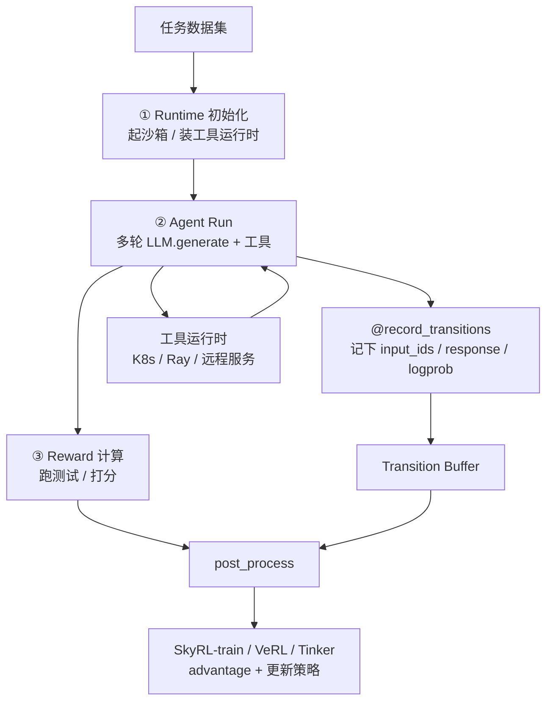

# SkyRL-Agent：多轮长程的慢，不是生成慢，是 naive 异步批次把三段活焊成了一块

<!-- release-date: 2025-11-20 -->

> 本文依据 **SkyRL-Agent: Efficient RL Training for Multi-turn LLM Agent**，即 arXiv:2511.16108v1、2025-11-20 提交、共 16 页的预印本。页眉全程标着 Work in Progress；正文到 §5.3 之后直接进入致谢与参考文献，没有独立的结论或限制章节。共同一作是 Shiyi Cao 与 Dacheng Li，其余作者来自 NovaSky AI、UC Berkeley 与 Anyscale（PDF p. 1）。按主要归属方，本站放在 Berkeley 目录。下文括号里的 `PDF p. N` 均指这份 16 页原件的文件页码。
>
> **截至 2026-09-10 核验，arXiv 上只有 v1，与本地 `papers/Berkeley/SkyRL-Agent.pdf` 一致，未替换原件。**
>
> 这是一篇 **agent 层调度 + SWE 训练配方** 的系统论文，不是 VeRL / verl 本身。它讲的是：多轮长程轨迹怎么拆开调度、工具怎么接进 agent 循环、以及怎样用纯强化学习把 Qwen3-32B 训成 SA-SWE-32B。全文把三件事分开写：**论文明确写了什么**（带页码）、**本文如何解释它**（凡属推算、换算或从图上读数都会写明）、**外部资料补充**（会给出链接并标注）。

## 读之前需要的最少背景

这篇论文假设你已经知道「用强化学习训练会用工具的 Agent」大概在干什么。不熟的话，先记住下面这几个词就够读完全文。

**单轮推理和多轮 Agent 不是同一种活。** 数学题那种强化学习里，模型对着一道题写完一整段，拿一个对错分数。多轮 Agent 要在真实环境里走很多步：看仓库、改文件、跑测试、再根据失败信息继续改。每一步都是「看一段上下文 → 决定一个动作 → 环境给反馈」。论文把它写成一个部分可观测马尔可夫决策过程（POMDP）：第 $t$ 步观察到上下文 $o_t$，按策略 $\pi_\theta(a_t\mid o_t)$ 产出动作 $a_t$，环境给标量奖励 $r_t$，目标是最大化整局回报（PDF p. 3）：

$$
J(\theta)=\mathbb{E}_{\pi_\theta}\Big[\sum_{t=1}^{T} r_t\Big]
$$

其中 $T$ 是这一题的轮数。

还要认识贯穿全文的几个词：

- **Rollout（轨迹生成）**：让当前策略在一个任务上完整跑一局。跑出来的那条「观察—动作—奖励」序列叫 **trajectory（轨迹）**。
- **ReAct**：一种「先想再动手」的 Agent 脚手架——模型交替写推理和下工具调用。本文评测用的是它的简化版。
- **SWE-Bench Verified**：给真实 GitHub 仓库和一份 bug 报告，系统必须交出补丁，用项目单元测试有没有过判定成败。**Pass@1** 是只生成一次补丁就通过的比例。
- **AST（Abstract Syntax Tree，抽象语法树）**：把代码解析成树，按结构而不是按纯文本去搜。
- **Dispatcher（调度器）**：决定一批轨迹里，哪一段活现在该跑。本文的核心系统贡献就在这里。
- **Transition（转移）**：一次模型调用及其反馈记成三元组 $(o_t,a_t,r_t)$，而不是把整局对话焊成一条连续文本。
- **Mask（掩码）**：一条训练序列里哪些 token 算梯度、哪些只当上下文。工具返回的文本通常要被掩掉，只学模型自己生成的那一段。

三个训练后端的名字会出现很多次，先把层级摆正：

- **VeRL / verl**：ByteDance 那套 RLHF 训练框架，论文是 [HybridFlow](/reports/ByteDance/HybridFlow)。它管的是 actor / critic / reference / reward 这些**模型之间**谁指挥谁。
- **SkyRL-train**：同一团队自己的训练后端（论文引用 Griggs et al., 2025）。
- **Tinker**：Thinking Machines Lab 提供的微调与采样 API，把分布式执行藏在接口后面（PDF p. 2）。

**SkyRL-Agent 不替代这三者。** 它是架在上面的 agent 执行层：负责生成多轮轨迹、调度异构阶段、再把数据交给其中任意一个后端去算 advantage、更新策略。

## 一句话先说清

单轮数学 RL 里，一条轨迹几乎就是一次生成。多轮长程 Agent 里，一条轨迹至少有三段完全不同的活（PDF p. 4，Figure 2）：

1. **Runtime 初始化**：起沙箱、装仓库、准备工具运行时，主要吃 CPU；
2. **Agent 循环**：模型生成 + 调工具，生成吃 GPU，工具吃 CPU / 网络；
3. **Reward 计算**：跑测试、打分，又回到 CPU。

现有的 agent 训练框架把这三段焊在同一条 rollout 里，再拿数据并行的 **naive 异步批次**一起开（PDF p. 3–4）。看起来已经异步了，GPU 却会周期性空转：环境还在初始化、测试还在跑，卡只能等。

SkyRL-Agent 的回答是把这三段拆开，用流水线调度器让不同轨迹的 CPU 活和 GPU 活叠在一起。相对 naive 的有界异步批次，生成阶段大约加速 **1.55×**（PDF p. 1、6，Figure 1b）。

另一半贡献不在调度，在配方。他们给软件工程 Agent 加了一个基于 AST 的搜索工具，再用纯强化学习——**没有**从更强教师蒸馏——把 Qwen3-32B 从 **24.4%** 打到 SWE-Bench Verified **39.4% Pass@1**，相对达到相近成绩的 DeepSWE，H100 小时从 9180 降到 4601（PDF p. 10，Table 2）。

所以本文的判断是：

> **多轮长程 Agent 的训练效率，先取决于你有没有把「环境准备、模型生成、结果判定」当成三种不同的设备亲和性来调度；再取决于你有没有在奖励还极度稀疏的时候，给策略一张能搜到代码的地图。**

调度器解决的是 GPU 空等。AST 搜索解决的是「八次采样全找不到 bug」时梯度为零。两件事叠在一起，成本才掉下来。不要把 39.4 这个分数从评测设定里抽出来单独记——脚注和正文都写了，它是在**简化 ReAct、只给文件编辑器和 bash、40k 上下文、最多 100 步、每题只出一次补丁**的口径下测的（PDF p. 1 脚注 1、p. 9–10）。

## 它在哪一层，不要和锅本身搞混

把同期几篇放在同一张桌上，位置就不混了：

| 工作 | 它管的那一层 | 本站 |
|---|---|---|
| HybridFlow / verl | 几个大模型之间谁下命令、数据怎么重分片 | [HybridFlow](/reports/ByteDance/HybridFlow) |
| DAPO | 长思维链 RL 里四个会静悄悄少 20 分的默认设置 | [DAPO](/reports/ByteDance/DAPO) |
| AReaL | 生成侧和训练侧拆开，不等本批最慢那条 | [AReaL](/reports/AntGroup/AReaL) |
| SkyRL-Agent（本篇） | **一条多轮轨迹内部**的 init / 生成 / 判分如何与别的轨迹叠流水 | 本文 |
| [Agent Lightning](/reports/Microsoft/Agent-Lightning) | 执行与训练解耦；本 PDF 是 2025 原论文的数据接口，不是后来的 span 存储 | 本篇 Table 1 把它列为对照 |

AReaL 的异步，是「生成 GPU 和训练 GPU 互不等待」。SkyRL-Agent 的异步，是「同一批还在生成的时候，别让所有卡一起去等环境初始化」。两者都叫异步，卡的是不同的等待。verl 在本篇里是**可插拔后端**，不是被取代的对象（PDF p. 2、4、7）。

论文 Table 1 把当时的 agent 训练框架摆成五行（PDF p. 3）：

| 框架 | 后端 | 执行 | 接口 | 运行时扩展 | 轨迹 |
|---|---|---|---|---|---|
| VeRL-Tool | 绑死 VeRL | 数据并行 | Tool | Ray | Mask |
| rLLM | 绑死 VeRL | 数据并行 | Gym | K8s | Mask / Transition |
| GEM | 多种 | 数据并行 | Gym | — | Transition |
| Agent-Lightning | 多种 | 数据并行 | — | — | Transition |
| SkyRL-Agent | 多种 | 数据并行 + 流水线（可扩展） | Tool | Ray / K8s | Mask / Transition |

论文对对照的批评只有两句，但很具体（PDF p. 4）：

- Agent-Lightning 是训练后端和 LangChain / AutoGen 之间的中间层，**没有**原生的用户自定义工具和新任务接入；
- rLLM 与 VeRL-Tool 可扩展性更强，但绑在 VeRL 上；VeRL-Tool 只用 mask 拼轨迹，难用在多 Agent 或会改写自己上下文的 Memory Agent 上。

后文的 Memory Agent 就是为这句话准备的例子。

## 全景：一条轨迹被拆成三段，调度器在中间倒手

先按 Figure 2 把一次 rollout 画出来（PDF p. 4）。这是机制示意，不是实测时间轴。



调度器要做的事可以分成两层，引言里写得很清楚（PDF p. 2）：

- **轨迹内调度（intra-rollout）**：把一条 rollout 拆成上面三段，各自独立排队，好让这条的 CPU 活和另一条的 GPU 活重叠；
- **轨迹间调度（inter-rollout）**：决定全局的先后和优先级，让 CPU 侧和 GPU 侧在时间上保持平衡，缩短整批的 makespan（全部完成所需时间）。

现有框架通常只做后一层的粗糙版本：整条轨迹当成一个任务，数据并行地往前推。SkyRL-Agent 把前一层也做成一等公民。

系统另外还有三块，和调度器并列（PDF p. 2–3、5）：

1. **以工具为中心的任务接口**：动态注册工具、指令构造器和验证器，加新任务尽量不改主循环；
2. **细粒度异步调度器抽象**：给「一批多阶段 rollout」提供统一的策略接口；
3. **后端桥**：把轨迹转成 SkyRL-train / VeRL / Tinker 要的输入，算 advantage、做策略更新。

下面按「为什么慢 → 调度怎么叠 → 工具怎么写 → 数据怎么交给后端 → SWE 配方怎么把分数打上去」往下走。

## 第一层问题：多轮长程为什么 naive 异步批次仍然慢

### 旧问题：异步了，GPU 还是在等 CPU

把一条 SWE 轨迹想成装修：

- 开工前要清场、进材料，这是 **init**；
- 师傅在现场干，这是 **LLM + 工具**；
- 验收要通电试水，这是 **reward**。

Naive 异步批次相当于：同时派 8 个装修队，但每个队必须「清场 → 干活 → 验收」做完，空出来的名额才给下一队。清场和验收都不用 GPU。于是只要几个队碰巧一起进入清场或验收，GPU 就集体摸鱼。

论文把这种摸鱼画在 Figure 3 中间那一行，并标了 **Low GPU utilization period**（PDF p. 6）：有界异步批次里，上一波的 Reward 刚结束，下一波的 INIT 还没做完，GPU 那一段是空的。

Figure 1b 是同一件事的实测（PDF p. 1）。设定是 batch size 64、每题 8 条 rollout，合计 512 条，机器是 2×8 张 H100，任务就是 SA-SWE-32B 的生成阶段：

- **Async Pipeline（紫线）**：生成阶段 GPU 利用率稳住在大约 90%，大约 3200 秒处收尾（3200 秒是本文读图的近似值，论文正文只给了 1.55× 和「约 90%」）；
- **Async Batch Bounded（蓝线）**：利用率上下乱跳，频繁掉到 50% 附近甚至更低，大约拖到 5000 秒。

论文的结论是：这些掉下去的波谷，就是 runtime 初始化和 reward 计算这类 CPU 活把 GPU 堵住了（PDF p. 6）。1.55× 量的是**这一段生成**，不是端到端训练墙钟，也不是后面 Table 2 里那 50% 成本。后文会把这两个数字拆开。

### 为什么单轮框架看不出这件事

Search-R1 那种「搜一下再写答案」的任务，初始化和判分都很轻，整条轨迹几乎就是 GPU 生成（PDF p. 5）。这时把所有轨迹一起开（无界 Async Batch）就够了。SWE、OSWorld 这类任务不是：起一个带真实仓库的沙箱、跑一遍测试套件，时间可以长过一次模型生成。论文认为，缺的不是又一个训练后端，而是「能按阶段调度的 agentic rollout 编排层」（PDF p. 2）。

**可迁移的部分**：任何「准备很重、计算很重、验收也很重」的流水，都不要默认把三个阶段绑在同一个任务对象上。数据并行解决的是「同样的活复制多份」，解决不了「三种活抢同一种设备亲和性」。

## 核心设计一：三种调度策略，选哪一种取决于哪一段贵

### 新设计：统一接口下的三种派法

调度器为每个阶段维护有界队列，按策略把作业送进去（PDF p. 5）。论文给了三种现成策略，用 `@register_dispatcher` 注册；Listing 2 展示有界批次只需要一个信号量就把并发卡在 `max_parallel_agents`（默认 8）上（PDF p. 6）。

三种策略的差别，用论文 Figure 3 的意思写成表（PDF p. 6；这是机制示意，不是实测）：

| 策略 | 怎么排 | GPU 侧的典型病 | 论文说它适合什么 |
|---|---|---|---|
| Async Batch | 所有轨迹一起开 | 几乎没有，前提是 init / reward 都轻 | 搜索增强推理 |
| Async Batch（Bounded） | 并发上限，做完一条再补一条 | 上一波验收和下波初始化之间出现空档 | 必须限流，或虚拟机可以跨轨迹复用（电脑使用） |
| Async Pipeline | **三条**大小可配的有界队列，让 CPU 阶段和 GPU 推理重叠 | 论文画的是 GPU 被喂饱 | init 或 reward 很贵（SWE） |

Async Pipeline 要防两头：CPU 过载会拖死 agent 循环，运行时服务过载会把环境打崩（PDF p. 6）。所以不是「把并发开到最大」，而是「三段各自有自己的队列深度」。

论文还点了一句可扩展的例子：可以按评估代价做优先级调度，让测试用例特别多的轨迹先跑，避免它们变成长尾 straggler、拉长整批 makespan（PDF p. 6）。**这只是接口能力的举例，论文没有给出这种优先级策略的实测数字。**

### 收益、代价、不要把 1.55× 读成 2×

SWE 训练里，Async Pipeline 相对 naive Async Batch（Bounded）大约 1.55×（PDF p. 1、3、6）。代价是实现复杂度和队列深度变成新超参——论文没有报告这几个队列设成多大，也没有扫过。

电脑使用那个 case study 反方向验证了「不是流水线永远更好」：他们用的是 Async Batch（Bounded），固定 32 个虚拟桌面，因为环境是长寿命的、重置相对便宜（PDF p. 12）。调度策略是任务特性的函数，不是默认值。

**可迁移的部分**：先画自己这条流水的设备亲和性，再决定并发展开在哪一层。准备和验收很重，就该像本篇这样叠流水；准备和验收很轻，硬上流水线只是多管几个队列。

## 核心设计二：工具当一等公民，连「改自己记忆」也是一次调用

### 旧问题：Gym 把 Agent 状态留在 `env.step` 外面

Gym 风格的循环里，环境吃一个动作、吐下一个观察；Agent 自己的状态——要不要摘要、要不要截断历史、要不要换角色——往往在 `env.step` 外面用临时代码管（PDF p. 4–5）。新任务一来，主循环就要改。工具又分三类，运行时需求完全不同（PDF p. 2）：

- **无状态工具**：解释器、计算器；
- **改环境的工具**：文件编辑器、桌面点击；
- **改 Agent 状态的操作**：摘要、截断历史。

第三类最容易被当成「脚手架细节」而不是「可学习的动作」。

### 新设计：OpenAI 风格的函数调用，Gym 的 `step()` 包成一个工具

SkyRL-Agent 里，Agent **只通过** OpenAI 风格的 function call 行动（PDF p. 5）。每个工具自己实现执行逻辑、声明自己的运行时。已有的 Gym 环境把 `step()` 包一层就能接进来。Listing 1 是电脑使用任务的例子：`OSWorldActionTool` 的 `call()` 里直接 `runtime.step(code, TIMEOUT)`（PDF p. 5）。

论文说这带来三件实事（PDF p. 5）：

1. **Agent 状态和环境状态统一管理。** 摘要、截断这类操作和改文件走同一套工具抽象，于是它们也变得模块化、可学习。
2. **多任务可以混在一次训练作业里。** 不同数据集绑不同工具集和验证器，不用改主循环。
3. **加新任务的改动很小。** 提供一组工具 + 任务专用的指令构造器 + 验证器即可。

### 错误分两类，不要把「写超了」和「参数写错了」收成同一种失败

真实环境里的失败很多：生成异常、工具调用畸形、超时、资源耗尽（PDF p. 7–8）。工具层已经能局部化很多环境错误；agent 循环另外分两类：

- **终止条件**：上下文窗口超了、到了最大步数 → 立刻停掉这一局；
- **可恢复条件**：解析失败、参数不对 → **把纠正信息写回对话历史**，让下一步自己改。

这和 [DAPO](/reports/ByteDance/DAPO) 里「写超了不等于想错了」是同一类意识：失败的原因不同，就不该写成同一个信号。本篇没有给「注入纠正信息」前后的成功率对比，只定性说这样能提高整体成功率（PDF p. 8）。

**可迁移的部分**：设计 Agent 运行时，先列出「哪些动作改世界、哪些动作改自己的记忆」，再决定它们是不是同一种接口。记忆操作如果只能写在循环外面，后面的 Memory Agent 那种「摘要完把上下文重置」就接不进 RL。

## 核心设计三：用 transition 记账，后端可以换成另一个锅

### 旧问题：一条连续文本的假设，多轮里经常是假的

短的工具增强推理里，常见做法是把整段对话拼成一条序列，工具返回的 token 打 mask，只对模型自己生成的部分算策略梯度（PDF p. 3）。多轮长程里，Agent 会在步与步之间做摘要、截断、选择性写入检索结果，**交互历史本身是非平稳的**（PDF p. 4）。这时「整局是一条连续文本」不成立，mask 拼序列很难用到会改写自己上下文的 Agent 上。

### 新设计：每次模型调用记成一条 transition

论文采用更一般的转移表示（PDF p. 4、7）：一次 LLM 调用及其反馈是 $(o_t,a_t,r_t)$，里面记下输入 token、输出 token，以及推理端如果给了的对数概率。记录靠一个装饰器，不改 Agent 逻辑（PDF p. 7）：

```python
@record_transition
async def _generate(self, input_ids, sampling_params):
    return await self.backend.generate(input_ids, sampling_params)
```

论文说这三件事因此变得容易（PDF p. 7）：

1. **减轻训推不一致。** 显式记下采样时的 logprob，才能用 Flash-RL 这类方法去校正推理引擎和训练引擎的错位。
2. **token 级保真。** 走 token-in / token-out，避免「先解码成文本再重新编码」造成的 off-policy 漂移。论文这里引用的是 Agent Lightning 团队的博客（Team, 2025a）。
3. **算法更灵活。** 可以动态摘要历史（§5.2 的 Next 工具）、插入结构化提示、甚至跨轮改 Agent 角色——这些都不是「把旧文本在后面接着拼」能表达的。

效率上，共享前缀的 transition 仍会动态打包成一条带 mask 的训练样本。于是：**执行过程中没改过上下文的轨迹，会自然退回传统的拼接 + 掩码**（PDF p. 7）。transition 是超集，不是强制每一步都拆开算。

`post_process` 输出一份后端无关的中间格式（PDF p. 7，Listing 3）：`prompt_token_ids`、`response_ids`、`logprobs`、`loss_masks`、`traj_rewards`、`traj_idx`、`rollout_metrics`。换成另一个后端只改配置，不改 Agent 或任务代码。

论文把这件事的好处写成两句（PDF p. 7）：研究者可以在**同一份任务**上比不同算法，少掉实现差异这个混淆项；同时仍能用上各后端自己的强项——新模型支持、新算法、GPU / TPU / AMD、以及超大模型的 API 执行。

SA-SWE-32B 主实验**没有写明**用的是三个后端里的哪一个。三个 case study 倒是写了：Deep Research 用 SkyRL-train，Memory Agent 用 Tinker，Computer Use 用 VeRL（PDF p. 11–12）。互操作是被三个小实验分别验证的，不是被 SWE 主实验三后端各跑一遍验证的。

**可迁移的部分**：执行层记账的粒度，决定你后面还能换哪种算法。只存拼接后的文本，就只能做 mask 式 GRPO；存下每次调用的 token 和 logprob，才能做摘要式上下文、才能校正训推不一致。 Polar 后来把观测点再往外挪到模型 API 上，那是另一篇的事；本篇还是要求你把 Agent 写在它的工具循环里。

## SWE Agent：为什么要训完整的交互循环，而不是把修 bug 拆成单轮流水

§4 是这篇论文真正的配方章节。先把问题的形状讲清，再讲工具和超参。

SWE-Bench 的设定是：真实仓库 + bug 报告 → 产出补丁 → 单元测试过不过（PDF p. 8）。当时的解法分成两家（PDF p. 8）：

- **Agent 系**（OpenHands、SWE-agent）：模型待在可执行环境里，用 shell、搜索、文件查看 / 编辑，迭代地看、改、构建、测。像真实开发。
- **Workflow 系**（Agentless）：规定死流水线，例如定位 → 修补 → 测试，把长程交互拆成一串可验证的单轮子任务。编排和评测更简单，代价是交互性和可泛化性。

SkyRL-Agent 站在第一家。论文的假说是：在 SWE 里练出来的「有状态地用工具」会迁到别的同样需要有状态工具交互的领域，所以他们把完整交互循环端到端地拿去 RL，而不是先拆成单轮（PDF p. 8）。后文 Terminal-Bench / BrowseComp-Plus / WebArena 就是为这个假说准备的。

## 配方一：AST 搜索工具，先把「找不到文件」从零梯度里捞出来

### 旧问题：Agent 不会在仓库里找路，奖励又极度稀疏

论文观察到，软件工程 Agent 常卡在 **error localization（错误定位）**（PDF p. 8）。具体病症是：

- 过度依赖直接 `view` 文件，不爱用 `grep` / `find`；
- 即使用搜索，也不会把查询收成有信息量的模式或关键词，于是反复找不到；
- 退回按块翻文件，或一次拉回大量无关内容，把上下文窗口耗光。

长程任务的奖励又是稀疏且延迟的：往往整局修完、测试过了才给分。起点如果经常是「八次采样全找不到相关代码」，组内就没有谁比谁好，强化学习开不了机。

一个定量的反例：Mini-SWE-Agent 那种只给 bash 的最小工具集，在 R2E-Gym 数据上未解决率可以高到 **50/64**（PDF p. 8）。64 大概对得上他们后面的训练 batch size；50 条完全没修出来，意味着这一批里绝大部分轨迹的奖励信号是同一侧的。

### 新设计：能做模糊匹配和结构模式的 AST 搜索，并且在结果末尾给下一步提示

他们实现了一个基于 AST 的搜索工具，支持模糊匹配和结构模式搜索，灵感来自 LocAgent（PDF p. 8）。为了把策略推向「去搜」而不是「去翻」，每条搜索结果末尾再追加上下文提示，例如下一步该搜哪些具体词或模式（PDF p. 8–9）。

训练过程里，平均每次轨迹的搜索次数从 3 次升到 4 次，平均轮数从 18 升到 25（PDF p. 11；Figure 1a 左下、右下）。论文把这读成：Agent 逐渐学会靠搜索做代码定位，也学会多走几步而不是早停。

更关键的是评测时的处理：**为了看泛化，他们把搜索工具拿掉了**（PDF p. 9）。模型在没有专用搜索工具时，仍然表现出「内部自己实现的搜索行为」，并且论文说成绩**相当**（comparable）。**「相当」没有给出去掉搜索工具之后的 Pass@1 数字。** 摘要里那句 boost rollout Pass@K，全文也没有一张 Pass@K 表。能落地的硬数字，是训练曲线上搜索次数在涨，以及 bash-only 基线 50/64 修不出来。

### 收益和边界

论文把工具增强和 125 步就追上同规模模型写在一起（PDF p. 9，Figure 1a）。没有工具消融表，所以不能把 24.4 → 39.4 里的多少分归给 AST 搜索、多少分归给调度器、多少分归给后面的 hint。因果链在机制上是清楚的——先提高 rollout 的 Pass@K，再让 RL 有非零梯度——在归因上是捆在一起的。

**可迁移的部分**：奖励稀疏的长程 RL，不要一上来就问损失函数。先问「未解决率是不是高到整组没有对比」。工具、提示、课程，都是在给 Pass@K 抬底；底太低时，换哪一种 advantage 估计都救不了零梯度。这和 [DAPO](/reports/ByteDance/DAPO) 的动态采样是同一类病、不同的药：DAPO 过滤全对全错的题，本篇是先让「全错」变得没那么全。

## 配方二：全 on-policy、留一法 advantage、超长只挡梯度不改奖励

### 超参（PDF p. 9）

| 项目 | 取值 |
|---|---|
| 基座 | Qwen3-32B（改了 chat template，保留上一轮的 thinking） |
| 数据 | R2E-Gym 4.5K 条，纯 RL，无 SFT、无更强教师蒸馏 |
| 训练 batch = mini-batch | 都是 64，论文称为 fully on-policy |
| 每题 rollout | 8 |
| 上下文 / 步数（训练） | 32K token、50 轮；碰到这两个上限的轨迹**从梯度里 mask 掉** |
| Advantage | 留一法（leave-one-out）；去掉标准差归一化，也去掉长度归一化 |
| KL / 熵损失 | 都关 |
| 学习率 | $1\times 10^{-6}$ |
| 评测用的 checkpoint | 第 125 步（Figure 1a 画到约 160 步） |

「fully on-policy」在这里的操作定义很窄：训练 batch 等于 mini-batch，不做「一个 rollout 批次切成多次梯度更新」。DAPO 正好相反：每轮 512 题、每个 rollout step 做 16 次更新（见 [DAPO](/reports/ByteDance/DAPO)）。两边都叫 on-policy，一步里参数动几次不是一回事。

留一法 advantage、去掉标准差和长度归一化，论文只说 following DeepSWE 与 Dr. GRPO 那两篇（Luo et al., 2025a；Liu et al., 2025b），**没有在本篇重写公式，也没有单独消融**。KL 和熵损失关掉同样没有解释。不要把 DAPO 删 KL 的理由（长思维链本来就该远离初始分布）写进这篇的账本。

超长处理值得单独对照 DAPO。本篇的做法是（PDF p. 9）：

- 奖励和 advantage **照常算**，不因为写超了就改分数；
- 只是这些样本不进入梯度。

目的是避免模型被训练成「讨厌动作多、推理长的轨迹」。DAPO 担心的是「写超了被记负分，模型搞不清是解法错了还是写长了」。本篇连奖励都不改，只挡梯度。两者都在拆开「质量」和「撞到资源上限」，拆法不同。本篇同样没有报告被 mask 掉的轨迹占比。

把几个数字乘一下（以下是本文的推算，论文没写）：125 步 × 64 题 = 8000 次抽题，题库 4.5K，大约 1.8 个 epoch；再乘 8 条 rollout，大约 6.4 万条轨迹。相对 DeepSWE 那 9180 个 H100 小时，这是一条短而密的 run。

### Hint：训练时把 Agent 从死循环里拽回来

多轮 Agent RL 的另一个常见病是卡死（PDF p. 9）：不调用工具、函数调用写错、反复做同一类没进展的动作、忘了任务还剩多少步、没到上限就提前收工。SWE-Gym 和 Kimi-Dev 都报告过从通用预训练模型出发会得到这类脆行为。

他们在**训练时**注入结构化 hint，例如（PDF p. 9）：

- 工具执行失败时，建议下一步可以试什么；
- 步数预算或上下文窗口快到了，发通知；
- 函数调用不合法或不完整，给纠正；
- 编辑失败了，提示重新检查。

论文说这些 hint 显著提高轨迹质量、稳住 rollout、增加用于策略更新的成功轨迹比例。**没有消融数字，也没有说评测时还开不开。** 评测用的是简化 ReAct、只给 bash 和文件编辑器（PDF p. 9），按这个描述，评测侧大概率没有这套训练 hint。若如此，hint 是训练期的课程，不是评测脚手架；但论文没有把这句话写死。

**可迁移的部分**：多轮 RL 的「提前收工」和「死循环」不会报错，只会让成功轨迹变少。用结构化 hint 把策略拽回有效轨迹，本质上是在提高有效样本率。它和工具增强是一类活：都在奖励函数之外，给探索铺路。

## 实验：39.4 这个数，必须连同脚手架一起读

### 评测口径，先读脚注再读表

摘要里的 39.4% 带脚注 1（PDF p. 1），§4.3 又写了一遍（PDF p. 9–10）。把口径摊开：

| 项目 | 训练 | 评测（SWE-Bench Verified） |
|---|---|---|
| 脚手架 | 带 AST 搜索 + 训练 hint 的工具增强循环 | **简化 ReAct**，只给 **bash** 和 **文件编辑器** |
| 搜索工具 | 使用，且结果末尾带下一步提示 | **拿掉**，看会不会自己找 |
| 上下文 | 32K | **40K**（Qwen3-32B 默认） |
| 最大步数 | 50 轮 | **100** |
| 每题尝试 | 8 条 rollout | **只出一次补丁**（Pass@1） |

文件编辑器来自 OpenHands ACI（PDF p. 9，脚注 2）。Table 2 的表注写得更硬：Simple ReAct 是最小 ReAct 循环，只暴露 bash 和文件编辑，并且**每题只生成一个补丁**；不同工作的脚手架和评测设定不同，数字未必严格可比；「Reported」列引自各论文 / 博客原文（PDF p. 10）。

**不要拿 39.4 去和别人在自家脚手架上报的 42、45、48 直接比。** 论文自己已经用 × 和「只把 reported 放进表里当参考」处理了这件事。

### 主结果（PDF p. 10，Table 2）

| 模型 | 规模 | 配方 | Simple ReAct | Reported | H100 小时 |
|---|---:|---|---:|---:|---:|
| Qwen3-32B | 32B | — | 24.4 | — | — |
| Qwen3-Coder-30B | 30B | — | 45.0 | — | — |
| SWE-agent-LM-32B | 32B | Claude Sonnet 3.7 蒸馏 | 38 | 40.2 | — |
| SWE-Swiss | 32B | R1 蒸馏 + RL | × | 45.0 | — |
| Kimi-dev | 72B | R1 蒸馏 + RL | × | 48.6 | — |
| DeepSWE | 32B | 纯 RL | 36.4 | 42.2 | 9180 |
| **SA-SWE-32B** | 32B | 纯 RL | **39.4** | — | **4601** |

读这张表要按论文的分层，而不是按「谁分最高」：

**第一层，同一套 Simple ReAct。** 基座 Qwen3-32B 是 24.4，SA-SWE-32B 是 39.4，+15.0 分。同规模、同样只给 bash 和编辑器的对照里：SWE-agent-LM-32B 是 38（它还蒸馏了 Claude），DeepSWE 是 36.4。SA-SWE-32B 是这一列 32B 里最高的。

**第二层，不要漏掉 Qwen3-Coder-30B。** 它在同一套 Simple ReAct 上是 **45.0**，比 SA-SWE-32B 高 5.6 分。论文把它放在 Reference，不当作「开源 SWE 配方」去比。所以「同规模开源配方里的 SOTA」（PDF p. 9）这句话，不含这个 30B 的 coder 模型。本文的判断是：纯 RL 把一个通用 32B 在最小工具集上抬了 15 分，仍然没有追上专门的 coder 基座在同一最小工具集上的 45 分。

**第三层，Reported 列不能用来给 SA-SWE 加分。** DeepSWE 自己的脚手架是 42.2，Simple ReAct 掉到 36.4，光脚手架就差 5.8 分。SWE-Swiss、Kimi-dev 在 Agentless 下训练，论文说它们在 ReAct 里几乎不会跟工具调用指令走，所以 **只引用原文分数、自己没在 Simple ReAct 下测**（PDF p. 10）。Kimi-dev 还是 72B。SA-SWE-32B 的 Reported 是空白，因为它只在 Simple ReAct 下公布了分数。

**第四层，成本。** 摘要写 more than 2× cost reduction（PDF p. 1），§4.3 写 50% lower training cost（PDF p. 10），表上是 4601 vs DeepSWE 的 9180。$9180/4601\approx 1.995$，就是一半。DeepSWE 用同一份 4.5K R2E-Gym、同样纯 RL、默认 R2E-Gym 脚手架（PDF p. 9）；SWE-agent-LM-32B 则是在 Qwen2.5-Coder-32B-Instruct 上，用 Claude Sonnet 3.7 生成的 5016 条 SWE-smith 轨迹做微调（PDF p. 9）。成本对比的分母是 DeepSWE，不是蒸馏那条线——蒸馏那条根本没报 H100 小时。

1.55× 的调度加速和 50% 的总成本下降不要合成一个故事。前者是生成阶段相对有界异步批次；后者是整次训练相对 DeepSWE，里面至少叠了调度器、AST 工具、hint、以及「125 步就停」的早停。论文把非解决率曲线画得比 DeepSWE 更低、掉得更快（PDF p. 10，Figure 1a），并注明 DeepSWE 的曲线取自他们的 wandb 日志，不是作者复跑。

### 跨任务泛化：有迁移，但步子不大

只在 SWE 上训练，拿到另外三个 agent 基准上评（PDF p. 9–11，Table 3）：

| 模型 | Terminal-Bench | BrowseComp-Plus Acc. | BrowseComp-Plus 平均轮数 | WebArena |
|---|---:|---:|---:|---:|
| Qwen3-32B | 13.75 | 18.1 | 3.68 | 15.8 |
| SA-SWE-32B | 16.25 | 19.4 | 4.6 | 17.0 |

三个基准各自测什么，论文写清楚了（PDF p. 10）：

- **Terminal-Bench 0.1.1**：80 题，命令行里做系统级任务（软件工程、系统管理、安全）。评测用的是 OpenHands agent（脚注 3），不是 SWE 那套简化 ReAct。
- **WebArena**：812 题，真实感网站上的多步浏览器操作（电商、论坛、协作软件、内容管理）。
- **BrowseComp-Plus**：830 题，在一份人工核实过的、带困难负例的固定语料上做多步搜索与推理。检索器用 Qwen3-Embedding-8B，搜索工具返回 top-5。

相对基座，分别 +2.5、+1.3、+1.2。绝对提升不大，但方向一致。论文特别点 BrowseComp-Plus：这个任务需要跨文档的大量搜索，而模型只在 SWE 上训练过，却比基座调用了更多搜索（PDF p. 11）。结合训练时搜索次数 3→4、轮数 18→25，他们的阅读是：模型学到的是「更依赖外部搜索、更愿意多走几步」，不是只背下了修 Python 仓库的套路。

**边界要说清：** 三个 OOD 基准都只对比了基座，没有对比 DeepSWE 或 Qwen3-Coder；Terminal-Bench 还换了 OpenHands 脚手架，和 SWE 主表不是同一套循环。泛化存在，强度是「几个点」，不是「换领域仍是 SOTA」。

## 另外三个 Agent：互操作是被分开验证的，规模也明显更小

§5 的目的是证明框架能接不同任务、不同后端，不是再刷一个 32B 主结果。三个实验都是 Qwen3-8B 量级。

### Deep Research × SkyRL-train（PDF p. 11–12）

任务：答案不在参数里，要靠搜索和读网页。工具是 SerperAPI 搜索 + Jina Reader 取网页，外加缓存和两段式摘要（长页切块 → 各摘要 → 合并并保留引用）。

数据：从 MegaScience 抽 50K 题，用 Qwen3-8B thinking 模式每题滚 4 次，按成功次数分成 Impossible / Hard / Medium / Easy / Perfect。再按 Polaris 的镜像难度配比做成 25% Impossible、30% Hard、30% Medium、15% Easy，并在计算机、生物、物理、经济之间平衡。训练用 GRPO + General-Reasoner 的通用验证器，全局 batch 64、8 条 rollout、mini-batch 64、学习率 $5\times 10^{-6}$，摘要模型是非 reasoning 模式的 Qwen3-235B。

评测在 HLE-500 上用 LLM-as-a-Judge。因为通用验证器偏松，他们另外用 gpt-oss-20b 当主裁判：

- 通用验证器：12.6% → 18.8%；
- gpt-oss-20b：9.2% → 10.2% / 11.0%。

松裁判涨 6.2 分，严裁判只涨约 1–2 分。论文没有解释斜杠两侧 10.2 和 11.0 分别对应哪一次评测。

他们记下的两条工程教训，比这几个点更有用（PDF p. 11–12）：

1. **重工具一旦供给不足，会直接污染奖励。** 网页抓取大约每请求 10k token，再配 Qwen3-32B 当摘要器，单张 H200 上每迭代 2101.6 秒；换成 Qwen API 降到 592.1 秒，约 3.5×。最终阶段用四张 GH200 加数据并行路由器。供给不够会超时，迭代 30 附近出现一次奖励凹陷，要 30–33 步才恢复。对策是给工具足够容量，并且把异常轨迹 mask 掉，保护奖励信号。
2. **在线搜索会泄露基准答案。** 在 GPQA-Diamond 上，模型有时直接从 Hugging Face 等公开页把题解检索回来。他们因此屏蔽 Hugging Face、GitHub、GitLab、Chegg 这类域名。

Figure 5 的奖励从大约 0.5 爬到 0.65，验证分数从很低爬到大约 0.2（读图近似值）。曲线能涨，但严裁判下的绝对水平仍然低。

### Memory Agent × Tinker（PDF p. 12）

这是给「为什么要 transition 而不是 mask」准备的例子。MemAgent 的做法是递归地读长文、把内容摘要进固定大小的记忆。本篇把它实现成一个 **Next 工具**：对当前块做摘要，然后**把上下文重置成「只含摘要」**，再喂下一块（PDF p. 12，Figure 6a）。

数据是 RULER-HotpotQA：一段金标支持段落加上若干干扰段。训练看到最多 28k token（每块最多 4k），评测到 112k。验证器用 GPT-5-nano。模型是非 thinking 的 Qwen3-8B，Tinker 后端，LoRA rank 128，batch 32，8 条 rollout，每轮最多 8K token。

对照是原 MemAgent 论文：Qwen2.5-7B-Instruct、batch 128、group 16、精确匹配验证器，准确率 79.69%。**本篇没有报告自己这次 run 的最终准确率**，只给了 Figure 6b 的奖励 / 验证曲线，两者都在涨。它证明的是「这种会改写上下文的脚手架接得进框架」，不是「我们超过了 MemAgent」。

### Computer Use × VeRL（PDF p. 12–13）

OSWorld 虚拟桌面，动作是模型写 PyAutoGUI 代码，反馈是无障碍树。环境被包成 Listing 1 那个工具。数据少，所以照 ARPO 的办法从基准里滤了 32 道 Hard / Medium / Easy。调度器用 Async Batch（Bounded），固定 32 个虚拟桌面，虚拟机作为 Ray 远程任务拉起，把 CPU 上的环境反馈和 GPU 上的生成拆开。训练 batch 8、每题 8 条 rollout，奖励由环境自带的评价函数给。

**这是全文最诚实的负结果：** 训练奖励在涨，验证准确率几乎不涨（PDF p. 13，Figure 7 只画了奖励）。论文的判断是：这些任务对 Qwen3-8B 本身就很难，学到的策略出不了训练环境。ARPO 也报告过类似趋势。

三个 case study 合在一起，互操作被验证的方式是「每个后端接一种任务」，不是「同一任务换三个后端、分数仍可比」。Computer Use 还说明：框架能跑 ≠ 小模型在 GUI 任务上能泛化。

## 纯 RL、无 SFT：它成立的前提，比那句口号窄

论文反复强调 SA-SWE-32B 是纯 RL、不靠更强教师蒸馏（PDF p. 1、9）。对照表也确实把它和「3.7 Sonnet Distill」「R1 Distill + RL」分开了。但「纯 RL」在这篇里有几条不能省的边界，论文有的写了、有的要靠前后文拼：

1. **起点不是 base。** 他们改的是 Qwen3 的 chat template，还要保留上一轮 thinking（PDF p. 9）。这是已经会对话、会思考的 instruct 模型，不是 R1-Zero 那种从基座冷启动。
2. **工具和 hint 是学习信号的一部分。** 没有 AST 搜索时，bash-only 的未解决率可以到 50/64，端到端 RL「extremely challenging」（PDF p. 8–9）。纯 RL 省掉的是 SFT 轨迹和教师模型，没有省掉「把探索空间修到 RL 能吃」这件事。
3. **评测脚手架比训练更穷。** 训练用搜索工具，评测拿掉；训练 50 步 / 32K，评测 100 步 / 40K。39.4 不是「训练时那套工具循环」的分数。
4. **同最小工具集下，通用 32B + RL 仍低于 30B coder 基座的 45.0。** 纯 RL 抬了 15 分，没有改写「起点模型族」这件事。
5. **换到 GUI，8B 上奖励涨、验证不涨。** 纯 RL 不是对所有 agent 任务都够用。

和 [DAPO](/reports/ByteDance/DAPO) 对照：DAPO 证明的是「同样的数学 RL，四个默认设置值 20 分」；本篇证明的是「同样的纯 RL 路线，调度和工具配方能把成本砍半、把最小 ReAct 下的 Pass@1 从 24.4 拉到 39.4」。两边都没有声称换领域仍自动成立。DAPO 自己也没在数学之外做实验；本篇做了 OOD，但幅度是 1–3 分。

## 关键词回看

- **Naive 异步批次 / Async Batch（Bounded）**：轨迹级数据并行，并发可设上限。看起来异步，但 init 和 reward 仍跟生成焊在同一条任务里，GPU 会周期性空等。
- **Async Pipeline**：三条有界队列分别接初始化、Agent 循环、奖励计算，让不同轨迹的 CPU 活和 GPU 活重叠。SWE 生成阶段约 1.55×、GPU 利用率约 90%。
- **轨迹内调度 / 轨迹间调度**：前者拆阶段，后者排全局顺序。本篇把前者做成一等公民。
- **Tool-centric agent loop**：Agent 只通过 OpenAI 风格函数调用行动；改环境、改自己的记忆、无状态工具走同一接口。
- **Transition $(o_t,a_t,r_t)$**：按每次模型调用记账，允许中途摘要、截断、换角色；没改过上下文时可以再打包回 mask 拼接。
- **Mask 式轨迹**：假设整局是一条连续文本，非模型 token 不进梯度。短工具链够用，Memory Agent 那种重置上下文不够用。
- **AST 搜索工具**：按代码结构搜，并在结果末尾提示下一步查询。用来抬 rollout 的 Pass@K，让稀疏奖励的 RL 有非零对比。
- **Simple ReAct 评测**：只给 bash 和文件编辑器、40k 上下文、最多 100 步、每题一次补丁。39.4% 只在这套口径下成立。
- **Fully on-policy（本篇含义）**：训练 batch 等于 mini-batch，都是 64；碰到 32K / 50 轮的轨迹只从梯度里拿掉，不改奖励。
- **Leave-one-out advantage**：组内留一法估优势，并且去掉标准差和长度归一化；本篇没有重写公式。
- **SA-SWE-32B**：Qwen3-32B 经纯 RL 得到的 SWE Agent。Simple ReAct 下 24.4 → 39.4；成本 4601 H100 小时，相对 DeepSWE 的 9180 约一半。
- **SkyRL-train / VeRL / Tinker**：三个可插拔训练后端。本篇是 agent 执行层，不是其中任何一个的替代。

## 最后的判断

这篇 Work in Progress 没有结论节，但贡献的形状已经清楚。它真正卖掉的不是又一个 32B 分数，而是两层经常被焊在一起的决策：

**第一层是系统。** 多轮长程的浪费，很多并不发生在矩阵乘法里，而发生在「这一条轨迹的环境还没就绪、那一条的测试还在跑、GPU 只能空转」。把 rollout 当成一个不可拆的 job，是默认设置，不是物理定律。1.55× 来自把默认拆开。

**第二层是配方。** 纯 RL 在 SWE 上能走通，前提是 Pass@K 先被工具抬起来。AST 搜索、结果末尾的下一步提示、失败时的 hint，都是在奖励还极度稀疏的时候给策略铺路。没有这些，bash-only 的 50/64 未解决率会让组内对比消失。39.4 是这条路在**最小 ReAct**下的成绩，不是在训练脚手架下的成绩。

它也把互操作讲成了一种可检查的主张：同一套 Agent 循环，Deep Research 走 SkyRL-train，Memory 走 Tinker，电脑使用走 VeRL。换后端只改配置。这和 HybridFlow 解决的「四个模型之间谁指挥谁」不在一层；和即将写的 Agent Lightning「执行与训练彻底解耦」也不在一层。SkyRL-Agent 仍要求你把 Agent 写进它的工具循环，它换的是下面那口锅。

边界同样清楚，而且有几条是论文没单开一节、但表里已经写出来的：

- 没有结论、没有限制节、没有工具 / hint / 调度器的因子消融；
- Pass@K 被摘要当作卖点，正文没有表；
- 去掉搜索工具后的评测分数只说 comparable；
- SA-SWE 主实验没写用的哪个训练后端；
- 同口径下 Qwen3-Coder-30B 仍是 45.0；
- OOD 提升是 1–3 分；
- 8B 的 GUI Agent 训练奖励涨、验证不涨；
- 后来在 SkyRL 上出现的知识工作 Agent recipe 是后作，数字不在本篇原件里。

如果只记一句话，可以记：

> **多轮 Agent 的 RL，先把 init、生成、判分拆开叠流水，再把「找不到路」从零梯度里捞出来。分数要连同简化 ReAct、40k、100 步一起记，否则 39.4 会带着你跑。**

## 资料与阅读边界

- **原始依据**：本地 `papers/Berkeley/SkyRL-Agent.pdf`，即 **SkyRL-Agent: Efficient RL Training for Multi-turn LLM Agent**，arXiv:2511.16108v1，2025-11-20 提交，16 页，页眉为 Work in Progress。本文所有页码指这份 PDF 的文件页码。
- **版本核验**：[arXiv:2511.16108](https://arxiv.org/abs/2511.16108)。提交历史只有 v1（2025-11-20 07:05:19 UTC）。截至 2026-09-10 核验仍是 v1，与本地原件一致，无需替换。
- **`release-date` 取 2025-11-20**。这篇同时讲框架和 SA-SWE-32B；按流程，对象若对外可用应取最早官方公开日。已核查的公开事件里，arXiv v1 在 2025-11-20；官方仓库 README 的 News 把 SkyRL-Agent 发布写在 2025/11/26，晚于 arXiv。按「最早官方公开」取 arXiv 当日。Hugging Face 上的 [NovaSky-AI/SA-SWE-32B](https://huggingface.co/NovaSky-AI/SA-SWE-32B) 在核验时仍是自动生成的空 model card，不能提供独立的权重解禁时间，不用来回写日期。
- **官方代码**：[NovaSky-AI/SkyRL](https://github.com/NovaSky-AI/SkyRL)（agent 层在 `skyrl-agent/`）。**本文没有阅读该仓库源码，也没有把仓库里后来的实现细节当作论文结论。** 仓库现状归本站「开源解读」模块，与本篇时间轴不同。
- **官方模型**：[NovaSky-AI/SA-SWE-32B](https://huggingface.co/NovaSky-AI/SA-SWE-32B)。
- **跨篇对照**（均已在正文标明，不与本篇结果混用）：
  - [HybridFlow](/reports/ByteDance/HybridFlow)：verl 的编程模型。本篇把它当可插拔后端，不重讲控制权分层。
  - [DAPO](/reports/ByteDance/DAPO)：长思维链 RL 的四个默认设置。本篇同样关 KL、同样处理超长，但 advantage 和 batch 定义不同，不要把 DAPO 的理由写进本篇。
  - [AReaL](/reports/AntGroup/AReaL)：生成 / 训练解耦的异步。和本篇「轨迹内三段叠流水」不是同一层等待。
  - [Agent Lightning](/reports/Microsoft/Agent-Lightning)：本篇 Table 1 的对照之一，讲执行与训练解耦。
  - [APEX-Agents-SkyRL-Recipe](/reports/Mercor/APEX-Agents-SkyRL-Recipe)：后作，Mercor 与 SkyRL 团队在 SkyRL 上写的知识工作 Agent 训练 recipe，原件是 2026-09 的官方博客。它的设定与数字**不属于** 2025-11 这份 PDF，本文不写入、不拿来给 SA-SWE-32B 加分。
- **本文标为「读图近似值」或「本文推算」的地方**：Figure 1b 约 3200 秒 vs 约 5000 秒；Figure 1a / Figure 5 / Figure 6 / Figure 7 的曲线读数；125 步 × 64 题 ≈ 1.8 epoch、约 6.4 万条轨迹；9180/4601≈1.995。这些不是论文正文给出的数字。
- **未公开 / 无法核实的缺口**：
  - 无结论节、无限制节、无因子消融（调度器、AST 搜索、hint 各自值多少分）；
  - 摘要中的 Pass@K 提升没有表；
  - 评测时去掉搜索工具后的 Pass@1 只说 comparable；
  - 训练 hint 在评测时是否关闭，没有写死；
  - Async Pipeline 三条队列的深度没有给；
  - SA-SWE-32B 主实验使用的训练后端没有点名；
  - Memory Agent 自己的最终准确率没有报；
  - Deep Research 里 10.2% / 11.0% 的斜杠含义没有解释；
  - 1.55× 只在生成阶段、16 张 H100、512 条 rollout 这一组配置下给出，没有扫模型和集群规模。
