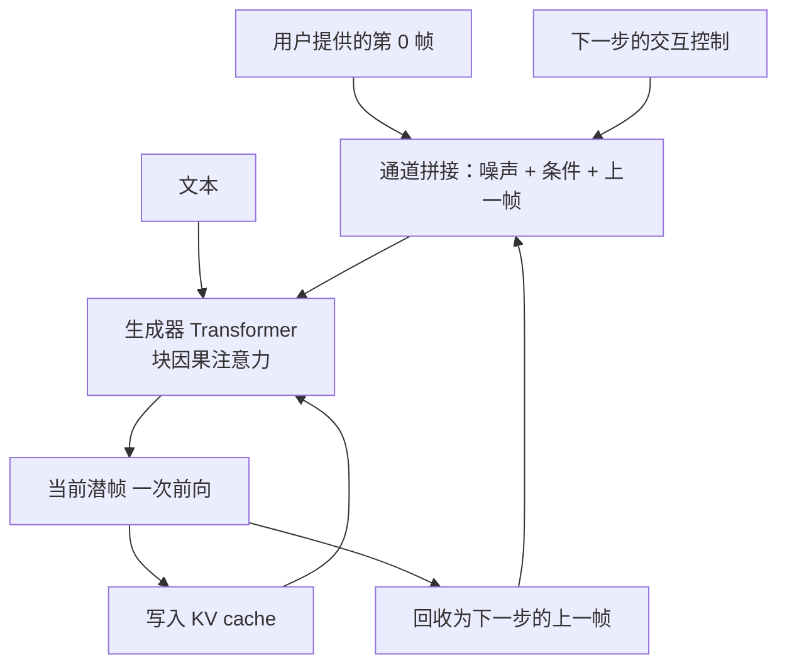
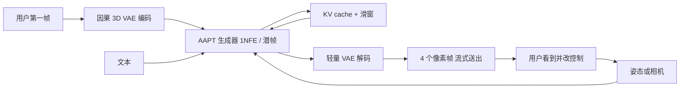

# AAPT：把预训练视频扩散变成 1NFE 实时交互自回归

<!-- release-date: 2025-06-11 -->

> 本文依据 ByteDance Seed 的 **Autoregressive Adversarial Post-Training for Real-Time Interactive Video Generation**，即 arXiv:2506.09350v2（2025-10-01 修订，NeurIPS 2025，20 页）。封面水印是 `arXiv:2506.09350v2 [cs.CV] 1 Oct 2025`。动笔前核过 arXiv 提交历史：v1 于 2025-06-11 提交，v2 于 2025-10-01；本地件就是官方最新版，未做替换，md5 `95100bf10f6ac174c48fde7861a2d761`。这是一篇方法加实时视频系统的技术论文，没有对外可用的 Web / App / API / 权重，`release-date` 取该技术首次官方公开日，即 arXiv v1 提交日 2025-06-11。证据见文末。
>
> 全文页码指 PDF 自身页码，本报告 PDF 页码与印刷页码一致。文中始终区分三件事：**报告写了什么**、**我们如何解释**、**哪些是外部补充**。凡是本文自己从图里读出来的，或报告各处对不上的数字，都会明说。

## 读之前：实时交互要的不是「把视频生成得更快一点」

如果你没做过视频生成，后面每一节都会碰到同一组词。先用报告真正用到的概念把场景搭起来。这一节只解释后文要用的东西，不提前堆方法名。

**扩散模型（diffusion model）**：不是一次画完，而是从纯噪声出发，反复「去噪」。每一次去噪都要完整跑一遍网络，叫一次 NFE（Number of Function Evaluations，网络前向次数）。1NFE 就是只跑一次：噪声进、结果出。主流视频扩散往往要几十次。报告里的对照模型，有的还停在 4 步、8 步、60 步（PDF p. 9）。

**双向注意力**：生成第 1 秒时，模型已经在看第 5 秒。整段视频被当成一份要反复修改的完整草稿。这很适合「交作业」——前后可以互相改。它不适合「边玩边看」：用户转一下镜头，模型不能立刻吐下一帧，必须等整段一起去噪完。

**潜空间（latent space）与 VAE**：直接在像素上扩散太贵。先用变分自编码器（Variational Auto-Encoder，VAE）把视频压小，扩散在压缩后的张量上进行，最后再解码回像素。压缩后的一拍叫潜帧（latent frame）。本报告的 VAE 时间压 4 倍、空间压 8 倍，所以一次前向吐出的 1 个潜帧，对应 4 个像素帧（PDF p. 6）。

**自回归（autoregressive）**：一次只写下一块，把刚写出来的接回去，再写下一块。语言模型写字就是这样。视频若按这个方式走，就可以边生成边播，而不必等整段结束。

**KV Cache（Key-Value Cache，键值缓存）**：把已经算过的历史注意力中间结果留下来。下一步不必把过去的帧从头再算一遍。这是流式生成能「一直往下写、速度不随历史无限变慢」的前提。前提成立，还要注意力本身是因果的：当前帧不能去看未来。

**误差累积 / exposure bias（曝光偏差）**：训练时模型看到的上一帧是数据集里的真帧，推理时上一帧是它自己刚编出来的假帧。训练和推理的输入分布不一致。小误差会被下一步当成「事实」吃进去，再放大。视频是连续潜变量，不是离散词表，错一点就会在像素上留下来。

**I2V（Image-to-Video，图生视频）**：用户给第一帧，文字或其他条件描述「从这一帧开始要发生什么」。报告说大多数交互应用采用这个设定，所以实验也聚焦在 I2V，而不是纯文生视频（PDF p. 2）。

**CFG（Classifier-Free Guidance，无分类器引导）**：推理时同一步跑两次网络——一次带提示、一次不带——再按系数外推，让输出更贴提示。代价是每步计算翻倍。报告在一致性蒸馏里关掉了它，理由是它会在自回归设定里引入伪影（PDF p. 5）。

贯穿全文的矛盾不是「再把扩散步数砍掉几步」，而是：

> **交互要的是边看边控：吞吐赶上帧率、延迟短到像在对话、还得一直往下写。双向视频扩散把这三件事绑在「整段一起去噪」上，所以再快也快不到实时交互。**

## 一句话先说清

报告把方法叫做 AAPT（Autoregressive Adversarial Post-Training，自回归对抗后训练）（PDF p. 1）。项目页把它做成的系统叫做 Seaweed APT2，二者指同一份工作。

它不是从零训一个新的视频模型。它做的事是：

- 把已经预训练好的 **8B** 潜空间视频扩散 Transformer，改成块因果、一次前向只出一帧的自回归生成器；
- 用 KV cache 接着往下写，用滑窗把显存和算力钉死；
- 再通过对抗后训练，让模型在自己的生成历史上学会别把错误滚大。

结果写在摘要里：8B 模型做到实时 24fps 流式生成，单卡 H100 上是 $736\times416$，8 卡 H100 上是 $1280\times720$，最长约一分钟（1440 帧）（PDF p. 1）。引言补了一句延迟：0.16 秒（PDF p. 2）。

如果只记一句：

> **能实时交互，不是因为网络更小，而是因为每一帧只跑一次、只看过去、并且训练时就已经在看自己刚编出来的历史。**

## 这份 PDF 各页写了什么

20 页里，正文到第 9 页结束，参考文献占第 10–16 页，附录是第 17–20 页。先摊开，后面就知道哪里能深挖、哪里只能到此为止。

| 报告章节 | PDF 页 | 讲了什么 | 密度 |
|---|---|---|---|
| 摘要 + 引言 | p. 1–2 | 定位、1NFE、8B / 24fps / 1440 帧、三条交互挑战 | 高 |
| 相关工作 | p. 2–3 | 一步生成、流式长视频、LLM 式视频、交互应用 | 中 |
| Figure 1–2 + §2.1 | p. 4–5 | 块因果、回收输入、滑窗、相对一步扩散 forcing 的计算差 | 高 |
| §2.2 训练 | p. 5 | 扩散适应、一致性蒸馏、对抗、student-forcing、长视频分段 | 高 |
| §2.3 + §3 设定 | p. 6 | 两个交互任务、VAE、窗口 $N=30$、VBench-I2V 口径 | 高 |
| Figure 3–4 | p. 7 | 一分钟定性对照；无长视频训练会漂 | 中 |
| Table 1–3 + Figure 5–6 | p. 8 | 短视频 / 长视频定量、姿态、相机 | 高 |
| Table 4–5 + Figure 7 + 限制 | p. 9 | 延迟与吞吐、训练时长消融、teacher-forcing 失败 | 高 |
| 参考文献 | p. 10–16 | — | — |
| 附录 A–B | p. 17–18 | MMDiT 规格、流匹配、三阶段超参、损失公式 | 高 |
| 附录 C–D | p. 18 | 轻量 VAE 解码器、teacher-forcing 的判别器接法 | 高 |
| 附录 E–G | p. 19 | 回收消融、720p 表、相机表示改动 | 高 |
| 附录 H | p. 20 | 社会影响：生成视频仍有可辨认瑕疵 | 低 |

三件需要提前知道的事：

1. **正文几乎没有公式。** 流匹配、相对论损失、R1 / R2 全在附录 B（PDF p. 17–18）。读主文容易以为对抗目标只是一个名字。
2. **主实验是 I2V，不是文生视频。** 姿态虚拟人和相机世界探索是另外两个分开训的模型，不是同一个 checkpoint 上加开关（PDF p. 6）。
3. **没有公开权重、代码或可交互 demo。** 项目页是研究展示页，放的是作者生成好的视频。按本模块规则，这不算「对外可用」。

## 三条旧路，各缺一块实时交互

报告把交互视频生成拆成三个必须同时成立的条件（PDF p. 2）：

1. 吞吐要赶上实时帧率；
2. 交互信号的延迟要低；
3. 生成必须是因果的，而且能拉到足够长。

下面按「报告写了什么」和「我们怎么解释」分开。双向扩散、逐 token 自回归、扩散 forcing，是报告自己摆出来的三条对照路（PDF p. 1–3）。

### 双向视频扩散：画质够，交互等不起

报告的观察很直接。MovieGen、Hunyuan、Wan2.1、Seaweed 这类大规模视频扩散采用 Transformer，分辨率和帧率都上去了；注意力是平方的，所以它们通常只训到大约 5 秒（PDF p. 2）。想再长，就走视频延长（extension）：把已经生成的前几帧当条件，再去噪下一块 5 秒。延长几次之后，误差累积会赶上（PDF p. 2–3）。

我们补一句机制，不是报告原文。双向去噪时，第 $t$ 帧的更新会读到第 $t+k$ 帧。所以：

- 你没法在第 1 帧干净之前，先把第 1 帧送给用户；
- 用户中途改控制，整段的噪声计划都得重做；
- 「延迟」至少是「一块完整视频 × 扩散步数」，不是「一帧」。

早期有人按帧调用扩散（PDF p. 1）。报告指出这会在每一步重新处理上下文帧，冗余很高。这就是交互场景里双向扩散的账单：不是画质不够，是你必须等整段一起写完。

### 逐 token 自回归：能流式，一帧出不来

另一条路是语言模型那套：因果 Transformer、KV cache、下一个 token。VideoPoet 把视频当成 next-token 任务（PDF p. 1、p. 3）。报告承认 KV cache 让计算高效，但逐 token 解码是串行的，高分辨率时并行不起来，难赶实时（PDF p. 1–3）。一次解多个 token 会在质量和速度之间权衡，而且很难一次解出整帧（PDF p. 3）。

我们的解释：一帧画面是一张快照，不是一句话。句子可以一个字一个字蹦；画面若按像素或 patch 串行吐，用户看到的是逐渐填满的扫描线，延迟和吞吐都会被最慢的那一串拖死。交互要的是「这一拍已经是完整的一帧」。

### 扩散 forcing：能流，但仍是多步扩散

第三条路叫 diffusion forcing（扩散 forcing）。它给不同帧块分配递进的噪声水平，让解码按因果顺序往前走（PDF p. 1、p. 3）。早期用双向注意力；后来加上因果注意力、KV cache 和步数蒸馏。报告点名的现状是（PDF p. 1、p. 3）：

| 模型 | 报告写的设定 | 还缺什么 |
|---|---|---|
| MAGI-1 | 蒸到 8 步，一次出 24 帧；宣称 24×H100 上实时 $1280\times720$ 24fps | 算力太大，限制推广 |
| CausVid | 蒸到 4 步，一次出 16 帧；单卡 H100 上 $640\times352$、9.4fps、延迟 1.30 秒 | 不是 24fps，延迟以秒计 |
| SkyReel-V2 / MAGI-1 等 | 仍按固定时长窗口训练，例如 5 秒 | 长视频还要靠延长，中间会停下来重算重叠上下文 |

这里有一处报告内部对不齐：引言写 CausVid 是 $640\times352$（PDF p. 2），相关工作写成 $640\times320$（PDF p. 3），Table 4 又是 $640\times352$（PDF p. 9）。后文引用 CausVid 分辨率时以 Table 4 为准。

更关键的是 KV cache 和滑窗打架。报告写：没有 KV cache 的早期方法可以滑窗；一旦用了 KV cache，感受野会无限增长。把窗口外的 KV 丢掉也不行——留在缓存里的 token 是过去算出来的，已经带着当时的大感受野。推理时天真外推会出分布外行为。所以 CausVid、SkyReel-V2、MAGI-1 生成长视频时，仍然要重启并重算一部分重叠上下文帧（PDF p. 3）。扩散 forcing 的目标函数天然允许上下文是干净潜帧、后面是带噪潜帧，所以这步不必另训。但它会在真实流式应用里造成等待（PDF p. 3）。

所以扩散 forcing 解决了「可以按块往前走」，没有同时解决「1NFE + 不中断 + 低延迟」。

相关工作里的交互系统，画面往往更小。GameNGen 和 MineWorld 大约在 $320\times240$、6–20fps，模型只有几亿参数；Genie-2、Oasis、Matrix 走向大规模和高分辨率，但报告说许多宣称实时的工作没有写具体硬件（PDF p. 3）。虚拟人一侧，现有工作多用扩散加延长做长视频，速度仍卡在离线（PDF p. 3）。AAPT 要填的空档，正是「大模型、24fps、可写硬件、还能接控制」。

## 核心设计一：一次前向出一帧，并且只算这一帧

### 旧问题

交互要的是：用户给第一帧和控制，模型马上吐出下一小段，而且历史不必重算。双向 DiT 做不到因果；逐 token 自回归做不到一帧并行；一步扩散 forcing 即使用了 KV cache，每一步仍要在两帧上计算（PDF p. 5）。

### 新设计

报告在一个预训练的 8B 视频 DiT 上动手，而不是另起炉灶（PDF p. 4）。这个骨干大致是 MMDiT，36 个 Transformer 块；判别器同一套，对抗阶段生成器加判别器一共 16B 参数（PDF p. 17）。它原先对文本 token 和视频 token 做双向全注意力。

改动按顺序是：

1. **全注意力换成块因果注意力（block causal attention）**。文本 token 只看自己；视觉 token 看文本，以及当前帧和过去帧的视觉 token，不看未来（PDF p. 4）。
2. **输入里多接一帧「上一拍」**。除了原来的噪声和条件，还把上一步生成的潜帧沿通道拼进来。第一步没有「上一拍」，就用用户给的第一帧（PDF p. 4，Figure 1）。
3. **推理时自回归 + KV cache**。每一步复用缓存，一次前向出下一帧，再把这一帧回收成下一步输入（PDF p. 4）。
4. **滑窗把长度钉住**。视觉 token 最多看过去 $N$ 帧，但始终看文本和第一帧。单层窗口是 $N$，多层堆起来有效感受野更大（PDF p. 4）。评测用 $N=30$，对应 30 个潜帧、5 秒（PDF p. 6）。$1280\times720$ 为了塞进显存，窗口降到 $N=15$（PDF p. 19）。

下图按 Figure 1 的模块连接重画，只表示数据怎么流，不是实测时间。

和语言模型的差别，报告自己写了：LLM 用 softmax 预测下一个 token 的概率；这里一次前向生成下一帧的全部 token，并且由噪声采样（PDF p. 4–5）。

位置编码也改了。空间维的 3D RoPE 继续按分辨率动态拉伸，时间维改成固定间隔，好让时长在训练和生成时都不必预先钉死（PDF p. 17）。

### 工作机制

把「上一帧」拼进通道，表面像多了一个条件，实际改的是计算图。

扩散 forcing 在一步设定下，每一步仍要处理「已经干净的过去」和「当前正在去噪」两帧（PDF p. 5，Figure 2）。AAPT 把过去帧当成条件通道，当前步的 Transformer 只在新的那一帧上做前向。报告因此说，相对「等价的、蒸到一步的扩散 forcing」，这套架构有 2 倍效率（PDF p. 2）。Figure 2 是机制示意，不是墙钟实测。墙钟数字在 Table 4。

滑窗加上「始终看第一帧」，是在两件冲突的事之间折中：窗口保证速度和显存不随分钟数线性爆炸；第一帧锚住 I2V 的身份和场景。报告后文承认，这仍然不够维持长程主体和场景（PDF p. 9）。

训练时的块因果注意力用 FlashAttention 3 套 for-loop 实现，报告只说训练上「还过得去」，更快的实现留给未来；推理是逐步自回归，FlashAttention 3 可以自然接上（PDF p. 17）。

### 收益

- 因果，所以可以流式，不必等 5 秒块结束。
- 一次出整帧，所以延迟是「一潜帧」而不是「一 token」或「一整段」。
- KV cache 可被吃满，长视频不必每步重算历史。
- 相对一步扩散 forcing，每步少算一帧。

### 代价和边界

- 有效记忆仍受滑窗限制。报告把主体 / 场景维持不住，部分归咎于这个「图省事的基础滑窗」（PDF p. 9）。
- $720$p 窗口从 30 降到 15，是显存逼出来的，不是算法选择（PDF p. 19）。
- 第一帧始终可见，救不了窗口滑出之后的中期事件。分钟级视频里，20 秒前发生的事可能已经不在 $N$ 里。
- 隐藏层宽度、头数、文本编码器名字、patch 大小，报告都没写。不要按「8B MMDiT」去补这些规格。

### 可迁移启发

**先问每一步到底在算几份历史。** 同样叫 1NFE，有的方法一步仍在两帧上做注意力，有的把历史折成条件通道。流式系统的延迟，常常不是「网络多深」，而是「这一拍被迫重算了多少已经决定的东西」。

## 核心设计二：三阶段后训练，最后才把目标换成对抗

### 旧问题

预训练权重来自双向、多步、整段去噪的扩散。你不能指望换一套注意力掩码，它立刻就会一次出一帧。直接上对抗也容易不稳。同组前作 APT 已经把「扩散预训练 → 对抗后训练 → 一步视频」这条路走通，但那是一次吐整段、最长 49 帧，不是自回归流式（PDF p. 2）。

### 新设计

训练分成必须按顺序走的三步（PDF p. 5）：

这张图按 §2.2（PDF p. 5）重画，只表示阶段顺序。

**阶段 1：扩散适应。** 加载预训练权重，用扩散目标做架构适应。过去帧输入用数据集里的真帧（teacher-forcing），输出目标平移一帧，变成下一帧预测。输入仍是带噪潜变量，时间步 $t\sim\mathcal{U}(0,T)$，整段用同一噪声水平，不是给每帧不同噪声的扩散 forcing（PDF p. 5、p. 17）。这一步像 LLM 预训练：一条序列上的所有自回归位置可以并行算。

附录把扩散目标写清楚了。沿用原模型的流匹配：样本 $x_0$ 和噪声 $\epsilon$ 做线性插值，网络预测速度 $v=\epsilon-x_0$，损失是均方误差（PDF p. 17）：

$$
x_t=(1-t)\cdot x_0+t\cdot\epsilon
$$

时间步先从 $\mathcal{U}(0,1)$ 均匀采样，再过一个 shift：

$$
\operatorname{shift}(t,s)=\frac{s\times t}{1+(s-1)\times t},\qquad s=24
$$

优化器是 AdamW，学习率 $1\times10^{-5}$，权重衰减 0.01。课程是（PDF p. 17）：

| 阶段 | 数据 | 迭代 | batch |
|---|---|---:|---:|
| 先适应 | $736\times416$（面积上约等于 $640\times480$）5 秒 | 20k | 256 |
| 再加高分辨率 | 混入 $1280\times720$ | 6k | 128 |
| 最后加长 | $736\times416$ 最长 15 秒 | 4k | 32 |

报告给的理由：前两段让模型看够样本，最后一段才看长样本（PDF p. 17）。

**阶段 2：一致性蒸馏。** 作为对抗之前的初始化，加速收敛，做法跟随 APT（PDF p. 5）。结果是糊的，但比直接从扩散跳到对抗更合适（PDF p. 17）。具体设定：在 32 个固定步上蒸馏，步点均匀选取后再走 $s=24$ 的 shift；不加 CFG；继续 teacher-forcing，真帧当回收输入；目标网络不用 EMA。训 5k 次迭代，优化器和数据沿用扩散适应最后一档（PDF p. 17）。

**阶段 3：对抗训练。** 生成器从一致性蒸馏权重初始化，判别器从扩散适应权重初始化（PDF p. 17）。判别器骨干就是那套因果生成器，再插 logit 投影头；噪声通道换成帧，时间步仍随机 $t\sim\mathcal{U}(0,T)$，好让扩散权重尽快适应（PDF p. 5）。和 APT 判别器的一个关键差别：这里每一帧一个 logit，而不是整段一个分数。报告说这能并行做多时长判别，灵感来自多分辨率判别（PDF p. 5）。Figure 1 还标了一句：判别器的条件输入相对帧输入做了对齐平移，因为它从扩散权重初始化，噪声通道被换成了帧（PDF p. 4）。

损失改成 R3GAN 那一套。预实验发现它比非饱和 GAN 损失更稳（PDF p. 5）。具体是相对论配对损失，外加 APT 提出的近似 R1 和 R2（PDF p. 17–18）：

$$
\mathcal{L}_{\mathrm{RpGAN}}(x_0,\epsilon)=f\bigl(D(G(\epsilon,c),c)-D(x_0,c)\bigr)
$$

生成器更新用 $f_G(x)=-\log(1+e^{-x})$，判别器更新用 $f_D(x)=-\log(1+e^{x})$。$c$ 是文本和其他交互条件。近似正则是：

$$
\begin{aligned}
\mathcal{L}_{aR1}&=\lambda\bigl\lVert D(x_0,c)-D(\mathcal{N}(x_0,\sigma I),c)\bigr\rVert_2^2,\\
\mathcal{L}_{aR2}&=\lambda\bigl\lVert D(G(\epsilon,c),c)-D(\mathcal{N}(G(\epsilon,c),\sigma I),c)\bigr\rVert_2^2.
\end{aligned}
$$

原文「where」处写 $\epsilon=0.1$、$\lambda=1000$，公式里扰动写成 $\sigma I$。这是报告自己的符号不统一：0.1 应是加在真 / 假样本上的高斯扰动尺度，和生成器输入噪声不是同一个 $\epsilon$。判别器的时间步 $t\sim\mathcal{U}(0,1)$，不再做 shift（PDF p. 18）。优化器换成 RMSProp，$\alpha=0.9$（PDF p. 18）。

对抗阶段的学习率和 batch 也分两截（PDF p. 18）：

- 先不加长视频延长：5–10 秒视频，学习率 $3\times10^{-6}$，batch 256，500 次生成器更新。得到的模型最长大约 10 秒，再长会漂。
- 再上延长：仍用 5–10 秒真视频，先延长 1 次、重叠 1 秒，最长 19 秒（$10+(10-1)$），再 500 次更新；然后延长 5 次，最长 55 秒（$10+5\times(10-1)$）。这一档必须把 batch 降到 64、学习率升到 $1\times10^{-5}$，模型才能在合理时间内改够。

注意：正文和 Table 5 把长视频训练写成 60 秒（PDF p. 5、p. 9），附录公式算出的上限是 55 秒（PDF p. 18）。后文引用「大约一分钟」时以正文的 60 秒 / 1440 帧为准，把 55 秒标成附录自己的算术。

### 工作机制

三阶段各自补一块缺口：

- 扩散适应：让「双向、整段」的权重学会「因果、下一帧」。这一步仍有扩散时间步，所以预训练的去噪能力还在。
- 一致性蒸馏：把多步轨迹压到一步。糊是预期中的，它只负责给对抗一个不会从零瞎撞的起点。
- 对抗：判别器直接拿真实视频当「像不像」的监督，不再需要逐步去噪的中间目标。于是 1NFE 变得合法——生成器不必再装成一个多步积分器。

关掉 CFG，是因为报告发现它会在自回归设定里引入伪影（PDF p. 5）。这和常见文生图蒸馏「靠 CFG 撑锐度」的习惯相反。报告没有给伪影的例子，只给了这个决定。

student-forcing 模式下生成器必须逐步循环前向，所以 FSDP 对生成器改用 ZeRO 2，每台机器留一份完整参数，避免反复 all-gather；判别器和文本编码器仍用 ZeRO 3 省显存（PDF p. 17–18）。附录写这能 improve the training seed，从上下文应是 speed 的笔误。上下文并行用 Ulysses，每条视频切到 8 张 GPU；每个 Transformer 块做梯度检查点（PDF p. 17）。最终训练用 256 张 H100，必要时梯度累积凑满 batch，大约 7 天，大头花在扩散适应和长视频对抗上（PDF p. 18）。

### 收益

- 不必从零训因果视频生成器。
- 对抗阶段之前，模型已经会「下一帧」和「少步」，对抗不是在教它什么是视频。
- 每帧一个 logit，让短段、长段可以在同一次判别里被看见。

### 代价和边界

- 一致性蒸馏的糊结果没有单独表。它只是作者跟随 APT 的初始化选择。
- 对抗超参（$\lambda=1000$、扰动 0.1、500 次更新）几乎全部「跟随 APT」，本报告没有做这些系数的消融。
- 7 天、256 张 H100，是整次最终训练的墙钟，没有按阶段拆。
- 预训练数据、预训练步数、文本编码器，全部没写。8B 从哪份 Seaweed 权重来，正文只说「预训练视频扩散」。

### 可迁移启发

**把「换架构」和「换目标」拆开。** 先用旧目标适应新计算图（因果、回收输入），再用蒸馏把步数压下来，最后才让对抗去管一步生成的分布。三件事绑在一次训练里，出了问题你不知道是掩码、步数还是 GAN 损失在炸。

## 核心设计三：student-forcing，让训练看见自己的错误

### 旧问题

扩散适应和一致性蒸馏只能 teacher-forcing：上一帧是真的（PDF p. 5）。推理时上一帧是假的。这就是曝光偏差。连续潜变量上，一点点偏差都会写进下一帧的输入通道和 KV cache。

### 新设计

对抗阶段改成 student-forcing：生成器只看真的第一帧，之后每一步都回收自己刚生成的那一帧，并且带着 KV cache 逐步往前走，和推理完全一致。判别器则一次并行看完所有生成帧（PDF p. 5）。

稳定化有两句很具体的话（PDF p. 5）：

- 把过去帧这条输入从梯度图上断开，训练更稳；
- 允许梯度顺着 KV cache 回流，更新全部参数。

也就是说：回收帧当成条件看，不让梯度顺着通道拼接一路反传到更早的像素；历史在注意力里的那条路还开着。

teacher-forcing 的对抗也能做，但接法正好反着。附录 D / Figure 8：生成器并行吃真帧 $I_1,I_2,I_3$，吐出彼此独立的 $O_2,O_3,O_4$——$O_3$ 只和 $I_2$ 相关，不和 $O_2$ 相关。判别器必须按正确依赖分别评估，并且用真视频的 KV cache 去看真实的过去帧（PDF p. 18）。

### 工作机制

可以把它想成两种练琴方式。

- teacher-forcing：谱子始终在眼前。每个小节都按正确的前一小节接。练的时候很稳，上台却要靠自己刚才弹出的音。
- student-forcing：从第一个音开始就只听自己。错了也得接着弹，老师只在整段结束后说「这像不像一首真曲子」。

判别器不需要逐帧真值，只要会区分真视频和假视频（PDF p. 6）。所以 student-forcing 在对抗里是自然的：生成器可以走自己的轨迹，判别器仍然有监督信号。扩散损失和一致性损失做不到这一点，因为它们需要配对的目标帧。

报告怀疑，LLM 能靠 teacher-forcing 活下来，是因为词是离散码本，差一点往往还是同一个词；这里预测的是整帧连续潜变量，一点误差就会累积（PDF p. 18）。这是作者的怀疑，不是对照实验。

### 收益

Figure 7 是定性证据：teacher-forcing 对抗训出来的模型，推理时只过几帧内容就开始漂；5 秒时已经对不上输入（PDF p. 9）。报告的结论写得很硬：student-forcing 对减轻误差累积是关键的（PDF p. 9）。

先前有工作在训练输入上加高斯噪声来减轻推理漂移。报告认为那没有从根上消掉分布差，student-forcing 才是（PDF p. 9）。这句话点了 GameNGen 的做法，但没有在同一架构上做「加噪声 vs student-forcing」的表。它是作者判断。

### 代价和边界

- student-forcing 让训练变成逐步循环，不能再像 LLM 那样一条序列并行打满所有位置。这就是生成器必须改 ZeRO 2 的原因。
- 过去帧 detach 之后，通道拼接这条路不再回传。报告没说 detach 对长程梯度有没有伤害。
- 没有 student-forcing 的定量 VBench 表，只有 Figure 7 的失败案例。失败很明显，但「差多少」没有数。

### 可迁移启发

**连续输出的自回归，teacher-forcing 的安全感是假的。** 离散 token 有码本当缓冲；连续帧没有。如果推理时输入是模型自己的输出，训练就应该有一段必须吃自己的输出。对抗的价值不只是「一步生成」，还在于它提供了一种不需要配对真值的监督，于是 student-forcing 才训得动。

## 核心设计四：真视频不够长，就让生成器自己拉长、让判别器按短段收税

### 旧问题

要学连续生成 30–60 秒，按常理得拿同样长的单镜头真视频来训。报告说这种镜头在多数数据集里极稀缺，平均镜头只有 8 秒；缺少长时长训练，推理时时间外推就差（PDF p. 5）。单镜头连续几十秒「极其罕见」，是引言里把 student-forcing 不需要配对真值当成卖点的原因（PDF p. 2）。

### 新设计

生成器先写出一段长视频，例如 60 秒，再切成短段（例如 10 秒）给判别器。相邻段重叠 1 秒，鼓励接得上。判别器在这些生成短段和数据集里的真视频上训练。目标是：长视频的每一段都像真的（PDF p. 5）。

显存不够，生成器一次只写一段。下一段复用上一段已经断开梯度的 KV cache，每段评完就反传、把损失累加（PDF p. 5）。这是截断的沿时间反传：梯度不穿过段与段之间的缓存，但每段内部是完整的对抗更新。

附录把「延长」写得更具体：真视频仍是 5–10 秒，生成器在自己的历史上往后续写，并不是去找 60 秒真镜头（PDF p. 18）。相机条件那个模型，延长部分会随机采样新的相机轨迹（PDF p. 19）。

### 工作机制

这里用到了对抗相对监督目标的一个结构性差别（PDF p. 6）：

- 扩散 / 一致性需要「这一帧的正确答案」；
- 判别器只需要「这段像不像真视频」。

所以生成器可以写到数据集里根本不存在的长度，只要切出来的 10 秒窗口落在真实短视频的分布里。重叠 1 秒是在说：不要在段边界换一个新场景。

这解释了 Figure 3(d) 和 Table 5。只在 10 秒上对抗的模型，一分钟生成会漂；把训练时长拉到 60 秒，时间质量从 85.86 升到 89.79，帧质量从 57.92 升到 62.16（PDF p. 7、p. 9）。

Table 5 还有一行报告没讨论：20 秒训练的帧质量是 65.69，高于 60 秒的 62.16，时间质量却略低于 10 秒（85.60 vs 85.86）。60 秒赢的是时间质量，不是每一列都单调变好。这是读表的观察。

### 收益

- 绕开「没有分钟级单镜头」的数据墙。
- 长视频质量的定性、定量都指向「必须做长训练」，不是把短模型在推理时滑窗硬外推。
- 梯度按段回传，分钟级序列不必整段装进一块 GPU。

### 代价和边界

- 训练变慢。报告把训练速度列成限制之一（PDF p. 9）。
- 分段判别不能约束长程一致性。主体和场景漂走，生成器和判别器都有责任：生成器滑窗，判别器只看短段（PDF p. 9）。报告建议以后给判别器加身份嵌入，本文没做。
- 附录最长 55 秒、正文 60 秒，对「到底按 55 还是 60 在训」没有交代。
- 零样本五分钟还能出内容，但有伪影，例子放在补充材料 / 项目页，PDF 里没有五分钟的表（PDF p. 9）。

### 可迁移启发

**缺长数据时，先问监督信号是不是必须逐点配对。** 只要评价器看的是分布而不是逐帧真值，就可以把「短真实」和「长生成」接在同一套损失里。代价也很清楚：评价器看不见的时间尺度，模型就不会被要求做对。短段判别训不出长程记忆。

## 系统怎么接到实时交互上

方法四块讲完，回看整条推理链路。报告把实时交互落在 I2V 上：第一帧由用户给，后续控制可以是姿态或相机（PDF p. 2、p. 6）。

这张图按 §2.1、§2.3、§3 和附录 C 拼起来，只表示模块连接。

VAE 是因果 3D 卷积，时间 4 倍、空间 8 倍。第一帧单独压成一个潜帧。因果编码器 / 解码器天然支持流式，不必等整段（PDF p. 6）。一次自回归步吐 4 个像素帧。24fps 下，这 4 帧覆盖 $4/24\approx0.167$ 秒的画面。引言和 Table 4 的延迟是 0.16 秒量级（PDF p. 2、p. 9）。0.167 秒是本文用 4 帧 / 24fps 算的；报告没有把「延迟」和「这 4 帧对应的播放时长」写成同一句话，也没有写 0.16 秒是否包含解码。

为了赶上实时预算，他们另训了一个轻量解码器：每个分辨率尺度的残差块从 3 个减到 2 个，通道从 $[128,256,512,512]$ 减到 $[64,128,256,512]$，速度大约 3 倍，报告说看不出明显质量下降（PDF p. 18）。这是附录里的系统活，正文的 24fps 数字没有拆开「DiT 多少、解码多少」。

交互不是在同一个 I2V 模型上临时插条件。流程是（PDF p. 6）：

1. 先训一个不带交互条件的通用 I2V，用来跑标准基准；
2. 再分别训姿态条件虚拟人、相机条件世界探索。

姿态按 OmniHuman-1 的做法，从训练视频抽人体姿态，作为逐帧条件（PDF p. 6）。相机跟随 CameraCtrl II 抽原点与朝向，但为了因果改了几处，细节在附录 G，后面单独讲。数据「与这些前作类似」，没有给小时数或条数（PDF p. 6）。

## 实验怎么证明它确实能流、能长、能控

### 速度：实时是 Table 4 里的墙钟，不是口号

Table 4（PDF p. 9）：

| 方法 | 参数 | H100 | 分辨率 | NFE | 延迟 | FPS |
|---|---:|---|---|---:|---:|---:|
| CausVid | 5B | 1× | $640\times352$ | 4 | 1.30s | 9.4 |
| **Ours** | 8B | 1× | $736\times416$ | 1 | 0.16s | 24.8 |
| MAGI-1 | 24B | 8× | $736\times416$ | 8 | 7.00s | 3.43 |
| SkyReel-V2 | 14B | 8× | $960\times544$ | 60 | 4.50s | 0.89 |
| **Ours** | 8B | 8× | $1280\times720$ | 1 | 0.17s | 24.2 |

读这张表时有三条不能省：

- 分辨率、卡数、NFE 都不对齐。AAPT 并不是在 CausVid 的 $640\times352$、4 步设定上快了多少倍。报告自己的比较句是「显著更快，同时性能可比 SOTA」（PDF p. 9）。
- MAGI-1 在相关工作里是 24×H100 上实时 $1280\times720$ 24fps（PDF p. 3）；Table 4 拿它在 8×H100、$736\times416$ 上测，得到 3.43fps。两处硬件不同，不能当成同一条曲线前后矛盾。
- 延迟 0.16 秒对应的是「一个自回归步」（4 像素帧），不是「整段一分钟视频」。CausVid 一次出 16 帧、MAGI-1 一次出 24 帧（PDF p. 3），它们的延迟口径是更大的一块。AAPT 把块缩小到 1 个潜帧，这才是交互延迟能掉到 0.16 秒的原因。

### 一分钟质量：对照会在 20–30 秒后垮

评测走 VBench-I2V，短视频 120 帧、长视频 1440 帧。AAPT 主表分辨率是 $736\times416$（PDF p. 6）。对照里，CausVid 闭源，只报了 120 帧、12fps；Wan2.1 和 Hunyuan 是双向扩散，最长 120 帧；MAGI-1 和 SkyReel-V2 能任意长流式，所以进入 1440 帧对比（PDF p. 6）。

附录 F 把公平性写清楚了：对照模型用各自默认步数、CFG 和默认分辨率（Hunyuan $896\times544$，Wan2.1 $832\times464$，SkyReel-V2 $960\times544$）。每条提示 5 个样本，唯独 SkyReel-V2 只有 1 个样本、步数从默认 50 降到 30，因为一分钟实在太贵（PDF p. 19）。

Figure 3 是一分钟定性（PDF p. 7）。我们从图里读到的，不是报告逐格写出来的：SkyReel-V2、MAGI-1、他们自己的扩散延长，都在 20–30 秒后出现明显劣化；只训 10 秒的 AAPT 同样撑不到一分钟；完整 AAPT 把同一个男孩和草地更稳地维持到 60 秒。报告正文的原话是：那三个对照在 20 到 30 秒后有强误差累积；扩散基线试过更低 CFG 或 rescale，挡不住曝光问题，还可能加重结构变形，所以保持 CFG 10（PDF p. 6）。

Table 1 主数字（PDF p. 8）：

| 帧数 | 方法 | 时间质量 | 帧质量 | 动态程度 | I2V 主体 | I2V 背景 |
|---:|---|---:|---:|---:|---:|---:|
| 120 | CausVid | *92.00 | 65.00 | 未报 | 未报 | 未报 |
| 120 | Wan 2.1 | 87.95 | 66.58 | 39.11 | 96.82 | 98.57 |
| 120 | Hunyuan | 89.80 | 64.18 | 54.80 | 97.71 | 97.97 |
| 120 | 扩散基线 | 90.40 | 66.08 | 52.52 | 97.89 | 99.14 |
| 120 | AAPT | 89.51 | **66.58** | 42.44 | **98.60** | **99.36** |
| 1440 | SkyReel-V2 | 82.19 | 53.67 | 47.15 | 96.50 | 98.07 |
| 1440 | MAGI-1 | 80.79 | 60.01 | 25.45 | *96.90 | *98.13 |
| 1440 | 扩散基线 | 86.65 | 60.49 | 66.26 | 95.01 | 97.72 |
| 1440 | AAPT | **89.79** | **62.16** | 76.50 | 96.11 | 97.52 |

报告自己的读法（PDF p. 6–7）：

- 120 帧：AAPT 相对扩散基线提升帧质量和图像条件分，这两项在对照里最好。时间质量略降，但仍高于 Wan、接近 Hunyuan。对抗提升观感，和 APT 的发现一致。
- CausVid 时间质量特别高，报告怀疑主要因为它训在 12fps，动态程度通常更高，而动态程度是时间质量的主差异项。这是带星号、需要特殊解释的数。
- 1440 帧：AAPT 质量分在对照里最好，条件分相对扩散基线也更好。SkyReel-V2 和 MAGI-1 的图像条件分更高，是因为 MAGI-1 多数视频几乎静止——动态程度只有 25.45，Figure 3 也看得出。

我们补一句读表，不是报告原文：120 帧上 AAPT 的动态程度 42.44，低于扩散基线的 52.52 和 Hunyuan 的 54.80。短视频并不是「全方位最好」。一分钟上它的动态程度反而到了 76.50，和「对照在后半段冻住或垮掉」是同一件事的两面。

$1280\times720$ 的一分钟表在附录 Table 6（PDF p. 19）：时间质量 88.24（低于 416p 的 89.79），帧质量 64.30（高于 62.16），动态程度 63.29（低于 76.50），I2V 主体 / 背景 96.51 / 98.18。窗口更小、分辨率更高，动态下来、单帧观感上去。报告没有讨论这个交换。

### 回收输入：不是装饰，是大运动的开关

附录 E：架构和训练都不变，只把回收输入（除第一帧外）掩成全零。结果是模型做不出大运动，有些动作也不连贯。可视化在项目页，PDF 里没有这组图（PDF p. 19）。

这和设计一是对上的。KV cache 里有历史，但当前步的通道里没有「上一拍画面」，模型就失去了逐步变形的抓手。回收不是和缓存重复的工程细节，是自回归接口本身。

### 姿态虚拟人：可控，但不是最强的离线动画模型

Table 2，协议和测试集来自 CyberHost 前作（PDF p. 8）：

| 方法 | AKD↓ | IQA↑ | ASE↑ | FID↓ | FVD↓ |
|---|---:|---:|---:|---:|---:|
| DisCo | 9.313 | 3.707 | 2.396 | 57.12 | 64.52 |
| AnimateAnyone | 5.747 | 3.843 | 2.718 | 26.87 | 37.67 |
| MimicMotion | 8.536 | 3.977 | 2.842 | 23.43 | 22.97 |
| CyberHost | 3.123 | 4.087 | 2.967 | 20.04 | 7.72 |
| OmniHuman-1 | **2.136** | **4.111** | **2.986** | **19.50** | **7.32** |
| AAPT | 2.740 | 4.077 | 2.973 | 22.43 | 11.78 |

AKD 是平均关键点距离，关键点来自 DWPose；IQA / ASE 是 Q-Align 打的图像质量和审美；FID / FVD 衡量和真值的分布距离（PDF p. 8）。六个对照里，AAPT 姿态精度第二，仅次于 OmniHuman-1；观感稳定排第二或第三，紧挨着 CyberHost。报告没有说这些对照是不是实时、是不是 1NFE。Figure 5 是定性：输入身份图、生成的人、右下角姿态条件（PDF p. 8）。

这一节证明的是「实时因果生成器也能被姿态驱动」，不是「离线人体动画新 SOTA」。OmniHuman-1 在这张表上全面更好。

### 相机世界探索：六项里三项新高

相机模型是从 I2V 扩散适应权重接着训的，一致性蒸馏和对抗都单独做（PDF p. 19）。Table 3（PDF p. 8）：

| 方法 | FVD↓ | Mov↑ | Trans↓ | Rot↓ | Geo↑ | Apr↑ |
|---|---:|---:|---:|---:|---:|---:|
| MotionCtrl | 221.23 | 102.21 | 0.3221 | 2.78 | 57.87 | 0.7431 |
| CameraCtrl | 199.53 | 133.37 | 0.2812 | 2.81 | 52.12 | 0.7784 |
| CameraCtrl2 | 73.11 | **698.51** | 0.1527 | **1.58** | **88.70** | 0.8893 |
| AAPT | **61.33** | 521.23 | **0.1185** | 1.63 | 81.25 | **0.9012** |

报告说六项里三项新 SOTA，其余紧跟 CameraCtrl2（PDF p. 8）。新高的是 FVD、平移误差、外观一致性；运动强度、旋转误差、几何一致性仍是 CameraCtrl2 更好。

附录 G 把指标定义写全了（PDF p. 19）：Mov 是前景光流强度，前景掩码来自 TMO，光流来自 RAFT；Trans / Rot 用 VGGSfM 估相机再和真值比；Geo 是 VGGSfM 能成功估出相机的比例，当作三维几何是否成立；Apr 是每帧 CLIP 视觉向量到全片平均值的余弦距离。这些定义是 CameraCtrl II 的协议，不是 AAPT 新造的榜。

为了让相机表示适合因果，报告改了四件事（PDF p. 19）。这是附录里信息密度很高的一段：

1. CameraCtrl II 把第一帧当原点，后面相对第一帧。位移会无限变大。这里改成每一帧只相对上一帧，于是嵌入只表示相邻帧的相机变化。
2. 不再用「方向 + 矩向量」那种隐式 Plücker，直接编码射线的原点和方向。
3. 把坐标缩放到大约 1 个标准差；丢掉数值过大的样本——那些是相机估计失败，对抗训练会被它们打爆。
4. 新通道的输入投影用随机初始化而不是全零，适应更快。

这四条里，第 1 条和第 3 条特别值得单独记：因果流式里，任何「相对第一帧」的绝对量都会在分钟尺度上爆炸；对抗对异常值比扩散更敏感，脏的相机估计不能当条件塞进去。

## 限制：一步生成会把缺陷当成「要保持的真实」

报告 §4 末尾的限制写得比很多生成论文坦诚（PDF p. 9）：

1. **一致性。** 主体和场景难维持。生成器只是基础滑窗；分段判别看不到长程。未来可以换记忆架构，或给判别器加身份嵌入。本文都没做。
2. **训练速度。** 长视频训练可以很慢。
3. **一步质量。** 1NFE 仍会造出缺陷；缺陷一旦出现，判别器还在强制时间一致，于是缺陷会被「保持」很久。
4. **时长。** 零样本五分钟还能生成，但有伪影。

项目页还展示了快速突变动作吃力、物理有时不对、没有人类偏好对齐。那些是展示页上的话。PDF 正文没有把「物理」和「偏好对齐」写成限制条目，只在相关工作里提过离线人体视频常用扩散延长（PDF p. 3）。不要把项目页的挑战案例写成论文结果。

附录 H 的社会影响只有一段：方法更快更省算力，可能促成更多实时交互应用；作者不认为有显著负面社会风险，因为生成视频仍有容易辨认的瑕疵，不好拿去恶意冒充（PDF p. 20）。这是作者判断，没有用户研究。

## 可迁移启发

1. **交互延迟按「用户要等的那一块」计，不按整段计。** 把 5 秒 × 50 步改成 5 秒 × 1 步，延迟仍是 5 秒。AAPT 把块缩小到 1 个潜帧，再把步数降到 1，0.16 秒才出现。
2. **KV cache 不是免费的长记忆。** 缓存里的值带着计算时的感受野。滑窗丢掉旧 token，救不了「留下的 token 已经看过太远」。要滑，必须在训练里按同样的窗口训。
3. **一步生成先问历史有没有被算两遍。** 同样 1NFE，扩散 forcing 一步两帧，回收通道一步一帧。架构不改，蒸馏到一步也仍可能浪费一倍注意力。
4. **连续自回归不要迷信 teacher-forcing。** 离散词有码本缓冲，连续帧没有。对抗之所以关键，是因为它让 student-forcing 有监督。
5. **真值不够长时，换一种不需要逐点真值的评价器。** 判别器看分布，生成器就可以写到数据里不存在的长度。评价器的时间尺度，就是模型会被要求对齐的时间尺度。
6. **回收输入和 KV cache 管的不是同一件事。** 缓存管「过去怎么被注意」；回收管「当前步看见的上一拍画面」。把回收掩掉，大运动就没了。
7. **给因果模型的控制信号，不要用会随时间爆炸的绝对坐标。** 相机相对第一帧的位移、无界的 Plücker 矩，都会在分钟级流式里坏掉。改成相邻帧增量，是为因果服务的表示设计。
8. **对抗吃脏条件会炸。** 相机估计失败的大数值样本被丢掉，不是数据清洗洁癖，是 GAN 训练的生存条件。
9. **实时预算往往在解码器上再砍一刀。** 8B DiT 能 1NFE，原版 VAE 解码仍可能拖死 24fps。附录用更窄的解码器换大约 3 倍速度。
10. **缺陷一旦进入时间一致性约束，就会被保着。** 一步模型的失败模式不是「偶尔糊一帧」，而是「错的东西变成了要维持的场景」。质量问题和记忆问题会耦合成同一种鬼影。

## 关键词回看

| 词 | 在这篇报告里指什么 |
|---|---|
| **AAPT** | 自回归对抗后训练：把预训练潜空间视频扩散改成 1NFE、可 KV cache 的因果生成器（PDF p. 1） |
| **1NFE** | 每个潜帧只做一次网络前向（PDF p. 1） |
| **潜帧** | VAE 压完的一拍；本报告时间 4×、空间 8×，1 潜帧 = 4 像素帧（PDF p. 6） |
| **块因果注意力** | 文本只看文本；视觉看文本和当前及过去视觉，不看未来（PDF p. 4） |
| **回收输入** | 把上一步生成的潜帧沿通道拼进当前步；第一步用用户第一帧（PDF p. 4） |
| **滑窗 $N$** | 视觉最多看过去 $N$ 帧，始终看文本和第一帧；主评测 $N=30$（5 秒），720p 用 $N=15$（PDF p. 4、p. 6、p. 19） |
| **扩散 forcing** | 给不同帧块递进噪声、按因果顺序解码的一条对照路；一步时每步仍算两帧（PDF p. 3、p. 5） |
| **teacher-forcing** | 训练时过去帧用真值。扩散适应和一致性蒸馏只能这样（PDF p. 5） |
| **student-forcing** | 训练时过去帧用模型自己的输出，对齐推理。对抗阶段才用（PDF p. 5） |
| **曝光偏差** | 训练看真历史、推理看假历史，误差滚动放大。报告用来解释延长和 teacher-forcing 失败（PDF p. 6、p. 9） |
| **多时长判别** | 判别器每帧一个 logit，而不是整段一个分数（PDF p. 5） |
| **长视频分段** | 生成器写长视频，判别器看重叠 1 秒的短段；KV cache 跨段 detach（PDF p. 5） |
| **APT** | 同组前作：对抗后训练做一步视频，但一次吐整段，最长 49 帧（PDF p. 2） |
| **I2V** | 图生视频；本报告主设定和两个交互应用都从第一帧出发（PDF p. 2、p. 6） |

## 最后的判断

这篇论文最值得记住的，不是 24.8fps 这个头条，而是它把实时交互拆成了可以分别下刀的三件事，并且承认三件事要同时改架构和训练：

> **块要小，步数要是 1，训练时还得吃自己的历史。少改其中任何一件，得到的都只是「更快的离线视频」，不是交互。**

被表和定性同时支持的：

- 单卡 H100、$736\times416$、1NFE、0.16 秒延迟、24.8fps；8 卡 $1280\times720$、0.17 秒、24.2fps（Table 4）。
- 一分钟上，SkyReel-V2、MAGI-1、扩散延长都会在 20–30 秒后明显变差；AAPT 更好（Figure 3、Table 1）。
- 只训 10 秒不够一分钟；长训练改变时间质量（Table 5、Figure 3d/e）。
- teacher-forcing 对抗会在几帧内漂掉（Figure 7）。
- 姿态任务第二、相机任务三项最好（Table 2、Table 3）。

只是作者观察、没有单独对照的：

- CausVid 时间质量高是因为 12fps / 动态程度。
- MAGI-1 条件分高是因为视频偏静止。
- 加高斯噪声不如 student-forcing 治本。
- LLM 能 teacher-forcing、连续潜变量不能，是因为离散码本。
- 轻量解码器「没有可见质量下降」。

没有公开、因而无法核实的：

- 预训练数据、8B 的具体来源 checkpoint、文本编码器；
- 权重和代码；
- student-forcing 的定量消融、回收消融的数值表；
- 0.16 秒延迟是否含 VAE 解码；
- 五分钟零样本的系统评测；
- 可交互的对外 demo。

不要把摘要读成「8B 已经全面超过所有视频生成模型」。120 帧上时间质量和动态程度不是最高；姿态表上 OmniHuman-1 全面更好；相机表上运动强度和几何一致性仍低于 CameraCtrl2。AAPT 赢在实时因果流式还能保持一分钟可用，不是赢在离线画质榜首。

若只带走一条能用在自己项目里的原则：当你的系统必须边输出边接收控制，先把「一块输出」缩小到控制信号的时间粒度，再谈蒸馏和对抗。块还是 5 秒，后面所有加速都只是让用户更快地等到下一块，不是让用户正在说话。

## 资料与阅读边界

**本篇依据的唯一原件**：`papers/ByteDance/AAPT.pdf` = arXiv:2506.09350v2（2025-10-01，NeurIPS 2025，20 页，md5 `95100bf10f6ac174c48fde7861a2d761`）。所有 `(PDF p. N)` 均指该文件页码。正文水印为 `arXiv:2506.09350v2 [cs.CV] 1 Oct 2025`。

**版本核验**：arXiv 官方提交历史为 [v1](https://arxiv.org/abs/2506.09350v1)（2025-06-11 03:04:23 UTC）与 [v2](https://arxiv.org/abs/2506.09350v2)（2025-10-01 18:55:20 UTC）。用户指定本地件即为官方最新，未再换 PDF。没有对 v1 / v2 做逐句差分。

**本文自己读表或图得到、报告未直接写成结论的：**

- Table 5 里 20 秒训练的帧质量 65.69 高于 60 秒的 62.16，时间质量却几乎不比 10 秒好；
- 120 帧 AAPT 动态程度 42.44，低于扩散基线和 Hunyuan；
- Table 6 里 720p 动态程度低于 416p、帧质量更高；
- 引言 CausVid 分辨率 $640\times352$ 与相关工作 $640\times320$ 不一致，Table 4 为 $640\times352$；
- 正文长视频训练写 60 秒，附录延长公式得到 55 秒；
- 附录 B「improves the training seed」从上下文应是 speed；
- 每步 4 像素帧、24fps 对应约 0.167 秒播放时长，与 0.16 秒延迟同一量级，报告未把这两句话写在一起；
- Figure 3、Figure 7 的画面内容是看图读出的，不是图注逐格描述。

**外部补充**（均非本报告内容）：

- 项目页（研究展示，含一分钟 / 高分辨率 / 姿态 / 相机 / 回收消融 / 五分钟视频，**不是可调用的生成服务**）：<https://seaweed-apt.com/2>
- 同组前作 APT 一步非自回归视频（报告引用 [49]，最长 49 帧这句话来自本报告 PDF p. 2，细节以该前作为准）：<https://arxiv.org/abs/2501.08316> ，展示页 <https://seaweed-apt.com/1>
- 报告引用的 Seaweed-7B 基座报告：<https://arxiv.org/abs/2504.08685>
- 查阅 Hugging Face，未找到本工作的官方权重仓库。Hugging Face Papers 页不是首发日来源。
- 作者 Shanchuan Lin 的 LinkedIn 帖（2025-06-12）介绍 Seaweed APT2 并链到项目页与论文，晚于 arXiv v1。
- 同一作者组另有 *Adversarial Flow Models*。**它不是本报告的内容**，本篇不引用它的设定或数字。

**release-date 取证**：`2025-06-11`。对象是方法加实时视频系统，从未通过官方 Web / App / API / 权重向公众开放使用，按本模块规则取该技术首次官方公开日。arXiv v1 提交于 2025-06-11 03:04:23 UTC（[abs/2506.09350](https://arxiv.org/abs/2506.09350)）。项目页无独立发布日戳，内容是论文配套展示；NeurIPS 2025 录用晚于 arXiv v1。证据强度：**强**（arXiv 官方时间戳；无更早的官方产品、权重或博客发布）。
