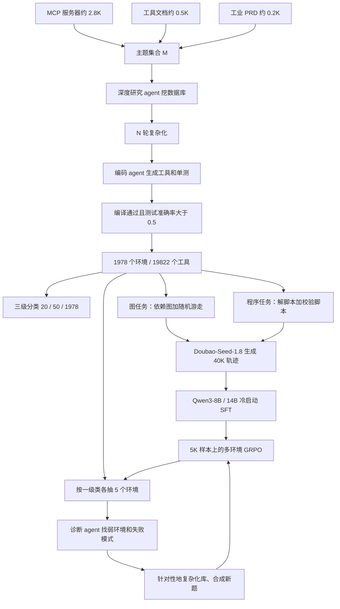

# Agent-World：环境不够真、训练只会走一遍，从真实主题挖可执行沙箱，再用失败诊断把下一轮任务长出来

<!-- release-date: 2026-04-20 -->

> 本文依据 **Agent-World: Scaling Real-World Environment Synthesis for Evolving General Agent Intelligence**，即 arXiv:2604.18292v1、水印 `arXiv:2604.18292v1 [cs.AI] 20 Apr 2026`、共 48 页的 letter 版式稿。封面署 **Renmin University of China, ByteDance Seed**，作者名单在 Contributions（PDF p. 19）。通讯作者为人大高瓴的 Zhicheng Dou 与 ByteDance Seed 的 Wanjun Zhong；标 `*` 的作者写明实习完成于 ByteDance Seed（PDF p. 1、19）。按主要归属方，本站把它放在 ByteDance 目录。页码均指这份 v1 PDF 本身。截至 2026-09-11 核验，[arXiv abs](https://arxiv.org/abs/2604.18292) 只有 v1，提交于 2026-04-20 14:01:10 UTC，注释为 Working in progress；封面 Date 写的是 April 21, 2026。`release-date` 取 arXiv 首次公开日 2026-04-20，不用 Hugging Face `createdAt`，也不因项目页后补而改写。文中会明确区分三层：**论文写了什么**（带页码）、**本文如何解释它**、**哪些是外部资料补充**（给出链接并标注）。
>
> **不要和 Snowflake 的 Agent World Model（AWM）混成一篇。** 本篇是人大高瓴 + ByteDance Seed 的 **Agent-World**：从真实 MCP / 工具文档 / 工业 PRD 主题出发，挖可执行数据库和工具，再做自演化训练场。Snowflake 那篇是 **Agent World Model**，参考文献 [100]，讲的是纯合成环境生成管线（PDF p. 12、18、26）。名字像，问题、数据和训练闭环都不是一回事。

## 读之前需要的最少背景

这篇论文不讲新的基座架构，也不发一个从零预训练的大模型。它讲的是：已经会说话、会调工具的语言模型，怎样在有状态、可执行的外部环境里被规模化地训成通用 agent。

先记住六个词就够往下读。

**MCP（Model Context Protocol，模型上下文协议）** 是一套把外部服务暴露成「可调用工具」的接口约定。对训练来说，它的意义不是协议本身，而是：真实世界里已经有大量按这种格式登记的服务器、工具 schema 和数据描述，可以当主题种子，而不必从零编一个假世界。

**有状态环境（stateful environment）** 是说，agent 每调用一次工具，外部世界可能被改写。订机票的顺序必须是查库存 → 下单 → 写日历；写完之后库存和日历都变了。无状态的单次函数调用，不够覆盖这种逻辑（PDF p. 2）。

**POMDP（Partially Observable Markov Decision Process，部分可观测马尔可夫决策过程）** 是论文用来写多轮交互的数学外壳。环境真正的数据库状态 $s^E$ agent 看不见，只能从工具返回的观察 $o^E$ 去推断（PDF p. 3–4）。

**可验证奖励的强化学习（Reinforcement Learning from Verifiable Rewards，RLVR）** 是只看最终结果能不能被规则或程序判定，不用单独训一个奖励模型。本篇的判定有两种：图任务走带评分细则的 LLM 评委，程序任务走沙箱里的校验脚本（PDF p. 10）。

**组相对策略优化（Group Relative Policy Optimization，GRPO）** 是一种不训 value model 的策略梯度：同一道题采一组轨迹，用组内相对表现当 advantage。本站 [DeepSeek-R1](/reports/DeepSeek/DeepSeek-R1) 讲过它的基本形式；本篇实现里又把裁剪半径改成了 DAPO 那种不对称上下界（PDF p. 11、13）。DAPO 本身见 [DAPO](/reports/ByteDance/DAPO)。

**环境缩放（environment scaling）** 是 2025–2026 年 agent 训练的一条主线：与其只在固定的几个工具环境里刷策略，不如把「环境的数量和种类」当成可扩展轴。论文拿来对比的 EnvScaler、AWM、ScaleEnv、TOUCAN、Simulator 都走这条线，但多数停在「造出来、训一轮」（PDF p. 2、12、18）。

实验跑在 Qwen3-8B / 14B 上。环境挖掘、任务合成和失败诊断用的是更大的 **GPT-OSS-120B**；冷启动轨迹由内部的 **Doubao-Seed-1.8** 生成（PDF p. 13）。也就是说，**被训练的学生不大，造环境和出题的老师很大。** 这句话是本文的归纳，论文没有用这一句概括。

## 一句话先说清

通用 agent 卡在两件事上，不是卡在「再加一个工具调用头」。

第一件：手工环境太贵，纯语言模型模拟的世界又会编。已有的程序化合成能做出可执行沙箱，但环境和任务往往对不上真实工作流，复杂度也上不去（PDF p. 2–3）。

第二件：环境造出来之后，现有工作几乎都是单轮训练。没有人系统地用这些环境去诊断当前策略弱在哪一类状态转移，再把下一轮数据和环境对准那些漏洞（PDF p. 2–3）。

Agent-World 的做法是把这两件事焊成一个闭环（PDF p. 3，Figure 1）：

1. 从数千个真实主题出发，用深度研究 agent 从网上挖主题对齐的数据库，再生成并交叉验证可执行工具，得到 **1978 个环境、19822 个工具**；
2. 用工具依赖图和可执行 Python 解，合成带校验器的长程任务；
3. 在「agent–工具–数据库」闭环上做多环境 GRPO；
4. 另建一个按分类抽样的竞技场，每轮现合成新题、用诊断 agent 定位弱环境，再针对性地复杂化数据库、生成新任务、继续 RL。

主结果必须连着「打谁、打哪张表」读。摘要写「8B 和 14B consistently outperforms strong proprietary models and environment scaling baselines」（PDF p. 1）。**Table 1 支持后半句，不支持前半句。** 在 MCP-Mark / BFCL V4 / $\tau^2$-Bench 三套主表上，Agent-World-14B 的平均分是 13.3 / 55.8 / 65.4；GPT-5.2 High 是 53.1 / 62.9 / 80.2，Claude Sonnet-4.5 是 33.3 / 73.2 / 84.7，Gemini-3 Pro 是 50.8 / 72.5 / 85.4，Seed 2.0 是 54.7 / 73.4 / 83.0（PDF p. 14）。14B 相对专有模型全面落后。它真正拉开的，是同尺寸的环境缩放基线，以及部分开源基座：8B 在 $\tau^2$-Bench 上到 61.8，超过 EnvScaler-8B 的 37.9 和 Qwen3-235B-A22B 的 58.5；14B 在 BFCL V4 上 55.8，略高于 DeepSeek-V3.2-685B 的 54.1（PDF p. 13–14）。

所以本文的判断是：

> **环境先要可执行、可校验、和真实主题对齐；然后环境不能只当数据集，还得当体检中心。造环境的老师可以很大，被演化的学生可以很小。摘要里那句「超过专有模型」，主表没有兑现。**

这句话是本文对 Figure 1、第 3 节和 Table 1 的归纳，论文没有用这一句概括。

## 旧方案卡在哪

论文把通用 agent 的训练需求写成一个很具体的闭环：生成 → 执行 → 反馈（PDF p. 1）。静态工具环境在信息搜索和软件工程上已经能干活，但开放世界的工具是组合的、有状态的。订机票那个例子不是装饰：动作顺序错了，状态就被写坏（PDF p. 2）。

已有路线被收成两支（PDF p. 2）：

- **模拟环境**：让 LLM 当隐式文本世界模型，反馈可以无限造。代价是幻觉，动力学经常偏离真实系统。
- **真实环境**：可执行工具加真实数据库，接地更硬。$\tau^2$-Bench、ClawEval 已经把评测往有状态应用推；EnvScaler、AWM、ScaleEnv 开始程序化地合成环境和任务。

第二支看起来更接近目标，但论文点了两个没补上的洞（PDF p. 2–3）：

1. **规模化的真实感和复杂度。** 现有合成环境常常是纯 LLM 生成，或只从有限开源工具链派生，交互逻辑对不上真实工作流；长程、重状态的任务尤其稀。
2. **持续自演化的训练机制。** 环境明明可以当训练场，已有工作却停在「造环境、扩环境」，缺少用这些环境诊断弱点、驱动下一轮改进的原则。

两层叠在一起，就是一个训练问题：

> **世界不能只存在于下一个 token 的想象里；造出来的世界也不能只被刷一遍就扔掉。**

下面按这条因果链拆开。论文第 2 节先把交互写成 POMDP，第 3.1 节造世界，第 3.2 节在世界上训，并让世界反过来检查策略。

## 全景：主题进，环境和策略一起往外长

这是根据 PDF p. 2 Figure 1、p. 5 Figure 2、p. 10 Figure 5 和 p. 12 Algorithm 1 重画的**机制示意图**，不是实测时间轴。闭环的入口是真实主题，出口是演化后的策略；中间始终有一个可执行的数据库，而不是一段模型自己编的环境描述。

和 Snowflake AWM 的差别，用论文自己的 related work 就能划清（PDF p. 18）：AWM 和 EnvScaler、AutoForge 被放在「程序化环境合成」那一支，用 LLM 规划并生成由可执行程序、数据库或工具接口构成的沙箱。Agent-World 声称自己不同的地方是：**用真实 MCP 元数据做环境发现，再从网上自主构建主题匹配的数据库和可执行工具**，并且后面还接了一条诊断–刷新–继续 RL 的回路。AWM 的目标是「无限合成」；Agent-World 的目标是「锚定真实工具生态，再让环境和策略共演化」。

## 交互被写成什么：一个库、一组工具、两种动作

第 2 节把多环境交互写成五元组 $(U,S,A,O,P)$，并声明跟随 AgentSkiller（PDF p. 3）。第一次读不必把每个符号都背下来，只要抓住三个拆分。

**状态拆成两半。** $S=S_E\times S_H$。$s^E$ 是外部环境（数据库、文件、服务），$s^H$ 是对话上下文（历史、约束、偏好）。每一步的完整状态是 $s_t=(s_t^E,s_t^H)$。

**每个环境是一对。** $e=(\mathcal{D},\mathcal{F})$。数据库 $\mathcal{D}$ 是 $s^E$ 的载体；工具集 $\mathcal{F}$ 是读写这个载体的可调用算子。论文后文的「造环境」，造的就是这一对，不是一段自然语言世界设定（PDF p. 4）。

**动作也是两种。** $A=A_{\mathrm{tool}}\cup A_{\mathrm{resp}}$。调工具会改 $s^E$ 并返回结构化观察 $o^E$；说话只改对话状态。离线训练里，一次语言回复常常就是终止信号，那一步环境状态保持不变：$s_{t+1}^E=s_t^E$（PDF p. 4）。

观察空间同样对拆：$O=O_E\cup O_H$。关键约束写得很硬：**环境状态不能直接看见，必须从工具观察里间接推断**（PDF p. 4）。后面所有「状态感知奖励」「状态更新错误」都站在这条约束上——评委和校验脚本可以看库，策略只能看返回值。

这套记号本身没有新算法。它的用处是给后面两段方法规定接口：造环境 = 造 $(\mathcal{D},\mathcal{F})$；训 agent = 在这对接口上采样轨迹；诊断 = 看轨迹如何把库写错。

## 核心设计一：Agentic Environment-Task Discovery，从真实主题挖出可执行世界

第 3.1 节是整篇的数据引擎。Figure 2 把它画成五段流水线：主题收集 → 数据库挖掘 → 工具生成与验证 → 分类体系 → 可验证任务合成（PDF p. 5）。

### 主题从哪来，为什么不能从零编

规模化合成的第一锚点是主题，不是模型自己脑补的场景名。论文收了三类真实来源，再取并集 $\mathcal{M}=\mathcal{M}_1\cup\mathcal{M}_2\cup\mathcal{M}_3$（PDF p. 5）：

| 来源 | 规模 | 用法 |
|---|---:|---|
| MCP 服务器（Smithery） | 约 2.8K | 结构化 JSON：源数据描述 + 标准工具定义 |
| 工具文档 | 约 0.5K | 从开源工具使用数据里抽定义，再用 LLM 反推环境主题 |
| 工业 PRD | 约 0.2K | 产品需求文档里的背景、领域工作流和系统接口 |

数字是 Figure 2 框里的约数，不是过滤后的环境数。过滤后留下来的是 1978 个环境（PDF p. 3、9）。

本文的解释：MCP 规范给的是「真实服务长什么样」的骨架，PRD 给的是「工业流程怎么走」的叙事。两者都比「请你虚构一个电商 API」更难跑偏。但骨架还不是环境。附录 B 的环境卡片写得很清楚——以 `Arxiv_local` 为例，agent **并不调用公开 arXiv API**，而是读本地 `manifest.json` 和 `papers/` 下的 Markdown 卡片（PDF p. 32）。所以「真实世界」在这篇论文里的操作定义是：

> **主题和数据分布来自真实来源；运行时是自洽的本地沙箱。**

不要读成「训练时连上了线上 MCP」。那是本文的解释，正文没有用这句话。

### 数据库不是 LLM 一次写出来的，是深度研究 agent 挖出来再加厚的

论文明确反对「LLM 合成数据库」这条捷径，点名的前作是 [31, 88, 98]（PDF p. 5）。理由只有一句：网上已经有大量可更新的结构化数据。于是他们做了一个深度研究 agent $\mathcal{G}$，策略模型是 $\pi_\theta$，外挂搜索、浏览器、代码编译器和操作系统工具。每个主题 $m$ 跑一轮挖掘：

$$
\mathcal{D}(m)=\mathcal{G}(m;\pi_\theta,\mathcal{T}),\qquad m\in\mathcal{M}
$$

一次挖掘往往库小、结构简单，所以再套一个复杂化算子 $\phi$，迭代加厚（PDF p. 5）：

$$
\mathcal{D}^{(n+1)}(m)=\phi\bigl(\mathcal{D}^{(n)}(m),m,\mathcal{T}\bigr),\quad n=0,\ldots,N-1
$$

最终库记作 $\mathcal{D}^{(N)}(m)$。$N$ 取多少、每一轮加了什么字段，论文没写。实验里这个 $\pi_\theta$ 是 GPT-OSS-120B（PDF p. 13）。

可迁移的不是「必须用深度研究 agent」，而是：**先有接地的表，再让工具去读写这张表。** 如果工具的输入输出和库字段对不上，后面的图游走和程序校验都会变成自说自话。

### 工具必须能编译、能过半单测，否则环境不算数

有了库之后，编码 agent $\psi$ 为每个 $(m,\mathcal{D}^{(N)}(m))$ 生成候选工具和对应测试集（PDF p. 5–6）：

$$
\{(\hat f,\hat{\mathcal{C}}_{\hat f})\}=\psi\bigl(m,\mathcal{D}^{(N)}(m);\pi_\theta,\hat{\mathcal{T}}\bigr)
$$

每个工具对应一组测试，是一对多。保留条件三条同时成立（PDF p. 6）：

1. Python 编译通过；
2. 测试准确率 $\mathrm{Acc}(\hat f;\hat{\mathcal{C}}_{\hat f})>0.5$；
3. 该环境至少有一个有效工具和一个有效测试。

准确率就是测试通过的比例：

$$
\mathrm{Acc}(\hat f;\hat{\mathcal{C}}_{\hat f})=\frac{1}{|\hat{\mathcal{C}}_{\hat f}|}\sum_{\hat c\in\hat{\mathcal{C}}_{\hat f}}\mathbf{1}[\hat f(\hat c)\ \mathrm{passes}]
$$

过滤后的工具集是 $\mathcal{F}(m)$，整个生态是

$$
\mathcal{E}=\bigl\{\bigl(\mathcal{D}^{(N)}(m),\mathcal{F}(m)\bigr)\mid m\in\mathcal{M}\bigr\}
$$

0.5 这个阈值很松。本文的判断是：它先保证「能跑」，不保证「实现正确」。真正的任务级正确性被推到后面的 ReAct×5 一致性过滤和校验脚本上。代价是生态规模好看（19822 个工具），单工具质量的下界并不高。

### 三级分类：给竞技场抽样用的，不是给论文排版用的

他们先做层次聚类得到 50 个簇心，再借 TOUCAN 的分类体系，用 GPT-OSS-120B 汇总出 50 个二级标签；三个标注员把二级标签归并成 20 个一级类型（PDF p. 6）。正文写：一级 20、二级 50、三级超过 2K；Figure 3 圆心写的是 **20 categories | 1978 servers**（PDF p. 6）。

Figure 3 右侧给出二级类按服务器数的 Top-10，是图上直接读到的数字，不是正文表格：

| 二级类 | 服务器数 |
|---|---:|
| DevOps & Workflow Automation | 213 |
| API Gateway & Aggregation | 205 |
| Web Content Extraction | 109 |
| Cloud Platform Services | 95 |
| General Web Search | 93 |
| Memory & Knowledge Management | 90 |
| Relational Databases | 75 |
| Messaging & Notification | 71 |
| Code Execution & Analysis | 68 |
| Model Hubs & LLM APIs | 65 |

一级饼图的扇区标签在 140 dpi 渲染下不够稳，本文不引用具体一级类的服务器数，以免把看不清的数字写成事实。分类的训练用途在第 3.2.2 节才出现：竞技场按一级类分层抽样，保证诊断覆盖面（PDF p. 11）。

### 两种任务：一种走工具依赖图，一种走可执行程序

环境造完仍没有训练信号。第 3.1.1 节用两种互补办法合成可验证任务，都在沙箱里跑，以留下执行轨迹、标准答案和可执行校验（PDF p. 6–8）。

**图任务针对「必须按顺序调」。** 先给每个环境建一张完全连接的加权有向图，节点是工具，边由 LLM 标三种依赖（PDF p. 7）：

- 强依赖，权重 3：后一个工具的输入严格来自前一个输出，例如先 `create_order` 拿到 `order_id` 再 `get_order_details`；
- 弱依赖，权重 2：可以从上一个输出得到，也可以从库或常数得到，建成双向边；
- 独立边，权重 1：没有参数级依赖，只为了保证图连通、随机游走不走进死胡同。

然后随机游走得到工具序列 $\tau$，优先从「有输出、没有强依赖前驱」的节点出发，下一步按边权偏置抽样。强/弱依赖就传递上一步输出，独立边就从数据库随机采样合法值。LLM 再修剪冗余、检查逻辑，得到可执行序列 $\tau^*$。

任务文本是倒着写的：先有合法调用链，再写用户问题。$q_{\mathrm{init}}$ 被禁止出现工具名和库 schema，以免泄漏。$\tau^*$ 在沙箱逐步执行后，LLM 根据真实字段把问题改写成 $q_{\mathrm{final}}$，同时给出 JSON 标准答案 $a^*$ 和评分细则 $R$（字段完整性、schema 匹配、数值容差）（PDF p. 7）。

质量控制：派一个 ReAct agent 独立做 5 次，至少 2 次拿到一致答案才留。难度缩放三条同时做：加长游走、提高弱依赖和独立边的抽样概率、改写题面把工具名和执行逻辑藏起来（PDF p. 7）。

**程序任务针对「顺序走不完」。** 条件分支、循环、聚合、跨库统计，没法收成一条链。做法改成：LLM 直接写任务 $q_{\mathrm{prog}}$ 和端到端 Python 解 $\pi_{\mathrm{code}}$，解脚本必须加载工具实现。跑不通就在 ReAct 环里修，直到沙箱给出 $a^*$。然后再生成校验脚本 $V_{\mathrm{code}}(a,a^*)$，断言答案和数据库状态 $s^E$ 是否满足约束；校验脚本本身也要在沙箱里被 ReAct 修到能跑（PDF p. 8）。过滤协议和图任务相同：5 次里至少 2 次通过 $V_{\mathrm{code}}$。难度缩放改成：加工具种类和调用次数、强制条件分支和跨库聚合，同样改写题面去掉 API 痕迹（PDF p. 8）。

两种任务对应后面两种奖励。图任务有细则 $R$，程序任务有 $V_{\mathrm{code}}$。合成阶段就把「怎么判」一起造出来了，这是这条流水线真正可训的原因。

### Figure 4 的统计：规模好看，难度也不是假的

第 3.1.1 节末用六张子图汇报生态（PDF p. 8–9，Figure 4）。正文给出的、可以当事实引用的数字是：

- 环境超过 2000 个，过滤后保留 **1978**；
- 每环境平均超过 10 个工具，有的超过 40；
- 一共 **19822** 个不同工具；
- 库文件类型包括 json、csv、sql、html，以及 tex、yaml 这类工作区格式；
- 合成任务至少 7 轮交互，平均超过 20 轮，相当一部分超过 40 轮；
- 用 Doubao-Seed-2.0-pro 做 Pass@10：只有一小部分 10 次全对，多数 10 次里只对 1 次，还有完全做不对的（PDF p. 9）。

图例里还有一组需要单独标注的读图数字。Figure 4(b) 图例写 `# Envs: 2250`、`Mean tools: 10.81`；Figure 4(c) 图例写 `Mean = 1.0`、`Median = 1`、`Total tools: 19822`（PDF p. 8）。**2250 和正文 1978 对不上**；10.81×1978 也对不上 19822。本文把 1978 / 19822 当正文事实，把 2250 / 10.81 只当作图例，不拿去推「每环境平均工具数」。

附录 B 给了六张环境卡片：`Arxiv_local`、`Emails`、`Calendar`、`Hotels`、`App_stores`、`Food_delivery`（PDF p. 30–44）。共同形状都是：一块本地目录树、若干 JSON 事实表、一组带意图说明的 Python 工具、再贴一段参考实现。附录 C 的三条案例则展示任务长什么样：电商退货 9 步用 4/17 个工具，Slack 合规分诊 7 步用 5/18 个工具，人口数据约束排序 10 步用 5/11 个工具（PDF p. 46–48）。案例是成功轨迹，不是失败分析。

## 核心设计二：Continuous Self-Evolving Agent Training，环境同时是教材和体检中心

第 3.2 节把训练分成两层。上层是普通的多环境 RL；下层是一个会换题、会诊断、会针对补数据的竞技场。Figure 5 上半是 RL，下半是竞技场（PDF p. 10）。

### 多环境 rollout：策略、工具运行时、数据库三件套

和静态工具调用不同，这里每一步都在三个组件之间转（PDF p. 9）：

- 策略 $\pi_\theta$，根据对话历史和工具反馈出下一个动作；
- 工具接口 / 运行时，执行该环境的 $\mathcal{F}(m)$，维护连接和缓存；
- 数据库 $\mathcal{D}^{(N)}(m)$，是读写的结构化底板。

给定任务 $x$ 和环境 $(\mathcal{D}^{(N)}(m),\mathcal{F}(m))$，策略按历史 $h_t=(o_0,a_0,\ldots,o_t)$ 采样 $a_t$。工具动作执行后返回 $o^E$；语言动作通常作为最终答案并终止。一条输出写成 $y=(\tau,a_{\mathrm{final}})$。每个全局 batch 里的任务配上彼此独立、可以动态更换的环境，这就是「多环境 rollout」（PDF p. 9–10）。

实现上，每题按 GRPO 采一组轨迹。正文先说 sample $N$ outputs per task，后文公式改用组大小 $G$（PDF p. 9、11）。实验配置是每步 32 道题、每题 8 条 rollout（PDF p. 13），所以训练时的 $G=8$。

### 奖励：正文说平均通过率，公式写成全过才给 1

论文强调环境 agent 的自动奖励不能只看答案对错，还要看环境状态、效率约束和格式（PDF p. 10）。然后它只实例化了两种：

- 图任务：细则 $R=\{r_j\}_{j=1}^n$，用带细则条件的 LLM-as-judge 逐条打，再把准则级通过指示平均成总分；
- 程序任务：在沙箱跑 $V_{\mathrm{code}}$，检查预测答案或最终数据库状态。

写成公式是（PDF p. 10）：

$$
r(x,y)=\begin{cases}
\mathbb{I}\Big[\dfrac{1}{n}\sum_{j=1}^{n}\mathbb{I}\big[\mathrm{Judge}(x,y,r_j)\big]=1\Big], & x\in\mathcal{X}_{\mathrm{graph}}\\[6pt]
\mathbb{I}\big[\mathrm{Execute}(V_{\mathrm{code}}(y,y^*))\big], & x\in\mathcal{X}_{\mathrm{prog}}
\end{cases}
$$

外层 $\mathbb{I}[\cdot=1]$ 意味着：图任务只有平均通过率恰好为 1，也就是**所有细则都过**，才给奖励 1。这和上一句「averaging criterion-level pass indicators」不是同一个函数。程序任务则是校验脚本的 0/1。

本文的读法：按公式，两种任务都是稀疏的终局 0/1，没有过程分，也没有正文承诺过的效率项和格式项。Judge 本身是 LLM，图任务的「可验证」比程序任务软。若实现其实发的是平均通过率而不是全过指示，论文没说。阅读时以公式为严口径，以文字为作者意图，两者打架时不把意图写成实验结果。

### 策略更新是带 KL 的 GRPO，裁剪半径却换成了 DAPO 的不对称上下界

目标函数按标准 GRPO 写出（PDF p. 11，式 1）：同一题采 $G$ 条轨迹，token 级 advantage $\hat A_{i,t}$ 做组内归一化，重要性比裁剪后再减对参考策略的 KL：

$$
J_{\mathrm{GRPO}}(\theta)=\mathbb{E}\Bigg[\frac{1}{G}\sum_{i=1}^{G}\frac{1}{|y_i|}\sum_{t=1}^{|y_i|}
\min\big(r_{i,t}(\theta)\hat A_{i,t},\ \mathrm{clip}(r_{i,t}(\theta),1-\varepsilon,1+\varepsilon)\hat A_{i,t}\big)
-\beta D_{\mathrm{KL}}(\pi_\theta\|\pi_{\mathrm{ref}})\Bigg]
$$

式子里的 $\varepsilon$ 是对称的。实现段落却写：跟随 DAPO，设 $\varepsilon_{\mathrm{low}}=0.2$、$\varepsilon_{\mathrm{high}}=0.28$（PDF p. 13，参考文献 [118]）。不对称裁剪是 DAPO 的 Clip-Higher，用来缓解熵崩。公式没改、超参改了。训练框架、GPU 数、是否用 token-level loss，全部没写。

最大轨迹长度 80K token，单步生成上限 32k，温度和 top_p 训练与评测都是 1.0，每组实验重复 8 次报平均准确率（PDF p. 13）。Figure 9 的横轴大约到 300 step（PDF p. 17）。按 32 题/步粗算，300 步是约 9600 次「题×步」的曝光；RL 样本只有 5K，所以是在这 5K 上反复滚，不是 5K 各见一次。

### 自演化竞技场：换题、诊断、对着漏洞造下一批

第 3.2.2 节是这篇相对 EnvScaler / AWM 真正多出来的一块。动机写得很直：可扩展生态 $\mathcal{E}$ 不只是训练集，还是诊断场。要持续找出当前策略的弱点，再定向扩展环境和任务（PDF p. 11）。

竞技场按一级类分层抽样：每个 $c\in\mathcal{C}$ 随机选 $K=5$ 个环境，并成 $\mathcal{E}_{\mathrm{arena}}$（PDF p. 11）。20 个一级类意味着约 100 个竞技场环境。这个 100 是本文用 $20\times 5$ 推的，论文没有写出总数。

每一轮 $r$ 对场上每个环境现合成一批图任务和程序任务，配上 $R$ 或 $V_{\mathrm{code}}$。环境和题都跨轮更换，避免对死一套评测过拟合（PDF p. 11）。

诊断 agent $\delta$ 带 Python 解释器和搜索。输入三件事：逐任务失败轨迹（工具日志、中间观察、校验器反馈），按环境和分类的错误分布，以及工具 schema / 数据库描述。输出两件事：弱环境集合 $\mathcal{W}^{(r)}\subseteq\mathcal{E}_{\mathrm{arena}}$，以及每个弱环境的出题指南 $\mathcal{G}_{\mathrm{guide}}^{(r)}(m)$，用来刻画缺的能力，例如工具用错、状态更新错（PDF p. 11）。附录 A 给出系统提示和用户提示模板：把失败归到根因类型、给环境排序、为每个弱环境写可执行的出题指南，并要求输出结构化 JSON（PDF p. 30–31）。正文还说「Table A specifies the expected output schema」，**在 p. 30–31 的附录 A 里没有出现这张表。**

然后进入共演化。对每个弱环境：用 $\phi$ 再复杂化一次数据库，按指南生成针对性训练集 $\mathcal{X}_{\mathrm{target}}^{(r)}$，从 $\pi_{\theta^{(r)}}$ 继续多环境 RL，得到 $\pi_{\theta^{(r+1)}}$（PDF p. 11）。Algorithm 1 把三阶段写成伪代码（PDF p. 12）。论文把它收成一条链：

$$
\pi_{\theta^{(r)}}\ \xrightarrow{\text{evaluate}}\ \mathcal{W}^{(r)}\ \xrightarrow{\text{diagnose + target}}\ \mathcal{X}_{\mathrm{target}}^{(r)}\ \xrightarrow{\text{continue RL}}\ \pi_{\theta^{(r+1)}}
$$

本文的解释：这不是 AlphaGo 那种自我对弈。对手不是另一个 agent，而是一个会根据你的失败改题的出题器。课程不是按人类标的难度阶梯走，而是按「这一轮哪类环境把你打脸」走。收益是数据预算可以盯着漏洞花；代价是诊断 agent 和出题 LLM 仍然是 GPT-OSS-120B，闭环的智力上限在老师，不在 8B/14B 学生（PDF p. 13）。

## 训练 recipe：老师很大，学生很小，RL 样本很少

第 4.1 节把实现收成一张可以核对的清单（PDF p. 13）。

| 项目 | 论文写明的值 |
|---|---|
| 环境挖掘 / 任务合成 / 诊断策略 | GPT-OSS-120B |
| 冷启动轨迹 | 4 万条，由内部 Doubao-Seed-1.8 生成 |
| 学生基座 | Qwen3-8B、Qwen3-14B |
| RL 样本 | 5K，算法 GRPO（作 RLVR） |
| 裁剪 | $\varepsilon_{\mathrm{low}}=0.2$，$\varepsilon_{\mathrm{high}}=0.28$ |
| 轨迹上限 | 80K token；单步生成上限 32k |
| 每步 | 32 题 × 8 条 rollout |
| 采样 | temperature $=1.0$，top_p $=1.0$（训练和评测相同） |
| 评测重复 | 8 次，报平均准确率（%） |

正文的句子顺序有点别扭：「先做冷启动 SFT，After cold-start SFT, we initialize the Qwen3-8B/14B backbones」。最自然的读法是：用 Doubao-Seed-1.8 的 40K 轨迹对 Qwen3 做 SFT，再从这份 SFT 权重做 GRPO。若 SFT 其实发生在别的模型上、Qwen3 只吃 RL，论文没给第二种读法的证据。

5K RL 样本对 1978 个环境极稀疏。平均每个环境分到的 RL 题远不到 3 道。竞技场每轮还会再合成新题，所以 5K 更像「第一轮库存」，不是闭集。论文没有写每轮 $\mathcal{X}_{\mathrm{target}}$ 的条数，也没有写主实验的 Agent-World-8B/14B 经过几轮竞技场。Table 2 显示 14B 主表数字和「+2 rounds」对齐，见下一节。

评测声明用内部框架，结果与官方分数对齐；GAIA、HLE 等用了抽样子集以加速（PDF p. 13）。23 个基准按五组列（PDF p. 12–13）：

- 核心工具使用：MCP-Mark、BFCL V4、$\tau^2$-Bench；
- 高级助手：SkillsBench、ARC-AGI-2、Claw-Eval；
- 通用推理：MATH500、GSM8K、MATH、AIME24、AIME25、KOR-Bench（Cipher）、OlympiadBench；
- 搜索与编码：WebWalkerQA、SWE-Bench Verified、SWE-bench Multilingual、Terminal-Bench 1.0 / 2.0、GAIA、HLE；
- 知识与 MCP：MMLU、SuperGPQA、MCP-Universe（5 个子域算一套）。

3+3+7+7+3 = 23。MCP-Universe 的五个轴在 Figure 6 雷达上分开画，计数时仍算一个基准。

## 实验怎么证明，哪些数字要连着分母读

### Table 1：赢的是环境缩放基线，不是专有模型

Table 1 是主表，只覆盖三套核心工具基准（PDF p. 14）。下面按套拆开，数字均从该页表格逐格核对，不是从项目页抄的——项目页把这张宽表错折成了三列，不能用。

**MCP-Mark（File / Github / Notion / Playwright / Postgres / Avg）**

| 方法 | File | Github | Notion | Play. | Post. | Avg |
|---|---:|---:|---:|---:|---:|---:|
| GPT-5.2 High | 60.0 | 47.8 | 42.9 | 40.0 | 66.7 | 53.1 |
| Claude Sonnet-4.5 | 32.5 | 29.4 | 25.0 | 27.0 | 50.0 | 33.3 |
| Gemini-3 Pro | 56.7 | 45.7 | 43.8 | 40.0 | 70.2 | 50.8 |
| Seed 2.0 | 60.0 | 39.1 | 53.6 | 40.0 | 81.0 | 54.7 |
| DeepSeek-V3.2-685B | 36.7 | 20.7 | 45.5 | 17.0 | 66.6 | 36.7 |
| GPT-OSS-120B | 5.8 | 4.4 | 3.6 | 3.0 | 7.1 | 4.7 |
| Qwen3-8B | 3.3 | 0.0 | 0.0 | 4.0 | 4.8 | 2.4 |
| Qwen3-14B | 3.3 | 4.4 | 0.0 | 0.0 | 9.5 | 3.4 |
| Qwen3-32B | 10.0 | 0 | 3.6 | 0 | 23.8 | 7.5 |
| Qwen3-235B-A22B | 13.3 | 0 | 10.7 | 0 | 4.8 | 5.8 |
| Simulator-8B | 3.3 | 0.0 | 0.0 | 4.0 | 4.8 | 2.4 |
| TOUCAN-7B | 0.0 | 0.0 | 0.0 | 0.0 | 4.8 | 1.0 |
| EnvScaler-8B | 10.0 | 4.4 | 0.0 | 4.0 | 9.5 | 5.6 |
| AWM-8B | 3.3 | 0.0 | 0.0 | 4.0 | 4.8 | 2.4 |
| AWM-14B | 3.3 | 8.7 | 0.0 | 4.0 | 9.5 | 5.1 |
| Agent-World-8B | 13.3 | 4.4 | 3.6 | 4.0 | 19.1 | **8.9** |
| Agent-World-14B | 16.6 | 4.4 | 3.6 | 4.0 | 38.1 | **13.3** |

ScaleEnv-8B 在 MCP-Mark 和 BFCL 上整行是破折号。

**BFCL V4 平均，以及 $\tau^2$-Bench**

| 方法 | BFCL Avg | Retail | Telecom | Airline | $\tau^2$ Avg |
|---|---:|---:|---:|---:|---:|
| GPT-5.2 High | 62.9 | 81.6 | 95.8 | 62.5 | 80.2 |
| Claude Sonnet-4.5 | 73.2 | 86.2 | 98.0 | 70.1 | 84.7 |
| Gemini-3 Pro | 72.5 | 85.3 | 98.0 | 72.7 | 85.4 |
| Seed 2.0 | 73.4 | 90.4 | 94.2 | 64.4 | 83.0 |
| DeepSeek-V3.2-685B | 54.1 | — | — | — | 80.3 |
| GPT-OSS-120B | — | 67.8 | 49.2 | 48.0 | 55.0 |
| Qwen3-8B | 40.4 | 34.0 | 18.0 | 26.5 | 26.2 |
| Qwen3-14B | 41.0 | 55.3 | 14.9 | 27.0 | 32.4 |
| Qwen3-32B | 46.7 | 59.5 | 27.2 | 48.0 | 44.9 |
| Qwen3-235B-A22B | 47.9 | 71.9 | 58.0 | 45.6 | 58.5 |
| Simulator-8B | 23.9 | 32.2 | 29.2 | 34.0 | 31.8 |
| TOUCAN-7B | 36.6 | 22.8 | 10.5 | 20.0 | 17.7 |
| EnvScaler-8B | 47.6 | 49.6 | 32.7 | 31.5 | 37.9 |
| AWM-8B | 40.0 | 41.2 | 38.5 | 23.5 | 34.4 |
| AWM-14B | 42.4 | 63.6 | 17.8 | 31.5 | 39.0 |
| ScaleEnv-8B | — | 50.9 | 27.2 | 37.5 | 38.5 |
| Agent-World-8B | **51.4** | 72.8 | 50.9 | 40.0 | **61.8** |
| Agent-World-14B | **55.8** | 74.5 | 56.1 | 52.0 | **65.4** |

BFCL 子项里，Agent-World-8B / 14B 的 WebSearch 是 47.0 / 53.0，Multi-Turn 是 44.5 / 53.9，Relev. 都是 93.8（与 EnvScaler-8B、AWM-8B 并列该列最好或并列最好）。Live / No-live 上它们并不占优，Qwen3-8B 的 No-live 已经是 90.2（PDF p. 14）。

正文自己的三条发现，和表是对齐的（PDF p. 13）：

1. 专有模型在 MCP-Mark 上也不高：GPT-5.2 High 53.1，Gemini-3 Pro 50.8。开源基座更弱，GPT-OSS-120B 4.7，Qwen3-235B-A22B 5.8。长程、要编排工具、要盯状态，现有基座确实吃力。
2. 现有环境缩放方法增益不均匀。Simulator-8B 在 $\tau^2$-Bench 还行（31.8），MCP-Mark / BFCL 几乎没动；EnvScaler 和 AWM 面更宽，但 Github、Notion 仍然接近零。
3. 同一训练设定下，Agent-World 在三套上都高于先前环境缩放基线。8B 的 61.8 / 51.4 / 8.9 超过 EnvScaler-8B 的 37.9 / 47.6 / 5.6，也超过 Qwen3-235B-A22B 的 58.5 / 47.9 / 5.8。14B 相对 8B「大约再高 5%」：三套实际差值是 +3.6 / +4.4 / +4.4。BFCL 上 55.8 对 DeepSeek-V3.2-685B 的 54.1，是正文点名的「有竞争力」对照。

有两处表内异常，需要原样保留、不要脑补：DeepSeek 的 $\tau^2$-Bench 平均写了 80.3，Retail / Telecom / Airline 却是破折号；GPT-OSS-120B 的整段 BFCL 是破折号。论文没有解释。

MCP-Mark 上 Agent-World-14B 的 13.3，相对 Seed 2.0 的 54.7 差 41 个百分点。Postgres 子项 38.1 是 14B 相对环境缩放基线拉开最大的一格（EnvScaler-8B 只有 9.5），也是后文自演化分析盯着看的那一格。Github / Notion / Playwright 则几乎没被救起来，14B 仍是 4.4 / 3.6 / 4.0。**「更一致的跨环境泛化」是相对 EnvScaler / AWM 而言，不是相对专有模型，也不是在每一个 MCP 子环境上。**

### Figure 6 / 7：迁移看的是开源对照，不是 GPT-5.2

Figure 6 把 Qwen3-8B、EnvScaler-8B、Agent-World-8B 画成三组雷达：通用推理、搜索与编码、知识与 MCP（PDF p. 15）。图上没有印数字。目视可见：蓝色的 Agent-World-8B 在搜索 / 编码和 MCP-Universe 五轴上整体在外；通用推理七轴上没有塌，多数轴略在 Qwen3-8B 之外或持平；橙色 EnvScaler-8B 在 SWE 和 Terminal 1.0 上落到基座里面——正文也写了这一点，并猜测其环境扩展没引出复杂软件工程推理（PDF p. 14）。

Figure 7 的柱上有数字，三套都极低，必须当「压力测试」读，不能当已解决（PDF p. 15–16）：

| 模型 | SkillsBench | ARC-AGI-2 | ClawEval |
|---|---:|---:|---:|
| Qwen3-8B | 7.0 | 3.8 | 25.6 |
| EnvScaler-8B | 6.4 | 3.8 | 22.6 |
| AWM-8B | 5.1 | 5.2 | 22.6 |
| Agent-World-8B | **9.2** | **6.5** | **30.5** |
| Qwen3-14B | 8.3 | 6.5 | 24.7 |
| AWM-14B | 5.4 | 6.8 | 26.1 |
| Agent-World-14B | **12.6** | **8.5** | **31.5** |

正文观察三条（PDF p. 15–16）：多数开源基线在三套上的平均低于 20%（Qwen3-8B 的三套均值为 12.1，确实低于 20，但 ClawEval 单套已经 25.6，不能说「每套都低于 20」）；Qwen3 从 8B 到 14B 在 ClawEval 上从 25.6 掉到 24.7，说明裸加参数不够；Agent-World 无针对性训练仍全面高于同尺寸开源对照，且 8B→14B 三套都升（9.2→12.6，6.5→8.5，30.5→31.5）。

这些图证明的是：**同一套合成环境训出来的 8B/14B，比同尺寸环境缩放基线更能迁移到没针对训过的助手基准。** 它们不证明接近专有模型。Figure 6、7 里根本没有 GPT / Claude / Gemini / Seed。

### 环境数量是一条真正的缩放轴

第 4.3.3 节把训练环境数从 0 拉到 10、100、500、1000、2000（1978），在四个代表域上评：MCP-Mark（Postgres）、BFCL（WebSearch）、BFCL（Multi-Turn）、$\tau^2$-Bench（Airline）（PDF p. 16）。正文给出的端点是：

- 四域平均从 18.4% 到 38.5%，+20.1 个百分点，超过翻倍；
- Postgres：4.8% → 19.9%；
- WebSearch：7.0% → 47.0%；
- 10→100 和 100→500 两段跳得最猛；500 之后仍升，边际变小。

0 环境的 4.8 / 7.0 / 26.5 对得上 Table 1 里 Qwen3-8B 的 Postgres / WebSearch / Airline，说明这条缩放曲线的起点就是未做环境缩放的 8B 基座。终点 Postgres 19.9 和 Table 1 里 Agent-World-8B 的 19.1 差 0.8 个百分点，可能是四域曲线与主表不是同一检查点，论文没解释。

Figure 1 右侧下方那张「Environments vs Average Accuracy」把同一条平均曲线画到 0 / 10 / 100 / 500 / 1000 / 1500 / 2000，并标了 18.4、21.8、26.2、29.3、37.0、37.9、38.5（PDF p. 2）。1000 附近已经接近平台，后面 1000 个环境只再换约 1.5 个百分点。本文的解释：前几百个环境买的是「没见过的交互模式」；后一千个买的是边角鲁棒性。这和「再堆环境就能线性涨点」不是一回事。

### Table 2：自演化有用，但正文把 $\tau^2$ 的基数写错了

第 4.3.4 节用同一套两轮竞技场，分别从 Agent-World-14B 和 EnvScaler-8B 往下走（PDF p. 16–17）。Table 2 在 PDF p. 16，逐格如下：

| 模型 / 轮次 | $\tau^2$-Bench | BFCL-V4 | MCP-Mark（Post.） |
|---|---:|---:|---:|
| Agent-World-14B（base） | 60.2 | 52.4 | 29.5 |
| +1 round | 63.5（+3.3） | 54.9（+2.5） | 36.3（+6.8） |
| +2 rounds | **65.4**（+1.9） | **55.8**（+0.9） | **38.1**（+1.8） |
| EnvScaler-8B（base） | 37.9 | 47.6 | 9.5 |
| +1 round | 40.2（+2.3） | 49.1（+1.5） | 13.9（+4.4） |
| +2 rounds | **41.6**（+1.4） | **50.0**（+0.9） | **15.1**（+1.2） |

+2 rounds 的 65.4 / 55.8 / 38.1 与 Table 1 的 Agent-World-14B 主结果重合。因此本文的判断是：**主表 14B 是两轮竞技场之后的检查点**，base 60.2 / 52.4 / 29.5 才是进入竞技场前的 14B。8B 主表有没有经过同样两轮，原文没写。

紧接着的段落把 14B 写成「$\tau^2$-Bench / BFCL-V4 / MCP-Mark 从 45.3% / 52.4% / 29.5% 到 50.5% / 55.8% / 38.1%」（PDF p. 17）。后两维与 Table 2 一致，$\tau^2$ 的 45.3 / 50.5 和表上的 60.2 / 65.4 差了整整 14.9 个百分点，增量倒是同为 +3.3 / +1.9。**以表格为准。** 项目页把 Table 2 的 $\tau^2$ 列改成了 45.3 / 48.6 / 50.5，和这段错句一致、和 PDF 表格不一致；那是外部页面，不能回写主表。

正文其余观察仍然成立（PDF p. 17）：两轮都单调升；MCP-Mark（Post.）两轮合计 +8.6 和 +5.6，是三列里最大的；第二轮小于第一轮但仍为正；EnvScaler-8B 也能吃这套回路，说明诊断–补数据–继续 RL 不绑定 Agent-World 的初始化。

### Figure 9：奖励在爬，熵没有先崩

Figure 9 给 8B / 14B 的训练分数和 actor 熵，曲线做了指数平滑，横轴到约 300 step（PDF p. 17）。14B 分数从大约 0.3 升到 0.55 附近，8B 从大约 0.22 升到 0.48 附近；熵在前 50–100 步偏低，随后两边都往上走，14B 末端大约 0.35–0.38。论文把上升的熵读成：模型在适应未见过的 API 和异构状态转移时，没有过早收成窄策略（PDF p. 17）。图是平滑后的训练曲线，不是评测集。纵轴「score」没有定义是 $r(x,y)$ 的 batch 均值还是别的代理指标。

## 它在文献里的位置

第 5 节两条线（PDF p. 18）。

环境合成：LLM 模拟世界（Web World Models、GenEnv 等）对上程序化沙箱（EnvScaler、AWM、AutoForge、ScaleEnv、InfiniteWeb、ARE）。Agent-World 给自己贴的标签是：用真实 MCP 元数据做发现，从网上建主题匹配的库和工具，再用工具图和程序合成把难度拉上去。

Agent RL：从 Search-R1 / R1-Searcher 这类搜索 RL，到 Tool-Star、ToolRL、OTC、ARPO 这类工具 RL，再到异步长程和树结构 rollout。论文认为这些方法多半还在相对固定的训练分布上做策略优化；环境缩放把分布拉开了，但「诊断 + 定向刷新环境和任务 + 继续 RL」仍然少。Agent-World 声称补的就是这一环。

作者重叠值得单独记一笔。EnvScaler 的第一作者 Xiaoshuai Song 也在本篇作者里（人大高瓴），本篇参考文献 [88]/[89] 就是 EnvScaler（PDF p. 12、25）。AWM 是 Snowflake 的 [100]（PDF p. 26）。ReTool 被引用为静态工具 RL 的对照 [26]，作者里的 Jiazhan Feng、Shijue Huang、Wanjun Zhong 与本站 [ReTool](/reports/ByteDance/ReTool) 重合。ARPO 是同一实验室的 Guanting Dong 一作。所以这篇不是凭空出现的通用 agent 框架，而是 **EnvScaler 的程序化合成 + ReTool/ARPO 的工具 RL，再接上真实主题挖掘和诊断场**。这句话是本文的定位，不是论文原句。

## 论文没写、写拧了、以及不要从别处抄来的数字

下面这些不是「写得简略」，而是原文缺失、内部打架、或只存在于项目页。不应用 GitHub 或宣传页去填进论文层。

没有写的：

- 数据库复杂化轮数 $N$、每轮加了什么；
- 图任务和程序任务各自的条数、过滤前后留存率；
- 5K RL 样本如何从 1978 个环境里抽，是否按分类分层；
- 主实验 8B 是否经过两轮竞技场；每轮 $\mathcal{X}_{\mathrm{target}}$ 的规模；
- 训练框架、GPU 数、墙钟、是否用 token-level loss、$\beta$ 取多少；
- 公式里的对称 $\varepsilon$ 和实现里的 $0.2$ / $0.28$ 如何同时成立；
- 图任务奖励到底发平均通过率还是全过才给 1；效率、格式两项奖励的具体实现；
- 附录 A 引用的 Table A（输出 schema）在 PDF 里不存在；
- 权重、环境库、任务集、代码是否随论文释放。

正文内部的不一致：

- 摘要「超过专有模型」对不上 Table 1；
- p. 17 把 Table 2 的 $\tau^2$-Bench 写成 45.3→50.5，表格是 60.2→65.4；
- Figure 4(b) 图例 2250 个环境、均 10.81 个工具，对不上正文 1978 / 19822；
- 第 4 节标题把 Agent-World 拼成 Agent-Wolrd（PDF p. 12）；
- 奖励文字说平均，公式写全过指示。

不要抄下面这些外部数字或链接。它们不属于这份 PDF 的实验层。

项目页 [https://agent-tars-world.github.io/-/](https://agent-tars-world.github.io/-/) 把 Table 1 折错列，并把 Table 2 的 $\tau^2$ 改成了 45.3 / 48.6 / 50.5。页上的 Code 链到 `https://github.com/RUC-NLPIR/Agent-World`，2026-09-11 访问为 404。RUC-NLPIR 组织下能看到 EnvScaler、ARPO、DeepAgent，看不到 Agent-World 仓库。**代码和权重在论文层应视为未公开。** Hugging Face Papers 条目的 createdAt 是 2026-04-21，按本站口径不回写 `release-date`。

## 可迁移启发

回到系统全貌，能带走的不是「再造 2000 个 MCP 沙箱」，而是几条和是否叫 Agent-World 无关的设计原则。

**第一，先规定环境是一对 $(\mathcal{D},\mathcal{F})$，再讨论世界模型。** 模拟器可以无限采样，但状态在模型参数里，校验只能靠另一段文本。把状态落到可读写的库、把动作落到可编译的工具，奖励才能碰到真实的状态转移。AWM 走纯合成，Agent-World 走主题锚定，争论的是库从哪来；两边都已经不再让 LLM 口头扮演环境。

**第二，任务和校验器必须一起合成。** 图任务的 $R$ 和程序任务的 $V_{\mathrm{code}}$ 不是评测时才加的。没有它们，GRPO 没有 $r(x,y)$，诊断 agent 也没有「失败」可看。倒着写题（先走通调用链，再写用户问题，并禁止泄漏工具名）是防止训练变成「看见函数名就调用」的便宜技巧，不依赖 2000 个环境也能用。

**第三，过滤要分层，不要指望一个阈值解决质量。** 工具级 Acc>0.5 只保证能跑；任务级 ReAct×5 至少 2 次成功，才保证题不是无解或随机。两者缺一，要么生态是空的，要么 RL 在学噪声。0.5 偏松，2/5 也偏松，但「两道闸」这个结构比单闸清楚。

**第四，环境数量是缩放轴，但有拐点。** 0→500 买覆盖，500→2000 买边角。自己做环境缩放时，先在 10 / 100 / 500 上看下游，再决定要不要砸到两千。论文的四域平均 +20.1 是这条轴存在的证据，不是「环境数与分数成正比」的定律。

**第五，诊断场把「不会的题」从平均 loss 里捞出来。** 5K 样本摊到 1978 个环境上几乎是均匀稀释。竞技场按失败轨迹定向补题，等于把数据预算改成追弱项。EnvScaler-8B 也能吃这套回路，说明它可以接到别人已经造好的环境上，不一定要从头挖 MCP。代价是诊断模型和出题模型必须比学生强，否则会把错误的失败模式写成新课程。

**第六，老师模型和学生模型要分开记账。** GPT-OSS-120B 挖库、出题、诊断，Doubao-Seed-1.8 写 40K 冷启动，Qwen3-8B/14B 做 RL。对外说「8B 超过 235B」时，省略的是前面那两个老师。迁移到自己的项目里，如果没有同等强度的合成老师，复制 8B 学生端的 GRPO 超参不会得到 Table 1。

**第七，主表赢环境缩放、输给专有模型，两句话都要留着。** 只转摘要会得到「8B/14B 超过 GPT-5.2」这种和 Table 1 相反的记忆。Postgres 从 4.8 到 38.1、Github / Notion 几乎不动，说明合成生态覆盖到的交互模式，和 MCP-Mark 里那些真实服务器仍有缺口。

和同一条 ByteDance / 人大线上的前作放在一起，位置可以这样记：EnvScaler 解决「程序化地造出一批可交互环境」；ReTool / ARPO 解决「rollout 里真的去调工具、用结果奖励学策略」；Agent-World 把造环境接到真实主题上，再加一个会根据失败改题的竞技场。三者都不改基座注意力，改的都是数据和闭环。

## 关键词回看

- **Agent-World**：本篇系统名。真实主题 → 可执行环境生态 → 多环境 RL → 自演化竞技场。不是 Snowflake 的 Agent World Model。
- **MCP**：模型上下文协议。这里主要当主题种子和工具 schema 来源，训练时跑的是本地沙箱。
- **Agentic Environment-Task Discovery**：第 3.1 节整条流水线，含主题收集、深度研究挖库、工具交叉验证、三级分类、图 / 程序双通道出题。
- **数据库复杂化 $\phi$**：对已有库做多轮加厚。$N$ 未公开。
- **图任务 / 程序任务**：前者用加权工具图随机游走生成可执行链；后者直接写解脚本和校验脚本。
- **ReAct×5、至少 2 次成功**：合成题的可解性过滤。
- **GRPO / RLVR**：组相对策略优化 + 可验证奖励。实现裁剪半径来自 DAPO。
- **Self-Evolving Agent Arena**：按一级类抽样的诊断场。每轮现合成题，诊断弱环境，定向补数据和继续 RL。
- **MCP-Mark / BFCL V4 / $\tau^2$-Bench**：主表三套。MCP-Mark 最能拉开「真实 MCP 服务器」上的差距，也是 Agent-World 相对专有模型最落后的一套。
- **EnvScaler / AWM / ScaleEnv / TOUCAN / Simulator**：环境缩放对照。AWM 特指 Snowflake Agent World Model。

## 最后的判断

Agent-World 的贡献不在新的注意力或新的 RL 目标。8B/14B 仍是 Qwen3，目标仍是 GRPO。它真正做的是两件很厚的数据系统工作：把真实 MCP / 文档 / PRD 主题变成带校验器的可执行沙箱，以及把这些沙箱接成一个会根据失败出下一轮题的竞技场。

实验支持的部分很清楚。相对 EnvScaler、AWM、ScaleEnv、TOUCAN、Simulator，三套主工具基准全面更高；相对 Qwen3-8B 基座，Postgres 和 WebSearch 的环境数量缩放几乎是从不会到会；两轮诊断场对 14B 和 EnvScaler-8B 都单调有效，MCP-Mark（Postgres）上最明显；SkillsBench / ARC-AGI-2 / ClawEval 上同尺寸开源对照被稳定超过，且没有针对这些基准训练。附录环境卡片和三条长轨迹，把「可执行、有状态、多工具」写成了能核对的例子。

实验没有支持、以及论文自己写拧的部分同样清楚。摘要里的专有模型优势，Table 1 没有。MCP-Mark 平均 13.3 对 Seed 2.0 的 54.7，Github / Notion 仍接近零。5K RL 样本、未公开的 $N$ 和每轮补题量、缺失的 Table A、奖励公式和文字冲突、Table 2 与后文 45.3% 的冲突，都还在。代码仓库在论文给出的地址上是 404。造环境的智力来自 GPT-OSS-120B 和 Doubao-Seed-1.8，不来自被报告的 8B/14B。

如果只记一句话，可以记：

> **先把世界做成可读写的库和可编译的工具，再让失败轨迹决定下一轮出什么题。环境是教材，也是体检中心；两者拆开，缩放就会停在「造出来训一遍」。**

## 资料与阅读边界

- 原始依据：本地 `papers/ByteDance/Agent-World.pdf`，即 arXiv:2604.18292v1，水印 `arXiv:2604.18292v1 [cs.AI] 20 Apr 2026`，48 页，MD5 `10f6f5da86861eb73e63fa3192a98e6d`。封面 Date: April 21, 2026。arXiv 注释 Working in progress。
- arXiv 页面：<https://arxiv.org/abs/2604.18292>。仅 v1，Guanting Dong 于 2026-04-20 14:01:10 UTC 提交。`release-date` 取该日。没有更早的 ByteDance Seed 官方博客或模型卡。
- 论文自列项目页：<https://agent-tars-world.github.io/-/>。页面内容与 PDF 大部分同构，但主表被折错列、Table 2 的 $\tau^2$ 与 PDF 表格不一致、Code 链 404。一律当外部补充。
- 跨篇参考：EnvScaler 是程序化环境合成前作（参考文献 [88]）；AWM 是 Snowflake 的纯合成对照，见本站索引中的 Agent-World-Model，不要和本篇文件名搞混；工具插入 rollout 见 [ReTool](/reports/ByteDance/ReTool)；不对称裁剪见 [DAPO](/reports/ByteDance/DAPO)；RL 框架背景见 [HybridFlow](/reports/ByteDance/HybridFlow)；GRPO 基础见 [DeepSeek-R1](/reports/DeepSeek/DeepSeek-R1)。这些机制本篇都没有重新展开。
- 作者与合作：Guanting Dong、Xiaoshuai Song、Xiaoxi Li、Jiajie Jin、Yutao Zhu、Ji-Rong Wen、Zhicheng Dou 隶属中国人民大学高瓴人工智能学院；其余作者隶属 ByteDance Seed。标 `*` 的实习作者：Guanting Dong、Junjie Huang、Shijue Huang、Yang Zhao、Hanbin Wang、Fangyu Lei。致谢 Yujia Qin、Guang Shi、Yifei Chen（PDF p. 19）。
