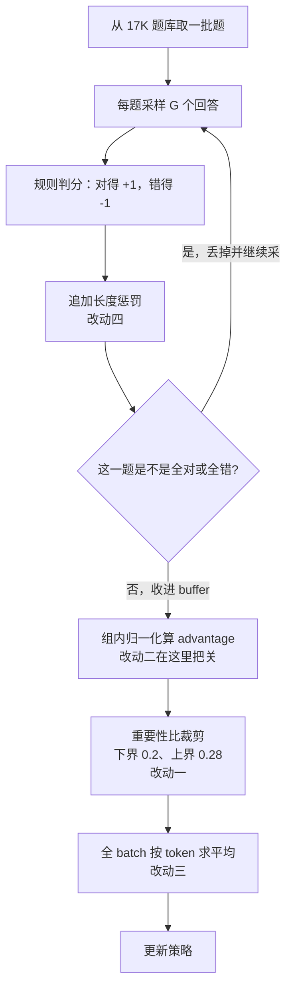

# DAPO：naive GRPO 掉的那 20 分，藏在四个默认设置里

<!-- release-date: 2025-03-17 -->

> 本文依据 ByteDance Seed 与清华大学 AIR 等机构发布的 **DAPO: An Open-Source LLM Reinforcement Learning System at Scale**，即 arXiv:2503.14476v2、封面日期 2025-03-17、共 16 页的版本。页码均指 PDF 本身的页码。截至 2026-09-05 核验，arXiv 当前最新版本仍是 v2（2025-05-20 提交），与本地原件一致。文中会明确区分「论文写了什么」「本文如何解释它」「哪些是外部资料补充」。

## 读之前需要的最少背景

这篇论文只讲一件事：怎么把一个**基座模型**用强化学习（Reinforcement Learning，RL）训成会长篇推理的模型，以及在这条路上有哪些默认做法是错的。

**DAPO 的全称是 Decoupled Clip and Dynamic sAmpling Policy Optimization**，可以译作「解耦裁剪与动态采样策略优化」。这个名字直接点了两项最主要的改动：把裁剪的上下界解耦，以及动态地决定一个 batch 里该留哪些题。（论文在摘要、引言、Algorithm 1 和结论里都写 Decoupled；只有第 3 节开头写成了 Decouple，少一个 d，PDF p. 1、2、4、7、10。搜论文原文时要注意这个不一致。）

它建立在 GRPO 之上。**组相对策略优化（Group Relative Policy Optimization，GRPO）** 的基础机制——为什么不训练 value model、组内归一化怎么算 advantage、重要性比和裁剪各起什么作用——在本站 DeepSeek-R1 篇里已经完整讲过，这里不再重复。

本文只需要你记住 GRPO 的五个动作：

1. 对同一道题采样 $G$ 个回答；
2. 用规则给每个回答判分；
3. 用组内均值和标准差把分数变成 advantage；
4. 用新旧策略的概率比乘 advantage，并做裁剪；
5. 把所有 token 的结果聚合成一个 loss，更新模型。

**DAPO 动的就是第 2、3、4、5 步，一步没漏，但一步也没改动作本身。** 它改的全是每一步里那个「顺手就那么写了」的默认选项。

## 一句话先说清

同一个 Qwen2.5-32B 基座、同一批数学题、同一个规则验证器，naive GRPO 在 AIME 2024 上只拿到 30 分，DAPO 拿到 50 分（PDF p. 9，Table 1）。

中间这 20 分，不是因为换了更聪明的算法，而是因为四个默认设置被逐个换掉：

| 默认设置 | 它悄悄做了什么 |
|---|---|
| 裁剪上下界用同一个 $\varepsilon$ | 让 token 能涨多少，取决于它现在有多大概率 |
| 全对和全错的题照常留在 batch 里 | 让一半以上的算力算出恒为零的梯度 |
| loss 先在句内平均，再在句间平均 | 让一个 token 值多少梯度，取决于它碰巧待在多长的回答里 |
| 超出长度上限的回答直接记负分 | 让「推理有没有错」和「有没有写超」这两件事混成同一个信号 |

把这四行连起来看，本文的判断是：

> **这四处的共同病根，是让一个与「这个 token 该不该被鼓励」无关的量，偷偷决定了梯度的权重或奖励的正负。**

前三处扭曲的是梯度权重，第四处污染的是奖励信号。DAPO 的四项改动，本质上就是把这四个无关变量从公式里拆出去。

这是本文对论文的归纳，论文自己没有用这一句话概括；但它的四个小节确实是按「先指认一个具体失效，再改一个具体位置」写的。

## DAPO 到底动了哪几刀

先看它最终优化的目标（PDF p. 6，式 12）。为了不让上下标压垮阅读，先定义一个中间量：单个 token 的裁剪项

$$
\ell_{i,t}=\min\Big(r_{i,t}(\theta)\hat A_{i,t},\ \operatorname{clip}\big(r_{i,t}(\theta),\,1-\varepsilon_{\text{low}},\,1+\varepsilon_{\text{high}}\big)\hat A_{i,t}\Big)
$$

其中

$$
r_{i,t}(\theta)=\frac{\pi_\theta(o_{i,t}\mid q,o_{i,<t})}{\pi_{\theta_{\text{old}}}(o_{i,t}\mid q,o_{i,<t})},
\qquad
\hat A_{i,t}=\frac{R_i-\operatorname{mean}(\{R_i\}_{i=1}^{G})}{\operatorname{std}(\{R_i\}_{i=1}^{G})}
$$

- $q$ 是题目，$o_i$ 是第 $i$ 个回答，$o_{i,t}$ 是这个回答的第 $t$ 个 token；
- $r_{i,t}$ 是重要性比，衡量新策略比旧策略多偏爱这个 token 多少；
- $\hat A_{i,t}$ 是 advantage，同一个回答里所有 token 共用一个值，由组内归一化得到（PDF p. 4，式 9）。

DAPO 的完整目标是：

$$
J_{\text{DAPO}}(\theta)=\mathbb E\left[\frac{1}{\sum_{i=1}^{G}|o_i|}\sum_{i=1}^{G}\sum_{t=1}^{|o_i|}\ell_{i,t}\right]
\quad\text{s.t.}\quad
0<\big|\{o_i\ :\ o_i\ \text{答对}\}\big|<G
$$

对照 GRPO 的目标（PDF p. 3，式 5），一共有四处不同，外加一处被写在预备知识里的删除：

| # | 位置 | GRPO 的默认 | DAPO 改成 | PDF 页 |
|---|---|---|---|---|
| 1 | 裁剪区间 | 上下界共用一个 $\varepsilon$ | 拆成 $\varepsilon_{\text{low}}$ 与 $\varepsilon_{\text{high}}$，只调高上界 | p. 5，式 10 |
| 2 | batch 组成 | 采到什么用什么 | 加一条约束：一题里答对的个数必须严格在 0 和 $G$ 之间 | p. 5，式 11 |
| 3 | loss 分母 | 先在句内按 token 平均，再在句间平均 | 全 batch 所有 token 一起平均 | p. 6，式 12 |
| 4 | 奖励 | 只有对错 $\pm1$ | 追加一个长度惩罚项 | p. 7，式 13 |
| 5 | KL 项 | 目标里带一项 KL 惩罚 | 整项删掉 | p. 3，2.3 节 |

下面把每一处走完一条完整因果链。

一轮训练循环里，这几刀落在这些位置：

这是机制示意图，不是实测时间轴，根据 PDF p. 7 的 Algorithm 1 与式 8/11/12/13 重画。图中的 0.2 与 0.28 是论文实际采用的取值（PDF p. 8）。

## 改动一：Clip-Higher —— 因为裁剪的天花板是乘出来的

### 病症：熵坍缩

作者跑 naive PPO 或 GRPO 时看到一个现象：策略的**熵（entropy）** 随训练迅速下降，同一组采样出的回答几乎变成同一句话（PDF p. 4）。

熵在这里就是「模型下一个词有多犹豫」。熵高，说明它在好几个候选之间摇摆；熵低，说明它几乎只认一个词。

熵掉到接近 0 会出什么问题？RL 只能从模型自己采样出来的东西里学。如果 16 个回答都一样，那这一组里就没有「谁比谁好」的信息可比，advantage 全部趋近于 0，训练就停在原地了。论文把这叫做「早熟的确定性策略」，会阻碍后续的规模扩展（PDF p. 4）。

Figure 2b（PDF p. 3）把这个过程画得很直白：不开 Clip-Higher 的那条曲线，熵从约 0.7 一路掉到接近 0，大约 1000 步就到底，之后再没起来；开了 Clip-Higher 的那条稳定在 0.4–0.5 之间，末尾还略有回升。对应地，Figure 2a 里前者的 AIME 分数停在 0.20–0.25 一带，后者爬到 0.35–0.40 一带。（曲线数值是本文按图读出的近似值，论文正文没有给这两条曲线的具体数字。）

### 诊断：裁剪的上界对不同概率的 token 完全不公平

PPO 的裁剪本来是为了限制信任域，别让一步更新走太远。但作者指出一个细节：**这个限制是乘法形式的。**

当 advantage 为正（系统想提高这个 token 的概率）时，目标函数在 $r_{i,t}>1+\varepsilon$ 之后就不再给奖励。翻译成概率就是

$$
\pi_\theta(o_{i,t})\ \le\ (1+\varepsilon)\cdot\pi_{\theta_{\text{old}}}(o_{i,t})
$$

所以一次更新里这个 token 最多能多拿到的概率是

$$
\Delta_{\max}=\varepsilon\cdot\pi_{\theta_{\text{old}}}(o_{i,t})
$$

**能涨多少，正比于它现在已经有多少。** 论文举的例子（PDF p. 4）：$\varepsilon=0.2$ 时，

- 旧概率 0.01 的 token，天花板是 0.012；
- 旧概率 0.9 的 token，天花板是 1.08。

第二个数字大于 1，意味着对高概率 token 来说，这个上界**根本不起作用**——它想涨到 0.999 都没人拦。而那个 0.01 的 token，一步最多只能挪 0.002。

于是裁剪变成了一个单向的筛子：只卡住罕见的探索型 token，放行常见的利用型 token。反复几千步之后，罕见选项被系统性地压下去，熵自然坍缩。

作者还给了一条经验证据：被上界裁掉的那些 token，平均概率本身就很低，$\pi_\theta<0.2$（PDF p. 4，Figure 3a）。也就是说，撞上天花板的确实主要是低概率 token，而不是高概率 token。

### 改法与代价

把上下界解耦（PDF p. 5，式 10），只调高上界：实际取 $\varepsilon_{\text{low}}=0.2$、$\varepsilon_{\text{high}}=0.28$（PDF p. 8）。

对那个 0.01 的 token，$\Delta_{\max}$ 从 0.002 变成 0.0028，多了 40%。绝对值仍然很小，但它每一步都在生效，几千步累积下来足以把熵托住。（这个 40% 是本文按上面公式算出来的，论文只给了 $\varepsilon=0.2$ 那组例子。）

**为什么不把下界也调大？** 论文说得很明确：调大 $\varepsilon_{\text{low}}$ 会把这些 token 的概率压到 0，导致采样空间坍缩（PDF p. 5）。理由是对称的——下界 $1-\varepsilon_{\text{low}}$ 限制的是一步能把概率**压低**多少，$\varepsilon_{\text{low}}=0.2$ 意味着一次最多压到原来的 0.8 倍；如果放宽到接近 1，一步就能把一个 token 直接打到接近 0，再也采不出来了。

所以 Clip-Higher 的名字其实很准确：它只抬高上界，不碰下界，是一个刻意的非对称设计。

**代价**：熵不是越高越好。论文在训练动态一节里承认，过高的熵会带来过度探索，表现为胡言乱语和重复生成（PDF p. 9–10）。$\varepsilon_{\text{high}}=0.28$ 这个值论文没有给出扫描曲线，只说它「有效平衡了探索与利用」（PDF p. 8）。换模型、换任务时这个数字大概率要重调。

**可迁移的部分**：任何形如「按当前值的百分比设限」的机制，都会对小值特别苛刻。学习率裁剪、梯度裁剪、采样温度上限，遇到长尾时都值得回头问一句：这个限制是加法的还是乘法的？

## 改动二：动态采样 —— 因为整组答对的题不产生任何梯度

### 病症：batch 里真正有效的题越来越少

GRPO 的 advantage 是组内归一化算出来的：

$$
\hat A_{i,t}=\frac{R_i-\operatorname{mean}(\{R_i\}_{i=1}^{G})}{\operatorname{std}(\{R_i\}_{i=1}^{G})}
$$

如果一道题的 $G$ 个回答**全对**，它们拿到完全相同的奖励，那么每个 $R_i$ 都等于组内均值，分子恒为 0。论文的结论是：这一组的 advantage 是 0，策略梯度也是 0（PDF p. 5）。全错的组同理。

（严格说分母的标准差此时也是 0，实现里通常靠一个极小的常数兜底；论文没有讨论这个细节，只给出「advantage 为零」的结论。）

这本身不算错，问题在于它的**动态**：模型越训越强，全对的题就越来越多。Figure 3b（PDF p. 5）画的正是这条曲线——「avg@32 = 100% 的样本占比」从 0 一路涨到 0.5–0.6 附近，横轴大约 9000 步。（占比数值是本文按图读出的近似值。）

也就是说，训到后期，**一个 batch 里有一半以上的题在贡献恒为零的梯度**。

后果不只是浪费算力。论文的说法是：有效 prompt 数持续下降，会缩小 batch 梯度的量级、放大它对噪声的敏感度，最终增大梯度方差、削弱训练信号（PDF p. 5）。

用一个类比：一次模拟考 512 道题，其中 300 道全班都做对了。这 300 道题对「谁需要补哪里」没有任何信息量，剩下 212 道题要独自承担全部教学信号——相当于样本量悄悄缩水了六成。

### 改法

**过采样并过滤**：一直采样，直到 batch 被「正确率既不是 0 也不是 1」的题填满（PDF p. 5，式 11）。约束写成

$$
0<\big|\{o_i\ :\ o_i\ \text{答对}\}\big|<G
$$

读法是：这一题的 $G$ 个回答里，答对的个数必须严格大于 0 且严格小于 $G$。

注意这个约束在式 8、式 10、式 11、式 12 里都挂着，是 DAPO 目标函数的一部分，不是训练脚本里的一个可选开关。

### 它的成本没有想象中大

直觉上，「不够就再采」会拖慢训练。论文给了两条反驳：

1. 如果 RL 系统是同步的、生成阶段没有做流水线，那么一轮生成的耗时基本由**长尾样本**决定（PDF p. 6）。也就是说，一批里最慢的那几条回答决定了这一轮多久结束；顺手多采一些短的，边际成本很低。
2. Figure 6（PDF p. 8）显示，开了动态采样反而更快达到同样的分数。

Figure 6 值得仔细看，因为它是这项改动最直接的证据：图上有一条水平虚线画在 AIME avg@32 约 0.43 处，两条竖虚线分别标出两条曲线首次触到这个水平的位置——开动态采样的紫线大约在 2300 步，不开的青线大约在 6000 步。（虚线位置是本文按图读出的近似值，论文正文没有给这两个步数。）

论文由此下的结论是：虽然采样实例数增加了，模型的收敛时间反而缩短，因为需要的训练步数更少（PDF p. 9）。

**这里必须留一个问号**：Figure 6 的横轴是步数，不是墙钟时间。论文说「整体训练时间没有显著影响」，但**全文没有给出任何墙钟时间、GPU 数量或成本数字**。所以「更快」这个结论在步数维度上有图支持，在时间维度上只有作者的定性陈述。

**可迁移的部分**：这是一个很干净的通用模式——先问「我这一批数据里，有多少条的梯度恒为零」。对比学习里全部负样本都太容易、排序模型里同分样本对、课程学习里过难过易的题，都是同一类问题。零梯度样本不会报错，只会安静地稀释你的有效 batch size。

## 改动三：token 级损失 —— 因为一个 token 值多少，不该由它待在多长的回答里决定

### 病症：长回答被稀释，短回答被放大

GRPO 在样本级聚合 loss：先在每个回答**内部**按 token 求平均，再把各个回答的结果平均起来（PDF p. 3）。论文在预备知识里就特意点出了这一点，并预告第 3.3 节会讨论它。

把两种写法的**单个 token 权重**摆在一起，差别一眼可见。

样本级（GRPO，PDF p. 3，式 5）：

$$
w^{\text{sample}}_{i,t}=\frac{1}{G}\cdot\frac{1}{|o_i|}
$$

token 级（DAPO，PDF p. 6，式 12）：

$$
w^{\text{token}}_{i,t}=\frac{1}{\sum_{j=1}^{G}|o_j|}
$$

第一个式子里有 $|o_i|$，第二个式子里没有。这就是全部区别。

举个极端一点的例子（本文构造，用于说明量级）。假设一组只有两个回答，一条 100 token，一条 10000 token：

- 样本级：两条各占权重 $1/2$。短回答的每个 token 权重是 $1/200$，长回答的每个 token 权重是 $1/20000$。**同一个 token，放在长回答里只值短回答里的百分之一。**
- token 级：全部 10100 个 token 权重都是 $1/10100$。长回答自然占了约 99% 的梯度，因为它本来就是 99% 的内容。

### 它造成的两个具体后果

论文指出的不是抽象的「不公平」，而是两个方向相反的实际损害（PDF p. 6）：

1. **好的长回答学不进去**。一条写得很好的长推理，里面每个推理步骤的梯度权重都被 $1/|o_i|$ 压扁了，模型很难从中学到推理模式。
2. **坏的长回答罚不下去**。过长的样本经常带有胡言乱语和重复词；正因为长，这些坏 pattern 的权重同样被压扁，惩罚不到位。

第二条是关键。它形成一个正反馈：写得越长 → 每个 token 被罚得越轻 → 越倾向于写更长 → 熵和长度一起失控。

Figure 4（PDF p. 6）是这条反馈环的实测证据，而且两张子图讲的是同一件事：

- Figure 4a（熵）：不用 token 级 loss 的曲线在 4000 步之后急剧抬升，冲到 3.0 以上；用了 token 级 loss 的曲线缓慢爬到约 1.0，一路平稳。
- Figure 4b（平均回答长度）：不用 token 级 loss 的曲线在 2000–2500 步冲到 4000 以上的尖峰，随后掉头下滑；用了的那条平缓爬升，到 7000–8000 步才到 3000 附近。

（数值是本文按图读出的近似值；论文正文只说这会导致熵和长度的「不健康增长」，没有给具体数字。）

注意读图的顺序：不是「长度低就好」。到了后期，用 token 级 loss 的那条曲线长度反而更高。真正的差别在**形状**——一条是先暴涨再崩，一条是稳定爬升。论文自己也在训练动态一节强调，长度要和验证集准确率一起看，才能判断实验是不是在恶化（PDF p. 9）。

### 收益、代价和一个诚实的数字

改法就是换分母，实现成本几乎为零。

但消融表给出的数字很朴素：加上 token 级 loss，AIME 从 41 涨到 42（PDF p. 9，Table 1）。**这是消融表里加分最少的一行。**

论文自己也没有回避这一点：它承认这项改动带来的性能提升较少，但认为它增强了训练稳定性，并让长度的增长更健康（PDF p. 9）。

这个说法值得单独记住。它说明这项改动的价值不在最终分数，而在**它让别的改动能一直跑下去**。Figure 4 里不用 token 级 loss 的两条曲线都在 5000 步附近就断了，用了的跑到 9000 步——图上的横轴长度本身就是一种结论。

**可迁移的部分**：任何做变长序列聚合的地方，都要显式回答一句「我的归一化单位是样本还是元素」。序列标注的 loss、检索模型的文档打分、日志异常检测的窗口平均，都藏着同一个选择。它通常不会让代码报错，只会让长样本静悄悄地失去话语权。

## 改动四：超长奖励整形 —— 因为「写超了」不等于「想错了」

### 病症：截断把两件事混成了一个信号

RL 训练要给生成设一个长度上限，超出的直接截断。默认做法是给被截断的样本记一个惩罚性的负分。

论文指出这会引入奖励噪声：一段**推理本身是对的**回答，可能仅仅因为太长就被判负分。这会让模型对「我的推理过程到底对不对」这件事产生困惑（PDF p. 7）。

用一个类比：考试铃响时你正在写最后一步，卷子被收走。如果阅卷老师因此判你「解法错误」，你下次修正的可能是解法，而不是速度——你被纠正到了错误的方向上。

### 论文分两步处理

**第一步是诊断，不是方案。** 作者先做 Overlong Filtering（超长过滤）：直接把被截断样本的 loss 屏蔽掉，让它们完全不参与更新（PDF p. 7）。

这一步的目的是验证「噪声假说」——如果屏蔽掉这些样本就能稳住训练，那问题确实出在它们的奖励上。

Figure 5（PDF p. 7）的答案非常干脆，而且这张图的图例配色和 Figure 2、Figure 4 是**反的**（这里紫线是「不开过滤」，青线是「开过滤」），读图时容易看反：

- Figure 5b（熵）：开了过滤的曲线全程贴着 0 附近平稳。不开过滤的曲线在 3500 步之前也很平静，之后突然炸开，冲到接近 5，并在 1–4 之间剧烈震荡直到实验结束。
- Figure 5a（AIME）：开了过滤的曲线在中段明显更高也更平滑，峰值约 0.36；不开过滤的曲线更抖，中段大多在 0.16–0.27 之间，要到后段才出现一次约 0.30 的尖峰。

（数值与配色是本文放大原图后核对的；论文正文只说过滤显著稳定了训练并提升了性能，没有给具体数字。）

Figure 5b 那个「前 3500 步毫无征兆、之后突然爆炸」的形状，是这整篇论文里最有教育意义的一张图：**奖励噪声可以潜伏很久。** 如果只跑 2000 步做对比实验，你会得出「加不加过滤没区别」的结论。

**第二步才是方案：Soft Overlong Punishment（软性超长惩罚）**，一个感知长度的惩罚（PDF p. 7，式 13）。

它的思路是：不要在长度上限处设一堵墙，而是提前铺一段缓冲带，越接近上限扣得越多。

$$
R_{\text{length}}(y)=
\begin{cases}
0, & |y|\le L_{\max}-L_{\text{cache}}\\[4pt]
\dfrac{(L_{\max}-L_{\text{cache}})-|y|}{L_{\text{cache}}}, & L_{\max}-L_{\text{cache}}<|y|\le L_{\max}\\[4pt]
-1, & L_{\max}<|y|
\end{cases}
$$

- $|y|$ 是这次生成的实际 token 数；
- $L_{\max}$ 是硬上限；
- $L_{\text{cache}}$ 是缓冲区宽度；
- 中间那一段的分子是负数，除以 $L_{\text{cache}}$ 后从 0 线性滑到 $-1$。

**这里的取值容易读错，值得拆开对一遍。** 论文的配置写的是：期望最大长度 16,384 token，另外分配 4,096 token 作为软惩罚缓冲，因此生成的最大 token 数设为 20,480（PDF p. 8）。

代回式 13，就是 $L_{\max}=20{,}480$、$L_{\text{cache}}=4{,}096$、$L_{\max}-L_{\text{cache}}=16{,}384$：

| 回答长度 | 长度惩罚 |
|---|---|
| $\le$ 16,384 | 0，完全不罚 |
| 16,384 → 20,480 | 从 0 线性滑到 $-1$ |
| $>$ 20,480 | $-1$（生成被硬截断，实际到不了这里） |

验算一下：$|y|=16{,}384$ 时分子是 0；$|y|=20{,}480$ 时分子是 $-4096$，除以 4096 恰好是 $-1$。两个端点都对得上。

这个惩罚是**加在**原本的规则正确性奖励上的（PDF p. 7）。规则奖励本身是答对 $+1$、答错 $-1$（PDF p. 4，式 7）。所以合起来看：

- 一条答对、长度 18,000 的回答，大约拿 $1-0.4=0.6$；
- 一条答错、长度很短的回答，拿 $-1$。

也就是说，**长度惩罚永远压不过对错**。写超了的正确答案仍然比写得干净的错误答案得分高。这是本文的推算，论文没有明说，但式 7 与式 13 的取值范围决定了这个性质。

### 一个论文没有讲清楚的地方

Table 1（PDF p. 9）把 Overlong Filtering 和 Soft Overlong Punishment 列成**两行累加**的结果（30 → 36 → … → 41）。但正文把 Overlong Filtering 描述成一次调查性的实验，Algorithm 1（PDF p. 7）里也没有提到它。

所以：**最终的 DAPO 配置里，超长样本的 loss 到底还屏不屏蔽？论文没有明确说。** 这一点会实际影响复现——如果两者同时开启，式 13 第三行的 $-1$ 分支就永远不会真正进入梯度。这是本文核对后留下的疑问，不是论文的结论。

**可迁移的部分**：只要你的系统里有「资源上限」这类硬边界（超时、超长、超预算、限流），就要检查它有没有把「失败」和「触到边界」写成同一个信号。这两件事需要分开记录，否则模型或下游系统学到的会是错误的因果。

## 改动五：把 KL 项删掉

这项被论文放在预备知识里（PDF p. 3，2.3 节），没算进「四项关键技术」，但它确实改变了目标函数——对比 GRPO 的式 5 和 DAPO 的式 8 就能看到，$-\beta D_{\mathrm{KL}}(\pi_\theta\|\pi_{\text{ref}})$ 整项不见了。

**KL 项本来是干什么的？** 它衡量当前策略和一个冻结的参考策略差多远，用来防止模型在对齐过程中跑得太偏。在 RLHF 场景里这很合理：目标是调整行为，不是重造一个模型。

**为什么长思维链场景可以删？** 论文的理由只有一句：训练长 CoT 推理模型时，模型分布**本来就应该**大幅偏离初始模型，所以这个限制没有必要（PDF p. 3）。

顺带的好处是不用再跑 reference model 的前向，也不用为它占显存——不过论文没有把这条写成收益，本文也不替它加。

**边界**：这条只在「你确实希望模型大幅改变行为，并且有可靠的规则验证器兜底」时成立。奖励一旦不可靠，删掉 KL 就等于拆掉最后一道防止 reward hacking 的护栏。论文用的是规则奖励（PDF p. 4，2.4 节），本身就是为了规避奖励模型被 hack 的问题，两个选择是配套的。

## 数据集：为什么非要把答案改成整数

DAPO 一起开源了 **DAPO-Math-17K**：17K 道题，每道题的答案都是一个整数（PDF p. 8）。

「答案是整数」听起来像个无关紧要的细节，其实是整个 recipe 能成立的前提。

**问题**：数学题的答案格式五花八门——表达式、公式、数字都有，很难写出一套覆盖全面的解析规则（PDF p. 8）。而 DAPO 的奖励完全靠规则判等（式 7）。**解析器出错，就等于奖励说谎。**

**做法**：受 AIME 启发，把答案统一改造成整数。论文给的例子是：若原答案形如 $\frac{a+\sqrt b}{c}$，就让大模型改写题面，把要求的答案变成 $a+b+c$（PDF p. 8）。

附录 A（PDF p. 15）给了完整流程：用思维链配四个明确步骤——抽取答案格式、改写题面、求解改写后的题、给出整数答案——每一步都配少样本示例或详细指引。它展示的样例是原答案 $11-2\sqrt 6$，改写成「答案形如 $k-m\sqrt n$，请求 $k+m+n$」，答案变成 19。

数据来源是网页抓取加人工标注，取自公开网页和官方竞赛主页（PDF p. 8）。

**这里的取舍要说清楚**：把答案变成整数，是用**题目的信息量**换**奖励的可靠性**。改写后的题不再检验「你能不能写出这个根式」，只检验「你能不能算到那一步并做一次加法」。对训练推理能力来说这大概率无害，但它确实让这批题偏离了原始竞赛题的形态。论文没有讨论这个代价，也没有报告改写过程本身的错误率——只说「大多数情况下，改写的格式和质量令人满意」（PDF p. 15）。

**可迁移的部分**：这是一条硬经验——**在设计 RL 之前先设计验证器**。如果验证器不可靠，前面四项算法改动一项都救不回来。有时候改造数据比改造判分规则便宜得多。

## 实验：什么被证明了，什么没有

### 训练设置（PDF p. 8）

| 项目 | 取值 |
|---|---|
| 基座模型 | Qwen2.5-32B（base，不是 instruct） |
| 框架 | verl |
| 基线 | naive GRPO，组内奖励归一化 |
| 优化器 | AdamW，恒定学习率 $1\times10^{-6}$，前 20 个 rollout step 线性 warm-up |
| Rollout | 每批 512 道题，每题 16 个回答 |
| 训练 | mini-batch 512，即每个 rollout step 做 16 次梯度更新 |
| 长度 | 期望上限 16,384 + 缓冲 4,096 = 最大生成 20,480 |
| 裁剪 | $\varepsilon_{\text{low}}=0.2$，$\varepsilon_{\text{high}}=0.28$ |
| 评测 | AIME 测试集重复 32 次取 avg@32；temperature 1.0，top-p 0.7 |

把这几个数字乘一乘会得到一个有用的直觉（以下是本文的推算）：Figure 1 的横轴标注是「梯度更新步数」（PDF p. 1），DAPO 的终点星号落在 5000–5500 步之间；按每个 rollout step 对应 16 次更新换算，大约是 330 轮 rollout。每轮 512 道题，合计约 17 万次抽题——而题库只有 17K 道，**平均每道题被反复训练了约 10 遍**。

这正好解释了 Figure 3b：训到后期，超过一半的题变成「32 次采样全对」，一点也不奇怪。动态采样要解决的，本质上是一个小题库被反复消耗后的必然结果。（实际抽题次数还会更多，因为被过滤掉的题也消耗了采样。）

### 主结果与消融（PDF p. 9，Table 1）

| 配置 | AIME 2024 avg@32 | 相对上一行 |
|---|---:|---:|
| DeepSeek-R1-Zero-Qwen-32B（对照） | 47 | — |
| Naive GRPO | 30 | — |
| ＋ Overlong Filtering | 36 | +6 |
| ＋ Clip-Higher | 38 | +2 |
| ＋ Soft Overlong Punishment | 41 | +3 |
| ＋ Token-level Loss | 42 | +1 |
| ＋ Dynamic Sampling（完整 DAPO） | 50 | +8 |

**读这张表必须注意四件事，否则很容易高估它的归因强度：**

1. **这是累加消融，不是留一法。** 每一行都是在上一行基础上再加一项，所以「+2」只说明「在已经有超长过滤的前提下，再加 Clip-Higher 值 2 分」。换一个叠加顺序，同样的技术可能得到完全不同的分数。
2. **顺序不是唯一的。** 表里的顺序（超长过滤 → Clip-Higher → 软性超长惩罚 → token 级 loss → 动态采样）既不同于论文正文的小节顺序（3.1 Clip-Higher → 3.2 动态采样 → 3.3 token 级 loss → 3.4 超长整形），也不同于引言里列举四项技术的顺序（PDF p. 2）。论文没有解释为什么按这个顺序叠加。
3. **一个基座、一个任务、一个 benchmark、没有报告随机种子数。** 全部实验都在 Qwen2.5-32B 上做数学题，用 AIME 2024 评测。论文说方法「可以很容易迁移到其他任务」（PDF p. 8），但**这句话没有任何实验支持**。
4. **动态采样那 8 分特别大，但它也是最后一行。** 一个改动放在最后，往往能吃掉前面所有改动累积起来的空间。这不是说它不重要，而是说这 8 分不能直接理解为「动态采样单独值 8 分」。

对照组 DeepSeek-R1-Zero-Qwen-32B 的 47 分，论文引自 DeepSeek-R1 报告（PDF p. 13，参考文献 [2]），不是作者自己复现的。

### 「50% 训练步数」的准确含义

Figure 1（PDF p. 1）里，DAPO 的 avg@32 曲线在 5000–5500 步之间到达 50 并标了星号，而 DeepSeek-R1-Zero-Qwen-32B 被画成 10000 步处的一个点（47）。所以「用 50% 的训练步数超过它」是个约数。

同一张图还画了另外两条曲线：pass@32 最高，cons@32 居中，avg@32 最低。论文正文**没有定义** pass@32 和 cons@32，只在图例里出现。按该领域通行含义，pass@32 是 32 次采样里至少对一次（能力上限），cons@32 是 32 次投票取多数的正确率——这一句属于外部补充，不是论文原文。

需要保留的疑问：DAPO 自己的「步数」明确是梯度更新步数（图注写了），但 DeepSeek 那个 10000 步是不是同一口径，论文没有说明。跨系统比步数，本来就要先对齐一步是什么。

### 消融图之间并不来自同一次运行

这是逐页看图才会发现的事。各张图的横轴长度差别很大：

| 图 | 内容 | 横轴大致范围 |
|---|---|---|
| Figure 2、3a | Clip-Higher | 约 3000 步 |
| Figure 3b | 全对样本占比 | 约 9000 步 |
| Figure 4 | token 级 loss | 约 9000 步 |
| Figure 5 | 超长过滤 | 约 5300 步 |
| Figure 6 | 动态采样 | 约 9000 步 |
| Figure 7 | DAPO 训练动态 | 约 5300 步 |

这说明这些对比来自**不同的实验运行**，论文没有说明它们之间其他设置是否完全一致，也没有说明每张图对应 Table 1 的哪一行配置。所以这些图适合用来理解**机制**（某个现象长什么样），不适合当作彼此可比的**定量证据**。

## 作者真正在盯的四条曲线

第 4.3 节（PDF p. 9–10）是这篇论文里最像经验之谈的部分。作者先说了一句很实在的话：RL on LLM 是个复杂系统工程，子系统互相牵连，初始条件的微小变化会被迭代放大；即使分析得很仔细、预期很合理，实际结果也经常和预想不一样（PDF p. 9）。

所以他们靠四条曲线来判断实验有没有走坏（Figure 7，PDF p. 10）：

**1. 回答长度**（Figure 7a）。长度增长给模型更大的探索空间，让更复杂的推理行为有机会被采样到并强化。但论文明确提醒：长度**不总是单调上升**，会有相当长时间停滞甚至下降（PDF p. 9），DeepSeek-R1 报告里也出现过。所以他们从不单看长度，而是长度配合验证集准确率一起看。图上从约 600 涨到 5300 步时的约 4500，中间确实有明显的平台和回落。

**2. 奖励**（Figure 7b）。从约 $-0.85$ 快速升到 0.2 附近，之后缓慢爬到 0.35–0.4。论文说奖励曲线通常很稳，说明只要奖励信号可靠，语言模型能稳健地拟合训练集分布。但紧接着是一句更重要的话：**训练集最终奖励和验证集准确率往往几乎不相关，这说明存在对训练集的过拟合**（PDF p. 9）。

这一条被很多人忽略。它意味着**奖励曲线漂亮不等于模型变强**——它只能证明训练没崩，不能证明能力提升。

**3. 熵**（Figure 7c）。论文的判据是双向的：熵太低说明分布过尖、失去探索能力；熵太高则往往伴随过度探索，表现为胡言乱语和重复生成（PDF p. 9–10）。他们的经验是：**让熵保持缓慢上升趋势**有利于性能提升（PDF p. 10）。

Figure 7c 的形状正好印证这句话：熵从约 0.71 掉到 2000–2500 步时的最低点约 0.33，之后一路回升到 0.50–0.55。是个 U 形，不是单调线。

**4. 生成概率**（Figure 7d）。它和熵基本是镜像：从约 0.75 升到 2000–2800 步的峰值约 0.86，之后回落到约 0.74。

（Figure 7 的四组数值都是本文按图读出的近似值，论文正文没有列出它们。）

把这四条放在一起，得到的其实是一套**监控方法论**，比任何单项技术都容易迁移：不要只看一个指标；要挑一组互相能交叉验证的指标，其中至少有一个（熵）能提前预警，有一个（验证集准确率）能防止你被训练指标骗。

## Case Study：反思行为是长出来的，不是一开始就有的

第 4.4 节（PDF p. 10）记录了一个观察：训练过程中，模型的推理模式会动态演化。算法不只是强化已有的、有助于解题的模式，还会**逐渐产生一开始完全不存在的全新推理方式**。

具体例子是：训练早期，模型几乎不会回头检查和反思之前的推理步骤；随着训练推进，它表现出明显的反思和回溯行为（PDF p. 10）。

论文给了两个真实片段：

- Table 2（PDF p. 11）是一道四面体体积题。回答写到一半出现了「等一下，让我们用更周全的几何方式重新思考这个二面角」这样的转折，然后换了一条路。
- Table 3（PDF p. 16）是一道容斥原理题。模型算出「拥有全部四样东西的人数」是 54.75，随即意识到人数必须是整数，于是明确说要重新考虑计数方式。

第二个例子尤其干净：模型不是被外部告知答案错了，而是**用问题本身的约束（人数是整数）发现了自己的矛盾**。

**但这里必须把话说到位。** 论文自己写的是：这个观察为「解释 RL 过程中推理能力的涌现」提供了线索，作者把它留给未来研究（PDF p. 10）。

也就是说：

- 这是**观察**，不是因果证明；
- 论文**没有**统计反思行为出现的频率随训练如何变化；
- 论文**没有**说明是哪一项改动导致了这个现象；
- 两个片段是精选样例，不是随机抽样。

所以正确的读法是「训练后期的输出里出现了反思行为」，而不是「DAPO 教会了模型反思」。

## 它怎么支撑基模的训练

这一节需要特别克制，因为论文对此的着墨很少。

**论文明确写了的：**

- DAPO 是一套完整的后训练 RL 系统，把 Qwen2.5-32B 这个**基座模型**直接训成推理模型（PDF p. 8），走的是 R1-Zero 那条不先做 SFT 的路线；
- 实现建立在 **verl** 框架上（PDF p. 2、8），论文的参考文献 [20] 指向 HybridFlow（PDF p. 13）；
- 开源内容包括算法、训练代码和数据集（PDF p. 10–11），作者说这是为了让社区能真正复现工业级的大规模 LLM RL；
- 写论文的直接动机就是复现受阻：他们初次用 GRPO 只拿到 30 分，而 DeepSeek 报的是 47 分，于是判断 R1 报告里省略了关键训练细节（PDF p. 2）。

**论文没有写的：**

- 没有说 DAPO 被用在 ByteDance 任何一个已发布的基座模型上；
- 没有报告在 32B 之外的规模上验证；
- 没有报告在数学之外的任务上验证——「可以很容易迁移到其他任务」（PDF p. 8）是一句预期，不是结果；
- 没有讨论把重要性比放到序列级的做法，那条线见 GSPO 篇。

所以它对基模训练的支撑作用，准确讲是这样的：**它把「用规则可验证的奖励，把一个基座模型练成长思维链推理模型」这条路径上的四个隐藏地雷标了出来，并把踩雷前后的分数差公开了。** 这条路径本身是 R1 走通的（见 DeepSeek-R1 篇），DAPO 补的是 R1 报告没写的那一层实现细节。

它的适用前提也很明确，缺一不可：

1. 奖励必须能用规则可靠判定（所以要把答案改成整数）；
2. 回答足够长，长度差异足够大（所以 token 级归一化才要紧）；
3. 用组内采样估计 advantage（所以「全对」才会导致零梯度）；
4. 训练目标允许模型大幅偏离初始分布（所以 KL 才能删）。

换到对话对齐、多轮 Agent、或者用奖励模型打分的场景，这四条至少有两条不成立，四项改动就不能照搬。

## 关键词回看

- **熵坍缩（entropy collapse）**：策略的输出分布迅速变尖，同组采样几乎相同，RL 失去可比样本。
- **Clip-Higher**：把 PPO 裁剪的上下界拆成 $\varepsilon_{\text{high}}$ 和 $\varepsilon_{\text{low}}$，只调高上界；因为裁剪的天花板正比于旧概率，对低概率 token 特别苛刻。
- **动态采样（Dynamic Sampling）**：丢掉整组全对或全错的题并重新采样，保证 batch 里每道题都有非零梯度。
- **零 advantage 问题**：组内奖励全相同时，归一化后的 advantage 恒为 0，这道题白算。
- **token 级策略梯度损失**：把 loss 的分母从「先句内平均再句间平均」换成「全 batch 所有 token 一起平均」，让 token 权重不再依赖它所在回答的长度。
- **Overlong Filtering（超长过滤）**：屏蔽被截断样本的 loss；论文用它来验证奖励噪声假说。
- **Soft Overlong Punishment（软性超长惩罚）**：在硬上限前留一段 $L_{\text{cache}}$ 宽的缓冲带，惩罚从 0 线性滑到 $-1$，叠加在正确性奖励上。
- **DAPO-Math-17K**：17K 道答案被改写成整数的数学题，目的是让规则判分不出错。
- **avg@32 / pass@32 / cons@32**：同一测试集采样 32 次后的平均正确率 / 至少对一次 / 多数投票正确率。只有 avg@32 在论文正文有定义。
- **verl**：本工作使用的 RL 训练框架，论文参考文献指向 HybridFlow。
- **累加消融**：每行在上一行基础上叠加一项技术；它证明「加上有用」，不证明「单独值多少」。

## 最后的判断

这篇论文的价值不在算法有多新。DAPO 的每一项改动都很小：换个分母、拆个超参、加个过滤、改段奖励。任何一项单独拿出来都不像论文。

它真正提供的是三样东西：

**第一，一份失效清单。** 熵坍缩、零梯度样本堆积、长度稀释梯度、截断污染奖励——这四个失效模式都有明确的图和明确的诊断，而且都不会让程序报错。这类「安静的 bug」正是最难自己发现的。

**第二，一个可复现的起点。** 算法、代码、超参、数据集全部公开，还诚实地写出了 naive GRPO 只有 30 分这个不好看的基线。

**第三，一套监控习惯。** 熵、长度、奖励、生成概率四条曲线怎么配合着看，以及那句「训练奖励和验证准确率几乎不相关」的提醒，比四项技术更容易迁移到别的项目。

它的边界也同样清楚：单一基座、单一任务、单一 benchmark，累加式消融，没有墙钟时间和成本，没有超参扫描，最终配置里超长过滤是否保留没有交代，反思行为的涌现只有观察没有解释。

如果只记一句话，可以记：

> **在 RL 里，先检查有没有哪个与答案质量无关的量，正在决定梯度的权重。它不会报错，只会让你少 20 分。**

## 资料与阅读边界

- 原始依据：本地 `papers/ByteDance/DAPO.pdf`，即 arXiv:2503.14476v2，封面日期 2025-03-17，16 页。
- arXiv 页面：<https://arxiv.org/abs/2503.14476>。提交历史为 v1（2025-03-18）与 v2（2025-05-20），截至 2026-09-05 核验没有更新版本。
- 官方项目页：<https://dapo-sia.github.io/>。
- 官方代码仓库：<https://github.com/BytedTsinghua-SIA/DAPO>。仓库首个 commit 的信息是 `release`，时间为 2025-03-17（UTC），与论文封面日期一致，是本文 `release-date` 的取值依据。
- 训练框架：<https://github.com/volcengine/verl>，论文的参考文献 [20] 指向 HybridFlow（arXiv:2409.19256）。
- 外部补充：官方仓库的 News 记录显示，2025-03 先公开了一个早期版本（不含 token 级 PG loss 与动态采样）的训练记录，AIME 2024 为 44%；2025-05 才更新完整 DAPO 的训练记录与达到 50%+ 的 checkpoint。这个 44 与论文 Table 1 中对应配置的 41 不是同一个数字，说明它们来自不同的运行或不同的检查点。这条只用于补充时间线，不能与论文表格混用。
- 外部补充：pass@32 与 cons@32 的含义按该领域通行定义解释，论文正文没有定义它们。
- 跨篇参考：GRPO 与 PPO 的基础机制、优势估计与 KL 的位置，见 DeepSeek-R1 篇；把重要性比放到序列级的做法，见 GSPO 篇。这两处 DAPO 论文本身都没有展开。
