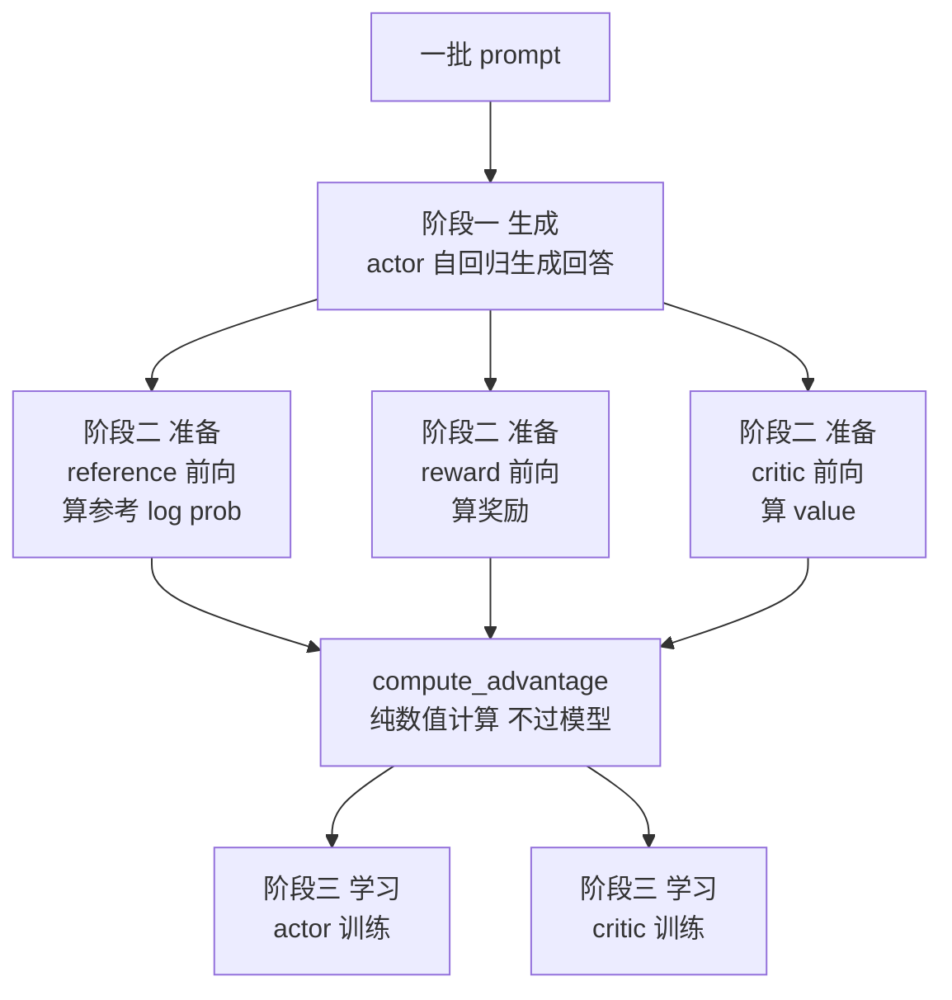
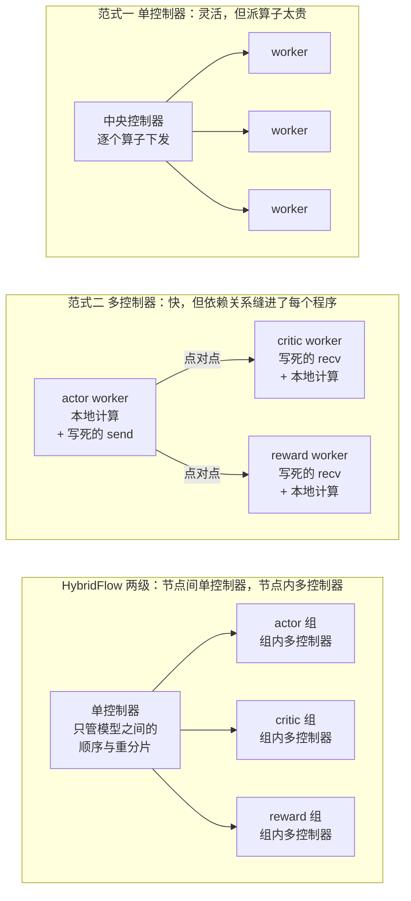
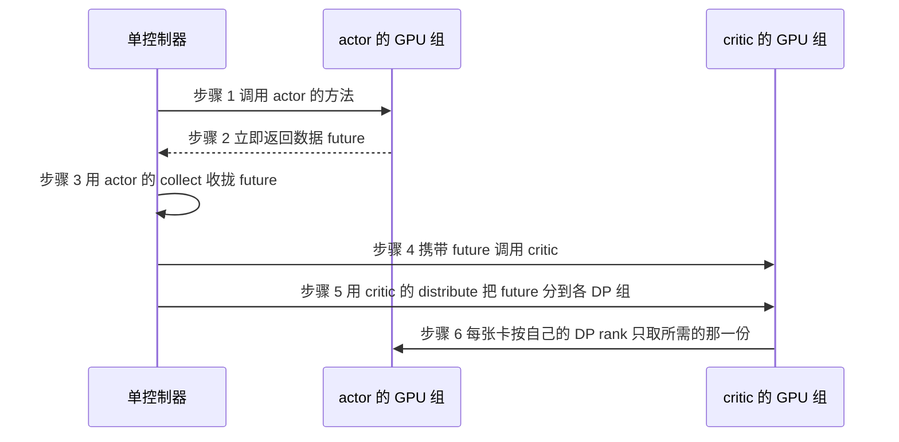
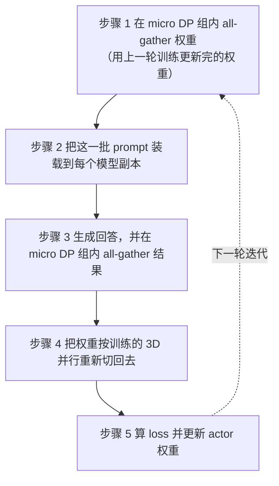
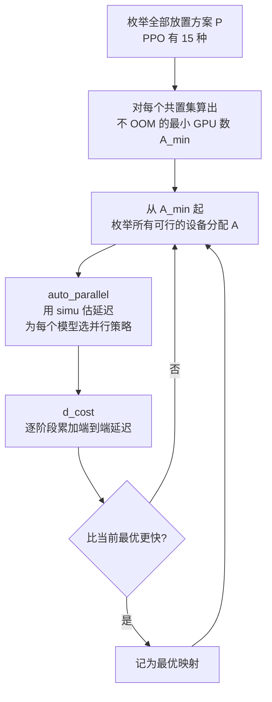

# HybridFlow：改一行 RLHF 算法要动四个模型的代码，问题出在控制权放错了层

<!-- release-date: 2024-09-28 -->

> 本文依据 **HybridFlow: A Flexible and Efficient RLHF Framework**，即 arXiv:2409.19256v2、2024-10-02 提交、共 19 页的 EuroSys '25 版式稿。九位作者中，首位的 Guangming Sheng 与末位的 Chuan Wu 来自香港大学，中间七位来自 ByteDance；论文致谢里写明本工作部分由 ByteDance Research Collaboration Project 与香港 RGC 资助（PDF p. 1、14）。论文没有标注通讯作者。按主要归属方，本站把它放在 ByteDance 目录下。页码均指 PDF 本身的页码。截至 2026-09-06 核验，arXiv 上最新版本仍是 v2，与本地原件一致。
>
> 这是一篇系统论文，不是算法论文，所以没有模型架构和训练 recipe 可讲。它讲的是**承载 RLHF 实验的那套框架**，也就是 verl 的论文。全文会把三件事分开写：**论文明确写了什么**（带页码）、**本文如何解释它**（凡属推算、换算或图上读数都会写明）、**外部资料补充**（会给出链接并标注）。

## 读之前需要的最少背景

这篇论文假设你已经知道 RLHF 大概在干什么。如果不熟，先记住下面这几件事就够了。

**RLHF（Reinforcement Learning from Human Feedback，基于人类反馈的强化学习）** 是把一个已经预训练、又做过监督微调的语言模型继续对齐到人类偏好的训练阶段。以最常用的 PPO 版本为例，它同时要用到**四个**大语言模型（PDF p. 1、3）：

- **actor（行动者）**：正在被训练的那个模型，负责根据 prompt 生成回答；
- **critic（评论者）**：给每个位置估一个「后面还能拿多少分」的值，也要被训练；
- **reference policy（参考策略）**：actor 训练开始前的那份冻结副本，用来约束 actor 别跑太偏；
- **reward model（奖励模型）**：给整条回答打分。critic 和 reward 通常是把语言建模头换成一个标量输出头的模型（PDF p. 3）。

一次 RLHF 迭代分三个阶段（PDF p. 3）：

1. **Generation（生成）**：actor 自回归地把一批 prompt 生成成回答；
2. **Preparation（准备）**：critic、reference、reward 各做**一次前向**，分别算出 value、参考对数概率和奖励；
3. **Training（学习）**：用上面两步产出的数据，用 Adam 更新 actor 和 critic。

还要认识三个词，它们贯穿全文：

- **训练（training）**：一次前向 + 一次反向 + 一次参数更新；
- **推理（inference）**：只做一次前向；
- **生成（generation）**：自回归地做很多次前向，一次吐一个 token。

论文反复强调这三件事的算力性质完全不同（PDF p. 3）。训练和推理是**算力受限**的，生成是**访存受限**的——生成时每步只处理一个 token，GPU 大部分时间在等权重和 KV Cache 从显存搬进来，算力空转。

最后是并行方式的三个字母（PDF p. 3）：

- **DP（Data Parallelism，数据并行）**：把数据切开，每张卡拿一份完整模型算自己那份数据；
- **TP（Tensor Parallelism，张量并行）**：把单个权重矩阵横着或竖着切开，放到多张卡上；
- **PP（Pipeline Parallelism，流水线并行）**：把模型按层切成几段，每段一张卡。

三者一起用就叫 **3D 并行**，论文用 $p\text{-}t\text{-}d$ 三元组表示（PP 段数、TP 分片数、DP 副本数）。另外还有 **ZeRO** 和 **FSDP（Fully Sharded Data Parallel）**，它们属于数据并行的显存优化版本，把优化器状态、梯度和参数逐级切开分散到各卡。

## 一句话先说清

这篇论文要解决的是一个很具体的工程痛点：**在现有的 RLHF 框架里，想把 PPO 换成 Safe-RLHF 或 ReMax，你得去改四个模型各自的分布式程序。**

因为在这些框架里，「actor 生成完把结果发给 critic」这句话不是写在一个地方的。它被拆成了 actor 程序里的 `send`、critic 程序里的 `recv`、以及两边各自的 `broadcast`（PDF p. 4，Figure 2(a)）。数据依赖和分布式计算被缝在了一起。改一条边，四个程序都要动。

HybridFlow 给的答案是把「谁下命令」拆成两级：

> **模型与模型之间，用一个中央控制器指挥；模型内部的成千上万个算子，交给每张卡自己的控制器指挥。**

为什么这样拆合理？论文的理由只有一句，但很有力：**RLHF 的数据流图通常只有几个节点**（PDF p. 5）。中央控制器要发的命令只有「actor 生成」「critic 算 value」这种粒度，一共几条，相对于每个节点内部的分布式计算，调度开销可以忽略。而节点内部动辄几十亿个算子，那里才是绝对不能让中央控制器插手的地方。

论文声称这套设计带来 **1.53×∼20.57×** 的吞吐提升（PDF p. 1、14）。这个区间跨度很大，后面会把它的分母、实验配置和归因逐条拆开——**先记住一点：区间上端的 20.57× 主要来自一个缺了 KV Cache 的对比系统，不能理解成「混合编程模型值 20 倍」**（PDF p. 12）。

论文之外，还有一件事值得先说：它开源出来的实现就是 verl。本站已发布的 [DAPO 解读](/reports/ByteDance/DAPO)里，那套长思维链 RL 实验正是跑在 verl 上的，DAPO 论文的参考文献 [20] 指回的就是这篇。**这一篇讲的是「锅」，DAPO 讲的是「锅里炒什么」。**

## 全景：一次 PPO 迭代到底在跑什么

论文一上来就把 RLHF 抽象成一张**数据流图（dataflow graph）**：有向无环图，节点是一次神经网络计算，边是数据依赖（PDF p. 2）。

传统强化学习也能这么画，但那时候的节点是一个几百 MB 的 CNN 或 MLP。RLHF 把这张图撑爆了两次（PDF p. 2）：

- **每个节点膨胀成一个分布式程序**——它是一个几十上百亿参数的 LLM，要用 TP/PP/DP 跑在几十张卡上；
- **每条边膨胀成多对多组播**——上游模型的输出按上游的并行方式散在几十张卡上，下游模型的并行方式又不一样，得重新切一遍再发过去。论文管这叫**数据重分片（data resharding）**。

先把 PPO 的那张图画出来：



这是根据 PDF p. 3 的 Figure 1(a) 与 p. 19 的 Table 4 重画的**机制示意图**，不是实测时间轴。图中的 `compute_advantage` 在 Figure 1 里没有单独画成节点，但 Table 4 明确把它列为一个「不涉及任何模型前向」的数值计算函数，放进来更容易看清哪些活要花 GPU、哪些不用。

论文用同一张图的方式画了另外两个算法（PDF p. 3，Figure 1）：

| 算法 | 阶段一 | 阶段二 | 阶段三 |
|---|---|---|---|
| PPO | actor 生成 | reference、reward、critic 各一次前向 | actor 训练、critic 训练 |
| Safe-RLHF | actor 生成 | reference、reward、**cost**、critic 各一次前向 | actor 前向算 $\mathcal L_{ptx}$、actor 训练、critic 训练 |
| ReMax | actor 生成**两次** | reward 前向**两次**、reference 前向 | actor 训练（**无 critic**） |

Safe-RLHF 多了一个跟 reward 同构同尺寸的 **cost model**，用来同时拟合偏好和安全标签，还按 PPO-ptx 的做法加了一项预训练损失；ReMax 则多做一次生成用于降方差，并且**彻底去掉了 critic**（PDF p. 3）。

**这三行就是整篇论文的动机。** 它们的差别不在数学，在图的形状：多一个节点、少一个节点、某个节点跑两次。一个好的 RLHF 框架应该让「换算法」等于「换这张图」，而不是等于「重写四个分布式程序」。

## 第一层矛盾：同一张图上的四个模型，没有一套并行策略能同时伺候

论文第 2.3 节把 RLHF 的三个特点摆出来，每一个都在否定「用一套配置跑到底」这个念头。

### 一、四个角色的显存账单完全不同

只做前向的模型和要被训练的模型，显存占用不是一个量级（PDF p. 4）：

| 角色 | 这一轮要做什么 | 显存里必须放什么 | 算力性质 |
|---|---|---|---|
| actor | 生成 + 训练 | 参数、梯度、优化器状态、KV Cache | 生成访存受限，训练算力受限 |
| critic | 推理 + 训练 | 参数、梯度、优化器状态 | 算力受限 |
| reference | 只推理 | 只有参数 | 算力受限 |
| reward | 只推理 | 只有参数 | 算力受限 |

这张表是本文按 PDF p. 3–4 的描述整理的，论文没有列成表。

差距还不止于此。论文特别提到一个现实中很常见的配置：**一个 7B 的小 actor，可以配 70B 的大 critic 和大 reward，因为这样对齐效果更好**（PDF p. 4，引 Anthropic 的 HH 论文）。也就是说，同一张图上的四个模型，参数量可能差十倍，显存结构还完全不同。

结论很直接：**四个角色需要四套并行策略和四套针对性优化**（PDF p. 4）。任何强迫它们统一配置的框架，都在某个模型上浪费资源。

### 二、actor 一个人要演两个角色，而这两个角色的最优并行是反的

这是全篇最核心的一处矛盾，值得慢慢拆。

actor 在数据流图上占两个节点：生成和训练。论文说，这两个节点合起来往往是一次 RLHF 迭代的**大头——在 HybridFlow 上是总时间的 58.9%**（PDF p. 4）。

它们要的并行方式却是相反的：

- **actor 训练是算力受限的**，适合用更大的模型并行（MP）规模，把参数摊到更多卡上，例如把一个 7B 模型切成 8 份放在 8 张卡上（PDF p. 4）；
- **actor 生成是访存受限的**，同样的 MP 规模会让算力大量空转。论文引先前工作说，改成「大 DP + 小 MP」更好，例如把 7B 模型只切成 2 份、复制 4 份放在 8 张卡上（PDF p. 4）。

**为什么生成是访存受限的？** 论文只给了结论和引用（PDF p. 4），这里补一句直觉（本文的解释）：训练时一次前向要处理成千上万个 token，权重从显存搬进来一次，可以摊给很多次乘加；生成时每一步只处理**一个**新 token，同一批权重搬进来只做了一遍很小的矩阵乘。**搬运和计算的比例整个翻转了。** 这时候再把模型切得更碎，只会让每张卡分到的那点计算更不够填满它，同时还多出一轮跨卡通信。

所以「大 DP + 小 MP」的道理是：与其让 8 张卡合力慢吞吞地生成一批，不如让 4 组卡各自生成四分之一批。**并行的维度从「切模型」换成了「切数据」。**

这就出现了一个尴尬局面：**同一份权重，在同一批卡上，两个阶段想要两种切法。** 每次从训练切到生成，权重都要重新分片一遍。

代价有多大？论文给了一个具体数字：**对齐一个 70B 的 actor，每次 RLHF 迭代要在训练和生成之间搬运 140GB 的权重；当两个阶段放在不同设备上时，这一步最多占掉一次迭代时间的 36.4%**（PDF p. 4，数据引自 OpenRLHF）。

140GB 这个数字可以自己验一遍（本文推算）：70B 参数 × 2 字节（BF16）= 140GB。对得上。

所以 actor 的困境是：**不换并行，生成阶段浪费算力；换并行，每轮多搬 140GB。** 这就是第 5 节 3D-HybridEngine 要解决的问题。

### 三、放置方案没有唯一解，而且它随集群规模变

**放置（placement）** 指的是把四个模型分别摆到哪些 GPU 上。论文用一张图讲清了它的取舍（PDF p. 4，Figure 3）：

- 放在**不同**卡上的模型，只要没有数据依赖就能并行跑；
- 放在**同一批**卡上的模型叫**共置（colocated）**，它们共享显存，只能**分时顺序执行**——因为共置的 LLM 同时跑很容易 OOM。

代价是什么？论文举的例子是：actor 和 critic 分开放，训练阶段能并行，**但在 RLHF 的其他阶段，它们各有三分之一的 GPU 时间是闲着的**（PDF p. 4）。

一句话概括这一节：**并行执行买来的是墙钟时间，付出的是空转的卡。** 哪边划算，取决于模型大小和集群规模——所以它是一个搜索问题，不是一个默认值。

## 第二层矛盾：谁来下命令

前面三个特点说的都是「计算怎么摆」。论文接下来问的是一个更底层的问题：**这些计算由谁调度？**

### 单控制器：全局视野，但命令太多

**单控制器（single-controller）** 是一个中央控制器管住整个分布式程序的执行流（PDF p. 4）。你可以像写单进程程序一样写数据流的主逻辑，控制器自动把工作分派给分布式 worker。

好处是它有全局视野：硬件和数据流图它都看得见，所以资源映射和执行顺序都能全局优化。

坏处是所有协调消息都要从控制器发到每一个 worker。当数据流图很大、集群很大时，**这个分派开销会变得非常显著**（PDF p. 4）。传统 RL 框架 RLLib 和 RLLib Flow 就是这么干的，但论文指出它们只提供数据并行训练的原语，而且**只适用于最多几百 MB 的神经网络**（PDF p. 2）。RLHF 的一个节点是一个有几十亿个算子的 LLM，中央控制器一个个派算子，撑不住。

### 多控制器：每张卡自己管自己，但代码缝死了

**多控制器（multi-controller）** 是每个设备有自己的控制器（PDF p. 4）。同一个模型的所有 worker 跑**同一份程序**，控制消息主要是从本机 CPU 沿 PCIe 发到本机 GPU，延迟极低。现在所有主流的 LLM 训练和推理系统都是这么做的。

问题出在跨模型的地方。每个 worker 只有系统状态的**局部视图**，两个模型之间要靠点对点通信来协调执行顺序。于是用户必须在每张卡跑的程序里，**把集合通信、模型计算和点对点数据传输拧在一起写**（PDF p. 4）。

论文 Figure 2(a)（PDF p. 3）把这段代码画了出来，值得一看它的形状：actor 的程序里除了 `all_gather_weights()` 和 `model(prompts)` 这类本地计算，还夹着 `all_gather_to_rank0(res)`、`send_critic(res)`、`send_rm(res)`；critic 和 reward 的程序则各自是一个 `while True` 循环，里面写着 `recv_actor()` 和 `broadcast(res)`，等着 actor 在**精确的时刻**把数据发过来。

**这就是本文开头那句话的来源。** 想把 PPO 换成 ReMax，你要删掉 critic，于是 actor 程序里的 `send_critic` 要删，critic 那个 `while True` 进程要删，reward 那边的接收时序也可能要跟着改。数据依赖被烙进了每个模型的分布式代码里，一处改动辐射到全部。

### 现有系统卡在哪：Table 1 的四列

论文用一张表把四个系统摆在一起（PDF p. 5，Table 1）。按本文的理解整理如下：

| | DeepSpeed-Chat | OpenRLHF | NeMo-Aligner | HybridFlow |
|---|---|---|---|---|
| 训练并行 | ZeRO | ZeRO | 3D 并行 | 3D / ZeRO / FSDP |
| 生成并行 | TP | TP | 3D 并行（与训练相同） | 3D 并行 |
| actor 权重在两阶段间 | 从 ZeRO 重分片到 TP | **两份副本** | 两阶段用完全相同的切法（共享权重） | **零冗余重分片** |
| 模型放置 | 全部共置在同一批卡 | 每个模型各占一批卡 | actor/ref 共置，critic/RM 共置 | 支持多种 |

三条具体病灶（PDF p. 5）：

1. **OpenRLHF 用了两份 actor 权重**，分别放在训练设备和生成设备上，既冗余占显存，又要频繁跨设备同步权重。
2. **DeepSpeed-Chat 只有一份权重**，但因为两阶段并行方式不同，每轮都要重分片，对大模型来说显存和通信开销仍然可观。
3. **NeMo-Aligner 干脆两阶段用同一套 3D 并行配置**，省掉了重分片，代价是生成吞吐很低。

还有两条更根本的：**现有 RLHF 框架只支持 PPO 一种算法**；而且**每个框架只锁死一种放置方案，因而只有一种执行模式**（PDF p. 5）。论文举了个例子说明改动有多难：想给 DeepSpeed-Chat 加上 3D 并行的训练和生成，**可能得把整个系统重写一遍**（PDF p. 5）。

Table 1 最后还有一行叫「执行模式」，画的是一次 PPO 迭代里六个动作（生成、reward 推理、reference 推理、critic 推理、actor 训练、critic 训练）在时间轴上的排布（PDF p. 5）。三个基线各有一种固定形状：

- **DeepSpeed-Chat**：全部共置，六个动作在同一批卡上从头到尾排成一条线；
- **OpenRLHF**：四组卡各跑各的，生成完之后 reward、reference、critic 三条推理并行，最后 actor 与 critic 并行训练；
- **NeMo-Aligner**：两组卡，一组跑生成 + reward 推理 + actor 训练，另一组跑 reference 推理 + critic 推理 + critic 训练。

**关键在于这三种形状都是被写死的。** OpenRLHF 和 NeMo-Aligner 在准备和学习阶段确实能并发，但代价论文也点了：**生成阶段除 actor 之外的模型全都闲着，白占着卡**（PDF p. 5）。而 DeepSpeed-Chat 全共置，卡都用上了，代价是模型之间负载不均时资源利用率上不去。

这就把前面那个「并行买时间、共置省卡」的取舍，从抽象讨论落到了三个真实系统上：**它们不是选错了，是每个都只能选一次。**

### HybridFlow 的洞察：两级控制权

现在把两个范式的优缺点并排看，答案几乎是被逼出来的（PDF p. 2、5）：



这是根据 PDF p. 3 的 Figure 2 与 p. 4–5 的正文重画的**机制示意图**，三格按论文的论证顺序自上而下排列，都不表示实测的通信量或时长。第一、三格的箭头表示**控制权的下发方向**，第二格的箭头表示**被写死在两端程序里的点对点数据传输**。

论文的关键判断是（PDF p. 5）：

- 在**节点之间**用单控制器是划算的，因为 RLHF 数据流图只有几个节点，控制消息的开销相对于节点内部的分布式计算可以忽略；
- 在**节点内部**用多控制器是必须的，因为往加速器派算子这件事，多控制器的延迟最低。

**注意一个细节：论文从头到尾没有测量过这个中央控制器的实际调度开销。** 「可忽略」是一个基于「节点数很少」的定性论证（PDF p. 5），不是一条实验结论。这是本文核对后留下的观察。

## 混合编程模型：三个抽象撑起 8 行 PPO

设计原则定了，剩下的是怎么把它变成 API。论文给了三个抽象。

### 抽象一：把每个模型的分布式程序封进一个类

论文提供一个基类 `3DParallelWorker`。给它一批设备，它负责初始化分布式权重、按并行策略建好 3D 并行组（PDF p. 6）。

从这个基类往下派生出 actor、critic、reference、reward 四个模型类。每个类把这个模型的**分布式前向、反向、自回归生成和优化器更新**封装成方法，**并把「跟别的模型有什么数据依赖」这件事从中剥离出去**（PDF p. 6）。

这些方法不需要重写。论文明说：`ActorWorker` 里 `update_actor` 的计算，跟 Megatron-LM 的预训练脚本是类似的，直接复用即可（PDF p. 6）。

除了 `3DParallelWorker`，还提供了 `FSDPWorker` 和 `ZeROWorker` 两个基类，以及继承它们的对应模型类（PDF p. 6）。这就是 Table 1 里 HybridFlow 那一列写着「训练：3D / ZeRO / FSDP」的来源。

Appendix A 的 Table 4（PDF p. 19）列出了这些类真正暴露给用户的函数：

| 模型类 | 函数 | 实际计算 |
|---|---|---|
| actor | `generate_sequence` | 自回归生成，返回回答与每个 token 的 log prob |
| actor | `compute_log_prob` | 一次前向（PPO 中可选） |
| actor | `compute_loss` | 一次前向，算预训练损失 |
| actor | `update_actor` | 前向 + 反向 + 更新 |
| critic | `compute_values` | 一次前向 |
| critic | `update_critic` | 前向 + 反向 + 更新 |
| reference | `compute_ref_log_prob` | 一次前向 |
| reward | `compute_reward` | 一次前向，可以是 token 级或样本级 |
| — | `compute_advantage` | 纯数值计算，**不过任何模型** |

Table 4 里有一句值得单独记住：`update_actor` 和 `update_critic` 都写明「我们为多种 RLHF 算法实现了不同的损失，包括 PPO、Safe-RLHF、ReMax、**GRPO** 等」（PDF p. 19）。**这是全文唯一一处提到 GRPO 的实现层面事实**——GRPO 的原始出处见本站 [DeepSeekMath 解读](/reports/DeepSeek/DeepSeekMath)。

### 抽象二：把「数据怎么从 A 传到 B」变成一个可注册的协议

这是整套 API 里最巧的一处。

问题是：actor 用 $(p,t,d)=(1,2,3)$ 的并行方式，critic 用 $(2,1,2)$，actor 的输出散在 6 张卡上，critic 需要它按自己的方式重新摊到 4 张卡上。这是一个多对多组播，写起来非常烦。

HybridFlow 的做法是：**给模型类的每个方法挂一个传输协议**，用 `@register` 装饰器声明（PDF p. 7）。每个协议由两个函数组成：

- **collect 函数**：怎么把这个方法的输出**收**上来；
- **distribute 函数**：怎么把输入**分**下去。

比如 `update_actor` 注册的是 `3D_PROTO`。在这个协议里，collect 把每个 DP 组里对应函数的输出（例如 `update_actor` 返回的 loss 标量）收到单控制器；distribute 把输入（例如 advantage）分发到每个 DP 组（PDF p. 7）。

**重分片就是「源模型的 collect」加上「目标模型的 distribute」。** 用户不用写通信代码，只要在两边各声明一个协议。

论文特别强调一点，这点很关键：单控制器收上来的是**数据 future**，不是数据本身。真正的数据传输只发生在 GPU 之间，**不经过中央控制器**（PDF p. 7）。所以中央控制器不会成为带宽瓶颈。

六个步骤是这样的（PDF p. 6–7，Figure 5(b)）：



这是根据 PDF p. 6–7 的 Figure 5(b) 与正文重画的**机制示意图**，箭头表示控制流与取数方向，不表示实测时长。步骤 6 那条箭头是唯一真正搬数据的一步，而且是 GPU 直接对 GPU。

论文说提供了 **8 种传输协议**，覆盖大部分重分片场景，用户也可以自己实现 collect 和 distribute 来扩展（PDF p. 7）。Appendix B 的 Table 3（PDF p. 18）把它们逐条列了出来，值得看一遍，因为**每一条都对应一种分布式布局的假设**：

| 协议 | distribute（分下去） | collect（收上来） | 用在什么场景 |
|---|---|---|---|
| `ONE_TO_ALL` | 广播给所有 rank | 从所有 rank 收 | 所有 worker 输入相同、跑同样代码，例如模型初始化 |
| `3D_PROTO` | 切开散到各 DP rank，组内广播 | 从每个 DP 组里 $p=-1$、$t=0$ 那个 worker 收，然后拼接 | 3D 并行训练。**输出只存在于最后一个流水线阶段，且在各 DP 组之间是重复的** |
| `3D_ALL_MICRO_DP` | 按 micro DP 规模切开，散到各 micro DP 组并组内广播 | 从每个 micro DP 组里 `local_rank=0` 的 worker 收并拼接 | 配合 3D-HybridEngine，处理训练与推理切换时的 3D 并行方案 |
| `3D_PP_ONLY` | 广播给所有 rank | 从每个 PP 组里 $t=0$、$d=0$ 的 worker 收并拼接 | 检查权重名字——因为它们在 TP 组和 DP 组内是一样的 |
| `DP_PROTO` | 按批切开散到各 DP rank | 从所有 DP rank 收并拼接 | 纯数据并行训练 |
| `ALL_TO_ALL` | 什么都不做 | 从所有 rank 收 | 调试用：手工指定每个 worker 的输入并分别检查输出 |

`3D_PROTO` 那一行的 collect 规则值得停一下：它只从 $p=-1$（最后一个流水线阶段）、$t=0$（张量并行的第一个分片）的那个 worker 取数据。**因为在 3D 并行里，模型的最终输出只在最后一个流水线阶段产生，而且在同一个 TP 组内是被复制的**——收一份就够了，收多了是浪费。这条规则不是通用真理，它是「Megatron-LM 风格 3D 并行」这个前提的直接推论。换个布局，collect 就得换一条。**这正是把它做成可注册协议而不是硬编码的理由。**

**这里有一处对不上的地方，值得记一笔。** 正文说 8 种（PDF p. 7），但 Table 3 实际只列出了上面这 **6** 种，论文没有解释差额。查原文实现时要注意这个不一致。（同一张表的 `ONE_TO_ALL` 用例里还有个拼写错误 `ssme codes`，应为 `same codes`；另外全文的页眉把作者 Yanghua Peng 缩写成了 `P. Yang`，正确应为 `Y. Peng`。）

`3D_ALL_MICRO_DP` 这一行还透露了一件事：**第 5 节那个 3D-HybridEngine 并不是一个独立于编程模型的黑盒，它就是靠这套协议接进来的。** 换句话说，传输协议这个抽象不只服务于「模型之间」，也服务于「同一个模型的两个阶段之间」。

### 抽象三：ResourcePool 让放置变成一行参数

`ResourcePool` 类把一组 GPU 设备虚拟化（PDF p. 7）。把一个 `ResourcePool` 实例传给某个模型类，这个模型的分布式计算就被映射到那批设备上。

规则简单到只有两条：

- 用**同一个** `ResourcePool` 实例的模型，共置在同一批 GPU 上；
- 用**不同**实例的模型，放在不同的 GPU 上。论文假设不同实例之间**没有重叠**（PDF p. 7）。

配套的是**异步数据流执行**：模型放在不同设备组上时，只要输入就绪就自动触发执行；放在同一组设备上时，按调用顺序串行执行（PDF p. 7）。

**于是「换放置方案」变成了「换几个 `ResourcePool` 实例」，而不是「改模型初始化和跨节点传输的内部逻辑」**——论文明说后者正是现有系统里那件难事（PDF p. 5）。

### 结果：PPO 8 行，Safe-RLHF 再加 5 行

三个抽象凑齐之后，用户写的东西就是一个**单进程脚本**，跑在单控制器上，里面只有一串原语调用（PDF p. 7）：

```python
for (prompts, pretrain_batch) in dataloader:
    # 阶段一：生成
    batch = actor.generate_sequences(prompts)
    # 阶段二：准备
    batch = critic.compute_values(batch)
    batch = reference.compute_log_prob(batch)
    batch = reward.compute_reward(batch)
    batch = compute_advantages(batch, algo_type)
    # 阶段三：训练
    critic_metrics = critic.update_critic(batch, loss_func=algo_type)
    actor_metrics = actor.update_actor(batch, loss_func=algo_type)
```

这段是按 PDF p. 7 的 Figure 6 转录的 PPO 主体，论文称它是 **8 行**（PDF p. 7）。

改成别的算法（PDF p. 7）：

- **Safe-RLHF**：加 5 行——初始化 cost model（复用 `RewardWorker`）、`cost.compute_cost(batch)`、`actor.compute_loss(pretrain_batch)` 以及把预训练损失塞回 batch；
- **ReMax**：加一行 `actor.generate_sequences(prompts, do_sample=False)`，删掉 critic 相关的那两行。

**收益是什么？** 用户能复用每个模型类里封装好的分布式计算，只调整数值计算部分——比如 `compute_advantage` 里的 GAE 和 KL、以及 actor/critic 的损失函数（PDF p. 7）。分布式框架换了，RLHF 算法这一层的代码不用动。

**代价与边界在哪？** 论文没有明说，但从设计里可以读出来（以下是本文的判断）：

1. 这套抽象只覆盖了**同步的、按阶段推进的**数据流。脚本是一个 `for` 循环，阶段之间严格有序。异步 rollout、部分更新、经验回放这类模式不在它的表达范围内。
2. 「几行代码」的前提是新算法**用的还是那些原语**。要是某个算法需要一个全新的模型计算（比如一个带工具调用的多轮生成循环），仍然要下沉到模型类里去实现。
3. `ResourcePool` 假设不同实例之间没有重叠（PDF p. 7），所以「一部分卡共享给两个模型」这种细粒度复用表达不出来——论文在第 9 节把它列成了未来工作（PDF p. 14）。

**可迁移的部分**：这个模式很通用——**把「算什么」和「数据怎么在算子之间搬」拆成两套可以独立替换的声明。** 只要你的系统里有多个各自并行、又要互相喂数据的组件（多模型流水线、特征服务、跨集群 ETL），都值得问一句：数据依赖是写死在每个组件里，还是被提到了一个能单独改的地方？

## 3D-HybridEngine：同一份权重，两套并行

这是论文的第二项核心贡献，也是数字最漂亮的一项。回到前面那个矛盾：actor 训练要大 MP，生成要大 DP，而权重只有一份。

### 先把参数关系写清楚

论文的做法是：**训练和生成部署在同一批设备上**，就是分配给 actor 的那 $N_a$ 张 GPU，两阶段共用同一份权重，顺序执行（PDF p. 8）。

训练用 $p\text{-}t\text{-}d$ 三元组；生成另建一套并行组，用 $p_g$、$t_g$ 表示生成阶段的 PP 与 TP 规模，$d_g$ 表示**微数据并行（micro DP）组**的规模。

$d_g$ 的含义是：**训练时的每个 DP 副本，在生成时裂成 $d_g$ 个 micro DP 副本**，各自处理一个微批次的 prompt 和回答（PDF p. 8）。所以：

$$
N_a = p\times t\times d = p_g\times t_g\times d_g\times d
\qquad\Longrightarrow\qquad
d_g=\frac{p\,t}{p_g\,t_g}
$$

翻译成人话：**训练时用来切模型的那些卡，在生成时被腾出来当数据并行用了。** 生成的并行组记作 $p_g\text{-}t_g\text{-}d_g\text{-}d$。

### 一次迭代的五步



这是根据 PDF p. 8 的 Figure 7 重画的**机制示意图**，箭头是执行顺序，不是实测时长。注意步骤 1 发生在第 $i+1$ 轮的开头，用的是第 $i$ 轮训练更新完的权重（PDF p. 8）。

### 朴素的分组方式为什么会留下冗余

论文先把「照常做」的结果算了一遍，并把这个版本命名为 **HybridFlow-V**，当作自己的消融对照（PDF p. 9）。

3D 并行通常这样建组（PDF p. 8）：PP 组和 TP 组用**连续**的 rank，DP 组用**间隔**取 rank，间隔等于 PP 规模乘 TP 规模。

论文的例子是 8 张卡（PDF p. 8–9，Figure 8）：训练用 1-4-2，即 $p=1$、$t=4$、$d=2$。

- 训练的 TP 组：`[G1,G2,G3,G4]` 和 `[G5,G6,G7,G8]`；
- 训练的 DP 组：`[G1,G5]`、`[G2,G6]`、`[G3,G7]`、`[G4,G8]`。

每张卡持有模型的四分之一。生成改成 1-2-2-2，即每张卡需要持有模型的**二分之一**。

如果照上面的老规矩建生成的 TP 组（连续 rank），会得到 `[G1,G2]`、`[G3,G4]`……。下面这张表是本文按论文给出的分组关系推出的，论文用 Figure 8 的图形表达了同样的事：

| GPU | 训练时持有的分片（$t=4$） | 朴素分组下生成时要持有的那一半 | 能否复用训练权重 |
|---|---|---|---|
| G1 | 分片 1 | 分片 1、2 | 能 |
| G2 | 分片 2 | 分片 3、4 | **不能** |
| G3 | 分片 3 | 分片 1、2 | **不能** |
| G4 | 分片 4 | 分片 3、4 | 能 |

论文原文的说法是：在 G2、G3、G6、G7 上，训练权重和生成权重**没有交集**，因此必须**另开一块显存**保存训练权重，供后续训练使用（PDF p. 8，Figure 8(a) 的灰色方块）。

而且为了拼出完整参数，这一版要在**训练的 TP 与 PP 组内**做 all-gather——也就是 4 张卡范围的通信，通信完每张卡上会短暂出现**完整的模型 $M$**，再切掉不用的部分（PDF p. 9）。

### 重排 rank 的那一下

HybridFlow 的做法只改了一件事：**换一种给生成阶段建并行组的方式**（PDF p. 9）。

- 生成的 TP 组和 PP 组，改用**间隔**取 rank，间隔分别是 $\frac{t}{t_g}$ 和 $\frac{p}{p_g}$；
- micro DP 组，改用沿生成 TP/PP 维度**连续**取 rank。

还是那 8 张卡、还是 1-2-2-2：

- 生成的 TP 组变成 `[G1,G3]`、`[G2,G4]`、`[G5,G7]`、`[G6,G8]`；
- micro DP 组变成 `[G1,G2]`、`[G3,G4]`、`[G5,G6]`、`[G7,G8]`（PDF p. 9）。

再把上面那张表重算一遍（同样是本文按论文给出的分组推出）：

| GPU | 训练时持有的分片 | 所在 micro DP 组 | 组内 all-gather 后得到 | 新分组下生成时要持有的那一半 | 能否复用 |
|---|---|---|---|---|---|
| G1 | 分片 1 | `[G1,G2]` | 分片 1、2 | 分片 1、2 | 能 |
| G2 | 分片 2 | `[G1,G2]` | 分片 1、2 | 分片 1、2 | 能 |
| G3 | 分片 3 | `[G3,G4]` | 分片 3、4 | 分片 3、4 | 能 |
| G4 | 分片 4 | `[G3,G4]` | 分片 3、4 | 分片 3、4 | 能 |

四张卡全部能复用。**这就是「零冗余」三个字的全部内容。**

它凭什么成立？因为新分组保证了一件事：**每张卡在生成时要持有的那半个模型，恰好是它所在 micro DP 组里所有卡的训练分片的并集**——里面必然包含它自己那一份。这是本文对该机制的解释，论文用 Figure 8(b) 表达了同样的结构。

连带的第二个收益：all-gather 只需要在 **micro DP 组内**做，而且各组可以**并发**进行（PDF p. 9）。上面这个例子里，通信范围从 4 张卡缩到 2 张卡。

### 三种做法的账，摆在一起

论文把三种引擎的转换开销列成了 Table 2（PDF p. 9）。假设 actor 模型大小为 $M$：

| | DeepSpeed-Chat | HybridFlow-V | HybridFlow |
|---|---|---|---|
| 通信量 | $\dfrac{tpd-1}{tpd}M$ | $\dfrac{tp-1}{tp}M$ | $\dfrac{tp-t_gp_g}{t_gp_g\,tp}M$ |
| 峰值参数显存 | $M$ | $M$ | $\dfrac{1}{t_gp_g}M$ |
| 冗余 | $\dfrac{1}{tpd}M$ | $\dfrac{1}{tp}M$ | $0$ |

几点读法：

1. **前两列的通信量都接近 $M$**，因为它们都要在各自的组内把**全部**参数聚齐。DeepSpeed-Chat 的 all-gather 跨全部 $N_a$ 张卡（$N_a = tpd$），HybridFlow-V 跨训练的 TP+PP 组。通信量按 $\frac{N-1}{N}M$ 的经典公式算，论文注明依据的是 Chan 等人的集合通信论文（PDF p. 9）。
2. **HybridFlow 那一格可以换个写法更好懂**。论文在正文里给的等价形式是 $\frac{d_g-1}{tp}M$（PDF p. 9）——每张卡持有 $\frac{1}{tp}M$，在 $d_g$ 张卡的组里 all-gather，要收 $d_g-1$ 份。代回上面 8 卡的例子（本文推算）：$d_g = 2$，$tp = 4$，通信量 $= \frac{1}{4}M$；HybridFlow-V 是 $\frac{3}{4}M$，DeepSpeed-Chat 是 $\frac{7}{8}M$。峰值显存从 $M$ 降到 $\frac{1}{2}M$。
3. **「冗余」那一行容易读反。** DeepSpeed-Chat 的 $\frac{1}{tpd}M$ 比 HybridFlow-V 的 $\frac{1}{tp}M$ **更小**，但这不代表它更好。那个数字就是「训练分片本身有多大」——DeepSpeed-Chat 用 ZeRO-3 把权重摊到了全部卡上，所以每张卡的训练分片天生更小。它的问题在另外两行：通信要跨全部设备（在多机场景就是跨机通信），峰值显存是完整的 $M$。

### 收益、代价与边界

**收益**（实验部分详述）：转换时间平均降 55.2%，70B 上最多降 89.1%（PDF p. 13）。

**代价**（论文在实现一节写得很实在，PDF p. 10）：

- 训练权重和生成权重各占**一块独立的显存缓冲区**；
- 训练期间把生成权重**卸载到 CPU 内存**，转换时再搬回 GPU；
- 生成结束后把 **KV Cache 卸载到 CPU**，下一轮再搬回来。

也就是说，「零冗余」指的是**模型参数在转换过程中没有冗余副本**，不是整个引擎没有额外内存开销。CPU 内存和 PCIe 带宽是真实成本，论文没有量化它们。这是本文核对实现一节后的判断。

**边界**：整套设计的前提是 actor 的训练和生成**跑在同一批卡上**（PDF p. 8）。如果你的系统把生成拆到独立的推理集群（今天很常见的做法），这个引擎的前提就不成立了。

**可迁移的部分**：这一节最值得带走的不是公式，而是那个动作——

> **当同一份数据要在两种布局之间来回切换时，先别急着优化搬运，先看能不能重新编号，让两种布局在每个节点上「有交集」。**

从「搬得更快」变成「不用搬」，靠的往往是重新定义分组，而不是换更好的通信库。这个思路在缓存分片、分布式索引、跨阶段 checkpoint 上都能用。

## 自动设备映射：放置是搜出来的，不是拍出来的

第三项贡献回答的是前面那个「放置没有唯一解」的问题。

### 搜索空间有多大

用户要提供两件事：模型放在哪些设备上、每个模型在每个阶段用什么并行策略（PDF p. 9）。论文把这两件事合起来叫**映射（mapping）**。

Algorithm 1 的目标是找到让**单次 RLHF 迭代端到端延迟最小**的映射（PDF p. 9）。

第一层枚举是放置方案。**PPO 有四个模型，因此有 15 种可能的放置**——这是把 4 个元素划分成若干非空集合的方法数，即贝尔数 $B_4=15$，论文引的是 Bell partition problem（PDF p. 9）。两个极端分别是：

- 全部分开（**standalone**，OpenRLHF 的做法）；
- 全部共置（**colocate**，DeepSpeed-Chat 的做法）。

共置在同一批 GPU 上的模型叫一个**共置集（colocated set）**；同一个共置集里的模型仍然可以用不同的并行策略（PDF p. 9）。

### 算法怎么跑



这是根据 PDF p. 9–10 的正文与 Algorithm 1 重画的**机制示意图**，不是实测时间轴。

`d_cost` 里有两条关键规则（PDF p. 9–10）：

- 同一个共置集里、同一阶段都要计算的模型（比如训练阶段的 actor 和 critic），它们的延迟**相加**——因为共置只能分时；
- 不同共置集的模型在同一阶段可以并行，该阶段的延迟取各集合的**最大值**。

这两条正好把前面那个「并行买时间、共置省卡」的取舍量化了。

`auto_parallel` 的细节在 Appendix C（PDF p. 18，Algorithm 2）：从最小模型并行规模起步，TP 规模 $t$ 枚举到**单机 GPU 数 $U$**（默认 8），PP 规模 $p$ 枚举到 $\frac{N_l}{U}$（即机器数），DP 规模 $d=\frac{N_l}{p\times t}$。这个上下界本身就编码了一条常识：**TP 走机内 NVLink，PP 走机间网络。**

对 actor 还多一步：先定训练的并行策略并记录显存占用；生成时按批大小和最大序列长度算出 KV Cache 需求，**如果生成的模型并行规模装不下参数加 KV Cache，就把它调大**，然后再比较延迟选最优（PDF p. 18）。

### 复杂度与它的救命稻草

Algorithm 1 的最坏复杂度是（PDF p. 10）：

$$
O\!\left(\frac{(N-1)!}{(k-1)!\,(N-k)!}\right)
$$

其中 $k$ 是数据流里的模型数，$N$ 是总设备数。这个式子就是组合数 $\binom{N-1}{k-1}$，也就是把 $N$ 张卡分成 $k$ 个非空份的方法数（整数拆分问题）。最坏情况出现在 standalone 放置上。

代入实际规模看看有多大（本文推算）：$k=4$、$N=128$ 时，$\binom{127}{3}=333{,}375$；$N=8$ 时只有 $\binom{7}{3}=35$。

论文的应对是**缓存**：把「某个模型在 $A$ 张卡上的最优并行策略」缓存下来，不同放置方案里遇到同样的组合就直接取（PDF p. 10）。

效果见 Figure 16（PDF p. 13）。图上是**对数纵轴**，横轴从「7B、8 卡」一路排到「70B、128 卡」共八根柱子，本文按图读出的近似值依次是约 11 秒、33 秒、68 秒、110 秒、230 秒、400 秒、880 秒、1500 秒。论文说搜索时间**最多半小时**（PDF p. 13），和最后那根柱子对得上。

**这里要留一个问号。** 论文正文写的是「呈现线性增长」（PDF p. 13），但纵轴是对数刻度，柱高近似等距上升意味着**接近几何增长**而不是线性增长。按上面的读数（本文推算），固定模型大小时卡数增加 1.33 倍，运行时间大约增加 1.7 倍——明显超线性，但远低于组合数上界。所以更准确的说法是：**缓存把最坏情况的组合爆炸压到了远低于上界的水平，但增长仍然是超线性的。**

### 论文没有验证的那一环

Algorithm 1 全靠 `simu` 模块估算延迟，而 `simu` 是三个「遵循先前研究」的分析模型（PDF p. 10、18）。

**论文从头到尾没有报告过这个模拟器的预测误差。** 实验部分（Figure 12、13）证明的是：在 colocate、standalone、split、hybridflow 这**四个候选**里，Algorithm 1 每次都挑中了实测吞吐最高的那个（PDF p. 12）。这是一个很有价值的结果，但它是「四选一选对了」，不是「延迟模型准确」。四个候选之外的那 11 种放置方案，没有实测数据。这是本文核对后留下的观察，不是论文的结论。

## 实现：12k 行 Python 里有什么

论文的实现一节很短，但信息密度很高（PDF p. 10）：

| 部分 | 代码量 | 建在什么之上 |
|---|---|---|
| 全系统 | 约 12k 行 Python | — |
| 分层 API | 1.8k 行 | 单控制器建在 **Ray** 上，用 RPC 协调执行顺序，中间数据存在 **TensorDict** |
| 3D-HybridEngine | 2.4k 行 | **Megatron-LM** 与 **vLLM** |
| 自动映射算法 | 1.9k 行 | 三个模拟器（训练、推理、生成），在 CPU 上先跑完再启动数据流 |

两个值得单独拎出来的实现细节：

1. **训练与推理引擎支持 Megatron-LM、PyTorch FSDP 和 DeepSpeed；生成引擎用 vLLM**（PDF p. 10）。
2. **他们把 vLLM 里那个中央化的 KV Cache 管理器换成了分布式管理器**，以便对齐多控制器范式（PDF p. 10）。

第二条很能说明这套设计的传染性。vLLM 的 KV Cache 管理原本是中心化的（这套机制的来龙去脉见本站 [PagedAttention 解读](/reports/Berkeley/PagedAttention)）——但在多控制器范式里，每张卡自己就是控制器，一个中心化的管理器会重新引入中央协调点。**范式选择会一路传导到你依赖的第三方组件内部。** 这是本文的解读，论文只陈述了这个改动的事实。

### 为什么单控制器建在 Ray 上，而不是别的什么上

论文第 10 节的相关工作部分回答了这个问题，顺带把自己在系统谱系里的位置说清楚了（PDF p. 14）：

- **传统数据流系统**——MapReduce、Spark、Dryad、Naiad——在分析和机器学习负载上很流行，但**不支持动态任务图**。RLHF 的图会随算法变形，这一类系统接不住。
- **Ray** 把任务并行和 actor 编程模型统一进了一张**动态任务图**，还实现了可扩展的分布式调度器和全局控制存储。很多 RL 框架（包括 RLLib）都建在它上面。**HybridFlow 的单控制器就建在 Ray 上**（PDF p. 10）。
- **Pathways** 是 Google 面向 TPU 的闭源项目，设计目标是在**单个模型内部**表达复杂并行模式和细粒度控制流（流水线并行、稀疏计算的 MoE）。它用异步分布式数据流让控制平面可以并行执行，从而降低单控制器的派发开销。但它的重心是单模型训练，而且需要对每个子网络做复杂编译。**论文说 HybridFlow 可以把 Pathways 当作子模块，用来实现数据流里某个模型的计算**（PDF p. 14）。

这三条连起来读，能看出 HybridFlow 的定位：**它不发明调度器，也不发明并行编译器；它发明的是「在哪一层用哪一种既有技术」这个分工。** Ray 负责节点之间的动态图，Megatron/FSDP/vLLM 负责节点内部的分布式计算，中间用传输协议缝上。

论文对已有 RL 框架的批评也很干脆：那些框架（包括 RLLib 之外的 Coach、TF-Agents、OpenAI Baselines 等）和当时的 RLHF 系统一样，**用一堆多控制器框架拼出算法，建立多个长期运行的分布式程序，各组件用硬编码的数据同步来协调执行顺序**；而且它们**都不支持 RLHF 里的 LLM 训练、推理和生成**（PDF p. 14）。

转换过程用 **NCCL** 原语在每个 micro DP 组内收集并拼接参数（PDF p. 10）。

## 实验：什么被证明了，什么没有

### 实验配置

先把分母摆清楚（PDF p. 10–11）：

| 项目 | 取值 |
|---|---|
| 集群 | 16 台机器、128 张 GPU |
| 单机 | 8× NVIDIA A100-80GB，机内 NVLink 600GB/s |
| 机间带宽 | 200Gbps |
| 软件 | CUDA 12.1、PyTorch 2.1.2、Megatron-core 0.6.0、NCCL 2.18.1、vLLM 0.3.1 |
| 模型 | Llama 系列，7B / 13B / 34B / 70B |
| 算法 | PPO、ReMax、Safe-RLHF |
| 精度 | 训练用混合精度（参数 BF16、梯度与优化器状态 FP32），Adam；推理与生成用 BF16 |
| 基线 | DeepSpeed-Chat v0.14.0、OpenRLHF v0.2.5、NeMo-Aligner v0.2.0 |
| 数据集 | HuggingFace 的 `Dahoas/ful-hh-rlhf` |
| prompt 长度 / 回答长度 | 都固定 1024 |
| 全局批大小 | 1024 条 prompt |
| PPO epoch / 每 epoch 更新次数 | 1 / 8 |
| 指标 | RLHF 吞吐（tokens/sec）＝ 一个全局批里 prompt 与回答的总 token 数 ÷ 一次迭代时间 |
| 统计口径 | 预热 10 轮之后，取 5 轮训练迭代的平均 |

有几条约束是刻意加的，读结果时必须记住：

- **所有回答被强制成相同长度**，因为基线系统可能没有连续批处理（continuous batching），这样比较才公平（PDF p. 11）。
- **主实验里四个模型尺寸相同**（PDF p. 11），沿用先前工作的做法。注意这跟论文自己在第 2.3 节说的「小 actor 配大 critic 效果更好」（PDF p. 4）不是同一个场景。
- **所有系统都没开优化器状态卸载**（PDF p. 11）。
- 每个模型尺寸的 GPU 数，从「不 OOM 能跑起来的最少卡数」一直排到 128 张（PDF p. 11）。

### 吞吐这个指标，分子是被固定死的

这一条论文没有点破，但顺手一算很有用（本文推算）：分子是 $1024 \times (1024+1024) = 2{,}097{,}152$ 个 token，恒定不变。所以：

$$
\text{吞吐} = \frac{2.1\times 10^{6}}{\text{一次迭代的秒数}}
$$

**也就是说，这些吞吐柱状图本质上就是「一次迭代要多少秒」的倒数图。** 比如 7B 在 128 卡上 HybridFlow 约 $3.4\times10^4$ tokens/s（Figure 9(a) 按图读出的近似值），换算成迭代时间约 62 秒。有了这个换算，后面那些百分比就容易落地了。

### 三张吞吐图与它们的区间

论文对三个算法各画了一组图，括号里是 HybridFlow 相对全部基线的加速比区间（PDF p. 11，Figure 9–11）：

| 算法 | 7B | 13B | 34B | 70B |
|---|---|---|---|---|
| PPO | 1.68×∼8.63× | 2.70×∼18.96× | 2.41×∼20.57× | 5.17×∼17.98× |
| ReMax | 1.53×∼2.56× | 2.49×∼3.66× | 2.14×∼4.80× | 6.46×∼9.78× |
| Safe-RLHF | 1.71×∼12.87× | 2.49×∼18.47× | 2.20×∼19.76× | 4.89×∼16.86× |

摘要里那个 1.53×∼20.57×，就是这张表的最小值和最大值（PDF p. 1）。

按对比系统拆开看，PPO 上的平均加速比是（PDF p. 12）：

- 相对 DeepSpeed-Chat：**3.67×**（最高 7.84×）
- 相对 OpenRLHF：**3.25×**（最高 5.93×）
- 相对 NeMo-Aligner：**12.52×**（最高 20.57×）

**这三行放在一起，20.57× 的来历就清楚了。** 论文自己给了解释：NeMo-Aligner 的生成引擎**没有 KV Cache**，生成阶段最多吃掉它一次 RLHF 迭代时间的 **81.2%**（PDF p. 12）。

所以正确的读法是：**相对两个同样用了 KV Cache 生成引擎的系统，HybridFlow 的平均加速在 3 倍出头；那个 20 倍反映的是对比系统缺了一项基础优化。** 这两件事都是真的，但它们证明的不是同一个论点。

70B 上的平均加速比最高，达到 **9.64×**，论文归因于 HybridFlow 把转换开销相对 DeepSpeed-Chat 和 OpenRLHF 分别降低了最多 **71.2%** 和 **89.1%**，而这两个系统用 ZeRO-3 训练时还会产生大量跨机通信（PDF p. 12）。

### 扩展性

论文报告的强扩展效率是 **66.8%**（PDF p. 12），算法是：

$$
\text{强扩展效率}=\frac{\text{最大规模下的吞吐}\ /\ \text{最小规模下的吞吐}}{\text{最多卡数}\ /\ \text{最少卡数}}
$$

在三个算法和所有模型尺寸上取平均。另外，**8 张卡上至少有 2.09× 加速**；7B 跑在 128 卡这个最不利的点上，相对最强基线 OpenRLHF 仍有 1.68×（PPO）、1.53×（ReMax）、1.71×（Safe-RLHF）（PDF p. 12）。

论文解释了为什么扩展效率上不去：全局批大小固定，卡越多每张卡的本地批越小，GPU 会跑不满（PDF p. 12）。**这是所有强扩展实验的共同天花板，不是这个框架特有的问题。**

### 放置实验：最优方案会随集群规模翻转

这是全文最有实用价值的一组结果（PDF p. 12，Figure 12）。四种放置方案对比：colocate（DeepSpeed-Chat 式）、standalone（OpenRLHF 式）、split（NeMo-Aligner 式，actor 与 reference 一组、critic 与 reward 一组）、以及 Algorithm 1 选出来的那个。

结论按集群规模翻转：

| 规模 | 最优放置 | 论文给的原因 |
|---|---|---|
| 16–64 卡 | **colocate** | 小集群上每个模型的计算都能吃满 GPU，共置能让各阶段的卡都不闲着 |
| 34B 在 96–128 卡、13B 在 96 卡 | **split** | 大集群上共置的 DP 规模变大、算通比下降，吞吐上不去；分开放能让不同模型在同一阶段并行 |
| 13B 在 128 卡 | **standalone** | 分配 64 卡给 actor、32 给 critic、16 给 reference、16 给 reward |

**四种方案里 Algorithm 1 每次都挑中了吞吐最高的那个**（PDF p. 12）。

论文还补了一组更贴近现实的配置：13B 的 actor 与 reference，配 70B 的 critic 与 reward（PDF p. 12，Figure 13）。结论有意思：

- colocate 平均领先其他方案 **44.8%**——论文原话是「**96 卡以内**」，但紧接着的下一句又说「**96 卡时 split 吞吐更高**」（PDF p. 12）。**这两句在原文里就打架**（本文核对）：按 Figure 13 的横轴（32/64/96/128）推，那个 44.8% 的均值实际大概率只覆盖到 64 卡。本文照录原话，不替论文择一；
- 96 卡时 split 反超；
- 128 卡时，Algorithm 1 给出的最优方案是**把 actor、reference 和 reward 共置在 64 卡上，剩下 64 卡全给 critic**。

最后这个方案的理由值得记住：在相同卡数下 actor 和 reference 的计算时间远小于 critic 和 reward，**把 reward 挪过来跟 actor、reference 共置，可以减少准备阶段的 GPU 空转**（PDF p. 12）。

这就是第 9 节那三条放置经验的实验依据（PDF p. 13）：

1. 给 actor 多分卡能压缩生成延迟——**而生成这一段没法跟其他模型并行**；
2. 每个模型都能吃满 GPU 时（相对小的集群），全部共置最有效；
3. 扩到大集群时，把 actor 和 critic 分开放，让训练和准备阶段能并行。

### 转换时间：3D-HybridEngine 的直接证据

Figure 14（PDF p. 13）单测「从训练切到生成」这一步的耗时，四条柱子是 OpenRLHF、DeepSpeed-Chat、HybridFlow-V、HybridFlow。**HybridFlow-V 就是前面说的「只换引擎、不换分组方式」的自家对照组**，所以这张图是能把收益归到「重排 rank」这一个动作上的。

论文报告：**平均降低转换时间 55.2%（11.7 秒），70B 上最多降低 89.1%（78.2 秒），而且开销在不同集群规模下保持稳定**（PDF p. 13）。

70B 那张子图（PDF p. 13，Figure 14(d)）按图读出的近似值是：64 卡时 OpenRLHF 约 84 秒、DeepSpeed-Chat 约 30 秒、HybridFlow-V 约 31 秒、HybridFlow 约 9.5 秒；128 卡时四者约为 88、33、33、9 秒。**HybridFlow-V 和 DeepSpeed-Chat 几乎持平，HybridFlow 比它们低一个量级**——这正好说明收益来自分组方式，不是来自「用了 Megatron 和 vLLM」。（Figure 14(d) 里 OpenRLHF 在 128 卡的那根柱子被画上了斜线填充，论文正文和图注都没有解释这个图案，本文不猜它的含义。）

论文还给了机制层面的解释：基线在转换时必须聚齐**全部**参数，为了防止 OOM 还得**逐层多次收集**；HybridFlow 转换时零显存冗余，**每个 micro DP 组只需要一次 all-gather**（PDF p. 13）。

**这张图的四个子标题里藏着一个容易漏掉的事实。** 它们标出了每档模型实际用的并行规模（PDF p. 13，Figure 14）：

| 模型 | 训练 $t$ | 训练 $p$ | 生成 $t_g$ | 生成 $p_g$ | 由此得出的 $d_g$ |
|---|---:|---:|---:|---:|---:|
| 7B | 8 | 1 | 2 | 1 | 4 |
| 13B | 8 | 1 | 4 | 1 | 2 |
| 34B | 8 | 4 | 8 | 1 | 4 |
| 70B | 8 | 8 | 8 | 1 | 8 |

最后两行的 $d_g$ 是本文按 $d_g=\frac{pt}{p_gt_g}$ 算出来的。**注意 34B 和 70B 这两行：TP 规模根本没变（都是 8），变的是流水线并行——$p$ 从 4 或 8 塌成 1。** 这修正了一个容易形成的印象：重分片不只发生在张量维度上；对大模型来说，**把流水线段合并回来才是主要动作**。这也解释了为什么 70B 的收益最大——$d_g=8$ 意味着 all-gather 的范围从 $tp=64$ 张卡缩到了 8 张卡。

顺着 Table 2 算一下理论差距（本文推算）：70B 这一档 HybridFlow-V 的通信量是 $\frac{63}{64}M$，HybridFlow 是 $\frac{d_g-1}{tp}M=\frac{7}{64}M$，理论上少 9 倍；而实测转换时间是约 33 秒对约 9 秒，只快了约 3.7 倍。**两个数字量级一致但不相等，说明转换耗时并不全是通信**——把生成权重从 CPU 搬回 GPU、kernel 启动、显存重排都在里面。论文没有拆解这一步的时间构成。

### 生成的 TP 规模到底该设多大

Figure 15（PDF p. 13）扫了一遍 $t_g$。配置是 16 张卡，全部模型共置，训练并行组 1-8-2，$p_g=1$，$d_g=\frac{8}{t_g}$，KV Cache 用剩余显存尽力分配。

结果：

- 7B 取 $t_g=2$，生成延迟降低 **60.3%**；
- 13B 取 $t_g=4$，降低 **36.4%**；
- $t_g=8$（也就是跟训练一样，NeMo-Aligner 的做法）延迟最大，因为 GPU 跑不满；
- **继续往下减 $t_g$ 反而不再变快**，因为 $t_g$ 越小，每张卡要维护的 KV Cache 越大（PDF p. 13）。

**这条曲线是 U 形的，不是单调的。** 往左走省不了算力，往右走 KV Cache 装不下——最优值卡在中间，而且随模型大小移动（7B 是 2，13B 是 4）。

顺带补一个前一节的伏笔：**当模型大到 34B、70B 时，最优的 $t_g$ 反而回到了 8，与训练的 $t$ 相同**（PDF p. 13，Figure 14 的子标题）。所以对这两档来说，3D-HybridEngine 干的事不是「改 TP」，而是「把流水线并行塌掉」。**这也说明「训练和生成要用不同并行」这个前提，具体表现在哪个维度上是随规模变的，不是固定的。**

### 这套实验没有回答的问题

逐项列出来（以下判断依据是论文全文，凡属推断都已标明）：

1. **完全没有质量或收敛结果。** 全文的指标只有吞吐、转换时间和算法运行时。论文没有展示任何一条奖励曲线、任何一个对齐评测分数，也没有证明 HybridFlow 训出来的模型和基线训出来的一样好。作为系统论文这可以理解，但它意味着「快 3 倍」这个结论隐含了一个前提——**训出来的东西等价**，而这个前提本身没有被任何实验支持。
2. **没有墙钟成本或金额。** 也没有报告一次完整 RLHF 训练要跑多久。
3. **没有测量单控制器本身的调度开销。** 第 2.5 节说它「可忽略」（PDF p. 5），第 7 节说控制器建在 Ray 上并用 RPC（PDF p. 10），但没有任何一张图量化 Ray/RPC 这一层的耗时占比。
4. **没有验证 `simu` 的预测精度**（见前一节）。
5. **主实验的四个模型尺寸相同**，而论文自己说不同尺寸才是更好的对齐配置（PDF p. 4）。不同尺寸只出现在放置实验里，没有跟基线对比。
6. **回答长度被固定成 1024**（PDF p. 11）。真实 RLHF 里回答长度差异极大，长尾样本决定一轮生成的耗时——这一点在本站 [DAPO 解读](/reports/ByteDance/DAPO)里有具体讨论。定长设置抹掉了这个维度。
7. **基线版本是 2024 年上半年的**（vLLM 0.3.1、Megatron-core 0.6.0）。这些系统后来都有大幅改进，这组对比反映的是当时的状态。
8. Figure 10(d) 的横轴第一个刻度被标成了 `32B`，从上下文看应是 32（卡数）；这大概率是排版笔误（PDF p. 11）。

## 论文自己划的边界

第 9 节 Discussions 把三件事摊开说了（PDF p. 13–14）。

**容错。** HybridFlow 与现有容错方法正交，已经包含检查点机制：靠 NCCL 报错检测故障、靠校验和检测静默数据损坏；单控制器通过 RPC 协调检查点操作，保存内容包括 actor/critic 的参数、dataloader ID 和随机数生成器状态，以保证全系统一致。也可以采用基于冗余的方法（广播参数、CPU 检查点）来快速恢复。**没有任何恢复时间或开销的实测数据。**

**资源复用。** 论文承认 `ResourcePool` 的实现其实支持共置模型并行执行，但 HybridFlow **一般还是走顺序执行**，以避免 GPU 资源竞争和 OOM（PDF p. 14）。把细粒度 GPU 共享、模型卸载和异构设备引进 RLHF，被列为未来方向。**换句话说，「共置就分时」不是一条物理定律，而是这一版做出的保守选择。**

**从对齐到推理。** 这一小节在 2024 年 9 月写下，今天回头看很有预见性（PDF p. 14）：

> RLHF 里奖励信号来自奖励模型。除了对齐任务，类似算法（例如 PPO 和 GRPO）也能用到代码生成和数学推理这些领域。这些任务的每个 prompt 可能存在标准答案，可以通过跑代码测试用例或校验数学结果来判定。因此奖励模型可以被**非神经网络的奖励模块**替代，例如评测生成代码的沙箱环境，或者验证数学结果的奖励函数。HybridFlow 可以把它们**包装成远程函数**，在单进程脚本里编排执行。

这一段正是后来那条路线的接口说明。**用规则验证器替掉奖励模型、把基座模型直接 RL 成长思维链推理模型——这条路的具体做法和踩过的坑，见本站 [DAPO 解读](/reports/ByteDance/DAPO)；GRPO 本身的出处见 [DeepSeekMath 解读](/reports/DeepSeek/DeepSeekMath)。** 这一篇只给出了「奖励模块可以是任意远程函数」这个框架级的口子，没有做任何推理任务的实验。

论文没有提到、今天看是明显缺口的还有几项（本文的判断）：

- **异步 / off-policy 执行**。整套编程模型是一个同步的 `for` 循环，阶段严格有序。Figure 3 里那三分之一的 GPU 空转被当成放置的固有代价接受了，而不是被消除。
- **多轮 Agent rollout 与环境交互**。生成被建模成「一批 prompt 进、一批回答出」的单次调用。
- **异构设备**。只说了 Algorithm 1 可以扩展（PDF p. 10），没有实现。

## 这一篇和 DAPO 那一篇怎么串起来读

两篇论文都出自 ByteDance，间隔不到半年，讲的却是完全不同的层。**把它们的分工说清楚，比各读一遍更有用。**

| | HybridFlow（本篇） | [DAPO](/reports/ByteDance/DAPO) |
|---|---|---|
| 改的是什么 | 框架：谁下命令、数据怎么搬、模型摆在哪 | 算法：裁剪上下界、batch 组成、loss 分母、奖励整形 |
| 指标 | 吞吐（tokens/s）、转换时间 | AIME 2024 的 avg@32 |
| 有没有报模型质量 | **没有** | 有（30 分 → 50 分） |
| 有没有报墙钟时间 | **没有** | **没有** |
| 关系 | 提供 verl | 实验跑在 verl 上，参考文献 [20] 指回本篇 |

两条具体的接续关系值得记住：

1. **HybridFlow 在 Table 4（PDF p. 19）里就已经写明 `update_actor` 实现了 GRPO 的损失**，在第 9 节（PDF p. 14）又写明奖励模型可以被沙箱或数学验证函数替代。**这两条加起来，正好是 DAPO 那套「规则奖励 + GRPO + 基座模型直接 RL」所需要的全部框架支持。** 框架先把口子留好了，算法才有地方长。
2. **反过来，DAPO 也暴露了 HybridFlow 实验设置的一处理想化。** 本篇为了公平比较，把所有回答强制成 1024 token 定长（PDF p. 11）；而 DAPO 明确指出，在同步 RL 系统里**一轮生成的耗时基本由长尾样本决定**。定长设置让本篇的吞吐数字避开了这个最难处理的维度。**这不是本篇的错——它比的是框架，不是算法——但意味着这些吞吐数字不能直接换算成真实长思维链 RL 的吞吐。**

至于「今天的 verl 长什么样」，那是本站「开源解读」模块的事，与本篇的时间轴不同。**本篇只负责回答 2024 年 9 月那份论文写了什么。**

## 外部补充：论文之后，verl 变成了什么样

**以下这一段全部是外部资料，不是论文内容。** 本站另有「开源解读」模块负责 verl 的源码现状，本文只交代时间线，不替它展开，也不用今天的代码去补写论文。

- 论文首页写的是「HybridFlow 源码将在 `https://github.com/volcengine/verl` 提供」（PDF p. 1），用的是将来时。第一个开源提交发生在论文之后：[`30911f13`，提交信息 `[init] feat: upload first open source version of verl`，2024-10-31T06:29:44Z](https://api.github.com/repositories/881221486/commits)；紧接着是 [`79e2f905`，`[release] feat: first release version on pypi v0.1.1`，2024-10-31T08:35:35Z](https://api.github.com/repositories/881221486/commits)。
- 官方仓库后来改名迁移，现址是 [verl-project/verl](https://github.com/verl-project/verl)，`volcengine/verl` 仍然重定向到它。
- 官方 README 的 News 里最早的一条是 `[2024/08] HybridFlow (verl) is accepted to EuroSys 2025`；之后依次是 2024/10 在 Ray Summit 的分享、2024/12 的 Ray Forward 与 NeurIPS post-training workshop（来源：[官方 README](https://github.com/verl-project/verl)）。
- 官方 README 当前列出的算法已经远超论文里的三个（PPO、GRPO、GSPO、ReMax、REINFORCE++、RLOO、PRIME、DAPO、DrGRPO 等），训练后端增加了 FSDP2 和 Megatron-LM，rollout 引擎增加了 SGLang（来源同上）。其中 GSPO 的算法本身见本站 [GSPO 解读](/reports/Alibaba/GSPO)。

**再强调一次：上面这些都不是论文写的。** 论文只描述了 2024 年 9 月那一版：三个 RLHF 算法、Megatron-LM/FSDP/DeepSpeed 三个训练后端、vLLM 一个生成引擎。今天 verl 的代码结构、支持范围和默认行为跟论文的描述已经有明显差距，这是正常的，两边不需要对齐。

## 可迁移启发

### 1. 控制权的粒度要和被控对象的粒度匹配

单控制器不是「慢」，多控制器不是「不灵活」——**是把它们用在了错的层级上**。命令数量少而语义复杂的地方（模型之间），适合中心化；命令数量巨大而语义单一的地方（算子之间），必须去中心化。任何调度系统在扩容时都值得重新问一次：**我现在这一层，一秒钟要发几条命令？**

### 2. 把「数据怎么搬」从「数据怎么算」里剥出来

传输协议这个抽象的价值不在于它省了多少代码，而在于它让**两边可以独立演化**。actor 换成 FSDP，critic 那边一行不用改，因为它们之间只通过协议对话。这个模式适用于任何「多个各自并行的组件互相喂数据」的系统。

### 3. 不用搬，永远快于搬得快

3D-HybridEngine 的收益不是来自更好的 all-gather 实现，而是来自**重新编号**，让两种布局在每张卡上产生交集。遇到「同一份数据要在两种布局之间来回转」的问题，先花时间在编号和分组上，再考虑优化通信。

### 4. 最优配置会随规模翻转，所以它应该是被搜出来的

同一批模型，16 卡上共置最好，128 卡上分开最好（PDF p. 12）。**把它写成默认值就等于在某个规模上一直亏。** 但要注意配套成本：搜索需要一个代价模型，而代价模型本身的准确性需要单独验证——这篇论文恰好没做这一步。

### 5. 加速比一定要连着分母读

同一个系统，相对一个缺 KV Cache 的基线是 20.57×，相对两个正常基线是 3 倍出头（PDF p. 12）。两个数字都真实，但支持的结论完全不同。**看到区间型的加速比，第一件事是问区间两端各是什么配置。**

### 6. 系统论文的「更快」通常没有覆盖「一样好」

这篇论文没有任何质量或收敛结果。评估一个训练框架时，吞吐只是一半——另一半是它跑出来的模型和参照实现是否等价（数值精度、随机性、采样分布）。**这半边的证据要自己去补，不要默认论文给了。**

## 关键词回看

- **数据流图（dataflow graph）**：有向无环图，节点是一次神经网络计算，边是数据依赖。RLHF 把节点撑成了分布式 LLM 程序，把边撑成了多对多组播。
- **单控制器（single-controller）**：一个中央控制器管全局执行流，灵活但派发开销随图规模上升。
- **多控制器（multi-controller）**：每个设备一个控制器，所有 worker 跑同一份程序，派发延迟低但跨模型依赖被写死在各自代码里。
- **混合编程模型**：节点之间单控制器、节点内部多控制器的两级设计，是本文的核心主张。
- **数据重分片（data resharding）**：上下游模型并行策略不同时，把张量按新布局重新切分并搬运的过程。
- **传输协议（transfer protocol）**：一对 collect / distribute 函数，用 `@register` 挂到模型方法上，把重分片从模型代码里剥离。论文正文说有 8 种，Appendix 的表里列了 6 种。
- **ResourcePool**：GPU 设备组的虚拟化对象。共用一个实例的模型共置，不同实例的模型分开放。
- **共置（colocate）**：多个模型放在同一批 GPU 上，共享显存、分时顺序执行。
- **放置（placement）**：四个模型分别摆到哪些卡上。PPO 有 15 种（贝尔数 $B_4$）。
- **3D-HybridEngine**：让 actor 的训练与生成在同一批卡上用两套并行策略、且转换时零显存冗余的引擎。
- **micro DP 组**：生成阶段专有的数据并行组。训练时的每个 DP 副本裂成 $d_g=\frac{pt}{p_gt_g}$ 个 micro DP 副本，all-gather 只在组内做。
- **零冗余重分片**：通过重排生成阶段的 rank 分组，让每张卡生成时需要的权重必然包含它训练时那一份，从而不必额外保留训练权重。
- **HybridFlow-V**：论文自己的消融对照——用了 3D-HybridEngine 但沿用朴素分组方式的版本。
- **强扩展效率**：最大规模与最小规模的吞吐比，除以卡数比。论文报告 66.8%。

## 最后的判断

这篇论文的贡献不在某个算法，也不在某个 kernel。它做的是一件更容易被低估的事：**把 RLHF 系统里「谁指挥谁」这个问题，从一个隐含的实现细节，变成了一个可以被显式设计的层级结构。**

三项工作各自解决一层矛盾，而且互相咬合：

- **混合编程模型**解决「改算法要改四个程序」——把数据依赖提到单控制器那一层，节点内部保持多控制器的效率；
- **3D-HybridEngine** 解决「actor 一个人要演两个角色」——用重排 rank 换掉搬权重，把转换开销砍掉一个量级；
- **自动映射**解决「放置没有唯一解」——把它变成一个能自动搜的目标。

三者能拼在一起，靠的是同一个抽象：模型内部是黑盒，模型之间只通过协议对话。**换 3D-HybridEngine 不影响 RLHF 脚本，换放置方案不影响模型实现，换训练后端不影响传输协议。** 这种正交性才是这篇论文真正的产出物——它也解释了为什么这套框架后来能长出论文里根本没有的算法和后端。

它的边界同样清楚：全程同步执行、共置即分时、生成必须和训练同卡、指标只有吞吐没有质量、代价模型没有验证、最亮眼的加速比来自一个缺了基础优化的对比系统。这些不是瑕疵清单，而是**下一批系统的题目单**——异步 RL、分离式 rollout、多轮 Agent 交互，都长在这些边界之外。

如果只记一句话，可以记：

> **分布式系统里最贵的耦合，往往不是数据的耦合，是控制权的耦合。把它按被控对象的粒度分层，灵活和高效就不再是二选一。**

## 资料与阅读边界

- **原始依据**：本地 `papers/ByteDance/HybridFlow.pdf`，**HybridFlow: A Flexible and Efficient RLHF Framework**，arXiv:2409.19256v2，共 19 页（正文与结论 14 页、参考文献 3 页、附录 A–C 共 2 页）。PDF 内嵌的 arXiv 标记为 `arXiv:2409.19256v2 [cs.LG] 2 Oct 2024`，版式为 EuroSys '25 会议模板。本文所有页码指 PDF 页码。
- **版本核验**：[arXiv:2409.19256](https://arxiv.org/abs/2409.19256)。提交历史只有两版：v1 于 2024-09-28T06:20:03Z，v2 于 2024-10-02T04:01:47Z（外部核对：[arXiv API](https://export.arxiv.org/api/query?id_list=2409.19256)）。**截至 2026-09-06 核验，最新版本仍是 v2，与本地原件一致，无需替换原件。**
- **正式发表**：EuroSys '25，2025-03-30 至 04-03，鹿特丹，ACM，DOI [10.1145/3689031.3696075](https://doi.org/10.1145/3689031.3696075)，ACM ISBN 979-8-4007-1196-1/25/03（PDF p. 1 的 ACM Reference Format 与页脚）。本文**没有**逐页比对 ACM 正式版与 arXiv v2 的差异；本地这份已经是会议版式且页数与 ACM 引用格式里写的 19 页一致。
- **`release-date` 取 2024-09-28**。理由：HybridFlow 是一套框架，论文里的对象不是对外提供的模型，因此按流程取「该技术首次官方公开日」。已核查的官方渠道里最早的公开事件是 arXiv v1 的提交（2024-09-28T06:20:03Z）。**为什么不是其他候选日**：① 代码首次公开的提交时间是 2024-10-31T06:29:44Z（外部核对：[GitHub Commits API](https://api.github.com/repositories/881221486/commits)），晚于 arXiv v1；仓库 `created_at` 为 2024-10-31T06:11:15Z，按流程本来就不作为首发日采信。② 论文 p. 1 写的是源码「将会」在 `volcengine/verl` 提供，可佐证代码当时尚未公开。③ 官方 README 的 `[2024/08] HybridFlow (verl) is accepted to EuroSys 2025` 是录用通知而非公开披露，不构成公开事件。④ arXiv v2（2024-10-02）与 EuroSys 会期（2025-03-30）都是后续事件，按流程不回写。
- **官方代码仓库**：[verl-project/verl](https://github.com/verl-project/verl)（论文写的 `volcengine/verl` 现重定向至此）。**本文没有阅读该仓库源码，也没有把仓库里的实现细节当作论文结论。** verl 的源码现状归本站「开源解读」模块，与本篇的时间轴不同，两边说法不一致是正常的。
- **外部补充清单**（均已在正文中标注，不与论文内容混用）：
  - verl 首个开源提交与首个 PyPI 发布的时间戳：[GitHub Commits API](https://api.github.com/repositories/881221486/commits)；
  - verl 官方 README 的 News 时间线与当前支持的算法、训练后端、rollout 引擎：[verl-project/verl](https://github.com/verl-project/verl)；
  - 仓库改名与重定向这一事实，由 `volcengine/verl` 的 API 重定向直接可验。
- **未公开 / 无法核实的缺口**：训练后的模型质量与收敛曲线（论文没做）、单控制器与 Ray/RPC 的调度开销实测（论文没测）、`simu` 模拟器的预测误差（论文没报）、容错机制的恢复时间与开销（论文没报）、正文说的 8 种传输协议与 Appendix 表里 6 种的差额（论文没解释）、Figure 14(d) 里那根斜线填充柱的含义（论文没解释）。
- **跨篇参考**：跑在 verl 上的长思维链 RL 实验、以及规则奖励取代奖励模型之后暴露的四个默认设置问题，见 [DAPO](/reports/ByteDance/DAPO)；GRPO 的出处见 [DeepSeekMath](/reports/DeepSeek/DeepSeekMath)；序列级重要性比这条线见 [GSPO](/reports/Alibaba/GSPO)；本文提到的 vLLM 中央化 KV Cache 管理器的来龙去脉见 [PagedAttention](/reports/Berkeley/PagedAttention)。这几处 HybridFlow 论文本身都没有展开。
