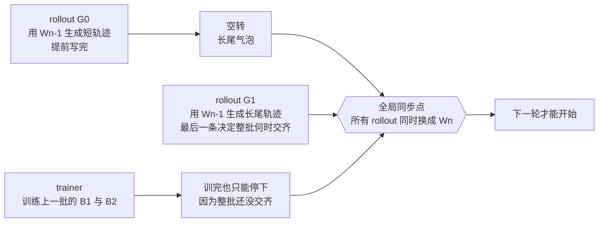
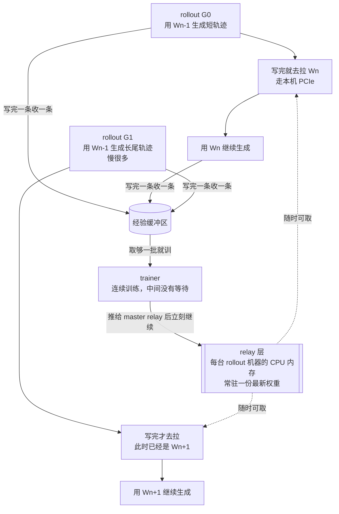
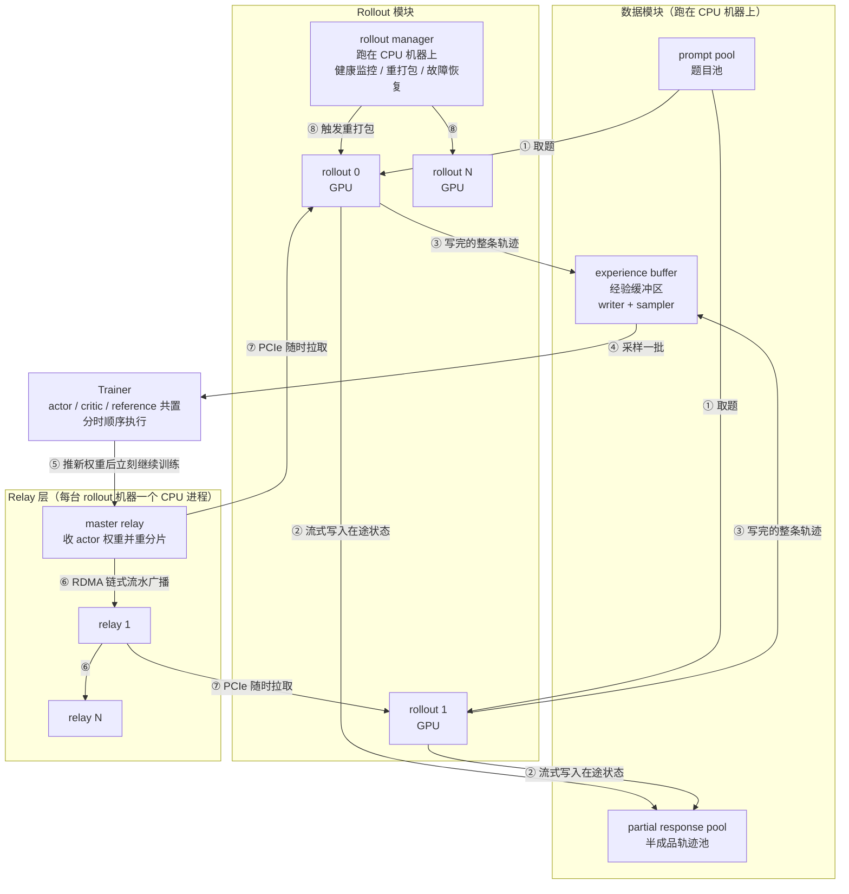
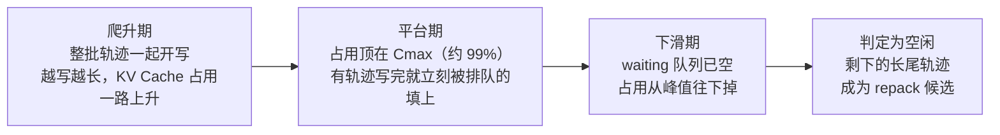

# Laminar：异步 RL 的最后一道屏障，是「所有 rollout 同时换权重」这个时刻

<!-- release-date: 2025-10-14 -->

> 本文依据 **Laminar: A Scalable Asynchronous RL Post-Training Framework**，即 arXiv:2510.12633v1、2025-10-14 提交、共 21 页的预印本。十三位作者中，第一作者 Guangming Sheng 与末位的 Chuan Wu 来自香港大学，其余来自 ByteDance Seed（PDF p. 1）。第一作者同时也是 verl 论文的第一作者，按主要归属方，本站把它放在 ByteDance 目录下。页码均指 PDF 本身的页码。
>
> **版本说明**：截至 2026-09-06 核验，arXiv 上仍只有 v1，与本地原件一致。但这篇论文后来正式发表于 EuroSys '26（2026-04-27 至 04-30，爱丁堡），会议版共 23 页、pp. 400–422、DOI [10.1145/3767295.3803580](https://doi.org/10.1145/3767295.3803580)。本文核对过会议版：摘要、所有主要数字与结论均未变化，差异是排版页眉、多两页篇幅、附录多一张收敛实验用的响应长度分布图、多了致谢与两个作者单位，以及**章节重排**（v1 里的「附录 C 讨论」在会议版移进了正文，「附录 D 链式广播分析」变成了附录 C）。**本文一律依据本地的 arXiv v1，页码与附录编号也只对应 v1。**
>
> 这是一篇系统论文，不是算法论文，所以没有模型架构和训练 recipe 可讲。全文会把三件事分开写：**论文明确写了什么**（带页码）、**本文如何解释它**（凡属推算、换算或图上读数都会写明）、**外部资料补充**（会给出链接并标注）。

## 读之前需要的最少背景

这篇论文假设你已经知道大模型的强化学习（Reinforcement Learning，RL）后训练在干什么。如果不熟，先记住下面几件事就够了。

一次 RL 后训练迭代分成两个串行阶段（PDF p. 1，Figure 1(a)）：

- **生成阶段（Generation）**：一批 **rollout（推理副本）** 拿着当前模型权重，对着一堆题目自回归地写出回答。这些回答叫 **trajectory（轨迹）**。多轮任务里，模型写一段、调一次工具、拿到反馈再接着写。
- **训练阶段（Training）**：给每条轨迹打分，算出优势，再用这些数据反向传播更新 **actor（行动者，正在被训练的那个模型）**。

三个必须先认识的词：

- **on-policy（同策略）**：训练用的数据，恰好来自当前正在被训练的这一版权重。
- **off-policy（异策略）** 与 **staleness（陈旧度）**：训练用的数据来自更早的某一版权重，差了几个训练迭代，就叫陈旧度是几。陈旧度越大，训练越可能跑偏。
- **weight synchronization（权重同步）**：actor 训练完一步之后，把新权重发给所有 rollout。

再认识三个硬件名词，它们贯穿全文：

- **KV Cache（键值缓存）**：生成时把已经算过的历史留在显存里，不必每写一个词就从头重算。它的容量决定了一个 rollout 能同时并行解码多少条轨迹。
- **PCIe / RDMA / NCCL**：PCIe 是同一台机器里 CPU 和 GPU 之间的通道；RDMA 是跨机器直接读写对方内存的网络技术，不经过对方 CPU；NCCL 是 NVIDIA 的 GPU 集合通信库，几乎所有分布式训练的 all-reduce、broadcast 都走它。
- **访存受限（memory-bound）**：一段计算的瓶颈不是算力，而是把数据从显存搬进计算单元。LLM 的逐词解码就是典型的访存受限操作。

最后，这篇论文和本站另外两篇是同一条线上的：**verl 这套框架的设计**见 [HybridFlow 解读](/reports/ByteDance/HybridFlow)，**长思维链 RL 的算法侧改动**见 [DAPO 解读](/reports/ByteDance/DAPO)。本文会在最后单独用一节交代三者的分工，中间不重复它们的内容。

## 一句话先说清

这篇论文要解决的问题，可以用一句大白话讲完：

> **一批题里，有的模型三百个词就答完了，有的要写一万五千个词。同步执行让答得快的那批卡，干等答得慢的那条。**

这个问题在长思维链和 Agent 时代变得极端。论文给的数字是：推理任务里，生成阶段吃掉整轮训练时间的 **83.1%**（PDF p. 1、3，Figure 1(b)）。也就是说，你买的卡有八成时间花在生成上，而生成的末尾又有很长一段是几乎全空转的。

学界和工业界过去两年的答案是「异步」：把生成和训练放到不同的卡上，让它们重叠起来。但这篇论文指出，现有的异步方案全都留了一个共同的死结：

> **它们仍然有一个全局权重同步点。所有 rollout 必须在同一时刻停下来，一起换成新权重。**

只要这个点还在，快的 rollout 就还是要等慢的。加更多卡也没用——多出来的卡只会一起等（PDF p. 4）。

Laminar 的答案是把**异步的单位从「一批」换成「一条」**：

> **每条轨迹按自己的节奏生成、按自己的节奏被消费；每个 rollout 什么时候换权重，由它自己决定，不跟别人对齐。**

论文把这叫 **trajectory-level asynchrony（轨迹级异步）**（PDF p. 1、2）。为了让它跑起来，论文做了两件具体的事：

1. **relay worker（中继工作进程）**：在每台 rollout 机器的 CPU 内存里放一份最新权重，rollout 想换随时来拿，actor 推完就走，谁也不等谁（PDF p. 7）。
2. **repack（重打包）**：把几个 rollout 上剩下的那几条长尾轨迹搬到一起，腾空的 rollout 立刻换新权重开工（PDF p. 8–9）。

论文报告在 1024 卡集群上最高 **5.48×** 的训练吞吐加速（PDF p. 1）。这个数字后面会被完整拆开——**先记住一点：5.48× 是 7B 模型对最弱基线（同步的 verl）在某一个规模点上的比值，而对最强基线 AReaL 的平均加速是 1.39×**（PDF p. 11）。两个数字都真实，但支持的结论不是同一个。

（顺带一个核对：摘要与 Figure 11(a) 的图注写的都是 **5.48×**，而 §8.1 正文写「相对 verl 最高 **5.49×**」（PDF p. 1、11）。差 0.01，论文没有解释，多半是取整口径不同。本文一律照录各自出处的原值。）

## 全景：一次迭代的时间花在哪

先把论文开篇那张图的信息落到实处。论文测了两类任务的时间构成（PDF p. 1，Figure 1(b)）：

| 任务类型 | LLM 生成 | 环境交互 | 训练 |
|---|---:|---:|---:|
| 单轮（数学推理） | 83.1% | — | 16.9% |
| 多轮（写代码，带沙箱） | 51.5% | 30.2% | 18.3% |

这张表是本文按 Figure 1(b) 的三段堆叠柱整理的，论文正文只单独引用了 83.1% 这一个数字（PDF p. 3）。

读法有两条：

1. **单轮任务里，生成一家独大。** 训练只占 16.9%，所以任何只优化训练阶段的工作，天花板都很低。
2. **多轮任务里，LLM 生成掉到 51.5%，但环境交互又补上 30.2%。** 两者合计 81.7%，仍然是绝对大头。而环境交互的耗时你根本控制不了——它取决于沙箱排队、任务复杂度、外部 API 什么时候回话（PDF p. 3）。

论文还顺手堵死了一条常见的优化路线：有些系统（论文引 RLHFuse 等）把生成阶段和训练阶段里的「经验准备」重叠起来，但**经验准备只占整轮迭代时间的 7.3%**，所以收益有限（PDF p. 3）。

这三个数字合起来定了全文的调子：**要提速，必须动生成阶段；而生成阶段最贵的不是算得慢，是等得久。**

### 训练阶段到底有几个模型

论文在 §2.1 补了一段算法背景，读后面几节需要它（PDF p. 2–3）。

训练阶段先给每条轨迹打一个奖励分。这个分可以来自三个地方：一个单独的**奖励模型**、一组**规则函数**（例如判断数学答案对不对），或者**环境信号**（例如代码测试有没有跑过）。打完分之后，还要结合 reference 模型和 critic 模型给出的优势估计，凑成一条「训练经验」，写进缓冲区，再采样出来做反向传播。

但论文紧接着说了一句很关键的话：**PPO 这类奠基方法依赖 critic 模型，而 GRPO、RLOO、DAPO 这些较新的算法「对同一道题生成多条轨迹、用它们互相比较来近似优势」，从而彻底不需要 critic 了**（PDF p. 3）。

这一句是后面两处论证的前提：

- Laminar 的 trainer 模块虽然写着可以带 actor、critic、reference（PDF p. 6），但实验里跑的是 GRPO（PDF p. 10），**所以 critic 根本不在场，需要反向传播的只有 actor**（这一句是本文按论文的算法配置推出来的，论文没有明说 trainer 里实际装了哪几个模型）；
- 「对同一道题生成多条轨迹再互相比较」这件事，意味着**同一道题的那一组回答必须彼此可比**。论文后面批评部分 rollout 时用的正是这个理由——版本混用会毁掉组内可比性（PDF p. 19）。这条线索会在讲算法代价时回来。

## 第一层矛盾：长尾到底有多长

### 分布本身就是歪的

论文用一张分布图说明问题（PDF p. 3，Figure 2）。左边是 AIME 数学题上的响应长度分布，右边是代码沙箱的执行延迟分布。两张图都是典型的右偏长尾：大量样本挤在很小的值上，少量样本拖出很长的尾巴。

论文的说法是「在某些任务上，第 99 百分位的输出长度是中位数的十倍」（PDF p. 3）。

**这里要留一句核对。** 本文按 Figure 2 左图的 CDF 曲线读数（读数精度有限）：CDF 越过 0.5 大约在 2000 token，接近 0.99 大约在 8000–9000 token，比值约 4–5 倍，不到十倍。论文那句「一个数量级」引的是 DAPO 和 SWE-bench 两篇工作（参考文献 [2]、[6]），而不是单指这张图；右图的沙箱延迟倒是明显更歪——中位数约十几秒，尾部拖到 300 秒以上。所以更准确的说法是：**这张图证明了分布严重右偏，「十倍」这个具体倍数要看是哪个任务、哪个指标。**

### 为什么长尾会变成空转

假设一个 rollout 一次并行生成 512 条轨迹。前面几百条陆续写完了，剩下最后几条还在写。这时这张卡的处境是：

- 它没法开始下一批——因为在同步系统里，整批没交齐就不能进入训练；
- 它也没法把算力用起来——只剩几条轨迹在解码，batch 小到几乎白跑。

论文用一条曲线把这个过程量化了（PDF p. 8，Figure 9）。实验是 32B 模型、H800、张量并行 TP=4、一批 512 条轨迹：

- **约 30 秒**：512 条轨迹全部被接纳、开始生成。随着每条轨迹越写越长，KV Cache 占用一路爬升；
- **约 145 秒**：KV Cache 占用爬到 99%（论文把这个阈值记作 $C_{\max}$），此后进入平台期。注意此时开始出现 waiting 队列——新腾出来的缓存立刻被排队的轨迹填满；
- **约 330 秒**：waiting 队列清空，KV Cache 占用开始从平台期往下掉。论文把**从这一刻起**判定为「空闲」；
- **约 675 秒**：整批才真正结束。

本文按图读出的近似值是：**这批轨迹的生成窗口约 675 秒，其中约 345 秒（超过一半）处在 KV Cache 占用不断下滑的「拖尾期」。** 后半程这张卡的 KV Cache 利用率一路掉到 10% 上下。

这就是「GPU 严重利用不足」这句话的具体形状。它不是零星的抖动，是每一批生成的后半程都会发生的结构性浪费。

### 为什么加卡不解决问题

一个自然的念头是：既然慢，就给每个 rollout 多分几张卡，让它算得快一点。论文用一条实测曲线否掉了这条路（PDF p. 5，Figure 4）。

这张图测的是 Qwen2.5-7B/32B 在 H800 上、序列长度 4096 时，一步解码的延迟随 batch 大小的变化。本文按图读出的近似值（32B、TP=4 那条线）：

| 解码 batch 大小 | 1 | 8 | 16 | 32 | 64 | 128 | 256 |
|---|---:|---:|---:|---:|---:|---:|---:|
| 一步解码延迟（毫秒） | ~10.7 | ~11.5 | ~13 | ~15 | ~18.5 | ~26 | ~37.5 |

关键在于左半边：**batch 从 1 涨到 8，延迟只涨了不到一成。** 这就是访存受限的典型特征——瓶颈是把权重从显存搬进来，搬一次的成本摊给 1 条还是 8 条轨迹，差别很小。

论文由此得出的推论是（PDF p. 5）：一个卡在长尾上的 rollout，手里只剩不到 8 条轨迹，它此刻的解码延迟和它跑 64 条时**差不多**。既然如此，**把好几个 rollout 上剩下的零头合并到一张卡上，几乎不增加延迟，却能立刻释放其他几张卡。** 这就是第 5 节 repack 的全部动机。

**这里也要留一句核对。** 论文原话是「解码这么小的 batch，延迟和一个大得多的 batch（例如 64）几乎相同」（PDF p. 5）。按上表，batch 8 → 64 的延迟其实从约 11.5 毫秒涨到约 18.5 毫秒，涨了约 60%，不能说「几乎相同」。但**吞吐**是 8 倍：同样的时间里多写 8 倍的轨迹，只多花 1.6 倍的时间，单位吞吐提高约 5 倍。所以论文的结论方向是对的，措辞偏松。这也解释了为什么 Algorithm 1 里必须额外设一个 batch 上界 $B$——合并不是越多越好，越过 roofline 拐点之后延迟就真的会起飞了（PDF p. 9）。

## 第二层矛盾：现有的异步方案，都卡在同一个全局同步点

论文最有价值的一节是把四种现有排布和自己并排画在一条时间轴上（PDF p. 3，Figure 3）。本文不复刻那条时间轴，而是把它翻译成**依赖关系图**——因为决定性能的不是谁画在哪一格，而是「谁必须等谁」。这一节先画有全局同步点的那一版，下一节再画 Laminar 那一版，两张对照着看最省事。

### 排布一：同步共置（verl 的默认做法）

所有模型共置在同一批卡上，生成完再训练，训练完再生成。Figure 3(a) 里每个 GPU 都是「生成 → 一大段斜纹气泡 → 训练」（PDF p. 3）。

它的好处是**完全 on-policy**：这一轮训练用的样本，就是这一轮权重生成的。它的代价就是那段斜纹——**一批里最慢的那条轨迹决定所有卡什么时候能进入训练。**

这套编程模型的来龙去脉见 [HybridFlow 解读](/reports/ByteDance/HybridFlow)，本文不重讲。

### 排布二：一步陈旧流水线

把 rollout 和 trainer 放到不同的卡上，让它们重叠：rollout 用上一版权重 $W_{n-1}$ 生成一整批，trainer 同时用更早生成好的一整批训练（PDF p. 3–4，Figure 3(b)）。

这是根据 PDF p. 3 的 Figure 3(b) 与 p. 3–4 正文重画的**机制示意图**，箭头表示「必须先完成才能进入下一步」的依赖关系，不表示实测时长。图里三条支路是**并发**的：G0 和 G1 同时生成，trainer 同时在训练更早的一批数据。三条支路都必须抵达那个六边形的全局同步点，下一轮才能开始——**所以 G0 提前写完的那段时间，只能变成空转。**

论文对它的判断是：**这个方案确实把生成和训练重叠了，但完全没有解决长尾**（PDF p. 4）。图上那句注释写得很直白：「Long-tail problem still exists」。

### 排布三：流式生成

比一步陈旧更进一步：trainer 不等整批，先拿早完成的短轨迹训前几个 mini-batch，长轨迹留给后面的 mini-batch（PDF p. 4，Figure 3(c)）。

它缓解了 trainer 的等待，但两个问题还在：

1. **trainer 的进度仍然绑在整批的完成上**——最后一个 mini-batch 还是要等最慢那条（PDF p. 4）；
2. 它还多出一笔账：因为 trainer 在一轮里会分多次更新权重，而一轮的最终权重要等最后一个 mini-batch 训完才有，所以系统必须**把上一版权重复制到专门的显存缓冲区**里，供中途来取的 rollout 使用（PDF p. 3，Figure 3 图注）。这块缓冲区是纯粹的额外显存开销。

### 排布四：部分 rollout

这是 AReaL 等系统采用的做法：新权重一到，就**打断所有正在生成的轨迹**，换上新权重，然后接着写（PDF p. 4，Figure 3(d)）。一条长轨迹于是由好几段组成，每段出自不同的策略版本。

论文列了它的两笔代价（PDF p. 4）：

1. **每次打断都要重建 KV Cache（re-prefill）。** 被打断的轨迹恢复时，前面已经写出来的那几千个 token 必须重新跑一遍前向，把 KV Cache 填回去。这笔计算不产生任何新 token，纯粹是恢复成本，而且**每一轮 RL 迭代都要付一次**。Figure 3(d) 上那一列灰块画的就是它。
2. **一条回答由多个策略版本拼出来，会伤收敛。** 论文在第 8.2 节用实验支持了这一点（PDF p. 4、11）。

论文在附录 C 把第二点说得更细（PDF p. 19）：一条轨迹里出现的版本数，**随序列长度和 actor 更新频率线性增长**。轨迹越长、更新越频繁，污染越重。而且它会扭曲输出长度的自然分布，还会伤到 GRPO 这类「无价值网络」算法——因为这类算法要求同一组轨迹来自同一个权重版本。

### 真正的病根：$k$ 这个旋钮本身就是个坏设计

上面四种排布都在同一个框架下：设一个陈旧度上界 $k$，rollout 用的权重最多比 actor 落后 $k$ 个训练迭代，然后按预定时间表做一次全局同步。

论文对这个框架的批评是（PDF p. 4）：

$$
k\ \text{大} \Rightarrow \text{吞吐好，收敛差}
\qquad
k\ \text{小} \Rightarrow \text{收敛好，吞吐差}
$$

这本身还只是个调参问题。真正致命的是**它是个静态超参，而 RL 的负载是动态的**：

- 模型在学习过程中，轨迹长度会持续变化，可能变长、可能变短、也可能来回震荡（PDF p. 4，引 DeepSeek-R1、DAPO、Kimi k1.5 三篇的观察）；
- 环境交互延迟随 API 排队和任务复杂度剧烈波动（PDF p. 4）。

所以**训练早期最优的 $k$，到中期可能就变成了低效甚至不稳定的 $k$**（PDF p. 4）。你调不出一个全程都对的值，因为根本不存在这样一个值。

论文由此给出全篇的核心判断：

> **问题不在于 $k$ 该取几，而在于「让所有轨迹服从同一个更新时间表」这件事本身就是错的。**

## 转向：把异步的单位从「一批」换成「一条」

如果每条轨迹都能独立生成、独立入库、独立被消费，那么：

- 短轨迹写完立刻可用，不必陪长轨迹一起等；
- 长轨迹慢慢写，也不拖住任何别人；
- trainer 从缓冲区里取够一批就训，不必打断任何正在进行的生成（PDF p. 4）。

这是根据 PDF p. 3 的 Figure 3(e) 与 §2.4 正文重画的**机制示意图**，实线表示数据与执行的流向，虚线表示按需拉取，不表示实测时长。把它和前面那张一步陈旧的图对照着看，三处差别就是全文的要点：

1. **图里没有那个六边形了**——不存在一个所有支路都必须抵达的会合点；
2. **G0 和 G1 换权重的时刻不同**：G0 早早换到 $W_n$，G1 拖到很久之后才换，而且直接跳到了 $W_{n+1}$，中间那一版它压根没用上；
3. **trainer 只和经验缓冲区打交道**，它取够一批就训，不关心此刻谁在生成、生成到哪了。

有一处是刻意保留的：**不开 repack 时，G1 自己内部的长尾气泡还在**——它那批的最后几条轨迹仍然让整张卡跑不满。这正是 Figure 3(e) 自己标出来的残留问题，也是第二个设计要收拾的摊子。

关键的观念转变在陈旧度上。论文定义了一个新概念（PDF p. 9）：

> **固有陈旧度（inherent staleness）**：若一条轨迹由模型版本 $K$ 生成，写完时 actor 已经更新到版本 $M$，那么它的固有陈旧度就是 $M-K$。

写成式子就是：

$$
\text{staleness} = M - K
$$

这个量的特别之处在于：**它不是你设的，是算出来的。** 它由这条轨迹自己的生成耗时和 trainer 的更新速度共同决定（PDF p. 9）。轨迹变长，它自然变大；集群变快，它自然变小。系统不需要、也不提供一个陈旧度上界的配置项（PDF p. 9）。

论文测了它的分布（PDF p. 9，Figure 10；实验是 7B 模型、64 张 H800）。本文按图读出的近似值：

| 训练阶段 | 陈旧度 0 | 陈旧度 1 | 陈旧度 2 | 陈旧度 3 |
|---|---:|---:|---:|---:|
| 最初 0–0.5 小时 | ~35% | ~42% | ~22% | ~1% |
| 之后各时段 | ~13–18% | ~47–56% | ~25–35% | ~1–3% |

论文的结论是「固有陈旧度始终很低，通常不超过 3」（PDF p. 10），全部实验里观测到的最大值是 4（PDF p. 11）。

**这张图值得多看一眼，因为它同时说明了收益和代价。** 收益是：陈旧度确实被压在很小的范围里，而且分布相当稳定，没有随训练推进而恶化。代价是：**热身之后，真正 on-policy（陈旧度为 0）的轨迹只有约 15%，超过八成的训练数据来自更早的版本。** Laminar 不是一个「几乎同策略」的系统，它是一个**彻底异策略、但陈旧度自我调节在个位数以内**的系统。这个区别在后面讲算法代价时非常重要。

## 架构全景：四个模块和八个步骤

这是根据 PDF p. 6 的 Figure 5 与 §3.1、§3.2 正文重画的**机制示意图**，箭头表示数据流与控制流的方向，圈号对应论文的八个步骤，不表示实测时长或带宽。

四个模块各自的职责（PDF p. 5–6）：

- **Rollout 模块**：一个 rollout manager 加上很多 rollout。manager **跑在 CPU 机器上**——这一点是刻意的，为的是把它和 GPU 机器的故障隔离开。它负责监控每个 rollout 的负载并决定何时重打包，同时管健康检查、权重更新拓扑和故障恢复。每个 rollout 独立地自回归生成，可能还要跟外部环境交互；**一批生成完，它就去找同机器的 relay 拿最新权重。**
- **数据模块**：三个独立进程、都在 CPU 机器上。`prompt pool` 供题；`partial response pool` **集中保存在途轨迹**，这是容错的基础；`experience buffer` 保存已完整生成的轨迹，读写各有一个可自定义的 API——**采样策略和淘汰策略都留给用户配置**。
- **Relay 层**：一个层级化的参数服务。manager 指定其中一个当 master，由它接收 actor 的新权重并广播给其他 relay。**每台 rollout 机器上跑一个 relay 进程，把最新权重放在本机 CPU 内存里。**
- **Trainer**：从经验缓冲区采样，按选定的 RL 算法更新模型。actor、critic、reference 这几个模型**共置在同一批 GPU 上分时顺序执行**——这一句论文直接引了 DeepSpeed-Chat 和 HybridFlow（PDF p. 6）。也就是说，**Laminar 没有重做 trainer 内部，它换掉的是 trainer 和 rollout 之间的关系。**

八个步骤按论文 §3.2 的顺序是这样的（PDF p. 6）：

| 步骤 | 动作 | 为什么重要 |
|---|---|---|
| ① | rollout 从题目池取题，在自己的 GPU 上开始生成 | 取题是各取各的，没有全局分发 |
| ② | 在途轨迹被**流式**写到半成品池 | 机器挂掉时，这些 token 不会丢 |
| ③ | 生成完成的轨迹移入经验缓冲区 | 完成一条算一条，不等整批 |
| ④ | trainer 从缓冲区采样一批做训练 | **数据的生产与消费彻底解耦** |
| ⑤ | trainer 把新权重推给 master relay，**立刻**开始下一轮训练 | 不等分发完成，actor 从此不再停等 |
| ⑥ | master relay 用 RDMA 沿链把权重广播给其他 relay | 发生在 CPU 侧后台，不影响同机器的 GPU 生成 |
| ⑦ | rollout 随时走 PCIe 从同机器的 relay 取最新权重 | 取权重变成本地操作，不用等网络 |
| ⑧ | rollout manager 发现有 rollout 卡在长尾，触发重打包 | 既提吞吐，也压陈旧度 |

这张表是本文按 PDF p. 6 的正文与 Figure 5 的圈号整理的，论文没有列成表。

八步连起来读，最关键的是第 ⑤ 步：**trainer 把新权重推给 master relay 之后，立刻开始下一轮训练，不等权重分发到其他 relay 或 rollout**（PDF p. 6）。整条链路上再没有一个所有人都要停下来对齐的时刻。

第二关键的是 ② 和 ③ 的分工：**在途状态和完成状态被写到两个不同的池子里。** 前者服务容错，后者服务训练。如果只有一个池子，你要么得让 trainer 看见半成品，要么得接受机器挂掉就丢工作。

## 设计一：把权重同步搬到 CPU 上去

### 旧问题：为什么不能直接 GPU 传 GPU

现有异步系统在全局同步点用 NCCL 做 GPU 到 GPU 的直传，带宽很高。论文说这条路**换成随时可发生的异步更新之后就走不通了**，理由有三条（PDF p. 4–5）：

1. **要额外的显存缓冲区，而显存正是最紧张的资源。** 为了让 rollout 随时能来拉，actor 必须在整个训练迭代期间**留着上一版权重**；为了让 actor 能主动推，rollout 必须**缓存收到的新权重**直到自己这批生成结束。对大模型来说，这块缓冲区可能直接超出显存；即使装得下，也要从训练 batch 或 KV Cache 里挖，两边都掉吞吐。
2. **通信 kernel 会和计算抢 SM。** NCCL 的通信 kernel 会跟训练和解码的 kernel 争抢流式多处理器，把两边的计算都拖慢。
3. **不留缓冲区的话，actor 就得停等。** 它必须等 rollout 把新权重取走才能进入下一个 mini-batch——这等于把刚拆掉的阻塞同步点又装了回去，而且 rollout 越多越糟。

论文给自己定的目标很明确：**在异步权重同步过程中，actor 和 rollout 两边都要零额外显存开销**（PDF p. 5）。

### 也不能用存储系统

传统 RL 系统会用一个存储系统中转权重——SRL 用 NFS 文件系统，OpenAI Five 用 Redis 键值存储（PDF p. 7）。当年模型只有几 MB 时这没问题，几十 GB 就完全不行了。论文给了实测（PDF p. 7）：

- 32B 模型的**单个 4 GB 权重分片，序列化就要约 8 秒**；
- 这么大的数据走普通 TCP 网络到存储系统再回来，**再加 10 到 20 秒**，而且这段延迟落在每个 rollout 的关键路径上；
- 多个 rollout 同时来拉时，存储系统本身变成争抢瓶颈，延迟长且不可预测。

### 新设计：relay worker 住在 rollout 机器的 CPU 内存里

论文的答案是第三条路：**在每台 rollout 机器上开一个 CPU 进程，把最新权重放在本机内存里。** 理由是「这类主机内存基本处于闲置状态」（PDF p. 7）。

这个选择同时绕开了前面两组问题：

- 不占显存，所以 actor 和 rollout 的显存预算一点不动；
- 不占 GPU 的 SM，因为搬运发生在 CPU 侧；
- 不是集中式存储，所以没有单点争抢；
- rollout 取权重走机内 PCIe，**不用等网络**。

论文的实现里，relay 用 **pinned CPU shared memory（锁页共享内存）**，让 rollout 进程能直接把模型分片装进自己的 GPU（PDF p. 10）。

### 工作机制：一个 master 加一条链

relay 层的两个设计目标是（PDF p. 7）：① 让 actor 发布权重时的停顿最小；② 让任何一个 rollout 随时来取都能低延迟拿到。

它们分别对应两个动作：

**① actor 只发给一个 master relay，发完立刻回去训练。** master relay 收到之后，还要**按 rollout 的分片方式重新切一遍**（例如按 rollout 的张量并行度重分片），然后才广播出去（PDF p. 7）。

这里有个很值得记的细节：**重分片这件事被挪到了 CPU 上**。actor 的并行策略和 rollout 的并行策略不一样，中间必须重新切分——这正是 [HybridFlow 解读](/reports/ByteDance/HybridFlow) 里 3D-HybridEngine 花了整整一节解决的问题。Laminar 没有沿用那条思路（那条思路的前提是训练和生成在同一批卡上），而是把重分片整个搬到 relay 的 CPU 侧做，从 actor 的关键路径上彻底摘出去。

**② master relay 用 RDMA 沿着一条链做流水线广播。** 权重被切成若干块，一块块沿链传下去，不同跳之间的通信互相重叠（PDF p. 7）。

论文在附录 D 给了这条链的延迟模型（PDF p. 20–21）。设链上共 $p$ 个节点、权重总大小 $M$ 字节、切成 $k$ 块，两跳之间的启动延迟为 $T_{\text{start}}$、每字节传输时间为 $T_{\text{byte}}$，那么传一块的时间是：

$$
t_{\text{chunk}} = \frac{M}{k}T_{\text{byte}} + T_{\text{start}}
$$

第一块要走完 $p-1$ 跳才到链尾，之后剩下的 $k-1$ 块依次到达，所以总时间是：

$$
T(p,k) = (p+k-2)\cdot t_{\text{chunk}}
= M T_{\text{byte}} + (p-2)T_{\text{start}} + kT_{\text{start}} + \frac{(p-2)M}{k}T_{\text{byte}}
$$

对 $k$ 求导取零，得到最优的分块数与对应的最短时间：

$$
k^{*} = \sqrt{\frac{(p-2)MT_{\text{byte}}}{T_{\text{start}}}}
\qquad
T^{*}(p) = \underbrace{MT_{\text{byte}}}_{\text{带宽项}} + \underbrace{(p-2)T_{\text{start}}}_{\text{延迟项}} + \underbrace{2\sqrt{(p-2)MT_{\text{byte}}T_{\text{start}}}}_{\text{流水线项}}
$$

论文对这三项的解读是（PDF p. 21）：带宽项 $MT_{\text{byte}}$ **完全不含 $p$**，就是把整个模型往一条链路上灌一遍的时间；延迟项随 $p$ 线性增长，但 RDMA 的 $T_{\text{start}}$ 只有微秒量级，2000 个节点也才 $2000\times 5\,\mu s = 10\,\text{ms}$；流水线项按 $O(\sqrt{p})$ 增长，比延迟项快，但仍远小于带宽项。结论是**总广播时间被那个与节点数无关的带宽项主导**。

实测支持了这个结论（PDF p. 20，Figure 18）。本文按图读出的近似值：

| rollout 机器数（对应 GPU 数） | 4（32） | 8（64） | 16（128） | 32（256） | 64（512） | 128（1024） |
|---|---:|---:|---:|---:|---:|---:|
| 32B 广播延迟（秒） | ~0.42 | ~0.49 | ~0.55 | ~0.61 | ~0.67 | ~0.74 |
| 72B 广播延迟（秒） | ~0.95 | ~1.11 | ~1.24 | ~1.38 | ~1.51 | ~1.63 |

论文正文的说法是「72B 模型从 master 广播到另外 127 个 relay，耗时不到 1.6 秒」（PDF p. 7）。

**这里要留一句核对。** 论文正文说广播时间「几乎与链长无关」（PDF p. 7）。按上表，节点数从 4 涨到 128（32 倍），72B 的延迟从约 0.95 秒涨到约 1.63 秒（约 1.7 倍）。这明显不是常数，但确实是**远慢于线性**的增长——和附录 D 里那个 $O(\sqrt{p})$ 的流水线项吻合。更准确的说法是「亚线性增长，且在实际集群规模内绝对值可忽略」。

**顺带一个本文推算。** 72B 用 BF16 大约是 144 GB（论文没写权重同步用什么精度，这是本文的假设）。144 GB / 1.6 秒 ≈ 90 GB/s。另一处数字可以互相印证：论文说 actor 推给 master relay 的停顿只有 **0.64 秒（32B）和 1.40 秒（72B）**（PDF p. 12），换算下来分别是 64 GB / 0.64 s = 100 GB/s、144 GB / 1.40 s ≈ 103 GB/s。三个数字都落在 90–103 GB/s 这个区间，说明整条权重同步路径的有效带宽大致就是每秒一百 GB 左右——**明显低于机间 8×400 Gbps（合 400 GB/s）的理论上限**。也就是说，这条链没有把网络打满，瓶颈可能在 CPU 侧的内存拷贝或单条链路。论文没有分析这一点。

### 容错：把广播链修好只需要一秒

RL 作业要跑几周甚至几个月，硬件必然出事（PDF p. 5）。论文特别点了一句：**NCCL 本身不原生支持容错和弹性**，所以在传统方案里，一个 rollout 挂掉就可能逼整个作业从 checkpoint 重启（PDF p. 5）。

Laminar 的广播链是自己搭的（用 UCX 实现，PDF p. 10），所以可以做得更灵活（PDF p. 7–8）：

- rollout manager 里的通信调度器负责建链；
- 某台机器挂了，调度器靠心跳发现，把它踢出去，**在剩下的机器里重建链路**；
- 这个修复是**常数时间 $O(1)$ 的操作，一秒内完成**；
- master relay 挂了就另选一个，然后把新 master 的 IP 通知给 trainer；
- 修复期间训练不中断，健康机器上的生成也不受影响——因为**生成和 relay 通信在每台机器上是两个不同的进程**（PDF p. 8、10）。

### 收益、代价与边界

**收益**（PDF p. 12，Figure 14）。论文对比了 GPU 直传的全局同步方案，测两个量：rollout 从开始更新到更新完成的等待时间，以及 actor 的停顿时间。

- 从 64 卡到 1024 卡，Laminar 的 rollout 平均等待时间最多降 **37%**、最好情况最多降 **47%**（PDF p. 12）；
- 最好情况出现在**最新权重已经缓存在本机 relay 的 CPU 内存里**，这时只需并行走 PCIe 装载分片；
- 更关键的是**平均值很接近最好情况**——因为取消了全局同步点，很少有 rollout 恰好在 actor 刚训完的那一刻来要权重（PDF p. 12）；
- actor 停顿恒定在 0.64 秒（32B）和 1.40 秒（72B），**且与 rollout 副本数无关**，因为它只发给一个 master（PDF p. 12）。

本文按 Figure 14 读出的近似值可以佐证这个「恒定」：32B 上，GPU 全局同步的等待时间从 32 卡的约 0.82 秒涨到 512 卡的约 0.98 秒；Laminar 的最好情况**始终是约 0.57 秒**，一条平线。

**代价。** 论文报告的「零额外显存」是真的，但账没有清完：

1. **主机内存的开销没有量化。** 每台 rollout 机器的 CPU 内存里要常驻一整份权重。72B 就是约 144 GB 每台（本文按 BF16 推算）。论文只说主机内存「基本闲置」（PDF p. 7），没给任何占用数字，也没讨论在更大模型上这个假设何时会失效。
2. **PCIe 带宽是新的关键路径。** rollout 每次更新都要把整份权重从 CPU 内存装进显存。论文没有单独拆解这一步的耗时占比。
3. **`partial response pool` 是集中式的。** 所有 rollout 的在途轨迹都要流式写到同一个 CPU 机器上的池子里（PDF p. 6）。1024 卡、每个 rollout 副本最多 1024 条并发轨迹（PDF p. 18）的规模下，这条写入通道的吞吐能不能撑住，论文没有测。

**边界。** 这套设计的前提是 **rollout 和 trainer 分开放在不同的卡上**。如果你的系统还是把训练和生成共置在同一批卡上分时执行（也就是 verl 的默认放置），relay 层就没有存在的余地——权重根本不需要跨机器搬。

**可迁移的部分**：

> **当一个「所有人都要在同一时刻拿到同一份东西」的同步点成了瓶颈时，先别急着把这次同步做得更快，先问它能不能变成「每个人自己来拿」。**

把推（push）改成拉（pull），把广播改成缓存，把集中式改成每台机器一份本地副本——这三步是同一个动作的三种说法。代价是你要多花一份存储，收益是取消了一个全局屏障。CDN、配置中心、特征服务的演化路径都是这个形状。

## 设计二：把长尾集中到几张卡上

relay 解决了「rollout 之间不必对齐更新时间」，但没解决**单个 rollout 内部的长尾**。Figure 3(e) 画的就是 Laminar 不开 repack 的样子：rollout 泳道的后半程仍然留着斜纹气泡（PDF p. 3）。

论文对这个残留问题的描述比「浪费算力」更进一步（PDF p. 5）：卡在长尾上的 rollout **不能去取最新权重**——它这批还没生成完。于是它只能继续用越来越旧的权重生成。**能生成接近同策略轨迹的 rollout 数量，直接关系到训练稳定性和模型效果。** 所以 repack 不只是个吞吐优化，它同时是个陈旧度控制手段。

### 怎么判断一个 rollout 空了：用 KV Cache 占用率

先前的做法是设一个「剩余请求数」的阈值，低于它就算长尾（PDF p. 5、8）。论文认为这条路不实用：**最优阈值要靠大量离线 profiling 逐作业地测出来，而 RL 的负载在训练过程中一直在变。**

Laminar 换了个指标：**KV Cache 占用率**。理由是在访存受限的生成里，**KV Cache 容量才是限制并行解码 batch 大小的真正瓶颈**（PDF p. 8）。

前面 Figure 9 那条曲线给出了一个非常干净的三段式生命周期（PDF p. 8）：

这是根据 PDF p. 8 的 Figure 9 与 §5.2 正文重画的**机制示意图**，四个方框是同一个 rollout 在一批生成内依次经历的阶段，不是实测时间轴。

这个判据聪明在哪？**它不需要知道任务是什么、模型多大、batch 设了多少。** 只要 waiting 队列非空，占用就会一直顶在 $C_{\max}$；一旦开始下滑，就说明这个 rollout 手里已经没有排队的活了。论文说这个阈值行为在不同 RL 负载上都一致，**因此不需要按负载调阈值**（PDF p. 9）。

### 怎么合并：一个装箱问题

论文把重打包建模成**装箱问题（bin packing）**：每个利用不足的 rollout 是一个「物品」，每个目的地 rollout 是一个「箱子」；而且**目的地就从这些利用不足的 rollout 里选**（PDF p. 9）。目标是让释放出来的源 rollout 数量最多。

算法用两个量刻画一个 rollout 的容量（PDF p. 9）：

- $C_{\text{used}}$：当前 KV Cache 占用；
- $N_{\text{reqs}}$：当前在跑的轨迹条数。

两个上界：

- $C_{\max}$：KV Cache 阈值，它是显存容量决定的硬上界；
- $B$：并行解码的 batch 上界，**由 roofline 模型定出来**——超过这个点，解码就从访存受限转成算力受限，延迟会真的开始涨（PDF p. 9）。

Algorithm 1 是一个 Best-Fit 启发式（PDF p. 9）：

1. **筛候选**：KV Cache 占用非递增且低于 $C_{\max}$（也就是处在下滑期），并且剩余轨迹数小于 $B$；
2. **排序**：按 KV Cache 占用从小到大排，**优先释放包袱最轻的**——因为小负载更容易找到地方安置；
3. **匹配**：对每个源，找出所有还没被标记释放、且装得下的候选作为目的地。`CanFit` 会把目的地当前的占用、已经分配给它的其他源、以及这个源三部分加起来，检查是否同时不超过 $C_{\max}$ 和 $B$；
4. **选择**：在所有可行目的地里，选**合并之后 KV Cache 最满的那个**——把空间留给后面更大的负载；
5. 记录搬迁，把源标记为可释放。

复杂度是 $O(|S|^2)$，其中 $|S|$ 是候选 rollout 数。论文说因为 $|S|$ 通常很小，实践中足够快（PDF p. 9）。

### 什么时候触发

两个触发条件（PDF p. 8）：

1. **周期性检查**（论文举的例子是每 5 秒）；
2. **trainer 训完一个全局批之后立即触发一次**——目的是尽快腾出 rollout，让它们换上最新权重去生成同策略数据。

第二个条件很能说明 repack 的双重身份：它既在追吞吐，也在压陈旧度。

搬迁本身分三步（PDF p. 8，Figure 8）：rollout manager 先收集所有 rollout 的进度指标并**按权重版本分组**，然后在每个版本组内部跑一次装箱，最后把源 rollout 上未完成的轨迹搬到目的地。

**按版本分组这一步是正确性的关键**：只在同版本组内合并，才能保证一条轨迹从头到尾只由一个策略版本生成——这正是 Laminar 相对部分 rollout 的核心算法优势（PDF p. 13）。

### 收益、代价与边界

**收益**（PDF p. 12，Table 1 与 Figure 16）。实验配置是 32B 模型、128 卡（64 卡 trainer、64 卡 rollout，每个 rollout 占 4 卡，共 16 个 rollout）：

| | 轨迹生成的平均/最大延迟（秒） | 重打包开销（秒） | 平均 KV Cache 利用率 |
|---|---|---:|---:|
| 开 repack | 290 / 828 | 0.69 | 82.2% |
| 不开 repack | 296 / 826 | — | 71.6% |

- 生成吞吐提升 **26%**（PDF p. 12）。本文按 Figure 16 读出的近似值：开 repack 稳定在约 6.8 万 token/s，不开约 5.4 万，比值约 1.26，与论文一致；
- 平均 KV Cache 利用率提升 **14.8%**（PDF p. 12）。**注意这是相对提升**：82.2% 与 71.6% 相差 10.6 个百分点，10.6 / 71.6 ≈ 14.8%。读的时候别把它当成绝对百分点；
- **重打包开销只有 0.69 秒，而且没有增加轨迹生成的延迟**（PDF p. 12）。Table 1 里两行的平均/最大延迟几乎相同（290/828 对 296/826），这是这条结论最直接的证据。

**代价。** 论文对 repack 的成本谈得比较少，本文核对后的观察是：

1. **搬迁一条在途轨迹意味着搬 KV Cache。** 论文只报了 0.69 秒这个总开销，没有说明搬迁到底是传输 KV Cache 还是在目的地重算前缀。如果是后者，那就是一次小规模的 re-prefill——而论文批评部分 rollout 的核心理由正是 re-prefill 太贵。**这个实现细节论文没有交代，是本文核对后留下的缺口。**
2. **同版本组内才能合并**，所以版本一多，每组里的候选就少，装箱的腾挪空间就小。论文没有分析版本碎片化的影响。
3. **$B$ 这个上界仍然要靠 roofline 模型定**，而 roofline 拐点随模型、序列长度、硬件而变。论文说 KV Cache 阈值不需要调，但没说 $B$ 不需要调。

**边界。** 整套机制建立在「解码是访存受限、小 batch 和中等 batch 延迟接近」这个前提上（PDF p. 5）。如果你的生成负载不满足这一条——例如批量做长 prefill、或者用了大量投机解码把解码变成算力受限——repack 的收益会明显缩水。

**可迁移的部分**：

> **判断一个执行单元是否空闲，要找那个「结构上会先枯竭」的资源，而不是找一个需要调的阈值。**

这里的 KV Cache 占用率之所以好用，不是因为它更精确，而是因为它有一个**与负载无关的自然拐点**：排队队列一空，它必然从峰值下滑。任何有排队和有限容量的系统（线程池、连接池、消息队列消费者）都可以找一找自己的这条曲线，用「占用率开始不可逆下滑」代替「剩余任务数小于 N」。

## 容错：故障隔离是解耦顺手带来的

论文一直强调，全解耦架构的第二个好处是故障隔离（PDF p. 5）。这一节把它落到具体动作上（PDF p. 6–7）：

- **rollout 出故障**：心跳发现 → 先尝试在原 GPU 上重新初始化 → 还不行就整机驱逐。**期间在途轨迹的状态安全地留在 `partial response pool` 里**，manager 把被打断的轨迹重新分配给**同一权重版本**的健康 rollout，或者等新机器补进来。新机器起来后，向 master relay 同步最新权重，或者从 actor 的 checkpoint 文件里加载指定版本。
- **relay 出故障**：靠前面说的链路重建，**不用等超时就能发现，一秒内修好**，生成完全不受影响。
- **trainer 出故障**：走标准的 checkpoint 恢复。**这段时间里 rollout 继续用手上最新的权重生成**；trainer 恢复后接着从经验缓冲区采样。

论文强调这件事的价值时给了一个很实在的理由（PDF p. 5）：在复杂任务上，**一条轨迹可能要生成好几个小时**。一台机器挂掉就丢掉上面所有在途工作，代价大得离谱。

实测（PDF p. 12，Figure 15）：论文手动杀掉一台含两个 rollout 副本的机器。

- 生成吞吐立刻下跌（本文按图读出的近似值：从约 6.5–7 万 token/s 掉到约 5.2 万）；
- **训练吞吐基本不受影响，只是略有下降**，因为它还能从健康 rollout 那里拿到够用的轨迹；
- 系统在**约 252 秒**内恢复，包括申请新机器和在上面初始化 rollout；
- 恢复后两条吞吐都回到原来的水平。

图上还标了一个很诚实的细节：故障之后有一个「faulty iteration（delay due to asynchrony）」的点，训练吞吐在那里明显掉了一下（PDF p. 12，Figure 15）。也就是说，**异步没有让故障完全无感，只是把冲击从「整个作业重启」摊薄成「某一轮训练慢一点」。**

**可迁移的部分**：这套容错的核心不是心跳，是那个 `partial response pool`——**把长耗时任务的中间状态从执行节点上剥离出来，放到一个独立的、不跟着执行节点一起死的地方。** 一旦做到这一点，「重试」的成本就从「重做整件事」降到「换台机器接着做」。

## 异步真正的代价：算法这一侧

系统论文最容易被读成「我们更快了 N 倍」。但异步 RL 的代价从来不在吞吐上，在数据分布上。这一节把论文给了什么、没给什么分开讲。

### 论文确实兑现的那个保证

Laminar 相对部分 rollout 的核心算法优势只有一句话，但它很硬：

> **每条轨迹自始至终由单一、一致的策略版本生成**（PDF p. 13）。

这不是修辞。repack 只在同权重版本组内合并（PDF p. 8），rollout 只在一批生成完之后才换权重（PDF p. 6），两条规则合起来就保证了这一点。相比之下，部分 rollout 的一条长轨迹由多个版本拼成，论文在附录 C 说这会**扭曲输出长度的自然分布**，并且伤害 GRPO 这类需要「同组同版本」的算法（PDF p. 19）。

### 但「同组同版本」这件事，论文自己也没交代

这是本文核对后发现的一个缺口，值得单独说。

GRPO 的做法是对同一道题采样一组回答，用**组内**的相对好坏算优势。论文的实验配置里，Group Size 是 16（PDF p. 20，Table 3），全局批是 512 道题 × 每题 16 条回答 = 8192 条（PDF p. 10）。

论文在附录 C 批评部分 rollout 时，明确说这类算法「依赖从一致的权重版本组成轨迹组」（PDF p. 19）。**但论文从头到尾没有说明 Laminar 自己怎么保证同一道题的 16 条回答来自同一个权重版本。**

从设计上可以推断出一个大概（以下是本文的判断，不是论文的结论）：既然「每个 rollout 从题目池取一批题、生成完自己这批之后才换权重」（PDF p. 6），那么只要一道题的 16 条回答被分在同一个 rollout 的同一批里，它们就是同版本的。但论文没有写题目池是按「题」发还是按「条」发，也没有写经验缓冲区在采样时会不会把同一组的 16 条凑齐再交给 trainer。默认采样策略是 **FIFO（先进先出）**（PDF p. 18、20，Table 3），FIFO 显然不保证按组对齐。

**这个缺口是实打实的**：论文用「组一致性」作为批评竞品的理由，却没有证明自己满足它。

### 更根本的一点：Laminar 没有任何异策略修正

翻遍全文，**「correction（修正）」这个词一次都没有出现**。论文给 Laminar 配的算法是 GRPO 加上 DAPO 的 Clip-Higher（PDF p. 10），超参是 $\varepsilon_{\text{high}}=0.28$、$\varepsilon_{\text{low}}=0.2$（PDF p. 20，Table 3）——这是标准的裁剪，不是针对陈旧数据的重要性采样修正。

对照一下同一张表里的 AReaL：它用的是 **Decoupled PPO**，论文明确说这是「用来缓解部分 rollout 引入的误差」的算法（PDF p. 11）。也就是说，**基线为异步付了一笔算法上的保险，Laminar 没付。**

Laminar 的理由是隐含的：既然固有陈旧度通常不超过 3、实测最大是 4（PDF p. 10、11），那么偏差本来就小，不修也罢。表里唯一的让步是把训练 mini-batch 从 512 调大到 2048，论文说这是「为了用异策略数据稳定训练，与 AReaL 的配置对齐」（PDF p. 20，Table 3 图注）。

**这是一个赌注，不是一个证明。** 前面 Figure 10 已经说明，热身之后只有约 15% 的轨迹是真正同策略的。Laminar 是一个八成数据来自旧版本、且没有显式修正的系统。论文没有做任何消融来回答：如果集群更大、trainer 更快、陈旧度分布右移，这个赌注什么时候会输？

### 训练 batch 的构成，现在由系统动力学决定

论文在附录 C 自己点破了一件更微妙的事（PDF p. 19）：

> 规模扩大之后，**rollout 的生成吞吐会超过 trainer 的消费速度**。这创造了大量多样的经验，但也带来一个关键挑战：怎么有效利用它们。

于是经验缓冲区必须有淘汰策略（PDF p. 6），而默认的采样策略是 FIFO（PDF p. 18）。把这几件事放在一起，就得到一个论文没有明说的推论（以下是本文的判断）：

**在轨迹级异步下，「哪些样本进入这一批训练」不再由算法决定，而是由生成速度、完成顺序、缓冲区容量和淘汰规则共同决定。** 短轨迹先完成、先入库、先被 FIFO 取走；长轨迹更晚完成、陈旧度更高，还要面对被淘汰的可能。这是一种系统层面引入的长度偏置。

论文没有测这个偏置，但它把这件事列成了一个开放问题：「经验采样在大规模 LLM 后训练里仍是一个未被充分探索的领域」，并建议用基于优先级的采样（考虑 TD 误差、重要性采样比、熵）来改进（PDF p. 19）。**它把问题交出来了，但没有解决。**

这一点和 [DAPO 解读](/reports/ByteDance/DAPO) 恰好形成张力。DAPO 的四项改动里有一项叫**动态采样**：把整组全对或全错的题丢掉并重新采样，保证一个 batch 里每道题都有非零梯度。这是一个彻底**面向批、面向组**的约束——它要求你在组装 batch 时能看见并控制整组的构成。轨迹级异步让 batch 的构成变成系统的涌现结果，两者天然不合。论文只采纳了 DAPO 的 Clip-Higher，没有采纳动态采样，也没有解释这个取舍。**这不是论文的错误，但它是读这篇论文时必须自己看见的边界。**

### 收敛实验证明了什么

论文做了一组以墙钟时间为横轴的奖励曲线（PDF p. 11，Figure 13），这是全文最重要的一张图，因为它是唯一直接回答「快，但训出来的东西一样好吗」的证据。

配置是 Qwen2.5-Math-7B（32 卡）和 Qwen2.5-32B（128 卡），GPU 分配与吞吐实验相同（PDF p. 18）。各系统用各自调好或开源的超参；流式生成的陈旧度上界设 1；AReaL 用它建议的最优陈旧度 4；**Laminar 的最大陈旧度也是 4，为的是直接对比**（PDF p. 11）。

论文的结论：在数学推理任务上，Laminar 比**最好的基线（同策略的 verl）** 收敛快约 **1.77×（7B）和 1.59×（32B）**（PDF p. 11）。

本文按图读出的近似值可以佐证：7B 那张图里，Laminar 的紫线在约 24 小时达到约 0.42 的归一化平均奖励，verl 的蓝线在约 40 小时才到同一水平，40/24 ≈ 1.67；32B 那张图里两者分别是约 25 小时和约 39 小时，39/25 ≈ 1.56。

**但这张图还说了另外两件论文只轻描淡写带过的事**（本文按图读出）：

1. **三个异步基线（一步陈旧、流式生成、AReaL）在 40 小时内达到的最终奖励，明显低于同步的 verl 和 Laminar。** 7B 那张图里，它们停在约 0.22–0.35，而 verl 和 Laminar 都到了约 0.42。论文对此的解释是「在其他异步系统里，吞吐的提升被陈旧度或额外偏差抵消了」（PDF p. 11）。**这等于承认：异步在这批实验里普遍是有算法代价的，Laminar 只是代价最小的那个。**
2. **纵轴是「归一化平均奖励」，没有给绝对值，也没有给任何下游 benchmark 分数。** 你无法从这张图判断这些模型在 AIME 上是多少分。

所以这张图能支持的结论是：**在这两个配置下，Laminar 到达同一奖励水平所需的墙钟时间比同步 verl 短约 1.6–1.8 倍，且没有出现其他异步系统那种奖励上限被压低的现象。** 它不能支持「异步没有代价」，也不能支持「训出来的模型和同策略训练等价」。

## 实验：把分母摊开

### 配置

先把分母摆清楚（PDF p. 10）：

| 项目 | 取值 |
|---|---|
| 集群 | 128 台机器、1024 张 GPU |
| 单机 | 8× NVIDIA H800-80GB，机内 NVLink 400GB/s |
| 机间带宽 | 8 × 400Gbps |
| 软件 | CUDA 12.6、PyTorch 2.7.1、NCCL 2.26.2、vLLM 0.9.0 |
| 模型 | Qwen2.5，7B / 32B / 72B |
| 数据集 | DAPO-Math-17k，最大输入 2K、最大输出 16K |
| 算法 | GRPO + Clip-Higher，规则奖励 |
| 全局训练批 | 8192 条 = 512 道题 × 每题 16 条回答 |
| 每轮 mini-batch 更新次数 | 16 |
| 多轮任务的最大工具调用次数 | 8 |
| 指标 | 吞吐（token/s）= 一个全局训练批里 prompt 与 response 的总 token 数 ÷ 一次 RL 迭代时间（相邻两次 actor 更新完成之间的时长） |
| 统计口径 | 预热 10 轮之后，取 5 轮的平均 |

四类基线（PDF p. 10）：

1. **同步**：verl v0.5.0，用它的最优共置放置；
2. **一步陈旧** 和 **流式生成**：**论文自己在 verl 之上实现的**，理由是很多同期异步系统没开源、或者只能跑在昇腾 NPU 上、或者在训练/生成/权重同步环节缺少系统优化——自己实现是为了消除实现差异带来的偏差；
3. **部分 rollout**：用 **AReaL v0.3.0**，它实现了「打断 + 换权重 + 接着生成」，并且**有一套算法来缓解一条轨迹内多版本混用的影响**。AReaL 自己那篇论文的解读见本站 [AReaL](/reports/AntGroup/AReaL)；**本文对 AReaL 的所有描述都只转述 Laminar 论文的说法，不代表 AReaL 原文的立场。**

除 AReaL 外，所有基线都用 vLLM 生成、PyTorch FSDP 训练；AReaL 用它改过的 SGLang 生成、只支持 Megatron-LM 训练（PDF p. 10）。

**并行配置也要一起记**，否则吞吐数字没法解读（PDF p. 18，附录 A.2）：

| 项 | 7B | 32B | 72B |
|---|---|---|---|
| rollout 张量并行度 TP | Laminar / AReaL 用 1；verl、一步陈旧、流式生成用 2 | 4 | 8 |
| 训练侧（verl、一步陈旧、流式生成、Laminar） | FSDP 8、Ulysses 序列并行 4 | FSDP 16、SP 8 | FSDP 32、SP 8 |
| 训练侧（AReaL，Megatron-LM） | TP 2、PP 1 | TP 4、PP 2 | TP 4、PP 4 |
| rollout 采样 | 温度 1，不用 top-$p$、不用 top-$k$ | 同左 | 同左 |
| 每个 rollout 副本的最大并发轨迹数 | AReaL 与 Laminar 设 1024（收敛实验里降到 256）；其余系统按全局 8192 走 | 同左 | 同左 |

这张表里有一条容易漏掉的信息：**7B 上 Laminar 把 rollout 的 TP 设成 1，而 verl、一步陈旧、流式生成这三个基线设成 2。** 论文的解释是，基线设 2 是为了「在生成吞吐和延迟之间取平衡，缓解长尾瓶颈」（PDF p. 18）——也就是说，基线不得不牺牲一点吞吐去换单条轨迹的延迟；Laminar 因为不怕单条慢，可以直接把 TP 压到 1 追极限吞吐。**这不是不公平的设置，恰恰是「不怕长尾」这个性质带来的连锁收益，但读吞吐柱状图时要知道它在里面。**

**还有两条必须记住的口径细节**（PDF p. 11、18）：

- 流式生成的陈旧度上界设为 **1**，而 **AReaL 的设为 $\infty$，以取得最大训练吞吐**。也就是说，吞吐图里的 AReaL 是「不要收敛只要快」的配置；收敛图里的 AReaL 才用建议的陈旧度 4。**两张图里的 AReaL 不是同一套超参。**
- 各系统的 GPU 分配是分别调优过的（PDF p. 19，Table 2）。以 72B 这一档为例，训练卡 / 生成卡的划分是：

  | 总卡数 | verl | 一步陈旧 与 流式生成 | AReaL | Laminar |
  |---:|---|---|---|---|
  | 64 | 共置 | 32 / 32 | 32 / 32 | 32 / 32 |
  | 128 | 共置 | 64 / 64 | 64 / 64 | 64 / 64 |
  | 256 | 共置 | 96 / 160 | 128 / 128 | 128 / 128 |
  | 512 | 共置 | 192 / 320 | 320 / 192 | 320 / 192 |
  | 1024 | 共置 | 256 / 768 | 640 / 384 | **768 / 256** |

  这几行是本文从 PDF p. 19 的 Table 2 摘出来的。**注意最后一行**：一步陈旧和流式生成必须把四分之三的卡砸在生成上才勉强跟得上，Laminar 反过来，只用四分之一的卡做生成。Laminar 之所以能把更多卡分给 trainer，正是因为它的生成侧效率更高——论文自己也是这么解释的（PDF p. 11）。**所以「Laminar 快」这件事，有一部分体现在它允许一个更好的资源配比，而不只是同配比下更快。反过来说，这也意味着这些柱子不是「同样的资源划分下谁更快」的对照实验。**

### 吞吐与加速比

论文对单轮数学任务画了三组柱状图（PDF p. 11，Figure 11），括号里是相对全部基线的加速比区间：

| 模型 | 卡数范围 | 加速比区间 |
|---|---|---|
| 7B | 16 → 256 | 1.12× ∼ 5.48× |
| 32B | 32 → 512 | 1.01× ∼ 4.52× |
| 72B | 64 → 1024 | 1.03× ∼ 4.51× |

多轮工具调用任务（7B，16 → 256 卡）是 **1.21× ∼ 5.42×**（PDF p. 11，Figure 12）。

摘要里那个 5.48×，就是这几组区间的最大值（PDF p. 1）。

**按对比系统拆开看**，单轮任务上的平均加速比是（PDF p. 11）：

| 对比系统 | 平均加速 | 最高 |
|---|---:|---:|
| verl（同步） | 2.56× | 5.49× |
| 一步陈旧流水线 | 1.98× | 4.09× |
| 流式生成 | 1.93× | 4.06× |
| **AReaL（最强基线）** | **1.39×** | **1.81×** |

**这四行放在一起，5.48× 的来历就清楚了：它是对同步 verl 的比值。** 对同样做了异步、而且开到最大吞吐配置的 AReaL，平均只有 1.39×、最高 1.81×。两个数字都真，但**前者度量的是「异步相对同步值多少」，后者才是「Laminar 相对现有异步方案值多少」**。

多轮任务上论文说平均 2.62×（PDF p. 11）。**这里要留一句核对**：Figure 12 的图例只有 verl、一步陈旧、流式生成、Laminar 四项，**没有 AReaL**（本文核对 PDF p. 11 的图例）。论文说的「across all baselines」在这张图里只包括三个基线。也就是说，**多轮工具调用这个最能体现环境延迟长尾的场景，恰恰没有和最强基线对比。**

### 扩展性

论文用的强扩展效率定义是（PDF p. 11）：

$$
\text{强扩展效率} = \frac{\text{最大规模下的吞吐}\ /\ \text{最小规模下的吞吐}}{\text{最多卡数}\ /\ \text{最少卡数}}
$$

结果（PDF p. 11）：

| 系统 | 数学任务 | 工具调用任务 |
|---|---|---|
| Laminar | **53.7%**（32B 上最高 68.2%） | **46.5%** |
| 最好的基线 | 33.6%（AReaL，最高 39.2%） | 12.9%（流式生成） |

本文按 Figure 11 的柱高验算了一遍（读数近似）：32B 上，Laminar 从 32 卡的约 0.21×10⁵ token/s 到 512 卡的约 2.26×10⁵，比值约 10.8；卡数比 16；10.8/16 ≈ 67%，与论文的 68.2% 吻合。

**工具调用任务上的对比最刺眼：46.5% 对 12.9%。** 也就是说，在有外部环境延迟的场景里，现有异步方案几乎不扩展——卡数翻 16 倍，吞吐只涨约 2 倍。这是全文最有说服力的一组数字，因为它直接对应「环境延迟的长尾比输出长度的长尾更难对付」这个论断。

### 规模越大，优势越大

论文在附录 B 把这件事拆成两段（PDF p. 18）：

- **小集群（≤64 卡）：平均只有 1.41×。** 原因是训练和生成都需要一定数量的卡才能通过并行装下模型，可选的资源分配方案极少，逼得各系统只能用相近的放置（见 Table 2）；而且这些放置往往本来就不是最优的，因为训练和生成的吞吐没法有效配平。在这种约束下，Laminar 的提升主要来自消除长尾气泡。
- **大集群：最大规模下平均 3.34×。** verl、一步陈旧、流式生成被全局权重同步卡死——生成阶段的端到端延迟被长尾轨迹绑住，加更多 rollout 资源边际收益很小。AReaL 靠部分 rollout 缓解了这个瓶颈，但它的扩展性转而被 **KV Cache 重算开销**限制：集群越大，轨迹数和模型更新频率越高，这笔重算越重（PDF p. 18）。

顺带一句：论文说「随着集群规模变大，rollout 副本越多，重打包越有效」（PDF p. 18）。这条是定性论断，没有配实验。

### 这套实验没有回答的问题

逐项列出来（以下判断依据是论文全文，凡属推断都已标明）：

1. **没有下游任务评测。** 全文唯一的质量证据是归一化训练奖励曲线（Figure 13），没有 AIME、没有任何 benchmark 分数，也没有绝对奖励值。
2. **没有陈旧度的消融。** 论文没有回答「如果人为把 Laminar 的陈旧度推高会怎样」，也没有回答「不加 Clip-Higher、不把 mini-batch 调到 2048，Laminar 还稳不稳」。
3. **没有 group 一致性的验证**（见前文）。
4. **repack 的搬迁到底怎么实现的没写**——传 KV Cache 还是重算前缀，论文没交代（PDF p. 12 只给了 0.69 秒这个总开销）。
5. **relay 的主机内存占用没有量化**（PDF p. 7 只说主机内存「基本闲置」）。
6. **集中式数据模块的吞吐没有测。** `partial response pool` 和 `experience buffer` 都在 CPU 机器上，1024 卡规模下会不会成为瓶颈，论文没有实验。
7. **多轮任务没有和 AReaL 对比**（Figure 12 的图例只有三个基线）。
8. **两个自己实现的基线没有开源。** 一步陈旧和流式生成是论文自己在 verl 上实现的（PDF p. 10），论文没有提供代码或实现细节，外部无法独立复核这两条柱子的高度。
9. **没有总成本或墙钟成本。** 也没有报告一次完整 RL 后训练要跑多久。
10. **`partial response pool` 的容错在故障实验里没有被单独验证。** Figure 15 证明了系统能在 252 秒内恢复，但没有证明「被打断的轨迹真的从断点续上了、没有重新生成」。

## 论文自己划的边界

附录 C 的讨论部分很坦诚，摊开了两件事（PDF p. 18–19）。

**一、部分 rollout 是正交的，不是对立的。**

论文明确说，部分 rollout 这项技术「可以和同步、$k$ 步陈旧、以及 Laminar 结合，进一步减少空闲时间」（PDF p. 19）。它的问题不在于机制本身，而在于训练稳定性：

- 一条长轨迹里出现的版本数**随序列长度和 actor 更新频率线性增长**；
- 混版本轨迹**扭曲输出长度的自然分布**；
- 它**伤害无价值网络类算法**，因为这类算法要求轨迹组来自一致的权重版本；
- 更新频率越高，污染越严重，于是**系统吞吐和训练稳定性之间又被绑到了一起**——而这正是论文一开始批评 $k$ 这个旋钮的理由。

论文的结论是：「需要更多算法研究来稳定这类训练」（PDF p. 19）。

**二、经验采样是这套系统留下的新问题。**

前面已经引过：生成吞吐超过消费速度之后，怎么用好这些经验成了关键（PDF p. 19）。论文提到 OpenAI 在 Dota 2 上就强调过数据陈旧对训练速度的负面影响，也提到近期工作主张按优先级采样（TD 误差、重要性采样、熵）。但它把这条明确列为未来工作，与本文正交（PDF p. 10、19）。

**换句话说，Laminar 把「生成得足够快」这个问题解决掉之后，暴露了下一个问题：生成得太快，你反而不知道该学哪些。**

## 这一篇、HybridFlow 和 DAPO 怎么串起来读

三篇都出自同一批人，跨度一年多，讲的却是不同的层。**把分工说清楚，比各读一遍更有用。**

| | [HybridFlow](/reports/ByteDance/HybridFlow)（2024-09） | [DAPO](/reports/ByteDance/DAPO)（2025-03） | Laminar（本篇，2025-10） |
|---|---|---|---|
| 回答的问题 | 四个模型的数据流怎么写出来 | naive GRPO 掉的分藏在哪些默认设置里 | 同步执行本身撑不住了怎么办 |
| 改的是什么 | 编程模型：谁下命令、数据怎么搬、模型摆哪 | 算法：裁剪上下界、batch 组成、loss 分母、奖励整形 | 执行模型：异步的单位从「一批」换成「一条」 |
| 执行方式 | 全程同步的 `for` 循环 | 跑在同步的 verl 上 | 全解耦、轨迹级异步 |
| 主指标 | 吞吐、转换时间 | AIME 2024 的 avg@32 | 吞吐、扩展效率、收敛所需墙钟时间 |
| 有没有报模型质量 | 没有 | 有（30 分 → 50 分） | **只有归一化训练奖励曲线，没有下游分数** |

三条具体的接续关系值得记住：

1. **Laminar 直接建在 verl 上。** trainer 模块和 rollout 模块是「在 verl 之上的 3.8k 行代码」（PDF p. 10），trainer 内部沿用了 actor/critic/reference 共置分时执行的做法，论文引的正是 HybridFlow（PDF p. 6）。**HybridFlow 提供的是锅，Laminar 换的是灶台的接线方式，锅还是那口。**
2. **HybridFlow 篇里那条明确留下的边界，正是 Laminar 的起点。** 那篇的实验为了公平比较，把所有回答强制成 1024 token 定长；本站在那篇的结尾把「异步 / off-policy 执行」「多轮 Agent rollout 与环境交互」列成了它的明显缺口。Laminar 恰好就长在这两个缺口上——**而且它引用 HybridFlow 时，是把它当成同步基线来打的**（PDF p. 3、10，Figure 3(a) 的标签就是「verl with colocated placement」）。
3. **DAPO 暴露的问题，被 Laminar 直接引为动机。** DAPO 篇里那句「如果 RL 系统是同步的、生成阶段没有做流水线，那么一轮生成的耗时基本由长尾样本决定」，说的就是 Laminar 第 2.2 节的主题。而且 Laminar 的实验数据集用的就是 **DAPO-Math-17k**，算法用的是 **GRPO 加 DAPO 的 Clip-Higher**（PDF p. 10、20）。

**有没有说法冲突？** 有一处需要读者自己拿捏，但它不是矛盾，是分工：

- DAPO 的**动态采样**要求你能看见并控制一个 batch 里每道题的组成（丢掉全对/全错的组并重采）；
- Laminar 的轨迹级异步让 batch 的组成变成系统的涌现结果（谁先写完谁先入库，默认 FIFO）。

**Laminar 只采纳了 DAPO 的 Clip-Higher，没有采纳动态采样，也没有解释为什么。** 这两项技术能不能共存、怎么共存，两篇论文都没有回答。这是本文核对后留下的观察，不是任何一篇的结论。

至于「今天的 verl 长什么样」，那是本站「开源解读」模块的事，与本篇的时间轴不同。**本篇只负责回答 2025 年 10 月那份论文写了什么。**

## 外部补充：论文之后

**以下这一段全部是外部资料，不是论文内容。**

- **论文正式发表于 EuroSys '26**（2026-04-27 至 04-30，爱丁堡），pp. 400–422，DOI [10.1145/3767295.3803580](https://doi.org/10.1145/3767295.3803580)。会议版 23 页，主要数字与 arXiv v1 一致。
- **Laminar 本身没有公开代码。** 截至 2026-09-06 核验，`ByteDance-Seed/Laminar`、`volcengine/laminar` 都不存在（[GitHub API 返回 404](https://api.github.com/repos/ByteDance-Seed/Laminar)），GitHub 仓库搜索也没有匹配项。论文正文和摘要里也没有任何开源承诺。**这一点值得单独记一笔，因为论文自己在第 8 节批评了同期系统「没有开源」（PDF p. 10）。**
- **verl 上游有一个尚未合并的相关 PR。** [verl-project/verl#7570](https://github.com/verl-project/verl/pull/7570)，标题是 `[rollout, vllm] feat: add Laminar session routing, replica port, and KV snapshot hooks`，2026-08-26 创建，截至 2026-09-06 仍是 open 状态。它加的是 rollout 侧的钩子：会话粘性路由、独立副本池、vLLM 端口分区，以及**暴露 `snapshot()` 接口读取 KV Cache 占用与调度器的 waiting/running 计数**——最后这一项正好就是论文里那个「空闲指标」需要的数据源。这条只说明相关能力正在往 verl 上游走，**不能当作 Laminar 已经开源**。
- **论文里那个「140 GB」的例子**（70B 模型 BF16，PDF p. 21）和 HybridFlow 论文里 70B actor 每轮要搬 140GB 权重的数字是同一个换算，来源不同但结论一致。这是本文的交叉核对，不是论文的说法。

**再强调一次：上面这些都不是论文写的。**

## 可迁移启发

### 1. 同步的粒度要和负载的方差匹配

同步执行本身不是错的。错的是**用一个方差很小时代设计的同步粒度（一批），去承载一个方差极大的负载（长思维链轨迹）**。当负载内部的方差达到一个数量级时，任何「等所有人」的屏障都会退化成「等最慢的那个」。

判断标准很简单：**先量一下 p99 / p50。** 粗略地说，一批的结束时间由 p99 决定，而典型任务只花 p50，于是典型执行单元的空转比例大约是 $1 - \text{p50}/\text{p99}$。这个式子是本文给的粗略直觉，不是论文的公式，但它足以说明：**比值到十倍时，你的卡有九成时间在等。**

### 2. 别让「关键参数」成为一个需要人调的静态超参

$k$ 这个陈旧度上界是本篇最好的反面教材：它必须调、调对了也只在某个训练阶段对、而且调错的代价是收敛变差而不是报错。

Laminar 的处理方式值得学：**它没有把 $k$ 调得更好，而是重新设计系统，让这个量变成一个可观测的输出而不是一个可配置的输入。** 遇到「这个阈值该设多少」的问题时，先问一句：**它能不能不由我来设？**

### 3. 找那个「结构上会先枯竭」的资源当空闲指标

KV Cache 占用率之所以比「剩余请求数阈值」好，不是因为它更准，而是因为它的拐点是**结构性的**——排队队列一空，占用必然从峰值不可逆下滑，这件事与任务类型、模型大小、batch 设置都无关。

**好的健康指标不需要标定。** 如果你的指标需要按业务逐个 profiling 出一个阈值，它多半选错了量。

### 4. 把「所有人同时拿」改成「每个人自己来拿」

relay worker 这一层的本质是：**用一份本地缓存，换掉一个全局屏障。** 它同时躲开了显存、SM 争抢和 actor 停等三个问题，而代价只是每台机器多占一份主机内存。

推广一点：任何形如「中心节点在某个时刻把同一份数据发给所有人」的设计，都值得试试改成「中心节点发给一个近端副本，其他人按需从近端拉」。

### 5. 把长耗时任务的中间状态从执行节点上剥离

`partial response pool` 只是一个存在途 token 的池子，但它把「机器挂了」的代价从「重做几小时的生成」降到「换台机器接着做」。

**判断标准是：你的单个任务耗时，是否已经远大于故障的平均间隔？** 一旦是，中间状态就必须外置，否则容错策略会退化成「重跑」，而重跑在 RL 里还会顺带改变数据分布。

### 6. 加速比一定要连着分母读

同一个系统，对同步 verl 平均 2.56×，对最强异步基线平均 1.39×（PDF p. 11）。两个数字都真实，但支持的结论完全不同。

而且要看基线的**配置**：吞吐图里的 AReaL 把陈旧度开到 $\infty$（PDF p. 11），那是一个纯追吞吐的配置；收敛图里它才用建议值 4。**同一个基线名字，在两张图里不是同一套超参。**

### 7. 系统论文的「更快」很少覆盖「一样好」

这一篇比大多数系统论文做得好——它至少给了收敛曲线。但它给的是归一化训练奖励，不是下游分数；它比的是同一算法在不同系统上跑，不是同一系统在不同陈旧度下跑。

评估一个训练框架时，吞吐只是一半。**另一半是它产出的数据分布是否仍然是你的算法假设的那个分布。**

## 关键词回看

- **轨迹级异步（trajectory-level asynchrony）**：每条轨迹独立生成、独立入库、独立被消费，不服从任何全局更新时间表。本文的核心主张。
- **长尾轨迹（long-tail trajectory）**：一批里少数远长于中位数的轨迹。它决定同步系统里一轮生成什么时候结束。
- **固有陈旧度（inherent staleness）**：$M-K$，轨迹生成所用的模型版本与它完成时 actor 版本之间的差。它由系统动力学决定，不是配置项。
- **$k$ 步陈旧上界（$k$-step bounded staleness）**：现有异步系统的通用做法——rollout 用的权重最多落后 $k$ 个迭代，之后做一次全局同步。Laminar 要取消的正是它。
- **部分 rollout（partial rollout）**：打断所有在途生成、换新权重、接着写。代价是每轮都要重建 KV Cache，且一条轨迹由多个策略版本拼成。
- **流式生成（stream generation）**：trainer 先用早完成的短轨迹训前几个 mini-batch。缓解了等待，但整批的完成仍然绑住最后一个 mini-batch。
- **relay worker（中继工作进程）**：跑在每台 rollout 机器 CPU 内存里的参数服务进程。master relay 收权重、重分片、沿链广播；rollout 走 PCIe 随时拉取。
- **链式流水广播（chain-based pipelined broadcast）**：把权重切块沿一条链传，不同跳重叠。总时间由与节点数无关的带宽项 $MT_{\text{byte}}$ 主导。
- **repack（重打包）**：把多个利用不足的 rollout 上剩余的在途轨迹合并到少数目的地，释放其余 rollout 去换新权重。只在同权重版本组内进行。
- **空闲指标（idleness metric）**：用 KV Cache 占用率是否从 $C_{\max}$ 平台期开始下滑，判断一个 rollout 是否卡在长尾上。不需要按负载调阈值。
- **roofline batch 上界 $B$**：解码从访存受限转向算力受限的拐点。合并轨迹不能越过它，否则延迟真的会涨。
- **partial response pool（半成品轨迹池）**：集中保存所有在途轨迹状态的 CPU 侧存储，是 rollout 容错的基础。
- **强扩展效率**：最大规模与最小规模的吞吐比，除以卡数比。论文报告 53.7%（数学）与 46.5%（工具调用）。

## 最后的判断

这篇论文真正的贡献，不在 relay worker，也不在那个装箱算法。它在一次观念替换：

> **过去两年所有的异步 RL 系统，都把「异步」理解成「让生成和训练两个阶段重叠」。Laminar 指出，只要更新时间表还是全局的，这种重叠就还是批级的，而批级的一切最终都要迁就最慢的那条轨迹。**

一旦把异步的单位下沉到轨迹，两件事跟着变了：

- **陈旧度从一个要人调的输入，变成一个可观测的输出**（PDF p. 9）。这是本篇最优雅的一点——它没有把参数调得更好，它取消了这个参数。
- **容错从「重启作业」变成「换台机器接着做」**，因为组件之间本来就没有相互依赖（PDF p. 5–7）。

两个具体机制则是为了让这个观念真的能跑：relay worker 让权重同步不再占显存、不再抢 SM、不再让 actor 停等；repack 让单个 rollout 的长尾也不至于把整张卡空转掉，同时顺便把陈旧度压低。

它的边界同样清楚，而且都值得记：

- **只有归一化训练奖励曲线，没有任何下游 benchmark 分数**；
- **没有任何异策略修正**，全靠「陈旧度自然很小」这个赌注，而热身之后只有约 15% 的轨迹是真正同策略的；
- **用「组一致性」批评竞品，却没有说明自己怎么保证组一致性**；
- **最亮眼的 5.48× 对的是同步基线**，对最强异步基线平均只有 1.39×；
- **最能体现环境延迟长尾的多轮任务，恰恰没有和最强基线对比**；
- **系统本身没有开源**，两个关键基线是作者自己实现的。

这些不是瑕疵清单，而是下一批工作的题目单——**经验采样策略、异步下的组构造、部分 rollout 与轨迹级异步的结合**，论文自己在附录 C 里就把前两个点出来了。

如果只记一句话，可以记：

> **当一个系统里最慢的单元和最快的单元差一个数量级时，真正该优化的不是最慢的那个，而是「大家必须一起走」这条规矩。**

## 资料与阅读边界

- **原始依据**：本地 `papers/ByteDance/Laminar.pdf`，**Laminar: A Scalable Asynchronous RL Post-Training Framework**，arXiv:2510.12633v1，共 21 页（正文与结论 p. 1–13、参考文献 p. 13–17、附录 A–D p. 18–21）。PDF 内嵌标记为 `arXiv:2510.12633v1 [cs.LG] 14 Oct 2025`，版式使用 ACM 会议模板但页眉仍是占位符 `Conference acronym 'XX, June 03–05, 2018, Woodstock, NY`。本文所有页码指 PDF 页码。
- **版本核验**：[arXiv:2510.12633](https://arxiv.org/abs/2510.12633)。提交历史只有一版：v1 于 2025-10-14T15:29:14Z（外部核对：[arXiv API](https://export.arxiv.org/api/query?id_list=2510.12633)）。**截至 2026-09-06 核验，arXiv 最新版本仍是 v1，与本地原件一致。**
- **正式发表（与本地原件的差异）**：EuroSys '26，2026-04-27 至 04-30，爱丁堡，ACM，pp. 400–422，DOI [10.1145/3767295.3803580](https://doi.org/10.1145/3767295.3803580)，ACM ISBN 979-8-4007-2212-7/26/04。会议版共 23 页。本文核对过会议版全文：**摘要与全部主要数字（5.48×、2.56×/1.98×/1.93×/1.39×、53.7%/68.2%/46.5%、3.34×、1.77×/1.59×、37%/47%、0.64s/1.40s、26%、14.8%、0.69s、252s、11k/3.8k/1k/1.6k LoC）均与 arXiv v1 一致**；差异是正式页眉与版权块、多两页篇幅、附录多一张收敛实验用的响应长度分布图（图号因此后移一位，v1 的 Figure 18 在会议版是 Figure 19）、增加致谢一节、两位作者补上了 CUHK 与 SJTU 的第二单位，以及章节重排——**v1 的「附录 C Discussion」在会议版移进了正文，「附录 D 链式广播理论分析」变成了会议版的附录 C，附录 A 也细分成 A.1–A.3**。本文正文里写的附录编号一律是 v1 的编号。**本文一律依据本地 arXiv v1，未用会议版补写任何内容。**
- **`release-date` 取 2025-10-14**。理由：Laminar 是一套系统，论文里的对象不是对外提供的模型，因此按流程取「该技术首次官方公开日」。已核查的官方渠道里最早的公开事件是 arXiv v1 的提交（2025-10-14T15:29:14Z）。**为什么不是其他候选日**：① **没有代码首发日可用**——截至 2026-09-06 核验，`ByteDance-Seed/Laminar` 与 `volcengine/laminar` 均返回 404，GitHub 仓库搜索无匹配，论文也没有给出任何仓库地址或开源承诺；② arXiv 的 PDF 内部生成时间戳是 2025-10-15（arXiv 自己重排版所致），晚于提交时间，不构成更早的公开事件；③ EuroSys '26 的会期（2026-04-27）与正式出版日（2026-04-26）都是后续事件，按流程不回写；④ 论文没有对应的官方博客或发布日志可查。
- **一条未采信的外部说法**：多个第三方摘要写「Laminar 的经验缓冲区建立在 TorchRL 之上」。**这是错的。** 报告里 TorchRL 只作为参考文献 [90] 出现在相关工作的引用列表里，第 7 节实现部分只写了「模块间数据传输用 Ray 的远程过程调用实现」（PDF p. 10），没有任何 TorchRL 依赖。这类摘要大概率把 HybridFlow 用 TensorDict 的事实串到了这里。
- **外部补充清单**（均已在正文中标注，不与论文内容混用）：
  - arXiv 提交历史与版本号：[arXiv API](https://export.arxiv.org/api/query?id_list=2510.12633)；
  - EuroSys '26 的会议、页码、DOI 与出版日期：[Crossref API](https://api.crossref.org/works/10.1145/3767295.3803580)；会议版原件为第一作者导师主页上的作者版 <https://i.cs.hku.hk/~cwu/papers/gmsheng-eurosys26.pdf>；
  - Laminar 无公开仓库：[GitHub API 对 `ByteDance-Seed/Laminar` 返回 404](https://api.github.com/repos/ByteDance-Seed/Laminar)；
  - verl 上游的相关未合并 PR：[verl-project/verl#7570](https://github.com/verl-project/verl/pull/7570)。
- **未公开 / 无法核实的缺口**：下游任务评测（论文没做）、陈旧度的消融（论文没做）、GRPO 组内 16 条回答是否同权重版本（论文没写）、repack 搬迁在途轨迹时是传 KV Cache 还是重算前缀（论文没写）、relay 占用的主机内存量（论文没给）、集中式 `partial response pool` 与 `experience buffer` 在 1024 卡下的吞吐（论文没测）、多轮工具调用任务与 AReaL 的对比（Figure 12 没有这条柱子）、两个自实现基线（一步陈旧、流式生成）的实现细节与代码（论文没给）、一次完整 RL 后训练的墙钟时间与成本（论文没报）。
- **图表说明**：本文所有 Mermaid 图均为重画的**机制示意图**，已在图下注明依据的 PDF 图号与页码，均不表示实测时长或带宽。所有标注为「本文按图读出的近似值」的数字来自对 PDF 渲染页的目视读数，精度有限，不能替代论文正文给出的数字。
- **跨篇参考**：verl 这套框架的编程模型、单控制器/多控制器的分层、以及 3D-HybridEngine 的重分片，见 [HybridFlow](/reports/ByteDance/HybridFlow)；长思维链 RL 的四项算法改动、动态采样与超长奖励整形，见 [DAPO](/reports/ByteDance/DAPO)。本文提到的 AReaL 只依据 Laminar 论文对它的描述（v0.3.0、部分 rollout + 流式生成、Decoupled PPO、建议陈旧度 4，PDF p. 10、11、20），**本文没有阅读 AReaL 自己的论文**；AReaL 原文的解读见本站 [AReaL](/reports/AntGroup/AReaL)，那一篇依据的是更晚的 arXiv 版本。**两边说法若有出入，以各自原件为准，不要为了对齐而改动任何一边**——这正是「一篇解读只回答一份原件写了什么」这条规矩要保护的东西。
