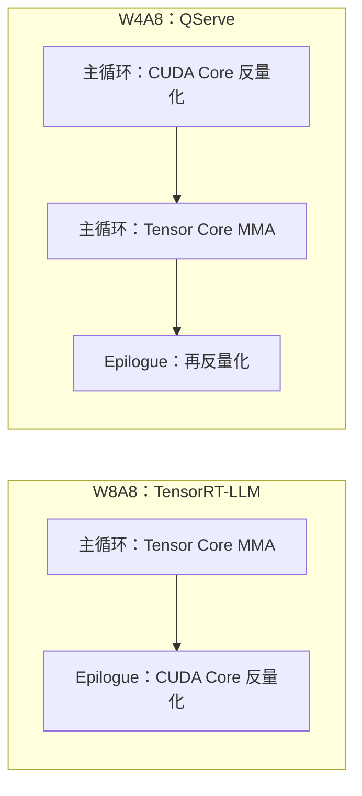
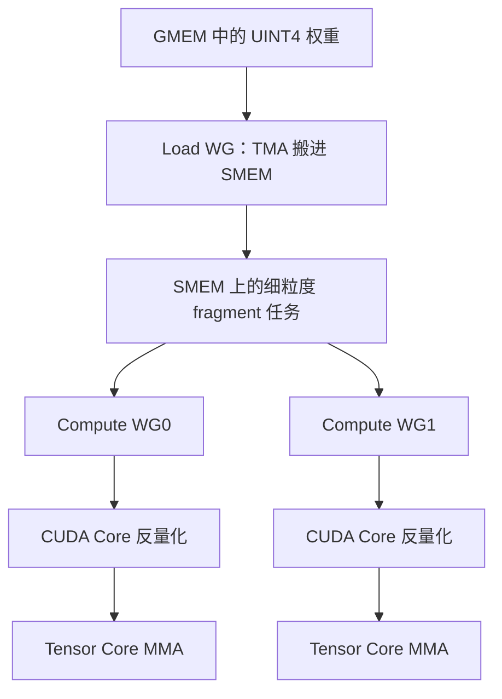

# LiquidGEMM：W4A8 省下的带宽，怎么从反量化里抢回来变成服务吞吐

<!-- release-date: 2025-09-01 -->

> 本文依据 ByteDance Seed 与上海交通大学的 **LiquidGEMM: Hardware-Efficient W4A8 GEMM Kernel for High-Performance LLM Serving**，即 arXiv:2509.01229v1（2025-09-01），共 12 页。截至核验 arXiv 只有 v1。页码均指这份 PDF。全文把三件事分开标注：**报告明确写了什么**、**我们如何解释或验算它**、**哪些是外部资料补充**。
>
> 封面共同一作是上海交大的 Huanqi Hu 与 ByteDance Seed 的 Bowen Xiao；通讯作者是上海交大的 Shixuan Sun。其余作者里，Jianian Yin、Zhexi Zhang、Xiang Luo、Chengquan Jiang、Weiqi Xu、Xiaoying Jia、Xin Liu 挂 ByteDance Seed，Minyi Guo 挂上海交大（PDF p.1）。目录按主要归属放在 `ByteDance`，合作关系只在正文说明。
>
> 这是一篇方法论文，对象不是对外可用的基座模型。`release-date` 取该技术首次官方公开日 **2025-09-01**，即 arXiv v1 提交日。同一工作后来作为 SC '25 论文发表（ACM 记录的正式出版日是 2025-11-15），按本模块规则不回写首发日。没有找到更早的官方博客。证据见文末。

W4A8、GEMM 分块、Roofline 的一般原理，本站写在知识库 `knowledge/04-Infra/01-原理/GEMM优化.md`、`权重与激活量化.md` 和 `量化.md`。那几篇讲的是算法家族和算账方法。本篇只讲这篇内核论文自己写了什么，以及它怎样把量化省下来的带宽变成服务吞吐。

## 读之前：这篇会反复用到的词

- **GEMM（General Matrix Multiplication，通用矩阵乘）**：把激活矩阵 $X$ 和权重矩阵 $W$ 乘起来。大模型里线性层、投影层、FFN 几乎都是它。论文写 $Y=XW^{T}$（PDF p.3）。
- **W4A8**：权重量成 4 bit，激活量成 8 bit。论文把它看成「精度、算力、显存」之间比较能站住的折中（PDF p.1）。
- **Tensor Core（张量核心）**：GPU 上专做小块矩阵乘加的硬件。Hopper 上 INT8 的峰值远高于 CUDA Core。
- **CUDA Core**：通用计算单元。W4A8 的 4 bit 权重在进 Tensor Core 之前，要先在这里反量化成 8 bit。
- **TMA（Tensor Memory Accelerator，张量内存加速器）**：Hopper 上专管「从显存搬数据」的硬件引擎，可以和计算重叠。
- **MMA / WGMMA**：矩阵乘加指令。Hopper 上一个 **warp group（线程束组，4 个 warp、128 线程）** 一起发射 `WGMMA`。
- **反量化（dequantization）**：把低位整数量回 Tensor Core 吃得下的精度。W4A8 的这条路必须发生在主循环里，躲不掉。
- **主循环（main loop）**：沿着归约维 $K$ 一片一片乘加。论文说这一段主导 GEMM 成本（PDF p.3）。
- **算术强度（arithmetic intensity）**：每从显存搬 1 个元素，能做多少次运算。它决定这件事是访存受限还是计算受限。

贯穿全文的矛盾不是「4 bit 够不够准」，而是：

> **W4A8 在纸面上同时便宜了带宽、抬高了算术强度；可现有内核把省下来的时间，又花在 CUDA Core 的反量化上。服务场景里算力和带宽对不上，不是量化方案选错了，是这条 4 bit 到 8 bit 的桥太慢。**

## 一句话先说清

LiquidGEMM 不是又一个量化算法。它是一条给高吞吐推理服务用的 **W4A8 GEMM 内核**。

论文做了两件必须一起成立的事（PDF p.1–2）：

1. **LiquidQuant（LQQ）**：把 4 bit 权重反量化成 8 bit 这件事，压到每 4 个元素两条硬件指令（`IMAD` 加 `XOR`），并且保证中间结果不溢出。
2. **隐式细粒度流水（Implicit Fine-grained Pipeline，ImFP）**：一个生产者 warp group 负责搬权重，多个计算 warp group 各自「反量化完立刻做 MMA」。重叠发生在 warp group 之间，不再靠软件同步，也不再把反量化结果写回共享内存。

摘要里的门面数字是：相对当时最强的 W4A8 内核最高 **2.90 倍**；端到端系统最高 **4.94 倍**；相对 TensorRT-LLM 里多种量化 GEMM 是 **1.12–1.63 倍**，系统级最高 **1.63 倍**（PDF p.1）。后文会把这些数拆开：哪些是内核自己挣来的，哪些混进了注意力和 KV cache 的差异。

如果只记一句：

> **量化把权重变瘦，只买到「搬得少」。能不能变成吞吐，取决于反量化能不能被 Tensor Core 盖住。**

## 这份 PDF 各页写了什么

12 页里没有附录。正文到第 11 页，参考文献占第 11–12 页。精度数字被作者明确推到「完整版技术报告」，这份 PDF 里没有。

| 报告章节 | PDF 页 | 讲了什么 | 密度 |
|---|---|---|---|
| 摘要 + §1 + Figure 1 | p.1–2 | W4A8 的纸面优势、现有内核慢一倍、LQQ 与 ImFP、生产部署声明 | 高 |
| §2 + Figure 2–3 | p.3 | 量化公式、GPU 上 GEMM 分块、W8A8 对称 vs W4A8 非对称 | 高 |
| §3.1 + Figure 4–5 | p.4 | 服务里 GEMM 占比；QServe 的 W4A8 在大 batch 上比 W8A8 慢约 2 倍 | 高 |
| §3.2–3.3 | p.4–5 | QServe 反量化为什么贵；成本模型；$T_{LD}/T_{DQ}/T_{MMA}$；$\alpha \leqslant 5$ | 高 |
| §4 + 式（7）–（12） | p.5–6 | LiquidQuant：平移到 UINT8、补码同余、XOR 翻最高位 | 高 |
| §5.1 + Figure 6 | p.6–7 | ExCP vs ImFP：1 个 Load WG + 2 个 Compute WG | 高 |
| §5.2 + Figure 7 | p.7 | Dual-MMA packed layout，一条 `LDS.128` 喂两次 MMA | 高 |
| §5.3 + Figure 8 | p.8 | 解包 + `IMAD` + `XOR`；4 元素 2 条指令，8 元素 7 条 | 高 |
| §5.4–6 + Figure 9 | p.8 | 转置 MMA、persistent kernel、CUTLASS；LiquidServe 整图 | 高 |
| §7.1–7.2 + Table 1 + Figure 10–11 | p.9–10 | H800、80 GB、系统吞吐；LiquidServe/wo 隔离内核贡献 | 高 |
| §7.3 + Figure 12–13 | p.10–11 | 统一框架下的内核延迟；LQQ / ExCP / ImFP 消融 | 高 |
| §8–9 + 参考文献 | p.11–12 | 相关工作、结论 | 低 |

三件需要提前知道的事：

1. **这篇几乎不讲量化精度。** 作者说 LQQ「保住了精度」，详细数字留给完整版技术报告（PDF p.9）。动笔前核过 arXiv，完整版没有作为后续版本出现。
2. **Roofline 表用的是 H100，实验跑的是 H800。** Figure 1 的硬件数字写 A100 / H100（PDF p.2）；§5 和 §7 明确用 H800 讲内核、跑评测（PDF p.6、p.9）。两者都是 Hopper，但不是同一块 SKU。
3. **论文没有和裸 cuBLAS 对照。** NVIDIA 侧的基线是 TensorRT-LLM 0.16.0 里的 FP16 / W4A16 / W8A8 / FP8 内核（PDF p.3、p.9）。后文凡是写「相对 NVIDIA」，都指这些 TRT 内核，不把它说成 cuBLAS。

## 第一层问题：W4A8 为什么在服务场景里算力、带宽对不上

### 纸面上，W4A8 应该左右逢源

论文把量化配置放进一张 Roofline 里讲（Figure 1c，PDF p.2）。人话版是：

| 配置 | 权重 | 激活 | 纸面上该赢在哪 | 纸面上会输在哪 |
|---|---|---|---|---|
| W4A16 | 4 bit | 16 bit | 小 batch、访存受限：权重量少 | 大 batch：算力还是 FP16，吃不到低位 Tensor Core |
| W8A8 | 8 bit | 8 bit | 大 batch、计算受限：INT8 Tensor Core | 小 batch：权重只瘦一半；显存也只瘦一半 |
| W4A8 | 4 bit | 8 bit | 两边都想要：带宽更低，又能走 INT8 MMA | 激活不能再压到 4 bit，否则精度掉得厉害 |
| W4A4 | 4 bit | 4 bit | 压缩最狠 | 论文引用前作，说激活 4 bit 往往伤精度（PDF p.1） |

Figure 1a 把硬件峰值摊开（PDF p.2）：

| 指标 | A100 | H100 |
|---|---:|---:|
| Tensor Core FP16 | 312 TOPS | 989.4 TOPS |
| Tensor Core INT8 | 624 TOPS | 1978.9 TOPS |
| Tensor Core INT4 | 1248 TOPS | **NA** |
| CUDA Core INT32 | 19.5 TOPS | 33.5 TOPS |
| 显存带宽 | 2 TB/s | 3.3 TB/s |

两件立刻能看出来的事（报告写了，解释是本文的）：

1. **Hopper 上没有 INT4 Tensor Core。** H100 那一格是 NA。所以 Atom 那种 W4A4 在 H800 上更慢——论文原话是 Tensor Core 不支持 INT4，后面评测直接把它和 QQQ 一起拿掉（PDF p.3）。W4A8 的「8」不是随便选的：4 bit 权重必须先回到 8 bit，才能喂给 Hopper 真正有的 INT8 MMA。
2. **Tensor Core 和 CUDA Core 差了两个数量级。** H100 上 INT8 Tensor Core 是 1978.9 TOPS，INT32 CUDA Core 只有 33.5 TOPS，大约 59 倍。反量化如果走 CUDA Core，稍有指令膨胀就会把 Tensor Core 饿死。

W4A8 相对 W8A8 还多一档算术强度：同样的计算量，权重量减半，拐点会往更小的 batch 挪。论文后面用成本模型把这个拐点算成 H100 上 W4A8 约 **150**、W8A8 约 **300**（PDF p.5）。服务里这很值钱：更早进入计算受限，意味着更小的 batch 就能喂饱卡，延迟更低，长序列也更不容易把显存先打满。

### 服务里，GEMM 仍然是大头

论文用 LLaMA2-7B（稠密）和 Mixtral-8×7B（MoE）在 H800 上拆时间，batch 从 4 到 256，两组长度是 1024 进 / 512 出，以及 128 进 / 128 出（PDF p.4）。

Figure 4 的结论很直（PDF p.4）：

- 小 batch 时，GEMM（FFN 和投影）主导延迟。
- LLaMA2-7B 在大 batch、长序列时，GEMM 仍超过总延迟的 **20%**。长度 1024、batch 256 那根柱子因为 OOM 没画。
- Mixtral 上 GEMM 在所有测试点都是第一大头，因为每个专家要单独做 GEMM。

decode 阶段拉长输入，不会改变 FFN 和投影的 GEMM 工作量，只会让注意力变重（PDF p.4）。所以这篇内核论文的战场很清楚：不是去重写注意力，而是把线性层这条一直在的开销压下去。

Mixtral 当时 TensorRT-LLM 的 W8A8 还不支持，所以那组图只留下 FP8 和 W4A16（PDF p.4）。这不是疏漏，是基线能力边界。

### 实测却和 Roofline 唱反调

Figure 5 画的是单层 GEMM 延迟（PDF p.4）。论文自己的原话比柱状图更硬：

- 小 batch（$M \leqslant 64$）时，现有 W4A8 和 W8A8 **差不多**。
- 大 batch（$M \geqslant 128$）时，W4A8 几乎比 W8A8 **慢 2 倍**。LLaMA2-7B、batch 256 这一句在引言里又说了一次（PDF p.1–2）。
- 它甚至不如几乎不量化的 FP16，也不如只压权重的 W4A16。

这和「访存受限时 W4A8 该赢、计算受限时该打平 W8A8」完全相反（PDF p.4）。QQQ 也是 W4A8，但论文说它比不过 QServe，所以后面只拿 QServe 当 W4A8 的代表（PDF p.3）。

**本文的理解**：服务场景里的「算力 / 带宽对不上」，不是 Roofline 算错了。Roofline 假设你付得起「把 4 bit 变成 8 bit」的手续费。现有内核把手续费做成了主循环里的一笔计算，CUDA Core 又太瘦，于是省下来的带宽根本走不到 Tensor Core。

### 卡点就在反量化，而且是一堆非原生指令

W8A8 是对称 GEMM：两边都是 8 bit，主循环可以整段待在 Tensor Core 上，反量化推到 epilogue（Figure 3a，PDF p.3）。

W4A8 是非对称 GEMM：Tensor Core 不吃 4 bit × 8 bit。QServe 必须在主循环里先把 UINT4 权重在 CUDA Core 上反量化成 INT8，再做 MMA；epilogue 还要再做一次带 scale / zero-point 的反量化（Figure 3b，PDF p.3）。

上图根据 Figure 3 重画，是机制示意，不是实测时间轴（PDF p.3）。

QServe 用一个 32 bit 寄存器一次处理 4 个元素。为了防溢出，它做了两件事（PDF p.4）：

1. **Progressive Quantization（渐进量化）**：把第一级 INT8 限制在 $[-119, 119]$，让 $Q_{u4}\cdot s_{i8}$ 先别爆。
2. **先乘后减**：不按教科书 $ (Q-z)\cdot s $ 先减 zero-point，改成 $Q_{u4}\cdot s_{i8}-s_{i8}\cdot z_{i8}$，避免去乘负数。

即便如此，减法仍可能溢出。它靠 `vadd` 对打包在 32 bit 寄存器里的 4 个 8 bit 数做向量加。论文指出：`vadd` **不是原生硬件指令**，会被 lowering 成十几条低级操作，CUDA Core 压力很大（PDF p.4）。Nsight 在 LLaMA2-7B 的 FFN 上看到，涉及 `vadd` 的减法占了 **21% 的 warp stall**（PDF p.4）。

**本文的理解**：21% 不是「反量化占总时间 21%」，是 warp 停下来等的时间里有两成跟这次减法有关。它说明 CUDA Core 正在拖 Tensor Core 的后腿，而不是给出一个可以直接当加速比的分数。

## 成本模型：三个时间谁盖得住谁

论文把一次主循环迭代拆成搬数和计算（PDF p.4–5）。激活通常更小、能留在更快的存储里，所以搬数近似成只搬权重：

$$
T_{\mathrm{LD}} \approx \frac{N_{t}\cdot K_{t}}{\phi_{\mathrm{BD}}^{x}}
$$

$N_{t}$、$K_{t}$ 是这块 tile 的宽和 $K$ 方向厚度，$\phi_{\mathrm{BD}}^{x}$ 是这块 thread block 搬类型 $x$ 的有效吞吐。

计算是反量化加 MMA：

$$
T_{\mathrm{COMP}} = \frac{\alpha\cdot N_{t}\cdot K_{t}}{\phi_{\mathrm{CUDA}}} + \frac{2\cdot \min(M_{t},M)\cdot N_{t}\cdot K_{t}}{\phi_{\mathrm{TC}}^{y}}
$$

$\alpha$ 是反量化 **一个权重元素** 要的指令数；$M$ 是 batch；$y$ 是激活位宽。一次乘加算两次操作（PDF p.4）。

流水线填满之后，一块 tile 的时间近似是

$$
T_{t} \approx k\cdot \max(T_{\mathrm{LD}}, T_{\mathrm{COMP}})
$$

$k$ 是沿着 $K$ 要走多少步（PDF p.5）。推到整卡，论文写成三个时间取最大（式（6），PDF p.5）：

$$
T \approx \Bigl\lceil \frac{M}{M_{t}} \Bigr\rceil \cdot \max\bigl(T_{LD},\; T_{DQ},\; T_{MMA}\bigr)
$$

三个名字的人话：

- $T_{LD}$：把 4 bit 权重从 HBM 搬进来。W4A8 比 W8A8 短。
- $T_{DQ}$：CUDA Core 做反量化。它跟权重元素个数成正比，跟 batch **无关**。
- $T_{MMA}$：Tensor Core 做 INT8 乘加。它跟 $\min(M_{t}, M)$ 成正比，batch 越大越能摊。

**本文的理解——这就是「对不上」的方程形式**：

- 访存受限时，你希望 $T_{LD}$ 最短。W4A8 确实更短。可如果 $T_{DQ}$ 已经比 $T_{LD}$ 长，省下的带宽看不见。
- 计算受限时，W4A8 和 W8A8 的 $T_{MMA}$ 一样（都是 INT8）。可如果 $T_{DQ}$ 盖不住，W4A8 会比 W8A8 多出一整段 CUDA Core 时间。论文说这能到慢 2 倍（PDF p.5）。
- 有人会想：再加大 batch，让 $T_{MMA}$ 去盖 $T_{DQ}$。论文立刻挡回来：算术强度最终被 tile 高 $M_{t}$ 卡住，而 $M_{t}$ 又被共享内存限制（PDF p.5）。batch 再大，一块 SM 一次也只能啃这么高的输出条。

拐点（$T_{LD}=T_{MMA}$）在 H100 上是 W4A8 **150**、W8A8 **300**；A100 上 W8A8 是 **156**。W4A8 把阈值砍半（PDF p.5）。论文说这和前作的 Roofline 分析一致。

**本文验算**（用 Figure 1a 的 H100 数字，按论文「W8A8 拐点 $= \Phi_{\mathrm{TC}}/(2\Phi_{\mathrm{BD}})$」这条关系）：INT8 峰值 1978.9 TOPS、带宽 3.3 TB/s、每元素 1 字节，得到 $1978.9/(2\times 3.3)\approx 300$。权重改 4 bit 后每元素 0.5 字节，有效元素带宽翻倍，拐点减半到 150。和正文一致。A100 的 156 同理：$624/(2\times 2)=156$。

服务含义论文写得很生产向（PDF p.5）：希望在 **小 batch** 就进入计算受限，这样才能吃满算力、降低延迟、撑住长序列、少一点硬件故障窗口。显存还会限制 batch。Tensor Core 涨得比带宽快，拐点被往后推——H100 的 W8A8 已经要到 300。W4A8 理论上能把这个点拉回来，前提是 $T_{DQ}$ 真的能被盖住。

## 设计原则：反量化必须便宜到 $\alpha \leqslant 5$

成本模型直接给出两条硬门槛（PDF p.5）：

- 访存受限时要 $T_{DQ}\leqslant T_{LD}$，H100 上每个元素的指令数 $\alpha \leqslant 5.07$。
- 计算受限时要 $T_{DQ}\leqslant T_{MMA}$，batch $M=150$ 时 $\alpha \leqslant 5.05$。

CUDA Core 还要顺便算地址，真实预算比 5 更紧（PDF p.5）。QServe 那种「一个 `vadd` 变十几条」远远超标。所以 LiquidGEMM 后面所有设计都可以看成一句话：

> **把 $\alpha$ 压进 5 以内，再让搬数、反量化、MMA 分属 TMA / CUDA Core / Tensor Core，互相盖。**

## 核心设计一：LiquidQuant，让反量化可以只走两条原生指令

### 旧问题：INT8 直接压成 UINT4，加减都会爆

LQQ 采用分组量化，以及「FP16 → INT8 → UINT4」的两级框架（PDF p.5）。第一级按通道、按式（1）把权重变成 INT8，并沿用 QServe 的保护区间 $Q_{i8}\in[-119,119]$。第一级反量化发生在 GEMM 的 epilogue，论文认为开销可忽略，于是把笔墨全放在第二级（PDF p.5）。

第二级的关键不是「再量一次」，而是先平移：

$$
Q_{u8}=Q_{i8}-\min(Q_{i8}),\qquad
Q_{u4}=\Bigl\lfloor\frac{Q_{u8}}{s_{u8}}\Bigr\rceil,\qquad
s_{u8}=\frac{\max(Q_{u8})}{\max(Q_{u4})}
\tag{7}
$$

$min(Q_{u8})$ 和 $min(Q_{u4})$ 都是 0，所以这里省掉 zero-point（PDF p.6）。平移整段离线做。

论文引言把这次平移叫做 rotation-based transformation（PDF p.2）。第四节实际写出来的就是上面这行减法（PDF p.6）。**本文的理解**：这是把有符号区间搬到无符号区间，不是 QuaRot / SpinQuant 那种 Hadamard 旋转。后文按公式讲，不沿用「旋转」这个容易和离群值摊平搞混的词。

在线反量化如果直写

$$
\widehat{Q}_{i8}=Q_{u4}\cdot s_{u8}+\min(Q_{i8})
$$

乘法还安全：保护区间保证 $s_{u8}\leqslant 16$，$Q_{u4}\leqslant 15$，乘积 $\leqslant 240$，落在 UINT8 里（PDF p.6）。加法就不安全了。论文给了一个会爆的例子（PDF p.6）：

- $Q_{u4}=15$，$\max(Q_{i8})=119$，$\min(Q_{i8})=-104$
- $s_{u8}=\lfloor 223/15\rceil=15$
- 数学上 $15\times 15+(-104)=121$
- 二进制里 UINT8 的 225 是 `1110 0001`，$-104$ 的补码是 `1001 1000`，不升位宽就加会得到 9 bit 的 `1 0111 1001`，溢出
- 若先把 225 当成 INT8 再加，`1110 0001` 读成 $-31$，更是错的

所以「加一个可能为负的 min」不能靠普通 8 bit 加法蒙混过关。

### 新设计：全部待在 UINT8 里，最后用 XOR 翻最高位

LQQ 用补码的同余：INT8 的 $i$ 和 UINT8 的 $j$ 只要 $i\equiv j\pmod{2^{8}}$，二进制就一样。例如 $-3\equiv 253\pmod{256}$，都是 `1111 1101`（PDF p.6）。于是目标变成：算出一个 UINT8，使它和真正的 INT8 **位型相同**。

论文把反量化改写成（式（12），PDF p.6）：

$$
\widehat{Q}_{i8}=(Q_{u4}\cdot s_{u8}+a)\oplus \mathtt{0x80}
$$

其中 $a=2^{7}+\min(Q_{i8})$ 离线算好，$\oplus$ 是按位异或。`0x80` 就是翻最高位。

为什么这能不溢出，论文用式（10）（11）证了一段（PDF p.6）。人话版分两步：

1. 先算 $q_{u4}\cdot s_{u8}+a$。因为 $s_{u8}\leqslant 16$、平移后的跨度 $\leqslant 238$，他们证明这个中间量 $\leqslant 255$，还在 UINT8 里。
2. 再加 $b=\pm 128$（也就是 $\pm 2^{7}$）会再次有越界风险。观察：$q+a\geqslant 128$ 时加 $-128$，$q+a<128$ 时加 $+128$，结果一定落在 $[0,255]$。而「加减 128」正好是翻最高位，也就是 XOR `0x80`。

运行时不必分支判断 $x$，一条 XOR 就够。第一级反量化仍走标准的式（2），放进 epilogue（PDF p.6）。

### 工作机制：4 个元素，两条 32 bit 指令

到了 §5.3，这条公式被落成寄存器里的位操作（Figure 8，PDF p.8）。每个线程从共享内存拿到 32 个 UINT4，装在 4 个 32 bit 寄存器里：一半给第一次 MMA，一半给第二次。

步骤是：

1. **解包**：沿用 QServe 的办法，用 `AND 0xF0F0F0F0` 再右移 4 位取出高 4 bit，用 `AND 0x0F0F0F0F` 取出低 4 bit，8 个 4 bit 变成两个寄存器里的 8 个 8 bit。
2. **`IMAD`**：一次完成「乘 scale $s_{u8}$、加偏移 $a$」。$s$ 和 $a$ 都是离线量。
3. **`XOR 0x80808080`**：4 个字节同时翻最高位，得到和目标 INT8 位型相同的 UINT8。

论文的成本账（PDF p.8）：

- 纯算术：4 个元素只需 **2 条**硬件指令（`IMAD` + `XOR`）。
- 算上解包：8 个元素一共 **7 条**指令。

这已经低于 §3.3 的 $\alpha\leqslant 5$ 门槛（$7/8=0.875$，远小于 5）。反量化之后，这些 UINT8 可以直接当 INT8 喂给 Tensor Core（PDF p.8）。

### 收益、代价、边界

收益是主循环里 CUDA Core 终于不再用「十几条 lowering 出来的指令」去补一条向量加。代价是量化侧必须接受 $[-119,119]$ 的保护区间，以及第二级走 UINT4 而不是 INT4。边界有两条论文自己划的：

- LQQ 优化的是 **效率**，精度手段正交。离线权重先走 SmoothQuant，再用 OutlierSuppression+ 网格搜索 smooth scale（PDF p.8）。
- 精度数字不在这篇 12 页里（PDF p.9）。

**可迁移启发**：遇到「低位宽必须升回硬件原生宽度」的内核，先问中间结果能不能全程待在无符号域，用补码同余把符号问题变成一次 XOR。这比「先转成有符号再加减」更贴硬件。

## 核心设计二：ImFP，让反量化不必写回共享内存

$\alpha$ 变小还不够。如果搬数、反量化、MMA 仍是三段串行，CUDA Core 和 Tensor Core 还是会互相等。

### 旧问题：再加一个 Dequant warp group，会把数据搬出一轮来回

CUTLASS 一类的高性能 GEMM 已经用 warp specialization：一部分 warp 只搬，一部分 warp 只算（PDF p.6–7）。Hopper 上调度单位是 warp group（4 个 warp、128 线程）。最直的推广是再加一个 Dequant WG，做成三级流水：TMA 搬权重、CUDA Core 反量化、Tensor Core MMA。论文把这个方案叫做 **Explicit Coarse-grained Pipeline（ExCP，显式粗粒度流水）**（PDF p.7，Figure 6a）。

ExCP 的鼓包来自两处（PDF p.7）：

1. **RF ↔ SMEM 来回。** Dequant WG 要从 SMEM 把权重量进寄存器，反量化后再写回 SMEM，MMA WG 再读走。来回搬一次，Dequant WG 更忙，流水线上出现气泡。
2. **软件同步。** Dequant 和 MMA 两个 warp group 之间要显式握手。

小 batch 时这套开销会把性能做负，后面消融会看到（PDF p.11）。

### 新设计：一个生产者，多个消费者，反量化完立刻 MMA

**Implicit Fine-grained Pipeline（ImFP，隐式细粒度流水）** 把反量化和 MMA 收进同一个 Compute WG。反量化结果留在寄存器里直接做 MMA，不再写回 SMEM（PDF p.7）。

重叠改到 **不同 Compute WG 之间**：WG0 在做 MMA 时，WG1 可以在做下一块的反量化。调度靠硬件，不再靠软件同步（PDF p.7）。

实现里每个 thread block 是 **1 个 Load WG + 2 个 Compute WG**（PDF p.7）。Load WG 当唯一生产者，把 GMEM 里的权重搬进 SMEM，切成 fragment 级的细粒度任务；两个 Compute WG 抢着消费，每个任务都是「自己反量化、自己 MMA」。

上图根据 Figure 6b 重画，是机制示意。原图的时间轴是 WG0 / WG1 交错：一个在 MMA，另一个在反量化，红箭头标出和 ExCP 相比少掉的那些等待（PDF p.6）。

论文特别写了一句：任务调度由硬件管理，从而避开软件同步开销（PDF p.2、p.7）。**本文的理解**：这里的「隐式」不是没有同步，而是不再由内核自己排三级生产者消费者的屏障；同一块数据的反量化和 MMA 在同一个 warp group 的寄存器里完成，跨 WG 的重叠来自它们本来就会被 SM 交错发射。

### 收益、代价、边界

收益是去掉 RF–SMEM 往返，并让 $T_{DQ}$ 和 $T_{MMA}$ 在两个 Compute WG 之间盖住。代价是一个 thread block 要养活 3 个 warp group，占用和共享内存都更紧。论文给的配置是 1+2，并说实验上明显好于 ExCP（PDF p.7）。边界：ExCP 和 ImFP 在消融里 **共用同一套内存布局和反量化逻辑**；它们相对「只有 LQQ、没有跨 GEMM 流水」的优势，还来自 grouped GEMM 之间的流水，MoE 上尤其明显（PDF p.11）。不要把 Figure 13 的柱子全部记成「ImFP 比 ExCP 快多少」，里面混了跨 GEMM 流水。

**可迁移启发**：异构单元流水最容易犯的错，是为了「看起来三级并行」而增加一条必须经过共享内存的通信边。能把相邻两级收进同一组线程的寄存器，就不要为了角色干净把数据写回去。

## 核心设计三：Dual-MMA packed layout，让 4 bit 也能一次吃满带宽

流水要的是数据按时到。4 bit 权重一旦按 8 bit 的 fragment 布局去搬，硬件指令会搬错。

### 旧问题：`ldmatrix` 假定 1 字节一个元素

Hopper 上 INT8 的 `WGMMA.m64nNk32` 做 $64\times N\times 32$ 的 MMA，$N$ 从 8 到 256（PDF p.7）。一个 warp group 要一块 $64\times 32$ 的 $W$ fragment；每个 warp 取 $16\times 32$，每个线程按打散图案拿 16 个元素。

`ldmatrix` 一次搬 16 连续字节，再按「每元素 1 字节」把每 4 字节一组散到对应线程（PDF p.7）。W4A8 的元素是 4 bit，这个假定崩了：本该给 T2、T3 的值可能被送给 T1（Figure 7a，PDF p.7）。

退路是 `LDS.32`：按地址搬 32 bit。可每个线程这一步只需要 4 个 4 bit，一半带宽浪费；指令条数和地址计算也更多，CUDA Core 又被多啃一口。论文把这个问题指回 QServe（PDF p.7）。

### 新设计：把两次 MMA 要的 32 个 UINT4 紧挨着放

一次 MMA 每个线程要 16 个 UINT4；粗粒度的 `LDS.128` 一次正好搬 32 个。LQQ 的布局把 **连续两次 MMA** 要用的数据打包在一起，让每个线程一条 `LDS.128` 拿齐 32 个 UINT4（PDF p.7，Figure 7b）。

和 QServe 的差别（PDF p.7）：

- QServe 把权重放在 2D 布局里。
- LiquidGEMM 改成 **1D 布局**，让同一线程两次 MMA 要的元素在内存里相邻。
- 这样可以消掉 shared memory 的 bank conflict，也不再需要 swizzle 或复杂 packing。

8 个线程同时发 `LDS.128`，吃满共享内存带宽（PDF p.8）。GMEM 里的权重事先排成同一布局，于是从 HBM 进来可以用每 warp 最粗的 `LDG.128`。布局变换离线做，运行时零开销（PDF p.8）。

### 收益、代价、边界

收益是：4 bit 不再被当成「残缺的 8 bit」去喂 `ldmatrix`；一条 128 bit 加载对齐两次 MMA；地址计算对 CUDA Core 的压力下降。代价是权重在显存里的物理顺序不再是数学上的行列顺序，任何要直接读权重张量的调试工具都会看到打乱后的布局。边界：这套布局和 QServe 的 compute-aware reordering 是亲戚，不是从零发明；论文写明受到 QServe 启发（PDF p.7）。

**可迁移启发**：硬件加载指令的粒度（32 bit / 128 bit）往往大于单个 MMA fragment 的需求。与其浪费带宽，不如把相邻两次计算要的数据预先拼成一次加载。离线重排比在线 swizzle 更适合服务场景——权重量完就不再变。

## 反量化如何融进 MMA，以及另外几条服务向的 GEMM 技巧

§5.3 已经把 LQQ 嵌进「SMEM → 寄存器 → MMA」这条路径。§5.4 又补了三条（PDF p.8）：

1. **改乘法方向。** INT8 的 WGMMA 把 $m$ 钉死在 64，$n$ 可以从 8 到 256。服务里 batch 经常小于 64。若仍做 $Y=XW^{T}$，短的那一维会对着被钉死的 $m$，Tensor Core 利用率差。论文改成 $Y=(WX^{T})^{T}$，按 batch 选 WGMMA，让灵活的 $n$ 去对 batch。
2. **Persistent kernel。** 论文说这是常规技巧，略过细节（PDF p.8）。
3. **CUTLASS / CuTe 的 warp-specialized ping-pong。** tile scheduler、mainloop、epilogue 接进现成抽象；反量化融进 MMA 主循环；Dual-MMA 布局用在加载。WGMMA、barrier、TMA 用 PTX 包在 CUTLASS 里；**反量化逻辑直接写 CUDA**（PDF p.8）。

第一级反量化（INT8 → FP16 那一层 scale）融进 epilogue，论文认为可忽略（PDF p.8）。

**本文的理解**：转置这一步是服务场景特有的。Prefill 或大 batch 时 $M$ 很大，两种写法差距小；decode 或中小 batch 时，$m=64$ 的硬约束会让「batch 放 M 维」变成大片空算。W4A8 已经在用 INT8 MMA，这块浪费不能再留。

## 它怎样接到一条能跑的服务系统上

内核要证明自己对吞吐有用，必须接到端到端系统里。论文把这条系统叫做 **LiquidServe**（PDF p.8–9）。Figure 9 画的是 LLaMA 的数据流（PDF p.8）：

- Q / K / V / O 和 FFN 的 Gate、Up、Down 都走 LiquidGEMM，权重 W4A8、激活 INT8，输出回到 FP16。
- 激活量化跟 SmoothQuant：FP16 动态按 token 量化成 INT8，先除掉 smooth scale。激活又小又便宜，通常融进别的内核（PDF p.8）。
- KV cache 做成 **INT8、按通道静态量化**，scale 离线算，做法跟 TensorRT-LLM（PDF p.8）。
- 注意力用 FlashAttention-2，KV 管理用 PagedAttention。不用 FlashAttention-3，因为 FA-3 面向 FP8（PDF p.8）。

离线权重：先乘 smooth scale，再两级量化（FP16→INT8 按通道，再按组到 UINT4）。组大小默认 **64**。smooth scale 用 OutlierSuppression+ 网格搜索（PDF p.8–9）。

和 QServe 的系统差异必须先记在这里，否则 Table 1 会读歪（PDF p.9）：

| 项目 | LiquidServe | QServe |
|---|---|---|
| 权重组大小 | 64 | 默认 128 |
| KV cache | INT8 按通道 | 4 bit |
| 注意力 | FlashAttention-2 | QServe 自己的实现 |
| GEMM | LiquidGEMM | QServe 的 W4A8 |

论文自己说：系统级数字还受注意力和 KV 管理影响，这些不在本文范围。所以他们做了两件事：一是端到端；二是把各家 GEMM 抽出来，放进统一的 CUDA 框架里比内核（PDF p.9）。为了再隔离一层，他们还做了 **LiquidServe/wo**：同一套 LiquidServe，只把 GEMM 换成 QServe 的 W4A8（PDF p.9–10）。

作者声明：LiquidGEMM **已经作为生产 LLM 服务里的主 GEMM 内核在部署**（PDF p.2）。代码、具体模型名、流量规模这篇论文都没给。

## 实验怎么证明「带宽变成了吞吐」

### 设定

- 机器：云上的 H800 80 GB，Intel Xeon Platinum 8457C，2.9 TB 内存（PDF p.9）。
- 软件：PyTorch 2.4.0，CUDA 12.4。
- 基线：QServe（GitHub `mit-han-lab/omniserve`，commit `5106921`）；TensorRT-LLM 0.16.0（commit `42a7b09`），精度包括 FP16、W4A16、W8A8、FP8（PDF p.9）。
- KV：TRT 的 W4A16 / FP8 / FP16 用 FP8 KV；TRT-W8A8 用 INT8 KV（PDF p.9）。
- 端到端长度：输入 1024、输出 512；batch 从 1 扫到 256 或 OOM，取峰值吞吐（PDF p.9）。
- 内核评测：抽出各系统 GEMM，用内部工具在统一框架里跑；单层 Transformer 的融合 QKV、输出投影、两个 FFN，平均 5 次（PDF p.9–10）。

精度侧只说「在 LLaMA / Mistral-7B / Mixtral-8×7B / Yi-34B 上测了 WikiText2 困惑度和 PIQA / ARC / HellaSwag / WinoGrande，LQQ 保住了精度」，数字不在本文（PDF p.9）。

### Table 1：同样 80 GB 下的峰值吞吐

数字单位是 token/s，括号里是取到峰值时的 batch（PDF p.9）。Speedup 相对 QServe 和 TRT 里更好的那一个。

| 系统 | LLaMA1-30B | LLaMA2-7B | LLaMA2-13B | LLaMA2-70B | LLaMA3-8B | Mistral-7B | Yi-34B | Mixtral-8×7B |
|---|---:|---:|---:|---:|---:|---:|---:|---:|
| TRT-FP16 | 410（13） | 5,521（128） | 2,701（64） | OOM | 13,920（256） | 14,573（256） | 1,931（64） | OOM |
| TRT-W4A16 | 1,170（48） | 4,953（128） | 2,906（109） | 2,266（128） | 12,997（256） | 13,513（256） | 4,645（256） | 5,712（256） |
| TRT-W8A8 | 1,006（36） | 5,083（128） | 2,922（100） | 1,166（46） | 13,012（256） | 13,636（256） | 3,860（128） | NA |
| TRT-FP8 | 986（36） | 5,913（144） | 3,402（96） | 948（45） | **16,820（256）** | **17,433（256）** | 4,206（225） | 8,296（256） |
| QServe | 1,478（64） | 5,402（128） | 3,311（124） | 871（64） | 5,240（128） | 5,361（124） | 1,415（64） | NA |
| LiquidServe/wo | 1,309 | 5,926 | 3,299 | 1,869 | 10,956 | 11,091 | 3,699 | 6,135 |
| LiquidServe | 1,607（53） | 6,721（194） | 4,105（119） | 3,695（184） | 16,694（256） | 17,011（256） | **6,999（256）** | 10,745（256） |
| Speedup | 1.09× | 1.14× | 1.21× | **1.63×** | 0.99× | 0.98× | 1.51× | 1.30× |

先把摘要里的大数对回这张表（本文验算，除法按表内整数）：

- **4.94 倍**是 Yi-34B 上 LiquidServe 6,999 / QServe 1,415 ≈ 4.95，也就是「相对先前 W4A8 系统」的峰值，不是相对 TRT。
- **1.63 倍**是 LLaMA2-70B 上 3,695 / TRT-W4A16 的 2,266 ≈ 1.63。同一行相对 TRT-W8A8 是 3,695 / 1,166 ≈ 3.17，正文写的是 **3.16 倍**（PDF p.9）。
- LLaMA3-8B 和 Mistral-7B 的 Speedup 是 **0.99×、0.98×**：TRT-FP8 赢了。论文解释是 TRT-FP8 在 H800 上用了为 FP8 优化的注意力内核（PDF p.9）。

QServe 通常在 batch 64 或 128 就到顶；LiquidServe 还能继续涨（PDF p.9）。QServe 在 LLaMA-30B、LLaMA2-13B 上能超过 TRT，论文把原因写成 4 bit KV 换来了更大 batch；其它模型上它明显更差（PDF p.9）。

**不要把 4.94 倍整段记进内核。** 同一张表里的 LiquidServe/wo 就是用来挡住这种读法的。论文说换成 QServe 的 W4A8 之后，端到端仍能看到 LiquidServe 相对 LiquidServe/wo 的 **1.13–1.98 倍**（PDF p.10）。**本文验算**各列 LiquidServe / LiquidServe/wo：

| 模型 | 比值 |
|---|---:|
| LLaMA1-30B | 1,607 / 1,309 ≈ 1.23 |
| LLaMA2-7B | 6,721 / 5,926 ≈ 1.13 |
| LLaMA2-13B | 4,105 / 3,299 ≈ 1.24 |
| LLaMA2-70B | 3,695 / 1,869 ≈ 1.98 |
| LLaMA3-8B | 16,694 / 10,956 ≈ 1.52 |
| Mistral-7B | 17,011 / 11,091 ≈ 1.53 |
| Yi-34B | 6,999 / 3,699 ≈ 1.89 |
| Mixtral-8×7B | 10,745 / 6,135 ≈ 1.75 |

区间确实是 1.13–1.98。Yi-34B 上即便 GEMM 换成 QServe，系统已经是 3,699 token/s，相对 QServe 的 1,415 仍有约 2.6 倍——那一截来自注意力、KV、调度，不是 LiquidGEMM。内核自己在这条系统里贡献的是另外那 1.89 倍。

大模型上 W4A8 的服务含义更干净：LLaMA2-70B 用 4 bit 权重换到更大 batch（184 vs TRT-W8A8 的 46），再靠 INT8 MMA 把算力吃起来（PDF p.9）。这正是开头那句「把省下的带宽变成吞吐」：带宽账让你在 80 GB 里塞进更大的并发，算力账让这些并发真的跑得动。

### 单层拆时间和同 batch 对照

Figure 10 在 Table 1 各自的峰值 batch 下拆一层 decode 的 GEMM / Attention / Others（PDF p.10）。论文点名的数字：

- LLaMA2-7B：LiquidServe 的 GEMM 最低，比 QServe 快 **1.90 倍**，相对 TRT 最高 **1.58 倍**。
- LLaMA2-70B：尽管 batch 更大，仍比 QServe 快 **1.15 倍**，但略慢于 TRT-W8A8。
- LLaMA3-8B 和 Mistral-7B：GEMM 和 FP8 打平，Others 略高。

Figure 11 把 batch 钉死再比吞吐：16 偏访存受限，128 接近计算受限。缺柱表示 OOM。LiquidServe 在画出的柱子上全面更高（PDF p.10）。原图是柱状图，本文不从图里读未写出的 token/s。

### 内核隔离：这才是和 QServe、TRT 内核的直接比赛

Figure 12 是 FFN 层 GEMM 延迟，batch 4 到 256（PDF p.10–11）。论文写出的结论：

- 小 batch 时，QServe 和 LiquidGEMM 在 LLaMA2-13B / 70B 上往往好于其它系统，4 bit 权重的访存优势还在。
- batch 变大后，**QServe 明显恶化**，LiquidGEMM 继续保持低延迟。
- batch **256** 时，相对 QServe：LLaMA2-7B **2.75 倍**，13B **2.87 倍**，70B **2.90 倍**。摘要的 2.90 倍就是这一格。
- Mixtral-8×7B：batch **小于 32** 时，TRT-W4A16 和 TRT-FP8 更快，因为它们有专门的小 batch GEMV 内核。超过 32 之后，LiquidGEMM 相对 TRT-FP8 是 **1.41–1.84 倍**，相对 TRT-W4A16 是 **1.12–2.53 倍**（PDF p.11）。

最后这个 1.12–2.53 是内核图上的区间；摘要里对 TRT 写的 1.12–1.63 是 **系统级**（PDF p.1、p.9）。两套区间不要混用。

**本文的理解**：QServe 在大 batch 崩掉，和 §3 的成本模型是同一件事——$T_{DQ}$ 在计算受限区盖不住 $T_{MMA}$。LiquidGEMM 的曲线没有跟着翘起来，说明 $\alpha$ 和 ImFP 至少在这条 FFN 形状上把反量化藏住了。Mixtral 小 batch 输给 GEMV，则是另一条边界：W4A8 的 INT8 MMA 路径并不是所有 $M$ 的最优解。

### 消融：LQQ、ExCP、ImFP 各自在哪一段发力

Figure 13 按「先开 LQQ，再叠 ExCP 或 ImFP」画加速比，横轴还是 batch 4 到 256（PDF p.11）。论文原话：

- 小 batch、访存受限时，LQQ 收益有限。
- 计算开始占主导后，LQQ 最高 **1.29 倍**。
- 小 batch 上开 ExCP 会变差，来回搬和同步是负收益；大 batch 上粗粒度流水才开始正收益。
- **ImFP 在所有 batch 上都提升。**
- ExCP 和 ImFP 共享布局与反量化；相对 baseline / 只开 LQQ 的优势，还来自 grouped GEMM 之间的流水，MoE 尤其如此。

原图纵轴大约到 3 倍，但论文没有把每根柱子的精确值写进正文。本文只采用正文写出的 1.29 倍和定性形状。

## 适用 GPU、限制，以及这篇没写的东西

### 这篇实际跑在哪

- 内核讲述以 **H800** 为「当前云上主力」（PDF p.6）。
- 端到端和内核数字全部来自 **单卡 H800 80 GB**（PDF p.9）。
- Roofline 和 $\alpha$ 门槛用的是 **H100** 的峰值表（PDF p.2、p.5）。
- A100 只出现在 Figure 1a 的对照列，没有 Ampere 实验。
- 没有 Ada、没有 Blackwell、没有多卡、没有 PD 分离。

**外部补充，不是论文内容**：H800 是面向中国市场的 Hopper，计算侧与 H100 同架构，互连被砍过。论文把 H100 的 TOPS 拿来建成本模型、把 H800 拿来报吞吐，读者不要把 Table 1 读成 H100 SXM 的绝对性能。

### 明确的能力边界

1. **小 batch / GEMV。** Mixtral 上 batch < 32 时，TRT 的专用 GEMV 更快（PDF p.11）。decode 单请求、几乎没有连续批处理时，不要默认 W4A8 MMA 内核能赢。
2. **FP8 注意力。** 小模型上 TRT-FP8 的端到端可以略胜，因为注意力内核吃到了 H800 的 FP8（PDF p.9）。LiquidServe 故意不用 FA-3（PDF p.8）。
3. **没有 INT4 Tensor Core。** 这既是 W4A8 存在的理由，也是它的天花板：权重再瘦，计算仍是 INT8 MMA，理论算力不会变成 A100 那种 INT4 峰值。
4. **精度证据缺席。** 「LQQ 保住精度」是作者声明，12 页里没有困惑度表（PDF p.9）。组大小 64 对 128、保护区间 $[-119,119]$，都会碰精度，但本文无法核验。
5. **和 QServe 不是单变量对比。** KV 位宽、组大小、注意力实现都不同。内核结论请看 Figure 12 和 LiquidServe/wo，不要只看 4.94 倍。
6. **没有公开内核代码。** 评测框架写明是内部工具（PDF p.9 脚注 3）。生产部署是作者声明（PDF p.2）。
7. **没有和 cuBLAS / CUTLASS 官方量化内核直接比。** NVIDIA 基线是 TensorRT-LLM 0.16.0 的量化 GEMM。CUTLASS 在本文里是实现底座，不是对照对象（PDF p.8）。

### 哪些是实验支持的，哪些只是观察

**实验支持：**

- 现有 W4A8（QServe）在大 batch 上可以比 W8A8 慢约 2 倍（PDF p.1、p.4）。
- 把反量化压到原生 `IMAD`/`XOR`，再配 ImFP 和 Dual-MMA 布局，FFN 内核在 batch 256 相对 QServe 达到 2.75–2.90 倍（PDF p.10–11）。
- 同一套服务系统里只换 GEMM，端到端仍有 1.13–1.98 倍（PDF p.10）。
- 80 GB 约束下，大模型（70B、Yi-34B、Mixtral）的峰值吞吐高于列出的 TRT / QServe 配置（PDF p.9）。

**作者观察或方向性判断：**

- W4A8 是生产环境里「精度和效率」的有希望方案（PDF p.1）。
- 生产上希望小 batch 就进入计算受限（PDF p.5）。
- LQQ 与提高量化精度的方法正交、可无缝结合（PDF p.8–9）。
- 已经作为生产主内核部署（PDF p.2）——没有外部证据链。

**没有公开、本文无法核实：**

- 完整版技术报告里的精度表。
- tile 大小 $M_{t}/N_{t}/K_{t}$、流水级数、寄存器用量、occupancy。
- 内部 benchmark 工具如何排除启动开销、是否用 CUDA Graph。
- 多卡张量并行、投机解码、PD 分离下这条内核还剩多少。
- 是否支持非 LLaMA 结构的每一层形状，除了实验列出的那些模型。

## 可迁移启发

1. **先写 $T_{LD}$、$T_{DQ}$、$T_{MMA}$，再决定量化配置。** W4A8 纸面漂亮，是因为假设 $T_{DQ}$ 能被盖住。服务里一旦 CUDA Core 成为第三种屋顶，Roofline 上的「该赢」会变成「慢一倍」。自己做 kernel 时，把反量化指令数 $\alpha$ 估出来，比先看理论 TOPS 有用。
2. **非对称 GEMM 的手续费必须融进主循环，而且必须是原生指令。** 先反量化写回显存再做 GEMM，访存量会不降反升。融进去之后，还要避免 `vadd` 这类会被 lowering 成一串的伪向量指令。LQQ 的补码 XOR 是一个可抄的模式：让中间值待在硬件喜欢的无符号域。
3. **流水线不要为了角色干净而多写一轮共享内存。** ExCP 看起来更「硬件单元一一对应」，ImFP 把反量化和 MMA 收进同一组寄存器，用第二个 Compute WG 去盖延迟。异构重叠的单位不一定是「一个阶段一个 WG」。
4. **布局按加载指令的粒度来，而不是按数学矩阵来。** Dual-MMA packed layout 的本质是：`LDS.128` 一次 32 个 UINT4，一次 MMA 只用 16 个，于是把两次 MMA 绑在一起。Hopper 上 `ldmatrix` 的 1 字节假定，是所有亚字节权重内核的第一只坑。
5. **服务向 GEMM 要把 batch 放到硬件灵活的那一维。** WGMMA 的 $m=64$ 是钉死的。小 batch 时做 $Y=(WX^{T})^{T}$，让 $n$ 去对 batch。这和量化无关，但和「decode / 中小连续批处理」强相关。
6. **端到端加速比要自己做隔离实验。** 4.94 倍很好看，LiquidServe/wo 把它拆成「系统其它部分约 2.6 倍、内核约 1.9 倍」。没有 /wo 这一列，W4A8 内核论文很容易把 KV cache 和注意力的功劳算到 GEMM 头上。
7. **依赖特定硬件的部分不要硬搬。** $\alpha\leqslant 5$、H100 INT4=NA、H800 上的 2.90 倍，都绑在 Hopper。Ampere 有 INT4 Tensor Core，Blackwell 另有一套低精度 MMA。换代之后，W4A8 还是不是「那个」折中，要重新算三个时间，而不是沿用这张表。

## 关键词回看

- **W4A8**：4 bit 权重、8 bit 激活。Hopper 上因为没有 INT4 Tensor Core，这是能走 INT8 MMA、又比 W8A8 更瘦的配置。
- **非对称 GEMM**：两边位宽不同，主循环必须反量化。对称的 W8A8 可以把反量化推到 epilogue。
- **$\alpha$**：反量化一个权重元素的指令数。H100 上要藏进搬数或 MMA，大约得 $\leqslant 5$。
- **LiquidQuant / LQQ**：先平移到 UINT8 再量到 UINT4；在线用 `IMAD`+`XOR` 得到和 INT8 位型相同的值。
- **保护区间 $[-119,119]$**：从 QServe 继承，用来保证乘 scale 时 UINT8 不爆。
- **ExCP / ImFP**：显式三级 WG vs 1 个 Load + 2 个 Compute、反量化结果不写回 SMEM。
- **Dual-MMA packed layout**：两次 MMA 的 UINT4 紧挨存放，一条 `LDS.128` 喂两发。
- **LiquidServe / LiquidServe/wo**：接上 FA-2 和 PagedAttention 的端到端系统；/wo 只换回 QServe 的 GEMM，用来隔离内核贡献。

如果只带走一句话：

> **量化省下的是带宽。服务吞吐要的是三个时间里最长的那段变短。W4A8 的最长那段常常是反量化；把这段压进两条原生指令、藏进寄存器流水，省下的带宽才会变成 token/s。**

## 资料与阅读边界

- **原始依据**：本地 `papers/ByteDance/LiquidGEMM.pdf`，即 arXiv:2509.01229 **v1**，12 页。`pdfinfo` 标题与封面一致；`Pages: 12`；文件约 1.13 MB。封面水印是 `arXiv:2509.01229v1 [cs.DC] 1 Sep 2025`。PDF 元数据 CreationDate / ModDate 为 2025-09-03（arXiv 加工时间），不等于首发日。
- **版本**：动笔前核过 [arXiv:2509.01229](https://arxiv.org/abs/2509.01229) 提交历史，只有 v1，时间 2025-09-01 08:16:20 UTC，12 pages, 13 figures。没有 v2，也没有作者另传的「完整版技术报告」。正文 p.9 预告的精度表，本文写做缺口，不补外部转述。
- **会议版**：同一标题见于 SC '25，ACM 页 [doi:10.1145/3712285.3759852](https://dl.acm.org/doi/10.1145/3712285.3759852)，记录出版日 2025-11-15，页码 1619–1630。摘要与 arXiv v1 一致。本文页码和数字一律来自本地这份 12 页 PDF，不混用会议论文集页码。
- **`release-date` 依据**：取 **2025-09-01**。对象是公开技术而非对外可用模型，按流程记首次官方公开日。当天事件是 arXiv v1。没有找到 ByteDance Seed 官方博客更早披露同一内核。SC '25 出版日 2025-11-15 是正式发表，不回写。
- **署名与归属**：上海交通大学与 ByteDance Seed 联合署名（PDF p.1）。主要归属按任务指定为 ByteDance（Seed）；上海交大的合作写在开头。
- **官方实现**：论文未给 LiquidGEMM 仓库。QServe 对照是 [mit-han-lab/omniserve](https://github.com/mit-han-lab/omniserve) commit `5106921`；TensorRT-LLM 对照是 [NVIDIA/TensorRT-LLM](https://github.com/NVIDIA/TensorRT-LLM) 0.16.0、commit `42a7b09`（PDF p.9 脚注）。这些是论文写出的基线定位，不是本文复现。
- **本文用到的外部补充**（不冒充论文）：
  - Hopper 没有 INT4 Tensor Core、H800 与 H100 的市场定位——用来读懂 Figure 1a 的「NA」和实验 SKU，峰值数字仍以 PDF 为准。
  - SmoothQuant、QServe、FlashAttention-2 / 3、PagedAttention 的一般原理见本站知识库与对应报告，本文只采用 LiquidGEMM 自己引用它们的方式。
  - 知识库里 W4A8「按组切断累加」的通用讨论，**不能**用来补这篇内核未公开的 tile 细节。
- **图表**：正文所有机制图均为根据 PDF Figure 1、3、6、9 重画的示意；Table 1 与正文写出的加速比按 PDF 转录。Figure 4、5、10、11、12、13 是柱状图，未在论文里给出每根柱子的精确数值，本文不从图里估数。
