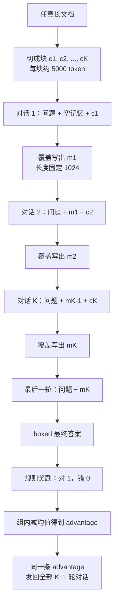

# MemAgent：不改注意力，把长文切段覆盖进固定记忆，再用独立上下文的多轮 RL 训这个覆盖动作

<!-- release-date: 2025-07-03 -->

> 本文依据 ByteDance Seed、清华大学 AIR 与 SIA-Lab 联合发布的 **MemAgent: Reshaping Long-Context LLM with Multi-Conv RL-based Memory Agent**，即 arXiv:2507.02259v2、2026-07-29 提交、共 29 页的 ICLR 2026 Oral 稿。通讯作者为 Mingxuan Wang 与 Hao Zhou。目录按索引登记放在 ByteDance，清华大学 AIR 的合作关系写在正文里。页码均指这份 v2 PDF 本身。文中会明确区分三层：**论文写了什么**（带页码）、**本文如何解释它**、**哪些是外部资料补充**（给出链接并标注）。
>
> 不要拿 arXiv 摘要页上的数字当正文。摘要页仍在引用 v1：「3.5M QA 性能损失 $<5\%$」「512K RULER $95\%+$」。v2 PDF 摘要改成了：从 8K 外推到 3.5M QA，损失不到 $10\%$；512K **NIAH** 超过 $95\%$（PDF p. 1）。下文所有数字以 v2 正文与表格为准。

## 读之前需要的最少背景

这篇论文不讲新的注意力核，也不是「无限上下文 Transformer」。模型的窗口还是 8K。它讲的是：已经会生成文本的语言模型，怎样学会**分段读长文、把认为有用的内容覆盖进一段固定长度的记忆、最后只凭这段记忆答题**，以及怎样用强化学习把这个覆盖动作训出来。

先记住五个词就够往下读。

**上下文窗口（context window）** 是模型一次前向能看见的 token 上限。普通注意力里，每个 token 都要和窗口里其他 token 比较，计算量大致随长度平方增长。

**KV Cache** 是生成时留下的中间结果。窗口越长，缓存越大。这篇论文的做法是让窗口本身不再随文档变长。

**覆盖（overwrite）** 在这里不是「往日记本后面追加一行」，而是每次读完一块新文本，把整段记忆**整段换成**一段新的、长度仍固定的普通 token。记忆永远不会比设定的 1024 token 更长。

**组相对策略优化（Group Relative Policy Optimization，GRPO）** 是一种不训练 value model 的强化学习算法：同一道题采一组回答，用组内均值把奖励变成 advantage，再按重要性比做裁剪更新。本站 [DAPO 解读](/reports/ByteDance/DAPO) 讲过它的四个默认陷阱；本篇在 DAPO 之上加的，是「一组里每一条回答本身又是多轮独立对话」。

**可验证奖励的强化学习（Reinforcement Learning from Verifiable Rewards，RLVR）** 是只看最终答案对不对、用规则打分的训练方式。MemAgent 的奖励不看记忆写得好不好看，只看最后那一轮有没有答对（PDF p. 5，式 3）。

实验跑在 **verl** 上（PDF p. 6）。verl 就是本站 [HybridFlow 解读](/reports/ByteDance/HybridFlow) 里那套 RLHF 框架的开源实现。同一条线上的算法基座见 [DAPO](/reports/ByteDance/DAPO)；把工具插进 rollout 的近作见 [ReTool](/reports/ByteDance/ReTool)。这一篇改的既不是注意力，也不是裁剪公式本身，而是 **rollout 里每一轮对话的上下文彼此独立，只靠一段可覆盖的记忆往下传状态**。

## 一句话先说清

把一本几百万 token 的书一次性塞进注意力，计算是平方的，缓存是线性膨胀的，而且「看得到」不等于「找得到」。

MemAgent 的做法是把这三件事拆开（PDF p. 2–4）：

1. 文档切成块，每块大约 5000 token，再加 1024 token 的问题和 1024 token 的记忆，整个窗口锁在 8K；
2. 每读一块，模型生成一段新记忆，**覆盖**掉旧的那一段；
3. 文档读完后，只拿问题和最后这段记忆生成答案。

训练时同一道题采 $G$ 条完整轨迹，每条轨迹是一串互不拼接的对话；最终答案的对错变成一条 advantage，**均匀发回这条轨迹上的每一轮覆盖**（PDF p. 3，Figure 3）。算法从 DAPO 扩成 Multi-Conv DAPO：loss 的维度从 `(group, token)` 变成 `(group, conversation, token)`（PDF p. 4，式 2）。

主结果必须连着任务和口径读。v2 摘要写的是：8K 窗口外推到 3.5M QA，损失不到 $10\%$；512K NIAH 超过 $95\%$（PDF p. 1）。Table 1 给出的是 RULER-HQA 准确率（PDF p. 5）：

| 模型 | 7K | 112K | 896K | 1.75M | 3.5M |
|---|---:|---:|---:|---:|---:|
| Qwen2.5-Instruct-14B-1M | 60.16 | 50.00 | 0.00 | N/A | N/A |
| QwenLong-L1-32B | 72.66 | 31.25 | 11.72 | N/A | N/A |
| RL-MemAgent-14B | 80.47 | 81.25 | 75.78 | 78.91 | 71.09 |
| RL-MemAgent-7B | 81.25 | 79.69 | 74.22 | 77.34 | 71.88 |

14B 从 7K 的 80.47 到 3.5M 的 71.09，掉了 9.38 个百分点；7B 从 81.25 到 71.88，掉了 9.37 个百分点。相对跌幅大约 $12\%$。摘要里的「不到 $10\%$」更接近百分点，而不是相对比例。引言里那句「without performance drop」（PDF p. 3）比表格更满，应以 Table 1 为准。

NIAH 是另一件事。Figure 5 的 512K 平均分：14B 为 98.18，7B 为 96.62，都超过 $95\%$（PDF p. 7）。正文另写「512K 上损失不到 $5\%$」（PDF p. 8）——那是 8K 到 512K 的 NIAH 跌幅，14B 从 99.74 到 98.18，7B 从 100.00 到 96.62，不要和 3.5M QA 的 $10\%$ 混成同一个数字。

所以本文的判断是：

> **长窗口不是记忆。记忆可以是一段普通 token；真正要学的，是每次覆盖时留下什么、扔掉什么。这件事用最终答案的奖励回传，而不是用新的注意力图案。**

这句话是本文对 Figure 2、Figure 3 和式 2 的归纳，论文没有用这一句概括。

## 旧方案卡在哪

论文把长上下文方法分成三路，每一路都卡在一个具体位置（PDF p. 2）。

第一路是位置外推和继续预训练：改 RoPE、做 NTK / PI / YaRN / DCA，再拿长文档继续训。窗口是拉长了，注意力仍是 $O(n^2)$，极长文本又慢又掉点。

第二路是稀疏注意力和线性注意力。复杂度下来了，但通常要从头训，稀疏图案靠人定，线性注意力也不好并行。

第三路是上下文压缩：在 token 级压，或外挂记忆模块。外推不稳，还要改生成流程，兼容性和并行都变差。

论文给的成功条件有三条：无限长、外推不明显掉点、解码线性复杂度（PDF p. 2）。三条要同时成立。只拉窗口，平方级的计算还在；只改注意力，基座要重训；只外挂模块，生成流程就不是原来那个 Transformer。

人类读书并不把每一页同时摊在桌上。我们做笔记、丢废话、遇到新证据再改笔记。论文把这个直觉写成一个 agent 工作流：固定长度的记忆、分段读、覆盖写（PDF p. 2，Figure 2）。

训练上还有第四个卡点。现有的多轮 agent RL，多半把工具返回和模型输出**拼成一条长对话**，或者用滑动窗口截一段（论文点名 Agent-R1、Search-R1、GiGPO，PDF p. 2、10）。MemAgent 每一轮的输入是「当前块 + 当前记忆 + 问题」，**不能**靠把前面所有块拼回去得到。一百轮覆盖如果拼成一条序列，窗口又爆了。所以优化目标必须是一组彼此独立的对话，而不是一条带 mask 的超长轨迹。

两层叠在一起，就是一个很具体的训练问题：

> **复杂度要线性，记忆就不能随文档变长；策略要可学，每一轮覆盖又必须能单独回传梯度。**

下面按这条因果链拆开。

## 全景：一段固定记忆，把一次长生成拆成许多次短对话

工作流只有两段模块（PDF p. 3–4）。

**读文档模块**：每次看见问题、上一轮记忆、下一块文本，生成一段新记忆，覆盖旧的。提示词在 Table 5 上半（PDF p. 17）。

**答题模块**：文档耗尽后，只看见问题和最后那段记忆，把答案放进 `\boxed{}`。提示词在 Table 5 下半。

位置编码不重标、不打补丁。两个模块用同一套分词和注意力布局。论文的说法是：这样能「解锁模型潜在的长度外推能力」，而且不用改架构（PDF p. 4）。

这是根据 PDF p. 2–5、Figure 2、Figure 3 与 Table 5 重画的**机制示意图**，不是实测时间轴。默认预算是：问题 1024、块 5000、记忆 1024、输出 1024，剩下的留给 chat 模板，合计卡在 8K（PDF p. 6）。

和「把整本书塞进 1M 窗口」的差别，论文画在 Figure 2 上半和下半（PDF p. 2）：

- 上面那路：长上下文 LLM 一次看见全部块和问题，直接出答案；
- 下面那路：同一个 LLM 反复出场，每次只看见一块和新的记忆，最后才答题。

颜色在原图里分了四类：文本块、问题、记忆、答案。关键不是多了一种颜色，而是块与块之间不共享 KV Cache，共享的只有那一段被覆盖的记忆 token。

## 核心设计一：覆盖式固定记忆 —— 因为追加会让窗口再长回去

### 旧问题

如果记忆是追加的，读到第 100 块时记忆本身就已经比窗口长。那只是把「文档长度」换成了「笔记长度」，平方注意力还在。外挂向量库或数据库可以绕开窗口，但生成流程就不再是标准 decoder，论文认为这会破坏兼容和并行（PDF p. 2）。

### 新设计

记忆就是上下文窗口里的一段普通 token，长度 $|m|=M$ 恒定。读完块 $c_k$ 之后，模型生成 $m_k$，**整段覆盖** $m_{k-1}$（PDF p. 3）。每一步的计算和显存是 $O(C+M)$，整篇文档是 $O(N)$（PDF p. 5）。

覆盖看起来浪费：刚写下的句子下一轮可能被整段换掉。论文认为这正是能线性扩展的原因——记忆长度永不增长，每块的计算就是常数（PDF p. 3）。

把它交给 RL，是因为「留下什么」没有逐步标签。奖励只在最后出现：记住了后来用得上的事实就加分，把宝贵的 1024 token 浪费在干扰项上就不得分（PDF p. 3–4）。

### 工作机制

一轮覆盖可以按提示词来看（PDF p. 17，Table 5）：

1. 系统告诉模型：这里有一个问题、一段可能含答案的文章、以及上一轮记忆；
2. 要求它更新记忆，**既写入对新问题有用的新信息，又保留旧记忆里仍然相关的细节**；
3. 模型在 `Updated memory:` 之后生成新记忆；
4. 系统丢掉旧记忆，只把新记忆带进下一轮。

最后一轮换成另一张模板：不要再读文章，只根据记忆把答案放进 `\boxed{}`。

论文特别写了一句：位置嵌入从不重标或打补丁（PDF p. 4）。意思是，它没有靠 YaRN 一类方法去「假装看见过百万 token」。每个 8K 窗口内部，位置仍是模型原来认识的位置。

附录 C 的案例把这个过程写得很具体（PDF p. 20–21）。问题是：浪漫喜剧 *Big Stone Gap* 的导演住在纽约哪座城？这是一道两跳题。

- 第 1 轮看到制作团队 Ghost 也在纽约，模型把这条**预先**记下，尽管它后来被证明是干扰；
- 第 2 轮没有相关文档，记忆保持不变；
- 第 3 轮同时出现影片条目和导演 Adriana Trigiani 住在 Greenwich Village，记忆立刻改写，并写出答案；
- 后面若干轮记忆不再变，直到最后用来答题。

论文的评语是：这些行为不是注意力机制给的，而是 RL 强化出来的文本生成能力（PDF p. 21）。

### 收益

窗口固定，所以：

1. 文档可以到百万级，因为它是流式处理的；
2. 每块 $O(1)$，整篇 $O(N)$；
3. 基座还是原来那个 decoder，不需要新的 attention kernel。

Figure 10 用 verl 的 Qwen2 FLOP 估计器画了 8K 到 4M（PDF p. 19）。基线在 1M 之后陡升，4M 处大约 $2.1\times 10^{19}$；MemAgent 的曲线几乎贴着横轴。这是估计器给出的计算量，不是墙钟延迟。

### 代价和边界

覆盖是有损压缩。1024 token 装不下就截断。附录 F.1 的失败案例正是：关键句被追加到记忆末尾，下一轮生成时被长度截掉，后来模型自己做了一次摘要腾地方，但第一跳已经丢了，最后用错误的总部地址答了题（PDF p. 24–26）。

另外，块与块必须串行。512K 评测超过 100 轮对话（PDF p. 8）；按 5000 token 一块，3.5M 大约是 700 轮。FLOP 线性，**延迟按轮数累加**。论文只报了 FLOP，没报墙钟时间和 GPU 数。

提示词要求「保留旧记忆里所有相关细节」，和「记忆长度固定」是一对矛盾。RL 要学的，就是在这句指令和 1024 token 硬上限之间做取舍。

### 可迁移启发

如果系统里有一条「必须记住、但又不能让状态无限长」的流水线（日志摘要、多文档客服、代码仓库问答），先问能不能把状态做成**定长可覆盖的文本**，而不是做成越来越长的对话历史。定长的好处是计算上限写死；代价是必须有一个信号告诉模型哪一句该被挤出去。MemAgent 用最终答案当这个信号。

## 核心设计二：独立上下文的多轮 DAPO —— 因为拼起来的轨迹会把窗口再次撑爆

### 旧问题

GRPO / DAPO 的默认 rollout 是：一道题生成 $G$ 条完整回答，每条回答是一条连续 token 序列。工具调用类工作流通常把观察和回复拼回去，再对工具 token 做 mask（PDF p. 2）。

MemAgent 做不到这一点。第 $j$ 轮的合法输入是 $(q, m_{j-1}, c_j)$，不是 $(q, c_1, m_1, c_2, \ldots)$。若把 100 轮拼成一条，上下文又回到「和文档一样长」。滑动窗口能截，但会丢掉更早的覆盖决策，论文认为不够灵活（PDF p. 2）。

### 新设计

把每一轮对话当成独立的优化对象。同一道题的一条样本，不再是一条序列 $o_i$，而是一串对话 $(o_{i,1},\ldots,o_{i,n_i})$。advantage 只从**含最终答案的那一轮**算出来，然后原样赋给这条样本的所有轮次、所有 token（PDF p. 4，式 1；Figure 3）。

loss 的维度从 `(group, token)` 扩成 `(group, conversation, token)`（PDF p. 4）。分母是整组所有对话的 token 数之和，这是 DAPO 的 token 级平均，不是 GRPO 那种先句内再句间。

advantage 不除标准差，论文写明是跟 Dr. GRPO（PDF p. 4）。奖励是规则判等：

$$
R(\hat y, y)=1_{\mathrm{is\_equiv}(y,\hat y)}
$$

对了为 1，否则为 0（PDF p. 5，式 3）。注意它不是 DAPO 数学题那种 $\pm 1$。

### 公式在算什么

先写单个 token 的裁剪项，避免上下标一次堆完：

$$
\mathcal C_{i,j,t}=\min\Big(
r_{i,j,t}(\theta)\hat A_{i,j,t},\;
\operatorname{clip}\big(r_{i,j,t}(\theta),\,1-\varepsilon_{\mathrm{low}},\,1+\varepsilon_{\mathrm{high}}\big)\hat A_{i,j,t}
\Big)
$$

其中

$$
r_{i,j,t}(\theta)=\frac{\pi_\theta(o_{i,j,t}\mid q,o_{i,j,<t})}{\pi_{\theta_{\mathrm{old}}}(o_{i,j,t}\mid q,o_{i,j,<t})},\qquad
\hat A_{i,j,t}=R_i-\operatorname{mean}(\{R_i\}_{i=1}^{G})
$$

- $o_{i,j,t}$ 是第 $i$ 条样本、第 $j$ 轮对话的第 $t$ 个 token；
- $r_{i,j,t}$ 是重要性比，条件里只有**这一轮**已经生成的前缀，没有把前几轮的块拼进来；
- $\hat A_{i,j,t}$ 对同一条样本的所有轮次、所有 token 都相同，来源是最终答案的对错。

完整目标（PDF p. 5，式 2；项目页给出了更干净的排版，与正文一致）：

$$
J_{\mathrm{DAPO}}(\theta)=\mathbb E\left[
\frac{1}{\sum_{i=1}^{G}\sum_{j=1}^{n_i}|o_{i,j}|}
\sum_{i=1}^{G}\sum_{j=1}^{n_i}\sum_{t=1}^{|o_{i,j}|}
\big(\mathcal C_{i,j,t}-\beta D_{\mathrm{KL}}(\pi_\theta\|\pi_{\mathrm{ref}})\big)
\right]
$$

期望的采样条件写成 $\pi_{\theta_{\mathrm{old}}}(\cdot\mid q,o_{i,j-1})$：第 $j$ 轮在分布上依赖上一轮的输出，因为上一轮的输出就是新记忆。依赖走记忆，不走拼接后的长上下文。这就是「独立上下文、串行状态」这句话的公式含义。

和 DAPO 原文对照，真正多出来的只有两处：多一个 conversation 下标；以及 KL 项被加了回来。DAPO 在长思维链里删掉 KL，理由是分布本来就该远离初始模型。MemAgent 把 $\beta$ 设成 $1\times 10^{-3}$，并关掉熵损失（PDF p. 17）。论文没解释为什么记忆任务要把 KL 请回来。本文的理解是：覆盖策略若离 instruct 模型太远，记忆格式会先崩，后面的轮次就没有可解析的状态可传。这是解释，不是论文原话。

Clip-Higher 的 $\varepsilon_{\mathrm{low}}$、$\varepsilon_{\mathrm{high}}$ 出现在式 2 里，附录 A.3 **没有给出取值**。DAPO 用的是 0.2 和 0.28，这里不能直接代进去。

### Algorithm 1 和式 2 对不上

附录 Algorithm 1（PDF p. 17）有几处和正文、Figure 3 不一致，读的时候要以式 2 为准：

| 位置 | Algorithm 1 写的 | 正文 / Figure 3 写的 |
|---|---|---|
| 上下文 | $h_{g,t}\leftarrow h_{g,t-1}\Vert o_{g,t}$，把历史拼回去 | 各轮上下文独立，不能靠拼接得到 |
| 优化范围 | 重要性比只打在最后一轮 $y_g$ 上 | advantage 发回所有轮次，loss 对所有 token 求和 |
| KL | 从奖励里减掉 $\beta d_g$ | 进 token 级 loss |
| 归一化 | `GroupNorm` | 明文写不除标准差 |
| 采样 | 从 $\pi_\theta$ 采 | 式 2 的期望是 $\pi_{\theta_{\mathrm{old}}}$ |

把伪代码当成实现细节会复现错。独立上下文这一点，官方项目页写得比附录更清楚：每一轮的输入不能由拼接前序轨迹得到。这是外部补充，见 <https://memagent-sialab.github.io/>。

### 收益

这样训有三个直接后果。

第一，100 轮覆盖不会变成一条 100 万 token 的训练序列。每一轮仍是 8K 窗口内的普通生成。

第二，早期轮次即使不产出最终答案，也能拿到梯度。第 3 轮把导演写进记忆、第 100 轮才答题，第 3 轮仍然被同一条 advantage 更新。这是稀疏奖励能传到「中间记忆」的唯一通道。

第三，同一套 Multi-Conv DAPO 不绑定「记忆」这个具体工作流。论文写它可以优化任意可验证结果的 agent 工作流（PDF p. 3）。仓库里后来加了异步「Agent as a function」接口，那是代码侧的事，见文末外部补充。

### 代价和边界

同一条 advantage 发给所有轮次，意味着**答错时每一轮覆盖都被罚，答对时每一轮都被鼓励**，不管那一轮记忆有没有实际贡献。这是 outcome reward 的老问题。论文没有做过程奖励，也没有对「哪一轮真正写入了关键事实」做归因。

组大小 $G=16$，rollout batch 256（PDF p. 17）。因为每条样本有 $n_i$ 轮对话，真实 mini-batch 不是 `256/16`。论文只说 off-policy 比例固定为 16，没给出墙钟时间和样本效率曲线。

动态采样、超长软惩罚这些 DAPO 组件，本篇附录没有声明开还是关。

### 可迁移启发

凡是状态不能拼回一条序列的工作流（覆盖记忆、重置上下文、分支成多条独立对话），不要硬套「工具 mask + 单轨迹 GRPO」。先问：最终奖励能不能变成一条样本级 advantage，再均匀发回每个独立上下文？能，就可以在现有 DAPO / GRPO 实现上加一个 conversation 维，而不必先发明新的注意力。

## 核心设计三：把自回归因式分解成读–写 MDP —— 这是看法，不是新架构

### 旧问题

标准自回归把整段 $x_{1:N}$ 写成

$$
p(x_{1:N})=\prod_{n=1}^{N}p(x_n\mid x_{1:n-1})
$$

每个新 token 都以全部历史为条件。这就是平方注意力的概率论来源（PDF p. 5）。

### 新看法

把无界历史换成定长记忆 $m\in\mathbb V^{M}$。文档流过 $K$ 个块 $c_1,\ldots,c_K$，每块长度 $\le C$。读完第 $k$ 块就覆盖写出 $m_k$。引入隐变量序列 $m_{1:K-1}$ 之后，联合概率写成（PDF p. 5，式 4）

$$
p(x_{1:N})=\sum_{m_{1:K-1}}\prod_{k=1}^{K}
\underbrace{p(c_k\mid m_{k-1})}_{\text{read}}\;
\underbrace{p(m_k\mid c_k,m_{k-1})}_{\text{write}}
$$

初值 $m_0=\varnothing$。块内仍是普通 Transformer decoder，条件只是常数窗口 $(c_k,m_{k-1})$。

Figure 4 左边画得像 Neural Turing Machine：Controller、Read Head、Write Head、Memory（PDF p. 4）。右边是图模型：文档块 $c^1,\ldots,c^{K+1}$ 是外部输入，记忆 $m^1,\ldots,m^K$ 是隐状态，最后一块 $c^{K+1}$ 对应答题。

### 必须分开的两层

论文画了 NTM 风格的盒子，实现里并没有单独的读写头。读和写都是同一张 LLM 按 Table 5 的提示词生成文本。记忆不是向量寄存器，就是 token。

式 4 的「read」项 $p(c_k\mid m_{k-1})$ 在训练里也没有被直接优化。块是外部输入，不是模型生成的。真正进 RL 的是写路径 $p(m_k\mid c_k,m_{k-1})$ 和最后的答题。论文把读写合在一起说成 MDP，目标是最大化这条轨迹的最终奖励（PDF p. 5–6）。这是一种看法：长文本建模和 RL 目标在「学习记忆状态的条件分布」上是一回事。它不是一个可以拿来算 perplexity 的新语言模型。

### 收益和边界

这个分解的用处是把「为什么是线性的」说清楚：每步条件窗口是 $C+M$，步数是 $N/C$，乘起来 $O(N)$。它不证明外推无损。外推靠的是 RL 之后记忆里还留着答案，不是靠这条因式分解自动成立。

把记忆放在 token 空间而不是特征空间，中间状态可以人读、可以检查，案例研究才写得出来（PDF p. 20–21、24–29）。线性注意力或 SSM 的状态通常没有这个性质。

## 训练 recipe：两阶段课程，窗口故意锁在 8K

基座是 Qwen2.5-7B-Instruct 和 Qwen2.5-14B-Instruct（PDF p. 6）。不是 base，是 instruct。框架是 verl 上的独立上下文多轮实现。

超参写在附录 A.3（PDF p. 17–18）：

| 项目 | 取值 |
|---|---|
| 算法 | DAPO，KL 系数 $1\times 10^{-3}$，关掉熵损失 |
| 优化器 | AdamW，恒定学习率 $1\times 10^{-6}$，前 20 步线性 warm-up |
| Rollout batch | 256 |
| 组大小 $G$ | 16 |
| Off-policy 比例 | 采样 batch : 反传 batch $=16$ |
| 窗口分配 | 问题 1024 + 块 5000 + 记忆 1024 + 输出 1024，其余给模板 |
| Stage I | 约 400 步训到收敛，再进 Stage II |

数据是两阶段课程（PDF p. 6、18）：

**Stage I** 用 32,768 条合成 QA，每条大约 32K token。做法跟 RULER 一样：把 HotpotQA 的金段落埋进大量干扰段落。每条大约 200 篇 wiki，合计约 28K token。先从 HotpotQA 训练集取 80,000 条，丢掉那些 Qwen2.5-7B-Base 或 Instruct 在**不给任何上下文**时 Best-of-2 就 100% 的题（这些题多半已经在参数里，不测记忆），大约滤掉 50%，再取前 32,768 条。

**Stage II** 用 2,560 条，最大长度 60K。来源是 DocQA-RL-1.6K 的困难长文 QA，再混上第一阶段的数据。

测试集用同一套管道合成不同长度：wiki 条目从 50 到 6400，对应大约 7K 到 3.5M（PDF p. 18）。验证集合成了 128 条。

这里有一个容易读混的数字。引言说「trained on 60K length documents」（PDF p. 3）；摘要和 GitHub 仍常写「trained on 32K text」。v2 的完整口径是：Stage I 是 32K 合成数据，Stage II 才到 60K，测试到 3.5M。8K 是**窗口**，不是训练文档长度。

评测用 `sub_em`：答案须包含标准答案的全部要素；多部分答案按命中比例给分。评测前去掉冠词、忽略大小写（PDF p. 18）。抽取格式写的是 `the answer is ANSWER.`，和提示词里的 `\boxed{}` 并列表述，论文没交代评测时到底用哪一种解析。

基线的生成配置在 Table 6（PDF p. 18）：QwenLong-L1 与 Distill / Instruct 系列窗口 128K，输入 120,000 / 输出 10,000；Qwen2.5-Instruct-1M 系列窗口 1M，输入 990,000 / 输出 10,000。MemAgent 始终走 8K 分块，不把 3.5M 一次性塞进去。

NIAH 用的是 RULER 的 `niah_single_{1,2,3}`（PDF p. 18–19，Table 7）：

- Level 1：干草堆是重复句子，针是魔法词对应的七位数字；
- Level 2：干草堆换成更长的文章，针仍是数字；
- Level 3：针改成 36 字符 UUID。

论文去掉了原版 RULER 的 answer prefix，因为和 MemAgent 工作流不兼容。

## 实验：什么被证明了，什么没有

### RULER-HQA：同一套合成题拉长，测的是长度不是分布

Table 1 和 Figure 1 是全文最显眼的图（PDF p. 1、5）。横轴从 7K 到 3.5M。基线在各自窗口内就开始掉，1M 级模型在 896K 掉到 0，还没摸到标称 1M。MemAgent 两条线几乎平着走，到 3.5M 仍在 71 附近。

必须记住：这条测试和 Stage I **同一套合成方法**（PDF p. 6）。金段落加干扰 wiki，只是条目从 50 加到 6400。它证明的是「同一分布下长度外推」，不是「任意长文档都能答」。3.5M 这个头条数字，建立在这条同分布测试上。

Qwen2.5-Instruct-1M 在 112K 仍有约 50 分，448K 掉到个位数，896K 为 0（PDF p. 5）。论文的评论是：窗口拉到 1M，不等于真会用超长上下文里的信息（PDF p. 7）。

### LongBench-QA：短、密、更像真阅读

Table 3（PDF p. 6）把 NarrativeQA、Qasper、HotpotQA、2WikiMultihopQA、MuSiQue 合在一起。任务相对短，信息密度高，材料覆盖小说、新闻、wiki。

RL-MemAgent-14B 平均 51.0，略高于 QwenLong-L1-32B 的 50.7；7B 平均 48.2。2Wiki 上 32B 推理模型仍更高（Distill-32B 83.5，MemAgent-14B 79.0）。Qasper 上 7B 反而到了 29.0，高于 14B 的 26.0。

论文认为这组任务测的是「更深的文本理解，而不只是检索」，并说记忆能力可以泛化（PDF p. 7）。数字上，14B 只比一个 32B 长推理模型高 0.3 分，而且这 0.3 分来自平均；单看 2Wiki 并没有赢。泛化存在，幅度没有 RULER-HQA 那么戏剧性。

Figure 7 的消融更关键（PDF p. 8）：不训练、只套工作流，LongBench-QA 上经常是微弱提升甚至变差；加上 RL 之后柱子才明显抬起来。RULER-HQA 上「只套工作流」已经能在超长处保住一条下降较慢的线（Figure 6），但 LongBench 这种密文本，没有 RL 几乎推不动。本文的判断是：工作流解决的是「塞得下」，RL 解决的是「记得对」。后者在分布一变就暴露。

### NIAH：低密度，512K 过 95%，和 RULER 全文不是一回事

Figure 5 是四张热力图（PDF p. 7）。多数基线在 128K 内就开始碎。Qwen2.5-Instruct-14B-1M 在 Level 1 的 512K 仍是 100，但 Level 2 的 512K 掉到 86.72，Level 3 掉到 92.97，平均 93.23。RL-MemAgent-14B 平均 98.18，7B 平均 96.62。

正文「512K 损失不到 $5\%$」对应的是这张平均热力图，不是 3.5M QA，也不是整个 RULER 套件。v1 摘要写成「512K RULER $95\%+$」，v2 改成「512K NIAH」。项目页和 GitHub README 仍写 RULER，见文末外部补充。

一个值得单独看的对照：不训练的 MemAgent-7B 在 NIAH 512K 平均 88.54，而同设置的 14B 只有 40.10，32B 是 71.88（PDF p. 7）。更大的未训练模型在覆盖工作流上并不更稳。RL 之后 14B 才反超。论文没有讨论这个倒置。

### LongBench-SUM：换了任务类型，指标是 ROUGE 召回

Table 2（PDF p. 6）用 GovReport 和 QMSum，报的是 ROUGE-1/2/L 的**召回**，不是常用的 F1。论文写 RL-MemAgent 在几乎所有指标上 SOTA（PDF p. 8）。细看：14B 在 GovReport 三项和 QMSum 的 ROUGE-1/L 最高；7B 的 GovReport ROUGE-1 是 30.28，低于 Instruct-7B 的 30.91，并不是全表第一。7B 赢在 ROUGE-2。

这组实验的作用是：训练信号全是 QA 对错，摘要任务仍能涨，说明学到的不完全是「HotpotQA 答题格式」。幅度不大，GovReport 平均从约 19 到 21.8。

### 记忆长度：1024 是折中，不是越长越好

默认 1024 记忆 + 5000 块，总长卡在 8192（PDF p. 8）。消融扫了 256 到 4096。

Figure 8 的 NIAH 上，更长记忆略稳一点，但 256 也已经很高（PDF p. 9）。Figure 9 的 LongBench 上，1024 附近是 AVG 的高点，256 明显低，4096 会往下折一点。论文的说法是 1024 是合理甜区，表现对记忆大小鲁棒（PDF p. 8）。

附录 D.1 把记忆和块的总长固定，线性改记忆大小（PDF p. 22，Table 8–9）。NIAH 上几种比例都在 94–100；LongBench-QA 上 14B 仍是 `m1024-c5000` 的 51.0 最高，`m4096-c1928` 掉到 48.5。更长记忆、更短块，并不自动更好——块变短意味着轮数变多，覆盖次数增加，管理负担也增加。

### 位置探针：随机打乱不是特殊福利

Table 4 把两团关键信息放在文档的不同相对位置（PDF p. 10）：开头和结尾 $(0\%,100\%)$、中间 $(40\%,60\%)$、都靠前、都靠后。数字是相对 random 的差值。

14B 在 $(0\%,100\%)$ 的 AVG 差是 $+2.79$，$(40\%,60\%)$ 是 $-0.11$；7B 各设置的 AVG 差都在 $-0.11$ 到 $+2.35$ 之间。没有出现某一列崩掉。

注意 14B 那一行 random 的 AVG 写成了 75.78，和 Table 1 的 896K 分数相同；若对 7K–448K 七列求平均应约为 80.91。7B 的 79.58 则正好是七列均值。这是表格笔误，差值行仍可看趋势，绝对值 AVG 不要当新结果引用。

论文的假说是：端到端优化会逼模型追踪关键信息，所以覆盖和 lost-in-the-middle 不会系统性爆掉（PDF p. 9）。探针支持「没有灾难性的位置偏好」。它不支持「覆盖从来不会丢信息」——附录 F 专门给了丢信息的例子。

### 和 RAG / Mem0 比：检索基线不弱，端到端仍高一截

附录 D.2 把 Mem0 和多组 RAG 拉进来（PDF p. 22–23）。Mem0 用 GPT-5.1 + `text-embedding-3-large`，按 5000 token 切块建记忆，检索 top 30。RAG 也扫了多种块长和 top-$K$。

Table 10 的 RULER-HQA 上，Qwen2.5-14B + RAG、$K=8$，3.5M 仍有 64.84，已经比所有「把文档一次性塞进窗口」的基线强得多；RL-MemAgent-14B 是 71.09。$K=8$ 在 7K 就是 78.12，和 MemAgent 的 80.47 接近，到 3.5M 才拉开。Table 11 的 LongBench-QA 上差距更大：14B RAG 最好平均 39.42，MemAgent 51.00。

论文的结论是端到端 RL 记忆比检索更灵活、更连贯（PDF p. 22）。本文补充一句：RULER-HQA 这种「金段落埋在同类 wiki 里」的设定，检索本身就很强；密文本 QA 上端到端的优势更干净。Mem0 用了更强的闭源模型，论文只说 MemAgent 胜过这些方法，没有把 Mem0 的逐长度数字印进表里。

## 失败模式：覆盖会丢，多跳会看走眼，先入为主会改不回来

v2 比 v1 多出来的实质内容之一，是附录 F 的三条失败轨迹（PDF p. 24–29）。它们比主表更能说明覆盖记忆的边界。

**信息被覆盖掉。** 问 Sachin Warrier 做过软件工程师的那家公司总部在哪。正确答案是 TCS，总部孟买。模型在第 289 轮确实写入了 TCS / Mumbai，第 290 轮却把这段追加在记忆末尾，生成时被截断。第 317 轮它主动做了一次摘要腾地方，但第一跳已经丢了，记忆里留下「总部在 Faridabad」这种错误残留。第 433 轮看见 Warrier 在 Kochi 的 TCS 工作过，于是用错误总部做了错误拼接（PDF p. 24–26）。

这不是注意力没扫到，是定长覆盖的物理限制：写得下，下一轮未必留得住；摘要腾地方时，模型可能丢掉真正关键的那一句。

**缺了关键信息。** 问 *The Hard Easy* 那一集客串演员的弟弟是谁。答案是 Bill Murray。第 143 轮已经出现 Brian Doyle-Murray 是 Bill 的哥哥，但当时模型还没看见剧集条目，判定「和问题无关」没存。第 215 轮看见客串名单，却已经把「弟弟」错误地绑到赛车手 Truex 兄弟上（PDF p. 27）。多跳题里，第一跳在第二跳出现之前看起来像干扰项。覆盖策略没有「先不知道有用也先记下」的普遍保证——案例 C 里 Ghost 那次预存，只是有时会发生。

**首因偏差。** 问 Brown State Fishing Lake 所在 country 有多少居民。英语 country 既是国家也是郡。模型第 1 轮就认定是美国人口，第 617 轮还把 3.27 亿写进记忆，第 728 轮已经看见 Brown County, Kansas 人口 9,984，却仍回答美国人口（PDF p. 28–29）。早期覆盖一旦写成信念，后面的正确证据进得了记忆，也改不了已经定下的答题策略。

这三条合在一起，论文自己已经把「无损外推」的适用边界画出来了：低密度检索（NIAH）几乎不触发它们；同分布长 QA 触发得少；真正的多跳、歧义、超长干扰堆叠，仍会在覆盖的缝里失败。

## 论文没写的、写错的、以及不要从别处抄来的数字

报告明确写了训练框架、两阶段数据、默认 8K 切分、主实验和失败案例。下面这些没有写，或者和别处的数字冲突。

没有写的：

- $\varepsilon_{\mathrm{low}}$、$\varepsilon_{\mathrm{high}}$ 的具体取值；
- 动态采样、超长过滤、软性超长惩罚是否沿用 DAPO；
- GPU 数、墙钟时间、训练成本；
- Stage II 的 2,560 条里 DocQA 和 Stage I 各占多少；
- 评测解析到底走 `\boxed{}` 还是 `the answer is`；
- Mem0 的逐长度分数；
- 除 QA / 摘要 / NIAH 之外的任务（代码库、多会话 agent 记忆、书籍问答只作为动机出现）。

正文内部的不一致：

- 摘要「不到 $10\%$」、引言「without performance drop」、Table 1 实际掉约 9.4 个百分点 / 相对约 $12\%$；
- Algorithm 1 与式 2 / Figure 3 在是否拼接、优化哪些 token、KL 放哪三件事上不一致；
- Table 4 的 14B AVG 像是误贴了 896K 的 75.78；
- Table 3 的模型名写成 `MEMAGENT`，未加 `RL-` 前缀，数字对得上 RL 版本。

不要抄下面这些外部数字。它们属于 v1 或项目页，不是 v2 正文。

v1 封面日期是 July 2, 2025，摘要写「8K 训在 32K 文本上，外推到 3.5M QA，损失 $<5\%$；512K RULER $95\%+$」。v1 Table 2 的 14B 是 7K 83.59 → 3.5M 78.12（约 5.5 个百分点），7B 是 82.03 → 71.09（约 11 个百分点）。项目页和 GitHub README 至今仍引用这组 v1 口径，并写「14B 在 3.5M 上下降 $<5.5\%$」。v2 把 14B 的 3.5M 改成了 71.09，摘要才改成 $10\%$。

arXiv 摘要页（截至 2026-09-11）仍显示 v1 那段话，尽管 PDF 已经是 v2。

## 可迁移启发

回到系统全貌，能带走的不是「再做一个 3.5M 窗口」，而是几条和规模无关的设计原则。

**第一，先问状态要不要增长。** 若任务允许有损，定长覆盖比拉长窗口便宜。窗口锁死之后，所有 infini-attention、位置外推、KV 量化都可以先不碰。代价是必须接受信息会被挤出，并准备失败案例里那种截断。

**第二，奖励要能回到每一次覆盖。** 只在最后判对错，是因为中间没有「好记忆」标签。能这么做的前提是：最终对错和中间记忆质量相关，而且同一条 advantage 发给所有轮次不会把训练撕碎。NIAH 这种低密度任务最符合这个假设；多跳密文本要弱一些。换到不可验证的开放生成，这条路会先断。

**第三，独立上下文是训练接口，不是推理噱头。** 推理时本来就是一轮一轮跑。难的是让 RL 系统承认「一条样本 = 一袋互不拼接的对话」。Search-R1 类拼接轨迹解决不了覆盖记忆，因为覆盖的点就是把旧块丢掉。任何会重置上下文的 agent（摘要后清空、子 agent 交还结论、工具返回后丢掉原始网页）都会碰到同一个接口问题。

**第四，工作流和 RL 要分开看。** Figure 6 显示不训练的覆盖工作流，已经能在超长 RULER-HQA 上比截断基线强；Figure 7 显示同样的工作流在 LongBench-QA 上几乎没好处。先上工作流、再决定要不要 RL，比一上来就训 400 步更便宜。若分布和训练合成数据很像，工作流的红利会被高估。

**第五，评测口径决定头条数字。** 同分布拉长（RULER-HQA 3.5M）、低密度针（NIAH 512K）、短密阅读（LongBench-QA）讲的是三件能力。对外只报 3.5M 和 $95\%$，会把后两件藏起来。自己做长上下文系统时，至少这三类都要各看一眼。

和 DAPO、ReTool 放在同一条 ByteDance Seed / SIA-Lab 线上，位置可以这样记：DAPO 改的是单轮 RL 的默认陷阱；ReTool 改的是 rollout 里能不能插入真的代码执行；MemAgent 改的是 rollout 里每一轮的上下文能不能彼此独立、只靠一段可覆盖的文本状态相连。三者都不改基座注意力。

## 关键词回看

- **覆盖式记忆（overwrite memory）**：固定长度的普通 token，每读一块就整段替换，不追加。
- **独立上下文多轮对话（context-independent multi-conversation）**：同一条样本拆成多轮生成，每轮输入不能由拼接前序轨迹得到，状态只通过记忆传递。
- **Multi-Conv DAPO**：DAPO 的 token 级裁剪损失加上 conversation 维；advantage 来自最终答案，发回所有轮次。
- **RLVR**：只用规则可验证的最终结果当奖励，不训练奖励模型。
- **RULER-HQA**：按 RULER 方法把 HotpotQA 金段落埋进干扰 wiki，长度可控；本文头条 3.5M 数字来自这里，与训练同分布。
- **NIAH**：大海捞针。本篇用 RULER 的三个 single-needle 变体；v2 摘要的 $95\%$ 指 512K NIAH 平均，不是整个 RULER。
- **sub_em**：子串级精确匹配，多部分答案按覆盖比例计分。
- **Dr. GRPO**：advantage 只减组内均值、不除标准差。
- **SIA-Lab**：清华大学 AIR 与 ByteDance Seed 的联合实验室；Qiying Yu 同时出现在 DAPO 作者列表里。

## 最后的判断

MemAgent 的贡献不是新的长上下文架构。8K 窗口、标准 decoder、标准 RoPE，全部保持原样。它真正做的是两件很薄的事：把记忆规定成一段可覆盖的 token，以及把 DAPO 的 loss 张开一维，让彼此独立的对话能共用一条最终奖励。

实验支持的部分很清楚。同分布长度外推（RULER-HQA）上，7B / 14B 从 7K 到 3.5M 掉约 9 个百分点，基线在窗口内就已经崩。低密度 NIAH 的 512K 平均超过 $95\%$。消融说明：工作流单独就能处理「超长塞不下」，RL 才把密文本 QA 和超长稳定性拉起来。失败案例诚实，三种崩法都给了轨迹。

实验没有支持的部分同样清楚。3.5M 不是任意长文档，是同一套合成 QA 把干扰 wiki 堆到 6400 篇。LongBench-QA 上相对 32B 长推理模型只有零点几分。摘要任务的提升很小。算法伪代码和公式对不上。KL 为什么加回来、裁剪半径取多少、训练花了多少卡时，都没有。v1 到 v2 主表数字变了，对外传播仍大量停留在 v1 的「不到 $5\%$」和「512K RULER」。

如果只记一句话，可以记：

> **不要把「看见过」做成「窗口更长」。把看见过的东西写成一段定长文本，用最终对错去教模型下一次覆盖时留下哪一句。**

## 资料与阅读边界

- 原始依据：本地 `papers/ByteDance/MemAgent.pdf`，即 arXiv:2507.02259v2，水印 `arXiv:2507.02259v2 [cs.CL] 29 Jul 2026`，29 页。封面无独立日历日期；ICLR 2026 页眉为 `Published as a conference paper at ICLR 2026`。
- arXiv 页面：<https://arxiv.org/abs/2507.02259>。v1 于 2025-07-03 03:11:50 UTC 提交（封面手写日期 July 2, 2025）；v2 于 2026-07-29 提交。`release-date` 取首次官方公开日 2025-07-03，不因 v2 或 ICLR Oral 改写。截至 2026-09-11，abs 页摘要仍是 v1 数字。
- OpenReview：<https://openreview.net/forum?id=k5nIOvYGCL>，arXiv 注释写明 ICLR 2026 Oral。
- 官方项目页：<https://memagent-sialab.github.io/>。页上的「损失 $<5\%$ / 512K RULER $95\%+$ / 14B 下降 $<5.5\%$」是 v1 口径，本文当外部补充，不与 v2 Table 1 混用。
- 官方代码仓库：<https://github.com/BytedTsinghua-SIA/MemAgent>。README 同样保留 v1 数字。仓库还写了一条论文没写的评测细节：训练用更严的 `\boxed{}` 精确匹配防止 reward hacking，测试用忽略冠词和大小写的宽松验证器，所以训练中的验证分（约 50%）会低于终测（约 80%）。这条只用于解释「训练曲线和终表对不上」，不能改写 Table 1。
- 权重与数据：<https://huggingface.co/BytedTsinghua-SIA/RL-MemoryAgent-14B>、`RL-MemoryAgent-7B`，数据集 `BytedTsinghua-SIA/hotpotqa`。权重文件提交时间可追溯到 2025-06-20；按本站口径，Hugging Face 仓库预置时间不单独改写 `release-date`。
- 跨篇参考：DAPO 的裁剪、token 级 loss 与 KL 删除见 [DAPO](/reports/ByteDance/DAPO)；verl 框架见 [HybridFlow](/reports/ByteDance/HybridFlow)；工具插入 rollout 的对照见 [ReTool](/reports/ByteDance/ReTool)；GRPO 基础见 [DeepSeek-R1](/reports/DeepSeek/DeepSeek-R1)。这些机制本篇都没有重新展开。
- 后作对照（外部补充，不是本 PDF 内容）：Berkeley SkyRL-Agent 把 MemAgent 做成一个会重置上下文的 Next 工具，见本站 SkyRL-Agent 篇。那是论文之后的框架接法，不能用来改写本篇的实验数字。
