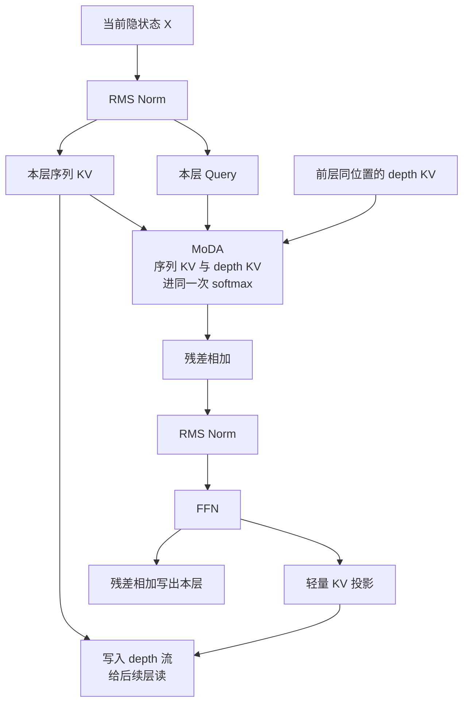
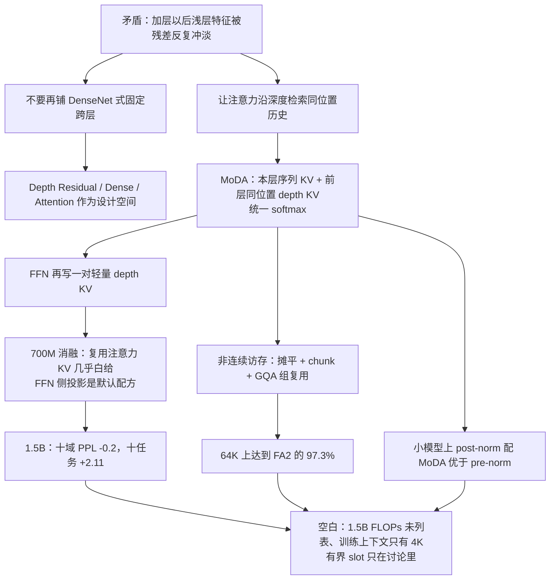

# MoDA：层叠得越深，浅层写过的有用特征越容易被残差冲淡；让每个头同时看本层序列，以及前层同位置的记忆

<!-- release-date: 2026-03-16 -->

> 本文依据华中科技大学电子信息与通信学院与 ByteDance Seed 联合发布的 **Mixture-of-Depths Attention**，即 arXiv:2603.15619**v1**，封面日期 2026-03-16，共 18 页。第一作者 Lianghui Zhu、第三作者 Bencheng Liao 的贡献产生于在 ByteDance Seed 实习期间（PDF p.1 脚注）。目录名按主要企业归属保持 `ByteDance`。
>
> 动笔前已核对 [arXiv 官方页](https://arxiv.org/abs/2603.15619) 与 [arXiv API](http://export.arxiv.org/api/query?id_list=2603.15619)：该论文只有 v1（2026-03-16 17:59:55 UTC），**本地 PDF 就是最新的 v1**，不存在更新修订。页码均指这份 PDF 本身的页码。
>
> 文中会把三件事分开写：**报告明确写了什么**（一律带 PDF 页码）、**我们如何理解它**（凡属推算、换算或图上读数都会写明）、**外部资料补充**（给链接并标注，不把仓库源码或后发博客冒充论文结论）。

## 读之前先和两个容易混的名字划清

这篇论文的方法名是 **Mixture-of-Depths Attention（MoDA，深度混合注意力）**。它要解决的不是「某些 token 要不要跳过某一层」，而是：

> 当前这个 Query，除了看**本层序列上的 KV**，能不能再看一眼**前面各层、同一个位置**留下来的 depth KV。

外部需要先挡住的同名工作是 DeepMind 的 **Mixture-of-Depths**（Raposo 等，2024）：那篇是按 token 动态决定要不要走完整一层，把计算沿着序列重新分配。**本 PDF 没有引用那篇工作**，两件事只是名字接近。下文凡写 MoDA，一律指「注意力沿深度检索」，不指「按 token 跳层」。

再把后文会反复出现的词翻成人话：

- **Token（词元）**：模型读写文本时的基本小块。
- **Query / Key / Value（查询 / 键 / 值）**：注意力的三个角色。Query 是当前 Token 的提问，Key 是索引标签，Value 是真正携带的内容。
- **残差流（residual stream）**：每一层算完一个增量，再加回原来的隐状态。层数变多以后，这条主干道里会反复叠加上新的增量。
- **GQA（Grouped-Query Attention，分组查询注意力）**：一组 Query 头共用一套 KV，用来减少 decode 时要搬的缓存。
- **FlashAttention**：把注意力按小块搬进片上 SRAM、避免反复读写显存的精确注意力实现。MoDA 的内核对照基线是 Triton 版 FlashAttention-2。
- **depth KV（深度键值）**：不是另一个序列位置上的 KV，而是**同一个 Token 位置、更浅那一层**写下来的 K 和 V。
- **unified softmax（统一 softmax）**：序列 KV 和 depth KV 的打分进**同一次**归一化，而不是两路注意力各做各的、最后再加权。

## 一句话先说清

普通 Transformer 把深度历史压进一条残差流：每一层都往同一个隐状态上再加一点。层数变深以后，浅层形成的有用特征会被后续增量反复稀释，后层很难再把它们完整找回来。论文把这件事叫 **signal degradation（信号退化 / 信息稀释）**（PDF p.1）。

MoDA 的回答不是再铺一套 DenseNet 式的固定跨层连线，而是把「沿深度读历史」做成注意力自己的事：

- 每个头仍然看本层的序列 KV（因果、看前面的 Token）；
- 同时看前层、**同一位置**的 depth KV；
- 两路分数进同一次 softmax。

为了让这件事在 GPU 上跑得动，他们又做了一套硬件感知内核：把本来非连续的跨层访存重排成可按块读取的布局，并和序列注意力共享同一套 online-softmax 状态。64K 长度上，这套内核达到 FlashAttention-2 的 97.3% 效率（PDF p.1、9）。

主实验是跟 OLMo2 recipe、400B token 训出来的 700M 与 1.5B 解码器。1.5B 上，10 个验证集平均 PPL 降 0.2，10 个下游任务平均 +2.11%，摘要称 FLOPs 开销 3.7%（PDF p.1、11）。他们还发现：MoDA 和 post-norm 组合，优于和 pre-norm 组合（PDF p.1、12）。

所以全文最值得记住的不是又一个注意力缩写，而是这条设计原则：

> **残差负责把层叠起来能训练；检索历史这件事，不要再指望那条被反复加法冲过的单通道。**

## 先看全景：一次 MoDA 注意力看见了什么

Figure 1 左栏是改过的 Transformer 块，右栏是「谁能看见谁」（PDF p.1）。下面这张是按那张图重画的**机制示意**，不是实测延迟。

读这张图只需抓住三件事：

1. **横向仍是因果序列注意力。** 当前位置可以看本层前面的 Token，和普通 decoder 一样。
2. **纵向多了一条同位置的深度记忆。** Query 在位置 $t$、第 $l$ 层时，还可以读 $\{(K_{i,t},\ V_{i,t})\}_{i=0}^{l-1}$，也就是前层在**同一个 $t$** 写下的 KV（PDF p.1 图注）。
3. **FFN 也会往深度流里写。** 注意力层默认复用本层序列 KV；FFN 则用额外的轻量投影，把 FFN 的输入变成一对 depth KV（PDF p.5）。后文消融会说明：这一步不是装饰。

Figure 1 右栏用紫、粉两块把可见范围画出来：序列方向是一块「到当前位置为止」的因果三角，深度方向是一条「钉在同一个 Token 上、穿过更浅各层」的竖条。论文的原话是：相对普通因果序列注意力，MoDA **额外允许 Query 去看 depth memories**（PDF p.1）。

## 第一层问题：深度为什么没有宽度好用

引言把现代 LLM 的缩放拆成四条轴：上下文长度、训练数据、模型宽度、模型深度。作者的观察是：当前实践更常走数据、上下文、尤其是宽度，因为它们的优化行为和系统效率更容易在大规模上兑现；深度虽然在表示上很有吸引力，却一直相对没被吃透（PDF p.2）。

更深的堆叠原则上能做更丰富的分层计算。但现代 Transformer 经常**加层却换不来成比例的收益**。论文点了两个原因：优化问题，以及信息稀释（PDF p.2）。

残差连接（ResNet 风格）把优化稳定性做上去了，可它仍然把深度历史压缩成**一条**隐状态轨迹。信息稀释这件事，残差并没有真正解决（PDF p.2）。

DenseNet 风格的稠密跨层连接能保住更完整的层历史，因而能缓解稀释；但参数增长在 LLM 尺度上太重，没有成为主流架构（PDF p.2）。Hyper-Connections、mHC、Virtual Width Networks 这类工作走的是「升级残差连接」；论文把它们放在相关路线里，自己没有沿这条路继续加残差通道（PDF p.2，参考文献 [22, 42, 49]）。

注意力在序列建模上的成功给出另一条原则：**数据依赖的动态混合，往往比固定模式的聚合更会保存和取回历史。** 作者把这条原则从序列搬到深度：让每一层按需要去读更早的层，而不是把所有历史都固定地投影进来（PDF p.2）。

于是问题变成一个工程权衡：表达力、效率、硬件友好，三者怎么同时站住。MoDA 的位置是——保留数据依赖的深度检索，但不付稠密跨层的二次方代价（PDF p.2）。

## 用「读、算、写」看四种沿深度堆叠的方式

§2.2 先问了一句很硬的话：残差连接是不是沿深度传播信息的最优机制？（PDF p.3）

他们把一个 Transformer 块看成三步：**read（读）→ operate（算）→ write（写）**。前两种是参照系，第三种是过渡配方，第四种才是本文的贡献（PDF p.3）。Figure 3 把四格画在一页上（PDF p.4）。下面按论文的口径讲，不把参照系写成「作者实现过的基线」。

### （a）Depth Residual：读是原样拿来，写是加回去

读是恒等，写是加法，算是注意力或 FFN。式 (3)（PDF p.3）：

$$
X_l = X_0 + \sum_{i=1}^{l-1} \mathcal{F}(X_i,\mathcal{W}_i)
$$

$\mathcal{F}$ 是该层的算子，$\mathcal{W}_i$ 是第 $i$ 层的权重。这个写法把残差的好处说清楚了：梯度有一条直路，很深的网络也能训。

代价也写在同一段里：深度流被反复叠加，持续压缩进一个固定尺寸的 $X_l \in \mathbb{R}^{T \times D}$。显著特征被冲淡，于是出现 signal degradation（PDF p.4）。

可以把它想成一本不断在同一页上加批注的笔记本。页还在，但第一层写下的那句关键话，会被后面几十层的字盖住。后层并不是「看不见浅层」，而是看见的是已经被加浑的总和。

### （b）Depth Dense：历史不压缩，但连接是死的、代价是二次方

读的时候，把前面所有表示 $\{X_i\}_{i=0}^{l-1}$ 线性投影回宽度 $D$；写的时候沿深度拼接，历史集合不被压缩（PDF p.4，式 4）。

论文的定性是：沿深度是**无损**的，因为拼接不会把历史集压扁。但计算主导项是 $O(T L^2 D^2)$，对大模型不可接受，而且连接模式是固定的（PDF p.4）。

### （c）Depth Attention：沿深度做注意力，但仍是单独一条路

这是作者引入的中间配方，用来当概念桥梁，不是主方法（PDF p.3–4）。

读的时候不再做固定线性投影，而是让当前 Query 沿**深度维**做注意力：Token $t$ 的 $Q_{l-1,t}$ 只看同一位置、前层的 $\{K_{i,t}, V_{i,t}\}_{i=0}^{l-1}$（PDF p.4，式 5）。写的时候为当前层再投影出新的 $Q_l, K_l, V_l$，把 $K_l, V_l$ 拼进深度流，把 $Q_l$ 交给下一层（PDF p.4–5，式 6）。

和 Depth Dense 比，它是数据依赖的，计算量降到 $O(T L^2 D)$，少了一个宽度因子 $D$（PDF p.5）。但它仍然是「深度注意力」和「序列注意力」分开的两条路——表 1 里 Depth Attention 的「Is unified softmax?」是叉（PDF p.5）。

### （d）Mixture-of-Depths Attention：把两条路熔成一次 softmax

MoDA 在 Depth Attention 上再做一步：把深度信息加进**标准序列注意力**，并熔成一个算子（PDF p.5）。

读：当前隐状态 $X_{l-1}$，加上历史 depth KV 流 $\{(K_i, V_i)\}_{i=0}^{l-1}$。

算：每个 Token 同时看本层序列 KV，以及自己的历史 depth KV；所有分数在**同一次 softmax** 里归一化（PDF p.5）。这是它和「先做序列注意力、再做一次深度注意力、最后加权相加」的分水岭。

写：

- 注意力层：把本层 KV 追加进深度流，供后续层读；
- FFN 层：用轻量 KV 投影得到对应的 depth KV（PDF p.5）。

统一 softmax 的好处，论文写的是：序列信息和深度信息进同一个表示空间（PDF p.5）。**本文的读法**是：两路如果各做各的 softmax，深度分支再强也只是「另外一票」；进同一次归一化，深度槽位必须和序列槽位抢同一份概率质量。后文 Figure 5 看到深度块上有持续的注意力质量，才说明模型真的在用这条通道，而不是把它当一条闲置旁路。

## 复杂度：数据依赖的检索，不必再付 $L^2 D^2$

Table 1 比较的是**沿深度流**这三种机制的渐近复杂度，不是整网端到端（PDF p.5）。$T$ 是序列长度，$D$ 是宽度，$L$ 是层数，$G$ 是 GQA 组大小，$H_k$ 是 KV 头数，$d$ 是头维度，$H_q = G H_k$。

| 项目 | Depth Dense | Depth Attention | MoDA |
|---|---|---|---|
| 数据依赖 | 否 | 是 | 是 |
| 统一 softmax | 否 | 否 | 是 |
| 参数 | $O(L^2 D^2)$ | $O(L D^2)$ | $O(L D^2 / G)$ |
| Decode 缓存 | $O(L D)$ | $O(L D / G)$ | $O(L D / G)$ |
| Prefill 缓存 | $O(T L D)$ | $O(T L D / G)$ | $O(T L D / G)$ |
| Decode FLOPs | $O(L^2 D^2)$ | $O(L^2 D)$ | $O(L^2 D)$ |
| Prefill FLOPs | $O(T L^2 D^2)$ | $O(T L^2 D)$ | $O(T L^2 D)$ |

Dense 被深度二次方和宽度二次方同时咬住。Depth Attention 去掉了跨深度累积的二次宽度投影，参数降到 $O(L D^2)$，缓存和计算都降一档。MoDA 保持同样的 FLOPs 阶和缓存阶，再把参数从 $O(L D^2)$ 降到 $O(L D^2 / G)$。原因写得很具体：**复用序列注意力的 Query 投影，不再为深度单独做 Q 投影**；在 GQA 下，只需分组的 depth K/V 投影（PDF p.5–6）。

有两件事表 1 没有强调，但后面会反复碰到：

1. **MoDA 的深度计算仍随 $L^2$ 走。** 每一层都看前面所有层的 depth KV，所以 FLOPs 是 $O(L^2 D)$ 而不是 $O(L D)$。层数翻倍，深度这条支路不是翻一倍。Table 2 里 $L$ 从 64 加到 256 时，额外耗时从 8.59% 涨到 30.52%，和这条渐近是对得上的（PDF p.9）。
2. **缓存按层数线性涨。** Prefill 缓存 $O(T L D / G)$ 意味着「把所有历史层的 depth KV 都留着」。§6.2 自己把这件事写成未来的内存瓶颈（PDF p.15）。

## 硬件：非连续的跨层读取，怎样变成还能吃满 Tensor Core 的块

§3 开头一句把矛盾说死了：朴素的 PyTorch 实现要对历史 depth 状态做非连续读取，GPU 利用率会掉（PDF p.6）。

因果链是：

- **旧问题**：depth KV 按层散落，Query 要 gather 不同层、同一位置的切片。这种访存既不规则，也喂不饱 Tensor Core 喜欢的块矩阵乘（PDF p.7）。
- **新设计**：先把深度缓存摊成可连续读的轴，再按 chunk 和 GQA 组收缩有效跨度，并与序列注意力共享同一套片上 softmax 状态。
- **工作机制**：Algorithm 1（PDF p.6）。
- **收益**：64K 上达到 FlashAttention-2 的 97.3%（PDF p.1、9）。
- **代价 / 边界**：这是注意力内核的 forward+backward 时间，不是端到端训练吞吐；额外时间随层数涨，随序列变长而被摊薄。

### 先补三块 GPU 常识

§3.1 用很短的篇幅把后文设计的约束钉住（PDF p.7）：

- **SM（流式多处理器）**：GPU 上真正干活的并行单元。长序列、小 batch 的训练里，必须沿时间维切出足够多的独立块，才能把 SM 喂饱。
- **CUDA Core vs Tensor Core**：前者做一般算术，后者吃规整的矩阵乘加。高性能内核要尽量把工作组织成 matmul，而不是逐元素的不规则控制流。
- **HBM vs SRAM**：HBM 容量大、延迟高；片上 SRAM 快但小。原则是提高 tiling 和数据复用，让热数据留在片上，少去 HBM。

### 第一步：Flash 兼容的扁平布局，先把 gather 变成连续块读

把深度缓存沿一根长度为 $T \times L$ 的轴摊平。对序列位置 $t$，它的 $L$ 个深度状态存在一起。于是每个 Query 只需映射到区间 $[tL,\ (t+1)L)$，就能取到正确的 depth KV 切片（PDF p.7）。

这一步已经比显式 for-loop 快得多，而且能对接 FlashAttention 风格的按块内核。但它留下一个利用率问题：深度分数矩阵 $S^{\mathrm{depth}} \in \mathbb{R}^{T \times (TL)}$ 里，只有块对角区域有效。Query 行 $i_q$ 真正需要的，只是 $j_d \in [i_q L,\ (i_q+1)L)$，其余全被 mask 掉（PDF p.7–8）。

论文把这个比例叫 **depth utilization（深度利用率）** $\eta_{\mathrm{depth}}$。如果在整张 $T \times (TL)$ 矩阵上做稠密计算（PDF p.8）：

$$
\eta_{\mathrm{depth}} = \frac{T \cdot L}{T \cdot (T \cdot L)} = \frac{1}{T}
$$

$T$ 越大，有效比例越低。64K 时这一步几乎是在对一张绝大部分被 mask 的矩阵做功。

### 第二步：Chunk-aware，每个 Query 块只看自己那一段深度

Figure 4 左栏就是上一步：Query 还可能扫过整条 $T \times L$ 的拼接深度轴。右栏改成按 chunk 重组（PDF p.7）。

长度为 $C$ 的 Query chunk，只配对它覆盖范围内、大小为 $C \times L$ 的局部 depth KV。内核在这块打包好的区域上算，而不是每个 chunk 都去扫全局 $T \times L$。论文给出的利用率变成（PDF p.8）：

$$
\eta_{\mathrm{depth}} = \frac{T \cdot L}{T \cdot (C \cdot L)} = \frac{1}{C}
$$

有效跨度从序列长度 $T$ 换成了 chunk 大小 $C$。$C$ 是内核超参，实验里固定为 64（PDF p.9）。

### 第三步：Group-aware，GQA 里相邻 Query 行其实是同一个时刻

关键观察：在 $T_q = G\, T_{kv}$ 的打包下，$G$ 行相邻 Query 共享同一个 **base-time** 下标 $\lfloor i_q / G \rfloor$，因此可以复用同一批 depth KV 块（PDF p.8）。

于是一个长度 $C$ 的 Query chunk，真正不同的时刻只有 $C/G$ 个，需要的深度跨度从 $C \times L$ 变成 $(C/G) \times L$。融合的块矩阵乘加 mask 之后，利用率再升到（PDF p.8）：

$$
\eta_{\mathrm{depth}} = \frac{G}{C}
$$

两种 mask 都用同一个 base-time 映射，保证序列因果和深度匹配不会各算各的下标（PDF p.8）：

- 序列因果：$\lfloor i_q / G \rfloor \ge i_k$；
- 深度匹配：$\lfloor i_q / G \rfloor = \lfloor j_d / L \rfloor$。

实践上还要求 Query 块大小能被 $G$ 整除，避免一个 tile 里出现跨组边界（PDF p.8）。

Table 2 的 $\eta_{\mathrm{depth}}$ 列可以直接用 $G/C$ 验算。$C=64$ 时：$G=8$ 对应 12.50%，$G=2$ 对应 3.12%，$G=32$ 对应 50.00%，与表完全一致（PDF p.9）。**本文验算**：这张表报的利用率，就是第三步公式，不是第一步的 $1/T$。

### Algorithm 1：两路分数，一套片上状态

内核的输入是（PDF p.6）：

- $Q \in \mathbb{R}^{T_q \times (H_k d)}$
- 序列 $K,V \in \mathbb{R}^{T_{kv} \times (H_k d)}$
- 深度 $K^{\mathrm{depth}}, V^{\mathrm{depth}} \in \mathbb{R}^{(T_{kv} L) \times (H_k d)}$

对每个 Query 块，先从 HBM 装进 SRAM，并在片上初始化 online-softmax 状态 $(m,\ \mathrm{acc},\ o)$：运行最大 logit、归一化累加器、未归一化的输出累加器（PDF p.8）。

然后分三段，**三段共用同一套状态**：

1. **完全可见的序列块**（base-time 已经严格晚于这些 Key）：不算因果 mask，直接做块注意力并更新状态；
2. **边界上的序列块**：加上分组因果 mask；
3. **深度块**：下标落到 $[t_{\mathrm{base}}^{\mathrm{start}} L,\ t_{\mathrm{base}}^{\mathrm{end}} L)$，只保留同一 base-time 的深度条目，再更新**同一套** $(m,\ \mathrm{acc},\ o)$。

最后在片上做一次 $o \leftarrow o / \mathrm{acc}$，写回 HBM（PDF p.6、8–9）。

论文把 online-softmax 的更新写成（PDF p.6）：

$$
\begin{aligned}
m' &= \max(m,\ \max S),\\
\mathrm{acc}' &= \mathrm{acc}\cdot 2^{m-m'} + \sum 2^{S-m'},\\
o' &= o\cdot 2^{m-m'} + \sum 2^{S-m'} V
\end{aligned}
$$

这就是 FlashAttention 那套「先记当前最大、再按差值缩放旧累加器」的在线归一化，用来避免先把整张注意力矩阵写到 HBM。底数写成 $2$ 是论文公式的原样；它和常用的 $e$ 底在实现上通常可以互相换算，本文不把底数选择解释成新的算法贡献。

论文给了一个具体下标例子：若 $G=4$，某个 Query 块含行 $i_q=8,\ldots,15$，则 $t_{\mathrm{base}} \in \{2,3\}$，于是 $t_{\mathrm{base}}^{\mathrm{start}}=2$、$t_{\mathrm{base}}^{\mathrm{end}}=4$（PDF p.8）。深度循环会去取这段时刻对应的连续 $L$ 倍深度跨度。

**可迁移的启发**：当你必须把「不规则的第二轴」（这里是层）接进一个已经高度优化的算子时，优先问两件事——能不能摊成连续块，以及已有的共享粒度（这里是 GQA 组）能不能变成复用单位。MoDA 两问都答了，97.3% 才不是口号。

## 效率数字：97.3% 的分母必须写清楚

Table 2 是 A100、bfloat16、Triton 版 MoDA 对 Triton 版 FlashAttention-2 的 **forward&backward** 内核时间。每组固定 $B=1$、$d=64$、$C=64$，分别扫序列长度、GQA 组大小和层数（PDF p.9）。

### 扫序列长度：$T=4096 \to 65536$，$G=8$，$L=64$

| $T$ | FA2 (ms) | MoDA (ms) | $\eta_{\mathrm{depth}}$ | 额外时间 |
|---:|---:|---:|---:|---:|
| 4096 | 7.970 | 10.750 | 12.50% | 25.86% |
| 8192 | 28.700 | 35.427 | 12.50% | 18.99% |
| 16384 | 116.700 | 127.661 | 12.50% | 8.59% |
| 32768 | 459.854 | 480.914 | 12.50% | 4.38% |
| **65536** | **1831.668** | **1883.026** | 12.50% | **2.73%** |

额外时间从 25.86% 降到 2.73%。论文的读法是：序列计算逐渐占主导，深度支路被摊薄（PDF p.9）。

**本文换算**：

$$
\frac{1831.668}{1883.026} \approx 97.27\%
$$

这就是摘要 97.3% 的来源。2.73% 额外时间与 97.3% 效率是同一对测量的两面，不是两次实验。对照基线是 Triton 版 FA2，不是手写 CUDA；测的是注意力内核的前向加反向，不是端到端 step 时间。

### 扫 GQA 组大小：更大的 $G$ 让深度支路更划算

$T=16384$ 固定，$G$ 从 2 到 32：利用率从 3.12% 升到 50.00%，额外时间从 27.07% 降到 2.84%（PDF p.9）。这直接兑现了 group-aware 那一步：组越大，同一批 depth KV 被越多 Query 头共用。

### 扫层数：FA2 不动，MoDA 线性变贵

$T=16384$、$G=8$ 固定。FA2 始终是 116.700 ms——它本来就不读 depth 流。MoDA 从 127.661 ms（$L=64$）涨到 138.224 ms（$L=128$）再到 167.958 ms（$L=256$），额外时间 8.59% → 15.57% → 30.52%（PDF p.9）。

这条曲线和 Table 1 的 $O(L^2 D)$ 是同一件事的测量版：深度历史越长，额外扫描越多。论文自己的概括是「可预测的线性缩放，在长序列、高利用率区间仍然高效」（PDF p.9）。更稳妥的说法是：**长序列、大 GQA 组时，摊销很好；把层数加到很深、而序列并不长时，额外时间会重新变成一等开销。**

## 实验设置：跟 OLMo2 recipe 训，不另起一套数据神话

主实验是 700M 与 1.5B 的 decoder-only 语言模型，都用 GQA，训在 OLMo2 数据集的 400B-token 子集上。精度 bfloat16，全局 batch 1024，上下文长度 4096。学习率、AdamW 等「更多训练配置」跟 OLMo2 实现（PDF p.10）。700M 变体那组还写了：2k step warmup 到最大学习率 $3\times 10^{-4}$，再按余弦衰减到 $3\times 10^{-5}$（PDF p.10）。

下游评测：PiQA、HellaSwag、WinoGrande、OpenBookQA、BoolQA、SciQA、COPA、MMLU、ARC-E、ARC-C。语言建模质量另报训练 PPL、C4 验证 PPL，以及 C4、ICE、m2d2-s2orc、Pile、Wiki-text 和 Dolma 子集（Books、Common Crawl、peS2o、Reddit、Stack）共 10 个验证域（PDF p.10）。

有两处正文口径需要原样记下，不替它圆：

- 评测列表写的是 BoolQA、SciQA，Table 4 列名是 BoolQA 与 SciQ（PDF p.10–11）。本文按表内列名引用数字。
- Table 3 写明 700M 的宽度 $D=1024$、GQA 组 $G=2$、序列 $T=4096$（PDF p.10）。Table 4、Table 5 的表注把同一组 $(D,G,T)$ **原样抄到了同时覆盖 700M 和 1.5B 的表上**（PDF p.11）。1.5B 的层数与宽度，正文没有另给独立规格。

## 变体消融：便宜的深度检索已经有用，FFN 侧再写一对 KV 才是默认配方

Table 3 全部是 700M、400B token（PDF p.10）。为了对齐 FFN 侧额外投影带来的参数，他们加了一条 38 层的 OLMo2，当作「差不多参数量」的对照。

| 行 | 设定 | 层数 | 参数 (M) | FLOPs (T) | Train PPL | C4 Val PPL | 下游平均 |
|---|---|---:|---:|---:|---:|---:|---:|
| (1) | OLMo2 | 36 | 669.0 | 8.01 | 14.49 | 18.59 | 56.93 |
| (2) | OLMo2 | 38 | 700.5 | 8.41 | 14.27 | 18.31 | 57.11 |
| (3) | 序列 KV + Depth KV | 36 | 669.0 | 8.02 | 14.08 | 18.48 | 58.10 |
| (4) | (3) + Extra FFN KV Proj. | 36 | 705.7 | 8.33 | 13.90 | 18.21 | 58.87 |
| (5) | (4) + Extra Attn KV Proj. | 36 | 742.4 | 8.63 | 13.83 | 18.17 | 58.97 |

论文自己的三条读法（PDF p.10–11）：

**（i）只复用前层序列 KV 当 depth KV，已经明显变好。** 行 3 与行 1 参数量相同，FLOPs 只多 0.12%，训练 PPL 降 0.41，C4 验证 PPL 降 0.11，下游平均 +1.17。不引入新的注意力侧投影。

**（ii）FFN 的 depth KV 值得加。** 行 3 只看了前面注意力层的 KV，忽略 FFN。行 4 给 FFN 输入 $X$ 加一对 KV 投影。相对行 3：训练 PPL 再降 0.18，C4 再降 0.27，下游再 +0.77。相对参数更接近的 38 层基线（行 2）：训练 PPL 降 0.37，C4 降 0.10，下游 +1.76。

**（iii）再给注意力侧单独做 depth 投影，已经饱和。** 行 5 相对行 4 只再降 0.07 / 0.04 / +0.10，参数从 705.7M 涨到 742.4M，FLOPs 从 8.33T 涨到 8.63T。作者的结论是注意力侧额外投影接近饱和。

因此后续放大实验的默认配方是**行 4**：序列 KV + 复用的注意力侧 depth KV + FFN 侧额外 KV 投影，不再加 Extra Attn KV Proj.（PDF p.11）。

**本文换算**：行 4 相对 36 层基线的 FLOPs 是 $8.33 / 8.01 \approx 1.040$，大约 +4.0%。摘要里 1.5B 的 3.7% 与这个量级一致，但 **1.5B 的 FLOPs 没有出现在 Table 4 或 Table 5**。3.7% 目前只能当作摘要口径，不能从 1.5B 表里直接复核。

设计原则可以收成一句：往深度里注入信息是有效的，但**额外投影加在哪**比「再加一层」更敏感。注意力侧历史 KV 几乎白给；FFN 侧值得花钱；注意力侧再投影一次就不够划算（PDF p.11）。

## 1.5B 主结果：10 个下游平均 +2.11，10 个验证集平均 PPL 降 0.2

同一 400B token 预算下，从 700M 扩到 1.5B。Table 4 是下游，Table 5 是分域 PPL（PDF p.11）。

### 下游（Table 4）

| 模型 | PIQA | HellaSwag | WinoGrande | OpenBookQA | BoolQA | SciQ | ARC-E | ARC-C | COPA | MMLU | 平均 |
|---|---:|---:|---:|---:|---:|---:|---:|---:|---:|---:|---:|
| OLMo2 700M | 73.72 | 58.77 | 55.33 | 35.60 | 56.24 | 89.50 | 66.84 | 33.44 | 77.00 | 24.69 | 57.11 |
| MoDA 700M | 73.39 | 59.19 | 60.22 | 37.20 | 59.33 | 89.60 | 67.37 | 34.78 | 82.00 | 25.61 | **58.87** |
| OLMo2 1.5B | 76.55 | 65.86 | 63.22 | 38.80 | 63.61 | 90.60 | 72.98 | 42.47 | 81.00 | 27.73 | 62.28 |
| MoDA 1.5B | 76.82 | 66.24 | 65.59 | 41.60 | 67.34 | 92.10 | 72.81 | 46.82 | 85.00 | 29.59 | **64.39** |

700M：57.11 → 58.87，+1.76。1.5B：62.28 → 64.39，**+2.11**。这就是摘要那句「10 个下游任务平均 +2.11%」的表内来源（PDF p.1、11）。

700M 这一行的 57.11，与 Table 3 的 **38 层** OLMo2 相同，不是 36 层的 56.93。也就是说，700M 的放大对照用的是「参数量接近」的更深基线。1.5B 的 OLMo2 对照有没有同样加层，正文没写。

分项上，论文强调收益分布在常识、因果判别、科学推理和知识类任务（PDF p.11–12）。按他们给出的差值：

- 700M：HellaSwag +0.42、WinoGrande +4.89、COPA +5.00；OpenBookQA +1.60、ARC-C +1.34、SciQ +0.10；BoolQ +3.09、MMLU +0.92。
- 1.5B：HellaSwag +0.38、WinoGrande +2.37、COPA +4.00；OpenBookQA +2.80、ARC-C +4.35、SciQ +1.50；BoolQ +3.73、MMLU +1.86。

不是每一格都赢。700M 的 PIQA 是 73.39 对 73.72；1.5B 的 ARC-E 是 72.81 对 72.98。平均提升成立，并不等于「十项全胜」。

Figure 2 把 1.5B 的 C4 验证损失和 HellaSwag / WinoGrande / ARC-Challenge 画成随 token 数变化的曲线，横轴到 400B（PDF p.2）。**本文从图上看到**：四条曲线里 MoDA（蓝）在训练后段都优于 OLMo2（红）；C4 损失两条都从约 3.00 降到约 2.80 附近，MoDA 全程在下方；ARC-Challenge 和 WinoGrande 的抖动明显大于 HellaSwag。这些是图上读数，论文没有给损失曲线的数值表。终点附近的准确率量级与 Table 4 的 1.5B 行一致。

### 分域 PPL（Table 5）

| 模型 | C4 | ICE | m2d2-s2orc | Pile | Wiki-text | Books | CC | peS2o | Reddit | Stack | 平均 |
|---|---:|---:|---:|---:|---:|---:|---:|---:|---:|---:|---:|
| OLMo2 700M | 18.32 | 17.43 | 24.37 | 9.53 | 12.26 | 16.78 | 20.53 | 9.17 | 23.84 | 3.93 | 15.61 |
| MoDA 700M | 18.29 | 17.24 | 23.64 | 9.48 | 12.06 | 16.58 | 20.52 | 9.14 | 23.75 | 3.90 | 15.46 |
| OLMo2 1.5B | 16.16 | 15.37 | 21.10 | 8.45 | 10.41 | 14.19 | 18.13 | 8.19 | 21.21 | 3.57 | 13.67 |
| MoDA 1.5B | 15.97 | 15.08 | 20.92 | 8.33 | 10.16 | 13.95 | 17.88 | 8.09 | 20.85 | 3.52 | **13.47** |

1.5B 平均 13.67 → 13.47，正好 0.20。这就是摘要「10 个验证基准平均 PPL 降 0.2」（PDF p.1、11）。两个规模上都是十个域全部下降，不是平均被一两个域拉动。700M 降幅最大的是 m2d2-s2orc（24.37 → 23.64）；1.5B 论文点名 Reddit（21.21 → 20.85）、ICE（15.37 → 15.08）、Wiki-text（10.41 → 10.16）。

Table 3 与 Table 5 的 C4 数字对不上。Table 3 里 36 层 OLMo2 的 C4 Val PPL 是 18.59、默认 MoDA 是 18.21；Table 5 的 700M 是 18.32 对 18.29。Table 5 的 18.32 更接近 Table 3 那条 38 层基线的 18.31。论文没有解释两张表的 C4 口径差异。本文按各表自己的数字引用，不把它们合成同一条曲线。

## 层数与归一化：post-norm 配 MoDA，比 pre-norm 配 MoDA 更划算

§4.3.1 换到更小的模型、FineWeb-Edu 数据，专门看深度预算和归一化位置。宽度 384，Query 头 6，KV 头 2；深的 48 层，浅的 24 层；指标是 FineWeb-Edu 验证损失（PDF p.12）。这组实验与主实验的 400B OLMo2 不是同一套数据，不能直接和 1.5B 的 +2.11 比绝对值。

Table 6（PDF p.12）：

| 行 | 层数 | Norm | Depth KV | Extra FFN KV | 参数 (M) | FLOPs (G) | Val Loss |
|---|---:|---|---|---|---:|---:|---:|
| (1) | 48 | pre | | | 123.38 | 136.61 | 3.3800 |
| (2) | 48 | post | | | 123.38 | 136.61 | 3.4062 |
| (3) | 48 | pre | ✔ | | 123.38 | 137.89 | 3.3759 |
| (4) | 48 | post | ✔ | | 123.38 | 137.89 | 3.3653 |
| (5) | 48 | pre | ✔ | ✔ | 128.11 | 144.00 | 3.3656 |
| (6) | 48 | post | ✔ | ✔ | 128.11 | 144.00 | **3.3484** |
| (7) | 24 | post | | | 71.35 | 78.19 | 3.4740 |
| (8) | 24 | post | ✔ | | 71.35 | 78.51 | 3.4537 |
| (9) | 24 | post | ✔ | ✔ | 73.72 | 81.24 | 3.4338 |

论文的三条观察（PDF p.12–13）：

1. **Depth KV 在深、浅两档都降损失。** 48 层 pre-norm：3.3800 → 3.3759；48 层 post-norm：3.4062 → 3.3653；24 层 post-norm：3.4740 → 3.4537。
2. **更深时，post-norm 从 Depth KV 拿到的好处明显更大。** 48 层 post-norm 降 0.0409，pre-norm 只降 0.0041。作者的表述是：Depth KV 在更深堆叠的 post-norm 配置里，优化影响更强。
3. **FFN 侧 KV 还能再降一点。** 48 层 post-norm 再降到 3.3484；24 层再降到 3.4338。

有一个表内事实，摘要没有写，但很影响怎么理解「MoDA + post-norm 更好」：

> 不加 MoDA 时，48 层 post-norm 的 3.4062 **差于** 同层 pre-norm 的 3.3800。加上 Depth KV 之后，post-norm 反超（3.3653 < 3.3759）。再加 FFN KV，post-norm 仍然最好（3.3484）。

所以摘要那句「combining MoDA with post-norm yields better performance than using it with pre-norm」（PDF p.1），被这张小模型表支持的是**两者组合之后的排序**，不是「post-norm 单独就更强」。主实验 700M / 1.5B 用的是 pre-norm 还是 post-norm，正文只说 follow OLMo2，没有在 Table 4 里再拆一刀。

这组实验的宽度只有 384，参数约 70M–130M，数据也换成 FineWeb-Edu。它能说明 MoDA 在不同深度预算下仍然有效，以及归一化位置会改变收益大小；它不能单独承担「大模型也必须改 post-norm」的结论。

## 注意力图：深度块上真有质量，而且不太像典型的 attention sink

Figure 5 来自训完 400B 的 700M 模型，combined-softmax 设定（PDF p.13–14）。列是均匀抽样的层 $\{0, 11, 23, 35\}$，行是每层随机抽的头。第一列只显示序列 KV；其余列是拼接后的 Sequence KV | Depth KV，红虚线是分界。深度块里同时包含注意力 KV 和 FFN KV（PDF p.13）。

**本文从图上看到的**（PDF p.14）：

- 第一列是标准的因果下三角，对角线亮，部分头在最左侧有竖条——这是常见的局部 / sink 形态。
- 红虚线右侧（depth KV）在第 11、23、35 层都有持续的亮带或散点，不是一条空的、全被 mask 的暗区。
- 有的头序列侧对角线仍然很尖，但右侧仍分出一部分质量；有的头序列侧更散，深度侧占比看起来更高。这与论文写的「互补模式」一致（PDF p.13）。

论文自己的观察有三层，需要按用词强度分开（PDF p.13）：

1. 中层和后层的深度块上有非平凡、持续的注意力质量 → 说明模型在主动检索跨层深度信息，而不是只用序列局部上下文。
2. 可视化头上的模式与典型 **attention sink（注意力汇聚点）** 不同：没有把很大一部分概率塌到少数固定位置，而是更宽地分到序列槽和深度槽。
3. 这「可能」改变长上下文下的质量分配；精确功能角色仍不清楚，值得后续研究。原文对第 3 点用了 *may*、*potentially*、*remains unclear*。

引言把「降低 attention-sink 行为」写进贡献概述（PDF p.2），正文 §4.3.2 则把机制解释留成开放问题。更稳的读法是：**图支持「深度通道被用上了」；「因此 sink 被治好」只是作者的定性观察，没有量化指标，也没有对照消融。**

## 内核消融：三步优化各自值多少

Table 7 在短序列 $T=1024$ 上做增量消融，单卡 A100、bf16，配置 $B=1$、$G=8$、$H_q=64$、$H_k=8$、$d=64$、$L=64$、$C=64$，报 forward+backward 毫秒（PDF p.13）。朴素 PyTorch 太慢，他们只在这个短 $T$ 上比。

| 行 | Naive Torch | Flash-compatible | Chunk-aware | Group-aware | 时间 (ms) |
|---|---|---|---|---|---:|
| (1) | ✔ | | | | 2128.900 |
| (2) | | ✔ | | | 13.102 |
| (3) | | ✔ | ✔ | | 6.286 |
| (4) | | ✔ | ✔ | ✔ | **1.460** |

论文的读法（PDF p.13、15）：

- Flash 兼容布局已经把 2128.900 ms 打到 13.102 ms，约 162.5×；
- chunk-aware 再从 13.102 降到 6.286，降 52.0%；
- group-aware 再从 6.286 降到 1.460，再快 4.31×；
- 三步合在一起相对朴素实现约 **1458×**。

这条消融回答的是「非连续访存到底有多贵」，不是「MoDA 比 FA2 快多少」。和 FA2 的比较在 Table 2；Table 7 的对照是自己的未优化实现。把 1458× 说成对 FlashAttention 的加速，是错的。

## 作者把没做完的事写在 Discussion 里

§5 的结论很克制：显式取回历史深度信息，是缩放 Transformer 深度时一条实际、有效的原语（PDF p.15）。他们还写 MoDA 与架构无关，可以接到多模态、视觉理解和世界模型——这是展望，本文主实验只有语言建模（PDF p.15）。

§6 给了两条明确的未完成方向。

### 工业训练还需要更多 CUDA 工程

当前内核相对 FlashAttention-2「已经有竞争力」，但还不是万亿参数训练的终点。生产环境还要更好的内存调度、更深的计算流水、以及融合注意力与分布式通信的重叠。这些不改变 MoDA 的算法行为，但会影响端到端吞吐（PDF p.15）。

### 全量 depth KV 缓存会成为内存瓶颈，作者提议有界 slot

层数很大时，缓存所有历史层的 depth KV，内存和带宽都随深度线性涨，长上下文训练和服务里可能变成主瓶颈。全量缓存越来越难撑住工业尺度（PDF p.15）。

他们提出固定大小的 **Depth KV slot buffer**：每个 Query 只看预算为 $S$ 的槽位，$S \ll L$，系统动态决定留下哪些 depth KV。两条自然策略：按效用打分取 top-$S$；或滑窗只留最近的。也可以混合——一部分槽给近处，剩下给高分的全局记忆（PDF p.15）。

这样做之后，内存和带宽从「随深度」变成「随槽位数」，张量形状也对融合内核更稳定。关键挑战是槽位分配的质量；如何把选择策略和 MoDA 一起训，以及在固定预算下权衡质量、延迟和硬件效率，都标成未来工作（PDF p.15）。

这句话等于承认：正文实验里的 MoDA 仍然是「看全部前层」。有界检索是图纸，不是已测过的模块。

## 论文没写、以及无法核实的

### 摘要口径在表里对得上、对不上的

- **对得上**：1.5B 下游平均 +2.11（Table 4：62.28 → 64.39）；10 域平均 PPL 降 0.2（Table 5：13.67 → 13.47）；64K 上 97.3% 效率（Table 2：1831.668 / 1883.026）。
- **对不上 / 未列表**：摘要 3.7% FLOPs。700M 默认变体相对 36 层基线约 +4.0%（8.33T 对 8.01T），相对 38 层基线反而略少（8.33T 对 8.41T）。1.5B 没有 FLOPs 列。
- Table 3 与 Table 5 的 700M C4 PPL 不一致，论文未解释。
- Table 4 / 5 表注把 700M 的 $D=1024$、$G=2$ 抄到了 1.5B 上；1.5B 的层数、宽度没有独立给出。
- 700M 放大对照用的是 38 层 OLMo2；1.5B 对照是否同样加层，未写。

### 完全没有的实验

- 没有 1.5B 以上、也没有长于 4096 的语言建模主实验。内核测到 64K，模型训练上下文是 4096。
- 没有把 MoDA 接到真实长上下文检索任务（NIAH、MRCR 这类）上。attention-sink 相关结论停在可视化。
- 没有官方大模型发布，没有指令微调 / RL 后训练。
- 有界 slot 缓存、动态 top-$S$、滑窗深度记忆：只在 §6.2 讨论，没有数字。
- 主实验没有把 pre-norm / post-norm 在 700M、1.5B 上再拆一次。
- Extra FFN KV 投影的具体结构（层数、是否共享、初始化）只描述为 light-weight / additional KV projections（PDF p.5、10）。
- 反向内核的实现细节没有单独成节；Table 2、Table 7 报的是前向加反向合计。
- 端到端训练吞吐、多卡通信、decode 阶段的实测延迟都没有。Table 1 的 decode 缓存是渐近式，不是测量。

### 代码仓只作为外部链接

官方实现在 [hustvl/MoDA](https://github.com/hustvl/MoDA)。仓库 `created_at` 为 2026-03-16T20:02:18Z，首次 commit「initial commit」时间为 2026-03-16T20:03:48Z，都晚于 arXiv v1 的 17:59:55 UTC。README 把 2026-03-16 标成论文与代码发布日，并把 2026-04-12 的博客 *The Second Half of Model Architecture* 列为后续材料。TODO 里「完整 LLM 训练 recipe 与可复现配置」在本文查阅时仍未勾掉；仓库另有视觉任务目录。

**本文没有阅读这些源码，也没有把其中任何实现细节、视觉实验数字或博客论述写进论文结论。** 它们只证明「有一个官方仓库存在」，不能用来补 PDF 没写的超参。

## 最值得带回自己项目的六条

### 1. 残差解决的是「能不能训深」，不是「浅层特征还能不能被完整读出」

式 (3) 把深度历史叠进固定尺寸的 $X_l$。优化稳定性来自这条加法高速公路，稀释也来自它（PDF p.3–4）。若你的模型变深以后出现「前几层明明学过、后层却像没看见」，先别只调学习率，问一下信息是不是已经被反复叠加冲掉了。

### 2. 需要取回历史时，优先用已经存在的注意力，而不是再铺固定稠密连线

Depth Dense 无损但 $O(T L^2 D^2)$；MoDA 用数据依赖检索，把主导项降到 $O(T L^2 D)$，并复用序列 Query 投影（PDF p.5–6）。跨层、跨模块、跨专家的「我还想看一眼旧状态」，都可以先问：当前 Query 能不能直接把旧状态当成额外 KV，而不是再学一套全连接。

### 3. 两路信息要抢同一份概率，比各做各的 softmax 再加权更硬

统一 softmax 迫使深度槽位和序列槽位竞争（PDF p.5）。代价是实现更难（必须融合内核、共享 online-softmax 状态）；收益是你能从注意力图上直接看到深度通道有没有被用上。如果只是旁路加权，深度分支很容易被学成接近关闭。

### 4. 把不规则轴先变成连续块，再问共享粒度能不能复用

非连续的跨层 gather 是 MoDA 朴素实现变慢的原因（PDF p.6–7）。三步布局——按 token 摊平、按 chunk 收缩、按 GQA 组复用——把利用率从 $1/T$ 做到 $G/C$（PDF p.8）。任何「第二个不规则维度」（层、专家、模态、文档段）要进 FlashAttention 类内核，都可以套同一条：先连续，再按已有的共享单位合并。

### 5. 报加速比时写清测的是内核还是整网，对照的是哪一个 FA2

97.3% 是 A100、bf16、Triton 对 Triton、64K、forward+backward 的内核时间比（PDF p.9）。1458× 是对朴素 PyTorch 的短序列消融（PDF p.15）。两者不能混用。层数加到 256 时额外时间回到 30.52%，说明「摊销很好」有自己的工作点。

### 6. 全量保存历史 KV 只是研究原型；规模化时预算必须封顶

§6.2 已经把全量 depth cache 写成工业瓶颈，并画出固定 $S$ 槽的方向（PDF p.15）。若你在自己的系统里复用「跨层 KV」，一开始就可以按槽位数而不是按层数做容量规划，免得研究原型的 $O(L)$ 缓存直接进生产。

## 用一张图重新串起全文

这张图是本文对全文逻辑的归纳，不对应论文中的任何一张图。

## 关键词回看

- **MoDA（Mixture-of-Depths Attention，深度混合注意力）**：每个头同时看本层序列 KV，以及前层同位置的 depth KV，分数进同一次 softmax。
- **signal degradation / information dilution（信号退化 / 信息稀释）**：残差把深度历史压进单条隐状态，浅层有用特征被后续增量冲淡。
- **depth KV**：同一个 Token 位置、更浅层写下的 Key 和 Value；默认复用注意力侧序列 KV，FFN 侧用额外投影。
- **Depth Residual / Depth Dense / Depth Attention**：沿深度「读—算—写」的三格参照系；MoDA 是把深度注意力熔进序列注意力的第四格。
- **unified softmax**：序列槽和深度槽抢同一份概率质量，而不是两路注意力事后加权。
- **depth utilization $\eta_{\mathrm{depth}}$**：深度分数矩阵里真正有效的比例。三步布局把它从 $1/T$ 做到 $G/C$。
- **base-time**：GQA 打包后 $\lfloor i_q / G \rfloor$，同一时刻的多个 Query 头共享同一批 depth KV。
- **Flash-compatible / chunk-aware / group-aware**：把非连续跨层读取变成可融合内核的三次布局。
- **post-norm vs pre-norm**：小模型、FineWeb-Edu 上，MoDA 与 post-norm 组合优于与 pre-norm 组合；不加 MoDA 时 post-norm 并不自动更好。
- **Depth KV slot buffer**：讨论中的有界深度缓存，用固定 $S \ll L$ 替代全量历史层。正文实验没有测。

## 最后的判断

MoDA 最强的叙事不是「我们又做了一种更快的注意力」，而是：**深度缩放缺的那一块，不是再加一条残差通道，而是给后层一条能够按需取回浅层原话的检索通路。**

被实验支持的结论：

- 700M 上，只把前层序列 KV 当 depth KV、几乎不增加参数，下游平均已经从 56.93 到 58.10；加上 FFN 侧投影后到 58.87，并超过 38 层、参数接近的 OLMo2（PDF p.10–11）。
- 1.5B、同一 400B 预算下，十个下游平均 62.28 → 64.39（+2.11），十个验证域平均 PPL 13.67 → 13.47（−0.20），且十域都下降（PDF p.11）。
- 硬件路径不是纸面复杂度：相对朴素实现约 1458×；相对 Triton FA2，64K 上额外时间 2.73%，即约 97.3% 效率（PDF p.9、13、15）。
- 小模型层数实验里，Depth KV 在 24 / 48 层都降验证损失；48 层上 post-norm 配 MoDA 的收益明显大于 pre-norm（PDF p.12）。
- Figure 5 显示中后层的深度块上确有注意力质量（PDF p.13–14）。

只是作者观察或尚未闭合的部分：

- 「降低 attention-sink」没有量化，正文自己说功能角色不清楚（PDF p.13）。
- 摘要 3.7% FLOPs 没有 1.5B 表内复核。
- 多模态 / 世界模型是展望（PDF p.15）。
- 有界 slot 缓存是未来工作，不是已交付能力（PDF p.15）。

完全没有公开的部分：1.5B 独立架构规格、大于 4K 的训练上下文、decode 实测、端到端训练吞吐、slot 选择策略的实验，以及完整可复现的工业训练 recipe。官方仓库存在，但本文未读源码，不把它当作论文证据。

如果只记一句话，可以记：

> **层可以叠得很深，但残差加法会把浅层写过的原话冲淡。MoDA 的办法是让当前 Query 在看本层前文的同时，再沿深度把同一个位置的旧 KV 读回来，并且用一次 softmax 决定到底信谁。**

## 资料与阅读边界

- 原始依据：本地 `papers/ByteDance/Mixture-of-Depths-Attention.pdf`，**Mixture-of-Depths Attention**，arXiv:2603.15619v1，18 页。动笔前已核对 [arXiv:2603.15619](https://arxiv.org/abs/2603.15619) 与 [arXiv API](http://export.arxiv.org/api/query?id_list=2603.15619)：提交历史只有 v1（2026-03-16 17:59:55 UTC），**v1 即最新版，与本地原件一致**。用户已确认不必更换文件。
- `release-date` 取 **2026-03-16**。理由：MoDA 是一项公开技术方案，从未作为可用产品或权重对外开放，因此按流程取「该技术首次官方公开日」。已核查的官方渠道中，最早事件是 arXiv v1（2026-03-16 17:59:55 UTC）。官方仓库 [hustvl/MoDA](https://github.com/hustvl/MoDA) 的 `created_at` 为 2026-03-16T20:02:18Z，首次 commit 为 2026-03-16T20:03:48Z，均晚于 arXiv。后续 README 更新、2026-04-12 的博客，都不回写这个日期。
- 官方代码仓（**本文未读源码，不作为论文结论引用**）：[https://github.com/hustvl/MoDA](https://github.com/hustvl/MoDA)。
- 作者后续博客（外部补充，不是本 PDF 内容）：[The Second Half of Model Architecture](https://lh-zhu.github.io/The-Second-Half-of-Model-Architecture/)。发布于 2026-04-12，晚于论文首发。
- 同名但不同机制的外部工作：DeepMind **Mixture-of-Depths**（Raposo 等，2024）是按 token 跳层分配计算。本 PDF 未引用该工作；本文只在开头用它防止名字混淆，不借用其数字。
- 文中所有标为「本文换算」「本文验算」「本文从图上看到」「本文的读法」的内容，都是对论文数据的二次处理，不是论文原文结论；论文原文结论一律带 PDF 页码。
