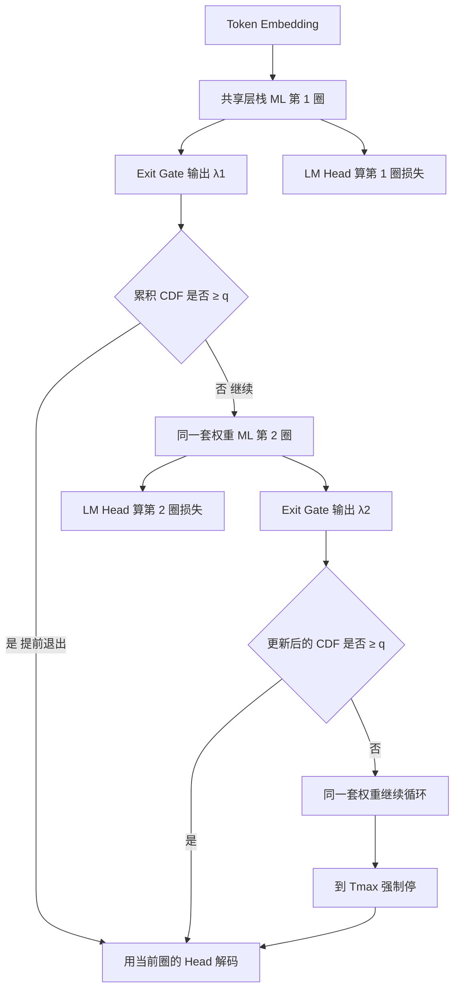

# Ouro：循环共享权重不记更多，是把已经记住的知识反复用得更好

<!-- release-date: 2025-10-29 -->

> 本文依据 ByteDance Seed 等机构发布的 **Scaling Latent Reasoning via Looped Language Models**，即 arXiv:2510.25741 **v5**，封面日期 2026-07-01、共 54 页的版本。本地原件已从旧版替换为这份 v5。页码均指这份 PDF 本身的页码。
>
> 版本核验：v1 于 2025-10-29 17:45:42 UTC 首次公开（14,928 KB）；Hugging Face 权重同日上线。此后 v2（2025-11-03）、v3（2025-11-14）、v4（2025-11-17），当前官方最新为 **v5（2026-07-01 23:25:58 UTC，9,607 KB）**。文首的 `release-date` 记录的是首次向公众开放使用的日期 2025-10-29，不因 PDF 换版回写。
>
> 文中会明确区分三层：**论文明确写了什么** （一律带 PDF 页码）、**本文如何解释它** （凡属推导、换算或从图上读数都会写明）、**哪些是外部资料补充** （给链接并标注，不把 model card 后加数字冒充本 PDF）。

## 读之前需要的最少背景

这篇论文只讲一件事：能不能在 **预训练** 里，用同一叠共享权重的 Transformer 层反复跑，把「想一想」做成潜空间里的循环计算，而不是等到后训练再让模型吐出一长串思维链 token。

先把五个名字说成人话：

- **LoopLM（Looped Language Model，循环语言模型）**：方法名。普通 Transformer 把 $L$ 层各用一次；LoopLM 把这 $L$ 层当成一块积木，同一套权重循环用 $t$ 次。参数量几乎不变，前向计算图变深。
- **Ouro（衔尾蛇）**：模型名。论文按衔尾蛇（Ouroboros）命名，强调「输出再喂回自身」这条循环。公开了 1.4B 与 2.6B 两档，以及各自的 Thinking 变体。
- **循环步 / 循环深度（recurrent step / recurrent depth）$t$**：同一叠层被完整跑了几遍。Ouro 预训练后期固定 $T_{\max}=4$，记作 R4。
- **退出门控（exit gate）**：每圈结束时，一个小线性层看当前隐状态，给出「现在能不能停」的概率。训练时它用来给每圈的语言建模损失加权；推理时按累积概率提前退出。
- **潜空间推理（latent reasoning）**：推理发生在隐状态的演化里，不占用上下文里的文字 token。论文把它和显式思维链（Chain-of-Thought，CoT）对举：CoT 把思考写出来，LoopLM 把思考留在层与层、圈与圈之间。

这篇论文最常出现的对照对象是三条「看起来都在潜空间里做事」的路线。**切面对照如下，不借用并行稿的数字**：

| 切面 | Coconut（Meta） | 本篇 Ouro | Cola（ByteDance Continuous-Latent-Diffusion-LM） |
|---|---|---|---|
| 发生阶段 | 后训练 | **预训练**，再接 SFT | 生成建模 |
| 循环对象 | 把上一时刻最后一层隐状态当成下一个输入 token（连续思想 token） | **同一叠共享层** 对整段隐状态再跑一遍 | 不在层上循环 |
| 潜空间角色 | 作为下一步的输入 | 作为被反复 refinement 的内部状态 | 连续潜空间上的**扩散生成** |
| 是不是循环推理 | 是，显式反馈 | 是，隐式循环 | 不是 |

论文自己把 Coconut 放在 Related Works 的「显式反馈」一侧：Coconut 插入一枚由上一步最后一层隐状态得到的 continuous thought token，让模型在连续潜空间里 ponder；Ouro 属于 **implicit LoopLM**，整个思考过程关在「上一圈隐状态 → 当前圈隐状态」的演化里，不把隐状态写回输入序列（PDF p. 4）。Cola 这条扩散生成路线本 PDF 没有讨论，对照只用于防止把「连续潜空间」四个字混成同一种方法。

## 一句话先说清

普通大模型有两条熟路：把参数堆大，或者在推理时多吐思维链 token。Ouro 走第三条：

> **参数量冻住，把同一叠层循环用起来；用熵正则逼模型学会「简单题少转几圈、难题多转几圈」；再把这件事放到 7.7T token 的预训练里，而不是留到后训练。**

作者自己的判断句更硬：1.4B / 2.6B 的优势 **不是** 每参数多记住了事实，而是更会把已经记住的事实拿出来组合。合成传记实验里，循环模型和普通模型都落在大约 **2 bits/parameter**；真正拉开差距的是模运算树和多跳问答（PDF p. 3、19–21）。

摘要里那句「match the results of up to 12B SOTA LLMs」必须落到表上，不能读成「全面等于 12B」。正文贡献列表写的是更窄的口径：1.4B 对标 4B、2.6B 对标 8B，参数效率大约 2–3 倍（PDF p. 2）。12B 只出现在 Table 8 的 Gemma3-12B 这一列，而且输赢按基准拆开看——数学和部分推理赢，常识类基准并不赢。下文每一句「对标」都会回到具体格子和页码。

## 先看全景：一次前向里，权重共享循环和门控怎么接

论文 Figure 3 把训练和推理画成左右两张图（PDF p. 4）。下面这张是按那张图重画的**机制示意**，不是实测延迟。

读这张图只需抓住三件事：

1. **橙色那叠 Layer 1…N 每圈都是同一套参数。** 不是把模型复制四份，是把同一块积木重复插进计算图。
2. **每一圈都挂两个头**：语言模型头算下一 token 的损失；退出门算出 $\lambda_t$。训练时两头都干活；推理时门控决定要不要再转一圈。
3. **训练和推理的用法不同。** 训练时 $T_{\max}$ 圈都跑完，用退出分布给每圈损失加权，再加熵正则，避免门控塌到「永远跑满」。推理时看累积退出概率，第一次跨过阈值 $q$ 就停。

把这三件事串成一条因果链，就是全文的骨架：

- 循环共享权重 → 参数几乎不涨、有效深度涨 → 适合「反复调用已有程序」的操控任务；
- 熵正则 + 均匀先验 → 门控不会塌成永远 $T_{\max}$ 或永远第 1 圈 → 深度能按输入难度分配；
- 推理时的 Q-exit / early exit → 简单样本少算、难题多算，并且解码阶段还能共享 KV，把 4 倍缓存压回去。

缺任何一环，LoopLM 要么训崩，要么推理贵到没人用，要么只是「更深的普通 Transformer 的压缩版」。

两档模型的规格在 Table 2（PDF p. 9）：

| 模型 | 参数 | 层数 | 隐维度 | 注意力 | FFN | 位置编码 | 词表 |
|---|---:|---:|---:|---|---|---|---:|
| Ouro 1.4B | 1.4B | 24 | 2048 | MHA | SwiGLU | RoPE | 49,152 |
| Ouro 2.6B | 2.6B | 48 | 2048 | MHA | SwiGLU | RoPE | 49,152 |

词表来自 SmolLM2，偏代码和拉丁字母语言（PDF p. 9）。2.6B 不是从头训的：Stage 1a 先训 24 层、8 圈，不稳定之后把循环步降到 4，再把 24 层复制成 48 层 upcycled 出 2.6B（PDF p. 11）。后文会回到这个稳定性决策。

## 第一层问题：为什么非要把推理塞进预训练

论文开篇把现状压成两难（PDF p. 2）：

1. **堆参数。** 千亿级模型能干活，但部署贵、延迟高、能碰到的人少。参数效率因此变成独立目标：同样参数预算下把能力做高。
2. **堆数据。** 不加大模型、只加语料，会撞上数据短缺。
3. **堆推理 token。** CoT 让模型在输出里多写思考步骤，等于用序列长度买计算。上下文被思考文字撑满，而且这件事通常发生在后训练，预训练里那些海量 token 并没有被用来「学会怎么想」。

LoopLM 的主张是第三条路：**在固定参数预算内做动态计算**。具体做法是递归地套用共享参数，让一叠 weight-tied 层在一次前向里被反复使用。论文列出三条直接后果（PDF p. 2）：

- 用学到的 early-exit，简单输入少转、复杂输入多转，计算深度和参数量解耦；
- 不像 CoT 那样把思考写进输出序列，避免上下文膨胀；
- 在同一份数据上，有可能打过更大的标准 Transformer。

先前工作并不少：Universal Transformer、recursive Transformer、Huginn 那种 recurrent depth、以及各种 latent reasoning。论文承认这些都在较小规模上探过，**但有没有在「当代基模那种多万亿 token 预训练」里变成真正的第三条 scaling 轴，还没被证明** （PDF p. 2）。于是它问的不是「循环层能不能 work」，而是：

> LoopLM 在能力、效率和安全上，是不是比非循环 Transformer 有更有利的 scaling 行为？

后面 7.7T token、两档模型和一整节 Physics of LLMs 实验，都是为了把这句问号钉死。

## 相关工作：压缩视角和潜空间推理视角是同一块积木的两面

第 2 节把循环架构拆成两个互补读法（PDF p. 3–4）。

**视角 1：参数共享换效率。** 把 LoopLM 看成「深度方向上的权重复用」。ALBERT 是 Transformer 时代最出名的例子；机器翻译时期有系统的 sharing 研究。大模型兴起后这条线一度冷掉，最近又为了边侧部署的显存回来，例如 Megrez2 在 MoE 里跨层复用专家。

**视角 2：潜空间推理和迭代 refinement。** 每一圈是一次不说话的 thought，隐状态逐步被打磨。Geiping 等人的 recurrent depth、Saunshi 等人证明 looped transformer 能在推理任务上追上更深的非循环模型，都走这条读法。还有人把标准模型改成 Relaxed Recursive Transformer，公共底座加上逐步独特的 LoRA；Mixture-of-Recursions 再把递归和 token 级路由拼在一起。

论文特别切开「显式反馈」和「隐式循环」（PDF p. 4）：

- **显式**：Coconut 把上一时刻最后一层隐状态变成 continuous thought token 再喂回去；CoTFormer 把激活交错写回输入，再拿加长后的序列去跑共享层。
- **隐式**：Ouro 这一支。思考过程关在隐状态从上一圈到当前圈的演化里，不占用输入位置。

本文的读法是：视角 1 解释「为什么参数能少」，视角 2 解释「为什么能力能涨」。Ouro 后文的合成实验就是在拆这两件事——少参数有没有多记住（没有），还是更会用（有）。

## 核心设计一：循环共享权重，把有效深度从参数量里拆出来

### 旧问题

标准 decoder-only 的深度等于层数，层数等于参数。想多想一步，就得再加一层新参数。CoT 把「多想一步」改成「多写一个 token」，深度问题变成了上下文长度问题。两边都把计算预算绑死在一个不该绑死的量上。

### 新设计

令 $\mathrm{emb}$ 为词嵌入，$T_{\theta}$ 为一层因果 Transformer，$\mathrm{lmhead}$ 为解嵌入。非循环模型是 $L$ 层串起来（PDF p. 5，式 1 之前）：

$$
F(\cdot)=\mathrm{lmhead}\circ \mathcal{M}^{L}\circ\mathrm{emb}(\cdot),\qquad
\mathcal{M}^{L}(\cdot)=T_{\theta_L}\circ\cdots\circ T_{\theta_1}(\cdot)
$$

循环模型把**同一叠** $\mathcal{M}^{L}$ 套 $t$ 次：

$$
F^{(t)}(\cdot)=\mathrm{lmhead}\circ
\underbrace{\mathcal{M}^{L}\circ\mathcal{M}^{L}\circ\cdots\circ\mathcal{M}^{L}}_{t\text{ iterations}}
\circ\mathrm{emb}(\cdot)
$$

$t=1$ 时退回普通 LM。每一圈 $t$ 都从当前隐状态算出一套 next-token 分布，对应单独的交叉熵 $L^{(t)}$（PDF p. 5，式 2）。总损失不是只看最后一圈，而是后面用退出分布把各圈损失加权。

Ouro 的块内部故意保持「干净的 decoder-only」（PDF p. 9）：MHA、RoPE、SwiGLU。为了扛住深循环，他们采用 sandwich normalization，在注意力和 FFN 之前都放 RMSNorm，并引用 Huginn 那篇 recurrent-depth 工作（PDF p. 9）。论文没有再展开 sandwich 的具体残差位置，只写了「尤其对深循环的稳定性关键」。

### 工作机制

可以把它想成「同一本菜谱反复做菜」，而不是「每多一道工序就新雇一个厨师」。第 1 圈把输入变成粗表示；第 2 圈用同一套权重再处理这个表示；第 3、4 圈继续 refinement。因为权重共享，模型被迫学会一套 **可重复调用** 的程序，而不是给每一层单独背一套只在那个深度才成立的规则。

第 6.3 节把这点说得更理论：知识容量被参数量卡住以后，循环让模型在参数空间里的知识图上做搜索——上一圈没用到的事实，下一圈还能再取（PDF p. 21–22）。附录 B.5 给了一个可达性构造：一层、单头、隐维度 $2n$ 的 LoopLM，用类似 Warshall / 反复平方的方式，大约 $\lceil\log_2 D\rceil+1$ 圈就能判断组合图上两点是否连通，其中 $D$ 是直径（PDF p. 40–41，Theorem 2）。正文 informal 的 Theorem 1 写成 $O(\log^2 D)$，表格里 Universal Transformer 一行又写成 $O(\log D)$（PDF p. 22）。**证明正文用的是 $\lceil\log_2 D\rceil+1$**。这是表达力上界的构造，不是 Ouro-1.4B 真的在做 Floyd-Warshall。

和离散 CoT、连续 CoT 的顺序步数对照，论文自己画了一张表（PDF p. 22）：

| 潜空间推理方法 | Discrete CoT | Continuous CoT | Universal Transformer / LoopLM |
|---|---|---|---|
| 顺序计算步 | $O(n^2)$ | $O(D)$ | 表内写 $O(\log D)$ |

读法：循环让「全图并行地倍增可达距离」成为可能，不必像 CoT 那样一步写一条边。它解释的是**为什么操控任务更吃循环**，不是宣称 Ouro 已经在自然语言里实现了 $\log D$ 步搜索。

### 收益、代价、可迁移启发

收益是参数效率和「反复调用同一套程序」的归纳偏置。代价立刻出现：梯度要穿过多次同一套层，扰动会被放大。Stage 1a 用 8 圈就遇到 loss spike 和梯度振荡，作者只能把循环步降到 4（PDF p. 10）。另一笔账在推理：朴素实现下每圈一份 KV，4 圈就是 4 倍缓存（PDF p. 18）。后文 5.4.2 用「只保留最后一圈 KV」把这笔账在解码阶段抹掉，但 prefilling 阶段四圈缓存谁也省不了。

对自己的项目：如果任务的本质是「同一套规则反复套在中间结果上」（多跳、程序、搜索），共享循环比加层更对口。如果任务的本质是「把更多原子事实塞进参数」，循环帮不上忙——第 6 节会用合成实验把这句话钉死。

## 核心设计二：门控把「停在第几圈」变成一个可学习的分布

### 旧问题

不是每个 token、每道题都需要 4 圈。如果永远跑满 $T_{\max}$，简单样本浪费计算；如果人为固定深度，又丢掉自适应。更麻烦的是：只拿 next-token loss 去训门控，更深的圈损失通常更低，梯度会把概率质量推向最后一圈，最后一圈得到更多训练信号、损失更低，于是更推向最后一圈——**自强化坍缩到 $t=T_{\max}$** （PDF p. 6）。反过来，若用偏向早停的几何先验，又会饿死深层、破坏「更深通常更好」。

### 新设计：生存概率与退出分布

每圈 $t$ 的门控和 LM head 并行，吃最后一层隐状态 $h^{(t)}$（PDF p. 5）：

$$
\lambda_t(x)=\sigma\bigl(\mathrm{Linear}_{\phi}(h^{(t)})\bigr)\in(0,1)
$$

$\lambda_t$ 是「这一圈立刻退出」的瞬时概率。前 $t$ 圈都没退的生存概率是

$$
S_t(x)=\prod_{j=1}^{t}\bigl(1-\lambda_j(x)\bigr),\qquad S_0(x)\equiv 1
$$

于是「第一次停在第 $t$ 圈」的未归一化质量为 $\tilde p_t(x)=\lambda_t(x)\,S_{t-1}(x)$（$t=1,\ldots,T_{\max}-1$）。剩下的质量全部塞给最后一圈，得到合法分布 $p_{\phi}(t\mid x)$（PDF p. 6，式 3）。

推理时不采样，而用累积分布。前 $n$ 圈的 CDF 是

$$
\mathrm{CDF}(n\mid x)=1-\prod_{j=1}^{n}\bigl(1-\lambda_j(x)\bigr)\quad(n<T_{\max})
$$

给定阈值 $q\in[0,1]$，退出步是第一个让 CDF 跨过 $q$ 的 $m$（PDF p. 6）。$q$ 小则早停，$q$ 大则多算。v5 把这套确定性规则明确写成 PALBERT 引入的 **Q-exit** （PDF p. 6）；对照 v4 HTML，这一句归属是 v5 才写清楚的，规则本身没变。

### Stage I：熵正则，先验取均匀

总损失是「按退出分布加权的各圈语言建模损失」减去熵（PDF p. 6，式 4）：

$$
\mathcal L=\sum_{t=1}^{T_{\max}} p_{\phi}(t\mid x)\,L^{(t)}-\beta\,H\bigl(p_{\phi}(\cdot\mid x)\bigr)
$$

第一项逼门控把质量放在损失低的圈上；第二项惩罚塌缩。$\beta$ 大则更探索，小则更敢把质量集中。

论文还把它写成带均匀先验的负 ELBO（PDF p. 7）：退出步 $z$ 是隐变量，变分后验是 $p_{\phi}$，先验 $\pi$ 取均匀 $\pi_t=1/T_{\max}$。此时

$$
\mathrm{KL}\bigl(p_{\phi}\,\|\,\pi\bigr)=-H(p_{\phi})+\log T_{\max}
$$

所以式 4 就是均匀先验下的 ELBO（差一个常数）。几何先验（PonderNet）或 Poisson-lognormal（Huginn）会软性地偏好早停；均匀先验不偏袒任何深度，把「这道题难不难」和「全局想省多少算力」拆开。熵项负责阻止「永远 $T_{\max}$」。

附录 A 用 776M、$T_{\max}=4$、FineWeb-Edu 20B token 扫了几何先验 $\lambda\in\{0.1,\ldots,0.9\}$ 对均匀先验（PDF p. 34–35）。结论：均匀先验训练损失更低、后期振荡更小；强几何偏置把质量压在 $t=1,2$，深层得不到 credit assignment。固定平均步数预算时，均匀先验的 accuracy–compute 帕累托也更好。这是小模型消融，不是 7.7T Ouro 的直接数字。

### 工作机制，用一句话

Stage I 不教门控「这题该停」，它只做两件事：让每一圈的语言模型头都有梯度，以及不让退出分布变成独热向量。真正按「再转一圈还能降多少损失」来停，是 Stage II 的工作。

## 核心设计三：Stage II 把退出对准真实增益，推理才能 early exit

### 旧问题

Stage I 的门控是和 LM 联合训的，监督信号间接。它已经能按难度分出深浅——5.4.1 里「未专门训过的 Ponder gate」已经明显好过固定深度——但还不会盯着 **任务损失有没有继续下降** 来决定停不停（PDF p. 17–18）。

### 新设计

冻住 LM，只训门控。每个 token $i$ 在第 $t$ 圈算一份额外分离的损失 $L_{i,\mathrm{stop}}^{(t)}$（不回流到 LM 表示），再看这一圈相对上一圈的改进（PDF p. 7，式 5）：

$$
I_i^{(t)}=\max\bigl(0,\ L_{i,\mathrm{stop}}^{(t-1)}-L_{i,\mathrm{stop}}^{(t)}\bigr)
$$

论文原式括号不完整，这里按上下文补全。$I$ 大说明还在涨，$I$ 小说明该停。再压成「理想继续概率」：

$$
w_i^{(t)}=\sigma\bigl(k\cdot(I_i^{(t)}-\gamma)\bigr),\qquad k=50.0,\ \gamma=0.005
$$

$w\approx 1$ 建议继续，$w\approx 0$ 建议退出。门控的预测继续概率是 $1-\lambda_i^{(t)}$，用二元交叉熵去对齐 $w$（PDF p. 7，式 6）。从 $t=2$ 到 $T_{\max}$ 平均，得到 $L_{\mathrm{adaptive}}$。

它同时罚两种失败（PDF p. 8）：

- **欠思考**：标签说该继续（$w$ 大），门却给出大的退出 $\lambda$；
- **过思考**：标签说该停（$w$ 小），门却给出大的继续 $1-\lambda$。

### 收益：MMLU 上的四条 Pareto

Figure 5 在 MMLU 上比较四种策略（PDF p. 17–18）。横轴是平均退出圈数，纵轴是准确率。论文文字给出的关键点：

| 策略 | 论文怎么说 |
|---|---|
| 固定深度 | 1 圈约 40% → 2 圈约 60%，3 到 4 圈只到 67.35%，边际递减 |
| 隐状态差 $\\|h_t-h_{t-1}\\|_2<\epsilon$ | 中等预算（平均 2–3 圈）距专门训过的门大约 1%–2% |
| Stage I 的 Ponder gate（未做 Stage II） | 已经明显好过固定深度 |
| 再加 Stage II 自适应损失 | 每个计算预算都最好；平均 2.5 圈时约 66%，标准门约 64% |

专门训练相对 Stage I 门控的差距大约 2%–3%（PDF p. 18）。这是论文读自 Figure 5 的数，不是另一张表。

因果链到这里合龙：**共享循环提供可 refinement 的深度；熵正则让门控在预训练里看见所有深度；Stage II 把「停」对准真实损失下降；推理时 Q-exit 用一个阈值 $q$ 把深度变成部署旋钮。** 少了熵正则，门会塌；少了 Stage II，自适应还能用，但帕累托更差；少了 Q-exit，就得采样或固定深度。

## 训练：7.7T token 的 recipe，以及循环架构特有的稳定化

Figure 4 是端到端流水线（PDF p. 8）：共同 warmup → Stable Training 3T → 分叉成「留下 1.4B」和「upcycle 成 2.6B」→ 两边再共享 CT Annealing 1.4T、LongCT 20B、Mid-training 300B → 得到两个 base → Reasoning SFT 得到 Thinking。论文写死：base 共用 **7.7T token**；SFT 在这之外。

### 架构细节

除 Table 2 之外，值得记住的约束是：tokenizer 没有中文词表。Stage 1 为了「基本中文能力」加了 Ultra-FineWeb-zh 和 MAP-CC，但从 Stage 2 起拿掉中文，因为汉字会被切成多个 byte 级子词（PDF p. 10）。这直接限制了「Ouro 是不是多语言模型」的读法：5.1 节开头写了 multilingual，表里却没有多语基准。

预训练框架是 flame，建立在 torchtitan 上（PDF p. 10）。优化器全程 AdamW，$\beta_1=0.9$，$\beta_2=0.95$，weight decay 0.1，梯度裁剪 1.0（PDF p. 8、11）。作者说循环架构需要比参数匹配的 Transformer **更小的学习率**，但没有做穷尽 LR sweep，选了保守值（PDF p. 11）。

### 数据：全是开源，分四段

Table 1 把前四段的超参收在一张表里（PDF p. 8）。下面按「论文写了什么」抄关键列，不把项目页的宣传句混进来。

| | Stage 1a Pre-train I | Stage 1b Pre-train II | Stage 2 CT Annealing | Stage 3 LongCT | Stage 4 Mid-training |
|---|---|---|---|---|---|
| 最终学习率 | $3.0\times 10^{-4}$ | $3.0\times 10^{-4}$ | $3.0\times 10^{-5}$ | $3.0\times 10^{-5}$ | $1.0\times 10^{-5}$ |
| LR 日程 | Constant | Constant | Cosine Decay | Constant | Cosine Decay |
| batch（token） | 4M→8M | 8M | 8M | 8M | 8M |
| 序列长度 | 4K | 4K | 16K | 64K | 32K |
| 训练 token | 3T | 3T | 1.4T | 20B | 300B |
| 循环步 | 8 | 4 | 4 | 4 | 4 |
| $\beta$（KL / 熵） | 0.1 | 0.05 | 0.05 | 0.05 | 0.05 |
| RoPE base | 10K | 10K | 40K | 1M | 1M |
| 数据重心 | Web 高、数理低 | 同左 | 数理高、Web 中 | 长上下文高 | 数理与 SFT 质量高 |

3T+3T+1.4T+20B+300B = 7.72T，与「7.7T」一致。

Table 3 / 4 给出 Stage 1 语料（PDF p. 9）。「# Tokens」是数据集体量，「# Used Tokens」是实际看见的量；论文提醒随机采样，二者不必相等。

| 数据源 | 阶段 | 体量（B） | 实际用到（B） | Stage 1 占比 |
|---|---|---:|---:|---:|
| Nemotron-CC | 1 | 6386 | 4404 | 73.4% |
| MAP-CC | 1 | 800 | 780 | 13.0% |
| Ultra-FineWeb-zh | 1 | 120 | 120 | 2.0% |
| OpenCoder-pretrain | 1 | 450 | 450 | 7.5% |
| MegaMath-web | 1 | 247 | 246 | 4.1% |

Stage 1 实际用到合计 6000B = 6T，对应 1a+1b。作者选 Nemotron-CC 的原因很具体：他们要训超过 2T，Fineweb-Edu（1.3T）和 DCLM（2.6T）都偏小（PDF p. 10）。

Stage 2 的 1.4T 构成在 Table 5（PDF p. 10；原文拼写是 `high-quailty`）：

| 数据源 | 占比 |
|---|---:|
| Nemotron-CC-high-quailty | 66.5% |
| Nemotron-CC-Math-v1 | 15.0% |
| MegaMath-high-quailty | 4.6% |
| OpenCoder annealing | 0.5% |
| Nemotron Synthetic-Code | 3.8% |
| Nemotron-SFT-Code | 3.4% |
| Nemotron-SFT-General | 6.2% |

Stage 3 只用 ProLong 的 64K 子集 20B token（PDF p. 10）。Stage 4 把 20+ 个开源 SFT 集合并、去污染、转成 ChatML，得到 182B，随机抽 90B；再 replay Stage 1 的 30B 和 Stage 2 的 180B，凑成有效 300B（PDF p. 10）。样本形态同时有 $\langle$Question, Answer$\rangle$ 和 $\langle$Question, CoT, Answer$\rangle$。

### 稳定性：循环架构逼出来的五处改动

第 4.3 节是这篇预训练最有工程含量的部分（PDF p. 10–11）。作者明确说优先级是稳定，不是激进 scaling。

**1. 循环步从 8 降到 4。** Stage 1a 用 8 圈出现 loss spike 和梯度振荡。假设是多次循环把小扰动放大。Stage 1b 降到 4 圈，作为稳定和深度的折中。

**2. batch 从 4M 提到 8M token。** 更大 batch 给更稳的梯度估计，循环结构里梯度穿过多次迭代，方差本来就更大。

**3. $\beta$ 从 0.1 降到 0.05。** 两个目的：减轻任务损失和 KL 的梯度冲突；减弱均匀先验的拉力，让模型更自由地学深度模式。

**4. 学习率保守。** 经验上循环模型吃不下参数匹配 Transformer 的 LR。

**5. 序列长度阶梯。** 4K → 16K → 64K → 32K。LongCT 先拉到 64K，Mid-training 回到 32K，是吞吐和稳定性的折中。

Stage 1b 的 upcycling 值得单独记：2.6B 用层复制把 24 层变成 48 层。作者说循环结构让这件事特别顺，因为跨迭代的共享权重天然方便复制，不像普通 Transformer upcycling 那么容易不稳（PDF p. 11）。这是作者观察，没有对照实验证明「非循环 upcycling 一定会不稳」。

### SFT：8.3M 条，Thinking 变体从这里来

Table 6（PDF p. 12）：

| 主题 | 来源 | 规模 |
|---|---|---:|
| Math | OpenThoughts3、AceReason-1.1-SFT | 3.5M |
| Code | AceReason-1.1-SFT、OpenCodeReasoning、Llama-Nemotron-Post-Training-Dataset、OpenThoughts3 | 3.2M |
| Science | OpenThoughts3、Llama-Nemotron-Post-Training-Dataset | 808K |
| Chat | OO1-Chat-747K、DeepWriting-20K | 767K |

合计约 8.3M 条。用 LlamaFactory，2 个 epoch，最长 32K，Adam，$2\times 10^{-5}$，$\beta=(0.9,0.95)$，cosine。脚注写：训练因基础设施中断，从最近 checkpoint 恢复，学习率贴近原来的 cosine（PDF p. 12）。

### RL attempts：两条路都没超过 SFT，失败本身是正文

第 4.5 节没有藏（PDF p. 12）。SFT 之后，作者在 DAPO-17K 上试了 DAPO 和 GRPO 的 RLVR（Reinforcement Learning with Verifiable Rewards）。**相对最终 SFT checkpoint，没有显著增益。** 主因是动态 early-exit：vLLM / SGLang 的快速 rollout 走固定执行路径，和 LoopLM 的可变深度打架。

两条具体尝试：

1. **Off-policy rollout。** 在 vLLM 里跑满 4 圈，每 token 拿到 4 个 logit 候选，再选第一个超过终止阈值的 token 来模拟早停；更新时只用到该步的累积损失，丢掉更后面的 token。错配是：token 实际是按最终深度产出来的，损失却在更浅的深度上算。没涨点。
2. **固定 4 圈 RL。** rollout 和更新都锁在 4 圈，训练能跑，但还是没超过 SFT。作者猜测原因是规模：已经做过充分 SFT 的小模型，RL 抬头空间有限。一个没解释清楚的观察：尽管训练锁在 4 圈，推理时模型仍会在有益时少用几圈。

作者说会等基础设施能完整支持动态计算，再继续做 RL。所以 Ouro-Thinking 公开的是 **SFT 模型，不是 RL 模型**。不要把 Thinking 读成 R1 那种大规模 RL 产物。

## 实验：对标要落到格子，不要停在「最高约 12B」

评测分四块：base（5.1）、Thinking（5.2）、循环深度与外推（5.3）、early exit 与 KV 共享（5.4）。附录 C 补了评测口径（PDF p. 42）。

### 5.1 Base：1.4B 对 4B，是「推理项上可比」，不是全面持平

评测走 lm-eval-harness 和 evalplus。MMLU / ARC-C / HellaSwag / Winogrande 用 logprobs；MMLU-Pro / BBH / GSM8K 用 strict match + CoT；MATH500 用内部 harness；代码用 evalplus 的 pass@1（PDF p. 42，Table 16）。5.1 开头写了 science 和 multilingual，**表里没有这两类数字**。

Table 7（PDF p. 13）把 Ouro-1.4B R4 放进 1B–4B 密集模型中间。下面只保留和「对标 4B」有关的列。

| 基准 | Qwen3-1.7B | Qwen2.5-3B | Qwen3-4B | Gemma3-4B | **Ouro 1.4B R4** |
|---|---:|---:|---:|---:|---:|
| 训练 token | 36T | 18T | 36T | 4T | 7.7T |
| MMLU | 62.46 | 65.62 | **73.19** | 58.37 | 67.35 |
| MMLU-Pro | 37.27 | 37.87 | **51.40** | 34.61 | 48.62 |
| BBH | 53.51 | 55.37 | 70.95 | 66.32 | **71.02** |
| ARC-C | 55.72 | 55.46 | **63.65** | 60.92 | 60.92 |
| HellaSwag | 67.09 | 74.54 | **75.66** | 75.58 | 74.29 |
| Winogrande | 66.30 | 70.17 | 71.19 | 71.07 | **72.30** |
| GSM8K | 70.28 | 74.60 | 72.86 | 68.69 | **78.92** |
| MATH500 | 25.80 | 42.60 | 59.60 | 68.60 | **82.40** |
| HumanEval | 66.50 | 68.90 | **77.40** | 34.80 | 74.40 |
| HumanEval+ | 59.80 | 62.20 | **70.70** | 29.30 | 67.40 |
| MBPP | 68.00 | 63.00 | **78.80** | 60.60 | 73.00 |
| MBPP+ | 58.50 | 54.20 | **65.90** | 51.10 | 62.70 |

论文自己强调的三句对比（PDF p. 13）：BBH 71.02 vs Qwen3-4B 的 70.95，GSM8K 78.92 vs 72.86，MATH500 82.40 vs 59.60。这三格确实是 1.4B 打过或持平 4B。同一张表里，MMLU（67.35 vs 73.19）、HumanEval（74.40 vs 77.40）、MBPP（73.00 vs 78.80）是 4B 更大。**「comparable across most benchmarks」是作者概括；按格子读，优势集中在推理和数学，常识与部分代码没有全面追上。**

还要注意数据量：Qwen3-4B 训了 36T，Ouro 训了 7.7T。这不是 iso-data 对比。论文引言写过「when trained on the same data」可以打过更大模型（PDF p. 2），主表并没有给出「同一份 7.7T、只改循环」的 4B 对照。iso-param / iso-flop 的干净对照在第 6 节合成任务，不在 Table 7。

### 5.1 续：2.6B 对 8B 和 12B，必须拆开基准

Table 8（PDF p. 14）是摘要「up to 12B」唯一落地的地方。

| 基准 | Qwen3-4B | Qwen3-8B | Gemma3-12B | **Ouro 2.6B R4** | 2.6B 相对 12B |
|---|---:|---:|---:|---:|---|
| 训练 token | 36T | 36T | 12T | 7.7T | — |
| MMLU | 73.19 | **76.63** | 72.14 | 74.60 | 高于 Gemma3-12B，低于 Qwen3-8B |
| MMLU-Pro | 51.40 | 53.72 | 49.21 | **55.73** | 高于两者 |
| BBH | 71.14 | 77.65 | 78.41 | **80.46** | 高于 Gemma3-12B |
| ARC-C | 63.65 | 66.10 | **72.44** | 66.40 | 低于 Gemma3-12B |
| HellaSwag | 75.66 | 79.60 | **83.68** | 79.69 | 低于 Gemma3-12B |
| Winogrande | 71.19 | 76.80 | **77.74** | 75.85 | 低于 Gemma3-12B |
| GSM8K | 72.86 | **83.09** | 77.18 | 81.58 | 高于 Gemma3-12B，低于 Qwen3-8B |
| MATH500 | 59.60 | 62.30 | 83.20 | **90.85** | 高于 Gemma3-12B |
| HumanEval | 77.70 | **84.80** | 46.30 | 78.70 | 高于 Gemma3-12B（Gemma 代码弱），低于 Qwen3-8B |
| MBPP | 78.80 | 79.00 | 73.50 | **80.40** | 高于两者 |

论文正文对 2.6B 的概括是：在推理密集基准上超过最大到 8B 的 dense 模型，并点名 MMLU-Pro 55.73、BBH 80.46、MATH500 90.85，对比 Qwen3-8B 的 53.72、77.65、62.30（PDF p. 13）。这三格成立。

12B 这一列是 Gemma3-12B。2.6B 在 MMLU-Pro / BBH / MATH500 / GSM8K / 代码上高于它，在 ARC-C / HellaSwag / Winogrande 上低于它。Gemma3-12B 的 HumanEval 只有 46.30，用代码分去「打败 12B」会夸大。正确说法是：

> **Ouro-2.6B R4 在 Table 8 的推理和数学格上可以高于 Gemma3-12B；它没有在常识类基准上全面达到 12B，也没有在 GSM8K / HumanEval 上超过 Qwen3-8B。**

Table 7 和 Table 8 对 Qwen3-4B 的 BBH 还差 0.19（70.95 vs 71.14），属于论文自己的表间不一致，引用时跟所在表走。

### 5.2 Thinking：和 4B / 8B 推理模型比，同样是「若干数据集」而不是全胜

Ouro-Thinking 是 SFT 产物，评测 AIME 2024/2025、OlympiadBench、GPQA、SuperGPQA、BeyondAIME、HLE。协议是内部 harness + LLM-as-judge，温度 1.0、top_p 0.7（PDF p. 15、42，Table 17）。这意味着分数依赖评委模型和固定 rubric，跨论文直接对比要小心。

Table 9（PDF p. 14；Olympiad / SuperGPQA 在正文 p. 15 给了更多小数）：

| 模型 | AIME24 p@1 / p@10 | AIME25 p@1 / p@10 | Olympiad | BeyondAIME | HLE | SuperGPQA | GPQA |
|---|---|---|---:|---:|---:|---:|---:|
| Ouro-1.4B-Thinking-R4 | 65.0 / 83.3 | 46.3 / 73.3 | 71.6（正文 71.55） | 34.0 | 5.21 | 47.4 | 45.5 |
| Ouro-2.6B-Thinking-R4 | 64.7 / 90.0 | 50.3 / 76.7 | 76.4（正文 76.44） | 39.0 | 5.58 | 53.7 | 52.7 |
| Qwen3-1.7B | 32.0 / 55.6 | 22.0 / 33.3 | 56.4 | 15.0 | 4.13 | 35.9 | 34.0 |
| Qwen3-4B | 61.3 / 75.0 | **51.3** / 63.3 | 73.2（正文 73.18） | 31.0 | 5.21 | 51.9 | 54.5 |
| Qwen3-8B | **73.0** / 86.7 | **66.7** / **81.3** | 75.3（正文 75.25） | 38.0 | 2.22 | 48.0 | **59.1** |
| DeepSeek-Distill-Qwen-1.5B | 29.6 / 66.7 | 23.0 / 43.33 | 56.44 | 9.0 | 4.2 | 26.5 | 33.2 |
| DeepSeek-Distill-Qwen-7B | 57.3 / 83.3 | 36.0 / 73.3 | 72.0 | 30.0 | 5.14 | 46.6 | 51.0 |

Figure 2 的 caption 写：1.4B-Thinking R4 与 4B 竞争，2.6B-Thinking R4 在多个数学和科学集上匹配或超过 8B（PDF p. 3）。落到格子：

- 1.4B-Thinking vs Qwen3-4B：BeyondAIME 34.0 vs 31.0 赢；Olympiad 71.55 vs 73.18 小输；AIME24 pass@1 65.0 vs 61.3 赢，AIME25 46.3 vs 51.3 输；GPQA 45.5 vs 54.5 输。
- 2.6B-Thinking vs Qwen3-8B：Olympiad 76.44 vs 75.25、BeyondAIME 39.0 vs 38.0、SuperGPQA 53.7 vs 48.0、HLE 5.58 vs 2.22 赢；AIME24 64.7 vs 73.0、AIME25 50.3 vs 66.7、GPQA 52.7 vs 59.1 输。

所以 Thinking 侧同样不能写成「等于 8B / 12B」。HLE 上 Qwen3-8B 只有 2.22、Ouro-2.6B 有 5.58，两端都极低，适合当作「很难的闭卷集」，不适合当作拉开代际的主证据。

### 5.3 循环深度：训到 4 圈，能力在 4 圈见顶，安全还能外推

模型按 $T=4$ 训。评测时强行跑 1–8 圈，5–8 是外推。

**Base** （Table 10 / 11，PDF p. 15）：

| 模型 | 指标 | T=1 | T=4（训练深度） | T=8（外推） |
|---|---|---:|---:|---:|
| 1.4B | MMLU | 41.21 | 67.45 | 64.49 |
| 1.4B | ARC-C | 37.63 | 60.92 | 58.19 |
| 1.4B | HellaSwag | 55.24 | 74.29 | 71.60 |
| 2.6B | MMLU | 51.55 | 74.60 | 72.24 |
| 2.6B | ARC-C | 47.95 | 66.38 | 64.76 |

两档都是训到的深度最强，外推中等下降。论文立刻对照第 7.1 节：任务精度外推会掉，**安全随圈数增加而变好，包括 $T>4$** （PDF p. 16）。能力峰值和安全峰值不在同一个深度。

**Thinking** （Table 12 / 13，PDF p. 16）：T=1 极差，说明这些题必须靠迭代 refinement。1.4B-Thinking 峰值在 T=4 或 T=5（Olympiad T=5 的 72.30 略高于 T=4 的 71.55；AIME24 峰值在 T=4 的 65.00）。2.6B-Thinking 峰值更靠前，T=3 或 T=4（AIME24 在 T=3 的 70.33 高于 T=4 的 64.70）。T=6–8 明显掉。作者猜测：这些推理题要做长解码，和 base 那种 logit 评测不同，深度探索更活跃。

T=1 的 Thinking 分数接近崩溃（1.4B 的 AIME24 为 0.00，Olympiad 2.22），说明 SFT 把能力绑在了多圈计算上：切断循环，模型几乎不会做这些题。

### 5.4.2 KV 缓存：prefilling 省不了，解码可以只留最后一圈

朴素实现 4 圈 = 4 份 KV。分两段看（PDF p. 18，Table 14）：

**Prefilling（处理 prompt）。** 四圈都要自己的 KV。试图复用会导致 GSM8K 掉 10 分以上。

**Decoding（自回归生成）。** 三种策略：

| 策略 | GSM8K | MATH-500 | 显存 |
|---|---:|---:|---:|
| 满缓存 4× | 78.92 | 82.40 | 1.00× |
| 只留第 1 圈 | 18.73 | 8.43 | 4.00× 减少 |
| 只留最后一圈 | 78.85 | 80.40 | 4.00× 减少 |
| 四圈平均 | 78.73 | 78.52 | 4.00× 减少 |

只留第一圈会崩，说明后续解码不能靠最初表示。最后一圈和平均几乎贴着满缓存（GSM8K 差 0.07–0.19），MATH-500 上最后一圈（80.40）好于平均（78.52）。论文的部署含义：LoopLM 在生成阶段可以做到和同参数量标准 Transformer 相近的 KV 占用；代价是 prefilling 仍按圈数付费。

## 第 6 节：核心主张——不是记更多，是更好用

这一节是整篇最不应该被摘要吃掉的部分。问题很干净（PDF p. 19）：循环并不增加参数，为什么分数高那么多？是每参数多塞了事实，还是更会把已有事实组合起来？

实验方法来自 Physics of Language Models（Allen-Zhu 等人），用完全可控的合成任务。致谢里点名感谢 Zeyuan Allen-Zhu 的讨论（PDF p. 26）。

### 6.1 知识容量：循环和不循环都是约 2 bits/parameter

任务叫 Capo。合成传记 $\mathrm{bioS}(N)$：每个人有姓名和五个属性（性别、生日、大学、专业、雇主），用随机模板写成一段话。信息论下界可算。训练后看模型在属性 token 上的交叉熵，换算成「已经记住多少 bit」，再除以参数量（PDF p. 19、35）。

设置：GPT-2 风格、RoPE、LM head 与 embedding 绑定；参数量 1M 到 40M；循环 1 圈 vs 4 圈；人数 $N$ 从 20K 到 500K；每条样本暴露 1000 次（PDF p. 19、35–36）。附录给出每个人（忽略姓名）大约 $\log_2 S_0\approx 47.6$ bits（PDF p. 36）。

Figure 6 左图：iso-parameter 下，loop-1 和 loop-4 落在同一条「约 2 bit / param」的线上，容量 scaling 也没有因为循环变陡（PDF p. 20）。论文的句子是：参数量本身就是知识容量的直接指标，**仅仅增加 looping 不增加容量**。

### 6.2 知识操控：同样参数，循环明显更会算、更会跳

**Mano。** 前缀表达式上的模 23 四则运算树，不允许中间思维文字，直接输出答案。例如 `<bos> + * a b c <eos>` 要求直接给出 $(a*b)+c \bmod 23$（PDF p. 20）。必须同时做到：参数里装着 $\mathbb F_{23}$ 的运算规则，以及解析二叉树并组合计算。难度用最大表达式长度 $L\in\{10,16,24\}$。基线是 $(\{2,3,6,12\}\otimes 1)$ 的普通 Transformer，循环模型是 $(k\otimes 12/k)$，$k=2,3,6$，即 iso-param 下把深度换成「更浅 × 更多圈」。

Figure 6 右表（PDF p. 20）：

| | L=10 | L=16 | L=24 |
|---|---:|---:|---:|
| Base $(12\otimes 1)$ iso-FLOP | 93.6 | 94.4 | 34.8 |
| Base $(2\otimes 1)$ | 21.5 | 8.4 | 7.5 |
| Loop $(2\otimes 6)$ | 98.1 | 96.3 | 78.0 |
| Base $(3\otimes 1)$ | 75.4 | 29.8 | 11.0 |
| Loop $(3\otimes 4)$ | 97.9 | 95.8 | 92.2 |
| Base $(6\otimes 1)$ | 84.7 | 59.5 | 20.0 |
| Loop $(6\otimes 2)$ | 93.4 | 88.5 | 35.1 |

iso-param 下循环全面高于非循环。iso-FLOP 的 $12\otimes 1$ 在 L=24 只有 34.8，而 $3\otimes 4$ 有 92.2、$2\otimes 6$ 有 78.0。论文读法：在「知识量有限、操控复杂」的任务上，循环有更好的归纳偏置。

**多跳 QA。** 合成人物与关系，问「A 的 instructor 的 teacher 是谁」。比 Mano 更偏知识、结构稍简单。标准 Transformer 学 k-hop 需要指数级 k-hop 数据（引 Yao 等人）。这里盯 3-hop 的样本效率：基线 $(6\otimes 1)$，循环 $(6\otimes\{2,4\})$，另训 iso-flop $(24\otimes 1)$（PDF p. 21）。

Figure 7（PDF p. 21）：同样总 token 预算下，圈数多的模型用更少 unique QA pair 就能学会；固定 15% 的 QA pair（12000 unique）、1024 上下文、batch 2048、20000 步，圈数多的学得更快、终值更高。附录 Figure 11–12 把 unique 样本换到 1e5 / 1.2e5 / 1.4e5，趋势还在；iso-flop 的 24 层基线在部分点上强过 loop-2，但仍弱于 loop-4。作者自己加脚注：1.2e5 那组 iso-flop 没有显著好过更浅的非循环，可能是随机或超参不足，认为需要后续实验（PDF p. 37）。**这是论文承认的薄弱点，不要把它读成 iso-flop 全面胜利。**

### 真实基准上的回声：MMLU 子类

附录 B.4 用 Ouro 自己的 Loop 1 vs Loop 4，看 MMLU 57 类的相对提升（PDF p. 38–39，Table 15）。假设是：如果循环主要增强操控，推理类涨得多，检索类涨得少。

相对提升最大的四类：

| 类 | Loop 1 | Loop 4 | 相对提升 |
|---|---:|---:|---:|
| elementary_mathematics | 0.3095 | 0.7910 | +155.6% |
| formal_logic | 0.2381 | 0.5794 | +143.3% |
| logical_fallacies | 0.3313 | 0.7546 | +127.8% |
| high_school_statistics | 0.3102 | 0.7037 | +126.9% |

最平坦的四类：

| 类 | Loop 1 | Loop 4 | 相对提升 |
|---|---:|---:|---:|
| moral_scenarios | 0.2436 | 0.2626 | +7.8% |
| global_facts | 0.3600 | 0.3900 | +8.3% |
| virology | 0.4398 | 0.5000 | +13.7% |
| anatomy | 0.4148 | 0.5037 | +21.4% |

`global_facts` 几乎不动，和「不是在扩知识库」一致。注意这是 **同一个 Ouro 从 1 圈到 4 圈** 的增益，不是 LoopLM vs 普通 Transformer。它支持「多圈主要在做符号操控」，不能单独证明「循环架构比加层更会记」。后一个命题靠的是 Capo / Mano。

### 6.3 本文如何理解「为什么循环更会操控」

论文给了两层猜想，都标成 conjecture（PDF p. 21–22）。

第一层：**参数知识图上的搜索。** 预训练让模型在参数里装了大量原子事实。难任务要沿这些事实形成的有向依赖做深度搜索。循环让同一套检索/运算程序能被重新调用，上一圈没取到的边，下一圈还能再取。表达力构造（Appendix B.5）说明：在「一部分图在上下文、一部分图在参数」的可达性任务上，一层 LoopLM 用 $O(\log D)$ 量级的圈数就能做全对并行的距离倍增，比离散 CoT 的 $O(n^2)$ 步短得多。构造需要 $\Theta(n)$ 隐维度来叠加 $\Theta(n)$ 个节点，这是理论上的限制（PDF p. 41）。

第二层：**样本效率。** 操控任务往往要求「同一套结构在不同深度重复出现」。不共享时，每一块参数都可以不同，假设类很大；共享之后可实现函数类变小，学习这些操控所需的样本变少。这是统计上的猜想，不是定理。

把第 6 节收成一句判断：

> **Ouro 的 2–3 倍参数效率，实验支持的机制是「同样大小的知识库被更有效地反复调用」，不是「循环让每参数多装了事实」。**

Capo 是直接证据（容量不变）；Mano / 多跳 QA 是直接证据（操控变强、样本更省）；MMLU 子类是真实基准上的旁证。iso-flop 在自然语言主表上没有，在合成任务上总体偏向循环，但附录自己留了缺口。

## 第 7 节：安全随圈数变好，潜空间轨迹比 CoT 更像「真的在改主意」

### 7.1 安全：HEx-PHI 上有害率随循环步下降，外推圈仍然有效

HEx-PHI：330 条、11 个禁止类，GPT-4o 打 1–5 有害分，5 分算有害率（PDF p. 22）。Base 用 greedy、`max_new_tokens=128`；Thinking 用温度 1.0、top_p 0.7、`max_new_tokens=8192`。扫 1–8 圈。

论文给出的硬数字：4 圈时，Ouro-1.4B-Thinking 有害率 0.009，Ouro-2.6B-Thinking 0.003，与 Qwen3-4B-Thinking 的 0.009 相当（PDF p. 22–23）。Figure 8a 的曲线形状是：两档 Base 和 Thinking 的有害分、有害率都随圈数下降，5–8 圈的外推仍在改善（PDF p. 23）。具体中间点要从图上读，正文没列表。

PCA（Figure 8b，PDF p. 23）：取 100 条良性 + 100 条有害、都是 「How to」 开头的问题（数据来自 Zheng 等人 2024 的 GitHub，论文脚注给了链接）。对 1.4B 顶层、最后一个输入 token 的隐状态做 PCA。观察：圈数增加后，良性/有害分得更开，红色（高有害分）点变少；仍不安全的点多落在两类簇的边界上。作者解释：分不清有害性才会给不安全回答，多圈能减轻这种分不清。

注意安全评测用的是 GPT-4o 法官和固定解码设置，Thinking 的 8192 token 上限和 Base 的 128 不可比。跨 Base / Thinking 比的是各自曲线随圈数的方向，不是绝对有害率。

### 7.2 忠实性：中间圈会改答案，不像 CoT 那种事后合理化

论文给忠实性的操作定义：程序正确，并且因果地耦到最终答案——干预中间理由，最终预测应当变（PDF p. 23）。他们引用的一串工作表明：标准 LLM 常常在写 CoT 之前就定了答案，CoT 只是事后合理化。

LoopLM 的推理底物是 $h^{(1)}\to h^{(2)}\to\cdots\to h^{(T)}$。每一步用同一套共享块做非平凡计算，并且每一步都被 LM 损失监督。所以通向答案的因果路径是这条潜轨迹，不是任何可选的自然语言痕迹。从 $h^{(k)}$ 解出的 $\mathrm{Text}(R_k)$ 只是内部状态的读出。

他们无法像干预 CoT 那样干预潜状态，于是改用观察性代理：在 Quora Question Pairs（一对短问题是否同义，边界很模糊）上，看逐步可预测性和跨圈一致性（PDF p. 24）。

线性探针（Figure 9 左，PDF p. 24）：Qwen3-4B-Thinking 用最终 token 的探针预测最终答案，ROC AUC 约 0.99——思考过程几乎不影响结果。Ouro 1.4B×4 每圈 24 层。在第 $i$ 圈内部，用第 $24i$ 层的表示预测第 $i$ 圈的答案，很快就能预测准；但用上一圈结束（第 $24(i-1)$ 层）去预测第 $i$ 圈的答案，就不准。说明**新的一圈真的在改临时决定**。

一致性矩阵（Figure 9 右，1000 对问题，PDF p. 24–25）：$A[i,j]$ 是第 $i$ 圈和第 $j$ 圈标成同一标签的条数，对角线是 1000。相邻圈从未完全一致。例如 $A[2,4]=361$（只有 36.1%），$A[2,3]=551$（55.1%）。$i\ge 4$ 之后 $A[i,i+1]$ 接近 1000。作者给两个解释：模型只在 4 圈内被训过递归推理；$i$ 增大后答案收敛到不动点。

论文把「4 圈以内系统性不一致」读成忠实潜过程该有的样子：模型在加深循环时更新决定，中间预测不是最终输出的冻结合理化。这是观察性证据，不是对潜状态做了反事实干预。作者自己写了「we cannot manipulate the latent reasoning process」（PDF p. 24）。

### 7.3 部署上的三个副产品

这些是讨论，不是新实验（PDF p. 25–26）。

1. **内置草稿模型。** 浅圈的 $\mathrm{Text}(R_s)$ 当 proposal，最深圈 $\mathrm{Text}(R_T)$ 当 verifier，做投机解码，不必另训草稿模型。两边共享到第 $s$ 圈的参数和 KV。
2. **加速和安全筛查绑在同一条轨迹上。** 先用浅圈出草稿，在用户看到之前做安全检查，过了再让深圈核实。Q-exit 的 $q$ 同时调节计算、一致性和安全严格度。
3. **随时可输出的单调 refinement。** Stage II 保持「更深通常更好」，$\mathbb E[L^{(t+1)}]\le\mathbb E[L^{(t)}]$，所以可以从任意中间圈开始流式解码，后面的圈继续核实或修正。不像 CoT 必须先写完思考前缀。

这些是架构推论。正文没有给出投机解码的接受率或端到端加速比。

## 附录里被正文引用、但主文没展开的几块

**附录 D / E：小规模 LoopLM 的 scaling law** （PDF p. 42–54）。这是另一组实验：53M / 134M / 374M / 778M / 1.36B，循环 1/2/4/8，FineWeb-Edu **20B token**，评 ARC、HellaSwag、LAMBADA、OpenBookQA、PIQA。它 **不是** 7.7T Ouro 的 scaling law。

三个 RQ 的结论：

- RQ1：同样条件下标准 Transformer 的平均基准分始终高于 LoopLM；差距随循环步增大、随模型变大而缩小。Table 18 列出的平均分差（Standard − LoopLM）在 Step 2 约 0.015–0.023、Step 4 约 0.025–0.039（PDF p. 44）。注意 Table 18 的模型尺寸写成 170M / 340M / 680M / 1.3B，和 D.1 的 53M–1.36B **对不上**，属于论文表间不一致。
- RQ2：总损失和逐步损失都能拟合成对 $N,D,T_m$ 或 $T$ 的幂律。总损失全数据拟合 $R^2=0.9596$（PDF p. 45）；逐步损失在 $T_m=2,4,8$ 时 $R^2$ 为 0.8898 / 0.8146 / 0.795（PDF p. 46）。
- RQ3：小模型上出现「浅圈损失随数据增多反而上升」——门控为了压总损失，把质量推向深圈，浅圈被牺牲。作者说要让逐步损失趋势正常，LoopLM 可能更需要足够大的模型（PDF p. 49）。MMLU 上观测到的 ponder 权重平均分布为 $\{0.0004, 0.0855, 0.3793, 0.5348\}$（$T_m=4$，PDF p. 50），大部分质量在第 3、4 圈。

读法：小规模、短数据上，**不共享的更深模型仍然更强**；Ouro 主文的 2–3 倍参数效率，是 7.7T + 推理型基准上的现象，不能用附录 D 的 20B 实验去反推，也不能用主文去否认附录 D。两边都要保留。

## 限制、未公开信息、不要读过的地方

论文写了的限制：

- 8 圈预训练不稳，最终产品锁在 4 圈；能力外推到 5–8 圈会掉（PDF p. 10、15–16）。
- RL 两条路都没超过 SFT；可变深度和现有 rollout 引擎不兼容（PDF p. 12）。
- Prefilling 不能共享 KV（PDF p. 18）。
- 小规模 iso-condition 下标准 Transformer 平均分更高（附录 D）。
- 多跳 QA 的 iso-flop 对照在附录里承认需要后续实验（PDF p. 37）。
- 表达力构造需要 $\Theta(n)$ 隐维度（PDF p. 41）。
- Thinking 评测是 LLM-as-judge，不是规则判分（PDF p. 15）。
- SFT 中断过一次（PDF p. 12）。
- tokenizer 从 Stage 2 起去掉中文（PDF p. 10）。

论文没写、本文也不补的：

- 注意力头数、KV 头数、中间层宽度（Table 2 只给了 MHA / SwiGLU / $d_{\mathrm{model}}=2048$）。
- 7.7T 的 GPU 数、墙钟、MFU、 milcore-hours。
- iso-data 的 4B / 8B 密集对照。
- 多语基准数字（5.1 提到了，表没有）。
- RL 的具体分数曲线，只说「没有显著增益」。
- 投机解码的实测加速。
- sandwich-norm 相对 Pre-LN 的消融。

外部补充（不是本 PDF 的证据）：

- 项目页 <http://ouro-llm.github.io> 复述了 7.7T 流水线和「1.4B 对 4B、2.6B 对 8B」。2025-10-30 宣布 vLLM / SGLang 集成。这些不增加 PDF 里没有的分数。
- Hugging Face `ByteDance/Ouro-1.4B` 等四个仓库（1.4B、1.4B-Thinking、2.6B、2.6B-Thinking），collection 更新日期 2025-10-29。model card 写 `total_ut_steps=4`、`early_exit_threshold=1.0`（1.0 表示总是跑满），并写 **vLLM 目前不支持自适应退出，会跑满 `total_ut_steps`**。还要求 `transformers<4.56.0`（建议 4.54.1），以及一次 KV cache 修复。这些是部署现状，不能拿来改写论文结论。
- 本站并行的 Coconut / Cola 稿只对照切面，不借用它们的实验数字。

## 可迁移启发

1. **第三条 scaling 轴是「循环深度」，但要先付稳定税。** 8 圈炸、4 圈能训，说明深度不能按「有效层数 = 层数 × 圈数」线性外推。想复用这条路，先把循环步当成会改变优化景观的超参，而不是免费的深度乘数。
2. **门控会塌，均匀先验 + 熵是在对抗一种具体的正反馈。** 谁家做 adaptive computation，都可以先问：梯度是不是在奖励「永远走最深」？如果是，先加一个不偏袒深度的正则，再单独训停。
3. **「停」要对准任务损失，而不是对准表示是否还在动。** 隐状态差已经是不错的启发式，Stage II 用 $I_i^{(t)}$ 又抬了 2–3 个点。这比发明新门控结构更便宜。
4. **循环帮的是操控，不是记忆。** 合成容量实验几乎是这篇最可迁移的方法论：先测 bits/parameter，再测组合任务。如果自己的循环 / 共享 / MoE 复用只在记忆型指标上涨，要怀疑是不是只是换了一种过拟合。
5. **推理系统必须为可变深度买单。** Ouro 的 RL 失败和 vLLM 固定路径，是同一类工程约束。KV 上「prefilling 按圈付、decoding 可只留最后一圈」是目前论文给出的可落地折中。
6. **中间圈是可观察的内部状态，不只是加速旋钮。** 探针、一致性矩阵、安全 PCA 都在用 $h^{(t)}$ 当读出。即使不做 LoopLM，给每层或每段挂一个廉价探针，也比只看最终 CoT 更接近「模型现在到底信什么」。

## 关键词回看

- **LoopLM**：同一叠 Transformer 层共享权重、循环 $t$ 次的语言模型。
- **Ouro**：按衔尾蛇命名的模型家族，1.4B / 2.6B 及 Thinking 变体。
- **循环步 $t$ / $T_{\max}$**：共享层栈被完整应用的次数；Ouro 产品形态是 4。
- **退出门控 $\lambda_t$**：每圈从隐状态预测的瞬时退出概率。
- **生存概率 $S_t$**：前 $t$ 圈都没退的概率。
- **Q-exit**：累积退出概率首次超过阈值 $q$ 就停；v5 明确引自 PALBERT。
- **Stage I 熵正则**：用均匀先验下的熵 / KL，阻止门控塌到最深圈。
- **Stage II 自适应损失**：冻 LM，用相邻圈损失差 $I_i^{(t)}$ 当「该不该继续」的标签。
- **upcycling**：Stage 1b 把 24 层复制成 48 层得到 2.6B。
- **知识容量 vs 知识操控**：前者是参数里能装多少原子事实（约 2 bits/param），后者是把事实组合起来解题。
- **Capo / Mano / 多跳 QA**：Physics of LLMs 风格的合成任务，分别测记忆、模运算树操控、关系组合。
- **HEx-PHI**：有害输出评测，GPT-4o 打 1–5 分。
- **潜空间忠实性**：中间圈的决定会变，而不是为已经定下的答案写理由。

## 最后的判断

Ouro 真正做成的事情，不是「小模型全面打过 12B」。Table 7–9 把这句话拆开以后，剩下的是更具体、也更有用的图景：

在 7.7T 开源语料上，把 24 或 48 层做成可循环的共享块，再配上「先探索深度、再按损失增益停」的两段门控，1.4B 和 2.6B 会在 **BBH、GSM8K、MATH500、MMLU-Pro** 这类需要多步操控的格子上逼近甚至超过大好几倍的密集模型；在 HellaSwag、ARC-C 这类更像知识/常识的格子上，12B 仍然可以赢回去。合成实验把机制说死了：**循环几乎不增加 bits/parameter，但显著提高组合和多跳的样本效率。**

它同时把三条工程边界写在明面上：8 圈训不稳所以锁 4 圈；可变深度让 RL rollout 失败，Thinking 只是 SFT；prefilling 的 4 倍 KV 省不掉。安全随圈数变好、中间圈会改答案，是循环结构的附加性质，不是对齐阶段单独堆出来的。

如果只记一句：

> **想把推理做成第三条 scaling 轴，不要先加参数，也不要先加思维链 token；先问同一套权重能不能被稳定地循环调用，以及门控会不会塌成永远走最深。**

## 资料与阅读边界

- 原始依据：本地 `papers/ByteDance/Ouro.pdf`，即 arXiv:2510.25741v5（2026-07-01），54 页。正式标题 *Scaling Latent Reasoning via Looped Language Models*。
- arXiv 页：[2510.25741](https://arxiv.org/abs/2510.25741)。v1 2025-10-29，v5 2026-07-01。
- 项目页与权重入口：<http://ouro-llm.github.io>。本文只用它核对发布渠道，不把页面上的宣传句当作新实验。
- Hugging Face 权重（外部补充，部署现状，不是 PDF 证据）：[Ouro-1.4B](https://huggingface.co/ByteDance/Ouro-1.4B)、[Ouro-1.4B-Thinking](https://huggingface.co/ByteDance/Ouro-1.4B-Thinking)、[Ouro-2.6B](https://huggingface.co/ByteDance/Ouro-2.6B)、[Ouro-2.6B-Thinking](https://huggingface.co/ByteDance/Ouro-2.6B-Thinking)。
- 通讯作者按 PDF 首页：Rui-Jie Zhu、Ge Zhang、Wenhao Huang、Jason Eshraghian。Yoshua Bengio 署名、未标通讯。主导机构按作者单位与项目归属放在 `reports/ByteDance/`。
- 并行稿切面：Coconut 是后训练里把隐状态当下一输入；Cola 是连续潜空间扩散生成。对照只到这一层。
- 未写入正文、但不影响读法的材料：参考文献 [1]–[98]；作者贡献分工（PDF p. 27）；附录 E 里大量 scaling 拟合图（PDF p. 50–54）。需要核对拟合曲线时直接回 PDF。
