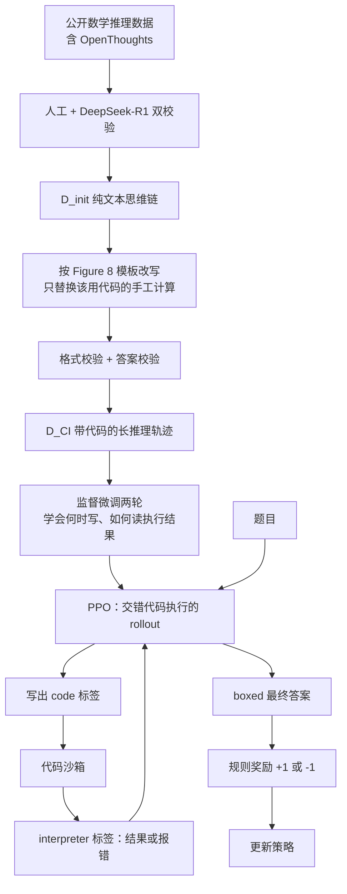

# ReTool：长思维链会想不会算，把代码解释器嵌进思考过程，只奖励最终对错

<!-- release-date: 2025-04-15 -->

> 本文依据 ByteDance Seed 发布的 **ReTool: Reinforcement Learning for Strategic Tool Use in LLMs**，即 arXiv:2504.11536v2、封面日期 2025-04-15、共 16 页的 letter 版式稿。共同第一作者为 Jiazhan Feng 与 Shijue Huang，通讯作者为 Wanjun Zhong。页码均指 PDF 本身的页码。截至 2026-09-10 核验，arXiv 上最新版本仍是 v2（2025-04-17 提交，注释为 fix typos），与本地原件一致。文中会明确区分三层：**论文写了什么**（带页码）、**本文如何解释它**、**哪些是外部资料补充**（给出链接并标注）。

## 读之前需要的最少背景

这篇论文不讲新的基座架构。它讲的是：已经会写长思维链的语言模型，怎样学会在思考过程中**真的去跑一段代码**。

先记住四个词就够往下读。

**思维链（Chain-of-Thought，CoT）** 是模型把解题过程写成一段逐步的自然语言。近年的推理模型，比如 OpenAI o1 和 DeepSeek-R1，主要就是用强化学习把这段文字写得更长、更会自我修正（PDF p. 2）。本站对 R1 那条「只看对错、不看过程」的路线，见 [DeepSeek-R1 解读](/reports/DeepSeek/DeepSeek-R1)。

**代码解释器（Code Interpreter，CI）** 在这里就是一个受控的 Python 沙箱。模型写出一段代码，沙箱立刻执行，把打印结果或报错原文送回模型，模型再继续想。

**近端策略优化（Proximal Policy Optimization，PPO）** 是一种常用的强化学习算法。它让新策略相对旧策略的改动不要太大，并用 advantage 告诉模型「这个 token 该被鼓励还是被压下去」。论文用的就是 PPO（PDF p. 4）。

**AIME** 是美国数学邀请赛（American Invitational Mathematics Examination）。论文把它当作高难度数学奥林匹克基准，分别报 **AIME 2024** 和 **AIME 2025**。摘要里那组最常被转发的数字，全部对应 **AIME 2024**，不要和 2025 混在一起。下文会逐条对页码。

论文的实验跑在 **VeRL** 上（PDF p. 5）。VeRL 就是本站 [HybridFlow 解读](/reports/ByteDance/HybridFlow) 里那套 RLHF 框架的开源实现；同一条线上后来的算法改动，见 [DAPO 解读](/reports/ByteDance/DAPO)。这一篇改的不是框架，也不是裁剪公式，而是 **rollout 里能不能插入一次真实的代码执行**。

## 一句话先说清

纯文本强化学习会把「计算」也当成「推理」。模型用自然语言去乘、去枚举、去解方程，中间一步算错，后面整条链一起错。

监督微调可以教模型「看见这种题就写代码」，但它只能模仿已经写好的示范，学不会自己决定**什么时候写、写什么、写错了怎么办**（PDF p. 2）。

ReTool 的做法是把这两件事拆开：

1. 用合成的冷启动数据，先让模型会在思维链里插入可执行代码；
2. 再用只看最终答案对错的强化学习，让模型自己摸索调用策略。

主结果必须连着年份和基座读（PDF p. 2、6，Table 1）：

| 配置 | AIME 2024 | AIME 2025 | 训练步数 |
|---|---:|---:|---:|
| Qwen2.5-32B-Instruct，未训练 | 26.7% | 未报 | — |
| 同基座，纯文本 RL | 40.0% | 36.7% | 1080（引言）/ 超过 1000（第 3.2 节） |
| 同基座，只用冷启动、推理时带代码解释器 | 40.9% | 34.5% | 无 RL |
| ReTool，同基座 | **67.0%** | **49.3%** | **400** |
| ReTool，换 DeepSeek-R1-Distill-Qwen-32B | **72.5%** | 54.3% | 未另报步数 |

摘要里「32B、67%、400 步对上文本 RL 的 40%、1080 步」，指的是 **AIME 2024、Qwen2.5-32B-Instruct**（PDF p. 1–2、6）。摘要里「extended settings 达到 72.5%，比 o1-preview 高 27.9%」，指的也是 **AIME 2024**：72.5 − 44.6 = 27.9，基座换成了 DeepSeek-R1-Distill-Qwen-32B，不是把同一个 Qwen 模型再多训一会儿，更不是 AIME 2025（PDF p. 1、6）。

冷启动单独就能把 AIME 2024 从 26.7% 拉到 40.9%，和训了 1080 步的纯文本 RL 持平。真正把分数拉开的是后面那 400 步带代码解释器的 RL：AIME 2024 再涨约 26 分。AIME 2025 上冷启动（34.5%）甚至略低于纯文本 RL（36.7%），ReTool 仍然到了 49.3%。所以本文的判断是：

> **示范只能教会格式；策略是结果奖励自己搜出来的。**

这句话是本文对 Table 1 的归纳，论文没有用这一句概括。

## 旧方案卡在哪

论文把问题叠了两层（PDF p. 2）。

第一层：长文本思维链在「需要精确数值或符号操作」的地方会塌。几何推理、精确计算、解复杂方程，都属于这一类。自然语言没有形式保证，中间一步的舍入或口算错误会沿着链条放大。代码解释器正好补这块：枚举、验证、高精度计算都走可执行接口，中间结果可以被数值核对，搜索空间也可以用程序展开（PDF p. 2）。

第二层：已有的工具使用大多停在提示词或监督微调。模型在模仿特定数据分布，换一种题型就不会判断该不该调用工具，或者调用了也不会用执行结果（PDF p. 2）。论文点名的近作是 Chen 等人用自建的「代码穿插思维链」做监督微调（参考文献 [2]，PDF p. 9）：它能把代码嵌进推理，但**不能通过强化学习去学何时、如何调用**。同期工作 ToRL 已经在 Qwen2.5-Math 的 1.5B 和 7B 上用强化学习学工具策略，但论文评价其表现仍不理想，ReTool 把这条线做到 32B（参考文献 [8]，PDF p. 9）。

两层叠在一起，就是一个很具体的训练问题：

> **计算不该再由下一个 token 的语言模式去「猜」；调用策略也不该再由人类写死的示范去「背」。**

ReTool 把代码执行变成 rollout 的一部分，奖励却故意不看代码能不能跑，只看最后的答案（PDF p. 4）。下面按这条因果链拆开。

## 全景：先示范插入代码，再让结果奖励改策略

方法只有两段：冷启动监督微调，再做带交错代码执行的强化学习（PDF p. 3，第 2.1 节）。

这是根据 PDF p. 3–5 与附录 Figure 7、Figure 8 重画的**机制示意图**，不是实测时间轴。图里的 `D_init`、`D_CI` 是论文自己的记号（PDF p. 3）。

和纯文本 RL 的差别，论文画在 Figure 2（PDF p. 4）：

- 上面那路：策略模型一次吐完整文本，再打分；
- 下面那路：策略模型和代码沙箱来回交接，轨迹是文本、代码、解释器反馈、最终答案拼起来的。

颜色在原图里分了四类：文本、代码、解释器反馈、最终结果（PDF p. 4，Figure 2 图例）。关键不是多了一种颜色，而是 **生成过程中途会暂停、把环境吐出来的 token 接回去、再继续生成**。

## 冷启动：不要重写思维链，只把算得动的步骤换成代码

旧问题：如果冷启动数据是「整段改写成程序思维」，模型会把原来的探索、失败尝试和文字推理一起丢掉，后面的 RL 也没有自然语言骨架可改。如果冷启动太弱，模型在 RL 里甚至不会发出可被解析的代码边界。

新设计：先收集高质量**纯文本**推理数据 `D_init`，再自动改写成带代码的 `D_CI`（PDF p. 3）。

来源包括公开数据集，论文点名了 OpenThoughts（PDF p. 3）。过滤是双通道：人类专家，加上 DeepSeek-R1 做评估，去掉无效样本，得到 `D_init`。

改写不是让模型重新解一遍题。附录 Figure 8 的提示词把目标写得很窄（PDF p. 16）：

- 只替换「用代码会更快或更准」的手工计算；
- **原来的推理逻辑，包括失败的探索，都要保留**；
- 「不要改思维过程里其余的 token」；
- 代码必须是完整脚本、显式 `print`、执行结果和模型输出逐 token 对齐；
- 改写结果包在 `revised_thinking_process` 标签里。

这是一次定点手术，不是全文重写。论文随后做两段校验：格式校验，保证后续 RL 能稳定检测到调用触发器；答案校验，扔掉最终答案不对的样本（PDF p. 3）。

监督微调就在 `D_CI` 上做，两轮（PDF p. 5）。论文没写 `D_CI` 有多少条、改写用的是哪个模型、OpenThoughts 之外还有哪些来源。这些都是原文缺口，下文「论文没写的」里集中列。

**机制。** 冷启动要教的是三件小事：在该计算的地方停下来；用固定标签把代码边界标出来；看懂解释器返回的数字或报错。它不负责发现新策略。

**收益。** 同一块 Qwen2.5-32B-Instruct，冷启动之后 AIME 2024 到 40.9%，已经和纯文本 RL 的 40.0% 同一水平，并明显高于未训练的 26.7%（PDF p. 2、6）。Table 1 的脚注还写明：冷启动模型**推理时也接代码解释器**（PDF p. 6）。所以 40.9% 测的是「会写代码 + 真的跑代码」，不是「只在文本里假装写过代码」。

**代价和边界。** AIME 2025 上冷启动是 34.5%，略低于纯文本 RL 的 36.7%（PDF p. 6）。示范分布一旦和测试分布错开，SFT 的优势就不稳。另外，Figure 8 要求「其余 token 不动」，这意味着冷启动轨迹在结构上仍然像原来的文本思维链，只是局部换成了代码。**策略层面的变化，论文把它留给 RL。**

**可迁移启发。** 给工具使用做冷启动时，优先保留原推理骨架，只替换环境能替代的那一段。这样 RL 还有自然语言可改，而不是从一段只会调用工具的短程序重新摸索。

## 交错 rollout：思维链写到代码结束标签，就真的去执行

旧问题：如果 rollout 仍然一次生成到底，模型写的代码只是文本里的装饰，执行结果是事后贴上去的，它就无法根据报错改下一笔，也无法把「调用」当成一个需要学习的动作。

新设计：生成过程中动态插入实时代码执行（PDF p. 4–5）。推理时用的提示词在 Figure 7（PDF p. 15）。

工作机制可以按一次暂停来看：

1. 模型先写自然语言推理 $t_1$；
2. 需要计算时，它写出被 `code` 标签包住的完整 Python 脚本 $c_1$；
3. 系统读到结束标签，**暂停生成**，把代码送到沙箱；
4. 沙箱返回成功输出或报错 $f_1$，填进 `interpreter` 标签，再喂回模型；
5. 模型继续写，直到给出最终答案 $o$，或再写一段新代码。

整条轨迹写成

$$
[t_1 \oplus c_1 \oplus f_1 \oplus \cdots \oplus o]
$$

这是论文的记号（PDF p. 5）。$\oplus$ 表示拼接。提示词要求代码是完整脚本、含必要的 import；最终答案必须落在 `answer` 标签里的 $\boxed{\cdot}$ 中（PDF p. 15，Figure 7）。

论文特别写了一句：**成功结果和报错都返回**（PDF p. 5）。没有报错通道，后面那个「aha moment」案例根本不会出现。

PPO 的目标也改了一个条件：概率比里的动作，是在「已经看到题目、前缀，以及代码解释器」的条件下取的（PDF p. 4，式 1）。把重要性比单独写出来更顺：

$$
r_t=\frac{\pi_\theta(o_t\mid q,o_{<t};\mathrm{CI})}{\pi_{\theta_{\mathrm{old}}}(o_t\mid q,o_{<t};\mathrm{CI})}
$$

$$
J_{\mathrm{PPO}}(\theta)=\mathbb{E}_{(q,a)\sim\mathcal{D},\,o_{\le t}\sim\pi_{\theta_{\mathrm{old}}}(\cdot\mid q)}\Big[\min\big(r_t\hat A_t,\,\operatorname{clip}(r_t,1-\varepsilon,1+\varepsilon)\hat A_t\big)\Big]
$$

$q$ 是题目，$o_t$ 是当前 token，$\mathrm{CI}$ 表示这条轨迹里已经插入了代码执行反馈。$\pi_{\theta_{\mathrm{old}}}$ 在公式里是生成这条轨迹时的旧策略；论文正文把它称作 reference model（PDF p. 4），用词和常见的「KL 参考模型」不是同一个东西。裁剪半径 $\varepsilon$ 没有给出数值。advantage $\hat A_t$ 怎么从奖励算出来，论文也没有写——PPO 通常需要 critic，全文却没有提 value 模型或 GAE。

**收益。** 模型的动作空间从「下一个词」变成了「下一个词，或发出一段会被真实世界执行的代码」。执行结果是环境给的，不是模型自己编的，所以数值计算的正确性不再完全压在参数记忆上。

**代价和边界。** 一次 rollout 变成多段生成，中间有沙箱延迟；解释器吐出的 token 还不能当模型自己的输出拿去算损失，否则外部文本会污染梯度。这两件事分别由异步沙箱、反馈掩码和 KV Cache 复用处理，见下一节。另外，这个接口是为**代码解释器**设计的。搜索引擎、浏览器、通用函数调用在论文里只出现在相关工作里，没有实验（PDF p. 9）。

**可迁移启发。** 工具 RL 的最小闭环是：可解析的调用边界、真实环境、把环境输出接回上下文、成功和失败都回传。缺任何一截，模型都学不会「根据反馈改下一笔」。

## 奖励故意不看代码能不能跑

旧问题：如果再给「代码可执行」加一项奖励，最省事的策略是写 `print(0)` 这类一定能跑、但不解题的代码。这就是奖励黑客（reward hacking）。论文自己把简化奖励的目的说成：减轻黑客行为，并让模型只凭结果反馈去长出更多样的解题行为（PDF p. 4）。

新设计：规则化的对错奖励（PDF p. 4，式 2）

$$
R(a,\hat a)=\begin{cases}
1, & \operatorname{is\_equivalent}(a,\hat a)\\
-1, & \text{otherwise}
\end{cases}
$$

$a$ 是标准答案，$\hat a$ 是预测答案。模型必须把最终答案放进指定格式（例如 $\boxed{\cdot}$），才能做规则核验（PDF p. 4）。**没有代码可执行奖励，没有过程分，没有格式分。**

**机制。** 代码写得好不好，只通过「最后那道题对不对」间接影响 advantage。模型可以多调几次、可以先写错再改、可以决定这题根本不用代码——只要最终答案对，就给 +1。这和 DeepSeek-R1、DAPO 那条「结果奖励」是同一类选择，只不过这里的轨迹中间多了环境。

**收益。** 论文把「何时调用、选什么代码、调用时机、以及更多样的行为」全部交给这个稀疏信号去塑形（PDF p. 4）。Figure 3 里代码占比、代码行数、调用提前量在训练中一起变化，作者认为这就是策略在长（PDF p. 7）。

**代价和边界。** +1 / −1 是整条轨迹一个标量。哪一段代码帮了忙、哪一次报错是关键，算法并不知道。能长出自我修正，是作者事后在案例里看到的，不是奖励函数显式鼓励的。评测也依赖 $\boxed{\cdot}$ 能被规则解析；解析失败会直接变成 −1。论文没有报告解析失败率。

**可迁移启发。** 给工具 RL 设计奖励时，先问：这项过程分会不会被「表面上合法、实际上偷懒」的行为刷掉。若会，就不要加。让环境反馈出现在上下文里，让对错出现在奖励里，往往比把「调用了工具」本身做成加分更干净。

## 训练时三处必须改的工程细节

这三处都在第 2.3.2 节（PDF p. 5）。它们不是算法创新，但没有它们，上一节的 rollout 跑不稳。

### 解释器反馈掩码

`interpreter` 标签里的内容是沙箱写的，不是策略模型采样出来的。若对这些 token 算损失，等于让模型去拟合一段它没生成过的外部文本，既打乱原本连贯的推理，也不稳定（PDF p. 5）。做法是把这段从 loss 里掩掉。

这是工具 RL 的常规动作：环境 token 只进上下文，不进策略梯度。论文把它写进正文，说明他们把「外部文本干扰损失」当成真实故障，而不是实现细节。

### KV Cache 复用

每次读到代码结束标签，生成会暂停。若下一段从零预填整条前缀，多轮调用会把同样的 KV 算很多遍。论文的做法是：暂停时把代码执行之前的 KV Cache 存下来，解释器反馈到来之后，**只计算并追加反馈这一段的 KV**（PDF p. 5）。

这就是多轮工具调用场景下的前缀缓存。论文说这会「大幅减少」每次 rollout 的 KV（PDF p. 5），但没有给节省了多少显存或时间的数字。

### 异步代码沙箱

RL 训练的节奏很容易被最慢的那次代码执行拖住。他们把沙箱做成 pod 池，各 worker 按自己当前容量拉任务，形成负载均衡；分布式异步让多次环境交互可以并行，避免慢线程变成瓶颈（PDF p. 5）。原文拼写是 asynchornous，是笔误。

论文没有写超时、内存上限、是否允许网络、用的是哪种解释器镜像。能确定的只有：这是为了加速 RL，不是为了评测公平。

超参方面，原文给出的是一张很短的清单（PDF p. 5）：

| 项 | 值 |
|---|---|
| 框架 | VeRL |
| 算法 | PPO |
| 主基座 | Qwen2.5-32B-Instruct |
| 冷启动 | `D_CI` 上两轮 |
| 优化器 | AdamW，初始学习率 $1\times 10^{-6}$ |
| 期望最大序列长度 | 16,384 token |
| mini-batch | 512 |
| KL 系数 | 0.0 |

KL 系数直接设成 0，和 DAPO 后来删掉 KL 项是同一方向，但 ReTool 论文没有解释为什么。clip $\varepsilon$、每题采样条数、rollout batch 和 mini-batch 的关系、GPU 数量、RL 阶段用的题库，原文都没写。

**可迁移启发。** 工具 RL 的训练稳定性，往往先死在三件小事上：环境 token 漏进 loss、多轮前缀重复计算、同步等待最慢的一次工具调用。这三件事可以在不改算法的前提下先做掉。

## 实验怎么证明这件事

### 评测口径

AIME 2024 和 AIME 2025 各重复 32 次，用总体平均准确率估计 pass@1；推理温度 1.0，top-p 0.7（PDF p. 5）。这和 DAPO 的 avg@32 是同一类口径。对照模型的数字是从对应文献抄来的 avg@k，再当作 pass@1 来报（PDF p. 5）。所以 Table 1 上半部分是**跨论文数字**，下半部分消融才是作者自己在同一套设定下跑的。

纯文本 RL 那一行有脚注：它包含一次**纯文本冷启动 SFT**，为了和 ReTool 公平对比（PDF p. 6）。不要把它读成「基座直接 PPO」。

### 主表：先分清两列年份，再分清两个 32B

完整数字见 PDF p. 6 Table 1，下面按「它到底在比什么」重排。

现有基线（作者未复现）：

| 模型 | AIME 2024 | AIME 2025 |
|---|---:|---:|
| Qwen2.5-Math-72B-Instruct | 30.0 | — |
| Qwen2.5-Math-72B-Instruct-TIR | 40.0 | — |
| Sky-T1 | 43.3 | — |
| OpenAI o1-preview | 44.6 | 37.9 |
| DeepSeek-R1-Zero-Qwen-32B | 47.0 | — |
| QwQ-32B-Preview | 50.0 | 33.5 |
| s1-32B | 56.7 | — |

ReTool 自己的模型：

| 模型 | AIME 2024 | AIME 2025 |
|---|---:|---:|
| ReTool（Qwen2.5-32B-Instruct） | 67.0 | 49.3 |
| ReTool（DeepSeek-R1-Distill-Qwen-32B） | 72.5 | 54.3 |

同基座消融：

| 配置 | AIME 2024 | AIME 2025 |
|---|---:|---:|
| 未训练基座 | 26.7 | — |
| 去掉代码解释器（纯文本 RL） | 40.0 | 36.7 |
| 去掉 RL（只冷启动，推理仍用解释器） | 40.9 | 34.5 |

正文还给出几处相对差（PDF p. 6）：

- Qwen 基座的 ReTool 相对 s1-32B，AIME 2024 高 10.3 分（67.0 − 56.7）；
- 相对 o1-preview，AIME 2025 高 11.4 分（49.3 − 37.9）；
- Distill 基座的 72.5% 相对 o1-preview 的 44.6%，差 27.9 分，对应摘要那句「高 27.9%」。

有三个读法上的陷阱。

第一，**67% 不是 AIME 2025，72.5% 也不是。** 两条都是 AIME 2024。AIME 2025 上 Qwen 基座是 49.3%，Distill 基座是 54.3%（PDF p. 6）。

第二，**72.5% 的「extended settings」是换了更强的蒸馏基座**，不是 Qwen 那条曲线把步数从 400 拉长（PDF p. 1、6）。Distill 这条的训练步数、是否同样冷启动，原文没写。

第三，**Qwen2.5-Math-72B-Instruct-TIR 的 40.0%，和 32B 纯文本 RL 的 40.0% 撞在同一个数上。** TIR 是带工具的数学专用 72B。ReTool 用通用 32B instruct，在 AIME 2024 上高出 27 分。这支持论文的主张：把工具调用放进 RL 的决策过程，比「更大的数学模型 + 工具」更关键（PDF p. 2、6）。但 TIR 那一行是文献数字，评测口径不一定是 32 次平均。

### Figure 1：同样的步数，两条曲线不是一个斜率

封面 Figure 1 在 Qwen2.5-32B-Instruct 上画了 AIME 2024 和 AIME 2025 两条训练曲线（PDF p. 1）。这是实测图，不是示意图。

读图能看到三件事，正文只把终点数字写进了文字。

1. **ReTool 大约在 400 步到 67.0% / 49.3%；纯文本 RL 走到约 1080–1200 步，才到 40.0% / 36.7%。** 引言把文本 RL 的步数写成 1080，对应 AIME 2024 那张图的右端（PDF p. 2）。AIME 2025 那张图的横轴更长，终点标的是 36.7%。
2. **ReTool 不是单调上升。** 两条 ReTool 曲线都是先下降、再陡升。起点大致落在冷启动的分数附近（AIME 2024 约 40，AIME 2025 约 35），大约在 80 步前后探底，随后在 400 步内拉到终点。纯文本 RL 没有这种陡坡，长期徘徊在 30%–40%。
3. **探底的位置，和时间轴上代码行为剧变的位置重合。** Figure 3 里，大约 80–120 步，回复长度从约 10k 掉到约 2.5k，代码占比从约 20% 冲到接近 100%（PDF p. 7）。本文的解释是：模型先「学会了几乎每题都写代码」，准确率短暂变差，再「学会了写对的代码」。这是读图归纳，论文没有把 Figure 1 的凹陷和 Figure 3 的剧变写在一起。

论文把「400 步超过 1080 步的文本 RL」读成训练效率（PDF p. 2、6）。需要留一句边界：两边的一步是不是同一口径的梯度更新，原文没有定义；ReTool 每一步还多了沙箱执行，墙钟时间未必按步数同比缩短。论文没有报任何墙钟或 GPU 小时。

## 训练过程中，代码行为怎样被塑形

第 3.3 节用每个 RL 检查点，在 AIME 2024 和 AIME 2025 的**测试集**上统计行为，画成 Figure 3 六张子图（PDF p. 6–7）。也就是说，这些曲线看的是评测集上的生成，不是训练集上的 rollout。

### 六张子图各自在说什么

**(a) 回复长度。** 先陡降，再缓升；终点仍比 RL 开始前短约 40%，论文给的锚点是从 10k 到 6k（PDF p. 7）。作者把下降归因于复杂计算被更短的代码替换，把回升归因于后来出现了更多样、更复杂的代码行为。读图：大约 120 步处掉到约 2.5k，再爬回约 6k。U 形是清楚的。

**(b) 代码占比。** 含代码的回复比例总体上升，最终覆盖约 98% 的题目（PDF p. 7）。读图：前 40 步大约只有 20%，80 步已到约 75%，120 步之后贴在接近 100%。模型很快进入「几乎每题都调用」的状态。

**(c) 代码行数。** 持续上升，结束时大约是训练前的五倍（PDF p. 7）。读图：起点大约不到 10 行，终点 AIME 2024 约 45 行、AIME 2025 约 55 行。更长的代码被作者读成更复杂的策略。

**(d) 测试集上正确代码条数。** 从约 1k 升到约 5k（PDF p. 7）。读图：前 120 步升得很快，之后在 4k–5k 波动。

**(e) 代码通过率。** 正确回复里，代码通过率接近 100%；错误回复里，最后一段代码的通过率下降（PDF p. 7）。读图：错误回复那两条从大约 95% 降到 AIME 2024 约 88%、AIME 2025 约 84%。作者的结论只有半句：代码能不能执行，会影响推理过程和最终结果。本文补一句解释（不是论文原话）：训练后期还答错的题，越来越常伴随「最后一段代码也没跑通」——剩余错误更像工具失败，而不像「代码跑对了但数学想错了」。

**(f) 调用时机。** 定义为代码起始位置除以回复总长度（PDF p. 7）。数值下降表示代码在回复中更靠前。读图：从约 0.60 降到约 0.52，主要变化同样发生在前 120 步。结合长度的 U 形，调用不仅相对提前，相对训练初期的绝对位置也提前了。

把六张图连起来，作者总结了三条（PDF p. 3、7）：回复更短；代码更多、更长、更早；并出现自我修正和适应性工具选择。前两条有曲线，第三条主要靠案例和词云。

### 「aha moment」是作者对一条轨迹的观察

Figure 4 给了一道硬币贪心题：1、10、25 分硬币不限量，问 $N=1$ 到 $1000$ 里有多少个值让贪心算法恰好得到最少枚数（PDF p. 8）。模型先写了一段调用 `greedy()` 的测试代码，沙箱返回 `NameError: name 'greedy' is not defined`。它接着写：「Oops, the functions need to be defined in the same scope. Let's correct that.」然后把 `greedy()` 和测试函数写在同一段脚本里，跑通，最终 $\boxed{610}$。

论文把这件事称为代码自我修正的「aha moment」，并强调冷启动数据里**没有**显式的自我修正示范（PDF p. 7–8）。作者的解读是：强化学习可以催生元认知，让模型根据解释器反馈改代码。

这一段必须标成**作者观察**，不是被量化证明的能力。

- 全文只有这一条轨迹；
- 没有报告自我修正出现的频率、修正后正确率、修正轮数分布；
- 「冷启动没有自我修正示范」是作者声明，原文没有展示 `D_CI` 的统计来支撑；
- 报错原文被完整送回上下文，模型复述 `NameError` 并补定义，也可以被看成「读错误信息再写一段」的普通补全，不一定需要「元认知」这个更重的词。

它仍然有教学价值：因为奖励不看代码能否执行、因为报错被回传，**这种修正才可能被结果奖励间接保住**。若奖励要求第一段代码就必须跑通，这条轨迹在第一次 `NameError` 时就已经被惩罚了。

### 代码用途：从「几乎只会算」到更杂

Figure 5 用 Doubao-1.5-pro 给代码片段的主要用途分类，再画词云和饼图（PDF p. 8–9）。分类器本身是字节的模型，这是作者的选择，不是独立标注。

下面这些百分比全部读自 Figure 5 饼图上的印刷数字，正文没有另列。RL 前 verification 的 8.54% 印在扇区上，其余有引出线；未标出的小类加起来是剩余部分。

| 用途 | RL 前 | RL 后 |
|---|---:|---:|
| calculation（计算） | 79.1% | 64.13% |
| verification（验证） | 8.54% | 6.65% |
| probability calculation（概率计算） | 4.45% | 2.31% |
| data processing（数据处理） | 3.12% | — |
| computation（运算） | 1.34% | — |
| optimization（优化） | — | 7.58% |
| geometric calculation（几何计算） | — | 4.65% |
| solution search（解搜索） | — | 3.82% |

RL 前计算一项就占近八成。RL 后计算仍是最大块，但优化、几何计算、解搜索明显抬头，词云也更散。作者把它读成适应性工具选择，并认为有利于推广到更广的问题（PDF p. 8）。推广这一点没有在 AIME 之外的基准上验证。

### 同一道题：文本口算找到了合法但不是最大的 $N$

Figure 6 对比「RL 前的纯文本推理」和「RL 后的 CI 推理」（PDF p. 10）。题目是：找最大的四位正整数 $N$，使得任意改一位数字为 1 后，结果都能被 7 整除；再把 $N$ 除以 1000 的商 $Q$ 与余数 $R$ 相加。

纯文本一侧推了一长串模 7 方程，得到 $N=5624$，$Q+R=629$，答案被标成红色。CI 一侧先用代码算 $1000,100,10,1$ 对 7 的模，再用循环搜索，得到 $N=5694$，$Q+R=699$。

论文把左边称为费力且易错的口算，右边称为用简短代码保证计算准确性，让模型把注意力放在整体策略上（PDF p. 8）。

本文核对了这两个 $N$ 是否满足「改任意一位为 1 后能被 7 整除」——**两个都满足**。5624 改成 1624、5124、5614、5621 都能被 7 整除；5694 改成 1694、5194、5614、5691 同样可以。差别不在「左边算子算错了」，而在题目要的是**最大的**四位数。5694 > 5624，所以 629 是合法但不是最优。代码搜索从 9 到 1 枚举千位，更不容易停在一个较小的可行解上。

这一点比「口算会算错」更接近 ReTool 想展示的分工：文字负责列出约束，程序负责在约束上做穷尽。论文没有写 5624 其实也合法。

## 它在文献里的位置

第 4 节把前作收成两条线（PDF p. 9）。

一条是纯推理：CoT、测试时扩展、逐步偏好优化、MCTS、以及 o1 / R1 这类强化学习出来的长思维链模型。Program-of-Thought 和 PAL 已经把 Python 解释器引进来，把计算从推理里拆出去（参考文献 [1]、[5]）。

另一条是工具集成推理：用程序解计算密集的数学题，MathCoder 让文本推理和代码执行互相验证，Chen 等人用监督微调把代码执行嵌进思维链。ReTool 认为 SFT 这条路被数据分布锁死；ToRL 已经开始用 RL 学工具策略，但规模停在 1.5B / 7B，效果不理想。ReTool 的自我定位是：把「何时、如何调用代码解释器」做成 32B 上的强化学习问题，并在 AIME 2024 / 2025 上超过 Qwen-Math-72B-TIR 和 o1-preview（PDF p. 9）。

搜索类的工具 RL（Search-R1、R1-Searcher）被放进参考文献，正文没有拿来做对照实验。

## 论文没写、因此不能补的部分

下面这些不是「写得简略」，而是原文缺失。不应用后文的 GitHub recipe 去填进论文层。

1. **RL 阶段的训练题库。** 论文只说 $(q,a)\sim\mathcal{D}$（PDF p. 4），没有说 $\mathcal{D}$ 是什么。冷启动来源只点名了 OpenThoughts。
2. **`D_init` / `D_CI` 的条数**，以及 Figure 8 改写是哪个模型执行的。
3. **PPO 的 critic、GAE、$\varepsilon$、每题采样数、GPU 规模、墙钟时间。** 公式里有 $\hat A_t$，实现里没有对应段落。
4. **Distill 基座那条 72.5% 的训练协议。** 是否同样两轮冷启动、训了多少步、是否同一套超参，都未写。Figure 1 只画了 Qwen 基座。
5. **AIME 2025 未训练基座的分数**，Table 1 是空白。
6. **自我修正的发生率。** 只有 Figure 4 一条案例。
7. **AIME 以外的任务。** 没有代码生成、科学推理、通用函数调用、多工具混合。
8. **污染讨论。** AIME 2025 的比赛时间早于论文发表，但训练数据是否含同类题，原文未谈。
9. **沙箱安全策略。** 超时、权限、是否联网，未写。

结论段只重复了「AIME 上更准、步数更少、能发展出计算干预策略」（PDF p. 10）。致谢列出 Guang Shi、Mingxuan Wang、Renjie Zheng、Chen Dun、Yun Jiang（PDF p. 10）。

## 外部补充：论文之后公开了什么

**以下全部不是 PDF 里的内容。** 不能拿来改写上面任何一条论文结论。

项目页 [https://retool-rl.github.io/](https://retool-rl.github.io/) 与官方仓库 [https://github.com/ReTool-RL/ReTool](https://github.com/ReTool-RL/ReTool) 在 2025 年 4 月放出推理代码和权重，仓库 News 写的是 `[2025/04] We release the model checkpoints and inference code`。权重在 Hugging Face：[`JoeYing/ReTool-Qwen-32B`](https://huggingface.co/JoeYing/ReTool-Qwen-32B)、[`JoeYing/ReTool-DeepSeek-R1-Distill-Qwen-32B`](https://huggingface.co/JoeYing/ReTool-DeepSeek-R1-Distill-Qwen-32B)。

同一项目页后来写明了论文没写的数据分工：

- 冷启动：[`JoeYing/ReTool-SFT`](https://huggingface.co/datasets/JoeYing/ReTool-SFT)，页面显示约 2,000 条；
- RL 训练：[`DAPO-Math-17k`](https://huggingface.co/datasets/BytedTsinghua-SIA/DAPO-Math-17k)，即本站 [DAPO 解读](/reports/ByteDance/DAPO) 里那 17K 道被改写成整数答案的数学题；
- 验证：AIME 2024、AIME 2025。

判分器项目页指向 verl 里与 DAPO 相同的规则核验。这些把 ReTool 和 DAPO 接在同一条数据与验证器管线上，但 **PDF 自己没有写 RL 数据是 DAPO-Math-17k**。

仓库 News 另有一条：`[2025/07] The ReTool Recipe is fully open sourced`。随后在 verl / verl-recipe 里出现了可跑的 SFT 与 RL 脚本，其中 RL 不仅有论文用的 PPO，也有 GRPO 配方。**那套 recipe 的评测数字、步数和论文 Table 1 不是同一次实验，本文不引用那些数字，也不用它们回写 67.0% / 72.5%。**

## 可迁移启发

### 1. 先把「算」从「想」里拆出去，再决定要不要加过程奖励

文本 RL 把乘法、枚举、验证都交给下一个 token。ReTool 的第一刀不是改 PPO，而是让这些步骤走解释器。第二刀才是：奖励仍然只看最终对错。两刀的顺序不能反。先加「写了代码就加分」，模型会写能跑但不解题的代码。

### 2. 冷启动教接口，RL 教策略

Table 1 里最有用的一行对比是：冷启动 40.9% 对纯文本 RL 40.0%。示范把「怎么插入代码」教到了和长时间文本 RL 同一水平；多出来的 26 分是结果奖励在真实执行里搜到的。迁移时不要指望把工具示范做大就能替代 RL，也不要在模型还不会发出合法调用边界时直接上 RL。

### 3. 环境的失败信息是训练信号，不是日志

Figure 4 能发生，是因为 `NameError` 原文被接回上下文，而奖励没有因为第一次执行失败就判死。设计工具 RL 时，把 stderr 当一等公民送回模型，比单独做一条「可执行奖励」更便宜，也更不容易被刷。

### 4. 掩码、前缀缓存、异步环境，是算法能跑起来的前提

这三件事都不改变目标函数，但分别处理了「谁产生的 token 能进梯度」「多轮调用会不会把 KV 打爆」「最慢的一次工具调用会不会卡住整批」。任何带环境的 RL 都可以先抄这三项，再讨论要不要换 PPO。

### 5. 看行为曲线，不要只看终点准确率

代码占比冲到 98% 的时候，准确率还在 Figure 1 的凹陷里。若只看「调用率」，会误判已经训成。把准确率、长度、调用率、通过率画在同一条步数轴上，才能看出「开始会调」和「调对了」不是同一个阶段。

### 6. 摘要数字必须还原到年份和基座

67% 是 AIME 2024 的 Qwen 32B；72.5% 是 AIME 2024 的 Distill 32B；27.9% 是 72.5 减 o1-preview 的 44.6。AIME 2025 没有这组数。凡是把「ReTool 32B 72.5% 超过 o1」写成 2025 年成绩的转述，都和 PDF 不符。

## 关键词回看

- **ReTool**：Tool-augmented Reinforcement learning，在长思维链里交错执行代码，并用结果奖励学调用策略。
- **代码解释器（CI）**：受控 Python 沙箱，返回标准输出或报错。
- **冷启动数据 `D_CI`**：在纯文本思维链上定点插入代码和执行结果，再做格式与答案过滤。
- **交错 rollout**：生成到代码结束标签就暂停，执行后再把反馈拼接回去。
- **结果奖励 +1 / −1**：只判断 $\boxed{\cdot}$ 里的答案是否等价，不奖励代码可执行。
- **解释器反馈掩码**：环境 token 进上下文，不进损失。
- **KV Cache 复用**：暂停时保留前缀 KV，只追加反馈段。
- **aha moment**：作者对 Figure 4 自我修正案例的称呼，不是被统计证明的定律。
- **AIME 2024 / AIME 2025**：两个不同年份的评测集；摘要主数字全部落在 2024。
- **VeRL / verl**：训练框架，论文层只写了名字和链接；系统机制见 HybridFlow 篇。

## 最后的判断

ReTool 证明的是一件很窄、但很硬的事：在同一个 32B instruct 基座上，把真实代码执行嵌进 PPO 的 rollout，并用纯对错奖励，可以在 AIME 2024 上用 400 步走到 67%，而纯文本 RL 用 1080 步只走到 40%。冷启动单独做不到这件事，更大的 72B 工具数学模型也没有做到。

它没有证明的同样清楚。自我修正是案例不是曲线；代码用途变多样依赖自家分类模型；任务停在数学加 Python；PPO 的 critic 与数据配方在 PDF 里是空的。把 72.5% 读成「同一个模型再训久一点」或「AIME 2025 的成绩」，都是在读摘要时没翻 Table 1。

如果只记一句话，可以记：

> **语言模型负责决定何时把计算交给程序；程序负责算对。奖励只问最后那道题对不对，调用策略才会自己长出来。**

## 资料与阅读边界

- 原始依据：本地 `papers/ByteDance/ReTool.pdf`，即 arXiv:2504.11536v2，封面 Date: April 15, 2025，16 页，letter。pdfinfo 的 Title/Author 为空，标题与作者以封面文字为准。
- arXiv 页面：<https://arxiv.org/abs/2504.11536>。提交历史为 v1（Tue, 15 Apr 2025 18:10:22 UTC）与 v2（Thu, 17 Apr 2025 16:46:07 UTC，fix typos）。截至 2026-09-10 没有 v3。本文 `release-date` 取最早官方公开日 2025-04-15，依据是封面日期与 v1 提交时间；v2 只修笔误，不回写日期。
- 项目页：<https://retool-rl.github.io/>。
- 官方代码仓库：<https://github.com/ReTool-RL/ReTool>。
- 训练框架：<https://github.com/volcengine/verl>，论文脚注 1（PDF p. 5）。
- 外部补充：项目页与仓库在论文之后公开了权重、约 2k 条冷启动数据、并写明 RL 数据用 DAPO-Math-17k；2025-07 另有 recipe 开源。上述不进入论文主张层。
- 跨篇参考：结果奖励与长思维链 RL 见 [DeepSeek-R1](/reports/DeepSeek/DeepSeek-R1)；训练框架见 [HybridFlow](/reports/ByteDance/HybridFlow)；同一条 verl 管线上的算法默认项与 DAPO-Math-17k 见 [DAPO](/reports/ByteDance/DAPO)。
