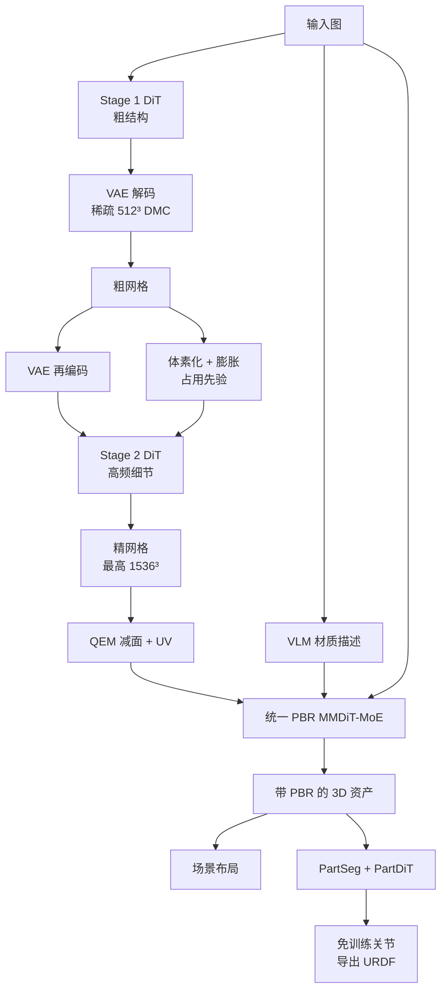

# Seed3D 2.0：几何要锐、PBR 一次出齐、生成完还得能进仿真

<!-- release-date: 2026-04-23 -->

> 本文依据 ByteDance Seed 的 **Seed3D 2.0: Advancing High-Fidelity Simulation-Ready 3D Content Generation**，即 arXiv:2605.13862v1（2026-04-22，18 页）。动笔前核过 arXiv 官方提交历史：目前只有 v1，本地件封面水印为 `arXiv:2605.13862v1 [cs.GR] 22 Apr 2026`，与官方件一致，**未做替换**。
>
> 全文页码指 PDF 自身页码。本篇 PDF 页码与印刷页码一致（第 1 页起页脚就印着 `1`），引用时可以直接对照。
>
> `release-date` 取 **2026-04-23**。依据是两条官方产品渠道在同一天汇合：官方产品页 [https://seed.bytedance.com/seed3d_2_0](https://seed.bytedance.com/seed3d_2_0) 标注 April 23, 2026 / 2026 年 4 月 23 日，并写「今天，我们正式发布」；同日官方博客 [Seed3D 2.0 Released: Higher Precision and Greater Usability](https://seed.bytedance.com/en/blog/seed3d-2-0-released-higher-precision-and-greater-usability) 写明技术报告已公开、API 已上火山引擎。arXiv v1 的提交时间是 2026-04-22，那是论文上传日，不是模型向公众开放的日期。摘要脚注的 Model ID `doubao-seed3d-2-0-260328`（PDF p. 1）里的 `260328` 没有官方公开证据表明是首发日，**不当作首发日**。
>
> 文中始终区分三件事：**报告写了什么**、**本文如何解释**、**哪些是外部补充**。凡是本文自己推出来的、从图里读出来的、或者从官方产品页补进来的，都会当场说明。
>
> 边界说明：Seed3D 1.0 只作为本报告的对照基线，数字一律以本 PDF 为准；本文不另写 1.0 的解读。同方向已发布的物体级报告是 Hunyuan3D 2.0，可以对照「3D 生成要同时过几何和材质」这条判断，但不要把那一篇的实验数字读成本报告的结果。场景级、可漫游世界是另一条线（HunyuanWorld 1.0），与本报告的「物体摆进场景」不是同一件事。

## 3D 生成为什么不能只看「像不像」

先把门槛说清楚，再上名词。

一张图变成一个 3D 物体，看起来「像」并不难。难的是它能不能进生产。报告一开篇就把用途摊开：XR 内容、3D 打印、机器人仿真（PDF p. 3）。这三类下游要的不是同一张好看的壳：

- 打印和渲染要**边是直的、薄壁是在的、表面是规整的**；
- 游戏引擎和影视灯光要**换一盏灯看起来仍然对**，不能把当时的高光烤死在颜色里；
- 机器人和交互系统要的不是一整块死网格，而是能摆进场景、能拆成部件、门能开、抽屉能拉的资产。

这三件事经常被缩成一句「生成质量更好了」。报告拒绝这种缩法。它把 Seed3D 1.0 留下来的问题劈成两道缺口（PDF p. 3）：

**质量缺口。** 生产环境要几何规整（锐利边缘、结构一致的表面），还要基于物理的材质在不同光照下保持视觉一致。包括 1.0 在内的现有模型能给出「说得过去的形状」，但在这些细粒度标准上持续不及格。

**能力缺口。** 静态的整体网格已经不够。下游越来越要多物体场景、按功能拆开的物体、以及部件级的物理交互。1.0 只有有限的场景生成，没有部件分解，也没有关节（articulation）。

所以 2.0 要做的不是「再画一个更好看的 mesh」。它要同时过三关：几何精度、统一的 PBR 材质、以及能进物理 / 图形引擎的仿真套件。

3D 生成里，几何和材质是两道独立的关，过了一道不等于过了另一道。白模准，贴图仍可能把光照烤进去；贴图好看，边缘仍可能是糊的。本报告后面的人评也按这个拆法来：先评只有形状，再评带纹理的端到端资产（PDF p. 1、p. 10）。

## 读之前只需要这几个概念

下面这些词正文都会用到。这一节是**读前背景**，不全是报告自己定义的。

**网格（mesh）**：一堆顶点连成三角面。游戏引擎、建模软件、物理引擎原生吃的就是它。没有拆开的网格，就是一整块死壳。

**有向距离场（Signed Distance Function，SDF）**：给空间里任意一点，返回它到物体表面的距离；外面为正、里面为负、正好在表面上为 0。形状于是变成「这个函数的零等值面」。神经网络适合拟合这种连续场。

**Dual Marching Cubes（DMC，对偶移动立方体）**：从 SDF 抽出三角网格的经典算法家族里的一种。报告用的是 DMC，而不是更常见的 Marching Cubes（PDF p. 4，引用 [15]）。差别在于它在对偶格子上抽面，三角质量通常更好。抽网格的分辨率直接决定细节上限和计算量。

**向量集（vector set，VecSet）**：把一个 3D 形状压成一串潜变量 token，序列里的第 $k$ 个 token **并不对应空间中某个固定位置**。这是近年物体级 3D 生成的主流表示，报告明确说自己走这条范式（PDF p. 4，引用 [8, 22, 23]）。好处是生成变成「生成一条序列」，可以借用图像扩散那一套工具；代价是 token 自己没有坐标，结构规整性不容易保住——后面 Stage 2 往回加体素位置编码，就是在补这个代价。

**变分自编码器（Variational Auto-Encoder，VAE）与潜空间**：直接在原始网格上做生成太贵。先用 VAE 把形状压成短得多的潜变量（latent），扩散在这个压缩空间里进行，再用解码器还原。压缩比一高，边角就容易糊。这是几何这一半的核心矛盾。

**扩散 Transformer（Diffusion Transformer，DiT）与整流流（rectified flow）**：从高斯噪声走到数据分布的生成模型。报告的几何 DiT 用的是基于整流流的扩散框架（PDF p. 4，引用 [10]）。本 PDF **没有写出公式**；按它所引的 Flow Matching，最简单的直线路径可以写成：

$$
x_t = (1-t)\,x_0 + t\,x_1,\qquad u_t = x_1 - x_0
$$

$x_0$ 是噪声，$x_1$ 是数据，$t$ 从 0 走到 1。模型要学的是速度场 $u_t$，也就是「现在该往数据走多快、朝哪走」。这是**对引用方法的解释**，不是本报告自己编号的式子。

**PBR（Physically Based Rendering，基于物理的渲染）**：不把「看起来的颜色」写成一张图，而是拆成几张物理量。本报告直接生成的是多视图 **albedo（基础色 / 反照率）** 和 **metallic-roughness（金属度—粗糙度，文中简称 MR）**（PDF p. 5）。albedo 是去掉光照之后的固有颜色；金属度和粗糙度决定高光像不像金属、边缘是锐是糊。有了这套贴图，换灯光时引擎可以重新算，而不是播放一张烤死的照片。

**UV 展开与纹理补全**：把网格表面剪开摊平到一张 2D 图上，再把多视图上的颜色烤回去。报告在推理流水线末尾写了 UV unwrapping 和 UV texture completion（PDF p. 10），但**没有展开补全怎么做**。

**MMDiT（Multimodal Diffusion Transformer，多模态扩散 Transformer）**：一种双流 Transformer，不同模态各有投影，在共享的 DiT 块里交互。2.0 的纹理模型沿用 1.0 的 MMDiT 双流骨架（PDF p. 5）。

**混合专家（Mixture-of-Experts，MoE）**：不是每次把整张网络跑一遍，而是按输入把计算路由到少数专家。报告用它来撑高纹理分辨率，同时靠稀疏路由控制算力（PDF p. 5，引用 [17]）。**专家数、路由算法、每次激活几个专家，报告都没写。**

**视觉语言模型（Vision-Language Model，VLM）**：能同时看图和读文字的模型。报告用它写材质描述、给资产打分、判断关节类型。引用的是 Seed1.6（PDF p. 6，引用 [1]）。

**无分类器引导（Classifier-Free Guidance，CFG）**：推理时同一步跑两次网络，一次带条件、一次不带，再按系数外推，让输出更听条件。代价是每步算力翻倍。报告在蒸馏一节用到它（PDF p. 10），但**没有写引导系数**。

**关节化（articulation）与 URDF**：门绕哪根轴转、转多少度、抽屉沿哪条轨道拉。把这些写成机器人标准格式 URDF，Isaac Sim 这类仿真器才能推动它。报告的关节流水线是免训练的（PDF p. 7–8）。

**规范坐标图（canonical coordinate map，CCM）**：报告正文没有定义这个缩写，但 Figure 3 把 `Normal & CCMs` 画成从输入网格送进纹理模型的几何条件（PDF p. 5）。按图形学的通常用法，法线图把表面朝向写成颜色，坐标图把每个像素对应的 3D 位置写成颜色；「规范」表示它们在物体自身坐标系里，不随相机转动改含义。**这是本文对图的读法，不是报告自己的定义。**

## 一句话先说清

Seed3D 2.0 是一套从单图出发的 3D 内容系统，建立在 1.0 之上（PDF p. 1）。它真正改的不是「把同一条流水线加宽」，而是把 1.0 里绑在一起的几件事拆开：

- **几何**：1.0 用单阶段生成，结构和细节互相抢预算；2.0 改成 coarse-to-fine 两阶段，并给 VAE 加上 locality-aware 的压缩与解码。
- **材质**：1.0 先出多视图 RGB，再估计 PBR，误差会沿级联往下传；2.0 用一个统一 PBR 模型直接出 albedo 和 MR，再用 MoE 和 VLM 语义条件把分辨率和物理合理性往上推。
- **仿真**：在单个资产之外加一套模型，覆盖场景布局、部件分解、免训练关节生成，让结果能进物理和图形引擎。

人评是对五个近期商业模型做的盲测。带纹理的端到端资产上，2.0 的胜率是 69.0%–89.9%（PDF p. 1、p. 3、p. 10、p. 15）。几何单独评时，对自家 1.0 的胜率高达 98.3%（PDF p. 1、p. 10）——几何这一跳，比纹理那一跳更陡。

## 报告地图：18 页里各写了什么

先摊开篇幅。这份报告短、图多、公式几乎没有，密度全在设计和人评里。

| 报告章节 | PDF 页 | 讲了什么 | 密度 |
|---|---|---|---|
| 标题、摘要、Figure 1 | p. 1 | 三句话贡献；人评条形图；Model ID 与官方页 | 高 |
| 目录 | p. 2 | 章节导航 | — |
| §1 引言 | p. 3 | 质量缺口与能力缺口；三项贡献 | 高 |
| Figure 2 + §2.1 几何 | p. 4 | 两阶段总图；locality-aware VAE；Stage 1 DiT | 高 |
| Figure 3 + Stage 2 + §2.2 纹理 | p. 5 | 粗形状先验与体素 PE；统一 PBR；MoE | 高 |
| VLM 条件 + §2.3 仿真套件 + §2.3.1 | p. 6 | 病态材质估计；场景布局的视觉 / 文本两路 | 高 |
| Figure 4 + §2.3.2–2.3.3 起 | p. 7 | 部件分割与 PartDiT；关节生成的动机 | 高 |
| 关节生成续 + Figure 5 + §3 数据 | p. 8 | 免训练关节；六段数据管线前五段 | 高 |
| 锐度重网格 + §4 训练 | p. 9 | $1024^3$ / 15 秒；几何两阶段课程；纹理 PT / SFT | 高 |
| §5 推理 + §6 人评起 | p. 10 | $512^3$ → $1536^3$；CFG + 步数蒸馏；人评设置与数字 | 高 |
| Figure 6 | p. 11 | 几何定性对照，六组样例 | 中 |
| Figure 7 + §7.1 起 | p. 12 | 纹理定性对照；场景应用起笔 | 中 |
| Figure 8–9 + §7.2 起 | p. 13 | 文 / 视频生场景；部件分解示意 | 中 |
| Figure 10 + §8 结论起 | p. 14 | 水桶 / 微波炉 / 矿车在 Isaac Sim 里被推动 | 中 |
| 结论续 | p. 15 | 人评收束；未来工作 | 低 |
| 参考文献 | p. 16–17 | 23 条 | — |
| 附录 A 贡献者 | p. 18 | 核心贡献者 15 人，贡献者 13 人 | — |

有几件必须在读正文前知道的事，因为它们决定这篇解读能走多深：

- **全文没有参数量。** Stage 1 只说「放大后的 Seed3D 1.0 DiT 骨干」（PDF p. 4），MoE 只说稀疏路由（PDF p. 5）。VAE 多大、DiT 多大、专家多少，一个数都没有。
- **全文没有训练数据体量。** 只有「broad-scale dataset」「large-scale dataset」「high-quality curated subset」（PDF p. 8–9），没有物体数、类别分布、清洗前后的保留率。
- **全文没有 GPU 数、没有端到端耗时。** 唯一带秒的数字是数据管线里 $1024^3$ 水密重建「15 秒」（PDF p. 9），那是训练数据预处理，不是生成推理。
- **全文没有消融表，也没有 Chamfer / IoU 这类几何数值指标。** 定量证据几乎全部是人评条形图（PDF p. 1、p. 10）。
- **全文几乎没有公式。** 整流流、CFG、稀疏路由、锐度损失都只出现在文字里。下面凡是写出的式子，都会标明是对引用方法或本文解释，不是 PDF 里的编号公式。

因此这篇解读的重心不放在「复现配方」，而放在**每一处拆分补的是哪一道缺口，以及人评到底撑住了什么**。

## 全景：三条流水线，不是一个模型

按 Figure 2、Figure 3、Figure 4 和 §2.3 重画。这张图只表示模块怎么连，不含任何耗时或精度信息。

三个要点：

**第一，几何和材质仍然是两段。** 先出网格，再出 PBR。报告没有改成「一个网络同时出形状和贴图」。它改的是每一段内部：几何从单阶段变成两阶段，材质从级联 RGB→PBR 变成一次出齐。

**第二，仿真套件接在资产之后，不是另起一个 3D 世界模型。** 场景是「布局 + 逐个生成 + 摆进去」；部件是「先感知再补全」；关节是「VLM + 几何候选 + 视频运动先验」，而且免训练（PDF p. 6–8）。

**第三，能进引擎的那几步，大量是经典几何算法。** DMC、体素膨胀、QEM 减面、UV 展开、形态学操作，报告都写了（PDF p. 4、p. 10）。生成模型负责「从噪声里长出形状和材质」，确定性算法负责「把它变成引擎吃得下的东西」。

## 几何第一刀：locality-aware VAE，把压缩预算还给复杂区域

### 旧问题：token 一少，边就没了

VAE 的任务是：输入网格，输出一串 VecSet token；再从这串 token 还原 SDF，抽出网格。压缩比越高，后面的 DiT 越便宜，重建也越容易丢锐边和薄壁。

2.0 的 VAE 沿用 1.0 的双分支 perceiver 编解码器（PDF p. 4，架构引 Dora [3]）。编码器吃的是表面点云，并补上位置、法向和锐边采样；解码器拿空间查询点对 latent 做交叉注意力，得到连续 SDF，再用 DMC 抽网格。

到这里为止，和「把 3D 压成一串 token」的主流写法还没有分家。分家的是下一句。

### 新设计：邻域里的 token 是重复的，把它们合并掉

报告的观察是 VecSet 的一个结构性质：同一空间邻域里的 token 编码的是冗余的几何信息（PDF p. 4，引用 [2, 5, 6]）。于是它做 **locality-aware latent aggregation（局部感知的潜变量聚合）**：编码时把空间邻域里的 token 合并，把表示能力集中到几何复杂的区域，同时保住一份紧凑的全局结构。

可以把它想成画建筑平面图。整面白墙不需要每平方米一张卡片；门框、楼梯和管道井才需要密写。合并邻域 token，就是把卡片从「按面积发」改成「按结构复杂度发」。

同一条局部性原理还用在解码。SDF 解码时，每个空间查询点如果都要看全部 latent，交叉注意力就是计算瓶颈（PDF p. 4）。2.0 把这种稠密注意力换成 **content-adaptive sparse routing（内容自适应稀疏路由）**：每个查询只看一小撮空间上连贯的 token。

### 工作机制

编码侧：点云 → 双分支 perceiver → 邻域聚合 → 更短的 VecSet。报告声称这样能用**更少的 latent token** 达到比 1.0 VAE 更高的重建质量（PDF p. 4）。

解码侧：空间查询不再对全部 token 做注意力，只对路由选中的子集做。推理一节还加了「空间感知分组」（spatially-aware grouping）来加速基于交叉注意力的 SDF 查询（PDF p. 10）。

### 收益、代价、没写的东西

收益是报告自己写的：更高的空间压缩比、更锐的几何、更高的重建保真，以及更低的解码延迟（PDF p. 3–4）。人评里对 1.0 形状胜率 98.3%，作者把这笔账算在「两阶段 DiT + locality-aware VAE」头上（PDF p. 10）。**这不是消融**：两个改动绑在一起，分不出各值多少。

代价和空白同样清楚：

- 邻域怎么定义、合并用平均还是学习、稀疏路由的 Top-$k$ 是多少，全部没写。
- 「更少 token、更高重建质量」没有对照表。
- VAE 的失真仍是全流水线的天花板。Stage 2 的目标被写成「把最终输出推近 VAE 能达到的重建保真」（PDF p. 5）。也就是说，VAE 还原不出的锐边，DiT 也变不出来。

### 可迁移启发

> **压缩的时候不要按均匀格子分配名额。先承认邻域是冗余的，再把名额集中到变化剧烈的地方；解码时也不要让每个查询都扫完全部记忆。**

这条不限于 3D。KV cache 压缩、特征金字塔、日志采样，都有同一个陷阱：按均匀预算切，复杂区域先死。

## 几何第二刀：coarse-to-fine，别让结构和细节抢同一场扩散

### 旧问题：一场扩散要同时当建筑师和雕刻师

1.0 是单阶段生成。报告给的诊断非常干脆：在一次没有额外引导的扩散过程里，同时学全局结构和局部细节，两者互相拉扯。结果是拓扑大体对，但形状过平滑，锐边、精确曲率和细表面保不住（PDF p. 4）。

这不是「模型不够大」这么简单。Stage 1 用的已经是放大后的 1.0 DiT 骨干，它仍然过平滑（PDF p. 4）。报告把原因归到任务本身的张力，而不是骨干容量。

### 新设计：先搭骨架，再在骨架上刻

两阶段策略把问题拆成两个子问题（PDF p. 4–5，Figure 2）：

**Stage 1：粗结构。** 从图像条件直接生成粗 latent，再解码成粗网格。它负责整体拓扑和粗表面。

**Stage 2：细节。** 把 Stage 1 的输出当成几何锚，专门恢复高频细节。两个互补先验把 Stage 2 按在骨架上：

1. **Coarse Shape Prior（粗形状先验）。** 把 Stage 1 的 latent **部分加噪（partially diffused）** 再送进 Stage 2，当作粗几何参考，逼它去恢复局部细节，而不是重新发明整体结构（PDF p. 5）。
2. **Voxelized Positional Encoding（体素化位置编码）。** 把 Stage 1 的粗几何变成体素坐标，当作位置编码注入 Stage 2，让每个 latent token 锚到一个空间位置，从而促进结构规整（PDF p. 5）。

VecSet 的 token 本来没有固定坐标。Stage 1 可以在这种「无坐标集合」上先把大形长出来；Stage 2 则从已经存在的粗网格里**借回坐标**。本文的理解是：位置编码在这里不是「序列第 $k$ 项」的索引，而是「这个 token 现在对应物体上哪一块」的空间锚。**报告没有这样对比着写，这是本文的解释。**

「部分加噪」也需要一句人话。把干净的粗 latent 加一点噪声再去噪，低频骨架还在，高频被噪声盖住，模型就只能在骨架附近改细节。这和图像里「img2img / SDEdit」是同一类动作。**具体加多少噪声，报告没写。**

### 推理时这两先验具体怎么接

§5.1 把训练时的两个先验，落成推理时的两条并行信号（PDF p. 10）：

1. Stage 1 DiT 预测粗 VecSet latent，在稀疏 $512^3$ 网格上做 DMC，得到中间网格。
2. 中间网格经 VAE 编码器再变成 latent；同时做 GPU 加速的体素化和**形态学膨胀（morphological dilation）**，得到空间占用先验。
3. 两路信号一起条件化 Stage 2，抽出最高 **$1536^3$** 的网格。

膨胀这一步值得停一下。体素占用如果卡得太死，Stage 2 没有空间往外长薄壁和锐边。先膨胀一圈，等于给细节预留壳体。**报告只写了做膨胀，没有写核大小，也没有解释动机；上面这句是本文的解释。**

$1536^3$ 如果当稠密格子来算，查询点大约是 $3.6\times 10^9$（本文按 $1536^3$ 算出，报告只给分辨率）。所以报告用层次化策略：用 Stage 1 的占用先验和多尺度过滤逐步剪掉空间查询点，再用空间感知分组做交叉注意力 SDF 查询（PDF p. 10）。最后用 GPU 加速的 **QEM（Quadric Error Metrics，二次误差测度）** 减到目标面数，再 UV 展开给纹理用。

$512^3$ 和 $1536^3$ 只出现在推理节。训练节写的是 latent 长度 256 → 4096、图像分辨率 256 → 512（PDF p. 9），两套数字不要混。

### 收益与边界

报告把锐边、薄壁、复杂拓扑的突破算在这套两阶段策略上（PDF p. 3）。定性上，Figure 6 给出六组白模对照：机甲、机芯、台灯、胸像、建筑、浮雕（PDF p. 11）。本文从图里读到的差别——不是报告逐项统计的——主要是：机芯内部的齿与夹板更完整，台灯场景里的盆栽没有丢，浮雕的层次更清楚。Tripo 和 Rodin 在若干例上更平滑或更碎。

边界：

- Stage 1 仍然过平滑，这是设计预期，不是 bug。如果 Stage 1 拓扑错了，Stage 2 没有机制把它推倒重来。
- 两阶段意味着至少两次 DiT + 一次中间编解码。后面靠蒸馏补推理成本，但原版轨迹有多贵，报告没说。
- 没有「只开 Stage 1 / 只开 Stage 2 / 关掉体素 PE」的对照。对 1.0 的 98.3% 胜率是捆绑证据。

### 可迁移启发

> **当两个目标的频率差了一档，不要让它们抢同一场生成。先用廉价通道路出低频骨架，再把高频生成按在骨架上；需要位置时，从骨架里借，不要从 token 序号里编。**

级联超分、先布局后填词、先骨架后蒙皮，都是这个结构。关键约束是：**第二阶段必须被锁在第一阶段上，否则它会重新发明整体，两阶段就白拆了。**

## 材质：不要先画一张 RGB，再猜它是什么做的

### 旧问题：级联管线把误差存进下一棒

1.0 的纹理是级联的：先 **Seed3D-MV** 出多视图 RGB，再 **Seed3D-PBR** 从 RGB 估计材质（PDF p. 5）。中间那张 RGB 已经把当时的光照烤进去了。下一棒只能在「看得到的颜色」上猜：这块亮，究竟是金属，还是刚好有一盏灯？

报告把未知光照下的 PBR 估计写成**病态问题（ill-posed）**：同一外观可以来自完全不同的「光照 × 材质」组合（PDF p. 6）。它列了三种常见失败：

- 光照被错误烤进 albedo，颜色漂移；
- 非金属上的高光被当成金属响应；
- 漫射光下的金属被估成非金属。

另外，1.0 的图像分辨率低，细纹理和文字在分解时保不住（PDF p. 5）。

### 新设计：一个模型直接出 albedo 和 MR

2.0 把级联收成**统一 PBR 生成模型**：从参考图和 3D 几何直接出多视图 albedo 和 metallic-roughness，不再经过中间 RGB（PDF p. 5）。骨架仍是 1.0 的 MMDiT 双流；albedo 和 MR 在共享 DiT 块里联合建模，各走各的投影层。

Figure 3 把这条路画全了（PDF p. 5）：输入图、噪声、由网格得到的法线与 CCM、再加上 VLM 写的材质说明，一起进 MMDiT-MoE，一次出多视图 albedo 和多视图 MR。图注里的样例是一个蒸汽朋克时钟机器人，VLM 明文写了 aged Metal 和 Glass——语义条件不是装饰，是输入的一部分。

取消中间 RGB，等于取消「先编造一种光照，再假装没看见它」。模型必须直接预测物理量。这是统一模型的真正好处，不只是少一个网络。

### 加宽容量：MoE 用来撑分辨率，不是用来堆参数好看

分辨率要升高，稠密网络的算力会按潜空间体积涨。报告的选择是 MoE：把容量做大，靠稀疏专家路由把激活量按住（PDF p. 5）。

它声称的收益写得很具体，但仍是定性的（PDF p. 5–6）：

- 更丰富的视觉图案、更细的表面纹理；
- 文字和花纹这类细特征比 1.0 好，尤其利好 albedo；
- 金属—粗糙度边界更干净，区域过渡更清楚。

**目标分辨率是多少、专家多少、路由是否带负载均衡，全部没写。** 「keeping less active computation」只是一句方向，不是一张算力表。

### 再加一道语义锁：VLM 条件

纯外观不够，就加语言。VLM 生成材质类型、表面特征和物理属性的描述，编码成条件 token，与几何、参考图一起注入 DiT（PDF p. 6）。

训练时这道锁还故意晚装。纹理是两段课程（PDF p. 9）：

1. **Pre-Training**：统一 PBR + MoE，在大规模数据上学多视图 albedo / MR，覆盖多样外观、材质类别和光照。这一段**还没有 VLM**。
2. **SFT**：高质量子集、降低学习率，这时才引入 VLM 材质描述。

报告给的理由是：先把通用纹理生成能力稳住，再专门处理复杂光照下的歧义分解（PDF p. 9）。本文的读法是——VLM 描述是窄而强的条件，过早上它，模型会走捷径去抄标签，而不是先学会从几何和参考图里看材质。**这是本文的解释，报告没有做「PT 就注入 VLM」的对照。**

### 收益、代价、边界

端到端带纹理人评上，2.0 对五个商业模型的胜率是 69.0%–89.9%，对 1.0 是 87.3%（PDF p. 1、p. 10）。几何对 1.0 是 98.3%。两个数字放在一起看：1.0 本来就以纹理见长，2.0 在材质上仍赢，但幅度小于几何那一跳。**这是本文从表里读出的观察，报告没有把两列胜率拿来比较代际贡献。**

Figure 7 的定性对照是锅、士兵、计算器、胸像、复古电脑、机械龙（PDF p. 12）。报告点名的优点是纹理分解准、文字渲染可靠（PDF p. 11）。本文从图里能对上的，是计算器键帽上的数字串和电脑屏幕上的内容——基线在这两处更糊或更乱。锅的金属质感差异也能看出，但「更真实」这种判断属于看图，不是测量。

代价：

- 统一模型仍要吃几何条件。Figure 3 画了法线和 CCM，正文却几乎不谈几何条件怎么编码。视角数、相机轨迹、是否与 1.0 相同，都没写。
- VLM 写错材质类型时，语义锁会把错误写进条件。报告没有讨论这种失败。
- 推理节只说纹理管线「并行化模型执行、优化后处理、降低端到端延迟」（PDF p. 10，原文拼写为 parallized / latentcy）。没有延迟数字。

### 可迁移启发

> **能一次生成的物理量，就不要先生成一种被光照污染的中间外观再反推。病态反问题优先加语义约束；强约束不要从预训练第一天就上场，先让模型在宽分布上把生成学会。**

图像里的 albedo / shading 分解、语音里的内容和音色分离，都是同一类「先污染、再估计」的级联。能联合建模就联合；必须用外部标签时，把它放到 SFT，而不是从零预训练。

## 仿真套件：场景能摆、部件能拆、关节能转

质量缺口靠上面两节补。能力缺口靠这一套。报告把它写成三个接续模块：场景布局 → 功能部件分解 → 关节生成（PDF p. 6）。顺序是有含义的。没有部件，关节没有对象；没有单物体质量，场景只是一堆烂资产的拼盘。

### 场景布局：视觉有几何线索，文本没有，所以不能走同一条路

把物体级生成扩成整场，要回答三件事：东西放哪、多大、彼此什么关系（PDF p. 6）。报告按输入模态拆成两路，因为「能看见的空间线索」完全不同。

**视频 / 图像这一路**（PDF p. 6）：

1. 深度估计，恢复场景几何，并看物体随时间怎么分布；
2. 逐帧检测和分割，得到实例掩码；
3. VLM 给每个实体写描述，再用 inpainting 补被挡住的部分；
4. 补全后的物体图送进 2.0 的几何和纹理模型，生成网格；
5. 与深度图对齐，得到每个物体的坐标和尺度，合成场景。

**文本这一路**（PDF p. 6）：没有几何，也没有位置。报告微调一个 LLM 做空间推理，从纯文本生成布局和逐物体描述，再按每个物体的布局与描述生成资产、合成场景。

Figure 8 左是文生场景：提示词要求一间 6.8 m × 4.2 m、带凹室的起居室，左边音乐区、右边观影区，地毯上还有玩具车（PDF p. 13）。右是视频生场景，俯视的餐饮空间。报告强调结果是实例级场景，物体仍是独立资产，可以再被下游操作（PDF p. 12–13）。

这和「生成一张可漫游的 3D 世界」不是同一件事。本文的判断：Seed3D 2.0 做的是**物体组合式场景（object-compositional scene）**——先决定有谁、在哪，再逐个生成、摆进去。它不生成地板的连续几何，也不补被家具挡住的墙。HunyuanWorld 1.0 走的是全景图世界代理，问题定义不同，不要拿来比谁的场景更「真」。**这段对照是外部位置说明，不是本报告的实验。**

边界：深度估计的尺度、遮挡补全的幻觉、文本布局的物理合理性（桌子是否穿进墙），报告都没有评测。场景一节只有示意图，没有人评。

### 部件：先感知，再生成，不要指望一次扩散长出可拆的零件

仿真里，智能体操作的是门、抽屉、把手，不是「一把椅子」这个整体（PDF p. 7）。报告用「perception-then-generation」两段（PDF p. 7，Figure 4）：

**Seed3D-PartSeg。** 输入已有网格，输出功能部件对应的表面区域。原生 3D 骨干从表面随机采样的点上提特征（引用 Point Transformer V3 与 Sonata，[19, 20]），分割头在稀疏点提示下出部件掩码；NMS 过滤后，点级预测投到三角面，再传播到未标记区域，得到完整表面分割。

**Seed3D-PartDiT。** 在分割结果上，用整流流扩散生成每个部件。三个条件（PDF p. 7）：

- Seed3D-VAE 抽出的**全局形状 latent**，给结构上下文；
- PartSeg 来的**部分点云**，给空间引导；
- **输入图**，给外观。

去噪时用改造过的注意力同时做部件之间和部件内部的交互（引用 PartCrafter [9]），全局形状特征还被注入每一个 DiT 块。每个去噪后的 latent 经 VAE 解码，再组装成 part-composited mesh。

Figure 4 画的是一支口琴：输入图、输入网格、PartSeg 得到的分色点云，PartDiT 输出组装好的琴，以及炸开的爆炸视图（PDF p. 7）。Figure 9 把能力铺到角色、家具、建筑零件（PDF p. 13）。

为什么要「先分割再生成」，而不是直接生成一组零件？本文的理解是：现成的整体网格（无论是生成的还是扫描的）并不带功能边界；分割是在已经对的表面上切缝，补全是把切开的壳做成有厚度、可独立模拟的实体。两步的监督信号不同，失败模式也不同。**报告只写了这个范式，没有对照「端到端直接生成零件」。**

边界：点提示从哪来、能拆多少类、切缝是否水密、PartDiT 一次生成全部零件还是逐个生成，都没写。也没有部件 IoU。

### 关节：监督太贵，就免训练，把三类先验拼起来

部件只回答「这是谁」。关节要回答「它怎么动」：层级、关节类型、轴、运动范围（PDF p. 6–7）。大规模关节 3D 监督又少又贵，所以报告做了一条 **training-free** 管线，拼三类先验（PDF p. 8）：

| 先验 | 从哪来 | 干什么 |
|---|---|---|
| 语义 | 渲染图上的 VLM | 把部件收成运动学上说得通的组，判断关节类型 |
| 几何 | 分解后的网格 + 预定义几何算子 | 给每个活动部件生成一批候选轴，再让 VLM 挑 |
| 动态 | 图生视频模型 | 静态几何决定不了运动范围，用一段合成视频当运动先验 |

运动范围那一步最巧。同一扇门，开 30° 和开 90° 在静帧上都成立。报告用图生视频：渲染一张图，加一句「预期怎么动」的提示，模型合成短片，再拿可微渲染去拟合关节范围（PDF p. 8，引用 PyTorch3D [13] 以及 PARIS / Puppeteer / DragAPart）。

最后，VLM 再估质量和摩擦这类基本物理量，整包导出 URDF，送进物理 / 图形引擎（PDF p. 8、p. 14）。Figure 10 是三条 Isaac Sim 里的交互：木桶提梁被提起、微波炉门被拉开、矿车货斗被顶起，箭头表示外力（PDF p. 14）。

这条路的诚实之处是承认「没有数据就不要硬训一个关节网络」。它的风险也正好在免训练：VLM 选错轴、视频模型做出违反机械结构的运动、可微拟合落到局部最优，报告都没有失败分析。质量与摩擦同样是 VLM 估的，精度未知。结论里把「更丰富的物理属性估计」列为未来工作（PDF p. 15），等于承认现在这步是薄的。

### 可迁移启发

> **缺监督时，不要立刻训一个端到端网络。先问：语义、几何、动态这三类先验里，哪一类已经有现成的强模型，只差一个可检验的接口把它们接起来。**

候选由几何算子生成、裁决交给 VLM——让语言模型做选择题，而不是做回归——是这里最值得带走的接口设计。视频当运动先验，则是「用数据更多的模态，去解数据更少的模态里的歧义」。

## 数据：六段清洗，真正保锐边的是倒数第二段

报告把数据管线画成三段六步（PDF p. 8，Figure 5）。没有数据量，但步骤本身说明他们相信「脏 3D 资产」的几种死法。

**1. 格式规范化与清洗。** 先把资产收成「网格 + 多通道 PBR」的统一表示。然后做几何净化：去掉伪 3D 广告牌、底座之类多余结构；再做纹理校验，丢掉 UV 坏掉或缺通道的资产（PDF p. 8）。

**2. 按类视觉去重。** 从多视图渲染抽 2D 特征，用**按类别变化的动态阈值**。视觉很同质的类（报告担心的是「过过滤」）阈值更松，近重复则狠打（PDF p. 8）。本文的读法：椅子彼此本来就长得像，用全局统一阈值会把一个类洗空。

**3. VLM 打分与配文。** 微调后的 VLM 从六个维度打分，覆盖语义、结构、感知；再用一个更强的 LLM 当仲裁。同时生成标准化文字描述。这些标签既用于后面策展，也作为模型的语义先验（PDF p. 8）。**六个维度的名字没有列。**

**4. 策展与精炼。** 资产拆成预训练子集和 SFT 子集。VLM 标签过滤低质样本，并指导朝向对齐、多物体实例拆开。SFT 子集额外做人审，看几何和纹理保真（PDF p. 8）。后面所有「降低学习率的高质量微调」，吃的都是这一支。

**5. 保锐度的水密重网格。** 策展后的网格要变成 DMC 能吃的水密表示，整段 GPU 加速。关键句是：不用常规的 $L_2$ 距离最小化，而用受 $L_\infty$ 启发的保锐度公式，以保持二面角和边缘间断（PDF p. 8–9）。多部件资产对每个部件独立做同一套重网格。

$L_2$ 最小化的脾气是「平均看起来对就行」。锐边只占少数点，它们的误差被大片光滑面稀释，重建结果往往把拐角磨圆。$L_\infty$ 更在乎最坏处的偏差，而最坏处常常就是那条棱。**报告只写了 inspired by $L_\infty$，没有给公式；上面是本文对动机的解释。**

这是全文唯一带墙钟时间的实现数字：优化后的 CUDA 管线在 **$1024^3$ 分辨率下 15 秒内完成重建**（PDF p. 9）。

**6. 条件渲染。** 最后为扩散准备条件：沿均匀相机轨迹的几何渲染，以及 albedo / roughness / metallic 的多通道 PBR 渲染（PDF p. 9）。

六段里，前四段在「什么资产配进入训练集」，第五段在「进入之后几何真值长什么样」。VAE 和两阶段 DiT 再努力，也监督不了被 $L_2$ 磨圆的真值。锐边这条产品线，从数据阶段就已经开始，而不是从 Stage 2 才开始。

### 可迁移启发

> **生成模型的锐度上限，往往不是网络深度，而是真值被写成什么损失。用 $L_2$ 做几何预处理，等于在训练开始前就把高频标签扔掉。**

按类别调去重阈值、把人审预算只花在 SFT 子集上，则是另一条：过滤规则必须跟着类的视觉密度变；最贵的人眼只看最终会用来「收尖」的那一小撮数据。

## 训练课程：几何先拉长序列，纹理晚装 VLM

### 几何：Stage 1 三步，Stage 2 再三步

报告称 Seed3D-DiT 是分层递进训练（PDF p. 9）。

Stage 1 从图像到 3D latent 的基础映射，分三步：

| 阶段 | 报告写了什么 | 没写什么 |
|---|---|---|
| Pre-Training | 从零训练；256 个 latent token；256 分辨率图像；学 3D 形状的基础分布和视觉—几何对齐 | 数据量、步数、学习率、batch |
| Continued Training | 潜序列逐步加到 **4096**，图像分辨率到 **512**，学更细表面和更锐的边 | 「逐步」经过哪些中间长度 |
| SFT | 高质量子集、降低学习率，去掉不想要的表面扰动，改善拓扑 | 降到多少、子集多大 |

256 → 4096 是 16 倍序列长度。VecSet 没有按位置绑死的索引，加长序列在表示上说得通：更多 token 用来覆盖更复杂的区域。这和前面 locality-aware VAE「把容量集中到复杂处」是同一方向。**报告没有把这两件事显式连起来，这是本文的串读。**

Stage 2 专攻单阶段恢复不了的高频细节（PDF p. 9）：

1. **初始化**：从 Stage 1 的 checkpoint 接着训，不从零开始。
2. **带正则的 CT**：加上体素位置编码，以及部分加噪的 Stage 1 latent 当粗锚。
3. **高质量 SFT**：再在精心策展的样本上收锐度、规整性和对参考图的保真。

Stage 2 初始化自 Stage 1，说明作者认为「细节网络」应该先会搭骨架。若从零训 Stage 2，两个先验可能不够把它按住。**这也是本文的推断。**

### 纹理：两段，VLM 只出现在第二段

前面已经说过：PT 学宽分布的联合 albedo / MR；SFT 才加 VLM 材质描述（PDF p. 9）。和几何一样，SFT 都写了 reduced learning rates，都没给数字。

## 推理：把 $1536^3$ 抽出来，再把 CFG 和步数蒸掉

几何推理路径前面已经按页码走过：Stage 1 → 稀疏 $512^3$ DMC → 再编码 + 体素膨胀 → Stage 2 → 最高 $1536^3$ → QEM → UV（PDF p. 10）。纹理推理只给了「并行 + 优化后处理」。整条资产流水线还继承 1.0 的多阶段范式，包括几何、纹理、UV 补全（PDF p. 10）。

生产部署真正依赖的是 §5.2 的两段式渐进蒸馏，几何和纹理的全部 DiT 都用（PDF p. 10）：

**第一段：蒸馏 CFG。** 学生被训成一步前向就吐出 CFG 合成后的结果，于是每步计算量减半，同时保住引导采样的质量好处。

标准 CFG 的意思是（这是对方法的解释，不是 PDF 里的公式）：同一步算带条件的速度 $v_c$ 和不带条件的速度 $v_\emptyset$，再外推

$$
\hat{v} = v_\emptyset + s\,(v_c - v_\emptyset)
$$

$s$ 是引导系数。原版每步两次前向。学生直接预测 $\hat{v}$，把两次变成一次。**$s$ 的数值报告没给。**

**第二段：渐进步数蒸馏。** 跟 Salimans & Ho 2022 的课程（引用 [14]）：每一轮把采样步数减半，学生用一步去匹配老师的两步输出。报告说，这种分阶段压缩避免了「一次蒸到位」的训练不稳，对原轨迹的近似更忠实（PDF p. 10）。

蒸馏后的模型在三个维度上与全步数 CFG 引导模型「performance comparable」：视觉保真、多视图一致性、与参考图对齐（PDF p. 10）。没有表，没有步数（老师多少步、学生多少步），也没有人评是在蒸馏前还是蒸馏后跑的。

### 可迁移启发

> **先蒸掉「每步算两次」这种结构性浪费，再蒸步数。一次把引导和步数同时压扁，优化目标会拧在一起，训练容易漂。**

这是渐进蒸馏原文就有的课，报告把它用到几何和纹理两路 DiT 上，并明确说用于生产级部署（PDF p. 15）。

## 人评证明了什么，没证明什么

§6 的设置（PDF p. 10）：

- 两种设定：只评形状；评带纹理的端到端资产。
- 对照五个近期方法：Hunyuan3D-2.5、Hunyuan3D-3.1、Tripo 3.0、Rodin Gen2 v1.9、HiTem v2.0。Figure 1 另外画了 Seed3D 1.0。
- 60 名有 3D 建模背景的评分人；每个对照随机分 15 人，评 **200 以上** 张图像提示。
- 盲成对比较：谁更好，或两者相当。

Figure 1 的条形是「Better（Seed3D 2.0）」的比例，另外还有 Inferior 和 Same 两段，但报告没有把后两段写成数字，只说相当的比例一直很小，质量差对评分人来说通常看得见（PDF p. 1、p. 10）。下表只转录「2.0 更好」这一段。

| 对照 | 只评形状胜率 | 端到端带纹理胜率 |
|---|---:|---:|
| Hunyuan3D-2.5 | 65.1% | 81.2% |
| Hunyuan3D-3.1 | 55.2% | 69.0% |
| Tripo 3.0 | 92.8% | 81.1% |
| Rodin Gen2 v1.9 | 89.6% | 89.9% |
| HiTem v2.0 | 79.2% | 84.7% |
| Seed3D 1.0 | 98.3% | 87.3% |

数字来源：PDF p. 1 Figure 1，正文在 p. 10 复述了其中大部分。正文形状一段没有点 Hunyuan3D-2.5 的 65.1%，表里按图补上。摘要里「五个近期商业模型、带纹理胜率 69.0%–89.9%」对应的是上表前五行的纹理列，不含 1.0；1.0 的 87.3% 落在这个区间内，但 1.0 不是商业对照。

几件必须一起读的事：

**对 Hunyuan3D-3.1 的形状胜率只有 55.2%。** 这是最近的一次比赛，不是 90% 那种碾压。报告仍写「consistently outperforms all compared methods」（PDF p. 10），技术上成立，但幅度要看表，不要只看这句话。带纹理时对 3.1 拉到 69.0%，成为摘要区间的下沿。

**对自家 1.0，形状 98.3%、纹理 87.3%。** 作者把近乎一边倒的形状偏好，归因于两阶段 DiT 和 locality-aware VAE（PDF p. 10）。纹理对 1.0 的优势更小，方向上符合「1.0 已经在纹理上做过一轮」的产品叙述；那句产品叙述来自官方页，**不是本 PDF 的实验结论**。

**没有自动指标。** 没有 Chamfer Distance、没有体积 IoU、没有 FID、没有 PBR 分解误差。人评能回答「看起来更好吗」，不能回答「锐边的几何误差小了多少」「金属度贴图物理上对不对」。

**仿真套件完全没有进入这张表。** 场景、部件、关节只有 Figure 8–10 的示意，没有对照、没有成功率、没有物理引擎里的稳定性数字。能力缺口是引言的两大主题之一，证据却几乎全是定性的。

**人评是不是用蒸馏后的模型，不知道。** 如果用的是蒸馏前的全步数模型，生产 API 上的观感不一定能对上这张表。

## 应用节没有新机制，但把「能进引擎」画出来了

§7 是 §2.3 的应用复述（PDF p. 12–14）。值得单独看的是它展示的对象，而不是新算法。

文生场景的提示词带明确尺寸 6.8 m × 4.2 m（PDF p. 13）。这是在要求布局模块懂米制空间，而不只是「左边沙发右边电视」的相对关系。报告没有评这种尺寸约束跟得有多紧。

关节三例选的都是单轴、大行程、外力方向直观的物体：提梁、转门、举升货斗（PDF p. 14）。它们适合拍 Isaac Sim 的箭头示意图，不代表球铰、多连杆、软体或接触丰富的机构也能同样走通。把「更丰富的物理属性」和「更大更多样的场景」放进未来工作（PDF p. 15），和这里的展示范围是一致的。

## 报告没写的，以及还不该当成已经解决的事

**规模与成本**

- 任何模块的参数量、专家数、激活参数。
- 训练数据物体数、类别表、清洗保留率。
- GPU 种类与数量、训练步数、学习率具体值、batch size。
- 单次生成的墙钟时间和显存。

**算法接口**

- locality-aware 聚合和稀疏路由的实现。
- 「部分加噪」的噪声水平、体素膨胀核、QEM 目标面数。
- 纹理生成分辨率、视角数、CCM 的正式定义。
- CFG 系数、蒸馏前后的采样步数。
- VLM 六个打分维度、空间推理 LLM 的底模、图生视频模型的名字。
- UV 补全算法。

**评测**

- 几何自动指标、PBR 分解误差、消融。
- 场景 / 部件 / 关节的成功率与物理合理性。
- 人评的 Same / Inferior 具体比例、评分准则细则、是否使用蒸馏模型。

**限制**

报告没有独立的 limitation 节。结论里的未来工作（更丰富的物理属性、更大场景、更深的下游集成，PDF p. 15）是最接近「我们还没做完」的三句话。官方博客另外写了几何泛化、遮挡与贴图错误、推理效率仍是长期问题——那是**外部补充**，不能冒充本 PDF 的限制节。

## 可迁移启发汇总

| 启发 | 出处 |
|---|---|
| 质量缺口和能力缺口要分开补，不要都叫「生成更好了」 | §1（PDF p. 3） |
| 压缩预算按结构复杂度分配，解码按空间局部路由 | locality-aware VAE（PDF p. 4） |
| 低频和高频不要抢同一场生成；第二场必须锁在第一场的骨架上 | coarse-to-fine（PDF p. 4–5、p. 10） |
| token 自己没有坐标时，位置编码要从已有几何里借，不要从序号里编 | 体素 PE（PDF p. 5） |
| 病态反问题不要先生成被污染的中间量再反推 | 统一 PBR 取消 RGB 级联（PDF p. 5） |
| 用 MoE 撑分辨率，用稀疏路由按住激活，而不是无脑加宽稠密网 | 纹理 MoE（PDF p. 5） |
| 强语义条件放到 SFT，不要从预训练第一天就上场 | VLM 晚注入（PDF p. 9） |
| 视觉布局有深度和实例，文本布局没有，两路不能共用一套推理 | 场景布局（PDF p. 6） |
| 可拆零件用「先感知再生成」，监督信号比端到端更干净 | PartSeg + PartDiT（PDF p. 7） |
| 没数据就免训练：几何出候选，VLM 做选择题，视频解运动范围 | 关节管线（PDF p. 8） |
| 锐边从真值损失就开始保，$L_2$ 预处理会先把标签磨圆 | $L_\infty$ 启发的重网格（PDF p. 8–9） |
| 人审预算只砸在 SFT 子集上 | 数据策展（PDF p. 8） |
| 先蒸掉 CFG 的双前向，再按课程蒸步数 | 两段蒸馏（PDF p. 10） |
| 人评要拆开几何和材质两关；对最强对照的 55.2% 必须和 98.3% 一起读 | Figure 1 / §6（PDF p. 1、p. 10） |

如果只留一条：

> **生产可用的 3D 生成不是把 mesh 画得更像。它是三件频率不同、监督不同、失败模式也不同的事——结构、表面、可交互结构——必须拆开做，再用确定性几何算法接到引擎里。**

## 关键词回看

按它们在系统里出现的位置串一遍：

- **质量缺口 / 能力缺口**：全文的两根轴。前半补锐边和 PBR，后半补场景、部件、关节。
- **VecSet**：无坐标的形状 token 序列。Stage 1 在这上面长骨架；Stage 2 靠体素 PE 把坐标借回来。
- **locality-aware VAE**：邻域聚合 + 稀疏解码路由。压缩比和锐度的上游。
- **coarse-to-fine DiT**：Stage 1 粗结构，Stage 2 吃粗形状先验和体素 PE。
- **DMC / $512^3$ / $1536^3$**：抽网格的分辨率阶梯；中间还要膨胀占用先验。
- **统一 PBR / albedo / MR**：取消 RGB 级联，一次出物理贴图。
- **MMDiT + MoE + VLM 条件**：双流共享骨干，MoE 撑分辨率，VLM 在 SFT 才注入。
- **PartSeg / PartDiT**：先切功能表面，再生成可组装部件。
- **training-free articulation**：VLM + 几何候选轴 + 视频运动先验，导出 URDF。
- **$L_\infty$ 启发的水密重网格**：数据阶段保锐边，$1024^3$ / 15 秒。
- **CFG 蒸馏 + 渐进步数蒸馏**：生产推理的成本刀。

## 参考资料

**本报告原件**

- 本地 PDF：`papers/ByteDance/Seed3D-2.0.pdf`
- arXiv v1：<https://arxiv.org/abs/2605.13862>
- 官方产品页：<https://seed.bytedance.com/seed3d_2_0>
- 官方博客（2026-04-23，外部补充）：<https://seed.bytedance.com/en/blog/seed3d-2-0-released-higher-precision-and-greater-usability>
- 火山引擎体验入口（摘要脚注 Model ID `doubao-seed3d-2-0-260328`）：报告写的是 Volcano Engine，具体 URL 以官方页「立即体验」为准

**报告直接引用、正文用到的方法**

- Seed3D 1.0 技术报告，ByteDance Seed，2025（本 PDF 的 [16]，对照基线，本文不展开）
- Seed1.6，报告用作 VLM 先验的引用 [1]
- Flow Matching / 整流流，Lipman et al.，2022（[10]）
- Progressive Distillation，Salimans & Ho，2022（[14]）
- Dual Marching Cubes，Schaefer & Warren，2002（[15]）
- 3DShape2VecSet，Zhang et al.，2023（[22]）
- Dora，Chen et al.，CVPR 2025（[3]，VAE 双分支 perceiver）
- Point Transformer V3 / Sonata（[19, 20]，PartSeg 骨干）
- PartCrafter（[9]，部件间注意力）
- Puppeteer / PARIS / DragAPart（[18, 11, 7]，运动拟合相关）
- Isaac Sim（[12]）

**同方向已发布解读（对照用，不是本报告实验）**

- 本站 `reports/Tencent/Hunyuan3D-2.0.md`：物体级几何 + 纹理，2.0 本身不出 PBR
- 本站 `reports/Tencent/HunyuanWorld-1.0.md`：场景级世界生成，与本报告的物体组合式场景不是同一问题
