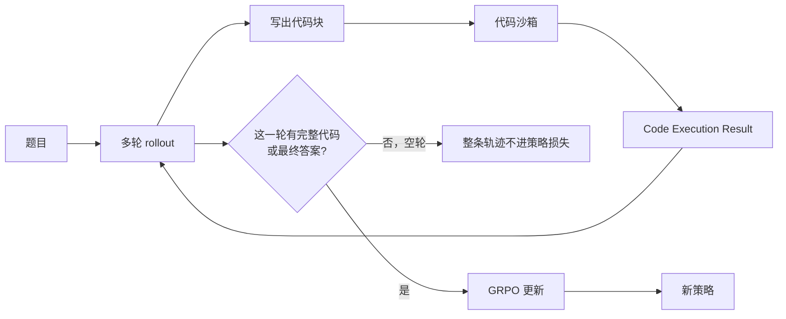

# SimpleTIR：多轮工具推理会因为空轮把梯度炸飞，把这些轨迹从更新里拿掉就能从基座稳住训练

<!-- release-date: 2025-07-02 -->

> 本文依据 Zhenghai Xue、Longtao Zheng（共同一作，南洋理工大学）与 Qian Liu（通讯，TikTok Singapore）等人发布的 **SimpleTIR: End-to-End Reinforcement Learning for Multi-Turn Tool-Integrated Reasoning**，即 arXiv:2509.02479v2、封面 Date: Sep 2, 2025、共 22 页的 letter 版式稿。目录按主要归属方登记在 ByteDance（作者单位写的是 TikTok Singapore，合作方是 NTU）。页码均指 PDF 本身的页码。截至 2026-09-11 核验，arXiv 上最新版本仍是 v2（2025-09-03 提交），与本地原件水印 `arXiv:2509.02479v2 [cs.LG] 3 Sep 2025` 一致。文中会明确区分三层：**论文写了什么**（带页码）、**本文如何解释它**、**哪些是外部资料补充**（给出链接并标注）。
>
> `release-date` 取 **2025-07-02**。这篇文章覆盖的是 SimpleTIR 这套方法，不是一个对外提供的聊天产品。作者项目报告 [simpletir.notion.site/report](https://simpletir.notion.site/report) 标了 July 2, 2025；共同一作 Longtao Zheng 同日发推介绍方法、报告与代码；第三方知乎文章同日引用该 Notion 页。Hugging Face 论文页后来把 Blog 资源标成 July 2, 2025。封面 Date 与 arXiv v1 是 2025-09-02，那是论文上传日，晚于项目报告。按手册取最早的官方公开事件。v2 修订不回写。正文按 v2 PDF 写，不用博客或推文里的数字替换论文表格。

## 读之前需要的最少背景

这篇论文不讲新的基座架构。它讲的是：已经能从基座模型做 Zero RL 的配方，一旦让模型在思考过程中**反复调用代码解释器**，训练为什么会炸，以及怎样用一条很窄的过滤规则把它稳住。

先记住五个词就够往下读。

**工具集成推理（Tool-Integrated Reasoning，TIR）** 是让语言模型在解题时写出可执行代码，把代码交给外部解释器，再根据返回结果继续想。一轮只调一次，叫单轮 TIR；写完一段、看结果、再写下一段，叫多轮 TIR（PDF p. 1–2）。

**Zero RL** 是从未经指令对齐的基座模型直接做结果奖励强化学习，中间不加监督微调冷启动。这条线从 DeepSeek-R1 开始，本站对纯文本那一侧见 [DeepSeek-R1 解读](/reports/DeepSeek/DeepSeek-R1) 和 [DAPO 解读](/reports/ByteDance/DAPO)。SimpleTIR 把它接到多轮 TIR 上（PDF p. 2、10）。

**组相对策略优化（Group Relative Policy Optimization，GRPO）** 是一种不训练 value 模型的策略梯度算法：同一道题采一组回答，用组内相对表现当 advantage。论文用它来优化统一策略（PDF p. 3）。

**反馈掩码（feedback token masking）** 是工具 RL 的常规动作：解释器吐出来的 token 只进上下文，不算进策略损失。Search-R1 和 ZeroTIR 已经这么做。SimpleTIR 的判断是：**只掩反馈不够**，因为下一轮模型自己写的字已经被带偏了（PDF p. 2、4）。

**空轮（void turn）** 是这篇论文自己下的定义：某一轮模型输出里，既没有完整代码块，也没有最终答案。典型样子是半截代码、反复重复的文本，或者过早采到结束符。它不是新的网络结构，而是用来识别「这条轨迹已经病了」的探针（PDF p. 2、6）。

不要把它和本站另一篇 ByteDance 工具论文混在一起。[ReTool 解读](/reports/ByteDance/ReTool) 的路线是：先用冷启动监督微调教会「在思维链里插入代码」，再在 **Qwen2.5-32B-Instruct** 上用 PPO 做结果奖励，AIME 2024 走到 67.0%。SimpleTIR 没有这条冷启动，基座是 **Qwen2.5-7B / 32B 的 base**，算法是 GRPO 加空轮过滤。两边的 AIME 数字不能对调。

## 一句话先说清

单轮 TIR 的 Zero RL 可以平稳往上走。把同一套设定改成多轮之后，工具返回的文本会把下一轮推到分布外，模型开始采出极低概率的 token，梯度范数爆炸，策略往「更安全的单轮」塌回去（PDF p. 2、4–6，Figure 2）。

常见补丁是先做监督微调冷启动。论文认为这条路会把推理模式锁在示范分布里，正好把 Zero RL 想要的多样行为掐掉（PDF p. 2）。

SimpleTIR 的做法更窄：在策略更新时，检查每条轨迹的每一轮；只要出现一轮既没有完整代码、也没有最终答案，就把**整条轨迹**从策略损失里掩掉，不让它进 GRPO 更新（PDF p. 6）。

主结果必须连着基座和年份读。摘要和引言写的是：从 Qwen2.5-7B 基座出发，AIME 2024 从文本基线 **22.1** 升到 **50.5**（PDF p. 1–2）。Table 1 里 SimpleTIR-7B 的 50.5 对得上；22.1 只出现在摘要、引言和 Figure 1 里那条灰色 DAPO 虚线，**没有进 Table 1**（PDF p. 2、7）。下面会单独拆这组数。

32B 上 SimpleTIR 的 AIME 2024 是 59.9，AIME 2025 是 49.2。同一张表里 ReTool 是 67.0 / 49.3，但 ReTool 不是 Zero RL，也不是同一个基座（PDF p. 7，Table 1）。不要把 50.5、59.9、67.0 读成同一条曲线上的三个点。

本文的判断是：

> **多轮 TIR 真正要命的不是「会不会写代码」，而是工具反馈把后续 token 推到低概率区之后，负样本的梯度会把前面写对的轮次一起罚掉。空轮是这个病变的可观测症状，不是病因本身。**

这句话是本文对第 3 节的归纳，论文没有用这一句概括。

## 旧方案卡在哪

论文把问题叠了两层（PDF p. 2）。

第一层：多轮 TIR 的强化学习会不稳。作者点名 RAGEN、ZeroTIR、Cognition 的 CUDA kernel 多轮 RL，以及 Kimi-Researcher，都遇到过不稳定或梯度爆炸。单轮设定里，模型只写一段推理加可选代码，训练可以走完；一改成「看完执行结果再写下一轮」，准确率会塌、梯度会刺（PDF p. 4，Figure 2）。

第二层：已有的稳定办法会伤到 Zero RL 想保留的东西。ReTool 用冷启动监督微调先把格式教好，再做 RL。论文承认这能稳住，但示范会限制新策略，和「从基座直接搜」这条线是反的（PDF p. 2、11）。

两层叠在一起，就是一个很具体的训练问题：

> **工具的返回值必须进下一轮的上下文，否则模型看不见执行结果；可是这段返回值又不是模型自己的语言分布，它会把后面的生成带偏。掩掉反馈 token 的损失，挡不住这件事。**

SimpleTIR 没有改奖励函数，也没有换一套新的策略梯度。它改的是：**哪些轨迹有资格产生梯度**。

## 全景：过滤发生在更新前，不发生在环境里

方法可以看成三步，对应 Figure 4（PDF p. 6）。这是根据原图重画的**机制示意图**，不是实测时间轴。

环境照常跑。空轮出现时，生成可以停，但关键动作是：这条轨迹**不算策略损失**。后面的消融会证明，只停生成、仍拿它更新，分数几乎不涨（PDF p. 9，Table 2）。

统一策略写在一个分层马尔可夫决策过程里，只是为了把「轮」和「token」分开说，并不是训练了两套网络（PDF p. 3）。

一条完整轨迹是

$$
o=(q,l_0,f_0,\ldots,l_{K-1},f_{K-1})
$$

$q$ 是题目，$l_k$ 是第 $k$ 轮模型自己写的回复，$f_k$ 是随后的工具反馈。高层动作是整轮回复，低层动作是下一个 token。折扣因子 $\gamma=1$，低层没有逐步奖励，只有整条轨迹结束时的终端奖励（PDF p. 3）。实际训练的是一个策略 $\pi_\theta(a_t\mid s_t)$。

GRPO 的 advantage 按组内相对表现来算（PDF p. 3）：

$$
\hat A_i=\frac{r_i-\operatorname{mean}(\{r_j\}_{j=1}^{G})}{F_{\mathrm{norm}}(\{r_j\}_{j=1}^{G})}
$$

$r_i$ 是第 $i$ 条轨迹的终端奖励。$F_{\mathrm{norm}}$ 原文没有展开成标准差还是别的归一化，这里保持原符号。

工具设定下必须加反馈掩码。损失只累加在模型自己写的 $l_k$ 上，$f_k$ 的梯度被拿掉（PDF p. 3）。目标写成

$$
\mathcal{J}_{\mathrm{TIR}}(\theta)=\mathbb{E}\left[\frac{1}{G}\sum_{i=1}^{G}\frac{1}{\sum_t m_{i,t}}\sum_{t=1}^{|o_i|} m_{i,t}\,L_{\mathrm{CLIP}}(\theta,i,t)\right]
$$

$m_{i,t}=1$ 当且仅当这个 token 属于某一轮回复 $l_k$。$L_{\mathrm{CLIP}}$ 就是 PPO 的裁剪项，重要性比是

$$
\rho_{i,t}(\theta)=\frac{\pi_\theta(o_{i,t}\mid o_{i,<t})}{\pi_{\theta_{\mathrm{old}}}(o_{i,t}\mid o_{i,<t})}
$$

注意分母是「先在一条轨迹内部按有效 token 平均，再对 $G$ 条轨迹平均」。这和 DAPO 后来改成的「全 batch 所有 token 一起平均」不是同一处；SimpleTIR 在附录里借用了 DAPO 的解耦裁剪 $0.2/0.28$，但没有把 token 级分母一起搬过来（PDF p. 4、18，Table 6a）。

## 低概率 token 从哪来

旧问题：多轮 TIR 不稳，已经有人报告过。要确认「不稳」是多轮本身带来的，而不是 TIR 或 Zero RL 本身带来的，作者做了一个最小对照（PDF p. 4，Figure 2）。

单轮设定：模型只写一段推理，可选地跟一个代码块。多轮设定：执行结果拼进下一轮提示。其余尽量不动。

Figure 2 是实测训练曲线，不是示意图。读图能看到四件事，正文只把前两件写成了句子。

1. **AIME 2024 分数。** 单轮从大约 0.15 升到约 0.40；多轮在 200 步附近摸到约 0.22，然后一路掉到 0。
2. **梯度范数。** 单轮大多贴在 1 以下；多轮反复刺到 6–8。
3. **回复长度。** 单轮从约 500 长到约 1750；多轮停在约 500–600，后期还往下掉。
4. **代码使用频率。** 单轮很快冲到接近 1.0，后来仍在 0.85 以上；多轮从约 0.4 掉到接近 0。

把 3、4 和 1 放在一起看，本文的解释是：多轮跑崩之后，模型连「写代码」这件事都不敢做了，不是「还在调工具但调错了」。这是读图归纳，论文图注只说单轮平稳、多轮不稳（PDF p. 5）。

关键差别在反馈回路。第 $k$ 轮的工具输出 $f_k$ 会拼进第 $k+1$ 轮的提示。这段文本来自外部解释器，可以明显偏离预训练分布。条件一旦出分布，后面的生成会变随机，被采样到的 token 概率会低得不自然（PDF p. 4）。

Figure 3 用一条轨迹把这件事画成对数概率（PDF p. 5）。纵轴是对数尺度，越往下概率越低。

- 第 1 轮带工具调用：模型自己写的 token 大多贴在 $0$ 附近，也就是概率接近 1；工具返回段出现竖直向下的尖刺，低到 $10^{-8}$ 量级。这证实反馈本身是出分布的。
- 第 2 轮仍有工具调用：模型自己的文本里开始出现低概率片段。
- 第 3 轮没有工具调用：低概率段继续出现。
- 第 4 轮：整段坍缩成无意义输出，概率掉到图的底部。

掩掉反馈 token 的损失，挡得住「让模型去拟合解释器原文」，挡不住「下一轮已经站在一段奇怪的前文上继续写」。低概率从环境段漏到模型自己的字里，再作为下一轮输入，错误会沿轮次放大。这是论文的核心诊断（PDF p. 2、4–5）。

## 低概率 token 怎样把训练弄坏

诊断之后是两条具体伤害：梯度爆炸，以及信用分配错位（PDF p. 4–6）。

### 梯度范数对低概率过敏

作者分析的是策略梯度对 softmax 之前 logits 的 L2 范数，它只是参数总梯度的一部分（PDF p. 5，Proposition 3.1）。先说它要算什么：某个被采样的 token $c$，在当前步的 logits 上，这一刀更新有多大。

$$
\|\nabla_{z_t}\mathcal{J}_{\mathrm{TIR}}\|_2
=\frac{m_{i,t}}{\sum_j m_{i,j}}\cdot\rho_{i,t}(\theta)\cdot g_{i,t}\cdot|\hat A_i|\cdot\sqrt{1-2P(c)+\sum_{j\in\mathcal{A}}P(j)^2}
$$

$P$ 是当前策略在这一步的词表分布，$g_{i,t}$ 是「这一刀没有被 PPO 裁掉」时才为 1 的门。根号里那一项，在 $P(c)$ 很小、同时分布又很尖的时候会接近 1，范数就小不下来。

论文点了两个会被低概率放大的因子（PDF p. 5–6）：

**未被裁掉的重要性比。** 轨迹若拿了负 advantage（$\hat A_i<0$），重要性比没有上界。旧策略给 $c$ 的概率一旦极小，新策略只要稍微抬一点，$\rho$ 就会爆。这对应 Figure 1、Figure 2 里那些梯度尖刺。

**持续偏大的概率项。** 被采样 token 的概率很低时，$1-2P(c)$ 接近最大值 1；若其余质量又集中在少数几个词上，$\sum_j P(j)^2$ 仍然大，范数不会自己掉下去。引用的理论来源是通讯作者之一 Yingru Li 的 logits 动力学笔记（PDF p. 5，参考文献 [14]）。

这两项合在一起，解释了为什么「偶尔采到一个怪词」在多轮 TIR 里不是小事：它既可能把 $\rho$ 拉爆，也可能让梯度长期维持在高位。

### 终端负奖励会误伤前面写对的轮

第二条伤害不在范数，而在信号该记在谁头上（PDF p. 6）。

Figure 3 里，低概率更常出现在后面几轮。奖励却是整条轨迹一个标量。最后两轮写崩了，前面那些高概率、有工具调用的轮次会一起拿到负 advantage。策略学到的不是「别在第 4 轮胡写」，而是「少玩多轮，回到单轮更安全」。

这和 Figure 2 右侧代码使用频率掉到 0，是同一件事的两种画法。本文的解释是：崩溃之后模型不是不会调工具，而是被连坐式的负奖励教会了「不要进入会暴露出分布反馈的那条路」。论文原句是政策会塌向更安全的单轮生成（PDF p. 6）。

## 核心设计：用空轮当探针，整条轨迹不进更新

旧问题已经清楚：低概率 token 是病根，直接按概率或重要性比做阈值过滤，看起来最顺手。

论文试过这两条（PDF p. 6、8，Figure 5 下排）。在别的任务里，掩高困惑度轨迹或裁重要性比可以有用；在多轮 TIR 里，阈值难调，而且解决不了信用分配。Figure 5 下排是前 320 步的实测曲线：

- **梯度范数。** 高重要性比过滤、低概率过滤都会反复刺到 3 以上；SimpleTIR 大多贴在 0.5 以下。
- **最小 token 概率（对数）。** SimpleTIR 停在大约 $-12$ 到 $-15$；低概率过滤会掉到 $-30$。
- **最大重要性比。** SimpleTIR 贴在 1 附近；另外两条会冲到 4–5。
- **训练分数。** SimpleTIR 很快到约 0.50 并稳住；另外两条在 0.40–0.45 晃。

所以「对着低概率本身做手术」没有打到点子上。作者改看一个更粗、但更稳的症状（PDF p. 6）：

Figure 3 里第 4 轮坍缩之前，有一轮既没有工具调用，也没有最终答案。这一轮对解题没有推进。他们把它叫做空轮。空轮常常是分布漂移的结果：生成已经足够随机，过早采到了结束符。它在成功轨迹里很少见，在异常轨迹里很典型，所以适合当启发式探针。

算法步骤只有四句（PDF p. 6）：

1. 对采样到的每条轨迹，逐轮检查；
2. 某一轮既没有完整代码块、也没有最终答案，就标成空轮；
3. 整条轨迹的策略损失被掩掉，在 GRPO 更新前移出 batch；
4. 这一步同时挡住低概率序列的大梯度，并避免「前面写对、后面写崩」的连坐。

论文强调它和具体 RL 算法无关，也可以和近期其他推理 RL 改进正交（PDF p. 6）。v2 正文写的是「从 batch 里拿掉、掩掉整条轨迹的策略损失」。它**没有**写「仍留在 advantage 估计里以保持无偏」。后文若看到工作坊版本补充了这一句，那是外部修订，不能回写进这篇 v2 解读。

**机制。** 空轮过滤不修复出分布的工具反馈，也不给模型额外的格式奖励。它只拒绝用已经病变的轨迹去改参数。成功的多轮轨迹仍在，负样本里那些「写到一半崩掉」的路径不再主导更新。

**收益。** Figure 1 左侧，从 Qwen2.5-7B 基座出发，SimpleTIR 的 AIME 2024 从 0 附近升到约 47%，1200 步仍在往上；朴素多轮在 300 步附近摸到约 20% 后塌到 0。右侧梯度范数，SimpleTIR 几乎贴地，朴素多轮在 1000 步之后刺到 35（PDF p. 2）。Table 2 里，同一 7B 上最终 AIME 2024：SimpleTIR 50.5，朴素多轮 20.8，低概率过滤 23.3，高重要性比过滤 26.3（PDF p. 9）。50.5 对 20.8，中间这 30 分不是换了基座，是换了「哪些轨迹能进梯度」。

**代价和边界。** 被丢掉的轨迹仍然消耗了 rollout 和沙箱时间，只是不产生更新。空轮规则绑在「代码块或最终答案」这两种可解析产物上，换到没有这种边界的任务上，探针会失效。作者自己把这一点写进了限制（PDF p. 11）。另外，Table 2 对消融方法报的是 **1000 个梯度步以内的最高分**，因为它们训练不稳（PDF p. 9）。朴素多轮的 20.8 是峰值，不是终点；Figure 1 里它的终点接近 0。拿 20.8 去说「朴素多轮其实也还行」，和曲线不符。

还有一个必须单独看的消融：**遇到空轮就停止生成，但不从损失里拿掉这条轨迹**（PDF p. 9，Table 2）。AIME 2024 只有 26.1，Math500 只有 77.3，远低于 50.5 / 88.4。论文把原因归到信用分配：含空轮的轨迹很难拿到正的结果奖励，却仍会把负 advantage 传回前面的轮次。所以真正起作用的不是「别让它继续写」，而是「别让它改参数」。

**可迁移启发。** 工具 RL 里，环境输出造成的分布漂移，不一定要在概率空间里设阈值。先找一个与任务进度绑定、几乎不出现在成功轨迹里的离散症状，按轨迹丢掉，往往比调 $\rho$ 或 perplexity 更稳。

## 三处工程细节：基座模型没有聊天模板可依赖

第 3.4 节只有三段，但没有它们，空轮规则会对不准（PDF p. 7）。

**不用聊天模板。** 基座模型没见过那些特殊角色符。工具输出只在前面加一句普通前缀 `Code Execution Result:`，避免再引入另一类出分布特殊 token。

**给每段代码预置 `final_answer`。** 简单题允许模型在单轮里调用这个函数直接交卷，给一条「不必硬走多轮」的捷径，也提高采样效率。提示词里两种结束通道并存：`final_answer(...)` 和 `\boxed{...}`（PDF p. 22，Table 6b）。

**写完一个完整代码块就停。** 生成在代码块结束处被强制打断，下一轮开始前必须接上真实的外部反馈。目的是阻止模型自己编造执行结果（PDF p. 7）。

这三处都不是算法贡献。它们分别处理：基座没有对话格式、简单题不该被强迫多轮、模型不能既当选手又当裁判。和 ReTool 那套「可解析的代码边界 + 真实沙箱 + 反馈进上下文」是同一类工程闭环，只是 SimpleTIR 还多了一句：基座上不要用 instruct 模板。

提示词要求代码是完整脚本、含必要 import，中间结果必须 `print()`，否则解释器没有东西可返回（PDF p. 15、22）。空轮检测依赖这些格式约定。格式一散，探针就会误伤。

## 实验怎么证明这件事

### 训练与评测口径

训练代码基于 VeRL 和 Search-R1，解释器用异步的 Sandbox Fusion（PDF p. 7）。题库是 SimpleRL 的 Math3–5，加上 DeepScaleR。基座是未对齐的 Qwen2.5-7B 和 Qwen2.5-32B，明确走 Zero RL（PDF p. 7）。

第 4.1 节写：rollout batch 512，mini update 128；最大回复长度先 16K、最多 5 轮代码执行，平均长度平台期后再加到 24K、10 轮（PDF p. 7–8）。附录 Table 6a 另给一张表（PDF p. 18、22）：

| 项 | 值 |
|---|---|
| 初始最大回复长度 | 16,384 |
| rollout 温度 | 1 |
| 初始最大交互轮数 | 5 |
| train batch size | 512 |
| sampling batch size | 1,280 |
| 每题 rollout 数 $n$ | 16 |
| PPO 裁剪（低 / 高） | 0.2 / 0.28 |
| 熵系数 | 0 |
| 折扣 $\gamma$ | 1.0 |
| GAE $\lambda$ | 1.0 |
| KL 系数 | 0 |
| PPO epochs | 4 |
| actor 学习率 | $1\times 10^{-6}$ |
| 梯度裁剪 | 1 |

裁剪上下界拆开、熵和 KL 都为 0，和 DAPO 是同一方向。作者在相关工作里也说 SimpleTIR 与无 TIR 的 Zero RL 算法正交（PDF p. 10）。

有一处原文对不上。第 4.1 节的 rollout batch 512、mini update 128，和附录的 sampling batch 1,280、$n=16$、train batch 512，不能无歧义地乘回同一个「一步」。按附录，$1{,}280/16=80$ 道题；按 4.1 节，512 更像题数。论文没有解释这两套数字如何同时成立。下面引用超参时，会标出来源小节，不擅自合并。

评测集是 Math500、AIME 2024、AIME 2025、AMC 2023、HMMT Feb 2025，温度 1，报 32 次平均以降低方差，口径跟随 DAPO（PDF p. 8）。Table 1 还有一列 Olympiad，评测段落没有点名这个基准。Table 1 的 Olympiad 分数仍按表转写，不把它说成评测节定义过的协议。

基线分成三类（PDF p. 8）：

1. **无 TIR 的 Zero RL**：SimpleRL-Zoo、DAPO。用来量「加工具」本身的收益。
2. **冷启动或专用基座上的 TIR RL**：ReTool、ARPO、ToRL、Effective CIR。
3. **带 TIR 的 Zero RL**：作者认为当时严格从基座训 TIR 的只有 ZeroTIR。

ReTool 那一行，SimpleTIR 写成「在 Qwen2.5-Math-32B-Instruct 上收集冷启动再监督微调」（PDF p. 8）。ReTool 自己的论文用的是 Qwen2.5-32B-Instruct，不是 Math 系列。这是 SimpleTIR 对前作的转述，可能不精确。对照数字时，以 ReTool 原文为准，见 [ReTool 解读](/reports/ByteDance/ReTool)。

### 主表：先分清 7B 和 32B，再分清 22.1 在哪

完整数字见 PDF p. 7 Table 1。下面按「它到底在比什么」重排，不把跨论文的文献数字和作者自己的运行混成一句。

Qwen2.5-7B 系列：

| 模型 | TIR | Zero RL | 起点 | AIME24 | AIME25 | MATH500 | Olympiad | AMC23 | HMMT25 |
|---|---|---|---|---:|---:|---:|---:|---:|---:|
| Qwen2.5-7B | 否 | 未训 | Base | 3.2 | 1.1 | 51.9 | 15.4 | 21.7 | 0.0 |
| Qwen2.5-7B-TIR | 是 | 未训 | Base | 1.7 | 0.6 | 18.0 | 6.2 | 10.8 | 1.9 |
| SimpleRL-Zoo-7B | 否 | 是 | Base | 15.6 | — | 78.2 | 40.4 | 62.5 | — |
| ToRL-7B | 是 | 否 | Math-Inst | 40.2 | 27.9 | 82.2 | 49.9 | 75.0 | — |
| Effective TIR-7B | 是 | 否 | Math | 42.3 | 29.2 | 86.4 | — | 74.2 | — |
| ARPO-7B | 是 | 否 | Inst | 30.0 | 30.0 | 78.8 | — | — | — |
| ZeroTIR-7B | 是 | 是 | Base | 39.6 | 25.0 | 80.2 | — | — | 22.5 |
| SimpleTIR-7B | 是 | 是 | Base | **50.5** | **30.9** | **88.4** | **54.8** | **79.1** | **29.7** |

Qwen2.5-32B 系列：

| 模型 | TIR | Zero RL | 起点 | AIME24 | AIME25 | MATH500 | Olympiad | AMC23 | HMMT25 |
|---|---|---|---|---:|---:|---:|---:|---:|---:|
| Qwen2.5-32B | 否 | 未训 | Base | 4.2 | 1.6 | 43.1 | 17.8 | 28.0 | 0.2 |
| Qwen2.5-32B-TIR | 是 | 未训 | Base | 7.1 | 5.0 | 37.0 | 16.9 | 20.0 | 5.2 |
| DAPO | 否 | 是 | Base | 50.0 | — | — | — | — | — |
| ReTool | 是 | 否 | Math-Inst | 67.0 | 49.3 | — | — | — | — |
| ZeroTIR-32B | 是 | 是 | Base | 48 | 27 | 87.8 | — | — | 20.0 |
| SimpleTIR-32B | 是 | 是 | Base | **59.9** | **49.2** | **92.9** | **63.7** | **91.6** | **34.6** |

有五个读法上的陷阱。

第一，**摘要的 22.1 不是 Table 1 里任何一行。** Figure 1 把无 TIR 的 DAPO 画成大约 22% 的水平虚线，起点写明是 Qwen2.5-7B（PDF p. 2）。Table 1 的 DAPO 只出现在 32B，分数是 50.0，和 DAPO 论文自己的 32B 主结果同数。7B 文本 Zero RL 在表里是 SimpleRL-Zoo 的 15.6。所以 22.1 应读成「作者在 7B 上跑的 DAPO 文本基线，画在 Figure 1，未列入 Table 1」，不要读成 DAPO 论文里的 50 分，也不要读成 SimpleRL-Zoo 的 15.6。

第二，**50.5 是 7B 的 AIME 2024，不是 32B，也不是 AIME 2025。** 7B 的 AIME 2025 是 30.9。32B 的 AIME 2024 是 59.9，AIME 2025 是 49.2（PDF p. 7）。

第三，**未训练就接 TIR，分数会更差。** 7B 从 3.2 掉到 1.7，32B 从 4.2 升到 7.1 也仍然很低，MATH500 两边都明显下降（PDF p. 7）。工具接口本身不是免费午餐，基座不会因为看见解释器就会用。

第四，**不要拿 SimpleTIR-32B 的 59.9 去打 ReTool 的 67.0。** 论文自己写：冷启动会显著抬分，ReTool-32B 在 AIME 2024 和 AIME 2025 上最高（PDF p. 8）。Zero RL 的好处被放在推理模式多样性上，不是绝对分数。AIME 2025 上 49.2 对 49.3，几乎持平，但起点、是否 SFT、是否 Math 专用基座都不一样。

第五，**ZeroTIR-32B 的 48 和 27 在原表里没有小数位**，和 59.9 那种一位小数不是同一精度。跨行比大小可以，不要改写成 48.0。

论文的主张收成两句（PDF p. 8）：SimpleTIR 超过所有 Zero RL 基线，无论带不带 TIR；7B 也能超过从 Qwen2.5-Math-7B 出发的 ToRL 和 Effective TIR。第一句有 Table 1 支持。第二句依赖「Math 系列的前作数字可直接并排」，评测是否都是温度 1 的 32 次平均，原文没有逐行核对。

### 加轮数：MATH500 吃得到，AIME 2024 吃不太到

Figure 5 上排比较最大轮数为 1、5、10 的 SimpleTIR（PDF p. 8）。10 轮那条从 5 轮的第 200 步接着训，不是从头开始。这是实测图。

读图能看到：

- 平均轮数：5 轮设定很快升到约 2.6 然后平台；10 轮设定在 800 步之后继续爬到约 3.4。模型没有把上限用满。
- 平均回复长度：1 轮最短；5 轮和 10 轮在 800 步前接近，之后 10 轮冲到 4,000 以上。
- MATH500：轮数越多越高，10 轮略高于 5 轮，两者都明显高于 1 轮。
- AIME 2024：5 轮和 10 轮几乎叠在一起，终点大约 0.45–0.50；1 轮略低，但差距远小于 MATH500。

正文的结论是：回复长度和 MATH500 随轮数变好，AIME 2024 没有明显受益；不同任务要的推理模式不一样（PDF p. 9）。有的题几步就能结束，有的题需要多次外部反馈。把最大轮数从 5 加到 10，不等于 AIME 再涨一截。

### 多样性是作者用另一个模型数出来的

Zero RL 的自我定位是：强化预训练里已经有的有用模式，而不是黏在 SFT 示范上（PDF p. 10）。Figure 6 画了三种模式（PDF p. 10），这是机制示意：

1. **交叉验证。** 两段代码用不同方法解同一题，对一下结果。
2. **递进推理。** `solve_step1` → `solve_step2` → `solve_step3`，每步吃上一步的执行结果。
3. **纠错环。** 代码报错之后改一版再跑。

Table 3 用 Claude-3.7-Sonnet 在 **已经答对** 的回复上数这三类出现率（PDF p. 9–10）。一条回复可以同时算进多类，所以三列之和可以超过 100%。

| 模型 | 递进推理 | 交叉验证 | 错误修正 |
|---|---:|---:|---:|
| ReTool | 18.9% | 82.4% | 25.8% |
| SimpleTIR-32B | 46.5% | 86.0% | 38.0% |

两边交叉验证都很多。SimpleTIR-32B 的递进和纠错更高。作者把它读成 Zero RL 保留了更多样的模式（PDF p. 10）。

这一段必须标成**分类器观察**，不是被独立标注证明的能力。

- 只统计答对的回复，答错的轨迹里有没有这些模式，不知道；
- 标注模型是 Claude-3.7-Sonnet，提示词在 Table 7（PDF p. 22），四类标签和正文三种模式还不完全同名（提示词里多了「从特例到一般的归纳」）；
- 没有报告标注一致性，也没有人工抽检数字；
- 附录 Table 5 给了一道四面体内切球半径的递进例子，模型分三轮算出 104，和标注答案一致（PDF p. 19–21）。这是案例，不是频率。

附录 Table 4 则是空轮的反例：AIME 2024 圆切三角形那题，标注答案 197。第 2 部分出现既没有完整代码、也没有 boxed 答案的空轮，随后文本崩成碎片（PDF p. 16–17）。它的职责是给空轮过滤提供直觉，不是证明过滤一定能救这道题。

## 它在文献里的位置

相关工作收成三条线（PDF p. 10–11、15）。

一条是无工具的 Zero RL：DeepSeek-R1、SimpleRL、Open-Reasoner-Zero、DAPO、Dr. GRPO。SimpleTIR 说自己跟这些算法正交，因为它处理的是 TIR 特有的工具分布漂移。

一条是工具 RL：Search-R1 / R1-Searcher 走搜索；ReTool 先 SFT 再 RL；ToRL 和 Effective CIR 走数学专用基座。论文认为这些管线依赖领域数据或指令微调，会引入偏差；Zero RL 更通用，但多轮时不稳。ZeroTIR 也从基座做 TIR，稳定技巧与空轮过滤正交。

一条是训练稳定：熵正则、重要性比控制、负梯度、轨迹过滤。附录 A.1 把 SimpleTIR 和它们分开：它打的是「外部工具输出引起的分布漂移，再被多轮放大」这个根，而不是一般的熵坍缩（PDF p. 15）。

Lin 和 Xu 对「TIR 为什么比纯文本推理更有效」有一篇理论解释。SimpleTIR 自称是那篇主张的经验证据（PDF p. 11）。证据强度取决于你是否接受「7B 上 22.1 到 50.5」这一对照；对照本身没有和纯文本 DAPO 共享同一张主表。

## 论文没写、因此不能补的部分

下面这些不是「写得简略」，而是原文缺失。不应用 GitHub README 或 Notion 博客去填进论文层。

1. **奖励的具体标量。** 正文只有终端奖励 $R(o)$ 和 Table 2 题注里的 RLVR。没有写成 +1 / −1 还是 0 / 1，也没有格式分、代码可执行分。
2. **$F_{\mathrm{norm}}$ 的定义**，以及 advantage 是否按 token 广播。
3. **22.1 对应的完整 DAPO-7B 协议。** 它没有进入 Table 1，超参、步数、是否作者复现，都未写。
4. **第 4.1 节与附录 C.2 的 batch 数字如何同时成立。**
5. **Olympiad 列的评测协议。** 评测节没点名，表里却有分。
6. **墙钟、GPU 规模、沙箱超时与权限。** 限制里只说依赖高并行沙箱（PDF p. 11）。
7. **空轮过滤的比例。** 每步丢掉多少轨迹、过滤率如何随训练变化，没有曲线。
8. **Table 3 的样本量、题集和标注一致性。**
9. **AIME 以外的工具、搜索引擎、通用函数调用。** 引言把搜索当作 TIR 的例子，实验只有 Python 数学。
10. **污染讨论。** 训练数据 Math3–5 与 DeepScaleR 是否贴近 AIME，原文未谈。

限制段另外写了四条作者自己承认的边界（PDF p. 11）：空轮探针未必能迁出多轮 TIR；数学推理把最大轮数卡在 10，更复杂的 agent 任务可能不够；训练依赖高并行沙箱；完全异步的 rollout 与奖励计算仍是开放问题。致谢点名 Lang Feng 和 Jiacheng Xu（PDF p. 11）。

## 外部补充：论文之后公开了什么

**以下全部不是 v2 PDF 里的内容。** 不能拿来改写上面任何一条论文结论。

作者代码仓 [ltzheng/SimpleTIR](https://github.com/ltzheng/SimpleTIR) 与 Hugging Face 集合 [ZhenghaiXue/simpletir](https://huggingface.co/collections/ZhenghaiXue/simpletir-686ce09ae6e1db33b375f03d) 在论文页上有链接。README 仍留着一句「技术论文准备中」，应视为博客发布时的旧句，不是 v2 之后的状态。README 还把仓库标成 ICLR 2026；v2 PDF 没有写录用会议。OpenReview 上另有 DL4C（NeurIPS 2025）的工作坊版本，摘要里多了一句「过滤时仍把轨迹留在 advantage 估计里以保持无偏」。**v2 PDF 没有这句话，本文不采用。**

2025-07-02 的作者推文把当时 7B 的 AIME 2024 写成 46.2（32 次平均），与 v2 的 50.5 不是同一个数。Notion 博客表格里还有 SimpleTIR-7B-Single 43.3、SimpleTIR-32B-Single 55.3 这类单轮行，v2 Table 1 没有单独列出。**博客数字不回写论文表。**

## 可迁移启发

### 1. 先分清「环境 token 不能进损失」和「环境 token 仍会进下一轮条件」

反馈掩码解决的是信用算在谁头上。它不解决条件分布已经被带偏。任何把外部文本拼回上下文的多轮 RL，都要假设：掩码之后，模型自己的下一句仍可能变成低概率序列。只做掩码，等于只修了损失，没修状态。

### 2. 探针优先选「成功轨迹里几乎不出现」的离散事件

空轮能用，是因为它几乎不出现在能拿到正奖励的轨迹里，又和「这一轮对任务没有推进」同构。低概率、高重要性比是连续量，阈值会跟着训练漂移。能解析出「这一步有没有产出合法动作」，往往比盯着 $\rho$ 更可部署。

### 3. 停止生成不等于停止更新

Table 2 里「遇到空轮就停、仍拿这条轨迹算损失」只有 26.1 分。工程上很容易做成：检测到坏轮就截断，然后整条轨迹照常回传。那正好把负 advantage 留给前面写对的轮次。过滤必须作用在 **loss 的成员资格** 上，而不是只作用在解码循环上。

### 4. 基座 Zero RL 不要额外引入聊天模板这种新的出分布符号

第 3.4 节把聊天模板当成又一种出分布特殊 token。工具前缀改成一句普通英文，是在减少条件漂移的入口，不是为了好看。从 instruct 模型出发的配方，不能原样搬到 base 上。

### 5. 摘要数字必须还原到图和表

22.1 在 Figure 1，50.5 在 Table 1 的 7B 行，67.0 是 ReTool 的 32B Instruct 冷启动，50.0 是 DAPO 的 32B 文本 Zero RL。四条线的基座、是否 TIR、是否 SFT 都不一样。凡是写成「SimpleTIR 7B 超过 DAPO 50 分」或「SimpleTIR 超过 ReTool 67 分」的转述，都和 PDF 不符。

### 6. 多样推理是 Zero RL 的自我辩护，不是主分数的替代

论文承认冷启动在绝对分数上更强。Table 3 是在这个前提下，用另一个模型去数「答对的回复里模式更杂」。迁移时不要把 46.5% 对 18.9% 读成「所以不要冷启动」；它只支持「若你在意模式是否被 SFT 锁死，Zero RL 值得付稳定训练的成本」。

## 关键词回看

- **TIR**：工具集成推理，把代码执行嵌进解题过程。
- **多轮 TIR**：看完执行结果再写下一轮；单轮则只允许一段回复。
- **Zero RL**：从未经指令对齐的基座直接做结果奖励 RL，不加 SFT 冷启动。
- **空轮（void turn）**：某一轮既没有完整代码块，也没有最终答案。
- **分布漂移**：工具反馈偏离预训练分布，使后续生成变随机、出现低概率 token。
- **反馈掩码**：环境 token 进上下文，不进策略损失；挡不住下一轮被带偏。
- **GRPO**：组内相对 advantage，不训练 value 模型；本文损失先按轨迹平均。
- **重要性比 $\rho$**：新策略与旧策略的概率比；负样本上没有上界，低概率 token 会把它拉爆。
- **Proposition 3.1**：logits 梯度范数里，与 $P(c)$ 负相关的两项。
- **空轮过滤**：含空轮的整条轨迹不进策略更新。
- **VeRL / Sandbox Fusion**：训练框架与异步代码沙箱；系统机制见 [HybridFlow 解读](/reports/ByteDance/HybridFlow)。
- **avg 32**：同一测试集采样 32 次的平均正确率；论文正文写成 average@32。
- **AIME 2024 / AIME 2025**：两个年份的评测集；摘要主数字 50.5 落在 2024 的 7B。

## 最后的判断

SimpleTIR 证明的是一件很窄、但很硬的事：从 Qwen2.5-7B 基座做多轮 TIR 的 Zero RL，朴素设定会在几百步内把梯度范数打到失控、准确率打回 0；把含空轮的轨迹从策略更新里拿掉之后，同一基座的 AIME 2024 可以走到 50.5，梯度几乎不再刺。这个对照有 Figure 1、Figure 2、Figure 5 和 Table 2，不只靠摘要。

它没有证明的同样清楚。22.1 那条文本基线没有进主表；空轮只是低概率病变的探针，不是对分布漂移的修复；32B 绝对分数仍低于带冷启动的 ReTool；多样性统计交给了另一个闭源模型，而且只数答对的回复。把 50.5 读成「7B 超过了 DAPO 论文里的 50 分」，或把 59.9 读成「Zero RL 已经打过 ReTool」，都是在读摘要时没把基座和训练配方对上。

如果只记一句话，可以记：

> **工具反馈必须看见，但不能让看见之后写崩的轨迹去改参数。空轮是那个写崩的可检测边界。**

## 资料与阅读边界

- 原始依据：本地 `papers/ByteDance/SimpleTIR.pdf`，即 arXiv:2509.02479v2，封面 Date: Sep 2, 2025，22 页，letter。pdfinfo 标题与作者与封面一致。水印为 `arXiv:2509.02479v2 [cs.LG] 3 Sep 2025`。
- arXiv 页面：<https://arxiv.org/abs/2509.02479>。提交历史为 v1（Tue, 2 Sep 2025 16:30:19 UTC，2,114 KB）与 v2（Wed, 3 Sep 2025 17:06:42 UTC，2,060 KB）。截至 2026-09-11 没有 v3。本文按 v2 写。
- `release-date` 取值 2025-07-02 的依据：作者 Notion 报告 [simpletir.notion.site/report](https://simpletir.notion.site/report) 标 July 2, 2025；共同一作同日公开介绍；Hugging Face 论文页把该博客列为 July 2, 2025 的资源。封面日期与 arXiv v1 的 2025-09-02 不回写。
- 代码仓库：<https://github.com/ltzheng/SimpleTIR>。
- 模型集合：<https://huggingface.co/collections/ZhenghaiXue/simpletir-686ce09ae6e1db33b375f03d>。Hugging Face 仓库 `createdAt` 按手册不是首发日，本文未用。
- 训练框架：<https://github.com/volcengine/verl>，论文参考文献指向 HybridFlow。
- 跨篇参考：纯文本 Zero RL 的默认项见 [DAPO](/reports/ByteDance/DAPO)；代码进思维链加冷启动的路线见 [ReTool](/reports/ByteDance/ReTool)；结果奖励与 GRPO 见 [DeepSeek-R1](/reports/DeepSeek/DeepSeek-R1)；verl 的系统机制见 [HybridFlow](/reports/ByteDance/HybridFlow)。ReTool 的 67.0 / 49.3 与 DAPO 的 50.0 只作为 Table 1 的文献数字出现，评测口径以各篇原文为准，不在本篇重新解释成 SimpleTIR 自己的运行。
