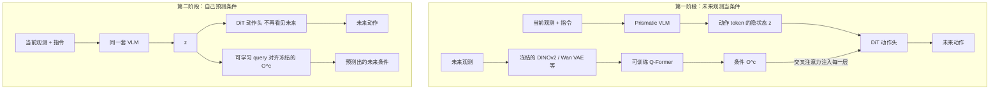
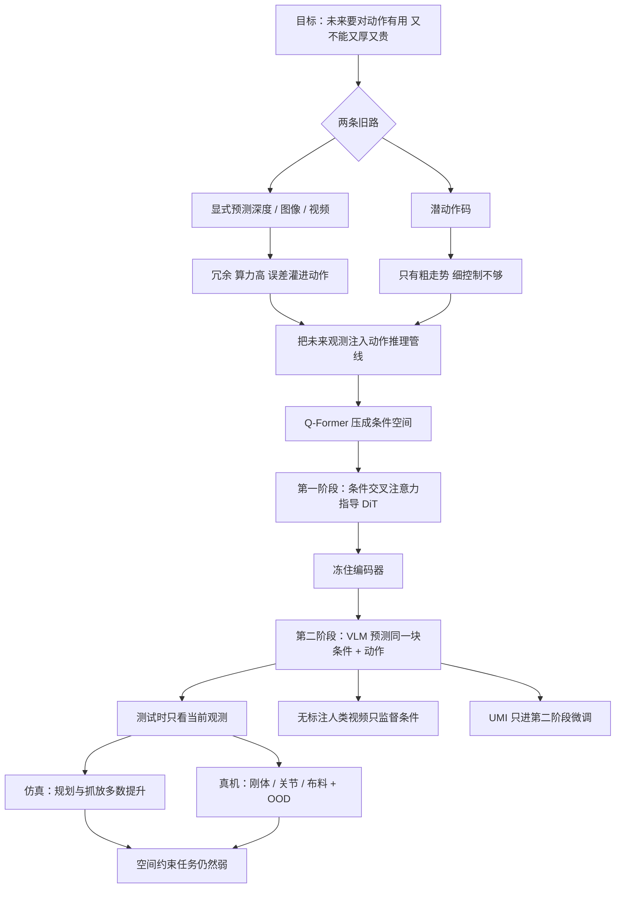

# World Guidance：别把未来画面全画出来，把能指导电机的条件压出来

<!-- release-date: 2026-02-25 -->

> 本文依据 ByteDance Seed 与香港大学的 **World Guidance: World Modeling in Condition Space for Action Generation**。本地原件是 arXiv:2602.22010v1（2026-02-25 提交，封面 Date: February 26, 2026），共 20 页。动笔前核过 [arXiv 官方页](https://arxiv.org/abs/2602.22010)：提交历史只有 v1，因此未换件。页码一律指这份本地 PDF。项目页为 [https://selen-suyue.github.io/WoGNet/](https://selen-suyue.github.io/WoGNet/)。
>
> 文中会明确区分三层：**报告写了什么**、**我们如何解释或推算**、**哪些是外部资料补充**。外部补充一律标出来源并给链接。
>
> 关于 `release-date`：WoG 没有官方 Web / App / API；论文描述的模型也没有 ByteDance 官方权重渠道向公众开放使用。按本模块约定，改用该技术首次官方公开日，即 arXiv v1 提交日 **2026-02-25**。封面日期、作者个人仓库与 Hugging Face 权重都晚于这一天，不当作首发日。证据链见文末。

## 先讲矛盾：帮 VLA 看见未来，有两条路，两条都卡死

近年的视觉—语言—动作模型（Vision-Language-Action model，VLA）已经不只是「看图、读指令、吐关节角」。报告开篇就把下一步写得很明确：既然 VLA 本来就是在预测未来动作，它应不应该同时预测别的未来信号，再用这些信号把动作做得更准（PDF p.1）。

现有做法被报告收成两条流（PDF p.1–2）：

1. **世界动作模型**（World Action Model）。把未来的深度、图像、视频，或者基础视觉模型吐出来的语义特征，显式预测出来，再拿去帮动作生成。画面里确实有动力学、运动和空间几何，但这些通用地、与任务无关的语义空间，对下游操作任务往往冗余很大。冗余会拖慢细粒度生成的预训练，也会限制跨场景扩展。
2. **潜动作模型**（Latent Action Model）。用视觉重建把未来动作或动力学压成稀疏潜表示，想抽出与身体无关的高层运动模式。它适合高层规划，也能从大规模视频里学；但报告引用的后续工作指出，这种表示只给出粗糙指引，撑不起细粒度动作。

两条路合在一起，是一个硬权衡（PDF p.2）：

> **预测又厚又与任务无关的未来表示，算力贵、还妨碍效果；把动作压成紧凑潜空间，又往往只剩粗走势，细控制不够用。真正要找的，是一块 VLA 既预测得起、又够表达、能把动作生成准的预测空间。**

WoG 的答案不是再画一张更漂亮的未来图，也不是再压一版更粗的潜动作。它把未来观测直接当作动作推理管线的条件，让这条管线自己长出一块「刚好够指导电机」的表示。报告把这块表示叫做**条件空间**（condition space）（PDF p.2）。

## 和站内已有的解读怎么分工

站内几篇相邻工作解的不是同一个缺口。本篇只依据这份 PDF 写 WoG，不把别篇的规模、时长或骨干数字读进来。

| | [Genie](/reports/Google/Genie) | [Cosmos](/reports/NVIDIA/Cosmos) | [π0.7](/reports/PhysicalIntelligence/pi0.7) | [DreamZero](/reports/NVIDIA/DreamZero) | 本篇 WoG |
|---|---|---|---|---|---|
| 卡住的缺口 | 互联网视频没有动作标签 | 手写仿真器写不出通用物理世界 | 混杂数据会把 VLA 平均掉 | VLA 有语义、缺物理运动泛化 | 显式未来太冗余，潜动作又太粗 |
| 「世界」在系统里干什么 | 从纯视频里学出可按的潜动作 | 学一个可后训练的世界基础模型 | 生成近未来子目标图，给 VLA 当视觉 prompt | 和未来视频**一起生成**动作 | 把未来观测压成动作条件，再让 VLA 自己预测这块条件 |
| 测试时还要不要另接模块 | 潜动作码本当按键 | 世界模型仍是仿真器 | 轻量世界模型只出子目标图 | 不再另接规划器 | 测试时不再喂未来帧，条件已经写进 VLM 内部 |

一句话对照：DreamZero 问的是「已经会做梦的视频模型，能不能直接当策略」——它把未来画面和电机指令在同一次去噪里写出来。π0.7 问的是「怎么做」要不要写进 prompt。WoG 问的是另一件事：

> **未来观测里真正对电机有用的那一小撮，能不能先被压成条件，再由 VLA 自己从当前画面里把它推出来？**

报告自己也把近亲划开。它承认和「潜动作 + 未来视频生成」共用同一批未来观测，但用法完全不同：后者要重建全部视觉信息；WoG 只把关键语义抽进条件空间，从而减轻视觉预测误差灌进动作空间（PDF p.6）。

## 读之前：这条线上的词先各用一句话说清

下面这些词大多不是这篇发明的，先说人话，避免后文被缩写淹没。

- **VLA（视觉—语言—动作模型）**：看当前画面、读语言指令，直接输出机器人动作。本篇骨干用的是 OpenVLA 那套 Prismatic VLM，动作头是 DiT（PDF p.4）。
- **世界动作模型（World Action Model）**：报告用来称呼「显式预测未来模态（深度 / 图像 / 视频 / 基础视觉特征）再帮动作」的那一类方法。本篇仿真对照是 DeFI；真机对照是 VPP（PDF p.5、p.9）。
- **潜动作模型（Latent Action Model，LAM）**：用视觉重建把异构身体上的动作压成离散、身体无关的高层运动码。本篇对照是 Moto、UniVLA；再往细走，还有一边做潜动作、一边做未来视频的 VITA 和 ViPRA（PDF p.3、p.5）。
- **条件空间（condition space）**：本篇的核心对象。它不是一张未来图，也不是一串潜动作码。它是「把未来观测喂进动作推理管线之后，管线内部长出来的、刚好够当动作条件的紧凑表示」。默认是 $N=16$ 个 query、每个 $D=32$ 维（PDF p.2、p.13）。
- **未来编码器（Future Encoder）**：一个可训练的 Q-Former。它从冻结的基础视觉模型特征里查询与动作相关的内容，压成上面那块条件（PDF p.4）。
- **Q-Former**：一组可学习的查询向量，用交叉注意力从一堆视觉 token 里把需要的信息「问」出来。这里问的不是「图里有什么」，而是「未来这几帧里，哪些东西能当动作的条件」。
- **整流流（rectified flow）**：一种生成模型训练目标。它不一次给出动作，而是学习如何把噪声「流」成真实动作的速度场。WoG 的动作头用它（PDF p.4）。
- **UMI**：一种通用的机器人数据接口，本篇用它来测「第一人称、没见过的身体」能不能接到已经学好的条件空间上（PDF p.5、p.11）。报告没有把 UMI 的硬件细节写进正文。
- **OXE（Open X-Embodiment）**：跨机构、跨本体的机器人操作数据集，本篇第一阶段预训练的主数据源（PDF p.13–14）。

本篇会反复出现、属于别人工作的名字：

- **Prismatic / OpenVLA**：VLM 骨干来源（PDF p.4）。
- **DINOv2 / SigLIP / Wan VAE**：冻结的基础视觉编码器。仿真默认用 DINOv2 + SigLIP；真机为了轨迹规划改用 DINOv2 + Wan VAE（PDF p.4、p.7、p.14）。
- **SIMPLER**：把 Fractal / Bridge 的真机任务做成 real-to-sim 评测代理的仿真环境，本篇仿真主表都在上面（PDF p.5、p.14）。

## 一句话说清 WoG 做了什么

WoG 分两阶段训练一个 VLA：

1. **第一阶段（World Guidance）**：把未来观测压成紧凑条件，注入动作头，让动作生成「看见未来」。
2. **第二阶段（World Inference）**：冻住这块条件空间当老师，让 VLM 同时预测这些条件和未来动作。测试时不再提供未来帧。

报告声称这带来三件事（PDF p.1）：细粒度动作更好、泛化更好、还能从大量人类操作视频里学。仿真和真机都报了超过「基于未来预测」的现有方法。

## 先看全景：条件从哪来，又怎样离开动作头

根据报告图 1（PDF p.2）与图 2（PDF p.4）重画。这是机制示意，不表示真实延迟或 GPU 切分。

读这张图时先抓住一件事：**测试时没有右边那条「未来观测」支路。** 第一阶段用未来帧把条件空间教出来；第二阶段把未来帧从动作头上拆掉，改成 VLM 的预测目标。报告把拆完之后的模型叫做 **self-guided**（自引导）（PDF p.5）。

## 核心设计：条件空间里的世界模型

这一节是全文的机制核心。先说人话，再上公式。

### 旧问题：预测空间要么太厚，要么太粗

如果把未来视频像素级重建出来，模型确实「看见」了杯子会移到盘子上。但桌子纹理、灯光、背景杂物也会被重建。报告引用的观察是：这些与任务无关的语义对操作是冗余，既贵又妨碍细粒度生成（PDF p.1–2）。

如果改成潜动作码，表示变便宜了，但往往只剩「往那边伸」这种粗走势，夹爪该在哪一毫米松开，它说不清（PDF p.2–3）。

所以要找的不是「更强的视频模型」或「更短的动作码」，而是一块同时满足两件事的空间（PDF p.2）：

- VLA 预测得起——因为它本来就会建模动作，这块空间必须跟动作高度相关；
- 表达力够——它必须是动作生成的**充分且有效的条件**。

报告的发现策略很直接：不要先发明一块表示再希望它碰巧对动作有用；把未来观测**当作条件塞进动作推理管线**，管线编码出来的东西，天然就是这块条件空间（PDF p.2）。

### 压的是什么

默认预测地平线是 16 步动作。未来视觉观测按动作序列四分之一的时间频率采样，也就是均匀抽 **4 帧**（PDF p.13）。

这 4 帧不是直接送进动作头，而是先走冻结的基础视觉模型：

- **DINOv2**：逐帧抽判别 / 语义特征；
- **Wan VAE**：以当前帧为起始帧，和这 4 帧未来一起编码，抽时空特征。

两组特征投影到同一维度、在空间维上展平后叠在一起。一个 $N=16$ 的 Q-Former 用交叉注意力从这堆特征里查询，压成默认 **$D=32$** 的条件 $O^{c}$（PDF p.13）。

用人话读：杯子、盘子、即将发生的接触、可能撞到的障碍，被收成 16 个短向量；桌布花纹和灯带高光，尽量不要占位置。报告后文自己也把这件事说成「从冻结的预训练视觉编码器里查询并压缩信息性特征，构造对操作高度可区分、对视觉干扰尽量不变的条件」（PDF p.10）。

仿真里他们还试过只上 DINOv2、DINOv2+SigLIP、DINOv2+Wan VAE 三种组合。真机默认保留 VAE，因为真机实验是冲着轨迹规划去的（PDF p.7、p.14）。

### 怎么指导电机

问题表述很短。给定当前观测 $O_{t}$ 和指令 $l$，VLM 编码出 $z$，动作头要生成未来 $T$ 步动作 $A_{t:t+T}$（PDF p.3）。普通 VLA 最大化的是 $P(A_{t:t+T}\mid z)$。

第一阶段把未来 $T$ 步观测压成 $O^{c}_{t:t+T}$，动作头改成建模

$$
P(A_{t:t+T}\mid z,\,O^{c}_{t:t+T})
$$

具体注入方式：查询得到的 $O^{c}$ 送进 **每一个 DiT 块**，与 $z$ 做交叉注意力。动作去噪时，每一步都可以回头看这块未来条件。训练目标是整流流的速度匹配（PDF p.4，式 2）：

$$
\mathcal{L}_{\mathrm{I}}=\mathbb{E}_{\tau,A}\bigl[\|v_{\theta}(A_{\tau},\tau,z,O^{c})-v^{\ast}\|_{2}^{2}\bigr]
$$

- $\tau\in[0,1]$：从噪声走到干净动作的进度；
- $v_{\theta}$：网络预测的速度；
- $v^{\ast}$：目标速度。

这一阶段同时训练两件事：编码器把未来观测投进这块隐式的动作—条件空间；VLA 骨干学会用这些未来条件把动作做准（PDF p.2）。

测试时未来观测不可得。报告在「环境动力学确定」的假设下，把完整推理写成（PDF p.3，式 1）：

$$
P(A_{t:t+T},O^{c}_{t:t+T}\mid z)=P(A_{t:t+T}\mid z,O^{c}_{t:t+T})\,P(O^{c}_{t:t+T}\mid z)
$$

左边是「动作和未来条件」的联合；右边拆成「有了条件再生成动作」乘「从当前 $z$ 推出条件」。所以第二阶段有两个监督：在 VLM 输出上预测 $P(O^{c}_{t:t+T}\mid z)$；在动作头上优化边际 $P(A_{t:t+T}\mid z)$，并把它当作确定动力学下的联合（PDF p.4）。

实现上，Q-Former 和投影层冻结，条件空间变成稳定的老师。VLM 最后若干隐状态被另一组 16 个可学习 query 交叉注意力查询，投影到 32 维，与冻结编码器给出的 $O^{c}$ 做余弦对齐。动作头这一阶段**只吃 $z$**，不再吃未来条件。损失是（PDF p.5，式 3）：

$$
\mathcal{L}_{\mathrm{II}}=\mathbb{E}_{\tau,A}\bigl[\|v_{\theta}(A_{\tau},\tau,z)-v^{\ast}\|_{2}^{2}\bigr]+1-\mathcal{S}\bigl[O^{c},f_{q}(O,l)\bigr]
$$

- $f_{q}(O,l)$：从 VLM 最后隐状态里查询出来的表示；
- $\mathcal{S}[\cdot,\cdot]$：余弦相似度。

附录把第二阶段的查询写得更具体：利用因果结构，取 VLM 输出的**最后 4 个 token** 去对齐未来条件——和他们用最后一个可学习 token 当动作 token 是同一思路（PDF p.13，图 5）。

可以把它想成两步教法，而不是两套模型：

1. 先让动作头「开卷」：未来帧就在桌上，编码器负责把有用的部分抄成条件，动作头抄着写电机指令。
2. 再让 VLM「闭卷」：桌上的未来帧收走，VLM 必须自己在 $z$ 里写出同一张小抄。写得像，余弦损失才低；动作头继续只看这张内化后的小抄。

所以「在条件空间里做世界建模」不是再训一个视频生成器。它建模的是 $P(O^{c}\mid z)$：从当前观测推出那块已经对动作有用的未来条件，再让动作头在这块条件的指导下工作。测试时电机看到的仍然只是 $z$，但 $z$ 里已经含有被蒸馏进去的未来指引。

### 这一步对自己的项目有什么用

可直接复用的不是 16×32 这个数字，而是筛选预测空间的判据：**先把它当成下游模块的条件，再让上游去预测这块条件。** 任何「先生成厚表示、再希望下游用得上」的级联，都可以改成「让下游先用老师信号，再把老师信号蒸馏回学生」。

代价也很清楚。式 1 依赖确定动力学；真实世界有接触、滑动、布料形变，这个假设只是训练方便。报告没有讨论随机动力学下条件是否仍可被唯一推出。

## 人类视频：条件可以在没有动作标签时继续学

条件空间一旦在机器人数据上立住，人类操作视频就有两条接法（PDF p.5）。

**路线 1：少量带动作标注的人类视频进第一阶段，大量无标注视频进第二阶段。** 第一阶段用带标注的人类数据把条件空间撑开，补上机器人演示里没有的操作知识；第二阶段用大得多的无标注人类视频只监督未来条件，动作监督仍主要落在机器人数据（以及可选的那一小撮标注人类子集）上。

**路线 2：完全不需要带动作的人类数据。** 人类视频只在第二阶段出现，且动作头对人类样本的损失被 mask 掉，只学条件预测。前提是：第一阶段已经在机器人数据上长出够用的条件空间，而且其中不少条件——例如物体运动动力学——与人类操作共享。

报告把 UMI 也看成一种通用机器人数据接口：用来问条件空间能不能在第一人称观测、没见过的身体上稳住，再迁回目标工作台（PDF p.5）。对应实验在 5.4 和 5.5 节。

## 训练 recipe：报告写到的，只这些

仿真和真机的预训练配方不同，不要混。

**仿真**（PDF p.13–14）：

- 第一阶段：OXE，100k step，全局 batch 1024；采样比见表 10，Fractal / Kuka / Bridge 大约各 14–15%，DROID 约 11%，BC-Z 约 8%。
- 第二阶段：只在 Bridge 和 Fractal 上再训 50k step，同一 batch，比例约 51% 与 49%。
- 不再对 Bridge 或 Fractal 单独微调。

**真机**（PDF p.14）：

- 第一阶段：OXE 100k step，batch 1024。
- 第二阶段：仍在 OXE 上 50k step。
- 然后在自采专家回合上微调 30 epoch，batch 512；微调只走第二阶段协议，同时优化动作预测和未来条件预测。
- 各真机任务等权采样，因此采样概率只跟该任务样本量正相关。

**真机推理**（PDF p.14）：采用 Maniunicon 的控制策略。策略根据 D435 的当前 RGB 预测 16 步动作，执行前 8 步。视觉编码器组合是 DINOv2 + Wan VAE。

**对照公平性**（PDF p.14–15）：Vanilla VLA 的预训练预算对齐成 OXE 150k step（把两阶段总步数加在一起），再同样微调 30 epoch。`WoG w/o cotrain` 第一阶段与全文相同，第二阶段和微调都拿掉条件预测，只留动作监督。

报告没有写参数量、训练 GPU 数、墙钟时间或推理赫兹。那些数字本文不补。

## 仿真：多数任务赢了，空间约束任务没有被「条件」救起来

评测在 SIMPLER 上闭环跑，每一步只给一张 RGB。两条机器人：Google Robot 与 WidowX。Google Robot 还有两档域偏移：Visual Matching 尽量贴近真机外观；Variant Aggregation 改背景、灯光、干扰物和桌面纹理（PDF p.5、p.14）。

基线按四类收（PDF p.5）：常规 VLA（$\pi_{0}$、$\pi_{0}$-FAST、OpenVLA、GR00T-N1）；潜动作（Moto、UniVLA）；用视频预测做动力学的世界动作模型（DeFI）；潜动作再加未来视频（VITA、ViPRA）。不是每张表都有全部基线。

### Google Robot 主表

读自 Table 1（PDF p.6）。Drawer 是 Open/Close Drawer。

| 模型 | Visual Matching 平均 | Variant Aggregation 平均 | 总平均 |
|---|---:|---:|---:|
| $\pi_{0}$ | 58.8% | 54.8% | 56.8% |
| $\pi_{0}$-FAST | 61.9% | 59.0% | 60.5% |
| OpenVLA | 32.7% | 39.8% | 33.8% |
| GR00T-N1 | 45.0% | 51.5% | 48.4% |
| Moto | 59.2% | — | — |
| VITA | 57.4% | — | — |
| DeFI | 51.2% | 45.4% | 48.3% |
| **WoG** | **78.0%** | **60.7%** | **69.4%** |

分任务里，Visual Matching 的 Pick Coke 89.0%、Move Near 82.5%、Drawer 62.5%，都高于表内基线。但 Variant Aggregation 的 Drawer，WoG 只有 19.3%，低于 $\pi_{0}$-FAST 的 31.3%（PDF p.6）。总平均仍高，不等于每个格子都赢。

### WidowX 主表

读自 Table 2（PDF p.6）。每个任务同时报「抓住了」和「整段成功」。

| 模型 | Grasp 平均 | Success 平均 |
|---|---:|---:|
| $\pi_{0}$ | 40.1% | 27.1% |
| $\pi_{0}$-FAST | 48.3% | 32.1% |
| OpenVLA | 7.8% | 1.1% |
| GR00T-N1 | 49.5% | 36.5% |
| UniVLA | 77.5% | 45.6% |
| ViPRA | 71.9% | 62.5% |
| **WoG** | **85.4%** | **63.5%** |

WoG 在 Put Spoon（成功 79.2%）和 Put Eggplant（成功 91.7%）上拉开明显。Stack Green on Yellow 的成功只有 33.0%，低于 ViPRA 的 54.2% 和 GR00T-N1 的 45.8%（PDF p.6）。报告自己把 Stack 和 Drawer 归为「动作约束、需要准确相对位置」的一小撮任务，增益较小，并归因于当前骨干空间分辨率有限、以及单靠动态预测很难建模细粒度几何（PDF p.6）。

报告对主结果的解释有两层，应分开记：

- **轨迹规划**：Move Near 这类有干扰物的场景，未来条件帮动作提前绕开动态干扰（PDF p.6）。
- **抓放位姿**：Pick Coke、Put Spoon 这类，紧凑地抽取未来语义，让目标位姿估得更准。相对「潜动作 + 全视频重建」，它声称视觉预测误差更不容易灌进动作（PDF p.6）。这是作者对机制的解释，不是单独的误差传播实验。

### 视觉编码器怎么配，条件空间就会偏向哪边

仿真默认最终采用 **dino-siglip**。三组数字读自 Table 3、Table 4（PDF p.7）。

| 配置 | Google 总平均 | WidowX Grasp 平均 | WidowX Success 平均 |
|---|---:|---:|---:|
| dino | 69.5% | 68.8% | 49.0% |
| dino-siglip | 69.4% | 85.4% | 63.5% |
| dino-vae | 70.9% | 86.4% | 58.4% |

报告自己的三条观察（PDF p.7）：

1. 加上 SigLIP 或 Wan VAE，都比单独 DINOv2 稳。
2. **VAE 偏向轨迹规划**：dino-vae 在 Google Robot 上总平均最高，70.9%；作者把它归因于 VAE 压缩时空信息、有助于在扰动下规划平滑轨迹。
3. **SigLIP 偏向空间精度**：Stack 成功 33.0%，高于 dino-vae 的 29.2%。

他们同时承认：细粒度空间约束是独立于未来编码器的老问题，需要专门的空间机制或历史观测建模，超出本文范围。真机实验冲着轨迹规划，所以改回带 VAE 的组合（PDF p.7）。

### 未来编码器不是可有可无

消融在 dino-vae 配置上做（PDF p.7–8）。两个对照：

- **完全不要 Future Encoder**：两阶段都拿掉压缩，让 VLM 去对齐 DINOv2 和 VAE 的**完整、未压缩特征图**，一共 150k step。
- **第二阶段不要 Future Encoder**：第一阶段仍用紧凑条件指导动作；第二阶段改去对齐完整特征图。

Google Robot 总平均：两个无编码器变体都是 66.7%，完整 WoG 70.9%。WidowX 成功平均：两个变体都是 57.3%，完整 WoG 58.4%；抓取平均则从 75.0% / 71.8% 升到 86.4%（PDF p.8，Table 5–6）。

优势主要出现在抓取阶段。Stack 这类空间敏感放置，仍然没有明显优势。报告把这条限制写得很硬：WoG 能放大基础视觉模型对动作生成已经具备的长处，**不能凭空补上它们本来就缺的语义**（PDF p.8）。

## 真机：刚性、关节、布料三条线，外加 OOD

平台是 UR5 + Robotiq 2F-85，顶视 RealSense D435 和 L515，本工作只用 D435。推理和控制在一块 RTX 4090 上。每个方法每个任务 20 次试验，初始场景随机但尽量对齐（PDF p.9，图 3）。

三个 ID 任务（PDF p.8）：

| 任务 | 类型 | 专家演示 | 成功标准里要强调的事 |
|---|---|---:|---|
| Pick and Place | 刚体 | 100 | 绿杯子放进盘子，避开桌面障碍和盘中已有物体 |
| Close the Microwave | 关节 | 100 | 关上微波炉门，控制旋转动力学 |
| Fold the Towel | 可变形 | 200 | 等腰三角形毛巾的两个底角对齐，距离小于 5 cm |

OOD 三档：换桌布；用固定位置、固定强度的数控光源打光；P&P 换不同颜色和形状的杯子并改指令，叠毛巾换一条没见过的毛巾（PDF p.9）。Light Change 只出现在叠毛巾表里。

真机基线是 UniVLA（潜动作）和 VPP（未来视频预测）（PDF p.9）。

### 主结果

读自 Table 7（PDF p.10）。OOD 格子写成「ID → OOD」。

| 模型 | 微波炉 ID | P&P ID | P&P 背景 | P&P 新物体 | 叠毛巾 ID | 叠毛巾背景 | 叠毛巾光照 | 叠毛巾新物体 |
|---|---:|---:|---|---|---:|---|---|---|
| UniVLA | 80% | 25% | 25%→20% | 25%→10% | 20% | 20%→20% | 20%→10% | 20%→10% |
| VPP | 90% | 55% | 55%→30% | 55%→15% | 45% | 45%→30% | 45%→20% | 45%→30% |
| **WoG** | **100%** | **60%** | **60%→55%** | **60%→40%** | **60%** | **60%→50%** | **60%→35%** | **60%→50%** |

报告的机制解释（PDF p.10）：

- P&P 要同时避障和放准。UniVLA 被高层潜规划的粗糙分辨率拖住；VPP 能靠视频抓住动力学，但仍低于把预测信息放进专用动作条件空间的 WoG。
- 叠毛巾要轨迹和松爪时机都准。条件空间被说成蒸馏了布料形变这类操作相关动力学，丢掉了视频生成里的冗余感知信号。
- 关微波炉接近满分，用来支持「预测出的条件够引导关节动力学」。

OOD 上，基线掉得更狠。作者把 WoG 掉得少归因于：条件来自冻结的预训练视觉编码器，对操作可区分、对视觉干扰尽量不变，微调时没有把上游视觉先验扭曲掉。光照是最难的一档，WoG 相对跌幅仍最小（PDF p.10）。这些是作者观察，不是单独的特征不变性实验。

20 次试验的统计波动报告没给。成功率按 5% 一格跳，应当成小样本真机表来读，而不是精确到小数的基准。

### 两阶段缺一不可

读自 Table 8（PDF p.10）。Vanilla VLA 只从当前观测监督动作；`w/o cotrain` 第一阶段有未来指导，第二阶段不再预测条件。

| 模型 | 微波炉 | P&P ID | P&P 背景 | P&P 新物体 | 叠毛巾 ID | 叠毛巾背景 | 叠毛巾光照 | 叠毛巾新物体 |
|---|---:|---:|---|---|---:|---|---|---|
| Vanilla VLA | 90% | 45% | 45%→45% | 45%→40% | 40% | 40%→25% | 40%→10% | 40%→30% |
| WoG w/o cotrain | 95% | 45% | 45%→45% | 45%→35% | 30% | 30%→30% | 30%→10% | 30%→30% |
| **WoG** | **100%** | **60%** | **60%→55%** | **60%→40%** | **60%** | **60%→50%** | **60%→35%** | **60%→50%** |

两件值得单独记下的事：

- `w/o cotrain` 在叠毛巾 ID 上是 30%，低于 Vanilla 的 40%。报告说「引入未来条件没有显著损害 VLM 骨干的动作生成能力」，并指出该变体仍明显落后完整 WoG（PDF p.10–11）。叠毛巾这一格其实是受损的，不宜把「不损害」读成所有任务都持平。
- 完整 WoG 相对 Vanilla，ID 全线提升；OOD 也更稳。作者据此认为：必须显式监督未来条件与 VLM 骨干对齐，才能把与动作相关的未来知识蒸馏进去（PDF p.11）。

### 人类视频：拣放能迁，叠布要有动作标注才迁得动

数据是作者用 PICO 4 Ultra Enterprise 自采的人类操作集，采集策略与前作一致：约每小时 450 条轨迹，远快于遥操作。全集约 **65 万条、1920 小时**，其中 **220 小时（约 11%）带动作标注**，其余 89% 只当无标注视频。手臂状态是手腕相对 PICO 坐标系的位姿，手张开程度映射到夹爪；动作用相邻帧状态差、表示在上一时刻参考系里（PDF p.15，图 6）。

人类数据混入 OXE 时，Human Manip. Data 的采样比是 0.167972，是 Table 11 里最高的一档（PDF p.16）。

读自 Table 9（PDF p.11）：

| 策略 | P&P ID | P&P 背景 | P&P 新物体 | 叠毛巾 ID | 叠毛巾背景 | 叠毛巾光照 | 叠毛巾新物体 |
|---|---:|---|---|---:|---|---|---|
| 只用机器人 | 60% | 60%→55% | 60%→40% | 60% | 60%→50% | 60%→35% | 60%→50% |
| 无标注人类视频 | 70% | 70%→70% | 70%→35% | 50% | 50%→45% | 50%→30% | 50%→45% |
| **标注 + 无标注** | **70%** | **70%→70%** | **70%→45%** | **65%** | **65%→60%** | **65%→45%** | **65%→50%** |

只在第二阶段用无标注人类视频监督条件：P&P 的 ID 和背景泛化都升，新物体 OOD 反而从 40% 掉到 35%；叠毛巾全线下降。报告把反差归因于任务相似度——拣放的人类手法和机器人接近，条件对齐；可变形操作里人类更灵活，许多条件在第一阶段的机器人训练里根本没被建模，迁不过去（PDF p.11）。

加上 220 小时带动作的人类数据进第一阶段之后，ID / OOD 才相对机器人-only 基线全面更好。这是报告对「条件空间能随更大规模、更多样的人类数据扩展」的主要证据（PDF p.11）。它没有把 1920 小时里具体有哪些操作类别、多少人、多少场景写成清单。

### UMI：第一阶段完全没见过，第二阶段微调仍能涨

额外采了 **120 条** UMI 轨迹，覆盖 P&P 和 Fold。只在第二阶段微调时与专家演示一起加入，第一阶段学到的条件空间保持不动。UMI 是第一人称、动作定义在头显坐标系、身体配置完全不同；条件空间却是只在 OXE 上预训练出来的（PDF p.11、p.16）。采样权重与其它专家任务相同（PDF p.16）。

成功率从 60% 升到 P&P **85%**、Fold **80%**。图 4 把这两次上涨标成相对提升 42% 与 33%——$25/60$ 和 $20/60$（PDF p.11–12）。作者把它解释为条件编码抓住了与身体无关的动力学，例如物体自身的运动（PDF p.12）。这是作者归因，不是对「物体运动」的单独探针实验。

## 报告承认的限制，以及它没写的东西

正文没有独立的 Limitations 节。限制散落在结果和结论里，需要收在一起，避免只记住主表的总平均。

**报告写了的：**

- Stack、Drawer 这类强空间 / 动作约束，增益较小。当前骨干空间分辨率有限，单靠动态预测很难建模细粒度几何（PDF p.6）。
- 换视觉编码器也补不齐这件事。细粒度空间约束是独立于未来编码器的问题，需要专门的空间机制或历史观测，超出本文（PDF p.7）。
- 未来编码器消融表明：WoG 放大基础模型已有的长处，不能注入它们本来就缺的语义（PDF p.8）。
- 无标注人类视频对可变形操作会伤条件空间；人类与机器人的条件是否对齐，取决于任务（PDF p.11）。
- 未来工作：更有表达力、仍然高效的条件表示，以处理强空间或动作约束；以及更好的知识蒸馏、从人类视频学更可泛化的条件（PDF p.12）。
- 式 1 的推导写明了确定环境动力学假设（PDF p.3）。

**报告没写、本文也不补的：**

- 参数量、训练算力、推理延迟或控制频率；
- 条件向量 $O^{c}$ 里各个维度对应什么语义——没有探针、可视化或可解释性分析；
- 1920 小时人类视频的任务清单、人数、场景多样性；
- UMI 的相机型号、夹爪与动作维定义；
- 真机 20 次试验的置信区间；
- 官方训练代码与论文所用内部实现是否一致。

外部能看到的代码仓库自称「基于开源框架和数据集的非官方实现」，权重也挂在作者个人 Hugging Face 上。那些是论文之后的复现材料，不是本 PDF 的内容，下一节与证据链里再标。

## 最值得带回自己项目的几条启发

### 1. 先当条件，再当预测目标

不要先生成一块很厚的未来表示，再希望动作模块用得上。先把它注入动作头，让动作损失筛选「什么叫有用」，再冻住当老师。任何「世界模型 → 策略」的级联都可以问同一句话：这块表示是不是策略的充分条件？

### 2. 压缩比要对准下游，而不是对准重建

16 个 32 维向量显然重建不出 4 帧 RGB。报告要的不是可解码的世界，而是可执行的指引。视频生成误差会灌进动作；条件空间主动丢掉与电机无关的像素。需要像素级未来时，不该抄这条路。

### 3. 老师信号可以来自冻结的基础视觉模型，但必须再经过动作相关的查询

DINOv2 / SigLIP / Wan VAE 已经很强，直接让 VLM 回归它们的完整特征图，仿真里就是那两个 66.7% 的变体。Q-Former 的价值是「问出动作相关的子集」。换自己的项目时，冻结编码器往往不是瓶颈，查询器才是。

### 4. 蒸馏必须有第二阶段的对齐损失

第一阶段「见过未来」不等于测试时还能用。`w/o cotrain` 几乎退回 Vanilla，叠毛巾上甚至更差。把条件从动作头上拆掉之后，一定要在骨干上留下可训练的预测目标。

### 5. 无标签视频能扩条件，但不能扩第一阶段没建模过的条件

拣放能从纯视频获益，叠布不行，除非先用少量带动作的人类数据把条件空间撑开。迁人类视频之前，先问：第一阶段的条件空间里，有没有对应的那一类动力学？

### 6. 空间精度是另一条账单

轨迹规划和避障是条件空间的主场；堆叠、抽屉缝、相对毫米级位置不是。报告自己把后者推给空间基础模型或历史观测。不要指望「预测未来」自动解决几何分辨率。

## 用一张图重新串起全文

## 关键词回看

- **条件空间**：未来观测经冻结视觉模型 + Q-Former 压成的、作为动作充分条件的紧凑表示。默认 16×32。
- **World Guidance / World Inference**：先开卷用未来条件指导动作，再闭卷让 VLM 自己预测这块条件。
- **Future Encoder**：可训练 Q-Former；第二阶段冻结，当条件老师。
- **self-guided**：拆掉未来帧输入之后，模型靠内部 $z$ 完成动作推理。
- **整流流动作头**：DiT 学习从噪声流向动作的速度场；第一阶段条件作为交叉注意力输入，第二阶段不再输入。
- **确定动力学假设**：式 1 把「推条件」和「有条件再推动作」乘起来的前提。
- **dino-siglip / dino-vae**：仿真默认前者偏空间语义，真机用后者偏轨迹规划。
- **OXE → 真机 30 epoch**：预训练在跨本体数据上立住条件空间，下游用第二阶段协议微调。

## 最后的判断

WoG 最强的叙事不是「我们又做了一个会做梦的 VLA」，而是：**预测空间应该用「能不能当动作的条件」来选，而不是用「像不像下一帧」来选。**

第一阶段让动作损失筛选未来观测里真正有用的子集；第二阶段把这块子集蒸馏回只看见当前画面的 VLM。人类无标注视频和 UMI 能接上来，是因为它们监督的是同一块已经对动作有用的条件，而不是另一套像素重建。

实验支持的是：在 SIMPLER 的多数抓放 / 靠近任务、以及真机三条操作线上，这条条件空间相对「显式未来预测」和「潜动作」更强，OOD 掉得也更少。实验没有支持的是：空间约束任务被解决、无标注人类视频无条件有益、或者条件向量已经可解释。Drawer 的 Variant Aggregation、WidowX 的 Stack 成功、以及纯视频伤害叠毛巾，都还在表里。

如果只记一句话，可以记：

> **世界模型不必把未来画出来；它只要把未来里能指导电机的那一小块，变成当前观测推得出的条件。**

## 资料与阅读边界

- 原始依据：本地 `papers/ByteDance/World-Guidance.pdf`，arXiv:2602.22010v1，20 页。封面 Date: February 26, 2026；arXiv 提交 Wed, 25 Feb 2026 15:27:09 UTC。核验时提交历史只有 v1，未换件。
- 官方论文页：[arXiv:2602.22010](https://arxiv.org/abs/2602.22010)。
- 项目页：[https://selen-suyue.github.io/WoGNet/](https://selen-suyue.github.io/WoGNet/)。访问日期 2026-09-11。页面内容与论文摘要一致，并给出真机任务视频和人类数据采集示意；数字仍以 PDF 为准。
- **外部补充，不是论文原文。** OpenReview 显示该工作作为 ICML 2026 regular 收录（[forum](https://openreview.net/forum?id=nCWnYFezUm)，Published 30 Apr 2026）。PDF 正文未写会议名。
- **外部补充，不是论文原文。** 项目页的 code 链到 [https://github.com/Selen-Suyue/WoG](https://github.com/Selen-Suyue/WoG)。仓库 README 写明这是基于 OpenVLA / CogACT 的**非官方实现**。GitHub `created_at` 为 2026-02-26T14:13:55Z；第一条实质提交是 2026-03-17 的 `opensouce framework based wog`。训练示例从 OpenVLA 权重起步，batch 等超参与 PDF 不完全相同，不得把仓库现状读回论文。
- **外部补充，不是论文原文。** README 指向 Hugging Face [`selensu/WoG`](https://huggingface.co/selensu/WoG)，`WoG-V` 为第一阶段、`WoG-A` 为第二阶段。API 记录 `createdAt` 为 2026-03-05T12:34:56Z、`lastModified` 为 2026-03-23T11:45:43Z。按本模块约定，**Hugging Face `createdAt` 不是首发日**；本次未能从该站取出权重文件自己的提交时间（接口返回 429）。即便文件可下载，这是作者个人账号上的复现权重，不是 ByteDance 官方产品渠道，也不回写 `release-date`。

### `release-date` 证据链

要定的是：这篇所讲的方法，何时首次通过官方渠道向公众开放使用。

1. 论文对象从未通过官方 Web、App 或 API 提供可调用服务。PDF 与项目页都没有产品入口。
2. 没有 ByteDance 官方组织账号放出的可直接部署权重。项目页链出的代码与权重，仓库自己写成非官方实现，时间也晚于 arXiv。
3. 因此按「文章只讲公开技术」处理，取该技术首次官方公开日。
4. arXiv v1 提交于 **2026-02-25** 15:27:09 UTC，这是可核验的最早官方公开事件。封面 Date 是 2026-02-26，晚一天，不取。GitHub 建仓 2026-02-26、代码 2026-03-17、HF 仓库创建 2026-03-05，都更晚，且不是官方可用渠道。

所以 `release-date` 记为 **2026-02-25**。
