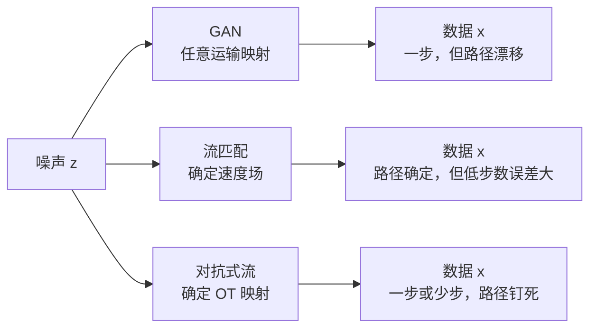
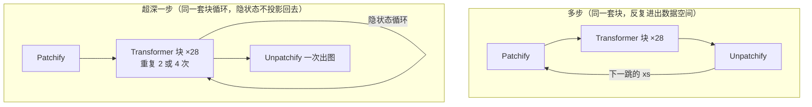

# 对抗式流模型：一步生成要稳，先把噪声到数据的路钉死

<!-- release-date: 2025-11-27 -->

> 本文依据 ByteDance Seed 的 **Adversarial Flow Models**，即 arXiv:2511.22475**v3**（2026-05-11，ICML 2026，26 页）。封面水印是 `arXiv:2511.22475v3 [cs.LG] 11 May 2026`。动笔前核过 arXiv 提交历史：v1 于 2025-11-27 提交，v2 于 2026-04-09，v3 于 2026-05-11；本地件与官方 v3 页数一致（26 页），md5 `8cf0b09066e90df62bc6823243e51ffa`。这是一篇技术论文，没有对外可用的产品模型，`release-date` 取首次官方公开日，即 arXiv v1 提交日 2025-11-27。证据见文末。
>
> 全文页码指 PDF 自身页码，本报告 PDF 页码与印刷页码一致。文中始终区分三件事：**报告写了什么**、**我们如何解释**、**哪些是外部补充**。凡是本文自己从图里读出来的，或报告各表之间对不上的数字，都会明说。

## 读之前：四个名字就够了

这篇论文同时踩在两条老路上。读正文前，只需要这四个词。

**生成对抗网络（Generative Adversarial Network，GAN）**：两个网络对着练。生成器 $G$ 把噪声变成图，判别器 $D$ 负责区分真图和假图。它天生支持**一步生成**——噪声进、$G$ 跑一次、图出来。代价是 $G$ 只要「看起来像真的」就行，从噪声走到数据可以走任意一条路，训练经常漂、经常炸。

**流匹配（flow matching）**：不玩对抗。先在噪声和数据之间拉一条直线（概率流），再让网络学这条线上每一点的速度。推理时沿速度场走很多步，把噪声运到数据。路是确定的，但一步、四步时离散误差很大，通常要几十上百步才干净。

**一致性模型（consistency model）**：想少走几步，就强迫网络在流上任意两点给出自洽的预测。它可以从零训练、也可以蒸馏。即便目标是一步生成，它仍要在所有时间步上训练，才能把约束传遍整条流。容量被中间步吃掉，误差会沿传播累积。

**NFE（Number of Function Evaluations，网络前向次数）**：推理时网络被调用几次。1NFE 就是一步生成。本文的主战场是 ImageNet-256、1NFE。

贯穿全文的那条线不是「再发明一种生成模型」，而是：

> **对抗目标只匹配两个分布，不指定噪声到数据该走哪条路。路不唯一，$G$ 就会在训练中一直换路。把路钉成那条二次代价下的最优运输，对抗训练才在标准 Transformer 上站得住，一步生成才不必先把中间时间步学一遍。**

## 一句话先说清

报告把这套东西叫 **对抗式流模型（Adversarial Flow Models，AFM / 公式里写 AF）**（PDF p. 1–3）。它同时属于对抗家族和流家族：

- 训练目标是对抗损失，所以原生支持一步和少步；
- 生成器被额外的最优运输正则推进去学一条确定的噪声到数据映射，而不是 GAN 那种任意运输；
- 它不必像一致性方法那样，为了传约束而把中间时间步都学会。

在 ImageNet-256、同样 1NFE 的设定下，B/2 接近一致性路线的 XL/2，XL/2 报到 FID 2.38；再把同一套 XL/2 用深度重复拉到 56 层和 112 层、端到端一步训完，FID 分别是 2.08 和 1.94，超过同等计算与参数的 28 层 2NFE / 4NFE（PDF p. 1）。

这些是摘要里的头条数字。后面会回到表里核对口径、对照和限制。

先用一张机制示意图把三条路摆在一起。下图根据 Figure 1 的文字含义重画，**只表示三种生成方式的差别，不是 1D 实验的实测轨迹**。

## 这份 PDF 各页写了什么

26 页里，正文到第 8 页结束，其余是致谢、参考文献和附录。先摊开，后面就知道哪里能深挖、哪里只能到此为止。

| 报告章节 | PDF 页 | 讲了什么 | 密度 |
|---|---|---|---|
| 摘要 + Figure 1 | p. 1 | 定位、头条 FID、1D 高斯混合上三条路线的对比 | 高 |
| §1 引言 | p. 1–2 | GAN 不稳的原因：运输映射不唯一；标准 Transformer 上会直接发散 | 高 |
| §2 相关工作 | p. 2 | 流加速 / 一致性 / GAN 扩展，点名 Shortcut、MeanFlow、GAT、R3GAN | 中 |
| §3.1–3.2 对抗预备 + 单步 AFM | p. 2–4 | 相对论 GAN、R1/R2、logit 居中；OT 正则如何钉死映射 | 高 |
| §3.3 多步 AFM | p. 4 | 任意 $(s,t)$ 运输；也可只训指定少步 | 高 |
| §3.4 判别器与梯度归一化 | p. 4–5 | $D$ 不能看源样本；用 $\phi$ 把对抗梯度缩到单位尺度 | 高 |
| §3.5 引导 | p. 5 | 简单分类器引导失败；改成沿流的时间条件分类器 | 高 |
| §3.6 不同的泛化 | p. 5–6 | 对抗学到的分布和流匹配不同（作者假说） | 中 |
| §3.7–3.8 架构 | p. 6 | 标准 DiT；深度重复做 56/112 层一步模型 | 高 |
| §4.1 实验设置 | p. 6–7 | ImageNet-256、潜空间、优化器、引导怎么加 | 高 |
| §4.2 消融 | p. 7 | $\lambda_{\mathrm{ot}}$、$\lambda_{\mathrm{gp}}$、沿流 CG 的网格 | 高 |
| §4.3 主结果 Table 4–8 | p. 7–8 | 1NFE / 少步 / 无引导 / 深度重复 | 高 |
| §4.4 限制与未来 | p. 8 | 训练算力、显存、$D$ 的梯度消失、离散时间、只做从零训练 | 中 |
| §5 结论 | p. 8 | 三句话收束 | 低 |
| 致谢 + 参考文献 | p. 9–12 | — | — |
| 附录 A Table 9 | p. 13 | 全指标对照（FID / sFID / IS / Prec / Rec） | 高 |
| 附录 B Figure 5–12 | p. 14–20 | 定性样张、与 SiT 对比、潜空间插值、逐层可视化 | 中 |
| 附录 C–D | p. 21–22 | EMA 重载、$D$ 重载、DA、训练日程 Table 10–11 | 高 |
| 附录 E Table 12 | p. 23 | 每步算力拆解 | 中 |
| 附录 F–H | p. 23–24 | 隐式分类器推导、梯度范数曲线、离散流的差分方程 | 中 |
| 附录 I Algorithm 2–3 | p. 25–26 | PyTorch 参考实现 | 中 |

两件需要提前知道的事：

1. **实验只做了 ImageNet-256 的类别条件生成。** 没有文生图、没有视频、没有像素空间主干。所有「新最佳 FID」都挂在这个设定和「同样潜空间、同样 DiT」的对照上。
2. **对抗训练的稳定性技巧，大半写在附录 C，不在方法正文。** EMA 重载、判别器重载、判别器增强（DA），报告自己说这些是「先前研究提出的、用来处理梯度消失」，不是 AFM 新引入的（PDF p. 21）。读主文容易以为 OT 正则单独就够了。

## 旧方法各自缺一块

报告没有写一段完整的「相关工作批判」，但引言和 Figure 1 把三块拼出来了（PDF p. 1–2）。下面按「报告写了什么」和「我们怎么解释」分开。

### GAN：一步免费，路却有无穷多条

报告的观察是：流匹配有唯一的真值概率流，自回归有语料决定的真值 token 概率；GAN 的对抗目标只要求 $G(z)$ 的分布贴上数据分布，**不约束运输映射本身**（PDF p. 2）。于是合法的 $G$ 有无穷多个，取决于初始化和训练噪声，$G$ 会在训练中持续漂移。

Figure 1 是 1D 高斯混合上的示意（PDF p. 1）。图上从左（数据 $x$）到右（噪声 $z$）画出许多条运输线，分成 1 步、4 步、64 步三列。

- Figure 1(a) GAN：线互相交叉、缠在一起，三列也不像同一张映射。
- Figure 1(b) 流匹配：1 步和 4 步的线明显对不齐，像被离散误差拉歪；到 64 步才收成一束有序的确定映射。
- Figure 1(c) AFM：1 步就已经是整齐成束的确定映射，4 步和 64 步看起来差不多。

这是 1D 示意图，不是 ImageNet 上的定量证据。后文 Table 1 才在真实图像设定里证明「没有 OT 正则就会发散」。

报告还写了一句很硬的话：近年来从零做对抗训练的工作，要么用非标准架构，要么再挂一个冻住的特征网络；**换成标准 Transformer，训练直接发散**（PDF p. 2）。后文 Table 1 用实验把「没有 OT 正则就会发散」钉死了。

### 流匹配：路是唯一的，一步却走不准

流匹配学的是瞬时速度。推理要把速度积分很多次。报告原话是：低采样步上有很大的离散误差（PDF p. 1）。Figure 1(b) 就是这个意思。

所以流匹配的矛盾是：**确定路径换来的是多步计算。** 想少步，不能只把步数砍掉。

### 一致性：少步是目标，中间步仍得全学

一致性、Shortcut、MeanFlow 这条线，把「预测远处的点」变成训练目标，可以从零训出一步 / 少步模型。报告指出两个代价（PDF p. 1–2）：

1. 即便目标是一步，仍要在所有时间步上训练，才能把自洽约束传开，容量被中间步占用，还会累积误差；
2. 少步网络没有足够容量去精确匹配多步产生的目标，点对点损失甚至矩匹配都会带来一定程度的模糊。所以许多 SOTA 少步模型最后还是要靠对抗训练做精修。

本文补一句解释，不是报告原文：一致性把「整条流上自洽」当成监督信号，所以中间步不是可选项，是传播介质。AFM 的想法是反过来——**目标分布由 $D$ 直接提供，不需要靠中间步当信使。**

## 设计一：用二次最优运输，把那条路钉死

### 旧问题

只拿对抗损失，$G$ 可以学任意一张把噪声推到数据的地图。地图不唯一，优化就没有单一目标，标准 Transformer 上会漂到发散。

### 新设计

报告搬来最优运输里的 **Brenier 定理**：源分布绝对连续（高斯满足），代价是二次的，则存在唯一的最优运输映射（PDF p. 3）。AFM 于是做了三件具体的事：

1. 把 $G$ 参数化成确定性网络 $G(z)$，并且强制噪声和数据同维：$x,z\in\mathbb{R}^n$，$G:\mathbb{R}^n\to\mathbb{R}^n$（PDF p. 3）。这是流模型的常规约束，报告说不降低方法的一般性。
2. 对抗目标继续负责「边缘分布要对上」——在无限容量、优化完美的假设下，运输的合法性由对抗损失保证。
3. 再给 $G$ 加一项二次运输代价，把解推向那张唯一的最优映射 $G^*$：

$$
\mathcal{L}^{G}_{\mathrm{ot}}=\mathbb{E}_{z}\left[\frac{1}{n}\lVert G(z)-z\rVert_{2}^{2}\right]
$$

完整目标是（PDF p. 3）：

$$
\begin{aligned}
\mathcal{L}^{D}_{\mathrm{AF}}&=\mathcal{L}^{D}_{\mathrm{adv}}+\lambda_{\mathrm{gp}}\mathcal{L}^{D}_{r1}+\lambda_{\mathrm{gp}}\mathcal{L}^{D}_{r2}+\lambda_{\mathrm{cp}}\mathcal{L}^{D}_{\mathrm{cp}},\\
\mathcal{L}^{G}_{\mathrm{AF}}&=\mathcal{L}^{G}_{\mathrm{adv}}+\lambda_{\mathrm{ot}}\mathcal{L}^{G}_{\mathrm{ot}}.
\end{aligned}
$$

对抗部分用的是相对论目标 $f(a,b)=-\log(\mathrm{sigmoid}(a-b))$，外加 R1/R2 梯度惩罚的有限差分近似（$\epsilon=0.01$，每 batch 只算 25% 样本）和 logit 居中惩罚 $\lambda_{\mathrm{cp}}=0.01$（PDF p. 3）。这些是 GAN 文献里的配件，不是 AFM 的发明。报告写明 R1/R2 的解析二阶反传太贵，才改成有限差分（引用 Lin et al., 2025）。

### 工作机制

把 $\lambda_{\mathrm{ot}}$ 想成「允许 $G(z)$ 离 $z$ 走多远」的拉绳。

- $\lambda_{\mathrm{ot}}=0$：绳子不存在，退回普通 GAN，映射任意。
- $\lambda_{\mathrm{ot}}$ 太小：绳子太松，优化卡在局部，逃不出乱交叉的运输。
- $\lambda_{\mathrm{ot}}$ 太大：绳子把 $G$ 拽向恒等映射 $G(z)=z$，分布对不上。

Figure 2 从左到右画了这根绳子收紧的过程（PDF p. 4）：左边线乱交，中间开始成束，右边几乎变成「每个 $z$ 停在原地」的身份映射。所以报告采用**随训练递减的 $\lambda_{\mathrm{ot}}$ 日程**，先用大根正则把映射按到确定轨道上，再放松，让对抗损失去把分布对好（PDF p. 3）。

1D 实验里，不同随机初始化会学到同一张确定映射；普通 GAN 则每次一张不同的地图（PDF p. 4，对应 Figure 1）。

### 收益

- 对抗训练在标准 DiT 上不再一换架构就发散（Table 1：去掉 OT 后 FID 在 170 上下，等于没训成，PDF p. 7）。
- 一步设定下，时间步采样和加权那些超参全部消失；也没有 teacher forcing（PDF p. 4）。
- 容量不必分给中间时间步。这是后文 B/2 能接近 XL/2 一致性模型的原因，报告自己就是这么解释的（PDF p. 7）。

### 代价与边界

- OT 项和对抗项**互相抢**。报告写得很清楚：实践里运输合法性并没有被严格保证，$\mathcal{L}^{G}_{\mathrm{ot}}$ 会把解推向 $G(z)=z$（PDF p. 3）。所以 $\lambda_{\mathrm{ot}}$ 不是「设了就忘」的常数，是一条要调的衰减曲线。
- Brenier 定理保证的是「二次代价下存在唯一 OT 映射」，不是「你这个有限网络、有限步数、有限 batch 一定学到它」。1D 上「不同初始化学到同一张图」是经验观察；ImageNet 上报告只说确定性运输「可见」，细节仍会随模型大小变化（PDF p. 14）。
- 梯度惩罚、相对论损失、logit 居中，全部还在。OT 正则稳定的是**生成器的路**，不是判别器的梯度消失。附录 C 把这件事说白了（PDF p. 21）。

### 可迁移启发

任何「两个分布要对上、但中间怎么走有无穷多种」的对抗设定，都可以问一句：能不能加一个便宜的、有唯一解的几何正则，把合法解从「一个集合」收成「一条路」？这里选的是二次 Wasserstein。换别的代价会不会同样稳，报告没试。

## 设计二：一步是特例，少步是同一套目标的离散版本

### 旧问题

GAN 通常只会一步。流模型和一致性模型会多步，但多步是靠速度场或自洽约束撑起来的。若对抗已经能一步，它还能否在概率流上的任意两点之间运输？

### 新设计

引入和流匹配同形的线性插值（PDF p. 4）：

$$
x_{t}=\mathrm{interp}(x,z,t):=(1-t)x+tz,\qquad t\in[0,1].
$$

生成器改成 $G(x_{s},s,t)$，判别器改成 $D(x_{t},t)$。训练时 $x_{s}$、$x_{t}$ 由独立采样的 $x$ 和 $z$ 插值得到。对抗损失变成在目标时间 $t$ 上比较 $D(x_{t},t)$ 和 $D(G(x_{s},s,t),t)$（PDF p. 4 式 16–17）。OT 项按时间间隔加权：

$$
w(s,t)=\max(|s-t|,\delta),\qquad \delta=0.001,
$$

间隔越小权重越大，避免 $s\approx t$ 时除零，也让短距离运输和长距离运输的尺度可比较（PDF p. 4）。

时间步可以按 $s\sim\mathcal{U}(0,1)$、$t\sim\mathcal{U}(0,s)$ 采样，得到任意 $t<s$ 的运输，即报告说的 **any-step**。也可以只在推理需要的那几个离散时间上训练，一步是特例（PDF p. 4）。

### 工作机制

$s$ 和 $t$ 靠近时，行为像流匹配（走一小段）；离得远时，行为像轨迹模型（直接跳到远处）。因为目标分布由 $D$ 提供，不需要一致性传播，所以**没有义务把整条流都学会**。

实现上，一步模型用直接预测 $G(z)=g(z)$；多步模型用残差 / 速度形式 $G(x_{s},s,t)=x_{s}-(s-t)\,g(x_{s},s,t)$（PDF p. 6）。报告说两种都可行，这样写是为了各演示一次，不是理论必须。

推理时，多步就是沿离散时间列表 $\tau$ 把差分方程走完（附录 H 式 39，PDF p. 24）：从 $x_{1}\sim\mathcal{Z}$ 出发，逐步用 $G(x_{\tau_{i}},\tau_{i},\tau_{i-1})$ 替换当前位置。具体 2NFE / 4NFE 用了哪几个 $\tau$，正文没给完整列表；引导那张日程表里，2NFE 的引导点是 $[0]$，4NFE 是 $[0,0.25]$（PDF p. 22，Table 11），只能说明他们把引导加在靠近数据的那一端。

### 收益

同一套对抗 + OT 目标，从单步 GAN 扩成离散时间流。指定少步训练能把容量留在真正会用到的那几跳上。

### 代价与边界

报告明确说：**any-step 训练更差**，因为容量和 batch 被稀释；1D 实验里 any-step 还需要更大 batch、收敛更慢（PDF p. 7）。他们没有在 ImageNet 上给出 any-step 的 FID 表。实践里他们优先保证某个指定少步设定的最好成绩，并认为这通常不是限制。

多步模型仍要选离散网格。报告把「不必手工定义时间离散」列为超深一步模型的优点之一（PDF p. 6），等于承认少步路线还是要人来选 $\tau$。

### 可迁移启发

「能任意步」和「任意步都训」不是一回事。若产品推理步数是固定的（1、2、4），把训练预算砸在这几个点上，比追求任意步更划算。报告用 ImageNet 的容量稀释把这件事说清楚了。

## 设计三：判别器不要看源，对抗梯度要先缩到同一把尺子

这两件事写在 §3.4，是让 OT 正则真正调得动的配套，不是装饰。

### 判别器不能条件在源样本上

直觉上好像该写 $D(x,z)$：既看目标、也看起点，配对关系更清楚。报告说这是错的（PDF p. 4）。

原因：训练时 $x$ 和 $z$ **独立采样**。如果 $D$ 看到 $z$，它会被告知「这个 $z$ 应该能配上每一个 $x$」；但 $G$ 只能学一张映射，一个 $z$ 只对应一个 $x$。目标不可能满足，训练会振荡或发散。多步情形同理，不要写成 $D(x_{t},t,x_{s},s)$。

正确写法：$D$ 只看当前样本（以及时间 $t$、类别 $c$），不看这条样本是从哪个 $z$ 运来的。

这是一个很容易抄错的实现细节。附录 Algorithm 2 里，`dis(...)` 的输入是增强后的目标样本、条件和目标时间，没有源噪声（PDF p. 25）。

### 对抗梯度的尺度会漂，$OT$ 就没法共用一套 $\lambda_{\mathrm{ot}}$

$G$ 的损失是对抗项加 OT 项。OT 项的尺度由 $\|G(z)-z\|$ 决定，相对稳定；对抗项从 $D$ 反传回来的梯度范数，会随架构、初始化、梯度惩罚强度大起大落（PDF p. 4–5）。传统 GAN 只优化对抗项，Adam 一类自适应优化器会把参数更新的幅度再标一遍，所以 $G$ 对绝对梯度尺度不敏感。AFM 不行——**绝对尺度决定了对抗和 OT 的配比**。

报告的补法是在 $D(\phi(G(z)))$ 里插入一个正向恒等、反向缩放的算子 $\phi$（PDF p. 5 式 23）：跟踪对抗梯度范数的 EMA，除以该平均范数，再乘 $1/\sqrt{n}$。它被说成「把 Adam 的思路接到反传路径上」，EMA 衰减沿用 Adam 的 $\beta_{2}$。对抗梯度被收到单位尺度之后，同一套 $\lambda_{\mathrm{ot}}$ 才能跨模型尺寸复用。

附录 G 的 Figure 14 / 15 把这件事画出来了（PDF p. 24）。没有归一化时，对抗梯度范数在训练中明显波动、整体走高；加上之后，对抗梯度范数被按在一条水平附近，OT 梯度仍按自己的尺度走。报告紧接着写了一句边界：**这种解耦有利于调参，但不是拿到最好 FID 的必要条件**（PDF p. 24）。

### 可迁移启发

只要损失是「一项尺度稳、一项尺度漂」的加权和，先把漂的那项在反传里归一化，再谈共用超参。不要指望 Adam 在参数空间的自适应，能替代你在损失空间把两项配平。另一条更硬：配对网络的条件里不要塞进训练时并不成对的变量。

## 设计四：一步模型的引导，必须把分类器梯度沿流积起来

### 旧问题

条件生成需要控制「有多听类别的话」。流匹配用 **CFG（Classifier-Free Guidance，无分类器引导）**，在有条件和无条件速度之间外推。GAN 文献常用一个分类器 $C(x,c)$ 去最大化 $p(c|x)$。

报告在 1D 条件高斯上画了 Figure 3（PDF p. 5）。Figure 3(c) 把 $C$ 直接加在 $G(z,c)$ 的终点上，引导后的运输几乎和没引导一样。原因：这个例子里两类分得很开，分类器在数据端有清晰决策面，**梯度是零**。CFG 之所以有用，是因为它把引导梯度沿整条流累加；高时间步上，插值把类别边界冲淡了，分类器才给得出方向。

### 新设计

即便 $G$ 和 $D$ 仍然只按一步训练，也把生成样本 $G(z,c)$ 再和独立噪声 $z'$ 插值到随机时间 $t'\sim\mathcal{U}(0,1)$，送给**时间条件分类器** $C(x_{t'},t',c)$（PDF p. 5 式 26）：

$$
\mathcal{L}^{G}_{\mathrm{cg}}=\mathbb{E}_{z,c,z',t'}\bigl[-C\bigl(\mathrm{interp}(G(z,c),z',t'),t',c\bigr)\bigr].
$$

这是在整条流上最大化分类分数。$t'$ 也可以只在一个子区间里采，相当于只在部分时间做 CFG。终点引导（式 24）是 $t'\equiv 0$ 的特例。

实验里 $C$ 是离线、独立训练的：同一套 B/2 Transformer，在 ImageNet 上用交叉熵从零训 30 个 epoch，潜空间里做（PDF p. 7）。引导系数 $\lambda_{\mathrm{cg}}$ 没有摊销进 $G$，为了和前人公平比较。

报告还写了：若 AFM 被用来后训练一个现成的流匹配模型 $v$，可以从 $v$ 按 CFG 推出隐式分类器梯度 $\nabla_{x_{t}}C=v(x_{t},t)-v(x_{t},t,c)$（PDF p. 5 式 27–28，推导在附录 F）。**这不是他们 ImageNet 实验用的设置。** 实验用的是显式 $C$；后训练被明确留作未来工作（PDF p. 8）。

### 工作机制

可以把它想成：一步 $G$ 已经跳到数据附近，分类器在终点看不清该往哪推；所以把生成结果再「拉回」流上的模糊地带，让 $C$ 在边界被冲淡的地方给梯度，再把这条梯度送回 $G$。

Table 3 是 XL/2、1NFE、训到最好 FID 的网格（PDF p. 7）。最好一格是 $\lambda_{\mathrm{cg}}=0.003$、$t'\sim\mathcal{U}(0,0.1)$，FID 2.36；只在 $t'=0$ 做引导、同一 $\lambda_{\mathrm{cg}}$ 是 2.40。报告说沿流 CG 比只在终点做有小幅提升，最优 $t'$ 区间远小于典型流匹配，因为对抗模型无引导时已经不差。

多步模型更简单：报告发现不必很强的引导，直接在选定的目标时间上加 $C$ 就够。日程表里 2NFE 用 $\lambda_{\mathrm{cg}}=0.02$、时间 $[0]$，4NFE 用 $0.02$、时间 $[0,0.25]$，都高于一步的 $0.003$（PDF p. 22）。

### 收益与边界

- 无引导的 AFM 已经能在同潜空间设定下超过 250NFE 的流匹配（Table 6，PDF p. 8）。引导是锦上添花，不是起死回生。
- 他们用 **CG（Classifier Guidance，分类器引导）**，不用 CFG。这被列为限制之一（PDF p. 8）。
- 分类器本身是额外网络、额外 30 epoch。报告没说这个 $C$ 的参数量是否计入 Table 4 的 130M / 673M。那些数字对应的是 $G$（Table 10：B/2 的 $G$ 为 130M，$D$ 为 129M，PDF p. 21）。
- 附录 F 指出：许多先前 GAN 里的 cGAN 头、GigaGAN 的 matching loss，本质上也是隐式分类器引导（PDF p. 23）。AFM 只是把这件事写明白，并改成沿流积分。

### 可迁移启发

引导信号要出现在**决策面被平滑过的地方**，而不是已经分得很开的数据端。一步模型尤其如此：你在终点看不到的梯度，往往藏在把样本重新打湿之后的中间时间。

## 设计五：标准 DiT 就够；一步生成的上限可能在深度，不在步数

### 架构本身几乎不改 DiT

$G$ 和 $D$ 都用标准 **DiT（Diffusion Transformer，扩散 Transformer）**（PDF p. 6）。改动只有：

- 一步模型去掉时间步投影；指定少步用一个时间投影；any-step 的 $g$ 用两个；
- 条件通过调制注入，沿用原版 DiT；
- $D$ 几乎等于 $G$，只是输入前加一个可学习 `[CLS]` token，经 LayerNorm 和线性层出 logit。

报告的强调是：**不必换非标准 Transformer，也不必外挂预训练特征网络**（PDF p. 2、6）。这是相对 GAT、R3GAN 路线的位置声明。Table 10 的归一化一栏写了 `Pre-LayerNorm + AdaZero`（PDF p. 21），正文没有解释 AdaZero；按 DiT 原论文的命名，应是 adaLN-Zero 那套调制，但这是本文的对应，不是报告原话。

$G$ 和 $D$ 默认同尺寸。超深实验只加 $G$ 的深度，$D$ 保持标准 28 层；$G$ 的学习率按重复倍数下调（PDF p. 7、21–22）。

### 超深一步：把多步的计算，改成一次前向里的层间循环

报告引用先前工作称：有效深度对捕捉非线性变换至关重要，深度不够是一步模型伪影的主因（PDF p. 6）。于是他们做端到端的超深一步模型。

理论理由有三条，都写在 §3.8（PDF p. 6），属于作者论证，不是单独消融出来的：

1. 隐状态可以端到端传递，不必每一步投影回数据空间再重新解释；
2. 不用手工定义时间离散；
3. 没有 teacher forcing。

做法是 **Transformer block 重复**（引用 Universal Transformers）：把第一遍的隐状态循环再用。仍然喂一个「像时间步」的嵌入，只为了区分第几轮重复；整个网络按单次前向、一步目标端到端训练，没有任何中间监督（PDF p. 6，Figure 4）。参数量和多步对照完全对齐：56 层对应 28 层走 2 步，112 层对应 28 层走 4 步，都是 675M（PDF p. 8，Table 7）。

Figure 4 是机制示意（PDF p. 6）。下图按它重画，**不含任何实测时间或 FID**。

左边多步是「patchify → 一块堆叠 → unpatchify」，输出再送回去走下一跳；右边超深是同一套块重复、隐状态循环、一次 unpatchify 出图。时间步式的嵌入仍在，只为区分第几轮重复。

### 收益

Table 7（PDF p. 8）：

| 模型 | 深度 | NFE | Epoch | FID↓ |
|---|---|---:|---:|---:|
| AFM-XL/2 | 28（1×） | 2 | 95 | 2.11 |
| AFM-XL/2 | 56（2×） | 1 | 95 | 2.08 |
| AFM-XL/2 | 28（1×） | 4 | 145 | 2.02 |
| AFM-XL/2 | 112（4×） | 1 | 120 | 1.94 |

同等参数、同等（或更少）的 $G$ 更新圈数，一次前向超过两次 / 四次前向。报告据此给出一条判断：**一步生成的质量，界限可能不在训练方法，而在生成器深度**（PDF p. 7）。这是作者从这张表推出的 insight，不是被「深度对训练方法」的正交实验单独证明的。

附录 Figure 11 / 12 把每层隐状态投到 PCA 前三维，再用一个训练过的线性层 + VAE 解码成图（PDF p. 19–20）。清楚的图像出现在较后的层；112 层模型有大量中间层在可视化里几乎看不出在做事，但它们确实拉低了最终 FID。报告自己提醒：可视化可能揭示不了这些层的全部贡献。和 GAT 不同，他们没有对中间特征加人工监督损失。

有一处图注对不上：Figure 12(e) 写 56 层 FID=2.02（PDF p. 20），Figure 8 / 11 / Table 7 / Table 9 都是 2.08。按多次出现的 2.08 读；2.02 更像 4NFE 那一行串到了这张图注。

### 代价与边界

- $D$ 没有一起变深。报告没讨论「只加深 $G$」是不是必须、加深 $D$ 会怎样。
- 学习率要按重复倍数手动降。112 层最终 $G$ 的学习率降到 $5\times 10^{-6}$ 量级（PDF p. 22，Table 11）。
- 这是同一套权重的循环，不是 112 个独立块。参数仍约 675M，计算量按重复次数涨。报告用来对比的「equal compute and parameters」指的是对 28 层 $k$ 步 vs 28$k$ 层 1 步（PDF p. 1）；逐步的显存、墙钟，正文没给。

### 可迁移启发

少步生成遇到伪影时，先问「是不是深度不够，而不是目标函数不够」。把多步之间反复进出数据空间的计算，收成一次前向里的隐状态循环，是一条不改参数量、只加深度的路。代价是学习率和稳定性都要重新调，AFM 并没有把超深变成「开箱即用」。

## 实验设定：只在这一套规矩里比

全部定量结果都是 ImageNet 类别条件、256×256、水平翻转、在 $32\times 32\times 4$ 潜空间里训（PDF p. 6）。VAE 用 Stability AI 的 `sd-vae-ft-mse`（脚注 1）。评测是 FID-50k，相对整个训练集，用 ADM 的预计算统计（PDF p. 6、22）。

优化器：AdamW，$\beta_{1}=0$，$\beta_{2}=0.9$，weight decay $0.01$，EMA $0.9999$，初始学习率 $1\times 10^{-4}$，batch 256（PDF p. 6）。精度 TF32。模型尺寸跟 MeanFlow 的定义：B/2、M/2、L/2、XL/2，2 是 patch 大小。$G$ 和 $D$ 用**分开的 dataloader**；epoch 按 $G$ 见过的图片数计（PDF p. 6）。

评测是类别均衡：1000 类 × 每类 50 张 = 50k（PDF p. 22）。报告提醒这可能比类别不均衡口径便宜约 0.1 FID；他们的规则是——前人明确写了类别均衡就用那个数字，否则用原文数字。AlphaFlow 与他们同口径。

引导的加课方式：先无引导训到最好 FID，再继续加引导（PDF p. 7）。所以 Table 11 里每个尺寸都是一串阶段，不是从头到尾一个超参。

报告没写的：GPU 型号与数量、墙钟、总 FLOPs、数据加载以外的并行策略。附录 E 只给了「相对 MeanFlow，每步算力和按 epoch 折算后的总计算」（PDF p. 23）。

## 数字：哪些结论被表撑住

下面只引用打开过的表。对照符号按报告脚注（PDF p. 8）：$(\bullet)$ 同样潜空间和架构，参数只因时间嵌入数量有差别；$(\circ)$ 同样潜空间、不同架构；$(\dagger)$ 同期方法。

### 1NFE、有引导：主表

Table 4（PDF p. 8）是摘要那句「新最佳 2.38」的出处：

| 方法 | 参数 | Epoch | 引导 | NFE | FID↓ |
|---|---:|---:|---|---:|---:|
| MeanFlow-B/2 | 131M | 240 | CFG | 1 | 6.17 |
| AlphaFlow-B/2 † | 131M | 240 | CFG | 1 | 5.40 |
| MeanFlow-XL/2 | 676M | 240 | CFG | 1 | 3.43 |
| AlphaFlow-XL/2 † | 676M | 240 | CFG | 1 | 2.81 |
| GAT-XL/2+REPA † | 602M | 40 | DA+cGAN | 1 | 2.96 |
| StyleGAN-XL | 166M | — | CG+cGAN | 1 | 2.30 |
| AFM-B/2 | 130M | 200 | CG+DA | 1 | 3.05 |
| AFM-M/2 | 306M | 120 | CG+DA | 1 | 2.82 |
| AFM-L/2 | 457M | 120 | CG+DA | 1 | 2.63 |
| AFM-XL/2 | 673M | 125 | CG+DA | 1 | 2.38 |

报告的两条读法：

1. **B/2 超过许多 XL/2 一致性模型。** AFM-B/2 的 3.05 好于 MeanFlow-XL/2 的 3.43，接近 AlphaFlow-XL/2 的 2.81。报告把原因归于小模型容量紧，AFM 不把容量耗在其他时间步（PDF p. 7）。这是「同表比较 + 作者解释」，不是把容量分配做成控制变量的消融。
2. **同设定（•）下 XL/2 的 2.38 是新最佳。** StyleGAN-XL 的 2.30 更好、模型也更小，但报告立刻声明它走像素空间，AFM 受 VAE 和 DiT patch 2 限制；他们主要和（•）比（PDF p. 7）。

Table 8 把 2.38 拆开（PDF p. 8）：无引导 3.98，只 DA 3.86，只 CG 2.54，CG+DA 2.38。所以增益主要来自 CG，DA 是小头。只 CG、不加 DA 时 2.54 仍好于表里大多数一致性 XL/2。

### 少步、有引导

Table 5（PDF p. 8）：AFM-XL/2 在 2NFE 为 2.11（95 epoch），4NFE 为 2.02（145 epoch）。MeanFlow-XL/2 2NFE 在 240 epoch 为 2.93、拉到 1000 epoch 为 2.20；AlphaFlow-XL/2 2NFE 为 2.16。

注意一处表间不一致：Table 5 / Table 7 / Table 11 的 4NFE 写 2.02；Table 9 和 Figure 7(b) 写 2.03（PDF p. 8、13、16）。差 0.01，方向不影响排序，但不宜当精确到百分位的「单一真值」。

### 无引导：对抗和流匹配学到的不是同一类「像」

Table 6（PDF p. 8）：AFM-XL/2 无引导 1NFE 为 3.98，2NFE 为 2.36。同潜空间的 SiT-XL/2 无引导 250NFE 是 8.30，DiT-XL/2 是 9.62。报告说连 1NFE / 2NFE 的 AFM 也超过 250NFE+ 的流匹配（•）。

这不是「AFM 全面超过流匹配」。表里用表征空间 / 联合训练 VAE 的 RAE-XL（1.87）和 SiT+REPA-E（1.69）仍然大幅领先，但它们不是（•），且是 250NFE。报告用 R 标记这类表征潜空间，没有把它们当成同设定对照。

§3.6 给出作者假说（PDF p. 5–6）：无限容量下两种方法都会过拟合到训练集；有限容量时，流匹配的平方 $L_{2}$ 测的是各向同性欧氏距离、又与 DDPM 一样最小化前向 KL，无引导时容易出分布外样本；对抗用 $D$ 当可学习判据，更接近 JS 散度，对离群点不那么敏感。报告用「hypothesize」这个词。Figure 9 是对应的定性：无引导时 AFM 的 2NFE（FID 2.36）看起来更像普通照片，SiT 的 250NFE（FID 8.30）有更多构图怪异、像分布外的图（PDF p. 17）。有引导之后两边 FID 接近（2.11 vs 2.06），观感差距也收窄。

### 全指标：召回是短板

Table 9（PDF p. 13）把 sFID、IS、Precision、Recall 补齐。摘 AFM 几行：

| 模型 | 引导 | NFE | FID↓ | sFID↓ | IS↑ | Prec.↑ | Rec.↑ |
|---|---|---:|---:|---:|---:|---:|---:|
| AFM-B/2 | None | 1 | 6.07 | 5.31 | 169.51 | 0.72 | 0.49 |
| AFM-XL/2 | None | 1 | 3.98 | 5.40 | 201.85 | 0.78 | 0.52 |
| AFM-XL/2 | None | 2 | 2.36 | 4.35 | 235.77 | 0.81 | 0.52 |
| AFM-B/2 | CG+DA | 1 | 3.05 | 5.32 | 269.18 | 0.81 | 0.51 |
| AFM-XL/2 | CG+DA | 1 | 2.38 | 4.87 | 284.18 | 0.81 | 0.52 |
| AFM-XL/2 | CG+DA | 2 | 2.11 | 4.33 | 273.84 | 0.82 | 0.55 |
| AFM-XL/2 56 层 | CG+DA | 1 | 2.08 | 4.79 | 298.33 | 0.79 | 0.56 |
| AFM-XL/2 | CG+DA | 4 | 2.03 | 4.59 | 259.66 | 0.78 | 0.59 |
| AFM-XL/2 112 层 | CG+DA | 1 | 1.94 | 4.54 | 292.20 | 0.79 | 0.56 |

对照：StyleGAN-XL 召回 0.53，SiT-XL/2+CFG 召回 0.59，BigGAN 召回 0.28。AFM 一步的召回停在 0.51–0.52，要到 4NFE 才到 0.59。报告正文几乎没讨论召回。这是本文读表的观察：FID 领先主要走的是精度 / 感知像，不是覆盖更全。56 层的 IS 298.33 是 AFM 各行最高，112 层 FID 最好但 IS 略回落到 292.20——又是一个报告没解释的交叉。

### 算力：每步更贵，总步数更少

正文 §4.4：XL/2 1NFE 相对 AlphaFlow 是 1.88× 训练计算，换来最好 FID 15% 的提升；多出来的计算来自 $D$ 上的重损失和正则（PDF p. 8）。

附录 E Table 12 把「1.88×」算给了 MeanFlow，不是 AlphaFlow（PDF p. 23）。拆解是：Flow Matching 每步 3、MeanFlow 每步 4、AFM 每步 14.5；再按最好 epoch 折算（FM 1400、MF 240、AF 125）得到 AFM / MeanFlow $=14.5/4\times 125/240\approx 1.88$。AlphaFlow-XL/2 也是 240 epoch（Table 4），若每步算力与 MeanFlow 相近，1.88× 会对上两个名字；15% 则只对得上 AlphaFlow（$(2.81-2.38)/2.81\approx 15.3\%$），对 MeanFlow 会是约 30%。正文和附录在「跟谁比 1.88×、跟谁比 15%」上用词不一致。数字本身按 Table 12 的公式是自洽的，比较对象应当分开写。

AFM 每步 14.5 的构成：生成器前向 + 两次 $D$ 前向，反传里 $G$ 和 $D$ 都算，外加 25% 样本上的 R1/R2（PDF p. 23 表注）。这是对抗配方的结构性代价，不是 OT 正则引入的。

## 消融：哪根绳子是真的在撑着

### 没有 OT，Transformer 上的对抗就是发散

Table 1：B/2、1NFE、20 epoch、两次平均（PDF p. 7）。$\lambda_{\mathrm{ot}}=0$ 时，无论 $\lambda_{\mathrm{gp}}$ 取 0.1 / 0.25 / 0.5，FID 都在 171–178。加上 OT 之后才掉到几十。最好一格是 $\lambda_{\mathrm{gp}}=0.25$、$\lambda_{\mathrm{ot}}=0.2$，FID $53.90\pm 1$。过小或过大的 $\lambda_{\mathrm{ot}}$ 都会坏掉，和 Figure 2 的示意一致。

Table 2 把同一模型训到 100 epoch（PDF p. 7）：$\lambda_{\mathrm{ot}}=0.2$ 保持常数，FID 29.4；余弦衰减到 0.01，8.51；衰减到 0，8.69。衰减是拿到峰值的关键。Table 11 显示后期学习率降下去之后，终端 $\lambda_{\mathrm{ot}}$ 还可以再降到 0.001（PDF p. 7、22）。

### 沿流 CG 只有小幅好处

Table 3 已在引导一节引用。网格里所有格子都在 2.36–2.52，没有出现「一改 $t'$ 就崩」的悬崖。这和「对抗模型无引导已经能看」是同一件事。

### 训练后期靠附录 C 的脏技巧收分

Table 11 把每个模型拆成四段左右（PDF p. 22）。以 XL/2 1NFE 为例：

| 阶段 | 引导 | $\lambda_{\mathrm{ot}}$ | 学习率 | EMA 重载 | $D$ 重载 | Epoch | FID |
|---|---|---|---|---|---|---:|---:|
| 无引导 | None | $0.2\to 0.005$ | $1\times 10^{-4}$ | 否 | 否 | 90 | 5.88 |
| +EMA 重载 | None | 0.001 | $8\times 10^{-5}$ | 是 | 否 | 110 | 4.81 |
| +$D$ 重载 | None | 0.001 | $3\times 10^{-5}$ | 是 | 是 | 120 | 3.98 |
| +CG | $0.003,\mathcal{U}(0,0.1)$ | 0.001 | $5\times 10^{-5}$ | 是 | 是 | 125 | 2.38 |

附录 C 的要点（PDF p. 21）：

- 极小极大 + 梯度下降容易振荡，EMA 的 $G$ 稳定优于最后一次迭代；乐观优化器和非对称学习率他们试过，无效。
- EMA 模型接近平台后，把在线 $G$ 换成 EMA 权重，之后每个 epoch 自动再换，同时降学习率。
- 无引导设定下，训练再卡住就从更早的 checkpoint **重载 $D$**，避免 DA 额外注入的归纳偏置；有引导时再加 DA。
- DA 在潜空间做：整数平移（$p=0.4$，幅度 0–0.3）和三次 cutout / RandomErasing（$p=0.4$，面积 0.1–0.5）。相对论损失里，真假样本必须成对用同一组随机增强（PDF p. 22 式 33–34，Algorithm 1）。Figure 13 经 VAE 解码后可以看到平移和遮挡（PDF p. 22）。

报告把这些技巧的定位写得很克制：有效，但不完美；解决的是对抗训练剩下的挑战，**不是 AFM 引入的问题**；他们也没有解决梯度消失，仍依赖前人方法（PDF p. 21）。读主文只记 OT 正则，会低估实际训练有多「手调」。

## 定性：确定性运输看得见，细节仍会变

附录 B 用同一组种子、同一组类别（秃鹰、美西螈、凤头鹦鹉、金毛、白狐、伞菌、悬崖、间歇泉）横比模型（PDF p. 14–16）。报告自己指出：秃鹰和间歇泉的天空颜色（蓝或白）在同一种子下跨模型通常一致，这被当作确定性运输的可见证据；细节仍随模型而变，原因有三——容量不同所以泛化不同、minibatch 有随机性、训练末期 OT 系数被调低（PDF p. 14）。

Figure 10 用球面线性插值 slerp 在两个噪声之间走 $t\in[0,1]$，XL/2 1NFE，未挑选（PDF p. 18）。同一类里姿态、背景、主体是连续变过去的，没有明显跳类。这支持「$G$ 学到的是平滑映射」，但不能单独证明它就是 Wasserstein-2 最优映射。

无引导的 Figure 6 明显比有引导的 Figure 5 脏：类别还在，纹理和构图的失败更多（PDF p. 14–15）。这和 Table 8 从 3.98 到 2.38 的定量落差一致。

## 限制：报告自己认的，和它没写的

### 报告 §4.4 写明的

1. **训练计算。** 每步前向次数多，$D$ 的正则贵。相对一致性方法，总计算仍高一截（PDF p. 8、23）。他们说可以减小 $D$ 的 batch、复用中间结果、换别的 Lipschitz 约束、换掉相对论目标，但本文采取最保守、跟先前 SOTA GAN 对齐的写法，优化留给未来。
2. **$D$ 增加显存。**
3. **用 CG 而不是 CFG。**
4. **梯度消失仍要靠附录技巧。**
5. **当前是离散时间流。** 扩到连续时间是未来方向（PDF p. 8）。
6. **只探索从零训练。** 后训练留给未来（PDF p. 8）。

### 报告没写、读的人容易以为有的

- GPU 数、墙钟、集群、并行。没有。
- 文生图、视频、像素空间主干、别的分辨率。没有。
- any-step 在 ImageNet 上的 FID。只说更差，没有表。
- 2NFE / 4NFE 的完整时间网格 $\tau$。只有引导点。
- $\beta_{1}=0$ 的理由、AdaZero 的定义、为何 $G$/$D$ 必须同尺寸（超深实验除外）。
- 分类器 $C$ 是否计入参数表、引导阶段 $C$ 冻不冻。
- 自动超参日程。Table 11 是训练中手找的；EMA 重载可自动，$D$ 重载是「训练再 stall 时手动试几个 checkpoint」（PDF p. 21）。

### 被实验支持 / 只是作者观察 / 尚未公开

**被表支持的：** 在 ImageNet-256、同样 LDM 潜空间和 DiT 架构下，AFM 的 1NFE FID 优于表中列出的一致性方法；无 OT 时 B/2 在 20 epoch 内不收敛；$\lambda_{\mathrm{ot}}$ 衰减明显好于常数；56/112 层一步超过对应的 28 层 2/4 步（按 Table 7 的 FID）。

**作者观察、没有单独对照实验的：** 确定性映射是稳定性的因果来源（1D 上有可视化，ImageNet 上是定性）；B/2 赢过 XL/2 一致性是因为容量没浪费在中间步；无引导优于流匹配是因为 JS / 感知度量 vs 前向 KL / $L_{2}$；一步质量的界限在深度不在方法；112 层中间层「看起来没贡献」但仍有用。

**没有公开、因而无法核实的：** 大规模训练的系统侧全部；any-step 的定量；连续时间版本（见文末外部补充的边界）；后训练配方。

## 可迁移启发

1. **对抗不稳，先问映射有没有被钉死。** 分布匹配和路径约束是两件事。只做第一件，优化目标是一个集合。
2. **正则要会松绑。** 先用大根 OT 把解按到轨道上，再衰减，把分布匹配的权交还给对抗项。绳子一直绷着，学到的是恒等映射。
3. **条件里不要放训练时并不成对的变量。** $D(x,z)$ 这种「看起来更信息量」的写法，会提出 $G$ 满足不了的配对要求。
4. **两项损失配权之前，先统一梯度尺子。** 自适应优化器解决的是参数更新幅度，不是损失之间的相对尺度。
5. **一步模型的引导，把样本重新打湿再问分类器。** 终点决策面太硬，梯度在中间时间。
6. **推理步数固定，就只训那几步。** 任意步是能力，不是训练目标。
7. **少步伪影先怀疑深度。** 把多步的进出数据空间，收成一次前向的隐状态循环，参数量可以不变。
8. **主文的稳定性和训练日志里的稳定性，往往不是同一个东西。** AFM 真正能写进公式的是 OT 正则；FID 从 5.88 收到 3.98 那一截，靠的是 EMA 重载和 $D$ 重载。

## 关键词回看

| 词 | 在这篇报告里指什么 |
|---|---|
| **对抗式流模型（AFM / AF）** | 对抗损失 + 二次 OT 正则，生成器学确定的噪声到数据映射，支持一步和离散少步（PDF p. 3–4） |
| **运输映射（transport map）** | 每个噪声点被送到哪个数据点。GAN 不唯一，AFM 要钉成二次代价下的那一张（PDF p. 2–3） |
| **Brenier 定理** | 源绝对连续、代价二次时，最优运输映射存在且唯一（PDF p. 3） |
| **$\lambda_{\mathrm{ot}}$** | OT 正则系数。太大变恒等，太小退回 GAN；训练中递减（PDF p. 3–4、7） |
| **相对论 GAN** | $f(a,b)=-\log(\mathrm{sigmoid}(a-b))$，比较真假 logit 的差而不是绝对真假（PDF p. 3） |
| **R1 / R2** | 对真样本 / 假样本的梯度惩罚，这里用 $\epsilon=0.01$ 的有限差分，只算 25% batch（PDF p. 3） |
| **NFE** | 推理时网络前向次数。1NFE = 一步（PDF p. 1） |
| **any-step** | 训练时随机采任意 $t<s$。报告说容量被稀释，ImageNet 上他们改训指定少步（PDF p. 4、7） |
| **梯度归一化 $\phi$** | 正向恒等、反向把对抗梯度收到单位尺度，让 $\lambda_{\mathrm{ot}}$ 跨尺寸可复用（PDF p. 5） |
| **沿流的 CG** | 把一步生成的结果再插值到中间时间，送给时间条件分类器（PDF p. 5） |
| **block 重复** | 同一套 Transformer 块循环，56 = 28×2，112 = 28×4，一步端到端、无中间监督（PDF p. 6） |
| **EMA 重载 / $D$ 重载** | 附录技巧：用 EMA 覆盖在线 $G$；卡住时把 $D$ 倒回旧 checkpoint（PDF p. 21） |
| **DA** | 潜空间里对真假成对做平移和 cutout，主要配合引导阶段（PDF p. 22） |

## 最后的判断

这篇论文最值得记住的不是 2.38 或 1.94 这两个 FID，而是它把一个被说滥的现象写清楚了：

> **GAN 难训，常常不是因为判别器太强或太弱，而是因为生成器根本没有被要求走同一条路。**

OT 正则是便宜的几何约束，却让标准 DiT 上的从零对抗训练从「直接发散」变成可以跑完 100+ epoch。少步、超深、沿流引导，都建立在「路已经被钉住」之后。

它不是免费午餐。每步计算大约是 MeanFlow 的三到四倍；最终分数还依赖 EMA 重载、$D$ 重载、DA 这套手调日程；召回仍偏 GAN 风格；实验不出 ImageNet-256 类别条件。把摘要读成「对抗已经全面取代流匹配」，报告自己的表和限制都不支持。

若只带走一条能用在自己项目里的原则：当你的目标函数只约束边缘、不约束耦合，先花一个正则把耦合选唯一，再谈架构和规模。

## 资料与阅读边界

**本篇依据的唯一原件**：`papers/ByteDance/Adversarial-Flow-Models.pdf` = arXiv:2511.22475v3（2026-05-11，26 页，md5 `8cf0b09066e90df62bc6823243e51ffa`）。所有 `(PDF p. N)` 均指该文件页码。正文水印为 `arXiv:2511.22475v3 [cs.LG] 11 May 2026`。ICML 2026，PMLR 306。

**版本核验**：arXiv 官方提交历史为 v1（2025-11-27）、v2（2026-04-09）、v3（2026-05-11）。本文按 v3 写。没有对 v1 / v2 做逐句差分。

**本文自己读表或图得到、报告未直接写成结论的：**

- Table 9 里一步 AFM 召回停在约 0.52，4NFE 才到 0.59；
- 56 层 IS 高于 112 层，与 FID 排序交叉；
- Table 5/7/11 的 4NFE FID 2.02 与 Table 9 / Figure 7 的 2.03 不一致；
- Figure 12(e) 56 层图注 2.02 与他处 2.08 不一致；
- 正文「相对 AlphaFlow 1.88×、15%」与附录 E「相对 MeanFlow 1.88×、15%」用词不一致，15% 只对 AlphaFlow 的 2.81→2.38 成立。

**外部补充**（均非本报告内容）：

- 官方代码仓库（论文摘要「this repository」指向此处；GitHub `created_at` 为 2025-12-01，首次 commit 为 2025-12-02，晚于 arXiv v1）：<https://github.com/ByteDance-Seed/Adversarial-Flow-Models>
- 权重与 misc checkpoint：<https://huggingface.co/ByteDance-Seed/Adversarial-Flow-Models>（Hugging Face 仓库 `createdAt` 按本模块规则不是首发日）
- OpenReview（ICML 2026）：<https://openreview.net/forum?id=3GPPUHlJU9>
- 查阅 seed.bytedance.com 博客与论文列表，未找到本工作的独立 Seed 新闻稿。
- 同一作者后续的 *Continuous Adversarial Flow Models*（arXiv:2604.11521，2026-04-13）把对抗目标扩到连续时间流，并做后训练。**它不是本报告的内容**，本报告在 §4.4 把连续时间和后训练都标成未来工作。本文不把它的数字、设定或结论写进正文。

**release-date 取证**：`2025-11-27`。对象是公开技术、无对外可用产品模型，按本模块规则取该技术首次官方公开日。arXiv v1 提交于 2025-11-27 14:04:08 UTC（[abs/2511.22475](https://arxiv.org/abs/2511.22475)）。GitHub 仓库创建于 2025-12-01、首次代码提交于 2025-12-02；Hugging Face Papers 页面记录 Peter Lin 于 2025-12-01 提交论文页——都晚于 arXiv。证据强度：**强**（arXiv 官方时间戳；无更早的官方产品或博客发布）。
