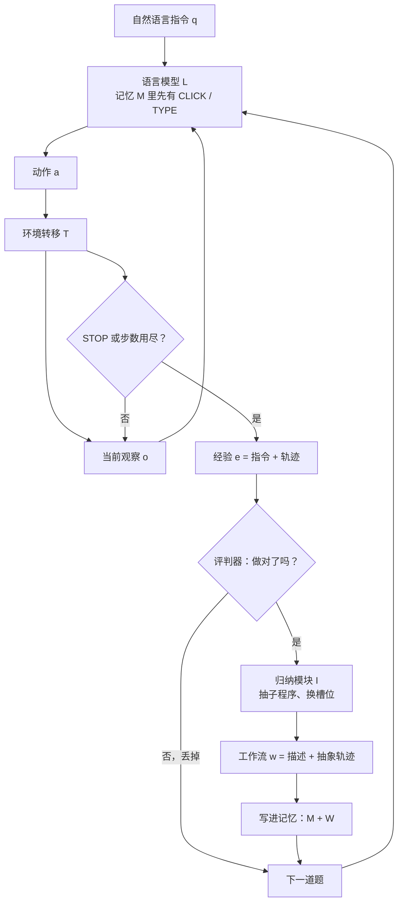

# AWM：长程网页任务死在把示范原样塞进上下文；它改的是记忆里的工作流，不是权重

<!-- release-date: 2024-09-11 -->

> 本文依据 CMU 与 MIT 联合发布的 **Agent Workflow Memory**，即 arXiv:2409.07429v1、2024-09-11 首次公开、共 16 页的版本。封面作者为 Zora Zhiruo Wang、Jiayuan Mao、Daniel Fried、Graham Neubig；Wang、Fried、Neubig 署 Carnegie Mellon University，Mao 署 Massachusetts Institute of Technology（PDF p. 1）。本站按主导机构放在 CMU 目录。页码均指这份 PDF 本身。截至 2026-09-10 核验，arXiv 仍只有 v1，与本地原件一致。
>
> 文中严格区分三层：「论文写了什么」「本文如何解释它」「哪些是外部资料补充」。仓库 README 后来写的 35.6%，一律标成外部补充，不得当成 Table 1 的主数字。

## 读之前需要的最少背景

这篇论文只讲一件事：网页 agent 做长程任务时，要不要继续把完整示范原样塞进上下文。

先把后面会反复出现的词说成人话。

- **网页导航 agent**：给一句自然语言指令，让模型在真实或仿真网站上点、填、滚、停。环境每走一步变一次，轨迹往往很长。
- **轨迹（trajectory）**：一次尝试里逐步看到的页面，加上逐步发出的动作。做完一道题，这条轨迹就变成一条**经验（experience）**。
- **工作流（workflow）**：从经验里抽出来的、可复用的小套路。它不是「在 Amazon 买猫粮送到我家」这种具体题，而是「在 Amazon 搜一个商品」这种会在很多题里重复出现的子程序。具体值被换成 `{product-name}` 这类槽位。
- **记忆（memory）**：论文里就是系统提示或主提示里的辅助文本，默认装着 `CLICK`、`TYPE` 这类内置动作说明（PDF p. 2，脚注 1）。AWM 要往里面加的，是上面那种工作流。
- **离线 / 在线**：有标注示范时，先从训练集归纳、再拿去测，叫离线；没有示范、边测边从自己做对的题里归纳，叫在线。
- **Mind2Web / WebArena**：两个网页导航基准。前者强调跨任务、跨网站、跨域；后者有 812 道题、按功能正确性打分。摘要把两者合起来写成 1000+ 任务、200+ 域（PDF p. 1）。

本站「自进化」这一组按「哪个部件在进化」来分。论文自己写的是 continual learning 和 adapt over time，没有用「自进化」三个字。按本站的分法，这篇改的是 **记忆 / 可复用工作流**：

- [Alita](/reports/Princeton/Alita) 造的是 MCP 工具；
- [GEPA](/reports/Berkeley/GEPA) 进化的是 prompt；
- [Darwin Gödel Machine](/reports/Sakana/Darwin-Godel-Machine) 改的是 harness 代码；
- 本篇 AWM 改的是 **塞进上下文的那份工作流记忆**。

四条线都可能被叫成自进化，动的部件完全不同。权重在这篇里从头到尾没有动。

## 一句话先说清

AWM 的主结果有两组，必须先对齐口径，否则摘要里的百分数会对不上表。

**WebArena**（只用在线，GPT-4 `gpt-4-0613`，温度 0）：总成功率 35.5%，相对当时最强的自主方法 BrowserGym（23.5%）是 +12.0 绝对值、+51.1% 相对；平均步数 5.9，比只看 accessibility tree 的 BrowserGym 少约 2.0 步（PDF p. 5，Table 1）。

**Mind2Web 跨任务**（离线，gpt-4）：逐步成功率 45.1%，相对 MindAct 的 36.2% 是 +8.9 绝对值、+24.6% 相对。摘要里那句 24.6%，引言写明了是 **逐步**成功率，不是任务级（PDF p. 1、p. 2、p. 7 Table 3）。

跨任务 / 跨网站 / 跨域上，摘要写成「随训练–测试分布差变大，比基线高 8.9 到 14.0 绝对值」（PDF p. 1）。这组数来自 Table 4 的**逐步成功率**，而且 8.9 与 14.0 取的是离线那一行；跨网站那一档其实只有 +3.6 到 +3.8，摘要跳过了中间这个凹陷。后文按表展开。

如果只带走一句，可以先记：

> **长程网页任务缺的不是示范，是示范太具体。把成功轨迹收成带槽位的子程序，放进记忆里让下一步去用，比把整段示范原样塞进上下文更经得起换题、换站、换域。**

这是本文的归纳。论文用的是「抽取并学习可复用的任务工作流」（PDF p. 1）。

## 旧方法卡在哪：示范原样进上下文

先别上 AWM。先看 2024 年网页 agent 默认在做什么。

论文的观察是：当时的 agent 大多把**固定的一批示范**写进训练，或原样放进上下文做 in-context learning（PDF p. 1）。动作序列跟示范像，就做得动；任务语境或环境一变，就垮。Mind2Web 原文已经被用来证明过这种不稳健（PDF p. 1，引 Deng et al., 2023）。

它指出两处具体失灵（PDF p. 1）：

**一、解不开越来越复杂的任务。** 关键不是再多背几条完整轨迹，而是抽出那些在相似任务和环境里**共享的工作流**。示范原样进上下文，学到的是「这道题当时点了哪个按钮」，不是「这类题的公共子程序」。

**二、题与题之间不积累。** 每道题单独做完就丢。过去的成功和失败进不了下一步，系统不能随时间适应。

用 Synapse 把第一处说死。Synapse 检索最相关的训练轨迹，整段塞进提示（PDF p. 6–7）。论文后来说：完整、具体的示范会把 agent **偏向去点示范里出现过的那些元素**；而一条完整轨迹也不太可能在测试里原样再出现一次（PDF p. 7）。这就是「示范原样进上下文」的病根——**记忆的单位选错了**：它记的是一次具体经历，不是一段可迁移的套路。

第二处更像人的对比。人会从过去经验里抽象出常用套路，再拿去指导下一步（PDF p. 1，引 Chi et al., 1981; 2014）。当时的 agent 没有这一层。

AWM 要做的，就是把这一层补上：从轨迹里归纳工作流，放进记忆，让后续生成有东西可循。

## 工作流长什么样，为什么必须抽象

一条经验是「这道题 + 这条轨迹」。一条工作流看起来很像经验，但有两处刻意不同（PDF p. 3）。

**描述 $d$**：用自然语言写清这段动作的高层目标，相当于给子程序起个名字。可以从原指令里启发式抽取，也可以让模型摘要。

**轨迹**：完成 $d$ 的一串步骤。每一步有三块，Figure 2 的 Step 3 画得很清楚（PDF p. 3）：

1. **环境状态的自然语言描述**，例如「订单 `{id}` 已经显示」；
2. **推理**，说明为什么在这个观察下要发下一个动作；
3. **可执行动作**，例如 `stop()`。

论文给的具体例子是查订单。用户问「谁下了订单 #0130？」。原始轨迹里会看到 `click('126')`、`scroll(0, 200)`、`send_msg_to_user("Emma Lopez")` 这种带具体 id 和具体人名的步骤。归纳之后，工作流变成「按指定 ID 找顾客订单」，元素 id 和人名被换成槽位（PDF p. 3，Figure 2）。

归纳模块要做的，就是从一组经验 $E$ 里产出工作流集合 $W$：

$$
I(E)\rightarrow W=\{w\}=\{(d_j,P_j)\}
$$

论文强调两个设计，不是装饰（PDF p. 3）：

**粒度要细。** 不要归纳成「在 Amazon 买干猫粮送到我的地址」这种很少重复的整题；要归纳成「在 Amazon 搜一个商品」这种会作为子任务反复出现的片段。

**值要抽象。** 不要留下「dry cat food」；要写成 `{product-name}`。附录里的归纳提示把这条写死了：非固定元素（输入文本、按钮字符串）用描述性变量名；每条工作流至少两步；不要生成互相重叠的工作流（PDF p. 14，A.1）。

工作流按模型输出的空行切开，**分开存**进记忆（PDF p. 3）。这一步决定了下一步用的时候，agent 面对的是一份小目录，不是一整段粘在一起的示范。

## 全景：从轨迹到记忆，下一步怎么用上它

先把循环画出来。这是机制示意图，不是实测时间轴，根据 PDF p. 2 的问题陈述、p. 3 的 Figure 2 与 p. 4 的在线过程重画。

形式化地，每一步是（PDF p. 2）：

$$
L(q,M,o_i)\rightarrow a_i,\qquad T(s_i,a_i)\rightarrow s_{i+1}
$$

循环直到 $a_i=\mathrm{STOP}$，或到达预设步数上限。一步记成 $p=(o,a)$。做完一道题得到经验 $e$，再由 $I$ 变成工作流，加回 $M$。

**下一步怎么被选中？** 论文没有单独的检索器。归纳完之后，工作流被整份并进记忆（PDF p. 3）：

$$
M+W\rightarrow M_w,\qquad L(q,M_w,o)=L(q,M+W,o)\rightarrow a
$$

也就是：下一步生成动作时，提示里已经有这份工作流目录，再加上当前观察。所谓「选择」，发生在语言模型读提示、决定跟哪一段走的时候，不是先算一段相似度再拼接。摘要写的 selectively providing，在方法节里落实成两件事：按网站分组，只保留与当前站相关的一小撮工作流（PDF p. 4）；以及让模型在生成时自己决定跟不跟。跨网站、跨域的离线实验里，才会再做一次随机挑选（PDF p. 7）。**没有向量检索。** 这一点和 Synapse 正好相反。

按网站分组的理由写得很实用：这样记忆里始终是一小份、但跟测试任务相关的工作流（PDF p. 4）。附录 Table 10 给出的规模是 WebArena 7.4、Mind2Web 7.3；正文写成 per example，度量定义却是「加进记忆的工作流条数」（PDF p. 15–16）。更稳妥的读法是：记忆里大约七八条，所以才能整份塞进提示而不爆炸。7.4 条「每条经验再长出 7 条」会和「不要往记忆里加太多东西」那句话打架。

## 离线：有示范就先收成一本小手册

离线设定假设手里已经有高质量的规范经验，人工标注或模型合成都可以（PDF p. 4，Figure 3）。

做法拆成两个独立阶段：

1. **「训练」时归纳。** 把同一个网站上的全部训练例拼进一条提示，让模型一次性产出 $W_{\text{offline}}=I(E_{\text{train}})$。
2. **测试时原样用。** 每道测试题都带着同一份 $W_{\text{offline}}$ 去生成动作。测试过程中记忆不再更新。

公式是（PDF p. 4）：

$$
L(q,\,M+W_{\text{offline}},\,o_i^{\text{test}})\rightarrow a_i^{\text{test}}
$$

收益很直接：示范只被读一次，读的时候就被收成子程序；测试时模型看到的不是某道训练题的完整点击记录，而是一套抽干了具体值的套路。

代价也直接：手册的质量取决于训练集和测试集像不像。后面 Mind2Web 会看到，同一网站上「训练集在教怎么买东西、测试集在问怎么投简历」时，离线手册会对不上（PDF p. 8）。

WebArena **没有**可用的、跟测试同域的高质量训练集，所以 WebArena 主实验只用在线（PDF p. 5）。离线是给 Mind2Web 那种有训练集的基准准备的。

## 在线：没有示范，就只从做对的题里长

在线设定假设没有额外规范经验，尤其是没有覆盖测试域和测试任务的那种（PDF p. 4）。AWM 仍然能跑，而且是无监督的：只要测试查询本身。

过程是流式的（PDF p. 4，Figure 4）：

1. 从默认记忆 $M$ 出发，做第 $t$ 道测试题 $q_t$，得到经验 $e_t$。
2. 用 Pan et al. (2024) 的语言模型评判器打一个二元标签 $L_{\text{eval}}(e^t)\in\{0,1\}$。
3. **只有判成功**，才归纳 $I(e^t)\rightarrow\{w^t\}$，并写入 $M^t+\{w^t\}\rightarrow M^{t+1}$。
4. 下一道题带着更新后的记忆继续。直到测完，再对全部预测轨迹算平均成功率。

失败的轨迹不入库。这是一个很硬的闸门：雪球要滚起来，基座 agent 必须先自己做对几道。论文没有把冷启动写成限制，但机制决定了——一开始全错，记忆就永远是空的。

还有一处必须分开说。在线归纳用的是 AutoEval 那套神经评判器；WebArena 主表对齐的是该基准已经发表的功能正确性数字（PDF p. 4–5）。**两套评判是不是同一件事，论文没有证明。** 评判器说对、官方环境其实错，就会把坏工作流写进记忆；反过来，评判器说错、官方其实对，就会少收一条好套路。后文的 35.5% 是任务成功率，不是评判器自己的准确率。

## WebArena：+51.1% 相对成功率，步数也在降

WebArena 有 812 道网页导航题，五个网站，覆盖四个常见域：电商、社交论坛、协作软件开发、内容管理。最重要的是按功能正确性评轨迹，不是只看像不像示范（PDF p. 4）。

五个网站在表里叫 Shopping、CMS、Reddit、GitLab、Maps。CMS 对应购物后台（GitHub 脚本里的名字是 `shopping_admin`，这一句是外部补充）。

实现选择（PDF p. 4–5）：

- 框架和默认动作空间跟 BrowserGym 走，网页表示用 accessibility tree；
- 因为完整 BrowserGym 同时吃 HTML 和 tree，作者另外跑了只吃 tree 的 `BrowserGym_ax-tree`，作为更公平的对照；
- 还对照 SteP：14 条人类专家为 WebArena 特写的工作流。AWM 不用人类监督，也不为这个基准特化。

主模型是 GPT-4 `gpt-4-0613`，温度 0.0。WebArena 只有测试集，所以只跑在线。

### Table 1 怎么读（PDF p. 5）

| 方法 | 总 SR | Shopping | CMS | Reddit | GitLab | Maps | 步数 |
|---|---:|---:|---:|---:|---:|---:|---:|
| SteP（人类写工作流） | 33.0 | 37.0 | 24.0 | 59.0 | 32.0 | 30.0 | — |
| WebArena 原论文 | 14.9 | 14.0 | 11.0 | 6.0 | 15.0 | 16.0 | — |
| AutoEval | 20.2 | 25.5 | 18.1 | 25.4 | 28.6 | 31.9 | 46.7 |
| BrowserGym | 23.5 | — | — | — | — | — | — |
| BrowserGym_ax-tree | 15.0 | 17.2 | 14.8 | 20.2 | 19.0 | 25.5 | 7.9 |
| **AWM** | **35.5** | 30.8 | 29.1 | 50.9 | 31.8 | 43.3 | **5.9** |

摘要和引言的 +51.1%，算的是 $35.5$ 对 BrowserGym 的 $23.5$：$(35.5-23.5)/23.5=51.06\%$（PDF p. 1、p. 5）。这是一个偏保守的比法——BrowserGym 还多看了 HTML，AWM 只看 tree。若对更同口径的 ax-tree 15.0%，相对提升会大得多；论文没有报那个数。

和 SteP 比：35.5 对 33.0。正文写相对 +7.6%，摘要和引言写 +7.9%（PDF p. 1、p. 2、p. 5）。按表算是 $2.5/33.0=7.58\%$，跟正文一致。绝对值只有 2.5 点，而且 Reddit 上 SteP 仍高（59.0 对 50.9）。AWM 真正拉开的是 Maps（43.3 对 30.0）和 CMS（29.1 对 24.0）。「超过人类写的工作流」成立，但不是全面碾压。

正文还写：相对 BrowserGym 基线，五个网站上都涨了 11.8–30.7 绝对值（PDF p. 5）。完整 BrowserGym 没有分站数字。用 Table 1 对 ax-tree 逐站相减，得到 12.8–30.7（GitLab +12.8，Reddit +30.7）。**11.8 对不上任何一站**，更像笔误。机制结论不受影响：每个站都涨，Reddit 涨得最多。

步数：AWM 5.9，ax-tree 版 BrowserGym 7.9，少约 2.0 步；AutoEval 46.7 步，AWM 少 40.8 步（PDF p. 5）。AutoEval 为了做对要额外走评价和修正步，步数本来就不是同一量纲。论文把两条比较放在一起，想说的是：成功率上去的同时，轨迹仍然短。ax-tree 那条少 2 步，是更干净的效率证据。

### 前 40 道题就把常用套路收齐

Figure 5 画的是 WebArena **地图站**上，前 $k$ 道已做完题的累计成功率（PDF p. 5）。前 0–40 道是「快速学习」：最必要的工作流在这段被收进来，曲线陡升；之后进入「稳定推理」，成功率在早期高点附近晃，同时开始长更复杂的工作流（回指 Figure 1）。

Figure 1 把同一条地图站曲线画成和「不适应的基线」的差距：滚过几十道题之后，差距拉到 22.5 点（PDF p. 1–2）。图上标出的工作流从「按名字找地点」开始，再叠出「找附近的咖啡馆」「取坐标」「显示 A 到 B 的路线」「开车时间」「邮编」，一直到「找附近希尔顿再规划去超市的步行路线」这种组合题。论文把这叫做雪球：旧工作流变成新工作流的子目标（PDF p. 2）。

读这两张图时要记住口径：横轴是同一条测试流上已经做过的题，不是一块留出来的验证集。前几道题没有工作流可用，总体 35.5% 已经被这些「冷」样本拉低了。题的顺序论文只展示了地图站这一条，没有做打乱实验。

### 跨模板：不是只在同一道题的复制上刷分

WebArena 的构造方式是：一个任务模板实例化出多道题，所以很多题的规范轨迹高度重叠（PDF p. 5）。如果 AWM 只是「做对一题，同一模板的其余题就抄」，那跨任务泛化就是假的。

作者按模板分组，每组随机留一题，得到跨模板子集。各站题数标在表头下：Shopping 51、CMS 45、Reddit 24、GitLab 45、Maps 32，合计 197（PDF p. 6，Table 2）。

| 方法 | 总 SR | Shopping | CMS | Reddit | GitLab | Maps |
|---|---:|---:|---:|---:|---:|---:|
| SteP | 32.1 | 26.5 | 29.3 | 52.2 | 27.3 | 36.4 |
| AutoEval | 23.2 | 12.2 | 17.1 | 21.7 | 31.8 | 36.4 |
| BrowserGym_ax-tree | 20.5 | 10.4 | 17.8 | 23.1 | 27.3 | 28.6 |
| **AWM** | **33.2** | 24.5 | 29.3 | 52.2 | 31.8 | 39.4 |

AWM 总体和每个站仍最高。这说明工作流可以跨不同模板用，不只是模板内复印。总成功率从全量的 35.5% 掉到 33.2%，掉得不多；Shopping 从 30.8 掉到 24.5，掉得更明显——这个站大概更吃「同一模板反复出现」。论文没有分析分站差异。

Figure 6 用一个具体例子把雪球钉死（PDF p. 6）。先长出「按名字找地点」：`fill('145', {location})` 再 `click('147')`。后来碰到「告诉我这个地方的邮编」，agent 复用前两步，再补上读搜索结果、`send_msg_to_user("The zip code is {zip-code}")`。子程序被当成砖，砌成更复杂的工作流。这是案例，不是统计。

## Mind2Web：+24.6% 相对的是逐步成功率

Mind2Web 强调跨任务、跨网站、跨域（PDF p. 6）。每道题步数固定。逐步要报四个数：

1. **元素准确率**：有没有点对那个页面元素；
2. **动作 $F_1$**：在该元素上做的动作对不对；
3. **逐步成功率**：这一步元素和动作都对；
4. **任务级成功率**：这道题每一步的逐步成功率都是 1。

因为有覆盖部分测试网站的训练集（跨任务划分），Mind2Web 离线和在线都跑。对照是当时文本 agent 里最强的两家：MindAct（元素过滤 + 多选题格式）和 Synapse（轨迹式提示 + 检索相关示范）。AWM 沿用两家都用的元素过滤，**用工作流替换检索到的示范**（PDF p. 6–7）。归纳和动作生成用同一个模型，gpt-3.5-turbo 与 gpt-4 都跑，温度 0.0。

### Table 3：离线跨任务（PDF p. 7）

| 方法 | 元素准确率 | 动作 $F_1$ | 逐步 SR | 任务 SR |
|---|---:|---:|---:|---:|
| MindAct_3.5 | 20.3 | 56.6 | 17.4 | 0.8 |
| CogAgent_3.5 | — | — | 18.6 | — |
| Synapse_3.5 | 34.0 | — | 30.6 | 2.4 |
| AWM_3.5 | 39.0 | 52.8 | 34.6 | 2.8 |
| MindAct_4 | 41.6 | 60.6 | 36.2 | 2.0 |
| **AWM_4** | **50.6** | 57.3 | **45.1** | **4.8** |

24.6% 就是 $(45.1-36.2)/36.2$。任务级 4.8% 对 2.0%，相对涨幅会大得多，但任务级分母太小，摘要没拿它当标题。

正文有一句容易读拧的话：「相对基线，逐步和任务级带来 4.0–8.9% 相对以及 0.4–2.8 绝对值」（PDF p. 7）。对着表更清楚：逐步 SR 上，AWM_3.5 对 Synapse 是 +4.0 绝对值（34.6–30.6），AWM_4 对 MindAct_4 是 +8.9 绝对值（45.1–36.2）；任务 SR 上是 +0.4 与 +2.8。那句「相对」更像把绝对点写成了百分号。

涨分主要来自**元素选得更准**：元素准确率 +5.0 到 +9.0（PDF p. 7）。对 Synapse：+5.0 元素准确率、+4.0 逐步 SR。论文的解释就是上一节的病根——抽象掉具体上下文，元素选择的偏差更小；子程序也比完整轨迹更容易在测试里再次用上。

代价写在动作 $F_1$ 上：AWM_4 是 57.3，MindAct_4 是 60.6，略低（PDF p. 7）。作者的判断是：工作流会把 agent 往「跟工作流一致的动作」上推，而那个动作不一定适合眼前这个状态。跟工作流走，整体轨迹更常做对；但 **agent 还不太会判断什么时候该离开工作流**。这是后文「工作流当动作」失败的伏笔。

## 跨任务、跨网站、跨域：摘要 8.9 到 14.0，表比摘要完整

Table 4 用 gpt-4，三列都是逐步 SR 及相关分解（PDF p. 8）。离线在跨网站时，从同域训练工作流里随机挑；跨域时从所有域随机挑。在线则在测试流上边做边归纳。

| 方法 | 跨任务 逐步 SR / 任务 SR | 跨网站 逐步 SR / 任务 SR | 跨域 逐步 SR / 任务 SR |
|---|---|---|---|
| MindAct | 36.2 / 2.0 | 30.1 / 2.0 | 18.6 / 1.0 |
| AWM 离线 | 45.1 / 4.8 | 33.7 / 2.3 | 32.6 / 0.7 |
| AWM 在线 | 43.6 / 4.0 | 33.9 / 1.6 | 35.5 / 1.7 |

正文对逐步 SR 的归纳是：相对 MindAct，离线和在线分别带来 7.4–8.9、3.6–3.8、14.0–16.9 绝对值，对应跨任务、跨网站、跨域（PDF p. 7）。摘要的 8.9 到 14.0，取的是离线跨任务 +8.9、离线跨域 +14.0，并且写成「分布差越大、领先越多」（PDF p. 1）。

按表核对，故事要改一笔：

- 跨任务（同站不同题）：离线略强于在线（45.1 对 43.6）。有匹配的高质量训练时，离线更稳。
- 跨网站（如 apple 到 bestbuy）：两者几乎打平，而且领先最小，只有约 3.7 点。**分布差变大的第一档，领先没有变大。**
- 跨域（如购物站 macys 到社交站 reddit）：在线 35.5 对离线 32.6 对 MindAct 18.6。真正拉开的是这一档。在线不碰训练分布，所以不受域差拖累（PDF p. 8）。

任务级更刺耳：离线跨域任务 SR 是 0.7，低于 MindAct 的 1.0。逐步 SR 大涨、整题全对反而略降。Mind2Web 任务级分母本来就在 1% 量级，这个 0.7 对 1.0 噪声很大，但至少说明：**摘要 14.0 不能读成「整题也多对 14 分」。**

论文对离线、在线的利弊是诚实的（PDF p. 8）。在线从模型自己的预测里归纳，预测错就会收进错工作流。离线用的是训练集，但训练–测试任务分布可能错位——论文举的例子是：训练在教 Amazon 怎么买东西，测试在问 Amazon 职位申请。在线只看测试查询和环境，所以更贴测试分布。两边都不是免费的。

## 表示消融：抽象子程序、文本或代码、环境要不要贴 HTML

第 4 节问三件事：子程序加抽象值不值、工作流写成代码还是写成话、环境状态用自然语言还是贴过滤后的 HTML（PDF p. 8）。

### 子程序 / 抽象格式

对照是规则归纳 $I_{\text{rule}}$：抽出动作序列（如 `CLICK → CLICK → TYPE`），按序列去重，再删掉环境里执行不了的步，把剩下的独特、合法经验直接当工作流。它**不**做上下文抽象，也**不**切子程序。细节在附录 B（PDF p. 8、p. 16）。

WebArena 上两者几乎打平（PDF p. 8，Table 5）：

| 方法 | 总 SR | 步数 |
|---|---:|---:|
| AWM_rule | 35.6 | 6.3 |
| AWM_lm | 35.5 | 5.9 |

语言模型版少 0.1 成功率、少 0.4 步。作者手工看过：LM 归纳更细，少让 agent 跟一些规则工作流里多余的步，所以略省步数。

Mind2Web 跨任务上差距更大（PDF p. 9，Table 6）：

| 方法 | 元素准确率 | 动作 $F_1$ | 逐步 SR | 任务 SR |
|---|---:|---:|---:|---:|
| MindAct_4 | 41.6 | 60.6 | 36.2 | 2.0 |
| AWM_4,rule | 49.5 | 57.0 | 43.4 | 2.0 |
| AWM_4,lm | 50.6 | 57.3 | 45.1 | 4.8 |

正文说 LM 比规则「高 2.8」。对着任务 SR 列，4.8–2.0=2.8；逐步 SR 只高 1.7。规则版已经把逐步 SR 从 36.2 抬到 43.4，说明「把经验放进记忆」本身就有用；LM 版再把任务 SR 从 2.0 拉到 4.8，说明**抽象子程序**主要改善的是「整题都能走完」。规则工作流是完整具体轨迹，测试里更难整段复用，所以整题全对上不去。

### 描述文本

默认工作流步骤是程序格式。作者让 gpt-3.5-turbo 把动作改写成话，例如 `CLICK({submit-id})` 变成「点击提交按钮」，观察和推理保持原样（PDF p. 9）。

Table 7（Mind2Web 跨任务）：

| 方法 | 元素准确率 | 动作 $F_1$ | 逐步 SR | 任务 SR |
|---|---:|---:|---:|---:|
| MindAct | 41.6 | 60.6 | 36.2 | 2.0 |
| AWM（代码） | 50.6 | 57.3 | 45.1 | 4.8 |
| AWM_text | 51.2 | 57.4 | 45.4 | 3.6 |

文本版元素准确率高 0.6、逐步 SR 高 0.3，任务 SR 低 1.2。论文的结论是：两种形式都能有效增强记忆，没有实质差异（PDF p. 9）。值得留下的是：记忆的介质（话或代码）不如记忆的**单位**（子程序还是整段示范）重要。

### 环境抽象

默认用自然语言描述中间页面状态。作者怀疑贴更具体的状态会让 agent 更接地。完整 HTML 太长，于是用 Deng et al. (2023) 的相关性预测器过滤，只留被判为相关的元素。用 gpt-3.5-turbo 跑三种：只描述、只 HTML、两者都要（PDF p. 9，Table 8）。

| 描述 | HTML | 元素准确率 | 动作 $F_1$ | 逐步 SR | 任务 SR |
|---|---|---:|---:|---:|---:|
| 有 | 无 | 39.0 | 52.8 | 34.6 | 2.8 |
| 无 | 有 | 38.1 | 54.0 | 33.8 | 2.8 |
| 有 | 有 | 37.1 | 51.3 | 32.9 | 2.0 |

自然语言比 HTML 有用：换成 HTML，逐步 SR 掉 0.8。两个一起用更差。作者给了两个猜想：上下文变长，模型更难处理；过滤后的 HTML 噪声很大，**47% 的时候正确元素一个都不剩**，可能和自然语言描述打架（PDF p. 9）。第二条有数字，第一条是猜想。

对项目的含义很具体：工作流里的环境，用一句人话描述当前状态，往往比贴一截「相关」HTML 更稳。过滤器会漏，漏了还跟文字对不上，是双重伤害。

## 工作流当动作：弹出层会把捷径打断

第 5 节把工作流从「提示里的说明书」改成「动作空间里的捷径」，记作 AWM_AS（PDF p. 9–10）。每个工作流包成一个高层函数，像 `find_place`、`get_place_zipcode`。agent 每一步可以调原语（`click`、`type`），也可以调工作流动作。调原语立刻执行；调工作流就按预定序列一路跑完，例如 `login(username, password)` 会依次点用户名框、键入、点密码框、键入、点提交。

Table 9，全部 gpt-4（PDF p. 10）：

| 方法 | 元素准确率 | 动作 $F_1$ | 逐步 SR | 任务 SR |
|---|---:|---:|---:|---:|
| MindAct | 41.6 | 60.6 | 36.2 | 2.0 |
| AWM | 50.6 | 57.3 | 45.1 | 4.8 |
| AWM_AS | 51.8 | 56.7 | 46.4 | 3.6 |

逐步 SR 高 1.3 点（46.4–45.1），和正文一致。正文接着写「总体成功率和记忆增强版 AWM 一样，都是 3.2」（PDF p. 10）。**表上没有 3.2 这一格**：AWM 任务 SR 是 4.8，AWM_AS 是 3.6。逐步微涨、整题反而掉，和「一样」对不上。这是论文正文和表格的不一致，不是本文算错。

更有信息的数字是：agent 只在 18.5% 的任务里调用了工作流动作（PDF p. 10）。新动作几乎叫不动。作者认为，扩动作空间主要是在强化记忆里已经有的工作流，额外好处很小。

Figure 7 解释了捷径为什么脆（PDF p. 10）。订机票时用户键入城市名「New York」，系统弹出附近机场列表，必须看过弹出层才能选 `New York, NY, US (JFK)`。预定序列在键入之后直接选，**看不到中间状态**，也就选不对。论文说，要让工作流动作好用，需要实时状态访问或动态执行环，留给未来工作。

把这一节和第 3.2.1 节的动作 $F_1$ 放在一起，得到一条因果链：

> 工作流适合当**每步仍能看见当前页面的指南**，不适合当**看不见中间状态的宏**。网页是动态的，捷径会在弹出层、下拉建议、登录墙这类分叉上摔跤。

## 附录里三件会被主文漏掉的事

### 归纳质量（PDF p. 15–16，Table 10）

四个度量：记忆里有多少条工作流（少更好）、覆盖了测试轨迹多少步、同一网站上工作流两两之间有多少重叠子轨迹（$\le 2$ 步）、测试题里有多大比例真的用到了工作流。WebArena 没有规范轨迹，所以不算覆盖；Mind2Web 的跨网站、跨域和工作流没有域重叠，也不算。

| | 条数 | 覆盖 | 功能重叠 | 使用率 |
|---|---:|---:|---:|---:|
| WebArena | 7.4 | — | 0.08 | 0.94 |
| Mind2Web | 7.3 | 0.40 | 0.20 | 0.91 |

使用率 0.91–0.94，说明测试时工作流不是摆设。Mind2Web 覆盖只有 0.40，作者认为合理：拿来归纳的训练和跨任务测试分布差得大。表注写成「on Mind2Web dataset」，表里却有 WebArena 一行，是小笔误。

覆盖 0.40 仍然涨逐步 SR，是一个有用的观察：**记忆不需要覆盖整条轨迹，只要罩住会反复出现的那 40%。** 这是本文的读法，论文只说低覆盖合理，没有把这句话写成结论。

### 规则归纳怎么做（PDF p. 16，附录 B）

两步：按动作序列去重（默认每组留 $n=1$）；WebArena 再按任务模板去重一遍；然后删非法步。非法的操作定义很窄：`CLICK` 和 `TYPE` 的第一个参数必须是字符串形式的整数（页面元素 id），`CLICK(12)` 这种不带引号的、或类型不对的，删掉。结果仍是具体轨迹，不是槽位子程序。所以 Table 5 / Table 6 的对比，测的就是「去重加过滤」对「抽象子程序」。

### 离线加在线，不是加法（PDF p. 16，Table 11）

AWM_off+on：先灌进相关训练工作流热身，再在测试时继续收在线工作流。逐步 SR：

| 方法 | 跨任务 | 跨网站 | 跨域 |
|---|---:|---:|---:|
| MindAct | 36.2 | 30.1 | 18.6 |
| 离线 | 45.1 | 33.7 | 32.6 |
| 在线 | 43.6 | 33.9 | 35.5 |
| 离线+在线 | 44.5 | 33.3 | 34.1 |

三档都夹在离线和在线之间。论文的判断是：两套工作流并不兼容，离线的那批还会损害在线工作流的生成质量和使用效率，所以是中等结果，不是加成（PDF p. 16）。对项目很狠的一条：来源不同的套路塞进同一份记忆，可能互相抢注意力。

## 相关工作只需记住三条对照

第 6 节不展开。只留和本文设计有关的三刀（PDF p. 10–11）：

1. **基准**：MiniWoB / MiniWoB++、WebShop、WebArena、VisualWebArena、Mind2Web。本篇只用后两者里偏文本的设定，不碰必须看图的 VisualWebArena。
2. **改动作空间或往记忆里加示范**：SteP 是人写动作，Synapse / AutoGuide 是加示范。高质量示范不总是有。AWM 可以在只有测试查询时跑。
3. **从经验里抽公共子程序**：规则路线（DreamCoder、library learning）和 LM 路线（Tool Maker、Voyager、TroVE）都有。AWM 两种都试了，并且把工作流当**上下文指南**，以躲开环境接地问题——第 5 节等于承认，一旦把工作流冻成动作，接地问题会回来。

## 它没改什么，和本站其他自进化篇怎么分

论文从头到尾是在 GPT-4 / gpt-3.5-turbo 上做提示和记忆更新。没有 SFT，没有 RL，没有改任何权重。结论的愿望是「动态建造记忆、让 agent 在各种数字任务上适应」（PDF p. 11），实验只覆盖网页导航。

所以这篇如果被放进「自进化」抽屉，改的那一层必须写死：**记忆里的可复用工作流。**

| 篇 | 改的部件 | 权重动不动 |
|---|---|---|
| 本篇 AWM | 工作流记忆（提示里的子程序目录） | 不动 |
| [Alita](/reports/Princeton/Alita) | MCP 工具库 | 不动 |
| [GEPA](/reports/Berkeley/GEPA) | 复合系统的 prompt | 不动 |
| [Darwin Gödel Machine](/reports/Sakana/Darwin-Godel-Machine) | agent / harness 代码 | 不动 |

AWM 的工作流看起来有点像 Alita 的技能，也有点像 Darwin Gödel Machine 档案里的补丁。差别在形态：AWM 的工作流是**一段带槽位的示范文本**，下一步仍由同一个 LM 逐步执行，每步看见当前页面；Alita 的 MCP 是可调用的外部工具；Darwin Gödel Machine 改的是 agent 自己的源码。AWM_AS 曾经想把工作流抬成工具，第 5 节证明这条路在动态网页上会摔。

论文自己的用词是 continual learning、snowball、adapt over time（PDF p. 2）。「自进化」是本站的对照标签，不是原文口号。

## 限制：网页导航设定，以及论文没单列成限制的那些

16 页里没有 Limitations 小节。能从正文直接收上来的边界如下。

**设定就在网页上。** 实验只有 Mind2Web 和 WebArena。引言提过手机应用（PDF p. 1，引 Rawles et al.），正文一次都没测。结论里的「各种数字任务」是愿望，不是结果（PDF p. 11）。

**不改权重。** 能力全部活在提示里的记忆。换一次会话、换一个上下文窗口，工作流可以没了。论文把记忆实现写成系统提示或主提示里的辅助信息（PDF p. 2，脚注 1），没有讨论持久化存储或检索索引。

**在线闸门绑在别人的评判器上。** 错判会污染记忆。论文没有报评判器在 WebArena 上的一致率。

**agent 不太会离开工作流。** 动作 $F_1$ 略降（PDF p. 7）；把工作流冻成动作之后，只有 18.5% 的任务真的调用，弹出层会把预定序列打断（PDF p. 10）。

**冷启动没写。** 在线只收成功轨迹。基座太弱、前几十道全错，雪球不会开始。Figure 5 展示的是地图站上能滚起来的那条曲线，不是失败案例。

**离线加在线会互伤。** Table 11。来源不同的工作流不是越多越好。

**没有报钱、延迟、上下文 token、随机种子。** 温度 0、单次运行。Mind2Web 任务级成功率在 1%–5%，很小的整数差会被相对百分比放大。

这些限制里，「网页导航」和「不改权重」是这篇的身份，不是疏漏。其余几条是把方法读完之后必须自己补上的使用条件。

## 可迁移启发

1. **记忆的单位选子程序，不要选整段示范。** Synapse 那条对照说明：具体轨迹会把元素选择锁死。自己的 agent 日志如果直接当 few-shot，先问一句要不要把订单号、商品名、元素 id 换成槽位。
2. **粒度宁可细。** 归纳提示明确要求「公共子程序、至少两步、不要重叠」（PDF p. 14）。整题级的「买猫粮送到我家」几乎不会再出现。
3. **只让成功轨迹入库，并且闸门要可靠。** 在线 AWM 的雪球质量 = 评判器质量。规则可验证时用规则；必须用模型评判时，要知道错判会写进长期记忆。
4. **记忆按环境切片。** 按网站分组，把目录控制在大约七八条（Table 10）。全局大记忆看起来更全，实际会把不相关的套路塞进同一条提示。
5. **指南不要冻成宏。** 动态 UI（弹出建议、登录墙、分页）需要每步看见当前状态。工作流适合当「下一步可以参考的说明书」，不适合当「一键跑完的脚本」——除非脚本内部还能观察。
6. **两套来源的套路不要默认合并。** 离线手册和在线新经验可能互斥（Table 11）。合并前先看会不会把使用率或生成质量打下去。
7. **先问自己在改哪一层。** 示范进上下文失败，不一定要微调，也不一定要造工具。有时只是记忆里放错了东西。本站另外三篇分别改工具、prompt 和 harness；选错层会做很多无效工。

1–6 能从 PDF 的设计和表格直接推出；7 是放到本站对照之后的阅读纪律。

## 关键词回看

- **Agent Workflow Memory（AWM）**：从经验里归纳可复用工作流，写入 agent 记忆，指导下一步生成。不改权重。
- **工作流（workflow）**：一段带自然语言描述、带槽位的子程序轨迹；每步含环境描述、推理、可执行动作。
- **经验（experience）**：一道题的指令加一条（观察、动作）轨迹。
- **归纳模块 $I$**：输入经验，输出工作流。LM 版做切分和抽象；规则版做去重和非法动作过滤。
- **离线 AWM**：从训练集一次性归纳，测试时记忆冻结。
- **在线 AWM**：在测试流上边做边收，只收评判器判成功的轨迹。
- **按网站分组**：每个网站一份小记忆，避免把无关站的套路塞进来。
- **逐步成功率 / 任务级成功率**：Mind2Web 上「这一步元素和动作都对」对「这道题每一步都对」。摘要 24.6% 是前者。
- **AWM_AS**：把工作流抬成动作空间里的高层函数；逐步微涨，整题不涨，动态页面会打断。
- **槽位抽象**：把 `dry cat food` 写成 `{product-name}`，降低示范对具体值的绑定。

## 最后的判断

AWM 值得记住的不是「又一个 WebArena 第一」，而是它把长程网页 agent 的失败，从「示范不够」改写成了「示范太具体」。

被实验托住的有三块。第一，把成功轨迹收成子程序再放进记忆，WebArena 总成功率从 BrowserGym 的 23.5% 到 35.5%，相对 +51.1%，步数相对 ax-tree 基线还少约 2 步；Mind2Web 跨任务逐步成功率相对 MindAct 的 +24.6% 也对得上表。第二，跨模板子集上仍然领先，说明不是只在模板复制上刷分；跨域上在线比离线更能扛分布差。第三，表示消融把功劳钉在「抽象子程序」上：代码或文本无所谓，贴过滤 HTML 有害，规则版已经能涨逐步 SR，LM 版才把整题 SR 拉开。

没被托住、或被摘要口径收窄的也有三块。8.9 到 14.0 跳过了跨网站那档只有 +3.6 到 +3.8 的凹陷；Mind2Web 任务级成功率仍在几个百分点，离线跨域甚至低于 MindAct；工作流冻成动作之后，调用率只有 18.5%，正文和 Table 9 的「总体成功率 3.2」还对不上表。在线雪球依赖别人的评判器、依赖基座先做对几道，这两点都没有被写成限制。

16 页论文把思想讲到「能画循环、能对表」为止。钱、延迟、持久化记忆、离开工作流的策略，它都没写。仓库 README 后来把 WebArena 报成 35.6%——那是 Table 5 规则版的总 SR，不是 Table 1 的 35.5%，下一节分开记。

如果只记一句话，可以记：

> **示范原样进上下文，记住的是那一次点击；收成带槽位的工作流，记住的才是下次还能用的套路。改的是记忆，不是权重。**

## 资料与阅读边界

- 原始依据：本地 `papers/CMU/Agent-Workflow-Memory.pdf`，即 arXiv:2409.07429v1，2024-09-11 首次公开，16 页。封面单位为 Carnegie Mellon University 与 Massachusetts Institute of Technology。
- arXiv 页面：<https://arxiv.org/abs/2409.07429>。提交历史只有 v1（2024-09-11 17:21:00 UTC）。截至 2026-09-10 核验没有更新版本，本地原件即最新。`release-date` 取这次首次公开日。
- 论文写明的代码指向：<https://github.com/zorazrw/agent-workflow-memory>（PDF p. 1）。
- BrowserGym / WorkArena 基线：Drouin et al., 2024，arXiv:2403.07718（PDF p. 4、p. 11）。
- 在线评判器：Pan et al., 2024，*Autonomous evaluation and refinement of digital agents*，arXiv:2404.06474（PDF p. 4、p. 12）。
- SteP：Sodhi et al., 2023；参考文献条目写的是 HEAP（PDF p. 12），正文和表格用 SteP。本文跟正文走，不仲裁改名。
- 跨篇对照见上文；这三篇 AWM 论文本身都没有展开。

### 外部补充：GitHub README 后来写了、PDF 表上不是那个数的话

以下内容来自 2026-09-10 访问的 [zorazrw/agent-workflow-memory](https://github.com/zorazrw/agent-workflow-memory) README，**不是 PDF 正文**。

- README 把 WebArena 写成「state-of-the-art，35.6%」。PDF Table 1 主结果是 35.5%；35.6% 出现在 Table 5 的规则归纳行。两行步数也不同（5.9 对 6.3）。不能把 README 的 35.6% 回写成主结果。
- 仓库按 `webarena/`、`mind2web/` 分目录，入口是 `pipeline.py`，WebArena 要选 `shopping` / `shopping_admin` / `reddit` / `gitlab` / `map` 之一。这些是复现入口，不是论文新增结论。
- README 有一处写成「AWM offline effectively generalizes across ... websites, and domains」。PDF Table 4 更强的跨域泛化来自**在线**；离线跨域逐步 SR 低于在线。这句话不能替代表。
- citation 里作者名写成 `Wang, Zhiruo anf Mao`，是 README 笔误。
