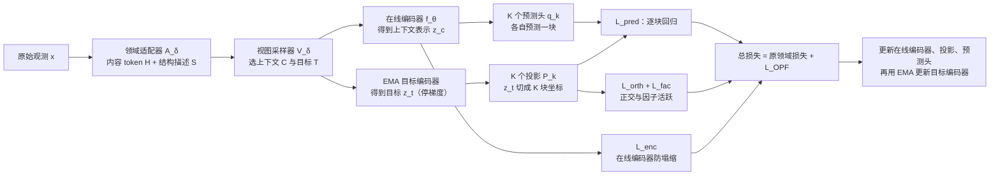

# JEPA-Anything：把预测目标切成正交的几块，一套核心跑 7 个领域

<!-- release-date: 2026-09-17 -->

> 本文依据 **JEPA-Anything: Learning Predictive Models across Different Worlds**，即 arXiv:2609.20800v1（2026-09-17），共 31 页。页码均指这份 PDF 的文件页码。作者 13 人，来自 PhAI Labs、香港中文大学（CUHK）、复旦、港城大、布里斯托、斯坦福、牛津、普林斯顿（PDF p. 31）；通讯作者 4 位，其中 1 位在 CUHK，3 位的邮箱在 PhAI Labs（PDF p. 1、p. 31）。这是一篇方法论文，不是基模报告：没有预训练语料、训练算力与模型家族可讲，它要回答的是「同一个潜空间预测原则，能不能在差异极大的系统上都好用」。全文把 3 件事分开写：**论文明确写了什么**（带页码）、**我们如何解释或验算它**（会写明）、**外部资料补充**（给链接并标注）。

## 读前先把几个词说成人话

这篇论文横跨视觉、单细胞、临床、控制、分子、偏微分方程和天气，名词很杂。但真正的新东西只有一个：把 JEPA 的「预测目标」用一组可学的正交基切成几块，每块配一个预测头。先把底层的几个词说清楚。

- **世界模型（world model）**：一个能「从已看到的，推断没看到的」的模型。论文取的是宽口径：从上下文构造一个潜在状态，用它去预测同一个系统的另一个状态（PDF p. 3）。这个「另一个状态」可以是未来一帧、图像里被遮住的一块、一次干预之后的结果，或者病人下一次就诊时的健康状态。
- **潜空间（latent space）**：模型内部的向量表示。在潜空间里预测，意思是不去还原每个像素或每个基因的读数，只预测它们的抽象表示。
- **JEPA（Joint-Embedding Predictive Architecture，联合嵌入预测架构）**：LeCun 一系提出的自监督框架。一个上下文编码器把看到的部分编码成向量，一个目标编码器把要预测的部分编码成向量，一个预测器从前者预测后者，损失算在表示空间而不是原始空间（PDF p. 3）。I-JEPA、V-JEPA 是它在图像与视频上的版本（PDF p. 23）。
- **EMA（Exponential Moving Average，指数滑动平均）目标编码器**：目标编码器不直接训练，而是把在线编码器的参数按滑动平均慢慢抄过来，并且不接收梯度（PDF p. 5，式 2）。这是 JEPA 防止两边一起「偷懒」塌到常数的标准做法之一。
- **塌缩（collapse）**：编码器把所有输入都映射成几乎同一个向量。这样预测永远准，但表示毫无用处。
- **单体目标（monolithic target）**：论文对标准 JEPA 的称呼。整个要预测的状态是一个向量，用一个预测器一口气预测。
- **正交（orthogonal）**：两个方向互相垂直，没有重叠。一组两两正交、长度为 1 的向量，就是一个「不走样」的坐标系：用它换坐标，距离和长度都不变。
- **条件数 $\kappa_2$**：矩阵最大奇异值除以最小奇异值。等于 1 说明这个坐标系各方向一样「结实」；很大说明有某个方向几乎被压扁，一点误差会被放大很多倍。
- **Rollout（自回归推演）**：模型预测下一步，再把预测结果当输入去预测再下一步。误差会一步步累积。

本文的主角是 2 个新词：

- **OPF（Orthogonal Predictive Factorization，正交预测分解）**：把目标向量投影到 $K$ 个互相正交的子空间上，每个子空间配一个专门的预测头，最后再拼回一个完整状态。
- **因子（factor）**：上面那 $K$ 个子空间中的一个，以及它对应的预测分支。论文强调因子的「身份」不是预先指定的（比如「位置」「颜色」），而是在预测训练中自己长出来的（PDF p. 4、p. 6）。

JEPA 的视频版与规划用法见 V-JEPA-2 一篇；在冻结视觉特征上做世界模型见 DINO-WM 一篇；给 JEPA 一个可证明防塌缩目标的思路见 LeJEPA 一篇；潜空间世界模型在控制上的经典路线见 DreamerV3 一篇。它们在本文里都是背景，不是对照实验。

## 一句话先说清

标准 JEPA 把「要预测的世界状态」压成一个向量，用一个预测器去拟合。当这个状态里同时混着局部与全局、多个实体、不同尺度的变化时，容易预测或方差大的那部分会主导优化，几个方向可能在做同一件事，较弱的结构则收到互相冲突的梯度（PDF p. 3）。

JEPA-Anything 的回答是：**别让一个预测器扛全部**。用一组可学习的投影矩阵 $P_1, \dots, P_K$ 把目标切成 $K$ 块正交的坐标，每块配一个预测头；训练时额外约束这些块互相正交、每块都保持活跃、在线编码器不塌缩；推理时把各块的预测用伪逆拼回完整状态（PDF p. 6–8）。

这层 OPF 被设计成一个**加法插件**：每个领域原来用什么损失照旧用，再加上 OPF 损失（PDF p. 8，式 10）。领域之间换的是适配器、编码器和采样方式，OPF 核心不变（PDF p. 6，Table 1）。

论文给出的主要结果（PDF p. 1）：

- 10 个配对的动力学任务上，相对同配置的标准 JEPA，所有报告指标都变好；
- CITRIS Interventional Pong 上单一干预的一步预测误差降 34.8%；
- 4 个分子体系上，一步误差和 100 步推演误差在所比较的方法里都最低；
- 用学到的因子坐标提名了一个肿瘤免疫干预组合（IL-18 加 CD73 阻断），在共培养、类器官、肿瘤碎片和小鼠上得到实验支持；
- 在模拟轨道数据上，潜在频谱模式恢复了开普勒标度，拟合斜率 −1.4991。

读之前要先知道一件事：大部分提升幅度不大。视觉、单细胞、临床三项都是小数点后两三位的差别，连续控制 3 个环境里 1 个反而变差（PDF p. 19）。这篇论文真正站得住的，是「正交约束让多头预测变成一个数值稳定、可以拆开看的坐标系」这一点；「跨 7 个领域普遍更好」是证据强度参差不齐的一揽子结果。后文会逐项标清楚。

### 一条阅读路线

1. **p. 3 最后一段与 p. 2 的 Figure 1 上半幅**：单体目标的 3 个毛病，和 OPF 的结构图。
2. **p. 5–6 式 (1)–(5) 与 Table 1**：统一接口，以及投影、分头预测、伪逆合成。
3. **p. 7–8 式 (6)–(10)、命题 1、推论 1**：4 项损失，以及「正交为什么保证稳定合成」。
4. **p. 9 第 2.4 节**：训练完之后，状态有 3 种用法。
5. **p. 15–16 的 Table 5**：正交与不加约束的多头，几何上差多少。这是全文最硬的一张表。
6. **p. 17–18 的 Figure 5、Table 6–8**：10 个动力学任务与长推演。
7. **p. 19–20 的 Figure 6–7**：连续控制，以及「遮掉一个因子」的功能性实验。
8. **p. 21–23**：分子推演、湿实验、开普勒定律。
9. **p. 29–30 附录**：近似正交时的误差界，以及全部 OPF 系数。

## 主要矛盾：一个目标向量，装不下好几种预测

### 为什么要在潜空间里预测

论文先交代它为什么选 JEPA 而不是重建（PDF p. 3）。在原始空间重建会把力气花在高方差但对下游没什么用的方向上，比如纹理、噪声、单细胞里的技术性丢失（dropout）。在潜空间预测，由目标编码器决定「预测到多抽象的层级」，模型就能专注在可预测、可共享的结构上。

这一点是 JEPA 一系的共识，不是本文的贡献。本文的出发点在下一步。

### 单体目标的 3 个毛病

标准 JEPA 用一个目标向量、一条预测通路表示整个待预测状态。论文说，当局部与全局结构、多个实体、不同尺度的变化共享这个单体目标时（PDF p. 3）：

1. **容易预测或方差大的结构主导优化**。损失是整体平方误差，大头说了算。
2. **几个潜在方向可能扮演相似的角色**。容量被重复占用。
3. **较弱的预测结构收到互相冲突的梯度**。一个预测器同时要照顾几种性质不同的变化。

由此论文把问题重新表述为「预测容量的分配问题」：接口保持不变，但状态可以被组织成几个互补的分量（PDF p. 3）。它把全文的问题写成一句（PDF p. 4）：

> 一个潜空间世界模型接口，能不能用多个因子，把许多「上下文到目标」系统里结构各异的预测状态组织起来？

**我们如何解释它。** 这 3 个毛病是论文的动机陈述，不是实验测出来的现象。论文没有给出「标准 JEPA 的梯度确实互相冲突」或「某些方向确实重复」的直接测量；Table 5 测的是 OPF 与不加约束的多头之间的几何差别，不是单体 JEPA 本身的病理。读的时候要把这一节当成假设，看后面的实验能不能支持它。

## 全景：适配器管各自的世界，OPF 管预测容量怎么分

原图左半边是标准 JEPA：上下文编码器、目标编码器、一个预测器、一个五颜六色混在一起的「单体目标嵌入」，底下标着 3 条问题：一个目标嵌入混着多种预测模式、容易或高方差的结构占主导、较弱的结构收到冲突梯度（PDF p. 2），与上一节的 3 个毛病大体对应。右半边是 JEPA-Anything：上下文表示分给 4 个预测头，各自输出 F1–F4，再叠成一个「完整潜在世界状态」（PDF p. 2）。注意原图没有画出投影矩阵 $P_k$ 作用在目标表示上的那一步，目标表示的箭头停在半空。实际的训练目标是目标表示的投影，下一节细讲。

把训练循环按论文第 2.4 节的 6 步重画（PDF p. 9）：

这张图按 PDF p. 5–9 的公式与第 2.4 节步骤重画，是流程示意，不是论文原图。

哪些随领域变、哪些不变，论文用 Table 1 划了边界（PDF p. 6）：

| 组件 | 随领域变的部分 | JEPA-Anything 共享核心 |
|---|---|---|
| 原始表示 | 图像、序列、图、集合、记录 | — |
| Token 化与结构描述 | 适配器 $\mathcal{A}_\delta$ | 统一 token 接口 |
| 上下文与目标的语义 | 视图采样器 $\mathcal{V}_\delta$ | 用上下文预测目标 |
| 编码器架构 | ViT、Transformer、GNN、MLP 等 | 在线编码器加 EMA 目标编码器 |
| 预测学习 | — | 分因子预测头与状态合成 |
| 正则 | — | 正交、因子活跃、编码器方差 |
| 训练目标 | 原有损失 $\mathcal{L}^{(\delta)}_{\mathrm{base}}$ | 式 (10) 的加法 OPF 损失 |
| 下游用法 | 池化、读出、探针、解码器、规划器 | 在线编码器特征，或合成的预测状态 |

所以「Anything」的意思不是一个大模型吃所有模态，而是**一套训练原则套在各领域自己的模型上**。每个领域用的仍然是各自的骨干：视觉是 DINOv3 ViT-S 与 SigLIP2 Base，单细胞是 scGPT，临床是 GPT-2 small，分子是 TrajCast 风格的 $O(3)$ 等变网络，APEBench 与 Burgers 长推演是 MLP，CausalWorld、DMC、PDEBench、WeatherBench2 则用「配对的任务专用编码器与转移网络」（PDF p. 11，Table 2）。论文没有训练一个跨领域共享参数的模型。

## 核心设计一：正交预测分解，把目标切成 K 块再分头预测

### 旧问题：一个预测器要同时学好几种变化

上一节说过，单体目标把所有可预测的结构塞进一个向量，由一个预测器负责。论文的判断是：不同性质的结构抢同一份预测容量，强的压住弱的。

### 新设计：可学的投影把目标切块，每块一个预测头

**第一步，切目标。** 引入 $K$ 个可学习的投影矩阵 $P_k \in \mathbb{R}^{d\times r}$，并取 $Kr = d$（PDF p. 6）。先对目标编码器的输出停梯度，再投影：

$$
\tilde{z}_t = \mathrm{sg}(z_t),
\qquad
z_t^{(k)} = P_k^{\top}\,\tilde{z}_t,
\quad k = 1,\dots,K
$$

$\mathrm{sg}$ 是停梯度（stop-gradient）。停的只是目标编码器的输出；投影矩阵 $P_k$ 本身是可训练的，接收来自预测、正交和因子活跃这 3 项的梯度（PDF p. 6）。所以「切法」本身也是学出来的。

**第二步，分头预测。** 每个因子有一个自己的预测器 $q_k$，从共享的上下文表示 $z_c$（以及需要时的目标描述 $s_t$，比如被遮住的是哪个位置）预测这一块（PDF p. 6，式 4）：

$$
\hat{z}_t^{(k)} = q_k(z_c,\, s_t)
$$

这些预测头可以完全独立，也可以共用一段主干、只在末端分叉（PDF p. 6）。

**第三步，拼回完整状态。** 把 $K$ 块预测首尾相接得到 $\hat{u}_t \in \mathbb{R}^d$，再用分析矩阵 $P^\top$ 的 Moore–Penrose 伪逆合成回完整状态（PDF p. 6，式 5）：

$$
\hat{z}_t = (P^{\top})^{\dagger}\,\hat{u}_t,
\qquad
P = [P_1,\dots,P_K]
$$

当 $P$ 严格正交时，伪逆就是 $P$ 本身，合成退化成把每块按自己的基「放回去」再相加：$\hat{z}_t = \sum_k P_k \hat{z}_t^{(k)}$（PDF p. 6）。

**第四步，逐块回归。** 预测损失是每块预测与每块目标之间的平方误差，按 $K|T|r$ 归一化（PDF p. 7，式 6）：

$$
\mathcal{L}_{\mathrm{pred}}
=
\frac{1}{K|T|r}
\sum_{t\in T}\sum_{k=1}^{K}
\bigl\|\hat{z}_t^{(k)} - z_t^{(k)}\bigr\|_2^2
$$

论文特意说明用的是直接回归而不是余弦之类只看方向的损失，因为合成完整状态既需要方向也需要幅度（PDF p. 7）。

### 用在时间序列上：一步转移就是一次「分头预测再合成」

对于带时间、动作或干预的任务，记 $\xi_t$ 为第 $t$ 步的外部输入（动作、干预标签或已知强迫项）。适配器把它放进上下文或目标描述里。当前状态由潜向量 $z_t$ 概括时，一步转移写成（PDF p. 6）：

$$
\hat{u}_{t+1} = \bigl[q_1(z_t,\xi_t,s_{t+1});\,\dots;\,q_K(z_t,\xi_t,s_{t+1})\bigr],
\qquad
\hat{z}_{t+1} = (P^{\top})^{\dagger}\hat{u}_{t+1}
$$

反复套用就是潜空间推演；规划器再用已知的领域奖励或一个奖励读出头给轨迹打分（PDF p. 7）。分工是：OPF 负责给出预测状态，应用负责给出奖励。

### 我们如何解释它：严格正交时，预测损失和单体 MSE 是同一个数

这一段是我们的推导，论文没有这样写。

当 $P$ 严格正交时，命题 1 给出 $\|P^\top z\|^2 = \|z\|^2$（PDF p. 7，式 8）。把它套在「预测减目标」上：

$$
\sum_{k=1}^{K}\bigl\|\hat{z}^{(k)} - z^{(k)}\bigr\|^2
=
\bigl\|\hat{u} - P^\top z\bigr\|^2
=
\bigl\|P\hat{u} - z\bigr\|^2
=
\bigl\|\hat{z} - z\bigr\|^2
$$

也就是说，**在正交极限下，逐块损失之和就等于合成状态与目标之间的整体平方误差**。只看损失值，OPF 和一个「单体目标 + MSE」没有区别，差的只是一个正交换基。两个前提要记住：这只在严格正交时成立，实际训练出的 $P$ 只是近似正交；论文也没有写明对照组单体预测项的具体形式（PDF p. 10），它是否就是 MSE 并不确定。

那 OPF 相对单体 JEPA 的差别到底来自哪里？按这条推导，只剩 3 个来源：

1. **结构**：$K$ 个预测头分别负责一块，而不是一个头负责整个向量。这改变的是参数化方式和梯度的流向，不是目标函数。
2. **可学的基**：$P$ 在训练中被推着去找「好预测」的切法，而不是固定坐标轴。
3. **额外的正则**：因子活跃项与在线编码器方差项（下文核心设计三）。尤其后者直接作用在编码器上，是一个类似 VICReg 的防塌缩力，而对照组的标准 JEPA 并没有这一项（PDF p. 10）。

这个拆法决定了读实验时要问的问题：提升里有多少来自「分头」，有多少来自「编码器多了一个方差正则」？论文没有给出把这两者分开的任务级消融，后文「读完要留下的判断」会再说。

### 可迁移启发

多头预测不等于分解。**如果几个头预测的是同一个向量的不同「视角」，而这些视角之间没有约束，头与头之间就会重复**，合成回来还可能数值不稳（下一节）。想要真正的分工，要么固定一组正交基，要么像这里一样让基可学、再加正交罚。另外，做自己的对照时要把「分头」与「额外正则」拆开，否则说不清收益来自哪里。

## 核心设计二：正交约束为什么是必需的，不是装饰

### 旧问题：几个投影可能学到同一批方向

投影矩阵都是可学的，没有约束时，几个 $P_k$ 完全可能学到相同或几乎相同的目标方向（PDF p. 7）。这时候「分成 $K$ 块」只是名义上的。

### 新设计：块内正交、块间正交

正交损失有两项（PDF p. 7，式 7）：

$$
\mathcal{L}_{\mathrm{orth}}
=
\sum_{k=1}^{K}\bigl\|P_k^{\top}P_k - I_r\bigr\|_F^2
+
\sum_{1\le i<j\le K}\bigl\|P_i^{\top}P_j\bigr\|_F^2
$$

第一项要求每个投影内部的 $r$ 列近似正交归一，避免一块里的基退化；第二项要求不同投影张成的子空间彼此近似正交，避免几块重复编码同一方向（PDF p. 7）。

论文说这与自监督里的冗余消减（Barlow Twins、VICReg）精神相近，区别在于：那些方法约束的是单个嵌入各维的统计量，这里约束的是可学目标子空间的基（PDF p. 7）。

还有一个细节：论文里的预测模型用的是「带正交罚的可学投影 + 伪逆合成」；只有在控制几何分析时，才把拼好的基做一次 QR 分解，得到严格正交的 $Q$ 并用转置合成（PDF p. 7）。也就是说，训练出来的 $P$ 只是**近似**正交。

### 工作机制：两个命题说清「正交」买到了什么

**命题 1（正交预测分解）。** 若块间正交、块内正交归一，且 $Kr = d$，则 $P$ 是 $d\times d$ 的正交矩阵，各因子空间构成正交直和；对任意 $z$，各块投影长度的平方和等于 $z$ 的长度平方，并且 $z = \sum_k P_k P_k^\top z$ 可以精确还原（PDF p. 7，式 8）。人话：切成 $K$ 块之后信息一点不丢，只是换了个坐标系。

**推论 1（稳定合成对比无约束多头）。** 在命题 1 的条件下，若预测出的因子坐标带误差 $e$，合成出的状态误差长度恰好等于 $\|e\|$，条件数 $\kappa_2(P) = 1$（PDF p. 8）。反过来，没有块间正交约束时，存在方向重复导致 $P$ 秩亏的情形（无法完整还原），也存在方向几乎重复导致 $\kappa_2(P)$ 任意大的情形（误差被任意放大）。所以无约束的多头既不保证完整还原，也不保证稳定合成（PDF p. 8）。

**命题 2（近似正交时的稳定性，附录 A）。** 实际训练只能做到近似正交。若 $\|P^\top P - I_d\|_2 \le \epsilon < 1$，则每个奇异值都落在 $\sqrt{1-\epsilon}$ 到 $\sqrt{1+\epsilon}$ 之间，条件数不超过 $\sqrt{(1+\epsilon)/(1-\epsilon)}$，$P$ 可逆（PDF p. 29，式 12）。此时伪逆合成对精确的因子坐标没有还原偏差，对预测误差的放大不超过 $1/\sqrt{1-\epsilon}$ 倍（PDF p. 29，式 13）。人话：正交罚压得越低，误差放大越接近 1。

### 实测：Table 5 的几何审计

这是全文对「正交有没有用」最直接的一组数字。设置是 CITRIS Interventional Pong，同一份官方数据、5 个训练种子、2,500 步训练预算，把 OPF 与一个**容量相同但不加正交约束的多头**对比（PDF p. 15）。

| 指标 | 无约束多头 | 正交分解 |
|---|---:|---:|
| 因子间子空间重叠（越低越好） | 0.4550 ± 0.0420 | $(5.18 \pm 0.34)\times 10^{-16}$ |
| 最小奇异值 $\sigma_{\min}(P)$（越高越好） | 0.00513 ± 0.00233 | 0.999989 ± 0.000003 |
| 条件数 $\kappa_2(P)$（越低越好） | 438.52 ± 170.00 | 1.00005 ± 0.000004 |
| 转置合成 NMSE，用精确因子（越低越好） | 0.7886 ± 0.0299 | $(2.98 \pm 0.11)\times 10^{-14}$ |

表格数字引自原文 Table 5（PDF p. 16），均为 5 个配对种子的均值 ± 样本标准差。

4 个指标各测一件事（PDF p. 16）：重叠测因子子空间之间的冗余；$\sigma_{\min}$ 测覆盖得最弱的那个状态方向；$\kappa_2$ 测坐标系对误差的敏感度；合成 NMSE 用精确坐标 $u = P^\top z$ 做转置合成 $Pu$，它和预测器好不好无关，只看坐标系本身。

**我们如何解释它。** 无约束多头的条件数约 439（PDF p. 16），意思是某个方向上的一点预测误差，合成回来可能被放大几百倍；它的转置合成 NMSE 约 0.79，意思是用转置去合成几乎还原不出原状态。正交版本在这 4 项上都贴着理论值（重叠与 NMSE 到了浮点精度的量级）。这组数字**只证明几何性质**：正交罚确实把坐标系压成了一个自对偶、单位条件数的坐标系。它没有回答「这个更好的坐标系让任务指标好了多少」——Table 5 没有报告两者的预测误差。

### 可迁移启发

凡是「多个头各预测一部分、最后再合起来」的设计（多头蒸馏、分块量化码本、多个专家各出一段表示），都值得先查一下合成矩阵的条件数。**条件数大，就说明合成这一步会把某些头的小误差放大很多倍**，而这在训练损失上可能完全看不出来。块内加块间的正交罚写起来只有几行，而且论文附录给了近似正交时的误差界，可以直接拿来设监控阈值。

## 核心设计三：两个活跃度下限，防止因子「睡着」和编码器塌缩

### 旧问题：正交只管方向，不管有没有在用

正交约束规定了子空间之间的关系，但不保证每个子空间都有信息。某一块的投影坐标完全可以在所有样本上几乎不变，这时它是「死因子」。编码器本身也可能塌缩。

### 新设计：因子活跃项与编码器方差项

在一个小批次里，对所有采样到的目标位置，算每个因子坐标 $j$ 的经验标准差 $\sigma^{\mathrm{fac}}_{k,j}$；对在线上下文表示，算每一维的经验标准差 $\sigma^{\mathrm{enc}}_j$（token 形式的上下文就对批次里所有有效 token 统计）。标准差按 $\sqrt{\mathrm{Var}+\epsilon}$ 算（PDF p. 8）。两项损失都是「低于下限才罚」的铰链形式（PDF p. 8，式 9）：

$$
\mathcal{L}_{\mathrm{fac}} = \frac{1}{Kr}\sum_{k=1}^{K}\sum_{j=1}^{r}\max\bigl(0,\ \gamma_{\mathrm{fac}} - \sigma^{\mathrm{fac}}_{k,j}\bigr),
\qquad
\mathcal{L}_{\mathrm{enc}} = \frac{1}{d}\sum_{j=1}^{d}\max\bigl(0,\ \gamma_{\mathrm{enc}} - \sigma^{\mathrm{enc}}_{j}\bigr)
$$

因为目标表示已经停梯度，$\mathcal{L}_{\mathrm{fac}}$ 的梯度只会去塑造投影 $P_k$，让投影坐标在样本之间保持起伏；$\mathcal{L}_{\mathrm{enc}}$ 则直接给在线编码器一个防塌缩的梯度（PDF p. 8）。

### 总损失：一个加在原损失上的插件

4 项合成 OPF 损失，再加到该领域原本就在用的损失上（PDF p. 8，式 10）：

$$
\mathcal{L}_{\mathrm{OPF}} = \mathcal{L}_{\mathrm{pred}} + \lambda_{\mathrm{orth}}\mathcal{L}_{\mathrm{orth}} + \lambda_{\mathrm{fac}}\mathcal{L}_{\mathrm{fac}} + \lambda_{\mathrm{enc}}\mathcal{L}_{\mathrm{enc}},
\qquad
\mathcal{L}^{(\delta)}_{\mathrm{train}} = \mathcal{L}^{(\delta)}_{\mathrm{base}} + \mathcal{L}_{\mathrm{OPF}}
$$

附录 Table 10 给了列出实验的维度与 3 个系数（PDF p. 30）：

| 实验 | $d$ | $K$ | $r$ | $\lambda_{\mathrm{orth}}$ | $\lambda_{\mathrm{fac}}$ | $\lambda_{\mathrm{enc}}$ |
|---|---:|---:|---:|---:|---:|---:|
| CITRIS Interventional Pong | 160 | 5 | 32 | 0.10 | 0.05 | 0.02 |
| CausalWorld、DMC、DMC-VB、PDEBench 3 项、合成 PDE、合成像素动力学、WeatherBench2、APEBench | 128 | 4 | 32 | 0.10 | 0.05 | 0.02 |
| Hopper-v5、Walker2d-v5、HalfCheetah-v5（20 步） | 32 | 4 | 8 | 0.02 | 0.10 | 0.02 |

原表逐行列出 14 个实验，这里把系数完全相同的行合并了。视觉、单细胞、临床、分子 4 组实验不在 Table 10 里，它们的系数原文没有给出。

**我们如何解释它。** 系数几乎全局一套：动力学类统一 0.10 / 0.05 / 0.02，运动控制把正交罚降到 0.02、把因子活跃罚提到 0.10。这支持「OPF 不需要逐任务精调」的说法。但下限 $\gamma_{\mathrm{fac}}$、$\gamma_{\mathrm{enc}}$、EMA 动量 $m$、数值稳定项 $\epsilon$ 的取值，正文与附录都没有给出；想复现得去代码仓库找。

### 可迁移启发

「方差下限」这一招和 VICReg 的方差项是同一个东西，拿来防塌缩很便宜。值得学的是它**分了两个对象**：一个压在投影坐标上，保证每个因子都在用；一个压在编码器输出上，保证表示本身不塌。自己做多分支结构时，「有没有死分支」和「主干有没有塌」是两件要分开监控的事。

## 训练完之后：同一个状态的 3 种用法

所有实例共享同一个 6 步训练循环：适配观测、采样上下文与目标、在线编码与 EMA 编码、预测全部正交因子、用「原损失 + OPF」更新在线编码器与投影与预测头、EMA 更新目标编码器（PDF p. 9）。训练完之后分 3 种用法（PDF p. 9）：

| 模式 | 保留什么 | 丢掉什么 | 用在哪 |
|---|---|---|---|
| 表示模式 | 在线编码器 | EMA 目标编码器、投影、预测头 | 分类、聚类、探针等一次性读出 |
| 世界模型模式 | 投影与预测头 | — | 未来状态预测、干预预测、规划、自回归推演，用式 (5) 合成下一个完整潜状态 |
| 因子分析模式 | 投影 $P_k$，作为诊断接口 | — | 计算因子坐标 $u_k(x) = P_k^\top z_\delta(x)$，拿去做领域分析 |

**我们如何解释它。** 表示模式把 OPF 当成一种「训练时的正则」：部署时根本不用它，编码器被它塑造过就够了。这意味着在第一组实验（视觉、单细胞）里，OPF 的作用完全是间接的。世界模型模式才是 OPF 结构本身被用上的地方。因子分析模式最有野心，也最难验证——因子没有预设语义，拿坐标做科学分析时，解释只能事后给。

## 实验怎么证明

### 统一的对照口径

论文把实验分成 3 组，对应上面的 3 种用法（PDF p. 9–10）：

- **第一组 终端读出**：视觉与单细胞读在线编码器状态；临床读一步合成出的未来状态。读完即结束。
- **第二组 潜空间世界动力学**：预测出的状态被规划器反复用，或者被喂回去自回归推演，表示误差会变成动力学误差。
- **第三组 科学分析**：保留因子坐标，拿去提名生物学干预、或者对照已知物理定律。

第一、二组里和标准 JEPA 的直接对比，固定了适配器、编码器架构、上下文与目标采样器、优化预算、数据划分、下游读出和继承下来的原损失；标准 JEPA 加它的单体预测项，JEPA-Anything 加 $\mathcal{L}_{\mathrm{OPF}}$，**包括因子相关的正则项**（PDF p. 10）。其他领域基线只用来给出该任务的指标量级。

各领域的实例化汇总在 Table 2（PDF p. 11），挑与后文相关的几列：

| 组 / 领域 | 上下文 → 目标 | 骨干 | OPF 设定（$d$；$K\times r$） | 种子与指标 |
|---|---|---|---|---|
| I / 视觉，MuJoCo 受控场景 | 可见块 → 被遮块的状态 | DINOv3 ViT-S；SigLIP2 Base | 384；4×96。768；4×192 | 10 个种子；INJ、Coll.、Rec. |
| I / 单细胞，肾脏、PBMC-10K、Adamson、Norman | 遮蔽表达 → 完整细胞状态；Norman 预测扰动响应 | scGPT | Norman：512；4×128 | 5 个种子；AvgBIO、Pearson |
| I / 临床，纵向多模态队列 | 病史 → 未来病人状态 | GPT-2 small 加风险解码器 | 768；4×192 | 5 个种子；超过 1,000 种事件；PRAUC |
| II / 干预，CITRIS Interventional Pong | 观测 + 干预 → 下一状态 | 配对的编码器与预测器 | 160；5×32 | 5 个配对种子；4 通道 MSE |
| II / 动力学，CausalWorld、DMC、PDEBench、WeatherBench2 | 状态、帧、动作或强迫项 → 下一状态或场 | 配对的任务专用编码器与转移网络 | 128；4×32 | 5 个种子；MSE 与回报 |
| II / 长推演，1 维粘性 Burgers，64 个格点 | 当前场 → 自回归未来场 | MLP，隐层宽 256 | 128；4×32 | 3 个种子；H20 / H50 |
| II / 运动控制，Hopper、Walker2d、HalfCheetah | 状态 + 动作 → 未来状态 | 潜空间动力学加 CEM 规划器 | 32；4×8 | 5 个种子；回报、$R^2$、MSE |
| II / 分子，水、石英、对乙酰氨基酚、苯 | 原子状态 → 未来分子状态 | TrajCast 风格 $O(3)$ 等变网络 | 64；4×16（通道） | 5 个种子；100 步推演；MAE、RMSD |
| III / 生物，Huh7–PBMC、类器官、肿瘤碎片、小鼠 | 因子坐标 → 候选干预 | 因子分析接口 | 保留的 $P_k$ | 3 个类器官与 3 个碎片加外部小鼠验证 |
| III / 轨道，模拟位置–速度轨迹 | 因子坐标 → 潜在频谱模式 | 轨迹编码加频谱分析 | 保留的 $P_k$ | 1 次分析运行；斜率与 $R^2$ |

几乎所有实例都用 $K = 4$；只有 CITRIS 用 $K = 5$（PDF p. 11）。

### 第一组：终端读出

#### 受控视觉绑定：同一个读出，编码器换了预训练方式

问题是：一个冻结的表示，能不能同时保住「变化发生在哪」和「发生了什么操作」，包括读出训练时没见过的「位置 × 操作」组合（PDF p. 12）。

做法：对 DINOv3 ViT-S（$d = 384$）和 SigLIP2 Base（$d = 768$），标准 JEPA 与 JEPA-Anything 从同一个检查点出发，用块状遮蔽的 patch 预测继续训练，带二维位置描述；两者共享数据、遮罩、优化设置和读出架构，唯一差别是单体目标还是正交分解目标（PDF p. 12）。之后冻结编码器。对每张源图和它的受控干预版本，用 patch token 的差构成一个「变化场」，在 MuJoCo 重建场景上评测（PDF p. 12）。

「已知网格」与「学出网格」是下游结构化读出的两种监督条件：前者直接给出位置与操作的分类体系，后者从扁平的格子标签里估计它（PDF p. 12）。3 个指标：单射的留出格准确率（INJ，越高越好）、阈值 0.5 下的塌缩率（Coll.，越低越好）、网格恢复率（Rec.，越高越好），10 个种子平均（PDF p. 12）。

| 骨干 | 编码器预训练 | 网格监督 | INJ ↑ | Coll. ↓ | Rec. ↑ |
|---|---|---|---:|---:|---:|
| DINOv3 | 冻结原检查点 | 已知网格 | 0.452 | 0.667 | — |
| DINOv3 | 冻结原检查点 | 学出网格 | 0.569 | 0.433 | 0.643 |
| DINOv3 | 标准 JEPA | 学出网格 | 0.572 | 0.426 | 0.645 |
| DINOv3 | JEPA-Anything | 学出网格 | 0.581 | 0.417 | 0.659 |
| SigLIP2 | 冻结原检查点 | 已知网格 | 0.476 | 0.656 | — |
| SigLIP2 | 冻结原检查点 | 学出网格 | 0.484 | 0.511 | 0.676 |
| SigLIP2 | 标准 JEPA | 学出网格 | 0.483 | 0.514 | 0.679 |
| SigLIP2 | JEPA-Anything | 学出网格 | 0.490 | 0.503 | 0.688 |

表格数字引自原文 Table 3（PDF p. 12）。

论文的结论是：读出固定为学出网格时，两个骨干上 JEPA-Anything 都提高了 INJ 与网格恢复、降低了塌缩（PDF p. 12）。

**我们如何解释它。** 方向一致，幅度很小：DINOv3 上 INJ 比标准 JEPA 高 0.009，SigLIP2 上高 0.007。表里没有标准差，10 个种子的波动有多大无从判断。另一个值得注意的现象是：标准 JEPA 继续预训练几乎没带来变化（SigLIP2 上 INJ 甚至从 0.484 掉到 0.483），所以 JEPA-Anything 的增量可以看成「在一个本来没什么可挖的设定上挖出了一点」。

#### 单细胞：表示与扰动响应

单细胞 RNA 测序的每个细胞是一个维度极高但极稀疏的表达谱，基因级重建容易把容量花在技术性丢失与计数波动上（PDF p. 13）。沿用 Cell-JEPA 的做法：按基因身份与离散化的表达值做 token，用 scGPT 骨干；学生编码器看遮蔽后的表达，预测 EMA 教师从未遮蔽细胞得到的细胞级嵌入（PDF p. 13）。Norman 扰动实验预测潜空间响应 $z_{\mathrm{response}} = z_{\mathrm{observed}} - z_{\mathrm{control}}$，这个 512 维响应表示用 $K = 4$、$r = 128$（PDF p. 13）。在约 800,000 个人类肾脏细胞上预训练，在 PBMC-10K 上评测细胞类型聚类（微调与零样本），在 Adamson 与 Norman 上评测扰动响应，5 个种子平均（PDF p. 13）。

| 模型 | 用 JEPA | 用正交因子 | PBMC 微调 AvgBIO ↑ | PBMC 零样本 AvgBIO ↑ | Norman Pearson ↑ | Adamson Pearson ↑ |
|---|---|---|---:|---:|---:|---:|
| scGPT | 否 | 否 | 0.7531 | 0.5288 | 0.631 | 0.905 |
| Cell-JEPA | 是 | 否 | 0.7830 | 0.7194 | 0.787 | 0.937 |
| JEPA-Anything | 是 | 是 | 0.8301 | 0.7752 | 0.814 | 0.942 |

表格数字引自原文 Table 4（PDF p. 13）。Pearson 算在扰动后的绝对表达上。

**我们如何解释它。** 这是第一组里幅度最大的一项：零样本 AvgBIO 从 0.7194 到 0.7752。但要注意对照组的差别：Cell-JEPA 是「单体潜空间损失 + 遮蔽基因重建」（PDF p. 13），不是一个纯的单体 JEPA；而 JEPA-Anything 在扰动实验里走的是「编码器 → 因子预测头 → 门控 → 潜空间响应残差 → 表达解码器」这条路径（PDF p. 13）。这里出现的「门控」在方法一节没有定义，两者的差别不只是 OPF 那一层。表里没有标准差。

#### 纵向临床预测：超过 1,000 种未来事件

纵向健康记录稀疏、时间不规则，只部分观察到驱动疾病进展的生理状态（PDF p. 13）。每个病人状态由按时间排列的临床事件、人口学背景和分子或生化变量组成；上下文编码器与 EMA 目标副本用 GPT-2 small 架构，$d = 768$，前者表示历史、后者表示未来状态；$K = 4$、$r = 192$（PDF p. 13–14）。JEPA-Anything 预测正交因子，用式 (5) 合成完整未来状态，再由一个共享的轻量解码器输出超过 1,000 种未来临床事件的风险（PDF p. 14）。数据是经去标识的 UK Biobank（PDF p. 30）。主指标是全事件词表上的平均 PRAUC（精确率–召回率曲线下面积），因为很多结局很罕见（PDF p. 14）。

| 方法 | 平均 PRAUC |
|---|---:|
| JEPA-Anything | 0.718 |
| 标准 JEPA | 0.711 |
| Cross-attention fusion | 0.702 |
| Delphi | 0.689 |
| Prophet | 0.680 |
| XGBoost | 0.667 |
| Qwen3-0.8B | 0.651 |
| Qwen2.5-0.5B | 0.648 |
| Random Forest | 0.602 |

数字读自原文 Figure 3（PDF p. 14），同一队列划分与事件词表，越高越好。

**我们如何解释它。** 相对标准 JEPA 高 0.007。更大的差距在「JEPA 类」与其他方法之间：标准 JEPA 本身已经比 Delphi 高 0.022。基线的实现细节（Qwen 小模型怎么接进来、Delphi 用的哪一版）原文没有交代。

### 第二组：潜空间世界动力学

这一组才是 OPF 结构本身被用上的地方：预测状态要被反复使用，误差会累积（PDF p. 14）。

#### CITRIS 干预预测：见过的单一干预与没见过的组合干预

CITRIS Interventional Pong 是一个基于简化版 Pong 的受控动力学环境；每条序列除了记录游戏状态怎么演化，还标出了两次观测之间哪些底层因子被外部改动过（PDF p. 14）。这里的「干预」不是模型选择的动作：实验者改动系统的一个或几个因子，模型拿到干预前的观测和一个「改了什么」的标签，去预测结果（PDF p. 14）。

两档泛化（PDF p. 15）：

- **单一干预**：训练分布里见过这种干预。
- **组合干预**：几个因子一起被改，这个组合在训练里被扣掉了，虽然每种单独的改动都见过。它问的是模型只是背下了整套干预模式，还是能把学到的「状态变化规则」重新组合。

另外还测 6 步自由推演。标准 JEPA（稠密单体）与 JEPA-Anything 用同样的数据、模型预算和 5 个固定种子（PDF p. 15）。

| 设定 | 标准 JEPA | JEPA-Anything | 相对降幅 |
|---|---:|---:|---:|
| 单一干预，一步 | 0.009541 | 0.006218 | 34.83% |
| 组合干预，一步 | 0.009441 | 0.008223 | 12.90% |
| 6 步自由推演 | 0.009478 | 0.008665 | 8.58% |

数字引自原文第 3.3.1 节正文与 Figure 4（PDF p. 15），均为 5 个配对种子的 4 通道 MSE 均值。

**我们如何解释它。** 摘要里的 34.8% 来自最容易的那一档。真正考「组合泛化」的组合干预降了 12.90%，6 步推演降 8.58%。这个梯度方向符合直觉：分解最能帮到的是「分布内、单一因子」的情形。Figure 4 只画了均值，没有误差棒，也没有逐种子结果。

#### 10 个配对动力学任务

这个基准测世界模型的两种能力（PDF p. 16）：从有限轨迹学完之后，能不能在没见过的初始条件、留出的片段或更晚的时间段上预测（分布外）；以及连续推演 6 步时，误差是否累积得更慢。任务来自 CausalWorld、DeepMind Control Suite（DMC）、PDEBench 与 WeatherBench2（PDF p. 16）。标准 JEPA 用一个共享潜目标，JEPA-Anything 分成 4 个因子；每个任务每个种子下两者共用数据、编码器与转移骨干、优化预算、评测划分和计算后端，种子为 11、23、37、53、71（PDF p. 16）。推演任务给真实的连续 6 步动作或目标序列，一步一步预测并逐步与真值比较；WeatherBench2 只用训练期统计量做归一化（PDF p. 16–17）。

左图 9 个预测任务的相对降幅，从大到小是：Burgers 39.7%、浅水方程 39.3%、CausalWorld 状态 20.6%、反应扩散 15.2%、WeatherBench2 10.5%、合成像素动力学 8.1%、DMC-VB 留出片段 7.5%、合成 PDE 3.6%、DMC 像素动力学 0.4%（读自 Figure 5a，PDF p. 17）。右图是第 10 个任务 CausalWorld 闭环控制：标准 JEPA 回报约 −0.087，JEPA-Anything 约 −0.055（读自 Figure 5b，PDF p. 17）。

**我们如何解释它。** 摘要说「10 个任务上所有报告指标都变好」（PDF p. 1），字面上成立，但成色不一。PDE 类（Burgers、浅水、反应扩散）的提升很大；DMC 像素动力学只有 0.4%；CausalWorld 控制的两条误差棒在图上大面积重叠，而且两者的回报都是负数。能下的结论是：**在偏微分方程这类「状态里天然有几种不同尺度模式」的系统上，分解的收益最明显**；在像素类任务上接近打平。

论文还挑了 4 个系统给出第 1 步与第 6 步的误差（PDF p. 17）：

| 任务 | 标准 JEPA 第 1 步 | 标准 JEPA 第 6 步 | JEPA-Anything 第 1 步 | JEPA-Anything 第 6 步 |
|---|---:|---:|---:|---:|
| CausalWorld 状态预测 | 0.01306 | 0.01307 | 0.01037 | 0.01079 |
| DMC 像素动力学 | 0.008539 | 0.008594 | 0.008498 | 0.008526 |
| PDEBench Burgers | 0.001830 | 0.006369 | 0.001101 | 0.004014 |
| PDEBench 浅水方程 | 0.007090 | 0.010510 | 0.003999 | 0.006522 |

表格数字引自原文 Table 6（PDF p. 17），均为 5 个种子均值。

**我们验算的一件事：「增长更慢」取决于怎么量。** 论文把「分解能否减缓重复预测中的误差增长」列为这组对比要检验的问题（PDF p. 16）。用上表的两个端点按两种口径算（我们的验算）：

| 任务 | 倍数：标准 JEPA | 倍数：JEPA-Anything | 增量：标准 JEPA | 增量：JEPA-Anything |
|---|---:|---:|---:|---:|
| CausalWorld 状态预测 | 1.00 | 1.04 | 0.00001 | 0.00042 |
| DMC 像素动力学 | 1.006 | 1.003 | 0.000055 | 0.000028 |
| PDEBench Burgers | 3.48 | 3.65 | 0.00454 | 0.00291 |
| PDEBench 浅水方程 | 1.48 | 1.63 | 0.00342 | 0.00252 |

倍数是「第 6 步误差 / 第 1 步误差」，增量是「第 6 步误差 − 第 1 步误差」，均由 Table 6 算出（PDF p. 17）。按倍数看，4 个系统里有 3 个是 JEPA-Anything 增长得更快；按绝对增量看，4 个里有 3 个是 JEPA-Anything 增长得更少。两种口径给出相反的结论，而且只有两个端点，看不到中间几步的曲线。所以这张表能稳稳支持的只是**每一步的绝对误差都更低**；「累积速度更慢」既没被它证明，也没被它否定。

#### APEBench：换一套归一化，再测 Burgers 与混沌的 KS 方程

APEBench 与 PDEBench 归一化方式不同，所以单独报告（PDF p. 17）。模型是第一层权重形状为 [256, 64] 的 MLP，$d = 128$、$K = 4$、$r = 32$（PDF p. 17）。

| 系统 | 指标 | 标准 JEPA | JEPA-Anything |
|---|---|---:|---:|
| Burgers | 留出晚段 MSE ↓ | 0.16621 ± 0.01740 | 0.08389 ± 0.01770 |
| Burgers | 6 步推演 MSE ↓ | 0.29186 ± 0.00682 | 0.16153 ± 0.03500 |
| Kuramoto–Sivashinsky | 留出晚段 MSE ↓ | 1.1012 ± 0.0763 | 0.9558 ± 0.0340 |

表格数字引自原文 Table 7（PDF p. 17）。

论文写：Burgers 在留出晚段上误差降约 49.5%，6 步推演降约 44.7%，每个种子都有改善；KS 晚段预测改善约 13.2%，同样每个种子都有改善（PDF p. 18）。KS 方程是经典的混沌系统，作者以此说明提升能延伸到混沌非线性动力学（PDF p. 18）。

#### Burgers 长推演：参数量对齐后推到 50 步

这一项专门对齐了参数量：1 维周期性粘性 Burgers，64 个格点，粘性系数 $\nu = 0.01$；输入维度 1024，MLP 隐层宽 256；$d = 128$ 分成 4 个宽 32 的因子，投影堆叠形状为 (4, 128, 32)；训练 2,000 步，3 个种子；评测分布内与高频分布外两种轨迹（PDF p. 18）。

| 划分 | 标准 JEPA H20 / H50 | JEPA-Anything H20 / H50 | 相对变化 |
|---|---|---|---|
| 分布内 | 1.1185 / 0.8181 | 1.0532 / 0.7923 | −5.84% / −3.15% |
| 高频分布外 | 1.0649 / 0.8452 | 1.0116 / 0.8214 | −5.01% / −2.82% |

表格数字引自原文 Table 8（PDF p. 18）。H20、H50 指推演第 20 步与第 50 步。

论文承认优势从 H20 到 H50 在收窄（PDF p. 18）。

**我们如何解释它。** 两点值得注意。第一，这一项的提升只有 3%–6%，远小于 APEBench Burgers 上的 40% 以上。但两者的数据（64 格点、$\nu = 0.01$ 的专门数据集对 APEBench 协议）、推演步数（20 / 50 步对 6 步）、种子数与归一化都不同，不能把差距单独归因于「对齐了参数量」；论文也没有讨论原因。第二，两边第 50 步的误差都低于第 20 步。论文没有解释；粘性 Burgers 方程的解会随时间耗散变平，误差的绝对值可能随之变小，但这是我们的推测，原文只说指标是 MSE（PDF p. 11），没有给归一化细节。

#### 因子到底有没有被用上

在 9 个有路由统计的预测任务上，JEPA-Anything 平均用到 4 个因子中的 3.782 个「有效因子」，主导因子的平均份额为 0.324（PDF p. 18）。4 个因子完全平均时份额是 0.25，所以 0.324 说明各分支分工比较分散，没有一个因子一家独大。「有效因子数」与「主导份额」怎么定义，原文没有写出公式。

#### 连续控制规划：3 个环境 1 个变差

在基于模型的控制里，智能体把学到的世界模型当内部模拟器用。每个决策点，CEM（交叉熵方法）规划器生成许多候选动作序列，用模型往前推，估计未来回报，执行得分最高那条的第一个动作（PDF p. 18）。小的潜空间预测误差会沿想象轨迹累积，让规划器把差的动作序列排在好的前面（PDF p. 18）。最终指标用真实环境里拿到的回报（PDF p. 18）。

环境是 Hopper-v5、Walker2d-v5、HalfCheetah-v5；稠密的、容量对齐的标准 JEPA 对比 $K = 4$ 的完整 JEPA-Anything；训练种子为 42、123、456、789、2026；每个检查点在 5 个相同的环境重置上评测，配对比较时 CEM 候选动作的随机性也被重置（PDF p. 19）。

论文为 $K$ 取 1、2、4、8 分别校准了分支宽度，相对稠密标准 JEPA 的训练参数差别分别是 0.000%、0.006%、0.126%、0.246%，预测头 FLOPs 差别分别是 0.000%、0.742%、0.992%、1.449%，参数差都在 0.3% 以内、FLOPs 差都在 2% 以内（PDF p. 19）。

读图：Hopper 为 −1.24，置信区间整体在 0 的左侧；Walker2d 为 +0.55，置信区间跨过 0；HalfCheetah 为 +10.26，置信区间大约从 4 到 16，整体在 0 的右侧（读自 Figure 6，PDF p. 19）。论文的表述是：Walker2d 与 HalfCheetah 上 JEPA-Anything 的平均 CEM 回报更高，Hopper 上标准 JEPA 更好，规划表现依赖环境（PDF p. 19）。

**我们如何解释它。** 按置信区间看，3 个环境里只有 HalfCheetah 是明确赢，Walker2d 是打平，Hopper 是明确输。论文校准了 $K$ 取 1、2、4、8 时的参数量，但只报告了 $K = 4$ 的结果；$K = 1$ 在结构上就是「单个头 + OPF 正则」，恰好是能把「分头」与「正则」拆开的那个对照，却没有出现在正文里。

#### 运动控制里的因子干预：4 个因子都在干活

这一项问的是：4 个正交分组是不是各自活跃、各自有用（PDF p. 19）。$K = 4$ 的模型里，32 维状态分成 4 个 8 维子空间。在留出转移上，用单个因子去岭回归下一步观测变化 $\Delta o_t = o_{t+1} - o_t$；另外测每个因子的标准差；在 20 步推演全程把某一个因子替换成它在训练集上的均值；并在真实环境的配对 CEM 评测里重复这个干预（PDF p. 19）。

**可读性。** 在 Hopper 上，F1 到 F4 最能线性读出的变化分别是脚角度（$R^2 = 0.294$）、躯干高度（0.347）、躯干角度（0.424）、腿角度（0.310）（PDF p. 19）。论文自己强调这些是「线性可读的运动偏好」，不是预先指定的一一对应标签，一个因子可能同时带着几个相关变量的信息（PDF p. 19）。

**活跃度。** 4 组都保持活跃：因子标准差在 Hopper 上为 0.692–0.715，Walker2d 上为 0.587–0.601，HalfCheetah 上为 0.673–0.678（PDF p. 20）。

**功能性。** 遮掉任何一个因子，在 3 个环境里都会增加推演误差（PDF p. 20）。热图里增量从 HalfCheetah 的 F2 约 +0.783 到 Hopper 的 F2 约 +4.462 不等（读自 Figure 7a，PDF p. 20）。HalfCheetah 上遮掉 F1 或 F3，5 个种子全部回报下降；遮掉 F2 或 F4，5 个里有 4 个下降（PDF p. 20）。右图的均值变化约为 F1 −6.03、F2 −3.81、F3 −9.48、F4 −5.67，F2 与 F4 的误差棒跨过 0（读自 Figure 7b，PDF p. 20）。

论文把「活跃、可读、功能上被用到」称为一条证据链，结论是正交分解提供了几何上不重叠、活跃、可单独干预的状态通道（PDF p. 20）。

**我们如何解释它。** 这组实验证明的是「没有死因子」，而不是「因子有语义」。用均值替换任何一个 8 维子空间，本来就会让一个 32 维状态丢掉四分之一的信息，推演误差上升几乎是必然的。更有信息量的对照是：对标准 JEPA 的 32 维状态随机切 4 块做同样的替换，误差会上升多少。论文没有做这个对照。

#### 无力场分子推演：4 个体系，100 步

无力场（force-free）分子预测器直接预测未来的原子位置与速度，再把自己的输出自回归地喂回去，所以一步准也不代表长程稳（PDF p. 20）。每个分子状态包含原子位置、速度、元素种类和模拟晶胞。用 TrajCast 风格的等变预测器，体系是液态水、$\alpha$-石英晶体、气相对乙酰氨基酚和苯；以 JEPA 预训练的参考条件记作 TrajCast-JEPA（PDF p. 20）。JEPA-Anything 保持同样的数据、$O(3)$ 等变骨干、预测间隔、监督适配与推演协议，只在预训练时加 OPF（PDF p. 20）。

这里有一个值得记住的工程细节：OPF 作用在 $l = 1$ 扇区的 64 通道多重度轴上，$d = 64$、$K = 4$、$r = 16$。因为一个 $l = 1$ 不可约表示有 3 个分量，展开后是 64 × 3 = 192 个标量坐标；学到的通道投影对 3 个分量作用相同，即 $P_k \otimes I_3$，以保持等变性（PDF p. 20）。

| 体系 | 指标 ↓ | 从头训练 | TrajCast-JEPA | JEPA-Anything |
|---|---|---:|---:|---:|
| 水 | MAE | 0.00387 | 0.00452 | 0.00376 |
| 水 | RMSD | 3.331 | 2.536 | 2.459 |
| 石英 | MAE | 0.01080 | 0.01043 | 0.01011 |
| 石英 | RMSD | 2.089 | 1.912 | 1.877 |
| 对乙酰氨基酚 | MAE | 0.00901 | 0.00777 | 0.00705 |
| 对乙酰氨基酚 | RMSD | 3.155 | 1.868 | 1.776 |
| 苯 | MAE | $2.59\times 10^{-5}$ | $2.10\times 10^{-5}$ | $2.05\times 10^{-5}$ |
| 苯 | RMSD | 0.0958 | 0.0701 | 0.0645 |

表格数字引自原文 Table 9（PDF p. 21），单位 Å。MAE 是一步位移的平均绝对误差；RMSD 是 100 步自由推演后最终位置的中位数均方根偏差，每个种子先各自算、再对 5 个种子取平均；后者是推演稳定性的主指标（PDF p. 21）。

**我们如何解释它。** JEPA-Anything 在 8 格里全部最低，与论文结论一致（PDF p. 21）。相对 TrajCast-JEPA 的 RMSD 改进，按表算约为：水 3.0%、石英 1.8%、对乙酰氨基酚 4.9%、苯 8.0%。大的跨越来自「从头训练 → JEPA 预训练」（例如对乙酰氨基酚 RMSD 从 3.155 到 1.868），OPF 在此之上再推一小步。水体系上 TrajCast-JEPA 的一步 MAE（0.00452）比从头训练还差，加了 OPF 后才回到从头训练之下。表里没有标准差。$P_k \otimes I_3$ 这个做法本身比数字更值得带走：它说明 OPF 可以只作用在通道维上，从而不破坏几何等变性。

### 第三组：把因子坐标当成科学分析的接口

这一组不再比较预测误差，而是问因子坐标能不能导向可被外部检验的结论（PDF p. 21）。

#### 湿实验：因子提名的干预组合

论文写：对 JEPA-Anything 学到的正交因子坐标做领域专用的干预分析，提名了 IL-18 联合 NT5E/CD73 阻断作为候选干预；随后的湿实验支持这一预测，在 Huh7–PBMC 共培养、病人来源类器官与肿瘤碎片、以及免疫健全小鼠中都显示出增强的抗肿瘤活性（PDF p. 21）。

Figure 8 的图注是：在 3 个类器官样本和 3 个肿瘤碎片样本上，IL-18 加 CD73 阻断的组合在所测条件中肿瘤细胞杀伤最强，同时免疫细胞活化增加（PDF p. 22）。图中面板编号从 E 到 J，说明它是从一张更大的实验图里截取的。

**我们如何解释它。** 这是全文最吸引眼球、也最难评估的一项。原文对「因子怎么提名出这个组合」只有一句「领域专用的干预分析」（PDF p. 21）；Figure 1 下半幅的示意图画了「多组学数据与归因（转录组、蛋白组、CRISPR 筛选）→ 因子分析 → 首选候选」的流程（读自 Figure 1，PDF p. 2），但正文没有给出输入数据、分析方法、候选列表有多长、为什么排第一的是这个组合。Figure 8 只展示了类器官与肿瘤碎片；共培养与小鼠实验在正文里只有一句话，没有数据图。另外，IL-18 与 CD73（腺苷通路）各自都是已知的肿瘤免疫靶点（这是领域背景，不是原文内容），图里单用 IL-18 相对空白对照已经有明显效果；这个组合是否真的需要一个世界模型才能想到，原文没有与其他提名方式对照。**读者应把它当作「一个可行的用法示例」，而不是「因子分析能发现新药组合」的证据。**

#### 开普勒定律：潜在频谱模式恢复 $f \propto a^{-3/2}$

从没有物理标签的模拟位置–速度轨迹出发，频谱分析把潜空间里的频率与轨道半长轴配对；结果恢复了开普勒关系 $f \propto a^{-3/2}$（PDF p. 22）。作者说这体现了因子分析的科学角色：学到的预测分量可以拿去对照候选的对称性、不变量或标度关系（PDF p. 22）。

图注给出拟合斜率 −1.4991、$R^2 = 0.9999999$，理论脊线为 $f = (2\pi)^{-1}a^{-3/2}$（PDF p. 23）。图内还标注了中位误差 0.019%、尺度补偿不变量的最大偏差 0.169%（读自 Figure 9，PDF p. 23）。

**我们如何解释它。** 图顶端有一行小字：展示的是「按运行级中位频率误差最低选出的种子 0」（读自 Figure 9，PDF p. 23）；Table 2 也写明这一项只有 1 次分析运行（PDF p. 11）。也就是说，这是挑出来的最好一次，其他种子的斜率分布没有给出。另外，二体问题的轨迹本身就是周期运动，一个能准确预测轨迹的模型，潜空间里出现与轨道周期一致的频率并不令人意外；原文也没有拿标准 JEPA 做同样的频谱分析作对照。能说明的是「OPF 的因子坐标里能干净地读出这个频率」，不能说明「正交分解是恢复物理定律的关键」。

## 读完要留下的判断

### 被实验支持的

- **正交约束把多头变成了一个数值稳定、可逆的坐标系。** Table 5 的 4 个几何指标差距是数量级的，有理论（命题 1、推论 1、命题 2）和测量两层支撑（PDF p. 7–8、p. 16、p. 29）。
- **在 PDE 与状态预测类动力学任务上，相对配对的标准 JEPA 有明确提升。** Burgers、浅水方程、CausalWorld 状态预测降幅 20%–40%，APEBench Burgers 每个种子都改善（PDF p. 17–18）。
- **在 CITRIS 上，单一干预的一步预测误差降约三分之一，组合干预与推演也有改善**（PDF p. 15）。
- **因子没有塌成少数几个。** 平均 3.782 个有效因子、主导份额 0.324（PDF p. 18）；运动控制里 4 个因子都活跃、遮掉任一个都会伤推演（PDF p. 20）。
- **OPF 可以作用在等变网络的通道维上而不破坏等变性**，并在 4 个分子体系上都拿到最低误差（PDF p. 20–21）。

### 只是作者的解释或假设

- 单体目标的 3 个毛病（大方差主导、方向重复、梯度冲突）是动机陈述，没有对标准 JEPA 做直接测量（PDF p. 3）。
- 「分解能减缓推演中的误差增长」：Table 6 支持的是绝对误差更低；按累积倍数看 JEPA-Anything 多数更大，按绝对增量看多数更小，增长速度没有定论（我们按 PDF p. 17 验算）。
- 因子分析能支撑科学发现：湿实验的提名过程没有公开方法，开普勒一项只有挑选过的 1 次运行（PDF p. 21–23）。
- 「跨异质世界的共同预测原则」：各领域用的是各自的骨干和各自的训练，共享的是损失函数的形式，不是参数或表示（PDF p. 6、p. 25）。

### 论文自己承认的限制

- 规划表现依赖环境，Hopper 上标准 JEPA 更好（PDF p. 19、p. 24）。
- Burgers 长推演的优势从 H20 到 H50 收窄（PDF p. 18）。
- 正交因子本身不能确立因果机制；共享的预测架构也不保证不同领域的表示彼此对齐（PDF p. 25）。
- 未来还要解决分布偏移下的不确定性校准、判断模型何时可靠到能指导实验、以及随新证据修正因子（PDF p. 25）。

### 读者还需要记住的边界

- **没有把「分头」与「正则」拆开的任务级消融。** 对照组没有编码器方差项 $\mathcal{L}_{\mathrm{enc}}$（PDF p. 10）；$K = 1, 2, 8$ 的规划结果没有报告（PDF p. 19）；Table 5 的无约束多头只报告了几何指标，没有报告任务误差（PDF p. 16）。
- **很多表没有标准差。** Table 3、4、6、8、9 与 Figure 3、4 都只有均值；只有 Table 5、7 和 Figure 5b、6、7b 带离散度。视觉与临床的提升是千分位级别。
- **超参数不全。** 防塌缩下限 $\gamma$、EMA 动量 $m$、视觉、单细胞、临床与分子实验的 $\lambda$ 都没有给出；复现依赖「引用骨干的默认设置」（PDF p. 30）。
- **不是一个跨领域模型。** 没有共享权重、没有跨领域迁移实验。「Anything」指的是接口与训练原则的覆盖面（PDF p. 4）。

## 与本站相关篇目的关系

- **V-JEPA-2 一篇**：JEPA 在视频上的大规模版本，外加动作条件的潜空间模型做机器人规划。本文把它列为潜空间世界模型的相关工作（PDF p. 23），自己的控制实验规模小得多（32 维状态、MuJoCo 运动）。
- **DINO-WM 一篇**：在冻结的预训练视觉特征上预测，离线轨迹规划。本文同样用 CEM 规划，但潜状态是自己训练出来的。
- **LeJEPA 一篇**：想用一个有理论依据的目标替掉 JEPA 里一堆防塌缩技巧。本文反其道而行，在 JEPA 上又加了两个方差下限和一个正交罚，两篇可以对照读「防塌缩到底该靠什么」。
- **DreamerV3 一篇**：本文引用的「单一配置跨多个控制领域」的潜空间世界模型（PDF p. 23）。那里的「通用」是同一套超参跑多个任务；这里的「通用」是同一个损失形式插进多个领域的模型。

## 可迁移启发

1. **多头预测先查合成矩阵的条件数。** 几个头各出一段、最后拼回去的结构，训练损失可能完全正常，但合成矩阵已经接近奇异。Table 5 里无约束多头的条件数约 439，就是这种隐患的量级（PDF p. 16）。
2. **正交罚是一种便宜的「强制分工」。** 块内正交归一加块间正交，几行代码；配上附录的误差界，可以把 $\|P^\top P - I\|$ 当成监控指标，它直接决定误差放大倍数的上限（PDF p. 29）。
3. **严格正交时，逐块损失之和等于整体 MSE。** 所以分解带来的不是新目标，而是新参数化与新正则。设计对照实验时，要把「多头结构」「可学的基」「额外正则」3 件事分开控制，否则讲不清收益来源。
4. **防塌缩分对象监控。** 一个下限压在因子投影上防死分支，一个下限压在编码器上防表示塌缩。两者失败的症状不同，应分别记录。
5. **等变网络里的分解只动通道维。** $P_k \otimes I_3$ 这种写法可以把任何通道级操作安全地搬进 $O(3)$ 等变模型（PDF p. 20）。
6. **读「推演更稳」的说法时，把起点和增长分开算。** 只看第 6 步的绝对值，分不清优势来自第 1 步更准还是动力学更稳；再算倍数与增量，并尽量看完整的逐步曲线。本文的 Table 6 就是一个例子：起点明显更低，但按倍数与按增量得出的「增长快慢」结论相反。
7. **把表示学习当加法插件来设计。** 「原损失 + OPF」这种接口让一个想法可以在 7 个领域各自的代码库里落地，而不必重写训练框架（PDF p. 8）。对需要在多个下游项目里推广同一个正则的团队，这是一个可复用的工程形态。

## 关键词回看

- **JEPA**：上下文编码器、EMA 目标编码器、预测器，损失算在表示空间。本文的所有实例都是它的变体。
- **单体目标**：标准 JEPA 用一个向量、一个预测器表示全部待预测状态。论文认为它会让大方差结构主导、方向重复、弱结构梯度冲突。
- **OPF**：$K$ 个可学投影把目标切成正交的 $K$ 块，每块一个预测头，伪逆合成回完整状态。$Kr = d$。
- **命题 1 / 推论 1**：严格正交时信息不丢、合成误差不放大、条件数为 1；无约束时可能秩亏或条件数无界。
- **命题 2**：近似正交时误差放大不超过 $1/\sqrt{1-\epsilon}$。
- **$\mathcal{L}_{\mathrm{fac}}$ / $\mathcal{L}_{\mathrm{enc}}$**：因子投影与在线编码器各自的标准差下限，铰链形式。
- **3 种用法**：表示模式只留编码器；世界模型模式保留投影与预测头做推演；因子分析模式保留投影当诊断接口。
- **Table 5 几何审计**：正交版条件数 1.00005，无约束多头 438.52。
- **34.83% / 12.90% / 8.58%**：CITRIS 单一干预、组合干预、6 步推演的误差降幅。
- **3.782 / 0.324**：9 个任务上的平均有效因子数与主导因子份额。
- **$P_k \otimes I_3$**：在 $l = 1$ 扇区只对通道做投影，保持等变。
- **IL-18 + CD73 阻断**：因子分析提名、湿实验支持的干预组合，提名方法未公开。
- **−1.4991**：开普勒标度的拟合斜率，来自挑选出的 1 次运行。

## 资料与阅读边界

### 本文依据的版本

- 本地原件：`papers/CUHK/JEPA-Anything.pdf`，31 页，页边标注 `arXiv:2609.20800v1 [cs.CL] 17 Sep 2026`；首页右上角印的日期是 2026-09-18（PDF p. 1）。
- 官方页：[arXiv:2609.20800](https://arxiv.org/abs/2609.20800)。截至 2026-09-23 核验只有 v1，提交于 2026-09-17，与本地原件一致。
- `release-date` 取 2026-09-17。这是一篇方法论文，按 arXiv v1 日期取首次官方公开日。
- 目录归在 CUHK 下。按首页与附录 C，第一作者 Taoyong Cui 同时署名 PhAI Labs（标号 1）与香港中文大学（标号 2）；首页 logo 与主要联系邮箱是 PhAI Labs，4 位通讯作者中 1 位在 CUHK（PDF p. 1、p. 31）。

### 外部资料补充（不是 PDF 原文）

- 首页给出代码仓库 [Gen-Verse/JEPA-Anything](https://github.com/Gen-Verse/JEPA-Anything) 与模型合集 [Gen-Verse/jepa-anything](https://huggingface.co/collections/Gen-Verse/jepa-anything) 的链接（PDF p. 1）。本文**未能核实**仓库与模型的内容，文中所有实现细节只依据 PDF。
- 论文附录声明使用了 OpenAI Codex 做语言编辑、LaTeX 整理、一致性与数学检查、图的裁切排版，以及对实验设计与结果呈现的反馈（PDF p. 30）。这是原文内容，列在这里供读者评估。
- 第 6 节展望引用的 Discovery Foundation Models、ScienceIDE、ScienceBuddy 三篇，按参考文献列表均有本文通讯作者署名（PDF p. 24、p. 26、p. 28）；本文未解读它们。

### 原文没有公开、本文也不补的缺口

- 湿实验中「因子怎样提名出 IL-18 + CD73 阻断」的输入数据、分析方法与候选排序；共培养与小鼠实验的数据图；
- 把「分头预测」与「编码器方差正则」分开的任务级消融；$K = 1, 2, 8$ 的规划结果；
- 防塌缩下限 $\gamma_{\mathrm{fac}}$、$\gamma_{\mathrm{enc}}$、EMA 动量 $m$，以及视觉、单细胞、临床、分子实验的 OPF 系数；
- 单细胞扰动路径中「门控」模块的定义；
- 「有效因子数」「主导因子份额」的计算公式；
- 临床基线（Delphi、Qwen 小模型等）的接入方式；
- 开普勒分析的其他种子结果，以及标准 JEPA 的同口径对照；
- 多数结果表的标准差。
