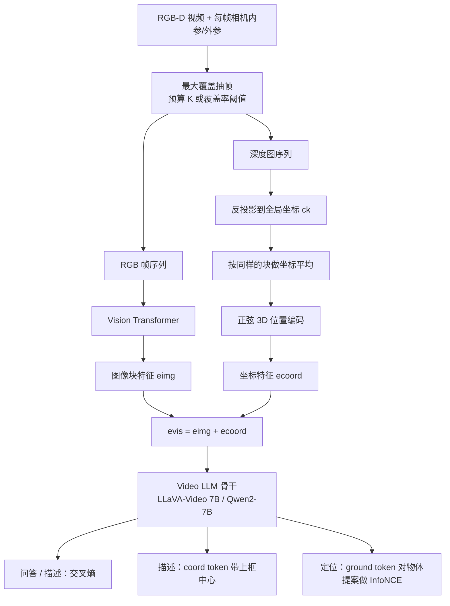

# Video-3D LLM：把 3D 场景当成视频，再把位置编码写进表示

<!-- release-date: 2024-11-30 -->

> 本文依据香港中文大学 Duo Zheng、Shijia Huang、Liwei Wang 的 **Video-3D LLM: Learning Position-Aware Video Representation for 3D Scene Understanding**，即 CVPR 2025 的 Open Access camera-ready（12 页）。封面水印写明 identical to the accepted version；对应预印本为 [arXiv:2412.00493v2](https://arxiv.org/abs/2412.00493)（2025-03-27 修订）。动笔前核过 arXiv 提交历史：v1 于 2024-11-30 14:28:53 UTC 首次公开，v2 为目前最新版。本地件是这份 CVPR PDF，不必再换。
>
> 全文 `(PDF p. N)` 指打开这份 12 页 PDF 时的第 N 页。页脚印着会议录页码 8995–9006，不要按那个数去翻；也不要用预印本页码。
>
> `release-date` 取 **2024-11-30**。本文讲的是这项公开方法，不是某个产品级基座。按「技术首次官方公开」取值：arXiv v1 是能核到时间戳的最早官方公开事件。GitHub [`LaVi-Lab/Video-3D-LLM`](https://github.com/LaVi-Lab/Video-3D-LLM) 的 `created_at` 为 2024-11-26T06:08:44Z、首提交 `c0c28c0`「Initialize repo」在同日，但仓库创建日与 Hugging Face `createdAt` 一样，不能证明当时已对公众开放；官方 README News 把论文发布写成 2024-12-3，晚于 arXiv。处理后的数据在 2024-12-11 放出。权重仓 [`zd11024/Video3D-LLM-LLaVA-Qwen-Uniform-32`](https://huggingface.co/zd11024/Video3D-LLM-LLaVA-Qwen-Uniform-32) 的 `createdAt` 与文件提交都是 2024-12-31，按本模块规则不是首发日；官方 News 把 checkpoint 发布写成 2025-3-4，那是权重可用日，不回写方法的首发日。
>
> 文中始终区分三件事：**报告写了什么**、**本文如何解释**、**哪些是外部补充**。凡是从图里读出来的、从 GitHub / Hugging Face 补进来的，都会当场说明。
>
> 边界：同方向已发布的 [World Tracing](/reports/WorldLabs/World-Tracing) 和 [HunyuanWorld 1.0](/reports/Tencent/HunyuanWorld-1.0) 讲的是生成几何或可走的 3D 世界。本篇是 3D 场景理解 MLLM，输入是 ScanNet 这类已有室内 RGB-D 扫描，输出是指物、描述和问答，不生成 mesh。不要把那两篇的人评、秒数或参数量读成本实验。同组后续 VG-LLM（arXiv:2505.24625）不在本文范围内。

## 先讲矛盾：2D 预训练对不齐真实 3D

走进一个房间，问「床左边那把吉他在哪」。对人来说，这是空间问题：眼睛扫过房间，知道床、吉他各自在三维里的位置，再把「左边」落到坐标上。

对现在的多模态大语言模型（Multimodal Large Language Model，MLLM）来说，这件事别扭。它平时吃的是照片和网上视频，知道吉他长什么样，却不一定知道「左边」在这个房间的坐标系里指哪一块。论文一开篇就点出这个缺口：现有 MLLM 做不好需要三维空间理解的任务（PDF p. 1）。

已有 3D LLM 的主流修法，是把房间先变成另一种东西，再接到语言模型上。论文 Figure 1 (a) 把这条路画成：图像预训练的 MLLM 初始化之后，用点云或体素表示去微调。点云本身往往还是从 RGB-D 视频重建出来的（PDF p. 1）。相关工作里，这条路至少有三支（PDF p. 2）：

- 直接吃点云特征，如 PointLLM、LL3DA；
- 把多视图图像特征抬到三维，如 3D-LLM、LLaVA-3D；
- 先用现成 3D 检测器提出物体，再把物体中心表示喂给 LLM，如 Chat-3D、LEO、ChatScene。

论文认为，这些做法和 MLLM 真正学过的东西之间仍有一道缝（PDF p. 1–2）。**原因不是检测器不够好，而是表示换了坐标系。** MLLM 的视觉能力是在二维图像上预训练出来的；点云补丁、体素格子和它见过的图像补丁对不齐。三维标注又少，微调补不回这个缺口，二维里已经学会的外观知识使不上劲。

另一边，视频大模型（Video LLM）看起来更顺。室内扫描本来就是一段 RGB-D 录像，视频模型见过大量时间序列，时空先验是现成的。LLaVA-OneVision、Oryx 已经把三维问答数据塞进指令微调，问答分数说得过去（PDF p. 3）。但论文立刻补了一刀：这些模型**没有把细致的三维空间信息写进表示**，所以一旦任务要求精确对齐——把一句话指到某个三维框、按坐标描述物体——RGB 画面就不够了（PDF p. 2–3）。

于是矛盾可以压成一句：

> **点云路线保住了三维，丢掉了二维预训练；视频路线保住了预训练，丢掉了三维坐标。**

Video-3D LLM 不在两支里单选。它把 3D 场景继续当成动态视频来读，只把每个像素反投影出来的全局坐标，当成位置编码加进视频表示（PDF p. 1–2）。

## 读之前只要这几个词

下面这些词正文都会用到。这一节是读前背景，不全是论文自己定义的。

**MLLM / Video LLM。** 能同时看图或视频、并用自然语言回答的大模型。本篇的骨干是开源的 LLaVA-Video 7B，底层语言模型是 Qwen2-7B（PDF p. 5）。它本来吃的是普通 RGB 视频，没有深度，也没有相机位姿。

**RGB-D 视频。** 每一帧除了彩色图，还有一张同尺寸的深度图，记录每个像素沿视线走到最近表面有多远。ScanNet 这类室内数据集就是这样采的，然后再重建成点云（PDF p. 2 脚注 1）。本方法推理时仍然要深度，以及相机的内参和外参。

**内参 $K$ 与外参 $T_k$。** 内参描述这台相机怎么把三维点打到像素上（焦距、主点）；外参描述这一帧相机在房间里的位置和朝向。有了深度、内参、外参，才能把像素反投影成房间坐标系里的 $(x,y,z)$。

**3D 视觉定位（visual grounding）。** 给一段话，在场景里标出它指的三维框。ScanRefer 是单目标，Multi3DRefer 可以是零个、一个或多个。指标 Acc@0.25 / Acc@0.5 的意思是：预测框和真值框的交并比（IoU）超过 0.25 或 0.5 才算对（PDF p. 5）。

**3D 稠密描述（dense captioning）。** 场景里每个物体都要写出一句话，而且还得框对。Scan2Cap 把常用的图像描述指标 CIDEr、BLEU-4 和框的 IoU 绑在一起，写成 C@0.5、B-4@0.5（PDF p. 5）。

**3D 问答。** ScanQA 问的是场景里的空间关系；SQA3D 还先给你一个处境（「你坐在沙发上面对电视」），再问问题。两者都用精确匹配（exact match，EM）（PDF p. 5）。

**物体提案（object proposal）。** 先用三维检测器在场景里提出一批候选框，再让模型从中挑。论文训练时用真值物体当候选；推理时跟 ChatScene、LEO 一样，用 Mask3D 的提案，而且为了公平，用的是 LEO 提供的那一套（PDF p. 5–6）。

**最大覆盖（maximum coverage）。** 经典的组合问题：有一堆集合，预算只够挑 $K$ 个，要使它们的并集尽量大。这里每个视频帧覆盖场景里的一部分体素，挑帧就变成挑集合（PDF p. 3）。

**正弦位置编码（sinusoidal PE）。** Transformer 原文用来告诉模型「这个 token 排第几」的一组正弦余弦。本篇拿同一套公式去编连续的 $x,y,z$，而不是编整数下标（PDF p. 4）。

**InfoNCE。** 对比学习里常用的损失：让正样本的相似度在一堆候选里显得更突出。本篇用它来让特殊 token `<ground>` 去对上目标物体的特征（PDF p. 5）。

## 一句话先说清

Video-3D LLM 是一个通用的 3D 场景理解模型。它不把扫描改写成点云或体素再另学一套表示，而是：

1. 从原始 RGB-D 视频里抽出一小段帧；
2. 把每帧深度反投影成全局坐标；
3. 把坐标编成 3D 位置编码，加到视频特征上；
4. 送进现成的 Video LLM，用同一套权重做定位、描述和问答（PDF p. 2–3）。

帧不够用、又不能整段都塞进显存时，它把选帧写成最大覆盖问题，用贪心保证尽量看见整个房间，同时把计算量按住（PDF p. 3）。

论文用 ScanNet 上的五个基准说明这件事成立，并强调只用了当时最强对照 LLaVA-3D 的 26% 三维数据（223k 对 859k），ScanRefer Acc@0.25、Scan2Cap CIDEr@0.5IoU、ScanQA EM、SQA3D EM 仍分别高 4.1、4.6、2.9、3.0 个百分点（PDF p. 2）。这些是引言里的声称；后文会回到 Table 1 的原始格点。

## 整条流水线怎么连起来

下面这张图是机制示意，根据 PDF 第 1 页 Figure 1、第 4 页 Figure 2 和第 3–5 页正文重画，不是实测耗时。

读这张图时记住三件论文写明的事：

- 输入始终是视频帧加坐标，而不是先重建点云再编码（PDF p. 3）。
- 坐标不是另开一条 3D 编码器，而是加到已经预训练好的视频特征上（PDF p. 4，式 5）。
- 定位没有让语言模型直接吐三维框。先前工作已经说明那很难，本篇改成在检测器提案上做分类（PDF p. 5）。

三个任务共用同一套位置感知视频表示。训练时每个 batch 只抽一种任务（PDF p. 4）。

## 报告地图：12 页里各写了什么

先把篇幅摊开。正文到第 8 页，第 9–12 页几乎全是参考文献。密度在表示、抽帧、多任务损失和两张主消融表上。

| 报告章节 | PDF 页 | 讲了什么 | 密度 |
|---|---|---|---|
| 标题、摘要、Figure 1 | p. 1 | 视频加坐标；对照点云/体素路线 | 高 |
| §1 引言 | p. 2 | 二维预训练对不齐三维；223k vs 859k；四点收益 | 高 |
| §2 相关工作 | p. 2–3 | 3D LLM 三支；Video LLM 做 3D 仍缺坐标 | 中 |
| §3 起 + §3.1 + Algorithm 1 | p. 3 | 最大覆盖抽帧；贪心 $1-1/e$ | 高 |
| Figure 2 + §3.2 + 式 1–5 | p. 4 | 反投影、块内均坐标、正弦 3D-PE | 高 |
| 式 6–7 + §3.3 + §4.1 | p. 5 | 交叉熵与定位 InfoNCE；数据、指标、8×A100 | 高 |
| Table 1 + §4.2.2 | p. 6 | 五基准主表；Uniform 32 与 MC 95% | 高 |
| Table 2–5 + §4.3 起 | p. 7 | 抽帧、3D-PE、定位头、视频 vs 体素 | 高 |
| Figure 3–4 + 结论 | p. 8 | ScanRefer / Scan2Cap 可视化；无独立限制节 | 中 |
| 致谢 + 参考文献 | p. 9–12 | 基金号；引用到 RT-2 | 低 |

四件事必须先知道，否则读完会以为自己漏看了：

- **没有附录。** 超参、数据构成、体素大小、坐标离散网格分辨率，正文没有的，后面也没有。
- **主模型其实有两个。** Table 1 的 Uniform 是固定 32 帧均匀抽样；MC 是覆盖率 95%、最多 32 帧的自适应抽样，平均大约 18 帧，推理时间大约一半（PDF p. 6–7）。
- **定位和描述在推理时都依赖 Mask3D 提案**，不是端到端从像素吐框（PDF p. 5–6）。
- **结论只有一段**，没有单独的 limitations。边界要从方法假设和消融里自己读。

阅读路线：先读「先讲矛盾」和「核心一、二」，再看 Table 1 与 Table 3。抽帧那一节决定你能不能在更少帧上保住分数。**如果你只有十分钟，读矛盾、核心二、主结果和消融里 3D-PE 那张表就够了。**

## 核心一：别把视频压成点云，3D 场景就当视频来读

### 旧问题：换表示，等于把预训练的坐标系丢掉

3D LLM 常见的第一步，是把一段扫描收成点云或体素，再学一套三维 token。论文的批评很具体：MLLM 主要在二维数据上训练，三维标注又有限，硬接过去会在表示和学习过的知识之间留下缺口（PDF p. 1–2）。LLaVA-3D 已经尝试把二维图像块特征聚到体素里，仍然是「先抬到三维，再让语言模型读三维」（PDF p. 2）。

视频这边的问题对称。视频模型有现成的时空先验，但表示里没有三维位置和空间关系。只靠 RGB，做不好要对齐的空间任务（PDF p. 2）。

### 新设计：3D 视频 = 帧序列 + 全局坐标图

论文把输入定义成两路同步的东西（PDF p. 3）：

1. 从场景里采到的视频帧；
2. 各帧深度反投影得到的三维坐标图。

模型由视觉编码器、3D 位置编码模块、Video LLM 骨干三块组成。它直接处理帧的时间序列，而不是先把视频折成显式的点云或体素（PDF p. 3）。

### 工作机制

每一帧深度 $d_k\in\mathbb{R}^{H\times W}$、外参 $T_k\in\mathbb{R}^{4\times 4}$、内参 $K$，把像素 $(i,j)$ 反投影到全局坐标 $c_k(i,j)$（PDF p. 4，式 1）：

$$
\begin{bmatrix} c_k(i,j) \\ 1 \end{bmatrix}
=
T_k\cdot
\begin{bmatrix}
d_k(i,j)\cdot K^{-1}\cdot
\begin{bmatrix} j \\ i \\ 1 \end{bmatrix}
\\
1
\end{bmatrix}
$$

像素齐次坐标写成 $(j,i,1)$，也就是先列后行，对应图像上的 $(x,y)$。$T_k$ 再把它从相机系变到房间的全局系。对每个被抽中的帧都做一遍，得到 $\lbrace c_k\rbrace_{k=1}^{l}$ 和对应的 RGB 图 $\lbrace f_k\rbrace_{k=1}^{l}$，两者都是 $H\times W\times 3$（PDF p. 4）。

视觉这一路走标准 ViT：帧切成边长 $P$ 的块，得到 $\mathbf{e}^{\mathrm{img}}_k\in\mathbb{R}^{H'\times W'\times d}$，其中 $H'=\lfloor H/P\rfloor$，$W'=\lfloor W/P\rfloor$（PDF p. 4）。坐标这一路在下一节接上。

### 收益、代价、边界

收益是论文反复强调的那句：视频表示和真实空间对上了，同时时间上下文还在，预训练和三维场景之间的差异被缩小（PDF p. 2）。Table 5 用同一套 LLaVA-Video 骨干对照「先聚成体素」：视频路线在 Scan2Cap C@0.5 上从 54.9 到 83.8，提升 28.9；ScanRefer Acc@0.25 / Acc@0.5 各高 2.0 / 1.9，ScanQA EM 高 2.0（PDF p. 7–8）。论文自己的读法是：这不是视觉编码器更强这么简单，而是用上了视频的时空先验（PDF p. 8）。

代价也很硬。这条路**假设你有深度和相机位姿**。没有 RGB-D、没有标定，式 1 写不下去。室内 ScanNet 满足这个假设；普通单目视频、互联网成片、没有位姿的手机录像，论文没有实验。体素对照里他们按 LLaVA-3D 的做法，把同一体素的块特征平均后抽样 3,096 个送给 LLM（PDF p. 8）——这说明「当视频读」并不是免去了三维几何，而是把几何从主表示里拿出来，降级成加在视频 token 上的坐标。

论文还写了一句对问答基准自己都不太客气的观察：现成 Video LLM 在零样本下已经能把 ScanQA 做得很像样，说明当前 3D QA 未必真的在考空间推理（PDF p. 6）。Table 1 里 LLaVA-Video-7B 零样本 ScanQA CIDEr 已到 88.7，SQA3D EM 48.5，而不少专门的 3D LLM 还低于这个数（PDF p. 6）。**这是论文自己的判断，不是本文外加的贬低。**

### 可迁移启发

当下游模型已经在某种模态上预训练得很强，先问「缺的那一维能不能当成条件加回去」，再问「要不要换一种完全不同的 token」。换表示最贵的不是多几个参数，是把已经对齐好的坐标系丢掉。本篇把三维从「另一种视觉骨干」降成「视频 token 上的位置通道」，预训练才能继续当主干用。

## 核心二：每个图像块盖一枚房间里的坐标

### 旧问题：模型看见了物体，不知道物体在哪

只把 RGB 帧送进 Video LLM，等于每张图都是「一段外观」。描述任务的提问方式偏偏是：「给定位于 `<coord>(0.8, -3.2, 0.4)` 的物体，详细描述它」（PDF p. 4 Figure 2）。没有坐标通道，这个特殊 token 只是一个空洞的位置词，模型无法把提问里的点落到某个图像块上。

定位也一样。多个看起来差不多的椅子，真正用来区分的是它们在房间里的位置，不是纹理。

### 新设计：块内平均坐标 + 正弦 3D-PE，再加到视觉特征上

视频帧已经按边长 $P$ 切块。坐标图用同一套格子切开，块内取平均（PDF p. 4，式 2）：

$$
c'_k(i,j)=\frac{1}{P^2}\sum_{(u,v)\in\mathcal{P}(i,j)}c_k(u,v)
$$

$\mathcal{P}(i,j)$ 是这个图像块覆盖的像素。论文的理由是：块不大，平均之后位置仍然够用；他们也试过块中心、块内最小最大坐标，写在消融里（PDF p. 4、p. 7）。

连续的 $(x,y,z)$ 先映到离散网格，再对每个轴做正弦编码。$x$ 轴是（PDF p. 4，式 3–4）：

$$
\mathrm{PE}(x,2i)=\sin\left(\frac{x}{10000^{2i/\lfloor d/3\rfloor}}\right),\qquad
\mathrm{PE}(x,2i+1)=\cos\left(\frac{x}{10000^{2i/\lfloor d/3\rfloor}}\right)
$$

$y$、$z$ 同样算一遍，三段拼起来得到 $\mathbf{e}^{\mathrm{coord}}_k\in\mathbb{R}^{H'\times W'\times d}$。分母里的 $\lfloor d/3\rfloor$ 是把特征维 $d$ 劈给三个轴。最后直接相加（PDF p. 4，式 5）：

$$
\mathbf{e}^{\mathrm{vis}}_k=\mathbf{e}^{\mathrm{img}}_k+\mathbf{e}^{\mathrm{coord}}_k
$$

没有门控，没有拼接后再投影，就是加。

描述任务里，物体框中心也走同一套 3D-PE，加到特殊 token `<coord>` 的嵌入上，等于在语言侧也盖同一枚坐标章（PDF p. 5）。

### 工作机制

可以把它想成：每个图像块除了「看起来像木桌」，还带着「在房间的这个位置」。语言模型读到的视频 token，已经是外观和位置绑在一起的。提问里的坐标、图像里的坐标、物体中心的坐标，用的是同一套编码，对得上。

论文还试过用 MLP 去编坐标，而不是正弦。Table 3 在全量多任务、32 帧均匀抽样上比较（PDF p. 7）。

### 收益、代价、边界

Table 3 是全文最值得记住的一张消融。去掉 3D-PE 之后，Scan2Cap C@0.5 从正弦编码的 83.76 掉到 31.03；ScanRefer Acc@0.25 / Acc@0.5 从 58.11 / 51.72 掉到 57.50 / 50.84；ScanQA EM 几乎不动，30.09 对 30.03（PDF p. 7）。

这个落差和任务提问方式一致。**描述必须靠坐标找到对象**，没有 3D-PE 等于提问缺了主语；定位还有物体提案和外观可以撑一阵，所以掉得少；问答更吃场景外观，坐标不是唯一线索。论文自己也说：描述要按查询框在视频里找物体，没有 3D-PE 会显著变差（PDF p. 7）。

正弦和 MLP 的分工同样清楚：MLP 更利定位（ScanRefer Acc@0.25 59.63，高于正弦的 58.11），正弦更利描述和问答（C@0.5 83.76 对 MLP 的 76.23，ScanQA EM 30.09 对 29.62）（PDF p. 7）。主结果走的是正弦。

块内怎么聚坐标：平均最好，中心最差，最小最大介于两者之间（Scan2Cap C@0.5：平均 83.76，最小最大 82.75，中心 80.88）（PDF p. 7）。论文的解释是三维坐标比二维图像位置更不规则，块中心那一个点代表不了块（PDF p. 7–8）。

代价：坐标来自深度反投影，深度噪声会写进 PE。论文没有测「深度加噪声之后分数掉多少」。离散网格的分辨率、正弦编码前坐标怎么归一化，正文都没写。相加而不是拼接，意味着坐标通道必须和视觉特征同维，不能单独加宽。

### 可迁移启发

缺空间的那一维，不一定要新开一个三维编码器。只要提问和视觉侧能共享同一套坐标编码，相加就可能把「在哪」从外观里拆出来。Table 3 还给出一条很实用的诊断：如果某个任务在拿掉位置通道之后几乎不掉点，这个任务可能根本没在考空间——本篇的 ScanQA 就是这样。

## 核心三：抽帧当成最大覆盖，而不是均匀掐秒

### 旧问题：显存只够看几帧，均匀抽又容易漏房间角落

把场景当视频读，立刻碰到两个硬约束（PDF p. 3）：

1. GPU 显存一次只能进有限帧，必须从很长的原始扫描里抽样；
2. 漏看的区域补不回来，空间任务会不可逆地掉点。

均匀按时间抽，看起来公平，空间上并不公平。扫描的人在走廊里走得慢、在储藏室门口一晃而过，均匀帧就会在走廊里堆重复，把角落让掉。Figure 3 的定性结果就是这个现象：16 帧均匀抽样常把小物体或边角物体漏掉，定位失败；同样 16 帧的最大覆盖把场景补得更完整（PDF p. 8）。

### 新设计：选帧 = 有预算的最大覆盖，贪心近似

把所有帧写成 $F=\lbrace f_1,\ldots,f_n\rbrace$，场景体素写成 $V=\lbrace v_1,\ldots,v_m\rbrace$。每一帧 $f_k$ 覆盖一个体素子集 $V_k\subseteq V$。体素怎么来：先把该帧深度反投影到全局坐标，再离散到体素格子上（PDF p. 3）。目标是挑 $S\subseteq F$，让

$$
\bigcup_{f_k\in S}V_k
$$

尽量大。这是最大覆盖，NP-hard。论文用贪心，每一步挑让新覆盖体素最多的帧（PDF p. 3，Algorithm 1）：

$$
f^*=\arg\max_{f_k\in F\setminus S}\lvert V_k\setminus U\rvert
$$

$U$ 是已经覆盖的体素。理论保证近似比 $1-1/e$（PDF p. 3，引用 Khuller 等人 1999 的预算最大覆盖）。停止条件有两个：帧数到预算 $K$，或覆盖率超过预设阈值。论文说这样可以在不同大小的场景上折中计算和覆盖（PDF p. 3）。

抽帧在线下做完，训练和推理用同一套策略，保证看见的场景一致、显存可控（PDF p. 3）。

Table 1 的 MC 设定是：覆盖率 95%，最多 32 帧（PDF p. 6）。Table 2 里带星号的 MC* 是同一设定，平均大约 18 帧（PDF p. 7）。

### 工作机制

贪心每一步都在问：还没看见的体素里，哪一帧能新看见最多。走廊里连续很像的帧，第二帧几乎加不了新体素，不会被选。门口一晃而过的储藏室，一旦还没被覆盖，就会被优先补上。

覆盖率阈值让小房间早停，大房间才用满 32 帧。这就是自适应帧数：平均 18 帧，不是固定 18 帧。

### 收益、代价、边界

Table 2 在 ScanQA 上测平均推理时间，并把五种任务一起列出（PDF p. 7）。摘固定帧数的对照：

| 帧数 | 策略 | 推理 | ScanRefer Acc@0.25 | Scan2Cap C@0.5 | ScanQA EM |
|---|---|---:|---:|---:|---:|
| 8 | Uniform | 309ms | 48.93 | 68.82 | 27.57 |
| 8 | MC | 309ms | 53.47 | 73.08 | 28.00 |
| 16 | Uniform | 537ms | 55.42 | 76.96 | 28.96 |
| 16 | MC | 537ms | 56.46 | 76.84 | 29.49 |
| 32 | Uniform | 1050ms | 58.11 | 83.76 | 30.09 |
| 32 | MC | 1050ms | 58.27 | 81.58 | 30.35 |
| ≈18 | MC* | 527ms | 57.86 | 80.00 | 29.50 |
| — | LLaVA-3D | 433ms | 54.1 | 79.2 | 27.0 |

8 帧时，MC 相对均匀抽样，ScanRefer Acc@0.25 高 4.54，Scan2Cap C@0.5 高 4.26（PDF p. 7）。帧很少的时候，每一帧都要尽量看见新东西，最大覆盖的价值最大。

32 帧时两种策略差不多，论文的解释是这个数量已经够盖住场景（PDF p. 7）。有趣的是描述任务上，32 帧均匀抽样的 C@0.5 是 83.76，反而高于固定 32 帧 MC 的 81.58——贪心覆盖并不是所有指标的单调赢家。主表 Table 1 的 Uniform 走的就是 32 帧均匀，分数总体最高；MC 那一行对应自适应 95% 设定，推理 527ms 对 1050ms，大约一半时间，分数接近（PDF p. 6）。

和 LLaVA-3D 比：MC* 平均 18 帧、527ms，ScanRefer Acc@0.25 57.86 对 54.1，ScanQA EM 29.50 对 27.0，速度还在同一量级（LLaVA-3D 433ms）（PDF p. 7）。最大覆盖本身在每个场景上只跑一次，均摊到 ScanQA 每道题大约 17.8ms，相对推理可忽略（PDF p. 7）。

8 帧的 Video-3D LLM 已经超过许多旧方法，论文用这一点说明「当视频读」这条范式本身成立，不是堆帧堆出来的（PDF p. 7）。

代价和没写的部分：体素格子多大、覆盖率 95% 对体素分辨率是否敏感，正文没有。贪心的 $1-1/e$ 是最坏保证，他们没有报告贪心解和最优解差多少。抽帧依赖深度反投影，深度坏了，覆盖集合也会偏。训练和推理必须用同一策略，否则训练看见的场景和测试不一致——这既是优点，也是部署约束。

### 可迁移启发

从长序列里抽子集时，先问子集要覆盖的是时间还是空间。时间均匀不等于空间均匀。把「再看一帧能新看见多少」写成可计算的集合增量，比手调 fps 更可迁移。早停条件用覆盖率而不是固定长度，是同一思想在变长输入上的版本。不必把这个算法限制在室内 RGB-D：任何「每段观察覆盖状态空间一部分、预算只够看 K 段」的问题都可以借用。

## 核心四：一个模型做三件事，定位另开一条对比损失

### 旧问题：定位不是下一段文本

问答和描述可以当成「看完视频写字」，用普通的语言建模交叉熵就行。定位不行。先前工作已经说明，让 LLM 直接输出三维框很难（PDF p. 5）。现成 3D LLM 要么在物体提案上分类，要么再训一个基于检测器的定位模块（PDF p. 6）。

如果三个任务硬塞进同一个交叉熵，定位会缺少「在这一堆框里选哪一个」的监督。

### 新设计：按 batch 抽任务；生成走交叉熵，定位走提案对比

训练数据覆盖多种 3D 场景理解任务。每个 batch 随机抽一种任务，只用该任务的数据（PDF p. 4）。问答和描述优化交叉熵（PDF p. 4–5，式 6）：

$$
\mathcal{L}_{\mathrm{CE}}=-\sum\log\bigl(y\mid\{\mathbf{e}_k^{\mathrm{vis}}\}_{k=1}^{l},\{\mathbf{e}_k^{\mathrm{text}}\}_{k=1}^{q}\bigr)
$$

$y$ 是真值回复，$\{\mathbf{e}_k^{\mathrm{vis}}\}$ 是位置感知视频表示，$\{\mathbf{e}_k^{\mathrm{text}}\}$ 是文本嵌入。式子按论文印刷抄录，它就是标准的下一词交叉熵，没有另给归一化细节。

定位改成提案分类。对每个候选框 $b_k$，看每个图像块是否有超过 50% 的点落在框内，把这些块的特征平均成二维物体特征 $\mathbf{e}^{\mathrm{obj\text{-}rgb}}_k$，再加上框中心的 3D-PE，得到 $\mathbf{e}^{\mathrm{obj}}_k$（PDF p. 5）。语言模型里的特殊 token `<ground>` 拿出隐状态 $h$，用两个两层 MLP $f$、$g$ 去对物体特征。论文写下的定位目标是（PDF p. 5，式 7）：

$$
\mathcal{L}_{\mathrm{Grd}}=\frac{\sum_{k\in O^+}\exp\bigl(f(\mathbf{e}^{\mathrm{obj}}_k)\cdot g(h)/\tau\bigr)}{\sum_{k\in O}\exp\bigl(f(\mathbf{e}^{\mathrm{obj}}_k)\cdot g(h)/\tau\bigr)}
$$

$O^+$ 是正物体，$O$ 是全部候选，$\tau=0.07$（PDF p. 5）。论文把它叫作 InfoNCE。印刷式子是正样本的 softmax 质量，没有取负对数。**本文不把 $-\log$ 写进公式里冒充原文；实现上若当作损失来最小化，通常会再取负对数。那是读式，不是论文另给的代码。**

训练时候选是真值物体；推理时改用 Mask3D 提案，且与 ChatScene 等对照共用 LEO 提供的提案，避免检测器不同把表打歪（PDF p. 5–6）。

### 工作机制

三个任务看见的是同一套 $\mathbf{e}^{\mathrm{vis}}$。区别只在语言侧怎么问、损失怎么算：

- 问答：普通指令，交叉熵；
- 描述：指令里带 `<coord>` 和框中心坐标，交叉熵；
- 定位：指令里带 `<ground>`，用隐状态去对提案列表。

Figure 2 (c) 把定位画成：一串物体特征 $O_1,O_2,\ldots$ 和 `<ground>` 做匹配（PDF p. 4）。模型并不回归框的八个角点，只在已有框上打分。

Table 4 单独在 ScanRefer / Multi3DRefer 上训，比较物体块大小和 BCE vs InfoNCE。LLaVA-Video 在送进 LLM 前还会再降一次图像块分辨率，所以物体特征可以取 14 或 27 两种块大小（PDF p. 8）。

### 收益、代价、边界

Table 4（PDF p. 7；该表单独训练，不能直接和 Table 1 的多任务数字比）：

| 块大小 | 损失 | ScanRefer Acc@0.25 | ScanRefer Acc@0.5 | Multi3DRefer 列 1 | Multi3DRefer 列 2 |
|---|---|---:|---:|---:|---:|
| 14 | InfoNCE | 56.44 | 50.08 | 56.31 | 51.05 |
| 27 | InfoNCE | 55.23 | 48.93 | 56.13 | 50.90 |
| 14 | BCE | 51.63 | 45.82 | 46.07 | 41.47 |

印刷表头把 Multi3DRefer 两列都写成了 Acc@0.5。两列数字不同，按 ScanRefer 那一侧的列序，应是 0.25 / 0.5 两个阈值。本文按印刷抄录，不改表头。

块从 27 改到 14，ScanRefer Acc@0.5 从 48.93% 到 50.08%。论文认为更小的块能抓住更细的物体特征（PDF p. 8）。BCE 明显更差。论文的解释是：定位靠物体特征和 `<ground>` 的相似度，BCE 约束过死；换成 InfoNCE 更合适（PDF p. 8）。

主表上，Uniform 32 帧的通用模型 ScanRefer Acc@0.25 / Acc@0.5 为 58.1% / 51.7%，Multi3DRefer F1@0.25 / F1@0.5 为 58.0% / 52.7%，超过同样用提案的 ChatScene（55.5 / 50.2，57.1 / 52.4），论文把这 2.6 和 0.9 个百分点写成可公平对照的提升（PDF p. 6）。

代价：推理期定位上限就是 Mask3D 提案的上限。检测器漏了的物体，语言模型没有机会救回来。训练用真值框、测试用检测框，是这类方法的老问题，论文沿用但没有单独消融「训练也用 Mask3D」会掉多少。每个 batch 只训一个任务，避免梯度打架，也意味着三个任务没有在同一步里显式对齐。只训一个 epoch（PDF p. 5），数据利用很短，换来的是省计算，不是充分收敛的保证。

### 可迁移启发

不是所有下游都能收成「再写几个 token」。能生成的用语言损失，必须在候选集上做选择的用对比损失，两者可以共享编码器。特殊 token 当探针（`<coord>` 问位置，`<ground>` 问是谁）是一种很轻的接口：不改 LLM 的输出词表结构，只改提问和读哪个隐状态。

## 五个基准测的是什么

全部数据都来自 ScanNet：1,513 个带标注的室内 RGB-D 扫描。论文把每段扫描按 3 FPS 抽帧，并取出对应的内外参（PDF p. 5）。评测划分跟先前工作：ScanRefer、Multi3DRefer、Scan2Cap、ScanQA 用验证集，SQA3D 用测试集（PDF p. 5）。

人话版：

| 基准 | 它在问什么 | 指标 | 为什么选它 |
|---|---|---|---|
| ScanRefer | 一句话对应哪一个物体 | Acc@0.25 / Acc@0.5 | 单目标对齐，3D-PE 最直接的试金石 |
| Multi3DRefer | 一句话对应零个、一个或多个物体 | F1@0.25 / F1@0.5 | 考「有没有、有几个」，不是只会框一个 |
| Scan2Cap | 每个物体写一句，框还要对 | B-4@0.5 / C@0.5 | 把描述质量和定位绑在一起 |
| ScanQA | 关于空间关系的问答 | CIDEr / EM | 看起来最像「理解」，论文自己怀疑它不够考空间 |
| SQA3D | 先给你处境再问答 | EM | 多一个「你在哪、面朝哪」的条件 |

专家模型为单个任务做专用头；表里标了 3D Generalist 的，才是一个模型做多件事（PDF p. 6）。LLaVA-Video-7B 是零样本，没有在这些三维任务上微调（PDF p. 6）。

## 主结果：用更少 3D 数据超过 LLaVA-3D

Table 1 的两个本方法设定（PDF p. 6）：

- **Uniform**：训练和推理都用 32 帧均匀抽样；
- **MC**：最大覆盖，覆盖率 95%，最多 32 帧；推理 527ms 对 Uniform 的 1050ms。

摘关键行：

| 方法 | 通用 | ScanRefer 0.25 / 0.5 | Multi3DRef F1 0.25 / 0.5 | Scan2Cap B-4 / C@0.5 | ScanQA C / EM | SQA3D EM |
|---|---|---:|---:|---:|---:|---:|
| LLaVA-Video-7B 零样本 | | — | — | — | 88.7 / — | 48.5 |
| ChatScene | ✓ | 55.5 / 50.2 | 57.1 / 52.4 | 36.3 / 77.1 | 87.7 / 21.6 | 54.6 |
| PQ3D | ✓ | 57.0 / 51.2 | — / 50.1 | 36.0 / 80.3 | — / — | 47.1 |
| LLaVA-3D | ✓ | 54.1 / 42.4 | — | 41.1 / 79.2 | 91.7 / 27.0 | 55.6 |
| Video-3D LLM (MC) | ✓ | 57.9 / 51.2 | 57.9 / 52.4 | 40.2 / 80.0 | 100.5 / 29.5 | 57.7 |
| Video-3D LLM (Uniform) | ✓ | **58.1 / 51.7** | **58.0 / 52.7** | **41.3 / 83.8** | **102.1 / 30.1** | **58.6** |

引言声称相对 LLaVA-3D 的提升是 Acc@0.25 +4.1、C@0.5IoU +4.6、ScanQA EM +2.9、SQA3D EM +3.0，数据量 223k vs 859k，约 26%（PDF p. 2）。用 Table 1 的 Uniform 去减 LLaVA-3D：58.1−54.1=4.0，83.8−79.2=4.6，30.1−27.0=3.1，58.6−55.6=3.0。**+4.6 和 +3.0 对得上；+4.1 和 +2.9 与表上的一位小数不完全同余，应按表内格点引用，把引言当作四舍五入后的宣传句。** 223k 怎么计、含不含指令模板重复，论文没有拆开。

和 ChatScene 比更公平，因为提案相同：Acc@0.25 高 2.6，F1@0.25 高 0.9（PDF p. 6）。PQ3D 在 ScanRefer Acc@0.5 上已经到 51.2，和本方法的 51.7 很近；差距拉开在描述和 SQA3D。LEO 的 ScanQA CIDEr 是 101.4，和 Uniform 的 102.1 几乎持平，但 EM 只有 21.5 对 30.1（PDF p. 6）——CIDEr 吃生成流畅，EM 吃答对。论文把问答上的优势归因于 Video LLM 继承来的表示（PDF p. 6）。

实现侧，论文写明的训练配方只有这些（PDF p. 5）：

- 骨干 LLaVA-Video 7B / Qwen2-7B；
- Adam，一个 epoch，batch 16，warmup 比例 0.03；
- 学习率峰值：LLM $1\times 10^{-5}$，视觉编码器 $2\times 10^{-6}$；
- 8 张 A100-80G；
- InfoNCE 温度 0.07。

没有写输入分辨率、视觉编码器是否冻结（给了非零学习率，应是一起训）、训练墙钟、真实样本量构成。这些本文不补。

## 消融：哪一块真的在干活

把 Table 2–5 串起来，因果链是这样的（PDF p. 7–8）：

1. **当视频读，不是当体素读。** 同一骨干下，Scan2Cap C@0.5 差 28.9。这是表示选择，不是换了更强的视觉模型。论文还注明自己的数据只有 LLaVA-3D 的 26%，所以体素基线低于 LLaVA-3D 并不意外（PDF p. 8）。
2. **3D-PE 对描述几乎是开关，对问答几乎无所谓。** 没有坐标，C@0.5 从 83.76 塌到 31.03；ScanQA EM 不动。空间任务和「看起来像问答的任务」被这张表拆开了。
3. **帧少时覆盖比均匀重要，帧够了就差不多。** 8 帧的 +4.54 Acc@0.25 是抽帧策略的真正贡献；32 帧时可以偷懒用均匀。自适应 95% 用大约一半推理时间换接近 32 帧的分数。
4. **定位头用 InfoNCE、用更小的物体块。** BCE 会把 Multi3DRefer 那两列从 56.31 / 51.05 打到 46.07 / 41.47，比改块大小的影响大得多。

Figure 3、4 是定性支撑，不是新数字。绿色 / 红色 / 蓝色框分别是预测对、预测错、真值（PDF p. 8）。MC 的 16 帧已经接近整段视频看见的场景；均匀 16 帧在复杂房间里会漏边角。描述样例里，模型能写出复印机在房间左后角、在布告栏右侧这类同时含外观和位置的句子（PDF p. 8 Figure 4）。

## 限制、未公开，以及不要从仓库倒灌回来的细节

论文没有 limitations 小节。下面这些是方法写明的假设，或正文到此为止没给的信息。

**写明但容易被主表盖住的边界：**

- 必须有深度和相机内外参。这是室内 RGB-D 扫描设定，不是「只给一段普通视频」。
- 定位和描述在推理时依赖 Mask3D 提案；训练用真值物体。通用模型并不包含检测器。
- 问答基准可能不够考空间。零样本 Video LLM 已经不弱，本方法在 ScanQA 上的增益，不能自动理解成三维几何推理的增益。
- 一个 epoch、8 张 A100，是小规模微调，不是从零训三维基座。

**正文没写、本文也不编的部分：**

- 体素大小、覆盖率对格子分辨率的敏感度；
- 正弦 PE 前坐标怎么离散、怎么归一化；
- 223k 条三维数据的任务配比；
- 输入图像分辨率、每帧 token 数、视觉编码器是否部分冻结；
- 训练墙钟、显存峰值；
- 深度噪声、位姿噪声下的鲁棒性；
- 室外、无深度、无位姿设定。

**论文之后的仓库（外部补充，不是 PDF 内容）。** GitHub 后来给出训练脚本 `train_multi.sh`，抽帧策略写成 `uniform` / `mc-ratio90` / `mc-ratio95`，并支持 LoRA。论文只写了均匀和 95% 覆盖，**没有写 90%，也没有写 LoRA**。公开权重名字是 `Video3D-LLM-LLaVA-Qwen-Uniform-32`，和主表 Uniform 32 帧设定一致；Hugging Face 卡片显示约 8B 参数的 safetensors，那是仓库计数，论文只说 LLaVA-Video 7B。后续同组工作的数字和设定都不并入这里。

## 把自己项目能拿走的，串回整个系统

如果只记一个设计原则，就是开篇那句：不要在「换成点云」和「只用 RGB 视频」之间单选。把三维坐标写成视频表示上的位置通道，预训练的外观和时空先验才能继续当主干。

拆开之后，有四条不依赖 8 张 A100 的做法：

1. **缺的那一维优先当位置编码，而不是当新骨干。** 式 5 的相加很便宜。贵的是先得到对齐的坐标。有深度和位姿时，反投影是闭式的，不必学。
2. **用消融判断任务到底在考什么。** 拿掉 3D-PE 之后 ScanQA 几乎不掉、Scan2Cap 直接塌掉。以后做空间模型，值得先做这种「拆掉空间通道」的探针，避免被问答分数安慰。
3. **子集选择按覆盖的状态，不按时间均匀。** 贪心最大覆盖加覆盖率早停，是显存和召回之间的明确旋钮。8 帧就有 +4.54，说明策略在资源最紧时最值钱。
4. **生成和选择不要共用同一个损失。** 交叉熵管写字，InfoNCE 管在提案里挑人。特殊 token 当探针，接口比再训一个检测头轻。

依赖特定设定的部分也说清楚：ScanNet 室内 RGB-D、Mask3D 提案、LLaVA-Video 7B、32 帧、一个 epoch。没有深度和位姿，本方法的式 1 不成立；那不是调超参能修的。同方向那两篇生成工作解决的是「世界从哪来」，本篇解决的是「已有的世界怎么问」。两边的数字不要串。

## 关键词回看

- **位置感知视频表示：** RGB 帧的 ViT 特征，加上同一格子上的 3D 位置编码。
- **3D-PE：** 块内平均坐标，正弦编码 $x,y,z$，与视觉特征相加。
- **反投影：** 深度 + 内参 + 外参，把像素变成房间坐标系里的点。
- **最大覆盖抽帧：** 每帧覆盖一些体素，贪心挑新增覆盖最多的帧，用帧数或覆盖率停。
- **MC*：** 覆盖 95% 体素或最多 32 帧，平均约 18 帧。
- **通用模型：** 同一套权重做定位、描述、问答；每个 batch 只训一种任务。
- **提案分类：** 不回归三维框，在 Mask3D / 真值物体上打分。
- **`<coord>` / `<ground>`：** 语言侧的位置探针和定位探针。
- **ScanRefer / Multi3DRefer / Scan2Cap / ScanQA / SQA3D：** 五个室内场景理解基准，全部基于 ScanNet。

## 最后的判断

Video-3D LLM 最强的叙事不是「又一个 3D LLM」，而是：**三维不一定要变成另一种视觉 token；它可以是视频 token 上的坐标。**

实验支持的部分很清楚。主表五个基准上 Uniform 32 帧达到当时最高；用大约四分之一的三维数据超过 LLaVA-3D。Table 5 支持「当视频读」相对「当体素读」。Table 3 支持 3D-PE，尤其对描述几乎是必要条件。Table 2 支持帧少时最大覆盖、帧够时均匀也行，以及 95% 自适应能把推理时间砍到大约一半。Table 4 支持定位用 InfoNCE、用更小的物体块。

只是作者观察、没有单独成表的部分：当前 3D QA 不够考空间；32 帧已经足够覆盖所以均匀≈MC；平均坐标比中心更能代表一个块。

没公开因而不应假装知道的部分：体素大小、坐标离散网格、223k 的构成、分辨率、无深度设定能不能做。

如果只记一句话，可以记：

> **场景继续当视频看，只把每个块在房间里的坐标盖上去；空间对齐是加出来的，不是把预训练拆掉换一种表示换来的。**

## 参考资料

- 论文：Duo Zheng、Shijia Huang、Liwei Wang，*Video-3D LLM: Learning Position-Aware Video Representation for 3D Scene Understanding*，CVPR 2025 Open Access camera-ready，12 页。预印本 [arXiv:2412.00493v2](https://arxiv.org/abs/2412.00493)（v1：2024-11-30；v2：2025-03-27）。
- 代码：[https://github.com/LaVi-Lab/Video-3D-LLM](https://github.com/LaVi-Lab/Video-3D-LLM)（外部；官方 News：论文 2024-12-3，数据 2024-12-11，checkpoint 2025-3-4。仓库里的 LoRA、`mc-ratio90` 不是 PDF 原文）。
- 权重：[https://huggingface.co/zd11024/Video3D-LLM-LLaVA-Qwen-Uniform-32](https://huggingface.co/zd11024/Video3D-LLM-LLaVA-Qwen-Uniform-32)（外部；文件提交 2024-12-31，官方宣布 2025-3-4。`createdAt` 不作首发日）。
- 处理后数据：[https://huggingface.co/datasets/zd11024/Video-3D-LLM_data](https://huggingface.co/datasets/zd11024/Video-3D-LLM_data)（外部；官方 News 2024-12-11）。
- 骨干：LLaVA-Video（Zhang 等，2024）、Qwen2-7B（Yang 等，2024），论文 PDF p. 5。
- 主对照：LLaVA-3D（Zhu 等）、ChatScene、LEO、Mask3D，均见 PDF 参考文献，不把那些论文的主表数字并入本实验。
