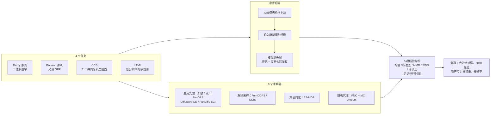

# 别只比最像的那一张：PosteriorBench 用参考后验给逆问题求解器打分

<!-- release-date: 2026-09-17 -->

> 本文依据 Caltech 等机构的 PosteriorBench: From Point Estimates to Posterior Matching in Evaluating Generative Inverse Solvers，即 arXiv:2609.20794v1（2026-09-17 提交），共 32 页。页码均指这份 PDF。全文把 3 件事分开标注：报告明确写了什么、我们如何解释或验算它、哪些是外部资料补充。

## 读前先把几个词说成人话

这篇是一份 benchmark 论文，不提出新求解器。它难读的地方不在公式，而在于它要求读者换一种打分方式：不再问「你给出的那张图像不像真值」，而是问「你给出的一堆样本，分布像不像真正的后验」。先把会反复出现的词说清楚：

- **逆问题（inverse problem）：** 看到的是间接、稀疏或带噪的测量，要反推产生它的那个物理场。比如只在 128 个点上量到压力，反推整块地层的渗透率。
- **前向映射（forward map）：** 从未知场算出观测的那一步，记作 $A$。可以是 PDE 求解器、油藏模拟器或辐射传输模型（PDF p. 3）。
- **病态（ill-posed）：** 很多个不同的场都能解释同一组观测。这时「唯一正确答案」本来就不存在。
- **后验分布（posterior）：** 在先验 $p(x)$ 之上，按观测把各种可能的场重新加权后得到的分布 $p(x \mid y_{\mathrm{obs}})$。它回答的是「在这些观测下，哪些场可能、各有多可能」。
- **扩散后验采样（diffusion posterior sampling）：** 用训练好的扩散模型当先验，在反向去噪的每一步额外加一个「往观测靠」的梯度。这个梯度前面的系数叫 **引导权重（guidance weight）。**
- **函数空间扩散（function-space diffusion）：** 把样本当成连续函数而不是固定分辨率的像素阵来建模，常配神经算子骨干，好处是换分辨率时不用重训。文中的 FunDPS、Fun-DDPS、DDIS、FunDiff 都属这一类。
- **参考后验（reference posterior）：** 用慢但可靠的办法（这里主要是拒绝采样加重要性权重）算出来的一组带权样本，充当「标准答案分布」。
- **MMD、SWD、RAPS：** 3 种比较 2 组样本分布的尺子，后文逐个讲。

## 一句话先说清

生成式模型（主要是扩散模型）越来越多地被用来解科学逆问题，而且它们天然能吐出一堆样本、自称是「后验采样器」。可现有评测几乎都只拿一张 held-out 真值去比单个样本或样本均值（PDF p. 1–2）。在病态问题里，这种打分会放过 3 类毛病：只塌到一个模式、低估不确定性、把互不相容的几种解平均成一张不物理的糊图（PDF p. 1）。

PosteriorBench 的做法是：

1. 选 4 个物理逆问题：Darcy 渗流反演、Poisson 源项恢复、碳捕集与封存（CCS）、光传输材料推断（LTMI）（PDF p. 1）；
2. 每个测试样例都配一份用拒绝采样等慢方法造出来的高保真参考后验（PDF p. 6）；
3. 用 5 项指标比较求解器生成的样本集与参考后验：均值误差、标准差误差、MMD、SWD、径向平均功率谱误差（PDF p. 1）；
4. 在这把尺子下跑 8 个求解器，并做点估计与分布指标的对照、分布外先验、观测噪声与引导权重、分辨率 4 组消融（PDF p. 7–12）。

它得到的判断有 4 条：函数空间扩散采样器整体最强，但哪一个最好随任务而变，经典的 ES-MDA 在 LTMI 上反而全面第一（PDF p. 8）；均值误差低不代表后验对（PDF p. 8）；点估计误差和分布误差之间是 V 形而不是单调关系（PDF p. 9）；单个引导权重没法同时把后验均值和后验方差都调准（PDF p. 11）。

### 一条阅读路线

1. p. 1–3：为什么点估计不够，以及式（1）–（5）的扩散后验采样框架。
2. p. 4–6：4 个任务与 Table 1、Figure 2，以及式（8）的参考后验构造。
3. p. 6–7：5 项指标的定义，式（9）–（15）。
4. p. 8 Table 2：主结果，32 行。
5. p. 9–12：Figure 3–7、Table 3–4，这是论文的主要洞见所在。
6. 附录 B–C（p. 19–22）：参考后验怎么造、怎么验；附录 E（p. 27–32）：各求解器的配置表。

## 主要矛盾：求解器声称在采样后验，评测却只看一张图

逆问题的贝叶斯写法是（PDF p. 1，式 1）：

$$
p(x \mid y_{\mathrm{obs}}) \propto p(y_{\mathrm{obs}} \mid x)\, p(x)
$$

似然 $p(y_{\mathrm{obs}} \mid x)$ 由前向测量模型给出，先验 $p(x)$ 编码对数据分布的假设（PDF p. 2）。扩散模型让这件事在高维场上变得可做：先验由学到的 score 网络提供，似然在推理时以引导项的形式加进去（PDF p. 2–3）。于是这类方法输出的是一组样本，而不是一个点估计，论文说它们「正在被当作 PDE 约束逆问题的后验采样器提出」（PDF p. 2）。

矛盾就在这里。方法按后验采样器来宣传，评测却还停在点估计：InverseBench 这类已有科学逆问题 benchmark 虽然覆盖了多种物理前向模型，但每个样例仍以单个解为中心（PDF p. 2）；更广泛地说，这个领域的评测常锚在一张 held-out 真值上（PDF p. 2）。论文的原话是：一个求解器可以对得上观测，却仍然低估后验方差，或者把互不相容的模式抹成一张不物理的均值图（PDF p. 2）。

**我们如何解释它。** 在病态问题里，那张 held-out 真值只是后验里的一个样本。拿它去比，相当于奖励「猜中了这一个」，而不是「把所有可能性都表示对了」。更糟的是，把输出往后验均值收缩（变糊）往往能降低对单个真值的 L2 误差，所以点估计打分会系统性地偏袒过度自信、过度平滑的方法。PosteriorBench 要把这条偏袒路堵上。

科学场景里这件事尤其要紧，因为后验不确定性直接进入决策（PDF p. 2）。CCS 就是例子：论文指出减少监测井数能显著降低现场作业与监测成本（PDF p. 2），而井越少，远离井的区域就越不确定，一个把不确定性低估的求解器会让人对 CO2 羽流走向过度放心。

## 全景：任务、参考、求解器、评测四块

这张图按 PDF p. 2 的 Figure 1 与 p. 4–8 的正文重画，是结构示意，不是论文原图。求解器的 4 个分组沿用 Figure 1 自己的 4 类（Diffusion models、Decoupled sampling、Ensemble assimilation、Stochastic surrogates，PDF p. 2）；Fun-DDPS 与 DDIS 归入解耦采样有正文依据（PDF p. 7），其余方法放进哪一格是我们按附录 E（PDF p. 28–32）的描述归的类。原图 Figure 1 的评测栏里还列了「Obs. residual」与消融栏的「Time budget」（PDF p. 2），但正文与附录的结果表只报了 5 项后验指标和运行时间，没有给出观测残差的数字，也没有时间预算的消融实验。

论文把设计收成 3 条原则：物理已知、可控的逆问题；高保真参考后验；比较分布而不是点估计的指标（PDF p. 4）。下面按这 3 条依次讲。

## 设计一：4 个任务，沿「后验为什么不唯一」的不同轴展开

### 旧问题：单一类型的逆问题测不出通用性

后验难不难恢复，取决于好几件事：先验长什么样、观测怎么采、前向物理多非线性、歧义主要来自哪里。只测一类问题，很容易把某个方法的特定归纳偏置误当成通用能力。

### 新设计：4 个任务各占一个角

Table 1（PDF p. 4）把 4 个任务沿这几条轴并排：

| 任务 | 先验类型 | 观测 | 前向映射 | 歧义来源 |
|---|---|---|---|---|
| Darcy 渗流反演 | 二值 | 稀疏传感器 | PDE 求解器 | 相分布布局 |
| Poisson 源项恢复 | 光滑 GRF | 稀疏传感器 | PDE 求解器 | 谱模态 |
| CO2 捕集与封存 | 地质统计多模态 | 井柱 | 油藏模拟器 | 羽流不确定性 |
| 光传输材料推断 | 云状纹理 | 低分辨率光学 | 辐射传输 | 材料布局 |

上图引自 PDF p. 4 的 Figure 2。最值得看的是下行：同一组观测下，参考后验的样本在 Darcy 上是连通方式完全不同的两相布局，在 LTMI 上是纹理走向不同的材料场。这就是「后验不是一个点」的直观样子。

**Darcy 渗流反演。** 在单位正方形上解稳态方程（PDF p. 4，式 6）：

$$
-\nabla \cdot \big(a(x)\nabla u(x)\big) = 1,\quad x \in \Omega,\qquad u\big|_{\partial\Omega} = 0
$$

$a$ 是未知的渗透率（或电导率）场，$u$ 是压力。先验沿用算子学习里的标准构造：采一个高斯随机场（GRF）再阈值化成高、低 2 相，取值 12 与 3（PDF p. 5）。观测是 $u$ 的稀疏点值。歧义来自：多条不同的高渗通道能在观测点上产生相近的压力（PDF p. 5）。附录 Table 5 给出分辨率 128、随机传感器 128 个、GRF 光滑度 $\alpha = 2.0$、相关长度 $\tau = 3.0$（PDF p. 21）。Figure 2 标的 0.78% 覆盖率，我们验算为 $128 / (128 \times 128) \approx 0.78\%$，与之一致。

**Poisson 源项恢复。** 方程是 $-\nabla^2 \phi = f$，从 $\phi$ 的稀疏观测反推源项 $f$（PDF p. 5，式 7）。和 Darcy 的区别在先验：$f$ 取自 GRF，但每个样例的相关长度 $\tau$ 与光滑度 $\alpha$ 各自独立采样（PDF p. 5），范围是 $\alpha \in [1.5, 3.0]$、$\tau \in [2.0, 4.0]$（PDF p. 21，Table 5）。所以它测的是求解器能不能覆盖一整族先验谱，而不是过拟合某一个固定先验（PDF p. 5）。

**碳捕集与封存（CCS）。** 未知量是静态渗透率场 $m$，观测是注入后 CO2 饱和度 $s = F(m)$ 在监测井上的值（PDF p. 5）。附录 B.2 给了完整设定：

- 径向对称的深部咸水层，场大小 64（深度）× 200（径向）（PDF p. 20）；连续注入 30 年（PDF p. 20）；
- 模拟域半径 100 km、厚 135 m，注入速率 0.36 Mt/年，单口垂直井（PDF p. 21）；
- 先验用 SGeMS 序贯高斯模拟，平均渗透率在 10–500 mD 间均匀采样，标准差 1–500 mD，径向相关长度 359–35,900 m，垂向相关长度 14–56 m，前向用 ECLIPSE（e300）（PDF p. 21）；
- 数据集 12,000 个训练对、1,390 个测试对（PDF p. 21）；
- 观测是注入井（$x = 0$）与约 491 m 外监测井（$x = 50$）的 2 条垂直剖面，每条 64 个值，共 128 个，占 12,800 个网格的 1%，并加 $\sigma_{\mathrm{obs}} = 0.04$ 的高斯噪声（PDF p. 21）。

论文说这个设定是故意为难：很多地质模型都能对上同样的井数据，远离井的地方后验空间不确定性很大（PDF p. 5）。

**光传输材料推断（LTMI）。** 每个样本是沿视线方向排列的 2 层参与介质，每层是云状或胞状形态的空间变化密度场（PDF p. 6）。测量是反射场与透射场，各有低分辨率或逐点 2 种形式；目标是推断材料的消光系数（PDF p. 6）。动机来自大气遥感、弥散光学层析和半透明材料无损检测（PDF p. 5）。Figure 2 显示观测为 16×16（PDF p. 4）。和前 3 个任务相比，LTMI 的正文描述最简略：没有给出场的分辨率、辐射传输求解器的名字、数据集规模和噪声水平。

### 这组选择接在系统哪里

4 个任务对应附录里的 3 种观测算子：稀疏随机点（Darcy、Poisson）、平均池化的低分辨率（Darcy、Poisson、LTMI）、井柱（CCS）（PDF p. 20）。场的尺寸都在 64×64 或 128×128 这一档（PDF p. 18–19）。论文用这一点和已有的后验 benchmark 划界：Zach 等人的统计 benchmark 是 64 个离散点的一维线性逆问题，模拟推断（SBI）benchmark 多是低维参数（PDF p. 19）。

### 可迁移启发

设计评测集时，先列出「后验为什么不唯一」的几种来源（布局歧义、谱歧义、远场不可观测、聚合测量），再让每个任务各占一种。只按「领域」挑任务，容易挑出 4 个歧义来源相同的问题。

## 设计二：参考后验，用慢方法给快方法当标准答案

### 旧问题：没有真后验，就没法比后验

要评「你的样本分布像不像后验」，先得有一个可信的后验。高维场上真正的后验几乎拿不到解析形式，而 MCMC、序贯蒙特卡洛、拒绝采样这类渐近可靠的方法又太慢，没法当实际求解器用（PDF p. 18）。

### 新设计：把慢方法降级成「出题人」

论文的立场很清楚：这些慢方法不是拿来部署的算法，而是拿来检验快的学习型采样器有没有恢复目标后验的参考过程（PDF p. 18）。

### 工作机制：离线先验池 + 在线拒绝 + 高斯加权

附录 B.1 把流程分成离线与在线 2 段，拆开是 4 步（PDF p. 19–20）：

1. **离线建先验池。** 从先验采大量场，逐个过前向求解器，存下（场，系统状态）对。池子大小只写了「足够大、随任务而定」。Darcy 与 Poisson 的求解器用 JAX 写，在 GPU 上大批量并行；CCS 与 LTMI 用各自领域的高保真模拟器生成（PDF p. 19–20）。
2. **在线按观测筛选。** 给定一个目标观测，计算每个候选的观测失配 RMSE，低于阈值 $\epsilon$ 就接受，直到凑够 $K$ 个，例如 $K = 100$（PDF p. 20，式 16）。
3. **旋转扩池。** Darcy 与 Poisson 在各向同性的方格上，论文把每个候选再做 0°、90°、180°、270° 旋转，池子变成 4 倍而不增加求解器调用；CCS 与 LTMI 保持原始朝向，以免破坏物理约束（PDF p. 20）。
4. **加权。** 被接受的样本再按高斯似然给权重，并归一化（PDF p. 6，式 8）：

$$
w_i \propto \exp\!\left(-\frac{\lVert A(x_i) - y_{\mathrm{obs}} \rVert_2^2}{2\sigma^2}\right),\qquad \sum_i w_i = 1
$$

阈值与噪声的关系固定为 $\epsilon = 3\sigma$，即 $\sigma = \epsilon/3$，让靠近接受边界的样本被适当降权（PDF p. 6、p. 20）。正文说为了指标计算高效，只随机保留 100 个失配低于阈值的样本（PDF p. 6）。Darcy 与 Poisson 共用阈值 $4 \times 10^{-4}$、噪声 $1.33 \times 10^{-4}$（PDF p. 21，Table 5），正好满足 3 倍关系。

CCS 单独说明（PDF p. 21）：从 200 万个先验地质模型里做拒绝采样；前向不用 ECLIPSE，而是用预训练的局部神经算子（LNO）代理把渗透率映射到饱和度；接受规则也不是上面的硬阈值，而是按高斯似然成比例的概率接受（PDF p. 21，式 20）。每个样例约接受 26,000 个样本，接受率约 1.3%。用代理而非完整模拟器，是让这种规模的拒绝采样变得可行的关键（PDF p. 21）。

### 参考后验本身稳不稳：GT1 对 GT2

参考集是有限样本，指标本身会带上「换一组参考就变」的方差。论文的检验办法是：用相同预算独立造 2 份参考集 GT1、GT2，把同一批求解器输出分别对它们打分，取比值 $r_m = \max(m_{\mathrm{GT1}}/m_{\mathrm{GT2}},\ m_{\mathrm{GT2}}/m_{\mathrm{GT1}})$，再在所有求解器上取最坏值（PDF p. 21–22，式 21）。Table 6（PDF p. 22）：

| 任务 | 均值误差 | 标准差误差 | MMD | SWD | 谱误差 |
|---|---:|---:|---:|---:|---:|
| Poisson | 1.0295 | 1.0198 | 1.0112 | 1.0431 | 1.0674 |
| Darcy | 1.0272 | 1.0269 | 1.0196 | 1.0490 | 1.1146 |
| 光传输 | 1.0132 | 1.0141 | 1.0090 | 1.0302 | 1.0589 |
| CCS | 1.0767 | 1.0505 | 1.0366 | 1.0738 | 1.1266 |

非谱指标的最坏比值都在 1.08 以下，谱误差最高到 1.1266（CCS）（PDF p. 22）。论文据此认为参考集已足够收敛，并且把评测的噪声底公开了（PDF p. 22）。

**我们如何解释它。** 这张表能读出一个实用的门槛：2 个方法在同一任务上的差距如果小于约 8%（谱误差小于约 13%），就落在参考集自身的抖动范围里，不宜当成胜负。后面读 Table 2 时要带着这把尺子。

### 代价与边界

这里有几处论文没有展开、但读者应该知道的边界，以下是我们的解读：

- **参考后验只能在先验池里找。** 拒绝采样接受的每个样本都来自池子。池子不够大，就只能在观测附近找到少量、偏向某些区域的样本。论文没有报告 Darcy、Poisson、LTMI 的池子规模。
- **CCS 的参考后验是「代理前向下的后验」。** 失配是用 LNO 代理算的，不是用 ECLIPSE（PDF p. 21）。代理有误差，参考后验就继承这份误差。
- **100 个样本的尺度。** 正文说每个样例保留 100 个样本（PDF p. 6）；CCS 附录写的是每个样例约 26,000 个接受样本（PDF p. 21），两者之间是否再下采样到 100，附录没有明说。
- **2 种权重写法。** 式（8）用的是观测失配的平方和，附录式（17）用的是 RMSE 的平方（按观测点数平均），CCS 的式（20）也除以观测点数（PDF p. 6、p. 20、p. 21）。两者差一个观测点数的缩放，论文没有说明实际代码用哪种。
- **摘要提到 MCMC。** 摘要与正文都说参考后验可由拒绝采样和马尔可夫链蒙特卡洛（MCMC）得到（PDF p. 1、p. 6），但附录只描述了拒绝采样加重要性加权这一套流程，没有哪个任务的 MCMC 细节。
- **阈值拒绝本身是近似。** 严格的拒绝采样按似然比例接受；Darcy 与 Poisson 用的是「硬阈值 + 软权重」（PDF p. 20），$\epsilon = 3\sigma$ 截掉了高斯尾部，得到的是截断后的后验近似。CCS 按似然比例接受（PDF p. 21），不受这一条影响；LTMI 用哪种规则，附录没有单独说明。

### 可迁移启发

给任何「生成式 = 采样器」的系统做评测，都可以照这个思路：找一个慢但渐近正确的方法当出题人，离线把参考分布算好；再用 2 份独立参考集互相打分，把评测噪声底写出来。没有噪声底的排行榜，第二位和第一位差 3% 时你没法判断这是不是噪声。

## 设计三：5 项指标，分别抓 5 种后验失败

### 旧问题：单一指标总有盲区

参考后验是一组带权样本 $P_{\mathrm{ref}} = \{(x_i, w_i)\}_{i=1}^{M}$，求解器给的是一组等权样本 $P_{\mathrm{gen}} = \{x'_j\}_{j=1}^{N}$（PDF p. 6）。两者不对称，所有指标都要按权重来算。任何单一数字都只看得到分布的一面。

### 新设计：从低阶到高阶，从空间到频域

**1. 均值误差与标准差误差（边缘矩一致性）。** 先分别算两边的均值场（参考侧按权重加权），再算相对 L2 误差（PDF p. 6，式 9–10）：

$$
\mathrm{Err}_{\mu} = \frac{\lVert \bar{\mu}_{\mathrm{gen}} - \bar{\mu}_{\mathrm{ref}} \rVert_2}{\lVert \bar{\mu}_{\mathrm{ref}} \rVert_2},\qquad
\mathrm{Err}_{\sigma} = \frac{\lVert \bar{\sigma}_{\mathrm{gen}} - \bar{\sigma}_{\mathrm{ref}} \rVert_2}{\lVert \bar{\sigma}_{\mathrm{ref}} \rVert_2}
$$

这里 $\bar{\sigma}$ 是逐点的边缘标准差场。论文特意强调：这个「均值误差」是和参考后验均值比，不是和单个真值比的均方误差（PDF p. 6）。标准差误差回答的是「哪里不确定、有多不确定」对不对。

**2. 最大均值差异（Maximum Mean Discrepancy，MMD）。** 把 2 组样本通过核函数嵌入到一个特征空间，比较 2 个分布的「平均嵌入」差多远，能捕捉高阶空间统计（PDF p. 6）。带权的平方 MMD 是（PDF p. 6，式 11）：

$$
\mathrm{MMD}^2 = \sum_{i,i'} w_i w_{i'} k(x_i, x_{i'}) + \sum_{j,j'} w'_j w'_{j'} k(x'_j, x'_{j'}) - 2\sum_{i,j} w_i w'_j k(x_i, x'_j)
$$

生成侧权重 $w'_j = 1/N$，报告的是开方后的值。核是多尺度 RBF，尺度集合 $S = \{0.2, 0.5, 1.0, 2.0, 5.0\}$ 乘以生成样本与参考样本间平方距离的中位数 $d$，同时对粗结构偏移与细空间差异敏感（PDF p. 7，式 12）。

**3. 切片 Wasserstein 距离（Sliced Wasserstein Distance，SWD）。** 先对每个场做 z-score 归一化（各任务单位不同），再投影到一族随机方向上，比较每个方向上一维分布的 Wasserstein 距离并取平均（PDF p. 7，式 13）。关键的小设计是：投影方向不是逐像素独立的高斯向量，而是从 GRF 里采的光滑方向，避免局部正负抵消，让 SWD 对应到空间连贯的物理差异（PDF p. 7）。默认 $L = 128$ 个投影，GRF 参数 $\alpha = 2$、$\tau = 3$（PDF p. 7）。

**4. 径向平均功率谱误差（Radially Averaged Power Spectrum，RAPS）。** 对每个样本做二维离散傅里叶变换得到功率谱，按波数半径 $k = \sqrt{k_x^2 + k_y^2}$ 分箱平均成一维谱，参考侧按权重平均、生成侧等权平均（PDF p. 7，式 14）。误差取各频段相对误差的几何平均（PDF p. 7，式 15）：

$$
\mathrm{Err}_{\mathrm{spec}} = \exp\!\left(\frac{1}{|K|}\sum_{k \in K} \log \frac{|S_{\mathrm{gen}}(k) - S_{\mathrm{ref}}(k)|}{|S_{\mathrm{ref}}(k)|}\right)
$$

用几何平均是为了不让功率很低的高频段主导结果（PDF p. 7）。它专门抓空间域指标不易察觉的过度平滑：能量在尺度间的分布被抹掉了，均值误差未必显示得出来（PDF p. 7）。

### 5 把尺子各抓什么

下表是我们按上面的定义整理的对照，不是论文原表：

| 指标 | 比的是什么 | 典型能抓住的失败 |
|---|---|---|
| 均值误差 | 后验中心 | 整体偏移、条件不足 |
| 标准差误差 | 逐点不确定性大小与位置 | 过度自信（方差过小）、过度发散 |
| MMD | 整个分布在核特征空间的差异 | 模式塌缩、高阶空间统计不对 |
| SWD | 多个光滑投影方向上的分布几何 | 样本整体形状偏离，对幅度敏感 |
| 谱误差 | 各尺度上的能量分布 | 过度平滑、高频纹理丢失 |

另外，评测前各方法的生成样本会被下采样到该任务统一的集合大小，所有指标都在物理参数空间里算（PDF p. 28）。统一集合大小具体是多少，论文没有写。

### 可迁移启发

评生成式模型的「采样质量」时，至少要有一个低阶矩指标（中心与散布）、一个全分布指标（MMD 或 SWD）、一个结构性指标（频谱或领域统计量）。把方差单独拎出来打分尤其重要：几乎所有带强条件的生成方法都倾向于低估方差，而均值指标对此毫无感觉。

## 被评的 8 个求解器

论文在全部 4 个任务上评了 8 个概率逆问题求解器（PDF p. 7）。附录 E 给出每个方法的训练与推理配置，所有「方法 × 数据集」组合都在同一个仓库里、用 NVIDIA B200 GPU 跑，走同一条评测流水线（PDF p. 27）。凡是需要学先验、score 模型、流模型、神经算子或可微代理的部件，都只在官方训练集上训练，训练时看不到用于评测的参考后验样本（PDF p. 27）。

| 方法 | 做法（按附录 E 的描述） | 怎么对观测做条件 |
|---|---|---|
| FunDPS | 函数空间联合扩散先验，同时建模未知场与观测场（PDF p. 28） | 对观测通道做 DPS 引导 |
| Fun-DDPS | 目标场扩散先验与前向映射解耦，前向用任务专属的 FNO 代理（PDF p. 28） | 代理上的似然引导 |
| DDIS | 同样解耦先验与可微前向，采样按 DAPS 风格分退火、扩散、Langevin 修正 3 段（PDF p. 28） | 代理上的似然引导 |
| DiffusionPDE | 网格上的联合 score 模型，覆盖未知场与物理场（PDF p. 28） | 对观测通道做引导 |
| FunDiff | 函数自编码器 + DiT 骨干的条件潜空间整流流（PDF p. 30） | 直接以观测表示为条件，无标量引导权重 |
| ECI-sampling | FNO 骨干的流匹配模型（PDF p. 31） | 稀疏或低分辨率观测上做硬替换 |
| ES-MDA | 非神经的集合平滑器，从先验采一组样本，反复做卡尔曼式同化更新（PDF p. 31） | 集合同化更新 |
| FNO + MC Dropout | 直接从带掩码观测映射到目标场的逆向 FNO，推理时保持 dropout 开启（PDF p. 32） | 多次随机前向传播出样本 |

几个值得注意的配置细节：

- 扩散类方法的引导权重在任务之间差别极大。FunDPS 在 Darcy、Poisson、CCS、LTMI 上分别是 4000、1600、300、3000（PDF p. 28，Table 9）；DiffusionPDE 是 40000、20000、1000、400（PDF p. 30，Table 15）；Fun-DDPS 是 1000、100、10.0、100.0（PDF p. 29，Table 11）；DDIS 是 10、2.0、0.25、1.0（PDF p. 30，Table 13）。论文没有写这些值是怎么选出来的。
- 反向步数：FunDPS 与 Fun-DDPS 为 500（PDF p. 28–29），DiffusionPDE 为 2000（PDF p. 30）。
- ES-MDA 的集合大小在 4 个任务上分别是 128、512、256、1024，同化次数分别是 2、1、4、1（PDF p. 32，Table 20）。
- 作者改过 DiffusionPDE 的原实现，修了归一化问题并支持批量推理，称这比原版表现更好（PDF p. 30）。

## 主结果：没有通吃的方法，而且各任务的赢家不同

Table 2（PDF p. 8）是全文的主表。所有指标越低越好；时间向上取整到 0.1 分钟（rounded up），所以表中的「0.1 min」只说明不超过 0.1 分钟。

| 任务 | 方法 | 均值误差 | 标准差误差 | MMD | SWD | 谱误差 | 时间 |
|---|---|---:|---:|---:|---:|---:|---:|
| Darcy | ECI | 0.5112 | 1.4975 | 0.6457 | 55.2020 | 0.2007 | 3.6 min |
| Darcy | ES-MDA | 0.4519 | 1.7547 | 0.5812 | 48.4836 | 0.3481 | 0.1 min |
| Darcy | FunDPS | 0.0804 | 0.4354 | 0.2040 | 3.0778 | 0.2016 | 8.8 min |
| Darcy | Fun-DDPS | 0.0767 | 0.4178 | 0.2131 | 2.7840 | 0.1222 | 7.1 min |
| Darcy | DiffusionPDE | 0.1009 | 0.7871 | 0.2268 | 6.7372 | 0.3252 | 40.3 min |
| Darcy | DDIS | 0.0620 | 0.4130 | 0.1997 | 2.9236 | 0.1676 | 14.2 min |
| Darcy | FunDiff | 0.1203 | 0.5900 | 0.3229 | 4.0833 | 0.1225 | 0.5 min |
| Darcy | MC-dropout | 0.1990 | 0.9509 | 0.6728 | 6.0297 | 0.1123 | 0.1 min |
| Poisson | ECI | 3.4434 | 8.7178 | 0.7623 | 69.5794 | 35.0923 | 0.8 min |
| Poisson | ES-MDA | 1.0933 | 5.6689 | 0.6370 | 41.5815 | 7.7886 | 0.1 min |
| Poisson | FunDPS | 0.4720 | 0.5862 | 0.6692 | 4.3900 | 0.2303 | 9.4 min |
| Poisson | Fun-DDPS | 0.1839 | 0.4329 | 0.3576 | 2.4304 | 0.0752 | 7.3 min |
| Poisson | DiffusionPDE | 0.3319 | 0.7004 | 0.6814 | 4.2661 | 0.1907 | 40.0 min |
| Poisson | DDIS | 0.1413 | 0.3073 | 0.2570 | 1.8568 | 0.1760 | 15.3 min |
| Poisson | FunDiff | 1.0529 | 4.3679 | 0.6363 | 34.8920 | 4.0411 | 0.5 min |
| Poisson | MC-dropout | 0.3495 | 0.8837 | 0.7157 | 4.4383 | 0.2053 | 0.1 min |
| CCS | ECI | 0.6753 | 1.5330 | 0.4991 | 10.5775 | 88.8274 | 0.3 min |
| CCS | ES-MDA | 0.2457 | 1.0903 | 0.2941 | 8.0556 | 14.5449 | 0.1 min |
| CCS | FunDPS | 0.1419 | 0.2952 | 0.2018 | 4.2564 | 0.6370 | 6.3 min |
| CCS | Fun-DDPS | 0.4659 | 1.0305 | 0.2410 | 6.9947 | 14.7840 | 6.2 min |
| CCS | DiffusionPDE | 0.2015 | 0.3549 | 0.2781 | 5.8572 | 0.7294 | 34.0 min |
| CCS | DDIS | 0.3277 | 0.4332 | 0.3007 | 7.3551 | 2.2043 | 9.2 min |
| CCS | FunDiff | 0.1792 | 0.5195 | 0.3647 | 7.1329 | 0.6896 | 1.5 min |
| CCS | MC-dropout | 0.2574 | 0.8926 | 0.6844 | 13.5715 | 0.6555 | 0.1 min |
| LTMI | ECI | 0.3045 | 0.3911 | 0.4509 | 8.8375 | 0.1810 | 0.1 min |
| LTMI | ES-MDA | 0.1250 | 0.2007 | 0.2842 | 2.4285 | 0.0612 | 0.1 min |
| LTMI | FunDPS | 0.1611 | 0.2867 | 0.3327 | 2.8501 | 0.0640 | 5.4 min |
| LTMI | Fun-DDPS | 0.1699 | 0.2374 | 0.3326 | 2.9389 | 0.1828 | 4.8 min |
| LTMI | DiffusionPDE | 0.1593 | 0.2265 | 0.3183 | 2.9462 | 0.1554 | 10.8 min |
| LTMI | DDIS | 0.1504 | 0.2265 | 0.3033 | 2.9999 | 0.1869 | 4.8 min |
| LTMI | FunDiff | 0.1492 | 0.3994 | 0.3753 | 3.1404 | 0.2624 | 0.4 min |
| LTMI | MC-dropout | 0.1554 | 0.8542 | 0.6707 | 4.6755 | 0.5060 | 0.1 min |

原表用深、浅蓝标出每个任务每项指标的第一、第二名（PDF p. 8）。按原表的第一名读：

- **Darcy：** DDIS 拿下均值、标准差、MMD；SWD 第一是 Fun-DDPS；谱误差第一竟是 MC-dropout（0.1123）（PDF p. 8）。
- **Poisson：** DDIS 拿下均值、标准差、MMD、SWD；谱误差第一是 Fun-DDPS（PDF p. 8）。
- **CCS：** FunDPS 5 项全第一（PDF p. 8）。
- **LTMI：** 非神经的 ES-MDA 5 项全第一，用时 0.1 分钟（PDF p. 8）。

论文自己的读法有 2 层（PDF p. 8–9）：FunDPS、Fun-DDPS、DDIS 构成一族建在函数空间 score 先验上的引导扩散采样器，整体说明函数空间先验在稀疏或低分辨率观测下对后验匹配有用；但表现依任务而定，ES-MDA 这样的经典方法可以在 LTMI 上更强，最好的函数空间方法也随数据集而换。和 DiffusionPDE 对比，说明谱算子骨干比网格骨干更贴合连续物理场；和 ECI 对比，说明软似然引导比硬替换观测值更能留在先验流形上，这是恢复一组样本而不只是一个点的关键（PDF p. 8–9）。

**我们如何解释它。** 读这张表时有 3 件事要记住：

1. **跨任务的数值不能直接比。** SWD 在 Darcy 上动辄几十，在 LTMI 上是个位数；ECI 的谱误差在 Poisson 与 CCS 上分别到 35.0923 和 88.8274（PDF p. 8）。每个任务的动态范围不同，只能在同一任务内比排名。
2. **同一个方法能在一个任务上崩掉。** Fun-DDPS 在 Poisson 上多项排在前两名，在 CCS 上均值误差 0.4659、谱误差 14.7840，比 ES-MDA 还差；而且附录 Table 7 给出它在 CCS 上各样例间的标准差误差的标准差高达 1.7852、谱误差的标准差 56.4968（PDF p. 27），我们推测是在少数样例上失效，而不是整体偏差。FunDiff 在 Darcy、CCS、LTMI 都还行，到 Poisson 均值误差 1.0529、谱误差 4.0411（PDF p. 8）。论文没有逐个解释这些崩点的原因。
3. **小差距要对照噪声底。** LTMI 上 DDIS 与 DiffusionPDE 的标准差误差都是 0.2265，Fun-DDPS 与 FunDPS 的 MMD 是 0.3326 对 0.3327（PDF p. 8）。按 Table 6 的最坏比值（LTMI 非谱指标在 1.03 左右），这些都分不出胜负。

另外，附录 Table 7 给出了跨样例的标准差，但只列了 7 个方法，没有 MC-dropout 的行（PDF p. 27）。运行时间一列没写是每个样例还是整个任务的耗时。

## 发现一：均值误差低，不代表后验对

这是论文反复强调的第一个判断（PDF p. 2、p. 8）。例子来自 LTMI：MC Dropout 的均值误差 0.1554，低于 FunDPS 的 0.1611；但它的标准差误差 0.8542 对 0.2867、MMD 0.6707 对 0.3327、SWD 4.6755 对 2.8501，全都差得多（PDF p. 8）。

上图引自 PDF p. 9 的 Figure 3。论文说这不是指标之间的矛盾：MC Dropout 的样本相对参考明显过度平滑，FunDPS 更好地保留了材料场的细纹理（PDF p. 8）。低均值误差可以只是对上了中心趋势，却完全没表达后验的几何形状与散布（PDF p. 8）。所以论文的建议是：均值误差与标准差误差要联读，能的话再配上 MMD 与 SWD（PDF p. 3、p. 8）。

**我们如何解释它。** MC Dropout 的样本本质上是「一张平滑的均值图 + 一点 dropout 抖动」。它的均值恰好在中间，所以均值误差低；但样本之间差别小，而且每个样本都没有参考样本那种高对比的纹理，所以方差和分布指标都差。Darcy 上还有一个同类现象：MC-dropout 的谱误差全场第一（0.1123），MMD 却是全场最差（0.6728）（PDF p. 8）。单看任何一个指标，都会把它误判成好方法。

## 发现二：点估计误差和分布误差是 V 形关系

论文额外算了传统的逐点相对 L2 误差（对单个参考样本），和 5 项后验指标逐一画散点（PDF p. 9）。

上图引自 PDF p. 9 的 Figure 4。论文的读法（PDF p. 9）：

- **低逐点误差一侧：** 把样本推得更贴近单个参考，会抹掉分布结构，于是逐点指标在变好，分布敏感的误差却在变大；
- **高逐点误差一侧：** 2 类误差都大，二者正相关；
- 所以单看逐点指标，会把过拟合或过度集中的样本误判成好样本。

附录 D.2 的 Figure 10 在对数坐标下画了 5 项后验指标两两之间的散点，趋势一致说明 2 项指标意见相同，分散说明各有专属的失败模式（PDF p. 25–26）。论文没有对这张图给出逐面板的定量结论。

**我们如何解释它。** V 形的左半边是最危险的区域：一个方法越是「看起来准」，越可能已经塌成一个点。如果只用逐点误差做模型选择或调参，优化方向会系统性地把你推到 V 的左臂上。

## 发现三：强方法也普遍低估方差

Figure 5 把 FunDPS 与 DDIS 在 Poisson 与 Darcy 上的后验均值、标准差误差画成空间图（PDF p. 10）。

上图引自 PDF p. 10 的 Figure 5。论文的观察（PDF p. 9–10）：

- 2 种方法都恢复了后验的主结构，误差集中在高梯度与高不确定区域；
- 两者都偏保守：Poisson 上均值误差把源项极值往 0 拉，说明低估了极值幅度；
- 标准差误差图在 Poisson 与 Darcy 上都以负值为主，说明系统性低估后验方差；
- Darcy 的误差集中在尖锐的相界面附近；
- DDIS 的残差空间上更均衡、局部大伪影更少，但捕捉后验极值与方差全幅仍是两者共同的难点。

**我们如何解释它。** Darcy 的参考标准差图（右半组下行第一格）是一条亮带，正是两相界面最可能出现的位置；FunDPS 的误差在这条带上一正一负交替，说明它把界面位置的不确定性画窄了或画偏了。对下游决策来说，这恰恰是最需要知道的那部分不确定性。

## 消融一：先验训练范围越宽，逐点越好，分布反而越差

### 设定

在 Poisson 上改变训练 Fun-DDPS 先验时 GRF 光滑度 $\alpha$ 的覆盖范围，分 3 档：单点 $\alpha = 2.25$、窄 $\alpha \in [1.875, 2.625]$、全 $\alpha \in [1.5, 3.0]$。用于似然引导的可微代理在 3 档里都用全范围训练，因此这组实验只隔离「先验训练覆盖」一个变量（PDF p. 10）。

Table 3（PDF p. 10）：

| 先验覆盖 | 逐点相对 L2 | 均值误差 | 标准差误差 | MMD | SWD | 谱误差 |
|---|---:|---:|---:|---:|---:|---:|
| 单点 | 0.4176 | 0.1551 | 0.3235 | 0.2669 | 1.7041 | 0.0330 |
| 窄 | 0.3418 | 0.1487 | 0.3151 | 0.2879 | 1.8243 | 0.0358 |
| 全 | 0.2956 | 0.1464 | 0.3720 | 0.3730 | 2.4415 | 0.0329 |

全范围先验的逐点 L2 最低，但标准差误差、MMD、SWD 随覆盖变宽而变差（PDF p. 10）。论文的结论是：更宽的先验覆盖不会自动改善后验匹配，因为先验要表示一个更大、更难学的源项范围（PDF p. 10）。

**我们如何核对这张表。** MMD 与 SWD 是单调变差的；标准差误差其实是窄档（0.3151）略好于单点档（0.3235），到全档才明显变差（0.3720）。谱误差 3 档几乎持平。所以「随覆盖变宽而变差」严格成立的是 MMD 与 SWD，标准差误差是「到全档才变差」。

### 诊断：物理一致性与潜参数恢复

上图引自 PDF p. 11 的 Figure 6。2 项诊断（PDF p. 10）：

1. **PDE 残差。** 对每个生成的（源项，势）对计算 Poisson 残差 $|A(\hat{\phi}) - \hat{f}|$。全档出现更多高残差离群点，说明更频繁地违反 PDE。读图可见，单点与窄档的残差都挤在 0.1 附近，全档有一串散点延伸到 0.6 以上（读自 PDF p. 11 Figure 6 上行）。
2. **$\alpha$ 恢复。** 用 DCT 域的 GRF 谱似然从每个生成源项反推光滑度 $\alpha$。估计值一致地偏低于参考后验；训练范围越宽，估计分布主要向更低的值扩散（PDF p. 10）。读图可见，参考区间大致落在 2.0–3.0，生成样本的估计大致落在 1.6–1.8，全档扩到 1.4 附近（读自 PDF p. 11 Figure 6 下行）。

论文据此给出 2 个判断（PDF p. 10）：分布指标比逐点 L2 更贴近潜参数恢复与物理一致性诊断；Poisson 虽是合成 GRF 族，但潜在光滑度的变化已经足以让强采样器恢复不了参数结构，因此它仍是一个有难度的 benchmark。

**我们如何解释它。** 这组消融把「像素上看起来对」和「物理上是对的」拆开了。生成样本在像素空间可信，但 $\alpha$ 系统性偏低，意味着样本比参考更粗糙；PDE 残差离群点意味着源项与势之间的物理关系被破坏。逐点 L2 对这 2 件事都不敏感，分布指标能部分反映。

## 消融二：一个引导权重调不准 2 件事

### 旧说法：引导权重应当按噪声精度缩放

对加性高斯观测 $y_{\mathrm{obs}} = A(x) + \eta$，$\eta \sim \mathcal{N}(0, \sigma_y^2 I)$（PDF p. 3，式 4），似然的 score 是（PDF p. 3，式 5）：

$$
\nabla_x \log p(y_{\mathrm{obs}} \mid x) = -\frac{1}{2\sigma_y^2}\nabla_x \lVert A(x) - y_{\mathrm{obs}} \rVert_2^2
$$

前面的系数正比于噪声精度 $\sigma_y^{-2}$。所以理论上引导权重应随 $\sigma_y^{-2}$ 缩放。但实际用的引导系数会受离散化、归一化、退火调度等因素影响，不一定遵守这条规则（PDF p. 11）。

### 实验：扫噪声、扫权重

在 Poisson 上，用 FunDPS 改变观测噪声尺度 $\sigma$，对每个指标 $m$ 找使其最小的引导权重 $\lambda^\star_m(\sigma)$（PDF p. 11）。附录 D.1 给出完整扫描：阈值 $\epsilon \in \{3, 4, 5, 6, 7, 8\} \times 10^{-4}$，引导权重 $\lambda \in [0, 1000]$（PDF p. 22）。由于 $\epsilon = 3\sigma$，最小阈值对应 $\sigma^{-2} = 10^8$，最大阈值对应约 $0.14 \times 10^8$，这是我们的验算，与 Figure 7 横轴的范围一致。

上图引自 PDF p. 12 的 Figure 7。论文读出 2 件事（PDF p. 11）：

1. **方向对。** 几乎所有指标的最优引导权重都随 $\sigma^{-2}$ 增大，谱误差波动大但也大体同向，这与高斯似然假设一致。
2. **最优值因指标而异。** 同一噪声下，$\lambda^\star_m$ 在各指标间不同，尤其是均值误差与标准差误差之间。均值和标准差是同一后验的两个互补摘要，这种分离说明「把后验中心拟合得最好的引导强度，未必让方差校准」，单个标量引导权重要在均值精度和不确定性校准之间取舍（PDF p. 11）。

读图可见，在 $\sigma^{-2} = 10^8$ 处，均值误差的最优权重约 425，标准差误差约 225；在约 $0.14 \times 10^8$ 处，二者约为 225 与 50（读自 PDF p. 12 Figure 7）。

附录 D.1 补了 2 层（PDF p. 22）：

- 过小的引导让采样对观测条件不足，过大的引导逐步扭曲后验校准；阈值越大（观测越噪），最优点越往小 $\lambda$ 移，符合「噪声越大，似然引导应越弱」。
- 标准差误差的最优点常在明显比均值误差小的 $\lambda$ 处，MMD、SWD、谱误差选在中间（PDF p. 22，Figure 8 在 PDF p. 23）。

Figure 9（PDF p. 24）在 $\lambda \in \{25, 250, 1000\}$ 下画了一个代表样例的误差场：弱引导时后验均值留着连贯的大尺度残差结构，说明条件不足；强引导时修正在空间上不均匀，出现局部过度修正；标准差误差图显示，引导过弱与过强都会扭曲后验散布的空间分布（PDF p. 22）。

**我们如何解释它。** 从图上读，$\sigma^{-2}$ 变了约 7 倍，均值误差的最优权重只变了约 2 倍，标准差误差的约 4.5 倍。也就是说，最优权重虽然同向变化，但远没有按噪声精度成正比缩放。这支持论文开头的那句概括：更强的引导改善观测一致性，但往往低估后验方差；更弱的引导保住多样性，代价是均值有偏或条件不足（PDF p. 3）。论文据此提出需要能同时校准均值与方差的条件机制，而不是依赖单一权重（PDF p. 3）。这是一个方向性的呼吁，论文没有给出这样的机制。

## 消融三：函数空间训练更抗分辨率变化

在 Darcy 上，分别用 64×64、128×128、多分辨率训练 DiffusionPDE 与 FunDPS，统一在 128×128 上推理（PDF p. 12）。Table 4（PDF p. 12），数值为均值 ± 跨样例标准差：

| 训练分辨率 | 方法 | 均值误差 | 标准差误差 | MMD | SWD | 谱误差 |
|---|---|---:|---:|---:|---:|---:|
| 64×64 | DiffusionPDE | 0.1838 ± 0.0433 | 0.9324 ± 0.1902 | 0.3361 ± 0.0506 | 1.6860 ± 0.4621 | 0.0690 ± 0.0478 |
| 64×64 | FunDPS | 0.1070 ± 0.0191 | 0.4540 ± 0.0935 | 0.2570 ± 0.0474 | 0.8440 ± 0.2320 | 0.0250 ± 0.0179 |
| 128×128 | DiffusionPDE | 0.1745 ± 0.0319 | 0.6708 ± 0.1016 | 0.3306 ± 0.0425 | 1.2667 ± 0.4895 | 0.0506 ± 0.0348 |
| 128×128 | FunDPS | 0.0926 ± 0.0182 | 0.3570 ± 0.0396 | 0.2030 ± 0.0292 | 0.8090 ± 0.2820 | 0.0158 ± 0.0129 |
| 多分辨率 | DiffusionPDE | 0.1833 ± 0.0423 | 0.9324 ± 0.1860 | 0.3368 ± 0.0494 | 1.5465 ± 0.5450 | 0.0661 ± 0.0485 |
| 多分辨率 | FunDPS | 0.0886 ± 0.0237 | 0.4010 ± 0.0821 | 0.2210 ± 0.0451 | 0.7400 ± 0.1980 | 0.0154 ± 0.0110 |

FunDPS 在 3 种训练设置下每项都优于 DiffusionPDE；DiffusionPDE 随分辨率提升收益有限（PDF p. 11）。论文据此认为函数空间训练提升了对训练/测试分辨率变化的鲁棒性（PDF p. 11）。

**我们如何核对这张表。** 论文说 FunDPS「在多分辨率训练下分布对齐最好」（PDF p. 11）。逐列看，多分辨率档的均值误差、SWD、谱误差确实最好，但标准差误差（0.4010）与 MMD（0.2210）都不如 128×128 档（0.3570、0.2030）。另外，Table 4 里 FunDPS 在 128×128 训练时的 Darcy 均值误差是 0.0926，与 Table 2 的 0.0804（PDF p. 8）不同，论文没有解释两次实验的设置差别。

**我们如何解释它。** 最有信息量的一格是 64×64 训练、128×128 推理：FunDPS 的标准差误差 0.4540，DiffusionPDE 是 0.9324。网格骨干换分辨率时，最先坏掉的是不确定性，而不是均值。

## 限制、边界，以及不要补进去的实现

论文自己承认的限制只有 2 条（PDF p. 12）：构建高保真参考后验的成本限制了 benchmark 的规模；目前评测的求解器数量有限。作者希望它成为靠社区不断扩充的评测平台（PDF p. 12）。

读完后我们认为还要留下的判断：

- **参考后验的可信度只被部分验证。** GT1/GT2 检验证明的是「参考集收敛了」，不证明「参考集就是真后验」。拒绝采样受限于先验池，CCS 还受限于 LNO 代理的精度。
- **歧义主要来自先验池里已有的模式。** 如果真后验有先验池没覆盖到的模式，参考后验同样会漏，求解器补上了反而会被扣分。
- **LTMI 的描述很薄。** 场分辨率、前向求解器、噪声、数据规模都没写（PDF p. 5–6）。
- **样例数与集合大小没写全。** 各任务测试样例数没有在正文说明，Figure 6 的纵轴显示 Poisson 有 50 个样例（PDF p. 11）；统一的评测集合大小没有给出数字（PDF p. 28）。
- **引导权重怎么调的没写。** 附录表里各任务的权重跨了几个数量级（PDF p. 28–30），但没有说是否对着参考后验调过。若调参时看过参考后验，就和「训练时不接触参考样本」（PDF p. 27）不完全是一回事；论文没有交代。
- **Figure 1 与正文不完全对应。** 观测残差与时间预算消融出现在概览图里（PDF p. 2），结果部分没有对应数字。摘要说「生成噪声」是方差校准的关键之一（PDF p. 1），正文没有单独针对生成噪声的消融。
- **只有 2D 场。** 全部任务都是 64×64 到 128×128 量级（CCS 为 64×200）的二维场（PDF p. 19–20），没有三维或时变未知量。

## 可迁移启发

1. **生成模型的评测要看分布，而不是看最好的一张。** 只要模型对外宣称是「采样器」，就要有参考分布与分布指标；否则评测会系统性奖励塌缩和过度平滑。
2. **均值与方差必须联读。** 单报均值误差会漏掉过度自信的方法；MC Dropout 在 LTMI 上的例子足以说明问题：均值误差略好，标准差误差却是 FunDPS 的约 3 倍（0.8542 对 0.2867，PDF p. 8）。
3. **把慢方法当出题人。** 拒绝采样、MCMC 在线上用不起，离线造参考分布却完全可行；再配一个用神经算子代理加速前向的技巧（CCS 从 200 万候选里筛），规模就上来了。
4. **公开评测噪声底。** 用 2 份独立参考集互评，给出最坏比值；排行榜上小于这个比值的差距不算胜负。
5. **逐点误差当调参目标是危险的。** V 形关系意味着沿逐点误差下降的方向调参，可能正在把模型推向塌缩。调参至少要同时盯一个方差或分布指标。
6. **一个标量旋钮调不准 2 个目标。** 引导权重在均值与方差之间有取舍，这对任何「先验 + 引导」式的条件生成（包括分类器引导、CFG）都值得警惕：强条件换来的一致性，常以低估多样性为代价。
7. **扩大训练覆盖不等于更好。** Poisson 的 OOD 消融显示，先验要学的范围更宽，逐点误差降了，分布与物理一致性反而退步。扩数据时要用分布指标和物理诊断把关。
8. **函数空间表示对分辨率迁移有实效。** 需要在不同网格上部署的科学生成模型，优先考虑神经算子类骨干；它首先保住的是不确定性估计。

## 关键词回看

- **后验匹配：** 评测对象从「单个重建」换成「样本分布与参考后验的吻合度」，这是全文的主轴。
- **参考后验：** 先验池 + 前向模拟 + 阈值拒绝 + 高斯加权，$\epsilon = 3\sigma$，每例保留 100 个样本；CCS 用 LNO 代理从 200 万候选里筛。
- **GT1/GT2 检验：** 2 份独立参考集互评，非谱指标最坏比值低于 1.08。
- **5 项指标：** 均值误差、标准差误差、MMD（多尺度 RBF 核）、SWD（GRF 光滑投影，128 个方向）、谱误差（径向平均功率谱，几何平均）。
- **4 个任务：** Darcy（二值先验、相布局歧义）、Poisson（变谱 GRF）、CCS（2 口井、1% 覆盖）、LTMI（2 层介质、低分辨率光学）。
- **函数空间扩散采样器：** FunDPS、Fun-DDPS、DDIS 整体最强，但各任务赢家不同；LTMI 上 ES-MDA 全面第一。
- **V 形关系：** 逐点误差最低的一端，分布误差反而升高。
- **引导权重的均值–方差取舍：** 最优权重随噪声精度上升，但均值与方差的最优点分离，单一权重无法兼顾。
- **分辨率鲁棒性：** 函数空间训练在跨分辨率推理时明显更稳，尤其是标准差误差。

## 资料与阅读边界

### 本文依据的版本

- 本地原件：`papers/Caltech/PosteriorBench.pdf`，32 页，页边标注 `arXiv:2609.20794v1 [cs.LG] 17 Sep 2026`（PDF p. 1）。
- 官方页：[arXiv:2609.20794](https://arxiv.org/abs/2609.20794)。截至核验只有 v1，提交于 2026-09-17 17:54:12 UTC，与本地 PDF 一致。
- `release-date` 取 2026-09-17。这篇是 benchmark 论文，不对应一个对外可用的模型，按「只讲公开技术时取该技术首次官方公开日」的口径，取 arXiv v1 提交日。论文首页给出的代码仓库 [neuraloperator/PosteriorBench](https://github.com/neuraloperator/PosteriorBench)（PDF p. 1）的首次公开时间与内容未能核实。
- 作者单位：加州理工学院（共同一作 Jiachen Yao、Xi Deng 与末位作者 Anima Anandkumar 所在）、台湾大学、劳伦斯伯克利国家实验室、斯坦福大学能源科学与工程系、EarthFlow AI 公司、帝国理工学院地球科学与工程系（PDF p. 1）。

### 报告明确写了、本文覆盖了的部分

摘要；第 1 节动机、发现与 3 项贡献；第 2 节扩散后验采样预备知识式（1）–（5）；第 3 节 3 条设计原则、Table 1、Figure 2、4 个任务、参考后验构造式（8）、5 项指标式（9）–（15）；第 4 节 8 个方法、Table 2、Figure 3–7、Table 3–4 与各消融；第 5 节讨论与限制；附录 A 相关工作中的 benchmark 定位；附录 B 拒绝采样流程、观测算子、Table 5、CCS 设定；附录 C 参考集一致性检验与 Table 6；附录 D Figure 8–10 与 Table 7；附录 E 训练与评测协议及各方法配置表（Table 8–21 取了关键数字）。

### 外部资料补充（不是 PDF 原文）

- 本文没有引入 PDF 之外的技术事实。arXiv 版本与提交时间来自 arXiv 官方页。
- 文中「我们如何解释它」「我们如何核对这张表」段落里的验算（0.78% 覆盖率、$\sigma^{-2}$ 取值范围、Table 3 与 Table 4 的逐列核对）和解读，都是基于 PDF 数字的推断，不是作者原话。
- 被评方法的原始论文（FunDPS、DDIS、Fun-DDPS、FunDiff、DiffusionPDE、ECI-sampling、ES-MDA、InverseBench 等）只按本 PDF 的描述引用，未单独展开；它们的出处见 PDF p. 13–17 的参考文献。

### 原文没有公开、本文也不补的缺口

- Darcy、Poisson、LTMI 的先验池规模，各任务的测试样例数，以及统一评测集合大小；
- LTMI 的场分辨率、辐射传输求解器、噪声水平与数据规模；
- 摘要提到的 MCMC 参考后验在哪个任务、以什么设置使用；
- CCS 的约 26,000 个接受样本是否再下采样到 100 个；
- 各方法引导权重的选取流程，以及是否接触过参考后验；
- Table 2 运行时间的计量口径（每个样例还是整个任务）；
- MC-dropout 的跨样例标准差（Table 7 缺这一行）；
- Figure 1 中观测残差指标与时间预算消融对应的结果；
- 代码仓库的具体内容与复现脚本（本文未核实）。
