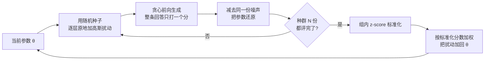

# Evolution Strategies at Scale：十亿维全参微调可以不走反传，三十个扰动就够搜

<!-- release-date: 2025-09-29 -->

> 本文依据 Cognizant AI Lab 主导、MIT / UCLA / UT Austin 合作发布的 **Evolution Strategies at Scale: LLM Fine-Tuning Beyond Reinforcement Learning** 。本地原件已替换为 arXiv:2509.24372 **v3** （2026-07-14），封面页边标注 `arXiv:2509.24372v3 [cs.LG] 14 Jul 2026`，共 29 页，正式录用为 ICML 2026（Seoul，PMLR 306）。下文括号里的 `PDF p.N` 都指这份 29 页原件的文件页码。解读依据 v3，不沿用 v1 / v2 的页码、表格和「不到 20% 样本」这类已被删掉的表述。文中会明确区分三件事：论文写了什么、本文如何解释它、哪些是外部资料补充。

这是一篇技术论文，不是基模报告。它不讲某个具体基座怎么训出来，只讲一件事：**把进化策略扩到十亿参数的全参微调，而且不做降维。** 对照对象是 PPO / GRPO 这类策略梯度实现。本篇讲的是参数空间里的种群搜索，不是策略梯度；GRPO 怎么从 PPO 里删掉价值模型，见本站 DeepSeekMath 篇，这里不重复。

## 读前需要的最少背景

这篇论文假设读者知道「用奖励微调语言模型」这件事，但不假设你见过进化策略。先把六个会反复出现的词说清楚。

- **参数 $\theta$**：模型里所有可训练的权重。这篇论文要动的就是整份 $\theta$，不是某一层，也不是 LoRA 那种低维插件。
- **奖励 $R(\cdot)$**：给一次完整回答打一个分。Countdown 看算式对不对，简洁性任务看回答有多短，数学任务看 `\boxed{}` 里的答案对不对。中间过程不打分。
- **反传（backpropagation）**：从损失往回算每个参数该怎么改。PPO / GRPO 都靠它。这篇论文从头到尾不做这一步。
- **动作空间探索**：生成下一个 token 时按概率表随机抽样。策略梯度类方法的探索发生在这里——每个位置都在掷骰子。
- **参数空间探索**：不改抽样方式，改模型权重本身。给 $\theta$ 加一小撮噪声，得到一个略有不同的模型，再让它完整地回答一遍。
- **种群（population）**：每一轮同时试 $N$ 份被扰动过的参数。$N$ 就是种群大小。论文里默认 $N=30$。

再补两个名字：

- **进化策略（Evolution Strategies，ES）**：一类零阶优化算法。人话是：不要梯度，随机扰动一批候选，看谁得分高，再按得分把扰动加权平均回去。本文用的是简化版 Natural Evolution Strategies，扰动噪声的协方差固定，和 OpenAI ES 同一条设计线（PDF p.4）。
- **近端策略优化（PPO）** 与 **组相对策略优化（GRPO）** ：当前 LLM 强化学习最常用的两种算法。本文只把它们当对照实现，不展开公式。

## 一句话先说清

这篇论文要推翻的假设很具体：ES 在几百万参数上曾经能跟 RL 打平，但大家默认它扩不到现代 LLM，因为参数空间探索的复杂度随参数量平方增长，而动作空间探索只跟词表大小和回答长度有关（PDF p.2–3，引 Vemula et al., 2019）。

作者的回答是一次工程加一次实验：

> **第一次把 ES 扩到十亿参数全参微调，不做降维；在长程奖励、跨基座稳健、更少 reward hacking、更稳这几条轴上，优于文中那些既有 RL 实现。** （PDF p.1）

这句话必须按它的口径读。论文比的是 TinyZero / GRPO-Zero / VERL 上的 PPO-z、GRPO-z、GRPO-v、Dr.GRPO-v，以及公开的 SimpleRL-Zero、OpenReasoner-Zero、Oat-Zero checkpoint（PDF p.5、p.7、p.16）。它没有、也不该被读成「全面碾压所有 RL」。数学那一组实验，论文自己写的是 competitive，并且强调当前 ES 还是 vanilla 实现（PDF p.7）。

## 这篇论文在系统里落在哪

这是根据 PDF p.3–5 的 Algorithm 1 / Algorithm 2 重画的机制示意图，不含实测时间或数据。整条路上没有反传、没有价值模型、没有 token 级优势估计。探索只发生在「给参数加噪声」这一步；生成阶段用贪心解码，把动作空间的随机性关掉（PDF p.5）。

## 旧方法卡在哪：不是 ES 不行，是大家觉得维数太高

### 策略梯度在长程奖励上的四条病

论文把 RL 微调的困难写成四条，不是一句「RL 不好」（PDF p.1）：

1. **样本效率低、梯度估计方差大。** 只有最后一个 token 才有奖励时，要把这个分数归因到前面几百上千个 token，估计器很噪。
2. **对基座敏感。** 同一套 RL 配方换一个基座，效果可以差一截（论文引 Gandhi et al., 2025）。
3. **容易 hack 奖励。** 模型会找到「分数高、行为坏」的捷径。
4. **同一套超参多跑几次也不稳。** 微调成本因此被放大。

这四条是作者给 RL 开的问题清单。后文实验分别对这四条给证据，强度并不一样，后面会分开说。

### 为什么 ES 一直没被拿来微调 LLM

ES 本身不新。Rechenberg / Schwefel 在 1970 年代就提出来了；Salimans et al. (2017) 的 OpenAI ES 第一次把它扩到深度网络，在控制和游戏里能跟当时的 RL 打平（PDF p.2）。但先前把 ES 用在神经网络上的规模停在百万参数量级：

| 工作 | 大约规模 | PDF |
|---|---:|---|
| Zhang et al., 2017 | 约 300 万 | p.2 |
| Lehman et al., 2018 | 约 16.7 万 | p.2 |
| Lorenc & Neruda, 2025 | 约 250 万 | p.3 |
| Such et al., 2017 的 GA | 最多约 400 万 | p.3 |

种群还特别大：先前实现常用 $N \ge 10{,}000$（PDF p.2、p.5）。现代 LLM 是几十亿参数。Vemula et al. (2019) 的理论分析更不乐观：参数空间探索的复杂度随参数量平方增长，动作空间探索则随动作维数平方、奖励视野四次方增长（PDF p.3）。按这个分析，模型越大，越该在动作空间里搜，不该在参数空间里搜。

于是出现了三条绕路（PDF p.2）：

- 只进化最后一层（Toledano-López et al., 2022，325 个参数）；
- 只进化低维 adapter（Jin et al., 2024，维度最多 1600）；
- 干脆改在动作空间里进化，而且只用在 SFT 最后一轮（Huang et al., 2025）。

**全参、不降维、直接在十亿维里搜，此前没有做成。** 这是论文给自己划的贡献边界。

零阶优化里还有 MeZO（Malladi et al., 2023），也在参数空间里微调 LLM，显存省很多，但论文写它的微调成绩不比其他基线更好（PDF p.3）。本文的 ES 要同时做到：搜得动，而且成绩强。

## 方法：人话先走一遍，再看那七处工程

### 人话版：扰动、打分、加权平均

每一轮做三件事（PDF p.3–4，Algorithm 1）：

1. 从当前参数 $\theta_{t-1}$ 出发，抽 $N$ 份独立的标准高斯噪声 $\varepsilon_n$，得到 $N$ 个扰动模型 $\theta_{t-1}+\sigma\varepsilon_n$。$\sigma$ 是噪声幅度，论文里常用 $0.001$。
2. 每个扰动模型贪心生成回答，拿奖励函数打一个分 $R_n$。
3. 把这些分标准化之后，按分数把噪声加权平均，加回 $\theta$：

$$
\theta_t \leftarrow \theta_{t-1}+\alpha\cdot\frac{1}{N}\sum_{n=1}^{N}Z_n\varepsilon_n
$$

$Z_n$ 是 $R_n$ 的 z-score，$\alpha$ 是学习率。标准 NES / OpenAI ES 的更新里本来还有一个 $1/\sigma$，作者把它吞进 $\alpha$ 里，少一个要调的数（PDF p.4–5）。

**这不是策略梯度。** 它估计的是「在当前参数附近、按各向同性高斯扰动之后，期望奖励对 $\theta$ 的导数」。每条完整回答只贡献一个标量；没有 token 级优势，也没有重要性比。邻居 GSPO / DAPO 动的是策略梯度目标函数的哪一行，和这里不是同一件事。

### 七处工程：为了让十亿维搜得动

Algorithm 2 在基本流程上加了七处改动，目的几乎全是省显存和可并行（PDF p.4–5）：

1. **只存随机种子，不存噪声向量。** 十亿维的 $\varepsilon_n$ 存不下。用同一个种子重置 RNG，可以精确复现那份噪声。
2. **种群成员完全并行。** 每个进程拿一个种子，互不等待。机器之间只交换种子和标量奖励（PDF p.8）。
3. **逐层原地扰动、评完再减回去。** 峰值额外显存只要「一层那么大」的临时张量。
4. **组内 z-score。** 每一轮把 $N$ 个奖励拉到均值 0、标准差 1，让不同任务、不同阶段的奖励量纲一致。
5. **贪心解码。** 关掉动作空间的随机性，成绩差只可能来自参数扰动。
6. **更新也拆开。** 按层、按种子原地累加，避免再分配一份完整的更新向量。
7. **把 $1/\sigma$ 吞进 $\alpha$。** 少一个超参。

作者还故意关掉了 OpenAI ES 里常见的加强件：奖励的秩变换、镜像采样、权重衰减、virtual batch normalization，以及 Adam（PDF p.5）。理由是先证明 vanilla ES 就够用；这些加强件留给以后。

实现上有一个细节：每个扰动模型在每一层都会用同一个种子重新初始化 RNG，所以跨层噪声是部分相关的，不是严格 i.i.d.。附录写初步实验里这和真 i.i.d. 没有显著差别（PDF p.17）。

## Countdown：长程稀疏奖励上，ES 高于文中列出的那些 RL 实现

Countdown 要求用给定数字和加减乘除凑出目标值，每个数字只能用一次。例如 $\{100,50,6,3\}$ 凑 $950$，可以写成 $100\times(6+3)+50$（PDF p.18–19）。奖励只看完整算式对不对，中间步骤没有过程分，是典型的长程、稀疏、结果监督。

### 对照怎么摆，才知道赢的是什么

| 项目 | ES | RL 对照 |
|---|---|---|
| 超参 | 全模型共用一套：$N=30$，$\sigma=0.001$，$\alpha=5\times 10^{-4}$ | 每个实验单独网格搜索 $\beta$ 和 $\alpha$，取最好的（附录 Table 4） |
| 实现 | Algorithm 2 | PPO-z 用 TinyZero；GRPO-z 用 GRPO-Zero，组大小 8 与 30；GRPO-v / Dr.GRPO-v 用 VERL |
| 样本预算 | 与 RL **相同的 sample evaluation 总数** | 训到与 ES 同等评估次数就停 |
| 训练 / 测试 | 200 条训练，2000 条测试；ES 报 500 轮后的测试集 | 同左 |
| VERL 默认 | — | 全局 batch 1024，学习率 $1\times 10^{-6}$，rollout 组大小 8；GRPO-v 的 $\beta=0.001$；Dr.GRPO-v 关掉 KL 与 advantage 标准差归一化 |

（PDF p.5、p.16）

这是对 ES 保守的比法：RL 每条曲线都调过，ES 一套超参打所有模型。论文自己也这么说（PDF p.5）。

### Table 1：主结果，按模型读，不要平均成一句话

准确率（%），PDF p.5 Table 1：

| 基座 | Original | PPO-z | GRPO-z (8) | GRPO-z (30) | GRPO-v | Dr.GRPO-v | ES |
|---|---:|---:|---:|---:|---:|---:|---:|
| Qwen-2.5-0.5B-Instruct | 0.1 | 0.3 | 0.3 | 0.5 | 13.0 | 13.5 | **14.4** |
| Qwen-2.5-1.5B-Instruct | 0.7 | 14.2 | 13.9 | 14.8 | 27.8 | 31.0 | **37.3** |
| Qwen-2.5-3B-Instruct | 10.0 | 20.1 | 30.9 | 32.5 | 37.8 | 43.8 | **60.5** |
| Qwen-2.5-7B-Instruct | 31.2 | 55.1 | 54.2 | 52.8 | 57.0 | 57.5 | **66.8** |
| Llama-3.2-1B-Instruct | 0.4 | 11.2 | 14.5 | 13.0 | 14.9 | 13.9 | **16.8** |
| Llama-3.2-3B-Instruct | 3.2 | 35.3 | 39.4 | 38.8 | 42.5 | 47.8 | **51.6** |
| Llama-3.1-8B-Instruct | 8.1 | 42.8 | 49.9 | 51.3 | 46.9 | 50.2 | **61.2** |

读这张表必须留下三个判断，否则会把论文读成「ES 全面碾压 RL」：

**第一，ES 在七个基座上全部第一。** 这是表格本身支持的。最大的绝对分差在 Qwen-2.5-3B：ES 60.5，最好的 RL（Dr.GRPO-v）43.8。Llama-3.1-8B 上 ES 61.2 对 GRPO-z (30) 的 51.3。

**第二，0.5B 这一行不能再用 v1 的口气讲。** v1 曾强调 PPO / GRPO 在 0.5B 上几乎学不会（约 0.3%），ES 拉到 14.4%。v3 加了 VERL 实现之后，GRPO-v / Dr.GRPO-v 已经到 13.0 / 13.5，ES 只再高 1 个百分点。论文正文仍写「ES 在所有测试模型上都优于 PPO、GRPO 和 Dr.GRPO」（PDF p.6），这在排序上成立；但「小模型上 RL 完全失败」这条，在 v3 里只对 PPO-z / GRPO-z 成立，对 VERL 变体不成立。

**第三，把 GRPO 组大小从 8 提到 30，并没有抹平差距。** 论文特意让 GRPO-z (30) 和 ES 的种群一样大（PDF p.16）。Qwen-2.5-3B 上 GRPO-z (30) 是 32.5，ES 是 60.5。所以 Countdown 上的优势，解释不成「ES 多采了几个模型」。

附录 Table 11 补了三次独立运行的均值和标准差（PDF p.19）：Qwen2.5-1.5B 上 ES $37.73\pm 1.14$，GRPO-v $26.77\pm 1.98$，Dr.GRPO-v $32.97\pm 2.05$；Qwen2.5-3B 上 ES $58.67\pm 1.47$，GRPO-v $35.07\pm 2.33$，Dr.GRPO-v $44.43\pm 1.89$。ES 方差最低，且与两种 GRPO 的差异 t 检验 $p<0.05$。注意 Table 11 的均值和 Table 1 的单次数字不完全相同（3B 上 58.67 对 60.5），它们来自重复实验，不要混用。

附录 Figure 3 给了一条 400 轮后的 Qwen2.5-3B 输出：模型在 `<think>` 里试几种组合，核对 $49-(73-41)=17$，格式分和答案分都是 1.0000，总分 1.1000（PDF p.19）。这是样例，不是统计。

## 样本效率：v3 还在比同一预算下谁先到，但不再写「不到 20%」

v1 摘要和正文写过：要达到与 RL 相同的微调水平，ES 在多数情况下只需要不到 20% 的 sample evaluation。 **v3 摘要删掉了 sample efficiency 这一条** ，正文也不再出现「20%」这个数。v3 留下的是更硬、也更保守的比法。

**同一预算。** 「For all the ES and RL baselines, the total number of sample evaluations was the same.」（PDF p.16）一次 sample evaluation 就是用当前模型处理一道训练题。ES 跑 500 轮、种群 30、每轮 200 道训练题，正好是 $500\times 30\times 200=3\times 10^{6}$ 次。附录 Figure 7 的横轴就是这个量，刻度到 $3.0\times 10^{6}$（PDF p.22）。

**同一预算下曲线全程在上。** Figure 7 覆盖 Llama 1B / 3B / 8B 和 Qwen 0.5B / 1.5B / 3B / 7B 共七张训练曲线，ES 在所有板上都高于 PPO-z / GRPO-z / GRPO-v / Dr.GRPO-v（PDF p.21–22）。这是 v3 对「样本效率」还愿意下的结论：不是「用更少样本打到同样分数」的倍数，而是「花同样多次前向，ES 的测试准确率更高、爬得更稳」。

**每次评估更便宜。** 附录 A.8 按 Megatron-LM 那套估算（Narayanan et al., 2021）：参数量 $P$、序列长 $L$，一次前向约 $2PL$ FLOPs，一次反向约 $4PL$。ES 每次 sample evaluation 只有一次前向，即 $2PL$；GRPO 要策略前向 + 参考模型前向 + 策略反向，即 $8PL$（PDF p.23）。PPO 还要再给 critic 做前向和反向，会更贵。这是按算子计数的分析，论文没有给墙钟时间和 GPU 数。

所以 v3 的样本效率应当这样记：

- **确定的**：Countdown 上同等 sample evaluation 次数，ES 的测试准确率更高（Figure 7 + Table 1）。
- **按标准估算成立的**：每次评估的 FLOPs，ES 大约是 GRPO 的四分之一（附录 A.8）。
- **v1 有、v3 删了的**：不到 20% 样本就能追上 RL。不要把这个数写回 v3。

## 简洁性：同一套奖励，ES 不 hack、GRPO 要靠 KL 才不崩

这一节的任务设计很极端，也因此好看清楚两种算法在干什么。

用 Qwen-2.5-7B-Instruct，奖励只看回答有多短，不看问答质量（PDF p.6）。奖励定义为

$$
R=-\lvert\mathrm{len}(y)-\mathrm{len}(s_k)\rvert
$$

$y$ 是模型回答，$s_k$ 是最短的可验证答案，例如「Name one primary color」对应 `Red`（PDF p.17）。展示时把原始奖励从 $-2000$ 到 $0$ 线性压到 $[0,1]$。

更极端的是训练集：**只有两条** （`3+5=8` 和「企鹅会飞吗 / No」，PDF p.17 Table 5）。评估用另外八条短问答，每条采 20 个回答（PDF p.16–17 Table 6）。GRPO 和 ES 的组大小 / 种群都是 30，都跑 1000 轮，每 200 轮存一个 checkpoint。ES 扫 $\sigma\in\{0.0005,0.001,0.0015\}$，学习率 $\alpha=\sigma/2$；GRPO 学习率 $5\times 10^{-6}$，$\beta$ 从 0 扫到 1 的十个对数间隔点（PDF p.16）。

### Pareto：ES 在没有 KL 惩罚时就找到更好的折中

Figure 1 的横轴是相对基座的 KL，纵轴是简洁性奖励（PDF p.6）。ES 的 Pareto 前沿（蓝线）在 GRPO（黑线）的左上方：同样 KL 下奖励更高，同样奖励下 KL 更低。GRPO 必须把 KL 惩罚加进目标，否则会过度偏离、答错题。ES **没有任何 KL 项** ，只优化简洁性，却走在更稳的折中上。

附录 A.5 把 GRPO 的学习率也扫了一遍 $\alpha\in\{2,3,4,5\}\times 10^{-6}$（PDF p.19–20）。结论不变：ES 的 Pareto 仍然包住 GRPO。GRPO 要把奖励推到 0.85 以上，需要大学习率加小 $\beta$（$5\times 10^{-6}$ 配 $0$ 或 $0.01$）；而这个配置正是后面会 hack 的区域。

### Reward hacking：GRPO 会写出无意义符号，ES 没有

判定流程（PDF p.6）：

1. 用 Schulman (2020) 的 KL 估计器，若 KL 爆炸至少一个数量级，标成「可能异常」；
2. 人工看回答：hack 的模型会写出很短、但尽是无意义符号而不是词的回复；
3. 加大 $\beta$ 能制止，但最优 $\beta$ 随任务变，要另搜。

Table 2 里 $\beta=0$ 和 $\beta=0.01$ 的 GRPO 被标了 $*$，表示观察到 hacking（PDF p.6）。它们的奖励均值其实不低（$0.867$、$0.871$），所以 **高奖励本身不能证明没 hack** 。ES 在没有 KL 反馈的情况下没有出现这种现象，奖励还和那两组 hack 过的 GRPO 相当。

本文补一句解释（不是论文原话）：简洁性奖励 $R=-\lvert\mathrm{len}(y)-\mathrm{len}(s_k)\rvert$ 只看字符串长度。策略梯度在每个 token 上注入噪声，采样到一个「很短的乱码」就能拿到高分，这个动作会被强化。ES 的一次扰动改的是整份参数，乱码附近通常没有一个高分的参数分布，加权平均过不去。论文 §5 把这件事归因于「ES 优化的是解的分布，RL 优化的是单个解」（PDF p.8）。

### 稳定性：同样 1000 轮、四个种子，GRPO 的标准差大约是 ES 的 15.5 倍

Table 2 只保留均值奖励 $>0.85$ 的配置，四个独立种子（PDF p.6–7）：

| 配置 | 奖励 | KL |
|---|---|---|
| GRPO $\beta=0.0167$ | $0.911\pm 0.038$ | $1.591\pm 0.811$ |
| GRPO $\beta=0.0464$ | $0.881\pm 0.062$ | $1.384\pm 1.187$ |
| ES $\alpha=0.0005$，$\sigma=0.001$ | $0.889\pm 0.004$ | $0.274\pm 0.096$ |
| ES $\alpha=0.00075$，$\sigma=0.0015$ | $0.919\pm 0.008$ | $0.813\pm 0.212$ |

论文写 GRPO 的奖励标准差是 ES 的 **15.5 倍** （PDF p.7）。KL 也是同一方向。这是「更稳」这条主张最干净的一张表：同一模型、同一任务、同一迭代次数、只换算法。

边界也要说清。简洁性任务的训练集只有两条、评估集只有八条，奖励还是纯长度。它适合用来观察 hack 和方差，不适合用来宣称「ES 更会做问答」。论文没有报告这些模型在原问答任务上的准确率，KL 只是能力是否被破坏的代理量（PDF p.17）。

## 数学推理：vanilla ES 能追上专门打磨过的 RL checkpoint，但不是全面超过

这一节的口气和 Countdown 不同。论文写的是 competitive，并且主动提醒读者：对照是文献里挑出来的最强公开实现，ES 还是那套没加花的算法（PDF p.7）。

设置（PDF p.7、p.22–23）：

- 基座 Qwen2.5-Math-7B，数据是 MATH 里难度 3–5 的题；
- 模板是 Qwen Math 的 chat 模板，要求答案放进 `\boxed{}`（附录 Table 12）；
- 奖励只看答案对错，1 或 0，没有格式分；grader 与 Oat-Zero 相同；
- 最长 3000 token；$\sigma=0.001$，$\alpha=\sigma/2$，$N=30$；
- 对照是公开的 Qwen2.5-7B 系 checkpoint：SimpleRL-Zero（GRPO）、Oat-Zero（Dr.GRPO）、OpenReasoner-Zero（PPO）；前两个用 MATH 训练，OpenReasoner 用作者自己的数据。

没有验证集。三个 ES checkpoint 的挑选方式是（PDF p.23）：

| 名称 | 怎么来的 |
|---|---|
| ES CHKPT-1 | 336 步，平均 pass@1 高 |
| ES CHKPT-2 | 160 步后再用 $\alpha=\sigma/4$ 更新 10 步 |
| ES CHKPT-3 | MATH500 上最高的那个，192 步；MATH500 被当作伪验证集 |

把 MATH500 既当选 checkpoint 的依据、又当评测项，是本文必须标出来的污染：CHKPT-3 在 MATH500 上的成绩不能当成完全盲测。

Figure 2 的柱子按图读出如下（PDF p.7；论文没有数值表，下列数字是柱顶标注）：

| | AIME 2024 | Minerva | OlympiadBench | AMC | MATH500 |
|---|---:|---:|---:|---:|---:|
| Qwen2.5-Math-7B | 10.0 | 8.8 | 17.5 | 43.4 | 53.0 |
| SimpleRL-Zero (GRPO) | 26.7 | 27.6 | 40.0 | 53.0 | 78.0 |
| OpenReasoner-Zero (PPO) | 6.7 | 30.1 | **44.4** | 42.2 | **80.6** |
| Oat-Zero (Dr.GRPO) | **33.3** | 30.5 | 41.9 | **62.7** | 79.8 |
| ES CHKPT-1 | 20.0 | 32.4 | 40.0 | **62.7** | 78.0 |
| ES CHKPT-2 | **33.3** | **33.1** | 39.7 | 59.0 | 76.6 |
| ES CHKPT-3 | 20.0 | 32.0 | 41.2 | 54.2 | **80.6** |

能下的结论只有这些：

- ES 相对基座全面提升，说明不靠策略梯度也能把数学推理训起来。
- 和三个公开 RL checkpoint 比，ES 在 Minerva 上最高（33.1），AIME 与 Oat-Zero 并列 33.3，AMC 与 Oat-Zero 并列 62.7，MATH500 与 OpenReasoner 并列 80.6；OlympiadBench 上 OpenReasoner 的 44.4 最高。
- OpenReasoner 在 AIME 上 6.7，低于基座 10.0，说明「公开 RL checkpoint」也不是每项都强。
- 数据不完全可比：OpenReasoner 的训练集不是 MATH。

**这就是「竞争性」的意思：能上台面，不是每项第一。** 论文把这组结果定位成「有希望的起点」（PDF p.7），这个定位是对的。

## 谜题：基座几乎不会，ES 能把分数拉起来

Table 3（PDF p.8）：

| 任务 | 基座 | Original | ES |
|---|---|---:|---:|
| ARC-AGI | Qwen-2.5-14B | 0.2 | 29.5 |
| Sudoku | Qwen-2.5-3B | 2.5 | 69.5 |

这是论文正文里最大的模型（14B），也是「不做降维」这句主张覆盖到的上限。

**Mini Sudoku** 是 4×4，不是标准 9×9。数据用 Reasoning Gym 的生成和奖励（Stojanovski et al., 2025），1000 个不重复盘面，800 训 / 200 测。Qwen-2.5-3B-Instruct，贪心解码，batch 等于全部 800 条训练，跑 2500 轮，$N=32$，$\sigma=0.001$，$\alpha=0.0005$（PDF p.27）。附录写的是从 2% 提到 66.5%，与 Table 3 的 2.5 / 69.5 不一致。**主表以 Table 3 为准，附录数字当作同一次实验的另一种写法，不要各取所需。** Figure 11 的样例里，基座会编一套错误填法还自称验证通过；微调后按行补缺，盘面正确（PDF p.27–28）。

**ARC-AGI** 用 200 个训练任务微调、200 个评估任务测试（PDF p.28）。颜色先映射成 0–9，模型要在推理之后写一个通用的 `transform(grid)`。超参 $\sigma=0.001$，$\alpha=0.0003$，$N=50$，1500 轮（PDF p.29）。作者没有自己跑 RL 对照，只引 Ranke (2025)：纯 RL 在 ARC-AGI 上几乎没增益，因为动作空间太大（PDF p.29）。所以 0.2 → 29.5 证明的是「ES 能在这个任务上动基座」，不是「ES 比 RL 更适合 ARC」。

## 作者认为它为什么 work

§5 给了两条机制解释，外加两条工程理由（PDF p.8–9）。要把「论证」和「观察」分开。

**参数空间一次采样，整条轨迹共用一份噪声。** 动作空间探索在每个 token 上都掷骰子，长回答的方差会累加，也更容易采到单个能 hack 奖励的动作（简洁性任务里的无意义符号就是例子）。参数空间里一次扰动决定整条回答，rollout 方差低，梯度估计更稳。这条引用 Rückstieß et al. (2010) 和 Plappert et al. (2018)，是原理迁移，不是本篇新证的定理。

**ES 优化的是解的分布，不是单个解。** 单个 hack 解周围如果没有一片高分邻域，加权平均过不去（Lehman et al., 2018）。顺带的推论是：这样得到的解对参数扰动更鲁棒，也可能更抗后续微调破坏（Chen et al., 2025）。后半句是外推，本篇没有对抗攻击实验。

**超参不敏感。** Countdown 全模型共用一套超参；附录 A.2 在 GSM8K 上扫 $N\in\{16,30,64,128\}$ 以及若干 $\sigma$、$\alpha$，Qwen2.5-1.5B 的 pass@1 从 0.654 到 0.726，Qwen2.5-3B 从 0.782 到 0.831，作者称为 moderate（PDF p.18）。$N=30$ 是效果和成本的折中，不是性能峰值（3B 上 $N=128$ 到 0.831，$N=30$ 是 0.823）。

**工程更简单。** 不需要异步 actor-learner、梯度检查点、跨卡传梯度。加 GPU 就加种群。通信只有种子和标量奖励（PDF p.8）。论文举 Llama 3 用过 16,000 张 H100 作为「前沿实验室有这个规模」的旁证，不是本工作的算力。

§6 还提了一个假说：长程、只看结果的奖励在参数空间里是锯齿状的；RL 用 token 级蒙特卡洛把采样过程抹平，但不保证参数空间的奖励曲面变平滑；ES 用高斯卷积直接抹参数空间（PDF p.9）。作者写得很清楚：**这条假说还需要直接证据。**

附录 A.9 观察了微调前后参数幅度的变化（PDF p.23–26）。Countdown 上 Llama / Qwen 各尺寸的直方图几乎贴着随机游走，只在零附近有偏差，作者怀疑是精度和分箱问题。简洁性任务的 Qwen2.5-7B 出现了「大量小幅度修改」的偏移。作者猜测大模型功能编码更冗余，所以小改动就够。这是观察加猜测，不是机制证明。

## 它怎么支撑基模的训练，以及明确的边界

这篇论文能落到后训练流水线里的位置，其实只有一个：**当你的奖励是整条回答一个标量、中间过程不可微或不可靠、而又愿意用推理集群做微调时，ES 是一条不走反传的备选。**

它适合的前提：

1. 奖励可以在完整输出上算出来（规则、程序执行、符号判定都可以，只要返回一个数）；
2. 生成可以用贪心，不依赖动作空间探索；
3. 推理吞吐是瓶颈而不是反向的显存墙——没有优化器状态、没有激活、没有梯度。

它不自动替代的场景：

- 需要 token 级过程监督、或必须保留采样多样性时（论文把解码钉死在 greedy）；
- 已经有稳定的大规模 RL 基础设施、且任务就是数学推理这种 RL 被反复打磨过的领域——Figure 2 说明 vanilla ES 只能追平，不能指望直接超过；
- 需要和现有 PPO / GRPO 配方逐项公平对比墙钟时间的时候——论文没给。

§6 还写了 ES 和 RL 可以交替：ES 做全局探索，RL 做局部精细搜索（PDF p.9）。这是展望，没有实验。

作者另外提到一种 RL 做不到的用法：用模型内部量（语义熵、语义密度）做无监督微调，因为动作空间探索不改内部表示（PDF p.9）。这是方向，不是结果。同一段里「ES 可能是超级智能的必要成分」引用的是一篇科普页（Mucci & Stryker, 2023），当作作者的立场即可，不要当成论文证据。

## 论文承认的限制，以及它没有公开的东西

论文没有单独的 Limitations 节。下面这些是对照正文和附录整理出来的缺口。

**实验覆盖。**

- Countdown 的「优于 RL」只对文中列出的实现成立，最大模型 8B。
- 数学只在一个 7B 数学基座上做，checkpoint 挑选用了 MATH500，CHKPT-3 的 MATH500 成绩有偏。
- 谜题没有作者自己跑的 RL 对照；Sudoku 是 4×4 Mini；Table 3 与附录 A.10 的准确率对不上。
- 简洁性任务只有 2 条训练、8 条评估。
- 全文没有 32B / 70B 级实验。GitHub README 写用同一套实现训过 32B 和 72B，那是仓库后来的声明，不是这篇 PDF 的结果。

**没公开的数字。**

- 没有 GPU 数、墙钟时间、美元成本。
- 没有和 MeZO 的直接头对头（相关工作里点了名，实验里没有）。
- 没有把 OpenAI ES 的秩变换、镜像采样、Adam 加回来的消融——作者说留给未来。
- ARC-AGI 的 29.5 没有误差棒，也没有说明 200 个评估任务上的方差。

**被删掉或改弱的主张。**

- v1 的「不到 20% 样本」在 v3 里不再出现。
- v1 摘要把 sample efficiency 列成主轴之一；v3 摘要改成「对长程和延迟奖励更宽容」。
- 小模型「RL 完全失败」在加入 VERL 基线后不再成立。

**作者自己标明的未证明。**

- 锯齿奖励曲面假说「还需要直接证据」（PDF p.9）。
- 小种群为什么够用，只猜测和 LLM 的内在低维有关（Aghajanyan et al., 2021）。
- 参数幅度接近随机游走、却能大幅提升成绩，机制未解释（PDF p.23）。

## 可以带回自己项目的原则

**一、反馈在整条轨迹上产生时，可以考虑在参数空间里搜，而不是在每个动作上搜。** 这是和 GSPO「优化单位要对齐奖励单位」平行的另一条路：GSPO 把修正从 token 抬到序列，ES 把探索从动作抬到参数。两条路都在回避「用比奖励更细的粒度做归因」。

**二、零阶方法的可行性，往往卡在显存布局，不卡在公式。** 这篇能扩到十亿维，靠的是种子复现噪声、逐层原地扰动、更新也拆开。任何「理论上要存一份和模型一样大的向量」的算法，都可以先问：能不能用可复现的随机源代替那份向量。

**三、关掉动作噪声，才能知道参数扰动有没有用。** 贪心解码是实验设计，不是教条。它让 Countdown 的对照变得可解释：两边的差别只能来自怎么改权重。做自己的对比时，先把混杂的随机源关掉。

**四、高奖励不是没 hack 的证明。** Table 2 里 hack 过的 GRPO 奖励均值可以到 0.87。要同时看 KL、看具体输出、看多种子方差。

**五、对照实现要写明是哪一份代码。** 论文把 PPO-z / GRPO-z / GRPO-v / Dr.GRPO-v 拆开，是因为「GRPO」三个字母背后的工程差很多。自己做对比时，写仓库名和关键开关（KL 还在不在、组大小、是否标准差归一化），不要只写算法名。

**六、一套超参能打多个基座，本身就是结果。** Countdown 上 ES 没做逐模型搜索，RL 做了，ES 仍然更高。迁移时优先问「这套超参换模型还能否用」，而不是先问峰值能刷多高。

## 关键词回看

- **进化策略（ES）**：用高斯扰动采样一批参数、按奖励加权平均，零阶更新，不需要反传。
- **参数空间探索**：探索发生在 $\theta$ 上；一次扰动决定整条生成。
- **动作空间探索**：探索发生在下一个 token 的抽样上；策略梯度类方法的默认位置。
- **种群 $N$**：每一轮同时评估的扰动个数。本文默认 30，远小于旧 ES 的上万。
- **噪声幅度 $\sigma$**：扰动的标准差，Countdown / 数学常用 $0.001$。
- **z-score 标准化 $Z_n$**：把一轮内的奖励拉到均值 0、标准差 1，再拿去加权。
- **贪心解码**：生成时取最大概率 token，关闭动作噪声。
- **种子复现噪声**：不存十亿维扰动向量，用 RNG 种子精确重建。
- **reward hacking**：奖励升高但行为崩坏；简洁性任务里表现为短而无意义的符号串。
- **Countdown**：用给定数字凑目标值的符号推理题，长程稀疏奖励。
- **Dr.GRPO**：Oat 系对 GRPO 的改法，本文用作 VERL 对照之一，机制见原论文，不在这里展开。

## 最后的判断

这篇论文真正做成的，不是一个更复杂的目标函数，而是一次被长期判为不可行的规模跨越：全参、不降维、种群只有 30，在最多 14B 的模型上，用纯推理完成微调。

证据要分档：

- **Countdown 上优于文中 RL 实现**：Table 1、Figure 7、Table 11，最硬。同等样本评估次数，七个基座全赢；3B 上的分差最大。
- **更少 hack、更稳**：Table 2 和 Figure 1，任务很小，但现象清楚。GRPO 要 KL 才能不崩，ES 没有 KL 项。
- **数学上能追平专门打磨的 RL checkpoint**：Figure 2，竞争性，不是支配性；checkpoint 选择有 MATH500 污染。
- **谜题能把不会变成会**：Table 3，没有作者自己的 RL 对照，Sudoku 数字正文和附录对不上。
- **机制解释**：参数空间一次采样、优化分布而非单点，是合理的工作假说；锯齿曲面那一层作者自己说还没直接证据。

如果只记一句话：

> **当奖励只打给整条回答时，可以把探索从「每个 token 掷一次骰子」改成「给整份参数加一次噪声」。反传不是微调的准入条件。**

## 资料与阅读边界

- 原始依据：本地 `papers/Cognizant/Evolution-Strategies-at-Scale.pdf`，即 arXiv:2509.24372 **v3** ，2026-07-14，29 页。正式标题 *Evolution Strategies at Scale: LLM Fine-Tuning Beyond Reinforcement Learning*。Xin Qiu、Yulu Gan、Conor F. Hayes 并列一作（等贡献）；Qiu 为项目负责人。单位以 Cognizant AI Lab 为主，另有 MIT、UCLA、UT Austin。按主要归属放在 `reports/Cognizant/`。
- 版本核验：[arXiv 论文页](https://arxiv.org/abs/2509.24372)。提交历史：v1 2025-09-29（1266 KB）、v2 2026-02-06（1280 KB）、v3 2026-07-14（1282 KB）。本地现为 v3，与官网最新版一致。v3 标注 Published at ICML 2026 main conference。
- `release-date` 依据：对象是一项公开技术而非对外可用的模型，取首次官方公开日，即 arXiv v1 的 2025-09-29。后续 v2 / v3 修订和 ICML 录用都不回写该日期。
- v3 相对 v1 / v2 可见的差异（对照 v1 HTML 与 v3 PDF，v2 没有公开 changelog，只能从体积和 v3 内容反推）：
  - 作者增加 Yinggan Xu（UCLA）、Roberto Dailey（Cognizant）。
  - 代码链接从 `VsonicV/es-fine-tuning-paper` 改为 `VsonicV/es-at-scale`。
  - 新增 §4.3 数学、§4.4 谜题、附录 A.7–A.11、FLOPs 分析、Impact Statement；讨论与未来工作拆成第 5、6 节。
  - 摘要不再把 sample efficiency 列为优于 RL 的主轴，改为长程 / 延迟奖励、跨基座稳健、更少 hacking、更稳；正文删除「不到 20% 样本」的表述。
  - Countdown 对照从 PPO / 两个 GRPO 组大小，扩成 PPO-z、GRPO-z (8/30)、GRPO-v、Dr.GRPO-v。
- 外部补充，不冒充论文结果：
  - 当前官方代码：[github.com/VsonicV/es-at-scale](https://github.com/VsonicV/es-at-scale)。2026-06-18 起是带 Ray + vLLM 的新库；README 写用同一实现训过 0.5B、3B、7B、14B、32B、72B。**32B / 72B 只出现在仓库，不出现在 PDF。** 论文实验的原始代码在该仓库 `/archive`。讨论区仍指向旧仓库。
  - 旧仓库：[github.com/VsonicV/es-fine-tuning-paper](https://github.com/VsonicV/es-fine-tuning-paper)，对应 v1 源码声明。
  - OpenAI ES 原文：[Evolution Strategies as a Scalable Alternative to Reinforcement Learning](https://arxiv.org/abs/1703.03864)（Salimans et al., 2017）。
  - MeZO：[Fine-Tuning Language Models with Just Forward Passes](https://arxiv.org/abs/2305.17333)。
  - 参数空间噪声用于 RL 探索：[Parameter Space Noise for Exploration](https://arxiv.org/abs/1706.01905)（Plappert et al., 2018）。
- 跨篇参考：GRPO 的原始形态见本站 **DeepSeekMath 篇** ；token 级默认设置的工程地雷见 **DAPO 篇** ；把重要性比抬到序列级见 **GSPO 篇** 。这三篇都是策略梯度线上的改法，数字不要和本篇混用。
