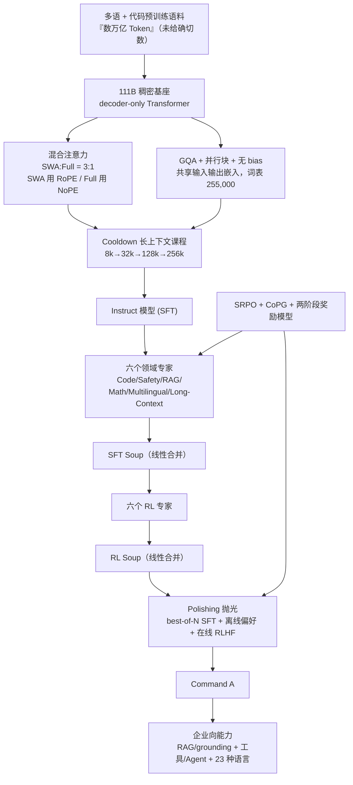

# Command A：一份把「企业能用」拆成架构、合并与检索三份账的报告

<!-- release-date: 2025-03-13 -->

> 本文依据 Cohere 发布的 **Command A: An Enterprise-Ready Large Language Model**，即 arXiv:2504.00698 的 **v2 版**（v1 提交于 2025-04-01，v2 提交于 2025-04-14），本地 PDF 共 55 页。页码均指这份 PDF 本身的页码。全文把三件事分开标注：**报告明确写了什么**、**我们如何解释它**、**哪些是外部补充或报告根本没写的缺口**。
>
> 一句必须先说的更正：这份报告**没有**把 Command A 描述成混合专家（MoE）模型，也**没有**任何「早退剪枝」「256 个专家、每 Token 激活 8 个」的内容。它给的是一套稠密（dense）解码器 Transformer，效率来自**混合注意力**而非稀疏专家。这一条与常见的转述不符，是本文要重点澄清的地方，详见「Command A 不是 MoE」一节。

## 读前先搭一张最小地图

先把会反复出现的词说成人话：

- **Token（词元）**：模型读写文本的最小单位。
- **Dense（稠密模型）**：每一层的全部参数，对每一个 Token 都要算一遍。反面是 **MoE（Mixture-of-Experts，混合专家）**——把 FFN 拆成一排小专家，每个 Token 只激活少数几个。
- **FFN / MLP（前馈网络）**：Transformer 块里注意力后面的大矩阵层。Command A 用的是带 **SwiGLU** 激活的 MLP。
- **Attention（注意力）**：模型判断「当前 Token 该重点参考前文哪些位置」的机制。**Full attention（全注意力）** 每个 Token 能看全部历史；**SWA（Sliding Window Attention，滑动窗口注意力）** 只看当前位置附近一窗。
- **RoPE / NoPE**：RoPE 是给注意力加相对位置的旋转编码；NoPE 就是不加位置编码。
- **GQA（Grouped-Query Attention，分组查询注意力）**：多个 Query 头共用一套 Key/Value，少存 KV、少算缓存。
- **KV Cache（键值缓存）**：把已读 Token 的中间结果留在显存，生成下一个 Token 时不重算。它是长上下文推理的显存大头。
- **RAG（Retrieval-Augmented Generation，检索增强生成）与 grounding（落地引用）**：让模型先检索外部文档、再基于检到的片段作答并标注出处，用来压住幻觉。
- **Tool use / Agent（工具调用 / 智能体）**：模型输出结构化的 API 调用、执行、把结果喂回去再推理，循环多步。**ReAct** 是一种「先想再调工具」的常见范式。
- **Model merging（模型合并）**：把多个各自微调过的模型，按参数加权平均成一个模型。报告里的「expert」指的是这条路，不是 MoE 的路由专家。
- **Preference tuning / RLHF（偏好优化 / 人类反馈强化学习）**：用「哪个回答更好」的成对数据训练模型。**Reward model（奖励模型）** 是给回答打分的模型。

## 一句话先说清

Command A 是 Cohere 面向企业场景的 111B 参数稠密模型（PDF p. 1），它的报告主线不是「我们堆了多大的架构」，而是三件互相咬合的事：

1. **用混合注意力把服务成本压下来**：滑动窗口注意力与全注意力按 3:1 交错，配 GQA、并行块、共享词嵌入，使它在长上下文里的 KV Cache 显著小于同规模全注意力模型，从而「两张 A100/H100 就能服务，最高 156 tokens/秒」（PDF p. 1、3–4、34）。
2. **用去中心化后训练 + 模型合并把能力拼进一个模型**：先训一个 Instruct，再并行训六个领域专家（Code、Safety、RAG、Math、Multilingual、Long-Context），分两轮线性合并成 Soup，最后抛光（PDF p. 5–6、15–17）。
3. **用自精炼对齐把企业最看重的检索、工具、指令跟随做扎实**：SRPO 与 CoPG 两种偏好/强化算法，配一个两阶段训练的 Bradley-Terry 奖励模型（PDF p. 6–7）。

> 真正值得记住的思路是：**它把「效率」拆成了架构层的注意力分工、训练层的并行专家合并、以及能力层的检索与工具协议三处，而不是靠一个孤立的新算子。**

这也是全文最重要的判断——它更像一份「企业落地配方 + 评测」报告，而不是一份像 DeepSeek-V3 那样把每层维度、算力、超参都摊开的规格报告。很多你想知道的答案，报告其实没写。

## 先看全景：报告把系统分成哪几段

这张图按 PDF p. 1–6、15–17 的叙事重画，是流程示意，不是报告原图。主路径的「效率」发生在两处：架构里的注意力分工（下面第二、三节），和训练里的并行专家合并（第五节）。报告覆盖 Command A 与 Command R7B 两个模型，后者是共享同一套配方的小模型（约 7B，PDF p. 1–2），本文以 Command A 为主，R7B 只在对照处点到。

## 先纠正一处流传的说法：报告的「hybrid」不是 MoE

这一节单独拿出来，是因为它直接关系到「这份报告到底写了什么」。

**报告写了什么。** 架构一节（PDF p. 3）只有六条要点：SwiGLU、交错注意力层（SWA 与全注意力 3:1）、GQA、并行 Transformer 块、无 bias、共享输入输出嵌入。Figure 2 的示意图（PDF p. 3）里，每个 Transformer 块画的是 `Self-Attention + MLP` 两件事，MLP 是一个 SwiGLU 前馈层——**没有任何专家池、路由器或 Top-k 门控**——架构一节通篇没有引入 MoE、剪枝或早退这些概念，正文里出现的「expert」全部指后训练阶段那六个领域专家（见第五节），与 MoE 的路由专家不是一回事。摘要与引言里那句「novel hybrid architecture（新颖的混合架构）」（PDF p. 1），指的是**滑动窗口与全注意力的混合**，不是专家混合。

**我们如何解释这处混淆从哪来。** 有两个词最容易串味：

1. **「hybrid（混合）」被读成了「混合专家」。** 报告里 hybrid 修饰的是注意力层的排布（SWA + Full 交错），这与 DeepSeek-V4、Mistral Large 3 等用的「窗口注意力 + 全注意力」是同一类「混合注意力」，和 MoE 无关。
2. **「expert」被读成了 MoE 专家。** 报告的六个「expert」是**六个独立微调出来的完整模型**，靠**参数加权平均（模型合并）** 融成一个权重，而不是一个前馈层里被路由的若干小 FFN。报告自己把这条路线称为「decentralised training（去中心化训练）」，并明确说这是「first large-scale attempt to combine multiple parallel expert tracks」（PDF p. 5）。

**和库里几篇 MoE 对照一句。** DeepSeekMoE 一篇讲的是「把 FFN 切细 + 共享专家隔离」的真·路由专家；Nemotron-3-Ultra 与 Mistral-Large-3 两篇的架构里也确有 MoE 层。**按这份报告的文本**，Command A 与它们不是同一条稀疏路线：省算力靠的是注意力少看，而不是专家少激活。别把这三篇的「专家」和 Command A 的「专家」混成一个概念。

**边界（这一处没有关掉）。** 本站只依据这份冻结报告，报告未把 Command A 描述为 MoE，也未给出每 Token 激活参数量。**但权重侧留下一处没能核实的分歧**：Hugging Face 上 `CohereLabs/c4ai-command-a-03-2025` 的 API 元数据显示 `architectures = Cohere2ForCausalLM`、`model_type = cohere2`；该仓库需接受许可后才能访问，`config.json` 取不到，因此**读不到 `num_experts` / `topk` 是否存在**，光凭类名 `Cohere2ForCausalLM` 也不足以判断它是否走专家路由。这条恰好说明「Command A 是 MoE、256 专家 top-8」这类说法为什么会流传且难以当场否证——它挂在一个真实存在、但本库读不到内容的架构类名上，而报告本身一个专家池都没画。**在拿到 `config.json` 之前，本文不写它是或不是 MoE**，只记录：报告文本与示意图均为稠密混合注意力，权重声明的架构类名与这一点之间的张力尚未解决。

## 效率的真实来源一：混合注意力怎么省 KV Cache

### 旧问题：全注意力在长上下文里太贵

全注意力里，每个 Token 要和前面所有 Token 比较，缓存随上下文线性变长；到 128K、256K 时，KV Cache 会吃掉大量显存、拖慢解码。稠密模型又没法像 MoE 那样「少算参数」，所以 Command A 的省钱方向只能是**让注意力少看历史**。

### 新设计：SWA 与全注意力按 3:1 交错

报告的做法（PDF p. 3、Figure 2）：

- **每 4 层里 3 层用滑动窗口注意力（SWA），1 层用全注意力**，比例 3:1。
- **SWA 层用 RoPE**（需要相对位置来界定窗口内的顺序）；**全注意力层用 NoPE**（不加位置编码）。这条「窗口层带位置、全局层不带位置」的搭配，报告把细节甩给了 Yang et al. (2025)，正文没展开——**报告没写为什么全局层去掉位置编码反而更好，只给了这个选择**。
- 配 **GQA** 进一步压 KV，并用 **document masking** 保证一个 batch 里每条序列只看得见自己。

### 收益：报告直接给了 KV 占比

这是全篇最能量化「效率」的一段（PDF p. 34）：

| 序列长度 | 相对 Llama 3.3 70B | 相对 Llama 3.1 405B | 相对 Mistral Large |
|---|---:|---:|---:|
| 8k | 75% | 23.8% | 45.5% |
| 128k | 32.9% | 10.4% | 19.9% |

读法：在 8k 时 Command A 的 KV Cache 已只有 Llama 3.3 70B 的 75%，到 128k 降到 32.9%；对 405B 这种全注意力大模型，128k 时只剩约十分之一。序列越长，省得越多——因为窗口层只存近处，全注意力层又用 GQA 压了头数。报告据此说「能显著降低延迟与显存、提升吞吐」（PDF p. 34）。

### 代价与边界

- 窗口注意力天然会**丢掉远距离细节**，靠少数全注意力层补回全局视野；交错比例、窗口大小怎么定的，**报告没给消融**。
- 这些百分比是报告按模型与精度配置算出的**缓存占用比**，不是端到端延迟实测。别把它读成「所有硬件上都快 3 倍」。

### 可迁移启发

如果你的服务卡在长上下文的显存上，又不想动 MoE，**「窗口 + 少量全注意力交错 + GQA」是一条已被反复验证的低成本路**。要点是：不要逼每一层都保留最高分辨率——多数层看近处就够，少数层负责全局。这与 DeepSeek-V4 用多档注意力分工是同一类思路，只是 Command A 做得更朴素。

## 效率的真实来源二：服务足迹与吞吐

报告在引言和结论里各给了一次硬数字（PDF p. 1、38–39）：

- **两张 A100 或 H100 即可服务**，强调面向「隐私敏感的本地部署 / 私有云」。
- **最高 156 tokens/秒**，报告称这比 GPT-4o 高 1.75 倍、比 DeepSeek V3 高 2.4 倍。
- 权重以**非商用许可**开放（PDF p. 38–39）。

**我们如何解释它的分量。** 对一个 111B 稠密模型，「两张 80GB 卡」意味着权重必须被压进约 160GB 显存——BF16 下 111B 权重约 222GB 放不下，所以服务时几乎必然走量化或多卡切分。**但报告没有写服务用的精度、量化方案、batch size、并行方式，也没给测 156 tokens/秒 的硬件与协议。** 那两个「1.75 倍 / 2.4 倍」是相对闭源 API 的吞吐对比，读者要当成作者口径的宣传数字，而不是可复现的基准。

**可迁移启发。** 「能在几张卡上跑」是企业选型的第一道门槛，比跑分更决定成交。Command A 把「2 卡可部署」写进摘要和结论当卖点，是在告诉采购：能力够用即可，别为用不到的规模付机房钱。

## 企业能力一：RAG、grounding 与工具 / Agent 是怎么训出来的

这是 Command A 面试价值最高的一块——报告把它拆得很细（PDF p. 9–10）。

### 先说清它把 RAG 当成什么

报告把 RAG 直接归到「工具使用」之下：**RAG 就是模型有一个搜索工具（例如稠密向量索引），自己生成查询、取回片段、再基于片段作答**（PDF p. 9）。再复杂一点的任务，模型要在多步里编排多个工具——这就要一套「暂停生成、抽出工具调用、执行、把结果喂回」的结构化循环。Command A 大致遵循 **ReAct** 范式：先讲思路、列计划与要用的工具，再通过结构化输出（如 JSON）执行工具或给出最终答案（PDF p. 9）。

### 训练数据长什么样（这是能直接抄走的部分）

报告给了每条样本的字段结构（PDF p. 9）：

- 一个用户 prompt，加一组可用工具，可能还有用户自定义指令；
- 一个**推理步**：模型说明该用哪些工具、怎么填参数；
- 若干**工具调用与工具输出**，可以并发也可以串行；
- 结尾一个**带引用的模型回复**（引用来自工具输出）。

采集方式（PDF p. 9–10）：内部标注员专门受过 ReAct 风格训练，SFT 数据经多人多轮复核；偏好数据用**至少 3 名标注员多数投票**；另外合成整段「推理 + 工具调用」轨迹，用内部 LLM-as-a-judge 验质量。训练是「先在 agentic 数据上 SFT，再用 CoPG 做离线偏好优化」。多语言场景下，RAG、Agent 也各配了多语版本的数据与标注（PDF p. 10、23）。

### 收益：报告用三个基准证明「企业向工具/检索」

工具与检索能力，报告用 BFCL、Taubench、标准 RAG 集分别量（PDF p. 19）：

| 基准（测什么） | Command A | GPT-4o | DeepSeek V3 | Llama 3.3 70B |
|---|---:|---:|---:|---:|
| ChatRAGBench（多轮对话 RAG） | **72.9** | 66.6 | 40.3 | — |
| HotPotQA（多跳检索问答） | 92.1 | 92.1 | 90.1 | — |
| DROP（带推理的阅读理解） | 91.1 | 89.5 | 85.7 | — |
| BFCL Overall（函数调用总分） | 63.8 | 72.1 | 58.6 | 51.4 |
| BFCL Live AST | **80.5** | 79.8 | 68.4 | 62.8 |
| BFCL Multi-turn（长轨迹多轮） | 25.5 | 47.6 | 18.6 | 6.9 |
| Taubench Retail P@1 | 60.0 | 60.6 | 54.8 | 6.2 |
| Taubench Airline P@1 | 45.3 | 43.0 | 25.5 | 35.3 |

（ChatRAGBench、HotPotQA、DROP 出自 Table 4；BFCL 三列出自 Table 5；Taubench 出自 Table 6，均在 PDF p. 19。）

**我们如何读这张表。** 在「给定文档作答」的检索类任务上，Command A 明显强（ChatRAGBench 72.9 对 DeepSeek V3 的 40.3，Taubench Retail 上 Llama 3.3 70B 只有 6.2 而它 60.0）——这正是报告反复强调的「企业向 RAG 最优」。但**多轮工具调用（BFCL Multi-turn 25.5）明显落后 GPT-4o 的 47.6 和 Claude 3.7 的 48.4**。诚实的结论是：它的强项是「检索 + 单步/少步工具 + 带引用作答」，而不是「长程多轮 Agent 编排」。报告自己也把长轨迹 Agent 列为仍在推进的方向。

### 可迁移启发

- **把工具协议当成模型要学的语言**：Command A 在词表里放了「chat 轮次、工具调用」专用特殊 Token（PDF p. 3），并用固定字段结构（推理步 → 调用 → 输出 → 带引用回复）来组织训练样本。想让模型稳定调工具，先设计好这套可监督的轨迹格式，比事后加解析器更省事。
- **grounding 要单独测「可答 / 不可答」**：企业 RAG 报告专门给了 Answerable / Unanswerable 两个准确率（PDF p. 33，Command A 96% / 91%），因为「知道什么时候该说『文档里没有』」和「答得准」是两件事。做检索产品，这两个指标比一个总正确率有用得多。

## 企业能力二：去中心化后训练 + 模型合并

### 旧问题：一个模型要同时精通六摊，怎么训

经典后训练是「一个模型顺序喂不同数据配比」。问题是各能力数据规模、可验证性差别极大：代码、数学能大量合成并用单元测试验证，安全、RAG 却高度依赖人工标注（PDF p. 16）。把它们硬塞进一个训练流程，超参和数据配比互相牵制。

### 新设计：并行训专家，再按参数加权合并

Command A 的路线（PDF p. 5–6、15–17）：

1. 先在基座上训一个 **Instruct**（SFT）。
2. 并行训**六个专家**：Code、Safety、RAG、Math、Multilingual、General Long-Context。每个专家用自己的数据配比、超参、算法（数学/代码用可验证奖励，安全/多语用偏好对）。
3. 用**线性合并（参数加权平均）** 把六个专家融成 **SFT Soup**。
4. 在 Soup 上再并行训六个 **RL 专家**，又合并成 **RL Soup**。
5. 最后**抛光（Polishing）** 成正式模型。

**关键：这里的「合并」是模型级的参数平均，不是 MoE 的路由。** 合并权重靠人工搜索：调高某领域专家权重通常提升该领域，但会连带压低别的领域，且这种「副作用」不好预测，于是用启发式 + 暴力扰动来搜（PDF p. 16）。报告试过 SLERP、task vectors 等更复杂的合并法，**没发现比线性合并更好**，还更复杂，所以最终就用线性合并——它还有个好处是**满足结合律**，「合并的合并」能写成一次合并，整条流水线更可解释（PDF p. 16）。

### 几条很实在的工程经验（报告明写的）

- **一致性比最优更重要**（PDF p. 16）：所有专家从同一个「通用指令跟随」模型初始化，因为有的专家用到工具调用等特殊 Token，共享初始化能让这些嵌入被正常合并；且后训练会伤长上下文，从「本就长上下文可用」的模型起步更容易保住。
- **用少量跨域数据当正则**，防止某专家合并时「撞车」（collision）拖垮别人；用 leave-one-out 合并来定位是谁在撞。
- **合并便宜、评测贵**（PDF p. 17）：合并本身几乎不花算力，但每合一次都要跑一大堆评测才知道好坏，**评测才是生产级合并的真瓶颈**。最终模型的选择参考了 **500 个评测指标**（PDF p. 16）。

### 收益：合并几乎不丢专家能力

报告量化了合并的保真度（PDF p. 34–35）：线性合并平均只掉 **1.8%**，绝大多数指标保持在「最好专家」的 2.5% 以内；**RAG 与通用能力保得最好，代码保得最差**；在 111B 规模上合并很稳，大幅改专家权重只带来 2–3% 的领域波动。报告还发现**合并是个「粗操作」**——它把能力拼齐但可能让编码「没对齐」，在合并结果上再跑**一小段极低学习率的 SFT**（约主 SFT 的 10–20 倍低），很多指标能回升甚至超过 100% 专家水平（PDF p. 35）。

### 可迁移启发

> **模型合并是一条「组织学 + 数值学」双重价值的路。** 组织上，它让不同团队并行优化不同能力、异步交付；数值上，它把「多能力共存」从损失函数里的软权衡，变成参数空间里的线性组合，事后可重加权而不必重训。

如果你的项目要同时维护「代码 / 安全 / 检索」几条线，Command A 这套「并行专家 + 线性合并 + 合并后小步 SFT 回血」是一个成本可控、且报告已给保真度数字的模板。前提是你得养得起那套「合并便宜但评测贵」的评测基建。

## 自精炼对齐：SRPO、CoPG 与一个「会记答案」的奖励模型

后训练用了几种算法，报告把两个自己主推的写清了（PDF p. 6–7）。

### SRPO：一个带「自我修订」的偏好优化

SRPO（Self-improving Robust Preference Optimisation）要算的是一个 min-max 目标——学一个「改进策略」$\pi_{\dagger}$ 去提升「生成策略」$\pi$ 的输出，同时都不偏离参考模型 $\pi_{\mathrm{ref}}$ 太远：

$$
\min_{\pi}\ \max_{\pi_{\dagger}}\ \mathbb{E}_{x}\,\mathbb{E}_{y_1\sim\pi(\cdot\mid x),\,y_2\sim\pi_{\dagger}(\cdot\mid x,y_1)}\bigl[P(y_2\succ y_1\mid x)-\beta\,\mathrm{KL}(\pi_{\dagger}\,\|\,\pi_{\mathrm{ref}}\mid x,y_1)+\beta\,\mathrm{KL}(\pi\,\|\,\pi_{\mathrm{ref}}\mid x)\bigr]
$$

符号：$P(y_2\succ y_1\mid x)$ 是偏好模型判「$y_2$ 优于 $y_1$」的概率；两个 $\mathrm{KL}$ 项把 $\pi$ 与 $\pi_{\dagger}$ 各自拴在参考模型上；$\beta$ 是拴的松紧。报告强调 SRPO 的两点新意（PDF p. 7）：一是**不依赖偏好数据的采样分布**，因此更稳、更泛化；二是**能在推理时做迭代自我修订**——先用 $\pi$ 出一个初稿，再用 $\pi_{\dagger}$ 连续改几轮。报告说这个「推理时自我精炼」是常规对齐流水线没有的能力。**但报告没给这套自我修订的量化收益表，也没给 $\beta$ 等超参的具体取值。**

### CoPG：一个不靠重要性采样的对比式策略梯度

给定一个奖励函数（奖励模型或可验证奖励），Command A 用 CoPG（Contrastive Policy Gradient）优化 KL 正则的 RL 目标。对同一 prompt 的 $k$ 个回答，损失是（PDF p. 7）：

$$
\ell(x,y_1,\dots,y_k;\pi)=\frac{1}{k-1}\sum_{i>j}\bigl(R^{\pi}_{\beta}(x,y_i)-R^{\pi}_{\beta}(x,y_j)\bigr)^{2},\qquad R^{\pi}_{\beta}(x,y)=R(x,y)-\beta\ln\frac{\pi(y\mid x)}{\pi_{\mathrm{ref}}(y\mid x)}
$$

直觉：把「带 KL 惩罚的有效奖励」$R^{\pi}_{\beta}$ 在回答之间两两做差的平方和最小化，逼同 prompt 下更该赢的回答奖励更高。报告说它在纯 on-policy 时**等价于 RLOO**，梯度是一种不依赖重要性采样、裁剪或额外价值网络的 off-policy 策略梯度，离线在线都能用；实践中主要用离线与在线 on-policy（PDF p. 7）。

### 一个「太会记」的奖励模型，逼出两阶段训练

奖励模型用 Bradley-Terry、交叉熵软标签。报告给了一条很实用的观察（PDF p. 7）：**奖励模型记忆化严重，同一批数据跑第二个 epoch 会灾难性坍缩**。所以他们分两阶段训：

| 阶段 | 数据量 | 标签来源 | batch | 学习率 |
|---|---:|---|---:|---|
| 一（低质量） | 约 400 万 | 奖励模型集成重标 | 1024 | cosine 峰值 $4\times10^{-5}$ |
| 二（高质量） | 约 35 万 | 人类偏好强度 / 集成 / 金标 0.999、平局 0.5 | 16 | 峰值 $3\times10^{-6}$ |

两阶段都用打包数据（多条偏好对塞进一条样本，靠注意力掩码互不干扰）。最终这个内部奖励模型在 RewardBench 上 **92.7%**、RMB 上平均 **72.3%**（PDF p. 7）。

**可迁移启发。** 「奖励模型二 epoch 就崩」是一条能省你几天调试的经验：RM 训练别贪多轮，宁可分「大量弱标 + 少量强标」两段，用标签质量而非轮数换性能。

## 多语言：23 种语言与它的评测口径

摘要与正文都写 **23 种语言**（PDF p. 1、10、20）：英语、法语、西班牙语、意大利语、德语、葡萄牙语、日语、韩语、阿拉伯语、中文、俄语、波兰语、土耳其语、越南语、荷兰语、捷克语、印尼语、乌克兰语、罗马尼亚语、希腊语、印地语、希伯来语、波斯语——覆盖「全球约一半人口」。**这与常见转述里的「13 种语言」不符；报告口径是 23 种。**

评测不止一个总分（PDF p. 20–23）：

- **机器翻译** NTREX / FLORES，用 COMET-20；报告不标单一赢家，而是标「获胜簇」——与最好模型差 <1.67 分算同簇（1.67 对应 75% 的人类一致率）。Command A 的 NTREX 平均分 **68.8**（PDF p. 2）。
- **多语对话** mArenaHard：500 条 Chatbot Arena 难题译成 23 语，报告称 Command A 在**全部 23 种语言**上都被偏好（相对 Llama 3.3 70B、Llama 3.1 405B、DeepSeek V3）。
- **多语 Agent / 语言一致性 / 方言**：Table 9 多语 Taubench、Table 10 跨语行级通过率、Table 11 四种阿拉伯方言的 ADI2 分。

**我们如何解释它的分量。** 对企业，多语不是「能不能翻」，而是「用你的母语问，它会不会串成另一种语言、会不会丢格式、会不会在方言上崩」。Command A 把 language confusion（语言混淆）、方言、可控性单列评测，是它「企业向」定位的一部分。

## 评测全景：报告用哪些数字证明「企业向最优」

除上面已展开的检索/工具表，报告还有一批代表数字（PDF p. 2、18、24–27、33–34、38）：

| 维度 | 代表结果（Command A） | 出处 |
|---|---|---|
| 学术基线 | MMLU 85.5 / MMLU-Pro 69.6 / GPQA 50.8 / IFEval 90.9 / InFoBench 94.9 | Table 3, p. 18 |
| 数学 | MATH 80.0 / AIME 2024 23.3 / GPQA-Diamond 50.8 | Table 15, p. 27 |
| 代码编辑 | SWE-Bench Verified 26.8 / Aider Polyglot 14.7 | Table 13, p. 24 |
| SQL | Spider 79.5 / BIRD-dev 59.5 / 内部 5 方言均 58.0 | Table 14, p. 25 |
| 企业生成（22 任务） | 通过率 94.2%（Claude 3.5 84.2、GPT-4o 79.1） | Table 18, p. 33 |
| 企业 RAG | Llama Index 正确性 4.73 / 可答 96% / 不可答 91% | Table 19–20, p. 33 |
| 长上下文 | RULER：4k 97.2 平滑降到 256k 84.6；LongBench-V2 43.4 | Table 21–22, p. 34 |
| 人类盲评（对 GPT-4o） | 通用 50.4 / 推理 51.4 / 代码 46.8 | Table 23, p. 38 |

**怎么读这些数字（重要）。**

- 代码编辑上 Command A（SWE-Bench 26.8）**明显低于 DeepSeek V3 的 42.0**；多轮工具也落后。它的强项集中在**检索/grounding、指令跟随、企业文档任务、多语**，不是全维度领先。
- 长上下文 RULER 从 4k 的 97.2 **平滑降到** 256k 的 84.6——和 DeepSeek-V4 那篇「1M 检索随长度下降」是同一诚实现象：能塞进 256k 不等于 256k 与 4k 一样可靠。
- 人类盲评对 GPT-4o 大致在 50% 上下（近乎打平），对 Llama 3.3 70B 则大幅领先（通用 68.8、推理 71.7）。报告特别指出**抛光阶段**带来大头增益：对 GPT-4o 的胜率从合并后、抛光前的通用 43.2→50.4、推理 41.4→51.4、代码 30.0→46.8（PDF p. 38）。也就是说，**「合并出一个能力全但风格糙的模型」和「抛光成人类偏好的成品」之间，差着整整一个阶段。**
- 很多对比是**内部复现**（表注反复写「externally reported / internal reproduction」），且企业生成、Arena 类评测的样本与 rubric 未公开。稳妥说法是「报告中的评测显示……」，别当成第三方已验证事实。

## 报告没告诉我们的事（缺口逐条）

这是一份「配方 + 评测」报告，规格密度远低于 DeepSeek 那类技术报告。以下都是**报告未写、本文不补**的：

- **架构规格**：没有层数、隐藏维度、注意力头数、KV 头数、SWA 窗口大小（token 数）；只给了「111B 参数」「词表 255,000」。
- **是否 MoE / 每 Token 激活参数**：报告文本与示意图都是稠密混合注意力，**没有** MoE、没有每 Token 激活专家数、没有早退剪枝。公开 config 是否含 MoE 字段本次未能核验。
- **预训练规模**：只说「数万亿 Token」（PDF p. 2），无确切 token 数、无数据配比、无去重/去污细节、无训练算力（GPU 数、时长、FLOPs、成本）。
- **服务细节**：156 tokens/秒、2 卡部署——无量化方案、无 batch、无并行、无测试硬件。
- **超参**：主模型的 SRPO / CoPG 关键超参（$\beta$、步数、KL 系数）未给；附录 B 只给了各专家的 SFT / 偏好学习率等局部超参。
- **最大服务上下文**：训练扩到 256k，但**没有明确写推理时支持的最大上下文**。
- **Command R7B 规格**：只当小模型对照，未给其参数拆解。

## 最值得带回自己项目的六条启发

1. **省算力先想注意力，再想 MoE。** 若你不想引入路由的复杂度与通信，「窗口 + 少量全注意力交错 + GQA」能把长上下文 KV 压到对手的一半甚至十分之一（PDF p. 34），是稠密模型最现实的成本杠杆。
2. **把工具调用做成可监督的轨迹格式。** 固定「推理步 → 调用 → 输出 → 带引用回复」的样本结构，配专用特殊 Token，比事后写解析器更能训出稳定 Agent（PDF p. 9）。
3. **grounding 要分「可答 / 不可答」两把尺。** 企业检索的失败常是「文档里没有还硬答」，单独测不可答准确率能提前暴露幻觉（PDF p. 33）。
4. **模型合并 = 并行开发 + 事后可重加权。** 六专家线性合并平均只掉 1.8%，但「合并便宜、评测贵」——先建得起那套评测基建，再谈用合并替代单模型顺序训练（PDF p. 16–17、34）。
5. **合并后跑一小步低学习率 SFT 能回血。** 合并把能力拼齐却留下「编码没对齐」，极低 LR 的短 SFT 能让指标回升甚至超过专家（PDF p. 35）。
6. **别跳过抛光。** Command A 对 GPT-4o 的人类偏好胜率，几乎全靠最后的 best-of-N + 离线偏好 + 在线 RLHF 交替（ping-pong）阶段挣来（PDF p. 17、38）。能力齐 ≠ 好用。

## 关键词回看

- **混合注意力**：SWA 与全注意力 3:1 交错，窗口层带 RoPE、全局层用 NoPE，配 GQA——这是 Command A「效率」的真正来源。
- **稠密非 MoE**：每块是单个 SwiGLU MLP，无专家池、无路由；报告的「expert」是后训练的六个完整模型。
- **去中心化后训练**：Instruct → 六 SFT 专家 → SFT Soup → 六 RL 专家 → RL Soup → 抛光。
- **线性模型合并**：参数加权平均，满足结合律；一致性优先于单点最优；合并便宜、评测贵。
- **SRPO**：min-max 偏好目标，不依赖采样分布，支持推理时迭代自我修订。
- **CoPG**：对比式策略梯度，on-policy 时等价 RLOO，离线在线通用。
- **两阶段奖励模型**：因二 epoch 记忆化坍缩而分「大量弱标 + 少量强标」；RewardBench 92.7%。
- **23 种语言**：报告口径（非 13），评测含翻译、语言混淆、方言、多语 Agent。
- **企业向评测**：RAG/grounding、BFCL、Taubench、22 任务企业生成、人类盲评。

## 最后的判断

Command A 这份报告的价值，不在「又一个 111B 大模型」，而在它把**企业落地**拆成了三处可各自优化的账：架构上用混合注意力省 KV、训练上用并行专家合并解耦团队与能力、能力上用检索/工具协议与自精炼对齐把「好用」训出来。它有证据支撑的强项很清楚——检索与 grounding、指令跟随、多语、企业文档任务、以及「2 卡可部署」的成本；它有证据的短板也很清楚——长程多轮工具、代码编辑、以及所有依赖作者内部评测的数字。

同时必须留下边界：**它不是 MoE，也没有早退剪枝**，任何「256 专家 / 每 Token 8 个」的说法都不来自这份报告；大量规格、算力、超参、服务细节报告根本没写。把这份材料当「企业向配方与评测设计」的参考，比当「架构创新」的参考更贴切。

如果只记一句：

> **面对「企业要用得起」，Command A 的答案不是把模型做小，而是把成本从注意力、训练组织、能力协议三个方向分别卸掉一点，再用合并和抛光把它们装回一个权重里。**

## 资料与阅读边界

### 本文依据的版本

- 本地原件：`papers/Cohere/Command-A.pdf`，55 页。arXiv 编号 **2504.00698**，**v2**（v1 提交 2025-04-01，v2 提交 2025-04-14）。取的是最新修订 v2；PDF 首页页脚另印「Released as a preprint on April 7, 2025」。
- 官方页：[arXiv:2504.00698](https://arxiv.org/abs/2504.00698)。标题逐字为 **Command A: An Enterprise-Ready Large Language Model**；作者署名首页为「Cohere」，完整作者列表在 PDF p. 50 以 **Team Cohere** 名义给出，机构为 Cohere。学科 cs.CL / cs.AI / cs.LG。
- 与常见二手说法不符之处（已在正文点名）：① 本文依据的是 **v2（2025-04-14）**，不是 v1；② 语言数是 **23 种**，不是常被引用的 13 种；③ 报告**未**描述 MoE、256 专家、每 Token 8 个、早退剪枝——这些不在本文依据的冻结材料里，权重侧的残留分歧见「先纠正一处流传的说法」一节。

### release-date 取值与取证

取 **2025-03-13**，本库口径为「模型首次对外可用日」（官方 API / 权重中最早发生的事件）。依据：

- Cohere 官方博客「Introducing Command A」发布于 **2025-03-13**，正文写「Today, we're introducing Command A」，即当日在 Cohere Platform 上线（[cohere.com/blog/command-a](https://cohere.com/blog/command-a)）。
- 模型版本串 `c4ai-command-a-03-2025`（2025 年 3 月），第三方聚合站 OpenRouter 亦标注该模型上线日为 2025-03-13（[openrouter.ai/cohere/command-a-03-2025](https://openrouter.ai/cohere/command-a-03-2025)）。
- 排除的候选日：arXiv v1（2025-04-01）与 PDF 页脚「April 7, 2025」都是**论文上传/预印日**，晚于 API 上线，且论文上传不等于「模型可用」；v2（2025-04-14）是修订日，按规则不回写。Hugging Face 权重仓库 `CohereLabs/c4ai-command-a-03-2025` 的 `createdAt` 不作首发依据（本模块明确规则：HF 仓库创建时间是预置时间）；权重开放即便略晚也不改变「最早事件是 3 月 13 日 API 上线」这一结论。
- 未能核验项：Cohere 官方 changelog（docs.cohere.com/changelog）本次未能读取；权重文件的确切提交时间因网络受限未能取到。综合官方博客与第三方上线日两条独立证据，取 2025-03-13。

### 外部补充（不是报告原文）

- 首发日与模型版本串来自 [Cohere 官方博客](https://cohere.com/blog/command-a) 与 [OpenRouter 模型页](https://openrouter.ai/cohere/command-a-03-2025)；仅用于确定「首次对外可用日」，不用于补写架构规格。
- 权重仓库 [CohereLabs/c4ai-command-a-03-2025](https://huggingface.co/CohereLabs/c4ai-command-a-03-2025) 存在，但本次环境无法访问其 `config.json`，故**不据其判断 Command A 是否含 MoE 字段**；正文关于「稠密、非 MoE」的结论只依据报告文本与 Figure 2。

### 与 MoE 对照的分工

本文只讲 Command A 报告写了什么。若要对照真·MoE 的机制，见 DeepSeekMoE 一篇（细粒度切分 + 共享专家隔离）、Nemotron-3-Ultra 一篇、Mistral-Large-3 一篇；若要对照「混合注意力省 KV」的更完整做法，见 DeepSeek-V4 一篇。Command A 与它们不是同一条稀疏路线，本文不重讲它们的机制。
