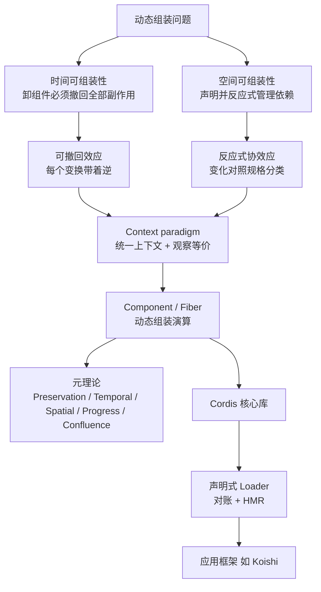

# Cordis：把 effect 与 coeffect 抬到运行时，让动态组装不再靠重启

<!-- release-date: 2026-08-26 -->

> 本文依据 Shi、Zhang、Cui 的 **A Programming Paradigm for Spatiotemporal Composability**，即 arXiv:2608.25512v1（2026-08-26 提交）。页码均指本地 PDF 本身（Typst 0.15.1，92 页，CreationDate 2026-08-26）。GitHub `cordiverse/paper` 写明 preprint under active revision，arXiv 始终提供最新版；本稿核对时官方仍为 v1，与本地文件大小一致（2,284,543 字节）。文中分开三层：**论文写了什么**、**我们如何解释**、**外部补充**。这是一篇编程语言与系统论文，实现名叫 Cordis；不要把它读成基模技术报告。

## 阅读前先搭一张最小地图

这篇论文最常出现的几个词，先用人话钉住：

- **动态组装（dynamic composition）**：程序跑着的时候还能装上、卸下、换配置，而不是编译期把模块图焊死。
- **时间可组装性（temporal composability）**：卸下一个组件时，它在共享环境里留下的副作用必须能完整、有序地撤回。
- **空间可组装性（spatial composability）**：组件能声明自己依赖谁、运行时能发现并解析这些依赖，依赖变了还能跟着激活或停用。
- **effect（效应）**：程序对世界的改动，比如注册命令、打开连接、往共享表里塞一个服务。
- **coeffect（协效应）**：世界对程序的约束，也就是「我要先有某某能力才能跑」，例如需要数据库、需要某个 IM 适配器。
- **context（上下文）**：论文把 effect 改的环境和 coeffect 读的环境合成同一种类型；之后每一次改、每一次读，都只能通过它。
- **component / fiber**：component 是可组装单元的接口（依赖、供给、效应迭代器）；fiber 是它的一次运行实例，带着生命周期状态。
- **Cordis**：把上述模型做成的 meta-framework。它不规定你写聊天机器人还是写 Agent，只规定动态组装怎么发生。

论文自己的叙事顺序就是依赖顺序：先把 effect 做成可撤回，再把 coeffect 做成可反应，再把两者合成 context paradigm，再给出整系统演算与元理论，最后落到 TypeScript 实现和 Koishi 案例。（PDF p.2–3、6）

## 一句话先说清

现代软件越来越需要「边跑边换零件」，但形式基础一直停在编译期。静态世界里，时间方向大约就是 RAII 和括号模式，空间方向大约就是 import；动态世界里，副作用的寿命不再被词法作用域框住，依赖还会在运行时出现、消失、换身份。（PDF p.4）

这篇论文做的事不是再发明一个插件 API，而是把古典的 **effect** 与 **coeffect** 从编译期分析抬成运行时机制：

- 每个上下文变换都带着逆变换，运行时握住它，于是单组件获得时间可组装性（**可撤回效应**）；
- 每个上下文变化都对照组件的协效应规格分类，驱动激活与停用，于是单组件获得空间可组装性（**反应式协效应**）；
- 再把 effect 上下文和 coeffect 上下文合成一个 context，所有读写都经它中介，得到 **context paradigm**；中介诱导一种观察等价，不同组件的效应在这种等价下可以交错而不互相搅乱。

把这些收成 component，再给出动态组装演算。元理论把单组件的时空可组装性抬到一整系统交错的组件上。实现就是 Cordis：核心库做效应追踪与协效应解析，声明式 loader 做配置对账和热替换。（PDF p.1、6）

全文最值得带走的 insight 是：

> **不要把「能卸载」和「能声明依赖」当成两个工程补丁。它们是同一枚硬币的两面：一边是对共享环境的可逆写入，一边是对共享环境的可反应读取。把两边都强制经过同一个 context，交错才可能有定理而不是约定。**

## 它要解决什么，以及它怎么支撑训练、推理、Agent 基础设施

论文没有模型全貌，也没有训练 recipe。它关心的是：**动态组装在细粒度上为什么一直靠重启凑合，以及怎样给出可证明的细粒度语义。**

两个动机例子把问题钉死。

**插件系统。** 以 VSCode 为代表：扩展跑在共享的 extension host 里，`activate` 一旦执行，禁用或卸载单个扩展通常要重启整个 host。纯声明式扩展（主题、快捷键、snippet）可以自由卸；但 2026-06-09 从 Marketplace 取的 top 100 安装量扩展里，87 个带可执行代码，卸它们就要重启。`deactivate` 只是主机进程退出时的优雅关机回调，并不能做 live removal，而且还把创建效应和销毁效应拆到两个钩子里，违反 locality of concern。空间方向上，`extensionDependencies` 几乎没人用：同一批 top 100 里只有 7 个声明了对非内置扩展的依赖。扩展 API 把大家赶到宿主提供的固定扩展点上，彼此依赖很少；`getExtension(...).exports` 默认还是 `any`，没有受检的结构契约。这两条限制不是 VSCode 独有，插件系统里反复出现。（PDF p.4–5）

**会自我演化的 Agent harness。** 现代 Agent 靠运行时 harness 拼工具套件、权限沙箱、会话状态、记忆、子 Agent 和工作流。未来的 harness 可能一边服务请求，一边生成并部署对自己组件的修改。没有时间可组装性，每次自修改都要整进程重启，丢掉进程内缓存和进行中任务；改坏了还可能把用来恢复的那个进程一起弄死。没有空间可组装性，每个模块只能用临时手段探测依赖的出现、消失和换身份；朴素换代码还会悄悄弄坏依赖方，或引入只在 reload 时才爆的环。（PDF p.5）

**粗粒度凑合及其代价。** 操作系统在进程粒度上给时间可组装性，容器编排在服务粒度上给空间可组装性。模块坏了就重启进程，服务依赖交给编排器。代价是：重启丢掉缓存、连接和部分计算，重建要数秒到数分钟；为了中间还能服务，还得靠副本。容器编排也表达不了同一地址空间里组件之间的依赖，把本该是本地函数调用的交互逼到网上。粒度错位要求：效应和依赖必须在组件自己的那一层管理。（PDF p.5–6）

对我们做基模训练、推理或 Agent 基础设施的人，这篇论文的直接接口不是「换一套注意力」，而是：

- 训练作业、推理服务、工具沙箱、会话记忆，都会在运行时被装上卸下；
- 若卸载只能靠杀进程，Agent 的热更新和插件式工具就会把状态一次次清零；
- 若依赖只能靠约定，模型合成的新工具一旦换身份，下游会静默坏掉。

论文把 DeepSeek Harness 写成「自我演化的 agent harness」这一类动机，而不是把 Harness 实现细节写进正文。Harness 是搭在 Cordis 上的产品层——**只有论文写到的才算原文**；仓库与文档上的对应关系标成外部补充。

## 先看全景：从两个维度到一套演算

图是机制示意，根据目录与第 1.3、第 5 节重画，不是论文里的实测图。（PDF p.2–3、6、57）

五条贡献按论文编号：（1）可撤回效应，局部时间可组装性；（2）反应式协效应，局部空间可组装性；（3）context paradigm；（4）动态组装演算及其元理论；（5）Cordis 实现。（PDF p.6）

## 预备：effect 管「我改了世界」，coeffect 管「世界先得给我什么」

第 2 节很短，但决定后文词汇。

**Effects** 描述计算如何改环境：写文件、抛异常、发请求。代数效应把操作当成一等值，用 handler 解释。传统效应系统主要在编译期追踪「这段程序可能做什么」，作用域由词法结构固定。（PDF p.7）

**Coeffects** 描述环境如何约束计算：需要哪份隐式参数、需要哪种资源、需要哪份权限。它是效应的对偶：效应是程序对世界的输出，协效应是世界对程序的输入。（PDF p.7–8）

**和动态组装的关系。** 卸组件要撤回它对共享环境的改动，这是效应问题，但必须是运行时可逆，而不是编译期标签。装组件要先满足依赖，依赖还会变，这是协效应问题，但必须是运行时反应，而不是静态 import。论文明确说：现有效应/协效应公式几乎都停在词法固定的编译期分析，撑不住组件在运行时到达和离开。（PDF p.8、6）

这是一个解释，不是原文句子：把 effect 想成「可撤销的写入日志」，把 coeffect 想成「带通知的订阅表」，后面所有形式化都是在给这两张表找能交错的代数。

## 核心设计一：可撤回效应——每个变换都带着自己的逆

旧问题：插件在 `activate` 里注册命令、挂钩子、开连接，卸载时靠作者另写一份 `deactivate`。创建和销毁分开，完整性无法由抽象保证。（PDF p.4–5）

新设计：把共享环境叫上下文 $\Gamma$。一次效应是一对变换 $(f,g)$，$f$ 往前改，$g$ 试图撤回。运行时不只执行 $f$，还把轨迹记进一个带累加器的结构，使得以后能按后进先出（LIFO）回放 $g$。（PDF p.9–12）

### 效应上下文与追踪

论文先定义一对变换的 **twisted composition** （扭曲复合，Definition 1）：正向按 $f$ 的顺序接，逆向按相反顺序接 $g$。这就是「装的时候正着做、卸的时候倒着做」的代数形状。（PDF p.9）

给定上下文 $\Gamma$，**效应上下文** （Definition 2）把当前状态和下一步用来撤回的累加器捆在一起。直观上：你不只拿着现在的世界，还拿着一张「若现在要走，该按什么顺序拆」的清单。（PDF p.9–10）

`track`（Definition 3）把一对 $(f,g)$ 作用到这个带累加器的状态上：正向用 $f$ 改状态，同时把 $g$ 接到累加器前面。

两个定理把「追踪不会改语义、追踪与复合兼容」钉死：

- **Theorem 4**：追踪不改变正向行为，只是把逆记下来。（PDF p.10）
- **Theorem 5**：`track` 是从扭曲复合单子到效应上下文上函数的单子同态。一条一条追踪，和先复合再追踪，结果一致。（PDF p.10–11）

然后是恢复。`recover`（Definition 6）把累加器打到当前状态上。**Theorem 7** 说：若 $g(f(\gamma))=\gamma$，那么追踪后再恢复，观察者看到的状态回到原处，累加器也不被这段往返污染。（PDF p.11–12）

这就是时间可组装性在「单次效应」上的局部定理：只要作者给的 $g$ 真是 $f$ 的逆，运行时按追踪顺序恢复就不会留下幽灵监听或幽灵连接。

### 效应函数、见证、迭代器

单次变换还不够，组件加载是一串效应。论文把 **效应函数** $\mathfrak{E}_\Gamma$ 定义成：吃当前状态，吐出新状态和用来撤回的 $g$（Definition 8）。带 **witness** 的 $\mathfrak{E}_\Gamma^*$ 额外要求 $g$ 在被应用的那个状态上真能撤回。（PDF p.12–13）

效应复合 $\diamond$（Definition 9）把两个效应函数接起来。**Theorem 10** 说复合把扭曲复合的单子结构搬到 $\mathfrak{E}_\Gamma$ 上；**Theorem 11** 说见证能在复合下活下来，并且若 $g\circ f=\mathrm{id}$ 这种「全局逆」，它在每个状态下都见证。（PDF p.13）

再把效应函数自己提升到效应上下文上，得到 `effect`（Definition 12）。**Theorem 13** 说 `effect` 保持 $\diamond$。**Theorem 14** 说正向行为仍等于原来的 $f$。**Theorem 15** 说带见证的效应在效应上下文上恢复是精确的：状态回到应用前，累加器也按 Theorem 7 的方式保住。（PDF p.13–15）

把一串带见证的效应正着应用、反着撤回，得到 **Theorem 16**：从 $(\gamma_0,\mathrm{id})$ 出发，LIFO 恢复精确回到起点。（PDF p.15）

组件加载往往是逐步产生效应的过程，所以还要 **效应迭代器** $\mathfrak{I}_\Gamma$（Definition 17）：每一步可以再吐出一个后续迭代器。`effectiter`（Definition 18）同样把迭代器提升到带累加器的上下文。论文强调：累加器按 LIFO 回放逆变换；加载组件就是跑迭代器，卸载就是跑累加器。（PDF p.15–16）

**工作机制**可以记成一条因果链：

1. 作者只写「做什么」，并在同一处交出「怎么撤销」；
2. 运行时把逆接到累加器前面；
3. 卸载时只跑累加器，不必另写卸载路径；
4. 定理保证：若逆真是逆，整段往返在状态上不可见。

**代价/边界**：见证不被运行时检查，是作者义务。实现章会再说一遍：`ctx.effect` 接收回调给的 inverse，不验证它是否真撤回（PDF p.59）。系统边界之外的位置甚至根本进不了 $\Gamma$，逆也无从谈起（第 6.1 节）。

**可迁移启发**：任何插件、工具、sandbox 会话，只要副作用经过统一的「登记+交逆」入口，卸载正确性就可以从每个作者的勤奋变成抽象的一次性责任。不要把 `setup` 和 `teardown` 拆到文件两端。

## 核心设计二：反应式协效应——依赖不是 import，是对照规格的分类

旧问题：VSCode 式扩展点把插件赶到宿主提供的固定插座上，插件之间几乎不形成依赖拓扑；真要互操作又没有受检契约。（PDF p.5）

新设计：共享环境里有一张按键索引的依赖表。组件声明自己需要哪些键；表一变，运行时把这次变化分类成 **activating / deactivating / neutral**，据此启动或停用组件。（PDF p.16–18）

### 协效应上下文、get/set、规格与通知

**协效应上下文** （Definition 19）是依赖键到值的依赖和：每个键 $k$ 有自己的值类型。`get` / `set`（Definition 20）读写这张表，`set` 本身就是一个效应，因此自动进入上一节的追踪。（PDF p.17）

**协效应规格** $d$（Definition 21）声明组件关心哪些键。给定规格和两个状态，**notify** （Definition 22）判断变化对这个组件是激活、停用还是中性。反应式的要点是：依赖满足与否必须在共享上下文每次变化时重算，组件在依赖到来时激活、在依赖撤走时停用。（PDF p.17–18）

人话版：不是「启动时把依赖注入一次就结束」，而是「整张依赖表是活的，谁的规格被这次写入碰到了，谁就收到一次生命周期决策」。

### 隔离与拦截

扁平表不够用。实践里两个插件可能都叫「database」但必须各用各的实例，或者在取值时要夹一层权限元数据。

- **Isolation** （Definition 24–25）：键先映射到 realm，再从 store 取值。`isolate` 把某个键指到独立绑定，于是同名依赖可以并存。（PDF p.19–20）
- **Interception** （Definition 26–27）：不改解析到哪个值，而改「取到之后怎么用」。访问时把组件声明的需求与拦截表上的元数据合在一起再作用到值上。（PDF p.20–21）

这两层后面会变成 Cordis 里的 `ctx.isolate` / `ctx.intercept`，也是 loader 改 realm 而不必重载提供者的依据。

**收益**：空间可组装性局部于单个组件——它只需声明 $d$，不必自己轮询邻居。**代价**：键的身份在形式模型里就是同一性，版本和类型不在核心演算里（第 6.6 节才讨论）。

## 核心设计三：Context paradigm——读写都只能走同一扇门

到这里 effect 上下文和 coeffect 上下文还是两套。若组件 A 改表、组件 B 读表，却可以绕开统一中介，交错就没有观察标准。

**统一上下文** $\Gamma_\infty$（Definition 28）把效应累加结构和协效应表递归地叠在一起。层次结构的含义是：不同层的组件可独立装卸；父上下文聚合子上下文的贡献。（PDF p.21–22）

**协效应在键 $k$ 上**是一对（值类型，操作集）（Definition 29）。操作本身必须是带见证的效应函数：改这个值的同时交出逆。组件经 context 读到的不是「裸指针」，而是这组操作。（PDF p.22）

**经上下文中介的迭代器** （Definition 30）规定组件实际能做的阶段：对某个键做操作、扩展供给、收回供给。组件的效应函数必须长这个样子，而不能任意闭包去改别人的私有字段。这是后面 confinement 的种子。（PDF p.22–23）

### 观察等价：恢复不必是比特级相等

Theorem 7 说的是状态相等。物理上，堆布局、生成的名字、文件描述符编号往往回不到同一个整数。论文把「相等」放松成 **观察等价** $\simeq_k$：两个值若经该键的全部操作都分不出来，就视为相同（Definition 31，Lemma 32）。再提升到一组键 $S$ 上的 $\simeq_S$（Definition 33）。（PDF p.23–24）

之后，见证的效应函数和迭代器都改成「在 $\simeq_S$ 上见证」（Definition 36–37）。Lemma 38 说第 3.1 节里那些状态等式，换成 $\simeq$ 仍然成立。Lemma 39 说只要迭代器出现过的键都落在 $S$ 里，它就在 $\simeq_S$ 上被见证。（PDF p.24–26）

这是一个解释：context paradigm 的「中介」不只是 API 纪律，它还指定了观察者能用的测试。两个组件交错时，只要彼此只通过声明过的操作看世界，对方的内部表示可以变。

### 独立与交换：什么时候交错等于没交错

单组件恢复还不够，因为卸载 A 时 B 可能已经在中间写过。若 A 的逆和 B 的正向不交换，LIFO 会对错状态。

论文定义迭代器的 reach 与它生成的变换集合（Definition 40），再定义 **独立** （Definition 42）：彼此的正向与逆在需要的意义上交换，并且一方的变换不改变另一方交出的逆。**Theorem 43** 把 Theorem 16 加强到：两两独立的带见证效应，可以按任意应用顺序走，再按任意顺序撤，仍然回到观察上的起点。（PDF p.26–28）

空间方向对应 **操作独立** （Definition 44）和 **键上的交换性**。**Theorem 45**：不同键上的操作独立——因为它们写的是表的不同格子。（PDF p.28–29）

一个协效应被 **witnessed** （Definition 46）当且仅当它带证明：这个键的操作彼此交换。于是交换性义务落在提供该键的组件上，并且由表示选择来放电（例如用不可区分的接口，而不是暴露内部可变数组）。（PDF p.29–30）

**Theorem 47**：两个经上下文中介的迭代器，若一方的供给键与另一方的读写键不相交，且双方都碰到的键都可交换，则这两个迭代器独立。（PDF p.30）

到这里，单组件的时间性质（可撤回）和空间性质（键分离 + 交换）第一次合成：**交错不再是运气，而是接口上的定理。**

## 核心设计四：动态组装演算——component、fiber、九条规则

第 4 节把前面的局部机制收成可运行的系统。

### Component 与 Fiber

**Component** （Definition 48）是三元组 $(d,p,e)$：

- $d$：协效应规格，我依赖哪些键；
- $p$：我供给哪些键；
- $e$：带见证的效应迭代器，在 $\simeq_{d\cup p}$ 上见证。

$d$ 和 $p$ 是同一接口的两个方向：我要什么、我给什么。（PDF p.31–32）

**Fiber** （Definition 49）是 component 的一次实例：名字、父指针、自己的协效应表、退休标记、生命周期状态、累加器、已提交的依赖视图。注册表（Definition 50）是这些 fiber 的森林。活跃 fiber 的表拼出当前全局协效应投影（Definition 51）。单源纪律：一个键在编排层不能有第二个提供者。（PDF p.32–35）

### 编排、生命周期、禁闭

编排规则处理注册表：插入、退休、删除。生命周期规则处理单个 fiber 的状态机。**Figure 1** 画出这条状态机，空节点表示注册表里还没有这条 fiber。（PDF p.36）

人话版状态：未装 → 装载/重载中 → 活跃 → 卸载中 → 停用。中途目标视图变了可以 divert（改道去卸载），失败则记入 FAILED（第 4.4 节扩展）。

**目标视图** （Definition 53）只看两件事：有没有退休，以及当前全局状态是否满足 $d$。**被依赖** （Definition 54）是：别的已安装 fiber 的已提交视图把某个键解析到我。卸载守卫要求：提供者不能在依赖方还在用的时候撤走。（PDF p.36–38）

**Confinement** （Definition 55–56，Lemma 57）：除了实例化子组件这一例外，fiber 的效应函数只能碰自己声明的 $d\cup p$，以及自己的控制字段。这让后面可以把每一步写成「对哪个 fiber 的哪些字段的写」，从而读 Table 1。（PDF p.38–40）

**Table 1** 把九条规则写成对字段的写：谁改 $\theta$、谁改累加器、谁改表。Lemma 59 是整章的簿记引理：一步只写表上列出的字段；L-Begin 打开 episode，L-Unload 关掉它；控制字段在 episode 内有固定性。（PDF p.40–42）

还有 $\simeq$-不变性（Lemma 60）、名字重命名等变性（Lemma 61）、vestigial entry（Lemma 62）：退休后留下空表条目，以便删除计数为「对表没有贡献」。（PDF p.42–43）

## 元理论：五条性质把单组件抬到整系统

论文在第 4.3 节给出一组相互咬合的结果。第三方解读有时说「五个定理」；原文更细，主定理大致是 Preservation、Recovery/Temporal、Ordering/Spatial、Progress、Confluence，中间夹着一串引理。下面按论文标题走，数字紧跟页码。

### Preservation（Theorem 64，PDF p.43）

**良构注册表** （Definition 63）要求：父指针落在树里、每个键至多一个提供者、供给与依赖的形状合理等。Theorem 64：任一条规则走一步，良构性保住。推论式的工程含义：装、卸、重载都不会把系统留在「规则自己都承认不了」的形状里。

### Temporal composability：恢复是精确的

**Theorem 68（Recovery exactness，PDF p.44–46）**：fiber $n$ 的一次 episode 从 $b$ 打开，在 episode 内任意时刻 $u$，把 $n$ 自己做过的那些状态映射按顺序合起来，再跟累加器对照，当前全局状态在 $\simeq_K$ 下等于「只跑了这些映射」。中间其他人可以穿插，只要独立性或纠缠情况的交换引理（Lemma 66–67）成立。

**Corollary 69（Terminal recovery，PDF p.47）**：episode 关闭时（L-Unload），状态回到打开前，并且该 fiber 自己的供给表为空。这就是「卸掉它等于它从未贡献过」——在观察等价的意义上，而不是堆布局的意义上。

Theorem 16 是单线程 LIFO；Theorem 68 是有交错时的版本。论文把时间可组装性从局部效应抬到整系统，靠的就是 confinement + 键分离/交换 + 累加器簿记。

### Spatial composability：没有人在依赖未就绪时激活，也没有人被抽走脚下的地毯

**Theorem 70（Ordering，PDF p.47–48）** 三条：

1. fiber 只有在依赖已提供时才开始一次 transition（L-Begin 的前提是目标视图不是 $\bot$）；
2. 一旦开始，episode 期间已提交视图固定（不能中途换提供者）；
3. 若 $m$ 依赖 $n$，则 $n$ 的 episode 覆盖 $m$ 的 episode——提供者不能先走。

**Theorem 71（Resolution coherence，PDF p.48）**：一次 episode 只用一个已提交视图；迭代和结束都对照同一个 $\omega$；关掉时恢复等式与 Corollary 69 一致。于是单次 transition 不会横跨两次不同的依赖解析。

空间可组装性在这里不再是「依赖注入容器的最佳实践」，而是生命周期规则的定理。

### Progress（Theorem 73，PDF p.49–50）

守卫若无限期挡住提供者卸载，系统可能卡死。论文在优先级关系 $\prec$（Definition 72，由 $d$ 和 $p$ 读出）无环、每个效应迭代器长度有界、出现过的名字有限等假设下，证明：只走生命周期规则时，系统会进展到静止（每个 fiber 的目标视图与当前生命周期一致，没有半截 transition）。

工程含义：反应式依赖不会变成「永远等对方先动」的死锁，前提是依赖图无环，且迭代器不会无限 yield。

### Confluence（Theorem 80，PDF p.51–55）

前面都是单 fiber 的话。整系统的特征性质是：从空注册表走任意交错，到达静止后，**支持集** （Definition 74，谁真正该活着）以及观察等价下的状态，本质上只取决于最终配置，不取决于中间调度。

辅助件包括：support 良基（Lemma 75）；组件对其供给 **total** （Definition 76，激活跑完就装上它声明的每个键）；静止时 support 集等于 ACTIVE 集（Lemma 77）；不同 fiber 的步可换位（Lemma 78）；删除一整段 episode（Lemma 79）。

Theorem 80 的工程翻译：声明式对账有意义——loader 不必复现历史顺序，只要把配置收敛到同一静止点。第 5.2 节的 reconciliation 明确吃这套定理。（PDF p.65–66）

### 扩展（第 4.4 节，PDF p.55–56）

规则默认同步：一步的状态映射瞬时完成。实现里迭代器可能跨 await，于是有 **inertia** （惯性）：transition 在飞时用句柄记着。失败则记错误、目标视图变 $\bot$，落到 INACTIVE 且什么都没装上（仍靠 Corollary 69）。配置、realm 修订被解释成规则的复合，而不是偷偷把退休标记写回 $\bot$——因为 confluence 依赖「退休后保持退休」。

## 实现：Cordis 是 meta-framework，不是聊天框架

第 5 节把模型落成 TypeScript。Cordis **不规定具体领域** （不是 Web 路由、不是 ORM、不是 UI），只提供通用动态组装语义。三层：（1）核心库；（2）组件 loader；（3）像 Koishi 这样的应用框架建在前两层上。（PDF p.57）

**Table 2** （PDF p.58）是理论到运行时的对照表，值得当索引用：

| 理论 | 实现 |
|---|---|
| $\Gamma_\infty$ | 一等的 `ctx` |
| 效应函数/迭代器 | 返回或 yield 逆的 callback |
| `effect` | `ctx.effect` |
| store / isolate / intercept | `ctx[@@store]` 等符号键槽 |
| fiber 元组 | `fiber`（uid、inject、provide、apply、state…） |
| 累加器 | `fiber.dispose` |
| 已提交视图 | `fiber.committed` |
| O-Insert | `ctx.use` |
| L-Begin/Iter/Finish | `execute` 的迭代循环 |
| L-Unload | `unload` 及其惯性链式调用 |

### 效应追踪（Algorithm 1，PDF p.59–60）

所有改上下文的操作都汇入 `ctx.effect`：供给协效应、实例化组件，皆然。因此只要走 context，卸载时就会被自动追踪。`execute` 驱动迭代器，每一步把 inverse 接到前面，得到 LIFO。`guard` 在每步边界检查；guard 跳闸就停，只保留已累积的逆——对应生命周期里的步边界中断。

`ctx.effect` 还做两件事：自销毁（`armed` 保证恢复至多一次，两次会把逆打到「从来不是该效应产生的状态」上）；以及把 dispose 接到父上下文的累加器上，形成 $\partial^2\Gamma$ 的递归。

**运行时不检查见证。** inverse 是否真撤回，是组件作者的义务；协效应键上的交换性同样不检查。（PDF p.59）

### 协效应操作（Algorithm 2–3，PDF p.60–61）

三个符号槽：`@@store`、`@@isolate`、`@@intercept`。`get` 先查 realm 再查 store。`set` 本身是 `ctx.effect`，安装和删除都 `notify`。Algorithm 3 对每个活着的 fiber 重评规格，把变化分类，并让调用方可以等待被触发的生命周期。这就是 Definition 22 的运行时版。

### 组件生命周期（Algorithm 4–5，PDF p.61–64）

`ctx.use` 实例化子组件：正向 callback 跑子 fiber 的 refresh；逆则退休并卸载。Algorithm 5 实现带惯性的状态机：reload/unload 在飞时不重入；目标视图一变就在迭代边界 divert；unload 等待被通知的依赖方（Theorem 70 的守卫）。`fiber.target` 是目标视图的摘要（含提供者 uid），refresh 重算它。

Theorem 70 的三条在实现里对应三处代码位置，而不是一句注释；Theorem 73 的终止则靠「fiber 不会在同一视图上无限迭代」。（PDF p.63–64）

### 经 Proxy 的上下文访问（Algorithm 6，PDF p.64）

取值不直接翻 store，而是沿 fiber 链向上走，读已提交视图。这既让使用点保持普通属性访问，也是 Theorem 70 的依赖：判断「我依赖谁」必须看视图而不是瞬时堆。

### 声明式 Loader：对账与 HMR（PDF p.64–68）

第 4 节把运行中的系统拆成 fiber。Loader 把编排器手写的插入序列换成一份配置。Definition 81：一条 entry 声明一个 fiber（模块 URL、配置、隔离等）。

论文明确把 loader 的正确性挂在元理论上（PDF p.65–66）：

- Theorem 80：静止状态是最终配置的函数，所以对账不必重放历史；
- Theorem 73：系统会静止，对账有完成定义；
- Corollary 69：离开的 fiber 对状态贡献为零，重建不等于泄漏；
- Theorem 70：entry 可以一起实例化，编排器不必排加载顺序。

配置修订包括 isolate 的 realm 重指（Algorithm 7），不必重载提供者。HMR 分三阶段：模块分类（Algorithm 8）把变化分成 accepted/declined；过期 entry 检测（Algorithm 9）看依赖树是否碰到 accepted；事务性重载（Algorithm 10）先备份缓存，失败则全部滚回，避免半套新模块。Node.js 上要同时清 ESM 和 CommonJS 缓存，因为一条 ESM 导入可能出现在两边。（PDF p.67–68）

## 案例：Koishi——同一套原语撑住开放插件生态

Koishi 是建在 Cordis 上的开源聊天机器人应用框架。四年里积累了 **超过 4000** 个社区插件，覆盖 IM 适配器、数据库驱动、管理控制台和终端功能。脚注写明：Koishi 当前用的是 **Cordis v3**；本论文讲的是 **Cordis v4**，细化了效应/协效应语义并重设计了 loader，核心组装模型两边共享。Koishi 把论文里的 component 叫做 plugin。（PDF p.69）

论文从三方面认这笔案例：

1. **表达力与一般性。** 服务端 bot 的每个功能都是 context 原语上的插件，Koishi 只提供聊天领域词汇。Web 控制台是另一个独立的 Cordis 应用，插件组装的是浏览器和 UI 原语。同一模型既不绑领域也不绑运行时。
2. **时间可组装性几乎零心智负担。** 控制台禁用插件就地撤回效应；开发时 HMR 在保存时重应用被改的插件，同时保住系统其余部分的缓存和活连接。即使不熟练的作者，只要走 context，也能得到有序清理。第 1.2.1 节缺的 locality of concern，在这里由抽象一次性放电。
3. **开放生态上的空间可组装性。** 与 VSCode 那种几乎无互依赖相反，Koishi 有真正的依赖拓扑：适配器提供平台，驱动提供存储，功能插件把它们声明为 coeffect。运行时换存储后端或重连适配器，只唤醒解析结果变了的依赖方；依赖不在就保持 inactive，而不是报错。插件和它的依赖通常不是同一作者，协调物只有那条 coeffect。

**对效度的威胁（论文自己写的）：** 单一生态、单一宿主语言，分不开范式本身、TypeScript 实现和聊天领域；观察性证据，不是对照实验。这是存在性与采纳结果，不是量化结果。抽象开销和开发效率对照仍是未来工作。（PDF p.70）

## 讨论：边界、复用、沙箱、语言、粒度、版本、与 OS 共设计

第 6 节不再给新定理，但决定这套范式能用到多远。必须覆盖，否则 92 页会在「实现成功」处提前结束。

### 系统边界（6.1，PDF p.70–71）

每个效应都有逆，但逆的含义由边界决定。边界把环境分成：

- **内**：系统能独占修改并能恢复到修改前，于是操作进 $\Gamma$，可追踪可撤回；
- **外**：做不到其中一件，操作当作 $\mathrm{id}_\Gamma$，不追踪也不撤回。

协效应可以移动边界：把外部位置 reify 成一组带逆的操作，于是从前的 $\mathrm{id}$ 变成可追踪效应。删除文件、退款这类「比 $\simeq$ 更粗」的恢复，实现可以做，元理论的交换条件却不一定还成立。第 6.1 节要系统自己决定哪些位置值得 reify。

### 服务复用（6.2，PDF p.71–72）

多个消费者可以共享一个提供者。提供者是普通组件，可被加进或移出以缩放容量。卸载前要排空进行中的请求——这是工程上的 quiescence，对应 Theorem 70 的「依赖方先走」。

### 访问控制与沙箱（6.3，PDF p.72–73）

拦截元数据可以做权限。不可信组件仅靠语言层不够：需要把组件限制在它声明的依赖上，类似 Wasm 模块在实例化时从 embedder 接收 imports。论文在 6.7 还会回到这条 substrate 路线。

### 语言无关与选型（6.4，PDF p.73–74）

Cordis 用 TypeScript 实现，但 context paradigm 只由两个可组装性维度定义。时间方向最低要求是闭包：逆必须能作为值连同它恢复的状态一起被抓住。空间方向是依赖注入：依赖如何被类型化、访问如何被中介，各语言不同。语言需要能透明地拦下一等上下文上的访问，消费者代码才不必改。

### 互依赖与粒度（6.5，PDF p.74–75）

形式模型用无环的 $\prec$ 换 Progress。互依赖要么拆粒度，要么把双方合成一个 component。粒度太细，生命周期噪声大；太粗，又退回「重启一大块」。这是设计张力，不是已解决问题。

### 依赖的类型与版本（6.6，PDF p.75–76）

核心模型用键的同一性连边，没有版本。实践需要类型、版本约束、以及多实现选型。论文并列了几条既有路，并承认统一模型仍开放。

### 与语言和操作系统共设计（6.7，PDF p.76）

若语言或 OS 能把 isolation/interception 做成自己的能力，把组件边界做成 Wasm 式 import，定理里的 confinement 就不必全靠框架约定。这是展望，不是 Cordis v4 已交付的运行时。

## 把规则读成人话：一次装卸载到底发生了什么

形式规则看起来密，但可以压成一条故事。假设注册表里已有提供者 $P$，它供给键 `db`。现在插入消费者 $C$，$C$ 的 $d$ 含 `db`，$p$ 为空。

1. **O-Insert** 把 $C$ 放进注册表，生命周期为停用，供给表空。此时 $C$ 还没跑效应。
2. 目标视图发现 `db` 已在全局表里，**L-Begin** 打开 episode，进入装载，累加器从 $\mathrm{id}$ 开始，已提交视图钉死为「`db` 来自 $P$」。
3. **L-Iter** 一次或多次跑 $C$ 的效应迭代器：注册命令、打开缓存，每步把逆接到累加器前面。若中途 $P$ 要走，守卫在迭代边界让 **L-Divert** 改道卸载，只撤回已做的前缀。
4. 迭代器结束，**L-Finish** 进入 ACTIVE，并 `notify` 自己的供给（本例没有）。
5. 若配置要求卸 $C$，**L-Leave** 进入卸载，**L-Unload** 跑累加器。Corollary 69 说：观察上等于 $C$ 从未贡献。然后 **O-Retire / O-Remove** 清掉条目。

若卸的是 $P$ 而不是 $C$，Theorem 70 禁止 $P$ 在 $C$ 仍 ACTIVE 时 L-Unload。实现里就是 `unload` 先等待被通知的依赖方（Algorithm 5）。这不是礼貌，是空间可组装性的定理位置。（PDF p.36–38、47–48、61–64）

失败扩展把「装到一半抛错」收成：目标视图变 $\bot$，落到 INACTIVE，供给为空。惯性扩展把 await 跨步的物理时间收成「一步的状态映射可以拉长，但观察者仍按步边界看」。（PDF p.55–56）

## 公式在算什么：追踪与恢复的最小核

不必把 80 号定义都抄进工作笔记。时间方向记住三件事就够。

第一，扭曲复合把「正着接 $f$、倒着接 $g$」写成运算，于是一串效应有结合律，空效应是单位元（Definition 1，Theorem 5）。（PDF p.9–11）

第二，`track` 把当前世界 $\gamma$ 和累加器 $\varphi$ 变成 $(f(\gamma), \varphi\circ g)$。正向仍是 $f$（Theorem 4）；累加器只负责以后。（PDF p.10）

第三，恢复是把累加器打回去。若在应用点上 $g(f(\gamma))=\gamma$，则往返后观察者看到的还是出发时的世界（Theorem 7），一串则是 Theorem 16，交错后是 Theorem 68。（PDF p.11–15、44–46）

空间方向记住两件事。

第一，`notify` 不是广播「表变了」，而是对每个规格输出三类标签：该醒、该睡、无关（Definition 22）。无关很重要：换一个不相干的键，不应把整个插件生态抖一遍。（PDF p.18）

第二，独立性来自键。写 `db` 的操作和写 `im` 的操作默认独立（Theorem 45）。同键则必须靠接口设计让操作可交换（Definition 46），否则 Theorem 47 不给你跨组件独立。（PDF p.28–30）

观察等价把「恢复成功」从内存相等改成「用该键允许的操作分不出来」（Definition 31）。这让实现可以换对象身份、换堆布局，只要对外操作同步。（PDF p.23–24）

## 实现层还要注意的几条诚实细节

`ctx.effect` 用 ad-hoc polymorphism 同时接受一次性效应函数和迭代器；迭代器是代表，因为一次效应就是只 yield 一个逆的退化迭代器。（PDF p.59）

恢复至多一次：`armed` 翻成 false 会同时打断飞行中的迭代。飞两次会把逆打到「从来不是该效应产生的状态」，定理假设不成立。（PDF p.59–60）

`set` 删除时也 `notify`。撤供给不是静默删键，而是一次可能激活停用浪潮的分类。（PDF p.60–61）

HMR 的 declined 集合是边界：检测过期树时不穿过 declined，于是你可以保住一块不想热替换的核心。（Algorithm 9，PDF p.68）

事务性重载失败时，不只恢复模块缓存，还把每个 stale entry 的 fiber 从 backup URL 重建。这是 Corollary 69 在工程上的用法：先把新 fiber dispose 到零贡献，再装回旧的。（Algorithm 10，PDF p.68–69）

## 相关工作：它站在哪条谱系上，而不是「又一个 DI 容器」

第 7 节分四块，读的时候要抓住论文自己划的界，而不是把所有插件系统都算前作。

- **效应与协效应系统（7.1，PDF p.77–78）**：代数效应、handler、coeffect 演算提供词汇，但停在编译期和词法作用域。本文把它们抬到运行时，并要求可逆与可反应。
- **编程范式（7.2，PDF p.78–79）**：OOP、AOP、COP（上下文导向，用 layer 切换行为）、反射。COP 的 layer 像空间配置，但并不给出卸载时的可逆效应和依赖反应。
- **时间可组装性（7.3，PDF p.79–81）**：RAII、bracket、可逆计算、RCCS、事务内存、DSU（动态软件更新）、微服务进程重启。进程级可逆太粗；DSU 迁的是代码版本，不是组件效应的 LIFO 累加器。
- **空间可组装性（7.4，PDF p.81–82）**：DI 容器、OSGi、模块系统、数据流。初始化期接线不是运行时反应；OSGi 更接近，但论文认为其形式基础与观察等价下的交错独立性不是同一套。

## 结论里论文承认的范围

第 8 节把故事收回去：动态组装的两个正交维度，用可撤回效应和反应式协效应分别局部解决，再用统一上下文和观察等价让交错可说，最后用演算把性质抬到系统，用 Cordis 表明这套东西能写成库和 loader。（PDF p.82）

它没有声称：这是唯一的插件架构、已经量化地优于 OSGi、或已经在 Agent harness 里做完自我演化。Koishi 是存在性证据。Harness 作为产品不在定理里。

## 限制、未公开信息、不要读过头的地方

论文明确或可核对的缺口：

- **见证不检查。** 逆是否为逆、键上操作是否交换，是作者义务（PDF p.59、6.1）。抽象把「忘记写卸载」变成「写错 inverse 仍可能 quietly 错」。
- **观察等价不是物理回放。** 堆布局、生成名、外部世界的不可逆动作（删文件、扣款）不在 Theorem 7 的等式里（PDF p.23、70–71）。
- **Progress 要无环。** 互依赖不是核心演算的定理范围（PDF p.49、74–75）。
- **Confluence 要供给 total、迭代有界、静止。** 组件若声明了键却装不上，支持集对不齐（Definition 76，PDF p.51）。
- **实现是 TypeScript，案例是 Koishi v3 生态对 v4 模型。** 版本差写在脚注里（PDF p.69）。不要把 4000 插件直接说成 v4 的生产数字。
- **没有开销与生产力对照实验** （PDF p.70）。
- **没有把 DeepSeek Harness 的源码、工具协议或训练栈写进正文。** 摘要和引言只把它当作一类动机。

## 可迁移启发：带回去的不是 TypeScript API

1. **把卸载正确性从清单改成类型/运行时不变式。** 任何 Agent 工具、训练 job 插件、推理中间件，副作用入口与逆应当同一处产生。
2. **依赖要能在运行时重评，而不是启动时注入一次。** 模型热更新、工具换实现、会话级权限变化，都属于 notify 分类，而不是重启。
3. **先规定观察者能做什么测试，再谈「恢复成功」。** 否则比特级回放会逼你把不该进边界的外部世界硬塞进 $\Gamma$。
4. **交错要对接口证明独立，不要靠调度运气。** 键分离 + 交换性是可抄的设计：共享可变结构要么藏在可交换操作后面，要么不要共享。
5. **声明式配置的正确性可以挂在 confluence 上。** 对账系统若不能说出「静止状态只是最终配置的函数」，热更新就是在赌顺序。
6. **粒度是产品决策。** 太细会把生命周期变成噪音，太粗会退回重启。形式模型帮你认出互依赖，不会帮你选微服务切分。
7. **框架不要偷检查作者定理。** Cordis 诚实地把 witness 留给作者。你的系统若做静态检查或测试预言机，那是额外工程，不是这篇论文已经给的。

## 和 Agent 基础设施的接口（解释层）

若把 Agent harness 想成「会改自己的插件系统」，这篇论文给的是底座语义：

- 工具、记忆、权限、子 Agent 都是 component；
- 装工具是跑效应迭代器，卸工具是跑累加器；
- 工具依赖沙箱或会话状态，是 coeffect 规格；
- 模型合成新工具并热替换，是 loader 的 HMR 加 Theorem 80 的对账；
- 合成失败则 Algorithm 10 式事务回滚，而不是让半套新工具留在进程里。

这些是把论文机制接到 Agent 场景的解释，不是 Harness 仓库的审计结论。

## 外部补充（不是论文原文）

以下在动笔前核对，**不得冒充正文**：

- arXiv:2608.25512，类别 cs.PL，v1，Submitted on 26 Aug 2026。官方 PDF 文件名 `2608.25512v1.pdf`，`content-length` 2,284,543，与本地 `papers/DeepSeek/Cordis.pdf` 一致。
- `https://github.com/cordiverse/paper`：预印本「under active revision」，引用 arXiv:2608.25512；仓库约 2026-08-13 创建。联系邮箱在 README 出现过 `shigma@cordis.io`。
- `https://github.com/cordiverse/cordis`：实现仓库，README 写 API 不稳定；论文与 primer 链接指向 DeepSeek Harness 文档站上的 cordis-primer。GitHub 元数据：仓库创建于 2022-05-17，核对时约 8.5k star。**Cordis 作为开源项目早于这篇论文**；本报告对象是 2026-08-26 公开的这篇形式化论文，故 `release-date` 取该论文首次经 arXiv 对公众可用日，而不是 2022 年的 GitHub 创建日。
- DeepSeek Harness（`github.com/deepseek-ai/deepseek-harness`）是搭在 Cordis 上的 agent harness。论文只在动机层写「self-evolving agent harnesses」，没有把 Harness 架构、协议或代码当作贡献。不要把 Harness 当成 Cordis 本身。
- Koishi、VSCode Marketplace 统计（87/100、7/100）是论文正文/脚注里的数字；Marketplace 取数日期 2026-06-09（PDF p.5）。

## 关键词回看

- **时间 / 空间可组装性**：卸时撤回；依赖声明与反应式生命周期。
- **可撤回效应 / 反应式协效应**：带逆的运行时效应；对照规格分类的运行时协效应。
- **Context paradigm / 观察等价**：统一中介；用操作分不出差别就算恢复成功。
- **Component / Fiber / episode**：接口；实例；一次从 L-Begin 到 L-Unload 的活跃片段。
- **Confinement / 独立 / 交换**：只能碰声明过的键；交错可换序；同键操作须接口级可交换。
- **Preservation / Recovery / Ordering / Progress / Confluence**：良构；精确撤回；依赖顺序；会静止；静止只看最终配置。
- **Cordis / loader / HMR**：meta-framework；声明式对账；事务性热替换。
- **Koishi**：用这套原语撑起来的开放插件生态；v3 实现 vs v4 论文。

## 参考资料

- Yifan Shi, Wei Zhang, Tianyi Cui. *A Programming Paradigm for Spatiotemporal Composability*. arXiv:2608.25512v1, 2026.
- 本地原件：`papers/DeepSeek/Cordis.pdf`（92 页）。
- 论文仓库：https://github.com/cordiverse/paper
- 实现仓库：https://github.com/cordiverse/cordis（外部补充，API 以仓库为准）
