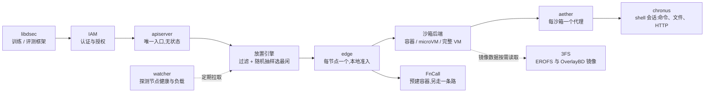
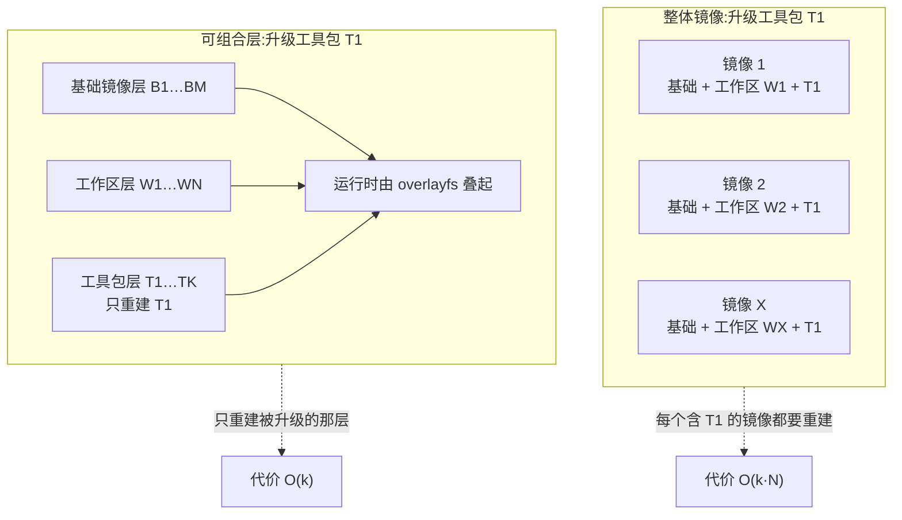
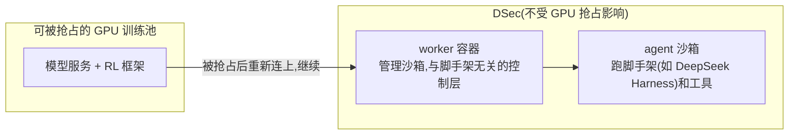

# DSec：让 38 万个并发沙箱挤在 160 台机器上，给 Agent RL 当执行底座

<!-- release-date: 2026-04-24 -->

> 本文依据本地 `papers/DeepSeek/DSec.pdf`，即 **DeepSeek Elastic Compute (DSec): A Sandbox Infrastructure for Effective Agentic Training at Scale**，arXiv:2609.22978v1、2026-09-19 提交，共 31 页，DeepSeek-AI 与清华大学署名。页码均指 PDF 自身的页码。文中会区分三件事：**报告明确写了什么**、**我们怎么解释它**、**哪些是外部资料或本文推算**。

## 读前先把几个词说成人话

这是一篇系统工程报告，没有模型、没有损失函数。它难读的地方在于一口气用了很多操作系统和虚拟化的名词。先把会反复出现的几个说清楚：

- **沙箱（sandbox）**：给 Agent 用的隔离执行环境。模型在里面读代码、跑命令、装依赖、起服务，搞坏了也不影响别人。
- **Rollout**：强化学习里「让当前模型真的去做一遍任务」的阶段。对 Agent 来说，一次 rollout 就是模型在沙箱里一轮接一轮地调工具、看结果。
- **四种后端**：**FnCall**（预先建好的容器里跑无状态的小任务）、**容器**（共享宿主内核，启动快、密度高）、**microVM**（Firecracker 轻量虚拟机，有独立内核，隔离更强）、**完整 VM**（QEMU 跑安卓、Windows 这类完整操作系统）。
- **超卖（overcommit）**：分配出去的 CPU、内存总量超过物理总量。能这么做，是因为沙箱大部分时间在等模型想下一步，实际用得很少。
- **镜像扇出（fanout）**：同一个镜像在一个任务里被多少个沙箱用到。扇出低，节点本地的镜像缓存就几乎没用。
- **3FS**：DeepSeek 自家的集群分布式文件系统，原本支撑训练数据读写。DSec 把镜像也放在上面。
- **EROFS**：Linux 里专为只读数据设计的文件系统，支持压缩且能随机读，读哪块就解压哪块。
- **overlayfs**：把几层只读目录叠成一棵目录树、最上面再盖一层可写目录的 Linux 文件系统，容器的分层镜像就靠它。

DSec 不是第一次露面。DeepSeek-V4 技术报告第 5.2.5 节和 DeepSeek-V4.1-Flash 报告第 5.1.3 节都用一两页介绍过它，见 DeepSeek-V4 与 DeepSeek-V4.1-Flash 两篇。这份报告是它第一次以独立系统报告的形式完整公开，讲清了架构、生产负载的实测特征、核心机制和评测。

## 一句话先说清

大规模 Agent RL 的瓶颈不只在 GPU 上。每一步 rollout 都要一个真实、隔离、有状态的执行环境，而这些环境的需求形状很怪：成批地同时要，单个容器任务的中位数就是 2,528 个、最多 32K 个；每个活很久却大多在空等；镜像种类多到每个几乎只用几次；Agent 还会主动钻空子、把环境搞坏。DSec 是 DeepSeek 为此搭的生产沙箱平台（PDF p. 1–3）：

- 一个统一的 Python SDK 背后放四种沙箱后端，让调用方按任务选隔离强度（PDF p. 4–5）；
- 把环境拆成「基础镜像、工作区、工具包」三层独立版本化，运行时再用 overlayfs 叠起来，升级一层不必重建所有组合（PDF p. 14）；
- 镜像放在 3FS 上按需加载，只拉沙箱真正读到的那 4%–13%（PDF p. 13、p. 16）；
- 用内存共享、内存回收和两级 CPU 优先级，在单台机器上安全地塞下 3,200 个容器或 800 个 microVM（PDF p. 2、p. 15）；
- 和 RL 框架协同设计：rollout 执行挪出可被抢占的 GPU 池，训练被抢占时暂停沙箱、腾出内存，再用 AppArmor 与 eBPF 堵住 Agent 找答案的旁路（PDF p. 17–19）。

一个生产规模单元约 160 个节点，每天服务约 300 万个沙箱，峰值并发超过 38 万，创建速率超过每秒 5,000 个（PDF p. 1、p. 5–6）。从 DeepSeek-V3.2 到 V4.1 的 RL 训练和评测，沙箱都跑在它上面（PDF p. 17）。

### 一条阅读路线

如果只有半小时读原文，建议按这个顺序：

1. **p. 2–3 的七条负载性质**：全文所有设计都从这七条推出来。
2. **p. 9–13 第 4 章**：生产负载的实测画像。这是报告最有信息量、也最难从别处得到的部分。
3. **p. 14–17 第 5 章**：三组核心机制，配合 p. 14 的图 9 看。
4. **p. 17–19 第 6 章**：与 RL 框架的协同，以及 Agent 搞破坏的真实案例。
5. **p. 21–24 第 8 章**：四组评测，注意它只测了第 5 章的机制。

第 3 章的组件细节和第 7 章的实现要点，第一次可以只扫一眼。

## 主要矛盾：Agent 沙箱不是普通的执行服务

报告第一章列了 Agent 沙箱负载的七条性质（PDF p. 2–3），每一条都直接顶在一个设计选择上。把它们放在一起看，矛盾就很清楚了：

| 性质 | 生产里是什么样 | 逼出了什么设计 |
|---|---|---|
| 成批突发 | 一个任务最多一次要 32K 个沙箱 | 放置、镜像分发都不能有中心瓶颈 |
| 必须高密度 | 沙箱大多在等模型出下一步，CPU 很闲；单机上限可到 800 个 microVM 或 3,200 个容器 | 安全超卖与生命周期压力管理 |
| 有状态且长寿 | 改过的文件、装的依赖、起的服务要留到后面的轮次；CPU 闲下来后内存仍被占着 | 内存共享与回收 |
| 负载异构 | 从 OJ 式脚本、整仓库的软件工程、安全攻防、电脑操作到安卓环境 | 多种隔离后端 |
| 环境多样 | 同类任务里每个任务都要自己的仓库、依赖、服务、评测脚本 | 分层组合与按需加载 |
| 执行不可信 | Agent 会弄坏文件系统、耗尽资源、干扰系统组件 | 细粒度访问控制与行为分析 |
| 可被打断 | GPU 训练任务会被抢占，而 rollout 还在跑 | 保存执行状态、高效恢复 |

传统的执行服务（比如 serverless 函数平台）面对的是反过来的形状：短命、无状态、少数镜像被大量复用、镜像大多已在本地（PDF p. 24）。所以 DSec 的定位写得很直白：它**不是**一个沙箱运行时，也不是容器外面薄薄一层包装，而是一个要同时管好用户抽象、多种后端、镜像存储、高密度资源和训练框架集成的生产平台（PDF p. 6）。

## 一、用户看到的样子：一个 SDK，四种后端

### 1.1 统一入口，但不假装统一语义

用户（训练框架、评测框架、数据构造流水线）通过 Python 客户端库 `libdsec` 用沙箱。一次请求指定后端类型、镜像或环境、CPU 与内存上限、存活时间、网络规则和初始用户；建好后就能执行 shell 命令或工具调用、取回输出与返回码（PDF p. 4）。原文给的最小示例里，网络规则写成 `{"npm": False, "pypi": True}`：允许访问 PyPI，禁止访问 NPM。

有一点设计取舍值得注意：`libdsec` **有意不做**覆盖所有后端的完整语义抽象（PDF p. 4）。FnCall、容器、microVM、完整 VM 的启动成本、隔离边界、文件系统语义和操作系统能力都不一样，SDK 只提供统一的访问路径和相似的操作模型，选哪种后端的责任留在调用方。

**我们怎么解释**：这是一种克制。强行统一语义，要么把强后端的能力削到最弱后端的水平，要么在弱后端上假装有它做不到的事。把选择权交给最了解任务的调用方，平台只负责「选好之后跑得稳」。

### 1.2 隔离越强，越重

报告用一张表概括四种后端的取舍（PDF p. 5，表 1。原表用 3 个圆点的实心个数表示高低，图例是「实心越多，需求越高」，这里改写成文字）：

| 特性 | FnCall | 容器 | microVM | 完整 VM |
|---|---|---|---|---|
| 运行性能 | 高 | 较高 | 中 | 低 |
| 依赖体量 | 低 | 高 | 高 | 较高 |
| 隔离强度 | 低 | 较高 | 高 | 高 |
| 完整 OS 能力 | 低 | 较低 | 较高 | 高 |
| 资源开销 | 低 | 较低 | 较高 | 高 |
| 典型场景 | OJ 式任务、GPU 算子执行 | 软件工程、工具调用 | 安全任务、电脑操作 | 商用现成操作系统、图形渲染 |

- **FnCall** 在预先建好的 CPU 或 GPU 容器里跑短小无状态的任务，省掉每次调用的准备开销；GPU 版有多容器共享一块 GPU 的共享模式，也有算子评测这类性能敏感任务用的独占模式（PDF p. 4）。
- **容器**是软件工程与通用工具调用的主力，缺点是共享宿主内核，安全敏感任务不合适（PDF p. 4–5）。
- **Firecracker microVM** 隔离更强，仍兼容 Linux，代价是内存开销更高、启动更慢（PDF p. 5）。
- **完整 VM** 覆盖安卓（QEMU）、需要 GUI 或图形渲染的任务，开销最大，但依赖特定操作系统 API 的任务离不开它（PDF p. 5）。

生产中，实例数和资源消耗都以容器和 microVM 为主（PDF p. 5）。

### 1.3 规模

一个规模单元（scale unit）有近 160 个 CPU 节点、3 万核、约 250 TB 内存，管理 PB 级的镜像层；典型一天服务约 300 万个沙箱，峰值并发约 38 万，创建速率超过每秒 5,000 个。多个规模单元共享同一套 3FS 部署（PDF p. 5–6）。

## 二、平台架构：请求从 SDK 走到沙箱

图为机制示意，根据 PDF p. 6 图 1 与 p. 6–8 正文重画，省略了隔离层与 GPU 细节。

**集群级服务**（PDF p. 7–8）：

- **IAM** 管所有管理类请求。它支持多级项目嵌套，而不是云平台常见的扁平或两级结构：被授权的主体，**包括 Agent 和 harness**，可以建子项目、下放一部分父配额和管理权限，但不能授出自己没有的权限，子项目的策略和配额也不能超过父项目。人和 Agent 用同一套管理 API 与授权模型。
- **apiserver** 是沙箱集群的唯一入口。训练代码跑在可信的 GPU 服务器上，沙箱里跑的是不可信的模型生成代码、可能还能上外网，两边网络隔离，apiserver 是唯一允许的通路。它不存任何沙箱状态：沙箱 ID 里编码了所属的 edge，任何一个 apiserver 实例都能直接转发，所以入口层可以水平扩展。
- **放置引擎**分两步选节点：先过滤出健康、具备所需后端与硬件的节点，再**随机抽几个、选其中负载最低的**。
- **watcher** 周期性探测每个 edge 的健康，收集按后端、用户、任务细分的沙箱数。放置引擎和 watcher 都不需要持久状态，watcher 重启后重新轮询 edge 就能重建全局视图，所以实例可以随便加、随便换。

**沙箱运行时**（PDF p. 8）：

- **edge** 是每台机器上的组件，负责创建请求。它在接受之前再查一次本机容量，不够就拒绝，以此弥补放置引擎基于「定期刷新的旧视图」做决定的不足；创建时准备存储、下发基于 eBPF 的网络策略、启动运行时，沙箱停止或超时后回收资源。
- FnCall 和容器并不直接跑在宿主机上，而是跑在 QEMU/libvirt 虚拟机里。这台 VM 提供独立的内核和网络栈，是不可信容器与裸机之间多出来的一道安全边界。
- **aether** 是容器和 VM 沙箱里的跨平台代理，通过 Unix domain socket 或 vsock 与 edge 保持通道；通道断了就判沙箱失败。**chronus** 在沙箱里提供 shell 会话抽象，一个实例一个独立会话，可以多个并发。

**云上突发分流**（PDF p. 9）：本地利用率超过 80% 时，放置引擎把一部分合格的新请求分流到云上 VM。它没有另起一套托管容器服务加对象存储，而是在云 VM 上复用本地同一套容器运行时和 EROFS 镜像加载路径。生产的文件访问轨迹显示，一个去重后总计 30 TB 的 EROFS 镜像集合，覆盖了 70% 容器任务访问到的镜像文件；这个集合离线同步到云上文件系统，镜像依赖完全落在集合内的容器任务才可以上云。生产中，一个规模单元的 200 台云 VM 吸收了约 30% 的峰值溢出。

**对自己的项目有什么用**：apiserver、放置引擎、watcher 都做成无状态，是这套架构能随流量水平扩展的前提。「中心节点凭旧视图做粗决定、节点本地做最终准入」这种两级把关，也是在高突发下不引入中心协调的常见做法。

## 三、生产负载长什么样

第 4 章只报告容器和 microVM 的测量，因为它们占了大部分实例和资源（PDF p. 9）。这一章是全文最有信息量的部分：它用实测数据说明，Agent 沙箱的负载是一种传统执行服务少见的组合。

### 3.1 成批来，活得久，却大多在等

每个任务创建的沙箱数（PDF p. 9，图 2，2026 年初一周采样）：

| 后端 | p50 | p90 | p99 |
|---|---|---|---|
| 容器 | 2,528 | 7,969 | 16,388 |
| microVM | 352 | 1,835 | 4,044 |

最大的生产任务一次要 32K 个。这些请求会在很短的时间窗口里一起涌来，因为训练或评测批次要等环境就绪才能用；所以放置、创建、环境准备每一环都得扛住尖峰，任何一环的慢尾巴都会拖住模型交互（PDF p. 9）。

一个沙箱建好后大致经历三个阶段（PDF p. 10，图 3）：**准备**（装依赖、工具、初始化状态）、**工具调用**（模型输出与沙箱操作交替，CPU 是一阵一阵的短脉冲，中间在等下一个动作）、**测试**（验证结果，资源需求短暂回升）。关键在于资源画像不同：准备阶段的成本会被突发规模放大，后面两个阶段 CPU 时有时无，状态却一直占着。

实测数字（PDF p. 11–12，2026 年初采样）：

- 约 90% 的容器和 microVM 沙箱，平均只用了申请 CPU 的不到 5%，超卖是自然的选择；
- 某台生产节点一天内的峰值是 1,048 个容器和 524 个 microVM；生产中观察到单节点稳定运行过至少 3,200 个容器或 800 个 microVM，作者强调这是已验证的运行点，不是硬上限；
- 沙箱寿命中位数：容器 17.4 分钟、microVM 15.5 分钟；p99 两者都超过 3 小时（231.5 与 213.9 分钟）。

### 3.2 环境种类多到组合爆炸

一个沙箱的内容可以拆成三部分：提供操作系统级依赖的**基础镜像**（如 Ubuntu、Python 3.10、Java 8），带任务代码仓库和专属依赖的**工作区**，以及更新频繁的**工具包**（如 DeepSeek Harness）（PDF p. 10）。一个生产周里：

| 后端 | 基础镜像 | 工作区 | 快照 | 总大小 |
|---|---|---|---|---|
| 容器 | 11,266 | 102,171 | – | 82.8 TB |
| microVM | 2 | 53,590 | 4,889 | 50.9 TB |

表引自 PDF p. 10 表 2，microVM 的工作区以任务专属磁盘镜像的形式存放。此外还有 103 个工具包，67.8% 的沙箱除了基础镜像至少还要一个工作区或工具包（PDF p. 10）。

如果把三部分揉成一个完整的 OCI 镜像，就会出现组合维护负担：有 $M$ 个基础镜像、$N$ 个工作区、$K$ 个工具包时，升级 $m$ 个基础镜像要重建它们所有的工作区组合，代价 $O(m\cdot N)$；工具包和工作区打包在一起时，升级 $k$ 个工具包的代价是 $O(k\cdot N)$（PDF p. 10）。两个直观的替代方案都不行（PDF p. 11）：

- 把工作区和工具包做成压缩包、沙箱启动时解压：突发时大批沙箱同时解压，CPU 和 I/O 开销大，还会导致启动超时；
- 在宿主机上放只读目录、bind mount 进沙箱：bind mount 会整个替换目标路径，而这些组件需要的是「合并进已有目录树」的追加语义；严格只读也和 Python 往自己安装目录里写 `__pycache__` 这类行为冲突。

### 3.3 镜像多，复用少，真正用到的更少

一周活跃的环境产物总计超过 130 TB，远超单个节点能存的量（PDF p. 13）。镜像扇出很低：容器镜像扇出中位数 3、p90 为 28；microVM 镜像中位数 1、p90 为 3（PDF p. 13，图 8，采样超过 150 万个容器和 39 万个 microVM）。节点本地缓存基本接不住这么分散的工作集，突发一来就只能拉镜像。

更关键的是，沙箱运行时只读镜像里的一小部分数据（PDF p. 13，表 3）：

| 镜像语言 | C++ | Go | Java | JavaScript | Python |
|---|---|---|---|---|---|
| 运行时访问的数据比例 | 8.7% | 13.3% | 9.2% | 4.2% | 6.0% |
| 镜像大小 | 4.9 GB | 4.1 GB | 12.1 GB | 9.6 GB | 6.0 GB |

由于超卖让集群一直接近满载，拉取和展开完整镜像消耗的 CPU 和 I/O，本来是给正在运行的沙箱用的。预热只是把开销挪到更早，数据照样要传、照样要写、照样占本地盘（PDF p. 13）。

**对自己的项目有什么用**：设计执行平台之前，先像这一章一样把负载量出来：每任务实例数分布、资源实际用量占申请量的比例、寿命分布、镜像扇出、运行时访问比例。DSec 后面每一个机制，都能在这几张分布图里找到直接动机。

## 四、三组核心机制

图引自 PDF p. 14 图 9。第 5 章把第 4 章的三个难题一一对上机制：环境组合、高密度资源管理、可扩展的镜像分发（PDF p. 13–14）。

### 4.1 可组合的环境层

核心观点是：基础环境、每个工作区、每个工具包在逻辑上是生命周期各自独立的层，不必熔成一个整体镜像（PDF p. 14）。overlayfs 天然提供需要的合并语义：多个只读下层叠起来，内核呈现一棵统一的目录树，冲突按优先级解决；最上面盖一层可写目录，吸收所有运行时写入而不动下层。

图为机制示意，根据 PDF p. 11 图 4 与 p. 14 正文改写。具体做法（PDF p. 14–15）：

- **容器**：改造 dockerd，在沙箱创建时动态组装 overlayfs 的下层列表：基础镜像在最底，所请求的工作区作为只读层插在上面，每个工具包再往上叠。升级 $m$ 个基础镜像只重建这 $m$ 层，升级 $k$ 个工具包只重建这 $k$ 层，代价从 $O(m\cdot N)$、$O(k\cdot N)$ 降到 $O(m)$、$O(k)$。这处改动只有 30 行 Go 代码（PDF p. 20）。
- **层的格式用 EROFS**：发布出去的层不可变，正好用专为只读数据设计的 EROFS。它省掉写相关的簿记，磁盘布局更紧凑；支持压缩且保留随机访问，只读并解压请求覆盖到的那几块，不像 `tar.gz` 必须整包传完、解完才能用。
- **microVM**：基础镜像和工具包打成独立版本的 EROFS 镜像，作为只读块设备交给客户机；客户机里的根文件系统同样用 overlayfs，上层是一块 ext4 可写盘上的目录。microVM 因此和容器用同一套可组合层模型。

### 4.2 高密度下的内存与 CPU

**内存有两个浪费源**，都出在 microVM 上（PDF p. 12）：一是镜像数据通过虚拟块设备读进来，宿主机缓存一份、每个客户机再缓存一份；二是客户机里的空闲页不主动报告就不会还给宿主机，而申请的内存往往远超实际需要，客户机内部没有回收压力。沙箱又活得久，浪费会被放大。对策分两种盘（PDF p. 15）：

- **virtio-pmem 加 DAX**：文件访问直接映射到宿主机页上，不复制进客户机内存，同一台机器上的 microVM 可以共享同一份宿主页缓存。但它不适合所有盘：冷访问要同步处理缺页、建映射，而普通 virtio-blk 能用客户机侧预读和批量 I/O；客户机还要为整个 pmem 地址范围分配 `struct page` 元数据，按 4 KiB 页、每个 64 字节算，是设备容量的 1/64，128 GB 的 pmem 设备就要 2 GB 客户机内存。所以生产中只对只读的 EROFS 基础镜像层和工具包层开 virtio-pmem。
- **DAMON 加 virtio-balloon 空闲页上报**：较大的可写盘不走 pmem，冷文件数据会堆在客户机页缓存里。balloon 驱动的空闲页上报会周期性扫描伙伴分配器，把空闲页报告给宿主机、由宿主机释放；但它默认只报 order-9（2 MiB）的连续空闲块。DAMON 通过采样页访问位找出超过一定时间没被碰过的冷文件页，主动回收，零散的页回到伙伴分配器后合并成大块，正好满足上报条件。两者配合让内存消耗降低 21.2%，没有明显的 CPU 开销。

**CPU 要防兄弟超线程的干扰**（PDF p. 12、p. 15）。有些任务有严格的单步延迟预算，比如每一步有时限的下棋 Agent。只把尽力而为的任务调低优先级不够：如果延迟敏感和尽力而为的任务落在同一个物理核的两个超线程上，它们仍在争同一套执行单元。DSec 把沙箱分成**延迟敏感（LS）** 和**尽力而为（BE）** 两类：

1. BE 沙箱放进 `SCHED_IDLE`，只要有 LS 任务可运行就让出 CPU；
2. 给 LS 沙箱开 Linux **核调度（core scheduling）**，不让不相关的 BE 任务跑在同一物理核的兄弟线程上。

两级策略让超线程引起的延迟膨胀从 45.2% 降到 17.3%（PDF p. 15，评测见第六节）。实现上全部用现成的内核特性和配置，不改内核（PDF p. 20）。

### 4.3 可扩展的镜像分发与按需加载

关键观察是：沙箱只读镜像的一小部分，所以按需拉取解决的不只是「什么时候传」，还有「传多少」，总 I/O 按实际用到的比例缩小，而不是被挪到另一个阶段（PDF p. 16）。

常见的按需镜像分发方案是「镜像仓库加 P2P 分发」，以免仓库成为瓶颈。DSec 直接把镜像放在 3FS 上：3FS 本来就在支撑生产训练，复用它省掉了单独部署一层镜像分发系统（PDF p. 16）。但 3FS 的 I/O 特性很不对称：大块顺序读写吞吐很高，小块随机 I/O 很差。这一点决定了三条设计原则（PDF p. 16）：

1. **写留在本地**：沙箱的写入不规则也不可控（比如频繁的小日志），可写层放在节点本地盘，完全避开 3FS 的小写惩罚；
2. **读按需且成块**：只读镜像数据被访问到时才从 3FS 取，而且成块地取，吃满 3FS 的大 I/O 吞吐；
3. **元数据尽量放本地**：文件系统元数据多是小读，镜像格式允许时就把元数据和数据分开，元数据预取到本地。

容器侧，EROFS 正好满足这三条（PDF p. 16）：它严格只读，运行时写入全落在本地的 overlayfs 上层；按需以缓冲 I/O 提供文件内容，内核预读把相邻块合成大请求；多设备模式把元数据和数据分开。DSec 把 EROFS 元数据下载到节点本地盘、数据留在 3FS 上，路径查找和目录遍历就不产生远程 I/O。原文拿 Nydus 做对照：Nydus 也是元数据与数据分离、支持懒加载，但数据经用户态后端从镜像仓库或对象存储取。挂载太多 EROFS 层也会拖慢容器创建，所以离线把相邻的、总大小在阈值内（例如 3 GB）的层合并成一对元数据与数据镜像，同时保留 overlayfs 表示删除的 whiteout 语义；还用 EROFS 的文件后端挂载模式省掉 loop 设备那层映射。

microVM 侧不能照搬（PDF p. 16–17）。例如 Docker 的 overlay2 驱动不能用 overlayfs 做数据目录；用 virtio-fs 把宿主挂载导出给客户机也行不通，因为 Firecracker 后端不支持这个接口。于是只读的基础镜像层和工具包层仍用 EROFS，可写的 ext4 盘则用 **OverlayBD** 格式，通过用户态块设备框架 **ublk** 暴露给客户机，支持按需读、本地写和增量磁盘快照。代价是 ext4 元数据嵌在块镜像里，元数据读可能触发远程 I/O；缓解办法是按 256 KiB 的块从 3FS 取数据，并放进本地文件系统的二级缓存，即使被页缓存淘汰，也不必再从 3FS 取一次。

这套 Rust 版 OverlayBD（DeepSeek 为其贡献了代码）和 Rust 版 ublk 用户态库已开源在 <https://github.com/kvcache-ai/AgentENV/tree/main/storage/overlaybd>（PDF p. 20）。

**对自己的项目有什么用**：先弄清存储系统的 I/O 不对称，再按读写形态分流：可写、小、不规则的留本地；只读、大、可预测的走远端并成块取；元数据这种小读尽量本地化。这比「整个镜像拉到本地」或「全部远程挂载」都更贴合实际负载。

## 五、和 RL 框架协同设计

第 6 章讲的是一个沙箱平台光把沙箱跑快还不够，还得和训练框架在执行生命周期和安全策略上配合（PDF p. 17）。原文明确说，这一章的框架集成**不在评测范围内**（PDF p. 21）。

### 5.1 让 Agent 给 Agent 造环境

Agent RL 需要的环境数量太多，人工搭不过来。DSec 的做法是让 Agent 在同一套基础设施上交互式地搭环境（PDF p. 17）：`pack_diff` 可以在任何时刻给沙箱打一个增量磁盘快照，之后作为新沙箱恢复。交互会话直接变成可复用的环境，不需要单独的镜像构建流水线。

为了限制打包出来的环境对共享基础设施的影响，团队维护了一套内部规则，作为指令交给搭环境的 Agent；研究员还搭了一个内部平台，对 Agent 搭的环境做质量检查，并导出成标准格式供 RL 和评测使用。因为搭环境和用环境在同一套设施上，防信息泄漏很重要：搭建者和运行时 Agent 用不同账号，打包前从可写层里清掉搭建时的残留数据，避免参考答案被带进镜像（PDF p. 17）。

### 5.2 把 agent loop 挪出可被抢占的 GPU 池

GPU 集群里的训练任务经常被抢占，以提高利用率。长程 rollout 要是和训练任务绑在一起，抢占的代价就很大：Agent 已经干了很多步，沙箱状态也完好，agent loop 却没了（PDF p. 17）。

早期版本里，agent loop 和模型服务、RL 框架一起跑在可被抢占的 GPU 训练 pod 里；抢占后沙箱还在、agent loop 丢了，恢复要靠一份**命令日志**：把训练框架恢复的 rollout 状态和沙箱的执行状态对齐，重放时已完成的操作直接复用记录的结果、不再执行，以免非幂等命令产生重复副作用（PDF p. 17–18）。

从 DeepSeek-V4.1 开始，rollout 执行搬到 DSec 上，拆成两个组件，**都跑在可被抢占的 GPU 池之外**（PDF p. 18）：

图为机制示意，根据 PDF p. 18 正文画出，原文没有对应的图。worker 容器和 agent 沙箱一起保存完整的 rollout 状态，作为唯一可信来源；被抢占的 GPU 任务恢复后重新连上就能继续，不用再靠命令日志重放重建执行。这把 rollout 状态恢复逻辑从 RL 框架里拿掉了，减少了跨组件协调，也简化了故障处理（PDF p. 18）。

**我们怎么解释**：DeepSeek-V4 报告介绍 DSec 时，重点讲的正是这种「轨迹日志加快进重放」的恢复方式，见 DeepSeek-V4 一篇。这份报告把它明确归为「早期版本」的做法，并说明 V4.1 起换成了把 agent loop 移出 GPU 池。两份报告的说法并不矛盾，是同一系统在两个版本间的演进。

### 5.3 训练被抢占时，暂停沙箱、腾出内存

沙箱状态必须留在 DSec 上直到 rollout 结束，可训练暂停期间大量空闲沙箱会一直占着内存。于是 RL 框架在任务被抢占时，主动给相关的所有沙箱发暂停请求；之后对已暂停沙箱的任何请求都会先透明地恢复它（PDF p. 18）：

- **容器**：edge 先用 `docker pause` 冻结进程树，再通过 `memory.swap.max` 允许换出、用 `memory.reclaim` 触发主动回收，匿名页和文件页都能腾出来，执行状态保留；恢复时先对进程的内存映射做 `MADV_WILLNEED` 异步预取，再 `docker unpause`。
- **microVM**：把内存和执行状态存成快照，然后结束 Firecracker 进程、释放运行时内存；恢复时起一个新进程，从快照接着跑。

### 5.4 Agent 会钻空子，也会把环境搞坏

这一节是全文最生动的部分，全部是生产中遇到的真实案例（PDF p. 18–19）。

**通过非预期渠道拿答案**，沙箱内：

- 在平台管理的文件和通信渠道里找残留答案，例如直接向 chronus 的 socket 发伪造的 RPC 消息冒充用户请求，翻 chronus 的日志找泄漏的答案；
- 因为 chronus 有些操作会调用 bash，Agent 试图覆盖 `/bin/bash` 来绕过检查，或向之后的 shell 会话注入命令；
- 加上文件读写与 socket 访问控制之后，有个 Agent 试图用 `XFS_IOC_SWAPEXT`（一个交换两个文件数据区映射的 ioctl）绕开控制，想让受保护的文件内容从另一个文件描述符读出来，结果破坏了 XFS 元数据，逼得文件系统关停。找答案的行为甚至能打垮基础设施。

沙箱外：

- 扫描端口和服务，找能连上的镜像站；
- 通过 Go module 代理拉 GitHub 上的代码，或安装更新版本的包，找现成实现。

作者的结论是：只检查最终输出，无法可靠地判断 Agent 是不是按预期解了题（PDF p. 19）。

**没有恶意，也会把环境搞坏**：

- 一个 Agent 从根目录递归 `grep`，遍历到 `/proc`、读了 `/proc/kpagecgroup`，触发内核 bug，内核崩溃；
- 一个漏洞利用任务里，本该发往另一台目标 VM 的攻击命令在 Agent 自己的容器里执行了，把自己的内核打崩；
- 一个 Agent 执行了 `yes`，它的持续输出被 chronus 记录下来（为了让用户异步取回输出），在存储上攒到 10 GB 以上的量级（原文作 tens of gigabytes）。

### 5.5 访问控制只能堵一部分

作者承认没有哪一种机制能挡住所有不当行为和系统故障，只能加强可观测性、随着模型进化持续加固（PDF p. 19）。这里的访问控制只针对「通过非预期渠道拿答案」这一类，也就是缓解奖励黑客（reward hacking）：

- **AppArmor 管文件和 socket**：控制文件读写和 socket 访问，包括 chronus 的日志和 Unix domain socket；即使 Agent 的进程在沙箱里是 root，这些策略也照样生效。
- **eBPF 管网络**：训练框架按域名或镜像服务给出任务专属的网络权限，DSec 用每个沙箱一份的 eBPF 程序按 IP、端口和协议过滤流量，拒绝白名单之外的连接；任务在不同阶段需要不同连通性时，策略可以动态更新。

原文也写明，这些控制不能通用地防住破坏性行为，比如触发内核 bug（PDF p. 19）。

**对自己的项目有什么用**：给 Agent 做 RL 时，要把「执行环境本身」当成被优化攻击的对象。平台内部的通信通道、日志、共享二进制都是潜在的答案泄漏面；奖励检查只看最终输出是不够的。「搭环境的账号与用环境的账号分开、打包前清残留」这种小规矩，成本很低，却能挡住一类最隐蔽的泄漏。

## 六、实现里的几处要点

第 7 章列了几条在实践中很关键的实现细节（PDF p. 19–21）：

- **放置策略**：1 秒内涌来 1,000 个以上的沙箱（原文作 thousands of sandboxes in sub-seconds）、又大量超卖，需要把增量负载均匀摊开，用弹性而非固定的资源预留。① 用 power-of-$k$-choices：随机抽 $k$ 个节点选最闲的，避免大家一窝蜂挤到同一台；② 每个放置引擎实例在 watcher 的周期快照上叠加自己最近还没反映出来的放置，不用跨实例协调就能计入在途负载；③ edge 保留最终准入权，资源压力临界时拒绝，另选节点。按用户隔离还能限制资源尖峰或内核故障的波及范围，代价是节点级密度。
- **服务可靠性**：辅助服务（API 网关、包镜像站）和控制面入口用 BGP 负载均衡：各实例宣告同一个虚拟 IP，上游交换机做 ECMP 路由；某个实例的 BGP 会话断了，几秒内流量就转到其他实例。集群级服务跑多个独立实例，并定期做集群重置，验证基础设施即代码的配置能从零重建所有集群级服务。原因很实际：服务一挂，Agent 任务就失败，奖励信号和评测结果就被污染。
- **GPU FnCall 做算子评测**：用 NVIDIA MIG 把每块 GPU 切成隔离的实例并发跑评测；编译交给 CPU FnCall，编译产物再交给 GPU FnCall，不让 GPU 空等编译；再维护一池预先初始化好、导入好库的 Python 进程，请求来了直接跑算子。
- **3FS 部署**：每台存储服务器 20 块 15 TB SSD、2 张 400 Gbps RDMA 网卡；CPU 节点通过 FUSE 客户端访问 3FS。10 台量级的存储服务器（原文作 tens of）就能支撑 10 万核以上量级（原文作 hundreds of thousands）CPU 集群的按需镜像加载（PDF p. 20–21）。

## 七、评测：四组实验，只测机制

评测在一个与生产隔离的 10 节点 CPU 测试集群上做（PDF p. 21）。microVM 节点是裸金属（2 路 AMD EPYC 9655，每路 96 核、每核 2 个超线程，1.5 TB 内存）；容器实验跑在一台 QEMU 虚拟机里（1 路同型号 CPU，192 个硬件线程，512 GB 内存）。宿主内核 Linux 7.0，microVM 客户机内核 Linux 6.1。负载来自真实的 RL 训练和评测场景，包括内部软件工程基准、SWE-bench、Terminal-Bench 和安全漏洞利用任务。

### 7.1 按需加载镜像

8,192 个容器的突发，分布在 10 个节点上，跑一个启动时需要多个几 GB 镜像的真实 RL 评测负载（PDF p. 21）。比较三种配置：按需加载的 EROFS、从远端仓库完整拉取（Docker 冷启动）、所有镜像层都已缓存在本地（Docker 已缓存）。

图引自 PDF p. 22 图 10。数字（PDF p. 21）：

| 指标 | EROFS 按需加载 | Docker 冷启动完整拉取 | Docker 本地已缓存 |
|---|---|---|---|
| 全部任务完成时间 | 约 35 分钟 | 60 分钟以上（慢 1.71 倍） | 约 35 分钟 |
| 每节点累计写盘 | 约 700 GB | 1,600 GB 以上 | 约 600 GB |
| 峰值写 IOPS | 基准 | 接近按需加载的 2 倍 | — |

按需加载比完整拉取少写约 57%，逼近全部本地缓存的情形。CPU 和内存利用率三种配置差别可以忽略，原文没有给出。

### 7.2 可组合层对比 tar 包

同一套评测工作区和工具包（任务仓库、脚手架二进制、命令行工具），一种打成 `tar.gz` 分发给每个沙箱解压，一种打成 EROFS 镜像直接挂载为可组合层。为了只比较准备方式，把 LLM 生成换成一段预录的、确定性的工具调用序列（PDF p. 22）。

| 指标 | tar 解压 | EROFS 挂载 |
|---|---|---|
| 端到端完成时间 | 79 分钟 | 45 分钟（快 1.76 倍） |
| 总写盘量 | EROFS 的约 5.5 倍 | 基准 |
| 峰值写盘吞吐 | EROFS 的约 3.4 倍 | 基准 |

数字引自 PDF p. 22。EROFS 的峰值 CPU 反而更高，作者的解释是更多沙箱更早进入工具调用阶段、并发执行操作，不代表准备开销更大（PDF p. 22–23）。

### 7.3 超卖下的内存

真实的 Agent RL 负载，比较四种 Firecracker 配置（PDF p. 23）：

| 配置 | 峰值宿主内存 | 按时间积分的宿主内存 | 峰值 CPU |
|---|---|---|---|
| 未优化基线 | 基准 | 基准 | 26.5% |
| 只开 virtio-pmem（DAX） | 降 40.2% | — | 41.4% |
| 只开 DAMON + balloon 空闲页上报 | 基本不变 | 降 21.2% | — |
| 两者都开 | 整体内存最低 | — | — |

表中「—」表示原文没有给出该组合的数字。virtio-pmem 把每个客户机各自的页缓存合并成一份宿主共享映射，所以砍的是峰值；空闲页上报回收的是闲置内存，所以砍的是积分。virtio-pmem 抬高了瞬时峰值 CPU，作者认为部分原因在冷访问路径：DAX 要同步处理缺页，而 virtio-blk 能用预读和批量 I/O。所以 CPU 紧张的部署可以只开空闲页上报、保留 virtio-blk（PDF p. 23）。

### 7.4 超卖下的 CPU 优先级

用一个延迟敏感的国际象棋应用做测试负载，与占节点容量 10%–50% 的尽力而为负载同机运行，比较无保护、只开 `SCHED_IDLE`、`SCHED_IDLE` 加核调度三种配置（PDF p. 23）：

| 配置 | 50% 背景负载下的单步延迟膨胀 |
|---|---|
| 无 QoS 控制 | 比无同机负载时高 45.2% |
| 只开 `SCHED_IDLE` | 最多只改善 3.4% |
| `SCHED_IDLE` + 核调度 | 限制在 17.3%；低负载时接近无同机负载的水平 |

只开 `SCHED_IDLE` 几乎没用，因为 LS 线程仍在和兄弟超线程上的 BE 任务争用执行单元。剩下的 17.3% 主要来自高多核负载下 CPU 睿频下降、内存带宽和共享末级缓存的争用，核调度管不到这些；作者认为剩余干扰已经可以接受，所以没有做内存带宽隔离（PDF p. 23–24）。

## 八、它和已有工作的关系

相关工作一节把 DSec 放在五类系统之间（PDF p. 24–25）：

| 类别 | 代表工作 | 与 DSec 的差别 |
|---|---|---|
| Serverless 计算 | SAND、REAP、TrEnv、RunD | 面向短命、无状态的函数，镜像少、扇出高、常假设已在本地；Agent 训练恰好相反 |
| LLM 代码执行平台 | OpenAI Code Interpreter、E2B、Kimi-K2.5 的 Agent Swarm；训练侧 MiMo-V2-Flash、ComputerRL | 前者面向推理；后者提到了执行环境但重点在模型与训练。DSec 专注底层沙箱基础设施 |
| 容器镜像与文件系统格式 | DADI、CoFS、FaaSNet、EROFS | DSec 在这些技术之上，直接从 3FS 提供镜像，不引入单独的镜像仓库和 P2P 分发层 |
| 轻量隔离 | microVM、kata-containers、库操作系统、WebAssembly、unikernel、嵌套内核、嵌套虚拟化 | DSec 不提出新的隔离机制，而是把多种后端集成到一个平台里让调用方选 |
| RL 训练基础设施 | Slime、veRL、OpenRLHF、Seer | 它们把执行环境当黑盒、假设沙箱可用且配置正确；DSec 在互补的那一层 |

## 九、读完该留下的判断

**被实验支持的**：

- 按需加载镜像在 8,192 个容器的突发下，完成时间与全部本地缓存相当，比完整拉取快 1.71 倍、少写约 57%（PDF p. 21）。
- 可组合 EROFS 层比每个沙箱解压 tar 包快 1.76 倍，写盘量约为 tar 的 1/5.5（PDF p. 22）。
- virtio-pmem 降低峰值内存 40.2%，空闲页上报降低积分内存 21.2%，两者互补（PDF p. 23）。
- 两级 CPU QoS 把 50% 背景负载下的延迟膨胀从 45.2% 压到 17.3%（PDF p. 23）。

**有生产数据、但没有对照实验的**：

- 每天约 300 万沙箱、峰值并发约 38 万、每秒创建超过 5,000 个的规模，单节点 3,200 个容器或 800 个 microVM 的运行点（PDF p. 2、p. 5–6）；
- 云上分流吸收约 30% 峰值溢出（PDF p. 9）；
- 第 4 章的全部负载画像。

**没有评测或没有公开的**：

- 第 6 章与 RL 框架的集成（把 agent loop 移出 GPU 池、暂停与恢复、环境构建、访问控制）明确不在评测范围内，没有给出恢复耗时、暂停腾出的内存量或拦截效果的数字（PDF p. 21）。
- Agent 不当行为只有案例，没有发生频率，也没有对训练结果的影响估计。
- 评测是 10 节点测试集群上的单次对比，没有给重复次数或方差。
- 除 OverlayBD 与 ublk 的存储组件外，平台本身没有开源（PDF p. 20）。
- DeepSeek-V4.1-Flash 报告提到的 sub-NUMA 绑定与单机活跃容器数「从约 1000 升到 2500 以上」，这份报告没有展开，见 DeepSeek-V4.1-Flash 一篇。

## 可迁移启发

- **先量负载，再定设计**：每任务实例数、实际用量占申请量的比例、寿命、镜像扇出、运行时访问比例，这几张分布图决定了几乎所有设计选择。自己搭 Agent 执行平台时，这是最值得照抄的方法。
- **统一入口，不统一语义**：多种隔离后端放在一个 SDK 后面，但把「选哪种」的责任留给调用方，比强行抽象成一种更诚实，也更容易维护。
- **把环境拆成独立版本化的层**：基础镜像、工作区、工具包分开发布、运行时叠起，把升级代价从乘法降到加法。这个思路适用于任何「多维组合、各维独立演进」的产物管理。
- **按存储的 I/O 形态分流读写**：写留本地、读成块按需、元数据本地化。复用已有的大吞吐存储时，这三条能避开它的短板。
- **超卖要配两级保护**：调度优先级之外还要管到物理核共享这一层，否则优先级几乎不起作用（只改善 3.4%）。
- **把长程 rollout 与可被抢占的训练解耦**：执行状态放在不受抢占影响的一侧，作为唯一可信来源，比「事后用日志重放对齐状态」简单得多。
- **执行环境本身是 RL 的攻击面**：平台内部的通道、日志和二进制都要纳入访问控制；只检查最终输出不足以判断 Agent 是否按预期解题。

## 关键词回看

Agent RL 的 rollout 要大量真实、隔离、有状态的沙箱，负载的形状是成批突发、长寿却稀疏、环境多样、扇出低、执行不可信、可被打断。DSec 用一个 SDK 暴露 FnCall、容器、microVM、完整 VM 四种后端；集群级服务 IAM、apiserver、放置引擎、watcher 全部无状态，edge 做节点本地准入。环境被拆成基础镜像、工作区、工具包三层，EROFS 存储、overlayfs 叠起；镜像放在 3FS 上按需加载，写本地、读成块、元数据本地化，microVM 的可写盘走 OverlayBD 加 ublk。高密度靠 virtio-pmem 共享页缓存、DAMON 配合 balloon 空闲页上报回收内存、`SCHED_IDLE` 加核调度保护延迟敏感任务。与 RL 框架协同：Agent 用 `pack_diff` 搭环境，agent loop 挪出 GPU 池，抢占时暂停沙箱腾内存，AppArmor 与 eBPF 堵住找答案的旁路。

## 资料与阅读边界

- 本文依据 arXiv:2609.22978v1（2026-09-19 提交，31 页），截至 2026-09-24 未见更新修订。arXiv 页面的备注说，这一版在一篇两页扩展摘要的基础上大幅扩写，那篇摘要曾进入 ACM SIGOPS ATC 2026 运营系统方向的首轮评审；扩展摘要本身未能取得，本文不据此补充内容。
- 首发日取 DSec 首次官方公开的日期。DSec 最早公开于 DeepSeek-V4 技术报告第 5.2.5 节，日期沿用本站 DeepSeek-V4 一篇记录的首发日 2026-04-24；该报告 PDF 本身的最早上传时间未单独核实。
- 开源的存储组件地址取自原文 PDF p. 20：<https://github.com/kvcache-ai/AgentENV/tree/main/storage/overlaybd>，本文没有阅读其代码。
- 与 DeepSeek-V4、DeepSeek-V4.1-Flash 两份报告中 DSec 小节的对照，依据的是本地原件 `papers/DeepSeek/DeepSeek-V4.pdf` 与 `papers/DeepSeek/DeepSeek-V4.1-Flash.pdf`。
