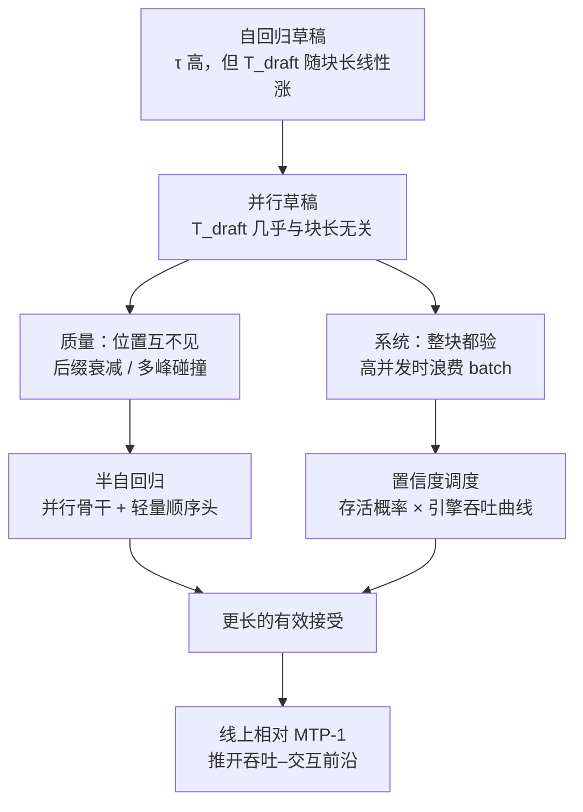
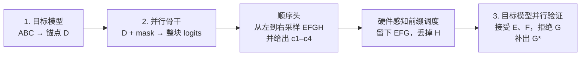

# DSpark：并行草稿会烂尾，全长验证又会占满并发

<!-- release-date: 2026-06-27 -->

> 本文依据本地 `papers/DeepSeek/DSpark.pdf`，即 **DSpark: Confidence-Scheduled Speculative Decoding with Semi-Autoregressive Generation**，arXiv:2607.05147v1、2026-07-06 提交，共 33 页。页码均指 PDF 自身的页码。文中会区分三件事：**报告明确写了什么**、**我们怎么解释它**、**哪些是外部资料或本文推算**。

## 阅读前先搭一张最小地图

这篇论文不讲新模型怎么训，只讲一件推理期的事：怎样让大模型每吐一个词不必都自己走完整前向。它借了不少投机解码和服务系统的词。先把关键概念翻成人话，后面正文就不必反复解释。

- **Token（词元）**：模型读写文本时的基本小块。
- **自回归（autoregressive）**：下一个词必须等上一个词采出来才能算。生成长度有多长，串行步数就有多少。
- **投机解码（speculative decoding）**：先让一个便宜的草稿模型把后面几个 Token 猜出来，再让大模型用一次前向把这一整块一起验证。本站知识库「投机解码」篇讲的是这条技术的通用原理；**本篇只写这份论文自己做了什么**。
- **草稿模型 / 目标模型（draft / target）**：猜的人叫草稿，拍板的人叫目标。目标模型就是线上真正在服务的那个大模型。
- **接受长度 $\tau$**：每一轮验证之后，实际留下多少个 Token。论文里的 $\tau$ **默认含目标模型补出来的那个奖励 Token**（PDF p.10 脚注 4）。
- **奖励 Token / 锚点 Token（bonus / anchor）**：上一轮目标模型补出来的那个词。论文说这两个词可以互换，都指「上一轮目标模型产出的最后一个 Token」（PDF p.4 脚注 1）。
- **后缀衰减（suffix decay）**：一块草稿越往后，被接受的概率掉得越快。并行草稿特别容易在尾巴上翻车。
- **前缀存活概率（prefix survival probability）**：第 $j$ 个草稿 Token 要活下来，前面 $1$ 到 $j$ 个都必须被接受。它是一串条件概率的连乘，不是单点分数。
- **吞吐–交互前沿（throughput–interactivity Pareto frontier）**：系统总吞吐（每 GPU 每秒产出多少 Token）和单用户生成速度（每用户每秒多少 Token）之间的那条边界。往外推，意味着同样的机器能同时更快、接更多人。

这篇论文自己造的、或特别强调的名字有三个：

- **DSpark**：半自回归草稿 + 置信度调度验证，整套投机解码框架。
- **半自回归生成（semi-autoregressive generation）**：重活仍由并行骨干一次算完，再用一个很轻的顺序模块把块内依赖补回去。
- **置信度调度验证（confidence-scheduled verification）**：每个请求该验多长，不写死，而由前缀存活概率和引擎吞吐曲线当场决定。

封面署名两家机构：北京大学与 DeepSeek-AI。共同一作五人：Xin Cheng、Xingkai Yu、Chenze Shao、Jiashi Li、Yunfan Xiong；通讯邮箱落在 `@deepseek.com`（PDF p.1）。本站目录按主要归属方放在 `DeepSeek`。

## 一句话先说清

并行草稿之所以快，是因为它一次前向就能吐出一长串候选；也正因为一次吐完、位置之间互不看见，后面的词很容易跟前面采出来的词对不上，接受率沿块迅速往下掉。

更麻烦的是第二件事。草稿块变长以后，若不分青红皂白把整块都送给目标模型去验，高并发时那些几乎注定被拒的尾巴会占住宝贵的 batch 位置，本来可以拿去服务别的请求。

DSpark 的答案不是退回短草稿，也不是把验证长度写死成一个魔法数字，而是把这两件事拆开治：

> **重计算仍走并行，轻量顺序头只负责把块内依赖补上；验证长度则按「这块前缀还能活多久」和「当前引擎再多验一个还赚不赚」当场裁。**

离线评测里，它在 Qwen3 三档目标模型上的宏平均接受长度相对自回归草稿 Eagle3 高 26.7%–30.9%，相对并行草稿 DFlash 高 16.3%–18.4%（PDF p.3、11）。接到 DeepSeek-V4 的线上 serving 之后，相对当时的生产基线 MTP-1，在匹配的总吞吐下把每用户生成速度提高 60%–85%（V4-Flash）和 57%–78%（V4-Pro）（PDF p.3、18–19）。

所以这篇论文真正要记住的，不是又一个草稿头名词，而是一对必须同时成立的约束：

> **草稿可以并行，验证不能无脑并行。** 块内依赖用最小的顺序代价补；验证预算按负载和存活概率花。

这也是全文最重要的 insight。

## 这篇论文站在哪张地图上

先把位置说清楚，避免和本站已有的两篇材料搅在一起。

第一，它不是新基座。论文明确写：DSpark 部署在 DeepSeek-V4-Flash（preview）和 DeepSeek-V4-Pro（preview）的 serving 系统里，对照的是当时线上的 MTP-1（PDF p.3、16、18）。V4 自己那份报告讲的是一百万 Token 上下文、压缩稀疏注意力、mHC 和 Muon；MTP 在 V4 里只是沿用的底盘，深度仍为 1。**DSpark 是推理服务层的后装加速，不是训练并行，也不是 V4 报告里的新贡献。** V4 基座怎么连起来，见本站 [DeepSeek-V4](/reports/DeepSeek/DeepSeek-V4)；投机解码的通用原理见知识库「投机解码」篇。本篇只依据这份 PDF。

第二，它要解决的矛盾发生在「草稿已经能一次吐很长」之后。早期自回归草稿每多猜一个词就多付一次延迟，块不敢开大；并行草稿把这块延迟压成一次前向，块可以开到例如 $\gamma=16$（PDF p.4）。潜力被释放出来以后，质量问题和系统问题才同时冒头。

第三，论文自己把加速拆成三根杠杆（PDF p.3，式 1）：

$$
L=\frac{T_{\mathrm{draft}}+T_{\mathrm{verify}}}{\tau}
$$

人话：每个最终留下的 Token 平均要花多少墙钟时间。缩短草稿时间、提高接受长度、少做冤枉验证，三件事都能让 $L$ 变小。DSpark 的两个组件分别对着后两根杠杆：半自回归提高 $\tau$，置信度调度削减无效的 $T_{\mathrm{verify}}$。

这张图是本文按第 1–3 节和第 5 节的论证顺序重画的机制示意（依据 PDF p.2–4、16–19），不是实测时间轴。框里的对照关系来自论文正文。

**建议的阅读路线**：只想知道 DSpark 是什么，读核心设计一二就够；想理解它为什么必须存在，第一层和第二层问题不能跳；想判断自己的 serving 能不能用，线上部署和无损口径是重点；只关心和 V4 的关系，直接跳到「接到 DeepSeek-V4 的 serving」。

## 第一层问题：投机解码的账怎么算

论文第 2.1 节把经典流程写得很短（PDF p.3）。草稿模型提出 $\gamma$ 个候选，目标模型一次前向验证整块，从左到右做接受–拒绝：第 $k$ 个位置按 $\min\bigl(1,\ p^t_k(x_k)/p^d_k(x_k)\bigr)$ 决定是否留下；第一个被拒的位置之后全部作废，再由目标模型补一个奖励 Token。

这一段是标准投机解码，不是 DSpark 的新规则。论文在引言里写：**验证是并行的，接受规则精确保持目标分布，因此加速不损失质量**（PDF p.2）。这句话是它对经典投机解码的转述。后文会看到，轮到「调度器决定验多长」时，无损不再是免费附赠，必须另证。

两个已有草稿路线各自付什么代价（PDF p.4）：

| 路线 | 块内依赖 | 草稿延迟 | 被迫做什么 |
|---|---|---|---|
| 自回归草稿（Eagle3、MTP、Recurrent Drafter 等） | 每个位置能看见已采样的前缀 | $T_{\mathrm{draft}}\propto\gamma$ | 块要短、网络要浅 |
| 并行草稿（Medusa、DFlash、PARD、DART 等） | 各位置独立预测 | 一次前向，几乎与 $\gamma$ 无关 | 块可以长，但尾巴容易烂 |

树形验证（SpecInfer 一类）被论文点名为自回归路线的补偿：候选扩成树、一次验多条路径，但验证 Token 数量变多，总吞吐会掉（PDF p.4）。**DSpark 的离线实验全部使用链式草稿，不用树**（PDF p.10）。

并行路线里，论文选 DFlash 作为骨干实例。DFlash 在 prefill 时从目标模型若干层取出隐状态，拼起来投影进草稿空间，再作为 KV 注入每一层草稿；块内位置彼此双向注意，也注意注入进来的目标上下文（PDF p.4，式 2–3）。草稿共享目标模型冻结的词嵌入和语言模型头。因为一次前向就出完整块，它在同样的延迟预算下养得起更深的网络、更长的块。

本文的读法：DFlash 解决的是「草稿本身不要串行」；它没有解决「并行预测会在尾巴上互相打架」，更没有解决「长块在高并发下该不该全验」。DSpark 是从这两处缺口长出来的。

## 第二层问题：并行草稿的两个瓶颈

论文把两个瓶颈写得很对称，一个在生成质量，一个在系统效率（PDF p.2）。

### 瓶颈一：位置互不见，尾巴会烂

并行草稿一次给出 $\gamma$ 个位置的 logits，每个位置都看不到块里其他位置实际采到了什么。上下文若同时允许「of course」和「no problem」，并行模型可能拼出「of problem」或「no course」——每个位置都在对所有可能的前驱做边缘化，而不是条件在那个真正被采出来的词上（PDF p.5）。论文把这种现象叫做 **multi-modal collision（多峰碰撞）**。

后果很具体：接受率沿块迅速衰减。前面几个位置还行，后面的位置即使单独看起来像那么回事，也会因为和已锁定的前缀不一致而被拒。被拒之后，后面算过的草稿和验证全部作废。

### 瓶颈二：整块都验，高并发时在浪费 batch

草稿变长并不自动变成端到端加速。论文反复强调：无差别验证整块，会在高并发下严重损害系统吞吐（PDF p.2、6）。原因有两边。

数据侧：接受率随领域变。代码这类结构化文本天然好猜，开放聊天难猜（PDF p.2、6）。同一套固定验证长度，对代码可能偏短，对聊天则在验注定被拒的尾巴。

系统侧：多验一个 Token 的真实代价取决于引擎负载。轻载时，就算验错了也几乎不罚；高并发时，每一个多余的验证位置都占着目标模型的 batch 容量，而这些容量本可以拿去服务别的活请求（PDF p.6–7）。

所以「最优验证长度」有两根轴，缺一根都会判错：请求本身好不好猜，以及现在机器忙不忙。静态阈值只看第一根轴；固定块长两根都不看。

DSpark 后面的两个组件，正好分别对着这两个瓶颈。

## 核心设计一：半自回归草稿——重活并行，依赖用轻量顺序补

### 一轮长什么样

论文 Figure 1 把完整一轮画成三步（PDF p.5）。本文按该图重述机制，不是实测耗时。

给定提示 `ABC`，目标模型先走一步得到锚点 `D`。草稿以 `D` 为输入，并行骨干一次算出后续位置的隐状态和基础 logits，轻量顺序头再从左到右采出 `EFGH`，同时给出每个位置的置信度。调度器看这些分数，留下前缀 `EFG`、丢掉低置信的 `H`。目标模型只验证这条被调度过的前缀：`E`、`F` 接受，`G` 拒绝，再补一个纠正后的 `G*`，这一轮结束。

两个设计选择已经写在这张图里：草稿生成被拆成「重并行 + 轻顺序」；送去验证的不是草稿的全长，而是调度器裁过的前缀。

### 并行阶段：仍然一次前向出整块

并行骨干在论文的实例化里就是 DFlash（PDF p.5）。一次前向得到隐状态 $h_1,\ldots,h_\gamma$ 和基础 logits $U_1,\ldots,U_\gamma$。

对原版 DFlash 只改了一处：原版吃「一个锚点 + $\gamma$ 个 mask」，只预测 mask 位置；DSpark 把锚点自己也当成第一个预测位置，于是 $\gamma$ 个输入（锚点 + $\gamma-1$ 个 mask）就给出 $\gamma$ 个草稿 logits（PDF p.5）。论文说这样减少草稿计算，草稿质量仍接近。

这一步的目的很明确：**计算量最大的那部分仍然 $O(1)$，不随块长线性涨。** 顺序依赖故意不在这里解决。

### 顺序阶段：只给每个位置加一个「看见前一个词」的偏置

顺序模块不另训一个自回归小模型，而是在并行骨干已经给出的 $U_k$ 上加一个依赖前缀的转移偏置 $B_k$，再做普通 softmax（PDF p.6，式 4）：

$$
p_k(v\mid x_0,x_{<k})=\frac{\exp\bigl(U_k(v)+B_k(x_0,x_{<k},v)\bigr)}{\sum_{u\in\mathcal{V}}\exp\bigl(U_k(u)+B_k(x_0,x_{<k},u)\bigr)}
$$

整块的联合分布按自回归因子分解：$P(X\mid x_0)=\prod_k p_k(x_k\mid x_0,x_{<k})$。推理时从左到右按这个条件分布采样。

论文特别强调一件容易被忽略的事：它**没有**做成全局归一化的能量模型（PDF p.6）。原因在相关工作里写得很清楚——投机解码的拒绝采样需要每个位置给出**精确的** Token 概率；CRF-NAT 那种全局配分函数算不出逐 Token 精确概率，CTC 草稿则因为要对齐路径做边缘化，只能退到贪心验证（PDF p.21）。DSpark 把顺序修正留在局部，每个位置仍是一次普通 softmax，精确概率还在。

因为采样本身是串行的，这个模块必须非常轻：$T_{\mathrm{sequential}}\ll T_{\mathrm{parallel}}$，整段草稿延迟仍由并行阶段主导（PDF p.6）。论文给了两种实例。

**Markov 头（默认）。** 偏置只依赖紧邻的上一个 Token，本质上是一张 $V\times V$ 转移表。直接存太大，于是做低秩分解 $B=W_1 W_2$，默认秩 $r=256$（PDF p.6，式 5）。$W_1$ 当嵌入查找表，$W_2$ 当 logit 投影。回到前面的例子：位置 1 采到「of」之后，Markov 头会抬高「course」、压低「problem」，跨峰碰撞就被压下去。

**RNN 头。** Markov 头没有一步以上的记忆。RNN 头维护一个块内循环状态 $s_k$，每步把 $s_{k-1}$、上一个词的嵌入 $W_1[x_{k-1}]$ 和骨干隐状态 $h_k$ 拼成 $z_k$，再做一个门控更新（PDF p.6，式 6）。$s_0$ 初始化为零。它能看见块内更长的前缀，但实现更重、部署更不友好。后文实验里它只在更长块上有一点额外收益，所以默认仍用 Markov 头（PDF p.14）。

半自回归的可迁移启发很具体：

> **若并行已经把 90% 的计算做完，缺的只是「看见刚刚采出来的那个词」，不要再堆更深的并行层，加一个低秩转移就可能够。** 后文 2 层 DSpark 打过 5 层 DFlash，就是这句话的实验版。

## 核心设计二：置信度调度验证——按存活概率和吞吐曲线决定验多长

半自回归让长块变得值得做。但「值得做」不等于「值得全验」。第二节的系统瓶颈在这里接手。

### 置信度头：预测的是条件存活，不是「这个词好不好看」

置信度头给每个草稿位置输出一个标量 $c_k\in(0,1)$。论文写得很严：$c_k$ 建模的是**在块内前面的 Token 都已被接受的条件下**，第 $k$ 个草稿 Token 能通过目标验证的概率（PDF p.7，式 7）。它不是孤立的质量分。

结构很轻：把骨干隐状态 $h_k$ 和上一个词的 Markov 嵌入拼起来，过一个线性投影和 sigmoid。监督信号不是「采没采对」，而是草稿分布与目标分布之间的全变差距离给出的解析接受率（PDF p.7，式 8）：

$$
c_k^*=1-\tfrac12\bigl\|p_k^d-p_k^t\bigr\|_1
$$

这就是经典投机解码里「一步接受概率等于 $1-\mathrm{TV}$」那条关系。最小化全变差，直接就是在抬接受率。

### 为什么不能拿原始置信度去调度：要的是绝对值，不是排序

静态阈值法（SpecDec++、EAGLE-2 一类）只要求置信度能把草稿 Token **排个序**：高的先验、低的丢掉。DSpark 的调度器要算期望接受长度 $\tau$，用的是前缀存活概率的**绝对大小**（PDF p.7）。神经网络的置信度又往往偏自负（论文引用 Guo et al. 2017、Ovadia et al. 2019），直接拿原始 $c_k$ 去乘，期望吞吐会被算歪。

于是有 **Sequential Temperature Scaling（STS，顺序温度缩放）**。因为每个 $c_i$ 是条件概率，一块前缀被全部接受的联合概率按链式法则就是连乘 $\prod_{i\leqslant k}c_i$。STS 在留出的验证集上，从左到右逐个位置做一维网格搜索，找一个温度标量，让这个连乘的期望校准误差（ECE）最小；已经校准过的前面位置保持不动（PDF p.7）。温度缩放保序，所以它只修正概率的绝对值，不打乱置信度头已经学到的相对排序。

后文 Figure 6 会给出校准前后的数字。这里先记住调度器真正吃进去的东西：不是「这个位置像不像」，而是「到这里为止的前缀还有多大概率活着」。

### 硬件感知前缀调度：把「验多长」写成全局吞吐最大化

静态阈值的第二个问题是无视负载。轻载时，低置信 Token 的机会成本接近零；高并发时，它在抢别人的 batch。论文因此把验证长度选择写成一个全局问题（PDF p.8，Algorithm 1）。

一批有 $R$ 个活请求。请求 $r$ 的第 $j$ 个位置存活概率是连乘

$$
a_{r,j}=\prod_{i\leqslant j}c_{r,i}
$$

送给目标模型的总 batch（按 Token 计）是 $B=\sum_r(1+\ell_r)$，期望接受数是 $\tau=\sum_r\bigl(1+\sum_{j=1}^{\ell_r}a_{r,j}\bigr)$。引擎在给定 $B$ 下的步吞吐 $\mathrm{SPS}(B)$ 在初始化时 profile 一次，存成一张小表。目标是最大化系统 Token 吞吐：

$$
\Theta=\tau\cdot\mathrm{SPS}(B)
$$

组合搜索看起来很吓人，但 $a_{r,j}$ 对 $j$ 单调不增：把验证从 $j-1$ 延到 $j$，边际收益正好是 $a_{r,j}$。于是可以按存活概率全局排序，再沿着这条贪心接纳路径往前走：每接纳一个候选就查一次 $\mathrm{SPS}$ 表、更新 $\Theta$；$\Theta$ 还在涨就记下当前分配，一旦不再涨就停。

脚注 2 解释了为什么 $\mathrm{SPS}$ 可以主要看成 $B$ 的函数：实际 serving 的平均上下文远不到 1M 这种极端，V4 这类高度优化的架构下上下文对 decode 延迟的影响有限；而且在 prefill–decode 分离部署里，decode 负载均衡会让各 DP 的请求数和总上下文大致均衡，序列长度方差被摊掉（PDF p.8）。这是论文自己的简化假设，不是对所有引擎都成立的定理。

### 无损在这里不是免费的：早停是为了「不偷看未来」

经典投机解码的无损，依赖一条 **non-anticipating（非预见）** 性质：第 $k$ 个草稿 Token 进不进验证前缀，只能用采样它**之前**调度器看得见的信息，不能依赖 $x_{r,k}$ 自己的实现（PDF p.9）。

置信度头用的是上一个已采样 Token 的 Markov 特征，所以算 $a_{r,k+1}$ 必须先看到 $x_{r,k}$。若调度器做一次事后全局搜索——先把整块都采完、再回头决定前面哪个该进验证——就会把 $x_{r,k}$ 的实现泄漏进「要不要接纳 $x_{r,k}$」这个决定，引入选择偏差。

附录 A 给了一个最小反例（PDF p.32–33）。单请求，$\gamma=2$，第一个位置的预 Token 置信 $a_1=0.8$，profile 曲线为 $\mathrm{SPS}(1)=1.0$、$\mathrm{SPS}(2)=0.5$、$\mathrm{SPS}(3)=0.45$。于是

$$
\Theta_0=1.0,\qquad \Theta_1=0.9
$$

不做早停的话，调度器会继续看 $\Theta_2$，而 $\Theta_2$ 依赖 $x_1$ 采出来之后的 $c_2$：

- $x_1$ 带来高 $c_2=0.9$ 时，$a_2=0.72$，$\Theta_2=1.134$，全局最大，返回 $\ell=2$，$x_1$ 被接纳；
- $x_1$ 带来 $c_2=0$ 时，$a_2=0$，$\Theta_2=0.81$，全局最大仍是 $\Theta_0$，返回 $\ell=0$，$x_1$ 不被接纳。

于是「第一个草稿进不进验证」取决于它自己是什么词。再配上 $p_t(A)=0.7$、$p_t(B)=0.3$、$p_d$ 均匀 $0.5/0.5$，事后调度会把输出分布拧成 $(0.85,\ 0.15)$，不再是目标分布 $(0.7,\ 0.3)$。

Algorithm 1 的早停就是为了堵住这个洞：$\Theta$ 一旦不再涨就立刻 `break`，截断决定只依赖走到这一步为止的前缀，不看后面的 $c_2$。论文写：这恢复了标准无损论证所要求的非预见性，从而 **exact target-distribution recovery（精确恢复目标分布）**（PDF p.9）。

但早停能拿到全局最大，当且仅当 $\Theta$ 是单峰的，这又隐含「硬件容量曲线平滑衰减」。真实 GPU 的 $\mathrm{SPS}(B)$ 是锯齿状、阶梯下跌的（论文引用 Yan et al. 2020）。理论算法和生产算法在第 5.2 节分道，无损口径也要跟着一起读，不能把 Algorithm 1 的证明直接套到线上。

## 训练：三件事一起学，位置越靠前权重越大

目标模型全程冻结。草稿共享它的嵌入层和语言模型头，这两块也冻结；更新的只有草稿骨干、顺序模块和置信度头（PDF p.9）。训练时从目标序列里随机抽多个锚点，围成 $\gamma$ Token 的块。

损失三项，都按 $w_k=\exp(-(k-1)/\gamma)$ 做位置加权——越靠前的位置对前缀验证下的期望接受长度贡献越大，这是从 DFlash 沿用的（PDF p.9）：

1. **交叉熵 $\mathcal L_{\mathrm{ce}}$**：让草稿预测正确的下一个 Token（式 9）；
2. **全变差 $\mathcal L_{\mathrm{tv}}$**：拉近草稿分布和目标分布，直接抬逐步接受率（式 10）；
3. **置信度 $\mathcal L_{\mathrm{conf}}$**：用 $c_k^*$ 做软标签的二元交叉熵（式 11）。

默认权重 $\alpha_{\mathrm{ce}}=0.1$、$\alpha_{\mathrm{tv}}=0.9$、$\alpha_{\mathrm{conf}}=1.0$（PDF p.10，式 12）。全变差项比交叉熵重得多。本文的读法：投机解码真正要的不是「猜中那个标准答案」，而是「草稿分布不要比目标分布更冒进」；交叉熵只是辅助塑形。

## 离线实验：先把调度器关掉，只看草稿质量

第 4 节的离线评测**关掉置信度调度器**，强迫所有草稿都提出固定块，用来隔离「草稿本身好不好」和「系统怎么调度」（PDF p.11）。线上调度器放到第 5 节。

### 对照怎么摆公平

四个目标模型：Qwen3-4B / 8B / 14B，以及 Gemma4-12B（PDF p.10）。两个对照草稿：并行的 DFlash，自回归的 Eagle3（Training-Time Test）。论文强调三者在**同一套训练框架、同一份数据**上重训；Eagle3 的 TTT 视野和 DFlash / DSpark 的块长都对齐为 7；目标模型的特征层也相同。层数：Eagle3 为 1 层，DSpark 与 DFlash 为 5 层。除非另说，DSpark 指 Markov 头变体。

数据用 Open-PerfectBlend，130 万条，构成是聊天 17.6%、数学 39.4%、代码 38.9%、指令跟随 4.1%（PDF p.10）。只用其中的 prompt，回复由各目标模型按推荐采样参数重新生成。每个草稿训 10 个 epoch。数据生成和评测都走 **non-thinking** 模式。

评测三个域、各三个集：数学（GSM8K、MATH500、AIME25）、代码（MBPP、HumanEval、Live-CodeBench）、日常聊天（MT-Bench、Alpaca、Arena-Hard）。温度 1.0，标准投机解码，链式草稿，报告每轮接受长度 $\tau$，含奖励 Token（PDF p.10）。

### 主表：DSpark 在所有目标、所有域上都最高

Table 1 的完整数字在 PDF p.11。这里按论文自己的汇总口径写，不把九个数再抄一遍当正文。

| 目标模型 | 相对 Eagle3 的宏平均 $\tau$ | 相对 DFlash 的宏平均 $\tau$ |
|---|---:|---:|
| Qwen3-4B | +30.9% | +16.3% |
| Qwen3-8B | +26.7% | +18.4% |
| Qwen3-14B | +30.0% | +18.3% |

Gemma4-12B 上同样全面领先，说明不是绑死在 Qwen 家族（PDF p.11）。本文按 Table 1 验算了 Qwen3-4B 三域均值：数学 5.57、代码 5.12、聊天 3.49，与正文给出的 5.57 / 5.12 / 3.49 一致。

领域差本身就是调度器存在的理由。结构化任务接受长度明显更长，开放聊天更短。固定验证长度会在聊天的尾巴上浪费计算。这是论文从主表直接引出置信度调度的逻辑，不是外加的解释（PDF p.11）。

### 反直觉：并行草稿为什么能打过完全自回归

Table 1 里 DFlash 和 DSpark 的 $\tau$ 经常高于完全自回归的 Eagle3。这和「一步一步应该更准」的常识相反（PDF p.11）。论文没有停留在平均值上，而是引入 **position-wise conditional acceptance（分位置条件接受率）**：只在前 $k-1$ 个草稿都已被目标接受的样本上，统计第 $k$ 个是否也接受。这样第 $k$ 个位置的分数不会被更早的前缀错误惩罚，看出的是该步自己的预测质量（PDF p.11–12）。

Figure 2 用 Qwen3-4B、按域平均（PDF p.12）。论文读出三条互相咬合的观察：

**位置 1 的容量优势。** 第一个草稿位置两边都只看目标上下文，差别纯粹来自网络容量：自回归草稿因为延迟是 $O(\gamma)$，只能用浅网；并行草稿延迟 $O(1)$，养得起深网。DFlash 在位置 1 明显高于 Eagle3：数学 0.88 对 0.81，聊天 0.72 对 0.53（PDF p.12）。投机解码是严格的前缀存活，第一个被拒，整块作废。所以这一步的容量优势会被放大成整块 $\tau$ 的优势——这是并行草稿尽管尾巴烂、全局仍能赢的原因。

**后面位置的独立性代价。** 位置 2 到 7，前面的词已经锁死语义路径，后面本应更好猜。Eagle3 吃到了这份条件确定性，聊天上从 0.53 升到 0.74；DFlash 则从代码 0.87 掉到 0.78、聊天 0.72 掉到 0.63（PDF p.12）。每个并行位置仍在对所有可能前驱做边缘化，于是提出和已采样前缀不一致的后缀。

**半自回归两边都要。** DSpark 继承深并行骨干在位置 1 的高接受（数学上从 0.93 起），再用轻量顺序头把后面的衰减按住，整块条件接受率高而稳（PDF p.12–13）。

本文从图上看到的形状与这段文字一致：三条线在位置 1 分出高下，Eagle3 往上或走平，DFlash 往下，DSpark 贴着高位。图是机制示意加实测接受率，不是墙钟时间。

### 一点点自回归能走很远

第 4.3.2 节沿两个轴扫：草稿深度，和提案长度。目标固定 Qwen3-4B。

**深度。** 块长固定为 7，DSpark 从 1 层扫到 5 层，对照 5 层 DFlash。Figure 3 显示 DSpark 随深度单调变好，从 1 层到 2 层边际最大；**2 层 DSpark 在所有域上超过 5 层 DFlash**（PDF p.13）。论文的结论是：用轻量顺序头注入局部自回归，比继续堆并行层更划算。

**提案长度。** 深度固定 5 层，草稿长度（$\gamma$ 加一个锚点）取 $\{4,8,12,16\}$。DSpark 同时报 Markov 头和 RNN 头。Figure 4 前三格：每个块长上 DSpark 都高于 DFlash，而且差距随 $\gamma$ 变大——因为纯并行的边际收益被后缀衰减吃掉了。论文给的相对增益：$\gamma=7$ 时数学 +16%、代码 +15%、聊天 +18%；$\gamma=15$ 时扩大到 +30%、+26%、+22%（PDF p.14）。RNN 头只在更长块上略好一点，考虑到实现复杂度和部署，默认仍用 Markov 头。

**顺序环的延迟。** Figure 4 最右格报一轮引擎延迟：一次目标验证 + 并行草稿前向 + 串行采样环，batch size 128，上下文 $\{512,1024,2048,4096\}$ 的算术平均（PDF p.14）。这个 batch 下目标验证已经占满计算，顺序块的额外延迟可以忽略。草稿长度从 4 扩到 16，相对 DFlash 只多 0.2%–1.3% 的整轮延迟，换来最多 30% 的接受长度。本文从图上读到的标注是 +0.6% / +0.9% / +1.3%，与正文区间一致；纵轴大约在 188–194 ms。

这一节最值得带走的判断：

> **并行已经把位置 1 的容量优势拿到手了，后面缺的不是更深的并行，而是「看见上一个词」。** 默认秩 256 的低秩转移，就是用最小顺序代价去买这件事。

### 置信度头：验得更聪明，而不是验得更长

关掉调度器的离线评测已经说明长块质量够用。但开放聊天的尾巴拒绝风险仍然高，盲验是在烧目标计算。第 4.3.3 节先单独检验置信度头，硬件感知调度器留给线上。

Figure 5 做静态阈值扫描（PDF p.15）。阈值 0 等于标准固定长度验证。阈值升高，接受率上升，因为估计器滤掉了最终会被拒的 Token（图里的斜线柱）。聊天上这个修剪最明显：接受率从 45.7% 升到 95.7%；数学从 76.9% 到 92.5%，代码从 67.6% 到 92.0%。结构化任务被剪得少、留下的草稿更多——和主表的领域差对得上。

静态阈值仍然忽略负载。调度器要同时要判别力和校准。Figure 6 是 Alpaca 上的可靠性图，位置 1 / 3 / 5 / 7（PDF p.15）。原始估计器判别力已经强（ROC-AUC 从 0.81 到 0.90），但偏自负（ECE 3%–8%）。STS 之后平均 ECE 降到约 1%。图上四个位置的 ECE 从 5.7%、8.2%、5.8%、3.3% 分别降到 2.0%、1.7%、0.8%、0.4%；AUC 为 0.818、0.812、0.864、0.907。阴影直方图是各置信度桶的样本数。

到这里，离线部分证明了三件事：半自回归提高 $\tau$；顺序头几乎不贵；置信度头能认出不该验的尾巴，并且校准后绝对值可信。还没证明的是：在真实 V4 serving、真实用户流量、真实锯齿状 $\mathrm{SPS}$ 上，调度器会不会把这些变成吞吐和交互性。

## 接到 DeepSeek-V4 的 serving

第 5 节是这篇论文作为「推理服务」文章最重要的一章。离线数字再好看，进不了高并发引擎也只是实验室方法。

### 和 V4 预览版怎么接

草稿与 DeepSeek-V4-Flash（preview）、V4-Pro（preview）共部署（PDF p.16）。并行骨干是 **三层 MoE**，带 mHC，滑动窗口注意力为 128。线上最大块长 $\gamma=5$，顺序建模用 Markov 头。置信度头与草稿端到端一起训，再用 STS 校准。

注意三个容易混的数字：离线主表的块长是 7，线上是 DSpark-5 的 $\gamma=5$；离线骨干是 5 层 dense 风格的对照草稿，线上骨干是 3 层 MoE + mHC + SWA 128。**不能把 Table 1 的 $\tau$ 直接当成 V4 线上的接受长度。**

MTP-1 是被替换掉的生产基线。论文写：它在 DeepSeek-V4-preview 发布两周后被 DSpark 取代；历史上一直用单 Token 草稿，是因为静态多 Token 草稿（例如 MTP-3 / MTP-5）在高并发下会因过量验证而严格损害总吞吐（PDF p.18）。所以对照 MTP-1 不是「找一个弱基线」，而是「证明长块第一次能安全地开进动态 serving」。

V4 报告本身把 MTP 深度写成 1、沿用 V3 方案，并没有在那份报告里重新证明 MTP 的独立收益。两边合在一起读：V4 上线时带着 MTP-1 这个底盘；DSpark 是两周后的 serving 升级，把「不敢开长」这件事从系统上解掉。

### 训练侧的两个系统动作

训草稿需要目标模型的输出分布当监督。两个模型都对整篇文档跑前向，显存和跨 worker 通信都会爆。论文在内部框架 HAI-LLM 里做了两件事（PDF p.16）：

- **传隐状态，不传词表 logits。** 词表大约 $V\approx 10^5$，把完整 logits 传来传去会打满带宽。改为缓存目标模型 LM 头之前的激活，只把隐状态送到草稿 worker，LM 头投影在草稿侧对抽中的目标位置本地做。每 Token 通信从跟 $V$ 走变成跟隐维度 $d$ 走。
- **锚点有界的序列打包。** 从训练序列里抽固定数量的草稿锚点，把这些孤立预测块打成密 batch。用 Token 级注意力索引而不是标准二维 mask，在多段独立序列和锚点之间保持精确因果，避开 padding 的计算和显存。

这两条只在 PDF 这一段出现。论文没有给通信量和加速比的实测表，本文也不补。

### 生产调度器：为了 CUDA Graph 和锯齿吞吐，理论算法被改过

Algorithm 1 在生产环境里撞上两件事（PDF p.16）。第一，$\mathrm{SPS}(B)$ 不是平滑单峰，而是离散、锯齿、阶梯下跌。第二，下一步的 batch 大小必须在当前步结束前就知道——连续 CUDA Graph 回放和 Zero-Overhead Scheduling（ZOS）都要求这一点。同步调度会把 GPU 流水线卡住。

线上改成异步近似（PDF p.16–17）：

- 用**两步之前**的置信度头输出，去估计下一步的验证容量上限 $K$；
- 当前步的候选仍按**此刻最新的**累积置信度排序；
- 历史预测只用来决定截断长度，接纳过程变成动态 top-$K$。

论文承认 $K$ 有一点时间偏移，但选择机制保序：最有把握的草稿总是优先被验。调度延迟被藏掉，才能和 ZOS 接上。

锯齿 $\mathrm{SPS}$ 会让带早停的贪心陷进局部最优，所以生产里**去掉了 `break`**，改做无约束全局搜索。按附录 A，这种事后搜索本会泄漏当前 Token、破坏无损。论文给出的补丁是：无约束搜索评估的是两步之前的历史预测，接纳决定与当前 $x_{r,k}$ 的实现隔离，截断长度只依赖更早的信息。异步因此同时做了两件事——跨过硬件悬崖去够物理吞吐，以及用时间滞后当因果屏障，**论文声称仍精确保持目标分布**（PDF p.17）。

这是论文自己的论证，不是第三方复现。它依赖「$K$ 只由两步前的信息决定」这条实现约束。PDF 没有给出这段异步逻辑的伪代码或消融；第 5.2 节是文字描述。

### 变长验证怎么在 V4 的稀疏注意力上跑

生产 serving 要同时优化单请求延迟和总吞吐。投机解码必然浪费一部分验证计算，是在用额外系统算力换更快的单请求生成（PDF p.17）。

论文描述的部署环境里，每步处理的请求数经常被 KV Cache 容量和可用流量（例如 RL 长尾负载）卡住，有效 batch 长期低于 GPU 算力饱和点。在这种负载区间里，最大化每 GPU 总 Token 吞吐和最大化每用户 tok/s 高度相关，不再是互相抢的目标（PDF p.17）。调度器于是把闲算力导向最有希望的草稿。

真正的执行难题是：同一 batch 里各请求的验证长度不同。标准 decode kernel 为固定 query 长度优化，变长前缀会因 padding 和负载不均把 GPU 吃不满。解法是把物理执行和逻辑序列跟踪拆开：所有请求的 Token 展平，当作独立元素同样处理；序列内部依赖用稀疏注意力里的 marker 张量传递。**具体到 DeepSeek-V4，只需要改 index-attention 和 compress 这两个 kernel 来支持变长路由**（PDF p.17）。论文说动态调度因此可以无底层执行开销地跑起来。

这一段是 V4 架构和 DSpark 最硬的接口。V4 的压缩稀疏注意力把历史先压再检索，index-attention 决定翻哪几页。变长投机验证若要切进这条路径，必须让「每个请求验到哪」变成注意力实现认得的标记，而不是靠 padding 把短请求拉齐。PDF 只写到「这两个 kernel 要改」，没有公开 kernel 代码、marker 布局或相对固定长度的开销表。

### 线上数字：相对 MTP-1 的 Pareto 外推

Figure 7 画的是总吞吐（token/s/gpu）对每用户生成速度（tok/s/user），散点是线上真实流量的遥测，实线是拟合前沿（PDF p.18）。SLA 在这里的意思是系统必须保证的最低每用户生成速度。

**V4-Flash**（PDF p.18）：

- 中等 SLA 80 tok/s/user：总吞吐相对 MTP-1 高 51%；
- 更严的 120 tok/s/user：MTP-1 逼近运行边界，只能维持很小的并发 batch，DSpark 的总吞吐名义上高 661%。论文自己把这个点解释为「把可行的交互前沿往外推了」，**不当作对一个已被打满的基线的代表性倍率**；
- 在匹配的、更稳的总吞吐下：每用户生成速度高 60% 到 85%。

**V4-Pro**（PDF p.19）：

- 中等 SLA 35 tok/s/user：总吞吐高 52%；
- 更严的 50 tok/s/user：MTP-1 再次掉进低并发，名义吞吐优势 406%，同样不当作代表性倍率；
- 匹配系统容量时：每用户生成快 57% 到 78%。

摘要和引言里反复出现的 **60%–85%**，指的就是 Flash 在匹配吞吐下的每用户速度；Pro 对应的是 57%–78%。661% 和 406% 是严 SLA 下基线已经掉崖之后的比值，论文自己加了读法限制。

Figure 8 把机制摊开：上行是总吞吐对并发，下行是每请求平均验证预算对并发（PDF p.19）。本文读图看到的形状：DSpark 的吞吐曲线在中低并发明显高于 MTP；验证预算在低并发大约 4–6，随并发平滑下降。论文文字与图一致：

- 生产典型并发（Flash 少于 200、Pro 少于 150）下，调度器利用空闲目标算力，把每请求验证预算从 MTP-1 静态的 2 个 Token 扩到大约 4–6，一轮前向留下更多接受 Token；
- 并发升高、目标容量饱和时，预算被动态收紧，低置信草稿在占用关键 batch 之前被剪掉。

轻载时把闲算力用满，重载时把 batch 容量留给更可能活下来的前缀——这就是「负载感知」四个字在线上的意思。

### 限制：草稿侧的固定成本收不回来

前缀调度减少的是目标模型的冤枉验证，草稿侧仍要先付并行骨干生成 $\gamma$ Token 块的固定成本。接受率天生很低的复杂请求，这笔预付算力无法收回。论文把未来优化指向草稿模型内部的难度感知早退，让这类请求跳过整块生成（PDF p.20）。**这是作者写下的限制，不是本文外加的批评。**

## DeepSpec：只写 PDF 写了的

摘要和引言说：开源 DSpark 的 checkpoint，以及 DeepSpec——一个算法驱动的投机解码训练仓库（PDF p.1、3）。更具体的三条是：

- 发布 DeepSeek-V4-Flash（preview）和 DeepSeek-V4-Pro（preview）上训好的 DSpark checkpoint（PDF p.3）；
- DeepSpec 覆盖 Eagle3、DFlash 和 DSpark（PDF p.3）；
- 离线对照用的 Eagle3 / DFlash / DSpark 都在同一框架、同一数据上重训，这些 checkpoint 一并发布（PDF p.10 及脚注 3）。

PDF 没有写许可证、硬件配置、数据缓存体积、目录结构或支持哪些推理引擎。那些属于仓库后来自己公布的内容，放在文末「外部补充」，不冒充论文原文。

## 无损这件事：按论文自己的表述，不套通用结论

知识库「投机解码」篇对经典算法的结论是：改造过的拒绝采样在分布意义上无损。那条结论**不能自动贴到 DSpark 的调度器上**，因为调度器在决定「哪些草稿根本不送去验证」。不送验的 Token 走的是目标模型自己采样，不是拒绝采样的接受路径；若「送不送」依赖了不该看的信息，输出分布就会偏。

论文自己分三层写：

1. **经典验证规则**：引言说接受规则精确保持目标分布（PDF p.2）。这是对 Chen et al. 2023 / Leviathan et al. 2023 的转述。
2. **Algorithm 1**：靠早停保证非预见性，从而精确恢复目标分布（PDF p.9）。附录 A 证明去掉早停会偏，并把偏到什么程度算出来了（PDF p.32–33）。
3. **生产异步调度**：去掉早停、改用两步前的历史预测决定 $K$，论文论证这条时间滞后构成因果屏障，仍精确保持目标分布（PDF p.17）。

第一层是经典结果。第二层有附录反例和正面论证，是这篇论文自己补上的。第三层是工程适配上的声称，PDF 没有单独实验去测「异步调度是否在分布上可检测地偏离」。本文按「论文如此声称」引用，不升级成已证明。

另外，离线主表温度是 1.0、链式草稿（PDF p.10）。论文没有报 greedy 对拍、也没有报开了调度器之后的分布检验。这篇里「无损」的精确含义是：在所述调度约束下，输出服从目标模型分布；不是「两次生成逐字相同」，也不是「任意实现只要叫 DSpark 就无损」。

## 和 V4 报告怎么对上，和知识库怎么分工

三份材料不要合成一份假历史。

| 材料 | 它管什么 | 它不管什么 |
|---|---|---|
| V4 技术报告 | 百万上下文、CSA / HCA / SWA、mHC、Muon、MTP 深度 1 的训练底盘 | 没写 DSpark，没写置信度调度 |
| 本篇 DSpark | 半自回归草稿、置信度调度、V4 serving 上相对 MTP-1 的线上数字 | 不重新讲 V4 怎么训，不重写投机解码通论 |
| 知识库「投机解码」 | 访存摊薄、拒绝采样为什么无损、接受率公式、KV 回滚、何时不划算 | 不包含 DSpark 的顺序头、STS、Algorithm 1、V4 线上 Pareto |

接口上的几处硬连接，都来自 DSpark 这篇而不是 V4 报告：

- 线上骨干 3 层 MoE + mHC + SWA 128，与 V4 的混合注意力、mHC 叙事相容，但层数、窗口是 DSpark 自己报的草稿配置（PDF p.16）；
- 变长验证只改 V4 的 index-attention 和 compress kernel（PDF p.17）；
- 脚注 2 把「$\mathrm{SPS}$ 主要跟 $B$ 走」建立在 V4 的长上下文优化和 PD 分离负载均衡上（PDF p.8）；
- MTP-1 是 V4 preview 上线时的生产草稿，两周后被替换（PDF p.18）。V4 报告发布于 preview 当天，时间线上早于这次替换，所以 V4 报告不出现 DSpark 是正常的，不是遗漏。

## 可以带走的几条

### 1. 并行草稿的真正税单在尾巴，不在第一步

位置 1 上，更深的并行网已经赢了。后面掉下来，是因为看不见刚刚采出来的词。优化对象不是「再做一次并行」，而是「用最小顺序模块把已采样前缀注回去」。2 层带 Markov 头打过 5 层纯并行，是这条原则的定量版（PDF p.13）。

### 2. 验证长度是调度问题，不是模型超参

同一套草稿，代码和聊天的合理验证长度不同；同一条请求，闲时和忙时的合理验证长度也不同。把 $\gamma$ 写成配置文件里的常数，等于同时忽略数据和负载两根轴。DSpark 把「验多长」显式写成 $\max\ \tau\cdot\mathrm{SPS}(B)$，这比再发明一个阈值更接近 serving 的真实目标。

### 3. 调度器要的是校准过的概率，排序不够

阈值法只需要会排序。一旦目标变成期望吞吐，绝对值错了，最优 $B$ 就会算错。STS 这种保序校准值得在任何「用模型分数做资源分配」的系统里问一句：你用的是秩，还是概率？

### 4. 无损在「动态决定验哪些」之后必须重证

经典拒绝采样的无损，管的是已经送去验证的那些位置。调度器若用当前 Token 的实现来决定它自己进不进验证，分布会偏。附录 A 不是细节，是新的正确性条件：**接纳事件不能依赖被接纳对象自己的实现。** 生产里用两步滞后换掉早停，是同一条条件的工程翻译。

### 5. 理论最优和 CUDA Graph 兼容的最优不是同一个算法

Algorithm 1 假设平滑单峰 $\mathrm{SPS}$ 和同步决策。真实引擎的容量曲线有悬崖，Graph / ZOS 要求下一步形状提前知道。论文没有假装理论算法能原样上线，而是写清楚改了什么、用什么屏障保住无损声称。自己做 serving 时，应预期「论文里的调度器」和「能录进 CUDA Graph 的调度器」会差一个异步近似。

### 6. 闲算力是投机解码的燃料，调度器的工作是别在忙时继续加燃料

知识库已经写过：大 batch 时投机解码会从赚钱变成赔钱。DSpark 没有否定这条，而是加了一个连续旋钮——验证预算随并发从 4–6 收到接近 MTP-1 的 2（PDF p.19）。可复用的不是 $\gamma=5$ 这个数，而是「用同一套草稿，按负载连续调节验多少」，而不是开/关两个极端。

### 7. 草稿侧固定成本仍然在

再聪明的验证调度也收不回「先生成整块」的预付。接受率注定很低的请求，这笔钱是亏的。若要再进一步，论文指向的是草稿内部早退，而不是把验证预算再削一刀。

## 关键词回看

- **DSpark**：半自回归草稿加置信度调度验证的投机解码框架；不是新基座。
- **半自回归生成**：并行骨干一次出整块 logits，轻量顺序头从左到右加转移偏置并采样。
- **后缀衰减**：并行草稿因位置独立，越往后接受率掉得越快。
- **多峰碰撞**：多个合理续写被拆开重组，拼出内部不一致的后缀。
- **Markov 头 / RNN 头**：顺序模块的两种实例；默认低秩一阶转移，秩 256。
- **置信度头**：预测「前缀已接受条件下这一位还能活」的条件概率 $c_k$。
- **前缀存活概率 $a_{r,j}$**：$c$ 的连乘，调度器真正排序的对象。
- **STS（顺序温度缩放）**：从左到右校准连乘的绝对值，保序。
- **$\mathrm{SPS}(B)$**：给定验证 batch 的引擎步吞吐，初始化时 profile 成表。
- **$\Theta=\tau\cdot\mathrm{SPS}(B)$**：系统 Token 吞吐，调度器的目标函数。
- **非预见性**：第 $k$ 位进不进验证，不能依赖 $x_k$ 自己的实现。
- **MTP-1**：V4 preview 上线时的生产草稿，深度 1 的多 Token 预测头；DSpark 的线上对照。
- **DeepSpec**：论文开源的投机解码训练仓库，内含 Eagle3、DFlash、DSpark。

## 最后的判断

这篇论文最好的地方，是它拒绝用一个数字同时回答两个不同的问题。

「草稿好不好」用关掉调度器的 $\tau$ 回答：半自回归在位置 1 保住并行容量，在后面补上顺序依赖，Qwen3 三档上相对 Eagle3 和 DFlash 的宏平均增益是扎实的离线证据（PDF p.11–14）。「服务快不快」用线上 Pareto 回答：相对 MTP-1，匹配吞吐下每用户快 60%–85% / 57%–78%，并且在 120 / 50 tok/s/user 这种基线已经掉崖的 SLA 上仍能维持可用容量（PDF p.18–19）。两套数字没有混成一个「最高 661%」。论文自己把 661% 和 406% 降级成「前沿外推的证据」，这种自我限制值得学。

被实验支持的结论：

- 离线、固定块、温度 1.0、含奖励 Token 的口径下，DSpark 的 $\tau$ 全面高于同框架重训的 Eagle3 与 DFlash（Table 1）；
- 分位置曲线支持「并行赢在位置 1、自回归赢在尾巴、半自回归两边都要」（Figure 2）；
- 2 层 DSpark 超过 5 层 DFlash，顺序头整轮延迟增量在 batch 128 下不超过 1.3%（Figure 3–4）；
- 置信度阈值能把聊天接受率从 45.7% 抬到 95.7%，STS 把 ECE 从 3%–8% 降到约 1%（Figure 5–6）；
- V4-Flash / Pro 的线上遥测上，负载升高时验证预算平滑下降，吞吐曲线外移（Figure 7–8）。

只是作者观察或工程声称、没有单独实验钉死的部分：

- 生产异步调度「仍然精确保持目标分布」——有因果屏障论证，无分布检验；
- $\mathrm{SPS}$ 主要取决于 $B$、上下文影响可忽略——脚注 2 的简化，绑定 V4 + PD 分离；
- 闲时吞吐与每用户速度高度相关——对「batch 长期低于饱和点」这个部署区间的描述；
- 难度感知早退能收回低接受请求的草稿成本——明确写成未来工作。

完全没有公开、本文也不补的部分：V4 草稿 MoE 的专家数和激活数、index-attention / compress 的改动细节、marker 张量布局、异步调度的精确时序与伪代码、线上真实 $\tau$、STS 网格的温度值和验证集划分、HAI-LLM 的通信量实测，以及 DeepSpec 仓库的使用方式（那是仓库文档，不是这篇 PDF）。

如果只记一句：

> **并行解决的是「草稿不要串行」，没有自动解决「尾巴还认不认前缀」和「忙时还该不该验那么长」。DSpark 把第一件事交给一次前向加一个低秩转移，把第二件事交给校准过的存活概率乘上引擎自己的吞吐表——并且承认，表不平滑、Graph 不允许同步决策时，理论算法必须改，无损也必须重证。**

## 资料与阅读边界

- 原始依据：本地 `papers/DeepSeek/DSpark.pdf`，**DSpark: Confidence-Scheduled Speculative Decoding with Semi-Autoregressive Generation**，Xin Cheng 等，Peking University 与 DeepSeek-AI，arXiv:2607.05147 v1，2026-07-06，共 33 页（正文与参考文献至 p.31，附录 A 在 p.32–33）。动笔前已核对 [arXiv:2607.05147](https://arxiv.org/abs/2607.05147)：提交历史只有 v1（Mon, 6 Jul 2026 14:28:06 UTC），**本地 PDF 就是最新版**，不存在需要替换的更新修订。
- `release-date` 取 **2026-06-27**。理由：DSpark 以具名 checkpoint 对外提供（`DeepSeek-V4-Flash-DSpark` / `DeepSeek-V4-Pro-DSpark`），按流程取首次官方公开可用日，而不是后来的论文上传日。已核查的官方渠道中，这一天同时发生两件可核对事件：Hugging Face 权重仓库的文件提交 `Add files using upload-large-folder tool`（2026-06-27 03:26:33 UTC；按流程**不采用**仓库 `createdAt`），以及官方训练仓库 [deepseek-ai/DeepSpec](https://github.com/deepseek-ai/DeepSpec) 的首个 commit `first init` 被推送（committer 时间 2026-06-27 04:56:53 UTC；author 时间 2026-06-26 12:42:03 UTC 是本地提交，不作为公开日）。DeepSeek 官网 Research & News 截至核验没有 DSpark 条目，因此不存在更早的官方博客。arXiv v1 的 2026-07-06 晚于权重与代码公开，不回写。论文写 MTP-1「在 V4-preview 发布两周后」被替换，那是生产切换，不是对公众开放 DSpark 权重与训练代码的日期。
- 封面与归属：共同一作五人，机构为北京大学与 DeepSeek-AI，通讯邮箱 `@deepseek.com`（PDF p.1）。目录按主要归属方使用 `DeepSeek`。
- 本仓库内部交叉引用：V4 基座、MTP 深度 1、mHC 与混合注意力见 [DeepSeek-V4](/reports/DeepSeek/DeepSeek-V4)；mHC 出处见 [mHC](/reports/DeepSeek/mHC)；投机解码通论见知识库「投机解码」篇，MTP 训练目标见知识库「MTP」篇。这些是已发布材料的记述，**不是本篇论文的结论**。
- DFlash 原作（并行骨干的出处，论文以引用形式使用）：Chen, Liang, Liu，*DFlash: Block Diffusion for Flash Speculative Decoding*，[arXiv:2602.06036](https://arxiv.org/abs/2602.06036)。本站索引里 DFlash 归 UCSD，尚未解读。本文对 DFlash 的全部描述取自 DSpark 论文的转述（PDF p.4–5），没有读 DFlash 原文补写细节。
- 经典投机解码（论文转述的无损规则）：Leviathan et al., 2023，[arXiv:2211.17192](https://arxiv.org/abs/2211.17192)；Chen et al., 2023，[arXiv:2302.01318](https://arxiv.org/abs/2302.01318)。
- Eagle3（离线自回归对照）：Li et al., 2026b，EAGLE-3，论文以引用形式使用（PDF p.3、10）。
- HAI-LLM（论文脚注 5 给出的内部训练框架介绍页）：<https://www.high-flyer.cn/en/blog/hai-llm/>。本文没有根据该博客补写 PDF 未写的训练实现。

**外部补充，明确不是 PDF 原文：**

- DeepSpec 仓库 README 额外写了：MIT 许可；默认配置按单机 8 GPU；Qwen3-4B 的 target cache 约 38 TB；发布了用于复现 Table 1 的 Qwen3 / Gemma4 草稿权重。这些数字和条款**没有出现在 PDF 里**，不能当作论文实验设置。仓库地址：[deepseek-ai/DeepSpec](https://github.com/deepseek-ai/DeepSpec)。
- Hugging Face 上的具名权重：[DeepSeek-V4-Flash-DSpark](https://huggingface.co/deepseek-ai/DeepSeek-V4-Flash-DSpark)、[DeepSeek-V4-Pro-DSpark](https://huggingface.co/deepseek-ai/DeepSeek-V4-Pro-DSpark)。模型卡声明它们不是新模型，而是原 checkpoint 外挂投机解码模块。这与论文「共部署 / 发布 DSpark checkpoint」的表述相容，但模型卡里的 vLLM 启动参数、精度配置属于权重发布页，不是这篇 33 页 PDF。
- 论文之后的推理引擎接入（vLLM、SGLang、llama.cpp 等第三方 PR）发生在权重公开之后。本文没有阅读这些 PR 的实现，不把任何引擎现状写回论文原意。

文中所有标为「本文的读法」「本文验算」「本文从图上读到」「本文按……引用」的内容，都是对论文材料的二次处理，不是论文原文结论；论文原文结论一律带 PDF 页码。凡文中说「论文没有写」的地方，都已在对应章节逐页核对过，不做补写。
