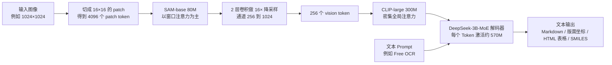
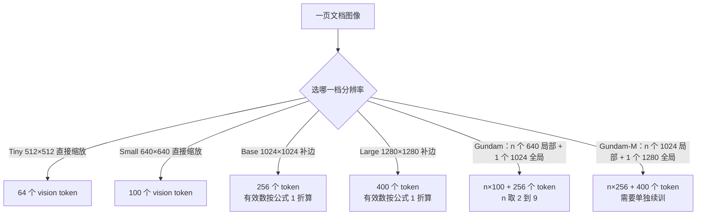
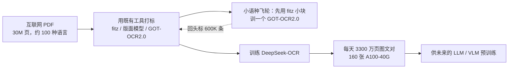

# DeepSeek-OCR：一千个字，最少要几个视觉 Token

<!-- release-date: 2025-10-20 -->

> 本文依据 DeepSeek-AI 发布的 **DeepSeek-OCR: Contexts Optical Compression**，即 arXiv:2510.18234v1、2025-10-21 提交、共 22 页的版本。截至 2026-09-06 核验，arXiv 上仍只有 v1；官方仓库 `deepseek-ai/DeepSeek-OCR` 根目录的 `DeepSeek_OCR_paper.pdf` 逐行比对后与 arXiv 版正文完全一致，只差左侧那条 arXiv 编号水印，本地原件无需更换。下文括号中的 `PDF p. N` 指这份 22 页原文的文件页码。文中会把“报告明确写了什么”“我们如何理解它”和“外部资料补充”分开标注。

## 阅读前的最小词汇表

这篇报告横跨语言模型和视觉模型两侧，先把六个词说成人话：

- **Token（词元）**：模型处理序列时的最小单位。文本被切成 text token；图像被切成 vision token。两种 token 进同一个解码器，占同样的序列位置，花同样的注意力代价。
- **OCR（Optical Character Recognition，光学字符识别）**：把图片里的文字读成可编辑文本。这篇报告里它不是最终目的，而是一把尺子。
- **VLM（Vision-Language Model，视觉语言模型）**：能同时吃图和吃文字的模型，通常是“视觉编码器 + 语言解码器”两段结构。
- **视觉编码器（vision encoder）**：把像素变成 vision token 的前半段网络。
- **窗口注意力与全局注意力**：窗口注意力只让每个位置和邻近的一小片互相看，代价随序列长度近似线性；全局注意力让所有位置两两互看，代价随长度平方增长。
- **激活内存（activation memory）**：前向计算过程中必须暂存、供反向传播使用的中间张量。它和参数量是两笔独立的账，很多“显存爆了”其实爆在这里。

再记住一个贯穿全文的比值。报告把它叫压缩率（compression ratio）：

$$
\text{compression} = \frac{N_{\text{text}}}{N_{\text{vision}}}
$$

分子是这页文档的标准答案用模型自己的分词器切出来有多少 text token，分母是模型实际用掉了多少 vision token。10× 就是“用 1 个视觉 Token 顶了 10 个文本 Token”。

## 先说矛盾：文本 Token 贵在哪里，图像凭什么更便宜

大模型读长文本贵，贵在注意力。序列长度是 $L$ 时，完整注意力要做的两两比较大约是：

$$
\text{cost} \propto L^{2}
$$

报告开篇就把问题定在这里：LLM 处理长文本时面临随序列长度平方增长的计算负担（PDF p. 3）。

平方增长意味着上下文翻十倍，这部分开销可能翻一百倍。所以过去几年主流的攻法都在改注意力本身——稀疏、线性、分块、压缩 KV Cache。这些方法有一个共同前提：**输入必须是文本 Token 序列，我们只能在序列内部做手脚。**

DeepSeek-OCR 换了一个提问方式。它问的是：为什么一定要用文本 Token 来装文本？

一张写满字的图片，人眼一扫就知道有一千个字。但这张图片在模型眼里可能只有一百个 vision token。同样的信息，换一种模态承载，序列长度就可能少一个数量级。报告的表述是：一张包含文档文本的图像，可以用远少于等价数字文本的 token 数来表示丰富信息（PDF p. 3）。

于是问题变得非常具体，而且可以量化。报告在相关工作一节里把它写成了一个正式的研究问题，还特意用斜体标了出来：**对一份包含 1000 个词的文档，最少需要多少个 vision token 才能解码出来**（PDF p. 4）。

这个提问本身就是这篇报告最大的贡献。报告自己也说，这是当前模型**尚未回答**的一个关键研究问题（PDF p. 4）——此前大家讨论 vision token 数量时问的是“够不够用”，没有人把它当成一条可以画出来、可以找拐点的曲线。

## 一句话结论

DeepSeek-OCR 是一个 OCR 模型，但它想证明的不是 OCR。

它想证明：**把文本渲染成图像、再用视觉 Token 表示，是一条可行的上下文压缩路线，而且这条路线的代价—收益曲线可以被测出来。**

报告给出的测量结果是（PDF p. 1、p. 3）：

- 压缩率在 10 倍以内时，OCR 解码精度约 97%；
- 9–10 倍时 96% 以上，10–12 倍时约 90%；
- 压缩到 20 倍，精度仍有约 60%。

为了做这个测量，报告造了三样东西：

1. **DeepEncoder**：一个能在高分辨率下保持低激活、同时只吐出很少 vision token 的编码器；
2. **多分辨率模式**：让同一份权重能吐出 64 个到一千出头个 vision token 不等，从而把压缩率变成一个可扫的自变量；
3. **DeepSeek-3B-MoE 解码器**：一个只激活 570M 参数的小解码器，用来证明“连这么小的模型都学得会解压”。

顺带地，这个模型在真实文档解析任务上也很能打，还能一天产 3300 万页训练数据（PDF p. 3）。但这些是副产品。

如果只记一句，可以记：

> **把长文本渲染成图片，本质上是把“一维序列压缩”问题换成了“二维有损编码”问题；而有损编码的分辨率旋钮，天然可以做成分层的。**

## 这篇怎么读

这份报告只有 22 页，但重心分布很不均匀，按顺序读容易把力气花错地方。给一条路线：

- **只想知道结论**：读“核心实验”一节的表和它后面的两小节。压缩率曲线是全篇唯一的核心证据，其余都在为它服务或从它出发。
- **关心架构**：读“三类视觉编码器”和“DeepEncoder”两节。全篇的架构创新只有一处，就是把 16× 压缩器夹在窗口注意力和全局注意力之间。
- **关心工程落地**：读“多分辨率”“不同版面需要的 Token 数”和“提示词就是接口”三节。这三节合起来能回答“我该给哪种输入配多少 Token”。
- **关心长上下文方向**：读“最大胆的一段”和“报告没有回答的问题”。这两节讲的是这条路线还差什么。

需要提前建立的一个心理预期：**这是一份提出问题并做初步测量的报告，不是一份给出完整方案的报告。** 它的实验部分很薄（核心表只有 100 页文档），设想部分很厚。把两者的证据等级分清楚，是读它的关键。

## 为什么用 OCR 来回答这个问题

从“视觉可以压缩文本”这个直觉，到“压缩率是多少”这个数字，中间隔着一个方法论问题：**怎么衡量压缩后信息还剩多少？**

一般的多模态任务衡量不了。让模型看一张图回答问题，答对了只说明它抓到了跟这个问题相关的部分，说明不了整张图的信息保留率。

OCR 不一样。报告的说法是：OCR 任务在视觉与语言之间建立了天然的压缩—解压映射，同时提供可量化的评估指标（PDF p. 3）。

把它拆开看，OCR 恰好同时满足三个条件：

1. **有标准答案**：文档的原始文字是已知的，可以逐字对；
2. **是全量还原**，不是抽样问答：模型必须把整页都吐出来，漏掉哪一段都会被算分扣掉；
3. **压缩和解压是同一个物理过程的两端**：渲染 = 编码，识别 = 解码。

所以 OCR 在这篇报告里的角色，是一台**信息保留率测量仪**。这是我们的解读，但报告自己也没有把 OCR 当终点——结论一节明确写着：单靠 OCR 不足以完整验证真正的上下文光学压缩（PDF p. 19）。

这一点很重要，后面讲局限时还会回来。

## 全景：一张图看完整条链路

这张图按报告 Figure 3（PDF p. 5）重画，是结构示意，不含任何实测时间。

整条链路只有两个大块：DeepEncoder 和解码器。DeepEncoder 约 380M 参数，由 80M 的 SAM-base 和 300M 的 CLIP-large **串联**而成；解码器是 3B 的 MoE，推理时激活约 570M（PDF p. 5）。

注意这里的关键词是串联，不是并联。为什么这么排，是接下来几节的主线。

## 三类视觉编码器，各自堵在哪一步

报告在 Figure 2（PDF p. 4）里画了当时开源 VLM 常用的三类编码器，并给每一类标了叉号。这一节是全文因果链的起点：**不先看清旧路堵在哪，就看不出 DeepEncoder 为什么长成那样。**

| 路线 | 代表 | 做法 | 报告指出的问题 |
|---|---|---|---|
| 双塔并联 | Vary | 额外并一个 SAM 编码器，扩充视觉词表 | 需要两套图像预处理；编码器难做流水线并行；部署复杂 |
| 切片并行 | InternVL2.0 | 把大图切成小块并行编码 | 原生分辨率偏低（低于 512×512），大图被切得太碎，vision token 数量暴涨 |
| 自适应分辨率 | Qwen2-VL（NaViT 范式） | 不切片，直接按 patch 处理整图 | 大图激活内存巨大，可能撑爆显存；训练时 packing 需要极长序列；vision token 一多，prefill 和生成都变慢 |

这三条路各自的病灶其实是同一个矛盾的三种表现形式：

> 想看清楚，就得高分辨率；高分辨率就意味着 patch 多；patch 一多，要么 vision token 爆炸，要么激活内存爆炸。

切片是想用“分而治之”绕开它，代价是切碎和 token 变多；NaViT 是想用“不切”保住完整性，代价是激活失控；双塔是想用“再加一个塔”补分辨率，代价是工程复杂度。

报告因此把自己需要的编码器条件列成五条（PDF p. 5）：能处理高分辨率、高分辨率下激活低、vision token 少、支持多种分辨率输入、参数量适中。它的结论是当时的开源编码器没有一个能全部满足，所以自己造一个。

这五条里，**第三条和第四条是被研究目标逼出来的，不是通用需求**。一般 VLM 只要 token 数别太离谱就行；但要画一条压缩率曲线，token 数就必须又少又可调。这解释了为什么 DeepEncoder 长得跟同期编码器都不一样——它不是在做一个更好的通用编码器，是在做一个**能当实验仪器用的编码器**。

需要标一个边界：**报告没有把这三类编码器和 DeepEncoder 放在同一套条件下跑对照实验。** Figure 2 里的叉号是设计层面的论述，不是实测。Table 3 里确实出现了 Qwen2.5-VL、InternVL3 等模型的成绩，但那是在完整模型层面比 OCR 效果，其中混杂了解码器规模、训练数据、后训练等一大堆变量，不能拆出编码器的单独贡献。所以“DeepEncoder 比它们好”这句话，**在这份报告里没有被严格证明**，被证明的只是“这个组合能同时满足那五条”。

## DeepEncoder：把“看得清”和“想得全”拆成前后两段

### 串联的顺序为什么不能反

DeepEncoder 的结构极简单，就三段（PDF p. 5）：

1. **SAM-base**，patch size 16，80M 参数，以窗口注意力为主，负责“视觉感知特征提取”；
2. **一个 2 层卷积压缩器**，kernel size 3、stride 2、padding 1，通道数从 256 升到 1024，两层合起来做 16× 降采样；
3. **CLIP-large**，300M 参数，密集全局注意力，负责“视觉知识特征提取”。CLIP 的第一层 patch embedding 被删掉了，因为它的输入不再是图像，而是上一段吐出来的 token。

跟着 token 数走一遍，就能看懂这个顺序的全部用意（PDF p. 5–6）：

$$
1024\times1024 \ \xrightarrow{\ \text{patch }16\ }\ \frac{1024}{16}\times\frac{1024}{16}=4096 \ \xrightarrow{\ \text{conv }16\times\ }\ \frac{4096}{16}=256
$$

**4096 个 token 交给便宜的窗口注意力，256 个 token 才交给昂贵的全局注意力。**

报告自己的表述是：编码器前半段由窗口注意力主导且只有 80M，激活是可接受的；进入全局注意力之前 token 已经压到 256，整体激活内存因此可控（PDF p. 5–6）。

报告没有给出具体的激活显存数字，我们可以自己算一个量级感受（**这是我们的推算，不是报告数据**）：全局注意力的注意力矩阵大小随 token 数平方增长，$4096^2 \approx 1.68\times10^{7}$，而 $256^2 = 65536$，两者相差约 256 倍。把这个平方项从压缩前挪到压缩后，是这个设计最直接的收益来源。

顺序反过来会怎样？如果先跑全局注意力再压缩，那 4096 个 token 的平方项一分钱都省不掉，压缩就只剩“少给解码器几个 token”的作用，激活问题原封不动。所以**压缩器必须夹在两者中间，而且必须在贵的那一段之前**。

### 那半个被冻住的编码器

有一个容易被略过、但很能说明设计意图的细节在训练一节（PDF p. 10）：模型按流水线并行切成 4 段，其中——

- **SAM 和压缩器**被当作“视觉分词器”（vision tokenizer），放在 PP0，**参数冻结**；
- **CLIP 部分**被当作“输入嵌入层”（input embedding layer），放在 PP1，参数解冻参与训练；
- 语言模型 12 层，PP2 和 PP3 各放 6 层。

这个命名不是随口起的，它就是报告 Figure 3（PDF p. 5）里的标注：SAM 加 Conv 那一块框着写 Tokenizer，CLIP 那一块框着写 Embedding layer。

换句话说，DeepSeek 在概念上把整个前半段视觉编码器**当成了语言模型的分词器**：分词器负责把原始信号切成离散单位，而且分词器一般是固定的、不参与训练的。CLIP 那一段则被当成嵌入层，是可以学的。

这是一个很值得借走的心智模型。它把“视觉编码器”这个含混的大盒子，拆成了“不可学的切分规则”和“可学的表示映射”两半，然后分别决定冻不冻。

### 收益、代价与边界

**收益**很清楚：一个约 380M 的编码器，能吃 1024×1024 甚至更大的输入，只吐 256 个 token，而且激活可控。

**代价与边界**同样要说清楚：

- 报告**没有给出 DeepEncoder 的结构消融**。串联相对并联好多少、16× 相对 8× 或 32× 好多少、SAM+CLIP 相对其他骨干组合好多少，报告都没有对照实验。我们只知道这个组合能工作，不知道它是不是最优。
- 冻结 SAM 意味着感知能力的上限由 SAM 的预训练决定。报告说这样做是为了“受益于既有工作的预训练收益”（PDF p. 5），这是收益，也是天花板。
- 卷积压缩是**固定倍率的均匀降采样**。它不看内容，不像检索式压缩那样能保住重点。密集小字被压掉的概率，和大标题是一样的。这一点报告没有讨论，是我们从结构推出的判断。

**可迁移启发**：如果你的流水线里有一段代价随输入规模平方增长，第一反应不该是优化那一段的常数，而应该问——**能不能在它前面放一个降采样，把平方项作用在更短的序列上**。这条原则和 DeepSeek-V4 里 CSA 先压缩再稀疏检索是同一个思路的两种实现。

## 多分辨率：把压缩率做成模型的一个档位

### 为什么必须支持多分辨率

回到最初的问题：一千个字要几个 vision token。要回答它，就必须能连续地调 vision token 数量。报告说得很直白：假设有一张含 1000 个光学字符的图，我们想测需要多少 vision token 才能解码，这就要求模型支持可变数量的 vision token（PDF p. 6）。

如果每个 token 预算都训一个模型，一条曲线要训五六个模型，成本和可比性都是灾难。所以 DeepEncoder 通过**位置编码的动态插值**支持多分辨率，并且让多种分辨率模式**同时参与训练**，最终一份权重支持全部档位（PDF p. 6）。

这张图按报告 Table 1 和 Figure 4（PDF p. 6）重画。节点上的分辨率、token 公式和处理方式逐项对过原表。

原表如下（PDF p. 6）：

| 模式 | Tiny | Small | Base | Large | Gundam | Gundam-M |
|---|---:|---:|---:|---:|---|---|
| 分辨率 | 512 | 640 | 1024 | 1280 | 640+1024 | 1024+1280 |
| Token 数 | 64 | 100 | 256 | 400 | n×100+256 | n×256+400 |
| 预处理 | 缩放 | 缩放 | 补边 | 补边 | 缩放 + 补边 | 缩放 + 补边 |

### 直接缩放与补边，两种取舍

Tiny 和 Small 分辨率本来就小，报告选择**直接把原图缩放到目标尺寸，不保长宽比**。理由是避免浪费 vision token（PDF p. 6）——补边补出来的空白区域也要占 token，在只有 64 个 token 的预算下，浪费不起。

Base 和 Large 反过来，**补边保住原始长宽比**。代价是补出来的部分不携带信息，所以报告给了一个折算公式来计算有效 token 数（PDF p. 6，式 1）：

$$
N_{valid} = \left\lceil N_{actual} \times \left(1 - \frac{\max(w,h) - \min(w,h)}{\max(w,h)}\right) \right\rceil
$$

其中 $w$ 和 $h$ 是原图的宽和高，$N_{actual}$ 是这一档名义上的 token 数，$\lceil\cdot\rceil$ 是向上取整。

公式看着绕，意思很朴素：**图越接近正方形，补边越少，有效 token 越接近名义值。** 举个例子，一张 800×1000 的竖版文档进 Base 档，$\max=1000$，$\min=800$，括号里是 $1-200/1000=0.8$，于是 $256\times0.8=204.8$，向上取整得 205 个有效 token。报告 Table 3 里 Base 档标的是 256(182)、Large 档标的是 400(285)，就是 OmniDocBench 上按这个公式算出来的平均有效 token 数（PDF p. 11）。

这个小公式其实很有分量。它意味着报告在报“我用了多少 token”时，**报的是折过水分的数**，而不是名义预算。这种自我压低成绩的做法在技术报告里不太常见。

### Gundam：给超大版面加一层瓦片

原生分辨率再高也有上限，报纸那种版面塞不进 1280×1280。所以有了动态分辨率档，报告叫 Gundam 模式（PDF p. 7）：

- $n$ 个 640×640 的**局部视图**（瓦片），每个出 100 个 token；
- 外加 1 个 1024×1024 的**全局视图**，出 256 个 token；
- 总计 $n\times100+256$，其中 $n$ 被控制在 2 到 9 之间；
- 若原图宽高都小于 640，$n$ 取 0，Gundam 退化成 Base。

报告解释说，切瓦片本质上是**第二层窗口注意力**，能进一步降低激活内存；而因为原生分辨率本来就不低，切出来的瓦片数量不会太多，图像不会被切得太碎（PDF p. 7）。这一句正好回击了前面对 InternVL2.0 切片方案的批评——**同样是切片，原生分辨率高的切片碎得少。**

Gundam-master 是更大的一档（1024 局部 + 1280 全局）。它**没有和其他档一起训**，而是在训好的 DeepSeek-OCR 上用 6M 采样数据续训得到的（PDF p. 7、p. 9）。理由是负载均衡：这一档分辨率太大，混在一起训会拖慢整体训练速度。

这是一个很真实的工程妥协，报告也没有粉饰。代价是 Gundam-master 和其他档并不是严格意义上的“同一次训练的同一份权重”。

### 这个设计真正的价值

把多分辨率单纯理解成“支持更多输入尺寸”就低估它了。它真正的作用是：**把实验的自变量搬进了模型内部。**

同一份权重，换一个模式标签，就得到一个新的 token 预算点。于是压缩率从“需要重新训练才能改的超参数”变成了“推理时改一个参数”。整条压缩率—精度曲线因此可以在一个模型上扫出来，各点之间没有训练随机性干扰。

**可迁移启发**：当你要研究某个变量对效果的影响，先问一句——**能不能把这个变量做成模型的一个输入条件，而不是训 N 个模型去对比。** 这既省算力，又消除了跨模型对比的混淆因素。DeepSeek-V4 把 reasoning effort 训成三档条件行为，走的也是同一条路。

## 解码器：为什么只让 570M 参数在工作

解码器用的是 DeepSeek-3B-MoE，推理时从 64 个路由专家里激活 6 个，外加 2 个共享专家，总激活参数约 570M（PDF p. 7）。

报告给的理由是：3B 的 MoE 非常适合领域集中（对它们来说是 OCR）的 VLM 研究，因为它同时拥有 3B 模型的表达力和 500M 小模型的推理效率（PDF p. 7）。

解码器在数学上做的事被写成了一行（PDF p. 7，式 2）：

$$
f_{dec}:\ \mathbb{R}^{n\times d_{latent}} \rightarrow \mathbb{R}^{N\times d_{text}},\qquad \hat{X}=f_{dec}(Z),\quad n\le N
$$

- $Z$ 是 DeepEncoder 吐出来的 $n$ 个压缩隐向量，也就是 vision token；
- $\hat{X}$ 是重建出来的 $N$ 个文本表示；
- **$n\le N$ 这个约束是全篇的中心**：输入的视觉 Token 比输出的文本 Token 少，解码器干的活是解压。

报告接着说，$f_{dec}$ 是一个**非线性映射，可以被紧凑语言模型通过 OCR 式训练有效学到**（PDF p. 7）。

这句话的分量在下一句：报告认为“有理由推测，LLM 通过针对性的预训练优化，会更自然地整合这类能力”（PDF p. 7）。

请注意措辞——**这是推测（conjecture），不是实验结论**。报告没有在更大的语言模型上验证过。它的论证逻辑是一个下界论证：**连 570M 激活参数的小模型都能学会解压，更大的模型没有理由学不会。** 这个逻辑成立，但它只保证了可学性，没有保证更大模型能把压缩率推得更高。这是阅读时必须守住的边界。

**可迁移启发**：想证明某种能力“可以被学到”时，用一个**故意做小的模型**去证，比用最大的模型更有说服力。大模型学会了，你不知道是能力还是记忆；小模型学会了，说明这个映射本身结构简单。

## 数据引擎：一个 OCR 模型要吃掉什么

报告花了整整三页讲数据（PDF p. 7–9）。对一篇讲压缩率的报告来说，这个比例说明了一件事：**这条曲线能画出来，一大半功劳在数据。**

最终配比是 OCR 数据 70%、通用视觉数据 20%、纯文本数据 10%，训练序列长度 8192（PDF p. 9）。

### OCR 1.0：三千万页 PDF 与一个模型飞轮

“OCR 1.0”指传统 OCR 任务，也就是文档和自然场景里的文字识别（PDF p. 7）。

文档部分（PDF p. 7–8）：

- 从互联网收集 **30M 页 PDF**，覆盖约 100 种语言，其中中英文约 25M 页，其他语言约 5M 页；
- 每页做两种标注：**粗标注**直接用 `fitz` 从 PDF 里抽文字，目标是教会模型认光学文本，尤其是小语种；**细标注**中英文各 2M 页，用 PP-DocLayout 这样的版面模型和 MinerU、GOT-OCR2.0 这样的 OCR 模型，构造“检测 + 识别”交错的数据；
- 粗标和细标在训练时**用不同的 prompt 区分**，所以同一个模型能按提示词切换输出格式；
- 另有 **3M Word 数据**，直接抽内容做无版面的高质量图文对，主要提升公式和 HTML 表格；
- 自然场景 OCR 用 LAION 和 Wukong 的图，PaddleOCR 打标，中英文各 10M 条。

细标注的格式值得单独看一眼（PDF p. 8，Figure 5）：每一段文字前面带上它在原图中的坐标和类别标签，**所有坐标被归一化到 1000 个格子里**。这样版面信息和文本内容被编码进同一个序列，模型学的是“在哪里有什么”，而不只是“有什么”。这也是后面 deep parsing 能力的基础。

小语种那一段是全篇最像工程故事的地方（PDF p. 8）。小语种缺高质量标注，报告的做法是：

1. 发现**版面模型跨语言有泛化能力**，检测那一半可以直接复用；
2. 识别那一半，先用 `fitz` 造小块图文对，训一个 GOT-OCR2.0；
3. 用训好的模型去标版面切出来的小块；
4. 用这个**模型飞轮**造出 600K 条数据。

这是典型的“用便宜模型的确定性能力，换昂贵标注”的路子。关键在于第一步的观察——**把任务拆成检测和识别两半之后，发现只有一半真的缺数据。**

### OCR 2.0：把图表、分子式和几何图也变成文本

“OCR 2.0”沿用 GOT-OCR2.0 的说法，指的是把人造图形结构化解析（PDF p. 8–9）：

- **图表**：用 pyecharts 和 matplotlib 渲了 10M 张，涵盖折线、柱状、饼图和复合图。任务定义为**图像转 HTML 表格**，而不是转字典格式，理由是省 token（PDF p. 9，Figure 6）；
- **化学式**：从 PubChem 取 SMILES 字符串，用 RDKit 渲成图，构造 5M 图文对；
- **平面几何**：按 Slow Perception 的方式生成，perception-ruler 尺寸取 4，并引入**几何平移不变数据增强**——同一个几何图在原图中平移，标准答案仍是画在坐标系中心位置的那一份，总计 1M 条。

平移不变增强这一手很聪明。它强制模型学的是**图形之间的相对结构**，而不是“这条线段在画布的哪个绝对位置”。几何题的答案本来就跟图画在纸的哪个角落无关。

### 通用视觉与纯文本：两条防止偏科的支线

- **通用视觉数据 20%**：按 DeepSeek-VL2 的方式造 caption、检测、grounding 数据。报告特意声明：DeepSeek-OCR **不是通用 VLM**，这部分数据主要是为了保留通用视觉接口，方便后续研究者接着做（PDF p. 9）；
- **纯文本数据 10%**：内部预训练文本，统一处理成 8192 token 长度，用来保住语言能力（PDF p. 9）。

一个必须记住的边界写在 Figure 12 的图注里（PDF p. 18）：**模型没有 SFT 阶段，所以不是 chatbot**，有些能力要靠补全式提示词才能激活。

## 训练：两段流水，一半冻结

训练只有两段（PDF p. 9–10），报告自己形容为“非常简单”。

**第一段，单独训 DeepEncoder**（PDF p. 10）：

- 跟着 Vary 的做法，接一个紧凑语言模型，用 next token prediction 框架训编码器；
- 数据是全部 OCR 1.0 和 2.0 数据，外加从 LAION 采的 100M 通用数据；
- 训 2 个 epoch，batch size 1280，AdamW，余弦退火，学习率 5e-5，序列长度 4096。

这一段的意图是让编码器先学会“把像素变成能被解码的 token”，再把它接进真正的模型。

**第二段，训完整的 DeepSeek-OCR**（PDF p. 10）：

- 平台是 HAI-LLM，流水线并行切成 4 段（分法见前文“那半个被冻住的编码器”）；
- 20 个节点，每节点 8 张 A100-40G，数据并行 40，全局 batch size 640；
- AdamW，step-based scheduler，初始学习率 3e-5；
- 训练速度：纯文本数据 90B token/天，多模态数据 70B token/天。

报告**没有给总训练时长、总训练 token 数和总成本**，所以从这两个吞吐数字推不出训练规模。

有一个数字对比很有意思：编码器单独训时序列长度是 4096，完整模型训练时是 8192（PDF p. 9–10）。前者只需要装下一张图的 patch，后者要装下 vision token 加上完整的文本答案。

## 核心实验：压缩率与精度的那条曲线

这是全篇的心脏，值得慢慢读。

实验设置（PDF p. 10–11）：

- 基准用 **Fox** 的英文文档部分；
- 用 DeepSeek-OCR 自己的分词器（词表约 129k）切标准答案，**筛出 600–1300 个 text token 的文档，正好 100 页**；
- 因为文本量不大，只需测 Tiny（64 token）和 Small（100 token）两档；
- 提示词用不带版面的 `<image>\nFree OCR.`。

结果（PDF p. 10，Table 2）：

| 文本 Token 区间 | 64 token 精度 | 64 token 压缩率 | 100 token 精度 | 100 token 压缩率 | 页数 |
|---|---:|---:|---:|---:|---:|
| 600–700 | 96.5% | 10.5× | 98.5% | 6.7× | 7 |
| 700–800 | 93.8% | 11.8× | 97.3% | 7.5× | 28 |
| 800–900 | 83.8% | 13.2× | 96.8% | 8.5× | 28 |
| 900–1000 | 85.9% | 15.1× | 96.8% | 9.7× | 14 |
| 1000–1100 | 79.3% | 16.5× | 91.5% | 10.6× | 11 |
| 1100–1200 | 76.4% | 17.7× | 89.8% | 11.3× | 8 |
| 1200–1300 | 59.1% | 19.7× | 87.1% | 12.6× | 4 |

### 表怎么读

先看**主线结论**：压缩率在 10 倍以内时，精度大致维持在 96% 到 98.5%；超过 10 倍开始掉；到 19.7 倍时只剩 59.1%（PDF p. 11–12）。

报告由此给了一个前瞻判断：未来或许可以通过“文本转图像”的方式实现接近 10× 的近乎无损上下文压缩（PDF p. 11）。**这是设想，不是已达成的结果**——原文用的是 “it may be possible”。

还有一个容易被忽略的诚实声明：报告说输出格式无法与 Fox 的标准答案完全对齐，所以**实际性能会比测出来的更高一些**（PDF p. 11）。也就是说这些数字偏保守，扣掉了一部分纯格式差异造成的编辑距离。

### 表不该怎么读

这一节全部是我们的解读，报告没有这样展开，但结论完全建立在它自己的表上。

**第一，压缩率不是一个被主动调节的旋钮。** 每一行里 vision token 数是**固定的**（64 或 100），变的是分子——文档里的文字有多少。精度下降的直接原因是文档变密了，不是有人把压缩旋钮拧紧了。

这一点在封面图上其实写得很清楚：Figure 1(a) 的横轴标注是 “Text Tokens in Per Page (Ground-truth)”，也就是**每页的文本 Token 数**；压缩率是画在右侧副轴上的两条虚线，是**派生量**（PDF p. 1）。所以这张图真正的自变量是文档密度，压缩率跟着密度走。

**第二，同样的压缩率会给出不同的精度。** 把两列对齐着看就很明显：

| 对照 | 压缩率 | 精度 |
|---|---:|---:|
| 64 token，600–700 字 | 10.5× | 96.5% |
| 100 token，1000–1100 字 | 10.6× | 91.5% |
| 64 token，700–800 字 | 11.8× | 93.8% |
| 100 token，1100–1200 字 | 11.3× | 89.8% |

两组的压缩率几乎一样，精度却差了 4 到 5 个百分点。这说明**压缩率本身不足以决定还原精度**，文档的绝对长度和版面复杂度是独立的变量。所以“10× 近乎无损”这个说法要加限定：它是在 Fox 这 100 页英文文档上、在这种版面复杂度下测出来的。

**第三，最常被引用的那个数字，样本最少。** 59.1% / 19.7× 这一档只有 **4 页**文档（PDF p. 10）。同理 20× 附近整体只有个位数样本。报告把页数列出来了，很诚实，但引用者往往只抄精度不看样本量。

**第四，曲线本身有噪声。** 64 token 那一列，800–900 字是 83.8%，900–1000 字反而升到 85.9%——文档变长了，精度反而涨了。这只能是采样噪声（28 页对 14 页）。所以这条曲线该被当成**趋势**读，不该被当成可外推的函数。

**第五，封面图和正文表有 0.1 个百分点的出入。** Figure 1(a)（PDF p. 1）上标的是 85.8% 和 76.3%，Table 2（PDF p. 10）里是 85.9% 和 76.4%。差异微不足道，但引用时以正文表为准。

### 报告自己给的两个下降原因

超过 10× 之后为什么掉，报告给了两个猜测（PDF p. 11–12）：

1. **长文档的版面本身更复杂**；
2. **在 512×512 或 640×640 分辨率下，长文本会变糊**。

然后给了两个截然不同的处置方案，这一段是全文最有想象力的地方：

- 第一个问题**可以解决**——把文本重新排版渲染到一个统一的版面页上就行；
- 第二个问题**不打算解决**——报告说“我们相信第二个问题会成为遗忘机制的一个特性”（PDF p. 11–12）。

请体会一下这个态度的转折。**同一个现象，从缺陷被重新定义成了功能。** 字太小看不清，在 OCR 语境里是失败；在“模拟人类记忆衰减”的语境里，是特性。

这个重新定义是否成立，取决于你要的是什么。做文档解析，它是缺陷；做长上下文记忆分层，它可能真的是特性。报告选择了后一种叙事，但**没有做实验支持这个叙事**——这一点在讨论遗忘曲线时会再展开。

报告还补了一句成本上的论证：这套方法**不带来额外开销，因为它可以复用 VLM 基础设施**，多模态系统本来就需要一个视觉编码器（PDF p. 12）。这句话的适用范围是有限的：它对**已经是多模态**的系统成立；对纯文本模型来说，为了压上下文而挂一个视觉编码器，是实打实的新增成本。

## 换到真实文档：更少的 Token 能走多远

Fox 那套实验是受控测量，OmniDocBench 才是真实战场（PDF p. 11，Table 3）。这个基准的指标是**编辑距离，越小越好**。

摘几行关键结果：

| 模型 | 平均 vision token | 英文 overall | 中文 overall |
|---|---:|---:|---:|
| GOT-OCR2.0 | 256 | 0.287 | 0.411 |
| Gemini2.5-Pro | 未列 | 0.148 | 0.212 |
| MinerU2.0 | 6790 | 0.133 | 0.238 |
| dots.ocr（200dpi） | 5545 | 0.125 | 0.160 |
| **DeepSeek-OCR Tiny** | 64 | 0.386 | 0.361 |
| **DeepSeek-OCR Small** | 100 | 0.221 | 0.284 |
| **DeepSeek-OCR Base** | 256（有效 182） | 0.137 | 0.240 |
| **DeepSeek-OCR Large** | 400（有效 285） | 0.138 | 0.208 |
| **DeepSeek-OCR Gundam** | 795 | 0.127 | 0.181 |
| **DeepSeek-OCR Gundam-M（200dpi）** | 1853 | 0.123 | 0.157 |

### 三条对照线

报告自己挑出来的三条对照是（PDF p. 12）：

1. **只用 100 个 vision token**（640×640），就超过了用 256 token 的 GOT-OCR2.0——0.221 对 0.287；
2. **用 400 token（有效 285）**，达到该基准上与最强模型持平的水平——Large 档英文 overall 是 0.138，表内最好的 dots.ocr（200dpi）是 0.125、MinerU2.0 是 0.133，所以“持平”是报告的措辞，读者可以自己看差距；
3. **用不到 800 token 的 Gundam**，超过需要近 7000 token 的 MinerU2.0——0.127 对 0.133。

第三条最能说明问题：**token 预算差 8 倍以上，成绩还更好一点。** 这不是精度上的碾压，是效率上的碾压。

从长上下文的角度看，这个效率差有直接意义：解析同一批文档，占用的序列长度可以少 8 倍以上。需要提醒的是，这是**按 Token 数做的换算**，不是报告给出的结论；不同模型每个 Token 的 KV Cache 单价并不相同，真实显存节省还要看各自的层数、头数和精度配置。

### 更多 Token 不总是更好

有两处非单调，报告没有点出来，值得自己看见：

**其一，Base 到 Large 在英文上没有进步。** 英文 overall 从 0.137 变成 0.138，token 从 256 涨到 400，**成绩基本原地踏步甚至微降**。同一组对比在中文上却是明显进步（0.240 → 0.208）。合理的推测是：英文文档在 Base 档的分辨率下已经基本看清了，再加分辨率没有新信息可读；中文字符笔画密度高，还能吃到分辨率红利。**这是我们的解读，报告没有讨论。**

**其二，Table 4 里有一个明显异常值。** Gundam 档在 Financial Report 类别上是 0.289，而它前后的 Base 是 0.027、Large 是 0.022、Gundam-M 是 0.034（PDF p. 12）。相差一个数量级，且只在这一格出现。报告没有解释这个异常。我们无法判断它是模式切换导致的真实退化、还是表格录入错误，只能标出来。

**可迁移启发**：给系统加资源时，别默认收益是单调的。先在真实数据上确认**收益拐点在哪里**，然后把预算停在拐点，而不是停在能力上限。

## 不同版面需要的 Token 数差了一个数量级

Table 4（PDF p. 12）按文档类型拆开了成绩。这张表其实比总分表更有实用价值：

| 模式 | Book | Slides | 财报 | 教科书 | 试卷 | 杂志 | 学术论文 | 笔记 | 报纸 | 总体 |
|---|---:|---:|---:|---:|---:|---:|---:|---:|---:|---:|
| Tiny（64） | 0.147 | 0.116 | 0.207 | 0.173 | 0.294 | 0.201 | 0.395 | 0.297 | 0.940 | 0.320 |
| Small（100） | 0.085 | 0.111 | 0.079 | 0.147 | 0.171 | 0.107 | 0.131 | 0.187 | 0.744 | 0.205 |
| Base（256） | 0.037 | 0.080 | 0.027 | 0.100 | 0.130 | 0.073 | 0.052 | 0.176 | 0.645 | 0.156 |
| Large（400） | 0.038 | 0.108 | 0.022 | 0.084 | 0.109 | 0.060 | 0.053 | 0.155 | 0.353 | 0.117 |
| Gundam（795） | 0.035 | 0.085 | 0.289 | 0.095 | 0.094 | 0.059 | 0.039 | 0.153 | 0.122 | 0.083 |
| Gundam-M（1853） | 0.052 | 0.090 | 0.034 | 0.091 | 0.079 | 0.079 | 0.048 | 0.100 | 0.099 | 0.077 |

报告给的读法是（PDF p. 12）：

- **幻灯片只要 64 个 token**就够——0.116，跟更高档差不多；
- **书籍和报告用 100 个 token** 就能得到不错的结果；
- **报纸必须上 Gundam 甚至 Gundam-master**，因为报纸一页有 4000 到 5000 个 text token，远超其他类型 10× 压缩的能力范围。

看那一列报纸的数字就能感受到落差：Tiny 档 0.940，几乎等于全错；到 Gundam-M 才降到 0.099。**同一个模型，同一个任务，token 预算从 64 到 1853，成绩差了近十倍。**

报告把原因和 4.1 节的曲线接了起来：这些类别之所以少 token 就够，是因为它们大多数页面的文字量在 1000 以内，压缩率没超过 10×（PDF p. 12）。

这条因果链闭合得很漂亮：**压缩率决定精度 → 文字密度决定压缩率 → 文档类型决定文字密度。** 所以“该给多少 token”这个问题，在实践中可以简化成“这是什么类型的文档”。

**可迁移启发**：如果你要部署一个按量计费的多模态服务，这张表提示了一个很省钱的做法——**按输入类型做档位路由，而不是所有输入一律给最高档**。幻灯片给 64，报纸给 1853，平均成本可能降一个数量级。

## deep parsing：OCR 之外多出来的一层

报告把一项能力单独命名为 **deep parsing**（深度解析）：模型不只把文档转成 Markdown，还能对文档**里面的图**做二次解析（PDF p. 12）。

它靠的是同一个统一提示词，在报告里是 `<image>\nParse the figure.`（PDF p. 13–16）。四个演示分别是：

- **金融研报里的图表** → 结构化的数据表（Figure 7，PDF p. 13）；
- **书籍里的自然图片** → 密集描述（Figure 8，PDF p. 14）；
- **化学文档里的分子式** → SMILES 字符串（Figure 9，PDF p. 15）；
- **几何图形** → 线段与端点的结构化表示（Figure 10，PDF p. 16）。

报告对几何那一项的自评相当克制：由于几何图形中线段之间存在复杂的相互依赖，几何解析任务极具挑战，还有很长的路要走（PDF p. 16，Figure 10 图注）。

多语言方面，模型覆盖近 100 种语言，同样支持带版面和不带版面两种输出，靠不同 prompt 切换（PDF p. 16–17）。通用视觉方面保留了图像描述、目标检测、grounding 等能力（PDF p. 17–18）。

从压缩这条主线看，deep parsing 值得注意的地方在于：**它说明视觉 Token 里保留的不只是字形，还有结构。** 一张图表被压成 vision token 之后，模型还能从中恢复出数值和表结构，说明压缩保住的是语义层面的东西，而不仅仅是像素级的字形轮廓。

这些都是定性演示（qualitative study），**报告没有给 deep parsing 的定量指标**。所以能力的存在有证据，能力的可靠性没有。

## 提示词就是接口：一个模型，五种输出

报告没有单开一节讲提示词，但它散落在各处的图注里，拼起来是一条清晰的设计线。把出现过的提示词列出来（PDF p. 11、13–18）：

| 提示词 | 输出形态 | 出处 |
|---|---|---|
| `<image>\nFree OCR.` | 纯文本，不带版面坐标 | PDF p. 11、17 |
| `<image>\n<\|grounding\|>Convert the document to markdown.` | Markdown 加版面坐标 | PDF p. 13–17 |
| `<image>\nParse the figure.` | 图内元素的结构化解析 | PDF p. 13–16 |
| `<image>\nLocate <\|ref\|>the teacher<\|/ref\|> in the image.` | 指定对象的定位框 | PDF p. 18 |
| `<image>\nDescribe this image in detail.` | 密集图像描述 | PDF p. 18 |
| `<image>\nIdentify all objects in the image and output them in bounding boxes.` | 全图目标检测 | PDF p. 18 |
| `<image>\n这是一张` | 补全式续写 | PDF p. 18 |

这里面有三件事值得单独说。

**第一，提示词在训练阶段就被写进了数据。** 报告在数据一节里明确写着：粗标注和细标注在训练 DeepSeek-OCR 时**用不同的提示词区分**（PDF p. 8）；自然场景 OCR 同样通过提示词控制要不要输出检测框（PDF p. 8）；小语种文档也是靠不同提示词切换带版面和不带版面两种输出（PDF p. 16）。

所以提示词在这里**不是用户界面上的糖，而是一个训练时就固化下来的输出格式开关**。它能生效，是因为训练数据里同一张图配了多套标注，靠提示词区分。这跟“换个说法哄模型换个格式”是两回事。

**第二，`<|grounding|>` 是一个特殊 Token，不是普通英文单词。** 它和 `<|ref|>`、`<|/ref|>` 一样带着竖线包裹的形式，是词表里的专用符号。配合数据一节里“所有坐标归一化到 1000 个格子”的约定（PDF p. 8），版面信息就有了一套稳定的、模型能学的编码方式。

**第三，最后那条 `<image>\n这是一张` 暴露了模型的真实形态。** 这是一个**没写完的中文句子**，模型要做的是把它续下去。Figure 12 的图注解释了原因：由于没有 SFT 阶段，模型不是 chatbot，有些能力需要补全式提示词才能激活（PDF p. 18）。

这一条对使用者很重要。DeepSeek-OCR 是一个**预训练态的模型**，它的接口是提示词模板，不是自然对话。想让它做训练数据里没有的事，成功率不会高。

**可迁移启发**：当你希望一个模型支持多种输出格式时，**在数据层面就用不同提示词把它们分开，而不是训完之后靠提示词工程去凑**。前者是模型学过的分支，后者是运气。

## 它同时还是一台数据生产机

有一组数字容易被当成宣传语一带而过，其实值得算一下（PDF p. 1、p. 3）：

- 单张 A100-40G，一天能产出 **20 万页以上**的训练数据；
- 20 个节点、每节点 8 张 A100-40G（合计 160 张卡），一天能产出 **3300 万页**。

两个数字是自洽的（**以下是我们的核算**）：$200{,}000 \times 160 = 3.2\times10^{7}$，与 3300 万同量级。而这 20 个节点，正是报告训练 DeepSeek-OCR 时用的那套集群（PDF p. 10）——也就是说，**训练结束之后，同一批机器可以直接转成数据工厂**。

这条线索接回了数据引擎那一节，形成一个闭环：

这张图按报告 PDF p. 7–8 的数据引擎描述与 p. 1、p. 3 的产能数字重画，是流程示意，不含实测时间。虚线那一环是报告在小语种标注中明确描述过的模型飞轮（PDF p. 8）；**报告并没有说 DeepSeek-OCR 自己的产出会回流去训练下一代 DeepSeek-OCR**，图上也没有画这条线。

报告在结论里把这层价值写得很直接：DeepSeek-OCR 是一个极具实用价值的模型，能大规模生产预训练数据，是 LLM 不可或缺的助手（PDF p. 19）。

**但这组数字有一个必须补上的问号：报告没有说这 3300 万页是在哪一档分辨率下产出的。** Tiny 档 64 个 token 和 Gundam-master 档 1853 个 token，计算量差着一个数量级以上，产能自然也差得远。而按 Table 4，低档位在报纸这类版面上的编辑距离高到 0.94（PDF p. 12）——几乎不可用。所以**这个吞吐数字没有绑定质量水平**，不能直接拿来估算“我也能一天产 3300 万页可用数据”。这是我们的判断，报告没有讨论。

**可迁移启发**：一个模型的价值不止在它的推理成绩，还在它作为**数据生产工具**的单位成本。当某个环节的标注成本成为瓶颈时，训一个专用小模型去做标注，往往比继续买标注划算——前提是先把“多少钱一页”和“这一页够不够好”两个数字**分别**测出来。

## 最大胆的一段：把遗忘写进上下文

Discussion 一节（PDF p. 18–19）是全篇最值得思考、也最需要小心的部分。

报告的提案是：在多轮对话中，对**超过 $k$ 轮之前**的历史做光学处理，获得约 10× 的压缩效率（PDF p. 18）。更进一步，**越老的上下文，渲染出来的图像就缩得越小**，token 消耗随之继续下降（PDF p. 19）。

Figure 13（PDF p. 19）用三行并排的类比表达了这个想法：

这张图按 Figure 13 第三行（Text 那一行）重画，节点顺序与原图的 Text token → Gundam → Large → Base → Small → Tiny 一致。**它表示的是报告 Discussion 中提出的设想，不是已实现的机制，也没有任何实测数据支撑。**

原图并排的三行分别是：

- **记忆**：刚刚发生 → 1 小时 → 1 天 → 1 周 → 1 个月 → 1 年，清晰度从 Crystal Clear 衰减到 Almost Gone；
- **视觉**：10cm → 50cm → 1m → 3m → 10m → 20m，同样的衰减；
- **文本**：文本 Token → Gundam → Large → Base → Small → Tiny，同样的衰减。

报告的说法是：人类记忆随时间衰减与视觉感知随距离退化呈现相似的渐进信息损失模式（PDF p. 19）。

这个类比很漂亮，也确实指向一个真问题。但必须把它的**证据等级**标清楚：

**报告已经证明的：** 在静态单页文档上，10× 压缩下 OCR 精度约 97%，20× 下约 60%。

**报告只是提议的：**

- 把对话历史渲染成图像；
- 按年龄分级降分辨率；
- 由此得到“理论上无限的上下文架构”（PDF p. 19，原文用的是 “suggests a path toward”）。

**报告自己承认还没做的**（PDF p. 19，结论一节）：

- **数字—光学文本交错预训练**（digital-optical text interleaved pretraining）；
- **大海捞针测试**（needle-in-a-haystack testing）。

这两项恰恰是验证这个提案最关键的两件事。前者决定模型能不能在同一个序列里自如地混用文本 Token 和视觉 Token；后者决定压缩之后还能不能**定位**到具体信息——而不只是**复述**整页。

这个区别值得强调。OCR 测的是**逐字还原能力**；长上下文真正需要的是**按查询检索能力**。二者不等价：一个能把整页背出来的模型，未必能回答“第三段提到的那个数字是多少”，尤其当模型必须先在心里还原整页才能找到它的时候。报告把大海捞针列为未来工作，说明作者清楚这个缺口。

报告自己给这段定了性：这是早期工作，需要进一步研究；这类视觉—文本压缩系统的实际影响与局限，需要未来更深入的研究（PDF p. 19）。

**我们的判断**：这一段的价值不在于它给出了方案，而在于它把一个此前没人认真提的问题摆上了台面——**上下文压缩可以是有损的、可以是分级的，而且损失程度可以由一个连续旋钮控制。** 文本侧的压缩方法（摘要、剪枝、KV 量化）大多也是有损的，但很少有哪一种能像调分辨率这样，给出一个如此直观、如此连续的保真度旋钮。

## 报告没有回答的问题

按流程要求，这一节只列缺口，不替报告补写。

**方法层面：**

- **没有 DeepEncoder 的结构消融**。串联对并联、16× 压缩率对其他倍率、SAM+CLIP 对其他骨干组合，都没有对照实验。
- **没有与文本侧压缩方法的对比**。摘要式压缩、Token 剪枝、KV Cache 量化在同等预算下能做到多少，报告没有比。所以“光学压缩更优”这个结论**没有被证明**，只证明了它可行。
- **没有说明渲染参数如何影响压缩率**。字号、行距、dpi、排版方式显然会改变一页能装多少字，而这正是“把上下文渲染成图”这个应用的核心自由度。报告只在解释精度下降时提了一句“可以把文本重排到统一版面页”（PDF p. 11），没有量化。

**评测层面：**

- **压缩率曲线只有英文**。Fox 实验明确只用英文文档（PDF p. 10）。中文和其他语种在同等压缩率下表现如何，没有数据。考虑到中文字符信息密度更高、笔画更密，这是一个不小的空白。
- **20× 那一档只有 4 页样本**（PDF p. 10）。
- **deep parsing 没有定量指标**，只有 Figure 7 到 Figure 10 的定性演示。
- **没有大海捞针测试**，明确列为未来工作（PDF p. 19）。

**系统层面：**

- **没有推理侧的延迟与显存实测数字**。报告反复说“低激活”“可控”，但没有给出具体的显存占用、首 token 延迟或吞吐对比。
- **没有总训练时长、总训练 token 数和总成本**。只有 90B/70B token per day 两个吞吐数字（PDF p. 10）。
- **没有说明 vision token 与 text token 在同一序列中如何交错**，包括位置编码怎么处理。这对未来的交错预训练是必需的，报告没有涉及。

**能力层面：**

- **没有 SFT 阶段，模型不是 chatbot**（PDF p. 18）。
- **报告本身是一份 22 页的 technical report，不是完整复现说明**。数据的具体过滤规则、去重策略、质量模型都没有公开。

最后一条边界是报告自己写的，也是最该被记住的：**单靠 OCR 不足以完整验证真正的上下文光学压缩**（PDF p. 19）。这份报告是提出问题和给出初步测量，不是给出结论。

## 证据分了三层，读的时候别读串

这篇报告最容易被误读的地方，是把不同证据等级的句子当成同一种东西转述。把全文的主要论断按证据强度排一遍：

| 论断 | 证据类型 | 出处 | 该怎么说 |
|---|---|---|---|
| 10× 压缩下 OCR 精度约 97% | 实验，100 页英文文档 | PDF p. 10–11 | 有表、有样本量，可以直接引用，但要带上“英文、单页、Fox 基准”三个限定 |
| 20× 压缩下精度约 60% | 实验，但该档只有 4 页 | PDF p. 10 | 引用时应同时给出样本量 |
| 100 个视觉 Token 胜过 GOT-OCR2.0 的 256 个 | 实验，OmniDocBench 编辑距离 | PDF p. 11–12 | 可直接引用 |
| 不到 800 个 Token 胜过 MinerU2.0 的近 7000 个 | 实验，同上 | PDF p. 11–12 | 可直接引用 |
| 幻灯片 64 个 Token 就够，报纸要上千 | 实验，分类型编辑距离 | PDF p. 12 | 可直接引用，是最实用的一条 |
| DeepEncoder 的串联结构优于三类旧编码器 | **无对照实验**，只有设计论述 | PDF p. 4–5 | 只能说“它同时满足了报告列出的五项要求” |
| 紧凑模型能学会解压，大模型只会更自然 | **推测**，原文用 conjecture | PDF p. 7 | 前半句有实验支持，后半句没有 |
| 未来或可做到接近 10× 的近乎无损压缩 | **设想**，原文用 may be possible | PDF p. 11 | 是展望，不是结果 |
| 分辨率下降可以当作遗忘机制的特性 | **设想**，无实验 | PDF p. 11–12、19 | 是叙事重构，不是发现 |
| 把对话历史渲染成图、按年龄降分辨率 | **提案**，无实验 | PDF p. 18–19 | 是提案；报告自列的两项关键验证都未做 |
| 复用 VLM 基础设施因此没有额外开销 | **论述**，无成本测算 | PDF p. 12 | 对已是多模态的系统成立，对纯文本系统不成立 |
| 一天可产 3300 万页训练数据 | 实测吞吐，但未绑定质量档位 | PDF p. 1、3 | 引用时要注明未说明分辨率模式 |

一个粗糙但好用的判据：**报告里凡是出现 may、could、we believe、it is reasonable to conjecture 的句子，都属于下半张表。** 这份报告在措辞上其实相当克制，转述时把这些情态动词丢掉，才是失真的主要来源。

## 能带走的七条设计原则

### 1. 把模糊的直觉逼成一个可测的比值

“一图胜千言”是老话，但它一直是修辞。这篇报告的第一步动作是把它写成 $N_{\text{text}}/N_{\text{vision}}$，然后去测这个比值在什么范围内还能保住精度。

**一旦一个直觉有了分母，它就能被优化。** 遇到“大概会更好”“应该更省”这类判断时，先花力气把它变成一个可以画在坐标轴上的数。

### 2. 昂贵模块前面放降采样，别优化它的常数

DeepEncoder 把 4096 个 token 交给窗口注意力，只把 256 个交给全局注意力。平方项作用在压缩后的序列上，这是它省下大头的地方。

放到自己的系统里：任何一段代价随规模超线性增长的处理（全排序、全连接、笛卡尔积、全局 join），第一优先级是**先缩小它的输入**，而不是把它写得更快。

### 3. 把实验的自变量做成模型的输入条件

多分辨率模式让一份权重扫出整条压缩率曲线。如果每个 token 预算都要训一个模型，这条曲线要么画不出来，要么各点之间不可比。

想研究 X 对效果的影响，先问 X 能不能变成一个推理时的开关。**省的不只是算力，还有跨模型对比中那些说不清的混淆因素。**

### 4. 想证明可学性，用故意做小的模型去证

解码器只激活 570M 参数。它能从 100 个 vision token 里还原出上千个文本 Token（1000–1100 那一档精度 91.5%），这件事比“一个 70B 模型也能学会”更有说服力，因为它排除了“靠容量硬记”的解释。

**下界比上界更有信息量。** 上界证明的是资源够，下界证明的是问题简单。

### 5. 有损压缩不一定是缺陷，可以设计成分级保真

字太小看不清，在 OCR 里是失败；在记忆分层里可能是特性。同一个物理现象，换一个目标函数，评价就反过来。

这条要谨慎用——**重新定义缺陷为特性，必须配上新目标下的实验**，否则就只是话术。这篇报告在这一点上做得还不够，它给了叙事，没给实验。

### 6. 复用已有基础设施，比新建一条路径容易落地

报告强调这套方法“不带来额外开销，因为可以复用 VLM 基础设施”（PDF p. 12）。多模态系统本来就有视觉编码器，光学压缩只是让它多干一份活。

但注意适用边界：对纯文本系统，这句话不成立。**评估一个方案的边际成本时，先确定基线里已经有什么。**

### 7. 按输入类型做档位路由

Table 4 显示幻灯片 64 个 token 就够，报纸要上千个（Gundam 平均 795、Gundam-master 平均 1853）。一律按最高档配置，成本会白白高一个数量级。

**任何按量计费的推理服务，都值得先看一眼输入的分布，再决定要不要分档。**

## 关键词回看

- **上下文光学压缩（contexts optical compression）**：把文本渲染成图像，用视觉 Token 而不是文本 Token 来承载它，从而缩短序列长度。
- **压缩率（compression ratio）**：标准答案的文本 Token 数除以模型实际使用的视觉 Token 数。这篇报告里它是被观测的量，不是被主动调节的旋钮。
- **DeepEncoder**：约 380M 的视觉编码器，SAM-base 加 16× 卷积压缩器加 CLIP-large 三段串联，让平方复杂度的全局注意力只作用在压缩后的短序列上。
- **16× 卷积压缩器**：2 层卷积，kernel 3、stride 2、padding 1，通道 256 到 1024，把 4096 个 patch token 压成 256 个。
- **视觉分词器与输入嵌入层**：报告在流水线切分时把 SAM 加压缩器当作分词器（冻结），把 CLIP 当作嵌入层（可训练）。
- **原生分辨率与动态分辨率**：前者是 Tiny/Small/Base/Large 四个固定尺寸；后者是 Gundam 系列，由 n 个局部瓦片加一个全局视图组成。
- **有效视觉 Token**：补边模式下，扣掉空白区域之后实际承载信息的 Token 数，按公式 1 折算。
- **OCR 1.0 与 OCR 2.0**：前者指传统的文档与场景文字识别；后者沿用 GOT-OCR2.0 的说法，指图表、化学式、几何图这类人造图形的结构化解析。
- **模型飞轮**：先用简单方式造小块数据训一个小模型，再用这个小模型去标更难的数据，滚动扩充标注规模。
- **deep parsing**：在把文档转成文本之后，再对文档内嵌的图做二次结构化解析。
- **遗忘机制（forgetting mechanism）**：报告在 Discussion 里提出的设想，让越久远的上下文以越低的分辨率保存，模仿人类记忆的衰减曲线。**这是提案，不是已实现的机制。**
- **编辑距离（edit distance）**：OmniDocBench 的指标，衡量输出与标准答案的字符级差异，越小越好。

## 最后的判断

这篇报告的标题写着 OCR，但它真正的问题不在 OCR。

**它在问：文本 Token 是不是承载文本的唯一合理载体？**

它给出的答案有明确的边界。**已经成立的部分**是：在单页英文文档上，10 倍压缩下 OCR 精度约 97%，20 倍下约 60%；一个 380M 的编码器加 570M 激活参数的解码器就能做到；这个模型在真实文档解析上用不到 800 个 token 就超过了需要近 7000 个 token 的专用工具。这些数字有表格、有基准、有样本量。

**还只是提案的部分**是：把对话历史渲染成图、按年龄分级降分辨率、由此得到近乎无限的上下文。这一段没有实验，报告自己列出的两项关键验证——交错预训练和大海捞针——都还没做。

我倾向于把这份报告读成**一次成功的可行性测量，加一个尚未验证的架构设想**。它最有价值的地方不是 DeepEncoder 这个具体结构（结构消融都没做），而是它把一个此前只停留在比喻层面的想法，变成了一条能画出来、能读出拐点、能标出样本量的曲线。

如果只带走一句话：

> **当一种表示形式的代价随规模超线性增长时，值得认真考虑换一种模态来承载同样的信息；换模态之后，损失是可控的，而且损失的程度可以做成一个连续可调的旋钮。**

这个旋钮存在，是这篇报告证明的。旋钮该怎么用，还没有人证明。

## 资料与阅读边界

- **原始依据**：本地 `papers/DeepSeek/DeepSeek-OCR.pdf`，即 arXiv:2510.18234v1，DeepSeek-AI，2025-10-21 提交，22 页。文中所有 `PDF p. N` 均指这一份。
- **版本核验**：[arXiv 摘要页](https://arxiv.org/abs/2510.18234) 的提交历史截至 2026-09-06 只有 v1（`v2`、`v3` 均返回 404，arXiv API 返回的 `updated` 与 `published` 同为 2025-10-21T02:41:44Z）。官方仓库根目录的 [`DeepSeek_OCR_paper.pdf`](https://github.com/deepseek-ai/DeepSeek-OCR/blob/main/DeepSeek_OCR_paper.pdf) 同为 22 页，逐行文本比对后与 arXiv 版正文完全一致，仅缺左侧 arXiv 编号水印。本地原件无需更换。
- **首发日证据**：`release-date` 取 2025-10-20，三条官方证据互相印证——官方仓库 [DeepSeek-OCR](https://github.com/deepseek-ai/DeepSeek-OCR) 的 Release 日志首条为 `[2025/10/20]🚀🚀🚀 We release DeepSeek-OCR`；该仓库的初始 commit 时间为 2025-10-20T02:48:36Z；官方权重仓库 [deepseek-ai/DeepSeek-OCR](https://huggingface.co/deepseek-ai/DeepSeek-OCR) 的首个文件提交为 2025-10-20T04:25:14Z，标题为 `Initial public release`。该仓库的 `createdAt` 是 2025-10-17T06:22:05Z，按本模块契约**不作为首发日**采信。论文 2025-10-21 上传 arXiv，晚于权重与代码公开，因此不采用。
- **外部补充（非报告原文）**：官方仓库 Release 日志显示 DeepSeek-OCR 于 2025-10-23 进入 [vLLM 上游支持](https://docs.vllm.ai/projects/recipes/en/latest/DeepSeek/DeepSeek-OCR.html)，并于 2026-01-27 有后续工作 [DeepSeek-OCR2](https://github.com/deepseek-ai/DeepSeek-OCR-2)。这两条只用于交代这项工作的后续位置，**本文正文的技术论断一律只依据 22 页原报告**，没有引用 OCR2 的任何内容。
- **本文中属于我们解读、而非报告原话的部分**，都已在原地标注。集中列一下：全局注意力 4096 对 256 的约 256 倍平方项差距（按报告给出的 token 数推算）；压缩率横轴实为文档文字密度的读法；同等压缩率下两列精度相差 4 到 5 个百分点的对照；64 token 列 800–900 与 900–1000 之间的非单调是采样噪声；Base 到 Large 在英文上不再进步、可能是分辨率红利已尽；Table 4 中 Gundam 档财报 0.289 是未被解释的异常值；把 SAM 加压缩器理解为“不可学的切分规则”、CLIP 理解为“可学的表示映射”这一心智模型；把 DeepEncoder 看成一台实验仪器而非通用编码器的定位；$200{,}000\times160\approx3.2\times10^{7}$ 这一步核算，以及“3300 万页的吞吐没有绑定质量档位”的判断；Gundam 与 MinerU2.0 之间 8 倍序列长度差的换算；逐字还原能力与按查询检索能力不等价这一判断。
- **报告中被引用的基础工作**，如 Vary、GOT-OCR2.0、Fox、Slow Perception、OneChart，第一作者 Haoran Wei 均在署名之列（PDF p. 20–22 参考文献 [36]、[38]、[21]、[39]、[7]）。这解释了为什么数据引擎与评测基准的选择高度沿用同一条技术线；这是我们从参考文献列表得到的观察，报告本身没有讨论这一点。
