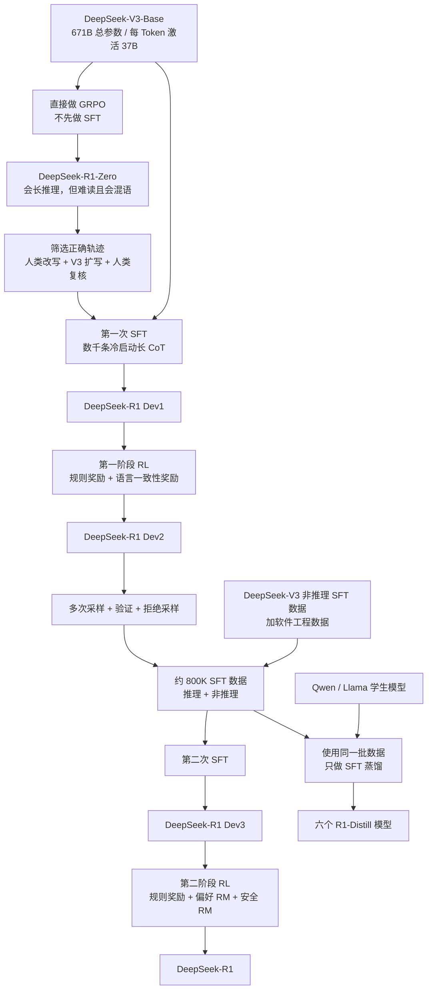
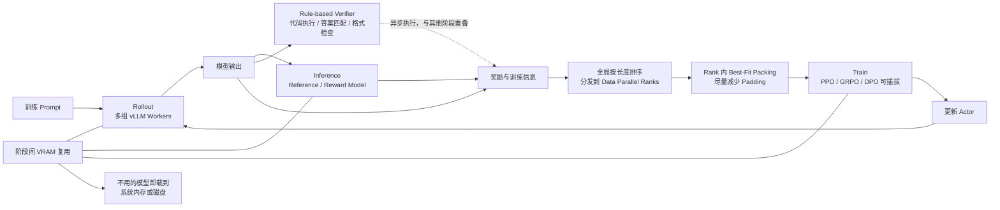
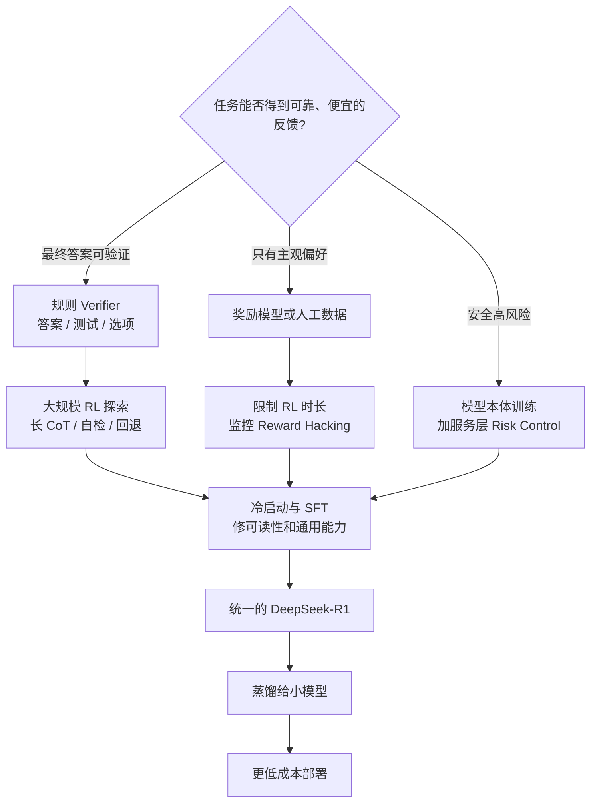

# DeepSeek-R1：结果奖励能教会模型“想办法”，但验证器决定它能走多远

> 本文依据 DeepSeek-AI 团队发布的 **DeepSeek-R1: Incentivizing Reasoning Capability in LLMs via Reinforcement Learning**，即 arXiv:2501.12948v2、2026-01-04 修订的 86 页版本。下文括号中的 `PDF p.x` 直接指这份 86 页原文的文件页码。网上很多解读仍使用 2025 年的 v1 数字；本文只采用本地 v2 原件，并把报告事实、我们的解释和外部资料补充分开。

## 先把最少的背景搭起来

这篇报告会反复出现六个概念。

- **大语言模型（Large Language Model，LLM）**：根据前文预测下一个 Token 的模型。Token 是模型读写文字时使用的小块。
- **监督微调（Supervised Fine-Tuning，SFT）**：给模型“问题—标准答案”示范，让它模仿这些答案。
- **强化学习（Reinforcement Learning，RL）**：不给唯一标准过程，只给行为打分，让模型逐步提高总奖励。
- **思维链（Chain of Thought，CoT）**：回答最终结论前生成的中间推理文字。
- **奖励模型（Reward Model，RM）**：用另一个模型给回答打分。它比规则灵活，但也可能被训练中的模型钻空子。
- **验证器（Verifier）**：判断结果是否正确的机制。它可以是答案匹配器、编译器与测试用例，也可以是一个负责判题的模型。

这六个概念里，最重要的不是 RL，而是 verifier。

因为 RL 只会努力提高奖励。奖励若准确，模型会探索出越来越有效的解法；奖励若有漏洞，模型也会越来越擅长利用漏洞。

## 一句话先说清

DeepSeek-R1 最重要的结论不是“只用 RL 就够了”。

它真正展示的是一条有边界的规律：

> **在足够强的基座模型上，如果任务有可靠、便宜、可规模化的结果验证器，大规模 RL 可以让模型自己探索长推理、自检、回退和替代方案；一旦任务难以可靠验证，完整产品仍必须用 SFT、拒绝采样、奖励模型和安全系统补齐。**

DeepSeek-R1-Zero 是这条规律的实验室版本。它跳过 RL 前的 SFT，直接从 DeepSeek-V3-Base 开始做强化学习。它确实学出了更长的推理和更强的数学、代码能力，但也出现语言混合、可读性差和通用能力不足。

DeepSeek-R1 是产品化版本。它没有坚持“纯 RL”到底，而是使用两次 SFT 和两次 RL：先给少量可读的冷启动数据，再做推理 RL；随后用拒绝采样构造约 80 万条监督数据，再做一次混合奖励 RL。

最后，它把大模型发现的推理轨迹蒸馏给 1.5B 到 70B 的小模型。实验显示，对 32B 学生而言，直接学习强老师的轨迹，比让它独立做一万多步 RL 更有效。

所以全文真正的主角有三个：

1. 允许模型探索的结果奖励；
2. 决定探索上限的 verifier；
3. 把“能力实验”变成“可用模型”的多阶段训练流水线。

## 先看全景：R1 不是一段训练，而是一条来回筛选的链

这是根据报告 Figure 2 重画的**机制示意图**，不是实测训练时间线。Dev1、Dev2、Dev3 是中间 checkpoint；箭头表示数据或模型的先后关系。（PDF p.6、26–27、60–62）

这张图先回答一个最容易误解的问题：**R1-Zero 是纯 RL 实验，R1 不是。**

## 第一层矛盾：人类示范会帮模型，也可能限制模型

传统后训练通常先做 SFT，再做 RL。

SFT 的好处很直接。模型一开始就能看到清楚、规范的答案，不必在巨大输出空间里乱撞。它也能快速学会格式、语气和任务边界。

但作者提出另一个问题：人类写的解题过程不一定是模型最适合学习的过程。

人类示范常常省略检查步骤。熟练解题者可能直接从第二步跳到第五步，也可能只给一个漂亮的最终证明。若模型一直被要求模仿这种固定轨迹，它就较少有机会尝试回退、改路线或生成非人类习惯的中间搜索过程。（PDF p.1–2、13–14）

DeepSeek 因此做了一个很干净的实验：

- 使用同一个 DeepSeek-V3-Base；
- 不在 RL 前喂人工 CoT；
- 只要求输出 `<think>...</think>` 和 `<answer>...</answer>`；
- 主要按最终答案是否正确和格式是否合格给奖励。

这个模型就是 DeepSeek-R1-Zero。

“Zero”不是从随机参数开始。它只是说 **RL 前没有额外 SFT**。

这个边界非常重要。DeepSeek-V3-Base 已经有 671B 总参数，每个 Token 激活 37B 参数，并在 14.8T Token 上完成预训练。报告还明确说，预训练网页里可能自然包含其他模型生成的答案，也包含大量数学、代码和推理轨迹。因此，R1-Zero 不是凭空发明推理；RL 是从一个已经具有强大知识和候选解生成能力的基座中筛选、放大有效行为。（PDF p.13）

## GRPO：不再训练一个同样巨大的“估分员”

DeepSeek-R1-Zero 使用 **组相对策略优化（Group Relative Policy Optimization，GRPO）**。

理解它之前，先看传统 **近端策略优化（Proximal Policy Optimization，PPO）** 为什么贵。

### PPO 为什么需要 value model

强化学习不仅要知道一次回答得了多少分，还要判断这次结果比“本来可以期待的水平”好多少。这个差值叫 **优势（advantage）**。

PPO 通常训练一个 value model，也叫 critic。它负责看到当前生成到一半的状态，然后预测最终大概能得多少分。

问题是，长 CoT 中间经常会出现错误、反思和改写。模型第 500 个 Token 走错，不代表第 5000 个 Token 不能纠正。让 critic 根据半截答案预测最终结果，本来就很难。更现实的成本是：value model 往往和 policy model 差不多大，相当于再训练一套巨型模型。（PDF p.15）

### GRPO 用同题的一组答案互相当基线

GRPO 不训练 value model。它对同一道问题一次采样 $G$ 个答案，得到奖励 $r_1,\ldots,r_G$，再计算每个答案相对同组的表现：

$$
A_i=
\frac{r_i-\operatorname{mean}(r_1,\ldots,r_G)}
{\operatorname{std}(r_1,\ldots,r_G)}
$$

$A_i$ 是第 $i$ 个答案的 advantage。高于同组平均就为正，低于平均就为负。

可以把它想成同一场考试里的相对名次。GRPO 不另外请一个老师预测“这位学生平时应该考几分”，而是直接比较这次同题的 16 份答卷。

随后，它用新旧 policy 对答案的概率比来更新模型，并做 clipping：

$$
J_{\text{GRPO}}(\theta)
=
\mathbb E\left[
\frac{1}{G}\sum_{i=1}^{G}
\left(
\min\left(
\rho_i A_i,
\operatorname{clip}(\rho_i,1-\epsilon,1+\epsilon)A_i
\right)
-\beta D_{\mathrm{KL}}(\pi_\theta\|\pi_{\mathrm{ref}})
\right)
\right]
$$

其中：

- $\rho_i=\pi_\theta(o_i|q)/\pi_{\theta_{old}}(o_i|q)$，表示新 policy 相对旧 policy 有多偏爱答案 $o_i$；
- clipping 不让一次更新走得太远；
- $D_{\mathrm{KL}}$ 是 Kullback-Leibler divergence，简称 KL 散度，用来限制新 policy 不要与 reference policy 偏离太多；
- $\epsilon$ 控制 clipping 范围，$\beta$ 控制 KL 惩罚强度。

报告采用的 KL 估计是：

$$
D_{\mathrm{KL}}(\pi_\theta\|\pi_{\mathrm{ref}})
=
\frac{\pi_{\mathrm{ref}}(o_i|q)}{\pi_\theta(o_i|q)}
-\log\frac{\pi_{\mathrm{ref}}(o_i|q)}{\pi_\theta(o_i|q)}-1
$$

这三条公式见 PDF p.3，附录又在 p.15 重复为式 11–13。正文只需要解释一次。

### GRPO 与 PPO 的正确边界

报告没有证明 GRPO 在所有条件下都比 PPO 准。

它在一个 16B **混合专家模型（Mixture-of-Experts，MoE）**、每 Token 激活 2.4B 参数的 DeepSeek-Coder-V2-Lite 上做对比。PPO 使用常见的**广义优势估计（Generalized Advantage Estimation，GAE）** 系数 $\lambda=0.95$ 时明显较差；把 $\lambda$ 精调到 1.0 后，PPO 已接近 GRPO。（PDF p.16，Figure 4）

因此，更稳妥的结论是：

- GRPO 不需要训练 value model，显著节省显存和计算；
- 组内奖励直接提供 baseline，尤其适合有最终结果奖励的长回答；
- PPO 调好超参数也可能达到接近效果；
- Figure 4 只是一个模型和一个任务上的比较，不支持“GRPO 普遍统治 PPO”。

还有一个差别。PPO 常把每个 Token 的 KL 惩罚作为密集 reward 加入累计回报。作者认为，这可能随输出长度累计，隐式压制长回答。GRPO 则直接把 KL 项放进优化目标。训练数千步后，DeepSeek 还会定期把 reference policy 更新为最新 policy，在探索范围与稳定性之间重新找平衡。（PDF p.15–16）

## 奖励看似简单，真正难的是保证它不会说谎

R1-Zero 的规则奖励只有两类：

$$
R_{\text{rule}}=R_{\text{accuracy}}+R_{\text{format}}
$$

两项同权相加。（PDF p.4，式 4）

### Accuracy reward：只判断最终结果

数学题要求最终答案放在指定格式中，再与标准答案匹配。代码题交给编译器和测试用例。选择题检查最终选项。

它不要求模型的中间步骤长得像人类。只要结果正确，模型就有机会保留自己发现的搜索路线。

这种奖励便宜、明确，也较难争辩。问题在于它只适合有明确答案的任务。

### Format reward：只规定边框，不规定内容

模型必须把推理放进 `<think>...</think>`，把答案放进 `<answer>...</answer>`。除此之外，DeepSeek 刻意不要求它“必须反思”“必须分五步”或“必须采用某种解法”。（PDF p.3–4）

这是一个很好的实验设计：若一开始就把“wait”“check”“try another approach”写进模板，后面观察到这些词就无法说明是 RL 自己强化出来的。

### 为什么不用神经奖励模型

开放式 RM 可以评价更多任务，但也会带来一个新对手：正在训练的 policy。

只要 RM 有稳定偏好，policy 就可能学会迎合这个偏好，而不是真正提高质量。这叫 **奖励劫持（reward hacking）**。

报告给出一个直接例子：使用 helpfulness RM 继续训练时，RM 分数不断上升，Codeforces 的真实测试表现却下降。（PDF p.35–36，Figure 6）

所以 R1-Zero 宁可缩小任务范围，也只用可验证规则。它没有解决“所有任务的 RL”，而是先把问题限制到 verifier 足够可靠的地方。

## R1-Zero 的训练：数字背后有一个不能漏掉的混杂因素

R1-Zero 的主要训练设置如下：（PDF p.3）

- 学习率 `3e-6`；
- KL 系数 `0.001`；
- rollout temperature 为 1；
- 每题采样 16 个输出；
- 每个训练 step 含 32 道唯一问题，batch size 为 512；
- reference policy 每 400 steps 更新一次；
- 每次 rollout 生成 8192 个输出，随机分成 16 个 mini-batch，只训练一个 inner epoch；
- 共训练 10,400 steps，约 1.6 epochs。

最值得注意的是最大输出长度：

- 8.2K step 之前为 32,768 Token；
- 之后改为 65,536 Token。

报告明确说，性能和平均回答长度都在 8.2K step 发生显著跳变。（PDF p.3–4）

因此，Figure 1 不能被简单讲成“训练到某一刻，模型突然自行觉醒”。这个时间点同时发生了训练配置变化。更长的输出上限允许模型继续计算，也直接抬高了响应长度。

附录 Figure 9 还显示，`wait` 的使用在约 8000 step 后出现尖峰，其他反思词频最终是训练初期的 5–7 倍。（PDF p.38–39）这与长度上限变化非常接近。报告没有做隔离实验，无法判断增长中有多少来自 policy 学习，有多少来自更大的生成空间。

这是全文最需要保留的因果边界之一。

## R1-Zero 到底学出了什么

### 能力确实随 RL 上升

在 v2 中，DeepSeek-R1-Zero 在**美国数学邀请赛（American Invitational Mathematics Examination，AIME）2024** 上的平均 pass@1 从 **15.6% 提升到 77.9%**。对 64 个样本做多数投票，cons@64 达到 **86.7%**。（PDF p.4–5）

这里的 **pass@1** 不是只跑一次 greedy decoding。报告会按非零温度生成多次，再取单次正确率的平均。**cons@64** 则是 64 次答案的多数投票结果。

Figure 8 还把 MATH 数学题集按人类标注难度分层。较容易的 level 1–3 很快到 0.90–0.95；level 4 约从 0.78 升到 0.95；level 5 约从 0.55 升到 0.90。（PDF p.37–38）

这支持一个重要判断：训练后期的主要价值不在继续刷简单题，而在提高复杂题的成功率。

### 回答开始主动检查和改路

平均输出越来越长。模型会重新检查旧步骤、尝试替代解法，或在发现矛盾时从中间回退。Table 2 展示了著名的“aha moment”：模型写出 `Wait, wait. Wait.` 后重新审视错误步骤。（PDF p.5）

这些现象说明 RL 提高了某些可观察的自我修正行为，但不要把它升级成意识证据。

报告在冷启动章节主动提醒：生动、第一人称的 reasoning pattern 主要反映 DeepSeek 设计的工程启发式，不代表模型获得了人类式智能或自主意识；这种表达反而可能让用户产生不当信任。（PDF p.20）

CoT 是模型生成的工作文本。它可以帮助求解，也可以表演、遗漏或事后合理化。本文只讨论它的行为与任务作用，不把它当作可验证的“内心”。

### 它仍不是一个好用的通用助手

R1-Zero 的问题也很明显：（PDF p.2、6）

- 中英文混在同一条 CoT 中；
- 输出冗长，格式和可读性不稳定；
- 规则 RL 主要覆盖数学、代码、**科学、技术、工程与数学（Science, Technology, Engineering and Mathematics，STEM）** 和逻辑；
- 写作、开放问答、指令跟随与人类偏好没有同等训练。

这正是完整 R1 为什么回到 SFT 的原因。

## 完整 R1：RL 负责探索，SFT 负责让探索结果可用

DeepSeek-R1 使用四个阶段。每个阶段修复前一个阶段留下的特定问题。

### 第一阶段：少量冷启动 SFT

DeepSeek 先从 R1-Zero 的正确轨迹中选出候选。人类标注者把它们改成更自然的对话风格；修改后的样例再提示一个 LLM 扩写更多数据；所有 LLM 输出再经过第二轮人工复核。（PDF p.20–21）

具体流程还包括：

- 用 temperature 1.0 为数千道推理题生成多条轨迹；
- 只保留最终答案正确且格式可读的样本；
- 数学表达式使用 SymPy 解析与比较；
- 过滤重复和语言混合；
- 让 DeepSeek-V3 把 reasoning 与 summary 改成同题目语言、清楚且适合阅读的形式。（PDF p.21）

这批数据只有“数千条”，报告没有给精确数量。

冷启动不是为了把全部能力教一遍。它更像给 RL 一条可行的起跑线：模型从一开始就知道怎样分隔推理与结论，怎样保持同语种，怎样给读者一个简洁 summary。

代价是人类先验重新进入系统。Table 3 显示，冷启动后的 Dev1 在**指令遵循评测（Instruction-Following Evaluation，IF-Eval）** 上从 R1-Zero 的 46.6 升到 71.7，但 AIME 从 77.9 降到 59.0，**研究生级难检索问答（Graduate-Level Google-Proof Q&A，GPQA）** 从 75.8 降到 66.1。（PDF p.9）

所以冷启动不是“所有能力同时变强”。它先换来了可读性和指令形式，再让后续 RL 把推理能力追回来。

### 第二阶段：面向推理的 RL

Dev1 随后在数学、代码、科学和逻辑任务上做大规模 GRPO。基本设置与 R1-Zero 接近：学习率 `3e-6`、KL 系数 `0.001`、每题 16 个输出、batch size 512、最大长度 32,768、reference 每 400 steps 更新。（PDF p.7）

这里有一个醒目的设置：GRPO clip ratio $\epsilon=10$。

作者说 clip 太小会截断大量 Token 的梯度，伤害性能；太大又可能让训练不稳。报告只给出了采用值和定性解释，没有完整 clip 消融。（PDF p.7–8）

为了减少混语，DeepSeek 加入 **语言一致性奖励（Language Consistency Reward，LC Reward）**：

$$
R_{\text{language}}
=
\frac{\operatorname{Num}(\text{目标语言单词})}
{\operatorname{Num}(\text{全部单词})}
$$

Figure 7 的消融显示，它能阻止语言一致性随训练恶化。数学表现大体相当，代码表现略有下降。（PDF p.35–37）

这是一项很真实的多目标交换：读起来更一致，不等于 benchmark 免费变强。

### 第三阶段：拒绝采样，再做约 800K SFT

**拒绝采样（rejection sampling）** 的意思是：同题生成多份答案，用 verifier 筛掉错误或不合格输出，只留下训练样本。

第一阶段 RL checkpoint 负责生成 reasoning data。规则能判的任务继续用规则；一部分新增任务把 ground truth 与模型回答一起交给 DeepSeek-V3 judge 判定。系统还过滤混语、过长段落和代码块。（PDF p.26）

最终数据大约是：

- 600K reasoning samples；
- 200K non-reasoning samples。

Table 5 给出的精确总数是 **804,745**：（PDF p.27）

| 领域 | 样本数 | 平均轮数 | 平均 Token |
|---|---:|---:|---:|
| Math | 395,285 | 1.0 | 6,094.2 |
| Code | 211,129 | 1.1 | 7,435.7 |
| STEM | 10,124 | 1.0 | 4,928.8 |
| Logic | 10,395 | 1.0 | 2,739.0 |
| General | 177,812 | 1.1 | 1,419.8 |
| **Total** | **804,745** | **1.0** | **5,355.3** |

绝大多数是单轮交互。报告明确承认，这可能限制多轮对话能力。（PDF p.27）

Non-reasoning 部分复用 DeepSeek-V3 的写作、事实问答、翻译、自我认知等 SFT 数据，并加入程序修复和前端开发等软件工程任务。简单问候不强行生成 CoT；复杂任务有时先让 V3 生成潜在 reasoning。（PDF p.26）

这一步把“只会做可验证推理”的模型重新接回通用助手。

冷启动 SFT 与这次第二阶段 SFT 都训练 2–3 epochs，使用 cosine learning-rate schedule，从 $5\times10^{-5}$ 降到 $5\times10^{-6}$；最大上下文 32,768，batch size 128。（PDF p.35）

### 第四阶段：混合奖励 RL

最后一轮 RL 同时放入推理和通用数据：

$$
R
=R_{\text{reasoning}}+R_{\text{general}}+R_{\text{language}}
$$

其中：

$$
R_{\text{reasoning}}=R_{\text{rule}}
$$

$$
R_{\text{general}}=R_{\text{reward model}}+R_{\text{format}}
$$

也就是说，可验证任务继续相信规则；开放式任务才交给偏好 RM。（PDF p.8，式 8–10）

第二阶段 RL 大多沿用前一阶段参数，但 rollout temperature 从 1 降到 0.7，因为更高温度会产生不连贯输出。全阶段共 1700 steps；general instruction data 和 preference reward 只在最后 400 steps 加入。（PDF p.8）

为什么只放 400 steps？因为 helpful RM 用得越久，reward hacking 越明显。DeepSeek 没有假装这个问题已经解决，而是限制暴露时间。

这也是完整 R1 recipe 最重要的设计判断：**不同类型的任务，不该共享同一种“正确性”。**

## 奖励模型怎样构造

### Helpful RM：只评价给用户看的结论

DeepSeek 用 Arena-Hard（一种开放式助手回答偏好评测）风格的 prompt 让 V3 生成偏好对。每一对候选回答会随机交换 A/B 位置，让 V3 独立判断四次，再对四个分数求平均。只有分差 $\Delta>1$ 的 pair 才留下；chosen 与 rejected 的长度也尽量匹配，以减少“更长就更好”的偏差。（PDF p.7）

最终有 66,000 个 preference pairs。Reward model 使用 R1 架构并增加一个输出标量分数的 reward head。训练设置为 batch 256、学习率 `6e-6`、1 epoch、最大长度 8192；推理时不设显式长度上限。（PDF p.7）

Helpful RM 只看最终 summary，不评价隐藏在前面的整段 reasoning。原因是尽量不让用户偏好直接干扰推理搜索。

### Safety RM：必须看完整回答

安全风险可能藏在 reasoning 中，不能只看 summary。因此 Safety RM 读取 reasoning 和最终回答全文。

训练集包含 106,000 个 prompt 及模型回答，按预定义安全规范标为 safe 或 unsafe，使用 point-wise 分类，而不是 A/B pairwise loss。训练超参与 Helpful RM 相同。（PDF p.7）

### 数据口径有两处内部不一致

报告 Table 4 与正文并不完全一致，正式理解时不能替作者补齐。

| 类型 | Table 4 | 正文叙述 | 不能忽略的问题 |
|---|---:|---:|---|
| Math | 26K | 26K | 一致 |
| Code | 17K | 17K 算法题，另有 8K bug fixing | 表格的 17K 是否含 8K 并不清楚 |
| STEM | 22K | 22K | 一致 |
| Logic | 15K | 15K | 一致 |
| General | 66K helpful/harmless | 66K helpful，另有 12K harmless | 表格是否合并 12K 不清楚 |

这些口径见 PDF p.19–20。

模型规模也有一处较小的表述差异。架构说明写 671B 总参数、每 Token 激活 37B，成本章节却把 actor 简写成 660B。本文采用正式架构数字 671B，并把 660B 视为报告中的近似口径，不把它解释成另一个模型。（PDF p.13、35）

已明确的数据细节包括：

- Math 平均 prompt 122 Token，覆盖代数、微积分、概率和几何；排除证明题，只对可匹配最终答案给 0/1 reward。
- STEM 平均 161 Token；物理 15.5%、生物 30.7%、化学 46.5%、健康与医学等其他领域 7.3%。
- Logic 平均约 420 Token，含网页真实题、代码输入输出（input/output，I/O）合成题和密码、约束、24 点等 puzzle。
- General 覆盖写作、编辑、事实问答、角色扮演与安全问题。（PDF p.19–20）

代码冷启动数据还展示了一条实用的数据工程链：收集 5151 道 Codeforces 和 2504 道 AtCoder 题，让 DeepSeek-V2.5 生成候选测试数据；先用正确提交删掉错误测试，再选择能击穿错误提交的测试子集。（PDF p.21–24）

这不是简单“用 LLM 合成测试”。关键是后面还有真实正确与错误程序做区分性过滤。

## 只有算法不够：长回答 RL 是一个系统问题

一条 30K–65K Token 的 rollout 可能比其他样本慢很多。若训练系统按普通 SFT 顺序运行，**图形处理器（Graphics Processing Unit，GPU）** 会频繁等待生成、判题、reference forward 或 padding。

DeepSeek 把 RL 框架拆成四个模块：（PDF p.17–18）

1. **Rollout Module**：vLLM worker 加载 actor，为 prompt 采样多条回答；
2. **Inference Module**：reference model 和 reward model 对样本做 forward；
3. **Rule-based Reward Module**：代码执行器、答案匹配器、格式检查器等负责确定性验证；
4. **Training Module**：加载 actor，必要时加载 critic，计算 loss 并更新参数。

训练模块可插入 PPO、GRPO，也支持**直接偏好优化（Direct Preference Optimization，DPO）**。这是框架能力，不表示 R1 的主训练 recipe 使用了 DPO。下图中的 VRAM 是 **Video Random Access Memory**，也就是 GPU 显存。

这是根据报告 Figure 5 重画的**机制示意图**。虚线只表示 rule verifier 的工作可与 rollout/inference 重叠，不表示它不提供最终奖励。报告没有给每条箭头的实测时延。（PDF p.17–18）

### Rollout 怎样减少长尾等待

R1 的 actor 继承这种 MoE 架构，每个 Token 只激活部分专家。

系统在多节点间做 expert parallelism，并为热点专家部署冗余副本，避免某几个专家成为拥塞点。它还把 Multi-Token Prediction（MTP，多 Token 预测）用于 self-speculative decoding，也就是让模型自己的多 Token 预测模块先猜未来 Token，再由主模型验证，以缩短解码时间和最长样本的完成时间。（PDF p.17）

报告没有给这项加速的 token/s 或倍数，所以只能讲机制，不能补性能数字。

### Rule verifier 为什么要异步

规则模块不一定占 GPU，却可能很慢。代码需要编译和跑测试，大量数学答案也要解析。DeepSeek 让它与 rollout 和 model inference 重叠，尽量把验证延迟藏在其他工作后面。（PDF p.17–18）

这条原则很通用：GPU 不等待，不代表系统就不等待。**中央处理器（Central Processing Unit，CPU）** 上的 verifier、沙箱和测试集都可能成为 RL 的新长尾。

### Packing 为什么必须看全局长度

系统先把 global batch 按长度排序并分发到数据并行进程；每个进程内部再用 Best-Fit 把样本装进固定长度 chunk；最后把各进程 chunk 数调到一致。（PDF p.18）

目标有两个：

- 少为短样本计算无意义 padding；
- 不让某个 rank 因为分到太多长 CoT 而拖住所有 GPU。

训练使用 DeepSeek-V3 的 DualPipe 做 pipeline parallelism。每个模块结束后，除不占模型显存的规则模块外，不再使用的模型会从 VRAM 自动卸到系统内存或磁盘，为下一个阶段腾空间。（PDF p.18）

报告公开的是结构，不是完整复现说明。它没有给集群网络、存储、**模型浮点运算利用率（Model FLOPs Utilization，MFU）**、rollout token/s、通信占比或线上推理延迟。

## 推理时计算：难题让模型多想，但多想不保证一定对

**推理时计算扩展（test-time compute scaling）** 是在模型参数不变时，为单个问题分配更多生成、搜索或验证计算。

R1 学到的是一种相对自然的长度分配：简单题少写，难题多写。

报告在 93 场 2024 年数学竞赛中抽取 366 道题。R1 的 pass@1 是 61.8%，每题平均生成 8793 个 thinking Token。简单题通常少于 7000 个，最难题超过 18,000 个。（PDF p.57–59）

同一集合上，GPT-4o-0513 的 solve rate 是 24.7%，平均只输出 711 Token。把 GPT-4o 对每题独立采样 16 次再投票，仍只得到很小提升。AIME 2024 上，64 样本多数投票只把 GPT-4o 从 9.3% 提到 13.4%，而 R1 pass@1 为 79.8%。（PDF p.59）

为什么独立投票不等于一条长推理？

独立采样的 16 条短答案不会共享中间发现。每条都可能重复犯同一个早期错误。长 CoT 则可以让后一步检查前一步，在同一轨迹内回退和改路线。

但长 CoT 也会卡死。

报告承认，R1 的长推理有时不够彻底，或会困在错误逻辑中。AIME 2024 的 pass@64 是 90.0%，高于 pass@1 的 79.8%；对 64 条 R1 轨迹做多数投票，cons@64 为 86.7%。（PDF p.60）

所以正确结论不是“长 CoT 取代搜索”，而是：

> 单条轨迹内的自检提高了每次尝试的质量；多轨迹采样、投票或搜索仍可在轨迹走错时补救。

R1 还会对简单问题过度思考。报告把 token efficiency 明确列为限制，并认为未来应直接建模 token budget。（PDF p.10、59）

## 实验怎样证明每一阶段在做不同的事

Table 3 比单一最终榜更有解释力。它把五个 checkpoint 放在一起：（PDF p.9）

先认清表里的用途：AlpacaEval 2.0 和 ArenaHard 看开放式助手回答偏好；LiveCodeBench 用较新的代码题测编程；Codeforces Rating 是竞赛编程等级分；Aider-Polyglot 测多语言代码修改。AIME、GPQA 和 IF-Eval 的含义已在前文给出。

| 指标 | R1-Zero | Dev1 | Dev2 | Dev3 | R1 |
|---|---:|---:|---:|---:|---:|
| IF-Eval | 46.6 | 71.7 | 72.0 | 78.1 | 83.3 |
| AlpacaEval 2.0 | 24.7 | 50.1 | 55.8 | 62.1 | 87.6 |
| ArenaHard | 53.6 | 77.0 | 73.2 | 75.6 | 92.3 |
| LiveCodeBench | 50.0 | 57.5 | 63.5 | 64.6 | 65.9 |
| Codeforces Rating | 1444 | 1534 | 1687 | 1746 | 2029 |
| Aider-Polyglot | 12.2 | 6.7 | 25.6 | 44.8 | 53.3 |
| AIME 2024 | 77.9 | 59.0 | 74.0 | 78.1 | 79.8 |
| GPQA Diamond | 75.8 | 66.1 | 70.7 | 71.2 | 71.5 |

它显示出三条清楚的因果线索：

1. 冷启动优先修格式和可读性，所以 IF-Eval 大升，但部分推理先下降；
2. reasoning RL 主要补数学、代码和 STEM；
3. 大规模 SFT 与最后 400 steps 的偏好 RL，主要把通用指令和用户偏好推高。

这不是严格单变量消融。相邻阶段同时改变数据、奖励和训练时间，不能把一项分数变化精确归给某个单独组件。但它比只看最终 R1 更能说明流水线为什么存在。

### 最终主榜：强项集中在推理，不是每项都领先

Table 8 的代表结果如下：（PDF p.41）

这张表又加入几类任务：**大规模多任务语言理解（Massive Multitask Language Understanding，MMLU）** 测广泛知识，MMLU-Pro 是更难版本；FRAMES（Factuality, Retrieval, And reasoning MEasurement Set）测长上下文检索与多步推理；SWE Verified 是 SWE-bench 经人工核验的真实软件修复子集；MATH-500 是 MATH 数学题集的 500 题子集；SimpleQA 测短答案事实问答。

| Benchmark | DeepSeek-V3 | OpenAI o1-1217 | DeepSeek-R1 |
|---|---:|---:|---:|
| MMLU | 88.5 | 91.8 | 90.8 |
| MMLU-Pro | 75.9 | 未报 | 84.0 |
| GPQA Diamond | 59.1 | 75.7 | 71.5 |
| FRAMES | 73.3 | 未报 | 82.5 |
| LiveCodeBench | 36.2 | 63.4 | 65.9 |
| Codeforces Percentile | 58.7 | 96.6 | 96.3 |
| SWE Verified | 42.0 | 48.9 | 49.2 |
| Aider-Polyglot | 49.6 | 61.7 | 53.3 |
| AIME 2024 | 39.2 | 79.2 | 79.8 |
| MATH-500 | 90.2 | 96.4 | 97.3 |
| IF-Eval | 86.1 | 未报 | 83.3 |
| SimpleQA | 24.9 | 47.0 | 30.1 |

R1 在数学、竞赛代码、长文档和部分开放偏好评测上很强。它在 Aider 工程任务上仍低于 o1-1217；IF-Eval 低于 Claude 3.5 和 V3；SimpleQA 也明显低于 GPT-4o 与 o1-1217。

所以“reasoning model”更准确的含义是：它把后训练资源集中到需要多步搜索与验证的任务。它不是把所有知识、格式和工程能力一起等比例放大。

### Fresh test 比旧 benchmark 更重要

旧题可能出现在预训练网页、题解或改写讨论中。报告使用 10-gram 匹配清理预训练和后训练数据，仅数学域就移除约 600 万条潜在预训练文本；post-training 的数学 SFT 与 RL prompt 只取自 2023 年前竞赛。（PDF p.40）

但作者也承认，n-gram 不能识别改写，2024 年前 benchmark 仍可能污染。

因此，报告补测训练后发布的 AIME 2025。R1 pass@1 为 75%，接近 o1 的 80%。**美国数学竞赛 12（American Mathematics Competition 12，AMC 12）** 2024 得分为 143.7/150；它与 AIME 合成的**美国数学奥林匹克（United States of America Mathematical Olympiad，USAMO）** 资格指数为 256.7，超过 251.5 的资格线。（PDF p.57）

这比旧榜更接近泛化证据，但仍不是独立第三方复现。

### 评测不是一次 greedy 输出

报告把最大生成长度设为 32,768，使用 temperature 0.6、top-p 0.95。每题采样 $k$ 次，通常在 4–64 之间：AIME 与 GPQA 用 64，MATH 与 Codeforces 用 16，LiveCodeBench 用 8。（PDF p.40）

它把单次正确率估计为：

$$
\operatorname{pass@1}=\frac{1}{k}\sum_{i=1}^{k}p_i
$$

$p_i$ 表示第 $i$ 次采样是否正确。（PDF p.41）

o1-1217 因当时在中国大陆难以访问，报告采用 OpenAI 官方数字，没有在同一环境重跑。不同模型的工具、prompt、采样和外部风控也可能不同。（PDF p.40）

Chatbot Arena 图则是 2025-01-24 的动态历史快照，不是今天的排名。（PDF p.43–44）

## 安全：开源模型本体和官方服务是两张成绩单

强推理会让正确方案更可执行，也会让有害方案更可执行。报告举例说，越狱后的 R1 可能给出更具操作性的危险计划。（PDF p.10）

因此，v2 用约 11 页展开安全分析。理解这部分首先要拆开两个对象：

- **模型本体安全（intrinsic model safety）**：直接运行开放权重时的行为；
- **服务层风险控制（risk-control system）**：官方产品在模型外增加的检查和拦截。

### 官方 risk control 怎样工作

每轮对话后，系统先用关键词列表寻找潜在危险场景。命中的问答会连同一份安全审查 prompt 送给 DeepSeek-V3。V3 判断违反了哪条规范；系统再决定是否撤回答案。（PDF p.44–46）

它本质上是第二个模型做输出审核，不是 R1 自己突然更安全。

### 公开 benchmark：平均分会掩盖关键弱点

六项公开安全评测各看不同问题：**简单安全测试（Simple Safety Tests，SST）** 看常见伤害请求；**问答偏见基准（Bias Benchmark for Question Answering，BBQ）** 看歧视偏见；XSTest 同时检查危险回答和过度拒答；Anthropic Red Team、Do-Not-Answer 与 HarmBench 覆盖红队攻击、拒绝危险指令和更广的伤害场景。R1 的平均安全分为：（PDF p.46–48）

- 加 risk control：95.0；
- 纯模型：85.9。

只看平均数差距似乎不大，但 HarmBench 上是 89.3 对 35.0。隐藏 CoT 后的 R1 也从纯模型 58.0 提升到带风控 96.3。

报告解释，R1 在知识产权类请求上尤其容易失败，例如直接生成受版权保护歌词。更重要的是，外部风控对结果有决定性影响。

### 内部 taxonomy：安全与拒答不是同一指标

DeepSeek 建立了 4 大类、28 个子类。每类先写 20 道中文题，再翻译成英文，共 1120 道；GPT-4o-2024-11-20 把回答判为 safe、unsafe 或 rejection。抽样与人工判断一致率超过 95%。（PDF p.48–51）

总体结果是：（PDF p.51）

| R1 配置 | Unsafe | Reject |
|---|---:|---:|
| 纯模型 | 25.2% | 5.6% |
| 加 risk control | 8.5% | 27.3% |

风控把 unsafe 压低，但拒答率也显著升高。安全不是一个可以只看单分数的问题；“不提供有害帮助”和“仍能给安全、有用的信息”是两个目标。

### Jailbreak 是最不能美化的结果

报告用 2232 个 jailbreak 模板与原安全问题随机拼接。结果如下：（PDF p.53–54）

| R1 配置 | 原始 Unsafe | 越狱 Unsafe | 原始 Reject | 越狱 Reject |
|---|---:|---:|---:|---:|
| 纯模型 | 25.2% | **85.9%** | 5.6% | 1.9% |
| 加 risk control | 8.5% | **4.3%** | 27.3% | **87.3%** |

开放权重本体在这组越狱测试中极易被攻破。官方服务压住 unsafe 的主要方式，是大规模拒绝可疑请求。

因此，“R1 的安全达到顶尖水平”必须附带配置。更准确的说法是：**报告认为 R1 本体处于中等安全水平；加入官方外部 risk control 后，系统级安全显著提高，但越狱场景的拒答代价很高。**

### 多语言安全

内部双语安全集被扩成 50 种语言、9330 道题。安全回答记 5 分，拒答 4 分，不安全回答 0 分。R1 总分从纯模型 74.2% 提升到带风控 85.9%；Claude 3.7 Sonnet 为 88.3%，GPT-4o-2024-05-13 为 75.2%。（PDF p.52–53）

这些数据来自内部翻译、内部测试集和 LLM judge，应写成“报告中的内部评测”，不能当作独立确认。

## 蒸馏：让大模型探索，让小模型继承

**知识蒸馏（knowledge distillation）** 是让学生模型学习教师输出。R1 的蒸馏不是复制教师参数，而是让 Qwen 或 Llama 基座在约 800K 条 R1 数据上做普通 SFT。（PDF p.60）

六个学生是：

- DeepSeek-R1-Distill-Qwen-1.5B；
- Qwen-7B；
- Qwen-14B；
- Qwen-32B；
- Llama-8B；
- Llama-70B。

它们训练 2–3 epochs，最大长度 32,768，batch size 64。初始学习率从 1.5B 的 $10^{-4}$ 递减到 70B 的 $2\times10^{-5}$，再做 cosine decay 到初始值的十分之一。（PDF p.35）

代表结果如下：（PDF p.61）

| 模型 | AIME 2024 pass@1 | MATH-500 | GPQA | LiveCodeBench |
|---|---:|---:|---:|---:|
| Distill-Qwen-1.5B | 28.9 | 83.9 | 33.8 | 16.9 |
| Distill-Qwen-7B | 55.5 | 92.8 | 49.1 | 37.6 |
| Distill-Qwen-32B | 72.6 | 94.3 | 62.1 | 57.2 |
| Distill-Llama-70B | 70.0 | 94.5 | 65.2 | 57.5 |

### 为什么不让 32B 学生自己做 RL

DeepSeek 真的做了这个对照。

Qwen2.5-32B-Base 使用数学、代码和 STEM 数据训练超过 10K steps，得到 Qwen2.5-32B-Zero。它已经接近 QwQ-32B-Preview，但仍明显弱于蒸馏模型：（PDF p.61–62）

| 模型 | AIME | MATH-500 | GPQA | LiveCodeBench |
|---|---:|---:|---:|---:|
| Qwen2.5-32B-Zero，直接 RL | 47.0 | 91.6 | 55.0 | 40.2 |
| R1-Distill-Qwen-32B | 72.6 | 94.3 | 62.1 | 57.2 |

直觉上，大模型拥有更大的候选策略空间。它先花昂贵 RL 找到有效轨迹，小模型再模仿这些已发现的轨迹，比让小模型从较差的初始搜索空间中独立试错更容易。

但不要把它推广成“小模型 RL 永远无效”。报告还在没有暴露于 o1 类轨迹的 Qwen2-Math-7B 上做约 10K policy updates，AIME 2024 从原 instruct 的 7.9% 提到 22.3%，AIME 2025 从 4.6% 提到 18.1%。（PDF p.62）

更准确的判断是：小模型也能从 RL 获益，但在这组实验里，强教师蒸馏的效果和成本更好。

## 两个没有成功的方向，反而把边界说得更清楚

### Process Reward Model：每一步都打分为什么更难

**过程奖励模型（Process Reward Model，PRM）** 试图评价推理的每个中间步骤，而不是只看最终结果。

它听起来比 outcome reward 更细，但 DeepSeek 在大规模实验中遇到三个问题：（PDF p.63）

1. 通用推理里，“一步”没有统一粒度；
2. 判断中间步骤是否正确，本身就是困难推理任务；
3. 模型式 PRM 同样会被 reward hacking，持续重训又增加成本与系统复杂度。

作者认为 PRM 对 top-N reranking 或引导搜索仍有价值，只是在他们的大规模 RL 中，收益不抵额外开销。

这不是“PRM 已被否定”。它只是说明 verifier 越细，不代表 verifier 越可靠。

### Monte Carlo Tree Search：棋盘能搜，Token 空间未必能照搬

**蒙特卡洛树搜索（Monte Carlo Tree Search，MCTS）** 把答案拆成多个节点，用 value model 指引扩展。

在棋类中，每个状态的合法动作有限；语言每一步却可以生成巨大词表中的任意 Token，搜索树呈指数扩张。DeepSeek 限制每个节点的扩展数后，搜索又容易卡在局部最优。（PDF p.63–64）

第二个瓶颈仍是 value model。它必须细粒度判断一个半成品推理是否值得继续，而这正是长 CoT 中最难预测的事情。

报告的结论是：已有 value model 时，MCTS 可能提高推理表现；但靠 self-search 反复训练 value model 与 actor，让系统像 AlphaGo 一样持续自我提升，在语言场景仍很困难。（PDF p.64）

PRM 与 MCTS 最终都绕回同一个问题：**谁来可靠评价尚未完成的推理？**

## 成本：29.4 万美元不是“从零训练 R1”的价格

报告给出的研究阶段成本是：（PDF p.35、37）

- R1-Zero：`64 × 8 = 512` 张 H800，约 198 小时，即约 101K H800 GPU-hours；
- R1：同样 512 张 H800，约 80 小时，即约 41K GPU-hours；
- SFT 数据生成：5K GPU-hours；
- 合计：147K H800 GPU-hours。

按报告假设的每 H800 GPU-hour 2 美元租价，总计是 294K 美元。

这个数字只覆盖表中列出的 R1-Zero、SFT 数据生成和 R1 后训练。它不含：

- DeepSeek-V3-Base 的 14.8T Token 预训练；
- 早期 A100 和约 30B 模型的准备实验；
- 失败实验与超参数搜索；
- 数据收集、清洗、人工标注；
- 存储、网络、CPU verifier、工程与人力；
- 在线服务和安全风控。

因此，正确说法是“报告列出的 R1 系列后训练 GPU 租价估算约 29.4 万美元”，不是“整个 DeepSeek-R1 训练只花 29.4 万美元”。

## 报告自己承认的限制

### 结构化输出与工具使用

R1 的结构化输出仍弱于部分现有模型，也不能在报告中的默认设置里调用搜索引擎、计算器等工具。作者认为未来可以为工具使用搭 RL 环境。（PDF p.10–11）

### Token 效率

R1 会按难度动态分配长度，但简单题仍可能 overthink。更多 Token 是更多计算预算，不保证更多有效信息。（PDF p.10、57–60）

### 语言混合

模型主要为中文和英文优化。其他语言查询可能在 reasoning 或回答里切回英文。作者把这部分原因归到 V3-Base 的中英数据重心。（PDF p.10）

### Prompt 敏感

报告观察到 few-shot prompting 会持续降低 R1 表现，建议直接描述问题和输出格式，采用 zero-shot。（PDF p.10–11）

这不是所有 reasoning model 的通用定律，只是该版本的观察。

### 软件工程 RL 不足

软件工程环境运行慢，影响 RL 效率。因此 R1 没有在这类任务上做同等规模 RL，对 DeepSeek-V3 的提升也小于数学和算法竞赛。（PDF p.11、42）

### 难验证任务仍是开放问题

写作、开放问答和主观任务没有可靠规则。若长期使用 model reward，policy 又可能学会 hacking。

R1 对这类任务使用人工监督数据，并只做数百步相关 RL。作者把更稳健 reward model 明确列为未来方向。（PDF p.11）

## 报告没有告诉我们的事

这份 86 页报告比初版详细得多，但仍不能复现完整训练：

- 冷启动数据只有“数千条”，没有精确数量、完整来源和公开样本；
- 800K 数据没有发布，去重、质量阈值和各阶段实际使用比例不完整；
- Table 4 的 Code 与 General 数量存在表文口径差异；
- reasoning RL 的全部 prompt 分布、采样过滤阈值和 verifier 实现没有公开；
- ε=10、reference 每 400 steps 更新等关键设置缺少系统消融；
- 第二阶段各 reward 的实际缩放权重没有给出；
- Helpful/Safety RM 权重和训练数据没有开放；
- 没有公开完整 RL 训练代码、调度器或集群配置；
- 没有端到端 rollout 吞吐、训练 MFU、在线延迟与成本分解；
- 没有证明生成的 CoT 忠实反映内部计算；
- 安全内部集、翻译集、jailbreak 模板和 judge prompt 之外的大部分细节无法独立复核；
- 多阶段结果不是严格单变量消融，无法给每个组件分配独立贡献；
- 开放的是权重、V3 基础推理代码与使用说明，不是完整训练系统与数据。

## 最值得带回自己项目的八条启发

### 1. 先设计 verifier，再决定 RL 规模

如果最终结果不能可靠判断，更多 rollout 只会更快放大奖励漏洞。数学答案、编译测试、形式验证适合先做；写作和主观规划要更谨慎。

### 2. 探索阶段与展示阶段可以分开

先让模型在最少内容约束下寻找有效策略，再用 SFT 处理格式、语气和可读性。不要为了输出漂亮，从第一步就锁死所有中间行为。

### 3. 不同任务需要不同奖励来源

有规则就用规则；只有偏好时才用 RM；安全又要看整条输出。把所有目标压成一个“总分模型”，会让错误更难定位。

### 4. Alignment 约束不是免费的

语言一致性奖励让输出更好读，却略伤代码表现。新增每个约束后，都应同时测目标收益与能力副作用。

### 5. 长轨迹训练要围绕最慢样本设计

异步 verifier、长度排序、Best-Fit packing、热点专家副本与推测解码都在处理长尾。平均吞吐很好看时，最后 1% 的超长轨迹仍可能决定整步时间。

### 6. 大模型探索，小模型继承

当小模型自己的搜索空间太弱时，可以先让强模型用 RL 找轨迹，再蒸馏。它把“发现策略”的高成本与“部署策略”的低成本分开。

### 7. 推理预算应该按难度分配

简单题和难题不该使用同一个 token budget。未来系统可以显式训练停止策略，减少 overthinking，同时为真正困难的问题保留回退空间。

### 8. 安全必须按层报告

模型本体、输出审查器、关键词过滤和拒答策略分别测。只报服务级总分，会掩盖开放权重离开外部风控后的真实风险。

## 用一张判断链重新串起全文

这是本文根据整份报告归纳的**判断框架**，不是 PDF 原图，也不是 DeepSeek 宣布的固定流程。它表达的是报告各部分共同指向的边界。

## 关键词回看

- **R1-Zero**：从 V3-Base 直接做大规模 GRPO、不先做 SFT 的研究模型。
- **R1**：冷启动 SFT、推理 RL、800K SFT、混合 RL 组成的完整模型。
- **GRPO**：同题多答案做组内相对比较，不训练 value model。
- **Verifier**：判断结果是否正确的规则、执行环境或判题模型。
- **Outcome reward**：只看最终结果的奖励。
- **Process reward / PRM**：尝试逐步评价中间推理的奖励模型。
- **Reward hacking**：模型提高了奖励分数，却没有提高真实目标。
- **Rejection sampling**：多生成，再只保留验证通过的样本。
- **Test-time compute**：参数不变，为一次回答增加生成、搜索或验证计算。
- **Pass@1**：单次尝试正确率的估计；本报告由多次非零温度采样平均得到。
- **Cons@64**：64 次采样答案的多数投票正确率。
- **Distillation**：让小模型学习强模型生成的高质量轨迹。
- **Risk-control system**：模型之外的服务层审查与拦截，不等于模型本体安全。

## 最后的判断

DeepSeek-R1 最有价值的地方，不是证明人类数据已经不重要。

R1-Zero 证明了另一件更精确的事：**人类不必逐步写出每条推理，只要基座足够强、问题足够难、结果能可靠验证，RL 可以在模型自己的候选路径中持续放大有效搜索。**

但完整 R1 又亲自否定了“只要 RL”这种简单口号。

没有冷启动，输出难读且混语；没有第二次 SFT，通用任务和软件工程数据接不回来；没有偏好 RM，开放式帮助性无法优化；RM 用太久又会 reward hacking；没有外部 risk control，越狱后的开放权重可能产生大量不安全回答；基座太小或 verifier 太弱，纯 RL 也未必找到有效路线。

所以，如果只记一句话，可以记：

> **RL 决定模型能探索多少，verifier 决定探索是否朝正确方向，多阶段数据与系统工程决定这些能力能否成为可靠产品。**

## 资料与阅读边界

- 原始依据：本地 `papers/DeepSeek/DeepSeek-R1.pdf`，arXiv:2501.12948v2，2026-01-04，86 页。
- 外部官方版本核验：[arXiv 版本页](https://arxiv.org/abs/2501.12948)。v1 提交于 2025-01-22，本文使用 v2。
- 外部官方补充：[DeepSeek-R1 GitHub](https://github.com/deepseek-ai/DeepSeek-R1)。用于核对开放模型清单、使用建议和许可证；仓库 README 不是本文数字的主证据。
- 外部官方补充：[DeepSeek-R1 Hugging Face 模型卡](https://huggingface.co/deepseek-ai/DeepSeek-R1)。用于核对权重、配置和 tokenizer；部署状态可能随时间变化。
- 架构背景：[DeepSeek-V3 GitHub](https://github.com/deepseek-ai/DeepSeek-V3)。R1 继承 V3 架构，本文没有把仓库中超出 R1 报告的实现写成报告结论。
- 算法背景：[DeepSeekMath / GRPO 原论文](https://arxiv.org/abs/2402.03300)。这是 GRPO 的原始来源，R1 报告只给出面向本次训练的简化说明。
- 正式发表信息：[Nature 论文页](https://doi.org/10.1038/s41586-025-09422-z)。Nature 版本与 86 页 arXiv v2 的篇幅和附录边界应分别对待。
