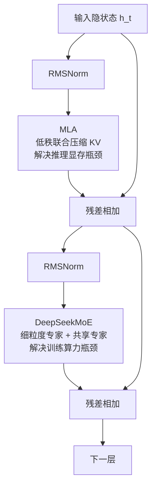
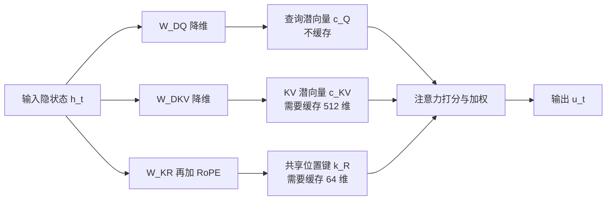
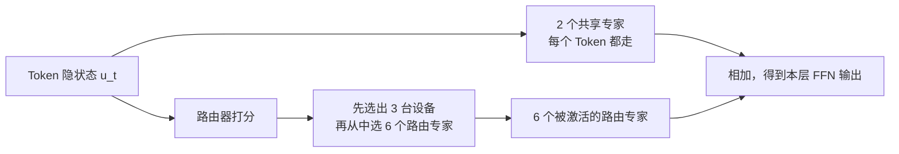
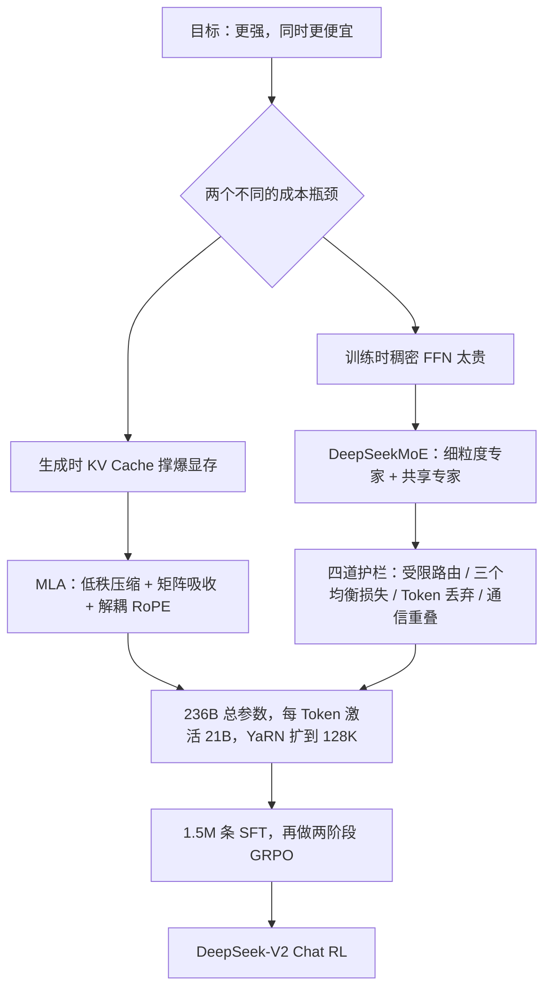

# DeepSeek-V2：省 KV Cache，不一定要砍注意力头

<!-- release-date: 2024-05-06 -->

> 本文依据本地 `papers/DeepSeek/DeepSeek-V2.pdf`，即 **DeepSeek-V2: A Strong, Economical, and Efficient Mixture-of-Experts Language Model**，arXiv:2405.04434v5、2024-06-19 提交的修订版，共 52 页。页码均指 PDF 自身的页码。文中会区分三件事：**报告明确写了什么**、**我们怎么解释它**、**哪些是外部资料或本文推算**。

## 阅读前先认识几个词

只需要四个概念就能读完全文：

- **Token（词元）**：模型处理文本的最小单位。一个汉字、一个英文单词或一个标点，都可能被切成一个或多个 Token。
- **注意力头（attention head）**：模型判断"当前这个词该重点看前文哪些位置"的一个独立视角。多个头并行工作，各看各的线索。
- **KV Cache（Key-Value Cache，键值缓存）**：生成文本时，前面每个 Token 算出来的 Key 和 Value 会被留在显存里，好让下一个 Token 不用把整段历史重算一遍。它是"用显存换算力"。
- **MoE（Mixture-of-Experts，混合专家）**：把一层前馈网络拆成很多个小网络（专家），每个 Token 只让其中少数几个干活。总参数可以很大，单次计算量却不必跟着涨。

这篇报告里最重要的两个新名字是：

- **MLA（Multi-head Latent Attention，多头潜在注意力）**：把每个 Token 要缓存的 Key 和 Value 压成一条很短的"潜向量"，推理时再想办法不把它还原回来。
- **DeepSeekMoE**：DeepSeek 自己的 MoE 排布方式——把专家切得更细，同时留出几个**每个 Token 都要经过**的共享专家。

## 一句话先说清

DeepSeek-V2 不是"把模型做得更大"的故事，而是**在两处最贵的地方分别换一种花钱方式**的故事。

它有 236B 总参数，但每个 Token 只激活 21B，支持 128K 上下文（PDF p. 1）。和上一代稠密模型 DeepSeek 67B 相比，报告给出三个对照数字（PDF p. 1）：

- 训练成本省 **42.5%**；
- 生成时的 KV Cache 少 **93.3%**；
- 最大生成吞吐提高到 **5.76 倍**。

这三个数字来自两处改造：

1. **注意力侧**：MLA 用低秩联合压缩把 KV Cache 换成一条潜向量，解决"生成时显存不够"；
2. **前馈侧**：DeepSeekMoE 用细粒度专家 + 共享专家做稀疏计算，解决"训练时算力不够"。

如果只记一句话，可以记这一句：

> **省资源的常见做法是"减少模型能用的东西"，而 MLA 省的是"模型需要存下来的东西"。这两件事可以分开。**

这就是全文最值得带走的思路。

## 先看全景：V2 到底改了 Transformer 的哪两半

一个标准 Transformer Block 只有两个主要部件：注意力和前馈网络。V2 两个都换了，其余（层归一化、激活函数等细节）沿用 DeepSeek 67B 的设置（PDF p. 6）。

图按报告 Figure 2（PDF p. 5）重画，只表达两个部件的位置关系，不表达内部数据流；MLA 的内部结构见后文单独的图。

关键配置放在一起看（PDF p. 12）：

| 配置 | DeepSeek-V2 |
|---|---:|
| Transformer 层数 | 60 |
| Hidden size $d$ | 5120 |
| 注意力头数 $n_h$ | 128 |
| 每头维度 $d_h$ | 128 |
| KV 压缩维度 $d_c$ | 512 |
| Query 压缩维度 $d_c'$ | 1536 |
| 解耦 RoPE 的每头维度 $d_h^R$ | 64 |
| 共享 / 路由专家数 | 2 / 160 |
| 每 Token 激活的路由专家 | 6 |
| 单个专家的中间层维度 | 1536 |
| 总参数 / 每 Token 激活参数 | 236B / 21B |

这张表里有一个容易被跳过、却很说明问题的细节：$n_h \times d_h = 128 \times 128 = 16384$，是 hidden size 5120 的 **3.2 倍**。也就是说，V2 的注意力比"标准写法"宽得多。标准 Transformer 里通常让 $n_h d_h = d$，报告没有解释为什么这里可以放宽，但这正是 MLA 敢于把缓存压小的前提——**缓存变小之后，头反而可以更多、更宽**。这条是本文从 p. 12 的数字推出的观察，不是报告的原话。

## 第一层矛盾：模型账单其实分成两半

### 训练贵，是因为每个 Token 都要跑完整个网络

稠密模型里，一个 Token 经过一层时，整层参数全部参与计算。参数翻倍，单 Token 计算量也大致翻倍。要变强就得变大，要变大就得多花钱，这条线很直。

### 推理慢，卡的往往不是算力而是显存

生成阶段有一个和训练完全不同的瓶颈。为了不重算历史，系统必须把每个已生成 Token 的 Key 和 Value 留在显存里。标准多头注意力（MHA）每个 Token 要缓存的元素数是（PDF p. 7）：

$$
2 n_h d_h l
$$

其中 $n_h$ 是头数，$d_h$ 是每头维度，$l$ 是层数，乘 2 是因为 Key 和 Value 各存一份。

代入 V2 的配置试算：$2 \times 128 \times 128 \times 60 = 1{,}966{,}080$ 个元素。按 BF16 存放，**一个 Token 就要接近 4 MB**。一条 32K 的上下文会吃掉一百多 GB，还只是一条请求。

报告把这件事说得很直白：这份沉重的 KV Cache 是"限制最大 batch size 和序列长度的巨大瓶颈"（PDF p. 7）。

理解这一点很重要：**线上服务的成本主要不是"一次生成有多少浮点运算"，而是"一张卡上能同时塞下多少条对话"。** 缓存越大，能并发的请求越少，摊到每个用户身上的成本就越高。

### 旧方案的共同思路：让多个头共用一份 KV

面对这个瓶颈，业界的两个经典答案是：

- **MQA（Multi-Query Attention，多查询注意力）**：所有头共用同一份 Key 和 Value，缓存降到 $2 d_h l$；
- **GQA（Grouped-Query Attention，分组查询注意力）**：折中，把头分成 $n_g$ 组，每组共用一份，缓存是 $2 n_g d_h l$。

两者都很有效，但报告指出它们"往往在减少 KV Cache 的努力中牺牲了性能"（PDF p. 6）。

这不是一句客气话。报告在附录 D.1 给出了自家的对照实验：三个 7B 稠密模型除注意力机制外架构相同，通过调层数把参数量对齐到约 7B，都训练 1.33T Token（PDF p. 31）。结果如下（PDF p. 32，Table 8）：

| Benchmark | 7B w/ MQA | 7B w/ GQA（8 组） | 7B w/ MHA |
|---|---:|---:|---:|
| BBH (EM) | 33.2 | 35.6 | **37.0** |
| MMLU (Acc.) | 37.9 | 41.2 | **45.2** |
| C-Eval (Acc.) | 30.0 | 37.7 | **42.9** |
| CMMLU (Acc.) | 34.6 | 38.4 | **43.5** |

差距不小。MMLU 上 MHA 比 MQA 高了 7.3 分。**省缓存是真的省，掉分也是真的掉。**

于是矛盾变得清楚：

> 我们想要 MHA 的能力，又想要 MQA 的缓存。旧方案在这两者之间画了一条直线，只能取中间点。

MLA 做的事，是**跳出这条直线**。

## 核心设计一：MLA，把 KV 换成一条潜向量

### 第一步：低秩联合压缩

MLA 的出发点很朴素：Key 和 Value 是从同一个隐状态 $h_t$ 算出来的，它们之间高度相关，没必要各存一份完整的高维向量。

所以先把 $h_t$ 压成一条短向量，再从这条短向量还原出 Key 和 Value（PDF p. 7，式 9–11）：

$$
\mathbf{c}_t^{KV} = W^{DKV} \mathbf{h}_t,
\qquad
\mathbf{k}_t^{C} = W^{UK} \mathbf{c}_t^{KV},
\qquad
\mathbf{v}_t^{C} = W^{UV} \mathbf{c}_t^{KV}
$$

符号的意思是：

- $\mathbf{c}_t^{KV} \in \mathbb{R}^{d_c}$ 是"KV 潜向量"，$d_c$ 远小于 $n_h d_h$；
- $W^{DKV}$ 是降维矩阵（D = down）；
- $W^{UK}$、$W^{UV}$ 是升维矩阵（U = up），分别把潜向量还原成 Key 和 Value。

**缓存时只存 $\mathbf{c}_t^{KV}$。** 于是每个 Token 的缓存从 $2 n_h d_h l$ 个元素降到 $d_c l$ 个元素。

到这里为止，这只是"低秩分解"，任何人都能想到。真正让 MLA 成立的是下一步。

### 第二步：矩阵吸收，让"解压"这一步在推理时消失

朴素做法有个明显的疑问：既然只存了潜向量，用的时候还得乘 $W^{UK}$、$W^{UV}$ 还原出 Key 和 Value——那不是省了显存、多花了算力吗？

答案是：**推理时根本不用还原。**

注意力打分算的是查询和键的内积。把 MLA 的定义代进去（暂时忽略位置编码，第 $i$ 个头）：

$$
\left( W_i^{UQ} \mathbf{c}_t^{Q} \right)^{\top}
\left( W_i^{UK} \mathbf{c}_j^{KV} \right)
=
\mathbf{c}_t^{Q\top}
\left( W_i^{UQ\top} W_i^{UK} \right)
\mathbf{c}_j^{KV}
$$

括号里那一坨是两个权重矩阵的乘积，与具体 Token 无关，可以在模型加载时算一次、存下来。之后每一步生成，都是"查询潜向量 × 固定矩阵 × KV 潜向量"，**从头到尾没有出现完整的 Key**。

输出侧同理。注意力输出是各位置 Value 的加权和：

$$
\mathbf{o}_{t,i} = \sum_j \alpha_j\, W_i^{UV} \mathbf{c}_j^{KV}
= W_i^{UV} \left( \sum_j \alpha_j\, \mathbf{c}_j^{KV} \right)
$$

$\alpha_j$ 是 softmax 之后的注意力权重。既然 $W_i^{UV}$ 是常数矩阵，就可以先在潜空间里加权求和，最后再乘一次；而这最后一次又可以并进输出投影 $W^O$ 里。

报告把这两句话写成："$W^{UK}$ 可以被吸收进 $W^{Q}$，$W^{UV}$ 可以被吸收进 $W^{O}$，因此我们甚至不需要把 Key 和 Value 算出来"（PDF p. 7）。附录 C 的说法更精确：吸收进的是 $W^{UQ}$ 而不是笼统的 $W^Q$（PDF p. 31）——MLA 里本来就没有一个叫 $W^Q$ 的矩阵，两处措辞略有出入，以附录 C 为准。

这一步是 MLA 与"普通低秩压缩"的分水岭：

> **压缩不是把信息扔掉，而是换一个坐标系。只要下游运算是线性的，就可以让整条计算链留在压缩坐标系里，永远不解压。**

### 第三步：Query 也压，但目的完全不同

报告顺手也把查询压了（PDF p. 8，式 12–13）：

$$
\mathbf{c}_t^{Q} = W^{DQ} \mathbf{h}_t,
\qquad
\mathbf{q}_t^{C} = W^{UQ} \mathbf{c}_t^{Q}
$$

报告特意加了一句："即使它不能减少 KV Cache"（PDF p. 8）。查询不需要缓存——每一步只用当前这一个。压它是为了**减少训练时的激活显存**。

这个区分值得注意：同一个技术动作，在训练和推理里解决的是两个不同的问题。读架构论文时，看到一个操作要先问"它省的是哪种资源"。

### 第四步：RoPE 撞车，是这套设计最难的地方

上面的矩阵吸收有一个前提：$W^{UQ\top} W^{UK}$ 必须是**固定**的。而旋转位置编码（RoPE，Rotary Position Embedding）恰好会破坏这个前提。

RoPE 的做法是按 Token 的位置把向量旋转一个角度，查询和键都要旋。如果对 $\mathbf{k}_t^C$ 施加 RoPE，那么打分式子会变成：

$$
\mathbf{c}_t^{Q\top} \, W_i^{UQ\top} \, R_{j-t} \, W_i^{UK} \, \mathbf{c}_j^{KV}
$$

中间多了一个旋转矩阵 $R_{j-t}$，它取决于当前生成位置 $t$ 和历史位置 $j$ 的**相对距离**，每一对 $(t,j)$ 都不同。矩阵乘法不满足交换律，$R_{j-t}$ 挪不到两边去，所以 $W^{UQ\top} W^{UK}$ 再也没法提前乘好。

（上面这个展开式是本文为了讲清机制写的，报告只用文字描述了这个冲突，没有列出这条公式。）

报告的结论是：这样一来"我们必须在推理时重新计算所有前缀 Token 的 Key，这会严重拖慢推理效率"（PDF p. 8）。压缩带来的好处会被抵消掉。

### 第五步：解耦 RoPE，把位置信息单独走一条小通道

DeepSeek 的解法不是放弃 RoPE，而是**把"内容"和"位置"拆成两条通道**（PDF p. 8，式 14–19）：

$$
\mathbf{q}_t^{R} = \mathrm{RoPE}\!\left( W^{QR} \mathbf{c}_t^{Q} \right),
\qquad
\mathbf{k}_t^{R} = \mathrm{RoPE}\!\left( W^{KR} \mathbf{h}_t \right)
$$

然后把两条通道拼起来再打分：

$$
\mathbf{q}_{t,i} = \left[ \mathbf{q}_{t,i}^{C} ; \mathbf{q}_{t,i}^{R} \right],
\qquad
\mathbf{k}_{t,i} = \left[ \mathbf{k}_{t,i}^{C} ; \mathbf{k}_{t}^{R} \right]
$$

注意力分数因此变成两部分之和：不带位置的内容匹配分（走压缩通道，可以吸收），加上专门表达相对位置的分（走 RoPE 通道，不压缩）。缩放分母也相应变成 $\sqrt{d_h + d_h^R}$（PDF p. 8，式 18）。

有两个细节值得单独讲：

**其一，RoPE 通道很窄。** $d_h^R = 64$，只有内容通道 $d_h = 128$ 的一半（PDF p. 12）。位置这件事本来就不需要很高的分辨率。

**其二，RoPE 的 Key 是所有头共享的。** 式 17 里内容 Key 带下标 $i$（每头一份），位置 Key $\mathbf{k}_t^R$ 不带下标（全模型一份）。也就是说，**128 个头看到的"位置信号"完全一样，只有内容视角是各自独立的**——这实际上是把 MQA 的省法用在了位置通道上。报告没有对这个取舍做评论，本文把它标出来，因为它意味着 MLA 并非"完全没有做任何共享妥协"，只是把妥协放在了信息量最低的那条通道上。

于是推理时要缓存的东西只剩两样（PDF p. 31，式 41、43 中标蓝的两个向量）：压缩后的 $\mathbf{c}_t^{KV}$，和共享的位置键 $\mathbf{k}_t^{R}$。总计 $(d_c + d_h^R) \, l$ 个元素（PDF p. 8）。

图按 PDF p. 5 的 Figure 2 与 p. 31 的完整公式重画，表达的是**缓存了什么、没缓存什么**这一个问题；升维矩阵 $W^{UK}$、$W^{UV}$ 因为被吸收，推理时不出现在图上。

### 账算一遍：到底省了多少

报告的对照表如下（PDF p. 9，Table 1）：

| 注意力机制 | 每 Token 缓存元素数 | 报告给的能力评价 |
|---|---|---|
| MHA | $2 n_h d_h l$ | Strong |
| GQA | $2 n_g d_h l$ | Moderate |
| MQA | $2 d_h l$ | Weak |
| **MLA** | $(d_c + d_h^R)\, l \approx \frac{9}{2} d_h l$ | **Stronger** |

那个 $\frac{9}{2}$ 是怎么来的？V2 取 $d_c = 4 d_h$、$d_h^R = \frac{d_h}{2}$，加起来正好 $4.5 d_h$（PDF p. 9 表注）。而 GQA 的公式是 $2 n_g d_h l$，令 $2 n_g = 4.5$ 得 $n_g = 2.25$。所以报告说：MLA 的缓存量**相当于只有 2.25 组的 GQA，性能却强于 MHA**（PDF p. 8–9）。

代入实际数字：$(512 + 64) \times 60 = 34{,}560$ 个元素，是同配置 MHA 的 $34{,}560 / 1{,}966{,}080 \approx 1.76\%$。（乘法为本文所做，配置数字来自 PDF p. 12。）

附录 D.2 的实测缓存量正好对得上：大号 MoE 消融模型用 MLA 时是 34.6K 元素/Token（PDF p. 32，Table 9），与上面算出的 34,560 一致。

### 93.3% 这个数字，是两件事叠出来的

摘要里那句"KV cache 减少 93.3%"（PDF p. 1）经常被单独引用，但报告没有给出它的计算口径。把三条线索拼起来才能还原：

**报告写了什么**：

1. MLA 每 Token 缓存 $(d_c + d_h^R) l$ 个元素（PDF p. 8）；
2. 部署时先把参数转成 FP8，并对 KV Cache 做量化，"把其中每个元素平均压到 6 bit"（PDF p. 16）；
3. 93.3% 是相对 DeepSeek 67B 说的（PDF p. 1）。

**报告没写**：DeepSeek 67B 的注意力配置，以及 93.3% 用的是元素数还是字节数。

**本文的推算 + 外部资料**：DeepSeek 67B 的官方配置是 95 层、64 个查询头、8 个 KV 头、hidden size 8192（外部补充，来源见文末资料节），即 $d_h = 128$ 的 8 组 GQA。于是：

- DeepSeek 67B：$2 \times 8 \times 128 \times 95 = 194{,}560$ 个元素/Token，BF16 存放约 **380 KB/Token**；
- DeepSeek-V2：$34{,}560$ 个元素/Token，按 6 bit 存放约 **25.3 KB/Token**。

$25.3 / 380 \approx 6.66\%$，正好对应 **93.3% 的降幅**；也与 Figure 1(b) 中"KV Cache for Generation"横轴 0–400 KB/Token 的量级吻合（PDF p. 1）。

所以正确的读法是：

> **93.3% 是"MLA 结构 + 6 bit KV 量化"合起来的部署数字。只看结构，MLA 相对 67B 的 GQA 降幅约 82%；再叠加量化，才到 93.3%。**

这个区分不是抠字眼。如果你打算把 MLA 搬到自己的模型上，能直接继承的是那 82%，量化那一档要另外做工程。

### 为什么 MLA 反而可能比 MHA 更强

"缓存更小、性能更好"听起来违反直觉，报告给了两组实验（PDF p. 31–32，Table 9）：

| 指标 | 小 MoE + MHA | 小 MoE + MLA | 大 MoE + MHA | 大 MoE + MLA |
|---|---:|---:|---:|---:|
| 激活参数 | 2.5B | 2.4B | 25.0B | 21.5B |
| 总参数 | 15.8B | 15.7B | 250.8B | 247.4B |
| KV Cache（元素/Token） | 110.6K | **15.6K** | 860.2K | **34.6K** |
| BBH (EM) | 37.9 | **39.0** | 46.6 | **50.7** |
| MMLU (Acc.) | 48.7 | **50.0** | 57.5 | **59.0** |
| C-Eval (Acc.) | **51.6** | 50.9 | 57.9 | **59.2** |
| CMMLU (Acc.) | 52.3 | **53.4** | 60.7 | **62.5** |

小号在 1.33T Token 上训练，大号约 250B 总参数、在 420B Token 上训练（PDF p. 31）。MLA 的缓存分别只有 MHA 的 14% 和 4%（PDF p. 31）。

这组证据比摘要里的宣传句实在得多，但也要如实说三点：

1. **八项里 MLA 赢七项**，唯一输的是小号模型的 C-Eval（50.9 对 51.6），差 0.7 分。报告没有讨论这一项。
2. **两个 arm 的参数量并不完全相等**。大号里 MLA 的激活参数反而更少（21.5B 对 25.0B），总参数也更少。这一点其实让结论更硬：**用更少的激活参数和 4% 的缓存，拿到了更高的分**。
3. 报告说两组"除注意力机制外架构相同"（PDF p. 31），但没有公开这些消融模型的完整超参，外部无法复现。

至于"为什么会更强"，报告没有给出机制解释。本文的猜测是前面那条观察：**缓存不再是约束之后，注意力可以做得更宽**（V2 里 $n_h d_h$ 是 hidden size 的 3.2 倍）。省下来的显存预算被换成了表达力。这是解释，不是报告结论，读的时候请当成一条待验证的假设。

### MLA 的代价与边界

报告本身没有专门讨论 MLA 的代价，本文按公式和配置列出几条必须自己算清楚的账：

- **矩阵吸收会产生新的大矩阵。** $W_i^{UQ\top} W_i^{UK}$ 需要预先算好并常驻。它省了缓存，但换来一份额外的固定内存和一次形状变化，实现上不是"改几行配置"就能完成的。
- **训练态和推理态的计算图不一样。** 训练时通常仍然显式算出 $\mathbf{k}^C$、$\mathbf{v}^C$；只有推理才做吸收。这意味着任何一个推理引擎要单独实现 MLA 的算子，不能复用现成的 MHA/GQA kernel。报告也说明 MLA 是在改进版 FlashAttention-2 的基础上单独优化的（PDF p. 13）。
- **位置信息在所有头之间共享**，前面已经说过。
- **报告没有做 $d_c$ 的扫描实验**。$d_c = 4 d_h$ 是给定的，不是搜出来的最优值；换一个模型规模是否还成立，报告没有回答。

### 这一节可以带走什么

- 面对"资源—能力"取舍，先问一句：**我们要省的到底是什么？** 如果省的是"存储表示"而不是"表达能力"，往往存在第三条路。
- 只要下游是线性运算，**压缩坐标系可以一路保持到最后**，不必在每一步解压。这个思路能迁移到检索、特征存储、Embedding 服务等任何"存的东西比算的东西贵"的系统。
- 引入压缩时，**先检查有没有非线性或位置相关的运算夹在中间**。RoPE 之于 MLA，就是典型的"看起来无关、实际上会毁掉整个优化"的东西。发现之后不必推翻方案，可以像 V2 一样**把冲突的部分拆成一条单独的窄通道**。

## 核心设计二：DeepSeekMoE，把专家切细，再留几个常驻通识专家

MLA 解决了推理显存。训练算力这一半交给 MoE。

V2 的 MoE 层沿用 DeepSeekMoE 架构（引用自 Dai et al., 2024），报告总结成两个想法（PDF p. 9）：**把专家切成更细的粒度**，以及**隔离出一部分共享专家**。

### 传统 MoE 的两个毛病

先讲矛盾。经典 MoE（如 GShard）把一层 FFN 换成 $N$ 个和原 FFN 一样大的专家，每个 Token 选 1–2 个。这有两个副作用：

1. **专家学不专。** 每个 Token 只能落进一两个大专家里，一个专家被迫同时承担多个领域的知识，"专家"名不副实。
2. **公共知识被重复学习。** 语法、常识这类每个 Token 都要用的东西，会在所有专家里各存一份，浪费参数。

### 两个动作分别对付一个毛病

**细粒度切分**对付第一个。把专家切小，同时多激活几个。V2 的单个专家中间层维度是 1536，而稠密层的中间层维度是 12288，**正好是 1/8**（专家维度来自 PDF p. 12，稠密层维度为外部补充，见文末资料节）。每个 Token 激活 2 个共享 + 6 个路由 = 8 个专家，**算力刚好等于一个完整稠密 FFN**。

这个"1/8 × 8"的排布把组合空间放大了。从 160 个专家里挑 6 个，可能的组合约有 $2.1 \times 10^{10}$ 种；假如同样的算力预算被摆成 20 个整块专家、每个 Token 只选 1 个，组合就只有 20 种。（这两个组合数是本文的算术举例，报告没有做这个对比。）**同样的计算预算，换来细得多的分工。**

**共享专家隔离**对付第二个。V2 留了 2 个共享专家，每个 Token 都必经（PDF p. 9，式 20）。公共知识存一份就够，路由专家就可以专心记各自的偏门内容。

图按 PDF p. 5 的 Figure 2 与 p. 9–10 的正文重画，是机制示意，不含实测数据。

### 路由怎么算

计算很直白（PDF p. 9，式 20–22）。先给每个路由专家一个"质心"向量 $\mathbf{e}_i$，用 Token 隐状态和它做内积再 softmax，得到亲和度 $s_{i,t}$；取最高的 $K_r$ 个，其余置零：

$$
s_{i,t} = \mathrm{Softmax}_i \left( \mathbf{u}_t^{\top} \mathbf{e}_i \right)
$$

$$
\mathbf{h}_t' = \mathbf{u}_t + \sum_{i=1}^{N_s} \mathrm{FFN}_i^{(s)}(\mathbf{u}_t) + \sum_{i=1}^{N_r} g_{i,t}\, \mathrm{FFN}_i^{(r)}(\mathbf{u}_t)
$$

其中 $N_s = 2$ 是共享专家数，$N_r = 160$ 是路由专家数，$g_{i,t}$ 在被选中时等于 $s_{i,t}$、否则为 0。注意第一项 $\mathbf{u}_t$ 是残差，共享专家和路由专家的输出都加在它上面。

另外，第一层的 FFN 不换成 MoE，保持稠密（PDF p. 12）。

## 稀疏不是免费的：V2 给路由加的四道护栏

细粒度切分带来一个直接后果：**每个 Token 要激活的专家变多了**。在专家并行（Expert Parallelism，把不同专家放在不同 GPU 上）的设定下，激活专家越多，一个 Token 需要跨越的设备就越多，通信就越贵（PDF p. 9）。

报告用四个机制把这个成本按住。它们经常被略读跳过，但这是"能不能真的跑起来"的关键。

### 护栏一：设备受限路由，先选设备再选专家

做法很直接（PDF p. 10）：对每个 Token，**先挑出亲和度最高的 $M$ 台设备，再在这 $M$ 台设备的专家里做 Top-K**。这样一个 Token 的通信目标数被硬性限制住。

V2 把 160 个路由专家均匀放在 $D = 8$ 台设备上，取 $M = 3$（PDF p. 12）。报告说，实践中 $M \geqslant 3$ 时，效果与不受限的 Top-K 路由"大体持平"（PDF p. 10）。

这条设计的可迁移点在于：**它把一个软优化（希望通信少一点）变成了硬约束（最多只能跨 3 台）**，而代价可以用实验量出来。当一个成本项难以在损失函数里表达时，直接在搜索空间上设边界，往往比加惩罚项更可控。

### 护栏二：三个层级的均衡损失

如果放任模型自己学路由，会出现"路由坍缩"：少数专家吃掉绝大多数 Token，其余专家几乎训不到；同时设备之间负载不均，计算效率崩掉（PDF p. 10）。

V2 设计了三个辅助损失，形状相同、粒度不同（PDF p. 10–11，式 23–31）：

$$
\mathcal{L}_{\mathrm{ExpBal}} = \alpha_1 \sum_{i=1}^{N_r} f_i P_i
$$

- $f_i$：第 $i$ 个专家实际接到的 Token 比例，乘上 $\frac{N_r}{K_r}$ 归一化，完全均衡时等于 1；
- $P_i$：该专家在整个序列上的平均路由概率。

为什么最小化 $\sum_i f_i P_i$ 就能变均衡？直觉是：**$f_i$ 里含指示函数，不可导；$P_i$ 可导。** 于是梯度只从 $P_i$ 走，而 $P_i$ 前面乘着 $f_i$ 这个"已经有多挤"的系数。哪个专家现在越挤，压它概率的力就越大。这是一个很典型的做法——**把不可导的统计量当成权重，让可导的那一半承担梯度**。

三个层级分别是（PDF p. 10–11）：

| 损失 | 均衡对象 | V2 的系数 |
|---|---|---:|
| $\mathcal{L}_{\mathrm{ExpBal}}$ | 每个专家收到的 Token 数 | $\alpha_1 = 0.003$ |
| $\mathcal{L}_{\mathrm{DevBal}}$ | 每台设备上的总计算量 | $\alpha_2 = 0.05$ |
| $\mathcal{L}_{\mathrm{CommBal}}$ | 每台设备**收到**的 Token 数 | $\alpha_3 = 0.02$ |

第三个最容易被忽略。设备受限路由只保证了每台设备**发出去**的通信有上界（至多 $MT$ 个隐状态），但没管**收进来**多少。如果某台设备成了大家的热门目标，它的入站带宽照样会成为瓶颈。所以通信均衡损失鼓励每台设备大约收到 $MT$ 个隐状态（PDF p. 11）。

系数的相对大小也有信息量：设备级 0.05 是专家级 0.003 的十几倍。**报告没有解释这个比例是怎么定的**，但从数量级能读出优先级——先保证机器不空转，再谈单个专家是否被充分训练。

### 护栏三：Token 丢弃

均衡损失只是"鼓励"，不是保证。为了兜底，V2 在训练时加了设备级 Token 丢弃（PDF p. 11）：

1. 先算出每台设备的平均计算预算，即容量因子（capacity factor）设为 1.0；
2. 在每台设备上，把亲和度最低的 Token 丢掉，直到落回预算内；
3. **但保证大约 10% 的训练序列永远不丢 Token。**

第三条是最有意思的。报告给的理由是："这样我们就可以在推理时根据效率需求灵活决定是否丢弃 Token，并始终保证训练与推理的一致性"（PDF p. 11）。

本文的解读是：如果训练时**所有**序列都经历过丢弃，那么"完整不丢"就成了模型没见过的分布，线上关掉丢弃反而可能掉分。留 10% 的完整序列，等于**同时训练了两种推理模式**。评测时报告确实不丢任何 Token（PDF p. 12）。

这条经验很通用：**任何"训练时开、推理时可能关"的加速技巧，都要留一部分样本走完整路径**，否则你会在上线那天才发现训练与推理不是同一个函数。

### 护栏四：把共享专家的计算塞进通信的空档

最后一条在 infra 一节（PDF p. 12）：**把共享专家的计算与专家并行的 all-to-all 通信重叠**。

为什么正好是共享专家？因为它们**每个 Token 都要走、而且就在本地**，不依赖任何跨设备通信的结果。所以当 GPU 在等路由专家的数据飞过来时，它手上正好有一份不需要等待的活可以先干。

这是"共享专家隔离"这个设计的一个额外红利：它本来是为了减少知识冗余，结果顺带提供了一块完美的通信遮蔽材料。**架构决策经常会在系统层带来意料之外的好处，值得专门去找。**

## 训练：数据、超参和一个没有张量并行的并行策略

### 数据

报告给的是方向，不是配方（PDF p. 11–12）：

- 沿用 DeepSeek 67B 的数据处理阶段，扩大数据量并提高质量；
- 深入挖掘互联网数据，优化清洗流程，"找回大量被误删的数据"；
- 显著增加中文数据；
- 改进基于质量的过滤算法；
- 过滤掉有争议的内容，以减轻特定地域文化带来的数据偏差（附录 E 有专门讨论）；
- 分词器沿用 DeepSeek 67B 的 BBPE，词表 100K；
- 语料共 **8.1T Token**，其中中文 Token 比英文约多 12%。

需要明确指出：报告**没有公开**各来源配比、去重阈值、质量模型细节和污染检查方法。"8.1T"是规模，不是质量证明。

关于"过滤有争议内容"，附录 E 给了一个很坦率的观察（PDF p. 32）：V2 在 MMLU 的 Humanity-Moral 子集上落后于 Mixtral 8x22B。报告让三位受过良好教育的标注者对该子集的 420 个道德情境独立标注，结果三人与标准答案之间的一致率只有 66.7%、59.8%、42.1%（PDF p. 33，Table 10）。报告据此认为这类题目本身就随地域文化而有争议。

这个论证值得留一个问号：**标注一致性低确实说明题目有歧义，但它并不能直接证明"我们的低分完全是因为去偏差"。** 报告给的是一条合理归因，不是一次受控实验。

### 训练超参

模型初始化标准差 0.006（PDF p. 12）。此外（PDF p. 12）：

- AdamW，$\beta_1 = 0.9$、$\beta_2 = 0.95$、weight decay 0.1；
- 学习率先在前 2K 步线性 warmup 到 $2.4 \times 10^{-4}$，训练约 60% Token 后乘 0.316，约 90% 后再乘 0.316；
- 梯度裁剪范数 1.0；
- batch size 在前 225B Token 内从 2304 逐步升到 9216，之后保持 9216；
- 最大序列长度 4K，共训练 8.1T Token。

两个细节值得说：

**其一，两次乘 0.316。** $0.316 \approx 1/\sqrt{10}$，两次就正好降一个数量级。这是一种"阶梯式衰减"，和更常见的 cosine 衰减不同。报告说这是沿用 DeepSeek 67B 的 warmup-and-step-decay 策略（PDF p. 12），没有比较两者优劣。

**其二，batch size 从小到大。** 训练早期梯度噪声本来就大，用小 batch 可以走更多步、更快脱离随机初始化；后期梯度方向稳定，大 batch 才划算。这条不是报告的解释，是本文的常规理解。

另外，为了稳住训练，V2 在**压缩潜向量之后加了额外的 RMSNorm 层，并在"宽度瓶颈"处（即压缩潜向量和路由专家的中间隐状态）乘上额外的缩放因子**（PDF p. 12）。这句话很短，但信息量大：**低秩压缩和细粒度专家都会改变一层的输出尺度**，如果不补归一化，训练会不稳。这是所有想复用 MLA/细粒度 MoE 的人都会踩到的坑。

### 并行策略：一个显眼的"没有"

训练基于内部框架 HAI-LLM，用了三种并行（PDF p. 12）：

- **16 路 zero-bubble 流水线并行**；
- **8 路专家并行**；
- **ZeRO-1 数据并行**。

真正值得注意的是缺席的那一个：**没有张量并行（Tensor Parallelism）**。

报告给的理由是："鉴于 DeepSeek-V2 激活的参数相对较少，并且一部分算子被重计算以节省激活显存，它可以在不需要张量并行的情况下训练，从而降低了通信开销"（PDF p. 12）。

这句话把 MoE 的一个连带好处点出来了：**稀疏激活不只省算力，还省并行度。** 张量并行是通信最密集的一种切法（每一层都要 all-reduce），能不用就是净赚。激活参数只有 21B，单卡放得下一层的计算，于是这条最贵的通信链路直接被删掉。

**架构选择会改变可用的并行策略**——这条因果链在很多讨论里被忽略了。

其余 infra 细节（PDF p. 12–13）：定制了通信、路由算法和跨专家融合线性计算的 CUDA kernel；MLA 基于改进版 FlashAttention-2 优化；集群是 NVIDIA H800，节点内 8 卡用 NVLink 和 NVSwitch，节点间用 InfiniBand。

### 长上下文：只需要动那条 64 维的小通道

V2 的预训练全程序列长度只有 4K（PDF p. 12）。128K 是在预训练之后用 YaRN 扩出来的（PDF p. 13）。

关键在这一句：**YaRN 只作用于解耦的共享键 $\mathbf{k}_t^R$，因为它是唯一携带 RoPE 的东西**（PDF p. 13）。

这是解耦 RoPE 设计的第二个红利。位置信息被隔离在一条 64 维的窄通道里，做长度外推时就只需要改这一条通道，内容通道完全不动。**当你把两种性质不同的信息拆开之后，后续所有只针对其中一种的操作都会变简单。**

具体设置（PDF p. 13）：

- YaRN 的 scale $s = 40$，$\alpha = 1$，$\beta = 32$，目标最大长度 160K；
- 因为注意力机制不同，长度缩放因子做了调整，用 $\sqrt{t} = 0.0707 \ln s + 1$ 来调节注意力熵，目标是最小化困惑度；
- 额外训练 **1000 步**，序列长度 32K，batch 576 条序列。

注意最后一行：**只在 32K 上训练，却在 128K 上评测**（PDF p. 13）。报告说模型在 128K 仍然表现稳健，依据是 Figure 4 的 Needle In A Haystack 热力图（PDF p. 13）。

逐格看那张图会发现：**大部分格子是满分，但确实有几格不是**——约 35K 位置、文档深度 27%–45% 和 64% 附近有两块偏低的格子，104K 附近深度 45% 处还有一块中等分数的格子。所以准确的说法是"在 128K 以内整体保持了良好的检索能力"，而不是"在 128K 以内无损"。报告正文用的是 "performs well"，本文只是把图上的细节如实读出来。

## 成本账：42.5% 和 5.76× 分别是什么口径

这两个数字被引用得很多，值得拆清楚。

### 训练成本：每万亿 Token 的 GPU 小时

报告给的是**单位成本**而不是总成本（PDF p. 16）：

| 模型 | 每训练 1T Token 需要的 H800 GPU 小时 |
|---|---:|
| DeepSeek 67B（稠密） | 300.6K |
| DeepSeek-V2（MoE） | **172.8K** |

$1 - 172.8 / 300.6 = 42.5\%$，与摘要一致。

两条必须说明的边界：

1. **这是单位 Token 成本，不是总账。** V2 训了 8.1T Token，按此推算全程约 **140 万 H800 GPU 小时**（本文乘法，报告未给总数）；DeepSeek 67B 训了 2T Token。所以 V2 的**总**训练开销其实远高于 67B，"省 42.5%"说的是同样喂一万亿 Token 谁更便宜。
2. **报告说 V2 能达到"相对较高的 MFU（Model FLOPs Utilization，模型浮点利用率）"，但没有给出具体数值**（PDF p. 16）。这个数字没有公开，无法核实。

### 推理吞吐：5.76 倍，也是部署口径

报告的原文条件很具体（PDF p. 16）：

- 先把参数转成 FP8 精度；
- 再对 KV Cache 做量化，每个元素平均压到 6 bit；
- 在**单个 8 卡 H800 节点**上；
- 按 DeepSeek 67B 线上服务的真实提示词与生成长度分布来测；
- 生成吞吐 **超过 50K Token/秒**，是 DeepSeek 67B 最大生成吞吐的 **5.76 倍**；
- 提示词输入吞吐 **超过 100K Token/秒**。

同样要看清口径：**5.76 倍是"MLA + FP8 权重 + 6 bit KV 量化"三件事叠加后的结果**，而且是吞吐（每秒总 Token 数）不是延迟。吞吐的提升主要来自"同一张卡能同时服务更多请求"，单条请求的响应速度并不一定同比变快。报告没有给出延迟数据。

这一节最实用的启发是：**读任何性能数字前先找口径。** "5.76 倍"和"93.3%"都是真的，但它们描述的是一个经过完整量化部署的系统，不是一个纯架构改动。

## 对齐：SFT 加两阶段 GRPO

### SFT

指令微调数据 **1.5M 条**，其中 1.2M 条面向有用性、0.3M 条面向安全性（PDF p. 16）。相比初版，报告说提升了数据质量以减少幻觉、增强写作能力。训练 2 个 epoch，学习率 $5 \times 10^{-6}$（PDF p. 16）。

### GRPO：省掉那个和策略一样大的评分员

强化学习部分用 GRPO（Group Relative Policy Optimization，组相对策略优化），来自 DeepSeekMath（PDF p. 17）。

先讲它要解决什么。PPO 需要一个 value model（价值模型）来估计"当前状态大概能拿多少分"，而这个模型通常和策略模型一样大。对 236B 的模型来说，这等于在训练时多养一个巨无霸。

GRPO 的做法是：**对同一个问题采样一组答案，用这组答案的平均分当基线**（PDF p. 17，式 34）：

$$
A_i = \frac{r_i - \mathrm{mean}\left(\{r_1, \dots, r_G\}\right)}{\mathrm{std}\left(\{r_1, \dots, r_G\}\right)}
$$

$r_i$ 是第 $i$ 个答案拿到的奖励，$G$ 是这一组的大小，$A_i$ 是优势值。意思很朴素：**比同题的其他答案好，就是好。** 于是价值模型被彻底删掉。

完整目标里还有裁剪项和 KL 惩罚（PDF p. 17，式 32–33），形式与 PPO 类似，这里不展开。

同一套 GRPO 后来被 DeepSeek-R1 用在纯强化学习推理上，本仓另有 `DeepSeek-R1.md` 专门讲那条线，本文不重复。

### 两阶段：推理和偏好不放在一起练

报告观察到，在代码、数学这类推理数据上做 RL，特性和一般数据不一样——**数学和编程能力可以在更长的训练步数里持续提升**（PDF p. 17）。

所以 V2 分两阶段（PDF p. 17）：

1. **推理对齐**：训练一个专门的 $RM_{reasoning}$ 给代码和数学任务打分，用它优化策略；
2. **人类偏好对齐**：换成多路奖励的加权和：

$$
r_i = c_1 \cdot RM_{helpful}(o_i) + c_2 \cdot RM_{safety}(o_i) + c_3 \cdot RM_{rule}(o_i)
$$

三个系数 $c_1, c_2, c_3$ 的具体取值**报告没有公开**。

奖励数据的来源分得很清楚（PDF p. 17）：**代码偏好来自编译器反馈，数学偏好来自标准答案**。这两类不需要人来打分，因为有客观判据。奖励模型用 DeepSeek-V2 Chat (SFT) 初始化，用 point-wise 或 pair-wise 损失训练。

这里的可迁移原则是：**能用规则或程序验证的能力，就不要交给神经网络打分。** 编译器不会被话术骗到，人类标注会。

### RL 的三条工程优化

在超大模型上跑 RL 对框架压力很大，报告列了三条（PDF p. 18）：

1. **混合引擎**：训练和推理分别采用不同的并行策略，以提高 GPU 利用率——训练要切参数，生成要吞吐，本来就是两种最优解；
2. **用 vLLM 做推理后端**，配大 batch 加速采样；
3. **精心设计模型在 CPU 与 GPU 之间的卸载与回载调度**，在训练速度和显存占用之间找接近最优的平衡。

这三条都不是算法创新，但没有它们 RL 跑不起来。**"同一个模型在一次训练里要扮演两种角色"，这是 RLHF 系统设计的核心难点。**

## 实验：哪些结论有证据，哪些要保留问号

### Base 模型：用 21B 激活参数打 70B 级稠密模型

所有对比模型都在 DeepSeek 内部框架、同一评测设置下跑（PDF p. 14）。摘几行（PDF p. 15，Table 2）：

| Benchmark | DeepSeek 67B | Qwen1.5 72B | Mixtral 8x22B | LLaMA 3 70B | **DeepSeek-V2** |
|---|---:|---:|---:|---:|---:|
| 激活参数 | 67B | 72B | 39B | 70B | **21B** |
| MMLU | 71.3 | 77.2 | 77.6 | **78.9** | 78.5 |
| BBH | 68.7 | 59.9 | 78.9 | **81.0** | 78.9 |
| GSM8K | 63.4 | 77.9 | 80.3 | **83.0** | 79.2 |
| MATH | 18.7 | 41.4 | 42.5 | 42.2 | **43.6** |
| HumanEval | 45.1 | 43.9 | **53.1** | 48.2 | 48.8 |
| C-Eval | 66.1 | **83.7** | 59.6 | 67.5 | 81.7 |
| CMMLU | 70.8 | **84.3** | 60.0 | 69.3 | 84.0 |

报告自己的分析很克制（PDF p. 15–16）：

- 对 Qwen1.5 72B，V2 在英文、代码、数学上大幅领先，中文多选题略逊；
- 对 Mixtral 8x22B，英文大体相当（TriviaQA、NaturalQuestions、HellaSwag 这类英文常识题偏弱），中文远超；
- 对 LLaMA 3 70B，**报告承认基础英文能力仍有差距**，并给出原因：V2 训练用的英文 Token 不到 LLaMA 3 的四分之一。

最后一句尤其重要：**它把差距归因于数据量而不是架构**，这是一个可证伪的说法，比"我们全面领先"诚实得多。

报告还专门澄清：某些工作会在预训练阶段混入 SFT 数据，而 **DeepSeek-V2 在预训练期间从未接触过 SFT 数据**（PDF p. 16）。这对基准可比性很关键。

### Chat 模型：RL 到底改变了什么

把 SFT 版和 RL 版并排看，能得到比"RL 让模型更好"细致得多的结论（PDF p. 19，Table 3；PDF p. 19，Table 4）：

| 指标 | V2 Chat (SFT) | V2 Chat (RL) | 变化 |
|---|---:|---:|---|
| HumanEval | 76.8 | **81.1** | +4.3 |
| LiveCodeBench | 28.7 | **32.5** | +3.8 |
| GSM8K | 90.8 | **92.2** | +1.4 |
| MATH | 52.7 | **53.9** | +1.2 |
| MBPP | 70.4 | **72.0** | +1.6 |
| AlpacaEval 2.0（长度校正胜率） | 30.0 | **38.9** | +8.9 |
| MT-Bench | 8.62 | **8.97** | +0.35 |
| BBH | **81.3** | 79.7 | −1.6 |
| AGIEval | **63.2** | 61.4 | −1.8 |
| C-Eval | **80.9** | 78.0 | −2.9 |
| MMLU | **78.4** | 77.8 | −0.6 |
| CMMLU | **82.4** | 81.6 | −0.8 |

模式非常清晰：**RL 在代码、数学和开放式对话上带来实打实的提升，在若干知识型和中文基准上则退步。**

报告把这个现象叫做 **alignment tax（对齐税）**，并明确承认它（PDF p. 20）："对齐过程会对某些标准基准（例如 BBH）的性能产生负面影响。"报告说通过数据处理和训练策略改进"最终达成了一个可以接受的取舍"，但**没有说消除了它**。

一个值得当面试素材记住的判断：

> **看到"RL 后模型更强"时，要问是哪一类任务更强。有客观验证器的任务（代码、数学）通常真的更强；靠人类偏好打分的任务会更讨喜；而知识型基准很可能变差。**

### 开放式对话：中文语言维度确实领先

英文（PDF p. 19，Table 4）：

| 模型 | MT-Bench | AlpacaEval 2.0 |
|---|---:|---:|
| DeepSeek 67B Chat | 8.35 | 16.6 |
| Mistral 8x22B Instruct v0.1 | 8.66 | 30.9 |
| Qwen1.5 72B Chat | 8.61 | 36.6 |
| LLaMA3 70B Instruct | 8.95 | 34.4 |
| DeepSeek-V2 Chat (SFT) | 8.62 | 30.0 |
| **DeepSeek-V2 Chat (RL)** | **8.97** | **38.9** |

中文用 AlignBench，由 GPT-4-0613 打分（PDF p. 20，Table 5）：

| 模型 | 总分 | 中文推理 | 中文语言 |
|---|---:|---:|---:|
| GPT-4-1106-Preview | **8.01** | **7.73** | 8.29 |
| DeepSeek-V2 Chat (RL) | 7.91 | 7.45 | **8.36** |
| ERNIEBot-4.0-202404 | 7.89 | 7.61 | 8.17 |
| DeepSeek-V2 Chat (SFT) | 7.74 | 7.30 | 8.17 |
| GPT-4-0613 | 7.53 | 7.47 | 7.59 |

拆开看比看总分有信息量：**V2 的中文语言维度（8.36）确实超过了所有模型，包括 GPT-4-1106-Preview（8.29）；但中文推理（7.45）明显落后（7.73）。** 报告自己也是这么写的：中文语言理解超过包括 GPT-4-Turbo-1106-Preview 在内的所有模型，推理能力则"仍落后于 Erniebot-4.0 和 GPT-4 系列这样的巨型模型"（PDF p. 19）。

顺带提醒一个方法论问题：AlignBench 由 GPT-4-0613 打分，而被评的模型里就包含 GPT-4 自己。报告没有讨论这个潜在偏置，读者应当自己保留这个折扣。

### SC-Math6：这个"超过所有中文模型"要看哪一列

附录 F 报告了中文数学集 SC-Math6 的结果，正文说 "DeepSeek-V2 Chat (RL) 超过所有中文大模型，包括开源和闭源"（PDF p. 32）。看表（PDF p. 33，Table 11）：

| 模型 | R Level | Comp. Score | Reas. Steps | OvrAcc |
|---|---:|---:|---:|---:|
| GPT-4-1106-Preview | 5 | 90.71 | 91.65 | 89.77 |
| GPT-4 | 5 | 88.40 | 89.10 | 87.71 |
| **DeepSeek-V2 Chat (RL)** | 5 | 83.35 | 85.73 | **84.54** |
| Ernie-bot 4.0 | 5 | 85.60 | 86.82 | 84.38 |
| Qwen-110B-Chat | 5 | 83.25 | 84.93 | 84.09 |
| GLM-4 | 5 | 84.24 | 85.72 | 82.77 |
| Xinghuo 3.5 | 5 | 83.73 | 85.37 | 82.09 |

表是按最后一列 OvrAcc 排序的，加粗的也只有 OvrAcc 那一格。**在 OvrAcc 上 V2 确实第一（中文模型中）；但在 Comp. Score 上，Ernie-bot 4.0（85.60）、GLM-4（84.24）、Xinghuo 3.5（83.73）都高于 V2 的 83.35。**

所以那句"超过所有中文 LLM"只在一个指标上成立。这不是造假，是**聚合表述掩盖了列间差异**。读技术报告时，遇到"超过所有 X"这类句子，务必回到表里确认它说的是哪一列。

### 代码：LiveCodeBench 的时间窗口

评测用的 LiveCodeBench 题目取自 **2023-09-01 到 2024-04-01** 之间（PDF p. 16、p. 33）。Figure 5 把 V2 Chat (RL) 放在 HumanEval 81.1、LiveCodeBench 32.5 的位置：高于 LLaMA3-70B-Chat、Mixtral 8x22B、Qwen Max、Claude Sonnet、Claude Haiku 等，低于 GPT-4-Turbo-1106、GPT-4-0613 和 Claude Opus（PDF p. 34）。

**明确时间窗口是件好事**，它至少让"数据污染"这个问题变得可讨论。

### SFT 数据量：一个反主流的观察

有一批工作认为 1 万条以内的 SFT 数据就够。报告给出相反的实测（PDF p. 20）：**用少于 10K 条实例时，IFEval 上出现显著下降。**

报告的解释是"语言模型需要一定量的数据来发展特定技能；这个量可能随模型变大而减少，但不可能完全消除"（PDF p. 20）。

这是一条有价值的负面结果，但要注意边界：**它只在 IFEval（指令遵循）上给了证据**，没有给出曲线，也没有说明"少于 10K"具体试了几个点。所以准确的说法是"在 V2 的设定下，指令遵循能力对 SFT 数据量敏感"。

### 在线 RL 比离线 RL 好

报告说在偏好对齐实验中"在线方法显著优于离线方法"，因此投入了大量精力实现在线 RL 框架（PDF p. 21）。但它同时承认这个结论"在不同场景下可能不同"，并把更彻底的比较留给未来工作。

**没有数字，没有实验表。** 这是一条作者观察，不是被本报告证明的结论，引用时要注明。

## V2-Lite：一个可以自己动手的小样本

为了方便社区研究 MLA 和 DeepSeekMoE，报告还开源了 15.7B 总参数 / 2.4B 激活参数的 DeepSeek-V2-Lite（PDF p. 5、p. 29）。

它的配置（PDF p. 29）：27 层、hidden 2048、16 个注意力头、每头 128 维、KV 压缩维度 512、$d_h^R = 64$；2 个共享专家 + 64 个路由专家、专家中间层 1408、每 Token 激活 6 个；训练 5.7T Token，上下文 32K。

有两个和 V2 不同的地方特别值得注意：

**其一，Lite 不压缩 Query。** 报告直接写明"与 DeepSeek-V2 略有不同，它不压缩查询"（PDF p. 29）。这印证了前面那个判断——查询压缩只为省训练激活显存，小模型不缺这点显存，就不必付这个复杂度。

**其二，Lite 只用了一个很小的专家级均衡损失（$\alpha_1 = 0.001$），完全没有设备级和通信级均衡损失。** 原因是它的每一层专家全部部署在同一台设备上（PDF p. 30）。

这条对照极有说服力：**那三个辅助损失不是"MoE 的标准配件"，而是"专家跨设备之后才需要的补丁"。** 如果你的 MoE 能塞进一台机器，就不需要它们。架构复杂度和部署规模是绑定的。

效果上，Lite 相对同门的稠密 7B 和 DeepSeekMoE 16B 有明显优势（PDF p. 29，Table 6），例如 MMLU 58.3 对 48.2 / 45.0，GSM8K 41.1 对 17.4 / 18.8，MATH 17.1 对 3.3 / 4.3。但要留意：**Lite 训了 5.7T Token，另两个只训了 2T**，所以这不是一个受控对比，架构和数据量同时变了。报告没有把这两个因素分开。

## 报告承认的限制，和报告没说的事

### 报告自己承认的（PDF p. 21）

- 预训练之后没有持续的知识更新；
- 可能产生未经证实的建议等非事实内容，存在幻觉；
- 数据以中英文为主，其他语言能力有限，应谨慎使用；
- **只支持文本模态**，多模态被列为未来方向；
- 下一步目标是"在即将到来的版本中达到 GPT-4 水平"。

### 报告没有公开的

读完全文之后，下面这些是无法从这份 PDF 得到答案的：

- 预训练数据的来源配比、去重阈值、质量模型和污染检查方法；
- 具体的 MFU 数值和总训练 GPU 小时（只给了每万亿 Token 的单位成本）；
- 93.3% 这个数字的完整计算口径，以及 DeepSeek 67B 的注意力配置；
- KV Cache "平均 6 bit"的具体量化方案（哪些维度用几位、如何分组）；
- $d_c = 4 d_h$、$d_h^R = d_h / 2$ 这两个比例是怎么选的，有没有做过扫描；
- 三个均衡损失系数（0.003 / 0.05 / 0.02）的确定方式，以及去掉其中任何一个的消融；
- RL 的完整超参：GRPO 的组大小 $G$、裁剪系数 $\varepsilon$、KL 系数 $\beta$、三路奖励的权重 $c_1 c_2 c_3$；
- 奖励模型的规模与训练数据量；
- MLA 与 MHA 消融实验中两个 arm 的完整超参；
- "在线 RL 优于离线 RL"的任何量化证据。

**这些不是疏漏，是技术报告的常态。** 但读的时候必须知道边界在哪里，否则很容易把"报告写了方向"当成"报告给了配方"。

## 最值得带回自己项目的七条

### 1. 先区分"省表达力"和"省表示"

MQA/GQA 省的是模型能用的东西（让头共用 KV），MLA 省的是模型要存的东西（换一个压缩坐标系）。前者必然掉分，后者不一定。**遇到资源瓶颈时，先把这两类做法分开列一遍。**

### 2. 线性链路上的压缩可以一路不解压

只要下游是矩阵乘法，压缩矩阵就能被吸收进相邻矩阵。这个技巧不限于注意力——任何"存储 × 固定线性变换 × 消费"的管线都适用。

### 3. 冲突的那一小部分，拆出来单走

RoPE 和低秩压缩不兼容，V2 没有二选一，而是把位置信息拆到一条 64 维的窄通道上。**当两个设计只在某一个维度上冲突时，先看能不能把那个维度隔离出来。**

### 4. 隔离一件东西，往往会连带解锁别的优化

共享专家被隔离出来之后，顺带成了遮蔽 all-to-all 通信的完美材料；RoPE 被隔离到窄通道之后，YaRN 长度外推只需要改一处。**做完一次解耦，回头找一遍它带来的额外自由度。**

### 5. 难以用损失表达的成本，直接在搜索空间上设硬边界

设备受限路由不是给通信加惩罚项，而是规定"最多跨 3 台设备"。硬约束的行为可预测，代价能实测。**当一个成本项写不进 loss 时，考虑把它写进搜索空间。**

### 6. 训练时开、推理时关的技巧，必须留一条完整路径

Token 丢弃保证约 10% 的序列永不丢弃，就是为了让"不丢弃"这条推理路径也在训练分布之内。**任何训推不对称的加速手段，都要问一句：推理那一侧的分布，模型见过吗？**

### 7. 架构决定你能用哪些并行策略

激活参数只有 21B，于是张量并行可以整个去掉，最贵的通信链路直接消失。**评估一个架构改动时，不要只算 FLOPs 和显存，也要算它解锁或封死了哪些系统方案。**

## 用一张图重新串起全文

## 关键词回看

- **MLA（Multi-head Latent Attention）**：把 Key 和 Value 联合压成一条低维潜向量再缓存，推理时通过矩阵吸收避免还原。
- **低秩联合压缩**：Key 和 Value 共用同一条潜向量，因为它们来自同一个隐状态、本就高度相关。
- **矩阵吸收**：把升维矩阵提前乘进相邻的查询/输出投影里，让压缩表示可以直接参与计算。
- **解耦 RoPE**：额外开一条只承载位置编码的窄通道，避免旋转矩阵夹在两个待吸收矩阵中间。
- **DeepSeekMoE**：细粒度专家切分 + 共享专家隔离的 MoE 排布。
- **共享专家**：每个 Token 都必经的专家，负责公共知识，同时可用来遮蔽专家并行通信。
- **设备受限路由**：先选最多 $M$ 台设备，再在其中选 Top-K 专家，硬性限制单 Token 的通信目标数。
- **专家级 / 设备级 / 通信级均衡损失**：分别防止专家饿死、设备空转、单台设备入站拥塞。
- **Token 丢弃**：容量因子设为 1.0，丢掉设备上亲和度最低的 Token；约 10% 的序列永不丢弃。
- **GRPO**：用同题一组答案的均值做基线，省掉与策略同样大的价值模型。
- **对齐税（alignment tax）**：偏好对齐会提升开放式表现，同时可能拉低部分标准基准。
- **YaRN**：一种上下文长度外推方法；在 V2 中只作用于承载 RoPE 的解耦共享键。

## 最后的判断

DeepSeek-V2 这份报告最值得学的，不是"MLA 这个名字"，而是它**把"变强"和"变贵"拆成了两条可以分别处理的线**。

推理贵，因为要存的东西太多——那就换一种存法，而不是少存几个头。
训练贵，因为每个 Token 都要跑完整个网络——那就只跑一小部分，再用四道护栏保证这"一小部分"不会失控。

它的证据强度也是分层的：

- **有直接实验支撑的**：MQA/GQA 相对 MHA 的掉分（Table 8）、MLA 相对 MHA 在两个规模上的表现与缓存对比（Table 9）、Base 与 Chat 的完整基准表、对齐税在具体基准上的体现。
- **只有作者观察、没有实验表的**：在线 RL 优于离线 RL、"$M \geqslant 3$ 时与不受限路由大体持平"、对齐税"最终达成可接受取舍"的程度。
- **完全没有公开的**：数据配比、MFU、量化细节、RL 超参、各机制的独立消融。

还有几处表述需要读者自己校准：93.3% 和 5.76× 都是**部署口径**而非纯架构收益；"超过所有中文模型"只在 SC-Math6 的一列上成立；128K 的 NIAH 热力图并非全满分。

如果只带走一句：

> **不要默认"省资源"和"降能力"是同一件事。先问清楚省的是哪种资源，很多时候还有第三条路。**

从代际上看，MLA 与 DeepSeekMoE 在这份报告里第一次同时定型，成为 DeepSeek 之后几代基座模型的架构起点；到 DeepSeek-V4 时，注意力这条线已经演进成"压缩 + 稀疏检索 + 局部窗口"的组合（见本仓 `DeepSeek-V4.md`）。这也是为什么 V2 值得单独读一遍：**它是这条技术线的地基，而地基通常比后来的加建更容易看懂。**

## 资料与阅读边界

**原始依据**

- 本地 `papers/DeepSeek/DeepSeek-V2.pdf`，即 arXiv:2405.04434v5（2024-06-19 提交），52 页。全文所有带 `(PDF p. N)` 的数字都出自这一版。

**版本核查**

- arXiv 论文页 [arXiv:2405.04434](https://arxiv.org/abs/2405.04434) 的提交历史为 v1（2024-05-07）、v2（2024-05-08）、v3（2024-05-16）、v4（2024-05-24）、v5（2024-06-19），**v5 即最新版**，与本地 PDF 一致，无需替换。

**首发日证据**

- 官方仓库 [deepseek-ai/DeepSeek-V2](https://github.com/deepseek-ai/DeepSeek-V2) 的 README 新闻栏写明："2024.05.06: We released the DeepSeek-V2."
- 官方权重仓库 [deepseek-ai/DeepSeek-V2](https://huggingface.co/deepseek-ai/DeepSeek-V2) 的提交历史显示，模型文件与 LICENSE 于 2024-05-06 上传。
- 因此 `release-date` 取 **2024-05-06**，即模型权重首次对外开放的日期，而非 arXiv 首次提交日（2024-05-07）或本 PDF 的修订日（2024-06-19）。

**外部补充（不是报告内容）**

- DeepSeek 67B 的注意力配置（95 层、64 个查询头、8 个 KV 头、hidden 8192）来自官方权重仓库的 [`config.json`](https://huggingface.co/deepseek-ai/deepseek-llm-67b-base/blob/main/config.json)。本文用它推算 93.3% 的口径；报告本身没有给出 67B 的这些数字。
- DeepSeek-V2 稠密层中间维度 12288、专家中间维度 1536、分组路由参数 `n_group = 8` / `topk_group = 3`，来自 [DeepSeek-V2 的 `config.json`](https://huggingface.co/deepseek-ai/DeepSeek-V2/blob/main/config.json)。其中 8 / 3 与报告的 $D = 8$、$M = 3$ 对应；12288 / 1536 = 8 这个比例是本文用来解释"细粒度切分"的，报告未直接写出。
- 本文中所有形如"$2 \times 128 \times 128 \times 60 = 1{,}966{,}080$"的算式、380 KB 与 25.3 KB 的换算、约 140 万 GPU 小时的总量估计，都是**本文根据报告给出的公式与超参所做的算术**，报告原文没有这些数字。

**本文没有做的事**

- 没有阅读 DeepSeek-V2 的推理源码，因此没有把任何实现细节说成报告结论。
- 没有把 DeepSeek-V3 / V3.2 / V4 中的后续设计（无辅助损失负载均衡、MTP、FP8 训练、稀疏注意力等）回填到本文。这份 V2 报告里**不存在**这些内容：全文没有出现 MTP、DualPipe，也没有 FP8 训练——文中唯一的 FP8 是**部署时的权重量化**（PDF p. 16）。
