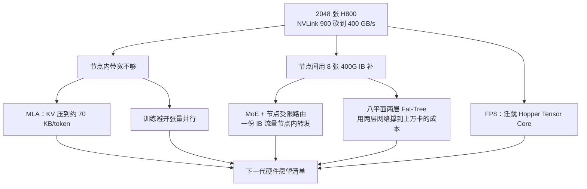
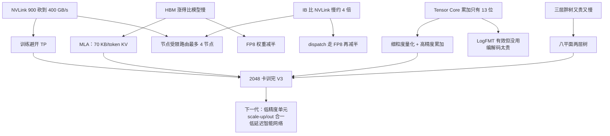

# 被砍过的 H800：DeepSeek-V3 如何把硬件短板写成模型选择

<!-- release-date: 2025-05-14 -->

> 本文依据 DeepSeek-AI 的 **Insights into DeepSeek-V3: Scaling Challenges and Reflections on Hardware for AI Architectures**，即 arXiv:2505.09343v2（2025-12-23），共 15 页。ISCA 2025。截至核验 arXiv 最新是 v2。页码均指这份 PDF。全文把三件事分开标注：**报告明确写了什么**、**我们如何解释或验算它**、**哪些是外部资料补充**。

这篇论文自己把边界划得很清楚：它**不打算把 DeepSeek-V3 的架构和算法再讲一遍**，那些已经写在技术报告里。（PDF p.2）它要回答的是另一件事：

> 在一块 NVLink 被监管砍到 400 GB/s 的 H800 上，哪些模型选择其实是在给硬件擦屁股，哪些又反过来要求下一代硬件改。

MLA 怎么压缩、MoE 怎么路由、FP8 怎么分组、DualPipe 怎么排程，本站已经写过，见 [DeepSeek-V3](/reports/DeepSeek/DeepSeek-V3)。 **本篇只写 ISCA 这一份。** 架构细节只给对照链接；硬件约束、通信上限、多平面网络和给厂商的愿望清单，才是这篇的正文。

## 先说矛盾：不是卡不够快，是卡的「腰」被砍了

2024 年把大模型训出来的主流做法，是堆到几万甚至十几万张 GPU。（PDF p.2）DeepSeek-V3 只用了 **2048 张 NVIDIA H800**，论文把它写成「成本可控的训练」的新里程碑。（PDF p.2）

这个数字容易被读成「小团队也能训 671B」。论文真正想说的不是「卡少」，而是**卡的规格被改过**。

H800 和 H100 同属 Hopper。论文写明，为了满足监管，它砍了两样东西：FP64 算力，以及节点内的 NVLink 带宽——从 **900 GB/s 降到 400 GB/s**。（PDF p.7）节点内的高速互联被腰斩，张量并行这种「每一层都要在卡之间切矩阵」的做法立刻变贵。

他们的补偿不是换更快的卡，而是给每个节点配 **8 张 400G InfiniBand CX7 网卡**，把赌注押到节点之间的 scale-out 上。（PDF p.7）

于是整篇文章的主线可以写成一句：

> **节点内的路变窄了，就把模型改成不太走这条路；节点间的路还在，就把专家、量化和集群拓扑都按这条路来长。**

## 这篇论文站在哪张地图上

论文给自己定了三个目标（PDF p.2）：

1. **硬件如何塑造模型**：FP8、scale-up / scale-out 的带宽差，怎样写进 V3 的架构选择。
2. **模型和硬件如何互相逼对方改**：今天的模型创新被硬件能力框住，明天的硬件又被模型的新需求推着走。
3. **对下一代硬件给出可执行的方向**：精确的低精度计算单元、scale-up 与 scale-out 合一、低延迟通信结构。

章节对应关系很干净（PDF p.2）：

| 章节 | 写什么 | 本篇对应 |
|---|---|---|
| §2 | 设计原则：MLA、MoE、MTP | 只讲硬件动机和这篇新给的对照表 |
| §3 | 低精度计算与通信 | Hopper 累加精度、LogFMT、为什么没用上 |
| §4 | scale-up、并行、专家选择 | 训练避开 TP、节点受限路由、20 个 SM |
| §5 | scale-out 多平面网络 | 八平面两层 Fat-Tree 和实测 |
| §6 | 对未来硬件的讨论 | 摘要收成三点，正文展开成六块 |

这张图按论文第 1 到第 6 节的因果重画（PDF p.2–13），是**机制示意**，不是集群接线图。

## 几个会反复出现的名字

- **scale-up（节点内扩展）**：一张节点里 8 张 GPU 用 NVLink 互连。路短、带宽高，但这张卡上这条路被砍过。
- **scale-out（节点间扩展）**：节点和节点之间走 InfiniBand。路长、延迟更高，但这边他们配得很满。
- **NVLink**：NVIDIA 的节点内高速互联。H100 标称 900 GB/s；H800 被砍到 400 GB/s。（PDF p.7）
- **IB（InfiniBand）**：节点间的 RDMA 网络。这篇里每张 GPU 配一张 400 Gbps 的 CX7 网卡。
- **EP / TP / PP（专家并行 / 张量并行 / 流水线并行）**：把专家、矩阵、层分别切到不同卡上。V3 **训练时避开 TP**，推理时仍可选用。（PDF p.7）
- **SM（Streaming Multiprocessor，流多处理器）**：GPU 上的基本计算单元。通信 kernel 若跑在 SM 上，Tensor Core 就闲着。
- **Fat-Tree（胖树）**：数据中心经典网络：叶子交换机接下层设备，脊交换机接叶子。层数越多，能接的机器越多，延迟和成本也越高。
- **MPFT / MRFT**：多平面两层胖树，对单平面多轨胖树。后文会把「平面」说清楚。

## 一句话结论

DeepSeek-V3 在这块被砍过的 H800 上，做了四件互相咬合的事：

1. 用 **MLA** 把每个 Token 的 KV Cache 压到约 70 KB，先把显存墙往后推。
2. 用 **MoE** 让总参数涨到 671B，但每个 Token 只激活 37B，训练算力按「激活」而不是「总参数」付钱。
3. 用 **FP8** 迁就 Hopper 的 Tensor Core，再用细粒度量化把误差按住。
4. 训练时**不用张量并行**，专家选择加上「最多跨 4 个节点」的硬约束，把 NVLink 与 IB 的带宽差写进路由规则。

集群网络则放弃三层胖树，改用**八平面两层胖树**：用两层网络的成本和延迟，去够一个理论上能接 16384 张卡的规模，实际因政策只部署了两千出头。（PDF p.9）

论文最后把这些 workaround 翻过来，变成给下一代硬件的三点讨论： **更精确的低精度计算单元、scale-up 与 scale-out 合一、低延迟通信结构**。（PDF p.1、p.11）

所以这篇最值得记住的不是某个名词，而是一种读硬件的方法：

> **先写出这块卡被砍掉的那一截，再看模型哪些超参其实是在补这一截。换一块卡，这些超参就该重算。**

## 约束从哪来：2048 张被砍过的 H800

论文把节点画在 Figure 2 里（PDF p.7）。我们按图重述，不下载原图：

- 一个节点 8 张 H800 SXM，下面用 4 颗 NVLink Switch 全互联。
- 每张 GPU 经 PCIe Switch 接一张 CX7 IB 网卡，八张卡八张网卡。
- 两颗 CPU；其中一颗还挂一张存储网卡。

论文给的关键带宽数字要分开读，否则 400、200、160 会对不上（PDF p.7）：

| 口径 | NVLink | 单张 400Gbps IB |
|---|---|---|
| 标称峰值 | 从 900 GB/s 砍到 **400 GB/s** | 400 Gbps = 50 GB/s |
| 论文采用的单向带宽 | **200 GB/s** | 50 GB/s |
| 实际能打到 / 设计时采用 | 约 **160 GB/s** | 小消息下按 **40 GB/s** 计 |

**报告写了 400、200、160、50、40 这些数字；「400 是双向峰值、200 是单向、160 是实测」是我们按这组数字对齐后的读法**，论文没有逐字写「双向 / 单向」。scale-up 对 scale-out 的带宽差，论文直接说大约是 **4:1**。（PDF p.7）

这个 4:1 会在后文变成一条路由规则：一份跨节点流量，应当在节点内被转发给多个专家，才配得上 NVLink 相对 IB 多出来的那三倍带宽。

存储不走训练网络。每个节点另有一张 400 Gbps 的以太网 RoCE 网卡，接到单独的存储平面，用来访问 3FS 分布式文件系统。（PDF p.9）训练流量和存储流量从物理上就分开了。

## 设计原则一：MLA 把 KV 压到约 70 KB，因为显存墙比算力墙更近

论文先给了一组令人不安的速度：大模型的显存需求每年涨超过 1000%，HBM 容量每年涨不到 50%。（PDF p.2–3）多机并行能把参数拆开，但论文的立场是： **先在源头少用显存，再谈切到多少张卡。**

降低精度是第一刀。权重从 BF16 换成 FP8，体积直接减半。（PDF p.3）细节放到后文低精度一节。

第二刀打在推理的 KV Cache 上。多轮对话要把已经读过的 Key、Value 留下来，否则每出一个新 Token 都得把历史重算一遍。解码阶段计算从矩阵乘变成矩阵-向量乘，算力利用率掉下去，瓶颈变成显存带宽。（PDF p.3–4）

**MLA（Multi-head Latent Attention，多头潜在注意力）** 的做法是：把所有注意力头的 KV 压进一个更短的潜向量，推理时只缓存这个潜向量。压缩矩阵和模型一起训练。（PDF p.4）

MLA 的低秩推导、解耦 RoPE、以及它相对 MHA / GQA 省了多少，见 [DeepSeek-V2](/reports/DeepSeek/DeepSeek-V2) 和 [DeepSeek-V3](/reports/DeepSeek/DeepSeek-V3)。本篇只取这篇论文新给的对照。

### 这篇论文新给的数字：每 Token 70.272 KB

Table 1 按 BF16 精度比较每 Token 的 KV Cache（PDF p.4）：

| 模型 | 每 Token KV | 相对 V3 |
|---|---:|---:|
| DeepSeek-V3（MLA） | 70.272 KB | 1× |
| Qwen-2.5 72B（GQA） | 327.680 KB | 4.66× |
| LLaMA-3.1 405B（GQA） | 516.096 KB | 7.28× |

V3 比 405B 的 LLaMA 小约 7 倍，比 72B 的 Qwen 小约 4.7 倍。论文的原话是：这种压缩让 V3 更适合长上下文和资源受限的推理。（PDF p.4）

**我们的验算**（尺寸取自 V3 技术报告，见 [DeepSeek-V3](/reports/DeepSeek/DeepSeek-V3)）：MLA 缓存的是 512 维潜向量加 64 维解耦 RoPE，共 576 个数；BF16 每个 2 字节；61 层。$576 \times 2 \times 61 = 70272$ 字节，按十进制正好是 70.272 KB。Table 1 的数字对得上。

论文还列了另外三条减 KV 的路，作为背景而不是 V3 的选择（PDF p.3–4）：

- **共享 KV**（GQA / MQA）：多个头共用一套 KV。
- **窗口 KV**：只留滑动窗口，窗外丢掉，长程推理会伤。
- **量化压缩**：把 KV 存成更低比特。

### 论文自己把边界划在二次复杂度上

KV 再小，自回归解码的注意力仍是序列长度的平方。论文把 Mamba-2、Lightning Attention 写成线性时间的替代，把稀疏注意力写成另一条压缩并稀疏激活 KV 的路，并点名他们自己后续的 Native Sparse Attention。（PDF p.4）

这是展望，不是 V3 已经做了的事。NSA 后来怎样改注意力，见本站 [NSA](/reports/DeepSeek/NSA)。 **「V3 已经解决了长上下文」不是这份 PDF 支持的结论。**

## 设计原则二：MoE 让总参数涨、每个 Token 的算力不涨

DeepSeekMoE 的细粒度专家和共享专家，机制见 [DeepSeekMoE](/reports/DeepSeek/DeepSeekMoE) 与 [DeepSeek-V2](/reports/DeepSeek/DeepSeek-V2)。本篇只取这篇论文用来证明「便宜」的两张账单。

### 训练：671B 的每 Token 算力只有 405B 稠密模型的约十分之一

Table 2 按序列长度 4096 计，每个 Token 的训练算力（PDF p.4）：

| 模型 | 规模 | 每 Token 训练算力 |
|---|---:|---:|
| DeepSeek-V2 MoE | 236B | 155 GFLOPS |
| DeepSeek-V3 MoE | 671B | 250 GFLOPS |
| Qwen-72B 稠密 | 72B | 394 GFLOPS |
| LLaMa-405B 稠密 | 405B | 2448 GFLOPS |

V3 总参数 671B，每 Token 激活 37B，大约是 V2 的三倍参数，激活仍只有 37B。（PDF p.4）250 对 2448，大约是 405B 稠密模型的 **1/10**；连 72B 稠密模型的 394 都比 V3 高。

论文的判断是：MoE 能在算力低一个数量级的前提下，达到与稠密模型相当甚至更好的表现。（PDF p.4） **「相当甚至更好」在这篇里没有附评测表**，评测在 V3 技术报告，见 [DeepSeek-V3](/reports/DeepSeek/DeepSeek-V3)。本篇只把算力账单留下来。

### 推理：单请求场景下，MoE 是给个人电脑用的

论文专门写了一小节「个人使用和本地部署」（PDF p.4）。单请求时只有一部分专家被叫醒，显存和算力都按激活参数付。

给的例子：

- DeepSeek-V2 总参数 236B，推理只激活 21B；配了 AI SoC 的 PC 能到接近 **20 TPS**，甚至两倍，个人使用够了。同等能力的 70B 稠密模型在类似硬件上往往只有个位数 TPS。（PDF p.4）
- KTransformers 能把**完整的 V3** 跑在一台大约 **1 万美元**、带消费级 GPU 的服务器上，仍然接近 20 TPS。（PDF p.4）

这两条是这篇论文相对 V3 技术报告多出来的部署观察。要注意口径：20 TPS 是「一台消费级机器、单请求」的数量级，和后文集群上「理论 67 TPS、GB200 上理论 1200 TPS」不是同一套机器。

## 设计原则三：推理速度的上限，是网卡而不是算力

论文把推理速度拆成两件事：系统吞吐，和单请求延迟。延迟用 **TPOT（Time Per Output Token，每输出 Token 耗时）** 衡量。（PDF p.5）对 o1 / o3、DeepSeek-R1 这类靠拉长推理过程来换智力的模型，TPOT 直接决定用户要等多久，也决定强化学习里采样有多快。（PDF p.5）

### 吞吐：从一开始就按「两个 micro-batch 重叠」来长模型

最大化吞吐的办法，是让通信藏进计算里。论文说模型从一开始就按双 micro-batch 重叠来设计：一个 micro-batch 在算 MLA 或 MoE 时，另一个在做 dispatch；反过来，第二个在算时，第一个做 combine。（PDF p.4）线上再把 prefill 和 decode 拆到不同规模的专家并行组上——大 batch 的预填充和延迟敏感的解码，不挤在同一组机器里。（PDF p.5）

重叠的具体配对、prefill / decode 各自的并行配置，见 [DeepSeek-V3](/reports/DeepSeek/DeepSeek-V3) 的推理部署一节。本篇只保留这条原则： **吞吐的上限，往往是「通信能不能被另一件正在算的事盖住」。**

### 延迟：一个 32 Token 的思想实验

要压 TPOT，理想情况是每张卡只算一个专家。专家并行于是变成：每个 Token 都要被送到持有目标专家的那张卡上，也就是网络上的 all-to-all。于是 MoE 推理速度的上限由互联带宽决定。（PDF p.5）

论文给了一个便于手算的设定：每张卡放一个专家，一次处理约 **32 个 Token**。这个数是在「算力 / 显存比」和「通信延迟」之间折中的；它也让每张卡的 batch 一样大，通信时间可以闭式算出来。（PDF p.5）

两次 all-to-all（dispatch + combine）的时间：

$$
\text{通信时间}=(1+2)\times 32\times 9\times 7\text{K}/50\,\text{GB/s}=120.96\,\mu s
$$

符号对应论文原文（PDF p.5）：

- dispatch 用 FP8（1 字节），combine 用 BF16（2 字节）；
- 每张卡 32 个 Token；
- 因子 9 = 8 个路由专家 + 1 个共享专家；
- 隐层大约 7K；
- IB 按 50 GB/s 计。

**网络延迟没算进去。** 论文写明了这一点。（PDF p.5）

双 micro-batch 重叠下，若假设计算完全被通信盖住，每层时间就是两次通信：

$$
\text{每层}=2\times 120.96\,\mu s=241.92\,\mu s
$$

V3 有 61 层：

$$
\text{理论 TPOT}=61\times 241.92\,\mu s=14.76\,\text{ms}\approx 67\,\text{TPS}
$$

论文立刻把这个数字降回现实：通信开销、延迟、带宽打不满、计算本身的低效，都会让真实吞吐显著更低。而且真实请求的上下文往往很长，MLA 计算才是大头，这个「通信完全决定上限」只是理想情形。（PDF p.5）

### 同一笔账，换 GB200 会变成什么

如果换成 GB200 NVL72 这种 **900 GB/s 单向带宽、72 卡** 的 scale-up 域，同公式里的分母从 50 换成 900（PDF p.5）：

$$
\text{通信时间}=(1+2)\times 32\times 9\times 7\text{K}/900\,\text{GB/s}=6.72\,\mu s
$$

论文据此给出理论上限 **0.82 ms TPOT，大约 1200 TPS**。它同时写明：这是纯理论值，小 batch 下 GPU 效率会大幅下降，真实部署会低得多。写下来是为了说明**高带宽 scale-up 网络对大规模推理有多关键**。（PDF p.5）

**我们的验算**：$2 \times 6.72\,\mu s \times 61 \approx 0.820\,\text{ms}$，与 0.82 ms 一致；$1000/0.82 \approx 1220$，论文取约 1200。

67 对 1200，差的不是算法，是节点内带宽差了 18 倍。这是我们的读法。论文用这笔对照，把后文「把 scale-up 做大、把 scale-up 和 scale-out 合成一个域」的愿望提前钉在数字上。

### MTP：用一个轻量子模型换 1.8 倍生成速度

MTP 的串行预测链、训练目标和消融，见 [DeepSeek-V3](/reports/DeepSeek/DeepSeek-V3)。本篇只取这篇论文从硬件视角补的两句。

每个 MTP 模块只有一层，比主干轻得多，用来低成本地猜后续 Token，再并行验证，类似自草稿投机解码。（PDF p.5）论文给的线上数字：预测「再下一个」Token 的接受率 **80%–90%**，生成 TPS 相对不用 MTP 提升 **1.8 倍**。（PDF p.5）

V3 技术报告同一件事写成 85%–90%。本篇口径更宽，以本 PDF 为准。

论文还点了一句容易被忽略的副作用：一步出多个 Token，等于把推理 batch 变大，从而提高 EP 的计算强度和硬件利用率。（PDF p.5） **投机解码不只是降延迟，它也在给专家并行「喂饱」每张卡。** 这是我们从这句话里读出的含义。

代价论文写了：会略伤吞吐，但端到端生成延迟明显下降。（PDF p.5）强化学习要大量采样、推理模型会写出很长的思维链，这两处都把「每个 Token 出得有多快」变成系统瓶颈。（PDF p.5）加速手段本身仍是开放问题，论文把球踢回 §2.1.3 的线性注意力和稀疏注意力。（PDF p.5）

## 他们怎么验证这些加速手段不会把模型打歪

671B 上做穷尽消融贵到做不起。论文的办法是分层验证：先在小模型上充分做，再做少量大模型微调，最后并进一次完整训练。（PDF p.6）点名验证过的包括 MLA、FP8 混合精度、以及和网络协同设计的 MoE 门控路由。（PDF p.6）

FP8 的例子写得很具体：细粒度 FP8 训练先在 **16B 和 230B 的 DeepSeek-V2** 上做消融，相对 BF16 的精度损失低于 **0.25%**，论文把原因归到高精度累加和细粒度量化。（PDF p.6）

注意两个边界：

- 0.25% 是 16B / 230B 上的相对损失，**不是 671B 上 FP8 对 BF16 的对照**。671B 没有 BF16 基线，这一点 V3 技术报告也承认，见 [DeepSeek-V3](/reports/DeepSeek/DeepSeek-V3)。
- 论文在这里把 V2 规模写成 16B 和 230B，V3 技术报告里对应消融是 15.7B 和 228.7B。这是四舍五入，不是另一组模型。这是我们的对照，不是本篇原话。

## 低精度：Hopper 的 Tensor Core 并没有把 FP8 准备好

量化在推理侧已经很常见，GPTQ、AWQ 能压到 8 bit、4 bit 甚至更低。但这些是推理省显存，不是训练。NVIDIA Transformer Engine 支持 FP8 混合精度已经有一段时间，论文的原话是：在 V3 之前，没有开源大模型真的用 FP8 来训练。（PDF p.6）

FP8 框架的分组方式、哪些算子不许降精度、以及 300B Token 发散的负面结果，见 [DeepSeek-V3](/reports/DeepSeek/DeepSeek-V3)。细粒度 FP8 GEMM 的实现开源在 DeepGEMM。（PDF p.6）本篇只写这篇论文强调的**硬件缺陷**，以及一个 V3 技术报告没展开的通信格式实验。

Figure 1 把精度标在了每一块上（PDF p.3）。我们按图转成一张表，便于检索：

| 组件 | 精度 |
|---|---|
| Embedding / 输出头 | BF16 |
| RMSNorm | FP32 |
| 注意力主体 | FP8 混合精度 |
| RoPE 相关路径 | FP32 |
| MoE 路由器 | FP32 |
| 专家计算 | FP8 混合精度 |
| dispatch all-to-all | FP8 |
| combine all-to-all | BF16 或 LogFMT |
| 交叉熵 | FP32 |
| 各模块的输入输出 | 一律 BF16 |

图注写明：所有组件的输入输出都是 BF16。（PDF p.3）FP8 发生在块内部的矩阵乘，不是整网换成 FP8。

### 缺陷一：累加只有 13 位尾数

Hopper 上做 FP8 GEMM 时，Tensor Core 先按最大指数把 32 个尾数乘积右移对齐，然后**只保留最高 13 位小数做加法，超出的位直接截断**；加法结果累加进 FP22 寄存器——1 位符号、8 位指数、13 位尾数。（PDF p.6）「FP22」这个名字跟他们引用的文献走；论文还说，Hopper 上的 FP8 精度问题，业界在 2024 年初就已经观察到了。（PDF p.6）

V3 技术报告把同一件事写成「约 14 位」。本篇写的是 13 位尾数的 FP22。 **以本 PDF 为准**；14 可能是把符号位算进去的口算，这是我们的猜测，论文没有对账。

论文给硬件的建议很直接（PDF p.6）：

- 把累加寄存器提高到合适的精度（例如 FP32），或者做成可配置，让训练和推理可以在性能和精度之间取舍。
- **原生支持细粒度量化**：Tensor Core 直接收缩放因子，分组缩放的矩阵乘在 Core 内部做完，部分和的累加和反量化不必再搬到 CUDA Core。他们点名 NVIDIA Blackwell 的 microscaling 数据格式，作为工业界已经在走的例子。（PDF p.6）

第二点的动机是另一条缺陷：tile 级、block 级量化之后，部分和要从 Tensor Core 搬到 CUDA Core 去乘缩放因子，来回搬数据，效率下降，硬件利用率变难看。（PDF p.6）V3 用的激活 $1\times128$、权重 $128\times128$，细节见 V3 篇。

### 缺陷二：通信还想再压，但 LogFMT 没能用上

专家并行里，Token 的 dispatch 已经用细粒度 FP8，通信量相对 BF16 减半。（PDF p.6）combine 仍走更高精度（例如 BF16），因为精度要求在。论文说他们还在试 FP8、自定义格式（例如 E5M6）、以及 FP8 与 BF16 混合。（PDF p.6）

除此之外，他们试了一种新格式，叫 **LogFMT-nBit（Logarithmic Floating-Point Formats，对数浮点）**。（PDF p.6）这是本篇相对 V3 技术报告真正多出来的算法实验。

人话：普通浮点把数均匀铺在线性轴上；激活的分布往往更接近对数轴——大多很小，少数很大。LogFMT 把一个 $1\times128$ 的 tile 先取绝对值再取对数，找到最小 $\min$ 和最大 $\max$，然后在对数轴上把这个区间均匀切成 $2^{n-1}-2$ 份：

$$
\text{Step}=\frac{\max-\min}{2^{n-1}-2}
$$

符号位占 1 位。最小值编成 `S.00…01`，最大值编成 `S.11…11`，全 0 表示真正的 0。其余值四舍五入到最近的 $K$ 份 Step。解码就是把符号和 $\exp(\min+\text{Step}\times(K-1))$ 拼回去。（PDF p.6）

两个实现细节值得留下（PDF p.6）：

1. **要在原来的线性空间里做舍入，不要在对数空间里舍入**，否则量化有偏。
2. 把 $\min$ 卡住，不让它小于 $\max-\log(2^{32})$，动态范围大约相当于 5 位指数的浮点（E5）。

他们在约 70 亿参数的稠密语言模型上验证，量化残差分支的输出，用来模拟 MoE 的 combine。$n=8$（和 FP8 一样宽）时，训练精度优于 E4M3 和 E5M2；$n=10$ 时，接近 BF16 的 combine。（PDF p.6）

### 为什么最终没用

LogFMT 的本意是：同样 8 位，精度比 FP8 高，适合传输中的激活，或激活函数附近。（PDF p.7）但 Hopper 的 Tensor Core 只吃 BF16 或 FP8，用之前还得转回去。GPU 上 log / exp 的带宽不够，编解码寄存器压力大，如果把编解码和 all-to-all 融在一起，开销可达 **50%–100%**。（PDF p.7）

实验证明格式有效，生产没用。论文把愿望留给硬件：给 FP8 或自定义格式做原生的压缩 / 解压单元，把带宽需求和通信流水线一起减下来。（PDF p.7）

**可迁移启发：一种「数学上更优」的低精度格式，如果编解码不能被硬件当成一等公民，它就只是论文数字。** 决定用不用的不是 tile 上的误差，是它能不能藏进已经在跑的那次搬运里。

## scale-up：训练为什么必须避开张量并行

§4 是全文最「硬件逼着模型改」的一节。

### 三条并行策略，对应三种被砍过的路

面对 H800 的约束，论文列了三条（PDF p.7）：

1. **训练避开张量并行（TP）**。NVLink 带宽不够，TP 这种每层都要在卡之间做 all-reduce 的切法不划算。推理阶段仍可选用 TP，用来改善 TTFT 和 TPOT。
2. **加强流水线并行（PP）**。用 DualPipe 让注意力、MoE 计算和 MoE 通信重叠，同时减小流水线气泡、均衡各卡显存。调度细节见 [DeepSeek-V3](/reports/DeepSeek/DeepSeek-V3)，本篇不重写。
3. **加速专家并行（EP）**。八张 400 Gbps IB 网卡，all-to-all 超过 **40 GB/s**。实现开源为 DeepEP。（PDF p.7）

「训练不用 TP」在 V3 技术报告里是结果，在这篇里是**前提**：不是显存优化之后碰巧不用，而是 NVLink 被砍到 400 GB/s 之后，这条路一开始就不该走。推理仍用 TP，说明他们反对的不是 TP 本身，而是「在一条被砍过的节点内链路上，还用一种每层都要吃满这条链路的并行」。

### 节点受限路由：把 4:1 的带宽差写进 Top-K

这是本篇最清楚的一次「模型超参 = 硬件比例」。

设定：8 个节点、64 张 GPU、256 个路由专家，每张 GPU 4 个专家。每个 Token 送到 1 个共享专家和 8 个路由专家。（PDF p.7）

如果 8 个目标专家落在 8 个不同节点上，IB 上就要付 $8t$（$t$ 是发一个 Token 过 IB 的时间）。但同一节点上的专家可以只走一次 IB，再经 NVLink 转发，IB 流量按节点去重。目标落在 $M$ 个节点上，IB 代价就是 $Mt$（$M<8$）。（PDF p.7）

IB 流量只取决于 $M$，不取决于专家个数。于是他们给 Top-K 加上 **节点受限路由（Node-Limited Routing）**：256 个路由专家分成 8 组、每组 32 个，一组放在一个节点上；算法保证每个 Token 最多被送到 **4 个节点**。（PDF p.7）

这张图按 §4.3 的文字重画（PDF p.7），是**机制示意**。

V3 技术报告里同一约束写成「NVLink 约是 IB 的 3.2 倍，4 个节点理论上能喂约 13 个专家」。本篇改用 4:1，并且把因果说得更硬： **IB 的钱只按节点数付，所以算法必须先限制节点数，再在节点内用便宜的 NVLink 把专家铺开。** 换一块 NVLink 没被砍的卡，$M=4$ 这个超参就该重算。这是我们的迁移读法。

### 20 个 SM 在做网卡该做的事

节点受限路由降低了带宽需求，但让通信 kernel 更复杂：NVLink 和 IB 两套带宽、两套语义，要在 GPU 的 SM 上自己做转发。训练时，H800 上最多 **20 个 SM** 被分给通信相关操作，留给矩阵乘的 SM 变少。（PDF p.7–8）

论文把 SM 正在做的事列成五类，希望未来卸给专用通信硬件（PDF p.8）：

1. **转发**：把发往同一节点多张 GPU 的 IB 流量，在 IB 域和 NVLink 域之间聚合。
2. **搬运**：RDMA 缓冲区和输入 / 输出缓冲区之间搬数据。
3. **规约**：EP combine 需要的 reduce。
4. **内存布局**：IB 和 NVLink 之间分块传输的细粒度排布。
5. **类型转换**：all-to-all 前后的 dtype cast。

线上推理他们换了一条路：EP 的 all-to-all **全部走网卡 RDMA**，不再跟计算抢 SM。论文把这写成 RDMA 异步通信在「计算-通信重叠」上的优势。（PDF p.8）

同一模型、两种部署，通信路径不同。训练要在 SM 上做 IB↔NVLink 转发，因为节点受限路由就是靠这次转发省 IB；推理把延迟放在第一位，改成网卡直达，把 SM 还给注意力。V3 技术报告的 prefill / decode 配置是这一段的展开，见 V3 篇。

### 他们想要的不是更快的 NVLink，而是一张网

论文强烈建议未来硬件把节点内（scale-up）和节点间（scale-out）合成一个统一框架，用专用协处理器做网络流量管理和 NVLink↔IB 转发。（PDF p.8）节点受限路由这种去重，如果硬件能动态做，软件就不必围着 4:1 手写 kernel。

他们点名了正在推进的互联协议：UEC、UALink，以及把 scale-up / scale-out 合在一起的 Unified Bus（UB）。（PDF p.8）这些是论文引用的外部方向，不是 V3 已经用上的东西。

在编程框架层，论文要四件事（PDF p.8）：

1. **统一网卡 / I/O Die**：同时接 scale-up 和 scale-out，并带一点交换能力，能把 scale-out 来的包转到节点内指定 GPU。一个 LID 或 IP，加上基于策略的路由就够。
2. **专用通信协处理器**：把包处理从 SM 上卸下来，硬件加速内存拷贝，并且像 TMA（Tensor Memory Accelerator，张量内存加速器）那样把 load/store 打满带宽。
3. **灵活的转发、广播和规约**：dispatch 要广播，combine 要 reduce，而且要跨 scale-up 和 scale-out 都能做——相当于把他们现在用 SM 手写的那套变成硬件原语。
4. **硬件同步原语**：乱序到达、内存一致性在硬件层处理，不要再靠 RDMA completion event 这种软件同步。带 acquire / release 语义的内存语义通信是他们看好的实现。

### 带宽争用：KV Cache 从 CPU 过来时，EP 会抖

当前硬件不能在 NVLink 和 PCIe 上按流量类型动态分配带宽。推理时把 KV Cache 从 CPU 内存搬到 GPU，就能吃掉几十 GB/s、打满 PCIe；如果 GPU 同时还在用 IB 做 EP，两类流量会互相踩，出现延迟尖峰。（PDF p.8）

建议三条（PDF p.8–9）：

- **动态优先级**：EP、TP、KV 搬运不该同一档。PCIe 只要把流量类别（TC）暴露给用户态就够。
- **网卡做进 I/O Die**：NIC 和计算 Die 放进同一封装，不走常规 PCIe，降低延迟，也减轻 PCIe 争用。
- **CPU 和 GPU 进入同一个 scale-up 域**：用 NVLink 这类专用互联，而不是只靠 PCIe。训练和推理里把参数或 KV 在 CPU 和 GPU 之间卸载时，收益会很明显。

## scale-out：用八平面两层树，替代一层更贵的脊

§5 是这篇论文相对 V3 技术报告最完整的新内容。V3 篇几乎不谈集群网络长什么样；这篇把拓扑、成本、实测和「理想网卡长什么样」都写了。

### 他们实际部署的是什么

训练 V3 时，scale-out 用的是 **多平面胖树（Multi-Plane Fat-Tree，MPFT）**，画在 Figure 3（PDF p.8–9）：

- 每个节点 8 GPU + 8 IB 网卡，**每一对 GPU–NIC 属于一个独立的网络平面**。
- 另有一张 400 Gbps RoCE 网卡走存储平面，访问 3FS。
- 交换机是 64 口 400G IB。
- 这种两层拓扑理论上能接到 **16384 张 GPU**，同时保住两层网络的成本和延迟。
- 因为政策和监管，最终只部署了两千出头。（PDF p.9）

「平面」可以先当成「一张独立的叶子-脊网络」。8 张网卡等于 8 张互相不直接相连的网。GPU 0 永远走平面 0，GPU 1 永远走平面 1。跨平面要通信，必须在节点内借另一张网卡，再经 PCIe 或 NVLink 转发——图注写明了这一点。（PDF p.8）

### 理想形态他们并没有买到

CX7 做不到论文心里的那个多平面。理想画在 Figure 4（PDF p.9）：每张网卡有多个物理端口，每个端口接一个平面，但对用户仍是一张逻辑网卡。一个队列对（Queue Pair，QP）可以同时用上所有端口发收，类似把包洒到多条路上。于是同一 QP 的包会走不同路径、乱序到达，网卡必须**原生支持乱序放置**，才能保住消息语义。

论文点名 ConnectX-8 原生支持四平面，并希望未来网卡把多平面能力做完整，让两层胖树能扩到更大的 AI 集群。（PDF p.9）

**所以他们用来训 V3 的网络，是一个打折的多平面：平面之间要靠节点内转发来「假装」连通。** 这是我们的判断。论文的原话是「并没有完全实现设想中的架构」。（PDF p.9）

### 为什么愿意上多平面：钱、隔离、延迟、鲁棒

Table 3 的成本估算沿用 Slim Fly 论文的方法（PDF p.9）：

| 指标 | 两层胖树 FT2 | 多平面 MPFT | 三层胖树 FT3 | Slim Fly | Dragonfly |
|---|---:|---:|---:|---:|---:|
| 端点数 | 2,048 | 16,384 | 65,536 | 32,928 | 261,632 |
| 交换机数 | 96 | 768 | 5,120 | 1,568 | 16,352 |
| 链路数 | 2,048 | 16,384 | 131,072 | 32,928 | 384,272 |
| 成本（百万美元） | 9 | 72 | 491 | 146 | 1,522 |
| 每端点成本（千美元） | 4.39 | 4.39 | 7.5 | 4.4 | 5.8 |

读这张表的方式：MPFT 用两层胖树的**每端点单价**（4.39 k$），接到三层胖树才能碰到的上万卡规模；三层胖树每端点要 7.5 k$，贵约 70%。论文说每端点成本甚至略优于以成本见长的 Slim Fly。（PDF p.9）

**我们的验算**：64 口交换机、半上半下，两层胖树每平面 32 台脊 + 64 台叶 = 96 台交换机、2048 个端点，与 FT2 一行一致；8 个平面复制 8 遍，就是 MPFT 的 768 台交换机、16384 个端点。

论文列的优点（PDF p.9）：

- **它是多轨胖树（MRFT）的一个子集**。NVIDIA / NCCL 为多轨写过的优化可以直接用。NCCL 的 PXN 能在平面之间没有直连时，靠 NVLink 做跨平面转发。
- **更便宜**，见上表。
- **流量隔离**：一个平面堵了，不传染邻平面。
- **延迟更低**：两层比三层少一跳，论文说实验支持这一点，尤其适合 MoE 这种延迟敏感的训练和推理。
- **更鲁棒**：理想的多端口网卡有多条上行，单端口坏了不断连。

当前 400G NDR InfiniBand 的限制是：跨平面必须节点内转发，推理会多一笔延迟。若未来 scale-up 和 scale-out 真合成一张网，这笔延迟才能去掉。（PDF p.10）

### 实测：换拓扑，训练数字几乎不动

他们在自己的集群上改接线，对比多平面两层胖树（MPFT）和单平面多轨胖树（MRFT）。结论按三层写（PDF p.10）：

**1. NCCL all-to-all。** Figure 5 从 32 卡到 128 卡、消息 128 MiB 到 16 GiB，两条拓扑的算法带宽非常接近。论文把打平归到 NCCL 的 PXN：多轨里靠 NVLink 转发的那套，多平面也能吃到。（PDF p.10）Figure 6 在 16 卡上扫消息大小，延迟几乎重合，相对差大致落在 ±1.5% 的带里（读自 Figure 6，PDF p.10）。

**2. DeepEP 的 dispatch / combine。** Figure 7：16 到 128 卡，每卡 4096 个 Token。论文说每卡带宽超过 40 GB/s，接近打满 400 Gbps 网卡。（PDF p.10）图上标出的数字（读自 Figure 7）：

| GPU 数 | dispatch（GB/s） | combine（GB/s） |
|---:|---:|---:|
| 16 | 43.05 | 42.47 |
| 32 | 58.02 | 56.96 |
| 64 | 50.58 | 48.54 |
| 128 | 45.34 | 41.6 |

32 卡那一档 dispatch 到了 58 GB/s，高于 400 Gbps = 50 GB/s 的标称净荷。论文仍然写「接近打满」。 **我们不把 58 解释成「网卡超过物理极限」**——算法带宽的统计口径、双向、协议开销怎么扣，这篇都没给。留下的可靠结论是：在训练这种大 batch 的 all-to-all 上，多平面没有成为瓶颈。

注意 4096 Token/卡是训练画像。前面推理思想实验是 32 Token/卡。两套数字不能混着比。

**3. 真正训 V3。** Table 4 在 2048 卡上对比（PDF p.10）：

| 指标 | MPFT | MRFT |
|---|---:|---:|
| 每天 Token 数（十亿） | 272.80 | 272.52 |
| 每步时间（秒） | 19.926 | 19.946 |
| 前向 1F（秒） | 1.13 | 1.13 |
| 气泡（秒） | 2.06 | 2.03 |
| 输入反向 1B（秒） | 1.99 | 1.99 |
| 权重反向 1W（秒） | 0.48 | 0.48 |
| 1F1B（秒） | 13.95 | 14.00 |
| 优化器（秒） | 0.29 | 0.31 |
| TFLOPS（非因果） | 432 | 432 |
| TFLOPS（因果） | 385 | 385 |
| MFU（非因果） | 43.73% | 43.68% |
| MFU（因果） | 38.94% | 38.90% |

论文说差异落在正常波动和测量误差里。（PDF p.10）MFU 按 **BF16 峰值** 算，即使训练已经用了 FP8：因果 MFU 只计注意力下三角（跟 FlashAttention 对齐），非因果按整张注意力矩阵（跟 Megatron 对齐）。（PDF p.10）

**我们的读法**：按 BF16 峰值报 FP8 训练的 MFU，是一个偏保守的口径——分母更大，数字更难看，但也让它能直接和 BF16 训练文献比。38.9% 的因果 MFU 看起来不高，部分原因在这个分母，部分原因在 MoE 通信本来就占时间。论文没有给 FP8 峰值下的 MFU，所以「V3 把 Hopper 用到了几成」不能从这张表直接读出来。

每天 272.8B Token，2048 卡。V3 技术报告写预训练 14.8T Token、不到两个月，见 V3 篇。本篇不把那组成本账再算一遍。

## 低延迟网络：微秒已经和有效传输时间一个量级

回到那个 32 Token 的思想实验：50 GB/s 下纯传输大约 120 μs。于是微秒级的网络固有延迟不再能忽略。（PDF p.10）

### IB 比 RoCE 快，但更贵、口更少

Table 5 是 CPU 侧端到端、传 64 字节（PDF p.11）：

| 链路 | 同一叶子 | 跨叶子 |
|---|---:|---:|
| RoCE | 3.6 μs | 5.6 μs |
| InfiniBand | 2.8 μs | 3.7 μs |
| NVLink | 3.33 μs | — |

IB 一直更低。论文因此把它当作延迟敏感训练和推理的首选。（PDF p.11）但 IB 有两笔代价：更贵；交换机通常只有 64 口，以太网 RoCE 交换机常见 128 口，IB 集群更难往上扩。（PDF p.11）

### 若要用 RoCE 替代 IB，论文要三件事

RoCE 有成本优势，但延迟和可扩展性还撑不起大规模 AI。建议（PDF p.11）：

1. **做专门跑 RDMA 的低延迟 RoCE 交换机**，把用不到的以太网功能拿掉。论文以 Slingshot 为例，说以太网也可以做到接近 IB 的延迟；也点了 Broadcom 的 AI Forwarding Header 和即将到来的低延迟以太网交换机。（PDF p.11）这些是引用，不是他们自己的产品。
2. **改路由。** Figure 8 显示：RoCE 默认的 ECMP（Equal-Cost Multi-Path，等价多路径）在 NCCL 的 AllGather / ReduceScatter 上容易把多条流挤到同一条链路上。LLM 训练里数据并行的流量随机性差，更容易撞车。自适应路由（Adaptive Routing）按包喷洒能明显好转；静态路由能避开特定目的地的冲突，但不够灵活。大规模 all-to-all 上，自适应路由更可扩展。（PDF p.11）
3. **更好的隔离或拥塞控制。** 现有 RoCE 交换机的优先级队列不够多，EP 的 all-to-all 和 DP 的 all-reduce 会同时在网上跑。all-to-all 的多对一突发会造成 incast，拖累别的流量。一个办法是 VOQ（Virtual Output Queuing，虚拟输出排队），给每个 QP 单独的虚拟队列；另一个办法是更有效的拥塞控制，例如基于 RTT 的，或用户可编程的 PCC，让网卡和交换机一起把延迟和吞吐按住。（PDF p.11）

Figure 8 我们按图读，不下载原图（PDF p.11）：TP=8 时三种路由差不多；TP 降到 4 和 2、单卡带宽需求变大时，ECMP 明显落后，自适应路由和静态路由几乎重合、大约能到 ECMP 的两倍。论文用这张图支持「默认 ECMP 不够」，不是用它报一个生产指标。

### IBGDA：让 GPU 自己按门铃，不要再叫 CPU 来发

传统路径：GPU 把数据准备好，通知一个 CPU 代理线程；代理填工作请求（Work Request），再写门铃让网卡开始传。多一跳 CPU。（PDF p.11）

**IBGDA（InfiniBand GPUDirect Async）** 让 GPU 自己填工作请求、自己写 RDMA 门铃的 MMIO 地址，控制面完全留在 GPU 上，去掉 GPU–CPU 这一段延迟。（PDF p.11）发大量小包时，控制面处理器很容易成为瓶颈；GPU 有很多并行线程，可以把填工作请求这件事摊开。（PDF p.11）

DeepEP 用了 IBGDA。论文希望加速器普遍具备这种能力。（PDF p.11）V3 技术报告在 decode 部署里也写了 IBGDA，见 V3 篇；本篇把机制讲清楚了。

## 对未来硬件：摘要里的三点，正文里的六块

摘要把未来方向收成三句：精确的低精度计算单元、scale-up 与 scale-out 合一、低延迟通信结构。（PDF p.1）§6 在这三句下面又铺了六块。下面按正文走，并标明各块落在哪一句下面。

### 一、低精度计算单元要成为一等公民

对应 §3 已经提过的：累加精度可配置、Tensor Core 原生吃分组缩放、通信路径上原生压缩 / 解压。§6.5 把压缩再推进一步：希望网络硬件原生支持 LogFMT 这类格式，提高「每比特的信息量」，降低带宽。（PDF p.13）编解码如果能在网卡或交换机上做，50%–100% 的 GPU 开销就不存在了。

§6.5 还想要网内计算（PDF p.13）：

- dispatch 像一次小规模组播，一份消息要转到多个目标。硬件若能自动复制并转发，通信开销会掉一截。
- combine 像一次小规模规约。网内聚合在原则上有用，但 EP combine 的规约范围小、负载还不均，想灵活地做网内聚合并不容易。论文把困难写出来了，没有假装这是马上能落地的功能。

### 二、scale-up 和 scale-out 合成一张网

对应 §4.4 的四条编程框架建议，以及 §2.3.2 那个 67 TPS 对 1200 TPS 的对照：推理想再快一个数量级，要靠更大的 scale-up 域，而不是只加 IB 卡。

§6.2 补了 CPU 这一侧（PDF p.12）：

- CPU–GPU 的 PCIe 经常成为瓶颈，特别是大规模搬参数、梯度、KV Cache 的时候。未来应当用 NVLink 或 Infinity Fabric 直连，或者把 CPU 和 GPU 一起放进 scale-up 域。
- 要喂饱这种互连，内存带宽也得跟上。打满 160 条 PCIe 5.0 需要超过 **640 GB/s** 的内存吞吐，折合每节点大约 **1 TB/s**，对常规 DRAM 是很大的挑战。（PDF p.12）
- 内核启动和网络处理这类延迟敏感的活，需要单核性能，基频通常要在 **4 GHz 以上**；每张 GPU 还要配够 CPU 核，避免控制面卡住。Chiplet 架构还要额外的核来做缓存感知的划分和隔离。（PDF p.12）

§6.6 把显存墙再推到器件（PDF p.13）：模型涨得比 HBM 快，注意力尤其吃带宽。两条建议：

- **DRAM 堆叠加速器**：3D 堆叠把 DRAM die 叠在逻辑 die 上，换极高带宽、极低延迟、以及受堆叠层数限制的容量。论文认为这对 MoE 的超快推理特别有用，因为 MoE 推理是显存吞吐瓶颈。SeDRAM 被当作例子引用。
- **晶圆级系统（System-on-Wafer）**：用晶圆级集成拉高计算密度和内存带宽。Cerebras 那条线被当作引用，不是他们的方案。

这些是方向，不是 V3 用过的器件。

### 三、低延迟、会思考的网络

§6.3 把互联的下一代写成五条（PDF p.12）：

1. **共封装光学（Co-Packaged Optics）**：硅光做进封装，带宽和能效一起涨。
2. **无损网络**：基于信用的流控（CBFC）保证不丢包，但随便触发流控会造成严重的队头阻塞，所以必须配端点驱动的拥塞控制，主动管注入速率。
3. **自适应路由**：包喷洒、拥塞感知选路，集体通信（all-to-all、reduce-scatter）时把热点拆开。和 §5.2.2 对 RoCE 的要求是同一句话。
4. **高效容错协议**：自愈、冗余端口、快速故障切换；链路层重传和选择性重传，在大规模网络里把中断时间压住。
5. **动态资源管理**：混合负载下动态分配带宽和优先级。例如统一集群里把推理和训练隔开，保证延迟敏感的推理不被训练流量淹没。

§6.4 专门讨论「内存语义通信」的乱序问题（PDF p.12–13）。跨节点用 load/store 很香，也好写，但写完数据之后，发送方必须显式 fence，再去改一个 flag 通知接收方。这次强制排序多一趟 RTT，还会堵住正在飞的 store。消息语义的 RDMA 也有类似问题：在 InfiniBand 或 BlueField-3 上，常规 RDMA write 之后再做带包喷洒的 RDMA atomic add，会多一笔 RTT。

他们希望硬件直接提供内存语义通信的排序保证：编程层是 acquire / release，接收端硬件保证按序交付，不要发送方再 fence。两个候选实现（PDF p.13）：

- 接收方把 atomic 消息缓住，用包序号（PSN）保证按序处理。简单，正确。
- **基于区域的 acquire / release（RAR）**：接收方硬件维护 bitmap 或区域计数器，acquire / release 只作用在一段地址上，不必发送方 fence。论文认为这条更灵活。

两条都可以做在网卡或 I/O Die 上，对内存语义和消息语义的 RDMA 都适用。

### 另外一块：先活下来，再谈快

§6.1 讲鲁棒性，不太属于摘要那三点，但论文把它放在 §6 的第一小节。（PDF p.12）

三类故障：

- **互联闪断**：IB、NVLink 都可能间歇断开。EP 这种通信密集的负载，短暂中断就可能让任务失败。
- **单点硬件故障**：节点崩溃、GPU 坏、ECC 内存错误，长任务往往要昂贵地重启。规模越大，单点故障的概率按比例涨。
- **静默数据损坏（Silent Data Corruption）**：ECC 查不到的多 bit 翻转或计算错误。长任务里它会往下游传，污染模型。现有缓解靠应用层启发式，论文认为不够。

建议是硬件做超出传统 ECC 的检测（校验和、硬件加速的冗余检查），并且厂商把完整的诊断工具包交给终端用户，让人能自己验证有没有静默损坏。（PDF p.12）

**这篇论文在鲁棒性上只提出了问题，没有给出 V3 训练期间的故障率、检查点策略或静默损坏检出次数。** 愿望清单不能当成生产经验。

## 论文明确没写、或写了但不够当证据的事

- **DualPipe 的调度图、气泡公式、2× 参数副本的真实显存数字**：本篇只说用了 DualPipe，细节指向 V3 技术报告。（PDF p.7）
- **无辅助损失负载均衡、MTP 的训练目标与消融、FP8 分组形状的负面实验**：都在 V3 技术报告，本篇只引用结论。
- **671B 上 FP8 对 BF16 的对照**：没有。0.25% 停在 16B / 230B。
- **多平面网络在推理延迟上的端到端数字**：论文承认跨平面转发会增加推理延迟，但没有给 TPOT 对照表。Table 4 是训练指标。
- **LogFMT 在 MoE 训练中的端到端结果**：验证发生在约 7B 稠密模型的残差分支上，不是 671B 的 combine。
- **GB200 的 1200 TPS**：纯理论，论文自己把小 batch 效率下降写进了免责声明。
- **KTransformers 的 20 TPS / 1 万美元**：给出了数量级和出处，没有给硬件清单、量化配置或测试集。
- **故障率、检查点间隔、静默损坏**：§6.1 只讨论，没有 V3 的运行数据。
- **完整并行配置**（流水线多少路、专家并行多少路、数据并行怎么切）：本篇没写，在 V3 技术报告。

## 和 V3 技术报告怎么分工

两篇不要互相替代。

| | [DeepSeek-V3 技术报告](/reports/DeepSeek/DeepSeek-V3) | 本篇 ISCA |
|---|---|---|
| 问的问题 | 671B 为什么只用 278.8 万 GPU 小时 | 在被砍过的 H800 上，这些选择是怎样被硬件逼出来的 |
| MLA / MoE / MTP | 公式、消融、超参 | 只给 KV 对照表、算力对照表、投机解码的 1.8× |
| FP8 | 哪些算子降、按什么形状分组、300B 发散 | Hopper 13 位累加、反量化搬运、LogFMT 为什么没用 |
| 并行 | DualPipe 调度、20 个 SM 的 warp 专职化 | 训练避开 TP 的原因、节点受限路由与 4:1 带宽 |
| 推理部署 | prefill 32 卡 / decode 320 卡的具体切分 | 双 micro-batch、RDMA 卸 SM、IBGDA 机制、TPOT 上限 |
| 网络拓扑 | 几乎不谈 | 八平面两层胖树、成本表、2048 卡实测 |
| 给硬件的话 | 四条，偏 Tensor Core 和通信卸载 | 摘要三点 + §6 六块，覆盖 CPU、光、容错、内存语义 |

读法建议：先读 V3 篇建立「模型怎么连起来」，再读本篇建立「这些连接为什么长成这样」。只关心面试里「H800 被砍了什么、V3 为什么不用 TP」，读本篇的 scale-up 一节就够。

## 最值得带回自己项目的七条

### 1. 先写硬件被砍掉的那一截，再写模型超参

$M=4$ 不是从消融里搜出来的美学数字，它是 IB 流量按节点去重之后、配上 4:1 带宽差的结果。自己的项目里，每个「最多跨几台机器」都应该能回溯到一条带宽比。

### 2. 训练不用的并行，推理仍可能要用

V3 训练避开 TP，是因为 NVLink 不够快；推理为了 TPOT 仍可上 TP。并行策略是负载函数，不是模型身份证。

### 3. 通信路径要按「抢不抢计算单元」分训练和推理

训练用 SM 做 IB↔NVLink 转发，换来节点内去重；推理把 all-to-all 交给网卡 RDMA，把 SM 还给注意力。同一套 EP，两条实现。不要假设训练 kernel 能直接拿去服务线上。

### 4. 低精度的第三个问题是累加，不是存储

FP8 存得下，Hopper 加不准。先测目标硬件在目标 dtype 下 GEMM 的相对误差，再决定要不要上。编解码如果不能融合进搬运，LogFMT 这种「更优格式」会停在实验室。

### 5. 集群网络可以先做「平面」，再做「层」

接上万卡不一定先上三层胖树。把节点内的多张网卡切成互不干扰的平面，用两层网络的单价去够三层的规模。前提是集合通信库能处理跨平面转发（他们靠 NCCL PXN），以及你能接受推理时跨平面多一跳。

### 6. 微秒已经和有效传输时间同阶

120 μs 的净荷传输旁边，跨叶子 3.7–5.6 μs 的固有延迟不再是零头。优化 all-to-all 时，只看带宽百分比会漏掉「小消息被延迟主导」的那一段。IBGDA 这类把 CPU 从控制面拿掉的能力，价值在小包，不在大包。

### 7. 给硬件的愿望清单，是在给自己的 workaround 编目

20 个 SM 做转发、CUDA Core 做反量化、软件去重 IB 流量、CPU 代理发 RDMA——这些都是他们已经写过、已经付出过的税。愿望清单不是空谈，是「我们希望把这笔税从软件账本上划掉」。评下一代芯片时，用这份清单对，比用峰值 TFLOPS 对更准。

## 用一张图把硬件短板和模型选择对上

这张图按论文第 2 到第 6 节重画（PDF p.2–13），是**因果示意**。框里的数字都能回到正文里的页码。

## 关键词回看

- **H800 的 400 GB/s NVLink**：监管把 H100 的 900 GB/s 腰斩之后的节点内带宽。V3 训练避开 TP 的直接原因。
- **MLA 的 70.272 KB/token**：BF16 下每 Token 的 KV Cache。相对 LLaMA-3.1 405B 的 GQA 约 1/7。
- **节点受限路由**：Top-K 先限制跨几个节点，再在节点内用 NVLink 转发。IB 按节点数付钱。
- **20 个 SM**：训练时从计算里划出去做通信的流多处理器。推理改走 RDMA，这笔税可以不交。
- **MPFT**：八平面两层胖树。每端点成本和两层胖树相同，规模按平面数乘上去。
- **LogFMT**：对数轴上的分块浮点。8 bit 优于 E4M3 / E5M2，10 bit 接近 BF16；融进 all-to-all 要贵 50%–100%，所以没用。
- **IBGDA**：GPU 自己填工作请求、自己写网卡门铃，去掉 CPU 代理。
- **FP22**：Hopper Tensor Core 做 FP8 累加时的寄存器格式，13 位尾数。V3 能训起来，不代表这块硬件把 FP8 准备好了。

## 参考资料

- 原件：DeepSeek-AI, *Insights into DeepSeek-V3: Scaling Challenges and Reflections on Hardware for AI Architectures*，ISCA 2025 Industry Track，arXiv:2505.09343v2（2025-12-23）。ACM DOI: [10.1145/3695053.3731412](https://doi.org/10.1145/3695053.3731412)。
- arXiv 页面：[abs/2505.09343](https://arxiv.org/abs/2505.09343)。v1 提交于 2025-05-14，v2 修订于 2025-12-23。
- 互补的模型报告：本站 [DeepSeek-V3](/reports/DeepSeek/DeepSeek-V3)。MLA / DeepSeekMoE 的出处：[DeepSeek-V2](/reports/DeepSeek/DeepSeek-V2)、[DeepSeekMoE](/reports/DeepSeek/DeepSeekMoE)。
- 论文点名开源的配套实现： [DeepEP](https://github.com/deepseek-ai/DeepEP)、[DeepGEMM](https://github.com/deepseek-ai/DeepGEMM)、[DualPipe](https://github.com/deepseek-ai/dualpipe)、[3FS](https://github.com/deepseek-ai/3FS)、[profile-data](https://github.com/deepseek-ai/profile-data)。这些仓库的**当前代码**以仓库为准，不在本篇依据范围内。
- 论文引用、属外部补充的方向：UEC、UALink、UB-Mesh（arXiv:2503.20377）、NVIDIA Blackwell microscaling、Slingshot、Broadcom Scale Up Ethernet。本篇只在论文自己提起时转述，不拿这些外部材料补写 V3 用了什么。

`release-date` 取 **2025-05-14**。理由：这篇是 ISCA 的硬件-模型协同设计论文，所讲对象不是一个新发布的可调用模型，而是对已有 DeepSeek-V3 的事后分析，按流程取该技术首次官方公开日。已核对 [arXiv abs/2505.09343](https://arxiv.org/abs/2505.09343)：v1 于 2025-05-14 12:39:03 UTC 提交，是已知最早的官方公开事件。v2（2025-12-23）是修订，ISCA 会议日期（2025-06-21 至 25 日，东京）晚于 v1，均不回写。DeepSeek-V3 模型本身的首发日是 2024-12-26，记在 [DeepSeek-V3](/reports/DeepSeek/DeepSeek-V3) 篇，不套到本篇。
