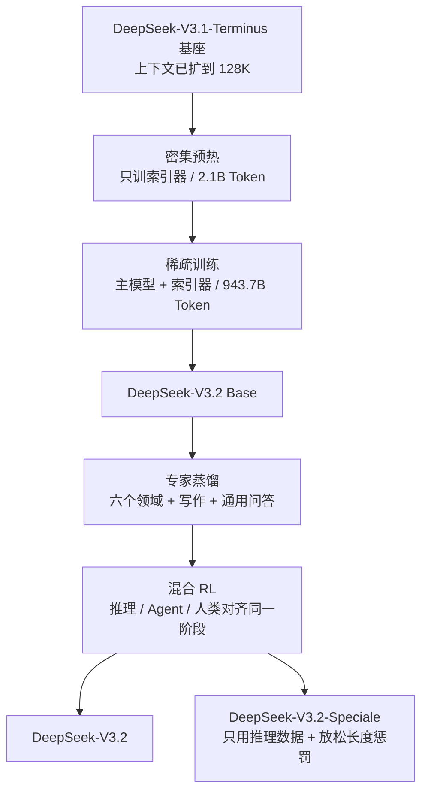
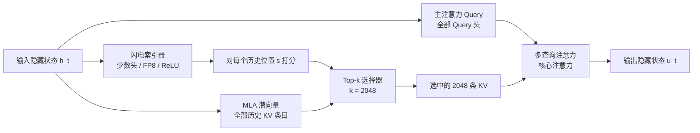
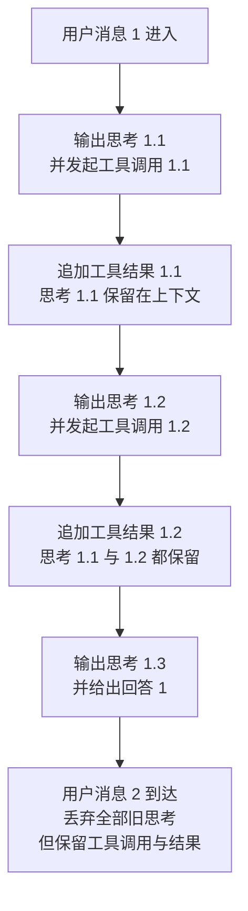
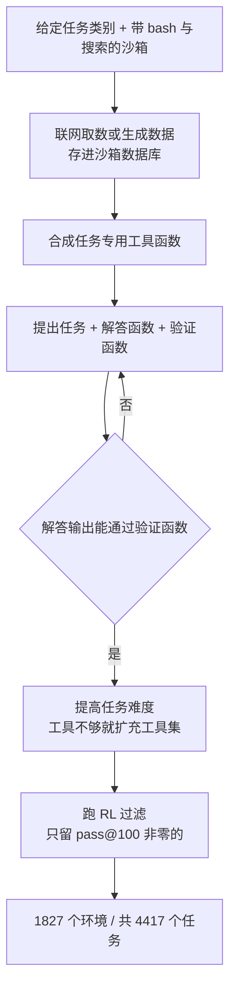

# DeepSeek-V3.2：先让长上下文变便宜，再把省下的预算押到强化学习上

<!-- release-date: 2025-12-01 -->

> 本文依据 DeepSeek-AI 发布的 **DeepSeek-V3.2: Pushing the Frontier of Open Large Language Models**，即 arXiv:2512.02556v1、封面日期 2025-12-02、共 23 页的版本。截至 2026-09-05 核验，arXiv 上仍只有 v1，官方 Hugging Face 仓库 `deepseek-ai/DeepSeek-V3.2` 里的 `assets/paper.pdf` 也是同一篇，本地原件无需更换。下文括号中的 `PDF p. N` 指这份 23 页原文的文件页码。文中会把“报告明确写了什么”“我们如何理解它”和“外部资料补充”分开标注。

## 阅读前的最小地图

这篇报告只有 23 页，但假设读者已经熟悉 DeepSeek 之前几代的设计。先把会反复出现的词说清楚。

- **Token（词元）**：模型读写文本时的基本小块。一个汉字、一个单词或一个标点，都可能对应一个或多个 Token。
- **注意力（Attention）**：当前 Token 决定“该重点参考前文哪些位置”的机制。**全注意力（full attention / vanilla attention）** 指每个 Token 都跟它前面所有 Token 比一遍。
- **KV Cache（Key-Value Cache，键值缓存）**：把读过的历史留成中间结果，生成下一个 Token 时不必重算。
- **Prefill 与 Decode**：把用户输入一次性读进去叫 **prefill（预填充）**；之后一个一个吐字叫 **decode（解码）**。两者的瓶颈不一样，成本要分开算。
- **MLA（Multi-head Latent Attention，多头潜在注意力）**：DeepSeek 从 V2 开始使用的注意力变体，把 KV 压成一个低维潜向量来省缓存。**它的动机、推导和压缩机制见 DeepSeek-V2 篇，本文不重讲**，只讲 V3.2 的稀疏注意力怎样挂在它上面。
- **MoE（Mixture-of-Experts，混合专家）**：每个 Token 只激活一小部分专家参数。**DeepSeekMoE 的专家划分与共享专家见 DeepSeek-V2 篇；无辅助损失负载均衡、MTP、FP8 训练与并行调度见 DeepSeek-V3 篇。** 本报告完全没有重述它们。
- **RL（Reinforcement Learning，强化学习）**：让模型自己生成答案，再按奖励调整策略。生成出来的那条完整答案叫 **rollout（轨迹）**。
- **GRPO（Group Relative Policy Optimization，组相对策略优化）**：DeepSeek 一直在用的 RL 算法。同一道题采样一组答案，用组内平均分当基准来算优劣。

本报告自己新提的名字只有一个：

- **DSA（DeepSeek Sparse Attention，DeepSeek 稀疏注意力）**：先用一个很便宜的打分器扫一遍全部历史，再让昂贵的主注意力只精读得分最高的 2048 个位置。

## 先说矛盾：长上下文里到底是什么在变贵

报告开篇给出的判断是：开源模型落后闭源模型，卡在三件事上——架构上仍然依赖 vanilla attention，导致长序列效率差；后训练阶段投入的算力不够；Agent 场景下的泛化与指令跟随明显落后。（PDF p. 2）

第一条是这篇报告的技术主线。我们把它拆开看。

### 第一笔账：比较次数

全注意力里，位置 $t$ 的 Token 要和它前面每一个 Token 各算一次相关度。把序列长度记作 $L$，整段序列的比较次数大约是：

$$
\text{比较次数} \propto L^2
$$

上下文从 4K 涨到 128K，是 32 倍；但这一项要涨约 1024 倍。

这还只是 prefill。decode 时每吐一个字，都要把整个历史再扫一遍，所以单个 Token 的解码成本会随已有长度线性增长——序列越长，后面每个字越贵。

### 第二笔账：每一次比较有多贵

只看次数还不够。真正决定账单的是“次数 × 每次的单价”。

主注意力的单次比较不便宜：要把 Query 向量和 KV 向量做完整点积，而且模型有很多 Query 头，每个头都要算，还要用较高的数值精度保证 softmax 稳定。

这两笔账合起来，就是 DSA 的切入点：**如果不能同时降低次数和单价，那就把它们拆开处理。**

### 稀疏注意力的老问题：挑选本身也要花钱

“只看一部分历史”这个想法早就有。难点从来不是“要稀疏”，而是三个连着的问题：

1. **选谁？** 位置固定的窗口很便宜，但会漏掉远处的关键信息。
2. **怎么学会选？** 选择是离散动作。一开始选错了，正确位置就收不到梯度，模型也没机会学好。
3. **选的动作本身贵不贵？** 如果为了挑出 2048 个位置，先要做一次和全注意力一样贵的打分，那就白忙了。

报告的答案分别是：用一个学出来的打分器选；用两段式继续训练教它选；把打分器做得极便宜。下面逐条展开。

## 一句话结论

DeepSeek-V3.2 相对上一版 DeepSeek-V3.1-Terminus，**唯一的架构改动就是引入 DSA，并且是通过继续训练加上去的**，不是重新预训练一个模型。（PDF p. 3）

它的完整叙事是三段：

1. **DSA 让长上下文推理变便宜**——主注意力的复杂度从 $O(L^2)$ 降到 $O(Lk)$；
2. **效率被打通之后，后训练才放得开**——报告把 vanilla attention 的低效同时列为“可扩展部署”和“有效后训练”的障碍，而它给出的 RL 算力预算已经超过预训练成本的 10%；（PDF p. 2、13）
3. **这些 RL 算力主要花在 Agent 上**——用一条合成流水线造出 1800 多个环境、85000 条复杂提示词来训练。（PDF p. 2）

如果只记一句话，可以记：

> **不要试图让一个算子同时又准又便宜。让一个粗糙但极便宜的算子决定“看哪里”，让昂贵而精确的算子只处理它选出来的那一小块。**

## 全景：只改了一个地方，却带动了三件事

这是根据 PDF p. 3–6 的正文重画的流程示意图，不是报告原图，也不表示各阶段的实际耗时。

有两点需要先说清楚：

- **报告没有给出模型的参数量、层数、专家数、隐藏维度或词表大小。** 全文 23 页里找不到任何一个结构规模数字。它明确说“架构与 DeepSeek-V3.2-Exp 完全相同”，并把其余细节留给了之前的报告和开源实现。（PDF p. 3）想知道底座长什么样，要看 DeepSeek-V3 篇。
- **最大上下文长度是 128K。**（PDF p. 14）这一代没有做百万级上下文；那是 DeepSeek-V4 的事。

## 核心设计：DeepSeek 稀疏注意力（DSA）

### 两个部件

DSA 的原型只有两个部分：**闪电索引器（lightning indexer）** 和 **细粒度 Token 选择机制（fine-grained token selection mechanism）**。（PDF p. 3）

分工很直白：索引器负责给每个历史位置打分，选择机制负责按分数取 Top-k，主注意力只在选中的那些条目上运行。

这是根据 PDF p. 4 的 Figure 2 重画的机制示意图。原图还画出了 RoPE 施加位置和各路投影的拼接关系；这里只保留数据流的主干，用于说明“谁决定看哪里、谁负责真的看”。

### 闪电索引器：为什么它可以又粗又快

索引器要算的是当前 Query Token $\mathbf h_t$ 与前面某个 Token $\mathbf h_s$ 之间的**索引分数** $I_{t,s}$。分数越高，越可能被选中。公式是：

$$
I_{t,s}=\sum_{j=1}^{H^I} w^I_{t,j}\cdot \operatorname{ReLU}\!\left(\mathbf q^I_{t,j}\cdot \mathbf k^I_s\right)
$$

符号的意思是：（PDF p. 3，式 1）

- $H^I$：索引器的头数；
- $\mathbf q^I_{t,j}$ 和 $w^I_{t,j}$ 都由当前 Token $\mathbf h_t$ 算出来，前者是第 $j$ 个头的查询向量，后者是这个头的权重；
- $\mathbf k^I_s$ 由历史 Token $\mathbf h_s$ 算出来；
- $\operatorname{ReLU}$ 把负数截成 0。

用人话讲：模型派出 $H^I$ 个“小侦察兵”，每个从自己的角度判断第 $s$ 段历史值不值得看；判断为负的直接归零；当前 Token 再决定更相信哪个侦察兵，最后加权求和。

关键是它便宜在哪。报告给了两个理由：**头数很少**，以及**可以用 FP8 实现**；并说明选 ReLU 而不是别的激活函数是“出于吞吐考虑”。（PDF p. 3）

这里必须诚实：**报告没有公开 $H^I$ 的具体数值，也没有公开索引器的向量维度 $d^I$。** 所以我们没办法从报告本身算出它与主注意力的常数比。

我们的理解是这样（以下为解释，不是报告原话）：ReLU 只需要一次比较和一次取值，没有指数运算，数值范围也容易控制，因此更适合放进低精度实现里；而 softmax 需要指数和跨位置归一化，会给低精度带来额外麻烦。索引器的每一次比较，是少数几个低维向量在 FP8 下的点积；主注意力的每一次比较，是所有 Query 头对完整 KV 潜向量的高精度点积。这两者的单价可以差出很多倍。

这也解释了报告的一句关键表述：**索引器的复杂度依然是 $O(L^2)$，但它的计算量远小于 DeepSeek-V3.1-Terminus 中的 MLA。**（PDF p. 5）

这句话值得单独拿出来看，因为它推翻了一个常见直觉。很多人默认“优化就是要把 $O(L^2)$ 消掉”。DSA 并没有消掉，它只是**把平方项挪到了单价最低的算子上**，同时把单价最高的算子降成线性。在实际服务的长度范围内（这份报告是 128K），一个“便宜的平方”加一个“昂贵的线性”，可以比一个“昂贵的平方”划算得多。

### 细粒度 Token 选择：只精读 2048 个位置

有了分数，选择机制就只取分数最高的 $k$ 个 KV 条目，把它们送进主注意力：

$$
\mathbf u_t=\operatorname{Attn}\!\left(\mathbf h_t,\ \left\{\mathbf c_s\ \middle|\ I_{t,s}\in\operatorname{Top-k}(I_{t,:})\right\}\right)
$$

其中 $\mathbf c_s$ 是第 $s$ 个位置的 KV 条目，$\mathbf u_t$ 是注意力输出。（PDF p. 3，式 2）

报告给的取值是 $k=2048$。（PDF p. 4）在 128K 上下文里，这意味着主注意力实际读到的历史，最多只有全部历史的约 1.6%（这个百分比是我们的换算）。

“细粒度”是相对于分块稀疏而言的：选择的单位是单个 Token，不是一整块连续片段。好处是可以精确命中散落在长文各处的孤立证据；代价是选择模式高度不规则，对 Kernel 实现不友好——这就引出下一节。

### 为什么必须挂在 MLA 的 MQA 模式上

报告说得很直接：在 Kernel 层面，**每个 KV 条目必须被多个 Query 共享**，计算才划算；这一点引用了 DeepSeek 自己的 NSA（Native Sparse Attention）工作。因此 V3.2 把 DSA 建立在 MLA 的 **MQA（Multi-Query Attention，多查询注意力）模式**上——一个潜向量被当前 Token 的**所有** Query 头共享。（PDF p. 3）

为什么共享是硬约束？我们的解释是：稀疏注意力的每个 Query Token 都有自己的一份选择列表。如果连每个 Query 头都各选各的，那么从显存里搬上来的一个 KV 条目就只被用一次，搬运的字节数和实际计算量之比会非常糟糕，GPU 大部分时间在等数据。让所有头共用一份选择列表，搬一次就能被所有头复用，搬运成本才摊得开。

报告的附录 A 补了一个相关背景：MLA 有 MHA 和 MQA 两种等价模式，可以互相转换；DeepSeek-V3.1-Terminus 在训练和 prefill 时用 MHA 模式，在 decode 时用 MQA 模式。（PDF p. 20，Figure 7）DSA 则明确建立在 MQA 模式上。

这里有一条很值得带走的系统原则：**稀疏化的收益能不能兑现，取决于数据布局能不能配合。** 算法上少算 98% 的比较，如果换来的是随机访存和极低的算术强度，实际加速可能远不如账面。

### 索引器怎么学会“该选谁”

这是整篇报告最漂亮的一段设计。DSA 不是从零训练出来的，而是**从一个已有的稠密模型继续训练出来的**。起点是 DeepSeek-V3.1-Terminus 的基座 checkpoint，其上下文已经扩到 128K；继续预训练的数据分布与 V3.1-Terminus 做 128K 长上下文扩展时**完全对齐**。（PDF p. 3）

继续预训练分两段。

#### 第一段：密集预热（Dense Warm-up Stage）

这一段保持**稠密注意力**不变，冻结除索引器以外的所有参数，只训索引器。（PDF p. 4）

训练目标是让索引器去模仿真正的注意力。具体做法是：把主注意力所有头的分数按位置求和，再沿序列维做 L1 归一化，得到一个目标分布 $p_{t,:}$，然后让索引器的 Softmax 输出去逼近它：

$$
\mathcal L^I=\sum_t \mathbb D_{\mathrm{KL}}\!\left(p_{t,:}\ \middle\|\ \operatorname{Softmax}(I_{t,:})\right)
$$

（PDF p. 4，式 3）

配置是：学习率 $10^{-3}$，只训 1000 步，每步 16 条 128K 序列，合计 **2.1B Token**。（PDF p. 4）

这一步解决的正是前面说的第二个难题。**稀疏注意力有一个先有鸡还是先有蛋的问题**：主模型要靠索引器找对位置，但索引器一开始不会找；如果一上来就依赖它，关键位置永远收不到梯度。密集预热等于先让一位老图书管理员（稠密注意力）示范一遍“这类问题该去翻哪几本书”，再让新人上岗。

#### 第二段：稀疏训练（Sparse Training Stage）

预热完成后才打开 Top-k 选择，并解冻全部参数。（PDF p. 4）

索引器的对齐目标同步收窄——只在被选中的集合 $\mathcal S_t=\{s\mid I_{t,s}\in\operatorname{Top-k}(I_{t,:})\}$ 上算 KL：

$$
\mathcal L^I=\sum_t \mathbb D_{\mathrm{KL}}\!\left(p_{t,\mathcal S_t}\ \middle\|\ \operatorname{Softmax}(I_{t,\mathcal S_t})\right)
$$

（PDF p. 4，式 4）

配置是：学习率 $7.3\times10^{-6}$，每个 Query Token 选 2048 个 KV，训练 15000 步，每步 480 条 128K 序列，合计 **943.7B Token**。（PDF p. 4）

两段加起来约 946B Token（这是我们的加总）。相对一次完整预训练，这是很小的一笔——**换掉注意力机制并不需要重新训练一个模型，这本身就是这篇报告最有工程价值的结论之一。**

#### 为什么要切断梯度

报告特别强调一句：**索引器的输入从计算图中 detach 出来单独优化。索引器只由 $\mathcal L^I$ 训练，主模型只由语言建模损失训练。**（PDF p. 4）

这条设计我们认为很关键。如果不切断，两个目标会互相污染：主模型为了让语言建模损失下降，可以去改写隐藏状态，间接讨好索引器；索引器也可能被主模型的梯度拉着跑偏。切开之后，各自的职责是清楚的——索引器只负责“像稠密注意力那样排序”，主模型只负责“在给定的稀疏视野下把话说好”。

可迁移的讲法是：**当系统里有一个“选择器”和一个“执行器”时，先想清楚它们各自的监督信号从哪里来，再决定梯度要不要打通。** 打通不一定更好，很多时候只是让两个问题纠缠成一个更难的问题。

### 收益：成本曲线要怎么读

报告用 Figure 3 展示 DeepSeek-V3.1-Terminus 与 DeepSeek-V3.2 的推理成本，分 prefill 和 decode 两张图。（PDF p. 6）

**先说测量口径，这比数字本身更重要**（全部来自 PDF p. 5）：

- 硬件是 **H800 GPU 集群**；
- 价格模型是 **每 GPU 小时 2 美元的租用价**；
- 数据来源是**对实际部署的线上服务做 benchmark 后估算**，不是纯理论 FLOPs；
- 纵轴是 **每百万 Token 的成本**，横轴是 **Token 在序列中的位置**，范围 0–128K；
- **短序列 prefill 使用了一个专门实现的 masked MHA 模式来模拟 DSA**，因为短上下文下它效率更高。

也就是说，这条曲线是**边际成本曲线**：它回答“处理位于第 $L$ 个位置附近的一百万个 Token 要花多少钱”，不是“跑完整个 128K 一共花多少钱”。后者是曲线下的面积。

读图得到的大致数值如下（**以下数字是我们从 Figure 3 读出的估计值，报告正文没有给出这些点的数值表**）：

| 场景 | 位置 | V3.1-Terminus | V3.2 | 大致比值 |
|---|---|---:|---:|---:|
| Prefill | 128K | 约 0.66 美元 | 约 0.19 美元 | 约 3.5× |
| Decode | 128K | 约 2.15 美元 | 约 0.25 美元 | 约 8.5× |

（单位都是“每百万 Token 的成本”。）

三个必须一起讲的细节：

1. **decode 端的收益远大于 prefill 端。** 这符合直觉：prefill 是一次批量的矩阵乘，本来就把硬件喂得比较饱；decode 每次只生成一个 Token，几乎完全被“把多长的历史读一遍”支配，稀疏化直接砍在痛点上。
2. **短上下文里 DSA 不但不省，还略贵。** 两张图里，V3.2 的曲线在很短的位置一度**高于** V3.1-Terminus，prefill 侧的交叉点大约在 1 万 Token 附近，decode 侧更早一些（同样是读图估计）。这说明 DSA 的收益是**长度依赖**的：历史还没有 2048 条的时候，稀疏化没有东西可省，反而要多付索引和选择的开销。
3. **端点比值不等于整段平均。** 128K 处省 8.5 倍，不代表跑完一整段 128K 就省 8.5 倍——曲线在前半段挨得很近，整段平均的节省要小一些。

报告还给出复杂度层面的说法：DSA 把主模型核心注意力的复杂度从 $O(L^2)$ 降到 $O(Lk)$，其中 $k\ll L$。（PDF p. 5）

**外部补充**：官方在 V3.2-Exp 发布时称 API 价格下调 50% 以上（[DeepSeek-V3.2-Exp 发布说明](https://api-docs.deepseek.com/news/news250929/)）。这是定价决策，不是本报告测得的成本比，两者不要混用。

### 代价与边界

报告本身对 DSA 的负面讨论很少，所以这一节需要把“报告写了什么”和“报告没写什么”分得特别清楚。

报告承认或可以直接读出的：

- 索引器仍是 $O(L^2)$，长度继续增长时它最终会重新变成瓶颈；（PDF p. 5）
- 短上下文场景需要一个**额外的 masked MHA 实现**来兜底，也就是说线上其实维护了两条路径；（PDF p. 5）
- 上限长度仍是 128K，报告没有把 DSA 推到更长。（PDF p. 14）

报告没有公开、我们也无法从中核实的：

- 索引器的头数、维度、FP8 的具体量化配置；
- Top-k 选择器本身的开销占比；
- 索引器的**漏召回**情况——2048 个位置选错了会怎样，报告没有做分类型的召回分析；
- 稀疏化在哪些任务上有可测量的损失。报告只给出“没有观察到明显退化”这一层结论（下一节详述）。

诚实的表述应该是：**报告用平价评测支持了“没有明显变差”，但没有提供细粒度的失败分析。**

### 可迁移启发

1. **把复杂度和单价分开优化。** 消不掉平方项时，先问能不能把平方项换成最便宜的算子。检索、排序、召回、路由都适用这一招。
2. **给离散选择器配一个可模仿的老师。** 密集预热用稠密注意力的分布当监督信号，绕开了“选错就学不会”的死循环。任何需要训练 Top-k、路由或剪枝策略的系统都可以借鉴：先跑一遍昂贵的完整版本，把它的行为蒸馏给便宜的选择器。
3. **选择器和执行器的梯度可以切开。** 各自有清晰的损失，往往比打通端到端更稳。
4. **架构改造可以用“继续训练”交付。** 不到 1T Token 就把一个成熟基座的注意力换掉，这对预算有限的团队意义很大。
5. **稀疏化的收益有一个长度门槛。** 上线前先量出交叉点在哪，短请求可能需要一条完全不同的路径。

## 平价验证：凭什么说“换了注意力但没变差”

这一节值得单独讲，因为它的证据形态很特别。

报告的 2.2 节叫 Parity Evaluation（平价评测），给了三类证据：（PDF p. 5）

1. **标准 benchmark**：2025 年 9 月对 DeepSeek-V3.2-Exp 做了一整套评测，与 DeepSeek-V3.1-Terminus 表现相近，短上下文和长上下文任务上都没有观察到明显退化。
2. **人类偏好的间接代理**：用 ChatbotArena 的 Elo 分作为间接框架，两个模型使用**完全相同的后训练策略**，2025 年 11 月 10 日取得的 Elo 分非常接近。
3. **第三方长上下文评测**：V3.2-Exp 发布后有多个独立评测使用了它没见过的测试集。其中 AA-LCR 上，V3.2-Exp 在推理模式下比 V3.1-Terminus **高 4 分**；Fiction.liveBench 上在多个指标上持续优于 V3.1-Terminus。

有三点必须点出来：

- **本报告的 2.2 节没有给出任何 benchmark 数据表。** 它只写了结论和证据来源。想看具体分数，要去 V3.2-Exp 的报告或第三方榜单。
- **平价评测的对象是 V3.2-Exp，不是最终的 V3.2。** 这在逻辑上是成立的——报告明确说 V3.2 与 V3.2-Exp 架构完全相同（PDF p. 3），而且两者的后训练策略在这次对比中被控制成一致——但读的时候要清楚这一层传递关系。
- 第二条证据的设计其实很讲究：**让新旧模型共用同一套后训练策略，再去比 Elo**，这样差异才更可能来自基座本身。这是一个可以直接借走的对照实验设计思路。

## 后训练：先养专家，再合成一个模型

继续预训练之后是后训练。V3.2 沿用 V3.2-Exp 的后训练流水线，分两步：**专家蒸馏（Specialist Distillation）** 和 **混合 RL 训练（Mixed RL Training）**。（PDF p. 5）

### 专家蒸馏

每个任务先做一个**只服务这个领域**的专门模型，全部从同一个 V3.2 预训练基座 checkpoint 微调而来。除了写作和通用问答，报告列出六个专门领域：数学、编程、通用逻辑推理、通用 Agent 任务、Agent 编码、Agent 搜索——**每个领域都同时支持思考模式和非思考模式**。（PDF p. 5）

每个专家都用大规模 RL 训练。长思维链（thinking 模式）和直接回答（non-thinking 模式）的训练数据由**不同的模型**生成。专家准备好之后，用它们产出各领域数据，喂给最终 checkpoint。（PDF p. 5）

报告给的实验结论是：用蒸馏数据训练出来的模型，只比领域专家**略低**，而这点差距在后续 RL 训练中被有效抹平。（PDF p. 5）

### 混合 RL 训练

这一步的选择很明确：**把推理、Agent 和人类对齐合并进同一个 RL 阶段**，而不是分成多个阶段依次训练。理由是分阶段训练容易出现灾难性遗忘（catastrophic forgetting）——学完新领域，旧领域的能力掉下去。（PDF p. 6）

奖励怎么给：

- **推理和 Agent 任务**：基于规则的结果奖励，加上长度惩罚和语言一致性奖励；
- **通用任务**：生成式奖励模型（generative reward model），而且**每条提示词有自己的评分细则（rubrics）**。（PDF p. 6）

最后产出两个模型：（PDF p. 6）

- **DeepSeek-V3.2**：整合各专家蒸馏来的推理、Agent 和人类对齐数据，再做数千步继续 RL；
- **DeepSeek-V3.2-Speciale**：实验性变体，**只用推理数据**训练，RL 时**放松长度惩罚**，并引入 DeepSeekMath-V2 的数据集和奖励方法来增强数学证明能力。

值得注意的是它和下一代的差别：V4 放弃了这里的 mixed RL，改成“先分领域练专家，再用在线策略蒸馏合并”。相关设计见 DeepSeek-V4 篇。

## 把 GRPO 放大：四个补丁其实在治同一个病

报告说，它想强调的是“怎样造出一个能稳定放大 RL 算力的配方”。（PDF p. 6）这一节是全文第二重要的部分。

先回顾 GRPO 的目标函数。对每个问题 $q$，从旧策略 $\pi_{\text{old}}$ 采样一组答案 $\{o_1,\dots,o_G\}$，然后最大化：

$$
\mathcal J_{\text{GRPO}}(\theta)=\mathbb E\left[\frac{1}{G}\sum_{i=1}^{G}\frac{1}{|o_i|}\sum_{t=1}^{|o_i|}\min\!\left(r_{i,t}(\theta)\hat A_{i,t},\ \operatorname{clip}(r_{i,t}(\theta),1-\varepsilon,1+\varepsilon)\hat A_{i,t}\right)-\beta \mathbb D_{\mathrm{KL}}\right]
$$

其中重要性采样比是：

$$
r_{i,t}(\theta)=\frac{\pi_\theta(o_{i,t}\mid q,o_{i,<t})}{\pi_{\text{old}}(o_{i,t}\mid q,o_{i,<t})}
$$

优势值由组内奖励减去组平均得到：$\hat A_{i,t}=R_i-\operatorname{mean}(\boldsymbol R)$。$\varepsilon$ 控制裁剪范围，$\beta$ 控制 KL 惩罚强度。（PDF p. 7，式 5–6）

在这个骨架上，报告加了四个补丁。

### 补丁一：无偏 KL 估计

问题出在 KL 惩罚项的估计方式上。常用的 K3 估计器在某些情况下会失控——报告指出，当采样到的 Token 在当前策略下的概率**远低于**参考策略时（$\pi_\theta\ll\pi_{\text{ref}}$），K3 的梯度会给这些 Token 分配**不成比例的、无界的**权重，硬要把它们的似然拉高，结果是噪声很大的梯度更新，累积起来会损害后续采样质量、破坏训练稳定。（PDF p. 7）

修正的办法是用重要性采样比把估计纠偏：

$$
\mathbb D_{\mathrm{KL}}\big(\pi_\theta(o_{i,t})\,\|\,\pi_{\text{ref}}(o_{i,t})\big)=\frac{\pi_\theta}{\pi_{\text{old}}}\left(\frac{\pi_{\text{ref}}}{\pi_\theta}-\log\frac{\pi_{\text{ref}}}{\pi_\theta}-1\right)
$$

式中的三个 $\pi$ 都是在同一个位置 $o_{i,t}$、同一段前缀 $q,o_{i,<t}$ 上取的概率。前面那个因子 $\pi_\theta/\pi_{\text{old}}$ 就是纠偏项：样本是从 $\pi_{\text{old}}$ 采的，要用它换算回当前策略下的期望。（PDF p. 7，式 7）

报告还补了一条经验：**不同领域适合的 KL 强度不一样。数学这类领域用很弱的 KL 惩罚、甚至完全不用，效果反而更好。**（PDF p. 7）

### 补丁二：Off-Policy 序列屏蔽

RL 系统为了效率，通常一次生成一大批 rollout，再切成多个 mini-batch 做多步梯度更新。第二步之后，数据就不再是当前策略产生的了——这叫 **off-policy（离策略）**。更麻烦的是，生成用的推理框架和训练框架是两套高度优化过的实现，细节可能对不上，会进一步放大离策略程度。（PDF p. 7–8）

做法是给 GRPO 损失加一个二值掩码 $M$。先定义一个中间量：序列 $o_i$ 的平均对数概率比

$$
D_i=\frac{1}{|o_i|}\sum_{t=1}^{|o_i|}\log\frac{\pi_{\text{old}}(o_{i,t}\mid q,o_{i,<t})}{\pi_\theta(o_{i,t}\mid q,o_{i,<t})}
$$

$D_i$ 越大，说明这条轨迹在当前策略下越“不像自己会写出来的东西”，也就是偏离越远。掩码就按它来定：

$$
M_{i,t}=
\begin{cases}
0, & \hat A_{i,t}<0 \ \text{且}\ D_i>\delta \\
1, & \text{其他情况}
\end{cases}
$$

$\delta$ 是控制策略偏离阈值的超参数。（PDF p. 8，式 8–9）

翻译成人话：**只屏蔽那些“优势为负”且“已经偏离太远”的序列。**

两个细节值得留意：

- 这里的 $\pi_{\text{old}}$ 指**推理框架直接返回的采样概率**，所以这个 KL 同时吃掉了“多步更新”和“训推实现不一致”两种偏离。（PDF p. 8）
- **只屏蔽负优势样本。** 报告给的直觉是：模型最能从自己的错误里学到东西，但“离得非常远的负样本”可能只会误导优化。（PDF p. 8）

报告对效果的表述很克制：“在某些原本会不稳定的训练场景中，我们经验性地观察到稳定性提升。”（PDF p. 8）没有给出消融表。

### 补丁三：Keep Routing

MoE 模型每个 Token 只激活部分专家。但推理框架和训练框架的差异，加上策略更新，会导致**同样的输入在推理时和训练时被路由到不同的专家**。这会让被优化的参数子空间突然跳变，既破坏优化，又加重离策略问题。（PDF p. 8）

解法很朴素：**把采样时用的专家路由路径保存下来，训练时强制走同一条路径**，保证优化的是同一批专家参数。（PDF p. 8）

报告说这一步对 MoE 的 RL 训练稳定性**至关重要**，并且从 DeepSeek-V3-0324 起就已经在用了。（PDF p. 8）

### 补丁四：Keep Sampling Mask

Top-p 和 top-k 采样会截断掉极低概率的 Token。这在 RL 里是好事——不会拿一个几乎不可能的 Token 当优化目标。但截断会造成 $\pi_{\text{old}}$ 和 $\pi_\theta$ 的**动作空间不一致**，违反重要性采样的前提。（PDF p. 8）

解法同样朴素：**把采样时的截断掩码保存下来，训练时施加到 $\pi_\theta$ 上**，让两个策略共享同一个动作子空间。（PDF p. 8）

报告的经验结论是：top-p 采样配合 Keep Sampling Mask，能有效保住 RL 训练中的语言一致性。（PDF p. 8）

### 把四条串起来

这是我们读这一节最大的收获。四个补丁看起来各管各的，实际上前三条加上第四条都在治同一个病：

> **rollout 是一个程序生成的，梯度是另一个程序算的，而 GRPO 的数学假设它们是同一个。**

- Keep Routing 对齐**激活了哪些参数**；
- Keep Sampling Mask 对齐**动作空间**；
- Off-Policy 屏蔽处理**对不齐时的兜底**；
- 无偏 KL 修正**正则项本身的估计偏差**。

可迁移的原则是：**当训练和推理由两套实现承担时，先列出“哪些量必须逐位一致”，再决定是对齐它、还是在损失里显式补偿它。** 沉默地忽略这个差距，代价通常在放大算力之后才爆发——因为算力越大，偏离积累得越快。

顺带一个诚实的判断：**这四条都是经验性的。** 报告用的词是“经验性观察到”“被发现至关重要”，没有给出单独隔离每一条的消融实验，也没有给 $\varepsilon$、$\beta$、$\delta$、$G$ 的取值。所以我们可以相信这个配方在 DeepSeek 的系统里有效，但不能量化每一条各自贡献了多少。

## 让“思考”进入工具调用

### 上下文管理规则

DeepSeek-R1 证明了“先思考再回答”能显著提升复杂问题的表现。V3.2 想把这个能力带进工具调用场景。（PDF p. 9）

但直接照搬 R1 的策略会出问题。R1 的做法是**第二轮消息一到就丢掉推理内容**。在工具调用场景里，这意味着每调用一次工具，模型都要把整个问题重新想一遍——Token 效率极差。（PDF p. 9）

V3.2 的规则改成两条：（PDF p. 9）

- **只有新的用户消息进来时，才丢弃历史推理内容。** 如果追加的只是工具相关消息（比如工具输出），推理内容全程保留。
- **推理痕迹被移除时，工具调用及其结果仍然保留在上下文里。**

这是根据 PDF p. 9 的 Figure 4 重画的机制示意图，不含任何时间或性能数据。

报告顺手给了一条很实用的部署提醒：**Roo Code、Terminus 这类 Agent 框架是用 user message 来模拟工具交互的**，因此不会触发上面的保留规则，也就享受不到推理持久化的好处；对这类架构，官方建议改用非思考模型。（PDF p. 9）

这个细节的价值超出本模型：**消息角色不只是格式约定，它会直接改变模型的上下文管理语义。** 如果你的 Agent 框架把工具结果塞进 user 角色，可能在毫不知情的情况下关掉了模型的一项能力。这一条在 V4 里被进一步扩展（见 DeepSeek-V4 篇）。

### 冷启动：先用提示词把两种能力拼在一起

手头有两类数据：非 Agent 的推理数据，和不带推理的 Agent 数据。怎么把它们缝成一种能力？

报告的判断是：模型已经有足够的指令跟随能力，所以直接用**精心设计的系统提示词**就能把工具执行嵌进推理过程。（PDF p. 9）

附录给了三个模板（PDF p. 21，Table 6–8）：

- **Table 6**：推理数据的系统提示词，要求先推理再给答案，推理过程放在 `<think></think>` 标签里；
- **Table 7**：不带推理的 Agent 数据提示词，系统提示词里包含工具描述和工具调用格式；
- **Table 8**：关键的一个——要求模型**在 `<think></think>` 内部**多次调用 Python 工具，最多 20 次代码执行，并明确要求“尽量用代码执行代替语言推理”“最终解答里不要再调工具”。

报告对这一步的评价相当诚实：**这种“推理中带工具调用”的模式还不够稳健，模型只是偶尔能生成想要的轨迹**——但这就够了，因为它给后续的 RL 提供了起点。（PDF p. 10）

这是冷启动的正确心态：**冷启动不需要做对，只需要做出来过。** 只要正确轨迹的概率不是零，RL 就有东西可以放大。

## 大规模 Agent 任务合成：难做，但好验

报告的第三个主张是一条 Agent 任务合成流水线。理由是：RL 任务的多样性对模型鲁棒性至关重要。（PDF p. 10）

### 四类任务

| 任务类型 | 任务数 | 环境 | 提示词来源 |
|---|---:|---|---|
| 代码 Agent | 24667 | 真实 | 抽取 |
| 搜索 Agent | 50275 | 真实 | 合成 |
| 通用 Agent | 4417 | 合成 | 合成 |
| 代码解释器 | 5908 | 真实 | 抽取 |

（PDF p. 10，Table 1）

报告特意声明：搜索、代码工程、代码解释这些任务用的是**真实工具**——真实的 web 搜索 API、编码工具、Jupyter Notebook；但提示词是从互联网抽取或合成的，**不是来自真实用户交互**。（PDF p. 10）这个区分很重要，说明这些成绩不建立在用户数据上。

### 搜索 Agent：先造题，再证明所有干扰项都错

流水线是一条多 Agent 管线，全部基于 DeepSeek-V3.2 自己：（PDF p. 10）

1. 从大规模网页语料里采样跨领域的、信息量大的**长尾实体**；
2. 一个“出题 Agent”用搜索工具按可配置的深度和广度去探索这个实体，把发现的信息整合成问答对；
3. 多个“答题 Agent”用**不同配置**（不同 checkpoint、不同系统提示词等）为同一个问答对生成多样候选答案；
4. 一个带搜索能力的“验证 Agent”做多轮验证，**只保留那些“标准答案正确、且所有候选答案都可验证为错误”的样本**。

第 4 步是全条流水线的灵魂。它不是在筛“难题”，而是在筛**模型现在确实做不对、但答案又确实可判定的题**。太简单的题被剔除（候选里有人做对了），答案模糊的题也被剔除（无法判定候选是错的）。

此外还混入了从已有 helpful RL 数据集里筛出的、搜索工具确实能带来收益的样本，并用多维度评分细则加生成式奖励模型来打分，让优化同时覆盖事实可靠性和实际有用性。（PDF p. 10）

### 代码 Agent：环境合格的判据是两个测试计数

做法是从 GitHub 挖出**数百万对 issue–Pull Request**，用启发式规则和大模型判断做严格过滤，要求每条数据都包含合理的 issue 描述、对应的 gold patch 和用于验证的 test patch。（PDF p. 11）

然后由一个 V3.2 驱动的**环境搭建 Agent** 自动完成装包、解依赖、跑测试，测试结果统一输出成 JUnit 格式，保证跨语言跨框架都能一致解析。（PDF p. 11）

一个环境算搭建成功的判据非常干脆：**打上 gold patch 后，F2P（fail-to-pass）测试数非零**（说明问题确实被修好了）**且 P2F（pass-to-fail）测试数为零**（说明没有引入回归）。（PDF p. 11）

最终建成数万个可复现的 issue 修复环境，覆盖 Python、Java、JavaScript、TypeScript、C、C++、Go、PHP。（PDF p. 11）

这个判据值得记住：**它把“这个训练样本有效吗”这个模糊问题，变成了两个可以自动数出来的整数。** 任何想大规模造 RL 环境的团队，第一件事都该是找到这样一对计数。

### 通用 Agent：让 Agent 自己造环境、造工具、造验题器

这是最激进的一段。报告用一个自动环境合成 Agent 合成了 **1827 个面向任务的环境**，设计原则一句话：**难以求解，但易于验证。**（PDF p. 11）

这是根据 PDF p. 11 的正文重画的流程示意图，报告没有对应的原图。

有两个约束设计得很聪明：（PDF p. 11）

- **解答函数只能调用工具函数或做逻辑计算，不能调用其他函数、也不能直接访问数据库。** 这保证了任务只能通过工具接口解决——否则合成出来的题可能有捷径，训练时学到的就不是工具使用能力。
- **解答函数的输出必须能被验证函数接受**，否则 Agent 就得反复修改解答或验证函数，直到自洽。

最后再用一次 RL 过滤：只保留 pass@100 非零的实例，得到 1827 个环境、共 4417 个任务。（PDF p. 11）这一步排掉了“连试 100 次都做不出来”的题——那种题在 RL 里只会贡献全零奖励，没有梯度信号。

报告给了一个合成任务示例：一个三天行程规划题，有不重复城市/酒店/景点/餐厅、地点必须在当天所在城市、以及按酒店价位分档的多重预算约束。配套 15 个工具函数。（PDF p. 12）报告点出了它的本质：**在巨大组合空间里搜出满足全部约束的方案很难，但检查一个给定方案是否满足全部约束很容易。**（PDF p. 11）

这就是“难做、易验”的具体形态，也是这条流水线最值得迁移的部分：**如果你能写出验证函数，你就能造出无限多的 RL 题。** 反过来，写不出验证函数的任务，用 RL 去攻本来就是高风险的。

## 实验：哪些结论有证据，哪些要打问号

### 主表怎么读

评测配置：温度设为 1.0，上下文窗口 128K；工具使用类 benchmark 用标准函数调用格式，模型配置为思考模式；MCP-Universe 和 MCP-Mark 用的是 DeepSeek **内部环境**，因为官方设置里的搜索和 playwright 环境可能略有不同。（PDF p. 13）

Table 2 的部分代表结果（DeepSeek-V3.2 均为 Thinking 模式）：（PDF p. 13）

| Benchmark | Claude-4.5-Sonnet | GPT-5 High | Gemini-3.0 Pro | Kimi-K2 Thinking | DeepSeek-V3.2 |
|---|---:|---:|---:|---:|---:|
| MMLU-Pro | 88.2 | 87.5 | 90.1 | 84.6 | 85.0 |
| GPQA Diamond | 83.4 | 85.7 | 91.9 | 84.5 | 82.4 |
| HLE | 13.7 | 26.3 | 37.7 | 23.9 | 25.1 |
| LiveCodeBench | 64.0 | 84.5 | 90.7 | 82.6 | 83.3 |
| AIME 2025 | 87.0 | 94.6 | 95.0 | 94.5 | 93.1 |
| Terminal Bench 2.0 | 42.8 | 35.2 | 54.2 | 35.7 | 46.4 |
| SWE Verified | 77.2 | 74.9 | 76.2 | 71.3 | 73.1 |
| SWE Multilingual | 68.0 | 55.3 | — | 61.1 | 70.2 |
| $\tau^2$-Bench | 84.7 | 80.2 | 85.4 | 74.3 | 80.3 |
| Tool-Decathlon | 38.6 | 29.0 | 36.4 | 17.6 | 35.2 |

报告自己的总结是：推理任务上与 GPT-5-high 相近，略逊于 Gemini-3.0-Pro；相比 K2-Thinking，用**明显更少的输出 Token** 拿到可比分数。（PDF p. 13）

它把这些提升归因于 RL 训练投入的算力增加，并说这几个月里持续观察到“RL 预算越大、表现越好”的相关性，目前预算已超过预训练成本的 10%；同时推测再加算力还能更强。（PDF p. 13）

**这是相关性观察，不是受控实验。** 报告没有给出“同样的模型，只改 RL 预算”的曲线。可以相信这是团队的真实经验，但不能当成已被证明的 scaling law。

### 分数强烈依赖 harness

这份报告在这一点上非常坦率，值得逐条抄下来：

- 连提示词模板都会动分数：HLE 用报告自己的模板得 25.1，改用官方模板得 **23.9**。（PDF p. 13）
- **Terminal Bench 2.0 的 46.4 是用 Claude Code 框架跑出来的**，因为思考模式的上下文管理策略与 Terminus 不兼容；用 Terminus 跑非思考模式得 39.3。（PDF p. 14）
- **SWE-bench Verified 的主分来自内部框架**；换成 Claude Code、RooCode 以及非思考模式做鲁棒性测试，结果在 72–74 之间。（PDF p. 14）
- **BrowseComp 有两个分数：51.4 和 67.6。** 差别在于是否使用上下文管理。原因是搜索评测里超过 20% 的用例会突破 128K 上限。（PDF p. 14）
- **$\tau^2$-bench 用模型自己当 user agent**，分类别得分是 Airline 63.8、Retail 81.1、Telecom 96.2。（PDF p. 14）
- **MCP 类 benchmark 里，V3.2 经常做冗余的自我验证**，轨迹过长，特别是 MCP-Mark 的 GitHub 和 Playwright 任务里会撞上 128K 上限，直接拖累最终成绩。（PDF p. 14）

最后一条是真正的自曝其短：**它的一部分 Agent 失分不是因为不会做，而是因为话太多把上下文撑爆了。**

对读者的含义很直接：**跨模型比较 Agent 分数之前，先确认 harness、工具定义、上下文策略和步数上限是否一致。** 同一个模型在 BrowseComp 上，只因为换了上下文管理策略就差出 16 分以上。

报告也提了一个正面的、方法上站得住的结论：这些 benchmark 的环境和工具集**在 RL 训练中没有出现过**，所以提升说明模型确实把推理策略泛化到了域外 Agent 场景。（PDF p. 14）

附录 C 还给了非思考模式的对照：Terminal Bench 2.0 37.1 对 46.4、SWE Verified 72.1 对 73.1、$\tau^2$-bench 77.2 对 80.3、MCP-Mark 26.5 对 38.0、Tool-Decathlon 25.6 对 35.2。（PDF p. 22，Table 9）思考模式全面更好，但差距在纯代码修复类任务上很小（SWE Verified 只差 1.0），在工具编排类任务上很大（MCP-Mark 差 11.5）。这个分布本身就有信息量。

### Speciale：更多 Token 换来的竞赛金牌

Table 3 同时给出准确率和输出 Token 数，这是这份报告里最有价值的一张表，因为它把“成绩”和“代价”放在了同一个格子里：（PDF p. 15）

| Benchmark | GPT-5 High | Gemini-3.0 Pro | V3.2-Thinking | V3.2-Speciale |
|---|---|---|---|---|
| AIME 2025 | 94.6 (13k) | 95.0 (15k) | 93.1 (16k) | 96.0 (23k) |
| HMMT Feb 2025 | 88.3 (16k) | 97.5 (16k) | 92.5 (19k) | 99.2 (27k) |
| LiveCodeBench | 84.5 (13k) | 90.7 (13k) | 83.3 (16k) | 88.7 (27k) |
| Codeforces | 2537 (29k) | 2708 (22k) | 2386 (42k) | 2701 (77k) |
| GPQA Diamond | 85.7 (8k) | 91.9 (8k) | 82.4 (7k) | 85.7 (16k) |
| HLE | 26.3 (15k) | 37.7 (15k) | 25.1 (21k) | 30.6 (35k) |

Codeforces 那一行最能说明问题：Speciale 拿到 2701，几乎追平 Gemini-3.0-Pro 的 2708，但**用了 77k Token，对方只用 22k**，是 3.5 倍。

报告自己也这么说：**Speciale 的 Token 效率显著劣于 Gemini-3.0-Pro**；正是为了控制部署成本和延迟，正式版 V3.2 在训练时施加了更严格的 Token 约束，是一次性能与成本的权衡。（PDF p. 14）

竞赛成绩（PDF p. 15，Table 4）：IMO 2025 得 35/42 金牌，CMO 2025 得 102/126 金牌，IOI 2025 得 492/600 金牌，ICPC World Final 2025 解出 10/12 金牌；ICPC WF 排名第 2，IOI 排名第 10。

**但这些成绩的取得方式必须一起看**（PDF p. 22，附录 D）：

- 所有竞赛的最大生成长度都是 128K，**不用工具、不联网**，严格遵守比赛的时间和提交次数限制；
- **IOI**：官方规则允许每题最多 50 次提交。做法是每题先采样 **500 个候选解**，然后多级过滤——去掉过不了样例或超长的，用 V3.2-Exp 识别并剔除模型明说自己不会做的，最后从剩下的候选里**挑思考轨迹最长的 50 个**提交；
- **ICPC**：同样方法，每题采样 32 个候选；
- **IMO / CMO**：用“生成—验证—改进”循环，反复改到自评满分或达到修改上限。

所以正确的说法是：**这是一个包含大量并行采样和过滤的系统成绩，不等于单次裸模型的 Pass@1。** 尤其“挑思考轨迹最长的 50 个”这条启发式，本身就是一次相当强的 test-time 计算扩展。

### 合成数据到底有没有用

这是报告里做得最像消融实验的一段，回答两个问题：合成任务够不够难？能不能泛化？（PDF p. 15）

**够不够难**：从通用合成 Agent 任务里随机抽 50 条，让合成用的模型和前沿闭源模型都做一遍。（PDF p. 16，Table 5）

| Pass@K | V3.2-Exp | Sonnet-4.5 | Gemini-3.0 Pro | GPT-5-Thinking |
|---:|---:|---:|---:|---:|
| 1 | 12% | 34% | 51% | 62% |
| 2 | 18% | 47% | 65% | 75% |
| 4 | 26% | 62% | 74% | 82% |

结论是这批合成任务对**造它的模型和前沿闭源模型都构成挑战**。这一点很关键：由模型自己合成的任务，最容易犯的错就是难度天花板等于合成者的水平。这张表说明这里没有出现那种坍缩。

**能不能泛化**：从 V3.2 的 SFT checkpoint 出发，**只用合成通用 Agent 数据、只在非思考模式下**做 RL，以排除长思维链和其他 RL 数据的影响。对照组是 V3.2-SFT 和 V3.2-Exp，后者只在搜索和代码环境里做过 RL。（PDF p. 15）

Figure 5 用九张子图（$\tau^2$-bench 的 Airline / Retail / Telecom / Overall，MCP-Mark 的 Filesystem / PostgreSQL，MCP-Universe 的 Financial-Analysis / Location-Navigation / 3D-Designing）展示了训练曲线，横轴到约 2000 步。图例里蓝色实线是“只用合成数据做 RL”的模型，绿色虚线是 V3.2-SFT，黑色虚线是 V3.2-Exp。（PDF p. 16）

我们逐图看下来的观察是：蓝线的起点在不同子图上或与虚线基线接近、或已经高于基线，随训练步数持续上升，**九张图的终值都明显高于两条虚线**；两条虚线本身是水平的，因为它们是固定 checkpoint 的分数。报告的表述是：**只用合成数据做大规模 RL，在这三类 benchmark 上都比 V3.2-SFT 有实质提升；而把 RL 限制在代码和搜索场景则不会带来这些提升。**（PDF p. 15–16）

这个实验的设计值得学：**它同时控制了模式（非思考）、数据（只有合成通用 Agent）和评测（三类模型没见过的 Agent benchmark）**，所以结论比一般的“加了数据分数涨了”更可信。

要保留的边界是：曲线上的具体数值报告没有列表，Figure 5 的纵轴刻度也各不相同；而且这是从 SFT checkpoint 出发的对照，不能直接推广到“在完整 RL 配方里再加合成数据能涨多少”。

### 上下文管理是一条独立的 test-time 扩展轴

即使有 128K 窗口，搜索类 Agent 仍会撞到长度上限，推理过程被提前截断。V3.2 的做法是：**当 Token 使用量超过上下文窗口长度的 80% 时**触发上下文管理。（PDF p. 16）

四种策略：（PDF p. 16）

| 策略 | 做法 |
|---|---|
| Summary | 把溢出的轨迹总结一遍，然后重新发起 rollout |
| Discard-75% | 丢掉轨迹里最前面 75% 的工具调用历史 |
| Discard-all | 丢掉全部之前的工具调用历史，重置上下文 |
| Parallel-fewest-step | 并行扩展基线：采样 N 条独立轨迹，选步数最少的那条 |

在 BrowseComp 上的结果（PDF p. 17，Figure 6）：

- **Summary** 把平均步数拉到 364，最高做到 60.2，但整体效率相对较低；
- **Discard-all** 虽然最简单，效率和可扩展性都不错，做到 **67.6**，与并行扩展相当，但用的步数明显更少。

报告的总结是：test-time compute 既可以**串行**扩展（上下文管理），也可以**并行**扩展，两者都能扩大模型的解题能力；但不同策略的效率和可扩展性差别很大，因此**benchmark 模型时必须把实际计算成本一起算进去**；找到串行与并行的最优组合仍是未来工作。（PDF p. 17）

我们觉得最反直觉、也最值得记住的是：**最笨的策略赢了。** Discard-all 什么都不总结，直接清空工具历史，效果反而好过认真做总结的 Summary。我们的理解是，总结这一步本身要消耗 Token、引入信息损失，还可能把错误的中间结论固化下来；而 Discard-all 保留了原始问题和已经写进模型“记忆”里的进展，把搜索重新变回一个干净的起点。报告没有给出这个原因，这只是我们的推测。

## 报告没有公开的部分

这是一篇 23 页的报告，它的克制是刻意的。以下内容在文中找不到：

- **模型规模的一切**：参数量、激活参数量、层数、专家数、隐藏维度、词表大小，全都没有。报告只说架构与 V3.2-Exp 相同。（PDF p. 3）
- **索引器的结构细节**：头数 $H^I$、维度 $d^I$、FP8 量化配置、Top-k 选择器的开销。
- **继续预训练的成本**：GPU 数量、训练时长、总算力。只给了 Token 数和步数。
- **数据细节**：只说“与 V3.1-Terminus 的 128K 长上下文扩展数据完全对齐”，没有配比、过滤器、去重和污染检查。（PDF p. 3）
- **DSA 的消融**：没有“换成别的稀疏方案会怎样”“$k$ 取别的值会怎样”“不做密集预热会怎样”的对照。
- **RL 超参数**：$\varepsilon$、$\beta$、$\delta$、组大小 $G$、各领域的 KL 强度、长度惩罚的形式，全部未公开。
- **四个 RL 稳定性补丁各自的贡献**：只有经验性描述，没有隔离消融。
- **专家蒸馏的规模**：六个领域各用了多少数据、各自的 reward 怎么设计，没有说。
- **长度约束奖励模型**：报告提到正式版 V3.2 的成绩受它限制（PDF p. 13），但没说它长什么样。
- **生成式奖励模型的防作弊机制**：rubric 怎么生成、怎么防 reward hacking，没有说明。

报告自己在结论里承认的三条限制是：（PDF p. 17–18）

1. **总训练 FLOPs 更少，世界知识的广度仍落后于领先闭源模型**，计划靠扩大预训练算力来补；
2. **Token 效率仍是挑战**——要达到 Gemini-3.0-Pro 那样的输出质量，通常需要更长的生成轨迹；
3. **复杂任务的求解能力仍不及前沿模型。**

第一条尤其值得注意：它把差距归因于**预训练算力**，而不是后训练方法。这与全文“加大后训练投入”的主线形成一个诚实的对照——后训练能补很多，但补不了知识广度。

## 最值得带走的六条

### 1. 复杂度和单价要分开优化

DSA 没有消掉 $O(L^2)$，它把平方项换到了最便宜的算子上（少头、FP8、ReLU），同时把最贵的算子降成 $O(Lk)$。（PDF p. 3、5）遇到“这个复杂度降不下去”时，先问一句：能不能让它变得极其便宜？

### 2. 离散选择器要有一个可模仿的老师

密集预热阶段冻结全模型、只训索引器，用稠密注意力自己的分布当监督目标。（PDF p. 4）任何要训练 Top-k、路由或剪枝的系统都能借这一招：先跑一遍昂贵的完整版本，把行为蒸馏给便宜的选择器，再让选择器独立上岗。

### 3. 选择器和执行器的梯度可以切开

索引器只由 $\mathcal L^I$ 训练，主模型只由语言建模损失训练。（PDF p. 4）两个目标各自清晰，好过纠缠成一个更难优化的问题。

### 4. 训练与推理不是同一个程序，这件事要显式处理

Keep Routing 对齐激活的参数，Keep Sampling Mask 对齐动作空间，Off-Policy 屏蔽兜底，无偏 KL 修正正则项。（PDF p. 7–8）算力放得越大，这个裂缝造成的偏差积累得越快。

### 5. 造 RL 数据的第一步是写验证函数

代码 Agent 用 F2P 非零、P2F 为零两个整数判断环境是否合格；通用 Agent 要求解答函数的输出必须被验证函数接受，最后再用 pass@100 非零过滤。（PDF p. 11）**“难做、易验”不是口号，它决定了哪些任务适合用 RL 去攻。**

### 6. 上下文管理是一条要单独评估的扩展轴

同一个模型在 BrowseComp 上，51.4 和 67.6 的差别只来自上下文管理策略。（PDF p. 14、17）比较模型之前，先把这条轴对齐；优化产品时，也别忘了它可能比换模型更划算。

## 关键词回看

- **DSA（DeepSeek Sparse Attention）**：闪电索引器打分 + 细粒度 Top-k 选择 + 主注意力只读选中条目。
- **闪电索引器（lightning indexer）**：少数头、FP8、ReLU 的极便宜打分器；复杂度仍是 $O(L^2)$，但单价极低。
- **细粒度 Token 选择**：以单个 Token 为单位选 Top-k，$k=2048$。
- **MQA 模式的 MLA**：一个 KV 潜向量被当前 Token 的全部 Query 头共享，这是稀疏 Kernel 划算的前提。
- **密集预热 / 稀疏训练**：两段式继续预训练，先教索引器模仿稠密注意力，再打开稀疏并解冻全模型。
- **专家蒸馏**：每个领域先训一个专家，再把它们产出的数据蒸馏给同一个最终模型。
- **混合 RL**：推理、Agent、人类对齐合并在同一个 RL 阶段，避免多阶段带来的灾难性遗忘。
- **无偏 KL 估计**：用重要性采样比修正 K3 估计器，避免低概率 Token 拿到无界权重。
- **Off-Policy 序列屏蔽**：只屏蔽“优势为负且偏离超阈值”的序列。
- **Keep Routing**：训练时强制复用采样时的 MoE 专家路由路径。
- **Keep Sampling Mask**：训练时复用采样时的 top-p / top-k 截断掩码，保持动作空间一致。
- **思考保留机制**：只有新 user message 到达才丢弃推理内容；工具消息不触发丢弃。
- **难做易验**：合成 RL 任务的核心判据——求解要在大组合空间里搜，验证只要跑一个函数。
- **上下文管理**：超过窗口 80% 时触发的串行 test-time 扩展策略，Discard-all 在 BrowseComp 上效率最好。

## 它在代际里的位置

把这份报告放回时间线上，能看清 DeepSeek 长上下文路线的推进方式：

- **V3.1-Terminus** 是起点：MLA + DeepSeekMoE 的稠密注意力基座，上下文已扩到 128K；
- **V3.2-Exp** 是实验版，第一次把 DSA 装上去；
- **V3.2**（本文）是正式版，架构与 Exp 完全相同，改变的是后训练——大规模专家蒸馏、放大的混合 RL、Agent 任务合成；
- **V4** 沿着同一条路线继续走：保留“先便宜地判断该看哪里”的索引器思想，但把“选 Token”升级成“先把历史压成更少的条目再选”，并额外加一条高压缩的全局通道来兜住稀疏选择的漏召回，把上下文推到一百万。相关设计见 DeepSeek-V4 篇。

所以 V3.2 在这条链上的位置很明确：**它证明了稀疏注意力可以在不重新预训练的前提下装进一个成熟基座，并且不损失能力。** 有了这个结论，V4 才敢把稀疏化做成架构的主干。

## 资料与阅读边界

- **原始依据**：本地 `papers/DeepSeek/DeepSeek-V3.2.pdf`，即 [arXiv:2512.02556v1](https://arxiv.org/abs/2512.02556)，共 23 页。截至 2026-09-05 核验，arXiv 仍只有 v1，没有修订版。
- **官方发布说明**：[DeepSeek-V3.2 Release](https://api-docs.deepseek.com/news/news251201/)，2025-12-01 同时上线 App、Web 与 API，并开源权重。本文的 `release-date` 取这一天。
- **官方权重**：[deepseek-ai/DeepSeek-V3.2](https://huggingface.co/deepseek-ai/DeepSeek-V3.2)，仓库中的 `assets/paper.pdf` 与本地原件是同一篇报告。
- **报告自己给出的实现链接**：[DeepSeek-V3.2-Exp inference](https://huggingface.co/deepseek-ai/DeepSeek-V3.2-Exp/tree/main/inference)（PDF p. 3 脚注），用于消除 DSA 的实现歧义；[DeepSeek-Math-V2](https://github.com/deepseek-ai/DeepSeek-Math-V2)（PDF p. 14 脚注），包含 IMO 2025 与 CMO 2025 题目及推理代码。
- **外部补充**：[DeepSeek-V3.2-Exp 发布说明](https://api-docs.deepseek.com/news/news250929/)，2025-09-29 发布，官方称 API 价格下调 50% 以上。这是定价信息，不是本报告的测量结果。
- **本文没有做的事**：没有把 MLA、DeepSeekMoE、无辅助损失负载均衡、MTP、FP8 训练和并行调度的机制重讲一遍——本报告完全没有涉及它们，相关内容分别属于 DeepSeek-V2 篇和 DeepSeek-V3 篇；也没有把 V4 的压缩稀疏注意力倒灌进来。
- **读图说明**：Figure 3 的具体数值（0.66 / 0.19 / 2.15 / 0.25 美元，以及两条曲线的交叉点位置）是我们从图上读出的估计值，报告正文没有提供数值表。
- **自画图说明**：本文四张 Mermaid 图中，第二张根据 Figure 2（PDF p. 4）重画，第三张根据 Figure 4（PDF p. 9）重画，第一张和第四张按正文流程自绘、报告没有对应原图。四张都是机制示意，不含任何实测时间或性能数据。
